# Verordnung über die ärztlichen Untersuchungen nach dem Jugendarbeitsschutzgesetz (JArbSchUV)

Ausfertigungsdatum
:   1990-10-16

Fundstelle
:   BGBl I: 1990, 2221

## Eingangsformel

Auf Grund des § 46 Abs. 1 und des § 72 Abs. 3 Satz 2 des
Jugendarbeitsschutzgesetzes vom 12. April 1976 (BGBl. I S. 965)
verordnet der Bundesminister für Arbeit und Sozialordnung:

## § 1 Durchführung der Untersuchungen

(1) Der Arzt, der einen Jugendlichen nach den §§ 32 bis 35 oder nach §
42 des Jugendarbeitsschutzgesetzes untersucht, hat unter
Berücksichtigung der Krankheitsvorgeschichte des Jugendlichen auf
Grund der Untersuchungen zu beurteilen, ob dessen Gesundheit und
Entwicklung durch die Ausführung bestimmter Arbeiten oder durch die
Beschäftigung während bestimmter Zeiten gefährdet wird, ob eine
außerordentliche Nachuntersuchung oder eine Ergänzungsuntersuchung
erforderlich ist oder ob besondere der Gesundheit dienende Maßnahmen
nötig sind (§ 37 Jugendarbeitsschutzgesetz).

(2) Als Tag der Untersuchung (§ 32 Abs. 1 Nr. 1, § 33 Abs. 1 und § 34
Jugendarbeitsschutzgesetz) gilt der Tag der abschließenden
Beurteilung.

## § 2 Untersuchungsberechtigungsschein

Die Kosten einer Untersuchung werden vom Land (§ 44
Jugendarbeitsschutzgesetz) nur erstattet, wenn der Arzt der
Kostenforderung einen von der nach Landesrecht zuständigen Stelle
ausgegebenen Untersuchungsberechtigungsschein beifügt.

## § 3 Erhebungsbogen

Zur Vorbereitung einer Untersuchung nach § 32 Abs. 1 des
Jugendarbeitsschutzgesetzes (Erstuntersuchung) erhält der Jugendliche
von der nach Landesrecht zuständigen Stelle einen Erhebungsbogen nach
dem Muster der Anlage 1 in weißer Farbe, zur Vorbereitung einer
Untersuchung nach § 33 Abs. 1, §§ 34, 35 Abs. 1 oder § 42 des
Jugendarbeitsschutzgesetzes (Nachuntersuchung) einen Erhebungsbogen
nach dem Muster der Anlage 1a in roter Farbe. Der Erhebungsbogen soll,
vom Personensorgeberechtigten ausgefüllt und von diesem und dem
Jugendlichen unterschrieben, dem Arzt bei der Untersuchung vorgelegt
werden.

## § 4 Untersuchungsbogen

(1) Für die Aufzeichnung der Ergebnisse einer Erstuntersuchung hat der
Arzt einen Untersuchungsbogen nach dem Muster der Anlage 2 in weißer
Farbe, für die Aufzeichnung der Ergebnisse einer Nachuntersuchung
einen Untersuchungsbogen nach dem Muster der Anlage 2a in roter Farbe
zu verwenden.

(2) Der Arzt hat die Untersuchungsbogen 10 Jahre aufzubewahren.

## § 5 Ärztliche Mitteilung an den Personensorgeberechtigten

Für die ärztliche Mitteilung an den Personensorgeberechtigten nach §
39 Abs. 1 des Jugendarbeitsschutzgesetzes hat der Arzt bei einer
Erstuntersuchung einen Vordruck nach dem Muster der Anlage 3 in weißer
Farbe, bei einer Nachuntersuchung einen Vordruck nach dem Muster der
Anlage 3a in roter Farbe zu verwenden.

## § 6 Ärztliche Bescheinigung für den Arbeitgeber

Für die ärztliche Bescheinigung für den Arbeitgeber nach § 39 Abs. 2
des Jugendarbeitsschutzgesetzes hat der Arzt bei einer
Erstuntersuchung einen Vordruck nach dem Muster der Anlage 4 in weißer
Farbe, bei einer Nachuntersuchung einen Vordruck nach dem Muster der
Anlage 4a in roter Farbe zu verwenden.

## § 7 Berlin-Klausel

Diese Verordnung gilt nach § 14 des Dritten Überleitungsgesetzes in
Verbindung mit § 71 des Jugendarbeitsschutzgesetzes auch im Land
Berlin.

## § 8 Inkrafttreten, abgelöste Vorschrift

Diese Verordnung tritt am ersten Tage des auf die Verkündung folgenden
vierten Kalendermonats in Kraft.

## Schlußformel

Der Bundesrat hat zugestimmt.

## Anlage 1 Erhebungsbogen für die Erstuntersuchung nach dem Jugendarbeitsschutzgesetz (JArbSchG)

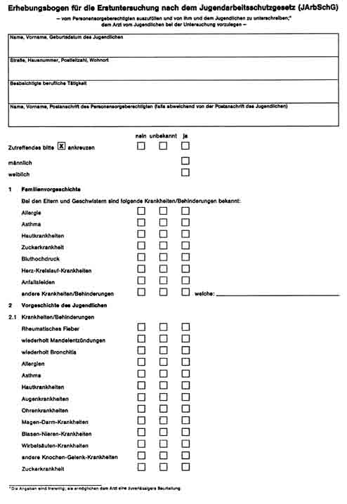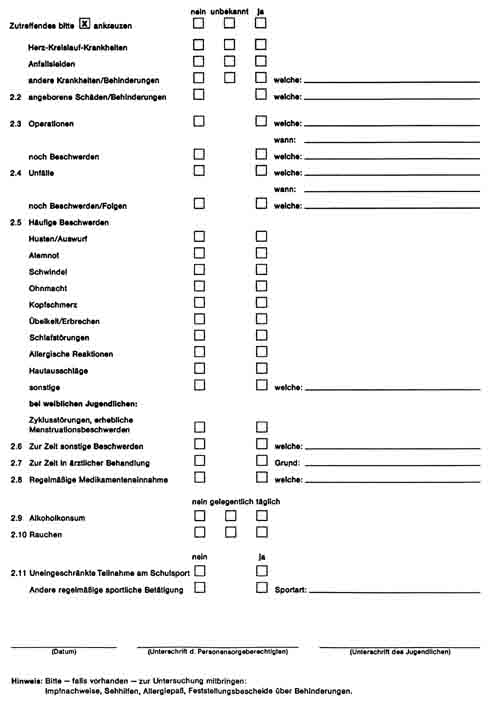
(Farbe rot)

## Anlage 1a Erhebungsbogen für die Nachuntersuchung nach dem Jugendschutzgesetz (JArbSchG)

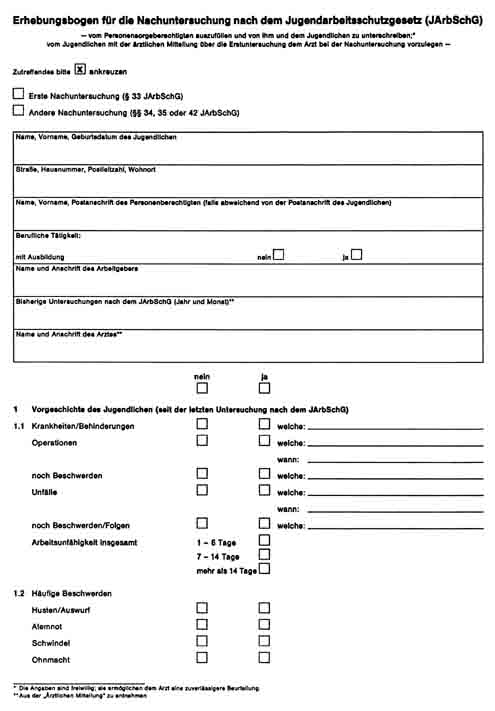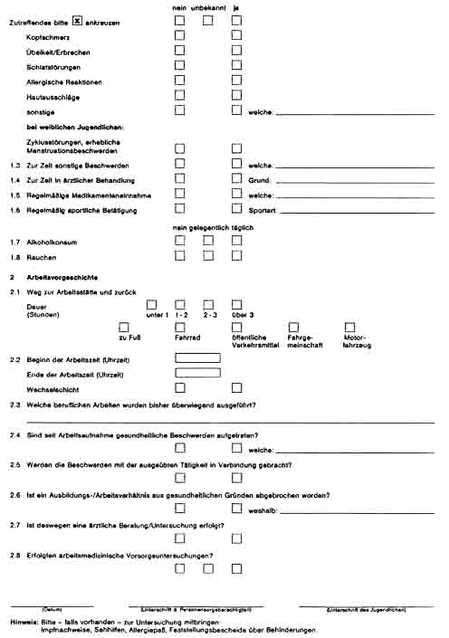
Zum Verbleib beim Untersuchenden Arzt

## Anlage 2 Untersuchungsbogen

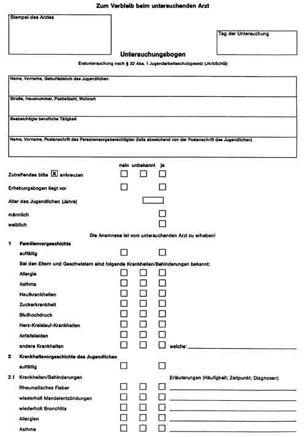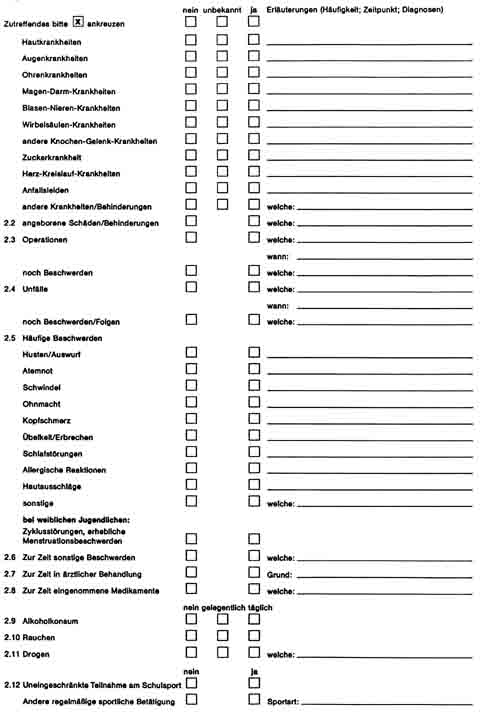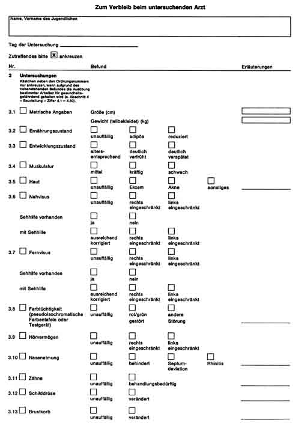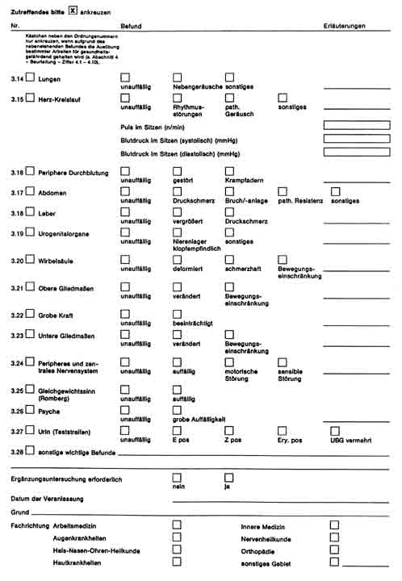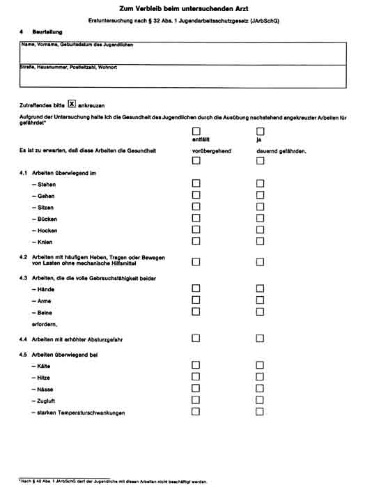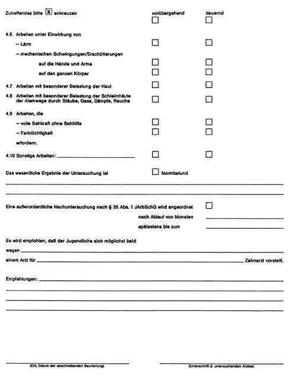
(Farbe rot)
Zum Verbleib beim untersuchenden Arzt

## Anlage 2a Untersuchungsbogen

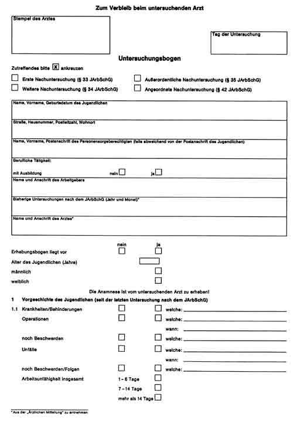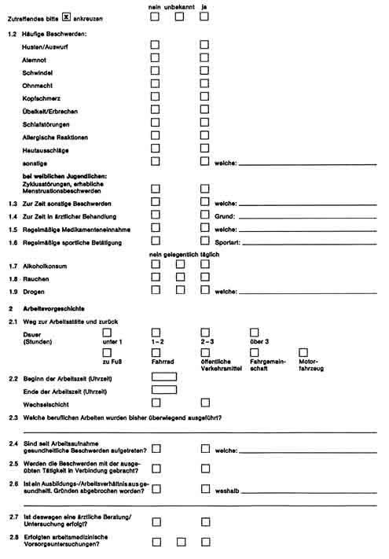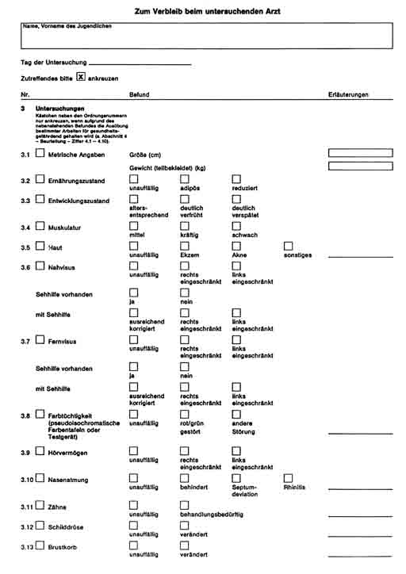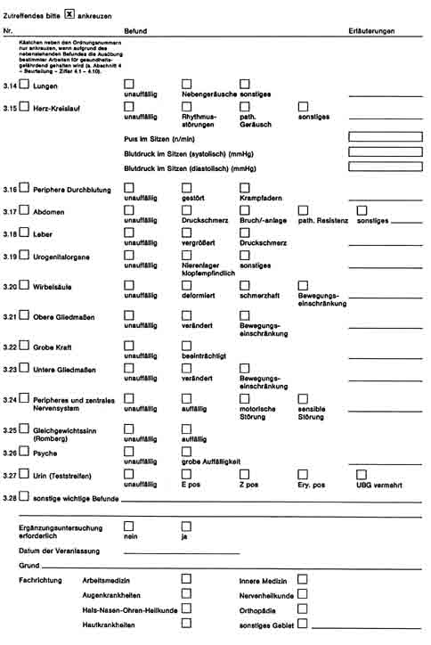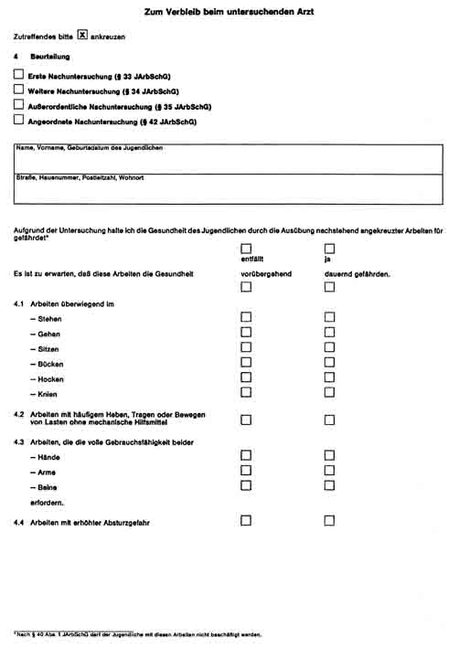

## Anlage 3 Ärztliche Mitteilung an den Personensorgeberechtigten

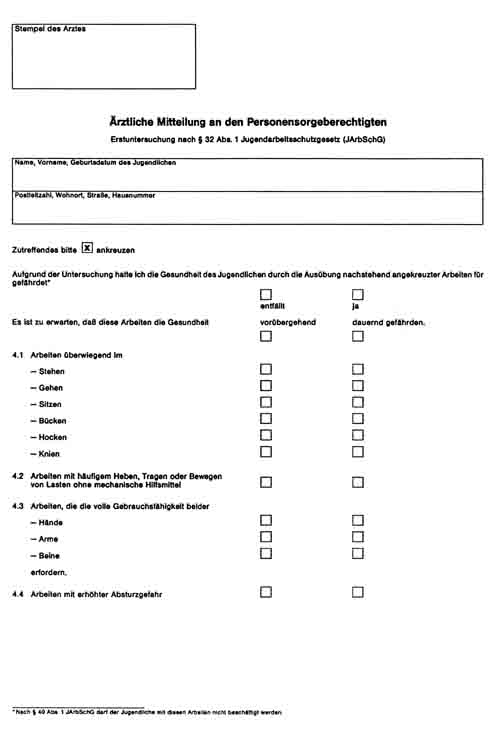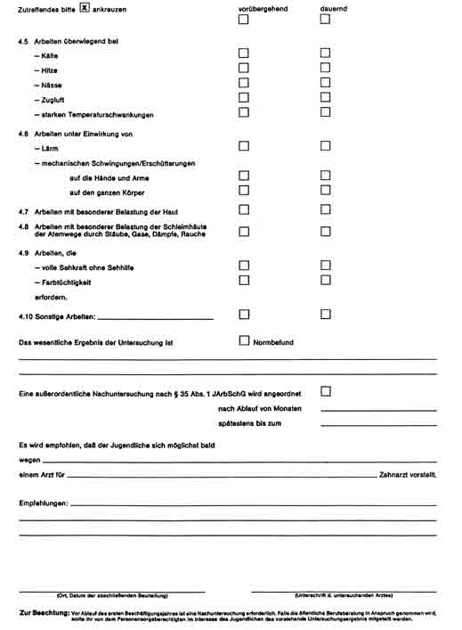
(Farbe rot)

## Anlage 3a Ärztliche Mitteilung an den Personensorgeberechtigten

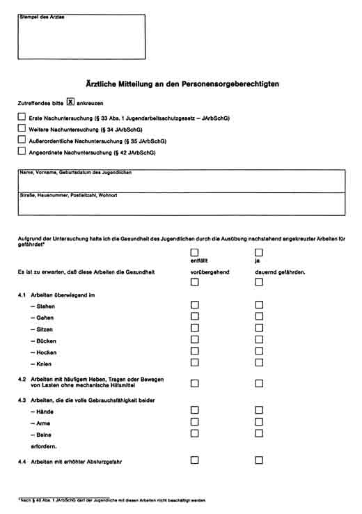

## Anlage 4 Ärztliche Bescheinigung für den Arbeitgeber

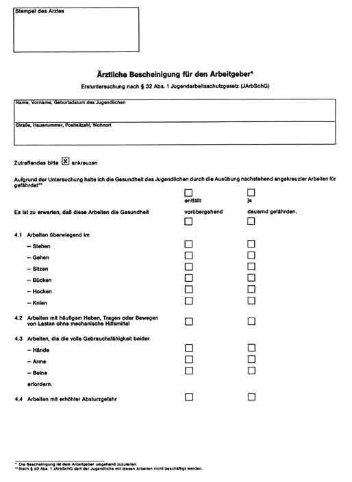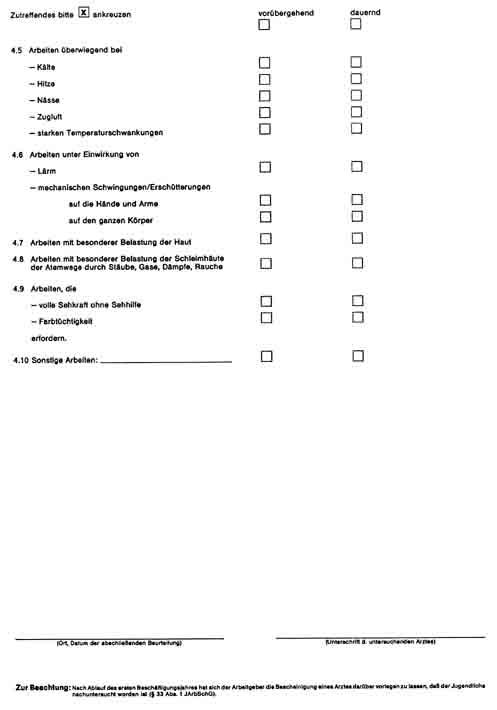
(Farbe rot)

## Anlage 4a Ärztliche Bescheinigung für den Arbeitgeber

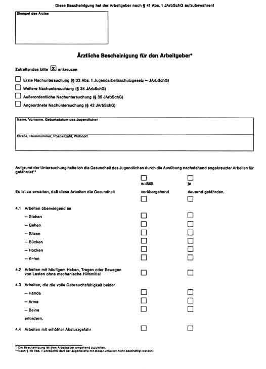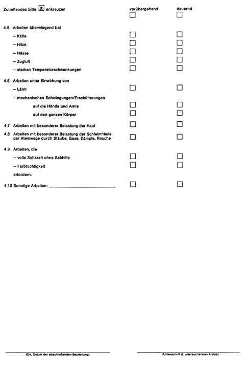
