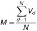

# Verordnung über den Gegenstand der Prüfung und die Inhalte der Prüfungsberichte für externe Kapitalverwaltungsgesellschaften, Investmentaktiengesellschaften, Investmentkommanditgesellschaften und Sondervermögen (KAPrüfbV)

Ausfertigungsdatum
:   2013-07-24

Fundstelle
:   BGBl I: 2013, 2777

Zuletzt geändert durch
:   Art. 10 G v. 19.3.2020 I 529

Änderung durch
:   Art. 17 Abs. 4 G v. 3.6.2021 I 1498 (Nr. 30) textlich nachgewiesen, dokumentarisch noch nicht abschließend bearbeitet

## Eingangsformel

Auf Grund des § 38 Absatz 5 Satz 1, des § 106 Satz 1, des § 121 Absatz
4 Satz 1, dieser auch in Verbindung mit § 148 Absatz 1, und des § 136
Absatz 4 Satz 1, dieser auch in Verbindung mit § 159 Satz 1, des
Kapitalanlagegesetzbuches vom 4. Juli 2013 (BGBl. I S. 1981) in
Verbindung mit § 1 Nummer 3a der Verordnung zur Übertragung von
Befugnissen zum Erlass von Rechtsverordnungen auf die Bundesanstalt
für Finanzdienstleistungsaufsicht, der zuletzt durch Artikel 1 der
Verordnung vom 11. Juli 2013 (BGBl. I S. 2231) geändert worden ist,
verordnet die Bundesanstalt für Finanzdienstleistungsaufsicht im
Einvernehmen mit dem Bundesministerium der Justiz:

## Kapitel 1 - Allgemeine Vorschriften

### § 1 Anwendungsbereich

Diese Verordnung regelt insbesondere

1.  den Gegenstand der Prüfung von externen
    Kapitalverwaltungsgesellschaften, Investmentaktiengesellschaften,
    Investmentkommanditgesellschaften und Sondervermögen nach dem
    Kapitalanlagegesetzbuch,

2.  den Inhalt der Prüfungsberichte sowie

3.  die Art und den Umfang der Berichterstattung.

### § 2 Risikoorientierung und Wesentlichkeit

Bei der Prüfung ist den Grundsätzen der risikoorientierten Prüfung und
der Wesentlichkeit Rechnung zu tragen. Bei der Prüfung von
Kapitalverwaltungsgesellschaften sind insbesondere die Größe der
Gesellschaft sowie der Geschäftsumfang, die Komplexität und der
Risikogehalt der betriebenen Geschäfte zu berücksichtigen.

### § 3 Allgemeine Prüfungs- und Berichtsgrundsätze

(1) Der Prüfungsbericht muss vollständig und übersichtlich gegliedert
sein. Bei den Beurteilungen im Prüfungsbericht sind die
aufsichtsrechtlichen Vorgaben zu beachten. Im Prüfungsbericht
darzulegen sind für die Beurteilung der Tätigkeit der
Kapitalverwaltungsgesellschaft bedeutsame Ereignisse, die nach dem
Bilanzstichtag der Gesellschaft eingetreten und dem Abschlussprüfer
bekannt geworden sind.

(2) Wurde im Berichtszeitraum eine Prüfung gemäß § 14 des
Kapitalanlagegesetzbuches in Verbindung mit § 44 Absatz 1 Satz 2 des
Kreditwesengesetzes durchgeführt, so hat der Abschlussprüfer die
Ergebnisse dieser Prüfung bei der Prüfung der aufsichtlichen
Sachverhalte zu verwerten. Bei Sachverhalten, die Gegenstand der
Prüfung gemäß § 14 des Kapitalanlagegesetzbuches in Verbindung mit §
44 Absatz 1 Satz 2 des Kreditwesengesetzes waren, kann sich die
aufsichtsrechtliche Berichterstattung auf Veränderungen bis zum
Bilanzstichtag der Gesellschaft beschränken.

(3) Soweit die Bundesanstalt für Finanzdienstleistungsaufsicht
(Bundesanstalt) gegenüber der Kapitalverwaltungsgesellschaft
Bestimmungen über den Prüfungsinhalt getroffen oder
Prüfungsschwerpunkte festgesetzt hat, sind im Prüfungsbericht die
insoweit vorgenommenen Prüfungshandlungen im Überblick und die
insoweit vorgenommenen Feststellungen im Einzelnen darzustellen.

(4) Der Umfang der Berichterstattung unterliegt, soweit sich aus den
nachfolgenden Regelungen nichts anderes ergibt, dem pflichtgemäßen
Ermessen des Abschlussprüfers und hat der Bedeutung der dargestellten
Vorgänge zu entsprechen. Über bedeutsame Veränderungen gegenüber dem
letzten Berichtszeitraum ist stets zu berichten.

[^F816665_02_BJNR277700013BJNE000501123]
(5) Der Prüfungsbericht ist vom Abschlussprüfer eigenhändig zu
unterzeichnen. Eine Kopie des unterzeichneten Exemplars, die
insbesondere keine weiteren Zusätze wie etwa die Lesbarkeit
erschwerende Wasserzeichen oder ähnliches enthalten darf, ist der
Bundesanstalt ausschließlich elektronisch über ein von ihr
bereitgestelltes elektronisches Kommunikationsverfahren
zu übermitteln. Berichte über die Prüfung von Spezial-AIF sind der
Bundesanstalt nur einzureichen, wenn diese das verlangt.
[^F816665_01_BJNR277700013BJNE000501123]

    Amtlicher Hinweis: Im Internet abrufbar unter
    https://portal.mvp.bafin.de/MvpPortalWeb/app/login.html
[^F816665_01_BJNR277700013BJNE000501123]:     Amtlicher Hinweis: Im Internet abrufbar unter
    https://portal.mvp.bafin.de/MvpPortalWeb/app/login.html
[^F816665_02_BJNR277700013BJNE000501123]: 

### § 4 Anlagen und Unzulässigkeit von Verweisungen

(1) Für eine bessere Lesbarkeit können Details zu den nach dieser
Verordnung geforderten Angaben in Form von ergänzenden Anlagen zum
Prüfungsbericht vorgelegt werden, wenn die Angaben im Prüfungsbericht
selbst hinreichend dargestellt sind. Details können technische
Einzelheiten zur Ermittlung der Angaben, Übersichten zur
Spezifizierung von Angaben und ergänzende Hinweise zur Erläuterung der
Angaben sein.

(2) Dem Prüfungsbericht als Anlage beizufügen ist eine Kopie des
zugrunde liegenden Jahresabschlusses und Lageberichts oder eine Kopie
des der Prüfung zugrunde liegenden Jahres-, Zwischen-, Auflösungs-
oder Abwicklungsberichts.

(3) Verweisungen auf den Inhalt früherer Prüfungsberichte sind
grundsätzlich nicht zulässig. Zur Vermeidung umfangreicher
Wiederholungen können solche Verweisungen ausnahmsweise erfolgen, wenn
der Abschlussprüfer auf die entsprechenden Feststellungen unter Angabe
der Fundstelle verweist. Verweisungen auf entsprechende Darstellungen
in eigenständigen Teilen des früheren Prüfungsberichts dürfen
ausnahmsweise erfolgen.

## Kapitel 2 - Externe Kapitalverwaltungsgesellschaft

### Abschnitt 1 - Allgemeines

#### § 5 Zusammenfassung der Prüfungsergebnisse

(1) In einer zusammenfassenden Schlussbemerkung zum Prüfungsbericht
ist, soweit dies nicht bereits im Rahmen der dem Bericht
vorangestellten Ausführungen nach § 321 Absatz 1 Satz 2 des
Handelsgesetzbuchs erfolgt ist, auf alle wesentlichen Fragen
einzugehen, so dass aus der Schlussbemerkung ein Überblick über die
wirtschaftliche Lage der externen Kapitalverwaltungsgesellschaft und
die Einhaltung der aufsichtsrechtlichen Vorgaben gewonnen werden kann.
Hinsichtlich der wirtschaftlichen Lage ist insbesondere auf die
geschäftliche Entwicklung sowie auf die Vermögens-, Finanz- und
Ertragslage einzugehen.

(2) Der zusammenfassenden Schlussbemerkung muss auch zu entnehmen
sein, ob

1.  die Bilanzposten ordnungsgemäß bewertet wurden, insbesondere ob die
    vorgenommenen Wertberichtigungen und die gebildeten Rückstellungen
    angemessen sind,

2.  die Rechnungsabgrenzungsposten richtig berechnet sind und

3.  die Vorschriften des Geldwäschegesetzes sowie die Anzeige- und
    Meldevorschriften eingehalten wurden.

(3) Der Prüfungsbericht ist unter Angabe von Ort und Datum vom
Abschlussprüfer eigenhändig zu unterzeichnen.

#### § 6 Berichtszeitraum

Der Zeitraum, auf den sich die Prüfung erstreckt (Berichtszeitraum),
ist in der Regel das am Stichtag des Jahresabschlusses
(Bilanzstichtag) endende Geschäftsjahr (Berichtsjahr). Bei vom
Geschäftsjahr abweichenden Berichtszeiträumen muss der Prüfungsbericht
mindestens das Geschäftsjahr umfassen, das am Bilanzstichtag endet.
Wurde die Prüfung unterbrochen, ist in dem Bericht darauf hinzuweisen
und sind die Dauer und die Gründe der Unterbrechung darzulegen.

#### § 7 Prüfungs- und Berichtsgrundsätze für externe Kapitalverwaltungsgesellschaften

Der Bericht über die Prüfung der externen
Kapitalverwaltungsgesellschaft ist so zu verfassen, dass er den für
die Prüfung eines Investmentvermögens zuständigen Abschlussprüfer in
die Lage versetzt, den Bericht im Rahmen seiner Prüfung zu verwerten.
Die für den Abschlussprüfer des Investmentvermögens relevanten
Prüfungsergebnisse können in einem gesonderten Teil des Berichts
zusammengefasst werden.

#### § 8 Darstellung der rechtlichen, wirtschaftlichen und organisatorischen Grundlagen

(1) Im Prüfungsbericht ist zu berichten

1.  über die Ausschöpfung und eine Überschreitung der Erlaubnis zum
    Betreiben des Geschäfts einer externen Kapitalverwaltungsgesellschaft
    und zur Erbringung von Dienst- und Nebendienstleistungen nach § 20
    Absatz 2 und 3 des Kapitalanlagegesetzbuches im Berichtszeitraum und

2.  über die Einhaltung der damit verbundenen Auflagen im
    Berichtszeitraum.

(2) Darzustellen sind die wesentlichen Änderungen der rechtlichen,
wirtschaftlichen und organisatorischen Grundlagen der externen
Kapitalverwaltungsgesellschaft im Berichtszeitraum, wobei insbesondere
zu berichten ist über

1.  Änderungen der Rechtsform und der Satzung oder des
    Gesellschaftsvertrages,

2.  Änderungen der Kapitalverhältnisse und der Gesellschafterverhältnisse,

3.  Änderungen in der personellen Zusammensetzung der Geschäftsleitung und
    Änderungen der Zuständigkeit der einzelnen Geschäftsleiter,

4.  Änderungen der Struktur des Geschäftsbetriebs einer externen
    Kapitalverwaltungsgesellschaft, der Struktur der erbrachten
    Dienstleistungen und Nebendienstleistungen nach § 20 Absatz 2 und 3
    des Kapitalanlagegesetzbuches,

5.  die bevorstehende Aufnahme neuer Geschäftszweige,

6.  Änderungen der rechtlichen und geschäftlichen Beziehungen zu
    verbundenen Unternehmen, über wirtschaftlich bedeutsame Verträge
    geschäftspolitischer Natur, die die zwischenbetriebliche
    Zusammenarbeit regeln, wobei insbesondere Angaben über Art und Umfang
    der vereinbarten Leistungen zu machen sind; die Berichterstattung kann
    entfallen, soweit für den Berichtszeitraum ein Abhängigkeitsbericht
    nach § 312 des Aktiengesetzes erstellt und der Bundesanstalt
    eingereicht wurde,

7.  Änderungen im organisatorischen Aufbau der externen
    Kapitalverwaltungsgesellschaft und Änderungen der unter Risikoaspekten
    bedeutsamen Ablauforganisation; das aktuelle Organigramm ist dem
    Prüfungsbericht als Anlage beizufügen.

(3) Über wesentliche auf andere Unternehmen ausgelagerte Aufgaben ist
im Prüfungsbericht gesondert zu berichten, soweit die
Berichterstattung nicht nach § 22 Absatz 5 zu erfolgen hat.

(4) Die Ordnungsmäßigkeit der Geschäftsorganisation, insbesondere die
Geeignetheit der Regelungen bei persönlichen Geschäften der
Mitarbeiter zur Verhinderung von Missbrauch sowie die Angemessenheit
der Kontroll- und Sicherheitsvorkehrungen für den Einsatz der
elektronischen Datenverarbeitung, ist zu beurteilen, soweit dies nicht
die Verwaltung der Investmentvermögen betrifft.

(5) Soweit der Abschlussprüfer nur verpflichtet ist, über Änderungen
zu berichten, hat er darüber hinaus in angemessenen Abständen
vollständig zu berichten. Angemessene Abstände sind in der Regel drei
bis fünf Jahre.

#### § 9 Ausländische Zweigstellen und Zweigniederlassungen

Der Abschlussprüfer hat im Prüfungsbericht über die ausländischen
Zweigstellen und Zweigniederlassungen zu berichten und deren
Einbindung in die Geschäftsorganisation der externen
Kapitalverwaltungsgesellschaft zu beurteilen. Dabei sind für diese
Zweigniederlassungen und Zweigstellen deren Ergebniskomponenten, deren
Einfluss auf das Risikoprofil sowie die Risikolage und die
Risikovorsorge der Gesellschaft insgesamt sowie deren Einbindung in
das Risikomanagement zu beurteilen.

### Abschnitt 2 - Aufsichtsrechtliche Vorgaben

#### Unterabschnitt 1 - Kapitalanforderungen, Anzeigewesen und Meldepflichten

##### § 10 Eigenmittel

(1) Im Prüfungsbericht darzustellen sind die Höhe und die
Zusammensetzung der Eigenmittel der externen
Kapitalverwaltungsgesellschaft nach dem Stand bei Geschäftsschluss am
Bilanzstichtag und unter der Annahme der Feststellung des geprüften
Abschlusses. Es ist zu berichten, ob die Anforderungen des § 25 Absatz
1 Nummer 2 des Kapitalanlagegesetzbuches im Berichtszeitraum
eingehalten wurden.

(2) Im Prüfungsbericht ist zu beurteilen, ob die Eigenmittelrelation
nach § 25 Absatz 4 des Kapitalanlagegesetzbuches im Berichtszeitraum
und am Bilanzstichtag eingehalten wurde.

(3) Im Fall des § 25 Absatz 5 des Kapitalanlagegesetzbuches ist zu
beurteilen, ob die Vorkehrungen angemessen sind, die die externe
Kapitalverwaltungsgesellschaft zur Ermittlung von Anrechnungsbeträgen
für Risiken aus den in § 25 Absatz 5 des Kapitalanlagegesetzbuches
genannten Geschäften getroffen hat. Dabei ist insbesondere auf
Änderungen gegenüber dem letzten Berichtszeitraum einzugehen.
Darzustellen ist das Verhältnis zwischen den Anrechnungsbeträgen nach
Satz 1 und den anrechenbaren Eigenmitteln der externen
Kapitalverwaltungsgesellschaft zum Bilanzstichtag sowie dessen
Entwicklung im Berichtszeitraum. Liegen mehrere unterschiedliche
Geschäftsgestaltungen, die in § 25 Absatz 5 des
Kapitalanlagegesetzbuches genannt werden, vor, so sind die
Anrechnungsbeträge darüber hinaus angemessen nach
Geschäftsgestaltungen zu untergliedern.

(4) Entscheidet sich die externe AIF-Kapitalverwaltungsgesellschaft
dafür, potenzielle Berufshaftungsrisiken durch zusätzliche Eigenmittel
im Sinne des § 25 Absatz 6 Nummer 1 des Kapitalanlagegesetzbuches
abzudecken, so sind die Höhe und die Zusammensetzung der zusätzlichen
Eigenmittel darzustellen.

(5) Entscheidet sich die externe AIF-Kapitalverwaltungsgesellschaft
dafür, potenzielle Berufshaftungsrisiken durch eine
Berufshaftpflichtversicherung im Sinne des § 25 Absatz 6 Nummer 2 des
Kapitalanlagegesetzbuches abzudecken, so ist zu beurteilen, ob die
Anforderungen des Artikels 15 der Delegierten Verordnung (EU) Nr.
231/2013 der Kommission vom 19. Dezember 2012 zur Ergänzung der
Richtlinie 2011/61/EU des Europäischen Parlaments und des Rates im
Hinblick auf Ausnahmen, die Bedingungen für die Ausübung der
Tätigkeit, Verwahrstellen, Hebelfinanzierung, Transparenz und
Beaufsichtigung (ABl. L 83 vom 22.3.2013, S. 1) eingehalten wurden.

(6) Im Prüfungsbericht aufzuführen sind die Anzahl der Fälle von
operationellem Versagen sowie die Summe der erlittenen Verluste und
die Anzahl der eingetretenen Schäden, die in der Verlustdatenbank im
Sinne des Artikels 13 Absatz 2 der Verordnung (EU) Nr. 231/2013 im
Berichtszeitraum erfasst wurden.

##### § 11 Anzeigewesen und Meldepflichten

Im Prüfungsbericht ist die Organisation des Anzeigewesens der
Kapitalverwaltungsgesellschaft zu beurteilen. Es ist darauf
einzugehen, ob die Anzeigen, insbesondere die nach § 34 des
Kapitalanlagegesetzbuches, sowie die Meldungen nach den §§ 12 und 35
des Kapitalanlagegesetzbuches vollständig und richtig sind. Wurden
wesentliche Verstöße gegen die Anzeigen- und Meldepflichten
festgestellt, sind diese Verstöße anzugeben.

#### Unterabschnitt 2 - Vorkehrungen zur Verhinderung von Geldwäsche und von Terrorismusfinanzierung

##### § 12 Prüfungszeitraum und Berichtszeitraum

(1) Die Prüfung gemäß § 38 Absatz 4 Satz 1 des
Kapitalanlagegesetzbuches ist erstmals für das erste volle
Geschäftsjahr nach dem Zeitpunkt der Aufnahme des erlaubnispflichtigen
Geschäftsbetriebs nach § 20 des Kapitalanlagegesetzbuches vorzunehmen.
Danach findet die Prüfung in zweijährigem Turnus statt, es sei denn,
die Risikolage der externen Kapitalverwaltungsgesellschaft erfordert
einen kürzeren Prüfungsturnus. Der Abschlussprüfer legt den Beginn der
Prüfung und den Berichtszeitraum nach pflichtgemäßem Ermessen fest,
soweit sich aus den nachfolgenden Regelungen nichts anderes ergibt.

(2) Der Berichtszeitraum der Prüfung ist jeweils der Zeitraum zwischen
dem Stichtag der letzten Prüfung und dem Stichtag der folgenden
Prüfung.

(3) Die Prüfung hat spätestens drei Monate nach dem Abschluss des für
sie maßgeblichen Berichtszeitraums zu beginnen.

##### § 13 Darstellung und Beurteilung der getroffenen Vorkehrungen zur Verhinderung von Geldwäsche und von Terrorismusfinanzierung

(1) Der Abschlussprüfer hat im Prüfungsbericht zu beurteilen, ob die
Gefährdungsanalyse, die die externe Kapitalverwaltungsgesellschaft
erstellt hat, der Risikosituation der externen
Kapitalverwaltungsgesellschaft entspricht.

(2) Darüber hinaus hat der Abschlussprüfer darzustellen, welche
organisatorischen Maßnahmen zur Verhinderung von Geldwäsche und von
Terrorismusfinanzierung die externe Kapitalverwaltungsgesellschaft
getroffen hat, und zu beurteilen, ob diese Maßnahmen angemessen sind.
Dabei ist insbesondere einzugehen

1.  auf die von der externen Kapitalverwaltungsgesellschaft entwickelten
    und aktualisierten internen Grundsätze sowie auf die angemessenen
    geschäfts- und kundenbezogenen Sicherungssysteme und Kontrollen zur
    Verhinderung von Geldwäsche und von Terrorismusfinanzierung,

2.  darauf, ob die Beschäftigten, die Transaktionen durchführen und
    Transaktionen anbahnen und begründen, angemessen über die Methoden der
    Geldwäsche und der Terrorismusfinanzierung sowie deren Verhinderung
    und die damit zusammenhängenden Pflichten unterrichtet werden.

Bei der Prüfung hat der Abschlussprüfer die von der externen
Kapitalverwaltungsgesellschaft erstellte Gefährdungsanalyse sowie die
von der internen Revision im Berichtszeitraum durchgeführte Prüfung
und deren Ergebnis zu berücksichtigen.

(3) Der Abschlussprüfer hat darzustellen und zu beurteilen, inwieweit
die externe Kapitalverwaltungsgesellschaft den kundenbezogenen
Sorgfaltspflichten nachgekommen ist, insbesondere auch den verstärkten
Sorgfaltspflichten in Fällen eines erhöhten Risikos. Sofern die
externe Kapitalverwaltungsgesellschaft die Durchführung von internen
Sicherungsmaßnahmen oder die Wahrnehmung von kundenbezogenen
Sorgfaltspflichten vertraglich auf eine dritte Person oder ein anderes
Unternehmen ausgelagert hat, ist hierüber zu berichten.

(4) Der Abschlussprüfer hat zu berichten, ob die Aufzeichnungs- und
Aufbewahrungspflichten sowie die Pflicht, Verdachtsfälle intern zu
erfassen und anzuzeigen, erfüllt wurden.

(5) Bei einer externen Kapitalverwaltungsgesellschaft, die selbst
nicht Tochterunternehmen eines Instituts oder eines nach dem
Geldwäschegesetz verpflichteten Versicherungsunternehmens ist, aber
Tochterunternehmen oder ausländische Zweigstellen oder
Zweigniederlassungen besitzt, hat der Abschlussprüfer

1.  darzustellen, welche Maßnahmen die externe
    Kapitalverwaltungsgesellschaft getroffen hat, um

    a)  einheitliche interne Sicherungsmaßnahmen zu schaffen und

    b)  die Sorgfaltspflichten sowie die Aufzeichnungs- und
        Aufbewahrungspflichten zur Verhinderung von Geldwäsche und von
        Terrorismusfinanzierung einzuhalten, und

2.  zu beurteilen, ob diese Maßnahmen angemessen sind.

Die Darstellung nach Satz 1 Nummer 1 hat zu erfolgen, soweit sie
zulässig ist nach dem Recht des betroffenen Staates, in dem das
Tochterunternehmen, die Zweigstelle oder die Zweigniederlassungen
ansässig ist. Soweit die nach Satz 1 zu treffenden Maßnahmen in einem
Drittstaat nicht zulässig sind, hat der Abschlussprüfer ferner
darzustellen, welche anderweitigen Maßnahmen die externe
Kapitalverwaltungsgesellschaft stattdessen ergriffen hat, und zu
beurteilen, ob diese Maßnahmen angemessen sind, um einem erhöhten
Risiko der Geldwäsche und Terrorismusfinanzierung wirksam zu begegnen.
Absatz 2 Satz 3 und Absatz 3 Satz 2 gelten entsprechend.

(6) Bei einer externen Kapitalverwaltungsgesellschaft ist
darzustellen, inwieweit diese ihre Verpflichtungen nach § 18 Absatz 6
des Kapitalanlagegesetzbuches in Verbindung mit § 24c Absatz 1 des
Kreditwesengesetzes erfüllt hat. Insbesondere ist zu prüfen, ob die
hierzu eingesetzten Verfahren eine zutreffende Erfassung der
aufgenommenen Identifizierungsdaten mit richtiger Zuordnung zum Depot
im Abrufsystem gewährleisten. Gegebenenfalls ist zu berichten, ob die
Anordnungen der Bundesanstalt gemäß § 6a des Kreditwesengesetzes
ordnungsgemäß erfüllt wurden.

#### Unterabschnitt 3 - Vorkehrungen zur Einhaltung der Verordnung (EU) Nr. 648/2012

##### § 14 Pflichten nach der Verordnung (EU) Nr. 648/2012

(1) Der Abschlussprüfer hat die Verfahren zur Ermittlung aller OTC-
Derivate-Kontrakte, die einer Clearingpflicht durch eine zentrale
Gegenpartei unterliegen, und die Einhaltung der Clearingpflicht zu
beurteilen. Sind gruppeninterne Transaktionen von der Clearingpflicht
durch die Bundesanstalt befreit, so sind die organisatorischen
Maßnahmen zur Einhaltung der damit verbundenen Voraussetzungen zu
beurteilen.

(2) Der Abschlussprüfer hat die Erfüllung der Unterrichtungspflichten
nach Artikel 4a Absatz 1 Unterabsatz 2 Buchstabe a und nach Artikel 9
Absatz 1 bis 3 der Verordnung (EU) Nr. 648/2012 des Europäischen
Parlaments und des Rates vom 4. Juli 2012 über OTC-Derivate, zentrale
Gegenparteien und Transaktionsregister (ABl. L 201 vom 27.7.2012, S.
1), die zuletzt durch die Verordnung (EU) 2019/834 (ABl. L 141 vom
28\.5.2019, S. 42) geändert worden ist, auch in Verbindung mit einer
aufgrund des § 31 Satz 1 des Wertpapierhandelsgesetzes erlassenen
Rechtsverordnung, zu beurteilen.

(3) Der Abschlussprüfer hat die Risikominderungstechniken für OTC-
Derivate-Kontrakte, die nicht einer Clearingpflicht durch eine
zentrale Gegenpartei unterliegen, nach Artikel 11 der Verordnung (EU)
Nr. 648/2012 auch in Verbindung mit nach Artikel 11 Absatz 14 und 15
der Verordnung (EU) Nr. 648/2012 erlassenen delegierten
Rechtsverordnungen darzustellen und zu beurteilen. Dazu hat der
Abschlussprüfer

1.  die Prozesse zur Identifizierung und Klärung bei Geschäften, die nicht
    von einer Gegenpartei bestätigt wurden, und die Prozesse zum Abgleich
    von Portfolios zu beurteilen und

2.  darzustellen, ob und in welchem Umfang von der Möglichkeit der
    Portfoliokomprimierung Gebrauch gemacht wurde.

(4) Soweit die Besicherung gruppeninterner Transaktionen nach Artikel
11 Absatz 5 der Verordnung (EU) Nr. 648/2012 als nicht notwendig
erachtet wurde, ist zu beurteilen, ob die Voraussetzungen für die
Ausnahme von dieser Besicherungspflicht vorliegen. Wurde eine
gruppeninterne Transaktion von der Besicherungspflicht durch die
Bundesanstalt befreit, so ist zu beurteilen, ob die organisatorischen
Maßnahmen angemessen sind zur Gewährleistung, dass die Voraussetzungen
für diese Befreiung vorliegen, einschließlich der
Veröffentlichungspflicht nach Artikel 11 Absatz 11 der Verordnung (EU)
Nr. 648/2012 auch in Verbindung mit Artikel 20 der Delegierten
Verordnung (EU) Nr. 149/2013 der Kommission vom 19. Dezember 2012 zur
Ergänzung der Verordnung (EU) Nr. 648/2012 des Europäischen Parlaments
und des Rates im Hinblick auf technische Regulierungsstandards für
indirekte Clearingvereinbarungen, die Clearingpflicht, das öffentliche
Register, den Zugang zu einem Handelsplatz, nichtfinanzielle
Gegenparteien und Risikominderungstechniken für nicht durch eine CCP
geclearte OTC-Derivatekontrakte (ABl. L 52 vom 23.2.2013, S. 11).

(5) Darüber hinaus hat der Abschlussprüfer die Besicherung bilateraler
Kontrakte darzustellen und zu beurteilen.

##### § 14a Einhaltung der Pflichten nach der Verordnung (EU) 2019/2088 und nach der Verordnung (EU) 2020/852

Der Abschlussprüfer hat die Erfüllung der Transparenzanforderungen

1.  nach den Artikeln 3 bis 13 der Verordnung (EU) 2019/2088 des
    Europäischen Parlaments und des Rates vom 27. November 2019 über
    nachhaltigkeitsbezogene Offenlegungspflichten im
    Finanzdienstleistungssektor (ABl. L 317 vom 9.12.2019, S. 1), die
    durch die Verordnung (EU) 2020/852 (ABl. L 198 vom 22.6.2020, S. 13)
    geändert worden ist, und

2.  nach den Artikeln 5 bis 7 der Verordnung (EU) 2020/852 des
    Europäischen Parlaments und des Rates vom 18. Juni 2020 über die
    Einrichtung eines Rahmens zur Erleichterung nachhaltiger Investitionen
    und zur Änderung der Verordnung (EU) 2019/2088 (ABl. L 198 vom
    22\.6.2020, S. 13),

zu beurteilen.

### Abschnitt 3 - Abschlussorientierte Berichterstattung

#### Unterabschnitt 1 - Lage der externen Kapitalverwaltungsgesellschaft

##### § 15 Geschäftliche Entwicklung im Berichtsjahr

Im Prüfungsbericht ist die geschäftliche Entwicklung der externen
Kapitalverwaltungsgesellschaft darzustellen und zu erläutern. Dabei
sind die die geschäftliche Entwicklung kennzeichnenden Zahlen des
Berichtsjahres und die des Vorjahres gegenüberzustellen.

##### § 16 Beurteilung der Vermögens- und Finanzlage

(1) Im Prüfungsbericht ist die Entwicklung der Vermögens- und
Finanzlage zu beurteilen. Besonderheiten, die für die Beurteilung der
Vermögens- und Finanzlage von Bedeutung sind, insbesondere Art und
Umfang bilanzunwirksamer Ansprüche und Verpflichtungen, sind
hervorzuheben.

(2) Die Berichterstattung hat sich auch zu erstrecken auf

1.  Art und Umfang stiller Reserven und stiller Lasten,

2.  bedeutende Verträge und schwebende Rechtsstreitigkeiten, soweit sich
    nachteilige Auswirkungen auf die Vermögenslage ergeben könnten, und
    auf die Bildung der notwendigen Rückstellungen,

3.  alle abgegebenen Patronatserklärungen unter Darstellung des Inhalts
    und auf die Beurteilung ihrer Rechtsverbindlichkeit.

(3) Über die Anlage des eigenen Vermögens der externen
Kapitalverwaltungsgesellschaft ist unter Berücksichtigung des § 28
Absatz 1 Satz 2 Nummer 4 des Kapitalanlagegesetzbuches zu berichten.

##### § 17 Beurteilung der Ertragslage

(1) Im Prüfungsbericht ist die Entwicklung der Ertragslage zu
beurteilen.

(2) Auch über die Ertragslage der wesentlichen Geschäftssparten ist
auf der Basis der Unterlagen der externen
Kapitalverwaltungsgesellschaft zu berichten; dabei sind jeweils die
wichtigsten Erfolgsquellen und Erfolgsfaktoren gesondert darzustellen.
Soweit keine Spartenkalkulation vorhanden ist, ist es ausreichend, auf
entsprechende vorhandene interne Informationen der Geschäftsleitung
zurückzugreifen.

##### § 18 Risikolage

(1) Im Prüfungsbericht ist die Risikolage der externen
Kapitalverwaltungsgesellschaft zu beurteilen. Dazu sind die von der
externen Kapitalverwaltungsgesellschaft verwendeten
Bewertungsverfahren darzustellen und ist zu beurteilen, ob die
eingesetzten Systeme, Verfahren und Regelungen angemessen sind, um die
finanzielle Lage der externen Kapitalverwaltungsgesellschaft zu
bestimmen.

(2) Ferner ist auf Anzahl und Umfang von Kulanzzahlungen und
Gerichtsverfahren im Zusammenhang mit der Verwaltung von
Investmentvermögen sowie auf die Anzahl von Kundenbeschwerden
einzugehen.

#### Unterabschnitt 2 - Erläuterungen zur Rechnungslegung

##### § 19 Erläuterungen

Ob und inwieweit im Prüfungsbericht

1.  die Bilanzposten einschließlich Eventualverbindlichkeiten und anderen
    Verbindlichkeiten,

2.  die Angaben unter dem Bilanzstrich und

3.  die Posten der Gewinn- und Verlustrechnung

zu erläutern und mit den Vorjahreszahlen zu vergleichen sind,
unterliegt dem pflichtgemäßen Ermessen des Abschlussprüfers unter
Berücksichtigung des Grundsatzes der Wesentlichkeit.

##### § 20 Datenübersicht

Dem Prüfungsbericht ist das auszufüllende Formblatt mit Angaben zum
Berichtsjahr und zum Vorjahr gemäß Anlage 1 beizufügen. Das Formblatt
ist Bestandteil des Prüfungsberichts.

### Abschnitt 4 - Verwaltung von Sondervermögen und extern verwalteten Investmentgesellschaften

#### § 21 Berichtszeitraum

(1) Die Berichterstattung nach diesem Abschnitt kann nach
pflichtgemäßem Ermessen des Abschlussprüfers in Abstimmung mit der
externen Kapitalverwaltungsgesellschaft zu einem früheren Zeitpunkt
als dem nach § 12 Absatz 3 in einem gesonderten Berichtsteil erfolgen,
jedoch nicht vor dem Ende der ersten Hälfte des Geschäftsjahres.
Dieser Berichtsteil ist der Bundesanstalt unverzüglich nach
Fertigstellung einzureichen.

(2) Ergeben sich bis zum Ende des Berichtszeitraums wesentliche
Änderungen bei den Ergebnissen eines Berichtsteils nach Absatz 1, ist
über diese Änderung zu berichten.

#### § 22 Allgemeine Verhaltensregeln und Organisationspflichten einschließlich Risikomanagement

(1) Der Abschlussprüfer hat im Prüfungsbericht darzustellen und zu
beurteilen, inwieweit die allgemeinen Verhaltensregeln nach § 26 des
Kapitalanlagegesetzbuches eingehalten wurden und welche Vorkehrungen
die externe Kapitalverwaltungsgesellschaft zur Vermeidung von
Interessenkonflikten nach § 27 des Kapitalanlagegesetzbuches getroffen
hat.

(2) Der Abschlussprüfer hat zu beurteilen, ob die
Geschäftsorganisation gemäß § 28 des Kapitalanlagegesetzbuches
ordnungsgemäß funktioniert. Dabei ist insbesondere über die
wesentlichen Geschäftsprozesse in den Funktionen Portfolioverwaltung,
Investmentkontrolle, Fondsbuchhaltung und Ermittlung der Anteilwerte
sowie über die dort eingesetzten Datenverarbeitungssysteme zu
berichten.

(3) Der Abschlussprüfer hat zu beurteilen, ob das Risikomanagement
gemäß § 28 Absatz 1 Satz 2 Nummer 1 des Kapitalanlagegesetzbuches
angemessen ist; dabei sind die Komplexität und der Umfang der für die
verwalteten Investmentvermögen eingegangenen Risiken zu
berücksichtigen. Bei seiner Beurteilung hat er insbesondere einzugehen
auf

1.  Adressenausfallrisiken,

2.  Zinsänderungs-, Währungs- und sonstige Marktpreisrisiken,

3.  operationelle Risiken und Liquiditätsrisiken sowie

4.  die Anforderungen der Derivateverordnung.

(4) Der Abschlussprüfer hat zu beurteilen, ob das
Liquiditätsmanagementsystem angemessen ist. Dazu hat er die Verfahren
zur Überwachung der Liquiditätsrisiken und das Liquiditätsprofil
darzustellen und über die Durchführung und das Ergebnis der
Stresstests zu berichten.

(5) Der Abschlussprüfer hat zu beurteilen, ob die Voraussetzungen für
eine Auslagerung von Teilbereichen der Geschäftsorganisation
vorliegen. Über die Auslagerung der Portfolioverwaltung oder des
Risikomanagements auf andere Unternehmen hat er im Prüfungsbericht
gesondert unter Berücksichtigung des § 36 des
Kapitalanlagegesetzbuches zu berichten.

(6) Der Abschussprüfer hat zu beurteilen, ob das Kontrollverfahren und
die interne Revision der externen Kapitalverwaltungsgesellschaft
angemessen sind.

### Abschnitt 5 - Dienstleistungen und Nebendienstleistungen

#### § 23 Besondere Anforderungen an die Prüfung von Dienstleistungen und von Nebendienstleistungen

(1) Der Abschlussprüfer hat im Prüfungsbericht die Dienstleistungen
und Nebendienstleistungen im Sinne des § 20 Absatz 2 und 3 des
Kapitalanlagegesetzbuches zu prüfen und festzustellen, ob die
Vorschriften des Kapitalanlagegesetzbuches eingehalten wurden. Bei der
Erbringung von Dienstleistungen und Nebendienstleistungen im Sinne des
§ 20 Absatz 2 Nummer 1 bis 3 und Absatz 3 Nummer 2 bis 5 des
Kapitalanlagegesetzbuches hat er auch zu prüfen, ob die in § 5 Absatz
2 des Kapitalanlagegesetzbuches genannten Vorschriften des
Wertpapierhandelsgesetzes eingehalten wurden. Die Prüfung muss den
gesamten Berichtszeitraum erfassen und in einem angemessenen
Verhältnis zum Umfang der jeweiligen Geschäfte und Aufgaben stehen.

(2) Im Prüfungsbericht sind im Einzelnen, sofern nach der Art der
erbrachten Dienstleistungen und Nebendienstleistungen im Sinne des §
20 Absatz 2 Nummer 1 bis 3 und Absatz 3 Nummer 2 bis 5 des
Kapitalanlagegesetzbuches einschlägig, darzustellen:

1.  Art und Umfang der im Berichtszeitraum ausgeführten Dienstleistungen
    und Nebendienstleistungen, insbesondere Depotvolumina,
    Transaktionsvolumina, Kundenzahl und Anlageformen;

2.  die Einhaltung der allgemeinen Verhaltensregeln nach § 31 des
    Wertpapierhandelsgesetzes und nach § 26 Absatz 4 des
    Kapitalanlagegesetzbuches;

3.  die Zulässigkeit der Entgegennahme oder der Gewährung von Zuwendungen
    und die Einhaltung der Offenlegungspflichten nach § 31d des
    Wertpapierhandelsgesetzes;

4.  die nach den §§ 31a und 33 des Wertpapierhandelsgesetzes
    erforderlichen Vorkehrungen und Maßnahmen sowie die Organisation der
    externen Kapitalverwaltungsgesellschaft, insbesondere im Hinblick auf
    die Kundeneinstufung, und die prüferische Beurteilung dieser
    Vorkehrungen und Maßnahmen sowie der Organisation; gesondert
    dazustellen sind der Aufbau und die Ablauforganisation der externen
    Kapitalverwaltungsgesellschaft sowie Geschäftsbereiche mit besonderen
    Anforderungen an den Aufbau;

5.  die Anzahl und der Umfang von Kulanzzahlungen und Gerichtsverfahren im
    Zusammenhang mit Dienstleistungen und Nebendienstleistungen sowie die
    Anzahl und die Art und Weise der Behandlung von Kundenbeschwerden und
    die damit zusammenhängenden personellen und organisatorischen
    Konsequenzen;

6.  die Vorkehrungen zur bestmöglichen Ausführung von Kundenaufträgen nach
    § 33a des Wertpapierhandelsgesetzes; die Vorkehrungen sind prüferisch
    zu beurteilen;

7.  die Mittel und Verfahren zur Einhaltung der Verpflichtungen nach § 33b
    des Wertpapierhandelsgesetzes für Mitarbeiter und Mitarbeitergeschäfte
    und deren prüferische Beurteilung;

8.  die Einhaltung der Aufzeichnungs- und Aufbewahrungspflichten nach § 34
    des Wertpapierhandelsgesetzes und nach den Artikeln 7 und 8 der
    Verordnung (EG) Nr. 1287/2006 der Kommission vom 10. August 2006 zur
    Durchführung der Richtlinie 2004/39/EG des Europäischen Parlaments und
    des Rates betreffend die Aufzeichnungspflichten für Wertpapierfirmen,
    die Meldung von Geschäften, die Markttransparenz, die Zulassung von
    Finanzinstrumenten zum Handel und bestimmte Begriffe im Sinne dieser
    Richtlinie (ABl. L 241 vom 2.9.2006, S. 1);

9.  die Erfüllung der Pflichten nach § 34a des Wertpapierhandelsgesetzes
    unter Angabe,

    a)  inwieweit bei den verwahrenden Instituten oder externen
        Kapitalverwaltungsgesellschaften geprüft wurde, ob die den Kunden
        ausgewiesenen Gelder oder Wertpapiere mit den Salden der
        Treuhandkonten oder Depots übereinstimmen,

    b)  ob bei den verwahrenden Instituten oder den externen
        Kapitalverwaltungsgesellschaften die Voraussetzungen des § 34a des
        Wertpapierhandelsgesetzes vorliegen.

Bei der Darstellung im Prüfungsbericht ist auch, sofern nach der Art
der erbrachten Dienstleistungen oder Nebendienstleistungen
einschlägig, über die Erfüllung der jeweiligen Pflichten zu berichten,
die sich aus der Wertpapierdienstleistungs-Verhaltens- und
Organisationsverordnung und aus der Verordnung (EG) Nr. 1287/2006 in
ihren jeweils geltenden Fassungen ergeben.

(3) Soweit bei den Feststellungen nach Absatz 2 im Rahmen der letzten
Prüfung keine Mängel festgestellt wurden und sich bei der laufenden
Prüfung keine Änderungen der Prüfungsergebnisse ergeben haben, kann
auf die Einzeldarstellung verzichtet werden. Ist in drei
aufeinanderfolgenden Jahren keine Einzeldarstellung einzelner Bereiche
erfolgt, kann die Bundesanstalt für die folgende Prüfung eine
Einzeldarstellung dieser Bereiche verlangen, auch wenn keine
Änderungen eingetreten sind.

(4) Bei der Prüfung der Nebendienstleistungen nach § 20 Absatz 2
Nummer 3 und Absatz 3 Nummer 4 des Kapitalanlagegesetzbuches hat der
Prüfungsbericht zudem Folgendes zu enthalten:

1.  Angaben, ob

    a)  Investmentanteile für andere ordnungsgemäß verwahrt oder verwaltet
        wurden,

    b)  das Verwahrungsbuch ordnungsgemäß geführt wurde,

    c)  die Verfügungen über Kundenwertpapiere ordnungsgemäß durchgeführt
        wurden und

    d)  Ermächtigungen ordnungsgemäß durchgeführt wurden, sowie

2.  Angaben, ob bei verwahrten Aktien von Investmentaktiengesellschaften §
    67a Absatz 3, § 67b, jeweils auch in Verbindung mit § 125 Absatz 1, 2
    und 5 und § 135 des Aktiengesetzes eingehalten wurden.

(5) Im Prüfungsbericht sind, sofern nach der Art der erbrachten
Nebendienstleistungen im Sinne des § 20 Absatz 2 Nummer 6 und 7 und
Absatz 3 Nummer 8 des Kapitalanlagegesetzbuches einschlägig, die Art
der angebotenen Altersvorsorgeverträge und die abgegebenen
Mindestzahlungszusagen darzustellen.

#### § 24 Prüfungszeitraum und Berichtszeitraum

(1) Der Zeitraum der Prüfung nach diesem Abschnitt beginnt mit dem Tag
der ersten und endet mit dem Tag der letzten Prüfungshandlung vor Ort.
Die Prüfung ist innerhalb eines angemessenen Zeitraums abzuschließen.
Der Abschlussprüfer legt den Stichtag der Prüfung nach pflichtgemäßem
Ermessen fest.

(2) Berichtszeitraum der ersten Prüfung ist der Zeitraum zwischen dem
Beginn der Tätigkeit als externe Kapitalverwaltungsgesellschaft und
dem Stichtag der ersten Prüfung. Berichtszeitraum der nachfolgenden
Prüfungen ist der Zeitraum zwischen dem Stichtag der letzten Prüfung
und dem Stichtag der darauffolgenden Prüfung.

(3) Vorgänge von besonderer Bedeutung im Zeitraum zwischen dem
Stichtag einer Prüfung und dem Ende des Prüfungszeitraums sind im
Prüfungsbericht darzustellen.

(4) Die Prüfung hat spätestens drei Monate nach dem Abschluss des für
sie maßgeblichen Berichtszeitraums zu beginnen. Der Abschlussprüfer
hat den Bericht über die Prüfung unverzüglich nach Beendigung der
Prüfung der Bundesanstalt einzureichen. Die Bundesanstalt kann im
Einzelfall und aus wichtigem Grund eine andere Frist bestimmen.

## Kapitel 3 - Sondervermögen

### Abschnitt 1 - Allgemeines; Jahres-, Zwischen-, Auflösungs- und Abwicklungsbericht für Sondervermögen

#### § 25 Prüfungs- und Berichtsgrundsätze für Sondervermögen

(1) Der Abschlussprüfer des Sondervermögens hat den Jahres-,
Zwischen-, Auflösungs- und Abwicklungsbericht zu prüfen und
festzustellen, ob bei der Verwaltung des Sondervermögens die
Vorschriften des Kapitalanlagegesetzbuches und die Bestimmungen der
Anlagebedingungen beachtet wurden.

(2) In einer zusammenfassenden Schlussbemerkung ist vom
Abschlussprüfer zu allen wesentlichen Aspekten der Prüfung Stellung zu
nehmen, so dass aus der Schlussbemerkung ein Überblick über die für
die Rechnungslegung des Sondervermögens bedeutsamen Feststellungen und
über die Einhaltung der aufsichtsrechtlichen Vorgaben gewonnen werden
kann. Der zusammenfassenden Schlussbemerkung muss auch zu entnehmen
sein, ob die Vermögensgegenstände ordnungsgemäß bewertet wurden.

(3) Der Prüfungsbericht ist vom Abschlussprüfer unter Angabe von Ort
und Datum eigenhändig zu unterzeichnen.

(4) Bei Spezial-AIF ist ferner vom Abschlussprüfer festzustellen, ob
die Anlagebedingungen den Vorschriften des Kapitalanlagegesetzbuches
entsprechen. Weitere, insbesondere die Anlagepolitik und
Anlagegrundsätze des Spezial-AIF betreffende, rechtswirksamen
Vereinbarungen mit der externen Kapitalverwaltungsgesellschaft sind zu
berücksichtigen.

(5) Der Abschlussprüfer des Sondervermögens hat die Ergebnisse der
Prüfung der externen Kapitalverwaltungsgesellschaft insbesondere in
Bezug auf die in den §§ 26 bis 28 des Kapitalanlagegesetzbuches
genannten Verhaltensregeln und Organisationspflichten zu verwerten.

#### § 26 Angaben zum Sondervermögen

(1) Dem Prüfungsbericht für das Sondervermögen sind insbesondere
folgende Angaben voranzustellen:

1.  Name des Sondervermögens,

2.  WKN/ISIN (Wertpapierkennnummer/International Security Identification
    Number),

3.  Geschäftsjahr,

4.  Art des Sondervermögens,

5.  Fondsprofil, insbesondere Anlageschwerpunkt nach den
    Anlagebedingungen, gegebenenfalls der Vergleichsmaßstab,

6.  Ausgestaltungsmerkmale der Anteilklassen nach § 96 Absatz 1 des
    Kapitalanlagegesetzbuches,

7.  Name und Sitz der Verwahrstelle und gegebenenfalls des oder der
    Primebroker,

8.  Name und Sitz der verwaltenden Kapitalverwaltungsgesellschaft,

9.  Geschäftszeichen und Datum der Genehmigung der Allgemeinen und
    Besonderen Anlagebedingungen sowie Datum der Auflegung,

10. Änderungen der Anlagebedingungen während des Geschäftsjahres und Datum
    ihres Inkrafttretens,

11. Name und Sitz von Unternehmen, in die die Portfolioverwaltung
    ausgelagert wurde,

12. Zuständigkeit für die Ermittlung des Anteilwertes,

13. Gesamtkostenquote sowie weitere Angaben nach § 101 Absatz 2 Nummer 1
    zweiter Halbsatz des Kapitalanlagegesetzbuches,

14. Portfolioumschlagsrate gemäß Anlage 2,

15. Daten mit besonderer Relevanz für das Sondervermögen, zum Beispiel bei
    Übernahme des Rechts zur Verwaltung, bei Übernahme aller
    Vermögensgegenstände, bei Wechsel der Verwahrstelle,

16. bei Einsatz von Derivaten Angabe, ob der einfache oder qualifizierte
    Ansatz angewendet wird.

(2) Absatz 1 ist nicht auf Spezial-AIF anzuwenden. Absatz 1 Nummer 14
ist nicht auf Immobilien-Sondervermögen anzuwenden.

#### § 27 Richtigkeit und Vollständigkeit des Jahres-, Zwischen-, Auflösungs- und Abwicklungsberichts

(1) Der Abschlussprüfer hat zu prüfen, ob der Jahres-, Zwischen-,
Auflösungs- und Abwicklungsbericht vollständig und richtig sind.
Besonders zu berücksichtigen hat er dabei die Vermögensaufstellung,
die Ertrags- und Aufwandsrechnung, die Entwicklungsrechnung, den
Anhang und den Tätigkeitsbericht.

(2) Im Prüfungsbericht ist zur vertragsgemäßen Belastung des
Sondervermögens Stellung zu nehmen.

(3) Wird das Recht zur Verwaltung eines Sondervermögens während eines
Geschäftsjahres von der externen Kapitalverwaltungsgesellschaft auf
eine andere externe Kapitalverwaltungsgesellschaft gemäß § 104 des
Kapitalanlagegesetzbuches übertragen, so unterliegen der Prüfung neben
dem Zwischenbericht auch die Saldenlisten und Skontros, die der
aufnehmenden Kapitalverwaltungsgesellschaft zur Fortführung der
Buchhaltung übermittelt werden. In den besonderen Vermerk ist eine
Aussage aufzunehmen, ob die Prüfung ordnungsgemäß durchgeführt wurde.

### Abschnitt 2 - Verwaltung der Sondervermögen

#### Unterabschnitt 1 - Allgemeine Vorschriften

##### § 28 Einhaltung von Gesetz und Anlagebedingungen

(1) Der Abschlussprüfer hat im Prüfungsbericht über Verstöße gegen
gesetzliche Bestimmungen und gegen Bestimmungen der Anlagebedingungen
sowie über die Einhaltung der Nebenbestimmungen zur Genehmigung der
Anlagebedingungen zu berichten.

(2) Die Berichterstattung umfasst bei Verstößen insbesondere:

1.  die Beschreibung des Verstoßes nach Art und Auswirkungen für das
    Sondervermögen, für die Anteilinhaber und für die externe
    Kapitalverwaltungsgesellschaft,

2.  die Darstellung der eingeleiteten Maßnahmen zur Vermeidung zukünftiger
    Verstöße und die Beurteilung der Wirksamkeit dieser Maßnahmen.

(3) Bei geringfügigen Verstößen gegen gesetzliche und vertragliche
Bestimmungen kann von der Darstellung abgesehen werden, es sei denn,
es handelt sich um wiederholte Verstöße derselben Art. Über die in §
29 Absatz 3 genannten Verstöße ist in jedem Fall zu berichten.

(4) Besteht für den jeweiligen Verstoß eine Meldepflicht gegenüber der
Bundesanstalt, so ist festzustellen, ob die entsprechende gesetzliche
Regelung eingehalten oder verletzt wurde.

##### § 29 Anlagevorschriften und Verletzungen von Anlagegrenzen

(1) Wesentliche Verstöße gegen gesetzliche und vertragliche
Anlagegrundsätze und Anlagegrenzen sowie gegen Erwerbsverbote sind im
Prüfungsbericht darzustellen und zu erläutern; dabei sind Art, Umfang,
Dauer und Ursache des Verstoßes anzugeben. Darzustellen und zu
beurteilen ist, wie die Auswirkungen des Verstoßes korrigiert wurden.

(2) Eine Verletzung der Anlagegrenzen ist für Berichtszwecke erst dann
als wesentlich anzusehen, wenn die Über- oder Unterschreitung mehr als
0,5 Prozent des Fondsvermögens beträgt und nicht innerhalb von drei
Börsentagen behoben wurde. Bei unbeabsichtigten Verletzungen der
Anlagegrenzen besteht die Berichtspflicht nur, wenn die Über- oder
Unterschreitung nicht innerhalb von zehn Börsentagen behoben wurde.

(3) Im Prüfungsbericht ist, soweit sich aus den Vorschriften des
Kapitalanlagegesetzbuches zu der Art des Sondervermögens nichts
anderes ergibt, insbesondere über die Erfüllung folgender gesetzlicher
Pflichten und über Verstöße gegen folgende gesetzliche Regelungen zu
berichten:

1.  Verbot der Gewährung von Gelddarlehen und des Abschlusses von
    Bürgschafts- und Garantiegeschäften nach § 93 Absatz 4 des
    Kapitalanlagegesetzbuches,

2.  Verbot der Verpfändung, Belastung, Sicherheitsabtretung und
    Sicherheitsübereignung von Vermögensgegenständen, die zum
    Sondervermögen gehören, nach § 93 Absatz 5 des
    Kapitalanlagegesetzbuches,

3.  Aufrechnungsverbot nach § 93 Absatz 6 des Kapitalanlagegesetzbuches,

4.  Einhaltung der Kreditaufnahmegrenzen des Kapitalanlagegesetzbuches,

5.  Leerverkaufsverbot nach § 205 des Kapitalanlagegesetzbuches,

6.  Vergabe von Wertpapier-Darlehen nach den §§ 200 bis 202 des
    Kapitalanlagegesetzbuches und

7.  Pensionsgeschäfte nach § 203 des Kapitalanlagegesetzbuches.

##### § 30 Ordnungsgemäße Geschäftsorganisation

(1) Im Prüfungsbericht ist zu beurteilen, ob die von der externen
Kapitalverwaltungsgesellschaft getroffenen organisatorischen
Vorkehrungen für das zu prüfende Sondervermögen zum einen die
Zulässigkeit der getroffenen Anlageentscheidungen nach dem
Kapitalanlagegesetzbuch und nach den Anlagebedingungen und zum anderen
die Einhaltung der Anlagegrenzen gewährleisten. Ebenso ist zu
beurteilen, ob für das Sondervermögen geeignete Maßnahmen getroffen
wurden, durch die sichergestellt wird, dass die mit den einzelnen
Anlagepositionen verbundenen Risiken sowie die jeweilige Wirkung auf
das Gesamtrisikoprofil des Sondervermögens in angemessener Weise und
unter Verwendung von hinreichend fortgeschrittenen
Risikomanagementtechniken fortlaufend erfasst, gemessen, bewertet und
gesteuert werden.

(2) Ergeben die Prüfungen der internen Revision der das Sondervermögen
verwaltenden externen Kapitalverwaltungsgesellschaft im
Berichtszeitraum Feststellungen, die das Sondervermögen direkt
betreffen, so ist die entsprechende Berichterstattung der internen
Revision im Prüfungsbericht des Sondervermögens wiederzugeben.
Darzustellen sind auch die vorgeschlagenen und die veranlassten
Maßnahmen sowie deren Ergebnisse. Zu prüfen und zu bewerten ist, ob
die Maßnahmen angemessen sind.

(3) Im Prüfungsbericht ist zusammenfassend zu beurteilen, ob die
Fondsbuchhaltung und das rechnungslegungsbezogene interne
Kontrollsystem ordnungsgemäß funktionieren. Weist die Fondsbuchhaltung
des Sondervermögens in Organisation oder Handhabung Besonderheiten
gegenüber anderen von der externen Kapitalverwaltungsgesellschaft
verwalteten Sondervermögen auf, so sind diese Besonderheiten
darzustellen und zu erläutern.

(4) Im Prüfungsbericht für einen Dach-Hedgefonds nach § 225 des
Kapitalanlagegesetzbuches ist insbesondere darauf einzugehen, ob bei
der Auswahl der Zielfonds die Sorgfaltspflichten erfüllt werden und
inwieweit diese Sorgfaltspflichten laufend überwacht werden.

##### § 31 Ermittlung der Anteilwerte

(1) Es ist darzulegen, ob die von der externen
Kapitalverwaltungsgesellschaft getroffenen organisatorischen
Vorkehrungen zur Ermittlung der Anteilwerte für das zu prüfende
Sondervermögen ordnungsgemäß und geeignet sind und ob § 168 des
Kapitalanlagegesetzbuches eingehalten wurde. Dabei sind insbesondere
die nach § 168 Absatz 3 des Kapitalanlagegesetzbuches verwendeten
Bewertungsmodelle darzustellen und zu beurteilen. Sofern die
Verwahrstelle die Anteilwerte ermittelt, beschränkt sich die
Beurteilung auf die Mitwirkung der externen
Kapitalverwaltungsgesellschaft.

(2) Werden fehlerhafte Anteilwerte festgestellt, sind die Gründe
hierfür darzustellen und zu erläutern. Die Berichterstattung kann
entfallen, soweit der Fehler beim Anteilwert unwesentlich im
Verhältnis zur Höhe des Anteilwertes ist.

(3) Der Abschlussprüfer hat über Maßnahmen, die von der externen
Kapitalverwaltungsgesellschaft ergriffen wurden, um die Folgen
fehlerhafter Berechnungen der Anteilwerte zu beseitigen, und über
Ergebnisse dieser Maßnahmen zu berichten.

##### § 32 Bewertungsverfahren

(1) Der Abschlussprüfer hat im Prüfungsbericht eines Sondervermögens
zu bestätigen, dass die angewendeten Bewertungsverfahren unter
Berücksichtigung des Anlageobjektes und der Anlagestrategie des
Sondervermögens geeignet sind.

(2) Wird die Bewertung durch die externe AIF-
Kapitalverwaltungsgesellschaft selbst durchgeführt, hat der
Abschlussprüfer zu bestätigen, dass die organisatorischen
Anforderungen des § 216 Absatz 1 Satz 1 Nummer 2 des
Kapitalanlagegesetzbuches eingehalten werden. Die Berichterstattung
hat sich auch darauf zu erstrecken, ob die Mitarbeiter, die die
Bewertung vornehmen, über die erforderliche Sachkenntnis verfügen.

(3) Wird ein externer Bewerter bestellt, so ist sein Name im
Prüfungsbericht anzugeben, wenn er für das Sondervermögen im
Berichtszeitraum bestellt war. Bei neu bestellten externen Bewertern
ist zusätzlich anzugeben, ob sie der Bundesanstalt ordnungsgemäß
angezeigt wurden.

(4) Es ist anzugeben, ob die Kapitalverwaltungsgesellschaft dem
externen Bewerter die für die Bewertung erforderlichen Unterlagen zur
Verfügung gestellt hat.

##### § 33 Einsatz von Derivaten

Folgende Pflichten des Abschlussprüfers im Prüfungsbericht beim
Einsatz von Derivaten in einem Sondervermögen bleiben unberührt:

1.  nach § 4 Absatz 2 der Derivateverordnung (festgelegte
    Kontrollverfahren),

2.  nach § 9 Absatz 5 Satz 5 der Derivateverordnung (Vergleichsvermögen),

3.  nach § 10 Absatz 2 und 3 der Derivateverordnung (Risikomodelle),

4.  nach § 31 Absatz 2 der Derivateverordnung (Stresstests) und

5.  nach § 34 Absatz 1, Absatz 2 Satz 3 der Derivateverordnung
    (Richtliniengestaltung und -durchführung).

##### § 34 Fremdbezug von Dienstleistungen

(1) Nimmt die externe Kapitalverwaltungsgesellschaft für die
Verwaltung des Sondervermögens nicht nur vorübergehend Anlageberatung
in Anspruch, so ist diese Leistung vom Abschlussprüfer gegebenenfalls
in einer Anlage zum Prüfungsbericht nach Art und Umfang darzustellen.
Dabei anzugeben sind der Leistungserbringer, das Vertragsdatum sowie
das Vollzugsdatum und der Vollzugszeitraum. Die Anlage hat auch
Feststellungen darüber zu enthalten, wie eine Anlageempfehlung von
Dritten durch die externe Kapitalverwaltungsgesellschaft selbst
geprüft worden ist und wer die Anlageentscheidung ausgeführt hat.

(2) Sind festgestellte Mängel darauf zurückzuführen, dass die in
Absatz 1 genannte Anlageberatung in Anspruch genommen wurde, so sind
die Maßnahmen der externen Kapitalverwaltungsgesellschaft gegenüber
dem Leistungserbringer und das Ergebnis dieser Maßnahme darzustellen.

#### Unterabschnitt 2 - Spezielle Vorschriften für Immobilien-Sondervermögen

##### § 35 Anwendbarkeit dieser Verordnung

Auf Prüfungsberichte über Immobilien-Sondervermögen und offene
Spezial-AIF mit Anlagen in entsprechenden Vermögensgegenständen sind
die §§ 28 bis 34 anzuwenden, soweit sich aus den §§ 36 bis 42 nichts
anderes ergibt.

##### § 36 Erwerb und Veräußerung von Vermögensgegenständen

Werden im Berichtsjahr Vermögensgegenstände im Sinne des § 231 Absatz
1, des § 233 Absatz 1 und des § 234 des Kapitalanlagegesetzbuches für
das Sondervermögen erworben oder für Rechnung des Sondervermögens
veräußert, so sind im Prüfungsbericht

1.  bei einem Erwerb für das Sondervermögen darzustellen, ob bei
    Publikums-AIF sichergestellt wurde, dass die Verfügungsbeschränkung
    nach § 84 Absatz 1 Nummer 3 in Verbindung mit § 246 Absatz 1 des
    Kapitalanlagegesetzbuches wirksam ist und ferner aufzuführen:

    a)  der vor Erwerb nach § 231 Absatz 2 oder § 236 des
        Kapitalanlagegesetzbuches ermittelte Wert,

    b)  die vertraglich vereinbarte und die tatsächlich aus dem Sondervermögen
        erbrachte Gegenleistung sowie

    c)  die Anschaffungsnebenkosten;

2.  bei einer Veräußerung für Rechnung des Sondervermögens aufzuführen:

    a)  die in der Vermögensaufstellung der vergangenen zwei Jahre
        einschließlich des Berichtsjahres angesetzten Werte sowie

    b)  die vertraglich vereinbarte und die tatsächlich dem Sondervermögen
        zugeflossene Gegenleistung.

##### § 37 Erwerb von Vermögensgegenständen im Ausland

Im Prüfungsbericht ist darauf einzugehen, ob die externe
Kapitalverwaltungsgesellschaft beim Erwerb von Vermögensgegenständen
im Ausland sichergestellt hat, dass die erworbene Rechtsposition mit
deutschem Recht vergleichbar ist. Ferner ist darzustellen, welche
Kriterien die externe Kapitalverwaltungsgesellschaft für die Prüfung
nach § 233 Absatz 1 Nummer 2 bis 5 des Kapitalanlagegesetzbuches
verwendet hat.

##### § 38 Berichterstattung über das Bewertungsverfahren

(1) Im Prüfungsbericht ist anzugeben, ob den Abschlussprüfern
sämtliche im Berichtszeitraum erstellten Gutachten vorliegen. Es ist
zu beurteilen, ob die erstellten Gutachten einem sachverständigen
Dritten in angemessener Zeit ermöglichen, die Bewertung
nachzuvollziehen.

(2) Bei Immobilien-Sondervermögen ist anzugeben, ob der externe
Bewerter die Verkehrswerte sämtlicher Immobilien im gesetzlich
vorgesehenen Bewertungsintervall ermittelt hat. Falls wertverändernde
Umstände, die von der externen Kapitalverwaltungsgesellschaft als
wesentlich definiert wurden, eingetreten sind, ist anzugeben, ob eine
neue Bewertung vorgenommen wurde. Des Weiteren ist anzugeben, ob für
jedes Objekt das entsprechende Gutachten vorlag.

(3) Ferner ist bei Immobilien-Sondervermögen anzugeben, ob der Wert
der Beteiligung an einer Immobilien-Gesellschaft im gesetzlich
vorgesehenen Bewertungsintervall von einem Abschlussprüfer im Sinne
des § 319 Absatz 1 Satz 1 und 2 des Handelsgesetzbuchs gemäß § 248
Absatz 4 und § 249 Absatz 3 des Kapitalanlagegesetzbuches ermittelt
wurde.

##### § 39 Besondere Berichterstattung über Verkehrswerte

(1) Im Prüfungsbericht sind die Verkehrswerte oder Kaufpreise der
Immobilien, die für das Sondervermögen direkt oder indirekt gehalten
werden, einzeln für das Berichtsjahr und das Vorjahr anzugeben.

(2) Anzugeben sind sämtliche Immobilien, deren Verkehrswert sich im
Vergleich zum Vorjahr um mehr als 5 Prozent oder um mehr als 5
Millionen Euro verändert hat, sowie die wesentlichen Parameter, die zu
dieser Wertveränderung geführt haben. Soweit es sich dabei um
Veränderungen der nachhaltig erzielbaren Miete oder um Veränderungen
des Liegenschaftszinssatzes handelt, ist anzugeben, ob die im
Gutachten angegebenen Gründe nachvollziehbar sind.

##### § 40 Berichterstattung hinsichtlich weiterer Anlagevorschriften und der Verletzung von Anlagegrenzen

Ergänzend zur Berichterstattung nach § 29 Absatz 2, ansonsten
gesondert ist insbesondere über die Erfüllung folgender gesetzlicher
Pflichten und über Verstöße gegen folgende Regelungen zu berichten:

1.  die Einhaltung des Zustimmungserfordernisses nach § 239 Absatz 2 des
    Kapitalanlagegesetzbuches,

2.  die Gewährung von Darlehen an Immobilien-Gesellschaften gemäß § 240
    des Kapitalanlagegesetzbuches,

3.  die Einhaltung der in § 260 Absatz 3, gegebenenfalls in Verbindung mit
    Absatz 4, des Kapitalanlagegesetzbuches genannten Grenze für die
    Belastung von Grundstückswerten und

4.  die Einhaltung der in § 253 Absatz 1 und 2 des
    Kapitalanlagegesetzbuches enthaltenen Grenzen über die Höchst- und
    Mindestliquidität.

Satz 1 Nummer 1 gilt nicht für offene Spezial-AIF mit einer Anlage in
entsprechenden Vermögensgegenständen.

##### § 41 Vergabeverfahren

Im Prüfungsbericht ist zu beurteilen, ob die getroffenen
organisatorischen Vorkehrungen der externen
Kapitalverwaltungsgesellschaft für die Vergabe von Leistungen an
Dritte, die zu Lasten des Sondervermögens abgerechnet werden, geeignet
sind und ob die Vergabe dieser Leistungen wirtschaftlich sinnvoll war.

##### § 42 Weitere Berichtspflichten

(1) Im Prüfungsbericht ist zu berichten, ob die Erträge des
Sondervermögens nach § 252 des Kapitalanlagegesetzbuches ordnungsgemäß
verwendet wurden.

(2) Wird das Sondervermögen mit eigenen Aufwendungen der externen
Kapitalverwaltungsgesellschaft nach den Anlagebedingungen belastet, so
ist darzustellen, nach welchem Verfahren die Preise für die eigenen
Aufwendungen ermittelt wurden.

## Kapitel 4 - Investmentgesellschaft

### Abschnitt 1 - Allgemeines

#### § 43 Prüfungs- und Berichtsgrundsätze für Investmentaktiengesellschaften und Investmentkommanditgesellschaften

(1) Der Abschlussprüfer der Investmentaktiengesellschaft oder der
Investmentkommanditgesellschaft hat den Jahresabschluss zu prüfen und
festzustellen, ob bei der Verwaltung des Vermögens der
Investmentaktiengesellschaft oder der Investmentkommanditgesellschaft
die Vorschriften des Kapitalanlagegesetzbuches und die Bestimmungen
der Satzung und der Anlagebedingungen eingehalten wurden.

(2) Bei mehreren Teilgesellschaftsvermögen ist die Berichterstattung
getrennt nach jedem Vermögen vorzunehmen. Über das für den Betrieb der
Investmentaktiengesellschaft oder der Investmentkommanditgesellschaft
notwendige Vermögen ist im Prüfungsbericht gesondert zu berichten.

(3) Der Abschlussprüfer der extern verwalteten
Investmentaktiengesellschaft oder der extern verwalteten
Investmentkommanditgesellschaft hat die Ergebnisse der Prüfung der
externen Kapitalverwaltungsgesellschaft zu verwerten.

#### § 44 Anwendbare Vorschriften

(1) Auf die Prüfung der Investmentaktiengesellschaft und der
Investmentkommanditgesellschaft sind die §§ 5, 6, 14, 14a und 25
Absatz 3 sowie die §§ 26 bis 33 entsprechend anzuwenden, soweit sich
aus den Vorschriften dieses Kapitels nichts anderes ergibt. Auf die
intern verwaltete Investmentgesellschaft sind darüber hinaus § 8
Absatz 4, die §§ 10, 12, 13 und hinsichtlich des die
Investmentgesellschaft betreffenden Anzeige- und Meldewesens § 11
anzuwenden. In Bezug auf die für den Betrieb der
Investmentgesellschaft notwendigen Vermögensgegenstände und Schulden
(Investmentbetriebsvermögen) sind die §§ 15 bis 20 entsprechend
anzuwenden. In Bezug auf die dem Sondervermögen vergleichbaren
Vermögensgegenstände und Schulden (Investmentanlagevermögen) sind die
§§ 21, 22 und 33 entsprechend anzuwenden.

(2) Die in Absatz 1 genannten Vorschriften sind bei der
Investmentaktiengesellschaft mit folgenden Maßgaben entsprechend
anzuwenden:

1.  an die Stelle des Wortes „externe Kapitalverwaltungsgesellschaft“
    tritt das Wort „Investmentaktiengesellschaft“;

2.  an die Stelle des Wortes „Anteil“ tritt das Wort „Aktie“;

3.  an die Stelle des Wortes „Anteilinhaber“ tritt das Wort „Aktionär“;

4.  an die Stelle des Wortes „Anlagebedingungen“ treten die Wörter
    „Satzung und Anlagebedingungen“;

5.  an die Stelle des Wortes „Sondervermögen“ tritt das Wort
    „Gesellschaftsvermögen“ oder das Wort „Teilgesellschaftsvermögen“;

6.  die Wörter „der wesentlichen Geschäftssparten“ bleiben außer Betracht.

(3) Die in Absatz 1 genannten Vorschriften sind bei der
Investmentkommanditgesellschaft mit folgenden Maßgaben entsprechend
anzuwenden:

1.  an die Stelle des Wortes „externe Kapitalverwaltungsgesellschaft“
    tritt das Wort „Investmentkommanditgesellschaft“;

2.  an die Stelle des Wortes „Anteilinhaber“ tritt das Wort „Anleger“;

3.  an die Stelle des Wortes „Anlagebedingungen“ treten die Wörter
    „Gesellschaftsvertrag und Anlagebedingungen“;

4.  an die Stelle des Wortes „Sondervermögen“ tritt das Wort
    „Gesellschaftsvermögen“ oder das Wort „Teilgesellschaftsvermögen“;

5.  die Wörter „der wesentlichen Geschäftssparten“ bleiben außer Betracht.

### Abschnitt 2 - Angaben zur Investmentgesellschaft

#### § 45 Darstellung der rechtlichen, wirtschaftlichen und organisatorischen Grundlagen

(1) Im Prüfungsbericht sind die wesentlichen Änderungen der
rechtlichen, wirtschaftlichen und organisatorischen Grundlagen der
Investmentaktiengesellschaft im Berichtszeitraum darzustellen, wobei
insbesondere zu berichten ist über:

1.  Änderungen der Satzung,

2.  Änderungen in der Zusammensetzung der Unternehmensaktionäre und
    Änderungen ihrer Stimmverhältnisse zueinander,

3.  Änderungen in der personellen Zusammensetzung der Geschäftsleitung und
    Änderungen der Zuständigkeit der einzelnen Geschäftsleiter,

4.  Änderungen der rechtlichen und geschäftlichen Beziehungen zu
    verbundenen Unternehmen sowie Änderungen über bemerkenswerte
    Beziehungen zu anderen Unternehmen und über wirtschaftlich bedeutsame
    Verträge geschäftspolitischer Natur, die die zwischenbetriebliche
    Zusammenarbeit regeln, wobei insbesondere Angaben über Art und Umfang
    der vereinbarten Leistungen zu machen sind, insbesondere zur
    Kapitalverwaltungsgesellschaft, falls diese fremdverwaltet wird; die
    Berichterstattung kann entfallen, soweit für den Berichtszeitraum ein
    Abhängigkeitsbericht nach § 312 des Aktiengesetzes erstellt und der
    Bundesanstalt eingereicht wurde,

5.  Änderungen im organisatorischen Aufbau der
    Investmentaktiengesellschaft sowie über Änderungen der unter
    Risikoaspekten bedeutsamen Ablauforganisation; das aktuelle
    Organigramm ist dem Prüfungsbericht als Anlage beizufügen,

6.  Übertragungen aller Vermögensgegenstände nach § 100 Absatz 3 des
    Kapitalanlagegesetzbuches im Berichtszeitraum.

(2) Absatz 1 ist auf die Investmentkommanditgesellschaft mit der
Maßgabe anzuwenden, dass insbesondere über Nummer 1 sowie 3 bis 6 zu
berichten ist.

(3) Ist der Abschlussprüfer verpflichtet, nur über Änderungen zu
berichten, hat er darüber hinaus in angemessenen Abständen vollständig
zu berichten. Angemessene Abstände im Sinne des Satzes 1 sind drei bis
fünf Jahre.

(4) Über wesentliche Aktivitäten und Prozesse, die auf andere
Unternehmen ausgelagert sind, ist im Prüfungsbericht gesondert zu
berichten, soweit die Berichterstattung nicht nach § 22 Absatz 5 zu
erfolgen hat.

#### § 46 Besonderheiten bei der Investmentaktiengesellschaft mit fixem Kapital und der geschlossenen Investmentkommanditgesellschaft

(1) Werden im Berichtsjahr Vermögensgegenstände im Sinne des § 261
Absatz 2 des Kapitalanlagegesetzbuches für das Investmentvermögen
erworben oder für Rechnung des Investmentvermögens veräußert, so sind
im Prüfungsbericht

1.  bei einem Erwerb von Investmentvermögen aufzuführen:

    a)  der vor dem Erwerb nach § 261 Absatz 5 und 6 des
        Kapitalanlagegesetzbuches ermittelte Wert,

    b)  die vertraglich vereinbarte und die tatsächlich aus dem
        Investmentvermögen erbrachte Gegenleistung und

    c)  die Anschaffungsnebenkosten;

2.  bei einer Veräußerung von Investmentvermögen aufzuführen:

    a)  die bei der Veräußerung nach den §§ 271 und 272 des
        Kapitalanlagegesetzbuches ermittelten Werte der vergangenen zwei Jahre
        einschließlich des Berichtsjahres sowie

    b)  die vertraglich vereinbarte und die tatsächlich dem Investmentvermögen
        zugeflossene Gegenleistung.

(2) Im Prüfungsbericht sind die Verkehrswerte oder Kaufpreise der
Sachwerte, die für das Investmentvermögen direkt oder indirekt
gehalten werden, einzeln für das Berichtsjahr und für das Vorjahr
anzugeben.

(3) Anzugeben sind sämtliche Sachwerte, deren Verkehrswert sich im
Vergleich zum Vorjahr um mehr als 5 Prozent oder um mehr als 5
Millionen Euro verändert hat, sowie die wesentlichen Parameter, die zu
dieser Wertveränderung geführt haben.

## Kapitel 5 - Schlussvorschriften

### § 47 Übergangsvorschriften

(1) Die Investment-Prüfungsberichtsverordnung vom 15. Dezember 2008
(BGBl. I S. 2467), die durch Artikel 2 der Verordnung vom 28. Juni
2011 (BGBl. I S. 1278) geändert worden ist, ist in der am 21. Juli
2013 geltenden Fassung auf die am 21. Juli 2013 bestehenden
Kapitalanlagegesellschaften, Sondervermögen und
Investmentaktiengesellschaften anzuwenden, soweit für diese
Kapitalanlagegesellschaften, Sondervermögen und
Investmentaktiengesellschaften nach den Übergangsvorschriften der §§
345 bis 350 und 355 des Kapitalanlagegesetzbuches weiterhin die
Vorschriften des Investmentgesetzes anzuwenden sind.

(2) Die Vorschriften dieser Verordnung sind auf
Kapitalverwaltungsgesellschaften erstmals zu dem Abschlussstichtag
anzuwenden, der auf den Eingang des Erlaubnisantrages bei der
Bundesanstalt folgt. Auf Investmentvermögen sind die Vorschriften
dieser Verordnung erstmals zu dem Abschlussstichtag anzuwenden, der
auf das Inkrafttreten der nach § 345 oder § 353 des
Kapitalanlagegesetzbuches anzupassenden Anlagebedingungen folgt. Im
Falle des § 355 Absatz 2 Satz 3 des Kapitalanlagegesetzbuches sind die
Vorschriften dieser Verordnung auf OGAW erstmals zu dem
Abschlussstichtag anzuwenden, der auf die Anpassung der
Anlagebedingungen folgt.

(3) Die Anlage 1 Position (4) Nummer 1 in der Fassung des
Bilanzrichtlinie-Umsetzungsgesetzes vom 17. Juli 2015 (BGBl. I S.
1245) ist erstmals auf die Prüfung für nach dem 31. Dezember 2015
beginnende Geschäftsjahre anzuwenden.

### § 48 Inkrafttreten, Außerkrafttreten

Diese Verordnung tritt mit Wirkung vom 22. Juli 2013 in Kraft.
Gleichzeitig tritt die Investment-Prüfungsberichtsverordnung vom 15.
Dezember 2008 (BGBl. I S. 2467), die durch Artikel 2 der Verordnung
vom 28. Juni 2011 (BGBl. I S. 1278) geändert worden ist, außer Kraft.

(zu § 20)

### Anlage 1 Datenübersicht für externe Kapitalverwaltungsgesellschaften und intern verwaltete Investmentgesellschaften

(Fundstelle: BGBl. I 2013, 2791 – 2793;
bezüglich einzelner Änderungen vgl. Fußnote)

Die angegebenen Beträge (kaufmännische Rundung) lauten auf Tsd. Euro
(EUR); Prozentangaben sind mit einer Nachkommastelle anzugeben
(kaufmännische Rundung).

*    *
    *   Position

    *   Berichtsjahr
        (1)

    *   Vorjahr
        (2)

*    *   (1)

    *   Daten zu den organisatorischen Grundlagen

        1.  Investmentaktiengesellschaft: ja (= 0) / nein (= 1)

        2.  Investmentkommanditgesellschaft: ja (= 0) / nein (= 1)

        3.  Wurden Altersvorsorgeverträge abgeschlossen oder
            Mindestzahlungszusagen abgegeben (§ 25 Absatz 5 KAGB):
            ja (= 0) / nein (= 1)

        4.  Personalbestand gemäß § 267 Absatz 5 HGB

    *
    *

*    *   (2)

    *   Daten zur Vermögenslage

        1.  Eigenmittel gemäß § 25 KAGB

        2.  Kursreserven bei Schuldverschreibungen und anderen festverzinslichen
            Wertpapieren

            a)  Bruttobetrag der Kursreserven

            b)  Nettobetrag der Kursreserven (unter Berücksichtigung von
                Sicherungsgeschäften)
                1

        3.  Kursreserven bei Aktien und anderen nicht festverzinslichen
            Wertpapieren sowie bei Beteiligungen und Anteilen an verbundenen
            Unternehmen

            a)  Bruttobetrag der Kursreserven

            b)[^fn782017_01_BJNR277700013BJNE005101118]
  Nettobetrag der Kursreserven (unter Berücksichtigung von
                Sicherungsgeschäften)

        4.  Vermiedene Abschreibungen auf Schuldverschreibungen und auf andere
            festverzinsliche Wertpapiere durch Übernahme in das Anlagevermögen

        5.  Vermiedene Abschreibungen auf Aktien und auf andere nicht
            festverzinsliche Wertpapiere durch Übernahme in das Anlagevermögen

    *
    *

*    *   (3)

    *   Daten zur Ertragslage

        1.  Provisionsergebnis (Erträge und Aufwendungen)

            a)[^fn782017_02_BJNR277700013BJNE005101118]
  Vergütung für die Verwaltung von Sondervermögen

            b)  Vergütung für individuelle Vermögensverwaltung im Sinne des § 20
                Absatz 2 Nummer 1 und Absatz 3 Nummer 2 KAGB

            c)  Vereinnahmte Entgelte für Beratungsleistungen im Sinne des § 20 Absatz
                2 Nummer 2 und Absatz 3 Nummer 3 KAGB in Bezug auf die

                aa) Portfolioverwaltung von Sondervermögen

                bb) durch andere erbrachte individuelle Vermögensverwaltung

            d)[^fn782017_03_BJNR277700013BJNE005101118]
  Provisionen für den Vertrieb von Investmentanteilen

            e)  Rückvergütungen nach § 101 Absatz 2 Nummer 4 Alt. 1, ggf. in
                Verbindung mit § 120 Absatz 4 Satz 2, §§ 148 und 158 Satz 2 KAGB
                3

            f)[^fn782017_04_BJNR277700013BJNE005101118]
  Sonstige Provisionserträge

            g)  Für Rechnung der Gesellschaft gezahlte Vergütung für die durch andere
                erbrachte individuelle Vermögensverwaltung im Sinne des § 20 Absatz 2
                Nummer 1 und Absatz 3 Nummer 2 KAGB

            h)  Für Rechnung der Gesellschaft gezahlte Entgelte für
                Beratungsleistungen in Bezug auf die

                aa) Portfolioverwaltung von Sondervermögen

                bb) individuelle Vermögensverwaltung im Sinne des § 20 Absatz 2 Nummer 1
                    und Absatz 3 Nummer 2 KAGB

            i)  Für die Vermittlung von Investmentanteilen, die von der Gesellschaft
                ausgegeben wurden, für Rechnung der Gesellschaft gezahlte Provisionen
                3

            j)  Sonstige Provisionsaufwendungen

            k)  Provisionsergebnis (Saldo)

        2.  Zinsergebnis

            a)[^fn782017_05_BJNR277700013BJNE005101118]
  Zinserträge

            b)  Zinsaufwendungen

            c)  Zinsergebnis (Saldo)

        3.[^fn782017_06_BJNR277700013BJNE005101118]
  Ergebnis aus dem sonstigen nichtzinsabhängigen Geschäft

        4.  Bewertungsergebnis Wertpapiere nach strengem Niederstwertprinzip

        5.  Allgemeiner Verwaltungsaufwand

            a)[^fn782017_07_BJNR277700013BJNE005101118]
  Personalaufwand

            b)[^fn782017_08_BJNR277700013BJNE005101118]
  Andere Verwaltungsaufwendungen

        6.  Sonstige und außerordentliche Erträge und Aufwendungen

        7.  Steuern vom Einkommen und vom Ertrag

        8.  Erträge aus Verlustübernahmen und baren bilanzunwirksamen Ansprüchen

        9.  Aufgrund einer Gewinngemeinschaft, eines Gewinnabführungs- oder eines
            Teilgewinnabführungsvertrages abgeführte Gewinne

        10. Gewinnvortrag aus dem Vorjahr

        11. Verlustvortrag aus dem Vorjahr

        12. Entnahmen aus Kapital- und Gewinnrücklagen

        13. Einstellungen in Kapital- und Gewinnrücklagen

        14. Entnahmen aus Genussrechtskapital

        15. Wiederauffüllung des Genussrechtskapitals

    *
    *

*    *

*    *   (4)

    *   Ergänzende Angaben

        1.  Abweichungen im Sinne des § 284 Absatz 2 Nummer 2 HGB

            a)  Von Bilanzierungsmethoden ja (= 0) / nein (= 1)

            b)  Von Bewertungsmethoden ja (= 0) / nein (= 1)

        2.  Buchwert der in Pension gegebenen Vermögensgegenstände bei echten
            Pensionsgeschäften (§ 340b Absatz 4 Satz 4 HGB)

        3.  Betrag der nicht mit dem Niederstwert bewerteten börsenfähigen
            Wertpapiere bei den folgenden Posten
            (§ 35 Absatz 1 Nummer 2 RechKredV)

            a)  Schuldverschreibungen und andere festverzinsliche Wertpapiere
                (Aktivposten Nummer 5)

            b)  Aktien und andere nicht festverzinsliche Wertpapiere (Aktivposten
                Nummer 6)

        4.  Nachrangige Vermögensgegenstände

            a)  Nachrangige Forderungen an Kreditinstitute

            b)  Nachrangige Forderungen an Kunden

            c)  Sonstige nachrangige Vermögensgegenstände

    *
    *

*    *

   \_\_\__\_\__\_\__\_\__

    Hier sind negative Ergebnisbeiträge aus den Sicherungsgeschäften mit
    den Kursreserven der gesicherten Aktiva zu verrechnen.
[^fn782017_01_BJNR277700013BJNE005101118]:     Einschließlich einmalig erhobener Vergütungen wie Kauf-, Verkaufs-
    oder Bauvergütungen bei Immobilien-Sondervermögen.
[^fn782017_02_BJNR277700013BJNE005101118]:     Einschließlich Ausgabeaufschläge.
[^fn782017_03_BJNR277700013BJNE005101118]:     Einschließlich Erträgen aus Wertpapier-Darlehensgeschäften und
    Wertpapier-Pensionsgeschäften.
[^fn782017_04_BJNR277700013BJNE005101118]:     Einschließlich laufender Erträge aus Beteiligungen, Erträgen aus
    Ergebnisabführungsverträgen.
[^fn782017_05_BJNR277700013BJNE005101118]:     Hier sind alle anderen ordentlichen Ergebnisse aus dem
    nichtzinsabhängigen Geschäft einzuordnen, die nicht unter Nummer (3) 1
    fallen.
[^fn782017_06_BJNR277700013BJNE005101118]:     Einschließlich Aufwendungen für vertraglich vereinbarte feste
    Tätigkeitsvergütungen an die persönlich haftenden Gesellschafter.
    Aufwendungen für von fremden Arbeitgebern angemietete Arbeitskräfte
    sind den anderen Verwaltungsaufwendungen zuzurechnen.
[^fn782017_07_BJNR277700013BJNE005101118]:     Hierunter fallen unter anderem Abschreibungen und Wertberichtigungen
    auf Sachanlagen und immaterielle Anlagewerte, ausgenommen
    außerordentliche Abschreibungen. Zu erfassen sind hier alle Steuern
    außer Steuern vom Einkommen und vom Ertrag.
[^fn782017_08_BJNR277700013BJNE005101118]: 
(zu § 26 Absatz 1 Nummer 14)

### Anlage 2 Berechnung der Portfolioumschlagsrate

(Fundstelle: BGBl. I 2013, 2794)

Die Portfolioumschlagsrate eines Sondervermögens, einer
Investmentaktiengesellschaft mit veränderlichem Kapital oder einer
offenen Investmentkommanditgesellschaft wird folgendermaßen ermittelt:
Der niedrigere Betrag des Gegenwertes der Käufe und Verkäufe der
Vermögensgegenstände des betreffenden Berichtszeitraums wird durch den
durchschnittlichen Nettoinventarwert dividiert. Der durchschnittliche
Nettoinventarwert ist das arithmetische Mittel der ermittelten
Nettoinventarwerte der Vermögensgegenstände.

Die Portfolioumschlagsrate ist nach folgender Formel zu berechnen und
in Prozent anzugeben:

**Portfolioumschlagsrate = Min(X ,Y)/M**

Der kleinere Wert von X oder Y = Min (X,Y)

Wertpapierkäufe = X

Wertpapierverkäufe = Y

durchschnittlicher Nettoinventarwert = M

    V
d   Vermögen des Fonds am Tag
    d

N   Anzahl der Tage im jeweiligen Berichtszeitraum, an denen der
    Nettoinventarwert ermittelt wurde

