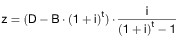

# Verordnung zur Bildung von Altersrückstellungen durch die gesetzlichen Krankenkassen und ihre Verbände (KK-AltRückV)

Ausfertigungsdatum
:   2011-07-18

Fundstelle
:   BGBl I: 2011, 1396

Zuletzt geändert durch
:   Art. 8a G v. 22.3.2020 I 604

## Eingangsformel

Auf Grund des § 171e Absatz 3 Satz 1 und 2 in Verbindung mit § 171f
des Fünften Buches Sozialgesetzbuch – Gesetzliche Krankenversicherung
– sowie in Verbindung mit § 1 der Verordnung zur Übertragung der
Befugnis zum Erlass von Rechtsverordnungen nach dem Fünften Buch
Sozialgesetzbuch auf das Bundesamt für Soziale Sicherung vom 12.
Februar 2010 (BGBl. I S. 88), von denen § 171e Absatz 3 Satz 1 und 2
und § 171f des Fünften Buches Sozialgesetzbuch durch Artikel 1 Nummer
8 des Gesetzes vom 15. Dezember 2008 (BGBl. I S. 2426) eingefügt
worden sind, verordnet das Bundesamt für Soziale Sicherung:

## § 1 Anwendungsbereich

Die Vorschriften dieser Verordnung sind auf die Krankenkassen und die
Verbände der Krankenkassen mit Ausnahme der landwirtschaftlichen
Krankenkasse anzuwenden.

## § 2 Abgrenzung der Altersversorgungsverpflichtungen

Altersrückstellungen und Deckungskapital für
Altersversorgungsverpflichtungen nach § 170 Absatz 1 Satz 1 und 2 des
Fünften Buches Sozialgesetzbuch sind für unmittelbare Zusagen auf eine
betriebliche Altersversorgung (Direktzusagen), für Zusagen auf eine
betriebliche Altersversorgung, die von einer Unterstützungskasse
durchgeführt wird, sowie für Beihilfeverpflichtungen zu bilden.

## § 3 Versicherungsmathematische Vorgaben

(1) Die Berechnung der Barwerte hat den anerkannten Regeln der
Versicherungsmathematik zum jeweiligen Berechnungszeitpunkt zu folgen.

(2) Für die Ermittlung des Barwertes der
Altersversorgungsverpflichtungen sind folgende Annahmen zugrunde zu
legen:

1.  Rechnungszins in Höhe von 4,25 Prozent,

2.  bei gehaltsabhängigen Versorgungszusagen ein jährlicher Anstieg der
    ruhegehaltsfähigen Dienstbezüge und Vergütungen um 1,5 Prozent,

3.  jährlicher Anstieg der Versorgungsbezüge und Renten um 1 Prozent.

(3) Die Renten und Anwartschaften zum 31. Dezember 2049 werden für
diejenigen Versorgungsanwärter und Versorgungsanwärterinnen sowie
Rentner und Rentnerinnen ermittelt, deren um vier Jahre erhöhte
durchschnittliche Lebenserwartung nach dem 31. Dezember 2049 endet.
Die Regelaltersgrenze wird nach dem Geburtsjahrgang festgesetzt. Der
Barwert der Beihilfeverpflichtungen ist unter Berücksichtigung der
altersabhängigen Kostenentwicklung gesondert zu berechnen.

## § 4 Höhe, Überprüfung und Anpassung der Zuweisungsbeträge

(1) Erforderlich ist ein Zuweisungsbetrag, der in jährlich
gleichbleibender Höhe zum Aufbau des benötigten Deckungskapitals
führt.

(2) Der Zuweisungsbetrag nach Absatz 1 wird ermittelt, indem das bis
zum 31. Dezember 2049 zu bildende Deckungskapital mit einem Quotienten
multipliziert wird, der im Dividend den nach § 3 Absatz 2 Nummer 1 zu
verwendenden Rechnungszins enthält und dessen Divisor dem
Aufzinsungsfaktor, verringert um 1, entspricht. Bereits gebildetes
Deckungskapital wird berücksichtigt, indem das gebildete
Deckungskapital mit dem Rechnungszins nach § 3 Absatz 2 Nummer 1 über
die Restlaufzeit aufgezinst und von dem insgesamt zu bildenden
Deckungskapital subtrahiert wird. Es ergibt sich für die Berechnung
des Zuweisungsbetrages nach Absatz 1 somit folgende Formel:

*    *           ,

mit
 z
    =   jährlich dem Deckungskapital in gleicher Höhe zuzuführender
        Zuweisungsbetrag,

        D
    =   bis zum 31. Dezember 2049 zu bildendes Deckungskapital für
        Versorgungszusagen gemäß § 170 Absatz 1 Satz 1 des Fünften Buches
        Sozialgesetzbuch,

        B
    =   bereits gebildetes Deckungskapital,

        t
    =   Restlaufzeit bis zum 31. Dezember 2049 in Jahren,

        i
    =   Rechnungszins gemäß § 3 Absatz 2 Nummer 1.

Solange der jährliche Zuweisungsbetrag (z) kleiner oder gleich Null
ist, sind keine Zuführungen zum Deckungskapital zu leisten.

(3) Die Höhe des Deckungskapitals, der Altersrückstellungen und des
erforderlichen jährlichen Zuweisungsbetrages sind bei wesentlichen
Änderungen der Berechnungsgrundlagen, spätestens aber alle fünf Jahre
zu überprüfen. Der Zuweisungsbetrag ist anzupassen, sobald sich auf
Grund einer Überprüfung der Berechnungsgrundlagen nach Satz 1 die Höhe
des zum 31. Dezember 2049 aufzubauenden Deckungskapitals verändert.

## § 5 Zahlverfahren

Die jährlichen Zuweisungsbeträge sind dem Deckungskapital bis zum 31.
Dezember des für die Zuführung maßgeblichen Kalenderjahres zuzuführen.

## § 6 (weggefallen)

## § 7 Inkrafttreten

Diese Verordnung tritt am Tag nach der Verkündung in Kraft.

## Schlussformel

Der Bundesrat hat zugestimmt.

