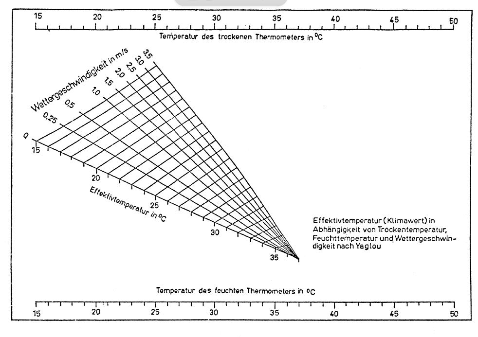

# Bergverordnung zum Schutz der Gesundheit gegen Klimaeinwirkungen (KlimaBergV)

Ausfertigungsdatum
:   1983-06-09

Fundstelle
:   BGBl I: 1983, 685

Geändert durch
:   Art. 5 Abs. 2 V v. 18.10.2017 I 3584

## Eingangsformel

Auf Grund des § 66 Satz 1 Nr. 4 Buchstabe a, b, d und e, Nr. 5
Buchstabe b, § 67 Nr. 1 und 8 und § 68 Abs. 2 Nr. 1 und 3 sowie Abs. 3
Nr. 1, auch in Verbindung mit § 126 Abs. 1 Satz 1 und Abs. 3 und § 129
Abs. 1, sowie des § 176 Abs. 3 Satz 3 des Bundesberggesetzes vom 13.
August 1980 (BGBl. I S. 1310) wird im Einvernehmen mit dem
Bundesminister für Arbeit und Sozialordnung mit Zustimmung des
Bundesrates verordnet:

## § 1 Anwendungsbereich

Diese Verordnung gilt für untertägige Betriebe mit Ausnahme der
Hohlraumbauten.

## § 2 Begriffsbestimmungen

Im Sinne dieser Verordnung ist

1.  Trockentemperatur die Temperatur der Wetter, gemessen am trockenen
    Thermometer in
    Grad C,

2.  Feuchttemperatur die Temperatur der Wetter, gemessen am feuchten
    Thermometer in
    Grad C,

3.  Effektivtemperatur der in Abhängigkeit von der Trockentemperatur, der
    Feuchttemperatur und der Wettergeschwindigkeit nach dem Schaubild der
    Anlage 1 ermittelte Klimawert in
    Grad C.

## § 3 Zulässige Beschäftigungszeit

Wird, auch nachdem Maßnahmen nach § 61 Abs. 1 Satz 2 Nr. 1 des
Bundesberggesetzes getroffen worden sind,

1.  außerhalb des Salzbergbaus eine Trockentemperatur von
    28 Grad C oder eine Effektivtemperatur von
    25 Grad C überschritten, so dürfen Personen innerhalb des täglichen
    Arbeitsablaufs nicht länger beschäftigt werden als

    a)  6 Stunden, wenn sie täglich mehr als 3 Stunden bei Trockentemperaturen
        über
        28 Grad C bis zu einer Effektivtemperatur von
        29 Grad C oder bei Effektivtemperaturen über
        25 Grad C bis
        29 Grad C verbringen,

    b)  5 Stunden, wenn sie täglich mehr als 2 1/2 Stunden bei
        Effektivtemperaturen über
        29 Grad C bis
        30 Grad C verbringen,

2.  im Salzbergbau eine Trockentemperatur von
    28 Grad C überschritten, so dürfen Personen innerhalb des täglichen
    Arbeitsablaufs nicht länger beschäftigt werden als

    a)  7 Stunden, wenn sie täglich mehr als 5 Stunden bei Trockentemperaturen
        über
        28 Grad C bis
        37 Grad C oder mehr als 4 1/2 Stunden bei Trockentemperaturen über
        37 Grad C bis
        46 Grad C verbringen,

    b)  6 1/2 Stunden, wenn sie täglich mehr als 4 Stunden bei
        Trockentemperaturen über
        46 Grad C bis
        52 Grad C verbringen.

## § 4 Obere Klimawerte für eine Beschäftigung außerhalb des Salzbergbaus

(1) Bei Effektivtemperaturen von mehr als
30 Grad C dürfen außerhalb des Salzbergbaus Personen nicht beschäftigt
werden.

(2) Abweichend von Absatz 1 dürfen Personen im Einzelfall bis zu einer
Effektivtemperatur von
32 Grad C beschäftigt werden,

1.  wenn sie im Rahmen ihrer Beschäftigung ohne eine Unterbrechung, die
    mindestens 6 Wochen betragen muß, höchstens 4 Monate
    Effektivtemperaturen von mehr als
    30 Grad C ausgesetzt sind,

2.  wenn ihre Beschäftigungszeit täglich höchstens 5 Stunden beträgt,
    sofern sie davon mehr als 2 1/2 Stunden bei Effektivtemperaturen von
    mehr als
    30 Grad C verbringen und

3.  wenn in Abbaubetrieben außerdem höchstens ein Drittel der jeweiligen
    Beschäftigten Effektivtemperaturen von mehr als
    30 Grad C ausgesetzt ist.

(3) Ausrichtungs-, Vorrichtungs-, Herrichtungs- und Raubbetriebe
dürfen nicht länger als 6 Monate ohne Unterbrechung geführt werden,
wenn die Effektivtemperatur der Wetter vor Ort mehr als
30 Grad C beträgt. Als Unterbrechung zählt nur eine Zeit von
mindestens 6 Wochen.

(4) In Einzelfällen kann die zuständige Behörde

1.  Ausnahmen von Absatz 1 zulassen, wenn durch besondere Einrichtungen
    sichergestellt ist, daß für den einzelnen Beschäftigten die
    Klimabelastung in ihrer physiologischen Gesamtwirkung nicht so groß
    ist, wie bei einer Effektivtemperatur von mehr als
    30 Grad C,

2.  ein Überschreiten der in Absatz 3 festgelegten Betriebsdauer
    genehmigen, soweit dies wegen unvorhergesehener Ereignisse trotz
    zusätzlicher Maßnahmen zur Einhaltung der Frist unvermeidlich ist.

## § 5 Obere Temperaturwerte für eine Beschäftigung im Salzbergbau

(1) Bei Trockentemperaturen von mehr als
52 Grad C oder Feuchttemperaturen von mehr als
27 Grad C dürfen im Salzbergbau Personen nicht beschäftigt werden.

(2) In Einzelfällen kann die zuständige Behörde Ausnahmen von Absatz 1
zulassen, wenn durch besondere Einrichtungen sichergestellt ist, daß
für den einzelnen Beschäftigten die Temperaturbelastung in ihrer
physiologischen Gesamtwirkung nicht so groß ist, wie bei einer
Trockentemperatur von mehr als
52 Grad C oder einer Feuchttemperatur von mehr als
27 Grad C.

## § 6 Anrechnung von Zeiten für die nichtmaschinelle Fahrung

Auf die nach § 3 oder § 4 Abs. 2 Nr. 2 für eine Verkürzung der
Beschäftigungszeiten maßgebenden Zeiten und die Beschäftigungszeiten
selbst sind die Zeiten für die nichtmaschinelle Fahrung in Wettern von
mehr als

1.  29 Grad C Effektivtemperatur außerhalb des Salzbergbaus oder

2.  37 Grad C Trockentemperatur im Salzbergbau

insoweit anzurechnen, als sie insgesamt mehr als 15 Minuten betragen.

## § 7 Zusätzliche Pausen

(1) Neben den gesetzlichen Pausen sind zusätzliche Pausen zu gewähren

1.  außerhalb des Salzbergbaus

    a)  von 10 Minuten bei Effektivtemperaturen von mehr als
        29 Grad C bis
        30 Grad C,

    b)  von 20 Minuten bei Effektivtemperaturen von mehr als
        30 Grad C,

2.  im Salzbergbau

    a)  von 15 Minuten bei Trockentemperaturen von mehr als
        37 Grad C bis
        46 Grad C,

    b)  von 30 Minuten bei Trockentemperaturen von mehr als
        46 Grad C.

(2) Die Pausen sind auf die Beschäftigungszeiten anzurechnen.

## § 8 Eingewöhnungszeit

(1) Der Unternehmer darf Personen, die

1.  außerhalb des Salzbergbaus bei einer Effektivtemperatur von mehr als
    29 Grad C oder

2.  im Salzbergbau bei einer Trockentemperatur von mehr als
    37 Grad C

erstmalig beschäftigt werden oder

3.  länger als 6 Monate nicht unter den Temperatur- oder Klimabedingungen
    nach den Nummern 1 oder 2 gearbeitet haben,

mit Arbeiten im Leistungslohn erst nach einer Eingewöhnungszeit von 2
Wochen betrauen.

(2) Während der Eingewöhnungszeit sollen außerhalb des Salzbergbaus
täglich mehr als 2 1/2 Stunden oder im Salzbergbau täglich mehr als 4
Stunden unter den Temperatur- oder Klimabedingungen nach Absatz 1 Nr.
1 oder 2 verbracht werden.

## § 9 Besondere Personengruppen

(1) Personen, die noch keine 21 Jahre oder mehr als 50 Jahre alt sind,
dürfen

1.  außerhalb des Salzbergbaus bei einer Effektivtemperatur von mehr als
    29 Grad C oder

2.  im Salzbergbau bei einer Trockentemperatur von mehr als
    46 Grad C

nicht beschäftigt werden.

(2) Abweichend von Absatz 1 dürfen diese Personen beschäftigt werden,
wenn

1.  im Einzelfall auf Grund einer Eignungsuntersuchung nach § 2 der
    Gesundheitsschutz-Bergverordnung vom 31. Juli 1991 (BGBl. I S. 1751)
    keine gesundheitlichen Bedenken gegen eine Beschäftigung unter
    Temperatur- oder Klimabedingungen nach Absatz 1 bestehen und

2.  eine entsprechende Bescheinigung dem Unternehmer vorliegt.

## § 10 Arbeiten in Notfällen

Die §§ 3, 4 Abs. 1 und § 5 Abs. 1 gelten nicht

1.  für den Einsatz von Grubenwehren,

2.  für Arbeiten zur

    a)  Rettung von Personen,

    b)  Abwendung einer Gefahr für Leben oder Gesundheit von Personen oder

    c)  Abwendung eines erheblichen Schadens an bedeutenden
        Betriebseinrichtungen bei einem unvorhergesehenen Ereignis, wenn mit
        einer kurzen Einsatzzeit zu rechnen ist.

## § 11 Ermittlung der Temperaturwerte

(1) An jedem belegten Betriebspunkt, an dem

1.  außerhalb des Salzbergbaus mit einer Trockentemperatur von mehr als
    28 Grad C oder einer Effektivtemperatur von mehr als
    25 Grad C oder

2.  im Salzbergbau mit einer Trockentemperatur von mehr als
    28 Grad C

zu rechnen ist, sind innerhalb von 3 Arbeitstagen die
Trockentemperatur, die Feuchttemperatur und die Wettergeschwindigkeit
zu messen und ist, mit Ausnahme des Salzbergbaus, die
Effektivtemperatur zu ermitteln.

(2) Wird bei den Messungen eine höhere Trockentemperatur als
28 Grad C oder eine höhere Effektivtemperatur als
25 Grad C festgestellt, sind die Messungen und Ermittlungen zu
wiederholen

1.  außerhalb des Salzbergbaus in Abständen von längstens

    a)  einem Monat, solange eine Effektivtemperatur von
        29 Grad C nicht überschritten wird,

    b)  2 Wochen, sobald eine Effektivtemperatur von
        29 Grad C überschritten wird,

2.  im Salzbergbau in Abständen von längstens 2 Monaten.

(3) Ist auf Grund wettertechnischer, betrieblicher oder sonstiger
Veränderungen damit zu rechnen, daß einer der in den §§ 3 bis 5
genannten Temperatur- oder Klimawerte überschritten wird, sind die
Messungen und Ermittlungen unverzüglich zu wiederholen.

(4) Die Messungen sind zeitlich und räumlich nach den allgemein
anerkannten Regeln der Technik so durchzuführen, daß die Trocken- oder
Effektivtemperaturen am Betriebspunkt erfaßt werden, die auf die
Beschäftigten während der Beschäftigungszeit überwiegend einwirken.

(5) Benachbarte Betriebspunkte dürfen zu einem Temperatur- oder
Klimabereich zusammengefaßt werden. Diesem ist die Trocken- oder
Effektivtemperatur des Betriebspunktes mit dem höchsten Wert zugrunde
zu legen.

(6) Der zuständigen Behörde sind die Betriebspunkte unverzüglich
anzuzeigen, an denen

1.  außerhalb des Salzbergbaus eine Effektivtemperatur von mehr als
    30 Grad C ermittelt oder

2.  im Salzbergbau eine Trockentemperatur von mehr als
    52 Grad C oder eine Feuchttemperatur von mehr als
    27 Grad C gemessen wird.

(7) Die Absätze 1 bis 6 gelten entsprechend für nicht belegte
Betriebspunkte, an denen regelmäßig eine nichtmaschinelle Fahrung
stattfindet und an denen außerhalb des Salzbergbaus mit einer
Effektivtemperatur von mehr als
29 Grad C oder im Salzbergbau mit einer Trockentemperatur von mehr als
37 Grad C zu rechnen ist.

## § 12 (weggefallen)

## § 13 Aufzeichnungen

(1) Der Unternehmer hat nach Maßgabe der von der zuständigen Behörde
herausgegebenen Vordrucke Aufzeichnungen zu führen über

1.  die Messung der Trockentemperaturen, Feuchttemperaturen und der
    Wettergeschwindigkeiten sowie die Ermittlung der Effektivtemperaturen
    nach § 11,

2.  die Temperatur- oder Klimabereiche nach den §§ 3, 4 Abs. 2 und 4 Nr. 1
    sowie § 5 Abs. 2, in denen der einzelne Beschäftigte innerhalb der
    vorausgegangenen 12 Monate täglich überwiegend tätig gewesen ist,

3.  die durchgeführten Eignungsuntersuchungen nach § 2 der
    Gesundheitsschutz-Bergverordnung,

4.  Art und Anzahl ihm bekanntgewordener Fälle von Gesundheitsstörungen,
    die nach ärztlichem Urteil zurückzuführen sind auf eine Beschäftigung

    a)  außerhalb des Salzbergbaus bei einer Trockentemperatur von mehr als
        28 Grad C oder einer Effektivtemperatur von mehr als
        25 Grad C,

    b)  im Salzbergbau bei einer Trockentemperatur von mehr als
        28 Grad C.

(2) Die Aufzeichnungen nach Absatz 1 Nr. 1 sind mindestens 1 Jahr, die
Aufzeichnungen nach Absatz 1 Nr. 2 bis 4 mindestens 10 Jahre nach der
letzten ärztlichen Untersuchung aufzubewahren.

(3) Gleichwertige Aufzeichnungen auf Grund anderer Rechtsvorschriften
gelten als Nachweise im Sinne des Absatzes 1 Nr. 1.

## § 14 Bekanntmachung

Der Unternehmer hat dafür zu sorgen, daß alle Personen, die unter Tage

1.  außerhalb des Salzbergbaus an Betriebspunkten mit Wettern von mehr als
    28 Grad C Trockentemperatur oder
    25 Grad C Effektivtemperatur oder

2.  im Salzbergbau an Betriebspunkten mit Wettern von mehr als
    28 Grad C Trockentemperatur

beschäftigt werden sollen oder beschäftigt sind, von den Vorschriften
dieser Verordnung Kenntnis erhalten.

## § 15 Ordnungswidrigkeiten

(1) Ordnungswidrig im Sinne des § 145 Abs. 3 Nr. 2 des
Bundesberggesetzes handelt, wer vorsätzlich oder fahrlässig

1.  entgegen § 3 Personen über die zulässige tägliche Beschäftigungszeit
    hinaus beschäftigt,

2.  entgegen § 4 Abs. 1 außerhalb des Salzbergbaus oder entgegen § 5 Abs.
    1 im Salzbergbau Personen bei höheren als den zugelassenen Temperatur-
    oder Klimawerten beschäftigt,

3.  entgegen § 4 Abs. 3 Betriebe länger als 6 Monate bei einer
    Effektivtemperatur der Wetter von mehr als
    30 Grad C führt,

4.  entgegen § 7 Abs. 1 zusätzliche Pausen nicht gewährt,

5.  entgegen § 8 Abs. 1 Personen mit Arbeiten im Leistungslohn ohne die
    vorgeschriebene Eingewöhnungszeit betraut,

6.  entgegen § 9 Abs. 1 Personen, die noch keine 21 Jahre oder mehr als 50
    Jahre alt sind, beschäftigt,

7.  entgegen § 11 Abs. 1, 2 oder 3, jeweils auch in Verbindung mit § 11
    Abs. 7, die Messung oder Ermittlung von Temperaturen oder
    Wettergeschwindigkeiten nicht oder nicht rechtzeitig vornimmt oder
    wiederholt,

8.  entgegen § 11 Abs. 5 Satz 2, auch in Verbindung mit § 11 Abs. 7, für
    zusammengefaßte Betriebsbereiche nicht den Betriebspunkt mit der
    höchsten Temperatur zugrunde legt,

9.  entgegen § 11 Abs. 6, auch in Verbindung mit § 11 Abs. 7, die dort
    genannten Betriebspunkte nicht, nicht richtig oder nicht rechtzeitig
    anzeigt.

(2) Ordnungswidrig im Sinne des § 145 Abs. 3 Nr. 1 des
Bundesberggesetzes handelt, wer vorsätzlich oder fahrlässig entgegen §
13 Abs. 1 vorgeschriebene Aufzeichnungen nicht, nicht richtig oder
nicht vollständig führt oder entgegen § 13 Abs. 2 nicht aufbewahrt.

(3) Die Absätze 1 und 2 gelten nicht für Untergrundspeicher und
Versuchsgruben.

## § 16 (weggefallen)

## § 17 Inkrafttreten, abgelöste Vorschriften

(1) Diese Verordnung tritt am 1. Januar 1984 in Kraft.

(2) Gleichzeitig treten folgende Vorschriften außer Kraft:
1\. Hessen
§§ 132 bis 135 der Allgemeinen Bergverordnung für das Land Hessen vom
6\. Juni 1969 (Staatsanzeiger für das Land Hessen S. 1075), zuletzt
geändert durch Verordnung vom 26. Oktober 1981 (Staatsanzeiger für das
Land Hessen S. 2116, 2334),
2\. Niedersachsen
Bergverordnung über den Schutz der Gesundheit gegen Klimaeinwirkungen
im Erz- und Salzbergbau vom 10. Dezember 1975 (Niedersächsisches
Ministerialblatt S. 1838),
3\. Nordrhein-Westfalen
Bergverordnung des Landesoberbergamts Nordrhein-Westfalen zum Schutz
der Gesundheit gegen Klimaeinwirkungen im Steinkohlenbergbau vom 3.
Februar 1977 (Amtsblatt Arnsberg Nr. 7 - Sonderbeilage, Amtsblatt
Detmold Nr. 7 - Sonderbeilage, Amtsblatt Düsseldorf Nr. 8 -
Sonderbeilage, Amtsblatt Köln Nr. 7 - Sonderbeilage, Amtsblatt Münster
Nr. 7 - Sonderbeilage),
4\. Saarland
§ 19 der Bergpolizeiverordnung des Oberbergamts für das Saarland und
das Land Rheinland-Pfalz für die Steinkohlenbergwerke vom 1. Juni 1976
(Amtsblatt des Saarlandes S. 600).

## Schlußformel

Der Bundesminister für Wirtschaft

## Anlage 1

(Fundstelle: BGBl. I 1983, 690)

