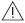

# Verordnung über kosmetische Mittel (KosmetikV)

Ausfertigungsdatum
:   1977-12-16

Fundstelle
:   BGBl I: 1977, 2589

Neugefasst durch
:   Bek. v. 7.10.1997 I 2410

Zuletzt geändert durch
:   Art. 1 V v. 6.7.2012 I 1481

## § 1 Allgemein verbotene Stoffe

Die in Anlage 1 aufgeführten Stoffe dürfen bei dem gewerbsmäßigen
Herstellen oder Behandeln von kosmetischen Mitteln nicht verwendet
werden. Zulässig ist jedoch die Verwendung dieser Stoffe als
Hilfsstoffe, sofern sie aus dem kosmetischen Mittel vollständig oder
soweit entfernt werden, daß sie darin nur als technisch unvermeidbare
und technologisch unwirksame Reste in gesundheitlich unbedenklichen
Anteilen enthalten sind.

## § 2 Eingeschränkt zugelassene Stoffe

(1) Bei dem gewerbsmäßigen Herstellen oder Behandeln von kosmetischen
Mitteln dürfen die in Anlage 2 enthaltenen Stoffe nur mit den in den
Spalten c und e der Anlage genannten Beschränkungen verwendet werden.
Die in Satz 1 genannten Verwendungsbeschränkungen gelten nicht, soweit
die Stoffe entsprechend § 1 Satz 2 als Hilfsstoffe verwendet werden.
Die in Anlage 2 Teil C aufgeführten Stoffe dürfen nur bis zu dem in
Spalte g der Anlage festgelegten Zeitpunkt verwendet werden.

(2) Kosmetische Mittel dürfen gewerbsmäßig nicht in den Verkehr
gebracht werden, wenn der Gehalt an den in Anlage 2 aufgeführten
Stoffen die in Spalte d der Anlage angegebenen Höchstmengen
überschreitet.

(3) Die in Anlage 2 aufgeführten Stoffe müssen den in Spalte e der
Anlage angegebenen Reinheitsanforderungen entsprechen, wenn sie beim
gewerbsmäßigen Herstellen kosmetischer Mittel verwendet werden.

## § 3 Farbstoffe

(1) Bei dem gewerbsmäßigen Herstellen oder Behandeln von kosmetischen
Mitteln dürfen nur die in Anlage 3 aufgeführten Farbstoffe verwendet
werden. Dabei sind die in den Spalten f und g der Anlage angegebenen
Verwendungsbeschränkungen zu beachten.

(2) Kosmetische Mittel dürfen gewerbsmäßig nicht in den Verkehr
gebracht werden, wenn der Gehalt an den in Anlage 3 aufgeführten
Farbstoffen die in Spalte g der Anlage angegebenen Höchstmengen
überschreitet.

(3) Die in Anlage 3 aufgeführten Farbstoffe müssen den in Spalte g der
Anlage angegebenen Reinheitsanforderungen entsprechen, wenn sie beim
gewerbsmäßigen Herstellen von in Absatz 1 genannten kosmetischen
Mitteln verwendet werden. Soweit in den Fußnoten der Anlage 3 Teil A
für Reinheitsanforderungen Untersuchungsmethoden der Amtlichen
Sammlung nach § 64 Abs. 1 des Lebensmittel- und
Futtermittelgesetzbuches \*) aufgeführt sind, ist die Reinheit nach
diesen Methoden zu bestimmen.

(4) Die Verwendung der in Anlage 3 Teil B genannten Farbstoffe ist nur
bis zu dem in Spalte h der Anlage festgelegten Zeitpunkt gestattet.

(5) Die Absätze 1 bis 4 gelten nicht für kosmetische Mittel, die zur
Verwendung als Haarfärbe- oder Haartönungsmittel bestimmt sind. \*)
Zu beziehen durch Beuth-Verlag GmbH, Berlin und Köln.

## § 3a Konservierungsstoffe

(1) Konservierungsstoffe im Sinne dieser Verordnung sind Stoffe und
Gemische, die kosmetischen Mitteln überwiegend zu dem Zweck
hinzugefügt werden, die Entwicklung von Mikroorganismen in diesen
Erzeugnissen zu hemmen.

(2) Bei dem gewerbsmäßigen Herstellen oder Behandeln von kosmetischen
Mitteln dürfen nur die in Anlage 6 aufgeführten Konservierungsstoffe
verwendet werden. Dabei sind die in der Spalte d der Anlage genannten
Einschränkungen und Anforderungen einzuhalten.

(3) Kosmetische Mittel dürfen gewerbsmäßig nicht in den Verkehr
gebracht werden, wenn der Gehalt an den in Anlage 6 aufgeführten
Konservierungsstoffen die in Spalte c der Anlage angegebenen
Höchstmengen überschreitet. Die in Anlage 6 mit dem Zeichen (+)
versehenen Stoffe können jedoch in anderen Konzentrationen zu anderen
Zwecken als zur Konservierung kosmetischer Mittel enthalten sein,
sofern sich der andere Zweck aus der Kennzeichnung des Erzeugnisses
ergibt.

(4) Die Verwendung der in Anlage 6 Teil B genannten
Konservierungsstoffe ist nur bis zu dem in Spalte f der Anlage
festgelegten Zeitpunkt gestattet.

(5) Als Salze von Konservierungsstoffen gelten die Salze der Kationen
Natrium, Kalium, Calcium, Magnesium, Ammonium und Ethanolamin sowie
die Salze der Anionen Chlorid, Bromid, Sulfat und Azetat. Als Ester
von Konservierungsstoffen gelten Methyl-, Ethyl-, Propyl-, Isopropyl-,
Butyl-, Isobutyl- und Phenylester.

## § 3b Ultraviolett-Filter (UV-Filter)

(1) UV-Filter im Sinne dieser Verordnung sind Stoffe und Gemische, die
kosmetischen Mitteln überwiegend zu dem Zweck hinzugefügt werden,
Ultraviolett-Strahlen zu filtern, um die Haut vor bestimmten
schädlichen Einwirkungen dieser Strahlen zu schützen.

(2) UV-Filter im Sinne dieser Verordnung sind auch Stoffe und
Gemische, die kosmetischen Mitteln nur zum Schutz der Erzeugnisse
gegen Ultraviolett-Strahlen zugesetzt werden.

(3) Bei dem gewerbsmäßigen Herstellen und Behandeln von kosmetischen
Mitteln dürfen nur die in Anlage 7 aufgeführten UV-Filter verwendet
werden. Dabei sind die in Spalte d genannten Einschränkungen
einzuhalten.

(4) Kosmetische Mittel dürfen gewerbsmäßig nicht in den Verkehr
gebracht werden, wenn der Gehalt an den in Anlage 7 aufgeführten UV-
Filtern die in Spalte c der Anlage angegebenen Höchstmengen
überschreitet.

(5) Die Verwendung der in Anlage 7 Teil B genannten UV-Filter ist nur
bis zum 31. Dezember 1999 gestattet.

(6) Absatz 3 Satz 1 und Absatz 5 gelten nicht für kosmetische Mittel,
denen UV-Filter ausschließlich zu dem in Absatz 2 genannten Zweck
zugegeben werden.

(7) Die Verwendung von beschichtetem mikrofeinem Zinkoxid bis zu einer
Höchstmenge von 25 % als UV-Filter ist bis zu dem Tag gestattet, mit
dessen Beginn eine Regelung über die Verwendung von Zinkoxid als UV-
Filter in einem Rechtsakt der Europäischen Union anzuwenden ist,
längstens jedoch bis zum Ablauf des 10. Juli 2013; das
Bundesministerium für Ernährung, Landwirtschaft und Verbraucherschutz
macht den vorstehend bezeichneten Tag im elektronischen Bundesanzeiger
bekannt. Eine Verwendung in treibmittel-basierten Sprays ist nicht
gestattet. Kosmetische Mittel, die diesen UV-Filter enthalten, dürfen
gewerbsmäßig nur in den Verkehr gebracht werden, wenn dieser Stoff auf
der Verpackung mit der Bezeichnung "Zinc oxide" angegeben ist.

## § 3c Im Tierversuch geprüfte kosmetische Mittel

(1) Kosmetische Mittel, einschließlich deren Bestandteile oder
Kombinationen von Bestandteilen, dürfen nicht in den Verkehr gebracht
werden, wenn sie zur Einhaltung der Vorschriften des Lebensmittel- und
Futtermittelgesetzbuches und der auf Grund dieses Gesetzes oder des
Lebensmittel- und Bedarfsgegenständegesetzes erlassenen
Rechtsverordnungen im Tierversuch überprüft worden sind, soweit

1.  anstelle des jeweiligen Tierversuches eine alternative Methode in der
    Verordnung (EG) Nr. 440/2008 der Kommission vom 30. Mai 2008 über
    Prüfmethoden gemäß der Verordnung (EG) Nr. 1907/2006 des Europäischen
    Parlaments und des Rates zur Registrierung, Bewertung, Zulassung und
    Beschränkung chemischer Stoffe (REACH) (ABl. L 142 vom 31.5.2008, S.
    1) oder in Anlage 7a vorgesehen ist und

2.  im Bundesanzeiger durch das Bundesministerium für Ernährung,
    Landwirtschaft und Verbraucherschutz oder im Amtsblatt der
    Europäischen Union durch Organe der Europäischen Union bekannt gemacht
    worden ist, dass bei dieser Methode die Entwicklung der Bewertung
    innerhalb der Organisation für wirtschaftliche Zusammenarbeit und
    Entwicklung (OECD) gebührend berücksichtigt worden ist.

(2) Nach dem 11. März 2009 dürfen kosmetische Mittel, einschließlich
deren Bestandteile oder Kombinationen von Bestandteilen, nicht in den
Verkehr gebracht werden, wenn sie zur Einhaltung der Vorschriften des
Lebensmittel- und Futtermittelgesetzbuches und der auf Grund dieses
Gesetzes oder des Lebensmittel- und Bedarfsgegenständegesetzes
erlassen Rechtsverordnungen im Tierversuch überprüft worden sind.
Abweichend von Satz 1 dürfen kosmetische Mittel, einschließlich deren
Bestandteile oder Kombinationen von Bestandteilen, die im Zusammenhang
mit der

1.  Toxizität bei wiederholter Verabreichung,

2.  Reproduktionstoxizität oder

3.  Toxikokinetik

in Tierversuchen, für die keine alternativen Methoden geprüft worden
sind, überprüft worden sind, noch bis zum 11. März 2013 in den Verkehr
gebracht werden.

## § 4 Angaben zum Schutz der Gesundheit

(1) Kosmetische Mittel dürfen gewerbsmäßig nur in den Verkehr gebracht
werden, wenn auf ihren Behältnissen und Verpackungen die Nummer des
Herstellungspostens oder ein Kennzeichen angegeben ist, die eine
Identifizierung der Herstellung ermöglichen; sollte dies wegen der
geringen Abmessungen kosmetischer Mittel praktisch unmöglich sein, so
braucht ein solcher Hinweis nur auf der Verpackung dieser Mittel zu
stehen.

(2) Kosmetische Mittel dürfen ferner gewerbsmäßig nur in den Verkehr
gebracht werden, wenn auf ihren Behältnissen und Verpackungen folgende
Angaben angebracht sind:

1.  die in Spalte f der Anlage 2 und die in den Spalten e der Anlagen 6
    und 7 hinsichtlich bestimmter Stoffe vorgesehenen Angaben, wenn die
    kosmetischen Mittel diese Stoffe enthalten;

2.  "Enthält Formaldehyd", sofern die Konzentration an freiem Formaldehyd
    im Endprodukt 0,05% überschreitet;

3.  sonstige besondere Anwendungsbedingungen und Warnhinweise bei
    bestimmten kosmetischen Mitteln, auch solche für den gewerblichen
    Gebrauch, bei denen solche Angaben erforderlich sind, um eine
    Gefährdung der Gesundheit zu verhüten.

Kann der volle Wortlaut der Angaben aus praktischen Gründen auf dem
Behältnis und der Verpackung nicht angebracht werden, so müssen diese
Angaben auf einer Packungsbeilage, einem beigefügten Etikett,
Papierstreifen oder Kärtchen enthalten sein, auf die der Verbraucher
auf dem Behältnis und der Verpackung entweder durch einen verkürzten
Hinweis oder durch das in Anlage 8 abgebildete Symbol hingewiesen
wird.

(3) Die Angaben nach den Absätzen 1 und 2 sind unverwischbar, gut
leserlich und deutlich sichtbar in deutscher Sprache zu machen.

## § 5 Kennzeichnung

(1) Kosmetische Mittel dürfen gewerbsmäßig nur in den Verkehr gebracht
werden, wenn gemäß Satz 2 bis 5, Abs. 2, 2a und 3 zusätzlich zu den
Angaben nach § 4 angegeben sind:

1.  der Name oder die Firma sowie die Anschrift oder der Firmensitz des in
    einem Mitgliedstaat der Europäischen Union oder einem anderen
    Vertragsstaat des Abkommens über den Europäischen Wirtschaftsraum
    ansässigen Herstellers oder einer dort ansässigen Person, die für das
    Inverkehrbringen des kosmetischen Mittels verantwortlich ist; die
    Angaben dürfen abgekürzt werden, sofern das Unternehmen aus der
    Abkürzung allgemein erkennbar ist,

2.  das Mindesthaltbarkeitsdatum, sofern das kosmetische Mittel eine
    Mindesthaltbarkeit von 30 Monaten oder weniger aufweist,

2a. die Verwendungsdauer nach dem Öffnen bei Erzeugnissen mit einer
    Mindesthaltbarkeit von mehr als 30 Monaten nach Maßgabe des Absatzes
    2a,

3.  der Verwendungszweck des Erzeugnisses, sofern dieser sich nicht aus
    der Aufmachung des Erzeugnisses ergibt,

4.  die Liste der Bestandteile nach Maßgabe des § 5a.

Die Angaben nach den Nummern 1 bis 3 sind auf den Behältnissen und den
Verpackungen anzugeben. Die Angaben nach Nummer 4 sind auf den
Verpackungen oder, sofern keine Verpackungen vorhanden sind, auf den
Behältnissen anzugeben; ist dies aus praktischen Gründen nicht
möglich, so müssen die Bestandteile auf einer Packungsbeilage, einem
beigefügten Etikett, Papierstreifen der Kärtchen aufgeführt werden. In
diesem Fall muß auf den Verpackungen ein verkürzter Hinweis oder das
in Anlage 8 abgebildete Symbol den Verbraucher auf die Angabe dieser
Bestandteile hinweisen. Kann wegen der geringen Größe oder der Form
der kosmetischen Mittel die Liste der Bestandteile nicht nach Maßgabe
des Satzes 3 angegeben werden, so muß die Angabe auf einem Schild in
unmittelbarer Nähe der angebotenen Erzeugnisse angebracht werden.

(2) Das Mindesthaltbarkeitsdatum ist das Datum, bis zu dem dieses
Erzeugnis bei sachgerechter Aufbewahrung seine ursprüngliche Funktion
erfüllt. Es ist unverschlüsselt mit den Worten "mindestens haltbar bis
..." unter Angabe von Monat und Jahr oder Tag, Monat und Jahr in
dieser Reihenfolge anzugeben. Die Angabe von Monat und Jahr oder Tag,
Monat und Jahr kann auch an anderer Stelle erfolgen, wenn in
Verbindung mit der Angabe nach Satz 2 auf diese Stelle hingewiesen
wird. Ist die angegebene Mindesthaltbarkeit nur bei Einhaltung
bestimmter Aufbewahrungsbedingungen gewährleistet, so ist ein
entsprechender Hinweis in Verbindung mit den Angaben nach den Sätzen 2
oder 3 anzubringen.

(2a) Bei kosmetischen Mitteln mit einer Mindesthaltbarkeit von mehr
als 30 Monaten ist anzugeben, wie lange das Mittel nach dem Öffnen vom
Verbraucher verwendet werden kann, ohne dass eine Gefährdung der
Gesundheit zu erwarten ist (Verwendungsdauer). Die Verwendungsdauer
ist durch das in Anlage 8a abgebildete Symbol, gefolgt von dem in
Monaten, in Monaten und Jahren oder in Jahren ausgedrückten Zeitraum
im Sinne des Satzes 1, anzugeben.

(3) Die Angaben nach Absatz 1 Nr. 1 bis 4 und Absatz 2 sind
unverwischbar, deutlich sichtbar und leicht lesbar, die Angaben nach
Absatz 1 Nr. 2 und 3 und Absatz 2 darüber hinaus in deutscher Sprache
anzugeben.

(4) Der Hersteller oder die Person, die für das Inverkehrbringen des
Erzeugnisses verantwortlich ist, kann auf der Verpackung des
Erzeugnisses und jedem dem Erzeugnis beigefügten oder sich darauf
beziehenden Schriftstück, Schild, Etikett, Ring oder Verschluss darauf
hinweisen, dass keine Tierversuche durchgeführt worden sind, sofern
der Hersteller und seine Zulieferer keine Tierversuche für das
kosmetische Mittel, einschließlich dessen Muster sowie deren
Bestandteile, durchgeführt oder in Auftrag gegeben haben, noch
Bestandteile verwendet haben, die in Tierversuchen zum Zweck der
Entwicklung neuer kosmetischer Mittel durch Dritte geprüft worden
sind.

## § 5a Kennzeichnung der Bestandteile

(1) Der Liste der Bestandteile ist die Angabe "Bestandteile" oder die
Angabe "Ingredients" voranzustellen.

(2) Die Bestandteile sind in abnehmender Reihenfolge ihres Gewichtes
zum Zeitpunkt der Herstellung des kosmetischen Mittels anzugeben.
Bestandteile mit einem Gehalt bis zu 1 Prozent im Erzeugnis können in
ungeordneter Reihenfolge im Anschluß an die Bestandteile mit einem
Gehalt von mehr als 1 Prozent aufgeführt werden. Farbstoffe können in
ungeordneter Reihenfolge nach den anderen Bestandteilen nach Maßgabe
der Nummer des Colour-Index, Farbstoffe ohne Colour-Index-Nummer mit
den in Anlage 3 in Spalte b genannten sonstigen Bezeichnungen
angegeben werden. Werden kosmetische Mittel, die der Färbung oder
Verschönerung der Haut, des Haares oder der Nägel dienen, in Form
einer Produktpalette in unterschiedlichen Farbtönen in den Verkehr
gebracht, so können bei den einzelnen Erzeugnissen alle in der Palette
verwendeten Farbstoffe gemeinsam aufgeführt werden, sofern die Angaben
der Farbstoffe zwischen die Worte "kann ... enthalten" eingefügt oder
im Anschluß an das Zeichen
"(+/-...)" angefügt werden.

(3) Riech- oder Aromastoffe sowie ihre Ausgangsstoffe sind mit der
Angabe "Parfüm", "Parfum" oder "Aroma" zu kennzeichnen. Die in Anlage
2 Teil A Nr. 45 und 67 bis 92 aufgeführten Stoffe sind mit ihrer
Stoffbezeichnung gemäß Absatz 4 anzugeben, wenn die Menge der Stoffe
bei Mitteln, die ausgespült werden, jeweils 0,01 Prozent und in
anderen Mitteln jeweils 0,001 Prozent übersteigt. Bei Verwendung des
in Anlage 2 Teil A Nr. 45 aufgeführten Stoffes als Lösungsmittel
entfällt die Angabe nach Satz 2.

(4) Die anderen Bestandteile sind mit ihren INCI-Bezeichnungen gemäß
dem Beschluß 96/335/EG der Kommission vom 8. Mai 1996 zur Festlegung
einer Liste und einer gemeinsamen Nomenklatur der Bestandteile
kosmetischer Mittel (ABl. EG Nr. L 132 S. 1), geändert durch den
Beschluss 2006/257/EG vom 9. Februar 2006 (ABl. EU Nr. L 97 S. 1),
anzugeben. Sofern eine INCI-Bezeichnung nicht vorhanden ist, ist die
chemische Bezeichnung, die Bezeichnung des Europäischen Arzneibuches,
der von der Weltgesundheitsorganisation empfohlene nichtgeschützte
Name (INN) oder eine sonstige Bezeichnung zur Identität des
Bestandteils anzugeben.

(5) Anstelle eines Bestandteils kann eine Registriernummer angeben
werden, wenn diese auf Antrag von der zuständigen Behörde eines
Mitgliedstaates der Europäischen Union aus Gründen der Vertraulichkeit
zugeteilt worden ist. In der Bundesrepublik Deutschland wird die
Registriernummer von der zuständigen Behörde des Landes zugeteilt, in
dem das kosmetische Mittel hergestellt oder für den Fall der Einfuhr
erstmals eingeführt wird. Der Antrag ist im Falle der Herstellung von
dem Hersteller oder im Falle der Einfuhr von dem für die Einfuhr
Verantwortlichen zu stellen; er muß die nach Anlage 9 Nr. 1
erforderlichen Angaben enthalten. Falls der Bestandteil in mehreren
Erzeugnissen verwendet wird, reicht ein Antrag aus, sofern diese
Erzeugnisse der zuständigen Behörde angegeben werden. Über den Antrag
ist innerhalb der in Anlage 9 Nr. 2 genannten Frist zu entscheiden.
Die zuständige Behörde erteilt die Registriernummer nach Maßgabe der
Anlage 9 Nr. 3 bis 5, wenn der Antrag begründet ist. Der Hersteller
kann die Antragstellung auf einen Beauftragten übertragen. Hersteller
ist auch, in dessen Auftrag ein kosmetisches Mittel hergestellt wird.

(6) Als Bestandteile kosmetischer Mittel gelten nicht

1.  Verunreinigungen der verwendeten Bestandteile,

2.  Hilfsstoffe im Sinne des § 1 Satz 2,

3.  Lösungsmittel oder Trägerstoffe für Riech- oder Aromastoffe in Mengen,
    die technologisch erforderlich sind.

## § 5b Bereithaltung von und Zugang zu Unterlagen

(1) Der Hersteller hat unter der Anschrift oder dem Firmensitz nach §
5 Abs. 1 Nr. 1 folgende Unterlagen für die Durchführung der amtlichen
Überwachung bei kosmetischen Mitteln bereitzuhalten:

1.  Unterlagen über die qualitative oder quantitative Zusammensetzung des
    Erzeugnisses; bei Riech- und Aromastoffen ist nur die Bereithaltung
    der Bezeichnung und die Code-Nummer dieser Zusammensetzung sowie Name
    und Adresse des Lieferanten erforderlich,

2.  die physikalisch-chemischen und mikrobiologischen Spezifikationen der
    Ausgangsstoffe und des Erzeugnisses sowie Unterlagen über die Reinheit
    und die mikrobiologische Beschaffenheit des kosmetischen Mittels,

3.  Belege, daß die Herstellungsweise nach Guter Herstellungspraxis nach §
    5c Abs. 1 erfolgt ist,

4.  die Bewertung der Sicherheit des kosmetischen Mittels für die
    menschliche Gesundheit nach Maßgabe des Absatzes 2,

5.  Name und Anschrift der Person, die für die Bewertung nach Nummer 4
    verantwortlich ist,

6.  das den zur Bereithaltung von Unterlagen verpflichteten Personen
    bekannte Erkenntnismaterial über unerwünschte Nebenwirkungen für die
    menschliche Gesundheit, die durch das kosmetische Mittel bei seiner
    Anwendung hervorgerufen worden sind,

7.  der Nachweis der Wirkung eines kosmetischen Mittels, sofern im Verkehr
    oder in der Werbung darauf hingewiesen wird, daß die Wirkung auf einer
    besonderen Beschaffenheit beruht oder sofern eine Wirkung besonders
    hervorgehoben wird,

8.  Daten über alle Tierversuche, die vom Hersteller oder der Person, die
    für das Inverkehrbringen des Erzeugnisses verantwortlich ist, im
    Zusammenhang mit der Entwicklung oder der Sicherheitsprüfung des
    kosmetischen Mittels oder seiner Bestandteile durchgeführt worden
    sind.

Der Hersteller kann die Verpflichtung nach Satz 1 auf einen
Beauftragten übertragen. Hersteller ist auch, in dessen Auftrag ein
kosmetisches Mittel hergestellt wird. Wird das kosmetische Mittel in
die Europäische Union eingeführt, so hat der für die Einfuhr
Verantwortliche die Unterlagen nach den Nummern 1 bis 8 unter der
Anschrift oder dem Firmensitz nach Satz 1 bereitzuhalten.

(2) Der für die Bewertung der Sicherheit des kosmetischen Mittels für
die menschliche Gesundheit nach Absatz 1 Satz 1 Nr. 4 Verantwortliche
hat das allgemeine toxikologische Profil der Bestandteile, deren
chemischen Aufbau und den Grad der Exposition, insbesondere die
spezifischen Expositionsmerkmale der Bereiche, bei denen das Mittel
angewandt werden soll oder der Bevölkerungsgruppe, für die es bestimmt
ist, zu berücksichtigen. Der nach Satz 1 Verantwortliche hat
kosmetische Erzeugnisse, die für Kinder unter drei Jahren oder die
ausschließlich für die Reinigung und Pflege des externen
Intimbereiches bestimmt sind, unter besonderer Berücksichtigung dieser
Anwendungen zu bewerten. Der nach Satz 1 Verantwortliche hat bei
Erzeugnissen, die nach dem 1. Januar 1997 erstmalig bewertet werden,
die Sicherheit für die menschliche Gesundheit nach den in Anhang 1 des
Chemikaliengesetzes enthaltenen Grundsätzen der Guten Laborpraxis
(GLP) zu beurteilen.

(3) Wird das Erzeugnis an mehreren Orten in der Europäischen Union
hergestellt, so kann der Hersteller abweichend von Absatz 1 einen
einzigen Herstellungsort bestimmen, an dem er die Bewertung nach
Absatz 1 Nr. 4 bereithält. Der Hersteller hat diesen Ort der hierfür
sowie der für die Überwachung von kosmetischen Mitteln zuständigen
Behörde, in deren Zuständigkeitsbereich der Ort der Anschrift oder der
Firmensitz nach Absatz 1 liegt, auf Verlangen mitzuteilen. Im Fall des
Satzes 1 hat der Hersteller, wenn der Ort im Inland liegt, die
Bewertung nach Absatz 1 Nr. 4 dort nach Maßgabe des Artikels 7a Abs. 1
Buchstabe d der Richtlinie 76/768/EWG zugänglich zu machen.

(3a) Der Hersteller oder der für die Einfuhr eines kosmetischen
Mittels Verantwortliche hat jeder Person zu den Unterlagen nach Absatz
1 Satz 1 Nr. 1 und 6 leicht Zugang zu gewähren, insbesondere auf
fernmündliche oder schriftliche Anfrage oder auf elektronischem Weg;
zu den Unterlagen nach Absatz 1 Satz 1 Nr. 1 über die quantitative
Zusammensetzung hat er nur Zugang zu gewähren, soweit diese den
Anforderungen für eine der folgenden in Anhang I der Verordnung (EG)
Nr. 1272/2008 aufgeführten Gefahrenklassen oder -kategorien
entsprechen:

1.  Gefahrenklassen 2.1 bis 2.4, 2.6 und 2.7, 2.8 Typen A und B, 2.9,
    2\.10, 2.12, 2.13 Kategorien 1 und 2, 2.14 Kategorien 1 und 2, 2.15
    Typen A bis F;

2.  Gefahrenklassen 3.1 bis 3.6, 3.7 Beeinträchtigung der Sexualfunktion
    und der Fruchtbarkeit sowie der Entwicklung, 3.8 ausgenommen
    narkotisierende Wirkungen, 3.9 und 3.10;

3.  Gefahrenklasse 4.1;

4.  Gefahrenklasse 5.1.

Satz 1 gilt nicht für Betriebs- oder Geschäftsgeheimnisse.

(4) Die Angaben nach Absatz 1 Nr. 1 bis 8 müssen in deutscher Sprache
oder in einer anderen leicht verständlichen Sprache bereitgehalten
werden.

## § 5c Gute Herstellungspraxis und Sachkenntnis

(1) Bei der Herstellung kosmetischer Mittel sind die Grundsätze der
Guten Herstellungspraxis zu berücksichtigen.

(2) Der für die Bewertung nach § 5b Abs. 1 Nr. 4 Verantwortliche muß
ein Diplom im Sinne des Artikels 1 der Richtlinie 89/48/EWG vom 21.
Dezember 1988 über eine allgemeine Regelung zur Anerkennung der
Hochschuldiplome, die eine mindestens dreijährige Berufsausbildung
abschließen (ABl. EG Nr. L 19 S. 16) auf dem Gebiet der Pharmazie der
Toxikologie, der Medizin, der Dermatologie, der Lebensmittelchemie,
der Chemie oder in einem verwandten Beruf vorweisen können.

## § 5d Mitteilungs- und Berichtspflichten

(1) Der Hersteller hat der für die Überwachung von kosmetischen
Mitteln zuständigen Behörde, in deren Zuständigkeitsbereich der
Herstellungsort liegt, vor dem erstmaligen Inverkehrbringen
kosmetischer Mittel mitzuteilen, an welchen Orten in der Europäischen
Union solche Erzeugnisse von ihm hergestellt werden. Der Hersteller
kann die Verpflichtung nach Satz 1 auf einen Beauftragten übertragen.
Hersteller ist auch, in dessen Auftrag ein kosmetisches Mittel
hergestellt wird. Bei kosmetischen Mitteln, die erstmals in die
Europäische Union eingeführt werden, hat der für die Einfuhr
Verantwortliche vor der erstmaligen Einfuhr der Behörde, in deren
Zuständigkeitsbereich der Ort der Einfuhr liegt, diesen Ort sowie die
weiteren Orte mitzuteilen, an denen solche Erzeugnisse von ihm in die
Europäische Union eingeführt werden. Die Sätze 1 bis 4 gelten
entsprechend für nachträgliche Änderungen der Herstellungs- oder
Einfuhrorte.

(2) Der Hersteller oder der für die Einfuhr eines kosmetischen Mittels
Verantwortliche hat dem Bundesamt für Verbraucherschutz und
Lebensmittelsicherheit (Bundesamt) im Interesse einer schnellen und
wirksamen medizinischen Behandlung bei Gesundheitsstörungen vor jedem
erstmaligen Inverkehrbringen des Erzeugnisses folgende Angaben und
jede Änderung dieser Angaben mitzuteilen:

1.  Handelsname,

2.  Produktbezeichnung und Produktkategorie,

3.  die Zusammensetzung des kosmetischen Mittels nach Art und Menge der
    verwendeten Stoffe und, soweit vorhanden, unter Verwendung der INCI-
    Bezeichnungen.

Entspricht die Zusammensetzung eines Erzeugnisses der Rahmenrezeptur,
die vom Bundesministerium im Bundesanzeiger bekanntgemacht worden ist,
so sind nur die Angaben nach Satz 1 Nr. 1 und 2 sowie die Angabe der
Nummer der Rahmenrezeptur erforderlich. Das Bundesamt leitet die
Angaben nach den Sätzen 1 und 2 an die ihm von den zuständigen
Behörden der Länder benannten Informations- und Behandlungszentren für
Vergiftungen weiter. Absatz 1 Satz 2 und 3 gilt entsprechend.

(3) Die Angaben nach Absatz 2 dürfen nur zu dem Zweck verwendet
werden, Anfragen zur Behandlung von gesundheitlichen
Beeinträchtigungen zu beantworten. Sie sind von den anderen Unterlagen
getrennt aufzubewahren.

(4) Die Informations- und Behandlungszentren für Vergiftungen
berichten dem Bundesamt auf Anfrage über die Erkenntnisse, die sie auf
Grund ihrer Tätigkeit gewonnen haben und die für die Beratung bei und
die Behandlung von stoffbezogenen gesundheitlichen Beeinträchtigungen
durch kosmetische Mittel von allgemeiner Bedeutung sind.

## § 5e Untersuchungsverfahren

Bei der amtlichen Kontrolle der Zusammensetzung kosmetischer Mittel
sind die Analysenmethoden anzuwenden, die in der Amtlichen Sammlung
von Untersuchungsverfahren nach § 64 Abs. 1 des Lebensmittel- und
Futtermittelgesetzbuches \*) unter den Gliederungsnummern

*    *   K 84.00-1 bis 3 und 5 (EG)

    *   Stand Mai 1982

*    *   K 84.00-4 (EG)

    *   Stand November 1987

*    *   K 84.00-6 (EG)

    *   Stand November 1982

*    *   K 84.00-7 (EG)

    *   Stand November 1991

*    *   K 84.00-8 (EG)

    *   Stand November 1982

*    *   K 84.00-9 bis 15 (EG)

    *   Stand Mai 1984

*    *   K 84.00-16 bis 18 (EG)

    *   Stand Februar 1986

*    *   K 84.00-19 bis 22 (EG)

    *   Stand Februar 1994

*    *   K 84.00-23 (EG)

    *   Stand Oktober 1995

*    *   K 84.00-24 (EG)

    *   Stand November 1996

*    *   K 84.02-1 (EG)

    *   Stand Mai 1984

*    *   K 84.02.12-1 (EG)

    *   Stand Oktober 1995

*    *   K 84.04.01-1 (EG)

    *   Stand Februar 1994

*    *   K 84.04-1 bis 4 (EG)

    *   Stand Mai 1984

*    *   K 84.04-5 (EG)

    *   Stand Februar 1986

*    *   K 84.04.14/15-1 (EG)

    *   Stand Mai 1984

*    *   K 84.06.01-1 und 2 (EG)

    *   Stand Mai 1984

*    *   K 84.06.01-3 (EG)

    *   Stand Februar 1986

*    *   K 84.06.1 (EG)

    *   Stand Februar 1986

*    *   K 84.08.02-1 (EG)

    *   Stand Februar 1994

veröffentlicht sind.
------------
\*)
Zu beziehen durch Beuth-Verlag GmbH, Berlin und Köln.

## § 5f Ausnahmen für die Einfuhr

§ 15 Abs. 1 der Lebensmitteleinfuhr-Verordnung gilt entsprechend für
die Einfuhr von kosmetischen Mitteln mit der Maßgabe, dass an die
Stelle der Verbote des § 5 Abs. 1 Satz 1 des Lebensmittel- und
Futtermittelgesetzbuches oder des Artikels 14 Abs. 2 Buchstabe a der
Verordnung (EG) Nr. 178/2002 das Verbot des § 26 des Lebensmittel- und
Futtermittelgesetzbuches tritt.

## § 6 Straftaten und Ordnungswidrigkeiten

(1) Nach § 58 Abs. 1 Nr. 18, Abs. 4 bis 6 des Lebensmittel- und
Futtermittelgesetzbuches wird bestraft, wer vorsätzlich oder
fahrlässig bei dem gewerbsmäßigen Herstellen oder Behandeln von
kosmetischen Mitteln

1.  entgegen § 1 in Anlage 1 aufgeführte Stoffe,

2.  entgegen § 2 Abs. 1 Satz 1 in Anlage 2 aufgeführte Stoffe unter
    Nichteinhaltung der dort vorgesehenen Verwendungsbeschränkungen oder
    entgegen § 2 Abs. 1 Satz 3 solche Stoffe über den dort bezeichneten
    Zeitpunkt hinaus,

3.  entgegen § 3 Abs. 1 Satz 1 andere als die dort bezeichneten
    Farbstoffe, entgegen § 3a Abs. 2 Satz 1 andere als die dort
    bezeichneten Konservierungsstoffe oder entgegen § 3b Abs. 3 Satz 1
    andere als die dort bezeichneten UV-Filter oder

4.  entgegen § 3 Abs. 1 Satz 2 Farbstoffe, entgegen § 3a Abs. 2 Satz 2
    Konservierungsstoffe oder entgegen § 3b Abs. 3 Satz 2 UV-Filter unter
    Nichteinhaltung der dort vorgesehenen Einschränkungen oder
    Anforderungen oder entgegen § 3 Abs. 4 Farbstoffe, entgegen § 3a Abs.
    4 Konservierungsstoffe oder entgegen § 3b Abs. 5 UV-Filter über den
    dort bezeichneten Zeitpunkt hinaus

verwendet.

(2) Nach § 59 Abs. 1 Nr. 21 Buchstabe a des Lebensmittel- und
Futtermittelgesetzbuches wird bestraft, wer entgegen § 2 Abs. 2, § 3
Abs. 2, § 3a Abs. 3 Satz 1 oder § 3b Abs. 4 kosmetische Mittel
gewerbsmäßig in den Verkehr bringt. Wer eine in Satz 1 bezeichnete
Handlung fahrlässig begeht, handelt nach § 60 Abs. 1 des Lebensmittel-
und Futtermittelgesetzbuches ordnungswidrig.

(3) Ordnungswidrig im Sinne des § 60 Abs. 2 Nr. 26 Buchstabe a des
Lebensmittel- und Futtermittelgesetzbuches handelt, wer vorsätzlich
oder fahrlässig entgegen § 4 kosmetische Mittel gewerbsmäßig in den
Verkehr bringt, die nicht oder nicht in der vorgeschriebenen Weise mit
den dort bezeichneten Angaben versehen sind.

(4) Ordnungswidrig im Sinne des § 60 Abs. 2 Nr. 26 Buchstabe a des
Lebensmittel- und Futtermittelgesetzbuches handelt, wer vorsätzlich
oder fahrlässig

1.  entgegen § 3b Abs. 7 Satz 2 oder § 5 Abs. 1 Satz 1 ein kosmetisches
    Mittel gewerbsmäßig in den Verkehr bringt oder

2.  entgegen § 3c Abs. 1 ein kosmetisches Mittel in den Verkehr bringt.

(5) Ordnungswidrig im Sinne des § 60 Abs. 2 Nr. 26 Buchstabe a des
Lebensmittel- und Futtermittelgesetzbuches handelt, wer vorsätzlich
oder fahrlässig

1.  entgegen § 5b Abs. 1 Satz 1 oder 4 eine dort genannte Unterlage nicht,
    nicht richtig oder nicht vollständig bereithält oder

2.  entgegen § 5b Abs. 3 Satz 2 oder § 5d Abs. 1 Satz 1 oder 4, jeweils
    auch in Verbindung mit Satz 5, eine Mitteilung nicht, nicht richtig
    oder nicht rechtzeitig macht.

## § 6a

(1) Kosmetische Mittel, die § 1 in Verbindung mit Anlage 1, § 2 in
Verbindung mit Anlage 2 oder § 3a in Verbindung mit Anlage 6 in der
bis zum 15. Oktober 2004 geltenden Fassung entsprechen, dürfen noch
bis zum 23. März 2005 vom Hersteller oder demjenigen, der für das
erstmalige Inverkehrbringen des betreffenden kosmetischen Mittels
verantwortlich ist, erstmals in den Verkehr gebracht werden und danach
bis zum 23. September 2005 weiter in den Verkehr gebracht werden.

(2) Kosmetische Mittel, die den Vorschriften der §§ 5 und 5a dieser
Verordnung in der bis zum 15. Oktober 2004 geltenden Fassung
entsprechen, dürfen noch bis zum 10. März 2005 vom Hersteller oder
demjenigen, der für das erstmalige Inverkehrbringen des betreffenden
kosmetischen Mittels verantwortlich ist, erstmals in den Verkehr
gebracht werden.

(3) Kosmetische Mittel, die § 1 in Verbindung mit Anlage 1 oder § 3 in
Verbindung mit Anlage 3 in der bis zum 23. Dezember 2005 geltenden
Fassung entsprechen, dürfen noch bis zum 30. März 2006 in den Verkehr
gebracht werden.

(4) Kosmetische Mittel, die § 1 in Verbindung mit Anlage 1 oder § 2 in
Verbindung mit Anlage 2 in der bis zum 9. Juni 2006 geltenden Fassung
entsprechen, dürfen noch bis zum 21. August 2006 vom Hersteller oder
demjenigen, der für das erstmalige Inverkehrbringen des betreffenden
kosmetischen Mittels verantwortlich ist, erstmals in den Verkehr
gebracht und danach noch bis zum 21. November 2006 an den
Endverbraucher abgegeben werden.

(5) Kosmetische Mittel, die § 1 in Verbindung mit Anlage 1 oder § 2 in
Verbindung mit Anlage 2 Teil C in der bis zum 20. Oktober 2006
geltenden Fassung entsprechen, dürfen noch bis zum 30. November 2006
in den Verkehr gebracht werden.

(6) Kosmetische Mittel, die § 1 in Verbindung mit Anlage 1 in der bis
zum 20. November 2007 geltenden Fassung entsprechen, dürfen noch bis
zum 20. Februar 2008 an den Endverbraucher abgegeben werden.

(7) Kosmetische Mittel, die § 2 in Verbindung mit Anlage 2 Teil A oder
§ 3a in Verbindung mit Anlage 6 Teil A in der jeweils bis zum 22.
September 2007 geltenden Fassung entsprechen, dürfen noch bis zum 22.
März 2008 vom Hersteller oder demjenigen, der für das erstmalige
Inverkehrbringen des betreffenden kosmetischen Mittels verantwortlich
ist, erstmals in den Verkehr gebracht und danach noch bis zum 23. Juni
2008 an den Endverbraucher abgegeben werden.

(8) Kosmetische Mittel, die § 3 in Verbindung mit Anlage 3 Teil A oder
§ 3a in Verbindung mit Anlage 6 Teil A in der jeweils bis zum 17.
Januar 2008 geltenden Fassung entsprechen, dürfen noch bis zum 17.
Oktober 2008 vom Hersteller oder demjenigen, der für das erstmalige
Inverkehrbringen des betreffenden kosmetischen Mittels verantwortlich
ist, erstmals in den Verkehr gebracht und danach noch bis zum 18.
April 2009 an den Endverbraucher abgegeben werden.

(9) Kosmetische Mittel, die § 2 in Verbindung mit Anlage 2 Teil A in
der jeweils am 16. November 2008 geltenden Fassung nicht entsprechen,
dürfen noch bis zum 16. Februar 2009 an den Endverbraucher abgegeben
werden.

(10) Kosmetische Mittel, die § 1 in Verbindung mit Anlage 1 Teil A, §
2 in Verbindung mit Anlage 2 Teil A oder § 5a in der jeweils bis zum
Ablauf des 3. Oktober 2008 geltenden Fassung entsprechen, dürfen noch
bis 3. April 2009 vom Hersteller oder demjenigen, der für das
erstmalige Inverkehrbringen des betreffenden kosmetischen Mittels
verantwortlich ist, erstmals in den Verkehr gebracht und danach noch
bis zum Ablauf des 3. Oktober 2009 an den Endverbraucher abgegeben
werden.

(11) Die Anlage 1 Teil A Nummer 1329 bis 1369 ist erst ab dem 14.
Oktober 2009 anzuwenden.

(12) Anlage 2 Teil A Nummer 10 und 14 und Teil C Nummer 57, 59 und 60
in der bis zum 23. Januar 2009 geltenden Fassung ist bis zum Ablauf
des 13. Oktober 2009 weiter anzuwenden.

(13) Die Anlage 2 Teil A Nummer 185 ist erst ab dem 5. Februar 2010
anzuwenden.

(14) Anlage 2 Teil A Nummer 8a und 9a ist ab dem 15. Juli 2010
anzuwenden.

(15) Anlage 2 Teil A Nummer 26 bis 43, 47 und 56 ist ab dem 15.
Oktober 2010 anzuwenden. Zahnpasta, die vor dem 15. Oktober 2010
gekennzeichnet worden ist und den Vorschriften dieser Verordnung in
der bis zum 28. April 2010 geltenden Fassung entspricht, kann weiter
in den Verkehr gebracht werden.

(16) Kosmetische Mittel, die den Vorschriften des § 2 in Verbindung
mit Anlage 2 dieser Verordnung in der bis zum 12. Juli 2010 geltenden
Fassung entsprechen, dürfen noch bis zum 1. November 2011 vom
Hersteller oder demjenigen, der für das Inverkehrbringen des
betreffenden kosmetischen Mittels verantwortlich ist, erstmals in den
Verkehr gebracht und danach noch bis zum 1. November 2012 an den
Endverbraucher abgegeben werden.

(17) Die in nachstehender Tabelle aufgeführten Positionen der Anlagen
sind erst ab dem dort angegebenen Zeitpunkt anzuwenden:

*    *   Lfd. Nr.

    *   Position

    *   Anwendungszeitpunkt

*    *   1

    *   Anlage 1 Teil A Nummer 450 in der sich aus Artikel 1 Nr. 2 Buchstabe a
        der Verordnung vom 9. August 2010 (BGBl. I S. 1146) ergebenden Fassung

    *   15. Februar 2011

*    *   2

    *   Anlage 2 Teil A Nummer 130 Spalte b in der sich aus Artikel 1 Nr. 2
        Buchstabe b Doppelbuchstabe aa Dreifachbuchstabe aaa der
        Verordnung vom 9. August 2010 (BGBl. I S. 1146) ergebenden Fassung

    *   15. Februar 2011

*    *   3

    *   Anlage 2 Teil A Nummer 151a in der sich aus Artikel 1 Nr. 2 Buchstabe
        b Doppelbuchstabe aa Dreifachbuchstabe bbb der Verordnung vom 9.
        August 2010 (BGBl. I S. 1146) ergebenden Fassung

    *   15. Februar 2011

*    *   4

    *   Anlage 2 Teil A Nummer 206 in der sich aus Artikel 1 Nr. 2 Buchstabe b
        Doppelbuchstabe aa Dreifachbuchstabe fff der Verordnung vom 9. August
        2010 (BGBl. I S. 1146) ergebenden Fassung

    *   15. Februar 2011

*    *   5

    *   Anlage 2 Teil A Nummer 207 in der sich aus Artikel 1 Nr. 2 Buchstabe b
        Doppelbuchstabe aa Dreifachbuchstabe fff der Verordnung vom 9. August
        2010 (BGBl. I S. 1146) ergebenden Fassung

    *   1. März 2011

*    *   6

    *   Anlage 2 Teil A Nummer 208 Spalte a bis e in der sich aus Artikel 1
        Nr. 2 Buchstabe b Doppelbuchstabe aa Dreifachbuchstabe fff der
        Verordnung vom 9. August 2010 (BGBl. I S. 1146) ergebenden Fassung

    *   1. Dezember 2010

*    *   7

    *   Anlage 2 Teil A Nummer 209 in der sich aus Artikel 1 Nr. 2 Buchstabe b
        Doppelbuchstabe aa Dreifachbuchstabe fff der Verordnung vom 9. August
        2010 (BGBl. I S. 1146) ergebenden Fassung

    *   1. Dezember 2010

*    *   8

    *   Anlage 6 Teil A Nummer 58 in der sich aus Artikel 1 Nr. 2 Buchstabe c
        der Verordnung vom 9. August 2010 (BGBl. I S. 1146) ergebenden Fassung

    *   1. März 2011

(18) Kosmetische Mittel, die den Vorschriften dieser Verordnung in der
bis zum 15. August 2010 geltenden Fassung entsprechen und bis zum
Ablauf des 14. Februar 2011 vom Hersteller oder demjenigen, der für
das erstmalige Inverkehrbringen des betreffenden kosmetischen Mittels
verantwortlich ist, erstmals in den Verkehr gebracht worden sind,
dürfen danach noch bis zum Ablauf des 14. August 2011 an den
Endverbraucher abgegeben werden.

(19) Kosmetische Mittel, die der Anlage 2 Teil A Nummer 208 Spalte f
in der ab dem 15. August 2010 geltenden Fassung nicht entsprechen,
dürfen noch bis zum Ablauf des 1. November 2011 vom Hersteller oder
demjenigen, der für das erstmalige Inverkehrbringen des betreffenden
kosmetischen Mittels verantwortlich ist, erstmals in den Verkehr
gebracht und danach noch bis zum Ablauf des 1. November 2012 abgegeben
werden.

(20) Anlage 2 Teil C Nummer 26 und 29 in der bis zum 15. August 2010
geltenden Fassung sind noch bis zum 1. Dezember 2010 anzuwenden.

(21) Bis zum Ablauf des 30. Oktober 2012 ist Anlage 2 Teil A Nummer 12
in der am 16. Juli 2012 geltenden Fassung weiter anzuwenden.

## § 7

(Inkrafttreten)

(zu § 1)

## Anlage 1 Stoffe, die bei dem Herstellen oder Behandeln von kosmetischen Mitteln nicht verwendet werden dürfen \*)

(Fundstelle: BGBl. I 1997, 2417 - 2422;
bzgl. der einzelnen Änderungen vgl. Fußnote)
Teil A
1\.    2-Acetamido-5-chlor-benzoxazol
2\.
ß-Acetoxyethyl-trimethyl-ammoniumhydroxid
(Acetylcholin) und seine Salze
3\.    Deanoli aceglumas*
4\.    Spironolactonum\*
5\.    4-(4-Hydroxy-3-iod-phenoxy)-3,5-diiod-phenylessigsäure
(3,3',5-Triiodthyroessigsäure) und ihre Salze
6\.    Methotrexatum\*
7\.    Acidum aminocaproicum\* und seine Salze
8\.    Cinchophenum\*, seine Salze, Derivate und
deren Salze
9\.    Acidum thyropropicum\* und seine Salze
10\.    Trichloressigsäure
11\.    Aconitum napellus L., seine Blätter, Wurzeln und
Gemische
12\.    Aconitin und seine Salze
13\.    Adonis vernalis L. und seine Gemische
14\.    Epinephrinum\*
15\.    Alkaloide aus Rauwolfia serpentina und ihre Salze
16\.    Acetylenalkohole, ihre Ester, Ether und Salze
17\.    Isoprenalinum\*
18\.    Allylisothiocyanat (Allylsenföl)
19\.    Alloclamidum\* und seine Salze
20\.    Nalorphinum\*, seine Salze und Ether
21\.    Adrenomimetische Amine mit Wirkung auf das
zentrale Nervensystem, die in der Entschließung AP
(69) 2 des Europarats als verschreibungspflichtige
Stoffe aufgeführt sind:
Amfecloralum\*
Amfepentorexum\*
Amfepramonum\*
Aminorexum\*
Amphetaminum\*
Benzphetaminum\*
Chlorphenterminum\*
Clominorexum\*
Cloforexum\*
Dexamphetaminum\*
Dimephenopane
Diphemethoxine
Doxapramum\*
Ethylamphetamine
Fenbutrazatum\*
Fencamfaminum\*
Fenetyllinum\*
Fenfluraminum\*
Fenmetramidum\*
Fluminorexum\*
Levamfetaminum\*
Meclofenoxatum\*
Mephenterminum\*
Metamfetaminum\*
Methylphenidatum\*
Ortetaminum\*
Paramethylamphetamine
Pemolinum\*
Pentorexum\*
Phacetoperane
Phenatine
Phendimetrazinum\*
Phenterminum\*
Pipradrolum\*
Prolintanum\*
Trifluorex
Xylopropamine
22\.    Aminobenzol (Anilin), seine Salze und seine
halogenierten und sulfonierten Derivate
23\.    Betoxycainum\* und seine Salze
24\.    Zoxazolaminum\*
25\.    Procainamidum\*, seine Salze und seine Derivate
26\.
4,4'-Biphenyldiamin (Benzidin)
27\.    Tuaminoheptanum\*, seine Isomeren und seine Salze
28\.    Octodrinum\* und seine Salze
29\.    D,L-2-Amino-1,2-bis(p-methoxyphenyl)-ethanol
(Evadol) und seine Salze
30\.    1,3-Dimethylpentylamin und seine Salze
31\.    4-Amino-salicylsäure und ihre Salze
32\.    Isomere Aminotoluole (Toluidine), ihre Salze,
ihre halogenierten und ihre sulfonierten Derivate
33\.    Isomere Aminoxylole (Xylidine), ihre Salze, ihre
halogenierten und ihre sulfonierten Derivate
34\.    9-(3-Methyl-2-butenyloxy)-7H-furo(3,2-g)
(1)
benzopyran-7-on (Imperatorin)
35\.    Ammi majus L. und Gemische
36\.    D,L-2,3-Dichlor-2-methylbutan (Amylendichlorid)
37\.    Stoffe mit androgener Wirksamkeit
38\.    Anthracenöl
39\.    Antibiotika
40\.    Antimon und seine Verbindungen
41\.    Apocynum cannabinum L. und Gemische
42\.    5,6,6a,7-Tetrahydro-6-methyl-4H-dibenzo
(de, g)
chinolin-10,11-diol (Apomorphin) und seine Salze
43\.    Arsen und seine Verbindungen
44\.    Atropa belladonna L. und ihre Gemische
45\.    Tropin-D,L-tropat (Atropin), seine Salze und Derivate
46\.    Bariumsalze, ausgenommen Bariumsulfat,
Bariumsulfid unter den in Anlage 2 Teil A Nr. 23
angegebenen Bedingungen sowie unlösliche Lacke,
Pigmente und Salze der mit dem Symbol X
aufgeführten Farbstoffe der Anlage 3
47\.    Benzol
48\.    Benzimidazolon
49\.    Dibenzazepin und Dibenzodiazepin,
ihre Salze und Derivate
50\.    D,L-(1-Dimethylaminomethyl-1-methyl-propyl)-
benzoat (Amylocain) und seine Salze
51\.    2,2,6-Trimethyl-piperidin-4-yl-benzoat (Benzamine)
und seine Salze
52\.    Isocarboxacidum\*
53\.    Bendroflumethiazidum\* und seine Derivate
54\.    Beryllium und seine Verbindungen
55\.    Brom, elementar
56\.    Bretylii tosilas*
57\.    Carbromalum\*
58\.    Bromisovalum\*
59\.    Brompheniraminum\* und seine Salze
60\.    Benzilonii bromidum\*
61\.    Tetrylammonii bromidum\*
62\.    10,11-Dimethoxystrychnin (Bruzin)
63\.    Tetracainum\* und seine Salze
64\.    Mofebutazonum\*
65\.    Tolbutamidum\*
66\.    Carbutamidum\*
67\.    Phenylbutazonum\*
68\.    Cadmium und seine Verbindungen
69\.    Lytta vesicatoria Fabricius
(Kanthariden, Spanische Fliegen)
70\.    Cantharidin
71\.    Phenprobamatum\*
72\.    Nitroderivate des Carbazols
73\.    Schwefelkohlenstoff
74\.    Katalase
75\.    Emetin-methylether (Cephaelin) und seine Salze
76\.    Ätherisches Öl aus Chenopodium ambrosioides
77\.    2,2,2-Trichloracetaldehydhydrat (Chloralhydrat)
78\.    Chlor, elementar
79\.    Chlorpropamidum\*
80\.    Diphenoxylatum\*
81\.    2,4-Diaminoazobenzol-hydrochlorid-citrat
(Chrysoidin-hydrochlorid-citrat)
82\.    Chlorzoxazonum\*
83\.    2-Chlor-4-dimethylamino-6-methyl-pyrimidin
(Crimidin)
84\.    Chlorprothixenum\* und seine Salze
85\.    Clofenamidum\*
86\.    N-Methyl-bis(2-chlorethyl)-amin-N-oxid
(Mustin-N-oxid) und seine Salze
87\.    Chlormethinum\* und seine Salze
88\.    Cyclophosphamidum\* und seine Salze
89\.    Mannomustinum\* und seine Salze
90\.    Butanilicainum\* und seine Salze
91\.    Chlormezanonum\*
92\.    Triparanolum\*
93\.
2-(2-(p-Chlorphenyl)-2-phenyl-acetyl)-1,3-indandion
(Chlorophacinone)
94\.    Chlorphenoxaminum\*
95\.    Phenaglycodolum\*
96\.    Monochlorethan (Ethylchlorid)
97\.    Salze des Chroms sowie Chromsäure und
ihre Salze
98\.    Claviceps purpurea Tul., seine Alkaloide und seine
Gemische
99\.    Conium maculatum L.
(Früchte, Pulver und Gemische)
100\.    Glycyclamidum\*
101\.    Cobalt-benzolsulfonat
102\.    Colchicin, seine Salze und seine Derivate
103\.    Colchicosid und seine Derivate
104\.    Colchicum autumnale L. und seine Gemische
105\.    Convallatoxin
106\.    Früchte von Anamirta cocculus L.
107\.    Fettes Öl von Croton tiglium
108\.
N-Butyl-N'-(N-crotonoyl-sulfanilyl)-harnstoff
109\.    Curare und Curarine
110\.    Synthetische Mittel mit curareartiger Wirkung
111\.    Cyanwasserstoffsäure und ihre Salze
112\.
N,N'-Tetraethyl-2-(alpha-cyclohexylbenzyl)-1,3-
propandiamin
113\.    Cyclomenolum\* und seine Salze
114\.    Natrii hexacyclonas*
115\.    Hexapropymatum\*
116\.    Dextropropoxyphenum\*
117\.    N-Allyl-normorphin-diacetat (Diacetylnalorphin)
118\.    Pipazetatum\* und seine Salze
119\.
5-(alpha,ß-Dibromphenethyl)-5-methyl-imidazolidin-2,4-
dion
120\.    Pentamethylen-bis(trimethylammonium)-Salze
(z.B. Pentamethonii bromidum\*)
121\.    Azamethonii bromidum\*
122\.    Cyclarbamatum\*
123\.    Chlofenotanum\*
124\.    Hexamethylen-bis(trimethylammonium)-Salze
(z.B. Hexamethonii bromidum\*)
125\.    Dichlorethane (Ethylenchloride)
126\.    Dichlorethylene (Ethylendichloride)
127\.    Lysergidum\* und seine Salze
128\.    2-Diäthylaminoäthyl-4-phenyl-3-hydroxy-benzoat
und seine Salze
129\.    Cinchocainum\* und seine Salze
130\.    3-Diethylaminopropyl-cinnamat
131\.
O,O'-Diethyl-O"-(p-nitrophenyl)-thiophosphat
132\.
N,N'-Bis(diethyl)-N,N'-bis(o-chlorbenzyl)-N,N'-
(4,5-dioxo-3,6-diaza-octamethylen)-diammonium-
Salze (z.B. Ambenonii chloridum\*)
133\.    Methyprylonum\* und seine Salze
134\.    Digitalin und alle Digitalisglycoside
135\.
7-(2-Hydroxy-3-(N-(2-hydroxyethyl)-N-methyl-
amino)-propyl)-theophyllin (Xanthinol)
136\.    Dioxethedrinum\* und seine Salze
137\.    Piprocurarii iodidum\*
138\.    Propyphenazonum\*
139\.    Tetrabenazinum\* und seine Salze
140\.    Captodiamum\*
141\.    Mefeclorazinum\* und seine Salze
142\.    Dimethylamin
143\.    1,1-Bis-(dimethylaminomethyl)-propylbenzoat
(Amydricaine) und seine Salze
144\.    Methapyrilenum\* und seine Salze
145\.    Metamfepramonum\* und seine Salze
146\.    Amitriptylinum\* und seine Salze
147\.    Metforminum\* und seine Salze
148\.    Isosorbidii dinitras*
149\.    Propandinitril (Malononitril)
150\.    Butandinitril (Succinonitril)
151\.    Dinitrophenol-Isomere
152\.    Inproquonum\*
153\.    Dimevamidum\* und seine Salze
154\.    Diphenylpyralinum\* und seine Salze
155\.    Sulfinpyrazonum\*
156\.    N-(4-Amino-4-oxo-3,3-diphenyl-butyl)-N,N-
diisopropyl-N-methyl-ammonium-Salze
(z.B. Isopropamidi iodidum\*)
157\.    Benactyzinum\*
158\.    Benzatropinum\* und seine Salze
159\.    Cyclizinum\* und seine Salze
160\.    5,5-Diphenyl-4-imidazolidinon
161\.    Probenecidum\*
162\.    Disulfiramum
163\.    Emetin, seine Salze und seine Derivate
164\.    Ephedrin und seine Salze
165\.    Oxanamidum\* und seine Derivate
166\.    Eserin (Physostigmin) und seine Salze
167\.    4-Aminobenzoesäure und seine Ester, mit freier Aminogruppe
168\.    Ester von Cholin und Methylcholin und ihre Salze
169\.    Caramiphenum\* und seine Salze
170\.
O,O'-Diethyl-O"-(p-nitrophenyl)-phosphat
171\.    Metethoheptazinum\* und seine Salze
172\.    Oxypheneridinum\* und seine Salze
173\.    Ethoheptazinum\* und seine Salze
174\.    Metheptazinum\* und seine Salze
175\.    Methylphenidatum\* und seine Salze
176\.    Doxylaminum\* und seine Salze
177\.    Tolboxanum\*
178\.    4-Benzyloxyphenol und 4-Ethoxyphenol
179\.    Parethoxycainum\* und seine Salze
180\.    Fenozolonum\*
181\.    Glutethimidum\* und seine Salze
182\.    Ethylenoxid
183\.    Bemegridum\* und seine Salze
184\.    Valnoctamidum\*
185\.    Haloperidolum\*
186\.    Paramethasonum\*
187\.    Fluanisonum\*
188\.    Trifluperidol\*
189\.    Fluoresonum\*
190\.    Fluorouracilum\*
191\.    Fluorwasserstoffsäure, ihre Salze, ihre
Komplexverbindungen und Hydrofluoride, ausgenommen
die in Anlage 2 Teil A aufgeführten
192\.    Furfuryl-trimethyl-ammonium-Salze
(z.B. Furtrethonii iodidum\*)
193\.    Galantaminum\*
194\.    Stoffe mit gestagener Wirksamkeit
195\.    1,2,3,4,5,6-Hexachlorcyclohexan (Lindan)
und seine Salze
196\.    1,2,3,4,10,10-Hexachlor-6,7-epoxy-1,4,4a,5,6,7,8,8a-
octahydro-1,4-endo-5,8-endo-dimethano-naphtalin
(Endrin)
197\.    Hexachlorethan
198\.    1,2,3,4,10,10-Hexachlor-1,4,4a,5,8,8a-hexahydro-1,4
-endo-5,8-endo-dimethano-naphtalin (Isodrin)
199\.    Hydrastin sowie Hydrastinin und ihre Salze
200\.    Hydrazide und ihre Salze
201\.    Hydrazin, seine Derivate und seine Salze
202\.    Octamoxinum\* und seine Salze
203\.    Warfarinum\* und seine Salze
204\.    Ethyl-2,2-bis-(4-hydroxy-3-cumarinyl)-acetat
(Ethylbiscoumacetate) und die Salze der nicht
veresterten Säure
205\.    Methocarbamolum\*
206\.    Propatylnitratum\*
207\.
3,3'-(3-Methylthiopropylidenbis)-(4-hydroxycumarin)
(Thioporan)
208\.    Fenadiazolum\*
209\.    Nitroxolinum\* und seine Salze
210\.    Hyoscyamin, seine Salze und seine Derivate
211\.    Hyoscyamus niger L., Blätter, Samen und ihre
Gemische
212\.    Pemolinum\* und seine Salze
213\.    Iod, elementar
214\.    Decamethylen-bis(trimethylammonium)-Salze
(z.B. Decamethonii bromidum\*)
215\.    Cephaelis ipecacuanha A. Richard,
Wurzeln und ihre Gemische
216\.    2-Isopropyl-4-pentenoyl-harnstoff (Apronalid)
217\.    Santonin
218\.    Lobelia inflata L. und ihre Gemische
219\.    Lobelinum\* und seine Salze
220\.    Barbitursäure, ihre Derivate und ihre Salze
221\.    Quecksilber und seine Verbindungen, ausgenommen
die in Anlage 6 Teil A aufgeführten
222\.    Mescalin und seine Salze
223\.    Metaldehyd
224\.    N,N-Diethyl-(4-allyl-2-methoxyphenoxy)-acetamid
225\.    Coumetarolum\*
226\.    Dextromethorphanum\* und seine Salze
227\.    N,1-Dimethyl-hexylamin und seine Salze
228\.    Isometheptenum\* und seine Salze
229\.    Mecamylaminum\*
230\.    Guaifenesinum\*
231\.    Dicoumarolum\*
232\.    Phenmetrazinum\*, seine Derivate und seine Salze
233\.    Thiamazolum\*
234\.
3,4-Dihydro-2-methoxy-2-methyl-4-phenyl-2H,5H-
pyrano(3,2-c) (1)benzopyran-5-on (Cyclocumarol)
235\.    Carisoprodolum\*
236\.    Meprobamatum\*
237\.    Tefazolinum\* und seine Salze
238\.    Arecolin
239\.    Poldini metilsulfas*
240\.    Hydroxyzinum\*
241\.
ß-Naphthol
242\.
alpha-Naphthylamin und ß-Naphthylamin und ihre Salze
243\.    4-Hydroxy-3-(1-naphthyl)-cumarin
244\.    Naphazolinum\* und seine Salze
245\.    Neostigmin und seine Salze
(z.B. Neostigmii bromidum\*)
246\.    Nicotin und seine Salze
247\.    Isopentylnitrit
248\.    Metallsalze der salpetrigen Säure, ausgenommen
Natriumnitrit
249\.    Nitrobenzol
250\.    Nitrocresole und ihre Alkalisalze
251\.    Nitrofurantoinum\*
252\.    Furazolidonum\*
253\.    Nitroglycerin
254\.    Acenocoumarolum\*
255\.    Alkali-pentacyanonitrosylferrat(II)
256\.    Nitrostilbene, ihre Homologen und ihre Derivate
257\.    Noradrenalin und seine Salze
258\.    Noscapinum\* und seine Salze
259\.    Guanethidinum\* und seine Salze
260\.    Stoffe mit östrogener Wirksamkeit
261\.    Oleandrin
262\.    Chlortalidonum\*
263\.    Pelletierin und seine Salze
264\.    Pentachlorethan
265\.    Pentaerithrityli tetranitras*
266\.    Petrichloralum\*
267\.    Octamylaminum\* und seine Salze
268\.    Pikrinsäure
269\.    Phenacemidum\*
270\.    Difencloxazinum\*
271\.    2-Phenyl-1,3-indandion (Phenindione)
272\.    Ethylphenacemidum\*
273\.    Phenprocoumonum\*
274\.    Fenyramidolum\*
275\.    Triamterenum\* und seine Salze
276\.    Tetraethylpyrophosphat
277\.    Tricresylphosphat
278\.    Psilocybinum\*
279\.    Phosphor und Metallphosphide
280\.    Thalidomidum\* und seine Salze
281\.    Physostigma venenosum Balf.
282\.    Picrotoxin
283\.    Pilocarpin und seine Salze
284\.
(-)-L-Threo-alpha-phenyl-2-piperidinmethanol-acetat
(Levophacetoperan) und seine Salze
285\.    Pipradrolum\* und seine Salze
286\.    Azacyclonolum\* und seine Salze
287\.    Bietamiverinum\*
288\.    Butopiprinum\*
289\.    Blei und dessen Verbindungen
290\.    Coniin
291\.    Prunus laurocerasus L., wäßriges Destillat der
Blätter (Kirschlorbeerwasser)
292\.    Metyraponum\*
293\.    Radioaktive Stoffe im Sinne der Richtlinie 96/29/Euratom
zur Festlegung der grundlegenden Sicherheitsnormen
für den Schutz der Gesundheit der Arbeitskräfte
und der Bevölkerung gegen die Gefahren durch
ionisierende Strahlungen (ABl. EG Nr. L 159 S. 1)
294\.    Juniperus sabina L., (Zweigspitzen, ätherisches Öl
und Gemische)
295\.    Scopolamin, seine Salze und seine Derivate
296\.    Goldsalze
297\.    Selen und seine Verbindungen mit Ausnahme
von Selendisulfid unter den in Anlage 2
Teil A Nr. 49 angegebenen Bedingungen
298\.    Solanum nigrum L. und seine Gemische
299\.    Spartein und seine Salze
300\.    Glucocorticoide
301\.    Datura stramonium L. und seine Gemische
302\.    Strophantine, ihre Genine (Strophanthidine) und die
jeweiligen Derivate
303\.    Strophantusarten und ihre Gemische
304\.    Strychnin und seine Salze
305\.    Strychnos-Arten und ihre Gemische
306\.    Betäubungsmittel:
Jeder Stoff, der in den Tabellen I und II des am
30\. März 1961 in New York unterzeichneten
Einheitsübereinkommens über Suchtstoffe (BGBl. 1977 II
S. 111) aufgeführt ist
307\.    Sulfonamide (p-Aminobenzolsulfonamid und
seine durch Substitution eines oder mehrerer
H-Atome in einer der beiden
NH2-Gruppen erhaltenen
Derivate) und ihre Salze
308\.    Sultiamum\*
309\.    Neodym und seine Salze
310\.    Thiotepum\*
311\.    Pilocarpus jaborandi Holmes und seine Gemische
312\.    Tellur und seine Verbindungen
313\.    Xylometazolinum\* und seine Salze
314\.    Tetrachlorethylen
315\.    Tetrachlorkohlenstoff
316\.    Hexaethyl-tetraphosphat
317\.    Thallium und seine Verbindungen
318\.    Glycoside der Thevetia peruviana K. Schumann
319\.    Ethionamidum
320\.    Phenothiazinum und seine Verbindungen
321\.    Thioharnstoff und seine Derivate, ausgenommen
das in Anlage 2 Teil A aufgeführte
322\.    Mephenesinum\*
323\.    Vaccine, Toxine oder Seren, die als solche im
Anhang zur zweiten Richtlinie des Rates vom
29\. Mai 1975 zur Angleichung der Rechts- und
Verwaltungsvorschriften über Arzneispezialitäten
(ABl. Nr. L 147 S. 13) aufgeführt
sind:
- Wirkstoffe, die verwendet werden, um eine
aktive Immunität hervorzurufen
z.B. Cholera-Impfstoff, Tuberkulose-Impfstoff,
Poliomyelitis-Impfstoff und Pocken-Impfstoff;
- Wirkstoffe, die verwendet werden, um den
Immunitätsgrad zu diagnostizieren, und die
insbesondere folgende Stoffe umfassen: Tuberkulin
sowie PPD-Tuberkulin, die für den Schicktest
und den Dicktest verwendeten Toxine sowie
Brucellin;
- Wirkstoffe, die verwendet werden, um
eine passive Immunität hervorzurufen
z.B. Diphtherie-Antitoxin, Antipocken-Globulin
und Antilymphozyten-Globulin
324\.    Tranylcyprominum\* und seine Salze
325\.    Trichlornitromethan (Chlorpikrin)
326\.    2,2,2-Tribromethanol
327\.    Trichlormethinum\* und seine Salze
328\.    Tretaminum\*
329\.    Gallamini triethiodidum\*
330\.    Urginea maritima
(Linne) Baker
und ihre Gemische
331\.    Veratrin und seine Salze
332\.    Schoenocaulon officinale Lind., seine Samen
und seine Gemische
333\.    Alle Arten von Veratrum und ihre Gemische
334\.    Monochlorethylen (monomeres Vinylchlorid)
335\.    Ergocalciferolum\* und Cholecalciferol
(Vitamin
D(tief)2 und
D(tief)3)
336\.    Alkalixanthat und Alkylxanthate
337\.    Yohimbin und seine Salze
338\.    Dimethyli sulfoxidum\*
339\.    Diphenhydraminum\* und seine Salze
340\.    p-tert-Butyl-phenol und seine Derivate
341\.    p-tert-Butyl-brenzcatechin
342\.    Dihydrotachysterolum\*
343\.    1,4-Diethylendioxid(p-Dioxan)
344\.    Tetrahydro-1,4-oxazin (Morpholin) und seine Salze
345\.    Pyrethrum album L. und seine Gemische
346\.    Pyridin maleat (Pyrianisaminmaleat)
347\.    Pyribenzaminum\*
348\.    Tetrachlorsalicylanilide
349\.    Dichlorsalicylanilide
350\.    Tetrabromsalicylanilide
351\.    Dibromsalicylanilide (z.B. Dibromsalanum\*)
352\.    Bithionolum\*
353\.    Thiurammonosulfide
354\.    Thiuramdisulfide
355\.    Dimethylformamid
356\.    4-Phenyl-3-buten-2-on (Benzylidenaceton)
357\.    Coniferylbenzoate, ausgenommen normale Gehalte
in natürlichen ätherischen Ölen
358\.    Furocumarine (z.B. Trioxysalenum\*, 8-Methoxypsoralen,
5-Methoxypsoralen), ausgenommen normale Gehalte in natürlichen
ätherischen Ölen; bei der Verwendung von natürlichen
ätherischen Ölen in Sonnenschutz- und Bräunungsmitteln
ist der Gehalt an Furocumarinen in den Fertigerzeugnissen
auf weniger als 1 mg/kg beschränkt
359\.    Öl der Samen von Laurus nobilis L.
360\.    Safrol, außer normale Gehalte in natürlichen
Ölen und unter der Voraussetzung, daß die Konzentration
folgende Werte nicht überschreitet:
Zahn- und Mundpflegemittel für Kinder   safrolfrei
sonstige Zahn- und Mundpflegemittel     50 Milligramm in 1 kg
Fertigerzeugnis
sonstige kosmetische Mittel             100 Milligramm in
1 kg Fertigerzeugnis
361\.    6,6-Bithymoldiiodid (Iodothymol)
362\.    3'-Ethyl-5',6',7',8'-tetrahydro-5',6',8',8'-tetramethyl-2'
-acetonaphthon(syn: 1,1,4,4-Tetramethyl-6-ethyl-7-acetyl-
1,2,3,4-tetrahydronaphthalen)
363\.    o-Phenylendiamin und seine Salze
364\.    2,4-Toluylendiamin und seine Salze
365\.    Aristolochiasäure und ihre Salze sowie Aristolochia Spp.
und ihre Gemische
366\.    Chloroform
367\.    2,3,7,8-Tetrachlordibenzo-p-dioxin
368\.    6-Acetoxy-2,4-dimethyl-1,3-dioxan (Dimethoxan)
369\.    Pyrithion-Natrium
370\.    N-(Trichlormethylthio)-4-cyclohexen-1,2-dicarboximid (Captan)
371\.    Hexachlorophenum\*
372\.    6-(1-Piperidinyl)-2,4-pyrimidindiamin-3-oxid (Minoxidil) und
seine
Salze
373\.    3,4',5-Tribromsalicylanilid (Tribromsalanum \*)
374\.    Phytolacca subspec. und ihre Gemische
375\.    Tretinoinum \* (Retinsäure) und ihre Salze
376\.    1-Methoxy-2,4-diaminobenzol (2,4-Diaminoanisol) und seine
Salze
377\.    1-Methoxy-2,5-diaminobenzol (2,5-Diaminoanisol) und seine
Salze
378\.    1-
((2,4-Dimethylphenyl)azo
)-2-naphthalenol (Farbstoff C.
I. 12140)
379\.    1-
((2-Methyl-4-
((2-methylphenyl)-azo
) phenyl
)
azo
)-2-naphthalenol (Farbstoff C. I. 26105)
380\.    4,4',4''-tri(N-dimethylamino)triphenylmethan (Farbstoffe C. I.
42555,
42555-1 und 42555-2)
381\.    4-Dimethylaminobenzoesäureamylester (Mischung von
Isomeren) (Padimatum A)
382\.    (weggefallen)
383\.    2-Amino-4-nitrophenol
384\.    2-Amino-5-nitrophenol
385\.
11-alpha-Hydroxypregn-4-en-3, 20-dion und seine Ester
386\.    Acid Violet 49 (Farbstoff C. I. 42640)
387\.    Acid Yellow (Farbstoff C. I. 13065) und seine Salze
388\.    Basic Violet 1 (Farbstoff C. I. 42535)
389\.    Solvent Blue 35 (Farbstoff C. I. 61554)
390\.    Antiandrogene mit Steroidgrundgerüst
391\.    Zirkonium und seine Verbindungen, ausgenommen
- Komplexe nach Anlage 2 Teil A Nr. 50
- unlösliche Lacke, Pigmente und Salze der mit dem
Symbol x aufgeführten Farbstoffe der Anlage 3
392\.    (weggefallen)
393\.    Acetonitril
394\.    Tetrahydrozolin und seine Salze
395\.    8-Hydroxychinolin und sein Sulfat mit Ausnahme der in Anlage 2
Teil A Nr. 51 angegebenen Bedingungen
396\.    2,2'-Dithio-bis(pyridin-1-oxid),
Anlagerungsprodukt mit Magnesiumsulfat-Trihydrat
(Disulfidpyrithion + Magnesiumsulfat)
397\.    1-(2,4-Dinitrophenylazo)-naphth-2-ol
(Farbstoff C. I. 12075) einschließlich seiner Lacke,
Pigmente und Salze
398\.    9-(2-Carboxyphenyl)-6-diethylamino-xanthen-3-yliden-N,N-
diethylammoniumchlorid und das entsprechende Hydroxid
(Farbstoffe C. I. 45170 und C. I. 45170 : 1)
399\.    Lidocainum \*
400\.    1,2-Epoxybutan
401\.    5-Chlor-2-(2-hydroxy-naphth-1-ylazo)-4-methylbenzen-
sulfonsäure
(Farbstoff C.I. 15 585)
402\.    Strontiumlactat
403\.    Strontiumnitrat
404\.    Strontiumpolycarboxylat
405\.    Pramocain
406\.    4-Ethoxy-m-phenylendiamin und seine Salze
407\.    2,4-Diaminophenylethanol und seine Salze
408\.    Brenzcatechin
409\.    Pyrogallol
410\.    Nitrosamine
411\.    Sekundäre Alkylamine und Alkanolamine und deren Salze
412\.    4-Amino-2-nitrophenol
413\.    2-Methyl-m-phenylendiamin
414\.    4-tert-Butyl-3-methoxy-2,6-dinitro-toluen (Moschus Ambrette)
415\.    (weggefallen)
416\.    Zellen, Gewebe sowie Erzeugnisse menschlichen Ursprungs
417\.    3,3-Bis(4-hydroxphenyl)phthalid (Phenolphthalein \*), mit
Ausnahme der Verwendung in Zahnprothesenreinigungsmitteln
nach Maßgabe der in Anlage 2 Teil B Nr. 5 angegebenen Bedingungen
418\.    3-Imidazol-4-ylacrylsäure und ihr Ethylester (Urocaninsäure)

419. Material der Kategorie 1 und Material der Kategorie 2 gemäß Artikel 4
    bzw. 5 der Verordnung (EG) Nr. 1774/2002 des Europäischen Parlaments
    und des Rates (ABl. EG Nr. L 273 S. 1) und daraus gewonnene
    Bestandteile.

420. Rohe und raffinierte Steinkohlenteere

*   1) Natürliche radioaktive Stoffe und durch künstliche Kontamination
    der Umwelt entstandene radioaktive Stoffe dürfen vorhanden sein,
    soweit sie nicht zur Herstellung kosmetischer Erzeugnisse angereichert
    wurden und ihre Konzentration den Richtlinien zur Festlegung der
    Grundnormen für den Gesundheitsschutz der Bevölkerung und der
    Arbeitskräfte gegen die Gefahren ionisierender Strahlungen (ABl. EG
    1959\. 221) entspricht.

421. 1,1,3,3,5-Pentamethyl-4,6-dinitroindan (Moschus Mosken)

422. 5-tert-Butyl-1,2,3-trimethyl-4,6-dinitrobenzol (Moschus Tibeten).

423. Alantwurzelöl (Inula helenium) (CAS-Nr. 97676-35-2) bei Verwendung als
    Duftinhaltsstoff

424. Benzylcyanid (CAS-Nr. 140-29-4) bei Verwendung als Duftinhaltsstoff

425. Cyclamenalkohol (CAS-Nr. 4756-19-8) bei Verwendung als
    Duftinhaltsstoff

426. Diethylmaleat (CAS-Nr. 141-05-9) bei Verwendung als Duftinhaltsstoff

427. Dihydrocumarin (CAS-Nr. 119-84-6) bei Verwendung als Duftinhaltsstoff

428. 2,4-Dihydroxy-3-methylbenzaldehyd (CAS-Nr. 6248-20-0) bei Verwendung
    als Duftinhaltsstoff

429. 3,7-Dimethyl-2-octen-1-ol (6,7-Dihydrogeraniol) (CAS-Nr. 40607-48-5)
    bei Verwendung als Duftinhaltsstoff

430. 4,6-Dimethyl-8-tert-butylcumarin (CAS-Nr. 17874-34-9) bei Verwendung
    als Duftinhaltsstoff

431. Dimethylcitraconat (CAS-Nr. 617-54-9) bei Verwendung als
    Duftinhaltsstoff

432. 7,11-Dimethyl-4,6,10-dodecatrien-3-on (CAS-Nr. 26651-96-7) bei
    Verwendung als Duftinhaltsstoff

433. 6,10-Dimethyl-3,5,9-undecatrien-2-on (CAS-Nr. 141-10-6) bei Verwendung
    als Duftinhaltsstoff

434. Diphenylamin (CAS-Nr. 122-39-4) bei Verwendung als Duftinhaltsstoff

435. Ethylacrylat (CAS-Nr. 140-88-5) bei Verwendung als Duftinhaltsstoff

436. Feigenblätter, rein (Ficus carica) (CAS-Nr. 68916-52-9) bei Verwendung
    als Duftinhaltsstoff

437. trans-2-Heptenal (CAS-Nr. 18829-55-5) bei Verwendung als
    Duftinhaltsstoff

438. trans-2-Hexenaldiethylacetal (CAS-Nr. 67746-30-9) bei Verwendung als
    Duftinhaltsstoff

439. trans-2-Hexenaldimethylacetal (CAS-Nr. 18318-83-7) bei Verwendung als
    Duftinhaltsstoff

440. Hydroabiethylalkohol (CAS-Nr. 13393-93-6) bei Verwendung als
    Duftinhaltsstoff

441. 6-Isopropyl-2-decahydronaphthalinol (CAS-Nr. 34131-99-2) bei
    Verwendung als Duftinhaltsstoff

442. 7-Methoxycumarin (CAS-Nr. 531-59-9) bei Verwendung als
    Duftinhaltsstoff

443. 4-(p-Methoxyphenyl)-3-buten-2-on (CAS-Nr. 943-88-4) bei Verwendung als
    Duftinhaltsstoff

444. 1-(p-Methoxyphenyl)-1-penten-3-on (CAS-Nr. 104-27-8) bei Verwendung
    als Duftinhaltsstoff

445. Methyl-trans-2-butenoat (CAS-Nr. 623-43-8) bei Verwendung als
    Duftinhaltsstoff

446. 7-Methylcumarin (CAS-Nr. 2445-83-2) bei Verwendung als
    Duftinhaltsstoff

447. 5-Methyl-2,3-hexandion (CAS-Nr. 13706-86-0) bei Verwendung als
    Duftinhaltsstoff

448. 2-Pentylidencyclohexanon (CAS-Nr. 25677-40-1) bei Verwendung als
    Duftinhaltsstoff

449. 3,6,10-Trimethyl-3,5,9-undecatrien-2-on (CAS-Nr. 1117-41-5) bei
    Verwendung als Duftinhaltsstoff

450. Ätherische Öle der Verbena (Lippia citriodora Kunth.) und ihre
    Derivate, ausgenommen Verbena Absolue (CAS-Nr. 8024-12-2) bei
    Verwendung als Duftinhaltsstoff

451. Methyleugenol (CAS-Nr. 93-15-2), ausgenommen normale Gehalte in
    verwendeten natürlichen ätherischen Ölen und unter der Voraussetzung,
    dass die Konzentration folgende Werte nicht übersteigt:

    a)  0,01% in Parfüm

    b)  0,004% in Eau de Toilette

    c)  0,002% in Cremeparfüm

    d)  0,001% in abwaschbaren Mitteln

    e)  0,0002% in sonstigen Mitteln, die auf der Haut verbleiben, und
        Erzeugnissen zur Mundpflege

452. 6-(2-Chlorethyl)-6-(2-methoxyethoxy)-2,5,7,10- tetraoxa-6-silaundecan
    (CAS-Nr. 37894-46-5)

453. Cobaltdichlorid (CAS-Nr. 7646-79-9)

454. Cobaltsulfat (CAS-Nr. 10124-43-3)

455. Nickelmonoxid (CAS-Nr. 1313-99-1)

456. Dinickeltrioxid (CAS-Nr. 1314-06-3)

457. Nickeldioxid (CAS-Nr. 12035-36-8)

458. Trinickeldisulphid (CAS-Nr. 12035-72-2)

459. Tetracarbonylnickel (CAS-Nr. 13463-39-3)

460. Nickelsulfid (CAS-Nr. 16812-54-7)

461. Kaliumbromat (CAS-Nr. 7758-01-2)

462. Kohlenmonoxid (CAS-Nr. 630-08-0)

463. Buta-1,3-dien (CAS-Nr. 106-99-0)

464. Isobutan (CAS-Nr. 75-28-5), soweit der Butadiengehalt
    >= 0,1 Gew.-% beträgt

465. Butan (CAS-Nr. 106-97-8), soweit der Butadiengehalt
    >= 0,1 Gew.-% beträgt

466. Gase (Erdöl), C3-4- (CAS-Nr. 68131-75-9), soweit der Butadiengehalt >
    0,1 Gew.-% beträgt

467. Endgas (Erdöl), katalytisch gekracktes Destillat und katalytisch
    gekrackte Naphtha-Fraktionierung Absorber (CAS-Nr. 68307-98-2), soweit
    der Butadiengehalt > 0,1 Gew.-% beträgt

468. Endgas (Erdöl), katalytisch polymerisierte Naphtha- Fraktionierung
    Stabilisator (CAS-Nr. 68307-99-3), soweit der Butadiengehalt > 0,1
    Gew.-% beträgt

469. Endgas (Erdöl), katalytisch reformierte Naphtha-Fraktionierung
    Stabilisator, Schwefelwasserstofffrei (CAS-Nr. 68308-00-9), soweit der
    Butadiengehalt > 0,1 Gew.-% beträgt

470. Endgas (Erdöl), gekracktes Destillat Wasserstoffbehandler Stripper
    (CAS-Nr. 68308-01-0), soweit der Butadiengehalt > 0,1 Gew.-% beträgt

471. Endgas (Erdöl), Gasöl katalytisches Kracken Absorber (CAS-Nr.
    68308-03-2), soweit der Butadiengehalt > 0,1 Gew.-% beträgt

472. Endgas (Erdöl), Gaswiedergewinnungsanlage (CAS-Nr. 68308-04-3), soweit
    der Butadiengehalt > 0,1 Gew.-% beträgt

473. Endgas (Erdöl), Gaswiedergewinnungsanlage Deethanisierer (CAS-Nr.
    68308-05-4), soweit der Butadiengehalt > 0,1 Gew.-% beträgt

474. Endgas (Erdöl), hydrodesulfuriertes Destillat und hydrodesulfurierter
    Naphtha-Fraktionator, säurefrei (CAS-Nr. 68308-06-5), soweit der
    Butadiengehalt > 0,1 Gew.-% beträgt

475. Endgas (Erdöl), hydrodesulfuriertes Vakuumgasöl Stripper, frei von
    Schwefelwasserstoff (CAS-Nr. 68308-07-6), soweit der Butadiengehalt >
    0,1 Gew.-% beträgt

476. Endgas (Erdöl), isomerisierte Naphtha-Fraktionierung Stabilisator
    (CAS-Nr. 68308-08-7), soweit der Butadiengehalt > 0,1 Gew.-% beträgt

477. Endgas (Erdöl), leichtes Straight-run Naphtha Stabilisator, frei von
    Schwefelwasserstoff (CAS-Nr. 68308-09-8), soweit der Butadiengehalt >
    0,1 Gew.-% beträgt

478. Endgas (Erdöl), Straight-run Destillat Hydrodesulfurierer, frei von
    Schwefelwasserstoff (CAS-Nr. 68308-10-1), soweit der Butadiengehalt >
    0,1 Gew.-% beträgt

479. Endgas (Erdöl), Propan-Propylen Alkylierung Zulaufvorbereitung
    Deethanisierer (CAS-Nr. 68308-11-2), soweit der Butadiengehalt > 0,1
    Gew.-% beträgt

480. Endgas (Erdöl), Vakuumgasöl Hydrodesulfurierer, frei von
    Schwefelwasserstoff (CAS-Nr. 68308-12-3), soweit der Butadiengehalt >
    0,1 Gew.-% beträgt

481. Gase (Erdöl), katalytisch gekrackte Kopfprodukte (CAS-Nr. 68409-99-4),
    soweit der Butadiengehalt > 0,1 Gew.-% beträgt

482. Alkane,
    C(tief)1-2- (CAS-Nr. 68475-57-0), soweit der Butadiengehalt > 0,1
    Gew.-% beträgt

483. Alkane,
    C(tief)2-3- (CAS-Nr. 68475-58-1), soweit der Butadiengehalt > 0,1
    Gew.-% beträgt

484. Alkane,
    C(tief)3-4- (CAS-Nr. 68475-59-2), soweit der Butadiengehalt > 0,1
    Gew.-% beträgt

485. Alkane,
    C(tief)4-5- (CAS-Nr. 68475-60-5), soweit der Butadiengehalt > 0,1
    Gew.-% beträgt

486. Brenngase (CAS-Nr. 68476-26-6), soweit der Butadiengehalt > 0,1 Gew.-%
    beträgt

487. Brenngase, Rohöldestillate (CAS-Nr. 68476-29-9), soweit der
    Butadiengehalt > 0,1 Gew.-% beträgt

488. Kohlenwasserstoffe,
    C(tief)3-4- (CAS-Nr. 68476-40-4), soweit der Butadiengehalt > 0,1
    Gew.-% beträgt

489. Kohlenwasserstoffe,
    C(tief)4-5- (CAS-Nr. 68476-42-6), soweit der Butadiengehalt > 0,1
    Gew.-% beträgt

490. Kohlenwasserstoffe,
    C(tief)2-4-, C3-reich (CAS-Nr. 68476-49-3), soweit der Butadiengehalt
    > 0,1 Gew.-% beträgt

491. Erdölgase, verflüssigt (CAS-Nr. 68476-85-7), soweit der Butadiengehalt
    > 0,1 Gew.-% beträgt

492. Erdölgase, verflüssigt, gesüßt (CAS-Nr. 68476-86-8), soweit der
    Butadiengehalt > 0,1 Gew.-% beträgt

493. Gase (Erdöl),
    C(tief)3-4-, reich an Isobutan (CAS-Nr. 68477-33-8), soweit der
    Butadiengehalt > 0,1 Gew.-% beträgt

494. Destillate (Erdöl),
    C(tief)3-6-, reich an Piperylen (CAS-Nr. 68477-35-0), soweit der
    Butadiengehalt > 0,1 Gew.-% beträgt

495. Gase (Erdöl), Aminsystem Beschickung (CAS-Nr. 68477-65-6), soweit der
    Butadiengehalt > 0,1 Gew.-% beträgt

496. Gase (Erdöl), Benzolanlage Hydrodesulfurierer Ab- (CAS-Nr.
    68477-66-7), soweit der Butadiengehalt > 0,1 Gew.-% beträgt

497. Gase (Erdöl), Benzolanlage Recycling, wasserstoffreich (CAS-Nr.
    68477-67-8), soweit der Butadiengehalt > 0,1 Gew.-% beträgt

498. Gase (Erdöl), Verschnittöl, reich an Wasserstoff und Stickstoff (CAS-
    Nr. 68477-68-9), soweit der Butadiengehalt > 0,1 Gew.-% beträgt

499. Gase (Erdöl), Butan Spaltung Überschüsse (CAS-Nr. 68477-69-0), soweit
    der Butadiengehalt > 0,1 Gew.-% beträgt

500. Gase (Erdöl),
    C(tief)2-3- (CAS-Nr. 68477-70-3), soweit der Butadiengehalt > 0,1
    Gew.-% beträgt

501. Gase (Erdöl), katalytisch gekracktes Gasöl Depropanisierer Boden,
    C4-reich säurefrei (CAS-Nr. 68477-71-4), soweit der Butadiengehalt >
    0,1 Gew.-% beträgt

502. Gase (Erdöl), katalytisch gekrackte Naphtha Debutanisierer Boden,
    C(tief)3-5-reich (CAS-Nr. 68477-72-5), soweit der Butadiengehalt > 0,1
    Gew.-% beträgt

503. Gase (Erdöl), katalytisch gekrackte Naphtha Depropanisierer Kopf,
    C(tief)3-reich säurefrei (CAS-Nr. 68477-73-6), soweit der
    Butadiengehalt > 0,1 Gew.-% beträgt

504. Gase (Erdöl), katalytischer Kracker (CAS-Nr. 68477-74-7), soweit der
    Butadiengehalt > 0,1 Gew.-% beträgt

505. Gase (Erdöl), katalytischer Kracker,
    C(tief)1-5-reich (CAS-Nr. 68477-75-8), soweit der Butadiengehalt > 0,1
    Gew.-% beträgt

506. Gase (Erdöl), katalytisch polymerisierte Naphtha Stabilisierer Kopf,
    C(tief)2-4-reich (CAS-Nr. 68477-76-9), soweit der Butadiengehalt > 0,1
    Gew.-% beträgt

507. Gase (Erdöl), katalytisch reformierte Naphtha Stripper Kopf (CAS-Nr.
    68477-77-0), soweit der Butadiengehalt > 0,1 Gew.-% beträgt

508. Gase (Erdöl), katalytischer Reformer,
    C(tief)1-4-reich (CAS-Nr. 68477-79-2), soweit der Butadiengehalt > 0,1
    Gew.-% beträgt

509. Gase (Erdöl),
    C(tief)6-8 katalytischer Reformer Recycling (CAS-Nr. 68477-80-5),
    soweit der Butadiengehalt > 0,1 Gew.-% beträgt

510. Gase (Erdöl), C6-8 katalytischer Reformer (CAS-Nr. 68477-81-6), soweit
    der Butadiengehalt > 0,1 Gew.-% beträgt

511. Gase (Erdöl), C6-8 durch katalytisch reformiertes Recycling,
    wasserstoffreich (CAS-Nr. 68477-82-7), soweit der Butadiengehalt > 0,1
    Gew.-% beträgt

512. Gase (Erdöl),
    C(tief)3-5 olefinhaltige-paraffinhaltige Alkylierungsbeschickung (CAS-
    Nr. 68477-83-8), soweit der Butadiengehalt > 0,1 Gew.-% beträgt

513. Gase (Erdöl),
    C(tief)2-Rücklauf (CAS-Nr. 68477-84-9), soweit der Butadiengehalt >
    0,1 Gew.-% beträgt

514. Gase (Erdöl),
    C(tief)4-reich (CAS-Nr. 68477-85-0), soweit der Butadiengehalt > 0,1
    Gew.-% beträgt

515. Gase (Erdöl), Deethanisiererkopf (CAS-Nr. 68477-86-1), soweit der
    Butadiengehalt > 0,1 Gew.-% beträgt

516. Gase (Erdöl), Deisobutanisierer Turm Kopf (CAS-Nr. 68477-87-2), soweit
    der Butadiengehalt > 0,1 Gew.-% beträgt

517. Gase (Erdöl), Depropanisierer trocken, propenreich (CAS-Nr.
    68477-90-7), soweit der Butadiengehalt > 0,1 Gew.-% beträgt

518. Gase (Erdöl), Depropanisierer Kopf (CAS-Nr. 68477-91-8), soweit der
    Butadiengehalt > 0,1 Gew.-% beträgt

519. Gase (Erdöl), trocken sauer, Gaskonzentrationsanlage-Ab- (CAS-Nr.
    68477-92-9), soweit der Butadiengehalt > 0,1 Gew.-% beträgt

520. Gase (Erdöl), Gaskonzentration Reabsorber Destillation (CAS-Nr.
    68477-93-0), soweit der Butadiengehalt > 0,1 Gew.-% beträgt

521. Gase (Erdöl), Gaswiedergewinnungsfabrik Depropanisierer Kopf (CAS-Nr.
    68477-94-1), soweit der Butadiengehalt > 0,1 Gew.-% beträgt

522. Gase (Erdöl), Girbatolanlage Beschickung (CAS-Nr. 68477-95-2), soweit
    der Butadiengehalt > 0,1 Gew.-% beträgt

523. Gase (Erdöl), Wasserstoff Absorber Ab- (CAS-Nr. 68477-96-3), soweit
    der Butadiengehalt > 0,1 Gew.-% beträgt

524. Gase (Erdöl), wasserstoffreich (CAS-Nr. 68477-97-4), soweit der
    Butadiengehalt > 0,1 Gew.-% beträgt

525. Gase (Erdöl), Wasserstoffbehandlungs-Verschnittöl Recycling, reich an
    Wasserstoff und Stickstoff (CAS-Nr. 68477-98-5), soweit der
    Butadiengehalt > 0,1 Gew.-% beträgt

526. Gase (Erdöl), isomerisierte Naphthafraktionate, C4-reich, frei von
    Schwefelwasserstoff (CAS-Nr. 68477-99-6), soweit der Butadiengehalt >
    0,1 Gew.-% beträgt

527. Gase (Erdöl), Recycling, wasserstoffreich (CAS-Nr. 68478-00-2), soweit
    der Butadiengehalt > 0,1 Gew.-% beträgt

528. Gase (Erdöl), Reformer Zusammensetzung, wasserstoffreich, (CAS-Nr.
    68478-01-3), soweit der Butadiengehalt > 0,1 Gew.-% beträgt

529. Gase (Erdöl), Reforming Wasserstoffbehandler (CAS-Nr. 68478-02-4),
    soweit der Butadiengehalt > 0,1 Gew.-% beträgt

530. Gase (Erdöl), Reforming Wasserstoffbehandler, reich an Wasserstoff und
    Methan (CAS-Nr. 68478-03-5), soweit der Butadiengehalt > 0,1 Gew.-%
    beträgt

531. Gase (Erdöl), Reforming Wasserstoffbehandler Zusammensetzung,
    wasserstoffreich (CAS-Nr. 68478-04-6), soweit der Butadiengehalt > 0,1
    Gew.-% beträgt

532. Gase (Erdöl), thermisches Kracken Destillation (CAS-Nr. 68478-05-7),
    soweit der Butadiengehalt > 0,1 Gew.-% beträgt

533. Endgas (Erdöl), katalytisch gekracktes aufgehelltes Öl und thermisch
    gekrackte Vakuumrückstandsfraktionierung Reflux Trommel (CAS-Nr.
    68478-21-7), soweit der Butadiengehalt > 0,1 Gew.-% beträgt

534. Endgas (Erdöl), katalytisch gekrackte Naphtha Stabilisierung Absorber
    (CAS-Nr. 68478-22-8), soweit der Butadiengehalt > 0,1 Gew.-% beträgt

535. Endgas (Erdöl), katalytischer Kracker, katalytischer Reformer und
    Hydrodesulfurierer kombinierter Fraktionator (CAS-Nr. 68478-24-0),
    soweit der Butadiengehalt > 0,1 Gew.-% beträgt

536. Endgas (Erdöl), katalytischer Kracker Refraktionierung Absorber (CAS-
    Nr. 68478-25-1), soweit der Butadiengehalt > 0,1 Gew.-% beträgt

537. Endgas (Erdöl), katalytisch reformierte Naphtha-Fraktionierung
    Stabilisator (CAS-Nr. 68478-26-2), soweit der Butadiengehalt > 0,1
    Gew.-% beträgt

538. Endgas (Erdöl), katalytisch reformierter Naphtha Separator (CAS-Nr.
    68478-27-3), soweit der Butadiengehalt > 0,1 Gew.-% beträgt

539. Endgas (Erdöl), katalytisch reformierter Naphtha Stabilisator (CAS-Nr.
    68478-28-4), soweit der Butadiengehalt > 0,1 Gew.-% beträgt

540. Endgas (Erdöl), gekracktes Destillat Wasserstoffbehandler Separator
    (CAS-Nr. 68478-29-5), soweit der Butadiengehalt > 0,1 Gew.-% beträgt

541. Endgas (Erdöl), hydrodesulfuriertes Straight-run Naphtha Separator
    (CAS-Nr. 68478-30-8), soweit der Butadiengehalt > 0,1 Gew.-% beträgt

542. Abgas (Erdöl), gesättigter Gasanlage Mischungsstrom,
    C(tief)4-reich (CAS-Nr. 68478-32-0), soweit der Butadiengehalt > 0,1
    Gew.-% beträgt

543. Abgas (Erdöl), gesättigte Gaswiedergewinnungsanlage,
    C(tief)1-2-reich (CAS-Nr. 68478-33-1), soweit der Butadiengehalt > 0,1
    Gew.-% beträgt

544. Endgas (Erdöl), Vakuumrückstände thermischer Kracker (CAS-Nr.
    68478-34-2), soweit der Butadiengehalt > 0,1 Gew.-% beträgt

545. Kohlenwasserstoffe,
    C(tief)3-4-reich, Erdöldestillat (CAS-Nr. 68512-91-4), soweit der
    Butadiengehalt > 0,1 Gew.-% beträgt

546. Gase (Erdöl), katalytisch reformierte Straight-run Naphtha
    Stabilisierer Kopf (CAS-Nr. 68513-14-4), soweit der Butadiengehalt >
    0,1 Gew.-% beträgt

547. Gase (Erdöl), gesamte Straight-run Naphtha Dehexanisierer Ab- (CAS-Nr.
    68513-15-5), soweit der Butadiengehalt > 0,1 Gew.-% beträgt

548. Gase (Erdöl), Hydrokracken Depropanisierer Ab-, kohlenwasserstoffreich
    (CAS-Nr. 68513-16-6), soweit der Butadiengehalt > 0,1 Gew.-% beträgt

549. Gase (Erdöl), leichte Straight-run Naphtha Stabilisierer Ab- (CAS-Nr.
    68513-17-7), soweit der Butadiengehalt > 0,1 Gew.-% beträgt

550. Gase (Erdöl), Reformer Ausfluß Hochdruck Entspannungstrommel Ab- (CAS-
    Nr. 68513-18-8), soweit der Butadiengehalt > 0,1 Gew.-% beträgt

551. Gase (Erdöl), Reformer Ausfluß Niedrigdruck Entspannungstrommel Ab-
    (CAS-Nr. 68513-19-9), soweit der Butadiengehalt > 0,1 Gew.-% beträgt

552. Rückstände (Erdöl), Alkylierung Splitter,
    C(tief)4-reich (CAS-Nr. 68513-66-6), soweit der Butadiengehalt > 0,1
    Gew.-% beträgt

553. Kohlenwasserstoffe,
    C(tief)1-4- (CAS-Nr. 68514-31-8), soweit der Butadiengehalt > 0,1
    Gew.-% beträgt

554. Kohlenwasserstoffe,
    C(tief)1-4-, gesüßt (CAS-Nr. 68514-36-3), soweit der Butadiengehalt >
    0,1 Gew.-% beträgt

555. Gase (Erdöl), Öl Raffinerie Gasdestillation Ab- (CAS-Nr. 68527-15-1),
    soweit der Butadiengehalt > 0,1 Gew.-% beträgt

556. Kohlenwasserstoffe,
    C(tief)1-3- (CAS-Nr. 68527-16-2), soweit der Butadiengehalt > 0,1
    Gew.-% beträgt

557. Kohlenwasserstoffe,
    C(tief)1-4, Debutaniererfraktion (CAS-Nr. 68527-19-5), soweit der
    Butadiengehalt > 0,1 Gew.-% beträgt

558. Gase (Erdöl), Benzoleinheit Wasserstoffbehandler Entpentanisierer Kopf
    (CAS-Nr. 68602-82-4), soweit der Butadiengehalt > 0,1 Gew.-% beträgt

559. Gase (Erdöl),
    C(tief)1-5-, nass (CAS-Nr. 68602-83-5) soweit der Butadiengehalt > 0,1
    Gew.-% beträgt

560. Gase (Erdöl), sekundäre Absorber Ab-, verflüssigte katalytische
    Kracker Kopf Fraktionator (CAS-Nr. 68602-84-6), soweit der
    Butadiengehalt > 0,1 Gew.-% beträgt

561. Kohlenwasserstoffe,
    C(tief)2-4- (CAS-Nr. 68606-25-7), soweit der Butadiengehalt > 0,1
    Gew.-% beträgt

562. Kohlenwasserstoffe,
    C(tief)3- (CAS-Nr. 68606-26-8), soweit der Butadiengehalt > 0,1 Gew.-%
    beträgt

563. Gase (Erdöl), Alkylierungsbeschickung (CAS-Nr. 68606-27-9), soweit der
    Butadiengehalt > 0,1 Gew.-% beträgt

564. Gase (Erdöl), Entpropanisierer Boden-Fraktionen Ab- (CAS-Nr.
    68606-34-8), soweit der Butadiengehalt > 0,1 Gew.-% beträgt

565. Erdölprodukte, Raffineriegase (CAS-Nr. 68607-11-4), soweit der
    Butadiengehalt > 0,1 Gew.-% beträgt

566. Gase (Erdöl), Hydrokracken Niedrigdruckseparator (CAS-Nr. 68783-06-2),
    soweit der Butadiengehalt > 0,1 Gew.-% beträgt

567. Gase (Erdöl), Raffinerieverschnitt (CAS-Nr. 68783-07-3), soweit der
    Butadiengehalt > 0,1 Gew.-% beträgt

568. Gase (Erdöl), katalytisches Kracken (CAS-Nr. 68783-64-2), soweit der
    Butadiengehalt > 0,1 Gew.-% beträgt

569. Gase (Erdöl),
    C(tief)2-4-, gesüßt (CAS-Nr. 68783-65-3), soweit der Butadiengehalt >
    0,1 Gew.-% beträgt

570. Gase (Erdöl), Raffinerie (CAS-Nr. 68814-67-5), soweit der
    Butadiengehalt > 0,1 Gew.-% beträgt

571. Gase (Erdöl), Platformerprodukte Separator Ab- (CAS-Nr. 68814-90-4),
    soweit der Butadiengehalt > 0,1 Gew.-% beträgt

572. Gase (Erdöl), mit Wasserstoff behandelte saure Kerosin
    Entpentanisierer Stabilisierer Ab- (CAS-Nr. 68911-58-0), soweit der
    Butadiengehalt > 0,1 Gew.-% beträgt

573. Gase (Erdöl), mit Wasserstoff behandelte saure Kerosin
    Entspannungstrommel (CAS-Nr. 68911-59-1), soweit der Butadiengehalt >
    0,1 Gew.-% beträgt

574. Gase (Erdöl), Rohöl Fraktionierung Ab- (CAS-Nr. 68918-99-0), soweit
    der Butadiengehalt > 0,1 Gew.-% beträgt

575. Gase (Erdöl), Enthexanisierer Ab- (CAS-Nr. 68919-00-6), soweit der
    Butadiengehalt > 0,1 Gew.-% beträgt

576. Gase (Erdöl), Destillat Unifiner Desulfurierung Stripper Ab- (CAS-Nr.
    68919-01-7), soweit der Butadiengehalt > 0,1 Gew.-% beträgt

577. Gase (Erdöl), Flussbettkrackung Fraktionierung Ab- (CAS-Nr.
    68919-97-8), soweit der Butadiengehalt > 0,1 Gew.-% beträgt

578. Gase (Erdöl), Flussbettkrackung Auswaschen sekundärer Absorber Ab-
    (CAS-Nr. 68919-03-9), soweit der Butadiengehalt > 0,1 Gew.-% beträgt

579. Gase (Erdöl), schweres Destillat Wasserstoffbehandler Desulfurierung
    Stripper Ab- (CAS-Nr. 68919-04-0), soweit der Butadiengehalt > 0,1
    Gew.-% beträgt

580. Gase (Erdöl), leichte Straight-run Benzinfraktionierung Stabilisierer
    Ab- (CAS-Nr. 68919-05-1), soweit der Butadiengehalt > 0,1 Gew.-%
    beträgt

581. Gase (Erdöl), Naphtha Unifiner Desulfurierung Stripper Ab- (CAS-Nr.
    68919-06-2), soweit der Butadiengehalt > 0,1 Gew.-% beträgt

582. Gase (Erdöl), Platformer Stabilisator Ab-, leichte Bestandteile
    Fraktionierung (CAS-Nr. 68919-07-3), soweit der Butadiengehalt > 0,1
    Gew.-% beträgt

583. Gase (Erdöl), Vorentspannungsturm Ab-, Rohdestillation (CAS-Nr.
    68919-08-4), soweit der Butadiengehalt > 0,1 Gew.-% beträgt

584. Gase (Erdöl), Straight-run Naphtha katalytisches Reformieren Ab- (CAS-
    Nr. 68919-09-5), soweit der Butadiengehalt > 0,1 Gew.-% beträgt

585. Gase (Erdöl), Straight-run Stabilisator Ab- (CAS-Nr. 68919-10-8),
    soweit der Butadiengehalt > 0,1 Gew.-% beträgt

586. Gase (Erdöl), Teer Stripper Ab- (CAS-Nr. 68919-11-9), soweit der
    Butadiengehalt > 0,1 Gew.-% beträgt

587. Gase (Erdöl), Unifiner Stripper Ab- (CAS-Nr. 68919-12-0), soweit der
    Butadiengehalt > 0,1 Gew.-% beträgt

588. Gase (Erdöl), Fließbettkracker Spalter Kopfbestandteile (CAS-Nr.
    68919-20-0), soweit der Butadiengehalt > 0,1 Gew.-% beträgt

589. Gase (Erdöl), katalytisch gekracktes Naphtha Debutanisierer (CAS-Nr.
    68952-76-1), soweit der Butadiengehalt > 0,1 Gew.-% beträgt

590. Endgas (Erdöl), katalytisch gekracktes Destillat und Naphtha
    Stabilisator (CAS-Nr. 68952-77-2), soweit der Butadiengehalt > 0,1
    Gew.-% beträgt

591. Endgas (Erdöl), katalytisch hydrodesulfuriertes Naphtha Separator
    (CAS-Nr. 68952-79-4), soweit der Butadiengehalt > 0,1 Gew.-% beträgt

592. Endgas (Erdöl), Straight-run Naphtha Hydrodesulfurierer (CAS-Nr.
    68952-80-7), soweit der Butadiengehalt > 0,1 Gew.-% beträgt

593. Endgas (Erdöl), thermisch gekracktes Destillat, Gasöl und Naphtha
    Absorber (CAS-Nr. 68952-81-8), soweit der Butadiengehalt > 0,1 Gew.-%
    beträgt

594. Endgas (Erdöl), thermisch gekrackte Kohlenwasserstoff-Fraktion
    Stabilisator, Erdöl-Verkokung (CAS-Nr. 68952-82-9), soweit der
    Butadiengehalt > 0,1 Gew.-% beträgt

595. Gase (Erdöl), leichte dampfgekrackte, Butadienkonzentrat (CAS-Nr.
    68955-28-2), soweit der Butadiengehalt > 0,1 Gew.-% beträgt

596. Gase (Erdöl), Schwamm Absorber Ab-, Fließbettkracker und
    Gasöldesulfurierer Kopffraktionierung (CAS-Nr. 68955-33-9), soweit der
    Butadiengehalt > 0,1 Gew.-% beträgt

597. Gase (Erdöl), Straight-run Naphtha katalytischer Reformer Stabilisator
    Kopf (CAS-Nr. 68955-34-0), soweit der Butadiengehalt > 0,1 Gew.-%
    beträgt

598. Gase (Erdöl), Rohöl-Destillation und katalytisches Kracken (CAS-Nr.
    68989-88-8), soweit der Butadiengehalt > 0,1 Gew.-% beträgt

599. Kohlenwasserstoffe,
    C(tief)4- (CAS-Nr. 87741-01-3), soweit der Butadiengehalt > 0,1 Gew.-%
    beträgt

600. Alkane,
    C(tief)1-4-, C3-reich (CAS-Nr. 90622-55-2), soweit der Butadiengehalt
    > 0,1 Gew.-% beträgt

601. Gase (Erdöl), Gasöl Diethanolamin Wäscher Ab- (CAS-Nr. 92045-15-3),
    soweit der Butadiengehalt > 0,1 Gew.-% beträgt

602. Gase (Erdöl), Gasöl Hydrodesulfurierung Ausfluss (CAS-Nr. 92045-16-4),
    soweit der Butadiengehalt > 0,1 Gew.-% beträgt

603. Gase (Erdöl), Gasöl Hydrodesulfurierung Entlüfter (CAS-Nr.
    92045-17-5), soweit der Butadiengehalt > 0,1 Gew.-% beträgt

604. Gase (Erdöl), Hydrierreaktor Ausfluss Flashtrommel Ab- (CAS-Nr.
    92045-18-6), soweit der Butadiengehalt > 0,1 Gew.-% beträgt

605. Gase (Erdöl), Naphtha Dampfkracken Hochdruck Rückstand (CAS-Nr.
    92045-19-7), soweit der Butadiengehalt > 0,1 Gew.-% beträgt

606. Gase (Erdöl), Rückstand Viskositätsbrechen Ab- (CAS-Nr. 92045-20-0),
    soweit der Butadiengehalt > 0,1 Gew.-% beträgt

607. Gase (Erdöl), Dampfkracker
    C(tief)3-reich (CAS-Nr. 92045-22-2), soweit der Butadiengehalt > 0,1
    Gew.-% beträgt

608. Kohlenwasserstoffe,
    C(tief)4-, Dampfkracker Destillat (CAS-Nr. 92045-23-3), soweit der
    Butadiengehalt > 0,1 Gew.-% beträgt

609. Erdölgase, verflüssigt, gesüßt,
    C(tief)4-Fraktion (CAS-Nr. 92045-80-2), soweit der Butadiengehalt >
    0,1 Gew.-% beträgt

610. Kohlenwasserstoffe,
    C(tief)4-, frei von 1,3-Butadien und Isobuten (CAS-Nr. 95465-89-7),
    soweit der Butadiengehalt > 0,1 Gew.-% beträgt

611. Raffinate (Erdöl), Dampfgekrackte
    C(tief)4-Fraktion, Kupferammoniakacetat-Extraktion,
    C(tief)3-5- und C3-5-ungesättigt, frei von Butadien (CAS-Nr.
    97722-19-5), soweit der Butadiengehalt > 0,1 Gew.-% beträgt

612. Benzo(d,e,f)chrysen (= Benzo(a)pyren) (CAS-Nr. 50-32-8)

613. Pech, Kohleteer-Erdöl- (CAS-Nr. 68187-57-5), soweit der
    Benzo(a)pyrengehalt > 0.005 Gew.-% beträgt

614. Destillate (Kohle-Erdöl), kondensierte Ringe aromatisch (CAS-Nr.
    68188-48-7), soweit der Benzo(a)pyrengehalt > 0.005 Gew.-% beträgt

615 u. 616 (weggefallen)

617. Kreosotöl, Acenaphthen-Fraktion, frei von Acenaphthen (CAS-Nr.
    90640-85-0), soweit der Benzo(a)pyrengehalt > 0.005 Gew.-% beträgt

618. Pech, Kohleteer-, Niedrigtemperatur (CAS-Nr. 90669-57-1), soweit der
    Benzo(a)pyrengehalt > 0.005 Gew.-% beträgt

619. Pech, Kohleteer-, Niedrigtemperatur, wärmebehandelt (CAS-Nr.
    90669-58-2), soweit der Benzo(a)pyrengehalt > 0.005 Gew.-% beträgt

620. Pech, Kohleteer-, Niedrigtemperatur, oxidiert (CAS-Nr. 90669-59-3),
    soweit der Benzo(a)pyrengehalt > 0.005 Gew.-% beträgt

621. Extraktrückstände (Kohle), braun (CAS-Nr. 91697-23-3), soweit der
    Benzo(a)pyrengehalt > 0.005 Gew.-% beträgt

622. Paraffinwachse (Kohle), Braunkohlen-Hochtemperatur-Teer (CAS-Nr.
    92045-71-1), soweit der Benzo(a)pyrengehalt > 0.005 Gew.-% beträgt

623. Paraffinwachse (Kohle), Braunkohlen-Hochtemperatur-Teer, mit
    Wasserstoff behandelt (CAS-Nr. 92045-72-2), soweit der
    Benzo(a)pyrengehalt > 0.005 Gew.-% beträgt

624. Feste Abfallstoffe, Kohleteer-Pech-Verkokung (CAS-Nr. 92062-34-5),
    soweit der Benzo(a)pyrengehalt > 0.005 Gew.-% beträgt

625. Pech, Kohleteer, Hochtemperatur, sekundär AS-Nr. 94114-13-3), soweit
    der Benzo(a)pyrengehalt > 0.005 Gew.-% beträgt

626. Rückstände (Kohle), flüssige Lösungsmittelextraktion (CAS-Nr.
    94114-46-2), soweit der Benzo(a)pyrengehalt > 0.005 Gew.-% beträgt

627. Kohleflüssigkeiten, flüssige Lösungsmittelextraktion-Lösung (CAS-Nr.
    94114-47-3), soweit der Benzo(a)pyrengehalt > 0.005 Gew.-% beträgt

628. Kohleflüssigkeiten, flüssige Lösungsmittelextraktion (CAS-Nr.
    94114-48-4), soweit der Benzo(a)pyrengehalt > 0.005 Gew.-% beträgt

629. Paraffinwachse (Kohle), Braunkohlen-Hochtemperatur-Teer, mit
    Kohlenstoff behandelt (CAS-Nr. 97926-76-6), soweit der
    Benzo(a)pyrengehalt > 0.005 Gew.-% beträgt

630. Paraffinwachse (Kohle), Braunkohlen-Hochtemperatur-Teer, mit Ton
    behandelt (CAS-Nr. 97926-77-7), soweit der Benzo(a)pyrengehalt > 0.005
    Gew.-% beträgt

631. Paraffinwachse (Kohle), Braunkohlen-Hochtemperatur-Teer, mit
    Kieselsäure behandelt (CAS-Nr. 97926-78-8), soweit der
    Benzo(a)pyrengehalt > 0.005 Gew.-% beträgt

632. Absorptionsöle, bizykloaromatische und heterozyklische
    Kohlenwasserstoff-Fraktion (CAS-Nr. 101316-45-4), soweit der
    Benzo(a)pyrengehalt > 0.005 Gew.-% beträgt

633. Aromatische Kohlenwasserstoffe,
    C(tief)20-28-, polyzyklisch, aus gemischter Kohleteerpech-Polyethylen-
    Polypropylen-Pyrolyse erhalten (CAS-Nr. 101794-74-5), soweit der
    Benzo(a)pyrengehalt > 0.005 Gew.-% beträgt

634. Aromatische Kohlenwasserstoffe,
    C(tief)20-28-, polyzyklisch, aus gemischter Kohleteerpech-Polyethylen-
    Pyrolyse erhalten (CAS-Nr. 101794-75-6), soweit der
    Benzo(a)pyrengehalt > 0.005 Gew.-% beträgt

635. Aromatische Kohlenwasserstoffe,
    C(tief)20-28-, polyzyklisch, aus gemischter Kohleteerpech-Polystyrol-
    Pyrolyse erhalten (CAS-Nr. 101794-76-7), soweit der
    Benzo(a)pyrengehalt > 0.005 Gew.-% beträgt

636. Pech, Kohleteer-, Hochtemperatur, hitzebehandelt (CAS-Nr.
    121575-60-8), soweit der Benzo-(a)pyrengehalt > 0.005 Gew.-% beträgt

637. Dibenz(a,h)anthracen (CAS-Nr. 53-70-3)

638. Benz(a)anthracen (CAS-Nr. 56-55-3)

639. Benzo(e)pyren (CAS-Nr. 192-97-2)

640. Benzo(j)fluoranthen (CAS-Nr. 205-82-3)

641. Benz(e)acephenanthrylen (CAS-Nr. 205-99-2)

642. Benzo(k)fluoranthen (CAS-Nr. 207-08-9)

643. Chrysen (CAS-Nr. 218-01-9)

644. 2-Brompropan (CAS-Nr. 75-26-3)

645. Trichlorethylen (CAS-Nr. 79-01-6)

646. 1,2-Dibrom-3-chlorpropan (CAS-Nr. 96-12-8)

647. 2,3-Dibrompropan-1-ol (CAS-Nr. 96-13-9)

648. 1,3-Dichlorpropan-2-ol (CAS-Nr. 96-23-1)

649. a,a,a-Trichlortoluol (CAS-Nr. 98-07-7)

650. a-Chlortoluol (CAS-Nr. 100-44-7)

651. 1,2-Dibromethan (CAS-Nr. 106-93-4)

652. Hexachlorbenzol (CAS-Nr. 118-74-1)

653. Bromethylen (CAS-Nr. 593-60-2)

654. 1,4-Dichlorbut-2-en (CAS-Nr. 764-41-0)

655. Methyloxiran (CAS-Nr. 75-56-9)

656. (Epoxyethyl)benzol (CAS-Nr. 96-09-3)

657. 1-Chlor-2,3-epoxypropan (CAS-Nr. 106-89-8)

658. (R)-1-Chlor-2,3-epoxypropan (CAS-Nr. 51594-55-9)

659. 1,2-Epoxy-3-phenoxypropan (CAS-Nr. 122-60-1)

660. 2,3-Epoxypropan-1-ol (CAS-Nr. 556-52-5)

661. 2,3-Epoxypropan-1-ol (CAS-Nr. 57044-25-4)

662. 2,2'-Bioxiran (CAS-Nr. 1464-53-5)

663. (2RS,3RS)-3-(2-Chlorophenyl)-2-(4-Fluorphenyl)-[1H-1,2,4-Triazol-
    1-yl)methyl]oxiran; Epoxiconazol (CAS-Nr. 133855-98-8)

664. Chlormethyl-methylether (CAS-Nr. 107-30-2)

665. 2-Methoxyethanol (CAS-Nr. 109-86-4)

666. 2-Ethoxyethanol (CAS-Nr. 110-80-5)

667. Oxybis(chlormethan); Bis(chlormethyl)ether (CAS-Nr. 542-88-1)

668. 2-Methoxypropanol (CAS-Nr. 1589-47-5)

669. Propiolacton (CAS-Nr. 57-57-8)

670. Dimethylcarbamoylchlorid (CAS-Nr. 79-44-7)

671. Urethan (CAS-Nr. 51-79-6)

672. 2-Methoxyethylacetat (CAS-Nr. 110-49-6)

673. 2-Ethoxyethylacetat (CAS-Nr. 111-15-9)

674. Methoxyessigsäure (CAS-Nr. 625-45-6)

675. Dibutylphthalat (CAS-Nr. 84-74-2)

676. Bis(2-methoxyethyl)ether (CAS-Nr. 111-96-6)

677. Bis(2-ethylhexyl)phthalat (CAS-Nr. 117-81-7)

678. Bis(2-methoxyethyl)phthalat (CAS-Nr. 117-82-8)

679. 2-Methoxypropylacetat (CAS-Nr. 70657-70-4)

680. 2-Ethylhexyl-(((3,5-bis(1,1-dimethylethyl)-4-
    hydroxyphenyl)methyl)thio)acetat (CAS-Nr. 80387-97-9)

681. Acrylamid, soweit nicht anderswo in der vorliegenden Verordnung
    geregelt (CAS-Nr. 79-06-1)

682. Acrylonitril (CAS-Nr. 107-13-1)

683. 2-Nitropropan (CAS-Nr. 79-46-9)

684. Dinoseb (CAS-Nr. 88-85-7), dessen Salze und Ester mit Ausnahme der
    namentlich in diesem Anhang bezeichneten

685. 2-Nitroanisol (CAS-Nr. 91-23-6)

686. 4-Nitrobiphenyl (CAS-Nr. 92-93-3)

687. Dinitrotoluol, technische Qualität (CAS-Nr. 121-14-2)

688. Binapacryl (CAS-Nr. 485-31-4)

689. 2-Nitronaphthalin (CAS-Nr. 581-89-5)

690. 2,3-Dinitrotoluol (CAS-Nr. 602-01-7)

691. 5-Nitroacenaphthen (CAS-Nr. 602-87-9)

692. 2,6-Dinitrotoluol (CAS-Nr. 606-20-2)

693. 3,4-Dinitrotoluol (CAS-Nr. 610-39-9)

694. 3,5-Dinitrotoluol (CAS-Nr. 618-85-9)

695. 2,5-Dinitrotoluol (CAS-Nr. 619-15-8)

696. Dinoterb (CAS-Nr. 1420-07-1), dessen Salze und Ester

697. Nitrofen (CAS-Nr. 1836-75-5)

698. Dinitrotoluol (CAS-Nr. 25321-14-6)

699. Diazomethan (CAS-Nr. 334-88-3)

700. 1,4,5,8-Tetraaminoanthrachinon (Disperse Blue 1) (CAS-Nr. 2475-45-8)

701. Dimethylnitrosoamin (CAS-Nr. 62-75-9)

702. 1-Methyl-3-nitro-1-nitrosoguanidin (CAS-Nr. 70-25-7)

703. Nitrosodipropylamin (CAS-Nr. 621-64-7)

704. 2,2'-(Nitrosoimino)bisethanol (CAS-Nr. 1116-54-7)

705. 4,4'-Methylendianilin (CAS-Nr. 101-77-9)

706. 4,4'-(4-Iminocyclohexa-2,5-dienylidenmethylen) dianilinhydrochlorid
    (CAS-Nr. 569-61-9)

707. 4,4'-Methylendi-o-toluidin (CAS-Nr. 838-88-0)

708. o-Anisidin (CAS-Nr. 90-04-0)

709. 3,3'-Dimethoxybenzidin (CAS-Nr. 119-90-4)

710. Salze von o-Dianisidin

711. Auf o-Dianisidin basierende Azofarbstoffe

712. 3,3'-Dichlorbenzidin (CAS-Nr. 91-94-1)

713. Benzidindihydrochlorid (CAS-Nr. 531-85-1)

714. ((1,1'-Biphenyl)-4,4'-diyl)diammoniumsulfat (CAS-Nr. 531-86-2)

715. 3,3'-Dichlorbenzidindihydrochlorid (CAS-Nr. 612-83-9)

716. Benzidinsulfat (CAS-Nr. 21136-70-9)

717. Benzidinacetat (CAS-Nr. 36341-27-2)

718. 3,3'-Dichlorbenzidindihydrogenbis(sulfat) (CAS-Nr. 64969-34-2)

719. 3,3'-Dichlorbenzidinsulfat (CAS-Nr. 74332-73-3)

720. Auf Benzidin basierende Azofarbstoffe

721. 4,4'-Bi-o-toluidin (CAS-Nr. 119-93-7)

722. 4,4'-Bi-o-toluidindihydrochlorid (CAS-Nr. 612-82-8)

723. (3,3'-Dimethyl(1,1'-biphenyl)-4,4'-diyl)diammoniumbis (hydrogensulfat)
    (CAS-Nr. 64969-36-4)

724. 4,4'-Bi-o-toluidinsulfat (CAS-Nr. 74753-18-7)

725. Auf o-Toluidin basierende Azofarbstoffe

726. Biphenyl-4-ylamin (CAS-Nr. 92-67-1) und dessen Salze

727. Azobenzol (CAS-Nr. 103-33-3)

728. (Methyl-ONN-azoxy)-methylacetat (CAS-Nr. 592-62-1)

729. Cicloheximid (CAS-Nr. 66-81-9)

730. 2-Methylaziridin (CAS-Nr. 75-55-8)

731. Imidazolidin-2-thion (CAS-Nr. 96-45-7)

732. Furan (CAS-Nr. 110-00-9)

733. Aziridin (CAS-Nr. 151-56-4)

734. Captafol (CAS-Nr. 2425-06-1)

735. Carbadox (CAS-Nr. 6804-07-5)

736. Flumioxazin (CAS-Nr. 103361-09-7)

737. Tridemorph (CAS-Nr. 24602-86-6)

738. Vinclozolin (CAS-Nr. 50471-44-8)

739. Fluazifop-butyl (CAS-Nr. 69806-50-4)

740. Flusilazol (CAS-Nr. 85509-19-9)

741. 1,3,5-Tris(oxiranylmethyl)-1,3,5-triazin-2,4,6 (1H,3H,5H)-trion (CAS-
    Nr. 2451-62-9)

742. Thioacetamid (CAS-Nr. 62-55-5)

743. N,N-Dimethylformamid (CAS-Nr. 68-12-2)

744. Formamid (CAS-Nr. 75-12-7)

745. N-Methylacetamid (CAS-Nr. 79-16-3)

746. N-Methylformamid (CAS-Nr. 123-39-7)

747. N,N-Dimethylacetamid (CAS-Nr. 127-19-5)

748. Hexamethylphosphorsäuretriamid (CAS-Nr. 680-31-9)

749. Diethylsulfat (CAS-Nr. 64-67-5)

750. Dimethylsulfat (CAS-Nr. 77-78-1)

751. 1,3-Propansulton (CAS-Nr. 1120-71-4)

752. Dimethylsulfamoylchlorid (CAS-Nr. 13360-57-1)

753. Sulfallat (CAS-Nr. 95-06-7)

754. Gemisch aus: 4-((Bis-(4-fluorphenyl)methylsilyl)
    methyl)-4H-1,2,4-triazol und 1-((Bis-(4-fluorophenyl)
    methylsilyl)methyl)-1H-1,2,4-triazol (EG-Nr. 403-250-2)

755. (+/-) Tetrahydrofurfuryl-(R)-2-(4-(6-chlorchinoxalin
    -2-yloxy)phenyloxy)propanoat (CAS-Nr. 119738-06-06)

756. 6-Hydroxy-1-(3-isopropoxypropyl)-4-methyl-2-
    oxo-5-(4-(phenylazo)phenylazo)-1,2-dihydro-3- pyridincarbonitril (CAS-
    Nr. 85136-74-9)

757. (6-(4-Hydroxy-3-(2-methoxyphenylazo)-2-sulfonato-
    7-naphthylamino)-1,3,5-triazin-2,4-diyl)
    bis((amino-1-methylethyl)ammonium)-format (CAS-Nr. 108225-03-2)

758. Trinatrium-(4'-(8-acetylamino-3,6-disulfonato-2-
    naphthylazo)-4''-(6-benzoylamino-3-sulfonato-2-
    naphthylazo)-biphenyl-1,3',3'',1'''-tetraolato-
    O,O',O'',O''')kupfer(II) (EG-Nr. 413-590-3)

759. Gemisch aus: N-(3-Hydroxy-2-(2-methylacryloylaminomethoxy)
    propoxymethyl)-2-methylacrylamid,
    N-2,3-Bis-(2-Methylacryloylaminomethoxy)
    propoxymethyl)-2-methylacrylamid, Methacrylamid,
    2-Methyl-N-(2-methylacryloylaminomethoxypropoxymethyl)-
    2-methylacrylamid, N-(2,3-dihydroxypropoxymethyl)- 2-methylacrylamid
    (EG-Nr. 412-790-8)

760. 1,3,5-Tris((2S und 2R)-2,3-epoxypropyl)-1,3,5-
    triazin-2,4,6-(1H,3H,5H)-trion (CAS-Nr. 59653-74-6)

761. Erionit (CAS-Nr. 12510-42-8)

762. Asbest (CAS-Nr. 12001-28-4)

763. Erdöl (CAS-Nr. 8002-05-9)

764. Destillate (Erdöl), schwere hydrogekrackte (CAS-Nr. 64741-76-0),
    soweit der Gehalt an DMSO-Extrakt > 3 Gew.-% beträgt

765. Destillate (Erdöl), mit Lösungsmittel aufbereitete schwere
    paraffinhaltige (CAS-Nr. 64741-88-4), soweit der Gehalt an DMSO-
    Extrakt > 3 Gew.-% beträgt

766. Destillate (Erdöl), mit Lösungsmittel aufbereitete leicht
    paraffinhaltige (CAS-Nr. 64741-89-5), soweit der Gehalt an DMSO-
    Extrakt > 3 Gew.-% beträgt

767. Rückstandsöle (Erdöl), Lösungsmittel-deasphaltierte (CAS-Nr.
    64741-95-3), soweit der Gehalt an DMSO-Extrakt > 3 Gew.-% beträgt

768. Destillate (Erdöl), mit Lösungsmittel aufbereitete schwere
    naphthenhaltige (CAS-Nr. 64741-96-4), soweit der Gehalt an DMSO-
    Extrakt > 3 Gew.-% beträgt

769. Destillate (Erdöl), mit Lösungsmittel aufbereitete leicht
    naphthenhaltige (CAS-Nr. 64741-97-5), soweit der Gehalt an DMSO-
    Extrakt > 3 Gew.-% beträgt

770. Rückstandsöle (Erdöl), durch Lösungsmittel aufbereitete (CAS-Nr.
    64742-01-4), soweit der Gehalt an DMSO-Extrakt > 3 Gew.-% beträgt

771. Destillate (Erdöl), tonbehandelte schwere paraffinhaltige (CAS-Nr.
    64742-36-5), soweit der Gehalt an DMSO-Extrakt > 3 Gew.-% beträgt

772. Destillate (Erdöl), tonbehandelte leichte paraffinhaltige (CAS-Nr.
    64742-37-6), soweit der Gehalt an DMSO-Extrakt > 3 Gew.-% beträgt

773. Rückstandsöle (Erdöl), tonbehandelt (CAS-Nr. 64742-41-2), soweit der
    Gehalt an DMSO-Extrakt > 3 Gew.-% beträgt

774. Destillate (Erdöl), tonbehandelte schwere naphthenhaltige (CAS-Nr.
    64742-44-5), soweit der Gehalt an DMSO-Extrakt > 3 Gew.-% beträgt

775. Destillate (Erdöl), tonbehandelte leichte naphthenhaltige (CAS-Nr.
    64742-45-6), soweit der Gehalt an DMSO-Extrakt > 3 Gew.-% beträgt

776. Destillate (Erdöl), mit Wasserstoff behandelte schwere naphthenhaltige
    (CAS-Nr. 64742-52-5), soweit der Gehalt an DMSO-Extrakt > 3 Gew.-%
    beträgt

777. Destillate (Erdöl), mit Wasserstoff behandelte leichte naphthenhaltige
    (CAS-Nr. 64742-53-6), soweit der Gehalt an DMSO-Extrakt > 3 Gew.-%
    beträgt

778. Destillate (Erdöl), mit Wasserstoff behandelte schwere paraffinhaltige
    (CAS-Nr. 64742-54-7), soweit der Gehalt an DMSO-Extrakt > 3 Gew.-%
    beträgt

779. Destillate (Erdöl), mit Wasserstoff behandelte leichte paraffinhaltige
    (CAS-Nr. 64742-55-8), soweit der Gehalt an DMSO-Extrakt > 3 Gew.-%
    beträgt

780. Destillate (Erdöl), durch Lösungsmittel entwachste leichte
    paraffinhaltige (CAS-Nr. 64742-56-9), soweit der Gehalt an DMSO-
    Extrakt > 3 Gew.-% beträgt

781. Rückstandsöle (Erdöl), mit Wasserstoff behandelte (CAS-Nr.
    64742-57-0), soweit der Gehalt an DMSO-Extrakt > 3 Gew.-% beträgt

782. Restöle (Erdöl), durch Lösungsmittel entwachste (CAS-Nr. 64742-62-7),
    soweit der Gehalt an DMSO-Extrakt > 3 Gew.-% beträgt

783. Destillate (Erdöl), durch Lösungsmittel entwachste schwere
    naphthenhaltige (CAS-Nr. 64742-63-8), soweit der Gehalt an DMSO-
    Extrakt > 3 Gew.-% beträgt

784. Destillate (Erdöl), durch Lösungsmittel entwachste leichte
    naphthenhaltige (CAS-Nr. 64742-64-9), soweit der Gehalt an DMSO-
    Extrakt > 3 Gew.-% beträgt

785. Destillate (Erdöl), durch Lösungsmittel entwachste schwere
    paraffinhaltige (CAS-Nr. 64742-65-0), soweit der Gehalt an DMSO-
    Extrakt > 3 Gew.-% beträgt

786. Klauenöl (Erdöl) (CAS-Nr. 64742-67-2), soweit der Gehalt an DMSO-
    Extrakt > 3 Gew.-% beträgt

787. Naphthenhaltige Öle (Erdöl), katalytisch entwachste schwere (CAS-Nr.
    64742-68-3), soweit der Gehalt an DMSO-Extrakt > 3 Gew.-% beträgt

788. Naphthenhaltige Öle (Erdöl), katalytisch entwachste leichte (CAS-Nr.
    64742-69-4), soweit der Gehalt an DMSO-Extrakt > 3 Gew.-% beträgt

789. Paraffinöle (Erdöl), katalytisch entwachste schwere (CAS-Nr.
    64742-70-7), soweit der Gehalt an DMSO-Extrakt > 3 Gew.-% beträgt

790. Paraffinöle (Erdöl), katalytisch entwachste leichte (CAS-Nr.
    64742-71-8), soweit der Gehalt an DMSO-Extrakt > 3 Gew.-% beträgt

791. Naphthenhaltige Öle (Erdöl), komplexe entwachste schwere (CAS-Nr.
    64742-75-2), soweit der Gehalt an DMSO-Extrakt > 3 Gew.-% beträgt

792. Naphthenhaltige Öle (Erdöl), komplexe entwachste leichte (CAS-Nr.
    64742-76-3), soweit der Gehalt an DMSO-Extrakt > 3 Gew.-% beträgt

793. Extrakte (Erdöl), schwere naphthenhaltige Destillatlösungsmittel,
    aromatisch konzentriert (CAS-Nr. 68783-00-6), soweit der Gehalt an
    DMSO-Extrakt > 3 Gew.-% beträgt

794. Extrakte (Erdöl), durch Lösungsmittel aufbereitetes schweres
    paraffinhaltiges Destillatlösungsmittel (CAS-Nr. 68783-04-0), soweit
    der Gehalt an DMSO-Extrakt > 3 Gew.-% beträgt

795. Extrakte (Erdöl), schwere paraffinhaltige Destillate, schwere
    paraffinhaltige Destillate, durch Lösungsmittel von Asphalt befreit
    (CAS-Nr. 68814-89-1), soweit der Gehalt an DMSO-Extrakt > 3 Gew.-%
    beträgt

796. Schmieröle (Erdöl),
    C(tief)20-50-, mit Wasserstoff behandelte neutrale aus Öl, hohe
    Viskosität (CAS-Nr. 72623-85-9), soweit der Gehalt an DMSO-Extrakt > 3
    Gew.-% beträgt

797. Schmieröle (Erdöl),
    C(tief)15-30-, mit Wasserstoff behandelte neutrale aus Öl (CAS-Nr.
    72623-86-0), soweit der Gehalt an DMSO-Extrakt > 3 Gew.-% beträgt

798. Schmieröle (Erdöl),
    C(tief)20-50-, mit Wasserstoff behandelte neutrale aus Öl (CAS-Nr.
    72623-87-1), soweit der Gehalt an DMSO-Extrakt > 3 Gew.-% beträgt

799. Schmieröle (CAS-Nr. 74869-22-0), soweit der Gehalt an DMSO-Extrakt > 3
    Gew.-% beträgt

800. Destillate (Erdöl), komplexe entwachste schwere paraffinhaltige (CAS-
    Nr. 90640-91-8), soweit der Gehalt an DMSO-Extrakt > 3 Gew.-% beträgt

801. Destillate (Erdöl), komplexe entwachste leichte paraffinhaltige (CAS-
    Nr. 90640-92-9), soweit der Gehalt an DMSO-Extrakt > 3 Gew.-% beträgt

802. Destillate (Erdöl), durch Lösungsmittel entwachste schwere
    paraffinhaltige, tonbehandelt (CAS-Nr. 90640-94-1), soweit der Gehalt
    an DMSO-Extrakt > 3 Gew.-% beträgt

803. Kohlenwasserstoffe,
    C(tief)20-50-, durch Lösungsmittel entwachste schwere paraffinhaltige,
    mit Wasserstoff behandelt (CAS-Nr. 90640-95-2), soweit der Gehalt an
    DMSO-Extrakt > 3 Gew.-% beträgt

804. Destillate (Erdöl), durch Lösungsmittel entwachste leichte
    paraffinhaltige, tonbehandelt (CAS-Nr. 90640-96-3), soweit der Gehalt
    an DMSO-Extrakt > 3 Gew.-% beträgt

805. Destillate (Erdöl), durch Lösungsmittel entwachste leichte
    paraffinhaltige, mit Wasserstoff behandelt (CAS-Nr. 90640-97-4),
    soweit der Gehalt an DMSO-Extrakt > 3 Gew.-% beträgt

806. Extrakte (Erdöl), schwere naphthenhaltige Destillatlösungsmittel, mit
    Wasserstoff behandelt (CAS-Nr. 90641-07-9), soweit der Gehalt an DMSO-
    Extrakt > 3 Gew.-% beträgt

807. Extrakte (Erdöl), schwere paraffinhaltige Destillatlösungsmittel, mit
    Wasserstoff behandelt (CAS-Nr. 90641-08-0), soweit der Gehalt an DMSO-
    Extrakt > 3 Gew.-% beträgt

808. Extrakte (Erdöl), leichte paraffinhaltige Destillatlösungsmittel, mit
    Wasserstoff behandeltes (CAS-Nr. 90641-09-1), soweit der Gehalt an
    DMSO-Extrakt > 3 Gew.-% beträgt

809. Rückstandsöle (Erdöl), mit Wasserstoff behandelte, durch Lösungsmittel
    entwachste (CAS-Nr. 90669-74-2), soweit der Gehalt an DMSO-Extrakt > 3
    Gew.-% beträgt

810. Rückstandsrestöle (Erdöl), katalytisch entwachste (CAS-Nr.
    91770-57-9), soweit der Gehalt an DMSO-Extrakt > 3 Gew.-% beträgt

811. Destillate (Erdöl), entwachste schwere paraffinhaltige, mit
    Wasserstoff behandelt (CAS-Nr. 91995-39-0), soweit der Gehalt an DMSO-
    Extrakt > 3 Gew.-% beträgt

812. Destillate (Erdöl), entwachste leichte paraffinhaltige, mit
    Wasserstoff behandelt (CAS-Nr. 91995-40-3), soweit der Gehalt an DMSO-
    Extrakt > 3 Gew.-% beträgt

813. Destillate (Erdöl), hydrogekrackte durch Lösungsmittel aufbereitete
    entwachste (CAS-Nr. 91995-45-8), soweit der Gehalt an DMSO-Extrakt > 3
    Gew.-% beträgt

814. Destillate (Erdöl), mit Lösungsmittel aufbereitete leichte
    naphthenhaltige, mit Wasserstoff behandelte (CAS-Nr. 91995-54-9),
    soweit der Gehalt an DMSO-Extrakt > 3 Gew.-% beträgt

815. Extrakte (Erdöl), mit Wasserstoff behandelte leichte paraffinhaltige
    Destillatlösungsmittel (CAS-Nr. 91995-73-2), soweit der Gehalt an
    DMSO-Extrakt > 3 Gew.-% beträgt

816. Extrakte (Erdöl), leichte naphthenhaltige Destillatlösungsmittel,
    hydrodesulfuriert (CAS-Nr. 91995-75-4), soweit der Gehalt an DMSO-
    Extrakt > 3 Gew.-% beträgt

817. Extrakte (Erdöl), leichte paraffinhaltige Destillatlösungsmittel,
    säurebehandelt (CAS-Nr. 91995-76-5), soweit der Gehalt an DMSO-Extrakt
    > 3 Gew.-% beträgt

818. Extrakte (Erdöl), leichte paraffinhaltige Destillatlösungsmittel,
    hydrodesulfuriert (CAS-Nr. 91995-77-6), soweit der Gehalt an DMSO-
    Extrakt > 3 Gew.-% beträgt

819. Extrakte (Erdöl), leichtes Vakuum Gasöl Lösungsmittel, mit Wasserstoff
    behandelte (CAS-Nr. 91995-79-8), soweit der Gehalt an DMSO-Extrakt > 3
    Gew.-% beträgt

820. Klauenöl (Erdöl), mit Wasserstoff behandelt (CAS-Nr. 92045-12-0),
    soweit der Gehalt an DMSO-Extrakt > 3 Gew.-% beträgt

821. Schmieröle (Erdöl),
    C(tief)17-35-, Lösungsmittel-extrahiert, entwachst, mit Wasserstoff
    behandelt (CAS-Nr. 92045-42-6), soweit der Gehalt an DMSO-Extrakt > 3
    Gew.-% beträgt

822. Schmieröle (Erdöl), hydrogekrackte, durch nichtaromatische
    Lösungsmittel entparaffinierte (CAS-Nr. 92045-43-7), soweit der Gehalt
    an DMSO-Extrakt > 3 Gew.-% beträgt

823. Restöle (Erdöl), hydrogekrackte, säurebehandelte, durch Lösungsmittel
    entwachste (CAS-Nr. 92061-86-4), soweit der Gehalt an DMSO-Extrakt > 3
    Gew.-% beträgt

824. Paraffinöle (Erdöl), durch Lösungsmittel aufbereitete entwachste
    schwere (CAS-Nr. 92129-09-4), soweit der Gehalt an DMSO-Extrakt > 3
    Gew.-% beträgt

825. Extrakte (Erdöl), schwere paraffinhaltige Destillatlösungsmittel,
    tonbehandelt (CAS-Nr. 92704-08-0), soweit der Gehalt an DMSO-Extrakt >
    3 Gew.-% beträgt

826. Schmieröle (Erdöl), Basisöle, paraffinhaltig (CAS-Nr. 93572-43-1),
    soweit der Gehalt an DMSO-Extrakt > 3 Gew.-% beträgt

827. Extrakte (Erdöl), schwere naphthenhaltige Destillatlösungsmittel,
    hydrodesulfuriert (CAS-Nr. 93763-10-1), soweit der Gehalt an DMSO-
    Extrakt > 3 Gew.-% beträgt

828. Extrakte (Erdöl), durch Lösungsmittel entwachste schwere
    paraffinhaltige Destillatlösungsmittel, hydrodesulfuriert (CAS-Nr.
    93763-11-2), soweit der Gehalt an DMSO-Extrakt > 3 Gew.-% beträgt

829. Kohlenwasserstoffe, hydrogekrackte paraffinhaltige
    Destillationsrückstände, mit Lösungsmittel entwachst (CAS-Nr.
    93763-38-3), soweit der Gehalt an DMSO-Extrakt > 3 Gew.-% beträgt

830. Klauenöl (Erdöl), säurebehandelt (CAS-Nr. 93924-31-3), soweit der
    Gehalt an DMSO-Extrakt > 3 Gew.-% beträgt

831. Klauenöl (Erdöl), tonbehandelt (CAS-Nr. 93924-32-4), soweit der Gehalt
    an DMSO-Extrakt > 3 Gew.-% beträgt

832. Kohlenwasserstoffe,
    C(tief)20-50-, Restöl-Hydrierung Vakuumdestillat (CAS-Nr. 93924-61-9),
    soweit der Gehalt an DMSO-Extrakt > 3 Gew.-% beträgt

833. Destillate (Erdöl), durch Lösungsmittel aufbereitete, mit Wasserstoff
    behandelte schwere, hydrierte (CAS-Nr. 94733-08-1), soweit der Gehalt
    an DMSO-Extrakt > 3 Gew.-% beträgt

834. Destillate (Erdöl), durch Lösungsmittel aufbereitete hydrogekrackte
    leichte (CAS-Nr. 94733-09-2), soweit der Gehalt an DMSO-Extrakt > 3
    Gew.-% beträgt

835. Schmieröle (Erdöl),
    C(tief)18-40-, durch Lösungsmittel entwachste hydrogekrackte aus
    Destillatbasis (CAS-Nr. 94733-15-0), soweit der Gehalt an DMSO-Extrakt
    > 3 Gew.-% beträgt

836. Schmieröle (Erdöl),
    C(tief)18-40-, durch Lösungsmittel entwachste hydrierte aus
    Raffinatbasis (CAS-Nr. 94733-16-1), soweit der Gehalt an DMSO-Extrakt
    > 3 Gew.-% beträgt

837. Kohlenwasserstoffe,
    C(tief)13-30-, reich an Aromaten, durch Lösungsmittel extrahierte
    naphthenhaltige Destillate (CAS-Nr. 95371-04-3), soweit der Gehalt an
    DMSO-Extrakt > 3 Gew.-% beträgt

838. Kohlenwasserstoffe,
    C(tief)16-32-, reich an Aromaten, durch Lösungsmittel extrahierte
    naphthenhaltige Destillate (CAS-Nr. 95371-05-4), soweit der Gehalt an
    DMSO-Extrakt > 3 Gew.-% beträgt

839. Kohlenwasserstoffe,
    C(tief)37-68-, entwachste entasphaltierte mit Wasserstoff behandelte
    Vakuumdestillationsrückstände (CAS-Nr. 95371-07-6), soweit der Gehalt
    an DMSO-Extrakt > 3 Gew.-% beträgt

840. Kohlenwasserstoffe,
    C(tief)37-65-, mit Wasserstoff behandelte entasphaltierte
    Vakuumdestillationsrückstände (CAS-Nr. 95371-08-7), soweit der Gehalt
    an DMSO-Extrakt > 3 Gew.-% beträgt

841. Destillate (Erdöl), hydrogekrackte durch Lösungsmittel aufbereitete
    leichte (CAS-Nr. 97488-73-8), soweit der Gehalt an DMSO-Extrakt > 3
    Gew.-% beträgt

842. Destillate (Erdöl), durch Lösungsmittel aufbereitete hydrierte schwere
    (CAS-Nr. 97488-74-9), soweit der Gehalt an DMSO-Extrakt > 3 Gew.-%
    beträgt

843. Schmieröle (Erdöl),
    C(tief)18-27-, durch Lösungsmittel entwachste hydrogekrackte (CAS-Nr.
    97488-95-4), soweit der Gehalt an DMSO-Extrakt > 3 Gew.-% beträgt

844. Kohlenwasserstoffe,
    C(tief)17-30-, mit Wasserstoff behandelt durch Lösungsmittel
    deasphaltiert offene Destillation Rückstand leichte Destillate (CAS-
    Nr. 97675-87-1), soweit der Gehalt an DMSO-Extrakt > 3 Gew.-% beträgt

845. Kohlenwasserstoffe,
    C(tief)17-40-, mit Wasserstoff behandelter durch Lösungsmittel
    entwachster Destillationsrückstand, leichte Vakuumdestillate (CAS-Nr.
    97722-06-0), soweit der Gehalt an DMSO-Extrakt > 3 Gew.-% beträgt

846. Kohlenwasserstoffe,
    C(tief)13-27-, durch Lösungsmittel extrahierte leichte naphthenhaltige
    (CAS-Nr. 97722-09-3), soweit der Gehalt an DMSO-Extrakt > 3 Gew.-%
    beträgt

847. Kohlenwasserstoffe,
    C(tief)14-29-, durch Lösungsmittel extrahierte leichte naphthenhaltige
    (CAS-Nr. 97722-10-6), soweit der Gehalt an DMSO-Extrakt > 3 Gew.-%
    beträgt

848. Klauenöl (Erdöl), kohlenstoffbehandelt (CAS-Nr. 97862-76-5), soweit
    der Gehalt an DMSO-Extrakt > 3 Gew.-% beträgt

849. Klauenöl (Erdöl), kieselsäurebehandelt (CAS-Nr. 97862-77-6), soweit
    der Gehalt an DMSO-Extrakt > 3 Gew.-% beträgt

850. Kohlenwasserstoffe,
    C(tief)27-42-, dearomatisiert (CAS-Nr. 97862-81-2), soweit der Gehalt
    an DMSO-Extrakt > 3 Gew.-% beträgt

851. Kohlenwasserstoffe,
    C(tief)17-30-, mit Wasserstoff behandelte Destillate, Leichtdestillate
    (CAS-Nr. 97862-82-3), soweit der Gehalt an DMSO-Extrakt > 3 Gew.-%
    beträgt

852. Kohlenwasserstoffe,
    C(tief)27-45-, naphthenhaltige Vakuumdestillation (CAS-Nr.
    97862-83-4), soweit der Gehalt an DMSO-Extrakt > 3 Gew.-% beträgt

853. Kohlenwasserstoffe,
    C(tief)27-45-, dearomatisiert (CAS-Nr. 97926-68-6), soweit der Gehalt
    an DMSO-Extrakt > 3 Gew.-% beträgt

854. Kohlenwasserstoffe,
    C(tief)20-58-, mit Wasserstoff behandelt (CAS-Nr. 97926-70-0), soweit
    der Gehalt an DMSO-Extrakt > 3 Gew.-% beträgt

855. Kohlenwasserstoffe,
    C(tief)27-42-, naphthenhaltig (CAS-Nr. 97926-71-1), soweit der Gehalt
    an DMSO-Extrakt > 3 Gew.-% beträgt

856. Extrakte (Erdöl), leichte paraffinhaltige Destillatlösungsmittel, mit
    Kohlenstoff behandelt (CAS-Nr. 100684-02-4), soweit der Gehalt an
    DMSO-Extrakt > 3 Gew.-% beträgt

857. Extrakte (Erdöl), leichte paraffinhaltige Destillatlösungsmittel, mit
    Ton behandelt (CAS-Nr. 100684-03-5), soweit der Gehalt an DMSO-Extrakt
    > 3 Gew.-% beträgt

858. Extrakte (Erdöl), leichte Vakuum, Gasöl Lösungsmittel, mit Kohlenstoff
    behandelt (CAS-Nr. 100684-04-6), soweit der Gehalt an DMSO-Extrakt > 3
    Gew.-% beträgt

859. Extrakte (Erdöl), leichte Vakuum, Gasöl Lösungsmittel, tonbehandelt
    (CAS-Nr. 100684-05-7), soweit der Gehalt an DMSO-Extrakt > 3 Gew.-%
    beträgt

860. Rückstandsöle (Erdöl), mit Kohlenstoff behandelt, durch Lösungsmittel
    entwachst (CAS-Nr. 100684-37-5), soweit der Gehalt an DMSO-Extrakt > 3
    Gew.-% beträgt

861. Rückstandsöle (Erdöl), mit Ton behandelt, durch Lösungsmittel
    entwachst (CAS-Nr. 100684-38-6), soweit der Gehalt an DMSO-Extrakt > 3
    Gew.-% beträgt

862. Schmieröle (Erdöl),
    C(tief)>25-, durch Lösungsmittel extrahiert, deasphaltiert, entwachst,
    hydriert (CAS-Nr. 101316-69-2), soweit der Gehalt an DMSO-Extrakt > 3
    Gew.-% beträgt

863. Schmieröle (Erdöl),
    C(tief)17-32-, durch Lösungsmittel extrahiert, entwachst, hydriert
    (CAS-Nr. 101316-70-5), soweit der Gehalt an DMSO-Extrakt > 3 Gew.-%
    beträgt

864. Schmieröle (Erdöl),
    C(tief)20-35-, durch Lösungsmittel extrahiert, entwachst, hydriert
    (CAS-Nr. 101316-71-6), soweit der Gehalt an DMSO-Extrakt > 3 Gew.-%
    beträgt

865. Schmieröle (Erdöl),
    C(tief)24-50-, durch Lösungsmittel extrahiert, entwachst, hydriert
    (CAS-Nr. 101316-72-7), soweit der Gehalt an DMSO-Extrakt > 3 Gew.-%
    beträgt

866. Destillate (Erdöl), gesüßte mittlere (CAS-Nr. 64741-86-2), außer der
    Raffinationshergang ist vollständig bekannt und es ist nachweisbar,
    dass der Ausgangsstoff nicht karzinogen ist

867. Gasöle (Erdöl), durch Lösungsmittel aufbereitete (CAS-Nr. 64741-90-8),
    außer der Raffinationshergang ist vollständig bekannt und es ist
    nachweisbar, dass der Ausgangsstoff nicht karzinogen ist

868. Destillate (Erdöl), durch Lösungsmittel aufbereitete mittlere (CAS-Nr.
    64741-91-9), außer der Raffinationshergang ist vollständig bekannt und
    es ist nachweisbar, dass der Ausgangsstoff nicht karzinogen ist

869. Gasöle (Erdöl), säurebehandelte (CAS-Nr. 64742-12-7), außer der
    Raffinationshergang ist vollständig bekannt und es ist nachweisbar,
    dass der Ausgangsstoff nicht karzinogen ist

870. Destillate (Erdöl), säurebehandelte mittlere (CAS-Nr. 64742-13-8),
    außer der Raffinationshergang ist vollständig bekannt und es ist
    nachweisbar, dass der Ausgangsstoff nicht karzinogen ist

871. Destillate (Erdöl), säurebehandelte leichte (CAS-Nr. 64742-14-9),
    außer der Raffinationshergang ist vollständig bekannt und es ist
    nachweisbar, dass der Ausgangsstoff nicht karzinogen ist

872. Gasöle (Erdöl), chemisch neutralisiert (CAS-Nr. 64742-29-6), außer der
    Raffinationshergang ist vollständig bekannt und es ist nachweisbar,
    dass der Ausgangsstoff nicht karzinogen ist

873. Destillate (Erdöl), chemisch neutralisierte mittlere (CAS-Nr.
    64742-30-9), außer der Raffinationshergang ist vollständig bekannt und
    es ist nachweisbar, dass der Ausgangsstoff nicht karzinogen ist

874. Destillate (Erdöl), tonbehandelte mittlere (CAS-Nr. 64742-38-7), außer
    der Raffinationshergang ist vollständig bekannt und es ist
    nachweisbar, dass der Ausgangsstoff nicht karzinogen ist

875. Destillate (Erdöl), mit Wasserstoff behandelte mittlere (CAS-Nr.
    64742-46-7), außer der Raffinationshergang ist vollständig bekannt und
    es ist nachweisbar, dass der Ausgangsstoff nicht karzinogen ist

876. Gasöle (Erdöl), hydrodesulfuriert (CAS-Nr. 64742-79-6), außer der
    Raffinationshergang ist vollständig bekannt und es ist nachweisbar,
    dass der Ausgangsstoff nicht karzinogen ist

877. Destillate (Erdöl), hydrodesulfurierte mittlere (CAS-Nr. 64742-80-9),
    außer der Raffinationshergang ist vollständig bekannt und es ist
    nachweisbar, dass der Ausgangsstoff nicht karzinogen ist

878. Destillate (Erdöl), katalytischer Reformer Fraktionator Rückstand,
    hochsiedend (CAS-Nr. 68477-29-2), außer der Raffinationshergang ist
    vollständig bekannt und es ist nachweisbar, dass der Ausgangsstoff
    nicht karzinogen ist

879. Destillate (Erdöl), katalytischer Reformer Fraktionator Rückstand,
    intermediär siedend (CAS-Nr. 68477-30-5), außer der
    Raffinationshergang ist vollständig bekannt und es ist nachweisbar,
    dass der Ausgangsstoff nicht karzinogen ist

880. Destillate (Erdöl), katalytischer Reformer Fraktionator Rückstand,
    niedrigsiedend (CAS-Nr. 68477-31-6), außer der Raffinationshergang ist
    vollständig bekannt und es ist nachweisbar, dass der Ausgangsstoff
    nicht karzinogen ist

881. Alkane,
    C(tief)12-26-, verzweigt und linear (CAS-Nr. 90622-53-0), außer der
    Raffinationshergang ist vollständig bekannt und es ist nachweisbar,
    dass der Ausgangsstoff nicht karzinogen ist

882. Destillate (Erdöl), stark raffinierte mittlere (CAS-Nr. 90640-93-0),
    außer der Raffinationshergang ist vollständig bekannt und es ist
    nachweisbar, dass der Ausgangsstoff nicht karzinogen ist

883. Destillate (Erdöl), katalytische Reformer, schwer aromatisch
    Konzentrat (CAS-Nr. 91995-34-5), außer der Raffinationshergang ist
    vollständig bekannt und es ist nachweisbar, dass der Ausgangsstoff
    nicht karzinogen ist

884. Gasöle, paraffinhaltig (CAS-Nr. 93924-33-5), außer der
    Raffinationshergang ist vollständig bekannt und es ist nachweisbar,
    dass der Ausgangsstoff nicht karzinogen ist

885. Naphtha (Erdöl), durch Lösungsmittel gereinigt hydrodesulfuriert
    schwer (CAS-Nr. 97488-96-5), außer der Raffinationshergang ist
    vollständig bekannt und es ist nachweisbar, dass der Ausgangsstoff
    nicht karzinogen ist

886. Kohlenwasserstoffe,
    C(tief)16-20- mit Wasserstoff behandeltes Mitteldestillat, leichte
    Destillate (CAS-Nr. 97675-85-9), außer der Raffinationshergang ist
    vollständig bekannt und es ist nachweisbar, dass der Ausgangsstoff
    nicht karzinogen ist

887. Kohlenwasserstoffe,
    C(tief)12-20-, mit Wasserstoff behandelte paraffinhaltige, leichte
    Destillate (CAS-Nr. 97675-86-0), außer der Raffinationshergang ist
    vollständig bekannt und es ist nachweisbar, dass der Ausgangsstoff
    nicht karzinogen ist

888. Kohlenwasserstoffe,
    C(tief)11-17-, durch Lösungsmittel extrahierte leichte naphthenhaltige
    (CAS-Nr. 97722-08-2), außer der Raffinationshergang ist vollständig
    bekannt und es ist nachweisbar, dass der Ausgangsstoff nicht
    karzinogen ist

889. Gasöle, mit Wasserstoff behandelt (CAS-Nr. 97862-78-7), außer der
    Raffinationshergang ist vollständig bekannt und es ist nachweisbar,
    dass der Ausgangsstoff nicht karzinogen ist

890. Destillate (Erdöl), mit Kohlenstoff behandelte leichte paraffinhaltige
    (CAS-Nr. 100683-97-4), außer der Raffinationshergang ist vollständig
    bekannt und es ist nachweisbar, dass der Ausgangsstoff nicht
    karzinogen ist

891. Destillate (Erdöl), intermediäre paraffinhaltige, mit Kohlenstoff
    behandelt (CAS-Nr. 100683-98-5), außer der Raffinationshergang ist
    vollständig bekannt und es ist nachweisbar, dass der Ausgangsstoff
    nicht karzinogen ist

892. Destillate (Erdöl), intermediäre paraffinhaltige, mit Ton behandelt
    (CAS-Nr. 100683-99-6), außer der Raffinationshergang ist vollständig
    bekannt und es ist nachweisbar, dass der Ausgangsstoff nicht
    karzinogen ist

893. Schmierfette (CAS-Nr. 278-011-7), außer der Raffinationshergang ist
    vollständig bekannt und es ist nachweisbar, dass der Ausgangsstoff
    nicht karzinogen ist

894. Weichwachs (Erdöl) (CAS-Nr. 64742-61-6), außer der Raffinationshergang
    ist vollständig bekannt und es ist nachweisbar, dass der Ausgangsstoff
    nicht karzinogen ist

895. Paraffinkuchen (Erdöl), säurebehandelt (CAS-Nr. 90669-77-5), außer der
    Raffinationshergang ist vollständig bekannt und es ist nachweisbar,
    dass der Ausgangsstoff nicht karzinogen ist

896. Paraffinkuchen (Erdöl), tonbehandelt (CAS-Nr. 90669-78-6), außer der
    Raffinationshergang ist vollständig bekannt und es ist nachweisbar,
    dass der Ausgangsstoff nicht karzinogen ist

897. Paraffinkuchen (Erdöl), mit Wasserstoff behandelt (CAS-Nr.
    92062-09-4), außer der Raffinationshergang ist vollständig bekannt und
    es ist nachweisbar, dass der Ausgangsstoff nicht karzinogen ist

898. Paraffinkuchen (Erdöl), niedrig schmelzend (CAS-Nr. 92062-10-7), außer
    der Raffinationshergang ist vollständig bekannt und es ist
    nachweisbar, dass der Ausgangsstoff nicht karzinogen ist

899. Paraffinkuchen (Erdöl), niedrig schmelzend, mit Wasserstoff behandelt
    (CAS-Nr. 92062-11-8), außer der Raffinationshergang ist vollständig
    bekannt und es ist nachweisbar, dass der Ausgangsstoff nicht
    karzinogen ist

900. Paraffinkuchen (Erdöl), niedrig schmelzend, mit Kohlenstoff behandelt
    (CAS-Nr. 97863-04-2), außer der Raffinationshergang ist vollständig
    bekannt und es ist nachweisbar, dass der Ausgangsstoff nicht
    karzinogen ist

901. Paraffinkuchen (Erdöl), niedrig schmelzend, mit Ton behandelt (CAS-Nr.
    97863-05-3), außer der Raffinationshergang ist vollständig bekannt und
    es ist nachweisbar, dass der Ausgangsstoff nicht karzinogen ist

902. Paraffinkuchen (Erdöl), niedrig schmelzend, mit Kieselsäure behandelt
    (CAS-Nr. 97863-06-4), außer der Raffinationshergang ist vollständig
    bekannt und es ist nachweisbar, dass der Ausgangsstoff nicht
    karzinogen ist

903. Paraffinkuchen (Erdöl), mit Kohlenstoff behandelt (CAS-Nr.
    100684-49-9), außer der Raffinationshergang ist vollständig bekannt
    und es ist nachweisbar, dass der Ausgangsstoff nicht karzinogen ist

904. Petrolatum (CAS-Nr. 8009-03-8), außer der Raffinationshergang ist
    vollständig bekannt und es ist nachweisbar, dass der Ausgangsstoff
    nicht karzinogen ist

905. Petrolatum (Erdöl), oxidiertes (CAS-Nr. 64743-01-7), außer der
    Raffinationshergang ist vollständig bekannt und es ist nachweisbar,
    dass der Ausgangsstoff nicht karzinogen ist

906. Petrolatum (Erdöl), mit Aluminiumoxid behandelt (CAS-Nr. 85029-74-9),
    außer der Raffinationshergang ist vollständig bekannt und es ist
    nachweisbar, dass der Ausgangsstoff nicht karzinogen ist

907. Petrolatum (Erdöl), mit Wasserstoff behandelt (CAS-Nr. 92045-77-7),
    außer der Raffinationshergang ist vollständig bekannt und es ist
    nachweisbar, dass der Ausgangsstoff nicht karzinogen ist

908. Petrolatum (Erdöl), mit Kohlenstoff behandelt (CAS-Nr. 97862-97-0),
    außer der Raffinationshergang ist vollständig bekannt und es ist
    nachweisbar, dass der Ausgangsstoff nicht karzinogen ist

909. Petrolatum (Erdöl), mit Kieselsäure behandelt (CAS-Nr. 97862-98-1),
    außer der Raffinationshergang ist vollständig bekannt und es ist
    nachweisbar, dass der Ausgangsstoff nicht karzinogen ist

910. Petrolatum (Erdöl), mit Ton behandelt (CAS-Nr. 100684-33-1), außer der
    Raffinationshergang ist vollständig bekannt und es ist nachweisbar,
    dass der Ausgangsstoff nicht karzinogen ist

911. Destillate (Erdöl), leichte katalytisch gekrackte (CAS-Nr. 64741-59-9)

912. Destillate (Erdöl), mittlere katalytisch gekrackte (CAS-Nr.
    64741-60-2)

913. Destillate (Erdöl), leichte thermisch gekrackte (CAS-Nr. 64741-82-8)

914. Destillate (Erdöl), hydrodesulfurierte leichte katalytisch gekrackte
    (CAS-Nr. 68333-25-5)

915. Destillate (Erdöl), leichte dampfgekrackte Naphtha (CAS-Nr.
    68475-80-9)

916. Destillate (Erdöl), gekrackte dampfgekrackte Erdöldestillate (CAS-Nr.
    68477-38-3)

917. Gasöle (Erdöl), dampfgekrackte (CAS-Nr. 68527-18-4)

918. Destillate (Erdöl), hydrodesulfurierte thermisch gekrackte mittlere
    (CAS-Nr. 85116-53-6)

919. Gasöle (Erdöl), thermisch gekrackt, hydrodesulfuriert (CAS-Nr.
    92045-29-9)

920. Rückstände (Erdöl), hydrierte dampfgekrackte Naphtha (CAS-Nr.
    92062-00-5)

921. Rückstände (Erdöl), dampfgekrackte Naphthadestillation (CAS-Nr.
    92062-04-9)

922. Destillate (Erdöl), leichte katalytisch gekrackte, thermisch abgebaut
    (CAS-Nr. 92201-60-0)

923. Rückstände (Erdöl), dampfgekrackt Wärme-Soaker Naphtha (CAS-Nr.
    93763-85-0)

924. Gasöle (Erdöl), leichte Vakuum, thermisch gekrackt hydrodesulfuriert
    (CAS-Nr. 97926-59-5)

925. Destillate (Erdöl), hydrodesulfurierte mittlere Verkoker (CAS-Nr.
    101316-59-0)

926. Destillate (Erdöl), schwere dampfgekrackte (CAS-Nr. 101631-14-5)

927. Rückstände (Erdöl), offener Turm (CAS-Nr. 64741-45-3)

928. Gasöle (Erdöl), schwere Vakuum- (CAS-Nr. 64741-57-7)

929. Destillate (Erdöl), schwere katalytisch gekrackte (CAS-Nr. 64741-61-3)

930. Gereinigte Öle (Erdöl), katalytisch gekrackte (CAS-Nr. 64741-62-4)

931. Rückstände (Erdöl), katalytisch reformierte Fraktionator- (CAS-Nr.
    64741-67-9)

932. Rückstände (Erdöl), hydrogekrackte (CAS-Nr. 64741-75-9)

933. Rückstände (Erdöl), thermisch gekrackt (CAS-Nr. 64741-80-6)

934. Destillate (Erdöl), schwere thermisch gekrackte (CAS-Nr. 64741-81-7)

935. Gasöle (Erdöl), mit Wasserstoff behandelte Vakuum- (CAS-Nr.
    64742-59-2)

936. Rückstände (Erdöl), hydrodesulfurierte Offene-Turm- (CAS-Nr.
    64742-78-5)

937. Gasöle (Erdöl), hydrodesulfurierte schwere Vakuum- (CAS-Nr.
    64742-86-5)

938. Rückstände (Erdöl), dampfgekrackte (CAS-Nr. 64742-90-1)

939. Rückstände (Erdöl), offene (CAS-Nr. 68333-22-2)

940. Gereinigte Öle (Erdöl), hydrodesulfurierte katalytisch gekrackte (CAS-
    Nr. 68333-26-6)

941. Destillate (Erdöl), hydrodesulfurierte intermediäre katalytisch
    gekrackte (CAS-Nr. 68333-27-7)

942. Destillate (Erdöl), hydrodesulfurierte schwere katalytisch gekrackte
    (CAS-Nr. 68333-28-8)

943. Brennöl, Öle aus Rückständen von Straight-run-Benzin,
    hochschwefelhaltig (CAS-Nr. 68476-32-4)

944. Brennöl, Rückstand (CAS-Nr. 68476-33-5)

945. Rückstände (Erdöl), katalytische Reformer Fraktionator
    Rückstandsdestillation (CAS-Nr. 68478-13-7)

946. Rückstände (Erdöl), schweres Kokereigasöl und Vakuumgasöl (CAS-Nr.
    68478-17-1)

947. Rückstände (Erdöl), schwere Kokerei und leichte Vakuum (CAS-Nr.
    68512-61-8)

948. Rückstände (Erdöl), leichte Vakuum (CAS-Nr. 68512-62-9)

949. Rückstände (Erdöl), dampfgekrackte leichte (CAS-Nr. 68513-69-9)

950. Brennöl, Nr. 6 (CAS-Nr. 68553-00-4)

951. Rückstände (Erdöl), Topanlage, Schwefelgehalt niedrig (CAS-Nr.
    68607-30-7)

952. Gasöle (Erdöl), schwere offene (CAS-Nr. 68783-08-4)

953. Rückstände (Erdöl), Kokswäscher, kondensierte Ring-Aromaten enthaltend
    (CAS-Nr. 68783-13-1)

954. Destillate (Erdöl), Erdölrückstände Vakuum (CAS-Nr. 68955-27-1)

955. Rückstände (Erdöl), dampfgekrackt, harzartig (CAS-Nr. 68955-36-2)

956. Destillate (Erdöl), intermediär Vakuum (CAS-Nr. 70592-76-6)

957. Destillate (Erdöl), leichte Vakuum (CAS-Nr. 70592-77-7)

958. Destillate (Erdöl), Vakuum (CAS-Nr. 70592-78-8)

959. Gasöle (Erdöl), hydrodesulfurierte Koker schwere Vakuum (CAS-Nr.
    85117-03-9)

960. Rückstande (Erdöl), dampfgekrackt, Destillate (CAS-Nr. 90669-75-3)

961. Rückstände (Erdöl), Vakuum, leicht (CAS-Nr. 90669-76-4)

962. Brennöl, schwer, hochschwefelhaltig (CAS-Nr. 92045-14-2)

963. Rückstände (Erdöl), katalytisches Kracken (CAS-Nr. 92061-97-7)

964. Destillate (Erdöl), intermediäre katalytisch gekrackte, thermisch
    abgebaut (CAS-Nr. 92201-59-7)

965. Rückstandsöle (Erdöl) (CAS-Nr. 93821-66-0)

966. Rückstände, dampfgekrackt, thermisch behandelt (CAS-Nr. 98219-64-8)

967. Destillate (Erdöl), hydrodesulfurierte gesamte mittlere (CAS-Nr.
    101316-57-8)

968. Destillate (Erdöl), leichte paraffinhaltige (CAS-Nr. 64741-50-0)

969. Destillate (Erdöl), schwere paraffinhaltige (CAS-Nr. 64741-51-1)

970. Destillate (Erdöl), leichte naphthenhaltige (CAS-Nr. 64741-52-2)

971. Destillate (Erdöl), schwere naphthenhaltige (CAS-Nr. 64741-53-3)

972. Destillate (Erdöl), säurebehandelte schwere naphthenhaltige (CAS-Nr.
    64742-18-3)

973. Destillate (Erdöl), säurebehandelte leichte naphthenhaltige (CAS-Nr.
    64742-19-4)

974. Destillate (Erdöl), säurebehandelte schwere paraffinhaltige (CAS-Nr.
    64742-20-7)

975. Destillate (Erdöl), säurebehandelte leichte paraffinhaltige (CAS-Nr.
    64742-21-8)

976. Destillate (Erdöl), chemisch neutralisierte schwere paraffinhaltige
    (CAS-Nr. 64742-27-4)

977. Destillate (Erdöl), chemisch neutralisierte leichte paraffinhaltige
    (CAS-Nr. 64742-28-5)

978. Destillate (Erdöl), chemisch neutralisierte schwere naphthenhaltige
    (CAS-Nr. 64742-34-3)

979. Destillate (Erdöl), chemisch neutralisierte leichte naphthenhaltige
    (CAS-Nr. 64742-35-4)

980. Extrakte (Erdöl), leichte naphthenhaltige Destillat-Lösungsmittel
    (CAS-Nr. 64742-03-6)

981. Extrakte (Erdöl), schwere paraffinhaltige Destillat-Lösungsmittel
    (CAS-Nr. 64742-04-7)

982. Extrakte (Erdöl), leichte paraffinhaltige Destillat-Lösungsmittel
    (CAS-Nr. 64742-05-8)

983. Extrakte (Erdöl), schwere naphthenhaltige Destillat-Lösungsmittel
    (CAS-Nr. 64742-11-6)

984. Extrakte (Erdöl), leichtes Vakuum Gasöl Lösungsmittel (CAS-Nr.
    91995-78-7)

985. Kohlenwasserstoffe,
    C(tief)26-55-, reich an Aromaten (CAS-Nr. 97722-04-8)

986. Dinatrium-3,3'-((1,1'-biphenyl)-4,4'-diylbis(azo))
    bis(4-aminonaphthalin-1-sulfonat) (CAS-Nr. 573-58-0)

987. Dinatrium 4-amino-3-((4'-((2,4-diaminophenyl)azo)
    (1,1'-biphenyl)-4-yl)azo)-5-hydroxy-6-(phenylazo)
    naphthalen-2,7-disulfonat (CAS-Nr. 1937-37-7)

988. Tetranatrium 3,3'-((1,1'-biphenyl)-4,4'-diylbis
    (azo))bis(5-amino-4-hydroxynaphthalen-2,7-disulfonat) (CAS-Nr.
    2602-46-2)

989. 4-o-Tolylazo-o-toluidin (CAS-Nr. 97-56-3)

990. 4-Aminoazobenzol (CAS-Nr. 60-09-4)

991. Dinatrium-(5-((4'-((2,6-dihydroxy-3-((2-hydroxy-
    5-sulfophenyl)azo)phenyl)azo))1,1'-biphenyl)-4-
    yl)azo)salicylato(4-))cuprat(2-) (CAS-Nr. 16071-86-6)

992. Resorcinoldiglycidylether (CAS-Nr. 101-90-6)

993. 1,3-Diphenylguanidin (CAS-Nr. 102-06-7)

994. Heptachlorepoxid (CAS-Nr. 1024-57-3)

995. 4-Nitrosophenol (CAS-Nr. 104-91-6)

996. Carbendazim (CAS-Nr. 10605-21-7)

997. Allylglycidylether (CAS-Nr. 106-92-3)

998. Chloracetaldehyd (CAS-Nr. 107-20-0)

999. Hexan (CAS-Nr. 110-54-3)

1000. 2-(2-Methoxyethoxy)ethanol (CAS-Nr. 111-77-3)

1001. (+/-) 2-(2,4-Dichlorphenyl)-3-(1H-1,2,4-triazol-1-yl)
    propyl-1,1,2,2-tetrafluorethylether (CAS-Nr. 112281-77-3)

1002. 4-(4-(1,3-Dihydroxyprop-2-yl)phenylamino)-1,8-
    dihydroxy-5-nitroanthrachinon (CAS-Nr. 114565-66-1)

1003. 5,6,12,13-Tetrachloranthra(2,1,9-def:6,5,10-
    d'e'f')diisochinolin-1,3,8,10(2H,9H)-tetron (CAS-Nr. 115662-06-1)

1004. Tris(2-chlorethyl)phosphat (CAS-Nr. 115-96-8)

1005. 4'-Ethoxy-2-benzimidazol-anilid (CAS-Nr. 120187-29-3)

1006. Nickeldihydroxid (CAS-Nr. 12054-48-7)

1007. N,N-Dimethylanilin (CAS-Nr. 121-69-7)

1008. Simazin (CAS-Nr. 122-34-9)

1009. Bis(cyclopenta-1,3-dienid,bis(2,6-difluor-3-(1H-pyrrol-
    1-yl)phenolid)titan(IV) (CAS-Nr. 125051-32-3)

1010. N,N,N',N'-Tetraglycidyl-4,4'-diamino-3,3'-diethyldiphenylmethan (CAS-
    Nr. 130728-76-6)

1011. Divanadiumpentaoxid (CAS-Nr. 1314-62-1)

1012. Alkalisalze von Pentachlorphenol (CAS-Nr. 131-52-2 und 7778-73-6)

1013. Phosphamidon (CAS-Nr. 13171-21-6)

1014. N-(Trichlormethylthio)phthalimid (CAS-Nr. 133-07-3)

1015. N-2-Naphthylanilin (CAS-Nr. 135-88-6)

1016. Ziram (CAS-Nr. 137-30-4)

1017. 1-Brom-3,4,5-trifluorbenzol (CAS-Nr. 138526-69-9)

1018. Propazin (CAS-Nr. 139-40-2)

1019. 3-(4-Chlorphenyl)-1,1-dimethyluroniumtrichloracetat; Monuron-TCA (CAS-
    Nr. 140-41-0)

1020. Isoxaflutole (CAS-Nr. 141112-29-0)

1021. Kresoxim-methyl (CAS-Nr. 143390-89-0)

1022. Chlordecon (CAS-Nr. 143-50-0)

1023. 9-Vinylcarbazol (CAS-Nr. 1484-13-5)

1024. 2-Ethylhexansäure (CAS-Nr. 149-57-5)

1025. Monuron (CAS-Nr. 150-68-5)

1026. Morpholin-4-carbonylchlorid (CAS-Nr. 15159-40-7)

1027. Daminozid (CAS-Nr. 1596-84-5)

1028. Alachlor (CAS-Nr. 15972-60-8)

1029. Reaktionsprodukt aus Tetrakis(hydroxymethyl)phosphoniumchlorid mit
    Harnstoff und destilliertem hydriertem C16-18-Talgalkylamin (CAS-Nr.
    166242-53-1)

1030. Ioxynil (CAS-Nr. 1689-83-4)

1031. 3,5-Dibrom-4-hydroxybenzonitril (CAS-Nr. 1689-84-5)

1032. 2,6-Dibrom-4-cyanphenyloctanoat (CAS-Nr. 1689-99-2)

1033. (4-((4-(Dimethylamino)phenyl)(4-(ethyl(3-sulfonatobenzyl)
    amino)phenyl)methylen)cyclohexa-2,5-
    dien-1-yliden)(ethyl)(3-sulfonatobenzyl)ammonium, Natriumsalz (CAS-Nr.
    1694-09-3)

1034. 5-Chlor-1,3-dihydro-2H-indol-2-on (CAS-Nr. 17630-75-0)

1035. Benomyl (CAS-Nr. 17804-35-2)

1036. Chlorothalonil (CAS-Nr. 1897-45-6)

1037. N'-(4-Chlor-o-tolyl)-N,N-dimethylformamidinmonohydrochlorid (CAS-Nr.
    19750-95-9)

1038. 4,4'-Methylenbis(2-ethylanilin) (CAS-Nr. 19900-65-3)

1039. Valinamid (CAS-Nr. 20108-78-5)

1040. ((p-Tolyloxy)methyl)oxiran (CAS-Nr. 2186-24-5)

1041. ((m-Tolyloxy)methyl)oxiran (CAS-Nr. 2186-25-6)

1042. 2,3-Epoxypropyl-o-tolylether (CAS-Nr. 2210-79-9)

1043. ((Tolyloxy)methyl)oxiran, Kresylglycidylether (4) (CAS-Nr. 26447-14-3)

1044. Di-allat (CAS-Nr. 2303-16-4)

1045. Benzyl-2,4-dibrombutanoat (CAS-Nr. 23085-60-1)

1046. Trifluoriodmethan (CAS-Nr. 2314-97-8)

1047. Thiophanat-methyl (CAS-Nr. 23564-05-8)

1048. Dodecachlorpentacyclo(5.2.1.0<2,6>.0<3,9>.0<5,8>)decan (CAS-Nr.
    2385-85-5)

1049. Propyzamid (CAS-Nr. 23950-58-5)

1050. Butylglycidylether (CAS-Nr. 2426-08-6)

1051. 2,3,4-Trichlorbut-1-en (CAS-Nr. 2431-50-7)

1052. Chinomethionat (CAS-Nr. 2439-01-2)

1053. (R)-alpha-Phenylethylammonium-(-)-(1R,2S)-(1,2-
    epoxypropyl)phosphonatmonohydrat (CAS-Nr. 25383-07-7)

1054. 5-Ethoxy-3-trichlormethyl-1,2,4-thiadiazol (CAS-Nr. 2593-15-9)

1055. Disperse Yellow 3 (CAS-Nr. 2832-40-8)

1056. 1,2,4-Triazol (CAS-Nr. 288-88-0)

1057. Aldrin (CAS-Nr. 309-00-2)

1058. Diuron (CAS-Nr. 330-54-1)

1059. Linuron (CAS-Nr. 330-55-2)

1060. Nickelcarbonat (CAS-Nr. 3333-67-3)

1061. 3-(4-Isopropylphenyl)-1,1-dimethylharnstoff (CAS-Nr. 34123-59-6)

1062. Iprodione; 3-(3,5-Dichlorphenyl)-2,4-dioxo-N-isopropylimidazolidin-
    1-carboxamid (CAS-Nr. 36734-19-7)

1063. 4-Cyan-2,6-diiodophenyloctanoat (CAS-Nr. 3861-47-0)

1064. 1-(4-Fluor-5-hydroxymethyl-tetrahydrofuran-2- yl)-1H-
    pyrimidin-2,4-dion (CAS-Nr. 41107-56-6)

1065. Crotonaldehyd (CAS-Nr. 4170-30-3)

1066. Hexahydrocyclopenta(c)pyrrol-1-(1H)-ammonium-
    N-ethoxycarbonyl-N-(p-tolylsulfonyl)azanid (EG-Nr. 418-350-1)

1067. 4,4'-Carbonimidoylbis(N,N-dimethylanilin) (CAS-Nr. 492-80-8)

1068. DNOC; 2-Methyl-4,6-dinitro-phenol (CAS-Nr. 534-52-1)

1069. p-Toluidiniumchlorid (CAS-Nr. 540-23-8)

1070. p-Toluidinsulfat (1:1) (CAS-Nr. 540-25-0)

1071. 2-(4-tert-Butylphenyl)ethanol (CAS-Nr. 5406-86-0)

1072. Fenthion (CAS-Nr. 55-38-9)

1073. Chlordan, rein (CAS-Nr. 57-74-9)

1074. Hexan-2-on- (CAS-Nr. 591-78-6)

1075. Fenarimol; 2,4'-Dichlor-alpha-(pyrimidin-5- yl)benzhydrylalkohol (CAS-
    Nr. 60168-88-9)

1076. Acetamid (CAS-Nr. 60-35-5)

1077. N-Cyclohexyl-N-methoxy-2,5-dimethyl-3-furamid (CAS-Nr. 60568-05-0)

1078. Dieldrin; (1R,4S,4aS,5R,6R,7S,8S,8aR)-1,2,3,4,10,
    10-Hexachlor-6,7-epoxy-1,4,4a,5,6,7,8,8a-octahydro-
    1,4:5,8-dimethanonaphthalin (CAS-Nr. 60-57-1)

1079. 4,4'-Isobutylethylidendiphenol (CAS-Nr. 6807-17-6)

1080. Chlordimeform (CAS-Nr. 6164-98-3)

1081. Amitrol (CAS-Nr. 61-82-5)

1082. (weggefallen)

1083. Destillate (Erdöl), leichte hydrogekrackte (CAS-Nr. 64741-77-1)

1084. 1-Ethyl-1-methylmorpholiniumbromid (CAS-Nr. 65756-41-4)

1085. (3-Chlorphenyl)-(4-methoxy-3- nitrophenyl)methanon (CAS-Nr.
    66938-41-8)

1086. Brennstoffe, Diesel- (CAS-Nr. 68334-30-5), außer der
    Raffinationshergang ist vollständig bekannt und es ist nachweisbar,
    dass der Ausgangsstoff nicht karzinogen ist

1087. Brennöl, Nr. 2 (CAS-Nr. 68476-30-2)

1088. Brennöl, Nr. 4 (CAS-Nr. 68476-31-3)

1089. Brennöl, Diesel, Nr. 2 (CAS-Nr. 68476-34-6)

1090. 2,2-Dibrom-2-nitroethanol (CAS-Nr. 69094-18-4)

1091. 1-Ethyl-1-methylpyrrolidiniumbromid (CAS-Nr. 69227-51-6)

1092. Monocrotophos (CAS-Nr. 6923-22-4)

1093. Nickel (CAS-Nr. 7440-02-0)

1094. Brommethan (CAS-Nr. 74-83-9)

1095. Chlormethan (CAS-Nr. 74-87-3)

1096. Iodmethan (CAS-Nr. 74-88-4)

1097. Bromethan (CAS-Nr. 74-96-4)

1098. Heptachlor (CAS-Nr. 76-44-8)

1099. Fentinhydroxid (CAS-Nr. 76-87-9)

1100. Nickelsulfat (CAS-Nr. 7786-81-4)

1101. 3,5,5-Trimethylcyclohex-2-enon (CAS-Nr. 78-59-1)

1102. 2,3-Dichlorpropen (CAS-Nr. 78-88-6)

1103. Fluazifop-P-butyl (CAS-Nr. 79241-46-6)

1104. (S)-2,3-Dihydro-1H-indol-2-carbonsäure (CAS-Nr. 79815-20-6)

1105. Toxaphen (CAS-Nr. 8001-35-2)

1106. (4-Hydrazinophenyl)-N-methylmethansulfonamidhydrochlorid (CAS-Nr.
    81880-96-8)

1107. C.I. Solvent Yellow 14; 1-Phenylazo-2-naphthol (CAS-Nr. 842-07-9)

1108. Chlozolinate (CAS-Nr. 84332-86-5)

1109. Alkane, C10-13-, Chlor- (CAS-Nr. 85535-84-8)

1110. Pentachlorphenol (CAS-Nr. 87-86-5)

1111. 2,4,6-Trichlorphenol (CAS-Nr. 88-06-2)

1112. Diethylcarbamoylchlorid (CAS-Nr. 88-10-8)

1113. 1-Vinyl-2-pyrrolidon (CAS-Nr. 88-12-0)

1114. Myclobutanil (ISO) (CAS-Nr. 88671-89-0)

1115. Fentinacetat (CAS-Nr. 900-95-8)

1116. Biphenyl-2-ylamin (CAS-Nr. 90-41-5)

1117. trans-4-Cyclohexyl-L-prolinmonohydrochlorid (CAS-Nr. 90657-55-9)

1118. 2-Methyl-m-phenylendiisocyanat (CAS-Nr. 91-08-7)

1119. 4-Methyl-m-phenylendiisocyanat (CAS-Nr. 584-84-9)

1120. m-Tolylidendiisocyanat (CAS-Nr. 26471-62-5)

1121. Brennstoffe, Düsenflugzeug, Kohle Lösungsmittelextraktion,
    hydrogekrackte hydrierte (CAS-Nr. 94114-58-6)

1122. Brennstoffe, Diesel, Kohle Lösungsmittelextraktion, hydrogekrackte
    hydrierte (CAS-Nr. 94114-59-7)

1123. Pech (CAS-Nr. 61789-60-4), soweit der Benzo(a)pyrengehalt > 0.005
    Gew.-% beträgt

1124. 2-Butanonoxim (CAS-Nr. 96-29-7)

1125. Kohlenwasserstoffe,
    C(tief)16-20-, durch Lösungsmittel entwachst hydrogekrackt
    paraffinhaltig Destillationsrückstand (CAS-Nr. 97675-88-2)

1126. alpha,alpha-Dichlortoluol (CAS-Nr. 98-87-3)

1127. Mineralwolle, mit Ausnahme der namentlich in diesem Anhang
    bezeichneten; (Künstlich hergestellte ungerichtete glasartige
    (Silikat-) Fasern mit einem Anteil an Alkali- und
    Erdalkalimetalloxiden
    (Na2O + K2O + CaO + MgO + BaO) von mehr als 18 Gew.-%

1128. Reaktionsprodukt aus Acetophenon, Formaldehyd, Cyclohexylamin,
    Methanol und Essigsäure (EG-Nr. 406-230-1)

1129. Salze von 4,4'-Carbonimidoylbis(N,N-dimethylanilin)

1130. 1,2,3,4,5,6-Hexachlorcyclohexane, mit Ausnahme der namentlich in
    diesem Anhang bezeichneten

1131. Trinatriumbis (7-acetamido-2-(4-nitro-2-oxidophenylazo)-
    3-sulfonato-1-naphtholato)chromat(1-) (EG-Nr. 400-810-8)

1132. Gemisch aus: 4-Allyl-2,6-bis(2,3-epoxypropyl)phenol,
    4-Allyl-6-(3-(6-(3-(6-(3-(4-allyl-2,6-bis(2,3-
    epoxypropyl)phenoxy)2-hydroxypropyl)-4-allyl-2-
    (2,3-epoxypropyl)phenoxy)-2-hydroxypropyl)-4-
    allyl-2-(2,3-epoxypropyl)phenoxy-2-hydroxypropyl-
    2-(2,3-epoxypropyl)phenol, 4-Allyl-6-(3-(4-
    allyl-2,6-bis(2,3-epoxypropyl)phenoxy)-2-
    hydroxypropyl)-2-(2,3-epoxypropyl)phenoxy)phenol und
    4-Allyl-6-(3-(6-(3-(4-allyl-2,6-bis(2,3-
    epoxypropyl)phenoxy)-2-hydroxypropyl)-4-allyl-
    2-(2,3-epoxypropyl)phenoxy)2-hydroxypropyl)-2- (2,3-epoxypropyl)phenol
    (EG-Nr. 417-470-1)

1133. Costuswurzelöl (Saussurea lappa Clarke) (CAS-Nr. 8023-88-9) bei
    Verwendung als Duftinhaltsstoff

1134. 7-Ethoxy-4-Methylcumarin (CAS-Nr. 87-05-8) bei Verwendung als
    Duftinhaltsstoff

1135. Hexahydrocumarin (CAS-Nr. 700-82-3) bei Verwendung als
    Duftinhaltsstoff

1136. Absonderung von Myroxylon pereirae (Royle) Klotzch (Perubalsam, roh);
    CAS-Nr. 8007-00-9) bei Verwendung als Duftinhaltsstoff

1137. Isobutylnitrit (CAS-Nr. 542-56-3)

1138. Isopren (stabilisiert) (2-Methyl-1,3-butadien) (CAS-Nr. 78-79-5)

1139. 1-Brompropan n-Propylbromid (CAS-Nr. 106-94-5)

1140. Chloropren (stabilisiert) (2-Chlor-1,3-butadien) (CAS-Nr. 126-99-8)

1141. 1,2,3-Trichlorpropan (CAS-Nr. 96-18-4)

1142. Dimethylglykol (EGDME) (CAS-Nr. 110-71-4)

1143. Dinocap (ISO) (CAS-Nr. 39300-45-3)

1144. Diaminotoluol, technisches Gemisch aus
    (4-Methyl-m-phenylendiamin)(hoch)(1) und (2-Methyl-m-phenylen-
    diamin)(hoch)(2) Methylphenylendiamin (CAS-Nr. 25376-45-8)

1145. p-Chlorbenzotrichlorid (CAS-Nr. 5216-25-1)

1146. Diphenylether, Octabromderivat (CAS-Nr. 32536-52-0)

1147. 1,2-Bis(2-methoxyethoxy)ethan Triethylenglycol-Dimethylether (TEGDME)
    (CAS-Nr. 112-49-2)

1148. Tetrahydrothiopyran-3-carboxaldehyd (CAS-Nr. 61571-06-0)

1149. 4,4'-Bis(dimethylamino)benzophenon (Michlers Keton) (CAS-Nr. 90-94-8)

1150. (S)-Oxiranmethanol, 4-Methylbenzol-sulfonat (CAS-Nr. 70987-78-9)

1151. 1,2-Benzoldicarbonsäure, Dipentylester, verzweigt und linear (CAS-Nr.
    84777-06-0), n-Pentyl-iso-pentylphthalat, Di-n-pentylphthalat (CAS-Nr.
    131-18-0), Diisopentylphthalat (CAS-Nr. 605-50-5)

1152. Benzylbutylphthalat (BBP) (CAS-Nr. 85-68-7)

1153. 1,2-Benzoldicarbonsäure Di-C7-11, verzweigte und lineare Alkylester
    (CAS-Nr. 68515-42-4)

1154. Gemisch aus:
    Dinatrium-4-(3-ethoxycarbonyl-4-(5-(3-ethoxycarbonyl-5-hydroxy-1-
    (4-sulfonatophenyl)pyrazol-4-yl)penta-2,4-dienyliden)-4,5-dihydro-5-
    oxopyrazol-1-yl)benzolsulfonat und
    Drinatrium-4-(3-ethoxycarbonyl-4-(5-(3-ethoxycarbonyl-5-oxido-1-
    (4-sulfonatophenyl)pyrazol-4-yl)-penta-2,4-dienyl-iden)-4,5-dihydro-5-
    oxopyrazol-1-yl)benzolsulfonat (EG-Nr. 402-660-9)

1155. (Methylenbis(4,1-phenylenazo-(1-(3-(dimethylamino)propyl)-1,2-dihydro-
    6-hydroxy -4-methyl-2-oxopy-ridin-5,3-diyl)))-1,1
    ’-dipyridiniumdichlorid-dihydrochlorid (EG-Nr. 401-500-5)

1156. 2-(2-Hydroxy-3-(2-chlorphenyl)-carbamoyl-1-naphthylazo)-7-(2-hydroxy-3
    - (3-methylphenyl)-carbamoyl-1-naphthylazo)fluoren-9-on (EG-Nr.
    420-580-2)

1157. Azafenidin (CAS-Nr. 68049-83-2)

1158. 2,4,5-Trimethylanilin (CAS-Nr. 137-17-7), 2,4,5-Trimethylanilin-
    Hydrochlorid (CAS-Nr. 21436-97-5)

1159. 4,4'-Thiodianilin (1) und seine Salze (CAS-Nr. 139-65-1)

1160. 4,4'-Oxydianilin
    (p-Aminophenylether) und seine Salze (CAS-Nr. 101-80-4)

1161. N,N,N',N'-Tetramethyl-4,4'-methylendianilin (CAS-Nr. 101-61-1)

1162. 6-Methoxy-m-toluidin (p-Cresidin) (CAS-Nr. 120-71-8)

1163. 3-Ethyl-2-methyl-2-(3-methylbutyl)-1,3-oxazolidin (CAS-Nr.
    143860-04-2)

1164. Gemisch aus:
    1,3,5-Tris-(3-aminomethylphenyl)-1,3,5-(1H,3H,5H)-triazin-2,4,6-trion
    und einem Oligomerengemisch aus 3,5-Bis(3-aminomethylphenyl)-1-poly(3,
    5-bis(3-aminomethylphenyl)-2,4,6-trioxo-
    1,3,5-(1H,3H,5H)-triazin-1-yl)-1,3,5-(1H,3H,5H)-triazin-2,4,6-trion
    (EG-Nr. 421-550-1)

1165. 2-Nitrotoluol (CAS-Nr. 88-72-2)

1166. Tributylphosphat (CAS-Nr. 126-73-8)

1167. Naphthalin (CAS-Nr. 91-20-3)

1168. Nonylphenol (CAS-Nr. 25154-52-3), 4-Nonylphenol, verzweigt (CAS-Nr.
    84852-15-3)

1169. 1,1,2-Trichlorethan (CAS-Nr. 79-00-5)

1170. Pentachlorethan (CAS-Nr. 76-01-7)

1171. Vinylidenchlorid (1,1-Dichlorethen) (CAS-Nr. 75-35-4)

1172. Allylchlorid (3-Chlorpropen) (CAS-Nr. 107-05-1)

1173. 1,4-Dichlorbenzol
    (p-Dichlorbenzol) (CAS-Nr. 106-46-7)

1174. Bis(2-chlorethyl)ether (CAS-Nr. 111-44-4)

1175. Phenol (CAS-Nr. 108-95-2)

1176. Bisphenol A (4,4'-Isopropylidendiphenol) (CAS-Nr. 80-05-7)

1177. Trioxymethylen (1,3,5-Trioxan) (CAS-Nr. 110-88-3)

1178. Propargit (ISO) (CAS-Nr. 2312-35-8)

1179. 1-Chlor-4-nitrobenzol (CAS-Nr. 100-00-5)

1180. Molinat (ISO) (CAS-Nr. 2212-67-1)

1181. Fenpropimorph (CAS-Nr. 67564-91-4)

1182. (weggefallen)

1183. Methylisocyanat (CAS-Nr. 624-83-9)

1184. N,N-Dimethylanilinium-tetrakis(pentafluorphenyl)borat (CAS-Nr.
    118612-00-3)

1185. O,O’-(Ethenylmethylsilylen)-di((4-methylpentan-2-on)oxim) (EG-Nr.
    421-870-1)

1186. 2:1 Gemisch aus: 4-(7-Hydroxy-2,4,4-trimethyl-2-chromanyl)resorcinol-4
    -yl-tris(6-diazo-5,6- dihydro-5-oxonaphthalin-1-sulfonat) und
    4-(7-Hydroxy-2,4,4-trimethyl-2-chromanyl)resorcinol-bis(6-diazo-5,6-
    dihydro-5-oxonaphthalin-1-sulfonat) (CAS-Nr. 140698-96-0)

1187. Gemisch aus dem Reaktionsprodukt aus
    4,4’-Methylenbis(2-(4-hydroxybenzyl)-3,6-dimethylphenol) und
    6-Diazo-5,6-dihydro-5-oxo-naphthalinsulfonat (1:2) und dem
    Reaktionsprodukt aus
    4,4’-Methylenbis(2-(4-hydroxybenzyl)-3,6-dimethylphenol) und
    6-Diazo-5,6-dihydro-5-oxo-naphthalinsulfonat (1:3) (EG-Nr. 417-980-4)

1188. Malachitgrün Hydrochlorid (CAS-Nr. 569-64-2), Malachitgrün Oxalat
    (CAS-Nr. 18015-76-4)

1189. 1-(4-Chlorphenyl)-4,4-dimethyl-3-(1,2,4-triazol-1-ylmethyl)pentan-3-ol
    (CAS-Nr. 107534-96-3)

1190. 5-(3-Butyryl-2,4,6-trimethylphenyl)-2-(1-(ethoxyimino)propyl)-3-hydrox
    ycyclohex-2-en-1-on (CAS-Nr. 138164-12-2)

1191. trans-4-Phenyl-L-prolin (CAS-Nr. 96314-26-0)

1192. Bromoxynil-Heptanoat (ISO) (CAS-Nr. 56634-95-8)

1193. Gemisch aus:
    5-((4-((7-Amino-1-hydroxy-3-sulfo-2-naphthyl)azo)-2,5-diethoxyphenyl)
    azo)-2-((3-phos-phonophenyl)azo)benzoesäure und
    5-((4-((7-Amino-1-hydroxy-3-sulfo-2-naphthyl)azo)-2,5-dieth-
    oxyphenyl)azo)-3-((3-phosphonophenyl)azo)benzoesäure (CAS-Nr.
    163879-69-4)

1194. 2-{4-(2-Ammoniopropylamino)-6-(4-hydroxy-3-(5-methyl-2-methoxy-4-
    sulfamoylphenylazo)-2-sulfonat-
    onaphth-7-ylamino)-1,3,5-triazin-2-ylamino}-2- aminopropylhydroformiat
    (EG-Nr. 424-260-3)

1195. 5-Nitro-o-toluidin (CAS-Nr. 99-55-8), 5-Nitro-o-toluidin-Hydrochlorid
    (CAS-Nr. 51085-52-0)

1196. 1-(1-Naphthylmethyl)quinolinium-chlorid (CAS-Nr. 65322-65-8)

1197. (R)-5-Brom-3-(1-methyl-2-pyrrolidinyl-methyl)-1H-indol (CAS-Nr.
    143322-57-0)

1198. Pymetrozin (ISO) (CAS-Nr. 123312-89-0)

1199. Oxadiargyl (ISO) (CAS-Nr. 39807-15-3)

1200. Chlortoluron
    (3-(3-Chlor-p-tolyl)-1,1-dimethylharnstoff) (CAS-Nr. 15545-48-9)

1201. N-(2-(3-Acetyl-5-nitrothiophen-2-ylazo)-5-diethylaminophenyl)-acetamid
    (EG-Nr. 416-860-9)

1202. 1,3-Bis(vinylsulfonylacetamido)-propan (CAS-Nr. 93629-90-4)

1203. p-Phenetidin (4-Ethoxyanilin) (CAS-Nr. 156-43-4)

1204. m-Phenylendiamin und seine Salze (CAS-Nr. 108-45-2)

1205. Rückstände (Kohlenteer), Kreosotöldestillation, falls der
    Benzo(a)pyrengehalt > 0,005 Gew.-% beträgt (CAS-Nr. 92061-93-3)

1206. Kreosotöl, Acenaphthenfraktion, Waschöl, falls der Benzo(a)pyrengehalt
    > 0,005 Gew.-% beträgt (CAS-Nr. 90640-84-9)

1207. Kreosotöl, falls der Benzo(a)pyrengehalt > 0,005 Gew.-% beträgt (CAS-
    Nr. 61789-28-4)

1208. Kreosot, falls der Benzo(a)pyrengehalt > 0,005 Gew.-% beträgt (CAS-Nr.
    8001-58-9)

1209. Kreosotöl, hoch siedendes Destillat, Waschöl, falls der
    Benzo(a)pyrengehalt > 0,005 Gew.-% beträgt (CAS-Nr. 70321-79-8)

1210. Extraktrückstände (Kohle), Kreosotölsäure, Waschölextraktrückstand,
    falls der Benzo(a)pyrengehalt > 0,005 Gew.-% beträgt (CAS-Nr.
    122384-77-4)

1211. Kreosotöl, niedrig siedendes Destillat, Waschöl, falls der
    Benzo(a)pyrengehalt > 0,005 Gew.-% beträgt (CAS-Nr. 70321-80-1)

*   (1) Zu dem Einzelbestandteil siehe Anlage 1 Nummer 364.
    (2) Zu dem Einzelbestandteil siehe Anlage 1 Nummer 413.

1212. 6-Methoxypyridin-2,3-diamindihydrochlorid (CAS-Nr. 94166-62-8) bei
    Verwendung als Stoff in Haarfärbemitteln

1213. Naphthalin-2,3-diol (CAS-Nr. 92-44-4) bei Verwendung als Stoff in
    Haarfärbemitteln

1214. 1,2,4-Benzoltriamin, N-Phenyl (CAS-Nr. 136-17-4) bei Verwendung als
    Stoff in Haarfärbemitteln

1215. Pyridin, 3,5-Diamino-2,6-bis(2-Hydroxyethoxy)-, Dihydrochlorid (CAS-
    Nr. 117907-42-3) bei Verwendung als Stoff in Haarfärbemitteln

1216. Phenol, 4-Amino-2-Methoxymethyl-, Hydrochlorid (CAS-Nr. 29785-47-5)
    bei Verwendung als Stoff in Haarfärbemitteln

1217. 1H-Pyrazol, 4,5-Diamino-1-Methyl, Dihydrochlorid (CAS-Nr. 20055-01-0)
    bei Verwendung als Stoff in Haarfärbemitteln

1218. 1H-Pyrazol-4,5-diamin,
    1-(4-Chlorophenyl)methyl)-Sulfat (2:1) (CAS-Nr. 163183-00-4) bei
    Verwendung als Stoff in Haarfärbemitteln

1219. 2-Amino-4-chlorphenol (CAS-Nr. 95-85-2) bei Verwendung als Stoff in
    Haarfärbemitteln

1220. 4-Hydroxyindol (CAS-Nr. 2380-94-1) bei Verwendung als Stoff in
    Haarfärbemitteln

1221. 1,4-Benzoldiamin, 2-Methoxy-5-methyl-, Dihydrochlorid (CAS-Nr.
    56496-88-9) bei Verwendung als Stoff in Haarfärbemitteln

1222. Phenol, 5-Amino-4-fluoro-2-methyl-, Sulfat (2:1) (Salz) (CAS-Nr.
    163183-01-5) bei Verwendung als Stoff in Haarfärbemitteln

1223. 3-Diethylaminophenol (CAS-Nr. 91-68-9) bei Verwendung als Stoff in
    Haarfärbemitteln

1224. 2,6-Pyridindiamin, N,N-Dimethyl-, Mono- (oder Di-) Hydrochlorid bei
    Verwendung als Stoff in Haarfärbemitteln

1225. N-Cyclopentyl-m-Aminophenol (CAS-Nr. 104903-49-3) bei Verwendung als
    Stoff in Haarfärbemitteln

1226. N-(2-Methoxyethyl)benzol-1,4-diamindihydrochlorid (CAS-Nr. 72584-59-9)
    bei Verwendung als Stoff in Haarfärbemitteln

1227. 1,3-Benzoldiamin, 4-Ethoxy-6-methyl und seine Salze (CAS-Nr.
    113715-25-6) bei Verwendung als Stoff in Haarfärbemitteln

1228. Naphthalin-1,7-diol (CAS-Nr. 575-38-2) bei Verwendung als Stoff in
    Haarfärbemitteln

1229. 3,4-Diaminobenzoesäure (CAS-Nr. 619-05-6) bei Verwendung als Stoff in
    Haarfärbemitteln

1230. Phenol, 2-Aminomethyl-4-Amino-, Dihydrochlorid (CAS-Nr. 79352-72-0)
    bei Verwendung als Stoff in Haarfärbemitteln

1231. Solvent Red 1 (CI 12150) (CAS-Nr. 1229-55-6) bei Verwendung als Stoff
    in Haarfärbemitteln

1232. Acid Orange 24 (CI 20170) (CAS-Nr. 1320-07-6) bei Verwendung als Stoff
    in Haarfärbemitteln

1233. Acid Orange 73 (CI 27290) (CAS-Nr. 5413-75-2) bei Verwendung als Stoff
    in Haarfärbemitteln

1234. PEG-3,2',2'-di-p-Phenylenediamin (CAS-Nr. 144644-13-3)

1235. 6-Nitro-o-Toluidin (CAS-Nr. 570-24-1)

1236. HC Gelb Nr. 11 (CAS-Nr. 73388-54-2)

1237. HC Orange Nr. 3 (CAS-Nr. 81612-54-6)

1238. HC Grün Nr. 1 (CAS-Nr. 52136-25-1)

1239. HC Rot Nr. 8 und seine Salze (CAS-Nr. 97404-14-3, 13556-29-1)

1240. Tetrahydro-6-Nitrochinoxalin und seine Salze (CAS-Nr. 158006-54-3,
    41959-35-7)

1241. Disperse Red 15, außer als Verunreinigung in Disperse Violet 1 (CAS-
    Nr. 116-85-8)

1242. 4-Amino-3-Fluorphenol (CAS-Nr. 399-95-1)

1243. N,N'-Dihexadecyl-N,N'-bis(2-Hydroxyethyl)Propandiamid Bishydroxyethyl
    Biscetyl Malonamid (CAS-Nr. 149591-38-8)

1244. 1-Methyl-2,4,5-trihydroxybenzol (CAS-Nr. 1124-09-0) und seine Salze
    bei Verwendung als Stoff in Haarfärbemitteln

1245. 2,6-Dihydroxy-4-methylpyridin (CAS-Nr. 4664-16-8) und seine Salze bei
    Verwendung als Stoff in Haarfärbemitteln

1246. 5-Hydroxy-1,4-benzodioxan (CAS-Nr. 10288-36-5) und seine Salze bei
    Verwendung als Stoff in Haarfärbemitteln

1247. 3,4-Methylenedioxyphenol (CAS-Nr. 533-31-3) und seine Salze bei
    Verwendung als Stoff in Haarfärbemitteln

1248. 3,4-Methylenedioxyaniline (CAS-Nr. 14268-66-7) und seine Salze bei
    Verwendung als Stoff in Haarfärbemitteln

1249. Hydroxypyridinone (CAS-Nr. 822-89-9) und seine Salze bei Verwendung
    als Stoff in Haarfärbemitteln

1250. 3-Nitro-4-aminophenoxyethanol (CAS-Nr. 50982-74-6) und seine Salze bei
    Verwendung als Stoff in Haarfärbemitteln

1251. 2-Methoxy-4-nitrophenol (CAS-Nr. 3251-56-7) (4-Nitroguaiacol) und
    seine Salze bei Verwendung als Stoff in Haarfärbemitteln

1252. C.I. Acid Black 131 (CAS-Nr. 12219-01-1) und seine Salze bei
    Verwendung als Stoff in Haarfärbemitteln

1253. 1,3,5-Trihydroxybenzol (CAS-Nr. 108-73-6) (Phloroglucinol) und seine
    Salze bei Verwendung als Stoff in Haarfärbemitteln

1254. 1,2,4-Benzenetriacetate (CAS-Nr. 613-03-6) und seine Salze bei
    Verwendung als Stoff in Haarfärbemitteln

1255. Ethanol, 2,2´-Iminobis-, Reaktionsprodukte mit Epichlorhydrin und
    2-Nitro-1,4-benzoldiamin (CAS-Nr. 68478-64-8), (CAS-Nr. 158571-58-5)
    (HC Blue No. 5) und seine Salze bei Verwendung als Stoff in
    Haarfärbemitteln

1256. N-Methyl-1,4-diaminoanthrachinon, Reaktionsprodukte mit Epichlorhydrin
    und Monoethanolamin, (CAS-Nr. 158571-57-4) (HC Blue No. 4) und seine
    Salze bei Verwendung als Stoff in Haarfärbemitteln

1257. 4-Aminobenzolsulfonsäure (CAS-Nr. 121-57-3) und ihre Salze bei
    Verwendung als Stoff in Haarfärbemitteln

1258. 3,3´-(Sulfonylbis(2-nitro-4,1-phenylen)imino)bis(6-(phenylamino))benzo
    lsulfonsäure und ihre Salze bei Verwendung als Stoff in
    Haarfärbemitteln

1259. 3(oder 5)-((4-(Benzylmethylamino)phenyl)azo)-1,2-(oder 1,4)-dimethyl-
    1H-1,2,4-triazol und seine Salze bei Verwendung als Stoff in
    Haarfärbemitteln

1260. 2,2´-((3-Chlor-4-((2,6-dichlor-4-nitrophenyl)azo)phenyl)imino)bisethan
    ol (CAS-Nr. 23355-64-8) (Disperse Brown 1) und seine Salze bei
    Verwendung als Stoff in Haarfärbemitteln

1261. Benzothiazol,
    2-[[4-[Ethyl(2-hydroxyethyl)amino]phenyl]azo]-6-methoxy-3-methyl-, und
    seine Salze bei Verwendung als Stoff in Haarfärbemitteln

1262. 2-[(4-Chlor-2-nitrophenyl)azo]-N-(2-methoxyphenyl)-3-oxobutanamid
    (CAS-Nr. 13515-40-7) (Pigment Yellow 73) und seine Salze bei
    Verwendung als Stoff in Haarfärbemitteln

1263. 2,2´-[(3,3´-Dichlor[1,1´-biphenyl]-4,4´-diyl)bis(azo)]bis[3-oxo-N-phen
    ylbutanamid] (CAS-Nr. 6358-85-6) (Pigment Yellow 12) und seine Salze
    bei Verwendung als Stoff in Haarfärbemitteln

1264. 2,2´-(1,2-Ethendiyl)bis[5-(4-ethoxyphenyl)azo]benzolsulfonsäure und
    ihre Salze bei Verwendung als Stoff in Haarfärbemitteln

1265. 2,3-Dihydro-2,2-dimethyl-6-[(4-(phenylazo)-1-naphthyl)azo]-1H-
    pyrimidin (CAS-Nr. 4197-25-5) (Solvent Black 3) und seine Salze bei
    Verwendung als Stoff in Haarfärbemitteln

1266. 3(oder 5)-[[4-[(7-Amino-1-hydroxy-3-sulfonato-2-naphthyl)azo]-1-naphth
    yl]azo]salizylsäure und ihre Salze bei Verwendung als Stoff in
    Haarfärbemitteln

1267. 2-Naphthalinsulfonsäure,
    7-(Benzoylamino)-4-hydroxy-3-[[4-[(4-sulfophenyl)azo]phenyl]azo]-, und
    ihre Salze bei Verwendung als Stoff in Haarfärbemitteln

1268. (*                   -((7,7´-Iminobis(4-hydroxy-3-((2-hydroxy-5-(N-met
    hylsulfamoyl)phenyl)azo)naphthalin-2-sulfonato))
    (6-)))dicuprat(2-) und seine Salze bei Verwendung als Stoff in
    Haarfärbemitteln

1269. 3-[(4-(Acetylamino)phenyl)azo]-4-hydroxy-7-[[[[5-hydroxy-6-(phenylazo)
    -7-sulfo-2-naphthyl]amino]carbonyl]amino]-2-naphthalinsulfonsäure und
    ihre Salze bei Verwendung als Stoff in Haarfärbemitteln

1270. 2-Naphthalinsulfonsäure, 7,7´-(Carbonyldiimino)bis(4-hydroxy-3-[[2-sul
    fo-4-[(4-sulfophenyl)azo]phenyl]azo]-, (CAS-Nr. 25188-41-4) und ihre
    Salze bei Verwendung als Stoff in Haarfärbemitteln

1271. Ethanamin, N-(4-[Bis[4-(diethylamino)phenyl]methylen]-2,5-cyclohexadie
    n-1-yliden)-N-ethyl-, und seine Salze bei Verwendung als Stoff in
    Haarfärbemitteln

1272. 3H-Indol,
    2-[[(4-Methoxyphenyl)methylhydrazono]methyl]-1,3,3-trimethyl-, und
    seine Salze bei Verwendung als Stoff in Haarfärbemitteln

1273. 3H-Indol, 2-(2-((2,4-Dimethoxyphenyl)amino)ethenyl)-1,3,3-trimethyl-,
    und seine Salze bei Verwendung als Stoff in Haarfärbemitteln

1274. Nigrosin, spirituslöslich (CAS-Nr. 11099-03-9) (Solvent Black 5), bei
    Verwendung als Stoff in Haarfärbemitteln

1275. Phenoxazin-5-ium, 3,7-Bis(diethylamino)-, (CAS-Nr. 47367-75-9) und
    seine Salze bei Verwendung als Stoff in Haarfärbemitteln

1276. Benzo[a]phenoxazin-7-ium, 9-(Dimethylamino)-, und seine Salze bei
    Verwendung als Stoff in Haarfärbemitteln

1277. 6-Amino-2-(2,4-dimethylphenyl)-1H-benz[de]isochinolin-1,3(2H)-dion
    (CAS-Nr. 2478-20-8) (Solvent Yellow 44) und seine Salze bei Verwendung
    als Stoff in Haarfärbemitteln

1278. 1-Amino-4-[[4-[(dimethylamino)methyl]phenyl]amino]anthrachinon (CAS-
    Nr. 12217-43-5) und seine Salze bei Verwendung als Stoff in
    Haarfärbemitteln

1279. Laccaic Acid (C.I. Natural Red 25) (CAS-Nr. 60687-93-6) und ihre Salze
    bei Verwendung als Stoff in Haarfärbemitteln

1280. Benzolsulfonsäure, 5-[(2,4-Dinitrophenyl)amino]-2-(phenylamino)-,
    (CAS-Nr. 15347-52-1) und ihre Salze bei Verwendung als Stoff in
    Haarfärbemitteln

1281. 4-[(4-Nitrophenyl)azo]anilin (CAS-Nr. 730-40-5) (Disperse Orange 3)
    und seine Salze bei Verwendung als Stoff in Haarfärbemitteln

1282. 4-Nitro-m-phenylenediamine (CAS-Nr. 5131-58-8) und seine Salze bei
    Verwendung als Stoff in Haarfärbemitteln

1283. 1-Amino-4-(methylamino)-9,10-anthracendion (CAS-Nr. 1220-94-6)
    (Disperse Violet 4) und seine Salze bei Verwendung als Stoff in
    Haarfärbemitteln

1284. N-Methyl-3-nitro-p-phenylenediamine (CAS-Nr. 2973-21-9) und seine
    Salze bei Verwendung als Stoff in Haarfärbemitteln

1285. N1-(2-Hydroxyethyl)-4-nitro-o-phenylendiamin (CAS-Nr. 56932-44-6) (HC
    Yellow No. 5) und seine Salze bei Verwendung als Stoff in
    Haarfärbemitteln

1286. N1-(Tris(hydroxymethyl))methyl-4-nitro-1,2-phenylendiamin (CAS-Nr.
    56932-45-7) (HC Yellow No. 3) und seine Salze bei Verwendung als Stoff
    in Haarfärbemitteln

1287. 2-Nitro-N-hydroxyethyl-p-anisidin (CAS-Nr. 57524-53-5) und seine Salze
    bei Verwendung als Stoff in Haarfärbemitteln

1288. N,N´-Dimethyl-N-hydroxyethyl-3-nitro-p-phenylenediamine (CAS-Nr.
    10228-03-2) und seine Salze bei Verwendung als Stoff in
    Haarfärbemitteln

1289. 3-(N-Methyl-N-(4-methylamino-3-nitrophenyl)amino)propan-1,2-diol (CAS-
    Nr. 93633-79-5) und seine Salze bei Verwendung als Stoff in
    Haarfärbemitteln

1290. 4-Ethylamino-3-nitrobenzoesäure (CAS-Nr. 2788-74-1) (N-Ethyl-3-Nitro
    PABA) und ihre Salze bei Verwendung als Stoff in Haarfärbemitteln

1291. (8-[(4-Amino-2-nitrophenyl)azo]-7-hydroxy-2-naphthyl)trimethylammonium
    und seine Salze, außer Basic Red 118 (CAS-Nr. 71134-97-9) als
    Verunreinigung in Basic Brown 17, bei Verwendung als Stoff in
    Haarfärbemitteln

1292. 5-((4-(Dimethylamino)phenyl)azo)-1,4-dimethyl-1H-1,2,4-triazol und
    seine Salze bei Verwendung als Stoff in Haarfärbemitteln

1293. m-Phenylendiamin, 4-(Phenylazo)-, (CAS-Nr. 495-54-5) und seine Salze
    bei Verwendung als Stoff in Haarfärbemitteln

1294. 1,3-Benzoldiamin, 4-Methyl-6-(phenylazo)-, und seine Salze bei
    Verwendung als Stoff in Haarfärbemitteln

1295. 2,7-Naphthalindisulfonsäure,
    5-(Acetylamino)-4-hydroxy-3-((2-methylphenyl)azo)-, und ihre Salze bei
    Verwendung als Stoff in Haarfärbemitteln

1296. 4,4´-[(4-Methyl-1,3-phenylen)bis(azo)]bis[6-methyl-1,3-benzoldiamin]
    (CAS-Nr. 4482-25-1) (Basic Brown 4) und seine Salze bei Verwendung als
    Stoff in Haarfärbemitteln

1297. Benzolamin, 3-[[4-[[Diamino(phenylazo)phenyl]azo]-2-methylphenyl]azo]-
    N,N,N-trimethyl-, und seine Salze bei Verwendung als Stoff in
    Haarfärbemitteln

1298. Benzolamin, 3-[[4-[[Diamino(phenylazo)phenyl]azo]-1-naphthyl]azo]-N,N,
    N-trimethyl-, und seine Salze bei Verwendung als Stoff in
    Haarfärbemitteln

1299. Ethanamin, N-[4-[(4-(Diethylamino)phenyl)phenylmethylen]-2,5-cyclohexa
    dien-1-yliden]-N-ethyl-, und seine Salze bei Verwendung als Stoff in
    Haarfärbemitteln

1300. 9,10-Anthracendion, 1-[(2-Hydroxyethyl)amino]-4-(methylamino)-, (CAS-
    Nr. 86722-66-9) und seine Derivate und Salze bei Verwendung als Stoff
    in Haarfärbemitteln

1301. 1,4-Diamino-2-methoxy-9,10-anthracendion (CAS-Nr. 2872-48-2) (Disperse
    Red 11) und seine Salze bei Verwendung als Stoff in Haarfärbemitteln

1302. 1,4-Dihydroxy-5,8-bis[(2-hydroxyethyl)amino]anthrachinon (CAS-Nr.
    3179-90-6) (Disperse Blue 7) und seine Salze bei Verwendung als Stoff
    in Haarfärbemitteln

1303. 1-[(3-Aminopropyl)amino]-4-(methylamino)anthrachinon und seine Salze
    bei Verwendung als Stoff in Haarfärbemitteln

1304. N-[6-[(2-Chlor-4-hydroxyphenyl)imino]-4-methoxy-3-oxo-1,4-cyclohexadie
    n-1-yl]acetamid (CAS-Nr. 66612-11-1) (HC Yellow No. 8) und seine Salze
    bei Verwendung als Stoff in Haarfärbemitteln

1305. [6-[[3-Chlor-4-(methylamino)phenyl]imino]-4-methyl-3-oxocyclohexa-1,4-
    dien-1-yl]harnstoff (CAS-Nr. 56330-88-2) (HC Red No. 9) und seine
    Salze bei Verwendung als Stoff in Haarfärbemitteln

1306. Phenothiazin-5-ium, 3,7-Bis(dimethylamino)-, und seine Salze bei
    Verwendung als Stoff in Haarfärbemitteln

1307. 4,6-Bis(2-hydroxyethoxy)-m-phenylendiamin und seine Salze bei
    Verwendung als Stoff in Haarfärbemitteln

1308. 5-Amino-2,6-dimethoxy-3-hydroxypyridine (CAS-Nr. 104333-03-1) und
    seine Salze bei Verwendung als Stoff in Haarfärbemitteln

1309. 4,4´-Diaminodiphenylamine (CAS-Nr. 537-65-5) und seine Salze bei
    Verwendung als Stoff in Haarfärbemitteln

1310. 4-Diethylamino-o-toluidin (CAS-Nr. 148-71-0) und seine Salze bei
    Verwendung als Stoff in Haarfärbemitteln

1311. N,N-Diethyl-p-phenylendiamin (CAS-Nr. 93-05-0) und seine Salze bei
    Verwendung als Stoff in Haarfärbemitteln

1312. N,N-Dimethyl-p-phenylenediamine (CAS-Nr. 99-98-9) und seine Salze bei
    Verwendung als Stoff in Haarfärbemitteln

1313. Toluene-3,4-diamine (CAS-Nr. 496-72-0) und seine Salze bei Verwendung
    als Stoff in Haarfärbemitteln

1314. 2,4-Diamino-5-methylphenoxyethanol (CAS-Nr. 141614-05-3) und seine
    Salze bei Verwendung als Stoff in Haarfärbemitteln

1315. 6-Amino-o-cresol (CAS-Nr. 17672-22-9) und seine Salze bei Verwendung
    als Stoff in Haarfärbemitteln

1316. Hydroxyethylaminomethyl-p-aminophenol (CAS-Nr. 110952-46-0) und seine
    Salze bei Verwendung als Stoff in Haarfärbemitteln

1317. 2-Amino-3-nitrophenol (CAS-Nr. 603-85-0) und seine Salze bei
    Verwendung als Stoff in Haarfärbemitteln

1318. 2-Chloro-5-nitro-N-hydroxyethyl-p-phenylenediamine (CAS-Nr.
    50610-28-1) und seine Salze bei Verwendung als Stoff in
    Haarfärbemitteln

1319. 2-Nitro-p-phenylenediamine (CAS-Nr. 5307-14-2) und seine Salze bei
    Verwendung als Stoff in Haarfärbemitteln

1320. Hydroxyethyl-2,6-dinitro-p-anisidine (CAS-Nr. 122252-11-3) und seine
    Salze bei Verwendung als Stoff in Haarfärbemitteln

1321. 6-Nitro-2,5-pyridinediamine (CAS-Nr. 69825-83-8) und seine Salze bei
    Verwendung als Stoff in Haarfärbemitteln

1322. Phenazin, 3,7-Diamino-2,8-dimethyl-5-phenyl-, und seine Salze bei
    Verwendung als Stoff in Haarfärbemitteln

1323. 3-Hydroxy-4-[(2-hydroxynaphthyl)azo]-7-nitronaphthalin-1-sulfonsäure
    (CAS-Nr. 16279-54-2) und seine Salze bei Verwendung als Stoff in
    Haarfärbemitteln

1324. 3-[(2-Nitro-4-(trifluormethyl)phenyl)amino]propan-1,2-diol (CAS-Nr.
    104333-00-8) (HC Yellow No. 6) und seine Salze bei Verwendung als
    Stoff in Haarfärbemitteln

1325. 2-[(4-Chlor-2-nitrophenyl)amino]ethanol (CAS-Nr. 59320-13-7) (HC
    Yellow No. 12) und seine Salze bei Verwendung als Stoff in
    Haarfärbemitteln

1326. 3-[[4-[(2-Hydroxyethyl)methylamino]-2-nitrophenyl]amino]-1,2-propandio
    l (CAS-Nr. 173994-75-7) und seine Salze bei Verwendung als Stoff in
    Haarfärbemitteln

1327. 3-[[4-[Ethyl(2-hydroxyethyl)amino]-2-nitrophenyl]amino]-1,2-propandiol
    (CAS-Nr. 114087-41-1) und seine Salze bei Verwendung als Stoff in
    Haarfärbemitteln

1328. Ethanamin, N-[4-[[4-(diethylamino)phenyl][4-(ethylamino)-1-naphthyl]me
    thylen]-2,5-cyclohexadien-1-yliden]-N-ethyl-, und seine Salze bei
    Verwendung als Stoff in Haarfärbemitteln

1329. 4-[(4-Aminophenyl)(4-iminocyclohexa-2,5-dien-1-yliden)methyl]-o-toluid
    in (CAS-Nr. 3248-93-9; EINECS-Nr. 221-832-2) und sein Hydrochloridsalz
    (Basic Violet 14, CI-Nr. 42510) (CAS-Nr. 632-99-5, EINECS-Nr.
    211-189-6) bei Verwendung als Stoff in Haarfärbemitteln

1330. 4-[(2,4-Dihydroxyphenyl)azo]benzolsulfonsäure (CAS-Nr. 2050-34-2,
    EINECS-Nr. 218-087-0) und ihr Natriumsalz (Acid Orange 6, CI-Nr.
    14270) (CAS-Nr. 547-57-9, EINECS-Nr. 208-924-8) bei Verwendung als
    Stoff in Haarfärbemitteln

1331. 3-Hydroxy-4-(phenylazo)-2-naphthoesäure (CAS-Nr. 27757-79-5, EINECS-
    Nr. 248-638-0) und ihr Calciumsalz (Pigment Red 64:1, CI-Nr. 15800)
    (CAS-Nr. 6371-76-2, EINECS-Nr. 228-899-7) bei Verwendung als Stoff in
    Haarfärbemitteln

1332. 2-(6-Hydroxy-3-oxo-(3H)-xanthen-9-yl)benzoesäure, Fluorescein, (CAS-
    Nr. 2321-07-5, EINECS-Nr. 219-031-8) und ihr Dinatriumsalz (Acid
    yellow 73 sodium salt, CI-Nr. 45350) (CAS-Nr. 518-47-8, EINECS-Nr.
    208-253-0) bei Verwendung als Stoff in Haarfärbemitteln

1333. 4´,5´-Dibrom-3´,6´-dihydroxyspiro[isobenzofuran-1(3H),9´-[9H]xanthen]-
    3-on, 4´,5´-Dibromofluorescein, (Solvent Red 72) (CAS-Nr. 596-03-2,
    EINECS-Nr. 209-876-0) und sein Dinatriumsalz (CI-Nr. 45370) (CAS-Nr.
    4372-02-5, EINECS-Nr. 224-468-2) bei Verwendung als Stoff in
    Haarfärbemitteln

1334. 2-(3,6-Dihydroxy-2,4,5,7-tetrabromoxanthen-9-yl)-benzoesäure,
    Fluorescein, 2´,4´,5´,7´-Tetrabromo-,(Solvent Red 43) (CAS-Nr.
    15086-94-9, EINECS-Nr. 239-138-3), sein Dinatriumsalz (Acid Red 87,
    CI-Nr. 45380) (CAS-Nr. 17372-87-1, EINECS-Nr. 241-409-6) und sein
    Aluminiumsalz (Pigment Red 90:1 Aluminium lake) (CAS-Nr. 15876-39-8,
    EINECS-Nr. 240-005-7) bei Verwendung als Stoff in Haarfärbemitteln

1335. Xanthyl, 9-(2-Carboxyphenyl)-3-(2-methylphenyl)amino)-6-((2-methyl-4-s
    ulfophenyl)amino)-, inneres Salz (CAS-Nr. 10213-95-3), und sein
    Natriumsalz (Acid Violet 9, CI-Nr. 45190) (CAS-Nr. 6252-76-2, EINECS-
    Nr. 228-377-9) bei Verwendung als Stoff in Haarfärbemitteln

1336. 3´,6´-Dihydroxy-4´,5´-diiodspiro[isobenzofuran-1(3H),9´-[9H]xanthen]-3
    -on, (Solvent Red 73) (CAS-Nr. 38577-97-8, EINECS-Nr. 254-010-7) und
    sein Natriumsalz (Acid Red 95, CI-Nr. 45425) (CAS-Nr. 33239-19-9,
    EINECS-Nr. 251-419-2) bei Verwendung als Stoff in Haarfärbemitteln

1337. 2´,4´,5´,7´-Tetraiodofluorescein (CAS-Nr. 15905-32-5, EINECS-Nr.
    240-046-0), sein Dinatriumsalz (Acid Red 51, CI-Nr. 45430) (CAS-Nr.
    16423-68-0, EINECS-Nr. 240-474-8) und sein Aluminiumsalz (Pigment Red
    172 Aluminium lake) (CAS-Nr. 12227-78-0, EINECS-Nr. 235-440-4) bei
    Verwendung als Stoff in Haarfärbemitteln

1338. 1-Hydroxy-2,4-diaminobenzol (2,4-Diaminophenol) (CAS-Nr. 95-86-3,
    EINECS-Nr. 202-459-4) und sein Dihydrochloridsalz (2,4-Diaminophenol
    HCl) (CAS-Nr. 137-09-7, EINECS-Nr. 205-279-4) bei Verwendung als Stoff
    in Haarfärbemitteln

1339. 1,4-Dihydroxybenzol (Hydroquinone) (CAS-Nr. 123-31-9, EINECS-Nr.
    204-617-8) bei Verwendung als Stoff in Haarfärbemitteln

1340. [4-[[4-Anilino-1-naphthyl][4-(dimethylamino)phenyl]methylen]cyclohexa-
    2,5-dien-1-yliden]dimethylammoniumchlorid (Basic Blue 26, CI-Nr.
    44045) (CAS-Nr. 2580-56-5, EINECS-Nr. 219-943-6) bei Verwendung als
    Stoff in Haarfärbemitteln

1341. Dinatrium-3-[(2,4-dimethyl-5-sulfonatophenyl)azo]-4-hydroxynaphthalin-
    1-sulfonat (Ponceau SX, CI-Nr. 14700) (CAS-Nr. 4548-53-2, EINECS-Nr.
    224-909-9) bei Verwendung als Stoff in Haarfärbemitteln

1342. Trinatriumtris[5,6-dihydro-5-(hydroxyimino)-6-oxonaphthalin-2-sulfonat
    o(2-)-N5,O6]ferrat(3-) (Acid Green 1, CI-Nr. 10020) (CAS-Nr.
    19381-50-1, EINECS-Nr. 243-010-2) bei Verwendung als Stoff in
    Haarfärbemitteln

1343. 4-(Phenylazo)resorcin (Solvent Orange 1, CI-Nr. 11920) (CAS-Nr.
    2051-85-6, EINECS-Nr. 218-131-9) und seine Salze bei Verwendung als
    Stoff in Haarfärbemitteln

1344. 4-[(4-Ethoxyphenyl)azo]naphthol (Solvent Red 3, CI-Nr. 12010) (CAS-Nr.
    6535-42-8, EINECS-Nr. 229-439-8) und seine Salze bei Verwendung als
    Stoff in Haarfärbemitteln

1345. 1-[(2-Chlor-4-nitrophenyl)azo]-2-naphthol (Pigment Red 4, CI-Nr.
    12085) (CAS-Nr. 2814-77-9, EINECS-Nr. 220-562-2) und seine Salze bei
    Verwendung als Stoff in Haarfärbemitteln

1346. 3-Hydroxy-N-(o-tolyl)-4-[(2,4,5-trichlorphenyl)azo]naphthalin-2-carbox
    amid (Pigment Red 112, CI-Nr. 12370) (CAS-Nr. 6535-46-2, EINECS-Nr.
    229-440-3) und seine Salze bei Verwendung als Stoff in
    Haarfärbemitteln

1347. N-(5-Chlor-2,4-dimethoxyphenyl)-4-[[5-[(diethylamino)sulfonyl]-2-metho
    xyphenyl]azo]-3-hydroxynaphthalin-2-carboxamid (Pigment Red 5, CI-Nr.
    12490) (CAS-Nr. 6410-41-9, EINECS-Nr. 229-107-2) und seine Salze bei
    Verwendung als Stoff in Haarfärbemitteln

1348. Dinatrium-4-[(5-chlor-4-methyl-2-sulfonatophenyl)azo]-3-hydroxy-2-naph
    thoat (Pigment Red 48, CI-Nr. 15865) (CAS-Nr. 3564-21-4, EINECS-Nr.
    222-642-2) bei Verwendung als Stoff in Haarfärbemitteln

1349. Calcium-3-hydroxy-4-[(1-sulfonato-2-naphthyl)azo]-2-naphthoat (Pigment
    Red 63:1, CI-Nr. 15880) (CAS-Nr. 6417-83-0, EINECS-Nr. 229-142-3) bei
    Verwendung als Stoff in Haarfärbemitteln

1350. Trinatrium-3-hydroxy-4-(4´-sulfonatonaphthylazo)naphthalin-2,7-disulfo
    nat (Acid Red 27, CI-Nr. 16185) (CAS-Nr. 915-67-3, EINECS-Nr.
    213-022-2) bei Verwendung als Stoff in Haarfärbemitteln

1351. 2,2´-[(3,3´-Dichlor[1,1´-biphenyl]-4,4´-diyl)bis(azo)]bis[N-(2,4-dimet
    hylphenyl)-3-oxobutyramid] (Pigment Yellow 13, CI-Nr. 21100) (CAS-Nr.
    5102-83-0, EINECS-Nr. 225-822-9) bei Verwendung als Stoff in
    Haarfärbemitteln

1352. 2,2´-[Cyclohexylidenbis[(2-methyl-4,1-phenylen)azo]]bis[4-cyclohexylph
    enol] (Solvent Yellow 29, CI-Nr. 21230) (CAS-Nr. 6706-82-7, EINECS-Nr.
    229-754-0) bei Verwendung als Stoff in Haarfärbemitteln

1353. 1-((4-Phenylazo)phenylazo)-2-naphthol (Solvent Red 23, CI-Nr. 26100)
    (CAS-Nr. 85-86-9, EINECS-Nr. 201-638-4) bei Verwendung als Stoff in
    Haarfärbemitteln

1354. Tetranatrium-6-amino-4-hydroxy-3-[[7-sulfonato-4-[(4-sulfonatophenyl)a
    zo]-1-naphthyl]azo]naphthalin-2,7-disulfonat (Food Black 2, CI-Nr.
    27755) (CAS-Nr. 2118-39-0, EINECS-Nr. 218-326-9) bei Verwendung als
    Stoff in Haarfärbemitteln

1355. Ethanaminium, N-(4-((4-(Diethylamino)phenyl)(2,4-disulfophenyl)methyle
    n)-2,5-cyclohexadien-1-yliden)-N-ethyl-, Hydroxid, inneres Salz,
    Natriumsalz (Acid Blue 1, CI-Nr. 42045) (CAS-Nr. 129-17-9, EINECS-Nr.
    204-934-1) bei Verwendung als Stoff in Haarfärbemitteln

1356. Ethanaminium, N-(4-((4-(Diethylamino)phenyl)(5-hydroxy-2,4-disulfophen
    yl)methylen)-2,5-cyclohexadien-1-yliden)-N-ethyl-, Hydroxid, inneres
    Salz, Calciumsalz (2:1) (Acid Blue 3, CI-Nr. 42051) (CAS-Nr.
    3536-49-0, EINECS-Nr. 222-573-8) bei Verwendung als Stoff in
    Haarfärbemitteln

1357. Benzolmethanaminium, N-Ethyl-N-(4-((4-(ethyl((3-sulfophenyl)methyl)ami
    no)phenyl)(4-hydroxy-2-sulfophenyl)methylen)-2,5-cyclohexadien-1-ylide
    n)-3-sulfo-, Hydroxid, inneres Salz, Dinatriumsalz (Fast Green FCF,
    CI-Nr. 42053) (CAS-Nr. 2353-45-9, EINECS-Nr. 219-091-5) bei Verwendung
    als Stoff in Haarfärbemitteln

1358. 1,3-Isobenzofurandion, Reaktionsprodukte mit Methylchinolin und
    Chinolin (Solvent Yellow 33, CI-Nr. 47000) (CAS-Nr. 8003-22-3, EINECS-
    Nr. 232-318-2) bei Verwendung als Stoff in Haarfärbemitteln

1359. Nigrosin (CI-Nr. 50420) (CAS-Nr. 8005-03-6) bei Verwendung als Stoff
    in Haarfärbemitteln

1360. 8,18-Dichlor-5,15-diethyl-5,15-dihydrodiindolo[3,2-b:3´,2´-m]triphenod
    ioxazin (Pigment Violet 23, CI-Nr. 51319) (CAS-Nr. 6358-30-1, EINECS-
    Nr. 228-767-9) bei Verwendung als Stoff in Haarfärbemitteln

1361. 1,2-Dihydroxyanthrachinon (Pigment Red 83, CI-Nr. 58000) (CAS-Nr.
    72-48-0, EINECS-Nr. 200-782-5) bei Verwendung als Stoff in
    Haarfärbemitteln

1362. Trinatrium 8-hydroxypyren-1,3,6-trisulfonat (Solvent Green 7, CI-Nr.
    59040) (CAS-Nr. 6358-69-6,
    EINECS-Nr. 228-783-6)                    bei Verwendung als Stoff in
    Haarfärbemitteln

1363. 1-Hydroxy-4-(p-toluidino)anthrachinon (Solvent Violet 13, CI-Nr.
    60725) (CAS-Nr. 81-48-1, EINECS-Nr. 201-353-5) bei Verwendung als
    Stoff in Haarfärbemitteln

1364. 1,4-Bis(p-tolylamino)anthrachinon (Solvent Green 3, CI-Nr. 61565)
    (CAS-Nr. 128-80-3, EINECS-Nr. 204-909-5) bei Verwendung als Stoff in
    Haarfärbemitteln

1365. 6-Chlor-2-(6-chlor-4-methyl-3-oxobenzo[b]thien-2(3H)-yliden)-4-methylb
    enzo[b]thiophen-3(2H)-on (VAT Red 1, CI-Nr. 73360) (CAS-Nr. 2379-74-0,
    EINECS-Nr. 219-163-6) bei Verwendung als Stoff in Haarfärbemitteln

1366. 5,12-Dihydrochino[2,3-b]acridin-7,14-dion (Pigment Violet 19, CI-Nr.
    73900) (CAS-Nr. 1047-16-1,
    EINECS-Nr. 213-879-2)                    bei Verwendung als Stoff in
    Haarfärbemitteln

1367. [29H,31H-Phthalocyaninato(2-)-N29,N30,N31,N32]Kupfer (Pigment Blue 15,
    CI-Nr. 74160) (CAS-Nr.
    147-14-8,                    EINECS-Nr. 205-685-1) bei Verwendung als
    Stoff in Haarfärbemitteln

1368. Dinatrium-[29H,31H-
    phthalocyanindisulfonato(4-)-N29,N30,N31,N32]cuprat(2-) (Direct Blue
    86, CI-Nr. 74180) (CAS-Nr. 1330-38-7, EINECS-Nr. 215-537-8) bei
    Verwendung als Stoff in Haarfärbemitteln

1369. Polychlorkupferphthalocyanin (Pigment Green 7, CI-Nr. 74260) (CAS-Nr.
    1328-53-6, EINECS-Nr.
    215-524-7)                    bei Verwendung als Stoff in
    Haarfärbemitteln

1370. Diethylenglykol (DEG), 2,2´-Oxydiethanol (CAS-Nr. 111-46-6, EG-Nr.
    203-872-2), vorbehaltlich der Anlage 2 Teil A Nummer 186

1371. Phytonadion [INCI], Phytomenadion [INN] (CAS-Nr. 84-80-0/81818-54-4,
    EG-Nr. 201-564-2)

1372. 2-Aminophenol (o-Aminophenol, CI 76520) und seine Salze (CAS-Nr.
    95-55-6/67845-79-8/51-19-4 EG-Nr. 202-431-1/267-335-4)

-----

(1) Zu dem Einzelbestandteil siehe Anlage 1 Nr. 364 .

(2) Zu dem Einzelbestandteil siehe Anlage 1 Nr. 413 .

Teil B
1\. (weggefallen)
2\. Strontium und seine Salze, ausgenommen
-   Salze der Thioglykolsäure für Enthaarungsmittel
nach Anlage 2 Teil A Nr. 2
-   Sulfide nach Anlage 2 Teil A Nr. 23
-   Salze nach Anlage 2 Teil A Nr. 57, 58 und 63
-   Strontiumperoxid nach Anlage 2 Teil A Nr. 64
-   unlösliche Lacke, Pigmente und Salze der mit
dem Symbol X aufgeführten Farbstoffe der Anlage 3
3\. (weggefallen)
4\. (weggefallen)
5\. (weggefallen)
6\. (weggefallen)
-----

\*) Die mit einem Stern versehenen Bezeichnungen entsprechen dem "Computer
    Printout 1975, International Nonproprietary Names (INN) for
    pharmaceutical products, Lists 1-33 of proposed INN", veröffentlicht
    von der Weltgesundheitsorganisation, Genf, August 1975.

## Anlage 2

(Fundstelle: BGBl. I 1997, 2423 - 2432;
bzgl. der einzelnen Änderungen vgl. Fußnote)

## Teil A

*    *   Lfd. Nr.

    *   Stoff

    *   Einschränkungen

    *   Obligatorische Angabe der Anwendungs-
        bedingungen und Warnhinweise auf der Etikettierung

*    *   Anwendungsgebiet und/oder Verwendung

    *   Zulässige Höchstkonzentration im kosmetischen Fertigerzeugnis

    *   Weitere Einschränkungen und Anforderungen

*    *   a

    *   b

    *   c

    *   d

    *   e

    *   f

*    *   1a

    *   Borsäure, Borate und Tetraborate, ausgenommen Stoff Nr. 1184 in Anlage
        1

    *
        a)  Puder

    *
        a)  5% (m/m) berechnet als Borsäure

    *   a), b) und d)
        Nicht in Erzeugnissen für Kinder unter 3 Jahren verwenden a) und d)
        Wenn der Gehalt an freiem löslichen Borat 1,5%, berechnet als
        Börsäure, übersteigt: Hinweis "Nicht auf verletzter oder gereizter
        Haut verwenden"

    *   a), b) und d)
        Nicht bei Kindern unter 3 Jahren anwenden a) und d) Nicht auf
        verletzter oder gereizter Haut verwenden

        b)  Nicht verschlucken

*    *
        b)  Mittel für die Mundhygiene

    *
        b)  0,1% (m/m) berechnet als Borsäure)

*    *
        c)  Zahnprothesen-Reinigungsmittel

    *
        c)  -

*    *
        d)  Andere Erzeugnisse (mit Ausnahme von Badezusätzen und Haarwellmitteln)

    *
        d)  3% (m/m) berechnet als Borsäure

*    *   1b

    *   Tetraborate

    *
        a)  Badezusätze

    *
        a)  18% (m/m) berechnet als Borsäure

    *
        a)  Nicht in Erzeugnissen für Kinder unter 3 Jahren verwenden

    *
        a)  Nicht zum Baden von Kindern unter 3 Jahren verwenden

*    *
        b)  Haarwellmittel

    *
        b)  8% (m/m) berechnet als Borsäure

    *
    *
        b)  Sorgfältig ausspülen

*    *   2a

    *
        a)  Thioglykolsäure und ihre Salze

    *
        a)  Kräuselungs- oder Entkräuselungsmittel für die Haare

    *
        a)

    *   a) und c) Gebrauchsfertig pH 7 bis 9,5 b) Gebrauchsfertig pH 7 bis
        12,7 a), b) und c) In der Gebrauchsanweisung müssen in deutscher
        Sprache die folgenden Sätze stehen:

        -   Kontakt mit den Augen vermeiden.

    *
        a)

        *   Enthält Salze der Thioglykolsäure. Gebrauchsanweisung beachten.

*    *
        aa) allgemeine Verwendung

    *
        aa) 8%

    *

*    *
        *
            aa) Nicht in Reichweite von Kindern aufbewahren.

            bb) Nur für gewerbliche Verwendung.

        b) und c)

        -   Enthält Salze der Thioglykolsäure.

*    *
        bb) gewerbliche - Verwendung

    *
        bb) 11%

    *

*    *
        -   Im Falle einer Berührung mit den Augen sofort mit viel Wasser spülen
            und einen Arzt aufsuchen.

*    *
        b)  Enthaarungsmittel

    *
        b)  5%

*    *
        c)  Sonstige Erzeugnisse zur Haarpflege, die nach Anwendung entfernt
            werden

    *
        c)  2% Prozentsätze berechnet als Thioglykolsäure

    *
        -   Geeignete Handschuhe tragen. (nur für a) und c))

    *
        -   Gebrauchsanweisung beachten.

        -   Nicht in Reichweite von Kindern aufbewahren.

*    *   2b

    *   Ester der Thioglykolsäure

    *   Kräuselungs- oder Entkräuselungsmittel für die Haare

    *
    *   Gebrauchsfertig pH 6 bis 9,5 In der Gebrauchsanweisung müssen in
        deutscher Sprache die folgenden Sätze stehen:

    *   Enthält Ester der Thioglykolsäure. Gebrauchsanweisung beachten.

        a)  Nicht in Reichweite von Kindern aufbewahren.

        b)  Nur für gewerbliche Verwendung.

*    *
        a)  allgemeine Verwendung

    *
        a)  8%

    *

*    *
        -   Kann bei Hautkontakt eine Sensibilisierung hervorrufen.

        -   Berührung mit den Augen vermeiden.

*    *
        b)  gewerbliche Verwendung

    *
        b)  11% Prozentsätze berechnet als Thioglykolsäure

    *

*    *
        -   Im Falle einer Berührung mit den Augen sofort mit viel Wasser spülen
            und einen Arzt aufsuchen.

        -   Geeignete Handschuhe tragen.

*    *   3

    *   Oxalsäure, ihre Ester und ihre Alkalisalze

    *   Haarmittel

    *   5%

    *
    *   Nur für gewerbliche Verwendung

*    *   4

    *   Ammoniak

    *
    *   6% berechnet als NH
        3

    *
    *   Über 2%:
        Enthält Ammoniak

*    *   5

    *   Tosylchloramidum natricum \*

    *
    *   0,2%

    *
    *

*    *   6

    *   Chlorate der Alkali-Metalle

    *
        a)  Zahnpasten

    *
        a)  5%

    *
    *

*    *
        b)  Sonstige Anwendungen

    *
        b)  3%

*    *   7

    *   Methylenchlorid

    *
    *   35%

    *
    *   0,2% als Höchstgehalt an Verunreinigung

*    *   8

    *   N-substituierte Derivate von p-Phenylendiamin und seine Salze;
        N-substituierte Derivate von o-Phenylendiamin, ausgenommen die in
        dieser Anlage an anderer Stelle und die in Anlage 1 Teil A unter den
        Nummern 1309, 1311 und 1312 aufgeführten Derivate

    *   Oxidations-Haarfärbemittel

        a)  allgemeine Verwendung

    *   6% berechnet als freie Base (x)

    *
    *
        a)              Haarfärbemittel können schwere allergische Reaktionen hervorrufen.
            Bitte folgende Hinweise lesen und beachten:
            Dieses Produkt ist nicht für Personen unter 16 Jahren bestimmt.
            Temporäre Tätowierungen mit „schwarzem Henna“ können das
            Allergierisiko erhöhen. Färben Sie Ihr Haar nicht,

            -   wenn Sie einen Ausschlag im Gesicht haben oder wenn Ihre Kopfhaut
                empfindlich, gereizt oder verletzt ist;

            -   wenn Sie schon einmal nach dem Färben Ihrer Haare eine Reaktion
                festgestellt haben;

            -   wenn eine temporäre Tätowierung mit „schwarzem Henna“ bei Ihnen schon
                einmal eine Reaktion verursacht hat.

            Enthält Phenylendiamin. Nicht zur Färbung von Wimpern und Augenbrauen
            verwenden.

*    *
        b)  gewerbliche Verwendung

    *
        b)              Haarfärbemittel können schwere allergische Reaktionen hervorrufen.
            Bitte folgende Hinweise lesen und beachten:
            Dieses Produkt ist nicht für Personen unter 16 Jahren bestimmt.
            Temporäre Tätowierungen mit „schwarzem Henna“ können das
            Allergierisiko erhöhen. Färben Sie Ihr Haar nicht,

            -   wenn Sie einen Ausschlag im Gesicht haben oder wenn Ihre Kopfhaut
                empfindlich, gereizt oder verletzt ist;

            -   wenn Sie schon einmal nach dem Färben Ihrer Haare eine Reaktion
                festgestellt haben;

            -   wenn eine temporäre Tätowierung mit „schwarzem Henna“ bei Ihnen schon
                einmal eine Reaktion verursacht hat.

            Enthält Phenylendiamin. Erzeugnis kann eine allergische Reaktion
            hervorrufen. Geeignete Handschuhe tragen.

*    *   8a

    *   p-Phenylendiamin und seine Salze
        CAS-Nr. 106-50-3 EINECS-Nr. 203-404-7 p-Phenylenediamine HCl
        CAS-Nr. 624-18-0 EINECS-Nr. 210-834-9 p-Phenylenediamine sulphate
        CAS-Nr. 16245-77-5 EINECS-Nr. 240-357-1

    *   Haarfärbestoffe in oxidativen Haarfärbemitteln

        a)  allgemeine Verwendung

        b)  gewerbliche Verwendung

    *
    *   a) und b) Nach dem Mischen unter oxidativen Bedingungen darf die
        Höchstkonzentration bei der Anwendung am Haar 2 %, berechnet als freie
        Base, nicht überschreiten.

    *
        a)              Haarfärbemittel können schwere allergische Reaktionen hervorrufen.
            Bitte folgende Hinweise lesen und beachten:
            Dieses Produkt ist nicht für Personen unter 16 Jahren bestimmt.
            Temporäre Tätowierungen mit „schwarzem Henna“ können das
            Allergierisiko erhöhen. Färben Sie Ihr Haar nicht,

            -   wenn Sie einen Ausschlag im Gesicht haben oder wenn Ihre Kopfhaut
                empfindlich, gereizt oder verletzt ist;

            -   wenn Sie schon einmal nach dem Färben Ihrer Haare eine Reaktion
                festgestellt haben;

            -   wenn eine temporäre Tätowierung mit „schwarzem Henna“ bei Ihnen schon
                einmal eine Reaktion verursacht hat.

            Enthält Phenylendiamin. Nicht zur Färbung von Wimpern und Augenbrauen
            verwenden. Das Mischungsverhältnis muss auf dem Etikett angegeben
            werden.

        b)  Nur für gewerbliche Verwendung. Enthält Phenylendiamin.
                        Haarfärbemittel können schwere allergische Reaktionen hervorrufen.
            Bitte folgende Hinweise lesen und beachten:
            Dieses Produkt ist nicht für Personen unter 16 Jahren bestimmt.
            Temporäre Tätowierungen mit „schwarzem Henna“ können das
            Allergierisiko erhöhen. Färben Sie Ihr Haar nicht,

            -   wenn Sie einen Ausschlag im Gesicht haben oder wenn Ihre Kopfhaut
                empfindlich, gereizt oder verletzt ist;

            -   wenn Sie schon einmal nach dem Färben Ihrer Haare eine Reaktion
                festgestellt haben;

            -   wenn eine temporäre Tätowierung mit „schwarzem Henna“ bei Ihnen schon
                einmal eine Reaktion verursacht hat.

            Geeignete Handschuhe tragen. Das Mischungsverhältnis muss auf dem
            Etikett angegeben werden.

*    *   9

    *   o,m,p-Toluylendiamine, ihre N-substituierten Derivate und ihre Salze,
        ausgenommen der in dieser Anlage unter der Nummer 9a genannte Stoff
        sowie die in Anlage 1 unter den Nummern 364, 1310 und 1313
        aufgeführten Stoffe

    *   Oxidations-Haarfärbemittel

        a)  allgemeine Verwendung

    *   10% berechnet als freie Base (x)

    *
    *
        a)              Haarfärbemittel können schwere allergische Reaktionen hervorrufen.
            Bitte folgende Hinweise lesen und beachten:
            Dieses Produkt ist nicht für Personen unter 16 Jahren bestimmt.
            Temporäre Tätowierungen mit „schwarzem Henna“ können das
            Allergierisiko erhöhen. Färben Sie Ihr Haar nicht,

            -   wenn Sie einen Ausschlag im Gesicht haben oder wenn Ihre Kopfhaut
                empfindlich, gereizt oder verletzt ist;

            -   wenn Sie schon einmal nach dem Färben Ihrer Haare eine Reaktion
                festgestellt haben;

            -   wenn eine temporäre Tätowierung mit „schwarzem Henna“ bei Ihnen schon
                einmal eine Reaktion verursacht hat.

            Enthält Phenylendiamine (Toluylendiamine).Nicht zur Färbung von
            Wimpern und Augenbrauen verwenden.

*    *
        b)  gewerbliche Verwendung

    *
        b)  Nur für gewerbliche Verwendung. Enthält Phenylendiamine
            (Toluylendiamine).
                        Haarfärbemittel können schwere allergische Reaktionen hervorrufen.
            Bitte folgende Hinweise lesen und beachten:
            Dieses Produkt ist nicht für Personen unter 16 Jahren bestimmt.
            Temporäre Tätowierungen mit „schwarzem Henna“ können das
            Allergierisiko erhöhen. Färben Sie Ihr Haar nicht,

            -   wenn Sie einen Ausschlag im Gesicht haben oder wenn Ihre Kopfhaut
                empfindlich, gereizt oder verletzt ist;

            -   wenn Sie schon einmal nach dem Färben Ihrer Haare eine Reaktion
                festgestellt haben;

            -   wenn eine temporäre Tätowierung mit „schwarzem Henna“ bei Ihnen schon
                einmal eine Reaktion verursacht hat.

            Geeignete Handschuhe tragen.

*    *   9a

    *   Toluylen-2,5-diamin und seine Salze
        CAS-Nr. 95-70-5
        EINECS-Nr. 202-442-1
        Toluene-2,5-diamine sulfate
        CAS-Nr. 615-50-9
        EINECS-Nr. 210-431-8

    *   Haarfärbestoffe in oxidativen Haarfärbemitteln

        a)  allgemeine Verwendung

        b)  gewerbliche Verwendung

    *
    *   a) und b) Nach dem Mischen unter oxidativen Bedingungen darf die
        Höchstkonzentration bei der Anwendung am Haar 4 %, berechnet als freie
        Base, nicht überschreiten

    *
        a)              Haarfärbemittel können schwere allergische Reaktionen hervorrufen.

            Bitte folgende Hinweise lesen und beachten:

            Dieses Produkt ist nicht für Personen unter 16 Jahren bestimmt.

            Temporäre Tätowierungen mit „schwarzem Henna“ können das
            Allergierisiko erhöhen. Färben Sie Ihr Haar nicht,

            –   wenn Sie einen Ausschlag im Gesicht haben oder wenn Ihre Kopfhaut
                empfindlich, gereizt oder verletzt ist;

            –   wenn Sie schon einmal nach dem Färben Ihrer Haare eine Reaktion
                festgestellt haben;

            –   wenn eine temporäre Tätowierung mit „schwarzem Henna“ bei Ihnen schon
                einmal eine Reaktion verursacht hat.

            Enthält Phenylendiamine (Toluylendiamine). Nicht zur Färbung von
            Wimpern und Augenbrauen verwenden.

            Das Mischungsverhältnis muss auf dem Etikett angegeben werden.

        b)  Nur für gewerbliche Verwendung.

                        Haarfärbemittel können schwere allergische Reaktionen hervorrufen.

            Bitte folgende Hinweise lesen und beachten:

            Dieses Produkt ist nicht für Personen unter 16 Jahren bestimmt.

            Temporäre Tätowierungen mit „schwarzem Henna“ können das
            Allergierisiko erhöhen. Färben Sie Ihr Haar nicht,

            –   wenn Sie einen Ausschlag im Gesicht haben oder wenn Ihre Kopfhaut
                empfindlich, gereizt oder verletzt ist;

            –   wenn Sie schon einmal nach dem Färben Ihrer Haare eine Reaktion
                festgestellt haben;

            –   wenn eine temporäre Tätowierung mit „schwarzem Henna“ bei Ihnen schon
                einmal eine Reaktion verursacht hat.

            Enthält Phenylendiamine (Toluylendiamine). Geeignete Handschuhe
            tragen.

            Das Mischungsverhältnis muss auf dem Etikett angegeben werden.

*    *   10

    *   (weggefallen)

    *
    *
    *
    *

*    *   11

    *   Dichlorophenum\*

    *
    *   0,5%

    *
    *   Enthält Dichlorophen

*    *   12

    *   Wasserstoffperoxid und andere Wasserstoffperoxid freisetzende
        Verbindungen oder Gemische,
        Carbamidperoxid
        und Zinkperoxid

    *
        a)  Haarbehandlungsmittel

    *
        a)  12 % H
            2                             O
            2
            (40 Volumenprozent), darin enthalten oder daraus freigesetzt

    *
    *
        a)  geeignete Handschuhe tragen

        a) b) c) e)
        Enthält Wasserstoffperoxid.
        Kontakt mit den Augen vermeiden.
        Sofort Augen spülen, falls das Erzeugnis mit den Augen in Berührung
        gekommen ist.

*    *
        b)  Hautpflegemittel

    *
        b)  4 % H
            2                             O
            2                             , darin enthalten oder daraus
            freigesetzt

    *
    *

*    *
        c)  Gemische zur Nagelhärtung

    *
        c)  2 % H
            2                             O
            2                             , darin enthalten oder daraus
            freigesetzt

    *
    *

*    *
        d)  Mundpflegemittel (einschließlich Mundspülungen, Zahnpasta sowie
            Zahnaufheller und -bleichmittel)

    *
        d)  *                              0,1 % H
            2                             O
            2                             , darin enthalten oder daraus
            freigesetzt

    *
    *

*    *
        e)  Zahnaufheller und -bleichmittel

    *
        e)  *                              0,1 %*                              6 %
            H
            2                             O
            2                             , darin enthalten oder daraus
            freigesetzt

    *
        e)  Darf nur an Zahnärzte abgegeben werden. In jedem Anwendungszyklus muss
            die erste Anwendung stets einem Zahnarzt im Sinne der Richtlinie
            2005/36/EG (ABl. L 255 vom 30.9. 2005, S. 22) vorbehalten sein oder
            unter dessen direkter Aufsicht erfolgen, soweit ein gleichwertiges
            Sicherheitsniveau gewährleistet ist. Danach muss das Mittel dem
            Verbraucher für den verbleibenden Anwendungszyklus bereitgestellt
            werden.
            Nicht bei Personen unter
            18 Jahren anwenden.

    *
        e)  Darin enthaltene oder daraus freigesetzte H
            2                             O
            2                             -Konzentration in Prozent angeben.
            Nicht bei Personen unter 18 Jahren anwenden.
            Darf nur an Zahnärzte abgegeben werden. In jedem Anwendungszyklus muss
            die erste Anwendung stets einem Zahnarzt im Sinne der Richtlinie
            2005/36/EG (ABl. L 255 vom 30.9. 2005, S. 22) vorbehalten sein oder
            unter dessen direkter Aufsicht erfolgen, falls ein gleichwertiges
            Sicherheitsniveau gewährleistet ist. Danach muss das Mittel dem
            Verbraucher für den verbleibenden Anwendungszyklus bereitgestellt
            werden.

*    *   13

    *   Formaldehyd

    *   Nagelhärter

    *   5% berechnet als Formaldehyd

    *
    *   Die Nagelhaut mit einem Fettkörper schützen.

*    *   14

    *   Hydrochinon

    *   Mittel für künstliche Fingernagelsysteme

    *   0,02% (nach Mischung für die Verwendung)

    *   Nur gewerbliche Verwendung

    *
        -   Nur für gewerbliche Verwendung

        -   Hautkontakt vermeiden

        -   Anwendungshinweise bitte sorgfältig lesen

*    *   15a

    *   Kaliumhydroxid oder Natriumhydroxid

    *
        a)  Nagelhautentferner

    *
        a)  5 Gewichtshundertteile
            3                             )

    *
    *
        a)  Enthält Alkali. Kontakt mit den Augen vermeiden. Erblindungsgefahr.
            Nicht in Reichweite von Kindern aufbewahren.

*    *
        b)  Entkräuselungsmittel für die Haare

    *
        b)

*    *
        *
            aa) allgemeine Verwendung

    *
        *
            aa) 2 Gewichtshundertteile
                3                                   )

    *
        b)
            aa) Enthält Alkali. Kontakt mit den Augen vermeiden. Erblindungsgefahr.
                Nicht in Reichweite von Kindern aufbewahren.

*    *
        *
            bb) gewerbliche Verwendung

    *
        *
            bb) 4,5 Gewichtshundertteile
                3                                   )

*    *
        c)  Mittel zur Regulierung des pH-Wertes - Enthaarungsmittel

    *
        c)  bis pH 12,7

    *
        *
            bb) Nur für gewerbliche Verwendung. Kontakt mit den Augen vermeiden.
                Erblindungsgefahr

*    *
        d)  Sonstige Verwendungen zur Regulierung des pH-Wertes

    *
        d)  bis pH 11

    *
        c)  Nicht in Reichweite von Kindern aufbewahren. Kontakt mit den Augen
            vermeiden.

*    *   15b

    *   Lithiumhydroxid

    *
        a)  Entkräuselungsmittel für die Haare

    *
        a)

    *
    *
        a)

*    *
        1.  Allgemeine Verwendung

    *
        1.2 Gewichtshundertteile
            3                             )

    *
        1.  Enthält Alkali. Kontakt mit den Augen vermeiden. Erblindungs-Gefahr.
            Nicht in Reichweite von Kindern aufbewahren.

*    *
        2.  Gewerbliche Verwendung

    *
        2.  4,5 Gewichtshundertteile
            3                             )

    *
        2.  Nur für gewerbliche Verwendung. Kontakt mit den Augen vermeiden.
            Erblindungsgefahr.

*    *
        b)  Mittel zur Regulierung des pH- Wertesfür Enthaarungsmittel

    *
        b)  pH bis max. 12,7

    *
        b)  Enthält Alkali. Nicht in Reichweite von Kindern aufbewahren. Kontakt
            mit den Augen vermeiden.

*    *
        c)  Andere Verwendungen

            -   Mittel zur Regulierung des pH-Wertes (nur in Erzeugnissen, die
                ausgespült werden)

    *
        c)  pH bis max. 11

*    *   15c

    *   Calciumhydroxid

    *
        a)  Entkräuselungsmittel für die Haare mit zwei Komponenten:
            Calciumhydroxid und Guanidinsalz

    *
        a)  7 Gewichtshundertteile Calciumhydroxid

    *
    *
        a)  Enthält Alkali. Kontakt mit den Augen vermeiden. Nicht in Reichweite
            von Kindern aufbewahren. Erblindungsgefahr

*    *
        b)  Mittel zur Regulierung des pH-Wertes, Haarentfernungsmittel

    *
        b)  pH bis max. 12,7

    *
        b)  Enhält Alkali. Nicht in Reichweite von Kindern aufbewahren. Kontakt
            mit den Augen vermeiden

*    *
        c)  Andere Verwendungen (z. B. Mittel zur Regulierung des pH-Wertes,
            Verarbeitungshilfsstoff)

    *
        c)  pH bis max. 11

*    *   16

    *   1-Naphthol (CAS-Nr. 90-15-3) und seine Salze

    *   Oxidationshaarfärbemittel

    *   2,0%

    *   In Verbindung mit Wasserstoffperoxid gilt eine Höchstkonzentration bei
        der Anwendung von 1,0%

    *           Haarfärbemittel können schwere allergische Reaktionen hervorrufen.
        Bitte folgende Hinweise lesen und beachten:
        Dieses Produkt ist nicht für Personen unter 16 Jahren bestimmt.
        Temporäre Tätowierungen mit „schwarzem Henna“ können das
        Allergierisiko erhöhen. Färben Sie Ihr Haar nicht,

        -   wenn Sie einen Ausschlag im Gesicht haben oder wenn Ihre Kopfhaut
            empfindlich, gereizt oder verletzt ist;

        -   wenn Sie schon einmal nach dem Färben Ihrer Haare eine Reaktion
            festgestellt haben;

        -   wenn eine zeitweilige Tätowierung mit „schwarzem Henna“ bei Ihnen
            schon einmal eine Reaktion verursacht hat.

*    *   17

    *   Natriumnitrit

    *   Korrosionsinhibitor

    *   0,2%

    *   Nicht zusammen mit sekundären oder tertiären Aminen oder sonstigen
        Nitrosamine bildenden Substanzen verwenden

    *

*    *   18

    *   Nitromethan

    *   Korrosionsinhibitor

    *   0,3%

    *
    *

*    *   19

    *   (weggefallen)

    *
    *
    *
    *

*    *   20

    *   (weggefallen)

    *
    *
    *
    *

*    *   21

    *   Chinin und seine Salze

    *
        a)  Shampoo

    *
        a)  0,5% als Chininbase berechnet

    *
    *

*    *
        b)  Haarlotion

    *
        b)  0,2% als Chininbase berechnet

*    *   22

    *   Resorcin

    *
        a)  Oxidations-Haarfärbemittel

    *
        a)  5% (xx)

    *
    *
        a)

*    *
        1.  allgemeine Verwendung

    *
        *
            1.  Enthält Resorcin. Nach Anwendung die Haare gut spülen. Nicht zur
                Färbung von Wimpern und Augenbrauen verwenden. Sofort Augen spülen,
                falls das Erzeugnis mit den Augen in Berührung gekommen ist.

                Haarfärbemittel können schwere allergische Reaktionen hervorrufen.
        Bitte folgende Hinweise lesen und beachten:
        Dieses Produkt ist nicht für Personen unter 16 Jahren bestimmt.
        Temporäre Tätowierungen mit „schwarzem Henna“ können das
        Allergierisiko erhöhen. Färben Sie Ihr Haar nicht,

        -   wenn Sie einen Ausschlag im Gesicht haben oder wenn Ihre Kopfhaut
            empfindlich, gereizt oder verletzt ist;

        -   wenn Sie schon einmal nach dem Färben Ihrer Haare eine Reaktion
            festgestellt haben;

        -   wenn eine temporäre Tätowierung mit „schwarzem Henna“ bei Ihnen schon
            einmal eine Reaktion verursacht hat.

*    *
        2.  gewerbliche Verwendung

    *
        *
            2.  Nur für gewerbliche Verwendung. Enthält Resorcin. Sofort Augen spülen,
                falls das Erzeugnis mit den Augen in Berührung gekommen ist.

                Haarfärbemittel können schwere allergische Reaktionen hervorrufen.
        Bitte folgende Hinweise lesen und beachten:
        Dieses Produkt ist nicht für Personen unter 16 Jahren bestimmt.
        Temporäre Tätowierungen mit „schwarzem Henna“ können das
        Allergierisiko erhöhen. Färben Sie Ihr Haar nicht,

        -   wenn Sie einen Ausschlag im Gesicht haben oder wenn Ihre Kopfhaut
            empfindlich, gereizt oder verletzt ist;

        -   wenn Sie schon einmal nach dem Färben Ihrer Haare eine Reaktion
            festgestellt haben;

        -   wenn eine temporäre Tätowierung mit „schwarzem Henna“ bei Ihnen schon
            einmal eine Reaktion verursacht hat.

*    *
        b)  Haarlotion und Shampoo

    *
        b)  0,5%

    *
        b)  Enthält Resorcin.

*    *   23

    *
        a)  Alkalisulfide

    *
        a)  Enthaarungsmittel

    *
        a)  2% berechnet als Schwefel pH <= 12,7

    *
    *
        a)  Darf nicht in die Hände von Kindern gelangen. Kontakt mit den Augen
            vermeiden.

*    *
        b)  Erdalkalisulfide

    *
        b)  Enthaarungsmittel

    *
        b)  6% berechnet als Schwefel pH <= 12,7

    *
        b)  Darf nicht in die Hände von Kindern gelangen. Kontakt mit den Augen
            vermeiden.

*    *   24

    *   Wasserlösliche zinkhaltige Salze, ausgenommen Zinkphenolsulfonat und
        Zinkpyrithion

    *
    *   1% berechnet als Zink

    *
    *

*    *   25

    *   Zinkphenolsulfonat

    *   Desodorierungsmittel, schweißhemmende Mittel und adstringierende
        Lotionen

    *   6% berechnet als Anhydrid

    *
    *   Kontakt mit den Augen vermeiden.

*    *   26

    *   Ammonium-
        monofluorphosphat

    *   Mundpflege

    *   0,15% berechnet als F; bei Mischung mit nach dieser Anlage
        zugelassenen Fluorverbindungen darf der Gesamtfluorgehalt diese
        Konzentration nicht überschreiten

    *
    *   Enthält Ammoniummonofluorphosphat. Für Zahnpasta mit Verbindungen mit
        einem Fluorgehalt in einer Konzentration von 0,1 bis 0,15 % berechnet
        als F, die nicht ohnehin als für Kinder ungeeignet gekennzeichnet sind
        (z.B. durch "nur für Erwachsene"), ist der folgende Hinweis
        vorgeschrieben:
        "Für Kinder bis 6 Jahre: Nur erbsengroße Menge Zahnpasta benutzen. Zur
        Vermeidung übermäßigen Verschluckens Zähneputzen nur unter Aufsicht.
        Bei zusätzlicher Aufnahme von Fluorid den Zahnarzt oder Arzt
        befragen."

*    *   27

    *   Natriummonofluorphosphat

    *   idem

    *   0,15% idem

    *
    *   Enthält Natriummonofluorphosphat.
        Für Zahnpasta mit Verbindungen mit einem Fluorgehalt in einer
        Konzentration von 0,1 bis 0,15 % berechnet als F, die nicht ohnehin
        als für Kinder ungeeignet gekennzeichnet sind (z.B. durch "nur für
        Erwachsene"), ist der folgende Hinweis vorgeschrieben:
        "Für Kinder bis 6 Jahre: Nur erbsengroße Menge Zahnpasta benutzen. Zur
        Vermeidung übermäßigen Verschluckens Zähneputzen nur unter Aufsicht.
        Bei zusätzlicher Aufnahme von Fluorid den Zahnarzt oder Arzt
        befragen."

*    *   28

    *   Kaliummonofluorphosphat

    *   idem

    *   0,15% idem

    *
    *   Enthält Kaliummonofluorphosphat.
        Für Zahnpasta mit Verbindungen mit einem Fluorgehalt in einer
        Konzentration von 0,1 bis 0,15 % berechnet als F, die nicht ohnehin
        als für Kinder ungeeignet gekennzeichnet sind (z.B. durch "nur für
        Erwachsene"), ist der folgende Hinweis vorgeschrieben:
        "Für Kinder bis 6 Jahre: Nur erbsengroße Menge Zahnpasta benutzen. Zur
        Vermeidung übermäßigen Verschluckens Zähneputzen nur unter Aufsicht.
        Bei zusätzlicher Aufnahme von Fluorid den Zahnarzt oder Arzt
        befragen."

*    *   29

    *   Calciummonofluorphosphat

    *   idem

    *   0,15% idem

    *
    *   Enthält Calciummonofluorphosphat.
        Für Zahnpasta mit Verbindungen mit einem Fluorgehalt in einer
        Konzentration von 0,1 bis 0,15 % berechnet als F, die nicht ohnehin
        als für Kinder ungeeignet gekennzeichnet sind (z.B. durch "nur für
        Erwachsene"), ist der folgende Hinweis vorgeschrieben:
        "Für Kinder bis 6 Jahre: Nur erbsengroße Menge Zahnpasta benutzen. Zur
        Vermeidung übermäßigen Verschluckens Zähneputzen nur unter Aufsicht.
        Bei zusätzlicher Aufnahme von Fluorid den Zahnarzt oder Arzt
        befragen."

*    *   30

    *   Calciumfluorid

    *   idem

    *   0,15% idem

    *
    *   Enthält Calciumfluorid.
        Für Zahnpasta mit Verbindungen mit einem Fluorgehalt in einer
        Konzentration von 0,1 bis 0,15 % berechnet als F, die nicht ohnehin
        als für Kinder ungeeignet gekennzeichnet sind (z.B. durch "nur für
        Erwachsene"), ist der folgende Hinweis vorgeschrieben:
        "Für Kinder bis 6 Jahre: Nur erbsengroße Menge Zahnpasta benutzen. Zur
        Vermeidung übermäßigen Verschluckens Zähneputzen nur unter Aufsicht.
        Bei zusätzlicher Aufnahme von Fluorid den Zahnarzt oder Arzt
        befragen."

*    *   31

    *   Natriumfluorid

    *   idem

    *   0,15% idem

    *
    *   Enthält Natriumfluorid.
        Für Zahnpasta mit Verbindungen mit einem Fluorgehalt in einer
        Konzentration von 0,1 bis 0,15 % berechnet als F, die nicht ohnehin
        als für Kinder ungeeignet gekennzeichnet sind (z.B. durch "nur für
        Erwachsene"), ist der folgende Hinweis vorgeschrieben:
        "Für Kinder bis 6 Jahre: Nur erbsengroße Menge Zahnpasta benutzen. Zur
        Vermeidung übermäßigen Verschluckens Zähneputzen nur unter Aufsicht.
        Bei zusätzlicher Aufnahme von Fluorid den Zahnarzt oder Arzt
        befragen."

*    *   32

    *   Kaliumfluorid

    *   idem

    *   0,15% idem

    *
    *   Enthält Kaliumfuorid.
        Für Zahnpasta mit Verbindungen mit einem Fluorgehalt in einer
        Konzentration von 0,1 bis 0,15 % berechnet als F, die nicht ohnehin
        als für Kinder ungeeignet gekennzeichnet sind (z.B. durch "nur für
        Erwachsene"), ist der folgende Hinweis vorgeschrieben:
        "Für Kinder bis 6 Jahre: Nur erbsengroße Menge Zahnpasta benutzen. Zur
        Vermeidung übermäßigen Verschluckens Zähneputzen nur unter Aufsicht.
        Bei zusätzlicher Aufnahme von Fluorid den Zahnarzt oder Arzt
        befragen."

*    *   33

    *   Ammoniumfluorid

    *   idem

    *   0,15% idem

    *
    *   Enthält Ammoniumfluorid.
        Für Zahnpasta mit Verbindungen mit einem Fluorgehalt in einer
        Konzentration von 0,1 bis 0,15 % berechnet als F, die nicht ohnehin
        als für Kinder ungeeignet gekennzeichnet sind (z.B. durch "nur für
        Erwachsene"), ist der folgende Hinweis vorgeschrieben:
        "Für Kinder bis 6 Jahre: Nur erbsengroße Menge Zahnpasta benutzen. Zur
        Vermeidung übermäßigen Verschluckens Zähneputzen nur unter Aufsicht.
        Bei zusätzlicher Aufnahme von Fluorid den Zahnarzt oder Arzt
        befragen."

*    *   34

    *   Aluminiumfluorid

    *   idem

    *   0,15% idem

    *
    *   Enthält Aluminiumfluorid.
        Für Zahnpasta mit Verbindungen mit einem Fluorgehalt in einer
        Konzentration von 0,1 bis 0,15 % berechnet als F, die nicht ohnehin
        als für Kinder ungeeignet gekennzeichnet sind (z.B. durch "nur für
        Erwachsene"), ist der folgende Hinweis vorgeschrieben:
        "Für Kinder bis 6 Jahre: Nur erbsengroße Menge Zahnpasta benutzen. Zur
        Vermeidung übermäßigen Verschluckens Zähneputzen nur unter Aufsicht.
        Bei zusätzlicher Aufnahme von Fluorid den Zahnarzt oder Arzt
        befragen."

*    *   35

    *   Zinn(II)fluorid

    *   idem

    *   0,15% idem

    *
    *   Enthält Zinn(II)fluorid.
        Für Zahnpasta mit Verbindungen mit einem Fluorgehalt in einer
        Konzentration von 0,1 bis 0,15 % berechnet als F, die nicht ohnehin
        als für Kinder ungeeignet gekennzeichnet sind (z.B. durch "nur für
        Erwachsene"), ist der folgende Hinweis vorgeschrieben:
        "Für Kinder bis 6 Jahre: Nur erbsengroße Menge Zahnpasta benutzen. Zur
        Vermeidung übermäßigen Verschluckens Zähneputzen nur unter Aufsicht.
        Bei zusätzlicher Aufnahme von Fluorid den Zahnarzt oder Arzt
        befragen."

*    *   36

    *   Cetylaminhydrofluorid (Hexadecylaminhydrofluorid)

    *   idem

    *   0,15% idem

    *
    *   Enthält Cetylaminhydrofluorid.
        Für Zahnpasta mit Verbindungen mit einem Fluorgehalt in einer
        Konzentration von 0,1 bis 0,15 % berechnet als F, die nicht ohnehin
        als für Kinder ungeeignet gekennzeichnet sind (z.B. durch "nur für
        Erwachsene"), ist der folgende Hinweis vorgeschrieben:
        "Für Kinder bis 6 Jahre: Nur erbsengroße Menge Zahnpasta benutzen. Zur
        Vermeidung übermäßigen Verschluckens Zähneputzen nur unter Aufsicht.
        Bei zusätzlicher Aufnahme von Fluorid den Zahnarzt oder Arzt
        befragen."

*    *   37

    *   Bis (hydroxyethyl)-aminopropyl-N-hydroxyethyl-
        octadecylamindihydrofluorid

    *   idem

    *   0,15% idem

    *
    *   Enthält Bis
        (hydroxyethyl)-aminopropyl-N-hydroxyethyloctadecylamindihydrofluorid.
        Für Zahnpasta mit Verbindungen mit einem Fluorgehalt in einer
        Konzentration von 0,1 bis 0,15 % berechnet als F, die nicht ohnehin
        als für Kinder ungeeignet gekennzeichnet sind (z.B. durch "nur für
        Erwachsene"), ist der folgende Hinweis vorgeschrieben:
        "Für Kinder bis 6 Jahre: Nur erbsengroße Menge Zahnpasta benutzen. Zur
        Vermeidung übermäßigen Verschluckens Zähneputzen nur unter Aufsicht.
        Bei zusätzlicher Aufnahme von Fluorid den Zahnarzt oder Arzt
        befragen."

*    *   38

    *   N,N',N'-Tri-(polyoxyethylen)-N-hexadecyl-
        propylendiamindihydrofluorid

    *   idem

    *   0,15% idem

    *
    *   Enthält N,N',N'--
        Tri-(polyoxyethylen)-N-hexadecylpropylendiamindihydrofluorid.
        Für Zahnpasta mit Verbindungen mit einem Fluorgehalt in einer
        Konzentration von 0,1 bis 0,15 % berechnet als F, die nicht ohnehin
        als für Kinder ungeeignet gekennzeichnet sind (z.B. durch "nur für
        Erwachsene"), ist der folgende Hinweis vorgeschrieben:
        "Für Kinder bis 6 Jahre: Nur erbsengroße Menge Zahnpasta benutzen. Zur
        Vermeidung übermäßigen Verschluckens Zähneputzen nur unter Aufsicht.
        Bei zusätzlicher Aufnahme von Fluorid den Zahnarzt oder Arzt
        befragen."

*    *   39

    *   Octadecenylaminhydrofluorid

    *   idem

    *   0,15% idem

    *
    *   Enthält Octadecenylaminhydrofluorid.
        Für Zahnpasta mit Verbindungen mit einem Fluorgehalt in einer
        Konzentration von 0,1 bis 0,15 % berechnet als F, die nicht ohnehin
        als für Kinder ungeeignet gekennzeichnet sind (z.B. durch "nur für
        Erwachsene"), ist der folgende Hinweis vorgeschrieben:
        "Für Kinder bis 6 Jahre: Nur erbsengroße Menge Zahnpasta benutzen. Zur
        Vermeidung übermäßigen Verschluckens Zähneputzen nur unter Aufsicht.
        Bei zusätzlicher Aufnahme von Fluorid den Zahnarzt oder Arzt
        befragen."

*    *   40

    *   Natrium-Silicofluorid

    *   idem

    *   0,15% idem

    *
    *   Enthält Natrium-Silicofluorid.
        Für Zahnpasta mit Verbindungen mit einem Fluorgehalt in einer
        Konzentration von 0,1 bis 0,15 % berechnet als F, die nicht ohnehin
        als für Kinder ungeeignet gekennzeichnet sind (z.B. durch "nur für
        Erwachsene"), ist der folgende Hinweis vorgeschrieben:
        "Für Kinder bis 6 Jahre: Nur erbsengroße Menge Zahnpasta benutzen. Zur
        Vermeidung übermäßigen Verschluckens Zähneputzen nur unter Aufsicht.
        Bei zusätzlicher Aufnahme von Fluorid den Zahnarzt oder Arzt
        befragen."

*    *   41

    *   Kalium-Silicofluorid

    *   idem

    *   0,15% idem

    *
    *   Enthält Kalium-Silicofluorid.
        Für Zahnpasta mit Verbindungen mit einem Fluorgehalt in einer
        Konzentration von 0,1 bis 0,15 % berechnet als F, die nicht ohnehin
        als für Kinder ungeeignet gekennzeichnet sind (z.B. durch "nur für
        Erwachsene"), ist der folgende Hinweis vorgeschrieben:
        "Für Kinder bis 6 Jahre: Nur erbsengroße Menge Zahnpasta benutzen. Zur
        Vermeidung übermäßigen Verschluckens Zähneputzen nur unter Aufsicht.
        Bei zusätzlicher Aufnahme von Fluorid den Zahnarzt oder Arzt
        befragen."

*    *   42

    *   Ammonium-Silicofluorid

    *   idem

    *   0,15% idem

    *
    *   Enthält Ammonium-Silicofluorid.
        Für Zahnpasta mit Verbindungen mit einem Fluorgehalt in einer
        Konzentration von 0,1 bis 0,15 % berechnet als F, die nicht ohnehin
        als für Kinder ungeeignet gekennzeichnet sind (z.B. durch "nur für
        Erwachsene"), ist der folgende Hinweis vorgeschrieben:
        "Für Kinder bis 6 Jahre: Nur erbsengroße Menge Zahnpasta benutzen. Zur
        Vermeidung übermäßigen Verschluckens Zähneputzen nur unter Aufsicht.
        Bei zusätzlicher Aufnahme von Fluorid den Zahnarzt oder Arzt
        befragen."

*    *   43

    *   Magnesium-Silicofluorid

    *   idem

    *   0,15% idem

    *
    *   Enthält Magnesium-Silicofluorid.
        Für Zahnpasta mit Verbindungen mit einem Fluorgehalt in einer
        Konzentration von 0,1 bis 0,15 % berechnet als F, die nicht ohnehin
        als für Kinder ungeeignet gekennzeichnet sind (z.B. durch "nur für
        Erwachsene"), ist der folgende Hinweis vorgeschrieben:
        "Für Kinder bis 6 Jahre: Nur erbsengroße Menge Zahnpasta benutzen. Zur
        Vermeidung übermäßigen Verschluckens Zähneputzen nur unter Aufsicht.
        Bei zusätzlicher Aufnahme von Fluorid den Zahnarzt oder Arzt
        befragen."

*    *   44

    *   1,3-Bis (hydroxymethyl)-imidazolidin-2- thion

    *
        a)  Gemische zur Haarbehandlung

    *
        a)  2%

    *
        a)  in Aerosolpackungen (Sprays) verboten.

    *   a) und b) Enthält 1-3 Bis (hydroxymethyl)-imidazolidin-2-thion.

*    *
        b)  Gemische zur Nagelbehandlung

    *
        b)  2%

    *
        b)  Der pH-Wert des gebrauchsfertigen Erzeugnisses muß unter 4 liegen.

*    *   45 9)

    *   Benzylalkohol

    *
        a)  Lösungsmittel

        b)  Duftstoffe/ Aromastoffe/ Ihre Ausgangsstoffe

    *
    *
    *

*    *   46

    *   6-Methylcumarin

    *   Mundpflegemittel

    *   0,003%

    *
    *

*    *   47

    *   Nicomethanolfluorhydrat

    *   Mundpflegemittel

    *   0,15% berechnet als F; bei Mischung mit Fluorverbindungen darf der
        Gesamtfluorgehalt diese Konzentration nicht überschreiten.

    *
    *   Enthält Nicomethanol-fluorhydrat.
        Für Zahnpasta mit Verbindungen mit einem Fluorgehalt in einer
        Konzentration von 0,1 bis 0,15 % berechnet als F, die nicht ohnehin
        als für Kinder ungeeignet gekennzeichnet sind (z.B. durch "nur für
        Erwachsene"), ist der folgende Hinweis vorgeschrieben:
        "Für Kinder bis 6 Jahre: Nur erbsengroße Menge Zahnpasta benutzen. Zur
        Vermeidung übermäßigen Verschluckens Zähneputzen nur unter Aufsicht.
        Bei zusätzlicher Aufnahme von Fluorid den Zahnarzt oder Arzt
        befragen."

*    *   48

    *   Silbernitrat

    *   Erzeugnisse zur Färbung von Wimpern und Augenbrauen

    *   4%

    *
    *   Enthält Silbernitrat. Sofort Augen spülen, falls das Erzeugnis mit den
        Augen in Berührung kommt.

*    *   49

    *   Selendisulfid

    *   Antischuppenshampoos

    *   1%

    *
    *   Enthält Selendisulfid. Kontakt mit den Augen und gereizter Haut
        vermeiden.

*    *   50

    *   Aluminium-Zirkoniumhydroxochloridhydrate AlxZr(OH)yClz.nH2O und ihre
        Komplexe mit Glycin

    *   Schweißhemmende Mittel

    *   20% berechnet als wasserfreies Aluminium-Zirkoniumhydroxochlorid

    *
        1.  Das Verhältnis der Aluminiumatome zu den Zirkoniumatomen muß zwischen
            2 und 10 liegen.

    *   Nicht auf gereizter oder verletzter Haut anwenden.

*    *
        *   5,4% berechnet als Zirkonium

    *
        2.  Das Verhältnis der (Al+Zr)- Atome zu den Chloratomen muß zwischen 0,9
            und 2,1 liegen.

*    *
        3.  In Aerosolpackungen (Sprays) verboten.

*    *   51

    *   8-Hydroxychinolin und sein Sulfat

    *
        a)  Stabilisierungsmittel für Wasserstoffperoxid in
            Haarbehandlungsmitteln, die ausgespült werden.

    *
        a)  0,3% berechnet als Base

    *
    *

*    *
        b)  Stabilisierungsmittel für Wasserstoffperoxid in
            Haarbehandlungsmitteln, die nicht ausgespült werden

    *
        b)  0,03% berechnet als Base

*    *   52

    *   Methanol

    *   Als Denaturierungsmittel für Ethanol und Isopropanol

    *   5% berechnet in% des Ethanols und des Isopropanols

    *
    *

*    *   53

    *   Etidronsäure (1-Hydroxyethylidendiphosphonsäure) und ihre Salze

    *
        a)  Haarpflegemittel

    *
        a)  1,5%

    *
    *

*    *
        b)  Seifen

    *
        b)  0,2% berechnet als Etidronsäure

*    *   54

    *   1-Phenoxypropan-2-ol

    *   Nur für Mittel, die ausgespült werden

    *   2%

    *   Verboten in Mundpflegemitteln.

    *

*    *   55

    *   (weggefallen)

    *
    *
    *

*    *   56

    *   Magnesiumfluorid

    *   Mundpflege

    *   0,15% berechnet als Fluor; bei Mischung mit nach dieser Anlage
        zugelassenen Fluorverbindungen darf der Gesamtfluorgehalt diese
        Konzentration nicht überschreiten

    *
    *   Enthält Magnesiumfluorid.
        Für Zahnpasta mit Verbindungen mit einem Fluorgehalt in einer
        Konzentration von 0,1 bis 0,15 % berechnet als F, die nicht ohnehin
        als für Kinder ungeeignet gekennzeichnet sind (z.B. durch "nur für
        Erwachsene"), ist der folgende Hinweis vorgeschrieben:
        "Für Kinder bis 6 Jahre: Nur erbsengroße Menge Zahnpasta benutzen. Zur
        Vermeidung übermäßigen Verschluckens Zähneputzen nur unter Aufsicht.
        Bei zusätzlicher Aufnahme von Fluorid den Zahnarzt oder Arzt
        befragen."

*    *   57

    *   Strontiumchloridhexahydrat

    *
        a)  Zahnpasta

    *
        a)  3,5% berechnet als Strontium; im Fall von Vermischungen mit anderen
            nach dieser Anlage zugelassenen Strontiumverbindungen bleibt die
            maximale Stronitumkonzentration auf 3,5% festgesetzt

    *
    *
        a)  Enthält Strontiumchlorid. Für Kinder wird von einem Gebrauch
            abgeraten.

*    *
        b)  Shampoo und Gesichtspflegemittel

    *
        b)  2,1% berechnet als Strontium; im Fall von Vermischungen mit anderen
            nach dieser Anlage zugelassenen Strontiumverbindungen bleibt die
            maximale Strontiumkonzentration auf 2,1% festgesetzt

*    *   58

    *   Strontiumacetathemihydrat

    *   Zahnpasten

    *   3,5% idem

    *
    *   Enthält Strontiumacetat. Für Kinder wird von einem Gebrauch abgeraten.

*    *   59

    *   Talkum (wasserhaltiges Magnesiumsilikat)

    *
        a)  Pulverförmige Erzeugnisse für Kinder unter 3 Jahren

    *
    *
    *
        a)  Von Nase und Mund des Kindes fernhalten.

*    *
        b)  Sonstige Erzeugnisse

*    *   60

    *   Fettsäure-Dialkylamide und Dialkanolamide

    *
    *   Höchstgehalt an sekundärem Amin: 0,5%

    *
        -   Nicht zusammen mit nitrosierend wirkenden Systemen verwenden

        -   Höchstgehalt an sekundärem Amin: 5% (gilt für Rohstoffe)

        -   Höchstgehalt an Nitrosamin: 50 myg/kg

        -   In nitritfreien Behältern aufbewahren

    *

*    *   61

    *   Monoalkylamine, Monoalkanolamine und deren Salze

    *
    *   Höchstgehalt an sekundärem Amin: 0,5%

    *
        -   Nicht zusammmen mit nitrosierend wirkenden Systemen verwenden

        -   Reinheit mindestens 99%

        -   Höchstgehalt an sekundärem Amin: 0,5% (gilt für Rohstoffe)

        -   Höchstgehalt an Nitrosamin: 50 myg/kg

        -   In nitritfreien Behältern aufbewahren

    *

*    *   62

    *   Trialkylamine, Trialkanolamine und deren Salze

    *
        a)  Mittel, die nicht ausgespült werden

        b)  sonstige Mittel

    *
        a)  2,5%

    *   a) b)

        -   Nicht zusammen mit nitrosierend wirkenden Systemen verwenden

        -   Reinheit mindestens 99%

        -   Höchstgehalt an sekundärem Amin: 0,5% (gilt für Rohstoffe)

        -   Höchstgehalt an Nitrosamin: 50 myg/kg

        -   In nitritfreien Behältern aufbewahren

    *

*    *   63

    *   Strontiumhydroxid

    *   Mittel zur Regulierung des pH- Wertes in Haarentfernungsmitteln

    *   3,5% berechnet als Strontium; bis pH 12,7

    *
    *
        -   Nicht in Reichweite von Kindern aufbewahren.

        -   Berührung mit den Augen vermeiden.

*    *   64

    *   Strontiumperoxid

    *   Haarbehandlungsmittel, die ausgespült werden; gewerbliche Anwendung

    *   4,5% berechnet als Strontium im gebrauchsfertigen Erzeugnis

    *   Die Erzeugnisse müssen die für Wasserstoffperoxid festgelegten
        Anforderungen erfüllen.

    *
        -   Kontakt mit den Augen vermeiden.

        -   Sofort Augen spülen, falls Erzeugnis mit den Augen in Berührung
            gekommen ist.

        -   Nur für gewerbliche Verwendung.

        -   Geeignete Handschuhe tragen.

*    *   65

    *   Benzalkoniumchlorid, -bromid und -saccharinat

    *
        a)  Durch Ausspülen zu entfernende Haarpflegemittel

    *
        a)  3% berechnet als Benzalkoniumchlorid

    *
        a)  Im Fertigprodukt darf die Konzentration an Benzalkoniumchlorid,

        -   bromid und

        -   saccharinat

            *   mit einer Alkylkette von kleiner oder gleich C
                14                                    0,1% (berechnet als
                Benzalkoniumchlorid) nicht übersteigen

    *   a) und b) Kontakt mit den Augen vermeiden

*    *
        b)  Andere Mittel

    *
        b)  0,1% berechnet als Benzalkoniumchlorid

    *

*    *   66

    *   Polyacrylamide

    *
        a)  Körperpflegemittel, die auf der Haut verbleiben

    *
    *
        a)  Restacrylamidgehalt 0,1 mg/kg

    *

*    *
        b)  sonstige kosmetische Mittel

    *
        b)  Restacrylamidgehalt 0,5 mg/kg

*    *   67

    *   Amylcinnamal (CAS-Nr. 122-40-7)

    *
    *
    *
    *

*    *   68

    *   (weggefallen)

    *
    *
    *
    *

*    *   69

    *   Cinnamylalkohol (CAS-Nr. 104-54-1)

    *
    *
    *
    *

*    *   70

    *   Citral (CAS-Nr. 5392-40-5)

    *
    *
    *
    *

*    *   71

    *   Eugenol (CAS-Nr. 97-53-0)

    *
    *
    *
    *

*    *   72

    *   Hydroxycitronellal (CAS-Nr. 107-75-5)

    *
        a)  Mundpflegemittel

    *
    *
    *

*    *
        b)  Andere Mittel

    *
        b)  1,0%

    *
    *

*    *   73

    *   Isoeugenol (CAS-Nr. 97-54-1)

    *
        a)  Mundpflegemittel

    *
    *
    *

*    *
    *
    *
        b)  Andere Mittel

    *
        b)  0,02%

    *
    *

*    *   74

    *   Amylcinnamylalkohol (CAS-Nr. 101-85-9)

    *
    *
    *
    *

*    *   75

    *   Benzylsalicylat (CAS-Nr. 118-58-1)

    *
    *
    *
    *

*    *   76

    *   Cinnamal (CAS-Nr. 104-55-2)

    *
    *
    *
    *

*    *   77

    *   Cumarin (CAS-Nr. 91-64-5)

    *
    *
    *
    *

*    *   78

    *   Geraniol (CAS-Nr. 106-24-1)

    *
    *
    *
    *

*    *   79

    *   Hydroxymethyl-
        pentylcyclohexen-
        carboxaldehyd (CAS-Nr. 31906-04-4)

    *
    *
    *
    *

*    *   80

    *   Anisylalkohol (CAS-Nr. 105-13-5)

    *
    *
    *
    *

*    *   81

    *   Benzylcinnamat (CAS-Nr. 103-41-3)

    *
    *
    *
    *

*    *   82

    *   Farnesol (CAS-Nr. 4602-84-0)

    *
    *
    *
    *

*    *   83

    *   2-(4-tert-Butylbenzyl) Propionaldehyd (CAS-Nr. 80-54-6)

    *
    *
    *
    *

*    *   84

    *   Linalool (CAS-Nr. 78-70-6)

    *
    *
    *
    *

*    *   85

    *   Benzylbenzoat (CAS-Nr. 120-51-4)

    *
    *
    *
    *

*    *   86

    *   Citronellol (CAS-Nr. 106-22-9)

    *
    *
    *
    *

*    *   87

    *   Hexylcinnamaldehyd (CAS-Nr. 101-86-0)

    *
    *
    *
    *

*    *   88

    *   d-Limonen (CAS-Nr. 5989-27-5)

    *
    *
    *   Peroxidgehalt unter 20 mmol/L (gilt für Rohstoffe)

    *

*    *   89

    *   Methylheptincarbonat (CAS-Nr. 111-12-6)

    *
        a)  Mundpflegemittel

    *
    *
    *

*    *
    *
    *
        b)  Andere Mittel

    *
        b)  0,01% bei alleiniger Verwendung. In Kombination mit
            Methyloctincarbonat darf der gemeinsame Anteil im Fertigerzeugnis
            0,01% nicht überschreiten (wobei der Anteil von Methyloctincarbonat
            nicht höher als 0,002% sein darf)

    *
    *

*    *   90

    *   3-Methyl-4-(2,6, 6-trimethyl-2-cyclohexen-1-yl)-3-buten-2-on (CAS-Nr.
        127-51-5)

    *
    *
    *
    *

*    *   91

    *   Eichenmoosextrakt (CAS-Nr. 90028-68-5)

    *
    *
    *
    *

*    *   92

    *   Baummoosextrakt (CAS-Nr. 90028-67-4)

    *
    *
    *
    *

*    *   93

    *   2,4-Diaminopyrimidin-3-oxid (CAS-Nr. 74638-76-9)

    *   Haarpflegemittel

    *   1,5%

    *
    *

*    *   94

    *   Benzoylperoxid

    *   Mittel für künstliche Fingernagelsysteme

    *   0,7% (nach Mischung für die Verwendung)

    *   Nur gewerbliche Verwendung

    *
        -   Nur für gewerbliche verwendung

        -   Hautkontakt vermeiden

        -   Anwendungshinweise bitte sorgfältig lesen

*    *   95

    *   Hydrochinonmethylether

    *   Mittel für künstliche Fingernagelsysteme

    *   0,02% (nach Mischung für die Verwendung)

    *   Nur gewerbliche Verwendung

    *
        -   Nur für gewerbliche verwendung

        -   Hautkontakt vermeiden

        -   Anwendungshinweise bitte sorgfältig lesen

*    *   96

    *   Musk xylene (CAS-Nr. 81-15-2)

    *   Alle kosmetischen Mittel ausgenommen Erzeugnisse zur Mundpflege

    *
        a)  1,0% in Parfüm

    *
    *

*    *
        b)  0,4% in Eau de Toilette

*    *
        c)  0,03% in sonstigen Erzeugnissen

*    *   97

    *   Musk ketone (CAS-Nr. 81-14-1)

    *   Alle kosmetischen Mittel ausgenommen Erzeugnisse zur Mundpflege

    *
        a)  1,4% in Parfüm

    *
    *

*    *
        b)  0,56% in Eau de Toilette

*    *
        c)  0,042% in sonstigen Erzeugnissen

*    *   98

    *   Salicylsäure 4) (CAS-Nr. 69-72-7

    *
        a)  Haarpflegemittel, die abgespült werden

    *
        a)  3,0%

    *   Nicht in Mitteln für Kinder unter 3 Jahren verwenden, ausgenommen
        Shampoos. Für einen anderen Zweck als die Hemmung der Vermehrung von
        Mikroorganismen im Erzeugnis. Dieser Zweck muss aus der Aufmachung des
        Erzeugnisses ersichtlich sein.

    *   Nicht zur Pflege von Kindern unter 3 Jahren verwenden 5)

*    *
        b)  Andere Mittel

    *
        b)  2,0%

*    *   99

    *   Anorganische Sulfite und Bisulfite
        6)

    *
        a)  Oxidative Haarfärbemittel

    *
        a)  0,67% ausgedrückt als ungebundenes SO
            2

    *   Für einen anderen Zweck als die Hemmung der Vermehrung von
        Mikroorganismen im Erzeugnis. Dieser Zweck muss aus der Aufmachung des
        Erzeugnisses ersichtlich sein.

    *

*    *
        b)  Haarglättungsmittel

    *
        b)  6,7% aus gedrückt als ungebundenes SO
            2

*    *
        c)  Gesichtsbräunungsmittel

    *
        c)  0,45% aus gedrückt als ungebundenes SO
            2

*    *
        d)  Andere Bräunungsmittel

    *
        d)  0,40% ausgedrückt als ungebundenes SO
            2

*    *   100

    *   Triclocarban
        7) (CAS-Nr. 101-20-2)

    *   Mittel, die abgespült werden

    *   1,5%

    *   Reinheitskriterien: 3,3´,4,4´ -Tetrachloroazobenzol unter 1 mg/kg
        3,3´,4,4´-Tetra chloroazoxybenzol unter 1 mg/kg Für einen anderen
        Zweck als die Hemmung der Vermehrung von Mikroorganismen im Erzeugnis.
        Dieser Zweck muss aus der Aufmachung des Erzeugnisses ersichtlich
        sein.

    *

*    *   101

    *   Zinkpyrithion
        8) (CAS-Nr. 13463-41-7)

    *   Auf den Haaren verbleibende Haarpflegemittel

    *   0,1%

    *   Für einen anderen Zweck als die Hemmung der Vermehrung von
        Mikroorganismen im Erzeugnis. Dieser Zweck muss aus der Aufmachung des
        Erzeugnisses ersichtlich sein.

    *

*    *   102

    *   Glyocal (INCI)
        CAS-Nr. 107-22-2 EINECS-Nr. 203-4749

    *
    *   100 mg/kg

    *
    *

*    *   103

    *   Abies alba cone oil und extract
        CAS-Nr. 90028-76-5

    *
    *
    *   Peroxidgehalt unter 10 mmol/L (\*)

    *

*    *   104

    *   Abies alba needle oil und extract
        CAS-Nr. 90028-76-5

    *
    *
    *   Peroxidgehalt unter 10 mmol/L (\*)

    *

*    *   105

    *   Abies pectinata needle oil und extract
        CAS-Nr. 92128-34-2

    *
    *
    *   Peroxidgehalt unter 10 mmol/L (\*)

    *

*    *   106

    *   Abies sibirica needle oil und extract
        CAS-Nr. 91697-89-1

    *
    *
    *   Peroxidgehalt unter 10 mmol/L (\*)

    *

*    *   107

    *   Abies balsamea needle oil und extract
        CAS-Nr. 85085-34-3

    *
    *
    *   Peroxidgehalt unter 10 mmol/L (\*)

    *

*    *   108

    *   Pinus mugo pumilio leaf und twig oil und extract
        CAS-Nr. 90082-73-8

    *
    *
    *   Peroxidgehalt unter 10 mmol/L (\*)

    *

*    *   109

    *   Pinus mugo leaf und twig oil und extract
        CAS-Nr. 90082-72-7

    *
    *
    *   Peroxidgehalt unter 10 mmol/L (\*)

    *

*    *   110

    *   Pinus sylvestris leaf und twig oil und extract
        CAS-Nr. 84012-35-1

    *
    *
    *   Peroxidgehalt unter 10 mmol/L (\*)

    *

*    *   111

    *   Pinus nigra leaf und twig oil und extract
        CAS-Nr. 90082-74-9

    *
    *
    *   Peroxidgehalt unter 10 mmol/L (\*)

    *

*    *   112

    *   Pinus palustris leaf und twig oil und extract
        CAS-Nr. 97435-14-8

    *
    *
    *   Peroxidgehalt unter 10 mmol/L (\*)

    *

*    *   113

    *   Pinus pinaster leaf und twig oil und extract
        CAS-Nr. 90082-75-0

    *
    *
    *   Peroxidgehalt unter 10 mmol/L (\*)

    *

*    *   114

    *   Pinus pumila leaf und twig oil und extract
        CAS-Nr. 97676-05-6

    *
    *
    *   Peroxidgehalt unter 10 mmol/L (\*)

    *

*    *   115

    *   Pinus species leaf und twig oil und
        extract
        CAS-Nr. 94266-48-5

    *
    *
    *   Peroxidgehalt unter 10 mmol/L (\*)

    *

*    *   116

    *   Pinus cembra leaf und twig oil und extract
        CAS-Nr. 92202-04-5

    *
    *
    *   Peroxidgehalt unter 10 mmol/L (\*)

    *

*    *   117

    *   Pinus cembra leaf und twig extract acetylated
        CAS-Nr. 94334-26-6

    *
    *
    *   Peroxidgehalt unter 10 mmol/L (\*)

    *

*    *   118

    *   Picea Mariana Leaf Oil und Extract
        CAS-Nr. 91722-19-9

    *
    *
    *   Peroxidgehalt unter 10 mmol/L (\*)

    *

*    *   119

    *   Thuja Occidentalis Leaf Oil und Extract
        CAS-Nr. 90131-58-1

    *
    *
    *   Peroxidgehalt unter 10 mmol/L (\*)

    *

*    *   120

    *   Thuja Occidentalis Stem Oil
        CAS-Nr. 90131-58-1

    *
    *
    *   Peroxidgehalt unter 10 mmol/L (\*)

    *

*    *   121

    *   3-Carene
        CAS-Nr. 13466-78-9
        3,7,7-Trimethylbicyclo-[4.1.0]-hept-3-en
        (Isodipren)

    *
    *
    *   Peroxidgehalt unter 10 mmol/L (\*)

    *

*    *   122

    *   Cedrus atlantica wood oil und extract
        CAS-Nr. 92201-55-3

    *
    *
    *   Peroxidgehalt unter 10 mmol/L (\*)

    *

*    *   123

    *   Cupressus sempervirens leaf oil und extract
        CAS-Nr. 84696-07-1

    *
    *
    *   Peroxidgehalt unter 10 mmol/L (\*)

    *

*    *   124

    *   Turpentine gum (
        Pinus                        spp.)
        CAS-Nr. 9005-90-7

    *
    *
    *   Peroxidgehalt unter 10 mmol/L (\*)

    *

*    *   125

    *   Turpentine oil und rectified oil
        CAS-Nr. 8006-64-2

    *
    *
    *   Peroxidgehalt unter 10 mmol/L (\*)

    *

*    *   126

    *   Turpentine, steam distilled (
        Pinus                        spp.)
        CAS-Nr. 8006-64-2

    *
    *
    *   Peroxidgehalt unter 10 mmol/L (\*)

    *

*    *   127

    *   Terpene alcohols acetates
        CAS-Nr. 69103-01-1

    *
    *
    *   Peroxidgehalt unter 10 mmol/L (\*)

    *

*    *   128

    *   Terpene hydrocarbons
        CAS-Nr. 68956-56-9

    *
    *
    *   Peroxidgehalt unter 10 mmol/L (\*)

    *

*    *   129

    *   Terpenes und terpenoids ausgenommen limonene (d-, l-, und dl-isomers),
        aufgeführt unter den laufenden Nummern 167, 168 und 88 von Anlage 2
        Teil A
        CAS-Nr. 65996-98-7

    *
    *
    *   Peroxidgehalt unter 10 mmol/L (\*)

    *

*    *   130

    *   Terpenes und Terpenoids
        CAS-Nr. 68917-63-5

    *
    *
    *   Peroxidgehalt unter 10 mmol/L (\*)

    *

*    *   131

    *   a-Terpinene
        CAS-Nr. 99-86-5
        p-Mentha-1,3-dien

    *
    *
    *   Peroxidgehalt unter 10 mmol/L (\*)

    *

*    *   132

    *   y-Terpinene
        CAS-Nr. 99-85-4
        p-Mentha-1,4-dien

    *
    *
    *   Peroxidgehalt unter 10 mmol/L (\*)

    *

*    *   133

    *   Terpinolene
        CAS-Nr. 586-62-9
        p-Mentha-1,4(8)-dien

    *
    *
    *   Peroxidgehalt unter 10 mmol/L (\*)

    *

*    *   134

    *   Acetyl hexamethyl indan
        CAS-Nr. 15323-35-0
        1,1,2,3,3,6-Hexamethylindan-5-yl-methylketon

    *
        a)  „Leave-on“-Produkte

        b)  „Rinse-off“-Produkte

    *
        a)  2%

    *
    *

*    *   135

    *   Allyl butyrate
        CAS-Nr. 2051-78-7
        2-Propenylbutanoat

    *
    *
    *   Der Anteil von freiem Allylalkohol im Ester muss unter 0,1% liegen

    *

*    *   136

    *   Allyl cinnamate
        CAS-Nr. 1866-31-5
        2-Propenyl-3-phenyl-2-propenoat

    *
    *
    *   Der Anteil von freiem Allylalkohol im Ester muss unter 0,1% liegen

    *

*    *   137

    *   Allyl cyclohexylacetate
        CAS-Nr. 4728-82-9
        2-Propenylcyclohexanacetat

    *
    *
    *   Der Anteil von freiem Allylalkohol im Ester muss unter 0,1% liegen

    *

*    *   138

    *   Allyl cyclohexylpropionate
        CAS-Nr. 2705-87-5
        2-Propenyl-3-cyclohexanpropanoat

    *
    *
    *   Der Anteil von freiem Allylalkohol im Ester muss unter 0,1% liegen

    *

*    *   139

    *   Allyl heptanoate
        CAS-Nr. 142-19-8
        2-Propenylheptanoat

    *
    *
    *   Der Anteil von freiem Allylalkohol im Ester muss unter 0,1% liegen

    *

*    *   140

    *   Allyl caproate
        CAS-Nr. 123-68-2
        Allylhexanoat

    *
    *
    *   Der Anteil von freiem Allylalkohol im Ester muss unter 0,1% liegen

    *

*    *   141

    *   Allyl isovalerate
        CAS-Nr. 2835-39-4
        2-Propenyl-3-methylbutanoat

    *
    *
    *   Der Anteil von freiem Allylalkohol im Ester muss unter 0,1% liegen

    *

*    *   142

    *   Allyl octanoate
        CAS-Nr. 4230-97-1
        2-Allylcaprylat

    *
    *
    *   Der Anteil von freiem Allylalkohol im Ester muss unter 0,1% liegen

    *

*    *   143

    *   Allyl phenoxyacetate
        CAS-Nr. 7493-74-5
        2-Propenylphenoxyacetat

    *
    *
    *   Der Anteil von freiem Allylalkohol im Ester muss unter 0,1% liegen

    *

*    *   144

    *   Allyl phenylacetate
        CAS-Nr. 1797-74-6
        2-Propenylbenzenacetat

    *
    *
    *   Der Anteil von freiem Allylalkohol im Ester muss unter 0,1% liegen

    *

*    *   145

    *   Allyl 3,5,5-trimethylhexanoate
        CAS-Nr. 71500-37-3

    *
    *
    *   Der Anteil von freiem Allylalkohol im Ester muss unter 0,1% liegen

    *

*    *   146

    *   Allyl cyclohexyloxyacetate
        CAS-Nr. 68901-15-5

    *
    *
    *   Der Anteil von freiem Allylalkohol im Ester muss unter 0,1% liegen

    *

*    *   147

    *   Allyl isoamyloxyacetate
        CAS-Nr. 67634-00-8

    *
    *
    *   Der Anteil von freiem Allylalkohol im Ester muss unter 0,1% liegen

    *

*    *   148

    *   Allyl 2-methylbutoxyacetate
        CAS-Nr. 67634-01-9

    *
    *
    *   Der Anteil von freiem Allylalkohol im Ester muss unter 0,1% liegen

    *

*    *   149

    *   Allyl nonanoate
        CAS-Nr. 7493-72-3

    *
    *
    *   Der Anteil von freiem Allylalkohol im Ester muss unter 0,1% liegen

    *

*    *   150

    *   Allyl propionate
        CAS-Nr. 2408-20-0

    *
    *
    *   Der Anteil von freiem Allylalkohol im Ester muss unter 0,1% liegen

    *

*    *   151

    *   Allyl trimethylhexanoate
        CAS-Nr. 68132-80-9

    *
    *
    *   Der Anteil von freiem Allylalkohol im Ester muss unter 0,1% liegen

    *

*    *   151a

    *   Allyl phenethyl ether
        CAS-Nr.
        14289-65-7
        EC-Nr. 238-212-2

    *
    *
    *   Der Anteil von freiem Allylalkohol im Ether muss unter 0,1% liegen.

    *

*    *   152

    *   Allyl heptine carbonate
        CAS-Nr. 73157-43-4
        (Allyloct-2-ynoat)

    *
    *   0,002%

    *   Dieser Stoff darf nicht in Kombination mit anderen 2-Alkinsäureestern
        verwendet werden (z. B. Methylheptincarbonat)

    *

*    *   153

    *   Amylcyclopentenone
        CAS-Nr. 25564-22-1
        2-Pentylcyclopent-2-en-1-on

    *
    *   0,1%

    *
    *

*    *   154

    *   Myroxylon balsamum var. pereirae extracts und distillates
        CAS-Nr. 8007-00-9
        Perubalsamöl, absolut und Anhydrol
        (Perubalsamöl)

    *
    *   0,4%

    *
    *

*    *   155

    *   4-
        tert.                       -Butyldihydrocinnamaldehyde
        CAS-Nr. 18127-01-0
        3-(4-
        tert                       -Butylphenyl)-propionaldehyd

    *
    *   0,6%

    *
    *

*    *   156

    *   Cuminum cyminum fruit oil und extract
        CAS-Nr. 84775-51-9

    *
        a)  „Leave-on“-Produkte

        b)  „Rinse-off“-
            Produkte

    *
        a)  0,4% Kreuz-
            kümmelöl

    *
    *

*    *   157

    *   cis                       -Rose ketone-1 (\*\*)
        CAS-Nr. 23726-94-5
        (Z)-1-(2,6,6-Trimethyl-2-cyclohexen-1-yl)-
        2-buten-1-on
        (cis-*                       -Damascon)

    *
        a)  Mundpflegemittel

        b)  Andere Mittel

    *   b) 0,02%

    *
    *

*    *   158

    *   trans-Rose ketone-2 (\*\*)
        CAS-Nr. 23726-91-2
        (
        E                       )-1-(2,6,6-Trimethyl
        -1-cyclohexen-1-yl)-2-buten-1-on
        (trans-*                       -Damascon)

    *
        a)  Mundpflegemittel

        b)  Andere Mittel

    *   b) 0,02%

    *
    *

*    *   159

    *   trans-Rose ketone-5 (\*\*)
        CAS-Nr. 39872-57-6
        (
        E                       )-1-(2,4,4-Trimethyl
        -2-cyclohexen-1-yl)-2-buten-1-on
        (Isodamascon)

    *
    *   0,02%

    *
    *

*    *   160

    *   Rose ketone-4 (\*\*)
        CAS-Nr. 23696-85-7
        1-(2,6,6-Trimethylcyclohexa-1,3-dien-1-yl)-2-buten-1-on
        (Damascenon)

    *
        a)  Mundpflegemittel

        b)  Andere Mittel

    *   b) 0,02%

    *
    *

*    *   161

    *   Rose ketone-3 (\*\*)
        CAS-Nr. 57378-68-4
        1-(2,6,6-Trimethyl-3-cyclohexen-1-yl)-2-buten-l-on
        (*                       -Damascon)

    *
        a)  Mundpflegemittel

        b)  Andere Mittel

    *   b) 0,02%

    *
    *

*    *   162

    *   cis                       -Rose ketone-2 (\*\*)
        CAS-Nr. 23726-92-3
        1-(2,6,6-Trimethyl-l-cyclohexen-1-yl)-2-buten-l-on
        (cis-*                       -Damascon)

    *
        a)  Mundpflegemittel

        b)  Andere Mittel

    *   b) 0,02%

    *
    *

*    *   163

    *   trans                       -Rose ketone-1 (\*\*)
        CAS-Nr. 24720-09-0
        1-(2,6,6-Trimethyl-2-cyclohexen-1-yl)-2-buten-l-on
        (trans-*                       -Damascon)

    *
        a)  Mundpflegemittel

        b)  Andere Mittel

    *   b) 0,02%

    *
    *

*    *   164

    *   Rose ketone-5 (\*\*)
        CAS-Nr. 33673-71-1
        1-(2,4,4-Trimethyl-2-cyclohexen-1-yl)-2-buten-l-on

    *
    *   0,02%

    *
    *

*    *   165

    *   trans-Rose ketone-3 (\*\*)
        CAS-Nr. 71048-82-3
        1-(2,6,6-Trimethyl-3-cyclohexen-1-yl)-2-buten-l-on
        (trans-*                       -Damascon)

    *
        a)  Mundpflegemittel

        b)  Andere Mittel

    *   b) 0,02%

    *
    *

*    *   166

    *   trans-2-hexenal
        CAS-Nr. 6728-26-3

    *
        a)  Mundpflegemittel

        b)  Andere Mittel

    *   b) 0,002%

    *
    *

*    *   167

    *   l                       -Limonene
        CAS-Nr. 5989-54-8 (S)-
        p                       -Mentha-1,8-dien

    *
    *
    *   Peroxidgehalt unter 20 mmol/L (\*)

    *

*    *   168

    *   dl                       -Limonen (racemisch)
        CAS-Nr. 138-86-3
        1,8(9)-
        p                       -Menthadien; p-Mentha-1,8-dien(Dipenten)

    *
    *
    *   Peroxidgehalt unter 20 mmol/L (\*)

    *

*    *   169

    *   Perillaldehyde
        CAS-Nr. 2111-75-3
        p-Mentha-1,8-dien-7-al

    *
        a)  Mundpflegemittel

        b)  Andere Mittel

    *   b) 0,1%

    *
    *

*    *   170

    *   Isobergamate
        CAS-Nr. 68683-20-5
        Menthadien-7-methylformat

    *
    *   0,1%

    *
    *

*    *   171

    *   Methoxydicyclopentadiencarboxaldehyd
        CAS-Nr. 86803-90-9
        Octahydro-5-methoxy-4,7-methano-1H-inden-2-carboxaldehyd

    *
    *   0,5%

    *
    *

*    *   172

    *   3-Methylnon-2-enenitril
        CAS-Nr. 53153-66-5

    *
    *   0,2%

    *
    *

*    *   173

    *   Methyl octine carbonate
        CAS-Nr. 111-80-8
        Methylnon-2-ynoat

    *
        a)  Mundpflegemittel

        b)  Andere Mittel

    *
        b)  0,002% bei alleiniger Verwendung
            In Kombination mit Methyl-heptin-carbonat darf der gemeinsame Anteil
            im Fertigerzeugnis
            0,01%                              nicht überschreiten (wobei der
            Anteil von Methyl- octincarbonat nicht höher als 0,002% sein darf)

    *
    *

*    *   174

    *   Amylvinylcarbinyl acetate
        CAS-Nr. 2442-10-6
        1-Octen-3-yl-acetat

    *
        a)  Mundpflegemittel

        b)  Andere Mittel

    *   b) 0,3%

    *
    *

*    *   175

    *   Propylidenephthalide
        CAS-Nr. 17369-59-4
        3-Propylidenephthalid

    *
        a)  Mundpflegemittel

        b)  Andere Mittel

    *   b) 0,01%

    *
    *

*    *   176

    *   Isocyclogeraniol
        CAS-Nr. 68527-77-5
        2,4,6-Trimethyl-3-cyclohexen-1-methanol

    *
    *   0,5%

    *
    *

*    *   177

    *   2-Hexylidene cyclopentanone
        CAS-Nr. 17373-89-6

    *
        a)  Mundpflegemittel

        b)  Andere Mittel

    *   b) 0,06%

    *
    *

*    *   178

    *   Methyl heptadienone
        CAS-Nr. 1604-28-0
        6-Methyl-3,5-heptadien-2-on

    *
        a)  Mundpflegemittel

        b)  Andere Mittel

    *   b) 0,002%

    *
    *

*    *   179

    *   p-methylhydrocinnamic aldehyde
        CAS-Nr. 5406-12-2
        Cresylpropionaldehyd p-Methyldihydro-
        cinnamaldehyd

    *
    *   0,2%

    *
    *

*    *   180

    *   Liquidambar orientalis Balsam oil und
        extract
        CAS-Nr. 94891-27-7
        (Styrax)

    *
    *   0,6%

    *
    *

*    *   181

    *   Liquidambar styraciflua balsam oil und extract
        CAS-Nr. 8046-19-3
        (Styrax)

    *
    *   0,6%

    *
    *

*    *   182

    *   Acetyl hexamethyl tetralin
        CAS-Nr. 21145-77-7
        CAS-Nr. 1506-02-1
        1-(5,6,7,8-Tetrahydro-3,5,5,6,8,8-hexamethyl-2-naphthyl)-ethan-1-on
        (AHTN)

    *   Alle kosmetischen Mittel, ausgenommen Mundpflegemittel

    *
        a)  „Leave-on“-Produkte:
            0,1%
            ausgenommen:
            hydroalkoholische Mittel:
            1%
            Parfüm:
            2,5%
            parfümierende Creme:
            0,5%

        b)  „Rinse-off“-Produkte:
            0,2%

    *
    *

*    *   183

    *   Commiphora erythrea                        engler var.
        glabrescens                        engler gum
        extract und oil
        CAS-Nr. 93686-00-1

    *
    *   0,6%

    *
    *

*    *   184

    *   Opopanax chironium resin
        CAS-Nr. 93384-32-8

    *
    *   0,6%

    *
    *

*    *   185

    *   Toluol
        CAS-Nr. 108-88-3
        EG-Nr. 203-625-9

    *   Nagelmittel

    *   25%

    *
    *   Außer Reichweite von Kindern aufbewahren.
        Nur zur Benutzung durch Erwachsene.

*    *   186

    *   Diethylenglykol (DEG)
        CAS-Nr. 111-46-6
        EG-Nr. 203-872-2
        2,2´-Oxydiethanol

    *   Spuren in Bestandteilen

    *   0,1%

    *
    *

*    *   187

    *   Butoxydiglykol
        CAS-Nr. 112-34-5
        EG-Nr. 203-961-6
        Diethylenglykolmonobutylether (DEGBE)

    *   Lösungsmittel in Haarfärbemitteln

    *   9%

    *   Keine Verwendung
        in Aerosolpackungen (Sprays)

    *

*    *   188

    *   Butoxyethanol
        CAS-Nr. 111-76-2
        EG-Nr. 203-905-0
        Ethylenglykolmonobutylether (EGBE)

    *   Lösungsmittel in oxidativen Haarfärbemitteln
        Lösungsmittel in nichtoxidativen Haarfärbemitteln

    *   4%
        2,0%

    *   Keine Verwendung
        in Aerosolpackungen (Sprays)
        Keine Verwendung
        in Aerosolpackungen (Sprays)

    *

*    *   189

    *   Trinatrium-5-hydroxy-
        1-(4-sulfophenyl)-
        4-(4-sulfophenylazo)
        pyrazol-3-carboxylat und Aluminiumsalz
        10                       )
        Acid Yellow 23
        CAS-Nr. 1934-21-0
        EINECS-Nr. 217-699-5
        Acid Yellow 23
        Aluminium lake
        CAS-Nr. 12225-21-7
        EINECS-Nr. 235-428-9
        CI 19140

    *   Nicht oxidierende Haarfärbemittel

    *   0,5%

    *
    *

*    *   190

    *   Benzolmethanamin,
        N-Ethyl-N-[4-[[4-[ethyl-[(3-sulfophenyl)-
        methyl]-amino]-phenyl]
        [2-sulfophenyl)methylen]-2,5-cyclohexadien-1-yliden]-3-sulfo,
        inneres Salz, Dinatriumsalz und seine Ammonium- und Aluminium-
        salze
        10                       )
        Acid Blue 9
        CAS-Nr. 3844-45-9
        EINECS-Nr. 223-339-8
        Acid Blue 9
        Ammonium salt
        CAS-Nr. 2650-18-2
        EINECS-Nr. 220-168-0
        Acid Blue 9 Aluminium lake
        CAS-Nr. 68921-42-6
        EINECS-Nr. 272-939-6
        CI 42090

    *   Nicht oxidierende Haarfärbemittel

    *   0,5%

    *
    *

*    *   191

    *   Dinatrium-6-hydroxy-
        5-[(2-methoxy-4-sulfonato-m-tolyl)azo]
        naphthalin-2-sulfonat
        10                       )
        Curry Red
        CAS-Nr. 25956-17-6
        EINECS-Nr. 247-368-0
        CI 16035

    *   Nicht oxidierende Haarfärbemittel

    *   0,4%

    *
    *

*    *   192

    *   Trinatrium-
        1-(1-naphthylazo)-
        2-hydroxy-
        naphthalin-4',6,8-
        trisulfonat und
        Aluminiumsalz
        10                       )
        Acid Red 18
        CAS-Nr. 2611-82-7
        EINECS-Nr. 220-036-2
        Acid Red 18 Aluminium lake
        CAS-Nr. 12227-64-4
        EINECS-Nr. 235-438-3
        CI 16255

    *   Nicht oxidierende Haarfärbemittel

    *   0,5%

    *
    *

*    *   193

    *   Hydrogen-3,6-bis
        (diethylamino)-
        9-(2,4-disulfonato-
        phenyl)xanthylium,
        Natriumsalz
        10                       )
        Acid Red 52
        CAS-Nr. 3520-42-1
        EINECS-Nr. 222-529-8
        CI 45100

    *
        a)  Oxidationshaarfärbemittel

    *
    *
        a)  Nach dem
            Mischen unter oxidativen Bedingungen darf die Höchst-
            konzentration bei der Anwendung am Haar 1,5% nicht überschreiten.

    *
        a)  Das Misch-
            verhältnis
            muss auf dem Etikett ange-
            geben werden.

                Haarfärbemittel können schwere allergische Reaktionen hervorrufen.
        Bitte folgende Hinweise lesen und beachten:
        Dieses Produkt ist nicht für Personen unter 16 Jahren bestimmt.
        Temporäre Tätowierungen mit „schwarzem Henna“ können das
        Allergierisiko erhöhen. Färben Sie Ihr Haar nicht,

        -   wenn Sie einen Ausschlag im Gesicht haben oder wenn Ihre Kopfhaut
            empfindlich, gereizt oder verletzt ist;

        -   wenn Sie schon einmal nach dem Färben Ihrer Haare eine Reaktion
            festgestellt haben;

        -   wenn eine temporäre Tätowierung mit „schwarzem Henna“ bei Ihnen schon
            einmal eine Reaktion verursacht hat.

*    *
        b)  Nicht
            oxidierende Haarfärbemittel

    *
        b)  0,6%

*    *   194

    *   Dinatrium-5-amino-
        4-hydroxy-3-(phenyl-
        azo)naphthalin-
        2,7-disulfonat
        10                       )
        Acid Red 33
        CAS-Nr. 3567-66-6
        EINECS-Nr. 222-656-9
        CI 17200

    *   Nicht oxidierende Haarfärbemittel

    *   0,5%

    *
    *

*    *   195

    *   Natrium-1-amino-
        4-(cyclohexylamino)-9,10-dihydro-
        9,10-dioxoanthracen-
        2-sulfonat
        10                       )
        Acid Blue 62
        CAS-Nr. 4368-56-3
        EINECS-Nr. 224-460-9
        CI 62045

    *   Nicht oxidierende Haarfärbemittel

    *   0,5%

    *
        –   Nicht zusammen mit nitrosierend wirkenden Systemen verwenden

    *

*    *
        –   Höchstgehalt an Nitrosamin:
            50 µg/kg

*    *
        –   In nitritfreien Behältern aufbewahren

*    *   196

    *   1-[(2'-Methoxyethyl)-
        amino]-2-nitro-
        4-[di-(2'-hydroxyethyl) amino]benzol
        10                       )
        HC Blue No 11
        CAS-Nr. 23920-15-2
        EINECS-Nr. 459-980-7

    *   Nicht oxidierende Haarfärbemittel

    *   2,0%

    *
        –   Nicht zusammen mit nitrosierend wirkenden Systemen verwenden

    *

*    *
        –   Höchstgehalt an Nitrosamin:
            50 µg/kg

*    *
        –   In nitritfreien
            Behältern aufbewahren

*    *   197

    *   1,5-Bis-(ß-hydroxy-
        ethyl)amino-2-nitro-
        4-chlorbenzol
        10                       )
        HC Yellow No 10
        CAS-Nr. 109023-83-8
        EINECS-Nr. 416-940-3

    *   Nicht oxidierende Haarfärbemittel

    *   0,1%

    *
        –   Nicht zusammen mit nitrosierend wirkenden Systemen verwenden

    *

*    *
        –   Höchstgehalt an Nitrosamin:
            50 µg/kg

*    *
        –   In nitritfreien Behältern aufbewahren

*    *   198

    *   3-Methylamino-4-nitrophenoxyethanol
        10                       )
        3-Methylamino-4-nitrophenoxyethanol (INCI)
        CAS-Nr. 59820-63-2
        EINECS-Nr. 261-940-7

    *   Nicht oxidierende Haarfärbemittel

    *   0,15%

    *
        –   Nicht zusammen mit nitrosierend wirkenden Systemen verwenden

    *

*    *
        –   Höchstgehalt an Nitrosamin:
            50 µg/kg

*    *
        –   In nitritfreien Behältern aufbewahren

*    *   199

    *   2,2'-[[4-[(2-Hydroxyethyl)amino]-3-nitro-
        phenyl]imino]bis-
        ethanol
        10                       )
        HC Blue No 2
        CAS-Nr. 33229-34-4
        EINECS-Nr. 251-410-3

    *   Nicht oxidierende Haarfärbemittel

    *   2,8%

    *
        –   Nicht zusammen mit nitrosierend wirkenden Systemen verwenden

    *   Erzeugnis kann eine allergische Reaktion hervor-
        rufen

*    *
        –   Höchstgehalt an Nitrosamin:
            50 µg/kg

*    *
        –   In nitritfreien Behältern aufbewahren

*    *   200

    *   1-Propanol,
        3-[[4-[Bis(2-hydroxyethyl)amino]-2-nitro-
        phenyl]amino]
        10                       )
        HC Violet No 2
        CAS-Nr. 104226-19-9
        EINECS-Nr. 410-910-3

    *   Nicht oxidierende Haarfärbemittel

    *   2,0%

    *
        –   Nicht zusammen mit nitrosierend wirkenden Systemen verwenden

    *   Erzeugnis kann eine allergische Reaktion hervor-
        rufen

*    *
        –   Höchstgehalt an Nitrosamin:
            50 µg/kg

*    *
        –   In nitritfreien Behältern aufbewahren

*    *   201

    *   2-Chloro-6-ethylamino-4-nitrophenol
        CAS-Nr.
        131657-78-8
        EG-Nr. 411-440-1

    *
        a)  Haarfärbestoff in oxidativen Haarfärbemitteln

    *
    *
        a)  Nach dem Mischen unter oxidativen Bedingungen darf die
            Höchstkonzentration bei der Anwendung am Haar 1,5 % nicht
            überschreiten.

    *
        a)  Das Mischverhältnis muss auf dem Etikett angegeben werden.
                        Haarfärbemittel können schwere allergische Reaktionen hervorrufen.
            Bitte folgende Hinweise lesen und beachten:
            Dieses Produkt ist nicht für Personen unter 16 Jahren bestimmt.
            Temporäre Tätowierungen mit „schwarzem Henna“ können das
            Allergierisiko erhöhen. Färben Sie Ihr Haar nicht,

            -   wenn Sie einen Ausschlag im Gesicht haben oder wenn Ihre Kopfhaut
                empfindlich, gereizt oder verletzt ist;

            -   wenn Sie schon einmal nach dem Färben Ihrer Haare eine Reaktion
                festgestellt haben;

            -   wenn eine temporäre Tätowierung mit „schwarzem Henna“ bei Ihnen schon
                einmal eine Reaktion verursacht hat.

*    *
    *
    *   Für a) und b) gilt:

        –   Nicht zusammen mit nitrosierend wirkenden Systemen verwenden

        –   Höchstgehalt an Nitrosamin: 50 μg/kg

        –   In nitritfreien Behältern aufbewahren

*    *
        b)  Haarfärbestoff in nichtoxidativen Haarfärbemitteln

    *
        b)  3,0 %

*    *   202

    *   4,4'-[1,3-Propandiyl
        bis(oxy)]bisbenzol-
        1,3-diamin und sein
        Tetrahydrochloridsalz
        10                       )
        1,3-Bis-(2,4-diaminophenoxy)-propan
        CAS-Nr. 81892-72-0
        EINECS-Nr. 279-845-4
        1,3-bis-(2,4-Diaminophenoxy)-propan HCl
        CAS-Nr. 74918-21-1
        EINECS-Nr. 278-022-7

    *
        a)  Oxidationshaarfärbemittel

    *
    *
        a)  Nach dem
            Mischen unter oxidativen Bedingungen darf die Höchst-
            konzentration bei der Anwendung am Haar 1,2% berechnet als freie Base
            (1,8% als Tetrahydrochloridsalz), nicht überschreiten.

    *
        a)  Das Misch-
            verhältnis
            muss auf dem Etikett ange-
            geben werden.

*    *
        b)  Nicht
            oxidierende Haarfärbemittel

    *
        b)  1,2% als freie Base (1,8% als Tetrahydro-
            chloridsalz)

    *   Für a) und b) gilt:
                Haarfärbemittel können schwere allergische Reaktionen hervorrufen.
        Bitte folgende Hinweise lesen und beachten:
        Dieses Produkt ist nicht für Personen unter 16 Jahren bestimmt.
        Temporäre Tätowierungen mit „schwarzem Henna“ können das
        Allergierisiko erhöhen. Färben Sie Ihr Haar nicht,

        -   wenn Sie einen Ausschlag im Gesicht haben oder wenn Ihre Kopfhaut
            empfindlich, gereizt oder verletzt ist;

        -   wenn Sie schon einmal nach dem Färben Ihrer Haare eine Reaktion
            festgestellt haben;

        -   wenn eine temporäre Tätowierung mit „schwarzem Henna“ bei Ihnen schon
            einmal eine Reaktion verursacht hat.

*    *   203

    *   6-Methoxy-N2-methyl-2,3-pyridindiaminhydrochlorid und
        Dihydrochloridsalz
        10                       )
        6-Methoxy-2-methylamino-3-aminopyridin HCl
        CAS-Nr. 90817-34-8 (HCl)
        CAS-Nr. 83732-72-3 (2HCl)
        EINECS-Nr. 280-622-9 (2HCl)

    *
        a)  Oxidationshaarfärbemittel

    *
    *
        a)  Nach dem
            Mischen unter oxidativen Bedingungen darf die Höchst-
            konzentration bei der Anwendung am Haar 0,68% berechnet als freie Base
            (1,0% als
            Dihydrochlorid), nicht überschreiten.

    *
        a)  Das Misch-
            verhältnis muss auf dem Etikett angegeben werden.

*    *
        b)  Nicht
            oxidierende Haarfärbemittel

    *
        b)  0,68% als freie Base (1,0% als Dihydrochlorid)

    *   Für a) und b) gilt:

    *   Für a) und b) gilt:
                Haarfärbemittel können schwere allergische Reaktionen hervorrufen.
        Bitte folgende Hinweise lesen und beachten:
        Dieses Produkt ist nicht für Personen unter 16 Jahren bestimmt.
        Temporäre Tätowierungen mit „schwarzem Henna“ können das
        Allergierisiko erhöhen. Färben Sie Ihr Haar nicht,

        -   wenn Sie einen Ausschlag im Gesicht haben oder wenn Ihre Kopfhaut
            empfindlich, gereizt oder verletzt ist;

        -   wenn Sie schon einmal nach dem Färben Ihrer Haare eine Reaktion
            festgestellt haben;

        -   wenn eine temporäre Tätowierung mit „schwarzem Henna“ bei Ihnen schon
            einmal eine Reaktion verursacht hat.

*    *
        –   Nicht zusammen mit nitrosierend wirkenden Systemen verwenden

*    *
        –   Höchstgehalt an Nitrosamin: 50 µg/kg

*    *
        –   In nitritfreien Behältern aufbewahren

*    *   204

    *   2,3-Dihydro-1H-indol-5,6-diol und sein
        Hydrobromidsalz
        10                       )
        Dihydroxyindolin
        CAS-Nr. 29539-03-5
        Dihydroxyindolin HBr
        CAS-Nr. 138937-28-7
        EINECS-Nr. 421-170-6

    *   Nicht oxidierende Haarfärbemittel

    *   2,0%

    *
    *   Erzeugnis kann eine allergische Reaktion hervor-
        rufen

*    *   205

    *   4-Hydroxypropylamino-3-nitro-phenol
        10                       )
        4-Hydroxypropylamino-3-nitro-phenol (INCI)
        CAS-Nr. 92952-81-3
        EINECS-Nr. 406-305-9

    *
        a)  Oxidationshaarfärbemittel

    *
    *
        a)  Nach dem
            Mischen unter oxidativen Bedingungen darf die Höchst-
            konzentration bei der Anwendung am Haar 2,6% berechnet als freie Base
            nicht überschreiten.

    *
        a)  Das Mischverhältnis muss auf dem Etikett angegeben werden.

                Haarfärbemittel können schwere allergische Reaktionen hervorrufen.
        Bitte folgende Hinweise lesen und beachten:
        Dieses Produkt ist nicht für Personen unter 16 Jahren bestimmt.
        Temporäre Tätowierungen mit „schwarzem Henna“ können das
        Allergierisiko erhöhen. Färben Sie Ihr Haar nicht,

        -   wenn Sie einen Ausschlag im Gesicht haben oder wenn Ihre Kopfhaut
            empfindlich, gereizt oder verletzt ist;

        -   wenn Sie schon einmal nach dem Färben Ihrer Haare eine Reaktion
            festgestellt haben;

        -   wenn eine temporäre Tätowierung mit „schwarzem Henna“ bei Ihnen schon
            einmal eine Reaktion verursacht hat.

*    *
        b)  Nicht
            oxidierende Haarfärbemittel

    *
        b)  2,6%

    *   Für a) und b) gilt:

    *

*    *

*    *
        –   Nicht zusammen mit nitrosierend wirkenden Systemen verwenden

*    *
        –   Höchstgehalt an Nitrosamin:
            50 µg/kg

*    *
        –   In nitritfreien Behältern aufbewahren

*    *   206

    *   Verbena Absolue (Lippia citriodora Kunth.)
        CAS-Nr.
        8024-12-2

    *
    *   0,2%

    *
    *

*    *   207

    *   Ethyl Lauroyl Arginate HCl (INCI)
        11)
        Ethyl-N
        a                       -dodecanoyl-L-argininhydrochlorid
        CAS-Nr.
        60372-77-2
        EG-Nr. 434-630-6

    *
        a)  Seife

        b)  Antischuppenshampoo

        c)  Desodorierungsmittel, nicht sprühbar

    *   0,8%

    *   Für einen anderen
        Zweck als die Hemmung
        der Vermehrung von Mikroorganismen im Erzeugnis. Dieser Zweck muss aus
        der Aufmachung des Erzeugnisses ersichtlich sein.

    *

*    *   208

    *   1-(ß-Aminoethyl)amino-4-(ß-hydroxy-ethyl)oxy-2-nitrobenzol und seine
        Salze
        HC Orange Nr. 2
        CAS-Nr.
        85765-48-6
        EINECS-Nr.
        416-410-1

    *   Haarfärbestoff in nichtoxidativen Haarfärbemitteln

    *   1,0%

    *
        -   Nicht zusammen mit nitrosierend wirkenden Systemen verwenden

        -   Höchstgehalt an Nitrosamin: 50 µg/kg

        -   In nitritfreien Behältern aufbewahren

    *           Haarfärbemittel können schwere allergische Reaktionen hervorrufen.
        Bitte folgende Hinweise lesen und beachten:
        Dieses Produkt ist nicht für Personen unter 16 Jahren bestimmt.
        Temporäre Tätowierungen
        mit „schwarzem Henna“ können das Allergierisiko erhöhen. Färben Sie
        Ihr Haar nicht,

        -   wenn Sie einen Ausschlag im Gesicht haben oder wenn Ihre Kopfhaut
            empfindlich, gereizt oder verletzt ist;

        -   wenn Sie schon einmal nach dem Färben Ihrer Haare eine Reaktion
            festgestellt haben;

        -   wenn eine temporäre Tätowierung mit „schwarzem Henna“ bei Ihnen schon
            einmal eine Reaktion verursacht hat.

*    *   209

    *   2-[(2-Methoxy-
        4-nitro-phenyl)amino]ethanol
        und seine Salze
        2-Hydroxyethylamino-5-nitroanisole
        CAS-Nr.
        66095-81-6
        EINECS-Nr.
        266-138-0

    *   Haarfärbestoff in nichtoxidativen Haarfärbemitteln

    *   0,2%

    *
        -   Nicht zusammen mit nitrosierend wirkenden Systemen verwenden

        -   Höchstgehalt an Nitrosamin: 50 µg/kg

        -   In nitritfreien Behältern aufbewahren

    *

*    *   215

    *   4-Amino-3-nitrophenol
        CAS-Nr. 610-81-1
        EG-Nr. 210-236-8

    *
        a)  Haarfärbestoff in oxidativen Haarfärbemitteln

    *
    *
        a)  Nach dem Mischen unter oxidativen Bedingungen darf die
            Höchstkonzentration bei der Anwendung am Haar 1,5 % nicht
            überschreiten.

    *
        a)  Das Mischverhältnis muss auf dem Etikett angegeben werden.

        *               Haarfärbemittel können schwere allergische Reaktionen hervorrufen.
            Bitte folgende Hinweise lesen und beachten:
            Dieses Produkt ist nicht für Personen unter 16 Jahren bestimmt.
            Temporäre Tätowierungen mit „schwarzem Henna“ können das
            Allergierisiko erhöhen. Färben Sie Ihr Haar nicht,

            –   wenn Sie einen Ausschlag im Gesicht haben oder wenn Ihre Kopfhaut
                empfindlich, gereizt oder verletzt ist;

            –   wenn Sie schon einmal nach dem Färben Ihrer Haare eine Reaktion
                festgestellt haben;

            –   wenn eine temporäre Tätowierung mit „schwarzem Henna“ bei Ihnen schon
                einmal eine Reaktion verursacht hat.

*    *
    *
    *
        b)  Haarfärbestoff in nichtoxidativen Haarfärbemitteln

    *
        b)  1,0 %

    *
    *
        b)              Haarfärbemittel können schwere allergische Reaktionen hervorrufen.
            Bitte folgende Hinweise lesen und beachten:
            Dieses Produkt ist nicht für Personen unter 16 Jahren bestimmt.
            Temporäre Tätowierungen mit „schwarzem Henna“ können das
            Allergierisiko erhöhen. Färben Sie Ihr Haar nicht,

            –   wenn Sie einen Ausschlag im Gesicht haben oder wenn
                Ihre Kopfhaut empfindlich, gereizt oder verletzt ist;

            –   wenn Sie schon einmal nach dem Färben Ihrer Haare eine Reaktion
                festgestellt haben;

            –   wenn eine temporäre Tätowierung mit „schwarzem Henna“ bei Ihnen schon
                einmal eine Reaktion verursacht hat.

*    *   216

    *   2,7-Naphthalenediol
        CAS-Nr. 582-17-2
        EG-Nr. 209-478-7

    *
        a)  Haarfärbestoff in oxidativen Haarfärbemitteln

    *
    *
        a)  Nach dem Mischen unter oxidativen Bedingungen darf die
            Höchstkonzentration bei der Anwendung am Haar 1,0 % nicht
            überschreiten.

    *
        a)  Das Mischverhältnis muss auf dem Etikett angegeben werden.
                        Haarfärbemittel können schwere allergische Reaktionen hervorrufen.
            Bitte folgende Hinweise lesen und beachten:
            Dieses Produkt ist nicht für Personen unter 16 Jahren bestimmt.
            Temporäre Tätowierungen mit „schwarzem Henna“ können das
            Allergierisiko erhöhen.
            Färben Sie Ihr Haar nicht,

            –   wenn Sie einen Ausschlag im Gesicht haben oder wenn Ihre Kopfhaut
                empfindlich, gereizt oder verletzt ist;

            –   wenn Sie schon einmal nach dem Färben Ihrer Haare eine Reaktion
                festgestellt haben;

            –   wenn eine temporäre Tätowierung mit „schwarzem Henna“ bei Ihnen schon
                einmal eine Reaktion verursacht hat.

*    *
    *
    *
        b)  Haarfärbestoff in nichtoxidativen Haarfärbemitteln

    *
        b)  1,0 %

    *
    *

*    *   217

    *   m-Aminophenol
        CAS-Nr. 591-27-5
        EG-Nr. 209-711-2
        m-Aminophenol HC1
        CAS-Nr. 51-81-0
        EG-Nr. 200-125-2
        m-Aminophenol sulfate
        CAS-Nr. 68239-81-6
        EG-Nr. 269-475-1
        sodium m-Aminophenol
        CAS-Nr. 38171-54-9

    *   Haarfärbestoff
        in oxidativen Haarfärbemitteln

    *
    *   Nach dem Mischen unter oxidativen Bedingungen darf die
        Höchstkonzentration bei der Anwendung am Haar 1,2 % nicht
        überschreiten.

    *   Das Mischverhältnis muss auf dem Etikett angegeben werden.
                Haarfärbemittel können schwere allergische Reaktionen hervorrufen.
        Bitte folgende Hinweise lesen
        und beachten:
        Dieses Produkt ist nicht für Personen unter 16 Jahren bestimmt.
        Temporäre
        Tätowierungen
        mit „schwarzem Henna“ können
        das Allergierisiko erhöhen.
        Färben Sie Ihr Haar nicht,

        –   wenn Sie einen Ausschlag im Gesicht haben oder wenn Ihre Kopfhaut
            empfindlich, gereizt oder verletzt ist;

        –   wenn Sie schon einmal nach dem Färben Ihrer Haare eine Reaktion
            festgestellt haben;

        –   – wenn eine temporäre Tätowierung mit „schwarzem Henna“ bei Ihnen
            schon einmal eine Reaktion verursacht hat.

*    *   218

    *   2,6-Dihydroxy-3,4-dimethylpyridine
        CAS-Nr. 84540-47-6
        EG-Nr. 283-141-2

    *   Haarfärbestoff
        in oxidativen Haarfärbemitteln

    *
    *   Nach dem Mischen unter oxidativen Bedingungen darf die
        Höchstkonzentration bei der Anwendung am Haar 1,0 % nicht
        überschreiten.

    *   Das Mischverhältnis muss auf dem Etikett angegeben werden.
                Haarfärbemittel können schwere allergische Reaktionen hervorrufen.
        Bitte folgende Hinweise lesen
        und beachten:
        Dieses Produkt ist nicht für Personen unter 16 Jahren bestimmt.
        Temporäre
        Tätowierungen mit „schwarzem Henna“ können das Allergierisiko erhöhen.
        Färben Sie Ihr Haar nicht,

        –   wenn Sie einen Ausschlag im Gesicht haben oder wenn Ihre Kopfhaut
            empfindlich, gereizt oder verletzt ist;

        –   wenn Sie schon einmal nach dem Färben Ihrer Haare eine Reaktion
            festgestellt haben;

        –   wenn eine temporäre Tätowierung mit „schwarzem Henna“ bei Ihnen schon
            einmal eine Reaktion verursacht hat.

*    *   222

    *   2-Hydroxyethyl picramic acid
        CAS-Nr. 99610-72-7
        EG-Nr. 412-520-9

    *
        a)  Haarfärbestoff in oxidativen Haarfärbemitteln

    *
    *
        a)  Nach dem Mischen unter oxidativen Bedingungen darf die
            Höchstkonzentration bei der Anwendung am Haar 1,5 % nicht
            überschreiten.
            Für a) und b) gilt:

            –   Nicht zusammen mit nitrosierend wirkenden Systemen verwenden

            –   Höchstgehalt an Nitrosamin: 50 μg/kg

            –   In nitritfreien Behältern aufbewahren

    *
        a)  Das Mischverhältnis muss auf dem Etikett angegeben werden.
                        Haarfärbemittel können schwere allergische Reaktionen hervorrufen.
            Bitte folgende Hinweise lesen und beachten:
            Dieses Produkt ist nicht für Personen unter 16 Jahren bestimmt.
            Temporäre Tätowierungen mit „schwarzem Henna“ können das
            Allergierisiko erhöhen. Färben Sie Ihr Haar nicht,

            –   wenn Sie einen Ausschlag im Gesicht haben oder wenn
                Ihre Kopfhaut empfindlich, gereizt oder verletzt ist;

            –   wenn Sie schon einmal nach dem Färben Ihrer Haare eine Reaktion
                festgestellt haben;

            –   wenn eine temporäre Tätowierung
                mit „schwarzem Henna“ bei Ihnen schon einmal eine Reaktion verursacht
                hat.

*    *
    *
    *
        b)  Haarfärbestoff in nichtoxidativen Haarfärbemitteln

    *
        b)  2,0 %

    *
    *

*    *   223

    *   p-Methylaminophenol
        CAS-Nr. 150-75-4
        EG-Nr. 205-768-2
        und sein Sulfatsalz
        p-Methylaminophenol sulfate
        CAS-Nr. 55-55-0/1936-57-8
        EG-Nr. 200-237-1/217-706-1

    *   Haarfärbestoff in oxidativen Haarfärbemitteln

    *
    *   Nach dem Mischen unter oxidativen Bedingungen darf die
        Höchstkonzentration bei der Anwendung am Haar 0,68 % (als Sulfat)
        nicht überschreiten.

        –   Nicht zusammen mit nitrosierend wirkenden Systemen verwenden

        –   Höchstgehalt an Nitrosamin: 50 μg/kg

        –   In nitritfreien Behältern aufbewahren

    *   Das Mischverhältnis muss auf dem Etikett angegeben werden.
                Haarfärbemittel können schwere allergische Reaktionen hervorrufen.
        Bitte folgende Hinweise lesen und beachten:
        Dieses Produkt ist nicht für Personen unter 16 Jahren bestimmt.
        Temporäre
        Tätowierungen mit „schwarzem Henna“ können das Allergierisiko erhöhen.
        Färben Sie Ihr Haar nicht,

        –   wenn Sie einen Ausschlag im Gesicht haben oder wenn Ihre Kopfhaut
            empfindlich, gereizt oder verletzt ist;

        –   wenn Sie schon einmal nach dem Färben Ihrer Haare eine Reaktion
            festgestellt haben;

        –   wenn eine temporäre Tätowierung mit „schwarzem Henna“ bei Ihnen schon
            einmal eine Reaktion verursacht hat.

*    *   225

    *   Ethanol, 2-[4-[Ethyl[(2-Hydroxyethyl)Amino]-2-Nitrophenyl]Amino]
        CAS-Nr. 104516-93-0
        und sein Hydrochlorid
        HC Blue No 12
        CAS-Nr. 132885-85-9
        EG-Nr. 407-020-2

    *
        a)  Haarfärbestoff in oxidativen Haarfärbemitteln

    *
    *
        a)  Nach dem Mischen unter oxidativen Bedingungen darf die
            Höchstkonzentration bei der Anwendung am Haar 0,75 % (als
            Hydrochlorid) nicht überschreiten.
            Für a) und b) gilt

            –   Nicht zusammen mit nitrosierend wirkenden Systemen verwenden

            –   Höchstgehalt an Nitrosamin: 50 μg/kg

            –   In nitritfreien Behältern aufbewahren

    *
        a)  Das Mischverhältnis muss auf dem Etikett angegeben werden.
                        Haarfärbemittel können schwere allergische Reaktionen hervorrufen.
            Bitte folgende Hinweise lesen und beachten:
            Dieses Produkt ist nicht für Personen unter 16 Jahren bestimmt.
            Temporäre
            Tätowierungen mit „schwarzem Henna“ können das Allergierisiko erhöhen.
            Färben Sie Ihr Haar nicht,

            –   wenn Sie einen Ausschlag im Gesicht haben oder wenn Ihre Kopfhaut
                empfindlich, gereizt oder verletzt ist;

            –   wenn Sie schon einmal nach dem Färben Ihrer Haare eine Reaktion
                festgestellt haben;

            –   wenn eine temporäre Tätowierung mit „schwarzem Henna“ bei Ihnen schon
                einmal eine Reaktion verursacht hat.

*    *
    *
    *
        b)  Haarfärbestoff in nichtoxidativen Haarfärbemitteln

    *
        b)  1,5 % (als Hydrochlorid)

    *
    *

*    *   227

    *   3-Amino-2,4-dichlorophenol
        CAS-Nr. 61693-42-3
        EG-Nr. 262-909-0
        und sein Hydrochlorid
        3-Amino-2,4-dichlorophenol HC1
        CAS-Nr. 61693-43-4

    *
        a)  Haarfärbestoff in oxidativen Haarfärbemitteln

    *
    *
        a)  Nach dem Mischen unter oxidativen Bedingungen darf die
            Höchstkonzentration bei der Anwendung am Haar 1,5 % (als Hydrochlorid)
            nicht überschreiten.

    *
        a)  Das Mischverhältnis muss auf dem Etikett angegeben werden.
                        Haarfärbemittel können schwere allergische Reaktionen hervorrufen.
            Bitte folgende Hinweise lesen und beachten:
            Dieses Produkt ist nicht für Personen unter 16 Jahren bestimmt.
            Temporäre
            Tätowierungen mit „schwarzem Henna“ können das Allergierisiko erhöhen.
            Färben Sie Ihr Haar nicht,

            –   wenn Sie einen Ausschlag im Gesicht haben oder wenn Ihre Kopfhaut
                empfindlich, gereizt oder verletzt ist;

            –   wenn Sie schon einmal nach dem Färben Ihrer Haare eine Reaktion
                festgestellt haben;

            –   wenn eine temporäre Tätowierung mit „schwarzem Henna“ bei Ihnen schon
                einmal eine Reaktion verursacht hat.

*    *
    *
    *
        b)  Haarfärbestoff in nichtoxidativen Haarfärbemitteln

    *
        b)  1,5 % (als Hydrochlorid)

    *
    *

*    *   230

    *   Phenylmethylpyrazolone
        CAS-Nr. 89-25-8
        EG-Nr. 201-891-0

    *   Haarfärbestoff in oxidativen Haarfärbemitteln

    *
    *   Nach dem Mischen unter oxidativen Bedingungen darf die
        Höchstkonzentration bei der Anwendung am Haar 0,25 % nicht
        überschreiten.

    *   Das Mischverhältnis muss auf dem Etikett angegeben werden.
                Haarfärbemittel können schwere allergische Reaktionen hervorrufen.
        Bitte folgende Hinweise lesen und beachten:
        Dieses Produkt ist nicht für Personen unter 16 Jahren bestimmt.
        Temporäre
        Tätowierungen mit „schwarzem Henna“ können das Allergierisiko erhöhen.
        Färben Sie Ihr Haar nicht,

        –   wenn Sie einen Ausschlag im Gesicht haben oder wenn Ihre Kopfhaut
            empfindlich, gereizt oder verletzt ist;

        –   wenn Sie schon einmal nach dem Färben Ihrer Haare eine Reaktion
            festgestellt haben;

        –   wenn eine temporäre Tätowierung mit „schwarzem Henna“ bei Ihnen schon
            einmal eine Reaktion verursacht hat.

*    *   232

    *   2-Methyl-5-hydroxyethylaminophenol
        CAS-Nr. 55302-96-0
        EG-Nr. 259-583-7

    *   Haarfärbestoff in oxidativen Haarfärbemitteln

    *
    *   Nach dem Mischen unter oxidativen Bedingungen darf die
        Höchstkonzentration bei der Anwendung am Haar 1,5 % nicht
        überschreiten.

        –   Nicht zusammen mit nitrosierend wirkenden Systemen verwenden

        –   Höchstgehalt an Nitrosamin: 50 μg/kg

        –   In nitritfreien Behältern aufbewahren

    *   Das Mischverhältnis muss auf dem Etikett angegeben werden.
                Haarfärbemittel können schwere allergische Reaktionen hervorrufen.
        Bitte folgende Hinweise lesen
        und beachten:
        Dieses Produkt ist nicht für Personen unter 16 Jahren bestimmt.
        Temporäre
        Tätowierungen
        mit „schwarzem Henna“ können
        das Allergierisiko erhöhen. Färben
        Sie Ihr Haar nicht,

        –   wenn Sie einen Ausschlag im Gesicht haben oder wenn Ihre Kopfhaut
            empfindlich, gereizt oder verletzt ist;

        –   wenn Sie schon einmal nach dem Färben Ihrer Haare eine Reaktion
            festgestellt haben;

        –   wenn eine temporäre Tätowierung mit „schwarzem Henna“ bei Ihnen schon
            einmal eine Reaktion verursacht hat.

*    *   234

    *   Hydroxybenzomorpholine
        CAS-Nr. 26021-57-8
        EG-Nr. 247-415-5

    *   Haarfärbestoff
        in oxidativen Haarfärbemitteln

    *
    *   Nach dem Mischen unter oxidativen Bedingungen darf die
        Höchstkonzentration bei der Anwendung am Haar 1,0 % nicht
        überschreiten.

        –   Nicht zusammen mit nitrosierend wirkenden Systemen verwenden

        –   Höchstgehalt an Nitrosamin: 50 μg/kg

        –   In nitritfreien Behältern aufbewahren

    *   Das Mischverhältnis muss auf dem Etikett angegeben werden.
                Haarfärbemittel können schwere allergische Reaktionen hervorrufen.
        Bitte folgende Hinweise lesen
        und beachten:
        Dieses Produkt ist nicht für Personen unter 16 Jahren bestimmt.
        Temporäre
        Tätowierungen
        mit „schwarzem Henna“ können
        das Allergierisiko erhöhen.
        Färben Sie Ihr Haar nicht,

        –   wenn Sie einen Ausschlag im Gesicht haben oder wenn Ihre Kopfhaut
            empfindlich, gereizt oder verletzt ist;

        –   wenn Sie schon einmal nach dem Färben Ihrer Haare eine Reaktion
            festgestellt haben;

        –   wenn eine temporäre Tätowierung mit „schwarzem Henna“ bei Ihnen schon
            einmal eine Reaktion verursacht hat.

*    *   237

    *   2,2´-[(4-Amino-3-nitrophenyl)imino]bisethanol
        CAS-Nr. 29705-39-3
        und sein Hydrochlorid
        HC Red No 13
        CAS-Nr. 94158-13-1
        EG-Nr. 303-083-4

    *
        a)  Haarfärbestoff in oxidativen Haarfärbemitteln

    *
    *
        a)  Nach dem Mischen unter oxidativen Bedingungen darf die
            Höchstkonzentration bei der Anwendung am Haar 1,25 % (als
            Hydrochlorid) nicht überschreiten.

    *
        a)  Das Mischverhältnis muss auf dem Etikett angegeben werden.
                        Haarfärbemittel können schwere allergische Reaktionen hervorrufen.
            Bitte folgende Hinweise lesen und beachten:
            Dieses Produkt ist nicht für Personen unter 16 Jahren bestimmt.
            Temporäre
            Tätowierungen mit „schwarzem Henna“ können das Allergierisiko erhöhen.
            Färben Sie Ihr Haar nicht,

            –   wenn Sie einen Ausschlag im Gesicht haben oder wenn Ihre Kopfhaut
                empfindlich, gereizt oder verletzt ist;

            –   wenn Sie schon einmal nach dem Färben Ihrer Haare eine Reaktion
                festgestellt haben;

            –   wenn eine temporäre Tätowierung mit „schwarzem Henna“ bei Ihnen schon
                einmal eine Reaktion verursacht hat.

*    *
    *
    *
        b)  Haarfärbestoff in nichtoxidativen Haarfärbemitteln

    *
        b)  2,5 % (als Hydrochlorid)

    *
    *

*    *   238

    *   2,6-Dimethoxy-3,5-pyridindiamin
        CAS-Nr. 85679-78-3
        (freie Base) und sein Hydrochlorid
        2,6-Dimethoxy-3,5-pyridinediamine HC1
        CAS-Nr. 56216-28-5
        EG-Nr. 260-062-1

    *   Haarfärbestoff in oxidativen Haarfärbemitteln

    *
    *   Nach dem Mischen unter oxidativen Bedingungen darf die
        Höchstkonzentration bei der Anwendung am Haar 0,25 %
        (als Hydrochlorid) nicht überschreiten.

    *   Das Mischverhältnis muss auf dem Etikett angegeben werden.
                Haarfärbemittel können schwere allergische Reaktionen hervorrufen.
        Bitte folgende Hinweise lesen und beachten:
        Dieses Produkt ist nicht für Personen unter 16 Jahren bestimmt.
        Temporäre
        Tätowierungen mit „schwarzem Henna“ können das Allergierisiko erhöhen.
        Färben Sie Ihr Haar nicht,

        –   wenn Sie einen Ausschlag im Gesicht haben oder wenn Ihre Kopfhaut
            empfindlich, gereizt oder verletzt ist;

        –   wenn Sie schon einmal nach dem Färben Ihrer Haare eine Reaktion
            festgestellt haben;

        –   wenn eine temporäre Tätowierung mit „schwarzem Henna“ bei Ihnen schon
            einmal eine Reaktion verursacht hat.

*    *   239

    *   HC Violet No. 1
        CAS-Nr. 82576-75-8
        EG-Nr. 417-600-7

    *
        a)  Haarfärbestoff in oxidativen Haarfärbemitteln

    *
    *
        a)  Nach dem Mischen unter oxidativen Bedingungen darf die
            Höchstkonzentration bei der Anwendung am Haar 0,25 % nicht
            überschreiten.
            Für a) und b) gilt

            –   Nicht zusammen mit nitrosierend wirkenden Systemen verwenden

            –   Höchstgehalt an Nitrosamin: 50 μg/kg

            –   In nitritfreien Behältern aufbewahren

    *
        a)  Das Mischverhältnis muss auf dem Etikett angegeben werden.
                        Haarfärbemittel können schwere allergische Reaktionen hervorrufen.
            Bitte folgende Hinweise lesen und beachten:
            Dieses Produkt ist nicht für Personen unter 16 Jahren bestimmt.
            Temporäre
            Tätowierungen mit „schwarzem Henna“ können das Allergierisiko erhöhen.
            Färben Sie Ihr Haar nicht,

            –   wenn Sie einen Ausschlag im Gesicht haben oder wenn Ihre Kopfhaut
                empfindlich, gereizt oder verletzt ist;

            –   wenn Sie schon einmal nach dem Färben Ihrer Haare eine Reaktion
                festgestellt haben;

            –   wenn eine temporäre Tätowierung mit „schwarzem Henna“ bei Ihnen schon
                einmal eine Reaktion verursacht hat.

*    *
    *
    *
        b)  Haarfärbestoff in nichtoxidativen Haarfärbemitteln

    *
        b)  0,28 %

    *
    *
        b)              Haarfärbemittel können schwere allergische Reaktionen hervorrufen.
            Bitte folgende Hinweise lesen und beachten:
            Dieses Produkt ist nicht für Personen unter 16 Jahren bestimmt.
            Temporäre Tätowierungen mit „schwarzem Henna“ können das
            Allergierisiko erhöhen. Färben Sie Ihr Haar nicht,

            –   wenn Sie einen Ausschlag im Gesicht haben oder wenn Ihre Kopfhaut
                empfindlich, gereizt oder verletzt ist;

            –   wenn Sie schon einmal nach dem Färben Ihrer Haare eine Reaktion
                festgestellt haben;

            –   wenn eine temporäre Tätowierung mit „schwarzem Henna“ bei Ihnen schon
                einmal eine Reaktion verursacht hat.

*    *   241

    *   1,5-Naphthalenediol
        CAS-Nr. 83-56-7
        EG-Nr. 201-487-4

    *
        a)  Haarfärbestoff in oxidativen Haarfärbemitteln

    *
    *
        a)  Nach dem Mischen unter oxidativen Bedingungen darf die
            Höchstkonzentration bei der Anwendung am Haar 1,0 % nicht
            überschreiten.

    *
        a)              Das Mischverhältnis muss auf dem Etikett angegeben werden.
                        Haarfärbemittel können schwere allergische Reaktionen hervorrufen.
            Bitte folgende Hinweise lesen und beachten:
            Dieses Produkt ist nicht für Personen unter 16 Jahren bestimmt.
            Temporäre Tätowierungen mit „schwarzem Henna“ können das
            Allergierisiko erhöhen. Färben Sie Ihr Haar nicht,

            –   wenn Sie einen Ausschlag im Gesicht haben oder wenn Ihre Kopfhaut
                empfindlich, gereizt oder verletzt ist;

            –   wenn Sie schon einmal nach dem Färben Ihrer Haare eine Reaktion
                festgestellt haben;

            –   wenn eine temporäre Tätowierung mit „schwarzem Henna“ bei Ihnen schon
                einmal eine Reaktion verursacht hat.

*    *
    *
    *
        b)  Haarfärbestoff in nichtoxidativen Haarfärbemitteln

    *
        b)  1,0 %

    *
    *

*    *   242

    *   Hydroxypropyl bis(N-hydroxyethyl-p-phenylendiamin)
        CAS-Nr. 128729-30-6
        und sein Tetrahydrochlorid
        Hydroxypropyl bis(N-hydroxy-ethyl-p-phenylenediamine) HC1
        CAS-Nr. 128729-28-2
        EG-Nr. 416-320-2

    *   Haarfärbestoff in oxidativen Haarfärbemitteln

    *
    *   Nach dem Mischen unter oxidativen Bedingungen darf die
        Höchstkonzentration bei der Anwendung am Haar 0,4 % (als
        Tetrahydrochlorid) nicht überschreiten.

    *   Das Mischverhältnis muss auf dem Etikett angegeben werden.
                Haarfärbemittel können schwere allergische Reaktionen hervorrufen.
        Bitte folgende Hinweise lesen und beachten:
        Dieses Produkt ist nicht für Personen unter 16 Jahren bestimmt.
        Temporäre
        Tätowierungen mit „schwarzem Henna“ können das Allergierisiko erhöhen.
        Färben Sie Ihr Haar nicht,

        –   wenn Sie einen Ausschlag im Gesicht haben oder wenn Ihre Kopfhaut
            empfindlich, gereizt oder verletzt ist;

        –   wenn Sie schon einmal nach dem Färben Ihrer Haare eine Reaktion
            festgestellt haben;

        –   wenn eine temporäre Tätowierung mit „schwarzem Henna“ bei Ihnen schon
            einmal eine Reaktion verursacht hat.

*    *   243

    *   4-Amino-2-hydroxytoluene
        CAS-Nr. 2835-95-2
        EG-Nr. 220-618-6

    *   Haarfärbestoff in oxidativen Haarfärbemitteln

    *
    *   Nach dem Mischen unter oxidativen Bedingungen darf die
        Höchstkonzentration bei der Anwendung am Haar 1,5 % nicht
        überschreiten.

    *   Das Mischverhältnis muss auf dem Etikett angegeben werden.
                Haarfärbemittel können schwere allergische Reaktionen hervorrufen.
        Bitte folgende Hinweise lesen und beachten:
        Dieses Produkt ist nicht für Personen unter 16 Jahren bestimmt.
        Temporäre Tätowierungen
        mit „schwarzem Henna“ können das Allergierisiko erhöhen. Färben Sie
        Ihr Haar nicht,

        –   wenn Sie einen Ausschlag im Gesicht haben oder wenn Ihre Kopfhaut
            empfindlich, gereizt oder verletzt ist;

        –   wenn Sie schon einmal nach dem Färben Ihrer Haare eine Reaktion
            festgestellt haben;

        –   wenn eine temporäre Tätowierung mit „schwarzem Henna“ bei Ihnen schon
            einmal eine Reaktion verursacht hat.

*    *   244

    *   2,4-Diaminophenoxyethanol
        CAS-Nr. 70643-19-5
        und sein Hydrochlorid und sein Sulfatsalz
        2,4-Diaminophenoxyethanol HC1
        CAS-Nr. 66422-95-5
        EG-Nr. 266-357-1
        2,4-Diaminophenoxyethanol sulfate
        CAS-Nr. 70643-20-8
        EG-Nr. 274-713-2

    *   Haarfärbestoff in oxidativen Haarfärbemitteln

    *
    *   Nach dem Mischen unter oxidativen Bedingungen darf die
        Höchstkonzentration bei der Anwendung am Haar 2,0 % (als Hydrochlorid)
        nicht überschreiten.

    *   Das Mischverhältnis muss auf dem Etikett angegeben werden.
                Haarfärbemittel können schwere allergische Reaktionen hervorrufen.
        Bitte folgende Hinweise lesen und beachten:
        Dieses Produkt ist nicht für Personen unter 16 Jahren bestimmt.
        Temporäre Tätowierungen mit „schwarzem Henna“ können das
        Allergierisiko erhöhen. Färben Sie Ihr Haar nicht,

        –   wenn Sie einen Ausschlag im Gesicht haben oder wenn Ihre Kopfhaut
            empfindlich, gereizt oder verletzt ist;

        –   wenn Sie schon einmal nach dem Färben Ihrer Haare eine Reaktion
            festgestellt haben;

        –   wenn eine temporäre Tätowierung mit „schwarzem Henna“ bei Ihnen schon
            einmal eine Reaktion verursacht hat.

*    *   245

    *   2-Methylresorcinol
        CAS-Nr. 608-25-3
        EG-Nr. 210-155-8

    *
        a)  Haarfärbestoff in oxidativen Haarfärbemitteln

    *
    *
        a)  Nach dem Mischen unter oxidativen Bedingungen darf die
            Höchstkonzentration bei der Anwendung am Haar 1,8 % nicht
            überschreiten.

    *
        a)  Das Mischverhältnis muss auf dem Etikett angegeben werden.
                        Haarfärbemittel können schwere allergische Reaktionen hervorrufen.
            Bitte folgende Hinweise lesen und beachten:
            Dieses Produkt ist nicht für Personen unter 16 Jahren bestimmt.
            Temporäre Tätowierungen mit „schwarzem Henna“ können das
            Allergierisiko erhöhen. Färben Sie Ihr Haar nicht,

            –   wenn Sie einen Ausschlag im Gesicht haben oder wenn Ihre Kopfhaut
                empfindlich, gereizt oder verletzt ist;

            –   wenn Sie schon einmal nach dem Färben Ihrer Haare eine Reaktion
                festgestellt haben;

            –   wenn eine temporäre Tätowierung mit „schwarzem Henna“ bei Ihnen schon
                einmal eine Reaktion verursacht hat.

*    *
    *
    *
        b)  Haarfärbestoff in nichtoxidativen Haarfärbemitteln

    *
        b)  1,8 %

    *
    *

*    *   246

    *   4-Amino-m-cresol
        CAS-Nr. 2835-99-6
        EG-Nr. 220-621-2

    *   Haarfärbestoff in oxidativen Haarfärbemitteln

    *
    *   Nach dem Mischen unter oxidativen Bedingungen darf die
        Höchstkonzentration bei der Anwendung am Haar 1,5 % nicht
        überschreiten.

    *   Das Mischverhältnis muss auf dem Etikett angegeben werden.
                Haarfärbemittel können schwere allergische Reaktionen hervorrufen.
        Bitte folgende Hinweise lesen
        und beachten:
        Dieses Produkt ist nicht für Personen unter 16 Jahren bestimmt.
        Temporäre Tätowierungen mit „schwarzem Henna“ können das
        Allergierisiko erhöhen. Färben Sie Ihr Haar nicht,

        –   wenn Sie einen Ausschlag im Gesicht haben oder wenn Ihre Kopfhaut
            empfindlich, gereizt oder verletzt ist;

        –   wenn Sie schon einmal nach dem Färben Ihrer Haare eine Reaktion
            festgestellt haben;

        –   wenn eine temporäre Tätowierung
            mit „schwarzem Henna“ bei Ihnen schon einmal eine Reaktion verursacht
            hat.

*    *   248

    *   2-Amino-4-hydroxyethylaminoanisole
        CAS-Nr. 83763-47-7
        EG-Nr. 280-733-2
        und sein Sulfatsalz
        2-Amino-4-hydroxyethylaminoanisole sulfate
        CAS-Nr. 83763-48-8
        EG-Nr. 280-734-8

    *   Haarfärbestoff in oxidativen Haarfärbemitteln

    *
    *   Nach dem Mischen unter oxidativen Bedingungen darf die
        Höchstkonzentration bei der Anwendung am Haar 1,5 % (als Sulfat) nicht
        überschreiten.

        –   Nicht zusammen mit nitrosierend wirkenden Systemen verwenden

        –   Höchstgehalt an Nitrosamin: 50 μg/kg

        –   In nitritfreien Behältern aufbewahren

    *   Das Mischverhältnis muss auf dem Etikett angegeben werden.
                Haarfärbemittel können schwere allergische Reaktionen hervorrufen.
        Bitte folgende Hinweise lesen und beachten:
        Dieses Produkt ist nicht für Personen unter 16 Jahren bestimmt.
        Temporäre Tätowierungen mit „schwarzem Henna“ können das
        Allergierisiko erhöhen. Färben Sie Ihr Haar nicht,

        –   wenn Sie einen Ausschlag im Gesicht haben oder wenn Ihre Kopfhaut
            empfindlich, gereizt oder verletzt ist;

        –   wenn Sie schon einmal nach dem Färben Ihrer Haare eine Reaktion
            festgestellt haben;

        –   wenn eine temporäre Tätowierung mit „schwarzem Henna“ bei Ihnen schon
            einmal eine Reaktion verursacht hat.

*    *   249

    *   Hydroxyethyl-3,4-methylen-dioxyanilin und sein Hydrochlorid
        Hydroxyethyl-3,4-methylene-dioxyaniline HC1
        CAS-Nr. 94158-14-2
        EG-Nr. 303-085-5

    *   Haarfärbestoff in oxidativen Haarfärbemitteln

    *
    *   Nach dem Mischen unter oxidativen Bedingungen darf die
        Höchstkonzentration bei der Anwendung am Haar 1,5 % nicht
        überschreiten.

        –   Nicht zusammen mit nitrosierend wirkenden Systemen verwenden

        –   Höchstgehalt an Nitrosamin: 50 μg/kg

        –   In nitritfreien Behältern aufbewahren

    *   Das Mischverhältnis muss auf dem Etikett angegeben werden.
                Haarfärbemittel können schwere allergische Reaktionen hervorrufen.
        Bitte folgende Hinweise lesen und beachten:
        Dieses Produkt ist nicht für Personen unter 16 Jahren bestimmt.
        Temporäre Tätowierungen
        mit „schwarzem Henna“ können
        das Allergierisiko erhöhen. Färben Sie Ihr Haar nicht,

        –   wenn Sie einen Ausschlag im Gesicht haben oder wenn Ihre Kopfhaut
            empfindlich, gereizt oder verletzt ist;

        –   wenn Sie schon einmal nach dem Färben Ihrer Haare eine Reaktion
            festgestellt haben;

        –   wenn eine temporäre Tätowierung mit „schwarzem Henna“ bei Ihnen schon
            einmal eine Reaktion verursacht hat.

*    *   250

    *   3-Nitro-p-hydroxyethylaminophenol
        CAS-Nr. 65235-31-6
        EG-Nr. 265-648-0

    *
        a)  Haarfärbestoff in oxidativen Haarfärbemitteln

    *
    *
        a)  Nach dem Mischen unter oxidativen Bedingungen darf die
            Höchstkonzentration bei der Anwendung am Haar 3,0 % nicht
            überschreiten.
            Für a) und b) gilt

            –   Nicht zusammen mit nitrosierend wirkenden Systemen verwenden

            –   Höchstgehalt an Nitrosamin: 50 μg/kg

            –   In nitritfreien Behältern aufbewahren

    *
        a)  Das Mischverhältnis muss auf dem Etikett angegeben werden.
                        Haarfärbemittel können schwere allergische Reaktionen hervorrufen.
            Bitte folgende Hinweise lesen und beachten:
            Dieses Produkt ist nicht für Personen unter 16 Jahren bestimmt.
            Temporäre Tätowierungen mit „schwarzem Henna“ können das
            Allergierisiko erhöhen. Färben Sie Ihr Haar nicht,

            –   wenn Sie einen Ausschlag im Gesicht haben oder wenn Ihre Kopfhaut
                empfindlich, gereizt oder verletzt ist;

            –   wenn Sie schon einmal nach dem Färben Ihrer Haare eine Reaktion
                festgestellt haben;

            –   wenn eine temporäre Tätowierung mit „schwarzem Henna“ bei Ihnen schon
                einmal eine Reaktion verursacht hat.

*    *
    *
    *
        b)  Haarfärbestoff in nichtoxidativen Haarfärbemitteln

    *
        b)  1,85 %

    *
    *
        b)              Haarfärbemittel können schwere allergische Reaktionen hervorrufen.
            Bitte folgende Hinweise lesen und beachten:
            Dieses Produkt ist nicht für Personen unter 16 Jahren bestimmt.
            Temporäre Tätowierungen mit „schwarzem Henna“ können das
            Allergierisiko erhöhen. Färben Sie Ihr Haar nicht,

            –   wenn Sie einen Ausschlag im Gesicht haben oder wenn Ihre Kopfhaut
                empfindlich, gereizt oder verletzt ist;

            –   wenn Sie schon einmal nach dem Färben Ihrer Haare eine Reaktion
                festgestellt haben;

            –   wenn eine temporäre Tätowierung mit „schwarzem Henna“ bei Ihnen schon
                einmal eine Reaktion verursacht hat.

*    *   251

    *   4-Nitrophenyl aminoethylurea
        CAS-Nr. 27080-42-8
        EG-Nr. 410-700-1

    *
        a)  Haarfärbestoff in oxidativen Haarfärbemitteln

    *
    *
        a)  Nach dem Mischen unter oxidativen Bedingungen darf die
            Höchstkonzentration bei der Anwendung am Haar 0,25 % nicht
            überschreiten.
            Für a) und b) gilt

            –   Nicht zusammen mit nitrosierend wirkenden Systemen verwenden

            –   Höchstgehalt an Nitrosamin: 50 μg/kg

            –   In nitritfreien Behältern aufbewahren

    *
        a)  Das Mischverhältnis muss auf dem Etikett angegeben werden.
                        Haarfärbemittel können schwere allergische Reaktionen hervorrufen.
            Bitte folgende Hinweise lesen und beachten:
            Dieses Produkt ist nicht für Personen unter 16 Jahren bestimmt.
            Temporäre Tätowierungen mit „schwarzem Henna“ können das
            Allergierisiko erhöhen. Färben Sie Ihr Haar nicht,

            –   wenn Sie einen Ausschlag im Gesicht haben oder wenn Ihre Kopfhaut
                empfindlich, gereizt oder verletzt ist;

            –   wenn Sie schon einmal nach dem Färben Ihrer Haare eine Reaktion
                festgestellt haben;

            –   wenn eine temporäre Tätowierung mit „schwarzem Henna“ bei Ihnen schon
                einmal eine Reaktion verursacht hat.

*    *
    *
    *
        b)  Haarfärbestoff in nichtoxidativen Haarfärbemitteln

    *
        b)  0,5 %

    *
    *

*    *   252

    *   2-Amino-6-chloro-4-nitrophenol
        CAS-Nr. 6358-09-4
        EG-Nr. 228-762-1

    *
        a)  Haarfärbestoff in oxidativen Haarfärbemitteln

    *
    *
        a)  Nach dem Mischen unter oxidativen Bedingungen darf die
            Höchstkonzentration bei der Anwendung am Haar 2,0 % nicht
            überschreiten.

    *
        a)  Das Mischverhältnis muss auf dem Etikett angegeben werden.
                        Haarfärbemittel können schwere allergische Reaktionen hervorrufen.
            Bitte folgende Hinweise lesen und beachten:
            Dieses Produkt ist nicht für Personen unter 16 Jahren bestimmt.
            Temporäre Tätowierungen mit „schwarzem Henna“ können das
            Allergierisiko erhöhen. Färben Sie Ihr Haar nicht,

            –   wenn Sie einen Ausschlag im Gesicht haben oder wenn Ihre Kopfhaut
                empfindlich, gereizt oder verletzt ist;

            –   wenn Sie schon einmal nach dem Färben Ihrer Haare eine Reaktion
                festgestellt haben;

            –   wenn eine temporäre Tätowierung mit „schwarzem Henna“ bei Ihnen schon
                einmal eine Reaktion verursacht hat.

*    *
    *
    *
        b)  Haarfärbestoff in nichtoxidativen Haarfärbemitteln

    *
        b)  2,0 %

    *
    *
        b)              Haarfärbemittel können schwere allergische Reaktionen hervorrufen.
            Bitte folgende Hinweise lesen und beachten:
            Dieses Produkt ist nicht für Personen unter 16 Jahren bestimmt.
            Temporäre Tätowierungen mit „schwarzem Henna“ können das
            Allergierisiko erhöhen. Färben Sie Ihr Haar nicht,

            –   wenn Sie einen Ausschlag im Gesicht haben oder wenn
                Ihre Kopfhaut empfindlich, gereizt oder verletzt ist;

            –   wenn Sie schon einmal nach dem Färben Ihrer Haare eine Reaktion
                festgestellt haben;

            –   wenn eine temporäre Tätowierung mit „schwarzem Henna“ bei Ihnen schon
                einmal eine Reaktion verursacht hat.

(\*) Dieser Grenzwert gilt für den Stoff und nicht für das kosmetische
Fertigerzeugnis.
(\*\*) Die Summe dieser Stoffe in Kombination darf die Grenzwerte in
Spalte d nicht überschreiten.

## Teil B (weggefallen)

*    *

   ## Teil C

*    *   Lfd. Nr.

    *   Stoff

    *   Einschränkungen

    *   Obligatorische Angabe der Anwendungsbedingungen und Warnhinweise auf
        dem Etikett

    *   Zulässig bis

*    *   Anwendungsgebiet und/oder Verwendung

    *   Zulässige Höchstkonzentration im kosmetischen Fertigerzeugnis

    *   Weitere Einschränkungen und Anforderungen

*    *   a

    *   b

    *   c

    *   d

    *   e

    *   f

    *   g

*    *   1

    *   (weggefallen)

*    *   2

    *   (weggefallen)

*    *   3

    *   (weggefallen)

*    *

*    *   4

    *   (weggefallen)

*    *   5

    *   (weggefallen)

*    *   6

    *   (weggefallen)

*    *   7

    *   (weggefallen)

*    *   8

    *   (weggefallen)

*    *   9

    *   (weggefallen)

*    *   10

    *   Hydroxyethyl-2-Nitro-p-toluidine (CAS-Nr. 100418-33-5) und seine Salze

    *
        a)  Oxidationshaarfärbemittel

    *
        a)  2,0%

    *   In Verbindung mit Wasserstoffperoxid gilt eine Höchstkonzentration bei
        der Anwendung von 1,0%

    *
        a)              Haarfärbemittel können schwere allergische Reaktionen hervorrufen.
            Bitte folgende Hinweise lesen und beachten:
            Dieses Produkt ist nicht für Personen unter 16 Jahren bestimmt.
            Temporäre Tätowierungen mit „schwarzem Henna“ können das
            Allergierisiko erhöhen. Färben Sie Ihr Haar nicht,

            -   wenn Sie einen Ausschlag im Gesicht haben oder wenn Ihre Kopfhaut
                empfindlich, gereizt oder verletzt ist;

            -   wenn Sie schon einmal nach dem Färben Ihrer Haare eine Reaktion
                festgestellt haben;

            -   wenn eine temporäre Tätowierung mit „schwarzem Henna“ bei Ihnen schon
                einmal eine Reaktion verursacht hat.

    *   31.12.2011

*    *
        b)  Nicht oxidierende Haarfärbemittel

    *
        b)  1,0%

*    *   11

    *   (weggefallen)

*    *

*    *   12

    *   (weggefallen)

*    *   13

    *   (weggefallen)

*    *   14

    *   (weggefallen)

*    *   15

    *   (weggefallen)

*    *   16

    *   (weggefallen)

*    *

*    *   17

    *   (weggefallen)

*    *   18

    *   (weggefallen)

*    *   19

    *   (weggefallen)

*    *   20

    *   (weggefallen)

*    *   21

    *   (weggefallen)

*    *   22

    *   (weggefallen)

*    *   23

    *   (weggefallen)

*    *   24

    *   (weggefallen)

*    *   25

    *   (weggefallen)

*    *   26

    *   (weggefallen)

*    *   27

    *   (weggefallen)

*    *

*    *   28

    *   (weggefallen)

*    *   29

    *   (weggefallen)

*    *   30

    *   (weggefallen)

*    *   31

    *   (weggefallen)

*    *

*    *   32

    *   (weggefallen)

*    *   33

    *   (weggefallen)

*    *   34

    *   (weggefallen)

*    *   35

    *   (weggefallen)

*    *   36

    *   (weggefallen)

*    *   37

    *   (weggefallen)

*    *   38

    *   (weggefallen)

*    *   39

    *   (weggefallen)

*    *   40

    *   (weggefallen)

*    *   41

    *   (weggefallen)

*    *   42

    *   (weggefallen)

*    *   43

    *   (weggefallen)

*    *   44

    *   (weggefallen)

*    *   45

    *   (weggefallen)

*    *   46

    *   (weggefallen)

*    *   47

    *   (weggefallen)

*    *   48

    *   (weggefallen)

*    *

*    *   49

    *   (weggefallen)

*    *

*    *   50

    *   HC Red No 10 + HC Red No 11 (CAS-Nr. 95576-89-9 + 95576- 92-4) und
        seine Salze

    *
        a)  Oxidationshaarfärbemittel

    *
        a)  2,0%

    *   In Verbindung mit Wasserstoffperoxid gilt eine Höchstkonzentration bei
        der Anwendung von 1,0%

    *
        a)              Haarfärbemittel können schwere allergische Reaktionen hervorrufen.

            Bitte folgende Hinweise lesen und beachten:

            Dieses Produkt ist nicht für Personen unter 16 Jahren bestimmt.

            Temporäre Tätowierungen mit „schwarzem Henna“ können das
            Allergierisiko erhöhen. Färben Sie Ihr Haar nicht,

            –   wenn Sie einen Ausschlag im Gesicht haben oder wenn Ihre Kopfhaut
                empfindlich, gereizt oder verletzt ist;

            –   wenn Sie schon einmal nach dem Färben Ihrer Haare eine Reaktion
                festgestellt haben;

            –   wenn eine temporäre Tätowierung mit „schwarzem Henna“ bei Ihnen schon
                einmal eine Reaktion verursacht hat.

    *   31.12.2011

*    *
        b)  Nicht oxidierende Haarfärbemittel

    *
        b)  1,0%

*    *   51

    *   (weggefallen)

*    *   52

    *   (weggefallen)

*    *   53

    *   (weggefallen)

*    *   54

    *   (weggefallen)

*    *   55

    *   (weggefallen)

*    *   56

    *   (weggefallen)

*    *

*    *   57

    *   (weggefallen)

*    *   58

    *   (weggefallen)

*    *   59

    *   (weggefallen)

*    *   60

    *   (weggefallen)

*    *   61

    *   (weggefallen)

*    *   62

    *   (weggefallen)

1)  Hinsichtlich der mit einem Stern gekennzeichneten Stoffe siehe Fußnote
    zu Anlage 1.

2)  Werden die (x) gekennzeichneten Stoffe in einem kosmetischen Mittel in
    Vermischung untereinander verwendet, so darf die Summe der Mengen der
    einzelnen vermischten Stoffe, ausgedrückt in Vomhundertteilen der
    zulässigen Höchstmenge, 100 nicht überschreiten.

    Werden die mit (xx) gekennzeichneten Stoffe in einem kosmetischen
    Mittel in Vermischung untereinander verwendet, so darf die Summe der
    Mengen der einzelnen vermischten Stoffe, ausgedrückt in
    Vomhundertteilen der zulässigen Höchstmenge, 200 nicht überschreiten.

3)  Die Menge an Natrium-, Kalium- oder Lithiumhydroxid wird ausgedrückt
    in Gewicht als Natriumhydroxid. Bei Mischungen darf der Gesamtgehalt
    die für das jeweilige Anwendungsgebiet festgelegte einzelne
    Höchstkonzentration in Spalte d nicht überschreiten. Die Menge an
    Gesamthydroxid wird in diesem Fall ausgedrückt in Massenanteilen des
    Hydroxids mit der höchsten Molmasse.

4)  Als Konservierungsmittel siehe Anlage 6 Teil A Nr. 3.

5)  Nur für Mittel, die gegebenenfalls für die Pflege von Kindern unter 3
    Jahren verwendet werden könnten und die längere Zeit mit der Haut in
    Berührung bleiben.

6)  Als Konservierungsmittel siehe Anlage 6 Teil A Nr. 9.

7)  Als Konservierungsmittel siehe Anlage 6 Teil A Nr. 23.

8)  Als Konservierungsmittel siehe Anlage 6 Teil A Nr. 8.

9)  Als Konservierungsmittel siehe Anlage 6 Teil A Nr. 34.

10) Die freie Base und Salze dieses Haarfärbestoffes sind zugelassen,
    sofern deren Verwendung nicht in Anlage 1 untersagt wird.

11) Als Konservierungsmittel siehe Anlage 6 Teil A Nr. 58.

(zu § 3)

## Anlage 3 Farbstoffe für kosmetische Mittel

Fundstelle des Originaltextes: BGBl. I 1997, 2433 - 2440;
bzgl. der einzelnen Änderungen vgl. Fußnote

## Teil A

*    *   Lfd. Nr.

    *   Chemische oder sonstige Bezeichnung \*1)

    *   Colour Index-Nummer \*2)

    *   Farbton

    *   EWG-Nummer \*3)

    *   Anwendungsbereich \*4)

    *   Höchstmengen \*11) und Reinheitsanforderungen

*    *   a

    *   b

    *   c

    *   d

    *   e

    *   f

    *   g

*    *   1

    *   Pigment Green

    *   10 006

    *   grün

    *
    *   4

    *

*    *   2

    *   Acid Green 1

    *   10 020

    *   grün

    *
    *   3

    *

*    *   3

    *   2,4-Dinitrohydroxynaphthalin-7-sulfosäure (x)

    *   10 316

    *   gelb

    *
    *   2

    *

*    *   4

    *   Pigment Yellow 1

    *   11 680

    *   gelb

    *
    *   3

    *

*    *   5

    *   Pigment Yellow 3

    *   11 710

    *   gelb

    *
    *   3

    *

*    *   6

    *   Pigment Orange 1

    *   11 725

    *   orange

    *
    *   4

    *

*    *   7

    *   2,4-Dihydroxyazobenzol

    *   11 920

    *   orange

    *
    *   1

    *

*    *   8

    *   Solvent Red 3

    *   12 010

    *   rot

    *
    *   3

    *

*    *   9

    *   (weggefallen)

    *
    *
    *
    *
    *

*    *   10

    *   1-(2'-Chlor-4'-nitro-1'-phenylazo)-2-hydroxynaphthalin (x)

    *   12 085

    *   rot

    *
    *   1

    *   3% max. im Fertigerzeugnis \*11)

*    *   11

    *   Pigment Red 3

    *   12 120

    *   rot

    *
    *   4

    *

*    *   12

    *   (weggefallen)

    *
    *
    *
    *
    *

*    *   13

    *   Pigment Red 112

    *   12 370

    *   rot

    *
    *   4

    *

*    *   14

    *   Pigment Red 7

    *   12 420

    *   rot

    *
    *   4

    *

*    *   15

    *   Pigment Brown 1

    *   12 480

    *   braun

    *
    *   4

    *

*    *   16

    *   4-(2'-Methoxy-5'-sulfosäurediethylamid-1'-phenylazo)-3-hydroxy-5"-chlo
        ro-2",4"-dimethoxy-2-naphthoesäureanilid

    *   12 490

    *   rot

    *
    *   1

    *

*    *   17

    *   Disperse Yellow 16

    *   12 700

    *   gelb

    *
    *   4

    *

*    *   18

    *   1-(4-Sulfo-1-phenylazo)-4-aminobenzol-5-sulfosäure

    *   13 015

    *   gelb

    *   E 105

    *   1

    *   Allgemeine \*5) sowie spezielle Anforderungen: In Wasser unlösliche
        Bestandteile: max. 0,2%. In Ethyläther extrahierbare Anteile: max.
        0,2%. Nebenfarbstoffe: max. 3%. Nicht sulfonierte aromatische Amine
        und Anilin: max. 10 mg/kg \*6).

*    *   19

    *   (weggefallen)

    *
    *
    *
    *
    *

*    *   20

    *   2,4-Dihydroxyazobenzol-4'-sulfosäure

    *   14 270

    *   orange

    *   E 103

    *   1

    *   Allgemeine \*5) sowie spezielle Anforderungen: In Wasser unlösliche
        Bestandteile: max. 0,2%. In Ethyläther extrahierbare Anteile: max.
        0,2%.

*    *   21

    *   2-(2,4-Dimethylphenylazo-5-sulfosäure)-1-hydroxynaphthalin-4-sulfosäur
        e

    *   14 700

    *   rot

    *
    *   1

    *

*    *   22

    *   2-(4-Sulfo-1-naphthylazo)-1-naphthol-4-sulfosäure

    *   14 720

    *   rot

    *   E 122

    *   1

    *   Allgemeine \*5) sowie spezielle Anforderungen: In Wasser unlösliche
        Bestandteile: max. 0,2%. In Ethyläther extrahierbare Anteile: max.
        0,2%. Nebenfarbstoffe: max. 1%.

*    *   23

    *   2-(6-Sulfo-2,4-xylylazo)-1-naphthol-5-sulfosäure

    *   14 815

    *   rot

    *   E 125

    *   1

    *   Allgemeine \*5) sowie spezielle Anforderungen: In Wasser unlösliche
        Bestandteile: max. 0,2%. In Ethylether extrahierbare Anteile: max.
        0,2%.

*    *   24

    *   1-(4'-Sulfophenylazo)-2-hydroxynaphthalin (x)

    *   15 510

    *   orange

    *
    *   2

    *

*    *   25

    *   1-(2-Sulfosäure-4-chlor-5-carbonsäure-1-phenylazo)-2-hydroxynaphthalin

    *   15 525

    *   rot

    *
    *   1

    *

*    *   26

    *   1-(3-Methylphenylazo-4-sulfosäure)-2-hydroxynaphthalin

    *   15 580

    *   rot

    *
    *   1

    *

*    *   27

    *   (weggefallen)

    *
    *
    *
    *
    *

*    *   28

    *   1-(4',(8')-Sulfosäurenaphthylazo)-2-hydroxynaphthalin

    *   15 620

    *   rot

    *
    *   4

    *

*    *   29

    *   2-Hydroxy-1,2'-azonaphthalin-1'-sulfosäure (x)

    *   15 630

    *   rot

    *
    *   1

    *   3% max. im Fertigerzeugnis \*11)

*    *   30

    *   3-Hydroxy-4-phenylazo-2-naphthylcarbonsäure

    *   15 800

    *   rot

    *
    *   3

    *

*    *   31

    *   1-(2-Sulfo-4-methyl-1-phenylazo-2-naphthylcarbonsäure (x)

    *   15 850

    *   rot

    *
    *   1

    *

*    *   32

    *   1-(2-Sulfo-4-methyl-5-chlor-1-phenylazo)-2-hydroxynaphthalin-3-carbons
        äure (x)

    *   15 865

    *   rot

    *
    *   1

    *

*    *   33

    *   1-(2-Sulfo-1-naphthylazo)-2-hydroxynaphthalin-3-carbonsäure

    *   15 880

    *   rot

    *
    *   1

    *

*    *   34

    *   1-(3-Sulfo-1-phenylazo)-2-naphthol-6-sulfosäure

    *   15 980

    *   orange

    *   E 111

    *   1

    *   Wie unter Nr. 20

*    *   35

    *   1-(4-Sulfo-1-phenylazo)-2-naphthol-6-sulfosäure (x)

    *   15 985

    *   gelb

    *   E 110

    *   1

    *   Wie unter Nr. 20

*    *   36

    *   Allura Red

    *   16 035

    *   rot

    *
    *   1

    *

*    *   37

    *   1-(4-Sulfo-1-naphthylazo)-2-napthol-3,6-disulfosäure

    *   16 185

    *   rot

    *   E 123

    *   1

    *   Wie unter Nr. 23

*    *   38

    *   Acid Orange 10

    *   16 230

    *   orange

    *
    *   3

    *

*    *   39

    *   1-(4-Sulfo-1-naphthylazo)-2-naphthol-6,8-disulfosäure (x)

    *   16 255

    *   rot

    *   E 124

    *   1

    *   Wie unter Nr. 23

*    *   40

    *   1-(4-Sulfo-1-naphthylazo)-2-naphthol-3,6,8-trisulfosäure

    *   16 290

    *   rot

    *   E 126

    *   1

    *   Allgemeine \*5) sowie spezielle Anforderungen: In Wasser unlösliche
        Bestandteile: max. 0,2%. In Ethylether extrahierbare Anteile: max.
        0,2%. Nebenfarbstoffe: max. 3%.

*    *   41

    *   8-Amino-2-phenylazo-1-naphthol-3,6-disulfosäure (x)

    *   17 200

    *   rot

    *
    *   1

    *

*    *   42

    *   Acid Red 1

    *   18 050

    *   rot

    *
    *   3

    *

*    *   43

    *   Acid Red 155

    *   18 130

    *   rot

    *
    *   4

    *

*    *   44

    *   Acid Yellow 121

    *   18 690

    *   gelb

    *
    *   4

    *

*    *   45

    *   Acid Red 180

    *   18 736

    *   rot

    *
    *   4

    *

*    *   46

    *   Acid Yellow 11

    *   18 820

    *   gelb

    *
    *   4

    *

*    *   47

    *   Acid Yellow 17

    *   18 965

    *   gelb

    *
    *   1

    *

*    *   48

    *   4-(4-Sulfo-1-phenylazo)-1-(4-sulfophenyl)-5-hydroxy-
        pyrazol-3-carbonsäure (x)

    *   19 140

    *   gelb

    *   E 102

    *   1

    *   Allgemeine \*5) sowie spezielle Anforderungen: In Wasser unlösliche
        Bestandteile: max. 0,2%. In Ethylether extrahierbare Anteile: max.
        0,2%. Nebenfarbstoffe: max. 1%.

*    *   49

    *   Pigment Yellow 16

    *   20 040

    *   gelb

    *
    *   4

    *   Höchstgehalt 5 ppm 3,3'-Dichlorbenzidin im Farbstoff

*    *   50

    *   (weggefallen)

    *
    *
    *
    *
    *

*    *   51

    *   Acid Black 1

    *   20 470

    *   schwarz

    *
    *   4

    *

*    *   52

    *   Pigment Yellow 13

    *   21 100

    *   gelb

    *
    *   4

    *   Wie unter Nr. 49

*    *   53

    *   Pigment Yellow 83

    *   21 108

    *   gelb

    *
    *   4

    *   Wie unter Nr. 49

*    *   54

    *   Solvent Yellow

    *   21 230

    *   gelb

    *
    *   3

    *

*    *   55

    *   Acid Red 163

    *   24 790

    *   rot

    *
    *   4

    *

*    *   56

    *   (weggefallen)

    *
    *
    *
    *
    *

*    *   57

    *   2-(4'-(4"-Sulfo-1"-phenylazo)-7'-sulfo-1'-naphthylazo)-1-hydroxy-7-ami
        nonaphthalin-3,6-disulfosäure

    *   27 755

    *   schwarz

    *   E 152

    *   1

    *   Allgemeine \*5) sowie spezielle Anforderungen: In Wasser unlösliche
        Bestandteile: max. 0,2%. In Ethylether extrahierbare Anteile: max.
        0,2%. Blei: max. 10 mg/kg. Arsen: max. 2 mg/kg.

*    *   58

    *   2-(4'-(4"-Sulfophenylazo)-7'-sulfo-1'-naphthylazo)-1-hydroxy-8-acetyla
        minonaphthalin-3,5-disulfosäure

    *   28 440

    *   schwarz

    *   E 151

    *   1

    *   Allgemeine \*5) sowie spezielle Anforderungen: In Wasser unlösliche
        Bestandteile: max. 0,2%. In Ethylether extrahierbare Anteile: max.
        0,2%. Nebenfarbstoffe: max. 15%. Zwischenerzeugnisse: max. 1%.

*    *   59

    *   Direct Orange 34, 39, 44, 46, 60

    *   40 215

    *   orange

    *
    *   4

    *

*    *   60

    *   Food Yellow

    *   40 800

    *   orange

    *
    *   1

    *

*    *   61

    *   trans-beta-Apo-8'-carotinaldehyd (C (tief) 30)

    *   40 820

    *   orange

    *   E 160e

    *   1

    *   Allgemeine Anforderungen \*5)

*    *   62

    *   trans-Apo-8'-carotinsäure (C (tief) 30)-ethylester

    *   40 825

    *   orange

    *   E 160f

    *   1

    *   Wie unter Nr. 61

*    *   63

    *   Canthaxanthin

    *   40 850

    *   orange

    *   E 161g

    *   1

    *   Wie unter Nr. 61

*    *   64

    *   Acid Blue 1

    *   42 045

    *   blau

    *
    *   3

    *

*    *   65

    *   2,4-Disulfo-5-hydroxy-4',4"-bis-(diethylamino)-triphenylcarbinol (x)

    *   42 051

    *   blau

    *   E 131

    *   1

    *   Allgemeine \*5) sowie spezielle Anforderungen: In Wasser unlösliche
        Bestandteile: max. 0,5%. In Ethylether extrahierbare Anteile: max.
        0,2%. Chrom (berechnet als Cr): max. 20 mg/kg. Nebenfarbstoffe: max.
        1%.

*    *   66

    *   4-((4-N-Ethyl-p-sulfobenzylamino)-phenyl-(4-hydroxy-2-sulfophenyl)-(me
        thylen)-1-(N-ethyl-N-p-sulfobenzyl)-2,5-cyclohexadienimin)

    *   42 053

    *   grün

    *
    *   1

    *

*    *   67

    *   Acid Blue 7

    *   42 080

    *   blau

    *
    *   4

    *

*    *   68

    *   (N-Ethyl-p-sulfobenzyl-
        amino)-phenyl-(2-sulfophenyl)-methylen-(N-ethyl-

    *   42 090

    *   blau

    *
    *   1

    *

*    *
    *   N-p-sulfobenzyl)-Delta(hoch)2,5-cyclohexadienimin

    *
    *
    *
    *
    *

*    *   69

    *   Acid Green 9

    *   42 100

    *   grün

    *
    *   4

    *

*    *   70

    *   Diethyl-di-sulfobenzyl-di-4-amino-2-chlor-di-2-methylfuchsonimmonium

    *   42 170

    *   grün

    *
    *   4

    *

*    *   71

    *   Basic Violet 14

    *   42 510

    *   violett

    *
    *   3

    *

*    *   72

    *   Basic Violet 2

    *   42 520

    *   violett

    *
    *   4

    *   5 ppm max. im Fertigerzeugnis \*11)

*    *   73

    *   (weggefallen)

    *
    *
    *
    *
    *

*    *   74

    *   2'-Methyl-4'-(N-ethyl-N-m-sulfobenzyl)-amino-4"-(N-diethyl)-amino-2-me
        thyl-N-ethyl-N-m-sulfobenzylfuchsonimmonium

    *   42 735

    *   blau

    *
    *   3

    *

*    *   75

    *   4'-(N-Dimethyl)-amino-4"-(N-phenyl)-amino-
        naphtho-N-dimethylfuchsonimmonium

    *   44 045

    *   blau

    *
    *   3

    *

*    *   76

    *   2-Hydroxy-3,6-disulfo-4,4'-bis-dimethylamino-naphthofuchsonimmonium

    *   44 090

    *   grün

    *   E 142

    *   1

    *   Wie unter Nr. 61

*    *   77

    *   Acid Red 52

    *   45 100

    *   rot

    *
    *   4

    *

*    *   78

    *   (weggefallen)

    *
    *
    *
    *
    *

*    *   79

    *   (weggefallen)

    *
    *
    *
    *
    *

*    *   80

    *   3-(2'-Methylphenylamino)-6-(2'-methyl-4'-sulfophenylamino)-9-(2"-car-
        boxyphenyl)-xantheniumsalz

    *   45 190

    *   violett

    *
    *   4

    *

*    *   81

    *   Acid Red 50

    *   45 220

    *   rot

    *
    *   4

    *

*    *   82

    *   Phenyl-2-oxyfluoron-2-carbonsäure

    *   45 350

    *   gelb

    *
    *   1

    *   6% max. im Fertigerzeugnis \*11)

*    *   83

    *   4,5-Dibromfluorescein (x)

    *   45 370

    *   orange

    *
    *   1

    *   Nicht mehr als 1% Fluorescein und 2% Monobromfluorescein

*    *   84

    *   2,4,5,7-Tetrabromfluorescein (x)

    *   45 380

    *   rot

    *
    *   1

    *   Wie unter Nr. 83

*    *   85

    *   Solvent Dye

    *   45 396

    *   orange

    *
    *   1

    *   Bei Verwendung in Lippenstiften darf der Farbstoff nur als freie Säure
        mit einer Höchstkonzentration von 1% verwendet werden.

*    *   86

    *   Acid Red 98

    *   45 405

    *   rot

    *
    *   2

    *   Wie unter Nr. 83

*    *   87

    *   3',4',5',6'-Tetrachlor-2,4,5,7-tetrabromfluorescein (x)

    *   45 410

    *   rot

    *
    *   1

    *   Wie unter Nr. 83

*    *   88

    *   (weggefallen)

    *
    *
    *
    *
    *

*    *   89

    *   2,4,5,7-Tetraiodfluorescein (x)

    *   45 430

    *   rot

    *   E 127

    *   1

    *   Allgemeine \*5) sowie spezielle Anforderungen: In Wasser unlösliche
        Bestandteile: max. 0,2%. In Ethylether extrahierbare Anteile: max.
        0,2%. Nicht mehr als 1% Fluorescein und 2% Monobromfluorescein.

*    *   90

    *   Chinophthalon

    *   47 000

    *   gelb

    *
    *   3

    *

*    *   91

    *   Chinophthalondisulfosäure

    *   47 005

    *   gelb

    *   E 104

    *   1

    *   Wie unter Nr. 20

*    *   92

    *   Acid Violet 50

    *   50 325

    *   violett

    *
    *   4

    *

*    *   93

    *   Acid Black 2

    *   50 420

    *   schwarz

    *
    *   3

    *

*    *   94

    *   Pigment Violet 23

    *   51 319

    *   violett

    *
    *   4

    *

*    *   95

    *   1,2-Dioxyanthrachinon, Calcium-Aluminiumkomplex

    *   58 000

    *   rot

    *
    *   1

    *

*    *   96

    *   3-Oxypyren-5,8,10-sulfosäure

    *   59 040

    *   grün

    *
    *   3

    *

*    *   97

    *   1-Hydroxy-4-N-phenyl-aminoanthrachinon

    *   60 724

    *   violett

    *
    *   4

    *

*    *   98

    *   1-Hydroxy-4-((-4-methylphenyl)-amino)-anthrachinon

    *   60 725

    *   violett

    *
    *   1

    *

*    *   99

    *   Acid Violet 43

    *   60 730

    *   violett

    *
    *   3

    *

*    *   100

    *   1,4-Bis((4-methyl-phenyl)-amino)-anthrachinon

    *   61 565

    *   grün

    *
    *   1

    *

*    *   101

    *   1,4-Bis(o-sulfo-p-toluidino)-anthrachinon

    *   61 570

    *   grün

    *
    *   1

    *

*    *   102

    *   Acid Blue 80

    *   61 585

    *   blau

    *
    *   4

    *

*    *   103

    *   Acid Blue 62

    *   62 045

    *   blau

    *
    *   1

    *

*    *   104

    *   N,N'-Dihydro-1,2,1'2'-anthrachinonazin

    *   69 800

    *   blau

    *   E 130

    *   1

    *   Wie unter Nr. 61

*    *   105

    *   Vat Blue 6; Pigment Blue 64

    *   69 825

    *   blau

    *
    *   1

    *

*    *   106

    *   Vat Orange 7

    *   71 105

    *   orange

    *
    *   3

    *

*    *   107

    *   Indigo

    *   73 000

    *   blau

    *
    *   1

    *

*    *   108

    *   Indigo-disulfosäure

    *   73 015

    *   blau

    *   E 132

    *   1

    *   Allgemeine \*5) sowie spezielle Anforderungen: In Wasser unlösliche
        Bestandteile: max. 0,2%. In Ethylether extrahierbare Anteile: max.
        0,2%. Nebenfarbstoffe: max. 1%. Isatinsulfosäure: max. 1%.

*    *   109

    *   4,4'-Dimethyl-6,6'-dichlorthioindigo

    *   73 360

    *   rot

    *
    *   1

    *

*    *   110

    *   5,5'-Dichlor-7,7'-dimethylthioindigo

    *   73 385

    *   violett

    *
    *   1

    *

*    *   111

    *   Quinacridone Violet 19

    *   73 900

    *   violett

    *
    *   4

    *

*    *   112

    *   Pigment Red 122

    *   73 915

    *   rot

    *
    *   4

    *

*    *   113

    *   Pigment Blue 16

    *   74 100

    *   blau

    *
    *   4

    *

*    *   114

    *   Phthalocyanine

    *   74 160

    *   blau

    *
    *   1

    *

*    *   115

    *   Direct Blue 86

    *   74 180

    *   blau

    *
    *   4

    *

*    *   116

    *   Chlorierte Phthalocyanine

    *   74 260

    *   grün

    *
    *   2

    *

*    *   117

    *   Natural Yellow 6, 19; Natural Red 1

    *   75 100

    *   gelb

    *
    *   1

    *

*    *   118

    *   Bixin, Nor-Bixin

    *   75 120

    *   orange

    *   E 160b

    *   1

    *   Allgemeine \*5) sowie spezielle Anforderungen: Crocetin \*7) nicht
        nachweisbar.

*    *   119

    *   Lycopin

    *   75 125

    *   gelb

    *   E 160d

    *   1

    *   Wie unter Nr. 61

*    *   120

    *   trans-alpha-, beta- bzw. gamma-Carotin

    *   75 130

    *   orange

    *   E 160a

    *   1

    *   Allgemeine \*5) sowie spezielle Anforderungen: Chromatographie: Bei
        der Adsorptionsanalyse mit Aluminiumoxid oder Kieselgel ergibt reines
        beta-Carotin nur eine Zone.

*    *   121

    *   Keto-und/oder Hydroxylderivate des Carotins

    *   75 135

    *   gelb

    *   E 161d

    *   1

    *   Wie unter Nr. 61

*    *   122

    *   Guanin oder Perlglanzmittel

    *   75 170

    *   weiß

    *
    *   1

    *

*    *   123

    *   1,7-Bis(4-hydroxy-3-methoxy-phenyl)-1,6-heptadien-3,5-dion

    *   75 300

    *   gelb

    *   E 100

    *   1

    *   Wie unter Nr. 61

*    *   124

    *   Komplexsalz (Na, Al, Ca) der Karminsäure

    *   75 470

    *   rot

    *   E 120

    *   1

    *   Allgemeine \*5) sowie spezielle Anforderungen: In Wasser unlösliche
        Bestandteile: max. 0,2%. In Ethylether extrahierbare Anteile: max.
        0,2%. Papierchromatographie: Mit einer Lösung mit 2 g Trinatriumzitrat
        in 100 ml 5%igem Ammoniumhydroxid ergibt echtes Karmin nur einen
        einzigen Fleck in der alkalischen Zone.

*    *   125

    *   Chlorophyll a und b; Kupferverbindungen der Chlorophylle und
        Chlorophylline

    *   75 810

    *   grün

    *   E 140

        E 141

    *   1

    *   Wie unter Nr. 61

*    *   126

    *   Aluminium

    *   77 000

    *   weiß

    *   E 173

    *   1

    *   Wie unter Nr. 61

*    *   127

    *   Tonerdehydrat

    *   77 002

    *   weiß

    *
    *   1

    *

*    *   128

    *   Wasserhaltige Aluminiumsilikate

    *   77 004

    *   weiß

    *
    *   1

    *

*    *   129

    *   Ultramarin

    *   77 007

    *   blau

    *
    *   1

    *

*    *   130

    *   Pigment Red 101 und 102

    *   77 015

    *   rot

    *
    *   1

    *

*    *   131

    *   Bariumsulfat

    *   77 120

    *   weiß

    *
    *   1

    *

*    *   132

    *   Bismutoxychlorid und seine Gemische mit Glimmer

    *   77 163

    *   weiß

    *
    *   1

    *

*    *   133

    *   Calciumcarbonat

    *   77 220

    *   weiß

    *   E 170

    *   1

    *   Wie unter Nr. 61

*    *   134

    *   Calciumsulfat

    *   77 231

    *   weiß

    *
    *   1

    *

*    *   135

    *   Kohlenstoff

    *   77 266

    *   schwarz

    *
    *   1

    *

*    *   136

    *   Pigment Black 9

    *   77 267

    *   schwarz

    *
    *   1

    *

*    *   137

    *   Carbo medicinalis vegetabilis

    *   77 268:1

    *   schwarz

    *   E 153

    *   1

    *   Allgemeine \*5) sowie spezielle Anforderungen: Teerprodukte: Filtrat
        einer Aufkochung von 2 g Kohle mit 20 ml N-Natriumhydroxid muß farblos
        sein. Höhere aromatische Kohlenwasserstoffe \*8) nicht nachweisbar.

*    *   137a

    *   Chromoxid

    *   77 288

    *   grün

    *
    *   1

    *   Frei von Chromationen

*    *   137b

    *   Chromoxid, wasserhaltig

    *   77289

    *   grün

    *
    *   1

    *   Frei von Chromationen

*    *   138

    *   Pigment Blue 28, Pigment Green 14

    *   77 346

    *   grün

    *
    *   1

    *

*    *   139

    *   Pigment Metal 2

    *   77 400

    *   braun

    *
    *   1

    *

*    *   140

    *   Gold

    *   77 480

    *   braun

    *   E 175

    *   1

    *

*    *   141

    *   Eisenoxide und - hydroxide

    *   77 489

    *   orange

    *   E 172

    *   1

    *   Allgemeine \*5) sowie spezielle Anforderungen: Selen: max. 1 mg/kg.
        Quecksilber: max. 1 mg/kg.

*    *   142

    *   Eisenoxid

    *   77 491

    *   rot

    *   E 172

    *   1

    *   Wie unter Nr. 141

*    *   143

    *   Eisenoxidhydrat

    *   77 492

    *   gelb

    *   E 172

    *   1

    *   Wie unter Nr. 141

*    *   144

    *   Eisenoxid

    *   77 499

    *   schwarz

    *   E 172

    *   1

    *   Wie unter Nr. 141

*    *   145

    *   Mischungen aus Eisen(II)- und Eisen(III)-hexacyanoferrat

    *   77 510

    *   blau

    *
    *   1

    *   Frei von Cyanidionen

*    *   146

    *   Pigment White 18

    *   77 713

    *   weiß

    *
    *   1

    *

*    *   147

    *   Manganammoniumdiphosphat

    *   77 742

    *   violett

    *
    *   1

    *

*    *   148

    *   Manganphosphat; Mn(tief)3(PO(tief)4) (tief)2x7H(tief)20

    *   77 745

    *   rot

    *
    *   1

    *

*    *   149

    *   Silber

    *   77 820

    *   weiß

    *   E 174

    *   1

    *   Wie unter Nr. 61

*    *   150

    *   Titandioxid und seine Gemische mit Glimmer

    *   77 891

    *   weiß

    *   E 171

    *   1

    *   Allgemeine\*5) sowie spezielle Anforderungen: Antimon: max. 100 mg
        /kg. Zink: max. 50 mg/kg. Lösliche Bariumverbindungen: max. 5 mg/kg.
        Für Titandioxid: in Salzsäure lösliche Bestandteile \*9) höchstens
        0,35%.

*    *   151

    *   Zinkoxid

    *   77 947

    *   weiß

    *
    *   1

    *

*    *   152

    *   7,8-Dimethyl-10-(1'-D-ribityl)-isoalloxazin, Lactoflavin

    *
    *   gelb

    *   E 101

    *   1

    *   Allgemeine \*5) sowie spezielle Anforderungen: Lumiflavin \*10) nicht
        nachweisbar

*    *   153

    *   Zuckerkulör

    *
    *   braun

    *   E 150

    *   1

    *   Wie unter Nr. 61

*    *   154

    *   Capsanthin, Capsorubin

    *
    *   orange

    *   E 160c

    *   1

    *   Wie unter Nr. 61

*    *   155

    *   Betanin

    *
    *   rot

    *   E 162

    *   1

    *   Allgemeine \*5) sowie spezielle Anforderungen: Papierchromatographie:
        Mit den mit 2n-Salzsäure gesättigten Butylalkohol als Lösungsmittel
        (steigende Chromatographie) ergibt Betanin einen einzigen roten Fleck
        mit bräunlichen Streifen und geringer Wanderung.

*    *   156

    *   Benzopyryliumsalze, Anthocyane

    *
    *   rot

    *   E 163

    *   1

    *   Wie unter Nr. 61

*    *   157

    *   Aluminium-, Zink-, Magnesium- und Calciumstearat

    *
    *   weiß

    *
    *   1

    *

*    *   158

    *   Bromthymolblau

    *
    *   blau

    *
    *   4

    *

*    *   159

    *   Bromkresolgrün

    *
    *   grün

    *
    *   4

    *

*    *   160

    *   Acid Red 195

    *
    *   rot

    *
    *   3

    *

*    *   161

    *   1-(p-Phenylazo-phenylazo)-2-naphthol

    *   26 100

    *   rot

    *
    *   3

    *   Anilin: max. 0,2 %. 2-Naphthol: max. 0,2 %. 4-Amino-azobenzol: max.
        0,1 %. 1-(Phenylazo)-2-naphthol: max. 3 %.
        1-(2-(Phenylazo)phenylazo)-2-naphthol: max. 2 %.

-----

\*1) Lacke und Salze dieser Farbstoffe, in denen nicht durch Anlage 1
    verbotene Stoffe verwendet werden, sind zugelassen. Barium-,
    Strontium- und Zirkoniumlacke, -pigmente und -salze der Farbstoffe,
    die in dieser Spalte mit (x) gekennzeichnet sind, sind zugelassen,
    wenn 10 Gramm Färbemittel an 200 ml einer Salzsäurelösung unter
    Magensaftbedingungen (pH 2,0; 30 Minuten Extraktion unter Umrühren bei
    37,5
    Grad C) weniger als 0,035% lösliche Anteile von Barium, Strontium und
    Zirkonium abgeben.

\*2) Rowe Colour Index, 3. Auflage, Society of Dyers and Colourists,
    Bradford, England 1971.

\*3) Bezeichnung entsprechend der EWG-Richtlinie von 1962 über Farbstoffe
    in Lebensmitteln.

\*4) Farbstoffe, bei denen in dieser Spalte die Zahl 1 aufgeführt ist,
    dürfen zur Herstellung aller kosmetischen Mittel verwendet werden.

    Farbstoffe, bei denen in dieser Spalte die Zahl 2 aufgeführt ist,
    dürfen nicht zur Herstellung von kosmetischen Mitteln verwendet
    werden, die mit den Schleimhäuten des Auges in Berührung kommen
    können, insbesondere nicht für Schminke und Abschminkmittel für das
    Auge.

    Farbstoffe, bei denen in dieser Spalte die Zahl 3 aufgeführt ist,
    dürfen nicht zur Herstellung von kosmetischen Mitteln verwendet
    werden, die dazu bestimmt sind, mit den Schleimhäuten in Berührung zu
    kommen.

    Farbstoffe, bei denen in dieser Spalte die Zahl 4 aufgeführt ist,
    dürfen nur zur Herstellung von kosmetischen Mitteln verwendet werden,
    die nur kurze Zeit mit der Haut in Berührung kommen.

\*5) Allgemeine Reinheitsanforderungen (abweichende spezielle Anforderungen
    gehen vor):

*    *   Arsen

    *   max. 5 mg/kg

*    *   Blei

    *   max. 20 mg/kg

*    *   Antimon, Kupfer, Chrom

    *   einzeln max. 100 mg/kg

*    *   Zink, Bariumsulfat

    *   zusammen max. 200 mg/kg

*    *   Cadmium, Quecksilber, Selen, Tellur, Thallium, Uran, Chromat und in
        Salzsäure lösliche Bariumverbindungen

    *   nicht nachweisbar

*    *   Polycyclische aromatische Kohlenwasserstoffe

    *   nicht nachweisbar

*    *   2-Naphthylamin, Benzidin, 4-Aminodiphenyl (oder Xenylamin) und deren
        Derivate

    *   nicht nachweisbar

*    *   Freie aromatische Amine

    *   max. 100 mg/kg

*    *   Andere Synthesezwischenprodukte

    *   max. 0,5%

*    *   Nebenfarbstoffe (Isomere, Homologe)

    *   zusammen max. 4%

\*6) Untersuchungsmethode für nicht sulfonierte aromatische Amine und
    Anilin:

    Amtliche Sammlung

    Gliederungsnummer K 84.50-1 (Stand Mai 1982)

\*7) Untersuchungsmethode für Crocetin:

    Amtliche Sammlung

    Gliederungsnummer K 84.50-2 (Stand Mai 1982)

\*8) Untersuchungsmethode für höhere aromatische Kohlenwasserstoffe:

    Amtliche Sammlung

    Gliederungsnummer K 84.50-4 (Stand Mai 1982)

\*9) Untersuchungsmethode für in Salzsäure lösliche Bestandteile:

    Amtliche Sammlung

    Gliederungsnummer K 84.50-5 (Stand Mai 1982)

\*10) Untersuchungsmethode für Lumiflavin:

    Amtliche Sammlung

    Gliederungsnummer K 84.50-3 (Stand Mai 1982).

\*11) Höchstmenge beim Inverkehrbringen.

## Teil B

*    *   Lfd. Nr.

    *   Chemische oder sonstige Bezeichnung \*1)

    *   Colour Index Nummer \*2)

    *   Farbton

    *   EWG-Nummer \*3)

    *   Anwendungsbereich \*4)

    *   Höchstmengen und Reinheitsanforderungen

    *   zugelassen bis

*    *   a

    *   b

    *   c

    *   d

    *   e

    *   f

    *   g

    *   h

*    *   (weggefallen)

-----

1)  Lacke und Salze dieser Farbstoffe, in denen nicht durch Anlage 1
    verbotene Stoffe verwendet werden, sind zugelassen. Barium-,
    Strontium- und Zirkoniumlacke, -pigmente und -salze der Farbstoffe,
    die in dieser Spalte mit (x) gekennzeichnet sind, sind zugelassen,
    wenn 10 Gramm Färbemittel an 200 ml einer Salzsäurelösung unter
    Magensaftbedingungen (pH 2,0; 30 Minuten Extraktion unter Umrühren bei
    37,5
    Grad C) weniger als 0,035% lösliche Anteile von Barium, Strontium und
    Zirkonium abgeben.

\*2) Rowe Colour Index, 3. Auflage, Society of Dyers and Colourists,
    Bradford, England 1971.

\*3) Bezeichnung entsprechend der EWG-Richtlinie von 1962 über Farbstoffe
    in Lebensmitteln.

\*4) Farbstoffe, bei denen in dieser Spalte die Zahl 1 aufgeführt ist,
    dürfen zur Herstellung aller kosmetischen Mittel verwendet werden.

    Farbstoffe, bei denen in dieser Spalte die Zahl 2 aufgeführt ist,
    dürfen nicht zur Herstellung von kosmetischen Mitteln verwendet
    werden, die mit den Schleimhäuten des Auges in Berührung kommen
    können, insbesondere nicht für Schminke und Abschminkmittel für das
    Auge.

    Farbstoffe, bei denen in dieser Spalte die Zahl 3 aufgeführt ist,
    dürfen nicht zur Herstellung von kosmetischen Mitteln verwendet
    werden, die dazu bestimmt sind, mit den Schleimhäuten in Berührung zu
    kommen.

    Farbstoffe, bei denen in dieser Spalte die Zahl 4 aufgeführt ist,
    dürfen nur zur Herstellung von kosmetischen Mitteln verwendet werden,
    die nur kurze Zeit mit der Haut in Berührung kommen.

    Farbstoffe, bei denen in dieser Spalte die Zahl 5 aufgeführt ist,
    dürfen nur zur Herstellung von Nagellacken verwendet werden.

## (XXXX) Anlage 4 und 5 (weggefallen)

-

## Anlage 6 (zu § 3a) Konservierungsstoffe für kosmetische Mittel

(Fundstelle des Originaltextes: BGBl. I 1997, 2441 - 2444;
bzgl. der einzelnen Änderungen vgl. Fußnote)

## Teil A

*    *   Lfd. Nr.

    *   Stoff

    *   Zulässige Höchstkonzentration

    *   Einschränkungen und Anforderungen

    *   Obligatorische Angabe der Anwendungsbedingungen und Warnhinweise auf
        der Etikettierung

*    *   a

    *   b

    *   c

    *   d

    *   e

*    *   1

    *   Benzoesäure (CAS-Nr. 65-85-0) und ihr Natriumsalz (CAS-Nr 532-32-1)

    *   Mittel, die abgespült werden, ausgenommen Mundpflegemittel: 2,5%
        (Säure) Mundpflegemittel: 1,7% (Säure) Auf der Haut verbleibende
        Mittel: 0,5% (Säure)

    *
    *

*    *   1a

    *   Andere als die unter Nr. 1 genannten Salze der Benzoesäure und
        Benzoesäureester

    *   0,5% (Säure)

    *
    *

*    *   2

    *   Propionsäure und ihre Salze

    *   2% (Säure)

    *
    *

*    *   3

    *   Salicylsäure und ihre Salze (+)

    *   0,5% (Säure)

    *   Nicht in Mittel für Kinder unter 3 Jahren verwenden, ausgenommen
        Shampoos

    *   Nicht zur Pflege von Kindern unter 3 Jahren verwenden 1)

*    *   4

    *   2,4-Hexadiensäure (Sorbinsäure) und ihre Salze

    *   0,6% (Säure)

    *
    *

*    *   5

    *   Formaldehyd und Paraformaldehyd (+)

    *   0,2% (ausgenommen Mundpflegemittel)
        0,1% (für Mundpflegemittel) Konzentrationen, ausgedrückt als
        ungebundenes Formaldehyd

    *   In Aerosolpackungen (Sprays) verboten

    *

*    *   7

    *   2-Hydroxydiphenyl (O-Phenylphenol)

    *   0,2% ausgedrückt als

    *
    *

*    *   8

    *   und seine Salze Zinkpyrithion (+) (CAS-Nr. 13463-41-7)

    *   Phenol Mittel für Haare 1,0% Andere Mittel: 0,5%

    *   Nur in Mitteln, die abgespült werden Verboten in Mundpflegemitteln

    *

*    *   9

    *   Anorganische Sulfite und Bisulfite (+)

    *   0,2% ausgedrückt als ungebundenes SO(tief)2

    *
    *

*    *   10

    *   (weggefallen)

    *
    *
    *

*    *   11

    *   Chlorobutanolum

    *   0,5%

    *   In Aerosolpackungen (Sprays) verboten

    *   Enthält Chlorobutanol

*    *   12

    *   4-Hydroxybenzoesäure, ihre Salze und Ester, ausgenommen
        4-Hydroxybenzoesäure-Benzylester

    *   0,4% (Säure) bei einem Ester,
        0,8% (Säure) bei Estergemischen 2)

    *
    *

*    *

*    *
        1)  Nur bei Mitteln, die gegebenenfalls für die Pflege von Kindern unter 3
            Jahren verwendet werden könnten und die längere Zeit mit der Haut in
            Berührung bleiben.

        2)  Die für jeden einzelnen Stoff festgelegte Höchstkonzentration von 0,4%
            (Säure) darf bei Mischungen im Fertigerzeugnis nicht überschritten
            werden.

*    *

*    *   13

    *   3-Acetyl-6-methyl-2,4(3H)-pyrandion (Dehydracetsäure) und seine Salze

    *   0,6% (Säure)

    *   In Aerosolpackungen (Sprays) verboten

    *

*    *   14

    *   Ameisensäure und ihr Natriumsalz

    *   0,5% berechnet als Säure

    *
    *

*    *   15

    *   1,6-Bis(4-amidino- 2-bromphenoxy)-n-hexan (Dibromhexamidin) und seine
        Salze (einschl. Isethionat)

    *   0,1%

    *
    *

*    *   16

    *   Ethylquecksilber- (II)-thiosalicylsäure, Natriumsalz (Thiomersalum)

    *   0,007% (als Hg) Bei Mischung mit anderen nach Abschminkmittel dieser
        Verordnung zugelassenen Quecksilberverbindungen darf der \*P
        Gesamtqueck- \*PE silbergehalt diese \*P Konzen- \*PE \*P tration \*PE
        nicht überschreiten

    *   Nur für Schmink- und für die Augen

    *   Enthält Ethylquecksilberthiosalicylat

*    *   17

    *   Phenylquecksilber und seine Salze (einschl. Borat)

    *   idem

    *   idem

    *   Enthält Phenylquecksilberverbindungen

*    *   18

    *   10-Undecylensäure und ihre Salze

    *   0,2% (Säure)

    *
    *

*    *   19

    *   5-Amino-1,3-bis (2-ethylhexyl)-5 -methyl-hexahydropyrimidin
        (Hexetidinum)

    *   0,1%

    *
    *

*    *   20

    *   5-Brom-5-nitro- 1,3-dioxan

    *   0,1%

    *   Nur in Mitteln, die nach Gebrauch sofort ausgespült werden,
        Nitrosaminbildung vermeiden

    *

*    *   21

    *   2-Brom-2-nitro-1,3- propandiol (Bronopol)

    *   0,1%

    *   Nitrosaminbildung vermeiden

    *

*    *   22

    *   2,4-Dichlorbenzylalkohol

    *   0,15%

    *
    *

*    *   23

    *   N-(4-Chlorphenyl)- N'-(3,4-dichlorphenyl)-harnstoff (Triclocarban) (+)

    *   0,2%

    *   Reinheitskriterien: 3-3' -4-4'-Tetra- chloroazobenzol und 3-3'-4-4
        '-Tetrachloro-azoxybenzol jeweils unter 1 mg/kg

    *

*    *   24

    *   4-Chlor-m-cresol

    *   0,2%

    *   Verboten in Erzeugnissen, die mit den Schleimhäuten in Berührung
        kommen

    *

*    *   25

    *   2,4,4'-Trichlor-2' -hydroxy-diphenylether (Triclosanum)

    *   0,3%

    *
    *

*    *   26

    *   4-Chlor-3,5- dimethylphenol

    *   0,5%

    *
    *

*    *   27

    *   1,1'-Methylen-bis(3 -(1-hydroxymethyl- 2,5-dioximida- zolidin-4-yl
        )harn-stoff) (Imidazolidinylharnstoff)

    *   0,6%

    *
    *

*    *   28

    *   Poly(hexamethyl-endiguanid)-hydrochlorid

    *   0,3%

    *
    *

*    *   29

    *   2-Phenoxy-ethanol-

    *   1,0%

    *
    *

*    *   30

    *   Hexamethylentetramin 0,15% (Methenaminum) mit Magnesiumsulfat
        -Trihydrat

    *
    *
    *

*    *   31

    *   1-(3-Chlorallyl)- 3,5,7-triaza-1- azonia-adamantanchlorid

    *   0,2%

    *
    *

*    *   32

    *   1-(4-Chlorphenoxy)-1- (imidazol-1-yl)- 3,3-dimethyl-2- butanon

    *   0,5%

    *
    *

*    *   33

    *   1,3-Bis-(hydroxymethyl)-5,5- dimethyl-2,4- imidazolidindion

    *   0,6%

    *
    *

*    *   34

    *   Benzylalkohol (+)

    *   1,0%

    *
    *

*    *   35

    *   1-Hydroxy-4-methyl- 6-(2,4,4-trimethylpentyl)-2-pyridon und sein
        Monoethanolaminsalz

    *   1,0%

    *   Für Mittel, die nach Gebrauch sofort ausgespült werden

    *

*    *   0,5%

    *   Für andere Mittel

    *

*    *   36

    *   (weggefallen)

    *
    *
    *

*    *   37

    *   2,2'-Methylen-bis (6-brom-4-chlorphenol) (Bromchlorophen)

    *   0,1%

    *
    *

*    *   38

    *   3-Methyl-4-(1- methylethyl)phenol

    *   0,1%

    *
    *

*    *   39

    *   Mischung von 5- Chlor-2-methyl-3 (2H)-isothiazolon und 2-methyl-3(2H)-
        isothiazolon mit Magnesiumchlorid und Magnesiumnitrat

    *   0,0015% (eines Gemisches von 5-Chlor-2- methyl-3(2H)- -isothiazolon
        und 2-methyl-3 (2H)-isothiazolon im Verhältnis 3: 1)

    *
    *

*    *   40

    *   2-Benzyl-4- chlorphenol (Chlorophenum)

    *   0,2%

    *
    *

*    *   41

    *   2- Chloracetamid

    *   0,3%

    *
    *   Enthält Chloracetamid

*    *   42

    *   Chlorhexidin, sein Acetat, Gluconat und Hydrochlorid

    *   0,3% berechnet als Chlorhexidin

    *
    *

*    *   43

    *   1-Phenoxy-propan-2- ol (+)

    *   1,0%

    *   Nur für Mittel, die ausgespült werden

    *

*    *   44

    *   N-Alkyl (C(tief)12 - C(tief)22) trimethylammoniumbromid und -chlorid
        (+)

    *   0,1%

    *
    *

*    *   45

    *   4,4-Dimethyl-1,3- oxazolidin

    *   0,1%

    *   Der pH-Wert des gebrauchsfertigen Erzeugnisses darf nicht unter 6
        liegen.

    *

*    *   46

    *   N-Hydroxymethyl-N- (1,3-di (hydroxymethyl)-2,5- dioxoimidazolidin-
        4-yl)-N'-hydroxymethyl-harnstoff

    *   0,5%

    *
    *

*    *   47

    *   1,6-Bis(4-amidinophenoxy)-n-hexan (Hexamidinum) und seine Salze
        (darunter Isethionat und p-Hydroxybenzoat)

    *   0,1%

    *
    *

*    *   48

    *   Glutaraldehyd (Pentan-1,5-dial)

    *   0,1%

    *   In Aerosolpackungen (Sprays) verboten

    *   Enthält Glutaraldehyd (sofern die Glutaraldehydkonzentration im
        Fertigerzeugnis 0,05% übersteigt)

*    *   49

    *   5-Ethyl-1-aza-3,7- dioxabicyclo (3.3.0)octan

    *   0,3%

    *   Verboten in Mundpflegemitteln und Erzeugnissen für die Schleimhäute

    *

*    *   50

    *   3-(4-Chlorphenoxy)- 1,2-propandiol (Chlorphenesin)

    *   0,3%

    *
    *

*    *   51

    *   Natriumhydroxymethylaminoacetat

    *   0,5%

    *
    *

*    *   52

    *   Silberchlorid, aufgebracht auf Titandioxid

    *   0,004% berechnet als AgCl

    *   20% AgCo (m/m) auf TiO(tief)2,
        verboten in Erzeugnissen für Kinder unter 3 Jahren, in
        Mundpflegemitteln und in Erzeugnissen, die um die Augen oder auf die
        Lippen aufgetragen werden

    *

*    *   53

    *   Benzethoniumchlorid

    *   0,1%

    *
        1.  abzuspülende Mittel,

        2.  Mittel, die auf der Haut verbleiben, ausgenommen Mittel zur oralen
            Anwendung

    *

*    *   54

    *   Benzalkoniumchlorid,
        -bromid und
        -saccharinat (+)

    *   0,1% berechnet als Benzalkoniumchlorid

    *
    *   Kontakt mit den Augen vermeiden

*    *   55

    *   Benzylhemiformal

    *   0,15%

    *   Nur in Mitteln, die ausgespült werden

    *

*    *   56

    *   Iodopropinylbutylcarbamat (IPBC)

    *
    *   Nicht in Mitteln für die Mundhygiene und in Lippenpflegemitteln
        verwenden

    *

*    *   3-Iod-2-propinylbutylcarbamat CAS-Nr. 55406-53-6

    *
        1.  Abzuspülende Mittel: 0,02 %

    *
        1.  Nicht in Mitteln für Kinder unter drei Jahren verwenden, außer in
            Badezusätzen/Duschgels und Shampoos

    *
        1.  Nicht für Kinder unter drei Jahren verwenden 4)

*    *
        2.  Mittel, die auf der Haut verbleiben: 0,01 %,
            Desodorierungs-/schweißhemmende Mittel: 0,0075 %

    *
        2.  Nicht in Körperlotionen und Körpercremes verwenden 3)

        -   Nicht in Mitteln für Kinder unter drei Jahren verwenden

    *
        2.  Nicht für Kinder unter drei Jahren verwenden 5)

*    *   57

    *   2-Methyl-3-(2H)- isothiazolon (INCI-Bezeichung: Methylisothiazolinone)

    *   0,01%

    *
    *

*    *   58

    *   Ethyl Lauroyl Arginate HCl (INCI) (+)
        Ethyl-N
        α                       -dodecanoyl-L-argininhydrochlorid
        CAS-Nr. 60372-77-2
        EG-Nr. 434-630-6

    *   0,4%

    *   Nicht in Lippenmitteln, Mundmitteln und Sprays verwenden.

    *

*    *

*    *
        3)  Betrifft alle Produkte, die dazu bestimmt sind, großflächig auf den
            Körper aufgetragen zu werden.

        4)  Nur für Produkte, außer Badezusätzen/Duschgels und Shampoos, die von
            Kindern unter drei Jahren verwendet werden könnten.

        5)  Nur für Produkte, die von Kindern unter drei Jahren verwendet werden
            könnten.

Teil B

*    *   Lfd. Nr.

    *   Stoff

    *   Zulässige Höchstkonzentration

    *   Einschränkungen und Anforderungen

    *   Obligatorische Angabe der Anwendungsbedingungen und Warnhinweise auf
        der Etikettierung

    *   zugelassen bis

*    *   a

    *   b

    *   c

    *   d

    *   e

    *   f

*    *   1 bis 29 (weggefallen)

    *
    *
    *

   (zu § 3b)

## Anlage 7 Ultraviolett-Filter für kosmetische Mittel

(Fundstelle des Originaltextes: BGBl. I 1997, 2445 - 2446;
bzgl. der einzelnen Änderungen vgl. Fußnote)

*    *   Teil A

*    *

*    *   Lfd. Nr.

    *   Stoff

    *   Zulässige Höchstkonzentration

    *   Weitere Einschränkungen und Anforderungen

    *   Obligatorische Angabe der Anwendungsbedingungen und Warnhinweise auf
        der Etikettierung

*    *   a

    *   b

    *   c

    *   d

    *   e

*    *   1

    *   (weggefallen)

    *
    *
    *

*    *   2

    *   3-(4'-Trimethylammonium)benzyliden-bornan-2-on methylsulfat

    *   6%

    *
    *

*    *   3

    *   3,3,5-Trimethylcyclohexyl-salicylat (Homosalatum)

    *   10%

    *
    *

*    *   4

    *   2-Hydroxy-4-methoxybenzophenon (Oxybenzonum)

    *   10%

    *
    *   Enthält Oxybenzon \*)

*    *   5

    *   (weggefallen)

    *
    *
    *

*    *   6

    *   2-Phenylbenzimidazol- 5-sulfonsäure und ihre Kalium-, Natrium- und
        Triethanolaminsalze

    *   8% (in Säure ausgedrückt)

    *
    *

*    *   7

    *   3,3'-(1,4-Phenylendimethin)-bis(7,7- dimethyl-2-oxobicyclo-
        (2.2.1)heptan-1- methansulfonsäure) und ihre Salze

    *   10% (in Säure ausgedrückt)

    *
    *

*    *   8

    *   1-(4-tert.-Butylphenyl)-3-(4- methoxyphenyl)propan-1,3-dion

    *   5%

    *
    *

*    *   9

    *   3-(4'-Sulfo)-benzyliden-bornan-2-on und seine Salze

    *   6% (in Säure augedrückt)

    *
    *

*    *   10

    *   2-Cyan-3,3-diphenylacrylsäure(2-ethylhexylester) (Octocrilen \*)

    *   10% (in Säure ausgedrückt)

    *
    *

*    *   11

    *   Polymer von N-(2(und 4)-(2-oxoborn-3- ylidenmethyl) benzyl)acrylamid

    *   6%

    *
    *

*    *   12

    *   4-Methoxy-zimtsäure- 2-ethyl-hexylester

    *   10%

    *
    *

*    *   13

    *   Ethoxyliertes Ethyl-4-aminobenzoat (PEG-25 PABA)

    *   10%

    *
    *

*    *   14

    *   4-Methoxy-zimtsäure -isoamylester (ISOAMYL p-METHOXY-CINNAMATE)

    *   10%

    *
    *

*    *   15

    *   2,4,6-Tris- (p-(2-ethylhexyl-oxycar-bonyl) anilino)-1,3,5-triazin
        (OCTYL TRIAZONE)

    *   5%

    *
    *

*    *   16

    *   2-(2H-Benzotriazol- 2-yl)-4-methyl-6- (2-methyl-3-(1,3,3,3-
        tetramethyl-1- (trimethylsilyloxy) disiloxanyl)propyl) phenol
        (DROMETRIZOLE TRISILOXANE)

    *   15%

    *
    *

*    *   17

    *   4,4-((6-(4-((1,1- Dimethylethyl)aminocarbonyl)phenylamino)-1,3,5-
        triazin-2,4-diyl) diimino)bis(benzoesäure-2-ethylhexylester) (DIOCTYL
        BUTAMIDO TRIAZONE)

    *   10%

    *
    *

*    *   18

    *   3-(4-Methylbenzyliden-DL-campher (4-METHYLBENZYLIDENE CAMPHOR)

    *   4%

    *
    *

*    *   19

    *   3-Benzyliden-campher (3-BENZYLIDENE CAMPHOR)

    *   2%

    *
    *

*    *   20

    *   Salicylsäure-2- ethylhexylester (OCTYL SALICYLATE)

    *   5%

    *
    *

*    *   21

    *   4-Dimethylaminobenzoesäure-2- ethylhexylester (OCTYL DIMETHYL PABA)

    *   8%

    *
    *

*    *   22

    *   2-Hydroxy-4-methoxybenzophenon-5- sulfonsäure und ihr Natriumsalz
        (BENZOPHENONE-4)

    *   5% (berechnet als Säure)

    *
    *

*    *   23

    *   2,2'-Methylen-bis(6- (2H-benzotriazol-2- yl)-4-(1,1,3,3-
        tetramethylbutyl) phenol)

    *   10%

    *
    *

*    *   24

    *   2,2'-(1,4-Phenylen) bis(1H-benzimidazol- 4,6-disulfonsäure,
        Mononatriumsalz)

    *   10% (berechnet als Säure)

    *
    *

*    *   25

    *   2,4-Bis(4-(2- ethylhexyloxy)-2- hydroxyphenyl)-6- (4-methoxyphenyl)-
        1,3,5-triazin

    *   10%

    *
    *

*    *   26

    *   Dimethicodiethylbenzalmalonate (CAS-Nr. 207574- 74-1)

    *   10%

    *
    *

*    *   27

    *   Titanium dioxide (CAS-Nr. 13763- 67-7)

    *   25%

    *
    *

*    *   28

    *   2-(-4-(Diethylamino)- 2-hydroxybenzoyl)- Benzoesäurehexylester (INCI-
        Bezeichnung: Diethylamino Hydroxybenzoyl Hexyl Benzoate; CAS-Nr.
        302776-68-7)

    *   10%

    *
    *

*    *
        \*) Nicht erforderlich, wenn die Konzentration 0,5% oder weniger beträgt
            und die Substanz nur zur Produktsicherung dient.

*    *   Teil B

*    *   Lfd. Nr.

    *   Stoff

    *   Zulässige Höchstkonzentration

    *   Weitere Einschränkungen und Anforderungen

    *   Obligatorische Angabe der Anwendungsbedingungen und Warnhinweise auf
        der Etikettierung

*    *   a

    *   b

    *   c

    *   d

    *   e

*    *   1 bis 34 (weggefallen)

    *
    *
    *

*    *

   (zu § 3c)

## Anlage 7a Verzeichnis der validierten Alternativen zum Tierversuch

(Fundstelle des Originaltextes: BGBl. I 2005, 3480;
bzgl. der einzelnen Änderungen vgl. Fußnote)

In diesem Anhang sind die vom Europäischen Zentrum für die Validierung
von Alternativmethoden (ECVAM) der Gemeinsamen Forschungsstelle
validierten Alternativmethoden verzeichnet, die für die Erfüllung der
Anforderungen dieser Verordnung zur Verfügung stehen und nicht in der
Verordnung (EG) Nr. 440/2008 verzeichnet sind. Da Tierversuche unter
Umständen nicht vollständig durch Alternativmethoden ersetzt werden
können, ist angegeben, ob die jeweilige Alternativmethode Tierversuche
vollständig oder nur teilweise ersetzen kann.

*    *   Laufende Nummer

    *   Validierte Alternativmethode

    *   Ersetzt Tierversuche vollständig/teilweise

*    *   a

    *   b

    *   c

(zu § 4 Abs. 2 und § 5 Abs. 1)

## Anlage 8 Hinweissymbol auf bestimmte Angaben

(Inhalt: nicht darstellbare Abbildung,
Fundstelle: BGBl. I 1997, 2447 - 2448)

(zu § 5 Abs. 2a)

## Anlage 8a Symbol für die Angabe der Verwendungsdauer nach dem Öffnen

( Nicht darstellbare Abbildung;
Fundstelle Originaltextes: BGBl. I 2004, 2585 )

(zu § 5a Abs. 5)

## Anlage 9 Verfahren zur Erteilung einer Registriernummer für einen Bestandteil eines kosmetischen Mittels

Fundstelle des Originaltextes: BGBl. I 1996, 2191 - 2192

1.  Der Antrag muß folgende Angaben enthalten:

    a)  den Namen oder die Firma und die Anschrift oder den Firmensitz des
        Antragstellers;

    b)  eine genaue Identifizierung des Bestandteils, für den die
        Registriernummer beantragt wird; hierzu zählen:

        -   die CAS-, EINECS- und Colour-Index-Nummer, die chemische Bezeichnung,
            die IUPAC-Bezeichnung, die INCI-Bezeichnung, die Bezeichnung im
            Europäischen Arzneibuch, die von der Weltgesundheitsorganisation
            empfohlene international gebräuchliche Bezeichnung und die Bezeichnung
            im Sinne des Beschlusses 96/335/EG,

        -   die ELINCS-Bezeichnung und die amtliche Nummer, die ihm im Falle einer
            Anmeldung nach chemikalienrechtlichen Vorschriften zugeteilt wurde,
            sowie Angaben darüber, ob ein Antrag auf vertrauliche Behandlung nach
            diesen Vorschriften abgelehnt bzw. ob einem solchen Antrag
            stattgegeben wurde,

        oder, sofern solche Bezeichnungen und Nummern nicht bestehen,

        -   der Name des Grundstoffes, die Bezeichnung des verwendeten Pflanzen-
            bzw. Tierteils, die Bezeichnungen der Komponenten des Bestandteils,
            zum Beispiel der Lösungsmittel;

    c)  die gesundheitsbezogene Beurteilung des Bestandteils, wie er in dem
        kosmetischen Mittel verwendet wird, unter Berücksichtigung des
        toxikologischen Profils des Bestandteils, seines chemischen Aufbaus
        und des Grads der Exposition gemäß den in § 5b Abs. 1 Nr. 4
        festgelegten Bedingungen;

    d)  den vorgesehenen Gebrauch des Bestandteils, insbesondere die
        verschiedenen Produktkategorien, in denen er Verwendung finden soll;

    e)  eine ausführliche Rechtfertigung der Gründe, warum die Geheimhaltung
        ausnahmsweise beantragt wird, beispielsweise auf Grund der Tatsache,
        daß

        -   der Bestandteil oder seine Funktion in dem in Verkehr zu bringenden
            kosmetischen Mittel weder in der Fachliteratur beschrieben wird noch
            der branchenüblichen Praxis entspricht,

        -   die Information trotz einer Patentanmeldung des Bestandteils oder
            seiner Verwendung noch nicht freigegeben ist,

        -   die Information, wäre sie bekannt, leicht zum Nachteil des
            Antragstellers zu kopieren wäre;

    f)  eine Erklärung, aus der hervorgeht, ob für den Bestandteil, dessen
        Geheimhaltung beantragt wird, bei der zuständigen Behörde eines
        anderen Mitgliedstaats ein Antrag eingereicht wurde, und Angaben
        darüber, wie mit diesem Antrag verfahren wurde;

    g)  sofern er bekannt ist, den Namen jedes Erzeugnisses, das den
        Bestandteil enthalten wird, und sofern vorgesehen ist, auf dem
        Binnenmarkt verschiedene Namen zu verwenden, genaue Angaben zu jedem
        dieser Namen; der Name des Erzeugnisses ist spätestens 15 Tage, bevor
        das Erzeugnis in den Verkehr gebracht wird, mitzuteilen.

2.  Über den Antrag ist innerhalb einer Frist von höchstens vier Monaten
    nach Vorlage der Unterlagen nach Nummer 1 Buchstabe a bis f zu
    entscheiden und der Antragsteller über das Ergebnis schriftlich zu
    bescheiden. Sofern innerhalb dieser Frist eine Entscheidung über den
    Antrag noch nicht möglich ist, ist der Antragsteller hierüber
    schriftlich zu unterrichten und der Bescheid innerhalb von zwei
    weiteren Monaten zu erlassen.

3.  Wird dem Antrag stattgegeben, so teilt die zuständige Behörde dem
    Antragsteller schriftlich die Registriernummer unter Angabe des
    Bestandteils des kosmetischen Mittels, für den sie zugeteilt wird,
    durch Bescheid mit. Die Registriernummer ist siebenstellig: Die beiden
    ersten Ziffern geben das Jahr an, in dem die Registriernummer erteilt
    wird, die beiden nächsten Ziffern lauten "04" für Deutschland.

4.  Der Bescheid ist mit der Auflage zu verbinden, daß - sofern noch nicht
    erfolgt - die Angabe nach Nummer 1 Buchstabe g innerhalb der dort
    vorgeschriebenen Frist sowie alle Änderungen der Unterlagen nach
    Nummer 1 der zuständigen Behörde unverzüglich mitzuteilen sind. In dem
    Bescheid ist ferner darauf hinzuweisen, daß ein Widerruf des
    Bescheides unter den Voraussetzungen des § 49 Abs. 2 des
    Verwaltungsverfahrensgesetzes erfolgen kann.

5.  Der Bescheid ist auf fünf Jahre zu befristen. Auf erneuten Antrag kann
    diese Frist bis zu drei Jahren verlängert werden, wenn dafür
    außerordentliche Gründe vorliegen.

6.  Die zuständigen Behörden der Länder übersenden einander und dem
    Bundesministerium die ergangenen Bescheide. Auf Anfrage übersenden sie
    auch die Antragsunterlagen.

