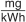
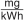

# Verordnung über die Kehrung und Überprüfung von Anlagen (KÜO)

Ausfertigungsdatum
:   2009-06-16

Fundstelle
:   BGBl I: 2009, 1292

Zuletzt geändert durch
:   Art. 1 V v. 2.7.2020 I 1544

Änderung durch
:   Art. 1 V v. 26.10.2021 I 4740 (Nr. 76) textlich nachgewiesen, dokumentarisch noch nicht abschließend bearbeitet

[^F772203_01_BJNR129200009]:     Die Verpflichtungen aus der Richtlinie 98/34/EG des Europäischen
    Parlaments und des Rates vom 22. Juni 1998 über ein
    Informationsverfahren auf dem Gebiet der Normen und technischen
    Vorschriften und der Vorschriften für die Dienste der
    Informationsgesellschaft (ABl. L 204 vom 21.7.1998, S. 37), die
    zuletzt durch Richtlinie 2006/96/EG des Rates vom 20. November 2006
    (ABl. L 363 vom 20.12.2006, S. 81) geändert worden ist, sind beachtet
    worden.

## Eingangsformel

Auf Grund

–   des § 24 Absatz 1 des Schornsteinfegergesetzes in der Fassung der
    Bekanntmachung vom 10. August 1998 (BGBl. I S. 2071), der zuletzt
    durch das Dritte Gesetz zur Änderung des Energieeinsparungsgesetzes
    vom 28. März 2009 (BGBl. I S. 643) geändert worden ist,

–   des § 1 Absatz 1 Satz 2 und des § 4 Absatz 4 des Schornsteinfeger-
    Handwerksgesetzes vom 26. November 2008 (BGBl. I S. 2242)

verordnet das Bundesministerium für Wirtschaft und Technologie:

## § 1 Kehr- oder überprüfungspflichtige Anlagen

(1) Kehr- oder überprüfungspflichtig sind folgende Anlagen:

1.  Abgasanlagen,

2.  Heizgaswege der Feuerstätten,

3.  Räucheranlagen,

4.  notwendige Verbrennungsluft- und Abluftanlagen.

(2) Bei Feuerstätten, Blockheizkraftwerken, Wärmepumpen und ortsfesten
Verbrennungsmotoren für flüssige und gasförmige Brennstoffe darf der
Kohlenmonoxidanteil im Rahmen der Abgaswegüberprüfung bezogen auf
unverdünntes, trockenes Abgas nicht mehr als 1 000 ppm betragen. Bei
Überschreitung dieser Werte ist die Überprüfung in Abhängigkeit von
der konkreten Gefährdungslage spätestens nach sechs Wochen zu
wiederholen. Eine Kohlenmonoxidmessung entfällt bei

1.  gasbeheizten Wäschetrocknern,

2.  Feuerstätten für gasförmige Brennstoffe ohne Gebläse mit
    Verbrennungsluftzufuhr und Abgasabführung durch die Außenwand, deren
    Ausmündung des Abgasaustritts im Bereich von mehr als 3 Meter über
    Erdgleiche liegt und zu Fenstern, Türen und Lüftungsöffnungen einen
    Abstand von mehr als 1 Meter hat,

3.  ortsfesten Netzersatzanlagen (Notstromaggregate).

Die Messungen sind mit geeigneten Messeinrichtungen durchzuführen. Die
eingesetzten Messeinrichtungen sind halbjährlich von einer der Stellen
zu überprüfen, die in § 13 Absatz 3 der Verordnung über kleine und
mittlere Feuerungsanlagen vom 26. Januar 2010 (BGBl. I S. 38) in der
jeweils geltenden Fassung bezeichnet sind.

(3) Von der Kehr- und Überprüfungspflicht sind ausgenommen:

1.  Anlagen nach Absatz 1, die dauerhaft stillgelegt sind, wenn die
    Anschlussöffnungen für Feuerstätten an der Abgasanlage dichte
    Verschlüsse aus nicht brennbaren Stoffen haben, bei Feuerstätten für
    gasförmige Brennstoffe die Gaszufuhr durch Verschluss der Gasleitungen
    dauerhaft unterbunden ist und eine Mitteilung über die dauerhafte
    Stilllegung an die zuständige bevollmächtigte
    Bezirksschornsteinfegerin oder den zuständigen bevollmächtigten
    Bezirksschornsteinfeger schriftlich oder elektronisch erfolgt ist,

2.  freistehende senkrechte Teile der Abgasanlagen mit einem lichten
    Querschnitt von mehr als 10 000 Quadratzentimeter an der Sohle,

3.  frei in Wohnungen oder Aufenthaltsräumen verlaufende demontierbare
    Verbindungsstücke von Einzelfeuerstätten, Etagenheizungen oder
    Heizungsherden für feste oder flüssige Brennstoffe, sofern sie nicht
    von unten in die Schornsteinsohle einmünden und nicht abgedeckt werden
    können,

4.  Heizgaswege von betriebsbereiten, jedoch dauernd unbenutzten Anlagen
    nach Anlage 1 Nummer 1.9 und 2.5 sowie in Feuerstätten von
    kehrpflichtigen Anlagen, sofern es sich bei der Feuerstätte nicht um
    einen offenen Kamin handelt,

5.  dicht geschweißte Abgasanlagen von Blockheizkraftwerken,
    Kompressionswärmepumpen und ortsfesten Verbrennungsmotoren,

6.  gasbeheizte Haushalts-Wäschetrockner mit einer maximalen
    Wärmebelastung bis 6 Kilowatt,

7.  Koch- und Garschränke.

(4) Die Anzahl der Kehrungen oder Überprüfungen richtet sich nach
Anlage 1. Treffen bei Anlagen unterschiedliche Kehr- oder
Überprüfungspflichten zu, so ist die geringste Festsetzung maßgebend.
Bei Anschluss von mehreren Feuerstätten an eine Abgasanlage
(Mehrfachbelegung) richtet sich die Anzahl der Kehrungen oder
Überprüfungen nach der Feuerstätte, für die die höchste Anzahl der
Kehrungen oder Überprüfungen festgesetzt ist. Wurden Anlagen nach
Absatz 3 Nummer 1 zum Zeitpunkt der letzten regulären Kehrung oder
Überprüfung nicht benutzt, sind sie vor Wiederinbetriebnahme zu
überprüfen und erforderlichenfalls zu kehren.

(5) Im Einzelfall kann die zuständige Behörde auf Antrag der
zuständigen bevollmächtigten Bezirksschornsteinfegerin oder des
zuständigen bevollmächtigten Bezirksschornsteinfegers die in Anlage 1
bestimmte Anzahl der Kehrungen oder Überprüfungen erhöhen, wenn es die
Betriebs- und Brandsicherheit erfordert.

(5a) Im Einzelfall kann die zuständige bevollmächtigte
Bezirksschornsteinfegerin oder der zuständige bevollmächtigte
Bezirksschornsteinfeger auf Antrag der Eigentümerin oder des
Eigentümers des Grundstücks oder der Räume für Feuerstätten für feste
Brennstoffe die in Anlage 1 Nummer 1.3, 1.5 und 1.6 bestimmte Anzahl
der Kehrungen auf eine im Kalenderjahr herabsetzen, wenn

1.  eine erkennbar rückstandsarme Verbrennung festgestellt worden ist,

2.  die Betriebs- und Brandsicherheit auch bei einer Herabsetzung
    sichergestellt ist,

3.  die Feuerstätte mindestens die Anforderungen der Stufe 2 nach § 5
    Absatz 1 oder Anlage 4 Nummer 1 der Verordnung über kleine und
    mittlere Feuerungsanlagen einhält und

4.  der für die Feuerstätte benutzte Schornstein nur einfach belegt ist.

Stellt die zuständige bevollmächtigte Bezirksschornsteinfegerin oder
der zuständige bevollmächtigte Bezirksschornsteinfeger erstmals fest,
dass die Voraussetzungen für eine Herabsetzung des Umfangs der
Kehrungen vorliegen, hat sie oder er die Eigentümerin oder den
Eigentümer auf die Möglichkeit eines Antrages nach Satz 1 hinzuweisen.
Eine Herabsetzung kann erstmals nach einer Nutzungsdauer der
Feuerstätte von einem Jahr beantragt werden. Liegen die
Voraussetzungen für die Herabsetzung nicht mehr vor, hat die
zuständige bevollmächtigte Bezirksschornsteinfegerin oder der
zuständige bevollmächtigte Bezirksschornsteinfeger mit dem nächsten
Feuerstättenbescheid die Anzahl der Kehrungen wieder entsprechend der
Anlage 1 festzulegen.

(6) Im Einzelfall kann die zuständige Behörde auf Antrag der
Eigentümerin oder des Eigentümers des Grundstücks oder der Räume und
nach Anhörung der zuständigen bevollmächtigten
Bezirksschornsteinfegerin oder des zuständigen bevollmächtigten
Bezirksschornsteinfegers für kehr- oder überprüfungspflichtige
Anlagen, die nach dem Bundes-Immissionsschutzgesetz genehmigt wurden,
von dieser Verordnung abweichende Regelungen treffen, wenn die
Betriebs- und Brandsicherheit durch besondere brandschutztechnische
Einrichtungen oder andere Maßnahmen sichergestellt ist.

(7) Zuständig für die Aufgaben nach den Absätzen 5 und 6 ist die
Behörde, die gemäß § 23 des Schornsteinfeger-Handwerksgesetzes vom 26.
November 2008 (BGBl. I S. 2242) in der jeweils geltenden Fassung für
die in § 25 Absatz 2 des Schornsteinfeger-Handwerksgesetzes genannten
Aufgaben durch Landesrecht bestimmt ist.

(8) Werden bauliche Maßnahmen, insbesondere der Einbau von
fugendichten Fenstern oder Außentüren oder das Abdichten von Fenstern
oder Außentüren durchgeführt, die eine Änderung der bisherigen
Versorgung der Feuerstätten mit Verbrennungsluft oder der Abgasführung
erwarten lassen, so hat die unmittelbar veranlassende Person
unverzüglich nach Abschluss der Maßnahmen durch die zuständige
bevollmächtigte Bezirksschornsteinfegerin oder den zuständigen
bevollmächtigten Bezirksschornsteinfeger prüfen zu lassen, ob die
öffentlich-rechtlichen Bestimmungen für die Versorgung der Feuerstätte
mit Verbrennungsluft und für die Abführung der Rauch- oder Abgase
eingehalten sind.

## § 2 Besondere Kehrarbeiten

(1) Eine kehrpflichtige Anlage ist auszubrennen, auszuschlagen oder
chemisch zu reinigen, wenn die Verbrennungsrückstände mit den üblichen
Kehrwerkzeugen nicht entfernt werden können. Sie darf nicht
ausgebrannt werden, wenn ihr Zustand oder sonstige gefahrbringende
Umstände entgegenstehen. Ausbrennarbeiten dürfen nur von Personen
durchgeführt werden, die zur selbständigen Ausübung des
Schornsteinfegerhandwerks berechtigt sind. Der Zeitpunkt des
Ausbrennens ist der Eigentümerin oder dem Eigentümer des Grundstücks
oder der Räume oder deren Beauftragten, den Hausbewohnern und dem
Aufgabenträger für den örtlichen Brandschutz vorher mitzuteilen. Nach
dem Ausbrennen ist die Anlage auf Brandgefahren zu überprüfen.

(2) Reinigungsarbeiten an asbesthaltigen Abgas- und Lüftungsanlagen
und Verbrennungsluft- und Abluftanlagen sind von Schornsteinfegerinnen
und Schornsteinfegern nach dem Stand der Technik, insbesondere
entsprechend den Technischen Regeln für Gefahrstoffe 519 „Asbest,
Abbruch-, Sanierungs- oder Instandhaltungsarbeiten“ (Bekanntmachung
des Bundesministeriums für Arbeit und Soziales vom 20. März 2014, GMBl
S. 164, die durch die Bekanntmachung vom 2. März 2015, GMBl S. 136,
geändert worden ist), durchzuführen.

## § 3 Pflichten der bevollmächtigten Bezirksschornsteinfegerin oder des bevollmächtigten Bezirksschornsteinfegers

(1) Die bevollmächtigte Bezirksschornsteinfegerin oder der
bevollmächtigte Bezirksschornsteinfeger hat den Termin der
Feuerstättenschau spätestens fünf Werktage vor der Durchführung
anzukündigen, soweit nicht die Eigentümerin oder der Eigentümer des
Grundstücks oder der Räume oder deren Beauftragter auf die Ankündigung
verzichtet.

(2) Die zuständige bevollmächtigte Bezirksschornsteinfegerin oder der
zuständige bevollmächtigte Bezirksschornsteinfeger setzt die Zeiträume
für die Schornsteinfegerarbeiten nach den Rechtsverordnungen nach § 1
Absatz 1 Satz 2 und 3 des Schornsteinfeger-Handwerksgesetzes und nach
der Verordnung über kleine und mittlere Feuerungsanlagen in den
Feuerstättenbescheiden in möglichst gleichen Zeitabständen fest.
Soweit nicht die Eigentümerin oder der Eigentümer des Grundstücks oder
der Räume oder deren Beauftragter eine getrennte Durchführung wünscht,
setzt die zuständige bevollmächtigte Bezirksschornsteinfegerin oder
der zuständige bevollmächtigte Bezirksschornsteinfeger die Zeiträume
in dem Feuerstättenbescheid so fest, dass Schornsteinfegerarbeiten
innerhalb eines Kalenderjahres in einem gemeinsamen Arbeitsgang
durchgeführt werden können.

(3) Über das Ergebnis der Feuerstättenschau hat die bevollmächtigte
Bezirksschornsteinfegerin oder der bevollmächtigte
Bezirksschornsteinfeger der Eigentümerin oder dem Eigentümer des
Grundstücks oder der Räume eine Bescheinigung auszustellen.

## § 4 Durchführung der Kehr- oder Überprüfungsarbeiten

(1) Die Anlagen sind nach den anerkannten Regeln der Technik zu kehren
oder zu überprüfen. Wird bei der Überprüfung festgestellt, dass eine
Kehrung erforderlich ist, ist diese durchzuführen; dies gilt nicht für
Heizgaswege von Feuerstätten.

(2) Die bei den Arbeiten anfallenden Rückstände sind von der
Schornsteinfegerin oder dem Schornsteinfeger, der oder die die
Arbeiten durchgeführt hat, zu entfernen und in die von der
Eigentümerin oder vom Eigentümer des Grundstücks oder der Räume oder
dessen Beauftragten bereitzustellenden geeigneten Behältnisse zu
füllen.

(3) Über das Ergebnis der Abgaswegüberprüfung ist der Eigentümerin
oder dem Eigentümer des Grundstücks oder der Räume eine Bescheinigung
auszustellen.

## § 5 Formblätter

Für die Formblätter nach § 4 Absatz 1 des Schornsteinfeger-
Handwerksgesetzes und die Bescheinigung nach § 4 Absatz 3 ist ein
Vordruck nach dem Muster der Anlage 2 zu verwenden. Die Bescheinigung
nach § 4 Absatz 3 ist dem Formblatt als Anlage beizufügen. Die in der
Bescheinigung nach § 4 Absatz 3 anzugebende Messgeräte-
Identifikationsnummer setzt sich aus Hersteller-Kurzzeichen,
Typ-/Seriennummer, Prüfstelle und letztem Prüftermin nach Jahr und
Monat zusammen.

## § 6 Gebühren

(1) Gebühren sind für folgende Tätigkeiten zu entrichten:

1.  Feuerstättenschau nach § 14 Absatz 1 des Schornsteinfeger-
    Handwerksgesetzes,

2.  Erlass oder Änderung des Feuerstättenbescheides nach § 14a des
    Schornsteinfeger-Handwerksgesetzes,

3.  anlassbezogene Überprüfung nach § 15 Satz 1 des Schornsteinfeger-
    Handwerksgesetzes, wenn bei der Überprüfung tatsächlich Mängel
    festgestellt wurden,

4.  Mahnung rückständiger Gebühren nach § 20 Absatz 1 Satz 2 des
    Schornsteinfeger-Handwerksgesetzes sowie

5.  Ersatzvornahme nach § 26 des Schornsteinfeger-Handwerksgesetzes.

6.  anlassbezogene Überprüfung nach § 1 Absatz 8,

(2) Eine Mahnung kann ausgesprochen werden, wenn eine rückständige
Gebühr nach Anlage 3 innerhalb von 30 Tagen nach Zugang der
Gebührenrechnung nicht bezahlt wurde. Die Mahngebühr nach Absatz 1
Nummer 4 darf nur einmal je fällige Gebührenrechnung erhoben werden.

(3) Die Gebührensätze richten sich nach den in Anlage 3 festgesetzten
Arbeitswerten. Der Arbeitswert beträgt 1,20 Euro zuzüglich der
gesetzlichen Umsatzsteuer.

## § 7 Begriffsbestimmungen

Bei der Anwendung dieser Verordnung sind die in Anlage 4 aufgeführten
Begriffsbestimmungen zugrunde zu legen.

## § 8 Inkrafttreten, Außerkrafttreten

§ 5 und § 6 in Verbindung mit Anlage 3 Nummer 5.8 dieser Verordnung
treten am Tag nach der Verkündung in Kraft. Im Übrigen tritt diese
Verordnung am 1. Januar 2010 in Kraft.

## Schlussformel

Der Bundesrat hat zugestimmt.

(zu § 1 Absatz 4)

## Anlage 1 Anzahl der Kehrungen und Überprüfungen

(Fundstelle: BGBl. I 2009, 1295 - 1296; bzgl. einzelner Änderungen
vgl. Fußnote)

*    *   Anlagen und deren Benutzung
        (soweit sie nach § 1 der Kehrung oder Überprüfung unterliegen)

    *   Anzahl der
        Kehrungen im
        Kalenderjahr

    *   Anzahl der
        Überprüfungen

*    *   **1**

    *   **Feste Brennstoffe**

    *
    *

*    *   1.1

    *   ganzjährig regelmäßig benutzte Feuerstätte und Räucheranlage

    *   4

    *

*    *   1.2

    *   regelmäßig in der üblichen Heizperiode benutzte Feuerstätte

    *   3

    *

*    *   1.3

    *   Feuerstätte zur Verbrennung von Holzpellets (Brennstoffe nach § 3
        Absatz 1 Nummer 5a 1. BImSchV)

    *   2

    *

*    *   1.4

    *   Blockheizkraftwerk

    *   2

    *

*    *   1.5

    *   nach § 15 1. BImSchV wiederkehrend zu überwachende Feuerstätte

    *   2

    *

*    *   1.6

    *   mehr als gelegentlich, aber nicht regelmäßig benutzte Feuerstätte und
        Räucheranlage

    *   2

    *

*    *   1.7

    *   gelegentlich benutzte Feuerstätte und Räucheranlage

    *   1

    *

*    *   1.8

    *   notwendige Verbrennungsluft- und Abluftanlagen

    *
    *   einmal im
        Kalenderjahr

*    *   1.9

    *   betriebsbereite, jedoch dauernd unbenutzte Feuerstätte

    *
    *   einmal im
        Kalenderjahr

*    *   **2**

    *   **Flüssige Brennstoffe**

    *
    *

*    *   2.1

    *   regelmäßig benutzte Feuerstätte

    *   3

    *

*    *   2.2

    *   mehr als gelegentlich, aber nicht regelmäßig benutzte Feuerstätte

    *   2

    *

*    *   2.3

    *   gelegentlich benutzte Feuerstätte

    *   1

    *

*    *   2.4

    *   Verbrennungsluft- und Abluftanlagen von Anlagen nach
        Nummer 2.1 – 2.3

    *
    *   einmal im
        Kalenderjahr

*    *   2.5

    *   betriebsbereite, jedoch dauernd unbenutzte Feuerstätte

    *
    *   einmal im
        Kalenderjahr

*    *   2.6

    *   nach § 15 1. BImSchV oder der 44. BImSchV wiederkehrend zu
        überwachende Feuerstätte

    *
    *   einmal im
        Kalenderjahr

*    *   2.7

    *   Blockheizkraftwerk, Wärmepumpe, ortsfester Verbrennungsmotor und
        Brennstoffzellenheizgerät

    *
    *   einmal im
        Kalenderjahr

*    *   2.8

    *   Anlage nach Nummer 2.6, die mit schwefelarmem Heizöl nach DIN 51603
        Teil 1 oder anderen leichten Heizölen mit gleichwertiger Qualität
        betrieben wird, sofern es sich um eine raumluftabhängige
        Brennwertfeuerstätte an einer Abgasanlage für Überdruck oder eine
        raumluftunabhängige Feuerstätte handelt

    *
    *   einmal in
        jedem zweiten Kalenderjahr

*    *   2.9

    *   Anlage nach Nummer 2.7, die mit schwefelarmem Heizöl nach DIN 51603
        Teil 1 oder anderen leichten Heizölen mit gleichwertiger Qualität
        betrieben wird

    *
    *   einmal in
        jedem zweiten Kalenderjahr

*    *   2.10

    *   Anlage nach Nummer 2.8 mit selbstkalibrierender kontinuierlicher
        Regelung des Verbrennungsprozesses

    *
    *   einmal in
        jedem dritten Kalenderjahr

*    *   2.11

    *   ortsfeste Netzersatzanlage (Notstromaggregat)

    *
    *   einmal in
        jedem dritten Kalenderjahr

*    *   **3**

    *   **Gasförmige Brennstoffe**

    *
    *

*    *   3.1

    *   raumluftabhängige Feuerstätte

    *
    *   einmal im
        Kalenderjahr

*    *   3.2

    *   raumluftunabhängige Feuerstätte

    *
    *   einmal in
        jedem zweiten Kalenderjahr

*    *   3.3

    *   raumluftabhängige Brennwertfeuerstätte an einer Abgasanlage für
        Überdruck

    *
    *   einmal in
        jedem zweiten Kalenderjahr

*    *   3.4

    *   Blockheizkraftwerk, Wärmepumpe, ortsfester Verbrennungsmotor und
        Brennstoffzellenheizgerät

    *
    *   einmal in
        jedem zweiten Kalenderjahr

*    *   3.5

    *   Anlage nach 3.2 oder 3.3 mit selbstkalibrierender kontinuierlicher
        Regelung des Verbrennungsprozesses

    *
    *   einmal in
        jedem dritten Kalenderjahr

## Anlage 2 (zu § 5)

(Fundstelle: BGBl. I 2013, 762 - 772)

## **Formblatt**

*    *
    *
    *

*    *
    *

*    *
    *   Datum des Feuerstättenbescheides:

*    *
    *

*    *
    *   Objektnummer laut Feuerstättenbescheid:

*    *
    *
    *
    *
    *

*    *
    *   Bevollmächtigte(r) Bezirksschornsteinfeger(in)

    *
    *   Liegenschaft:

    *

*    *
    *
    *
    *
    *

*    *   **Formblatt zum Nachweis**
        **der Durchführung von Schornsteinfegerarbeiten**
[^F780527_01_BJNR129200009BJNE001204119]
        (§ 4 Absatz 1 des Schornsteinfeger-Handwerksgesetzes – SchfHwG – vom
        26\. November 2008
        , BGBl. I S. 2242)

*    *   Folgende Anlagen sind nach der Verordnung über die Kehrung und
        Überprüfung von Anlagen (Kehr- und Überprüfungsordnung – KÜO) vom 16.
        Juni 2009 (BGBl. I S. 1292), nach Rechtsverordnungen nach § 1 Absatz 1
        Satz 3 SchfHwG oder nach der Ersten Verordnung zur Durchführung des
        Bundes-Immissionsschutzgesetzes (Verordnung über kleine und mittlere
        Feuerungsanlagen – 1. BImSchV vom 26. Januar 2010, BGBl. I S. 38)
        jeweils an dem angegebenen Datum gekehrt, überprüft oder überwacht
        worden:

*    *   **Laut Feuerstättenbescheid**

    *   **Datum der**
        **Arbeits-**
        **ausführung**

    *   **Mängel**
        **vorhanden**
        **ja/nein**

    *   Änderungsmitteilung/Mängelart/
        **Bemerkungen**
        **(ggf. Verweis auf gesondertes Blatt)**

*    *   **Nr.**

    *   **Anlage**
        **(Art/Standort oder Verweis auf Anhang)**

*    *
    *
    *
    *
    *

*    *
    *
    *
    *
    *

*    *
    *
    *
    *
    *

*    *
    *
    *
    *
    *

*    *   Name und Anschrift des Schornsteinfegerbetriebes

    *   Die Schornsteinfegerarbeiten sind entsprechend dem
        Feuerstättenbescheid ordnungsgemäß durchgeführt worden.

*    *   Handwerkskammer, bei der der Betrieb in der Handwerksrolle eingetragen
        ist bzw. bei der die Anzeige nach § 9 EU/EWR-Handwerk-Verordnung
        erstattet wurde:

    *   **
        Datum     Unterschrift des ausführenden Schornsteinfegers

*    *   **
        Ausführende(r) Schornsteinfeger(in) (in Druckbuchstaben):
        **

    *

   ## **Gasförmige Brennstoffe**

*    *
    *
    *
    *
    *

*    *
    *   Anschrift des Schornsteinfegerbetriebes

    *
    *   Datum der Arbeitsausführung:

    *

*    *
    *
    *

*    *
    *[^F780527_02_BJNR129200009BJNE001204119]
   [ ] Überprüfung nach § 1 KÜO
        [ ] Wiederholungsmessung nach § 1 Absatz 2 KÜO
        [ ] Erstmessung nach § 14 Absatz 2 1. BImSchV
        [ ] Wiederkehrende Messung nach § 15 Absatz 3 1. BImSchV
        [ ] Wiederholungsmessung nach § 14 Absatz 5 1. BImSchV
        [ ] Wiederholungsmessung nach § 15 Absatz 5 1. BImSchV

    *

*    *
    *
    *

*    *
    *   Ausfertigung für

    *

*    *
    *
    *
    *
    *

*    *
    *   Name und Anschrift des Eigentümers/Verwalters

    *
    *   Betreiber/Aufstellungsort der Anlage:

    *

*    *
    *
    *
    *   Gebäudeteil:

    *

*    *
    *
    *
    *
    *

*    *   **Bescheinigung**

    *   über das Ergebnis der Überprüfung und Messung an einer Feuerstätte für
        gasförmige Brennstoffe gemäß der Verordnung über die Kehrung und
        Überprüfung von Anlagen (Kehr- und Überprüfungsordnung – KÜO) vom 16.
        Juni 2009 (BGBl. I S. 1292), nach Rechtsverordnungen nach § 1 Absatz 1
        Satz 3 SchfHwG oder der Ersten Verordnung zur Durchführung des Bundes-
        Immissionsschutzgesetzes (Verordnung über kleine und mittlere
        Feuerungsanlagen – 1. BImSchV vom 26. Januar 2010, BGBl. I S. 38)

*    *   **Wärmeaustauscher:**                       Hersteller, Typ, Herstell-
        Nr., Errichtung

    *   Leistungsbereich/Leistung bei
        der Messung

    *   Nennleistung

*    *   **Brenner:**                       Hersteller, Typ, Herstell-Nr.,
        Errichtung

    *   Brennerart

    *   Leistungsbereich/Leistung bei
        der Messung

    *   Brennstoff

*    *   Feuerstättenart

    *
    *   Art der Anlage

*    *   Herstellerbescheinigung nach § 6 1. BImSchV () ja () nein

*    *   **Überprüfungsergebnis gemäß KÜO**                        (*
        = in Ordnung, X = mangelhaft, – = nicht zutreffend):

*    *   Verbrennungsluft/Lüftung

    *
    *   Abgasabzug:

    *
    *   Abgasleitung

    *
    *

*    *   Feuerstätte:

    *
    *   – an der Strömungssicherung

    *
    *   O
        2                       -Gehalt im Abgas

    *
    *   %

*    *   – Befestigung/Abstände

    *
    *   – in Brennerhöhe

    *
    *   unverdünnter CO-Gehalt

    *
    *   ppm

*    *   – äußerer Zustand

    *
    *   – an anderer Stelle

    *
    *   O
        2                       -Differenz im Ringspalt

    *
    *   %

*    *   Brenner/Heizgasweg

    *
    *   Abgasklappe

    *
    *   Lufttemperatur im Ringspalt

    *
    *   *                       C

*    *   Flammenbild

    *
    *   Verbindungsstück

    *
    *   Druckdifferenz im Ringspalt

    *
    *   Pa

*    *
        *            *   [ ] Folgende Mängel wurden festgestellt:

            *   [ ] Es wurden keine Mängel festgestellt.

*    *   [ ] Die Mängel stellen z. Zt. noch keine unmittelbare Gefahr dar, eine
        Überprüfung durch einen Fachbetrieb wird empfohlen.
        [ ] Die Mängel sind aus Sicherheitsgründen bis zum ……………… zu
        beseitigen.
        [ ] Aufgrund der festgestellten Mängel ist eine zusätzliche
        Überprüfung der Feuerungsanlage erforderlich.

*    *   **Messergebnis gemäß 1. BImSchV:**

    *   Grenzwert für Abgasverlust

    *   %

*    *   Wärmeträgertemperatur

    *   *                       C

    *   Verbrennungslufttemperatur

    *   *                       C

    *   Abgastemperatur

    *   *                       C

*    *   Sauerstoffgehalt im Abgas

    *   %

    *   Druckdifferenz

    *   Pa

    *   Abgasverlust

    *   **%**

*    *   [ ] Das Messergebnis entspricht der Verordnung.

    *   Messunsicherheit

    *   %

*    *   [ ] Das Messergebnis entspricht **nicht** **
        der Verordnung, weil
        .....
        Der Betreiber ist verpflichtet, die notwendigen Verbesserungsmaßnahmen
        an der Anlage zu treffen.
        Die Messung ist bis zum ****                        ……………………………………………
        zu wiederholen.

*    *   Bemerkungen:

*    *   **Messgeräte-Identifikationsnummer(n)**

    *

*    *
        *            *   **
                Datum

            *   Unterschrift des Schornsteinfegers

    *   Falls Mängel festgestellt worden sind, die innerhalb einer Frist zu
        beseitigen sind, oder das Messergebnis nicht der Verordnung
        entspricht, geben Sie bitte Nachricht, sobald die Mängel beseitigt
        sind bzw. die Wiederholungsmessung erfolgen kann.

## **Flüssige Brennstoffe**

*    *
    *
    *
    *
    *

*    *
    *   Anschrift des Schornsteinfegerbetriebes

    *
    *   Datum der Arbeitsausführung:

    *

*    *
    *
    *

*    *
    *[^F780527_03_BJNR129200009BJNE001204119]
   [ ] Überprüfung nach § 1 KÜO
        [ ] Wiederholungsmessung nach § 1 Absatz 2 KÜO
        [ ] Erstmessung nach § 14 Absatz 2 1. BImSchV
        [ ] Wiederkehrende Messung nach § 15 Absatz 3 1. BImSchV
        [ ] Wiederholungsmessung nach § 14 Absatz 5 1. BImSchV
        [ ] Wiederholungsmessung nach § 15 Absatz 5 1. BImSchV

    *

*    *
    *
    *

*    *
    *   Ausfertigung für

    *

*    *
    *
    *
    *
    *

*    *
    *   Name und Anschrift des Eigentümers/Verwalters

    *
    *   Betreiber/Aufstellungsort der Anlage:

    *

*    *
    *
    *
    *   Gebäudeteil:

    *

*    *
    *
    *
    *
    *

*    *   **Bescheinigung**

    *   über das Ergebnis der Überprüfung und Messung an einer Feuerstätte für
        flüssige Brennstoffe gemäß der Verordnung über die Kehrung und
        Überprüfung von Anlagen (Kehr- und Überprüfungsordnung – KÜO) vom 16.
        Juni 2009 (BGBl. I S. 1292), nach Rechtsverordnungen nach § 1 Absatz 1
        Satz 3 SchfHwG oder der Ersten Verordnung zur Durchführung des Bundes-
        Immissionsschutzgesetzes (Verordnung über kleine und mittlere
        Feuerungsanlagen – 1. BImSchV vom 26. Januar 2010, BGBl. I S. 38)

*    *   **Wärmeaustauscher:**                       Hersteller, Typ, Herstell-
        Nr., Errichtung

    *   Leistungsbereich/Leistung bei
        der Messung

    *   Nennleistung

*    *   **Brenner:**                       Hersteller, Typ, Herstell-Nr.,
        Errichtung

    *   Brennerart

    *   Leistungsbereich/Leistung bei
        der Messung

    *   Brennstoff

*    *   Feuerstättenart

    *
    *   Art der Anlage

*    *   Herstellerbescheinigung nach § 6 1. BImSchV  [ ] Ja   [ ]  Nein

*    *   **Überprüfungsergebnis gemäß KÜO**                        (*
        = in Ordnung, X = mangelhaft, – = nicht zutreffend):

*    *   Verbrennungsluft/Lüftung

    *
    *   Brenner/Heizgasweg

    *
    *   Verbindungsstück

    *
    *

*    *   Feuerstätte:

    *
    *   Abgasabzug:

    *
    *   Abgasleitung

    *
    *

*    *
    *
    *
    *
    *   O
        2                       -Gehalt im Abgas %

    *
    *

*    *   – Befestigung/Abstände

    *
    *   – in Brennerhöhe

    *
    *   unverdünnter CO-Gehalt

    *
    *   ppm

*    *   – äußerer Zustand

    *
    *   – an anderer Stelle

    *
    *   O
        2                       -Differenz im Ringspalt

    *
    *   %

*    *   [ ]  Folgende Mängel wurden festgestellt:

    *   Lufttemperatur im Ringspalt

    *
    *   *                       C

*    *   Druckdifferenz im Ringspalt

    *
    *   Pa

*    *   [ ]  Es wurden keine Mängel festgestellt.

*    *   [ ] Die Mängel stellen z. Zt. noch keine unmittelbare Gefahr dar, eine
        Überprüfung durch einen Fachbetrieb wird empfohlen.
        [ ] Die Mängel sind aus Sicherheitsgründen bis zum ………………………… zu
        beseitigen.
        [ ] Aufgrund der festgestellten Mängel ist eine zusätzliche
        Überprüfung der Feuerungsanlage erforderlich.

*    *
    *   **Grenzwerte:**

    *   Rußzahl

    *
    *   CO-Gehalt

    *   1 300
        

*    *   **Messergebnis gemäß 1. BImSchV:**

    *   Ölderivate

    *   Keine

    *   Abgasverlust

    *   %

*    *   Rußzahl-Einzelwerte

    *
    *
    *
    *   Rußzahl-Mittelwert

    *
    *   Ölderivate

    *
    *   CO-Gehalt

    *        

*    *   Wärmeträgertemperatur

    *   *                       C

    *   Verbrennungslufttemperatur

    *   *                       C

    *   Abgastemperatur

    *   °C

*    *   Sauerstoffgehalt im Abgas

    *   %

    *   Druckdifferenz

    *   Pa

    *   Abgasverlust

    *   %

*    *   [ ] Das Messergebnis entspricht der Verordnung.

    *   Messunsicherheit

    *   %

*    *   [ ] Das Messergebnis entspricht **nicht** **
        der Verordnung, weil …………………………………………………………………………………..
        Der Betreiber ist verpflichtet, die notwendigen Verbesserungsmaßnahmen
        an der Anlage zu treffen.
        Die Messung ist bis zum ………………………… ****                        zu
        wiederholen.

*    *   Bemerkungen:

*    *   **Messgeräte-Identifikationsnummer(n)**

    *

*    *
        *            *   **
                Datum

            *   Unterschrift des Schornsteinfegers

    *   Falls Mängel festgestellt worden sind, die innerhalb einer Frist zu
        beseitigen sind, oder das Messergebnis nicht der Verordnung
        entspricht, geben Sie bitte Nachricht, sobald die Mängel beseitigt
        sind bzw. die Wiederholungsmessung erfolgen kann.

## **Heizkessel für feste Brennstoffe**

*    *
    *
    *
    *
    *

*    *
    *   Anschrift des Schornsteinfegerbetriebes

    *
    *   Datum der Arbeitsausführung:

    *

*    *
    *
    *

*    *
    *[^F780527_04_BJNR129200009BJNE001204119]
   [ ] Überprüfung nach § 14 Absatz 1 1. BImSchV
        [ ] Messung und Überprüfung nach § 14 Absatz 2 1. BImSchV
        [ ] Messung und Überprüfung nach § 15 Absatz 1 bzw. § 25 Absatz 4 1.
        BImSchV
        [ ] Wiederholungsüberprüfung nach § 14 Absatz 5 1. BImSchV
        [ ] Beratung nach § 4 Absatz 8 1. BImSchV

    *

*    *
    *
    *

*    *
    *   Ausfertigung für

    *

*    *
    *
    *
    *
    *

*    *
    *   Name und Anschrift des Eigentümers/Verwalters

    *
    *   Betreiber/Aufstellungsort der Anlage:

    *

*    *
    *
    *
    *   Gebäudeteil:

    *

*    *
    *
    *
    *
    *

*    *   **Bescheinigung**

    *   über das Ergebnis der Überprüfung, Messung und Beratung für eine
        Feuerungsanlage für feste Brennstoffe gemäß der Ersten Verordnung zur
        Durchführung des Bundes-Immissionsschutzgesetzes (Verordnung über
        kleine und mittlere Feuerungsanlagen – 1. BImSchV vom 26. Januar 2010,
        BGBl. I S. 38)

*    *   **Feuerstätte:**                       Hersteller, Typ, Herstell-Nr.

    *   Baujahr

    *   Datum/Jahr der Errichtung

    *   Leistungsbereich/Nennwärmeleistung
        kW

*    *   Feuerstättenbauart

    *   Beschickungsart

    *   Art der Anlage

    *   Teillastmessung
        [ ]  ja  [ ]  nein

*    *   Eingesetzte Brennstoffe nach § 3 Absatz 1 (Nr.)

    *   Wärmespeicher vorhanden
        [ ]  ja  [ ]  nein

    *   Wärmespeichervolumen
        Liter

*    *   Ordnungsgemäßer technischer Zustand der Feuerungsanlage (§ 4 Absatz
        1):

    *   [ ]  ja  [ ] nein

*    *   Vorhandenes Wärmespeichervolumen ausreichend (§ 5 Absatz 4):

    *   [ ]  ja  [ ] nein

*    *   Abstand der Austrittsöffnung des Schornsteins zum Dach ausreichend (§
        19 Absatz 1 Nummer 1):

    *   [ ]  ja  [ ] nein

*    *   Abstand zu Lüftungsöffnungen, Fenstern und Türen ausreichend (§ 19
        Absatz 1 Nummer 2):

    *   [ ]  ja  [ ] nein

*    *   Feuerungsanlage nach Herstellerangaben für verwendete Brennstoffe (§ 4
        Absatz 1) bzw. § 5 Absatz 2 und 3 geeignet:

    *   [ ] ja  [ ]  nein

*    *   **Messergebnis**                        (Werte im Abgas):

    *   Kohlenmonoxidgehalt

    *   Staubgehalt

*    *   Wärmeträgertemperatur
        *                       C

    *   Sauerstoffgehalt
        %

    *   Grenzwert (§ 5 Absatz 1 bzw. § 25 Absatz 2)

    *   g/m
        3

    *   g/m
        3

*    *   Messunsicherheit (Anlage 2 Nummer 2.3)

    *   g/m
        3

    *   g/m
        3

*    *   Abgastemperatur
        *                       C

    *   Druckdifferenz
        Pa

    *   Messwert bezogen auf … % Sauerstoff
        (Anlage 2 Nummer 2.2)

    *   g/m
        3

    *   g/m
        3

*    *   Messwert abzüglich Messunsicherheit
        (Anlage 2 Nummer 2.3)

    *   g/m
        3

    *   g/m
        3

*    *   [ ] Das Ergebnis entspricht der Verordnung.

*    *   [ ] Das Ergebnis entspricht **nicht** **                        der
        Verordnung, weil

*    *   [ ] Die Mängel sind zu beseitigen. Danach ist bis zum
        …………………………………………… eine Wiederholungsüberprüfung erforderlich.
        Geben Sie bitte Nachricht, sobald diese erfolgen kann (§ 14 Absatz 5).

*    *   Beratung wurde in folgenden Punkten durchgeführt
        ****                       (§ 4 Absatz 8, für handbeschickte
        Feuerungsanlagen):
        [ ] Sachgerechte Bedienung der Feuerungsanlage
        [ ] Ordnungsgemäße Lagerung des Brennstoffes
        [ ] Besonderheiten beim Umgang mit festen Brennstoffen

    *   [ ] **Feuchtegehalt im Brennstoff wurde gemessen**
        (§ 3 Absatz 3):
        Mittelwert:     %
        Sofern der Feuchtegehalt … % oder mehr beträgt, ist der Brennstoff vor
        der Verwendung nachzutrocknen.

*    *   **Messgeräte-Identifikationsnummer(n)**

    *

*    *   Bemerkungen:

    *

*    *
        *            *   **
                Datum

            *   Unterschrift des Schornsteinfegers

    *   Falls Mängel festgestellt worden sind, die innerhalb einer Frist zu
        beseitigen sind, oder das Messergebnis nicht der Verordnung
        entspricht, geben Sie bitte Nachricht, sobald die Mängel beseitigt
        sind bzw. die Wiederholungsüberprüfung erfolgen kann.

## **Einzelraumfeuerungsanlagen für feste Brennstoffe**

*    *
    *
    *
    *
    *

*    *
    *   Anschrift des Schornsteinfegerbetriebes

    *
    *   Datum der Arbeitsausführung:

    *

*    *
    *
    *

*    *
    *[^F780527_05_BJNR129200009BJNE001204119]
   [ ] Überprüfung nach § 14 Absatz 1 1. BImSchV
        [ ] Überprüfung nach § 14 Absatz 2 1. BImSchV
        [ ] Überprüfung nach § 15 Absatz 2 1. BImSchV
        [ ] Wiederholungsüberprüfung nach § 14 Absatz 5 1. BImSchV
        [ ] Beratung nach § 4 Absatz 8 1. BImSchV

    *

*    *
    *
    *

*    *
    *   Ausfertigung für

    *

*    *
    *
    *
    *
    *

*    *
    *   Name und Anschrift des Eigentümers/Verwalters

    *
    *   Betreiber/Aufstellungsort der Anlage:

    *

*    *
    *
    *
    *   Gebäudeteil:

    *

*    *
    *
    *
    *
    *

*    *   **Bescheinigung**

    *   über das Ergebnis der Überprüfung und Beratung für eine
        Feuerungsanlage für feste Brennstoffe gemäß der Ersten Verordnung zur
        Durchführung des Bundes-Immissionsschutzgesetzes (Verordnung über
        kleine und mittlere Feuerungsanlagen – 1. BImSchV vom 26. Januar 2010,
        BGBl. I S. 38)

*    *   **Feuerstätte:**                       Hersteller, Typ, Herstell-Nr.

    *   Datum auf dem Typenschild

    *   Datum/Jahr der Errichtung

    *   Leistungsbereich/Nennwärmeleistung
        kW

*    *   Feuerstättenbauart nach Anlage 4

    *   Beschickungsart

    *   Art der Anlage

*    *   Eingesetzte Brennstoffe nach § 3 Absatz 1 (Nr.)

*    *   *                       Positive Prüfbescheinigung liegt vor (§ 4
        Absatz 3 oder Absatz 5 Nummer 2)

*    *   *                       Offener Kamin, zugelassen nur für
        gelegentlichen Betrieb (§ 4 Absatz 4), oder historische Feuerstätte (§
        26 Absatz 3 Nummer 5)

*    *   *                       Einrichtung zur Reduzierung der
        Staubemissionen vorhanden (§ 4 Absatz 5)

*    *   *                       Messung durch eine Schornsteinfegerin oder
        einen Schornsteinfeger positiv (§ 4 Absatz 5 Nummer 1)

*    *   Ordnungsgemäßer technischer Zustand der Feuerungsanlage (§ 4 Absatz
        1):

    *   [ ]  ja  [ ]  nein

*    *   Feuerungsanlage nach Herstellerangaben für verwendete Brennstoffe (§ 4
        Absatz 1) geeignet:

    *   [ ]  ja  [ ]  nein

*    *   Abstand der Austrittsöffnung des Schornsteins zum Dach ausreichend (§
        19 Absatz 1 Nummer 1):

    *   [ ]  ja  [ ]  nein

*    *   Abstand zu Lüftungsöffnungen, Fenstern und Türen ausreichend (§ 19
        Absatz 1 Nummer 2):

    *   [ ]  ja  [ ]  nein

*    *   [ ] Das Ergebnis entspricht der Verordnung.

*    *   [ ] Das Ergebnis entspricht **nicht** **                        der
        Verordnung, weil

*    *   [ ] Die Mängel sind zu beseitigen. Danach ist bis zum
        …………………………………………… eine Wiederholungsüberprüfung erforderlich.
        Geben Sie bitte Nachricht, sobald diese erfolgen kann (§ 14 Absatz 5).

*    *   Beratung wurde in folgenden Punkten durchgeführt
        ****                       (§ 4 Absatz 8, für handbeschickte
        Feuerungsanlagen):
        [ ] Sachgerechte Bedienung der Feuerungsanlage
        [ ] Ordnungsgemäße Lagerung des Brennstoffes
        [ ] Besonderheiten beim Umgang mit festen Brennstoffen

    *   [ ] **Feuchtegehalt im Brennstoff wurde gemessen**
        (§ 3 Absatz 3):
        Mittelwert:     %
        Sofern der Feuchtegehalt … % oder mehr beträgt, ist der Brennstoff vor
        der Verwendung nachzutrocknen.

*    *   Bemerkungen:

    *

*    *   **Messgeräte-Identifikationsnummer(n)**

    *

*    *
        *            *   **
                Datum

            *   Unterschrift des Schornsteinfegers

    *   Falls Mängel festgestellt worden sind, die innerhalb einer Frist zu
        beseitigen sind, oder das Messergebnis nicht der Verordnung
        entspricht, geben Sie bitte Nachricht, sobald die Mängel beseitigt
        sind bzw. die Wiederholungsüberprüfung erfolgen kann.

**Blockheizkraftwerke (BHKW), Wärmepumpen,**
## **ortsfeste Verbrennungsmotoren und Brennstoffzellenheizgeräte**

*    *
    *
    *
    *
    *

*    *
    *   Anschrift des Schornsteinfegerbetriebes

    *
    *   Datum der Arbeitsausführung:

    *

*    *
    *
    *

*    *
    *[^F780527_06_BJNR129200009BJNE001204119]
   [ ] Überprüfung nach § 1 KÜO
        [ ] Wiederholungsüberprüfung nach § 1 Absatz 2 KÜO

    *

*    *
    *
    *

*    *
    *   Ausfertigung für

    *

*    *
    *
    *
    *
    *

*    *
    *   Name und Anschrift des Eigentümers/Verwalters

    *
    *   Betreiber/Aufstellungsort der Anlage:

    *

*    *
    *
    *
    *   Gebäudeteil:

    *

*    *
    *
    *
    *
    *

*    *   **Bescheinigung**

    *   über das Ergebnis der Überprüfung an
        [ ] einem Blockheizkraftwerk (BHKW)
        [ ] einem ortsfesten Verbrennungsmotor
        [ ] einem Notstromaggregat
        für

    *   [ ] einer Wärmepumpe
        [ ] einem Brennstoffzellenheizgerät
        [ ] …

*    *
    *   [ ] gasförmige Brennstoffe   [ ] flüssige Brennstoffe   [ ] feste
        Brennstoffe

*    *   ****

    *   gemäß der Verordnung über die Kehrung und Überprüfung von Anlagen
        (Kehr- und Überprüfungsordnung – KÜO) vom 16. Juni 2009 (BGBl. I S.
        1292) oder nach Rechtsverordnungen nach § 1 Absatz 1 Satz 3 SchfHwG

*    *   **Anlagenbeschreibung:**                       Hersteller, Typ,
        Herstell-Nr., Errichtung

*    *   Nennleistung

    *   Thermische Leistung

    *   Aufstellraum

    *   Raumgröße

*    *   raumluftabhängig   [ ] **Sonstiges:**
        raumluftunabhängig    [ ]

    *

*    *   **Abgasanlage**                        für

*    *   ****                       [ ] Unterdruck (N)

    *   [ ] Überdruck (P)

    *   [ ] hohen Überdruck (H)

    *   [ ] …

    *   [ ] dicht geschweißt

*    *   **Überprüfungsergebnis gemäß KÜO**                        (*
        = in Ordnung, X = mangelhaft, – = nicht zutreffend):

*    *   Verbrennungsluft/Lüftung

    *
    *   Abgasabzug:

    *
    *   O
        2                       -Gehalt im Abgas

    *   %

*    *   Gerät:

    *
    *   – am Gerät

    *
    *   unverdünnter CO-Gehalt

    *   ppm

*    *   – Standsicherheit

    *
    *   – am Abgasstutzen

    *
    *   O
        2                       -Differenz im Ringspalt

    *   %

*    *   – äußerer Zustand

    *
    *   – am Schalldämpfer

    *
    *   Lufttemperatur im Ringspalt

    *   *                       C

*    *   – Abstände

    *
    *   Verbindungsstück

    *
    *   Druckdifferenz im Ringspalt

    *   Pa

*    *   Schalldämpfer

    *
    *   Abgasleitung

    *
    *   Abgastemperatur

    *   *                       C

*    *
        *            *   [ ]  Folgende Mängel wurden festgestellt:

            *   [ ]  Es wurden keine Mängel festgestellt.

*    *   [ ] Die Mängel stellen z. Zt. noch keine unmittelbare Gefahr dar, eine
        Überprüfung durch einen Fachbetrieb wird empfohlen.
        [ ] Die Mängel sind aus Sicherheitsgründen bis zum ……………… zu
        beseitigen.
        [ ] Aufgrund der festgestellten Mängel ist eine zusätzliche
        Überprüfung der Feuerungsanlage erforderlich.

*    *   **Messgeräte-Identifikationsnummer(n)**

    *

*    *
        *            *   **
                Datum

            *   Unterschrift des Schornsteinfegers

    *   Falls Mängel festgestellt worden sind, die innerhalb einer Frist zu
        beseitigen sind, geben Sie bitte Nachricht, sobald die Mängel
        beseitigt sind bzw. die Wiederholungsüberprüfung erfolgen kann.

    Sämtliche Rechtsvorschriften dieses Formblattes beziehen sich auf die
    jeweils geltende Fassung.
[^F780527_01_BJNR129200009BJNE001204119]:     Sämtliche Rechtsvorschriften dieser Bescheinigung beziehen sich auf
    die jeweils geltende Fassung.
[^F780527_02_BJNR129200009BJNE001204119]:     Sämtliche Rechtsvorschriften dieser Bescheinigung beziehen sich auf
    die jeweils geltende Fassung.
[^F780527_03_BJNR129200009BJNE001204119]:     Sämtliche Rechtsvorschriften dieser Bescheinigung beziehen sich auf
    die jeweils geltende Fassung der 1. BImSchV.
[^F780527_04_BJNR129200009BJNE001204119]:     Sämtliche Rechtsvorschriften dieser Bescheinigung beziehen sich auf
    die jeweils geltende Fassung der 1. BImSchV.
[^F780527_05_BJNR129200009BJNE001204119]:     Sämtliche Rechtsvorschriften dieser Bescheinigung beziehen sich auf
    die jeweils geltende Fassung.
[^F780527_06_BJNR129200009BJNE001204119]: 
(zu § 6)

## Anlage 3 Gebührenverzeichnis

(Fundstelle: BGBl. I 2013, 773 - 774)

*    *   Nr.

    *   Bezeichnung

    *   Anzahl der Arbeitswerte

*    *   **1**

    *   **Feuerstättenbescheid**                      (§ 14a SchfHwG)

    *

*    *
    *   Ausstellung und, soweit vom Eigentümer veranlasst, Änderung eines
        Feuerstättenbescheides

    *

*    *   1.1

    *   –

    *   bei bis zu 3 Feuerungsanlagen

    *   10,0

*    *   1.2

    *   –

    *   bei mehr als 3 Feuerungsanlagen

    *   zusätzlich 2,0 für jede weitere Feuerungsanlage, insgesamt höchstens
        30,0 je Feuerstättenbescheid

*    *   1.3

    *   Je zusätzliche Ausfertigung eines Feuerstättenbescheides

    *   2,0

*    *   **2**

    *   **Feuerstättenschau**                      (§ 14 Absatz 1 SchfHwG)

    *

*    *   2.1

    *   Grundwert je Gebäude oder in Sondereigentum stehender Anlage nach § 20
        Absatz 2 SchfHwG einschließlich der ersten Nutzungseinheit

    *   11,7

*    *   2.2

    *   Grundwert für jede weitere Nutzungseinheit

    *   4,0

*    *   2.3

    *   Feuerstättenschau an alleinstehenden Abgasanlagen und Gruppen von
        Abgasanlagen:

    *

*    *   2.3.1

    *   für jeden vollen und angefangenen Meter von senkrechten Teilen

    *   1,0

*    *   2.3.2

    *   für jeden vollen und angefangenen Meter von waagerechten Teilen ab
        einer Länge von 10 Metern

    *   1,0

*    *
    *   Anmerkung:
        Bei Abgasanlagen außerhalb von Gebäuden werden maximal 3 Meter
        berechnet.

    *

*    *   2.4

    *   Zuschlag je Feuerstätte

    *   6,0

*    *   2.5

    *   Zuschläge für erhöhten Arbeitsaufwand

    *

*    *   2.5.1

    *   –

    *   auf den Inseln und Halligen, mit Ausnahme der Inseln, die mit einer
        festen Straßenverbindung mit dem Festland verbunden sind, und der
        Hamburger Hallig, erhöhen sich die Gebühren nach Nummer 2.1 bis Nummer
        2\.4

    *

*    *
    *
    *   1.

    *   für Bezirke auf einer Insel oder Hallig und für Bezirke, die sich auf
        das Festland und Teile von einer Insel erstrecken, um 10 Prozent und

    *

*    *
    *
    *   2.

    *   für Bezirke, die sich auf mehrere Inseln oder Halligen oder das
        Festland und andere als die unter Nummer 1 fallenden Inseln und
        Halligen erstrecken, um 25 Prozent

    *

*    *   2.5.2

    *   –

    *   wenn das Gebäude besonders schwer erreichbar ist, insbesondere
        Berggasthof, Alm, Jagdhütte, Forstdiensthütte, je Minute der Wegezeit
        sowie besondere Auslagen

    *   0,7

*    *   2.6

    *   Zuschlag je Begehung einer Nutzungseinheit, die zweimal jeweils
        mindestens fünf Arbeitstage vor der beabsichtigten Durchführung
        angekündigt und ohne sachlichen Grund verhindert wurde

    *   15,0

*    *   2.7

    *   Zuschlag zu den angefallenen Arbeitswerten je Feuerstättenschau, die
        auf besonderen Wunsch ausgeführt wird

    *

*    *   2.7.1

    *   –

    *   von Montag bis Freitag vor 6.00 Uhr oder nach 18.00 Uhr oder am
        Samstag

    *   in Höhe von 50 Prozent der Beträge

*    *   2.7.2

    *   –

    *   an Sonn- und gesetzlichen Feiertagen

    *   in Höhe von 100 Prozent der Beträge

*    *   **3**

    *   **Sonstige Arbeitsgebühren**

    *

*    *   3.1

    *   Überprüfung des Feuchtegehalts fester Brennstoffe im Rahmen der
        Feuerstättenschau (§ 14 Absatz 1 SchfHwG, § 15 Absatz 2 in Verbindung
        mit § 3 Absatz 3 1. BImSchV)

    *   6,0

*    *   3.2

    *   Überprüfung des Zeitpunktes der Einhaltung der Grenzwerte (§ 25 Absatz
        1 1. BImSchV), Überprüfung des Datums auf dem Typschild der
        Einzelraumfeuerungsanlagen und Information an den Betreiber (§ 14
        Absatz 1 SchfHwG, § 26 Absatz 5 1. BImSchV)

    *   3,0

*    *   3.3

    *   Überprüfung, ob ein Heizkessel, der außer Betrieb genommen werden
        musste, weiterhin betrieben wird (§ 14 Absatz 1 SchfHwG, § 97 Absatz 1
        Nummer 1 GEG)

    *   1,5

*    *   3.4

    *   Überprüfung, ob Wärmeverteilungs- und Warmwasserleitungen, die gedämmt
        werden mussten, weiterhin ungedämmt sind (§ 14 Absatz 1 SchfHwG, § 97
        Absatz 1 Nummer 2 GEG)

    *   1,5

*    *   3.5

    *   Überprüfung, ob ein mit Heizöl beschickter Heizkessel entgegen der
        Regelung nach § 72 Absatz 4 und 5 GEG ab dem 1. Januar 2026 eingebaut
        wurde (§ 14 Absatz 1 SchfHwG, § 97 Absatz 1 Nummer 3 GEG)

    *   10,0

*    *   3.6

    *   Überprüfung des Verschlechterungsverbots (§ 14 Absatz 1 SchfHwG, § 97
        Absatz 2 Nummer 1 GEG)

    *

*    *   3.6.1

    *   bei Feststellung keiner Verschlechterung

    *   5,0

*    *   3.6.2

    *   bei Feststellung einer Verschlechterung

    *   30,0

*    *   3.7

    *   Überprüfung, ob eine Zentralheizung mit bestimmten Einrichtungen
        ausgestattet ist
        (§ 14 Absatz 1 SchfHwG, § 97 Absatz 2 Nummer 2 GEG)

    *   3,0

*    *   3.8

    *   Überprüfung, ob eine Umwälzpumpe in einer Zentralheizung mit einer
        bestimmten Vorrichtung ausgestattet ist (§ 14 Absatz 1 SchfHwG, § 97
        Absatz 2 Nummer 3 GEG)

    *   1,0

*    *   3.9

    *   Überprüfung der Begrenzung der Wärmeabgabe bei Wärmeverteilungs- und
        Warmwasserleitungen sowie Armaturen (§ 14 Absatz 1 SchfHwG, § 97
        Absatz 2 Nummer 4 GEG)

    *   2,0

*    *   3.10

    *   Überprüfung, ob der Eigentümer zur Nachrüstung der Ausstattung von
        Zentralheizungen in bestehenden Gebäuden verpflichtet ist und diese
        Pflicht erfüllt wurde (§ 14 Absatz 1 SchfHwG, § 97 Absatz 4 GEG)

    *   7,0

*    *   3.11

    *   Anlassbezogene Überprüfung der Verbrennungsluftversorgung oder der
        Rauch- oder Abgasführung nach baulichen Maßnahmen (§ 1 Absatz 8)
        soweit eine Bescheinigung über das Ergebnis ausgestellt wird je
        Arbeitsminute

    *   0,8

*    *   3.11.1

    *   bei Überprüfung nach Aktenlage pro Nutzungseinheit jedoch maximal

    *   35,0

*    *   3.11.2

    *   bei Überprüfung mit Termin vor Ort pro Nutzungseinheit jedoch maximal

    *   45,0

*    *   3.12

    *   Anlassbezogene Überprüfung nach § 15 SchfHwG je Arbeitsminute

    *   0,8

*    *   4

    *   Mahnung (§ 20 Absatz 1 Satz 2 SchfHwG) einer rückständigen Gebühr für
        eine Tätigkeit nach dieser Anlage

    *   5,0

*    *   5

    *   Ersatzvornahme (§ 26 SchfHwG)

    *

*    *   5.1

    *   Grundwert

    *   60

*    *   5.2

    *   Je Arbeitsminute
        Anmerkung:
        Der Zeitaufwand umfasst die Tätigkeiten und Wartezeiten vor Ort.

    *   1,0

(zu § 7)

## Anlage 4 Begriffsbestimmungen

(Fundstelle: BGBl. I 2009, 1305 - 1306; bzgl. einzelner Änderungen
vgl. Fußnote)

Es bedeuten die Begriffe:

1.  „Abgasanlage“: Anlage, wie Schornstein, Verbindungsstück,
    Abgasleitung, Luft-Abgas-System oder Abluftschacht nach Nummer 15 b),
    für die Ableitung der Abgase von Feuerstätten und Räucheranlagen,
    sowie eine Anlage zur Abführung von Verbrennungsgasen von
    Blockheizkraftwerken, Wärmepumpen, ortsfesten Verbrennungsmotoren und
    Brennstoffzellenheizgeräten;

2.  „Abgasanlage für Überdruck“: Abgasanlage, bei deren Betrieb der
    statische Druck im Innern höher sein darf als der statische Druck in
    der Umgebung der Abgasanlage in gleicher Höhe;

3.  „Abgaskanal“: Verbindungsstück, das mit Böden, Decken, Wänden oder
    anderen Bauteilen fest verbunden ist;

4.  „Abgasleitung“: Abgasanlage, die nicht rußbrandbeständig sein muss;

5.  „Abgasrohr“: Frei verlaufendes Verbindungsstück;

6.  „Abgasweg“: Heizgasweg und Strömungsstrecke der Abgase innerhalb des
    Verbindungsstücks;

7.  „Blockheizkraftwerk“: Stationärer Motor oder Gasturbine, der oder die
    nach dem Prinzip der Kraft-Wärme-Kopplung sowohl elektrischen Strom
    als auch Wärme produziert;

8.  „Brennstoffzellenheizgerät“: Stationäre Anlage, die die im Brennstoff
    gebundene chemische Energie in einer Brennstoffzelle direkt in
    elektrische Energie umwandelt und die dabei entstehende Wärme für
    Heizzwecke nutzt;

9.  „Brennwertfeuerstätte“: Feuerstätte, bei der die Verdampfungswärme des
    im Abgas enthaltenen Wasserdampfes konstruktionsbedingt durch
    Kondensation nutzbar gemacht wird;

10. „Feuerstätte“: Im oder am Gebäude ortsfest benutzte Anlage, die dazu
    bestimmt ist, durch Verbrennung Wärme zu erzeugen;

11. „Feuerungsanlage“: Einheit von Verbrennungsluftversorgung, Feuerstätte
    oder Räucheranlage und Abgasanlage; wenn mehrere nicht
    überprüfungspflichtige Feuerstätten an eine gemeinsame Abgasanlage
    angeschlossen sind (Mehrfachbelegung), zählt dies als eine
    Feuerungsanlage, wenn mehrere überprüfungspflichtige Feuerstätten an
    eine gemeinsame Abgasanlage angeschlossen sind, zählt jeder Anschluss
    als Feuerungsanlage;

12. „Gebäude“: Selbständig benutzbare, überdeckte bauliche Anlagen, die
    von Menschen betreten werden können und geeignet oder bestimmt sind,
    dem Schutz von Menschen, Tieren oder Sachen zu dienen;

13. „Heizgasweg“: Strömungsstrecke der Verbrennungsgase oder Abgase
    innerhalb der Feuerstätte;

14. „Luft-Abgas-System“: Abgasanlage mit nebeneinander oder ineinander
    angeordneten Schächten, durch die Feuerstätten Verbrennungsluft über
    den Luftschacht aus dem Bereich der Mündung der Abgasanlage zugeführt
    und von denen Abgase über den Abgasschacht ins Freie abgeführt werden;

15. „notwendige Abluftanlage“:

    a)  Schacht oder sonstige Anlage, der oder die zum Betrieb einer
        Feuerstätte oder zur Lüftung eines Raumes mit Feuerstätte erforderlich
        ist und deren Betrieb beeinflussen kann,

    b)  Abluftschacht, der einen Raum entlüftet und Abgase einer Feuerstätte
        ins Freie leitet;

16. „notwendige Verbrennungsluftanlage“: Anlage oder Öffnung zur Zuführung
    von Außenluft zum Zwecke der Verbrennungsluftversorgung der
    Feuerstätte (einschließlich der Öffnung zum Zwecke des
    Verbrennungsluftverbundes);

17. „Nutzungseinheit“: Gebäude oder Teil eines Gebäudes, der selbständig
    nutzbar ist und einen eigenen Zugang hat (z. B. Wohnung);

18. „ortsfester Verbrennungsmotor“: Stationäre Wärmekraftmaschine, die
    durch innere Verbrennung von Treibstoff über Kolben oder eine Turbine
    mechanische Arbeit verrichtet;

19. „Räucheranlage“: Anlage zum Konservieren oder zur
    Geschmacksveränderung von Lebensmitteln, die aus Raucherzeuger,
    Räucherschrank oder -kammer besteht;

20. „Raumluftunabhängige Feuerstätte“: Feuerstätte, der die
    Verbrennungsluft über dichte Leitungen direkt aus dem Freien zugeführt
    wird, und bei der bei einem statischen Überdruck in der Feuerstätte
    gegenüber dem Aufstellraum kein Abgas in Gefahr drohender Menge in den
    Aufstellungsraum austreten kann;

21. „Schornstein“: Senkrechter Teil der Abgasanlage, der rußbrandbeständig
    ist;

22. „Senkrechter Teil der Abgasanlage“: Vom Baugrund oder von einem
    Unterbau ins Freie führender Teil der Abgasanlage;

23. „Verbindungsstück“: Vorrichtung zwischen dem Abgasstutzen der
    Feuerstätte, der Räucheranlage, des Blockheizkraftwerks, der
    Wärmepumpe, des ortsfesten Verbrennungsmotors oder des
    Brennstoffzellenheizgeräts und dem senkrechten Teil der Abgasanlage;

24. „Wärmepumpe“: Maschine, die der Luft, dem Wasser oder dem Erdreich
    Wärme entzieht, diese über verbrennungsmotorisch angetriebene
    Kompressoren oder über Sorptionseinrichtungen von einem niedrigen
    Temperaturniveau auf ein höheres bringt und damit für Heizzwecke bzw.
    Warmwasserbereitung nutzbar macht.

