# Verordnung betreffend die Aufsicht über die Geschäftstätigkeit in der privaten Krankenversicherung (KVAV)

Ausfertigungsdatum
:   2016-04-18

Fundstelle
:   BGBl I: 2016, 780

Zuletzt geändert durch
:   Art. 6 Abs. 9 G v. 19.12.2018 I 2672

## Eingangsformel

Das Bundesministerium der Finanzen verordnet auf Grund

–   des § 160 Satz 1 Nummer 6 in Verbindung mit Satz 3 des
    Versicherungsaufsichtsgesetzes vom 1. April 2015 (BGBl. I S. 434),

–   des § 160 Satz 1 Nummer 1 bis 5 und 7 in Verbindung mit Satz 3 des
    Versicherungsaufsichtsgesetzes vom 1. April 2015 (BGBl. I S. 434) im
    Einvernehmen mit dem Bundesministerium der Justiz und für
    Verbraucherschutz:

## Kapitel 1 - Methoden zur Berechnung der Prämien und Rückstellungen

### § 1 Versicherungsmathematische Methoden in der Krankenversicherung

Versicherungsmathematische Methoden zur Berechnung der Prämien und
Rückstellungen in der nach Art der Lebensversicherung betriebenen
Krankenversicherung sind die nach den anerkannten Regeln der
Versicherungsmathematik unter Verwendung der in den §§ 2 und 4 bis 8
näher bezeichneten Rechnungsgrundlagen erfolgenden Berechnungen der
Prämien und der Alterungsrückstellungen nach Maßgabe der §§ 3, 10, 11,
13, 14 und 18.

### § 2 Rechnungsgrundlagen

(1) Rechnungsgrundlagen sind:

1.  der Rechnungszins,

2.  die Ausscheideordnung,

3.  die Kopfschäden,

4.  der Sicherheitszuschlag,

5.  die sonstigen Zuschläge und

6.  die Übertrittswahrscheinlichkeiten zur Berechnung des
    Übertragungswertes nach § 14.

(2) Weitere Rechnungsgrundlagen sind die Krankheitsdauern und die
Leistungstage, die Anzahl der Krankenhaus- und der Pflegetage, die
Krankenhaus-, die Pflegehäufigkeiten, die Krankheits- und die
Pflegekosten bezogen auf den Leistungstag sowie andere geeignete
Rechnungsgrundlagen, die zur Festlegung der Kopfschäden oder
Ausscheidewahrscheinlichkeiten erforderlich sind.

(3) Die Rechnungsgrundlagen sind mit ausreichenden Sicherheiten zu
versehen.

### § 3 Gleiche Rechnungsgrundlagen

Für die Berechnung der Prämie und der Alterungsrückstellung sind die
gleichen Rechnungsgrundlagen zu verwenden.

### § 4 Rechnungszins

Der Rechnungszins für die Prämienberechnung und die Berechnung der
Alterungsrückstellung darf 3,5 Prozent nicht übersteigen.

### § 5 Ausscheideordnung

(1) Die Ausscheideordnung enthält die Annahmen zur
Sterbewahrscheinlichkeit und zu sonstigen Abgangswahrscheinlichkeiten,
die unter dem Gesichtspunkt vorsichtiger Risikoeinschätzung
festzulegen und regelmäßig zu überprüfen sind.

(2) In der privaten Pflege-Pflichtversicherung und bei Gewährung von
Versicherung im Basistarif nach § 152 des
Versicherungsaufsichtsgesetzes dürfen außer den
Sterbewahrscheinlichkeiten sowie den Wahrscheinlichkeiten des Abgangs
zur sozialen Pflegeversicherung und gesetzlichen Krankenversicherung
keine weiteren Abgangswahrscheinlichkeiten berücksichtigt werden.

### § 6 Kopfschäden

(1) Kopfschäden sind die im Beobachtungszeitraum auf einen
Versicherten entfallenden durchschnittlichen Versicherungsleistungen;
sie sind für jeden Tarif in Abhängigkeit vom Alter des Versicherten zu
ermitteln. Der Beobachtungszeitraum erstreckt sich auf
zusammenhängende zwölf Monate; er ist für jeden Tarif gesondert
festzulegen und kann nur aus wichtigem Grund im unmittelbaren
Anschluss an eine Prämienanpassung geändert werden.

(2) Werden bei Neueinführung eines Tarifs andere als die von der
Bundesanstalt für Finanzdienstleistungsaufsicht (Bundesanstalt)
veröffentlichten Wahrscheinlichkeitstafeln verwendet, so sind die
ihnen zugrundeliegenden Annahmen durch geeignete Statistiken zu
belegen. Weichen die tariflichen Leistungen von denen ab, die den von
der Bundesanstalt veröffentlichten Tafeln zugrunde liegen, so sind die
für den neuen Tarif vorgesehenen Kopfschäden entsprechend abzuändern.

(3) Bei der Ermittlung der rechnungsmäßigen Kopfschäden für einen
bestehenden Tarif sind für die einzelnen Bestandsgruppen die
tatsächlichen Schadenergebnisse früherer Jahre mit einzubeziehen und
mathematisch-statistische Verfahren zum Ausgleich von
Zufallsschwankungen zu verwenden. Ist wegen geringer Bestandsgröße der
Ausgleich von Zufallsschwankungen auf diese Weise nicht zu erreichen,
so sind Stütztarife zu verwenden. Liegen auch keine Stütztarife vor,
so ist der Schadenbedarf nach mathematisch-statistischen Grundsätzen
zu schätzen.

(4) Die Teilkopfschäden für Leistungen nach § 25 Satz 1 Nummer 2 sind
für alle Alter gesondert zu ermitteln. Die entsprechenden
rechnungsmäßigen Teilkopfschäden sind auf alle Alter gleichmäßig zu
verteilen.

### § 7 Sicherheitszuschlag

In die Prämie ist ein Sicherheitszuschlag von mindestens 5 Prozent der
Bruttoprämie einzurechnen, der nicht bereits in anderen
Rechnungsgrundlagen enthalten sein darf.

### § 8 Grundsätze für die Bemessung der sonstigen Zuschläge

(1) Die sonstigen Zuschläge umfassen

1.  die unmittelbaren Abschlusskosten,

2.  die mittelbaren Abschlusskosten,

3.  die Schadenregulierungskosten,

4.  die sonstigen Verwaltungskosten,

5.  den Zuschlag für eine erfolgsunabhängige Beitragsrückerstattung,

6.  bei substitutiven Krankenversicherungen den Zuschlag zur Umlage der
    Begrenzung der Beitragshöhe im Basistarif gemäß § 154 des
    Versicherungsaufsichtsgesetzes,

7.  für den Basistarif zusätzlich den Zuschlag zur Umlage der
    Mehraufwendungen durch Vorerkrankungen und

8.  den Zuschlag für den Standardtarif.

(2) Für die Bemessung der sonstigen Zuschläge sind die tatsächlichen
Aufwendungen jeweils gesondert zu erfassen. Die sonstigen Zuschläge
sind so zu bemessen, dass sie die Aufwendungen rechnungsmäßig decken.

(3) Unmittelbare Abschlusskosten dürfen durch Zillmerung nur in einer
solchen Höhe in die Prämien eingerechnet werden, dass die
Gesamtalterungsrückstellung eines Zugangsjahres im Tarif höchstens
vier Jahre und jede Einzelalterungsrückstellung nicht länger als
fünfzehn Jahre und nicht länger als die Hälfte der tariflich
vorgesehenen künftigen Vertragsdauer negativ ist. Ist außer in den
Fällen des § 10 Absatz 4 vereinbart, dass sich die Prämie während der
Vertragslaufzeit verändert, ohne dass dies durch Anpassungen der
Prämie an eine Veränderung des tatsächlichen Schadenbedarfs oder
Änderungen des Leistungsumfangs bedingt wäre, darf die Höhe der
eingerechneten unmittelbaren Abschlusskosten nicht von der Höhe
abweichen, die sich ohne diese Vereinbarung ergeben würde. Werden die
unmittelbaren Abschlusskosten von Versicherungsverträgen teilweise
durch einen laufenden Zuschlag gedeckt, darf dieser betragsmäßig
während der Versicherungsdauer nur dann erhöht werden, wenn er nach
Vollendung des 65. Lebensjahres entfällt.

(4) In die Prämien dürfen mit Ausnahme der Zillmerung und der
Zuschläge gemäß Absatz 1 Nummer 6 und 8 nur altersunabhängige absolute
Kostenzuschläge eingerechnet werden; die Einrechnung laufender
Zuschläge für die unmittelbaren Abschlusskosten ist nach Maßgabe des
Absatzes 3 Satz 3 zulässig. Soweit in Tarifen die altersmäßige
Bestandsverteilung vom Gesamtbestand des Unternehmens erheblich
abweicht, sind zur Ermittlung der Stückkostenzuschläge Modellbestände
zu verwenden. Hierdurch entstehende Kostenunterdeckungen sind in den
anderen, für den Neuzugang offenen Tarifen zu berücksichtigen.
Zulässig ist auch ein Kostenzuschlagssystem, bei dem die prozentualen
Kostenzuschläge bei Prämienanpassungen auf Dauer nur auf die
Teilprämien bezogen werden, die der aktuellen Tarifprämie zum
ursprünglichen Eintrittsalter entsprechen. Satz 1 gilt nicht für die
Prämienberechnung für Kinder und Jugendliche, für Ausbildungs-,
Krankenhaustagegeld-, Krankentagegeld-, Kurtagegeld- und
Pflegetagegeldtarife.

(5) Soweit vereinbart, muss in die Prämien der Tarife, die zum Wechsel
in den Standardtarif nach § 257 des Fünften Buches Sozialgesetzbuch
berechtigen, ein gesonderter Zuschlag zur Gewährleistung der
Beitragsgarantie im Standardtarif und des unternehmensübergreifenden
Ausgleichs eingerechnet werden. Dieser Zuschlag entfällt für die
Versicherten, die das 65. Lebensjahr vollendet haben.

### § 9 Dokumentationspflichten

Alle rechnungsmäßigen Ansätze hat das Versicherungsunternehmen in
überprüfbarer Weise zu belegen.

### § 10 Prämienberechnung

(1) Die Prämienberechnung hat nach den anerkannten Regeln der
Versicherungsmathematik für jede versicherte Person altersabhängig
getrennt für jeden Tarif mit einem dem Grunde und der Höhe nach
einheitlichen Leistungsversprechen unter Verwendung der maßgeblichen
Rechnungsgrundlagen und einer nach Einzelaltern erstellten
Prämienstaffel zu erfolgen. Jede Beobachtungseinheit eines Tarifs hat
das Versicherungsunternehmen getrennt zu kalkulieren. Es dürfen nur
risikogerechte Prämien kalkuliert werden.

(2) Der Teil der Prämie, der zur Finanzierung des Übertragungswerts
nach § 14 erforderlich ist, ist für den Vollversicherungsschutz jeder
versicherten Person einheitlich zu kalkulieren.

(3) Abweichend von Absatz 1 dürfen Versicherte bis zur Vollendung des
16\. Lebensjahres in der Altersgruppe der Kinder, bis zur Vollendung
des 21. Lebensjahres in der Altersgruppe der Jugendlichen geführt
werden. Dabei darf die Altersgruppe der Jugendlichen nicht mehr Alter
umfassen als die der Kinder. In Ausbildungstarifen können
Eintrittsaltersgruppen gebildet werden, die höchstens fünf
Eintrittsalter umfassen.

(4) Planmäßig steigende Prämien dürfen für Versicherte kalkuliert
werden, die das 21. Lebensjahr noch nicht vollendet haben, sowie in
Ausbildungstarifen bis zum vollendeten 39. Lebensjahr der
Versicherten.

(5) Für die Prämienberechnung des Neuzugangs sind die Formeln des
Abschnitts A der Anlage 1 oder andere geeignete Formeln, die den
anerkannten Regeln der Versicherungsmathematik entsprechen, zu
verwenden.

### § 11 Berechnung der Prämien bei Prämienanpassung

(1) Die Berechnung der Prämien bei Prämienanpassungen hat nach den für
die Prämienberechnung geltenden Grundsätzen zu erfolgen. Dabei ist dem
Versicherten der ihm kalkulatorisch zugerechnete Anteil der
Alterungsrückstellung nach § 341f des Handelsgesetzbuchs vollständig
prämienmindernd anzurechnen; dies gilt nicht für den Teil, der auf die
Anwartschaft zur Prämienermäßigung nach § 150 Absatz 2 des
Versicherungsaufsichtsgesetzes entfällt und der betragsmäßig
anlässlich der Prämienanpassung unverändert bleibt, soweit er nicht
prämienmindernd verwendet wird.

(2) Für die Prämienberechnung bei Prämienanpassungen sind die Formeln
des Abschnitts B der Anlage 1 oder andere geeignete Formeln, die den
anerkannten Regeln der Versicherungsmathematik entsprechen, zu
verwenden. Eine dabei erforderliche Absenkung des Rechnungszinses um
mehr als 0,4 Prozentpunkte kann stufenweise in Zeiträumen von 12
Monaten ab dem Zeitpunkt der Prämienanpassung erfolgen, wobei sich die
Höchstzahl der Stufen aus der gleichmäßigen Verteilung der
erforderlichen Absenkung auf Stufen von 0,3 Prozentpunkten ergibt.
Weitere Möglichkeiten der Verwendung von Mitteln zur Begrenzung von
Prämienerhöhungen bleiben unberührt. In die Prämien der Versicherten,
die das 45. Lebensjahr vollendet haben, dürfen keine erneuten
einmaligen Kosten eingerechnet werden.

## Kapitel 2 - Tarifwechsel

### § 12 Tarife mit gleichartigem Versicherungsschutz

(1) Als Krankenversicherungstarife mit gleichartigem
Versicherungsschutz, in die der Versicherte zu wechseln berechtigt
ist, sind Tarife anzusehen, die gleiche Leistungsbereiche wie der
bisherige Tarif umfassen und für die der Versicherte
versicherungsfähig ist. Leistungsbereiche sind insbesondere:

1.  Kostenerstattung für ambulante Heilbehandlung,

2.  Kostenerstattung für stationäre Heilbehandlung sowie
    Krankenhaustagegeldversicherungen mit Kostenersatzfunktion,

3.  Kostenerstattung für Zahnbehandlung und Zahnersatz,

4.  Krankenhaustagegeld, soweit es nicht zu Nummer 2 gehört,

5.  Krankentagegeld,

6.  Kurtagegeld und Kostenerstattung für Kuren sowie

7.  Pflegekosten und -tagegeld.

(2) Versicherungsfähigkeit ist eine personengebundene Eigenschaft des
Versicherten, deren Wegfall zur Folge hat, dass der Versicherte
bedingungsgemäß nicht mehr in diesem Tarif versichert bleiben kann.

(3) Keine Gleichartigkeit besteht

1.  zwischen einem gesetzlichen Versicherungsschutz mit Ergänzungsschutz
    der privaten Krankenversicherung und einer substitutiven
    Krankenversicherung sowie

2.  zwischen einem Versicherungsschutz in der Pflegekosten- und
    Pflegetagegeldversicherung ohne Pflegezulageberechtigung und einer
    Pflege-Zusatzversicherung mit Pflegezulageberechtigung gemäß § 127 des
    Elften Buches Sozialgesetzbuch.

(4) Schließt der Versicherte unter Kündigung des bisherigen Vertrags
gleichzeitig einen Vertrag über einen Basistarif bei einem anderen
Krankenversicherer ab, sind Zusatzversicherungen, welche Leistungen
abdecken, die im bisherigen Versicherungsschutz, nicht jedoch im
Basistarif enthalten sind, und für die der Versicherte
versicherungsfähig ist, als Tarife mit gleichartigem
Versicherungsschutz anzusehen.

### § 13 Anrechnung der erworbenen Rechte und der Alterungsrückstellung bei einem Tarifwechsel

(1) Bei einem Wechsel in Tarife mit gleichartigem Versicherungsschutz
ist für jeden Leistungsbereich dem Versicherten der ihm kalkulatorisch
zugerechnete Anteil der Alterungsrückstellung nach § 341f des
Handelsgesetzbuchs mit Ausnahme des Teils, der auf die Anwartschaft
zur Prämienermäßigung nach § 150 Absatz 2 des
Versicherungsaufsichtsgesetzes entfällt und der betragsmäßig
anlässlich des Tarifwechsels unverändert bleibt, vollständig
prämienmindernd anzurechnen. Die Anrechnung kann so weit begrenzt
werden, dass die für diesen Leistungsbereich zu zahlende anteilige
Prämie die Prämie zum ursprünglichen Eintrittsalter nicht
unterschreitet. In diesem Fall ist der nicht angerechnete Teil der
Alterungsrückstellung der Rückstellung zur Prämienermäßigung im Alter
des Versicherten gutzuschreiben. Das ursprüngliche Eintrittsalter ist
das Alter des Versicherten, zu dem für ihn erstmals nach Vollendung
des 21. Lebensjahres eine auf die gesamte Vertragslaufzeit bezogene
Alterungsrückstellung bei dem Krankenversicherungsunternehmen gebildet
worden ist.

(2) Bei Versicherten, die nach einem Wechsel gemäß § 204 Absatz 1
Nummer 2b des Versicherungsvertragsgesetzes im Basistarif versichert
sind, wird bei einem Wechsel in Tarife mit gleichartigem
Versicherungsschutz während der ersten 18 Monate seit Beginn der
Versicherung im Basistarif abweichend von Absatz 1 Satz 1 nur die seit
Beginn der Versicherung im Basistarif gebildete Alterungsrückstellung
prämienmindernd angerechnet. Bei Versicherten, die nach einem Wechsel
gemäß § 14 Absatz 5 Satz 2 im Basistarif eines dritten
Krankenversicherers versichert sind, wird bei einem Wechsel in Tarife
mit gleichartigem Versicherungsschutz nur der Betrag angerechnet, der
seit dem erstmaligen Wechsel in den Basistarif entstanden ist. Der
nicht angerechnete Teil der Alterungsrückstellung ist in diesen Fällen
zugunsten der Senkung des Zuschlags gemäß § 8 Absatz 1 Nummer 7 zu
verwenden.

(3) Der Wegfall eines Leistungsbereiches kann als Teilstorno angesehen
werden. Dies gilt auch, wenn der Versicherte lediglich einen Teil des
Tagegeldes innerhalb der Leistungsbereiche nach § 12 Absatz 1 Satz 2
Nummer 2 und 4 bis 7 kündigt. Ist der Versicherte bedingungsgemäß
verpflichtet, seinen Versicherungsschutz herabzusetzen, ist ihm die
vorhandene Alterungsrückstellung entsprechend Absatz 1 anzurechnen.
Wenn eine Rückstellung für Beitragsermäßigung im Alter nicht zu bilden
ist, ist die Alterungsrückstellung über die Begrenzung nach Absatz 1
Satz 2 hinaus prämienmindernd anzurechnen.

(4) Stellt der Versicherte nach einer Herabsetzung nach Absatz 3 Satz
3 seinen ursprünglichen Versicherungsschutz innerhalb von fünf Jahren
ganz oder teilweise wieder her, ist der nach Absatz 1 Satz 3 zum
Zeitpunkt der Herabsetzung gutgeschriebene Teil der
Alterungsrückstellung sofort prämienmindernd anzurechnen.

(5) Für die Prämienberechnung bei Umstufungen sind die Formeln des
Abschnitts B der Anlage 1 oder andere geeignete Formeln, die den
anerkannten Regeln der Versicherungsmathematik entsprechen, zu
verwenden. Bei einer Umstufung, die zu einer niedrigeren Prämie führt,
sowie bei Wiederherstellung des ursprünglichen Versicherungsschutzes
nach Absatz 4 dürfen nicht erneut einmalige Abschlusskosten
eingerechnet werden.

### § 14 Übertragungswert

(1) Der Übertragungswert gemäß § 146 Absatz 1 Nummer 5 des
Versicherungsaufsichtsgesetzes für ab dem 1. Januar 2009
abgeschlossene Verträge berechnet sich als Summe aus

1.  der Alterungsrückstellung, die aus dem Beitragszuschlag nach § 149 des
    Versicherungsaufsichtsgesetzes entstanden ist, und

2.  der Alterungsrückstellung für die gekündigten Tarife bis zur Höhe der
    fiktiven Alterungsrückstellung; ergibt sich ein negativer Wert, wird
    er durch Null ersetzt.

Die Alterungsrückstellung für die gekündigten Tarife ist die gemäß §
341f Absatz 1 des Handelsgesetzbuchs berechnete Alterungsrückstellung,
mindestens jedoch der Betrag der Alterungsrückstellung, der sich bei
gleichmäßiger Verteilung der kalkulierten Abschluss- und
Vertriebskosten, die mittels Zillmerung finanziert werden, auf die
ersten fünf Versicherungsjahre ergibt. Die fiktive
Alterungsrückstellung ist die Alterungsrückstellung, die sich ergeben
hätte, wenn der Versicherte von Beginn an im Basistarif versichert
gewesen wäre. Bei ihrer Berechnung sind die Rechnungsgrundlagen des
brancheneinheitlichen Basistarifs nach § 152 des
Versicherungsaufsichtsgesetzes zu verwenden.

(2) Der Übertragungswert für vor dem 1. Januar 2009 abgeschlossene
Verträge berechnet sich als Summe aus

1.  der Alterungsrückstellung, die aus dem Beitragszuschlag nach § 149 des
    Versicherungsaufsichtsgesetzes entstanden ist, und

2.  der Alterungsrückstellung für die gekündigten Tarife bis zur Höhe der
    fiktiven Alterungsrückstellung; ergibt sich ein negativer Wert, wird
    er durch Null ersetzt.

Die Alterungsrückstellung für die gekündigten Tarife ist die gemäß §
341f Absatz 1 des Handelsgesetzbuchs berechnete Alterungsrückstellung.
Die fiktive Alterungsrückstellung ist die Alterungsrückstellung, die
sich ergeben hätte, wenn der Versicherte von Beginn an im Basistarif
versichert gewesen wäre. Sie wird ermittelt aus dem anrechenbaren
Alter des Versicherten und der zu diesem Alter und zu dem erreichten
Alter gehörenden Alterungsrückstellung, die sich aus den
Rechnungsgrundlagen der Erstkalkulation des brancheneinheitlichen
Basistarifs gemäß § 152 des Versicherungsaufsichtsgesetzes ergibt;
dabei wird ein brancheneinheitlicher Zillmersatz von drei
Monatsbeiträgen zugrunde gelegt. Das anrechenbare Alter ergibt sich
aus dem Vergleich der gezahlten Tarifbeiträge, ohne Berücksichtigung
der aus der Rückstellung für Beitragsrückerstattung finanzierten
Bestandteile, in den zum 8. Januar 2009 geführten Tarifen der
substitutiven Krankenversicherung mit den dann gültigen
Neugeschäftsbeiträgen.

(3) Für Versicherte, die unter Mitgabe eines Übertragungswertes gemäß
Absatz 1 oder 2 zu einem anderen Unternehmen gewechselt sind, darf die
Finanzierung erneuter Abschlusskosten durch Zillmerung nicht zu einer
Reduzierung dieses Übertragungswertes führen. Dies gilt auch für eine
gleichzeitig gewechselte private Pflege-Pflichtversicherung.

(4) Kündigt ein Versicherter, dessen Vertrag vor dem 1. Januar 2009
geschlossen wurde, seinen Vertrag und schließt gleichzeitig einen
neuen Vertrag bei einem anderen Krankenversicherer, der die Mitgabe
eines Übertragungswertes vorsieht, beschränkt sich der
Übertragungswert abweichend von Absatz 2 auf den Betrag, der ab dem
Wechsel in einen Tarif mit Übertragungswert aufgebaut wurde, sofern
nicht Absatz 5 etwas anderes bestimmt. Der bei Wechseln aus dem
Basistarif nicht gutgebrachte Teil der Alterungsrückstellung ist
zugunsten der Senkung des Zuschlags gemäß § 8 Absatz 1 Nummer 7 zu
verwenden.

(5) Ist der Vertrag vor dem 1. Januar 2009 abgeschlossen worden und
wechselt der Versicherte gemäß § 204 Absatz 1 Satz 1 des
Versicherungsvertragsgesetzes in den Basistarif des eigenen oder eines
anderen Versicherers, berechnet sich der Übertragungswert nach Absatz
2\. Bei einer Kündigung des Vertrages, in den der Versicherte nach Satz
1 gewechselt ist, mit gleichzeitigem Abschluss einer neuen
Versicherung im Basistarif eines dritten Krankenversicherers berechnet
sich der Übertragungswert gemäß Absatz 1, wenn zwischen dem Abschluss
des zweiten und des dritten Vertrages mindestens 18 Monate verstrichen
sind. Der bei Wechseln aus dem Basistarif nicht gutgebrachte Teil der
Alterungsrückstellung ist zugunsten der Senkung des Zuschlags gemäß §
8 Absatz 1 Nummer 7 zu verwenden.

(6) Wechselt der Versicherte in der Pflege-Pflichtversicherung zu
einem anderen Unternehmen, so gilt die Alterungsrückstellung als
Übertragungswert im Sinne des § 148 Satz 2 des
Versicherungsaufsichtsgesetzes.

## Kapitel 3 - Prämienanpassung

### § 15 Verfahren zur Gegenüberstellung der erforderlichen und der kalkulierten Versicherungsleistungen

(1) Die Gegenüberstellung nach § 155 Absatz 3 Satz 1 und 2 des
Versicherungsaufsichtsgesetzes ist jährlich und für jede
Beobachtungseinheit eines Tarifs getrennt durchzuführen. Kinder und
Jugendliche können als einheitliche Beobachtungseinheit
zusammengefasst werden. Der Beobachtungszeitraum ist der nach § 6
Absatz 1 Satz 2 maßgebliche Zeitraum. Die erforderlichen
Versicherungsleistungen sind aus den beobachteten abzuleiten. Hierzu
sind die Leistungen und die zugehörigen Bestände auf die
Beobachtungszeiträume abzugrenzen. Ferner sind Wartezeit- und
Selektionsersparnisse sowie erhobene Risikozuschläge zu
berücksichtigen.

(2) Die tatsächlichen Grundkopfschäden der letzten drei
Beobachtungszeiträume sind nach der Formel des Abschnitts A der Anlage
2 zu ermitteln. Soweit sich im Tarif Leistungsänderungen ergeben
haben, sind die tatsächlichen Grundkopfschäden auf das aktuelle
Leistungsversprechen umzurechnen.

(3) Die Berechnung der erforderlichen Versicherungsleistungen erfolgt
nach der Formel des Abschnitts B der Anlage 2. Bei der
Gegenüberstellung nach § 155 Absatz 3 Satz 2 des
Versicherungsaufsichtsgesetzes ist der tatsächliche, auf den 18 Monate
nach Ende des letzten Beobachtungszeitraumes liegenden Zeitpunkt
extrapolierte Grundkopfschaden mit dem Grundkopfschaden, der für das
Ende dieses Zeitraumes rechnungsmäßig festgelegt ist, zu vergleichen.
Die Verwendung gleichwertiger Verfahren zur Berechnung der
erforderlichen Versicherungsleistungen ist zulässig, wenn das
Versicherungsunternehmen zum Zeitpunkt der Einführung eines Tarifes
dieses Verfahren der Aufsichtsbehörde unter Angabe der Formeln und
Beifügung der versicherungsmathematischen Herleitung darlegt. Bei
bestehenden Tarifen kann auf ein anderes Verfahren nur aus wichtigem
Grund in unmittelbarem Anschluss an eine Prämienanpassung übergegangen
werden; Satz 3 gilt entsprechend.

(4) Ist in einer Beobachtungseinheit eines Tarifes die Anzahl der
Versicherten nicht ausreichend groß, um die Schadenerwartung
statistisch gesichert zu ermitteln, ist die Gegenüberstellung der
erforderlichen und der kalkulierten Versicherungsleistungen anhand des
Schadenverlaufs der Tarife vorzunehmen, deren Rechnungsgrundlagen zur
Erstkalkulation verwendet worden sind. Sind bei der Erstkalkulation
die von der Bundesanstalt veröffentlichten Wahrscheinlichkeitstafeln
verwendet worden, so sind die erforderlichen Versicherungsleistungen
anhand dieser Wahrscheinlichkeitstafeln zu berechnen. Die von der
Bundesanstalt veröffentlichten Wahrscheinlichkeitstafeln sind auch
dann zu verwenden, wenn das Unternehmen auf die Rechnungsgrundlagen
der Erstkalkulation nach Satz 1 nicht zurückgreifen kann. Ist die
Erstkalkulation in anderer Weise vorgenommen worden, so sind die
erforderlichen Versicherungsleistungen auf Grund vergleichbar
aussagefähiger Grundlagen zu ermitteln.

(5) Abweichend von den Absätzen 3 und 4 sind zur Ermittlung der
erforderlichen Versicherungsleistungen in den Tarifen der freiwilligen
Pflegeversicherung die Ergebnisse der Statistik der
Pflegepflichtversicherung des Verbandes der Privaten
Krankenversicherung e. V. zu verwenden, solange in dem zu
beobachtenden Tarif weniger als zehntausend natürliche Personen
versichert sind. Ergibt die Statistik der Pflegepflichtversicherung,
dass im abgelaufenen Kalenderjahr die tatsächlichen Pflegedauern oder
Pflegehäufigkeiten von den rechnungsmäßigen Ansätzen in den
technischen Berechnungsgrundlagen für die Pflegekrankenversicherung
des Verbandes der Privaten Krankenversicherung e. V. um mehr als 10
Prozent abweichen, hat das Versicherungsunternehmen alle Prämien der
Pflegetagegeldtarife und Pflegekostentarife zu überprüfen. Zusätzlich
hat es die Prämien der Pflegekostentarife zu überprüfen, wenn im
abgelaufenen Kalenderjahr nach der Statistik der
Pflegepflichtversicherung die Pflegekosten pro Tag von dem
rechnungsmäßigen Ansatz um mehr als 10 Prozent abweichen.

### § 16 Verfahren zur Gegenüberstellung der kalkulierten Sterbewahrscheinlichkeiten und der zuletzt veröffentlichten Sterbewahrscheinlichkeiten

(1) Die Gegenüberstellung nach § 155 Absatz 4 des
Versicherungsaufsichtsgesetzes ist jährlich und für jede
Beobachtungseinheit eines Tarifs, bei der Sterbewahrscheinlichkeiten
kalkulatorisch berücksichtigt werden, getrennt durchzuführen. Als
Barwert der erforderlichen Sterbewahrscheinlichkeiten ist der
Leistungsbarwert nach der Formel in Anlage 1 mit Rechnungszins und
rechnungsmäßigen Kopfschäden der betrachteten Beobachtungseinheit
sowie mit der zuletzt von der Bundesanstalt veröffentlichten
Sterbetafel zu bestimmen. Als Barwert der kalkulierten
Sterbewahrscheinlichkeiten ist der Leistungsbarwert nach der Formel in
Anlage 1 mit Rechnungszins, rechnungsmäßigen
Sterbewahrscheinlichkeiten und rechnungsmäßigen Kopfschäden der
betrachteten Beobachtungseinheit zu bestimmen.
Stornowahrscheinlichkeiten dürfen bei der Berechnung der Barwerte
gemäß den Sätzen 2 und 3 nicht berücksichtigt werden. Für die
Altersbereiche von 21 bis 45 Jahren, von 46 bis 70 Jahren sowie von 71
bis 95 Jahren ist jeweils das arithmetische Mittel der für die
einzelnen Alter ermittelten Quotienten der gemäß Satz 2 bis 4
bestimmten Barwerte zu bilden. Als Ergebnis der Gegenüberstellung ist
das Maximum der für die drei Altersbereiche gemäß Satz 5 ermittelten
Werte anzusehen.

(2) Für Krankentagegeldtarife sind bei der Gegenüberstellung gemäß
Absatz 1 die Altersbereiche von 21 bis 45 Jahren sowie von 46 bis 65
Jahren zu betrachten.

### § 17 Vorlagefristen

(1) Spätestens vier Monate nach dem Ende des Beobachtungszeitraumes
hat das Versicherungsunternehmen die kommentierte Gegenüberstellung
der erforderlichen und der kalkulierten Versicherungsleistungen nach §
155 Absatz 3 Satz 2 des Versicherungsaufsichtsgesetzes dem Treuhänder
und der Aufsichtsbehörde vorzulegen. Wird der in den
Versicherungsbedingungen festgelegte Prozentsatz überschritten, jedoch
von einer Neukalkulation abgesehen, so sind die Gegenüberstellungen
der tatsächlichen und der rechnungsmäßigen Versicherungsleistungen der
letzten vier Beobachtungszeiträume auf der Grundlage der aktuell
gültigen Rechnungsgrundlagen beizufügen.

(2) Zugleich mit der Meldung gemäß Absatz 1 ist die Gegenüberstellung
gemäß § 155 Absatz 4 des Versicherungsaufsichtsgesetzes dem Treuhänder
und der Aufsichtsbehörde vorzulegen.

(3) Soweit die Gegenüberstellung der erforderlichen und der
kalkulierten Versicherungsleistungen oder die Gegenüberstellung der
erforderlichen und kalkulierten Sterbewahrscheinlichkeiten und die
Überprüfung der Prämien die Notwendigkeit von Prämienanpassungen
ergeben hat, hat das Versicherungsunternehmen die Herleitung der neuen
Prämien für die Versicherten einschließlich der statistischen
Nachweise für die Rechnungsgrundlagen dem Treuhänder spätestens zwölf
Monate nach Abschluss des Beobachtungszeitraumes vorzulegen.

## Kapitel 4 - Alterungsrückstellung

### § 18 Alterungsrückstellung

Bei der Berechnung der Alterungsrückstellung nach § 341f des
Handelsgesetzbuchs und § 25 Absatz 5 der Versicherungsunternehmens-
Rechnungslegungsverordnung ist die Summe der
Einzelalterungsrückstellungen am Abschlussstichtag unter
Berücksichtigung des Alters des Versicherten an diesem Stichtag
zugrunde zu legen. Zur Berechnung der Alterungsrückstellungen nach
Satz 1 ist auch ein Näherungsverfahren zulässig, bei dem das
arithmetische Mittel der Einzelalterungsrückstellungen, die sich
dadurch ergeben, dass die Versicherungsdauern auf ganze Jahre auf- und
abgerundet werden, verwendet wird.

### § 19 Ermittlung des Überzinses

(1) Zur Ermittlung des Überzinses, den ein Versicherungsunternehmen
bei der nach Art der Lebensversicherung betriebenen Krankheitskosten-
und freiwilligen Pflegekrankenversicherung erwirtschaftet, ist der
Durchschnittszinssatz heranzuziehen. Der Durchschnittszinssatz
errechnet sich aus der Summe der Erträge aus Kapitalanlagen (Posten
I.3 im Formblatt 3 der Versicherungsunternehmens-
Rechnungslegungsverordnung) vermindert um die Summe der Aufwendungen
für Kapitalanlagen (Posten I.10 im Formblatt 3 der
Versicherungsunternehmens-Rechnungslegungsverordnung) und sodann
dividiert durch das arithmetische Mittel des Buchwertes der
Kapitalanlagen (Posten C der Aktivseite im Formblatt 1 der
Versicherungsunternehmens-Rechnungslegungsverordnung, Betrag am Ende
des Vorjahres und am Ende des Geschäftsjahres).

(2) Soweit bei einem Versicherungsunternehmen keine einheitliche
rechnungsmäßige Verzinsung der Alterungsrückstellungen erfolgt, ist
für jede Bestandsgruppe mit einheitlicher rechnungsmäßiger Verzinsung
der auf sie entfallende anteilige Überzins-Betrag zu ermitteln und bei
der Verteilung zugrunde zu legen.

### § 20 Verteilung der Direktgutschrift

(1) Spätestens zum jeweiligen Bilanzstichtag ist, getrennt für jede
Bestandsgruppe mit einheitlicher rechnungsmäßiger Verzinsung, der
Betrag zu bestimmen, der nach § 150 Absatz 2 Satz 2 und 3 des
Versicherungsaufsichtsgesetzes den Alterungsrückstellungen der
Versicherten direkt gutzuschreiben ist; der Betrag wird auf die
einzelnen Versicherten anteilig entsprechend den positiven
Alterungsrückstellungen zum Ende des vorhergehenden Geschäftsjahres
verteilt. Alterungsrückstellungen, die aus dem Beitragszuschlag nach §
149 des Versicherungsaufsichtsgesetzes sowie aus der Direktgutschrift
nach § 150 Absatz 2 Satz 1 des Versicherungsaufsichtsgesetzes
entstanden sind, bleiben bis zum Ende des Geschäftsjahres, in dem der
Versicherte das 65. Lebensjahr vollendet, bei dieser Gutschrift
unberücksichtigt.

(2) Endet der Versicherungsvertrag hinsichtlich eines Tarifs
bedingungsgemäß spätestens mit Vollendung des 65. Lebensjahres, so ist
ein nach § 150 Absatz 2 des Versicherungsaufsichtsgesetzes jährlich
gutzuschreibender Betrag auf die anderen Tarife des Versicherten, die
die Voraussetzungen des § 150 Absatz 1 des
Versicherungsaufsichtsgesetzes erfüllen, zum Zeitpunkt der Gutschrift
aufzuteilen. Bestehen derartige Tarife nicht, so ist der Betrag zur
sofortigen oder auf höchstens fünf Jahre aufgeschobenen
Prämienermäßigung zu verwenden.

### § 21 Verteilung des Betrages nach § 150 Absatz 4 des Versicherungsaufsichtsgesetzes

(1) Der nach § 150 Absatz 4 Satz 1 des Versicherungsaufsichtsgesetzes
errechnete verbleibende Teilbetrag ist auf die Tarife, die zu den in §
150 Absatz 1 Satz 1 des Versicherungsaufsichtsgesetzes genannten
Krankenversicherungen gehören, aufzuteilen. Verteilungsmaßstab ist die
jeweilige Alterungsrückstellung zum Bilanzstichtag des Geschäftsjahres
derjenigen Versicherten, die das 65. Lebensjahr vollendet haben.
Alterungsrückstellungen, die aus dem Beitragszuschlag nach § 149 des
Versicherungsaufsichtsgesetzes sowie aus der Direktgutschrift nach §
150 Absatz 2 Satz 1 des Versicherungsaufsichtsgesetzes entstanden
sind, bleiben bis zum Ende des Geschäftsjahres, in dem der Versicherte
das 65. Lebensjahr vollendet, bei dieser Gutschrift unberücksichtigt.
Muss ein Betrag nach § 150 Absatz 4 des Versicherungsaufsichtsgesetzes
im Geschäftsjahr verwendet werden und zahlen alle Versicherten des
Tarifs, für den dieser Betrag festgestellt worden ist, höchstens eine
Prämie, die der Prämie zum ursprünglichen Eintrittsalter entspricht,
so kann der Betrag auf die anderen Tarife mit gleichartigem
Versicherungsschutz unter Beachtung des Verteilungsmaßstabes nach Satz
2 verteilt werden. Zahlen auch alle Versicherten der Tarife mit
gleichartigem Versicherungsschutz höchstens eine Prämie, die der
Prämie zum ursprünglichen Eintrittsalter entspricht, kann der zu
verwendende Betrag auf alle in Satz 1 bezeichneten Tarife aufgeteilt
werden.

(2) Unterscheidet sich das Leistungsversprechen der Tarife nur durch
eine unterschiedliche prozentuale Erstattung oder unterschiedliche
absolute Selbstbehalte, so gelten diese Tarife bei der Aufteilung nach
Absatz 1 als ein Tarif.

(3) Gruppenversicherungsverträge mit Anspruch auf
Überschussbeteiligung auf Grund vertraglich vereinbarter Abrechnung
sind von der Verteilung nach Absatz 1 Satz 4 ausgenommen. Bei diesen
Verträgen ist die Gutschrift nach § 150 Absatz 1 des
Versicherungsaufsichtsgesetzes bei der Ermittlung des Überschusses zu
berücksichtigen. Soweit auf sie Beträge nach § 150 Absatz 2 und 4 des
Versicherungsaufsichtsgesetzes entfallen, sind diese nur deren
Versicherten gutzuschreiben.

### § 22 Mindestzuführung zur Rückstellung für erfolgsabhängige Beitragsrückerstattung

(1) Zur Sicherstellung einer ausreichenden Mindestzuführung müssen die
Versicherungsunternehmen in der nach Art der Lebensversicherung
betriebenen Krankenversicherung einen angemessenen Teil des
Überschusses, der auf diese Versicherung entfällt, der Rückstellung
für erfolgsabhängige Beitragsrückerstattung zuführen. Der Überschuss
berechnet sich nach folgender Formel:

*    *   a1 + a3 – b1 – b3.

Dabei sind:

a1 = Betrag in der Nachweisung 231 Seite 2 Zeile 17 Spalte 01 der
    Versicherungsberichterstattungs-Verordnung,

a3 = Betrag in der Nachweisung 231 Seite 2 Zeile 17 Spalte 03 der
    Versicherungsberichterstattungs-Verordnung,

b1 = Betrag in der Nachweisung 231 Seite 2 Zeile 21 Spalte 01 der
    Versicherungsberichterstattungs-Verordnung,

b3 = Betrag in der Nachweisung 231 Seite 2 Zeile 21 Spalte 03 der
    Versicherungsberichterstattungs-Verordnung.

Der Zuführungssatz beträgt 80 Prozent des nach den Sätzen 2 und 3
errechneten Überschusses. Die Mindestzuführung ist um die bereits nach
§ 150 Absatz 1 des Versicherungsaufsichtsgesetzes gutgeschriebenen
Überzinsen zu vermindern.

(2) Zur Sicherstellung einer ausreichenden Mindestzuführung müssen die
Versicherungsunternehmen in der privaten Pflegepflichtversicherung im
Sinne des § 148 des Versicherungsaufsichtsgesetzes einen angemessenen
Teil des Überschusses, der auf diese Versicherung entfällt, der
Rückstellung für erfolgsabhängige Beitragsrückerstattung zuführen.
Überschuss ist der Betrag in der Nachweisung 231 Seite 2 Zeile 17
Spalte 02 der Versicherungsberichterstattungs-Verordnung. Der
Zuführungssatz beträgt 80 Prozent des Überschusses nach Satz 2.

(3) Zur Sicherstellung einer ausreichenden Mindestzuführung müssen die
Versicherungsunternehmen in der geförderten Pflegevorsorge im Sinne
des § 148 des Versicherungsaufsichtsgesetzes einen angemessenen Teil
des Überschusses, der auf diese Versicherung entfällt, der
Rückstellung für erfolgsabhängige Beitragsrückerstattung zuführen.
Überschuss ist der Betrag in der Nachweisung 231 Seite 2 Zeile 17
Spalte 04 der Versicherungsberichterstattungs-Verordnung. Der
Zuführungssatz beträgt 80 Prozent des Überschusses nach Satz 2. Die
Mindestzuführung ist um den Betrag in der Nachweisung 231 Seite 2
Zeile 21 Spalte 04 der Versicherungsberichterstattungs-Verordnung zu
vermindern.

(4) Zur Sicherstellung des durchschnittlichen Solvabilitätsbedarfs
können die Mindestzuführungen vermindert werden, wenn für jedes der
drei Vorjahre von folgender Summe mindestens 90 Prozent als Zuführung
zur Rückstellung für erfolgsabhängige Beitragsrückerstattung, als
Direktgutschrift nach § 150 Absatz 1 des
Versicherungsaufsichtsgesetzes, als Zuführung zur Rückstellung für
erfolgsunabhängige Beitragsrückerstattung in der privaten
Pflegepflichtversicherung und als Einstellungen in Gewinnrücklagen
(Formblatt 200 Seite 7 Zeile 24 Spalte 04 der
Versicherungsberichterstattungs-Verordnung) verwendet wurden und für
das Geschäftsjahr verwendet werden:

*    *   c1 + c2 + c3 + c4 + c6.

Dabei sind:

c1 = Betrag in der Nachweisung 231 Seite 1 Zeile 22 Spalte 02 der
    Versicherungsberichterstattungs-Verordnung,

c2 = Betrag in der Nachweisung 231 Seite 1 Zeile 18 Spalte 02 der
    Versicherungsberichterstattungs-Verordnung,

c3 = Betrag in der Nachweisung 231 Seite 1 Zeile 19 Spalte 02 der
    Versicherungsberichterstattungs-Verordnung,

c4 = Betrag in der Nachweisung 231 Seite 1 Zeile 20 Spalte 02 der
    Versicherungsberichterstattungs-Verordnung,

c6 = Betrag in der Nachweisung 231 Seite 1 Zeile 23 Spalte 02 der
    Versicherungsberichterstattungs-Verordnung.

Der Betrag, um den die Mindestzuführung unterschritten wird, ist den
Rücklagen zuzuweisen. Dabei dürfen die anrechnungsfähigen Eigenmittel
im Geschäftsjahr höchstens das Minimum der nachfolgenden Beträge
erreichen:

1.  das Zweifache des Betrages der zu bildenden
    Solvabilitätskapitalanforderung,

2.  die Solvabilitätskapitalanforderung des Geschäftsjahres, vervielfacht
    mit dem aus den drei vorangegangenen Geschäftsjahren gebildeten
    Durchschnitt der Verhältnisse von anrechnungsfähigen Eigenmitteln zur
    Solvabilitätskapitalanforderung.

(5) Verfügt ein Krankenversicherungsunternehmen in einem Geschäftsjahr
nicht mehr über anrechnungsfähige Eigenmittel in Höhe der
Solvabilitätskapitalanforderung, so können unabhängig von den
Voraussetzungen des Absatzes 4 Satz 1 die Mindestzuführungen zur
Rückstellung für erfolgsabhängige Beitragsrückerstattung
unterschritten werden, wenn der gesamte Überschuss nach Absatz 1 Satz
2 und 3, Absatz 2 Satz 2 und Absatz 3 Satz 2 zur Erhöhung der
Rücklagen verwendet wird. In diesem Fall dürfen die Eigenmittel
höchstens bis zu dem sich aus Absatz 4 Satz 4 ergebenden Grenzbetrag
erhöht werden.

(6) Die anrechnungsfähigen Eigenmittel im Sinne der Absätze 4 und 5
berechnen sich nach § 89 Absatz 1 Satz 3 in Verbindung mit § 94 des
Versicherungsaufsichtsgesetzes. Bei kleinen Versicherungsunternehmen
im Sinne des § 211 des Versicherungsaufsichtsgesetzes sind abweichend
von Satz 1 die Eigenmittel nach § 214 Absatz 1 Satz 1 Nummer 1 bis 3
und 8 Buchstabe a des Versicherungsaufsichtsgesetzes maßgeblich.

(7) Die Aufsichtsbehörde ist über alle für die Unterschreitung der
Mindestzuführungen erheblichen Umstände unter Angabe der Gründe, die
zu dieser Ausnahmesituation geführt haben, vorab zu unterrichten. Die
Verpflichtung des Unternehmens zur Aufstellung eines Zuführungsplans
bleibt unberührt.

## Kapitel 5 - Mitteilungspflichten und Ordnungswidrigkeiten

### § 23 Mitteilungspflichten von Daten zu den Versicherungsbeständen

(1) Versicherungsunternehmen mit Sitz im Inland, die die private
Krankenversicherung betreiben, haben der Bundesanstalt anhand der
Daten ihrer Versicherungsbestände jährlich folgende auf das jeweils
vorangegangene Kalenderjahr bezogene Daten für die inländischen
Versicherungsbestände mitzuteilen:

1.  aus allen nach Art der Lebensversicherung betriebenen
    Versicherungstarifen unter Eliminierung der Abgänge der erst während
    des Kalenderjahres zugegangenen Personen:

    a)  die Anzahl der zu Beginn des Kalenderjahres versicherten natürlichen
        Personen der Krankenversicherung einschließlich der
        Pflegekrankenversicherung des Unternehmens und die zugehörigen Abgänge
        durch Tod, jeweils getrennt nach erreichtem Einzelalter und
        Geschlecht, wobei die Krankenversicherungen der Beihilfeberechtigten
        gesondert zu erfassen sind,

    b)  die Anzahl der zu Beginn des Kalenderjahres versicherten natürlichen
        Personen in den Tarifen der substitutiven Krankenversicherung des
        Unternehmens und die zugehörigen Abgänge durch Stornierungen, jeweils
        getrennt für die Beihilfevollversicherung, für die sonstige
        Vollversicherung, für die Krankentagegeldversicherung und für die
        Pflegekrankenversicherung sowie zusätzlich getrennt nach erreichtem
        Einzelalter und Geschlecht;

2.  aus allen Tarifen der substitutiven Krankenversicherung, jeweils
    getrennt nach Einzelalter und Geschlecht, unter Eliminierung der Werte
    der Neuzugänge der letzten drei Kalenderjahre und unter Eliminierung
    der Werte der Personen, deren Versicherung zum Zeitpunkt der Erfassung
    ruht:

    a)  die Anzahl der versicherten Personen in dem Tarif,

    b)  für die Kostenerstattung für ambulante Heilbehandlungen die
        abgegrenzten Rechnungsbeträge und die abgegrenzten Erstattungsbeträge,
        jeweils getrennt nach jeder absoluten und prozentualen
        Selbstbehaltstufe,

    c)  für die Kostenerstattung für stationäre Heilbehandlung die
        abgegrenzten Rechnungsbeträge und die abgegrenzten Erstattungsbeträge,
        jeweils getrennt für Versicherte, die

        aa) nur allgemeine Krankenhausleistungen versichert haben,

        bb) zusätzlich zu Doppelbuchstabe aa Unterbringung im Zweibettzimmer und
            wahlärztliche Behandlung versichert haben,

        cc) zusätzlich zu Doppelbuchstabe aa Unterbringung im Einbettzimmer und
            wahlärztliche Behandlung versichert haben oder

        dd) zusätzlich zu Doppelbuchstabe aa Unterbringung im Einbettzimmer,
            wahlärztliche Behandlung und Ersatzkrankenhaustagegeld bei
            Nichtinanspruchnahme des Einbettzimmers versichert haben,

        wobei außerdem nach jeder absoluten und prozentualen Selbstbehaltstufe
        zu trennen ist,

    d)  für die Kostenerstattung für Zahnbehandlung und Zahnersatz die
        abgegrenzten Rechnungsbeträge und die abgegrenzten Erstattungsbeträge,
        jeweils getrennt nach Zahnbehandlung und Zahnersatz einschließlich
        Kieferorthopädie sowie zusätzlich getrennt nach jeder absoluten und
        prozentualen Selbstbehaltstufe,

    e)  für das Krankentagegeld die abgegrenzte Anzahl der Leistungstage,
        jeweils getrennt nach der Karenzzeit,

    f)  für die Pflegekosten die abgegrenzte Anzahl der Pflegefälle, die
        abgegrenzte Anzahl der Pflegetage, die abgegrenzten Rechnungsbeträge
        und die abgegrenzten Erstattungsbeträge jeweils getrennt nach
        ambulanten und stationären Leistungen sowie zusätzlich getrennt nach
        jeder Pflegestufe,

    g)  für die Pflegetagegelder die abgegrenzte Anzahl der Pflegefälle und
        die abgegrenzte Anzahl der Pflegetage.

Bei den Rechnungs- und Erstattungsbeträgen sind die Leistungen wegen
Schwangerschaft und Mutterschaft jeweils getrennt auszuweisen;
Entsprechendes gilt für die Leistungstage.

(2) Die Bundesanstalt gibt innerhalb der ersten zwei Monate eines
jeden Kalenderjahres den Versicherern bekannt, für welche Tarife die
Daten nach Absatz 1 bis spätestens vier Monate nach Ende des
Kalenderjahres mitzuteilen sind. Erfolgt in einem Jahr keine
Bekanntmachung der mitteilungspflichtigen Daten, so sind die Daten für
die Tarife mitzuteilen, die im vorangegangenen Kalenderjahr
mitzuteilen waren.

(3) Kleinere Vereine im Sinne des § 210 des
Versicherungsaufsichtsgesetzes sind von der Mitteilungspflicht nach
Absatz 1 befreit.

### § 24 Ordnungswidrigkeiten

Ordnungswidrig im Sinne des § 332 Absatz 3 Nummer 5 des
Versicherungsaufsichtsgesetzes handelt, wer vorsätzlich oder
fahrlässig entgegen § 17 eine dort genannte Gegenüberstellung oder
Herleitung der neuen Prämie nicht, nicht vollständig oder nicht
rechtzeitig vorlegt.

## Kapitel 6 - Schlussvorschriften

### § 25 Leistungen wegen Schwangerschaft und Mutterschaft

Als Leistungen wegen Schwangerschaft und Mutterschaft sind diejenigen
Leistungen anzusehen, die

1.  in dem Zeitraum anfallen, der acht Monate vor einer Geburt beginnt und
    einen Monat nach einer Geburt endet;

2.  auf Grund des § 192 Absatz 5 Satz 2 des Versicherungsvertragsgesetzes
    erbracht werden in den dort maßgeblichen Zeiträumen.

Davon ausgenommen sind Leistungen, für die das
Versicherungsunternehmen nachweisen kann, dass sie nicht im
Zusammenhang mit Schwangerschaft und Mutterschaft gestanden haben.

### § 26 Ausnahmevorschrift

Diese Verordnung findet mit Ausnahme der Regelung der § 5 Absatz 2, §
14 Absatz 6, § 22 Absatz 2 und 4 bis 7 sowie § 23 Absatz 1 Nummer 2
Buchstabe f und g keine Anwendung auf die Pflegepflichtversicherung.

### § 27 Übergangsvorschriften

(1) Für die vor dem 1. Juli 1994 aufsichtsbehördlich genehmigten
Tarife bestimmt sich die Bildung von Altersgruppen in den
Prämienstaffeln nach den jeweiligen geschäftsplanmäßigen Regelungen.
Bei Versicherungsverhältnissen, die nach dem 30. Juni 1994 und vor dem
27\. November 1996 nach nicht aufsichtsbehördlich genehmigten Tarifen
begründet worden sind, bestimmt sich die Altersgruppenbildung nach den
für das Versicherungsverhältnis maßgebenden technischen
Berechnungsgrundlagen.

(2) Auf vor dem 27. November 1996 geschlossene Verträge, bei denen die
unmittelbaren Abschlusskosten durch einen laufenden Zuschlag gedeckt
werden, findet § 8 Absatz 3 Satz 3 keine Anwendung.

(3) In Tarifen, die vor dem 21. Dezember 2012 eingeführt wurden, sind
die Kopfschäden in Abhängigkeit vom Geschlecht und Alter des
Versicherten zu ermitteln. Davon abweichend sind die Teilkopfschäden
für Leistungen wegen Schwangerschaft und Mutterschaft aus den
beobachteten Kopfschäden in Abhängigkeit vom Alter zu ermitteln und
für jedes Alter die Teilkopfschäden entsprechend der Anzahl der
Versicherten nach Geschlecht zu verteilen. Satz 2 gilt nicht für die
freiwillige Pflegekrankenversicherung.

(4) In Tarifen, die vor dem 21. Dezember 2012 eingeführt wurden,
müssen die rechnungsmäßigen Teilkopfschäden für Leistungen wegen
Schwangerschaft und Mutterschaft geschlechtsunabhängig sein. Zur
Festlegung dieser rechnungsmäßigen Teilkopfschäden dürfen innerhalb
eines festgelegten zusammenhängenden Altersbereichs die gemäß Absatz 3
Satz 2 ermittelten Teilkopfschäden im Rahmen einer Glättung für alle
Alter dieses Bereichs bis zur Höhe des Teilkopfschadens dieses
Bereichs erhöht oder vermindert werden. Der sich auf Grund einer
Glättung nach Satz 2 ergebende abgegrenzte Schaden darf nicht
niedriger sein als der beobachtete abgegrenzte Schaden für Leistungen
wegen Schwangerschaft und Mutterschaft. Darüber hinaus ist die
geschlechtsunabhängige Verteilung der Leistungen wegen Schwangerschaft
und Mutterschaft bei der Gegenüberstellung nach § 155 Absatz 3 Satz 1
und 2 des Versicherungsaufsichtsgesetzes zu berücksichtigen. Für
Leistungen nach § 25 Satz 1 Nummer 2 ist die Glättung nach den Sätzen
2 und 3 gesondert durchzuführen mit der Maßgabe, dass die sich
ergebenden rechnungsmäßigen Teilkopfschäden auf alle Alter gleichmäßig
zu verteilen sind.

(5) In § 22 Absatz 4 Satz 3 Nummer 2 ist das Verhältnis der
anrechnungsfähigen Eigenmittel zur Solvabilitätskapitalanforderung für
Geschäftsjahre, die vor dem 1. Januar 2016 begonnen haben, jeweils
anzusetzen mit dem Durchschnitt, der sich nach § 4 Absatz 2 Satz 3
Nummer 3 der Überschussverordnung vom 8. November 1996 (BGBl. I S.
1687), die durch Artikel 1 Nummer 3 der Verordnung vom 16. Dezember
2015 (BGBl. I S. 2345) aufgehoben worden ist, in der bis zum 31.
Dezember 2015 geltenden Fassung für das nach dem 31. Dezember 2015
beginnende Geschäftsjahr ergeben würde.

(6) Die §§ 19 bis 22 sind erstmals für das nach dem 31. Dezember 2015
beginnende Geschäftsjahr anzuwenden. Für das Geschäftsjahr, das vor
dem 1. Januar 2016 begonnen hat, ist die Überschussverordnung vom 8.
November 1996 (BGBl. I S. 1687) in der bis zum 31. Dezember 2015
geltenden Fassung anzuwenden.

### § 28 Inkrafttreten

Diese Verordnung tritt am Tag nach der Verkündung in Kraft.

(zu § 10 Absatz 5, § 11 Absatz 2 und § 13 Absatz 5)

### Anlage 1 Prämienberechnung nach § 10 Absatz 5, § 11 Absatz 2 und § 13 Absatz 5

(Fundstelle: BGBl. I 2016,790 - 791)

**A. Prämienberechnung des Neuzugangs**

x   = Alter

*   = Endalter der Sterbetafel

    l
x   = Anzahl der Lebenden

    q
x   = Sterbenswahrscheinlichkeit

    w
x   = Stornowahrscheinlichkeit

    K
x   = Kopfschaden

*x  = einmalige unmittelbare Abschlusskosten, gemessen in Jahresprämien

*   = absolute Zuschläge

*   = relative Zuschläge, gemessen in Prozent der Bruttoprämie

i   = Rechnungszinsfuß

Diskontierungsfaktor:

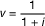
Ausscheideordnung:

l
x+1                = l
x                ·             (1 –
q
x                – w
x             )

Diskontierte Lebende:

D
x                = l
x                · v
x

Rentenbarwert:

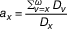
Leistungsbarwert:

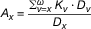
Jährliche Nettoprämie:

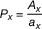
Jährliche gezillmerte Bruttoprämie:

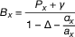
**B. Prämienberechnung bei Prämienanpassungen und Umstufungen**

Die Rechnungsgrundlagen, die vor dem Zeitpunkt der Prämienanpassung
gegolten haben, werden mit einem hochgestellten „
a             “ gekennzeichnet.

*    *        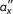
    *   = einmalige Sanierungs- oder unmittelbare Abschlusskosten, gemessen im
        Mehrfachen der Differenz zwischen neuer und alter Jahresprämie des
        bereits Versicherten

*    *   u

    *   = erreichtes Alter zum Zeitpunkt der Prämienanpassung

*    *        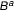
    *   = bisher gezahlte Prämie

Jährliche Bruttoprämie eines u-jährigen Versicherten nach der
Prämienanpassung:

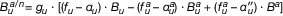
mit

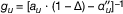

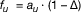
Der Ausdruck für
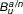ändert sich entsprechend, wenn

–   ein Kostenzuschlagssystem nach § 8 Absatz 4 Satz 4 verwendet wird,

–   die einmaligen Sanierungskosten in anderer Weise eingerechnet werden,

–   die unmittelbaren Abschlusskosten bei Umstufung in anderer Weise
    eingerechnet werden oder

–   eine andere Formel für die Berechnung der Prämie des Neuzugangs nach §
    10 Absatz 5 verwendet wird.

Interpolationen der Rechenwerte auf den Zeitpunkt der Prämienanpassung
oder der Umstufung sind zulässig.

(zu § 15 Absatz 2 und 3)

### Anlage 2 Berechnung des Grundkopfschadens und der erforderlichen Versicherungsleistungen nach § 15 Absatz 2 und 3

(Fundstelle: BGBl. I 2016, 792)

**A. Tatsächlicher Grundkopfschaden eines Beobachtungsjahres**

S   = abgegrenzter Schaden der Beobachtungseinheit im Beobachtungszeitraum
    abzüglich der Nettorisikozuschläge und einschließlich der
    geschlechtsunabhängig verteilten Leistungen wegen Schwangerschaft und
    Mutterschaft

    L
x   = abgegrenzter mittlerer Bestand der Beobachtungseinheit im
    Beobachtungszeitraum für das Alter
    x

    k
x   = rechnungsmäßiger Profilwert für das Alter
    x

Tatsächlicher Grundkopfschaden:

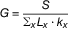
Dabei wird über alle Alter
x              der Beobachtungseinheit summiert. Die Wirkungen von
Wartezeit und Selektion sind ausreichend zu berücksichtigen.

**B. Verfahren zur Berechnung der erforderlichen
Versicherungsleistungen**

t − 2, t − 1, t = die letzten drei Beobachtungszeiträume

    G
    , G
    , G
t−2t−1t = tatsächliche Grundkopfschäden gemäß Abschnitt A, umgerechnet auf das
    Leistungsversprechen, das zum Extrapolationszeitpunkt gültig sein
    wird, und unter Zugrundelegung der aktuellen rechnungsmäßigen Profile

Extrapolierter Grundkopfschaden:

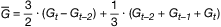
Erforderliche Versicherungsleistungen:

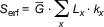
mit
L
x              und
k
x              gemäß Abschnitt A und Summation über alle Alter
x             .

