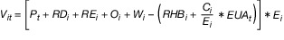

# Gesetz zur Reduzierung und zur Beendigung der Kohleverstromung (KVBG)

Ausfertigungsdatum
:   2020-08-08

Fundstelle
:   BGBl I: 2020, 1818

Änderung durch
:   Art. 3a G v. 3.12.2020 I 2682 ist berücksichtigt

Änderung durch
:   Art. 22 G v. 21.12.2020 I 3138 (Nr. 65) textlich nachgewiesen, dokumentarisch noch nicht abschließend bearbeitet

Änderung durch
:   Art. 26 Abs. 2 G v. 3.6.2021 I 1534 (Nr. 30) textlich nachgewiesen, dokumentarisch noch nicht abschließend bearbeitet

Änderung durch
:   Art. 13 G v. 16.7.2021 I 3026 (Nr. 47) textlich nachgewiesen, dokumentarisch noch nicht abschließend bearbeitet

[^F812505_01_BJNR181810020]:     Notifiziert gemäß der Richtlinie (EU) 2015/1535 des Europäischen
    Parlaments und des Rates vom 9. September 2015 über ein
    Informationsverfahren auf dem Gebiet der technischen Vorschriften und
    der Vorschriften für die Dienste der Informationsgesellschaft (ABl. L
    241 vom 17.9.2015, S. 1).

## Teil 1 - Allgemeine Bestimmungen

### § 1 Anwendungsbereich

(1) Das Gesetz ist für Anlagen zur Erzeugung elektrischer Energie
durch den Einsatz von Kohle in Deutschland anzuwenden. Es regelt die
schrittweise und möglichst stetige Reduzierung und Beendigung der
Erzeugung elektrischer Energie durch den Einsatz von Kohle in
Deutschland.

(2) Die Bestimmungen des Energiewirtschaftsgesetzes vom 7. Juli 2005
(BGBl. I S. 1970, 3621) in der jeweils geltenden Fassung, des Kraft-
Wärme-Kopplungsgesetzes vom 21. Dezember 2015 (BGBl. I S. 2498) in der
jeweils geltenden Fassung und weitere energiewirtschaftsrechtliche
Bestimmungen, die Anlagen zur Erzeugung elektrischer Energie durch den
Einsatz von Kohle betreffen, bleiben unberührt, soweit nicht in diesem
Gesetz etwas anderes bestimmt ist.

(3) Soweit sich aus diesem Gesetz Rechte, Pflichten oder Verbote für
den Anlagenbetreiber ergeben, sind diese auch für und gegen den
Rechtsnachfolger des Anlagenbetreibers anzuwenden.

### § 2 Zweck und Ziele des Gesetzes

(1) Zweck des Gesetzes ist es, die Erzeugung elektrischer Energie
durch den Einsatz von Kohle in Deutschland sozialverträglich,
schrittweise und möglichst stetig zu reduzieren und zu beenden, um
dadurch Emissionen zu reduzieren, und dabei eine sichere,
preisgünstige, effiziente und klimaverträgliche Versorgung der
Allgemeinheit mit Elektrizität zu gewährleisten.

(2) Um den Zweck des Gesetzes nach Absatz 1 zu erreichen, verfolgt
dieses Gesetz insbesondere das Ziel, die verbleibende elektrische
Nettonennleistung von Anlagen am Strommarkt zur Erzeugung elektrischer
Energie durch den Einsatz von Kohle in Deutschland schrittweise und
möglichst stetig zu reduzieren:

1.  im Kalenderjahr 2022 auf 15 Gigawatt Steinkohle und 15 Gigawatt
    Braunkohle,

2.  im Kalenderjahr 2030 auf 8 Gigawatt Steinkohle und 9 Gigawatt
    Braunkohle und

3.  spätestens bis zum Ablauf des Kalenderjahres 2038 auf 0 Gigawatt
    Steinkohle und 0 Gigawatt Braunkohle.

(3) Die schrittweise und möglichst stetige Reduzierung und Beendigung
der Erzeugung elektrischer Energie durch den Einsatz von Kohle in
Deutschland ist Grund und Bedingung für die strukturpolitische
Unterstützung des Bundes für die Regionen nach Kapitel 2 des
Investitionsgesetzes Kohleregionen vom 8. August 2020 (BGBl. I S.
1795).

### § 3 Begriffsbestimmungen

Im Sinne dieses Gesetzes ist oder sind:

1.  „Anordnungstermin“ der Termin, der jeweils 31 Monate vor den
    jeweiligen Zieldaten gemäß § 4 liegt und zu dem die Anordnung der
    gesetzlichen Reduzierung erfolgt,

2.  „Anlagenbetreiber“, wer unabhängig vom Eigentum eine Steinkohleanlage
    oder eine Braunkohleanlage für die Erzeugung von elektrischer Energie
    durch den Einsatz von Kohle nutzt,

3.  „Ausgangsniveau“ die Summe der Nettonennleistung von
    Steinkohleanlagen, die der Ermittlung des Ausschreibungsvolumens
    zugrunde gelegt wird,

4.  „Ausschreibung“ ein transparentes, diskriminierungsfreies und
    wettbewerbliches Verfahren zur Bestimmung der Anspruchsberechtigten
    und der Höhe des Steinkohlezuschlags,

5.  „Ausschreibungsvolumen“ die Summe der Nettonennleistung in Megawatt,
    für die der Anspruch auf einen Steinkohlezuschlag zu einem
    Gebotstermin ausgeschrieben wird,

6.  „bedarfsdimensionierender Netznutzungsfall“ derjenige Netznutzungsfall
    eines Betrachtungszeitraums, welcher nach der jeweils aktuellen
    Reservebedarfsfeststellung der Bundesnetzagentur nach § 3 Absatz 1 der
    Netzreserveverordnung vom 27. Juni 2013 (BGBl. I S. 1947), die zuletzt
    durch Artikel 15 des Gesetzes vom 13. Mai 2019 (BGBl. I S. 706)
    geändert worden ist, für einen Betrachtungszeitraum den höchsten
    Bedarf an Erzeugungskapazität für die Netzreserve aufweist,

7.  „bezuschlagtes Gebot“ ein Gebot, das im Rahmen einer Ausschreibung
    einen Zuschlag erhalten hat,

8.  „Braunkohle“ Rohbraunkohle, Koks, Kohlebriketts oder Kohlestaub, die
    jeweils aus Braunkohle hergestellt werden oder durch den Einsatz von
    Braunkohle entstehen,

9.  „Braunkohleanlage“ eine Anlage zur Erzeugung von elektrischer Energie
    durch den Einsatz von Braunkohle; wobei jedenfalls die in Anlage 2
    aufgeführten Anlagen Braunkohleanlagen in diesem Sinne sind; im
    Übrigen gilt die Begriffsbestimmung der Steinkohleanlage entsprechend,

10. „Braunkohle-Kleinanlage“ eine Braunkohleanlage mit einer
    Nettonennleistung bis zu einschließlich 150 Megawatt,

11. „Dampfsammelschiene“ eine Einrichtung zur leitungsgebundenen
    Versorgung mit Dampf, an der mindestens zwei Dampferzeuger und eine
    Dampfturbine oder ein Dampferzeuger und zwei Dampfturbinen
    angeschlossen sind; keine Dampfsammelschienen sind Dampfnetze im Sinne
    des § 2 Nummer 6a des Kraft-Wärme-Kopplungsgesetzes und Wärmenetze im
    Sinne des § 2 Nummer 32 des Kraft-Wärme-Kopplungsgesetzes,

12. „Dampfsammelschienenblock“ eine thermodynamisch abgrenzbare Einheit
    einer Steinkohleanlage, die über eine Dampfsammelschiene verfügt;
    jeder Block muss über mindestens einen Dampferzeuger, der kein
    Steinkohle-Reservedampferzeuger ist, eine Turbine und einen Generator
    verfügen und auch ohne die anderen Blöcke elektrische Energie erzeugen
    und die angegebene Nettonennleistung erreichen können,

13. „Gebotsmenge“ die Nettonennleistung in Megawatt, für die der Bieter
    unter Berücksichtigung von § 14 Absatz 2 ein Gebot abgegeben hat,

14. „Gebotstermin“ der Kalendertag, an dem die Frist für die Abgabe von
    Geboten für eine Ausschreibung endet,

15. „Gebotswert“ der Betrag in Euro pro Megawatt Nettonennleistung, den
    der Bieter in seinem Gebot angegeben hat,

16. „gesetzliche Reduzierung“ die aufgrund einer gesetzlichen Regelung
    angeordnete Reduzierung der Steinkohleverstromung mit der Rechtsfolge
    des Verbots der Kohleverfeuerung,

17. „Hauptanlagenteile“ Dampferzeuger, die keine Steinkohle-
    Reservedampferzeuger sind, Turbinen und Generatoren,

18. „Hauptenergieträger“ der von einer Anlage zur Erzeugung elektrischer
    Energie überwiegend, mindestens zu 51 Prozent, in den letzten drei
    Kalenderjahren vor dem 1. Januar 2020 eingesetzte Brennstoff,

19. „Höchstpreis“ der gesetzlich nach § 19 festgelegte Wert in Euro pro
    Megawatt Nettonennleistung,

20. „Inbetriebnahme“ die erstmalige Inbetriebsetzung einer Stein- oder
    Braunkohleanlage zum Zweck der kommerziellen Erzeugung elektrischer
    Energie nach Herstellung der technischen Betriebsbereitschaft der
    Stein- oder Braunkohleanlage; der Austausch technischer oder baulicher
    Teile der Steinkohleanlage nach der erstmaligen Inbetriebnahme führt
    vorbehaltlich der Regelung in § 31 nicht zu einer Änderung des
    Zeitpunkts der Inbetriebnahme; im Fall eines Dampfsammelschienenblocks
    nach Nummer 12 steht die Inbetriebnahme des ältesten Dampferzeugers
    der Inbetriebnahme des Blocks gleich,

21. „Kohle“ Braunkohle, Steinkohle, Koks, Kohlebriketts, Kohlestaub,
    Torfbriketts oder Brenntorf,

22. „Nettonennleistung“ die höchste elektrische Nettodauerleistung als
    Wirkleistung unter Nennbedingungen, die eine Anlage zur Erzeugung
    elektrischer Energie erreicht,

23. „rechnerisch ermittelte Nettonennleistung“ der kleinere Wert eines
    Vergleichs der Feuerungswärmeleistung sämtlicher Dampferzeuger einer
    Steinkohleanlage in Megawatt multipliziert mit einem
    durchschnittlichen elektrischen Wirkungsgrad von 34 Prozent einerseits
    und der Dauerwirkleistung sämtlicher Generatoren abzüglich 10 Prozent
    für den Kraftwerkseigenbedarf andererseits,

24. „Steinkohle“ Koks, Kohlebriketts oder Kohlestaub, die jeweils aus
    Steinkohle hergestellt werden oder durch den Einsatz von Steinkohle
    entstehen,

25. „Steinkohleanlage“ eine Anlage zur Erzeugung von elektrischer Energie
    durch den Einsatz von Steinkohle; die Anlage umfasst insbesondere alle
    Hauptanlagenteile und Steinkohle-Reservedampferzeuger, die mechanisch
    oder thermodynamisch vor dem Übergang zu einem Wärmenetz im Sinne des
    § 2 Nummer 32 des Kraft-Wärme-Kopplungsgesetzes oder vor dem Übergang
    zu einem Dampfnetz im Sinne des § 2 Nummer 6a des Kraft-Wärme-
    Kopplungsgesetzes miteinander verbunden sind; verfügt eine
    Steinkohleanlage über eine Dampfsammelschiene und wurde nach § 13 eine
    wirksame Abgrenzung zu Dampfsammelschienenblöcken vorgenommen, gelten
    die Dampfsammelschienenblöcke zur Erzeugung von elektrischer Energie
    durch den Einsatz von Steinkohle jeweils als Steinkohleanlage im Sinne
    dieses Gesetzes,

26. „Steinkohle-Kleinanlage“ eine Steinkohleanlage mit einer
    Nettonennleistung bis zu einschließlich 150 Megawatt,

27. „Steinkohle-Reservedampferzeuger“ ein Dampferzeuger zur Erzeugung von
    Dampf durch den Einsatz von Steinkohle, der in den letzten drei
    Kalenderjahren vor dem 1. Januar 2020 durchschnittlich mit weniger als
    500 Vollbenutzungsstunden genutzt wurde,

28. „Steinkohlezuschlag“ der Betrag in Euro, den die Bundesnetzagentur im
    Rahmen der Ausschreibung nach Teil 3 ermittelt und auf den ab
    Zuschlagserteilung nach § 23 einmalig ein Anspruch entsteht,

29. „verbindliche Kohleverfeuerungsverbotsanzeige“ die Anzeige nach § 9
    Absatz 1 Nummer 2,

30. „verbindliche Stilllegungsanzeige“ die Anzeige nach § 9 Absatz 1
    Nummer 1,

31. „verkürztes Verfahren“ verkürzte Ausschreibungsverfahren für die Jahre
    2020 und 2021,

32. „Zielniveau“ die in § 4 geregelte höchstens zugelassene Summe der
    Nettonennleistung der in der Bundesrepublik Deutschland bis zum
    jeweiligen Zieldatum am Strommarkt befindlichen Braun- und
    Steinkohleanlagen.

## Teil 2 - Zielniveau, Ausschreibungsvolumen und Umfang der gesetzlichen Reduzierung

### § 4 Zielniveau und Zieldaten

(1) Das Zielniveau für die Reduzierung und Beendigung der
Kohleverstromung ist bis zum 31. Dezember 2022 (Zieldatum 2022) 30
Gigawatt, bis zum 1. April 2030 (Zieldatum 2030) 17 Gigawatt und
spätestens bis zum 31. Dezember 2038 (Zieldatum 2038) 0 Gigawatt
verbleibende Nettonennleistung Steinkohleanlagen und Braunkohleanlagen
am Strommarkt. Dieses Zielniveau sinkt zwischen den Zieldaten 2022 und
2030 sowie zwischen den Zieldaten 2030 und 2038 jeweils jährlich um
gleich große Mengen Nettonennleistung. Die jährlichen
Reduktionsschritte erfolgen zum 1. Juli 2023 (Zieldatum 2023), zum 1.
Juli 2024 (Zieldatum 2024), danach jährlich jeweils zum 1. April,
erstmals zum 1. April 2025 (Zieldatum 2025) bis zum 1. April 2037
(Zieldatum 2037), und spätestens endend am 31. Dezember 2038
(Zieldatum 2038).

(2) Zum Zieldatum 2022 setzt sich das Zielniveau von 30 Gigawatt aus
15 Gigawatt verbleibender Nettonennleistung Steinkohleanlagen und 15
Gigawatt verbleibender Nettonennleistung Braunkohleanlagen am
Strommarkt zusammen. Zum Zieldatum 2030 ist das Zielniveau von 17
Gigawatt aufgeteilt auf ein Zielniveau von 8 Gigawatt verbleibender
Nettonennleistung Steinkohleanlagen und ein Zielniveau von 9 Gigawatt
verbleibender Nettonennleistung Braunkohleanlagen am Strommarkt.
Soweit die verbleibende Nettonennleistung der Steinkohleanlagen für
ein Zieldatum nicht ausdrücklich in Satz 1 oder Satz 2 genannt ist,
ermittelt sich die verbleibende Nettonennleistung der
Steinkohleanlagen an dem jährlichen Zielniveau nach Absatz 1
(Zielniveau für die Reduzierung der Steinkohleverstromung), indem von
dem jährlichen Zielniveau nach Absatz 1 jeweils die Summe der
Nettonennleistung der Braunkohleanlagen abgezogen wird, die nach Teil
5 und Anlage 2 sowie dem öffentlich-rechtlichen Vertrag nach § 49 zum
Ablauf des Kalenderjahrs, in dem das jeweilige Zieldatum liegt, noch
elektrische Energie durch den Einsatz von Braunkohle am Strommarkt
erzeugen dürfen. Braunkohle-Kleinanlagen, die nicht in Anlage 2
aufgeführt sind, werden bei der Ermittlung der verbleibenden
Nettonennleistung der Steinkohleanlagen nach Satz 3 von dem jährlichen
Zielniveau nicht abgezogen.

### § 5 Erreichen des Zielniveaus durch Ausschreibungen und die gesetzliche Reduzierung

(1) Das jeweilige Zielniveau für die Reduzierung der
Steinkohleverstromung nach § 4 wird wie folgt erreicht:

1.  bis zu dem Zieldatum 2023 nur durch die Ausschreibung nach Teil 3,

2.  ab den Zieldaten 2024 bis einschließlich 2026 jährlich durch die
    Ausschreibungen nach Teil 3 und bei Unterzeichnung der Ausschreibung
    nach § 20 Absatz 3 durch die gesetzliche Reduzierung der Steinkohle
    nach Teil 4 und

3.  ab dem Zieldatum 2027 bis zu dem Zieldatum 2038 ausschließlich durch
    die gesetzliche Reduzierung nach Teil 4.

(2) Erhält der Anlagenbetreiber im Rahmen einer Ausschreibung nach
Teil 3 einen Zuschlag, hat er nach § 23 Anspruch auf Zahlung des
Steinkohlezuschlags. Wird gegenüber dem Anlagenbetreiber nach § 35
angeordnet, dass die jeweilige Steinkohleanlage der gesetzlichen
Reduzierung unterfällt, hat der Anlagenbetreiber keinen Anspruch auf
Zahlung des Steinkohlezuschlags. § 39 bleibt unberührt. Rechtsfolgen
des Zuschlags nach § 21 und der Anordnung der gesetzlichen Reduzierung
nach § 35 sind ein Verbot der Kohleverfeuerung nach § 51 und ein
Vermarktungsverbot nach § 52.

### § 6 Ermittlung des Ausschreibungsvolumens und des Umfangs der gesetzlichen Reduzierung

(1) Die Bundesnetzagentur ermittelt nach Absatz 2 ausschließlich im
öffentlichen Interesse für jeden Gebotstermin das
Ausschreibungsvolumen und für jeden Anordnungstermin die
Reduktionsmenge für die gesetzliche Reduzierung der
Steinkohleverstromung.

(2) Das zu ermittelnde Ausschreibungsvolumen und die zu ermittelnde
Reduktionsmenge nach Absatz 1 in Megawatt Nettonennleistung ist die
Differenz zwischen dem Ausgangsniveau nach § 7 für das jeweilige
Zieldatum und dem Zielniveau an Steinkohleanlagen am Strommarkt nach §
4 für das jeweilige Zieldatum.

(3) Abweichend von den Absätzen 1 und 2 erfolgt in den verkürzten
Verfahren für die Jahre 2020 und 2021 keine Ermittlung des
Ausschreibungsvolumens. Das Ausschreibungsvolumen für die
Ausschreibung im verkürzten Verfahren für das Jahr 2020 beträgt 4
Gigawatt Nettonennleistung und das Ausschreibungsvolumen für die
Ausschreibung im verkürzten Verfahren für das Jahr 2021 beträgt 1,5
Gigawatt Nettonennleistung.

(4) In den Ausschreibungen für das Zieldatum 2023, das Zieldatum 2024
und das Zieldatum 2025 wird zu dem nach den Absätzen 1 und 2
ermittelten Ausschreibungsvolumen jeweils 1 Gigawatt addiert.

### § 7 Ermittlung des Ausgangsniveaus durch die Bundesnetzagentur

(1) Die Bundesnetzagentur ermittelt vor jedem Gebots- oder
Anordnungstermin das Ausgangsniveau für die Ausschreibungen und für
die gesetzliche Reduzierung für das jeweils nächste Zieldatum, indem
sie das Verfahren nach den folgenden Absätzen durchführt.

(2) Zur Ermittlung des Ausgangsniveaus wird zunächst die Summe der
Nettonennleistung der Steinkohleanlagen mit Genehmigung zur
Kohleverstromung ermittelt

1.  für die Zieldaten 2022 und 2023, indem die Bundesnetzagentur die
    Nettonennleistung der im beschleunigten Verfahren nach § 8 ermittelten
    Kraftwerke addiert und

2.  für die Zieldaten ab dem Zieldatum 2024, indem die Bundesnetzagentur
    die Nettonennleistung der Kraftwerke auf der Liste nach § 29 Absatz 4
    in Verbindung mit § 32 addiert.

(3) Von der Summe der nach Absatz 2 ermittelten installierten
Nettonennleistung subtrahiert die Bundesnetzagentur die Summe der
Nettonennleistung der Steinkohleanlagen,

1.  die ihre immissionsschutzrechtliche Genehmigung nach den §§ 4 bis 6
    des Bundes-Immissionsschutzgesetzes verloren haben,

2.  für die eine verbindliche Stilllegung nach § 9 Absatz 1 Nummer 1 oder
    ein verbindliches Verbot der Kohleverfeuerung nach § 9 Absatz 1 Nummer
    2 angezeigt wurde, wenn die Stilllegung oder das Verbot der
    Kohleverfeuerung vor oder zu dem jeweiligen Zieldatum wirksam wird,

3.  für die eine endgültige Stilllegung nach § 13b des
    Energiewirtschaftsgesetzes angezeigt wurde und denen eine endgültige
    Stilllegung nach § 13b Absatz 5 des Energiewirtschaftsgesetzes
    verboten wurde,

4.  die nach § 18 der Kapazitätsreserveverordnung vom 28. Januar 2019
    (BGBl. I S. 58) einen Zuschlag erhalten haben und für die ein
    wirksamer Vertrag im Rahmen der Kapazitätsreserve dadurch zustande
    gekommen ist, dass die Zweitsicherheit nach § 10 Absatz 2 der
    Kapazitätsreserveverordnung fristgerecht geleistet worden ist, wenn
    der Erbringungszeitraum zum Zieldatum bereits begonnen hat; dies ist
    auch anzuwenden, wenn die vertragliche Verpflichtung bereits beendet
    wurde,

5.  denen ein Zuschlag nach § 21 erteilt wurde,

6.  denen die gesetzliche Reduzierung nach § 35 angeordnet wurde,

7.  für die zum Zeitpunkt der Ermittlung des Ausgangsniveaus ein Antrag
    auf Zulassung für den Kohleersatzbonus nach § 7 Absatz 2 des Kraft-
    Wärme-Kopplungsgesetzes in der am 13. August 2020 geltenden Fassung
    oder nach § 7c des Kraft-Wärme-Kopplungsgesetzes beim Bundesamt für
    Wirtschaft und Ausfuhrkontrolle gestellt und bereits eine Zulassung
    durch das Bundesamt für Wirtschaft und Ausfuhrkontrolle erteilt und
    nicht zurückgenommen wurde und

8.  die nach § 51 Absatz 5 vor oder zu dem jeweiligen Zieldatum keine
    Kohle mehr verfeuern dürfen.

(4) Für die Ermittlung der Steinkohleanlagen nach den Absätzen 2 und 3
bezieht die Bundesnetzagentur alle Informationen ein, die bis einen
Monat vor der Bekanntmachung der Ausschreibung nach § 11 oder der
Anordnung der gesetzlichen Reduzierung nach § 35 bei ihr eingegangen
sind. Erfolgt die Bekanntmachung der Ausschreibung nach § 11 vor dem
Zuschlagstermin der vorherigen Ausschreibung, berücksichtigt die
Bundesnetzagentur bei der Berichtigung des Ausschreibungsvolumens nach
§ 11 Absatz 1 Satz 4 Informationen nach Absatz 3 Nummer 5 bis zum
Zuschlagstermin der vorherigen Ausschreibung.

(5) Abweichend von den Absätzen 1 bis 4 findet in den verkürzten
Verfahren in den Jahren 2020 und 2021 keine Ermittlung des
Ausgangsniveaus statt.

### § 8 Beschleunigtes Verfahren zur Erfassung der Steinkohleanlagen

(1) Die Bundesnetzagentur veröffentlicht zur Ermittlung des
Ausgangsniveaus für die Ausschreibungen für die Zieldaten 2022 und
2023 auf Grundlage des Monitorings nach § 35 Absatz 1 des
Energiewirtschaftsgesetzes spätestens fünf Monate vor dem jeweiligen
Gebotstermin, beginnend spätestens mit dem 30. September 2020, eine
Liste der Steinkohleanlagen in Deutschland, die eine rechtswirksame
Genehmigung nach den §§ 4 bis 6 des Bundes-Immissionsschutzgesetzes in
der Fassung der Bekanntmachung vom 17. Mai 2013 (BGBl. I S. 1274), das
zuletzt durch Artikel 1 des Gesetzes vom 8. April 2019 (BGBl. I S.
432) geändert worden ist, zur Verfeuerung von Steinkohle zum Zweck der
Erzeugung elektrischer Energie haben, mit folgenden Angaben auf ihrer
Internetseite:

1.  den Namen,

2.  die Adresse,

3.  die Zuordnung zu einem Hauptenergieträger und

4.  die Nettonennleistung.

Bereits endgültig nach § 13b Absatz 3 Satz 2 des
Energiewirtschaftsgesetzes stillgelegte Erzeugungsanlagen sind von der
Erhebung ausgenommen.

(2) Soweit für Steinkohleanlagen eine Korrektur oder Ergänzung der
zugrunde gelegten Angaben nach Absatz 1 erforderlich ist, muss der
Anlagenbetreiber, der dem Monitoring nach § 35 Absatz 1 des
Energiewirtschaftsgesetzes unterliegt, die Angaben sowie die
entsprechenden Unterlagen, aus denen sich der Korrekturbedarf oder die
Ergänzung ergibt, innerhalb einer Frist von zwei Wochen ab
Veröffentlichung der Angaben nach Absatz 1 an die Bundesnetzagentur
übermitteln. Anlagenbetreiber, die nicht vom Monitoring nach § 35
Absatz 1 des Energiewirtschaftsgesetzes erfasst sind, müssen die Daten
nach Absatz 1 nach Aufforderung durch die Bundesnetzagentur
unmittelbar oder ohne Aufforderung innerhalb einer Frist von zwei
Wochen ab Veröffentlichung der Angaben nach Absatz 1 an die
Bundesnetzagentur übermitteln. Die Angaben nach den Sätzen 1 und 2
sind verbindlich, vorbehaltlich der wirksamen Zuordnung zu
Dampfsammelschienenblöcken nach § 13.

### § 9 Verbindliche Stilllegungsanzeige und verbindliche Kohleverfeuerungsverbotsanzeige

(1) Der Anlagenbetreiber einer Steinkohleanlage mit einer
Nettonennleistung von 10 Megawatt oder mehr kann

1.  bei der Anzeige der endgültigen Stilllegung nach § 13b Absatz 1 und 3
    Satz 2 des Energiewirtschaftsgesetzes erklären, dass er sich
    verpflichtet, die Steinkohleanlage zu dem angezeigten
    Stilllegungszeitpunkt, spätestens 30 Monate nach dieser Anzeige,
    endgültig stillzulegen (verbindliche Stilllegungsanzeige) oder

2.  gegenüber der Bundesnetzagentur erklären, dass er sich verpflichtet,
    in der Steinkohleanlage ab dem angezeigten Zeitpunkt, spätestens 30
    Monate nach dieser Anzeige, keine Kohle mehr zu verfeuern
    (verbindliche Kohleverfeuerungsverbotsanzeige); in diesem Fall ist §
    51 Absatz 1 anzuwenden.

(2) Die Anzeigen nach Absatz 1 sind unwiderruflich. Im Fall einer
verbindlichen Stilllegungsanzeige muss der Anlagenbetreiber in der
Stilllegungsanzeige den Kalendertag mitteilen, zu dem die endgültige
Stilllegung der Steinkohleanlage erfolgen soll. Im Fall einer
verbindlichen Kohleverfeuerungsverbotsanzeige muss der
Anlagenbetreiber den Kalendertag bestimmen und mitteilen, ab dem das
Verbot der Kohleverfeuerung wirksam werden soll. Die Pflicht zur
Anzeige von Stilllegungen nach § 13b Absatz 1 Satz 1 des
Energiewirtschaftsgesetzes und die damit verbundenen Bestimmungen nach
den §§ 13b bis 13d des Energiewirtschaftsgesetzes bleiben unberührt.

(3) Eine Steinkohleanlage, für die der Anlagenbetreiber die
Stilllegung nach Absatz 1 Nummer 1 angezeigt oder sich nach Absatz 1
Nummer 2 verpflichtet hat, in der Steinkohleanlage keine Kohle mehr zu
verfeuern,

1.  darf nicht an dem Ausschreibungsverfahren nach Teil 3 teilnehmen,

2.  darf an den Beschaffungsverfahren der Kapazitätsreserve nach § 13e
    Absatz 2 in Verbindung mit § 13h des Energiewirtschaftsgesetzes
    teilnehmen.

Der Anspruch auf den erhöhten Zuschlag für KWK-Strom nach § 7 Absatz 2
des Kraft-Wärme-Kopplungsgesetzes in der am Tag vor dem 13. August
2020 geltenden Fassung oder nach § 7c des Kraft-Wärme-
Kopplungsgesetzes bleibt für den Anlagenbetreiber nach Satz 1
unberührt.

## Teil 3 - Ausschreibungen zur Reduzierung der Steinkohleverstromung

### § 10 Gegenstand der Ausschreibungen, Gebotstermine

(1) Die Bundesnetzagentur ermittelt durch Ausschreibungen die zu
bezuschlagenden Gebote und den Steinkohlezuschlag.

(2) Der Gebotstermin für die Ausschreibung

1.  im verkürzten Verfahren für das Jahr 2020 ist der 1. September 2020,

2.  im verkürzten Verfahren für das Jahr 2021 ist der erste Werktag des
    Monats, der vier Monate nach dem Gebotstermin nach Nummer 1 liegt,

3.  mit dem Zieldatum 2022 liegt 20 Monate vor diesem Zieldatum,

4.  mit dem Zieldatum 2023 liegt 21 Monate vor diesem Zieldatum,

5.  mit dem Zieldatum 2024 liegt 28 Monate vor diesem Zieldatum,

6.  mit dem Zieldatum 2025 liegt 32 Monate vor diesem Zieldatum und

7.  mit dem Zieldatum 2026 liegt 34 Monate vor diesem Zieldatum .

(3) Ergibt die Ermittlung des Ausschreibungsvolumens nach § 6 für
eines der Zieldaten 2022 bis 2026, dass das Ausschreibungsvolumen null
oder negativ ist, führt die Bundesnetzagentur für dieses Zieldatum
kein Ausschreibungsverfahren durch.

(4) Liegt eine Woche vor dem Gebotstermin nach Absatz 2 Nummer 1 noch
keine beihilferechtliche Genehmigung durch die Europäische Kommission
zu den Teilen 2 und 3 vor, kann die Bundesnetzagentur die Fristen und
Termine nach Absatz 2 Nummer 1 und den §§ 11 und 21 Absatz 1 so
anpassen, dass für die Ausschreibung im verkürzten Verfahren für das
Jahr 2020 ein Zuschlagstermin nach § 21 am 1. Dezember 2020 erreicht
wird.

### § 11 Bekanntmachung der Ausschreibung

(1) Die Bundesnetzagentur macht die Ausschreibung frühestens 14 Wochen
und spätestens zehn Wochen vor dem jeweiligen Gebotstermin auf ihrer
Internetseite bekannt. Abweichend von Satz 1 macht die
Bundesnetzagentur die Ausschreibung im verkürzten Verfahren für das
Jahr 2020 und die Ausschreibung im verkürzten Verfahren für das Jahr
2021 spätestens vier Wochen vor dem Gebotstermin bekannt. Die
Bekanntmachung muss folgende Angaben enthalten:

1.  den Gebotstermin,

2.  das Ausschreibungsvolumen,

3.  den Höchstpreis,

4.  den Netzfaktor nach § 18 Absatz 5, sofern dieser in dem jeweiligen
    Ausschreibungsverfahren anzuwenden ist,

5.  die Formatvorgaben, die nach Absatz 3 von der Bundesnetzagentur für
    die Gebotsabgabe vorgesehen sind, und

6.  die Festlegungen nach § 62, soweit sie die Gebotsabgabe oder das
    Zuschlagsverfahren betreffen.

Die Bundesnetzagentur berichtigt im Fall des § 7 Absatz 4 Satz 2 das
nach Satz 3 Nummer 2 zuvor bekannt gemachte Ausschreibungsvolumen
spätestens bis zum Gebotstermin.

(2) Die Bekanntmachung nach Absatz 1 erfolgt ausschließlich im
öffentlichen Interesse.

(3) Die Bundesnetzagentur kann für die Ausschreibungsverfahren
Formatvorgaben machen. Die Ausschreibungen können von der
Bundesnetzagentur ganz oder teilweise im Wege eines elektronischen
Verfahrens durchgeführt werden.

### § 12 Teilnahmeberechtigung

(1) Der Anlagenbetreiber kann sich mit einer Steinkohleanlage an einem
Ausschreibungsverfahren nach Teil 3 beteiligen, sofern diese
Steinkohleanlage nach den Absätzen 2 und 3 teilnahmeberechtigt ist.
Für die Teilnahme an der Ausschreibung müssen folgende Anforderungen
erfüllt sein:

1.  die angebotene Anlage ist eine Steinkohleanlage im Sinne von § 3
    Nummer 25; soweit die Steinkohleanlage über eine Dampfsammelschiene
    verfügt, ist die wirksame Zuordnung zu Dampfsammelschienenblöcken nach
    § 13 maßgeblich,

2.  die angebotene Steinkohleanlage hat bis zu dem jeweiligen Zieldatum
    der Ausschreibung eine rechtswirksame Genehmigung nach den §§ 4 bis 6
    des Bundes-Immissionsschutzgesetzes zur Verfeuerung von Steinkohle zum
    Zweck der Erzeugung elektrischer Energie,

3.  Steinkohle ist der Hauptenergieträger der Steinkohleanlage,

4.  der Anlagenbetreiber weist durch eine Erklärung nach, dass der oder
    die Eigentümer der Steinkohleanlage mit der Gebotsabgabe einverstanden
    ist oder sind,

5.  der Anlagenbetreiber weist durch Vorlage einer gemeinsamen Erklärung
    der zuständigen Tarifpartner nach, dass für die Steinkohleanlage, für
    die ein Gebot abgegeben wird, ein Tarifvertrag oder eine
    Betriebsvereinbarung Anwendung findet, die den Abbau der Beschäftigung
    in der Steinkohleanlage betrifft, der aufgrund eines Verbots der
    Kohleverfeuerung nach § 51 in Verbindung mit einem Zuschlag nach § 21
    erfolgt,

6.  der Anlagenbetreiber hat dem Bundesamt für Wirtschaft und
    Ausfuhrkontrolle durch Vorlage einer verbindlichen Erklärung
    nachgewiesen, dass er für die Steinkohleanlage, für die er

    a)  bis einschließlich 31. Mai 2021 ein Gebot in der Ausschreibung abgibt,
        den Kohleersatzbonus nach § 7 Absatz 2 des Kraft-Wärme-
        Kopplungsgesetzes in der am 13. August 2020 geltenden Fassung oder
        nach § 7c des Kraft-Wärme-Kopplungsgesetzes für den Fall eines
        Zuschlags nach § 21 ab Bestandskraft des Zuschlags nicht in Anspruch
        nimmt (bedingte Verzichtserklärung),

    b)  nach dem 31. Mai 2021 ein Gebot in der Ausschreibung abgibt, den
        Kohleersatzbonus nach § 7 Absatz 2 des Kraft-Wärme-Kopplungsgesetzes
        in der am 13. August 2020 geltenden Fassung oder nach § 7c des Kraft-
        Wärme-Kopplungsgesetzes unabhängig davon, ob ein Zuschlag nach § 21
        erteilt wird, nicht in Anspruch nimmt (unbedingte Verzichtserklärung).

7.  der Anlagenbetreiber legt eine Erklärung zu der angestrebten Nutzung
    des Standorts der Steinkohleanlage nach dem Wirksamwerden des Verbots
    der Kohleverfeuerung vor und erklärt sein Einverständnis, dass seine
    Angaben zu der angestrebten Nutzung im Fall eines Zuschlags nach § 21
    durch die Bundesnetzagentur veröffentlicht werden und

8.  der Anlagenbetreiber weist der Bundesnetzagentur durch Eigenerklärung
    nach, dass er sich für den Fall, dass dieses Gebot einen Zuschlag
    erhält, verpflichtet, auf Anforderung der Übertragungsnetzbetreiber
    mit Regelverantwortung den oder die Generatoren der bezuschlagten
    Steinkohleanlage zu einem Betriebsmittel zur Bereitstellung von Blind-
    und Kurzschlussleistung umrüsten zu lassen und den
    Übertragungsnetzbetreibern nach § 12 Absatz 1 und nach § 13a Absatz 1
    des Energiewirtschaftsgesetzes für maximal acht Jahre ab dem
    Zeitpunkt, zu dem das Verbot der Kohleverfeuerung für die bezuschlagte
    Steinkohleanlage wirksam wird, zur Verfügung zu stellen.

(2) Nicht teilnahmeberechtigt nach Absatz 1 sind Steinkohleanlagen,

1.  die nach § 9 Absatz 1 Satz 1 Nummer 1 eine verbindliche
    Stilllegungsanzeige oder nach § 9 Absatz 1 Satz 1 Nummer 2 eine
    verbindliche Kohleverfeuerungsverbotsanzeige abgegeben haben,

2.  die nach § 18 der Kapazitätsreserveverordnung einen Zuschlag erhalten
    haben und für die ein wirksamer Vertrag im Rahmen der
    Kapazitätsreserve dadurch zustande gekommen ist, dass die
    Zweitsicherheit nach § 10 Absatz 2 der Kapazitätsreserveverordnung
    fristgerecht geleistet worden ist; dies gilt auch, wenn die
    vertragliche Verpflichtung bereits beendet wurde,

3.  für die eine endgültige Stilllegung nach § 13b Absatz 1 Satz 1 des
    Energiewirtschaftsgesetzes angezeigt wurde und die endgültig nach §
    13b Absatz 3 Satz 2 des Energiewirtschaftsgesetzes stillgelegt wurden
    oder denen eine endgültige Stilllegung nach § 13b Absatz 5 des
    Energiewirtschaftsgesetzes verboten wurde,

4.  die im Sinne des § 13b Absatz 3 Satz 2 des Energiewirtschaftsgesetzes
    endgültig stillgelegt sind,

5.  denen ein Zuschlag nach § 21 in einem vorherigen
    Ausschreibungsverfahren erteilt wurde oder

6.  denen die gesetzliche Reduzierung nach § 35 angeordnet wurde.

(3) Ergänzend zu Absatz 2 sind in der ersten Ausschreibung
Steinkohleanlagen nicht teilnahmeberechtigt, die sich in kreisfreien
Städten, Stadtkreisen, Kreisen und Landkreisen nach Anlage 1 zu diesem
Gesetz befinden.

### § 13 Zuordnung zu Dampfsammelschienenblöcken für die Ausschreibungen

(1) Verfügt eine Steinkohleanlage über eine Dampfsammelschiene, kann
der Anlagenbetreiber, vorbehaltlich § 29 Absatz 3 Satz 2, die
Hauptanlagenteile dieser Anlage zu Dampfsammelschienenblöcken zuordnen
und damit von anderen Dampfsammelschienenblöcken derselben Anlage
abgrenzen. Die Abgrenzung wird nur wirksam, wenn

1.  die Anforderungen von § 3 Nummer 12 erfüllt sind,

2.  mechanisch miteinander verbundene Hauptanlagenteile demselben
    Dampfsammelschienenblock zugeordnet sind,

3.  jeder Hauptanlagenteil und jeder Steinkohle-Reservedampferzeuger
    jeweils nur einem Dampfsammelschienenblock zugeordnet ist,

4.  sämtliche Dampferzeuger zur Erzeugung von Dampf durch den Einsatz von
    Steinkohle mindestens einem der Dampfsammelschienenblöcke zugeordnet
    sind,

5.  sämtliche Steinkohle-Reservedampferzeuger Dampfsammelschienenblöcken
    zugeordnet sind, in denen jeweils mindestens auch ein Dampferzeuger,
    der als Hauptanlagenteil Dampf durch den Einsatz von Steinkohle
    erzeugt, vorhanden ist und

6.  für jeden Dampfsammelschienenblock sämtliche Dampferzeuger zur
    Erzeugung von Dampf durch den Einsatz von Steinkohle, die keine
    Steinkohle-Reservedampferzeuger sind, ausreichend dimensioniert sind,
    um mit diesen die jeweils angegebene Nettonennleistung des
    Dampfsammelschienenblocks erreichen zu können, oder die
    Nettonennleistung durch die Bundesnetzagentur nach Absatz 3 Satz 3
    rechnerisch ermittelt wurde.

(2) Nimmt der Anlagenbetreiber für eine Steinkohleanlage, die über
eine Dampfsammelschiene verfügt, eine Abgrenzung von
Dampfsammelschienenblöcken nach Absatz 1 vor, teilt er dies der
Bundesnetzagentur bei seiner Gebotsabgabe mit und belegt die Erfüllung
der Anforderungen nach Absatz 1 durch geeignete Unterlagen. In der
Mitteilung nach Satz 1 muss der Anlagenbetreiber zusätzlich für jeden
Dampfsammelschienenblock mindestens angeben und durch geeignete
Unterlagen nachweisen:

1.  die Bezeichnung des Dampfsammelschienenblocks,

2.  die Nettonennleistung des Dampfsammelschienenblocks,

3.  den Hauptenergieträger des Dampfsammelschienenblocks,

4.  die zugeordneten Hauptanlagenteile sowie etwaige Steinkohle-
    Reservedampferzeuger einschließlich einer Darstellung, wie diese
    mechanisch oder thermodynamisch miteinander verbunden und in der
    Steinkohleanlage angeordnet sind,

5.  das Datum der Inbetriebnahme des Dampfsammelschienenblocks,

6.  die Feuerungswärmeleistung und den Hauptenergieträger der einzelnen
    Dampferzeuger und

7.  die Dauerwirkleistung der einzelnen Generatoren.

(3) Die Bundesnetzagentur überprüft im Rahmen des Gebotsverfahrens die
Angaben und Unterlagen nach Absatz 2. Eine ordnungsgemäße Zuordnung
nach Absatz 1 wird mit Abschluss des Gebotsverfahrens wirksam. Sofern
die Überprüfung ergibt, dass die Nettonennleistung nicht gemäß den
Anforderungen nach Absatz 1 erreicht werden kann, steht die von der
Bundesnetzagentur gemäß den Anforderungen nach Absatz 1 rechnerisch
ermittelte Nettonennleistung der Nettonennleistung der
Steinkohleanlage gleich. Die durch den Anlagenbetreiber einmalig
getroffene ordnungsgemäße Zuordnung behält dauerhaft ihre Wirksamkeit,
auch für eine Teilnahme an weiteren Ausschreibungen und behält ihre
Wirksamkeit auch für die gesetzliche Reduzierung nach Teil 4.

(4) Gibt ein Anlagenbetreiber mehrere Gebote in einem oder in
verschiedenen Ausschreibungsverfahren ab, ist die Abgrenzung der
Dampfsammelschienenblöcke nur bei der ersten Gebotsabgabe vorzunehmen.
Werden für diesen Dampfsammelschienenblock in weiteren
Ausschreibungsverfahren Gebote abgegeben, behält die einmal
vorgenommene Abgrenzung ihre Wirksamkeit. Der Anlagenbetreiber hat
eindeutig zu kennzeichnen, welchem Gebot die Unterlagen nach Satz 1
zugeordnet sind.

### § 14 Anforderungen an Gebote

(1) Der Bieter muss das Gebot in Schriftform abgeben und hierbei
jeweils die folgenden Angaben machen:

1.  Name, Anschrift, Telefonnummer und E-Mail-Adresse des Bieters; sofern
    der Bieter keine natürliche Person ist, sind auch anzugeben:

    a)  der Unternehmenssitz und

    b)  der Name einer natürlichen Person, die zur Kommunikation mit der
        Bundesnetzagentur und zur Vertretung des Bieters für alle Handlungen
        nach diesem Gesetz bevollmächtigt ist (Bevollmächtigter),

2.  den Namen der Steinkohleanlage, für die das Gebot abgegeben wird,

3.  die Zuordnung zu Dampfsammelschienenblöcken, soweit die
    Steinkohleanlage über eine Dampfsammelschiene verfügt und die
    Zuordnung bei der Gebotsabgabe nach § 13 Absatz 2 mitgeteilt wird,

4.  den Gebotstermin der Ausschreibung, für die das Gebot abgegeben wird,

5.  die Gebotsmenge in Megawatt Nettonennleistung mit drei
    Nachkommastellen,

6.  den Gebotswert in Euro mit zwei Nachkommastellen pro Megawatt
    Nettonennleistung,

7.  den Standort der Steinkohleanlage, auf die sich das Gebot bezieht, mit
    Angabe von Bundesland, Landkreis, Gemeinde und postalischer Adresse,

8.  den regelverantwortlichen Betreiber des Übertragungsnetzes, in dessen
    Regelzone sich die Steinkohleanlage, auf die sich das Gebot bezieht,
    befindet, sowie den Anschlussnetzbetreiber und die Spannungsebene,

9.  die Genehmigungsbehörde der Betriebsgenehmigung sowie das Aktenzeichen
    der Betriebsgenehmigung,

10. die gesamten testierten historischen Kohlendioxidemissionen der
    Steinkohleanlage in den letzten drei abgeschlossenen Kalenderjahren
    vor dem Gebotstermin in Tonnen ohne Nachkommastellen pro Megawatt
    Nettonennleistung,

11. die Feuerungswärmeleistung der Dampferzeuger und die Dauerwirkleistung
    der Generatoren der Steinkohleanlage,

12. die Kraftwerksnummer, unter der die Steinkohleanlage in der
    Bundesnetzagentur nach § 35 Absatz 1 des Energiewirtschaftsgesetzes
    geführt wird, sofern vorhanden, und

13. eine aktuelle Bankverbindung.

(2) Die Gebotsmenge nach Absatz 1 Nummer 5 muss stets der gesamten
Nettonennleistung der Steinkohleanlage entsprechen.

(3) Dem Gebot sind Nachweise über das Vorliegen der Voraussetzungen
nach Absatz 1 Nummer 10 und § 12 Absatz 1 Satz 2 Nummer 4 bis 8
beizufügen. Gibt ein Bieter in einer Ausschreibung mehrere Gebote für
unterschiedliche Steinkohleanlagen ab, muss er die Gebote nummerieren
und eindeutig kennzeichnen, welche Nachweise zu welchem Gebot gehören.

(4) Die Gebote müssen der Bundesnetzagentur spätestens am jeweiligen
Gebotstermin zugehen. Nicht fristgerecht eingegangene Gebote bleiben
unberücksichtigt. Gebote müssen den Formatvorgaben nach § 11 Absatz 3
entsprechen, soweit die Bundesnetzagentur Formatvorgaben gemacht hat.

### § 15 Rücknahme von Geboten

(1) Die Rücknahme von Geboten ist bis zu dem jeweiligen Gebotstermin
zulässig. Maßgeblich ist der Zugang der Rücknahmeerklärung bei der
Bundesnetzagentur. Die Rücknahme muss durch eine unbedingte und
unbefristete Erklärung des Bieters erfolgen, die sich dem Gebot
eindeutig zuordnen lässt. Die Rücknahmeerklärung bedarf der
Schriftform.

(2) Bieter sind an ihre Gebote, die bis zum Gebotstermin abgegeben und
nicht zurückgenommen wurden, gebunden, bis ihnen durch die
Bundesnetzagentur mitgeteilt wurde, dass ihr Gebot keinen Zuschlag
erhalten hat.

### § 16 Ausschluss von Bietern

Die Bundesnetzagentur kann einen Bieter und dessen Gebote von dem
Zuschlagsverfahren ausschließen, wenn der Bieter vorsätzlich oder grob
fahrlässig ein Gebot oder mehrere Gebote unter falschen Angaben oder
unter Vorlage falscher Nachweise in dieser oder einer vorangegangenen
Ausschreibung abgegeben hat. Die Bundesnetzagentur schließt einen
Bieter und dessen Gebote von dem Ausschreibungsverfahren aus, wenn er
mit anderen Bietern Absprachen über die Gebotswerte der in dieser oder
einer vorangegangenen Ausschreibung abgegebenen Gebote getroffen hat.

### § 17 Ausschluss von Geboten

Die Bundesnetzagentur schließt Gebote vom Zuschlagsverfahren aus, wenn

1.  die Teilnahmevoraussetzungen nach § 12, die Formatvorgaben nach § 11
    Absatz 3 oder die Anforderungen an Gebote nach § 14 nicht vollständig
    erfüllt sind,

2.  das Gebot nicht fristgerecht eingegangen ist,

3.  das Gebot Bedingungen, Befristungen oder sonstige Nebenabreden
    enthält, die sich nicht aus diesem Gesetz ergeben,

4.  das Gebot nicht den bekanntgemachten Festlegungen der
    Bundesnetzagentur entspricht, soweit diese die Gebotsabgabe betreffen,

5.  das einzelne Gebot sich auf mehr als eine Steinkohleanlage bezieht
    oder

6.  sich das Gebot nur auf einen Teil der Nettonennleistung einer
    Steinkohleanlage bezieht.

Ist ein Gebot ausschließlich aufgrund von offensichtlich fehlerhaften
oder fehlenden Angaben auszuschließen, hat die Bundesnetzagentur dem
Bieter die Möglichkeit zur Nachbesserung innerhalb von zwei Wochen
nach Aufforderung zur Nachbesserung zu geben.

### § 18 Zuschlagsverfahren

(1) Die Bundesnetzagentur führt bei jeder Ausschreibung ein
Zuschlagsverfahren durch. Hierbei öffnet sie die fristgerecht
eingegangenen Gebote nach dem Gebotstermin. Die Bundesnetzagentur
prüft die Zulässigkeit der Gebote nach den §§ 16 und 17 und schließt
unzulässige Gebote von dem weiteren Zuschlagsverfahren aus.

(2) Soweit die Summe der zulässigen Gebote in einer Ausschreibung das
Ausschreibungsvolumen übersteigt (Überzeichnung der Ausschreibung),
wendet die Bundesnetzagentur das Verfahren nach den Absätzen 3 bis 8
an. Abweichend von Satz 1 werden die Absätze 4 bis 6 in der
Ausschreibung im verkürzten Verfahren für das Jahr 2020 nicht
angewendet.

(3) Die Bundesnetzagentur errechnet für jedes zulässige Gebot eine
Kennziffer. Die Kennziffer bestimmt sich aus dem Gebotswert geteilt
durch die durchschnittlichen jährlichen historischen
Kohlendioxidemissionen pro Megawatt Nettonennleistung der
Steinkohleanlage. Für die Ermittlung der durchschnittlichen jährlichen
historischen Kohlendioxidemissionen der Steinkohleanlage teilt die
Bundesnetzagentur die Angaben des Bieters nach § 14 Absatz 1 Nummer 10
durch drei.

(4) Die Bundesnetzagentur übermittelt den Betreibern der
Übertragungsnetze mit Regelzonenverantwortung unverzüglich nach
Beendigung des Verfahrens nach Absatz 1 die Namen der
Steinkohleanlagen, für die zulässige Gebote abgegeben wurden. Die
Betreiber der Übertragungsnetze nehmen gegenüber der Bundesnetzagentur
innerhalb von zwei Wochen nach Übermittlung der Informationen nach
Satz 1 gemeinsam dazu Stellung, welche der nach Satz 1 übermittelten
Steinkohleanlagen für eine Erhöhung der Wirkleistungseinspeisung nach
§ 13a Absatz 1 des Energiewirtschaftsgesetzes in der zuletzt
erstellten Systemanalyse nach § 3 Absatz 2 der Netzreserveverordnung
erforderlich waren. Erforderlich im Sinne von Satz 2 sind alle
Steinkohleanlagen, die

1.  in einem bedarfsdimensionierenden Netznutzungsfall für eine Erhöhung
    der Wirkleistungseinspeisung nach § 13a Absatz 1 des
    Energiewirtschaftsgesetzes eingesetzt werden mussten,

2.  in einem der bedarfsdimensionierenden Netznutzungsfälle marktgetrieben
    Energie erzeugen, aber für eine Erhöhung der Wirkleistungseinspeisung
    nach § 13a Absatz 1 des Energiewirtschaftsgesetzes hätten eingesetzt
    werden müssen, wenn sie nicht bereits Energie erzeugt hätten, oder

3.  in einem der bedarfsdimensionierenden Netznutzungsfälle für eine
    Erhöhung der Wirkleistungseinspeisung nicht verfügbar waren, aber
    deren Stilllegung den Bedarf an Erzeugungskapazität für die
    Netzreserve nach § 3 Absatz 1 der Netzreserveverordnung erhöhen würde.

Bei der gemeinsamen Stellungnahme nach Satz 2 berücksichtigen die
Betreiber der Übertragungsnetze alle bedarfsdimensionierenden
Netznutzungsfälle aller künftigen Betrachtungszeiträume, welche in der
zuletzt erstellten Systemanalyse nach § 3 Absatz 2 Satz 1 Nummer 2 der
Netzreserveverordnung analysiert und von der Bundesnetzagentur nach §
3 Absatz 1 der Netzreserveverordnung bestätigt wurden. Die
Bundesnetzagentur berücksichtigt die gemeinsame Stellungnahme der
Betreiber der Übertragungsnetze mit Regelzonenverantwortung.

(5) Die Bundesnetzagentur errechnet für die Ausschreibungen bis zum
Zieldatum 2026 auf Basis von Absatz 4 Satz 2 und 3 eine modifizierte
Kennziffer für die Steinkohleanlagen, die nach Absatz 4 Satz 3 als
erforderlich eingestuft wurden, indem sie in der Berechnung nach
Absatz 3 Satz 2 zu dem Gebotswert im Zähler einen Netzfaktor zu dem
Gebotswert nach Absatz 3 Satz 2 addiert. Der Netzfaktor entspricht,
soweit nicht durch Rechtsverordnung nach § 60 Absatz 1 etwas anderes
geregelt wurde, den durchschnittlichen jährlichen
Betriebsbereitschaftsauslagen in Euro pro Megawatt Nettonennleistung
aller Erzeugungsanlagen, welche gemäß § 13d Absatz 1 Satz 2 Nummer 2
des Energiewirtschaftsgesetzes in dem vorletzten Kalenderjahr vor dem
jeweiligen Gebotstermin in der Netzreserve vorgehalten wurden,
multipliziert mit:

1.  4,5 in der Ausschreibung im verkürzten Verfahren für das Jahr 2021,

2.  vier in der Ausschreibung für das Zieldatum 2022,

3.  3,5 in der Ausschreibung für das Zieldatum 2023,

4.  drei in der Ausschreibung für das Zieldatum 2024,

5.  2,5 in der Ausschreibung für das Zieldatum 2025 und

6.  zwei in der Ausschreibung für das Zieldatum 2026.

Sofern für eine Steinkohleanlage eine modifizierte Kennziffer
ermittelt wurde, ersetzt die modifizierte Kennziffer die nach Absatz 3
für diese Steinkohleanlage ermittelte Kennziffer.

(6) Soweit eine Berechnung des Netzfaktors nach Absatz 5 erfolgt,
veröffentlicht die Bundesnetzagentur den Netzfaktor für jede
Ausschreibung, für die ein Netzfaktor anzuwenden ist. Die
Veröffentlichung erfolgt jeweils mit der Bekanntmachung der
Ausschreibung.

(7) Die Bundesnetzagentur sortiert die Gebote entsprechend der
Kennziffer nach Absatz 3 und, mit Ausnahme der Ausschreibung im
verkürzten Verfahren für das Jahr 2020, der modifizierten Kennziffer
nach Absatz 5 gemeinsam in aufsteigender Reihenfolge. Wenn die
Kennziffern mehrerer Gebote gleich sind, dann sortiert sie die Gebote
nach den Angaben zu Kohlendioxidemissionen nach § 14 Absatz 1 Nummer
10 in absteigender Reihenfolge. Sind die Kennziffern und die Angaben
zu Kohlendioxidemissionen nach § 14 Absatz 1 Nummer 10 der Gebote
gleich, entscheidet das Los über die Reihenfolge nach Satz 1, es sei
denn, die Reihenfolge ist für die Zuschlagserteilung nicht maßgeblich.

(8) Die Bundesnetzagentur erteilt in der Reihenfolge nach Absatz 7
beginnend mit der niedrigsten Kennziffer allen Geboten im Umfang ihrer
Gebotsmenge einen Zuschlag nach § 21, bis das Ausschreibungsvolumen
erstmals durch den Zuschlag zu einem Gebot erreicht oder überschritten
wird. Das Gebot, durch dessen Bezuschlagung das Ausschreibungsvolumen
erstmals erreicht oder überschritten wird, wird noch bezuschlagt. Den
übrigen Geboten wird kein Zuschlag erteilt. Die Bundesnetzagentur
erfasst für jedes Gebot, für das ein Zuschlag erteilt worden ist, die
vom Bieter übermittelten Angaben und Nachweise sowie den
Steinkohlezuschlag. Der Anspruch auf Zahlung des Steinkohlezuschlags
bestimmt sich in der Höhe nach dem Gebotswert unter Berücksichtigung
des Höchstpreises nach § 19 multipliziert mit der jeweiligen
Gebotsmenge.

### § 19 Höchstpreis

(1) Der Höchstpreis in den Ausschreibungen ist

1.  im verkürzten Verfahren für das Jahr 2020 165 000 Euro pro Megawatt
    Nettonennleistung,

2.  im verkürzten Verfahren für das Jahr 2021 155 000 Euro pro Megawatt
    Nettonennleistung,

3.  für das Zieldatum 2022 155 000 Euro pro Megawatt Nettonennleistung,

4.  für das Zieldatum 2023 116 000 Euro pro Megawatt Nettonennleistung,

5.  für das Zieldatum 2024 107 000 Euro pro Megawatt Nettonennleistung,

6.  für das Zieldatum 2025 98 000 Euro pro Megawatt Nettonennleistung und

7.  für das Zieldatum 2026 89 000 Euro pro Megawatt Nettonennleistung.

(2) Der Bieter darf in seinem Gebot zu dem jeweiligen Gebotstermin
höchstens den Höchstpreis nach Absatz 1 bieten. Gibt ein Bieter einen
Gebotswert über dem Höchstpreis ab, gilt der Höchstpreis als der
abgegebene Gebotswert.

### § 20 Verfahren bei Unterzeichnung der Ausschreibung

(1) Soweit in einer Ausschreibung die Summe der Gebotsmenge der
zugelassenen Gebote das Ausschreibungsvolumen nicht übersteigt
(Unterzeichnung der Ausschreibung), erteilt die Bundesnetzagentur
jedem nach § 18 Absatz 1 zugelassenen Gebot einen Zuschlag in Höhe des
Gebotswerts unter Berücksichtigung des Höchstpreises nach § 19.

(2) Die Bundesnetzagentur berücksichtigt die in einer Ausschreibung
nicht bezuschlagten Mengen des Ausschreibungsvolumens bei der
Ermittlung des Ausschreibungsvolumens nach § 6 für die jeweils
folgende Ausschreibung. Soweit die Ausschreibung im verkürzten
Verfahren für das Jahr 2020 unterzeichnet ist, berücksichtigt die
Bundesnetzagentur die nicht bezuschlagten Mengen des
Ausschreibungsvolumens bei der Ausschreibung im verkürzten Verfahren
für das Jahr 2021 indem sie die nicht bezuschlagten Mengen auf das
Ausschreibungsvolumen von 1,5 Gigawatt nach § 6 Absatz 3 addiert.

(3) Abweichend von Absatz 2 ist bei einer Unterzeichnung der
Ausschreibung ab der Ausschreibung für das Zieldatum 2024 für die
Differenz aus dem Ausschreibungsvolumen und der Summe der Gebotsmengen
der bezuschlagten Gebote die gesetzliche Reduzierung entsprechend der
Bestimmungen nach Teil 4 anzuwenden.

### § 21 Zuschlagstermine, Erteilung der Zuschläge

(1) Die Bundesnetzagentur erteilt die Zuschläge frühestens acht Wochen
und spätestens drei Monate nach dem Gebotstermin nach § 10 Absatz 2
(Zuschlagstermin) und gibt die erteilten Zuschläge auf ihrer
Internetseite bekannt. Sie unterrichtet die Anlagenbetreiber der
bezuschlagten Steinkohleanlagen unverzüglich nach dem Zuschlagstermin
über die Zuschlagserteilung und den Steinkohlezuschlag. Für jeden
Zuschlag erteilt die Bundesnetzagentur eine eindeutige
Zuschlagsnummer.

(2) Die Bundesnetzagentur unterrichtet die Anlagenbetreiber, deren
Gebot keinen Zuschlag erhalten hat, zu dem Zuschlagstermin nach Absatz
1 über den nicht erfolgten Zuschlag der Steinkohleanlage.

### § 22 Unterrichtung der für den Vollzug des Bundes-Immissionsschutzgesetzes zuständigen Behörden

Die Bundesnetzagentur unterrichtet die für den Vollzug des Bundes-
Immissionsschutzgesetzes zuständige Behörde sowie das Bundesamt für
Wirtschaft und Ausfuhrkontrolle über die Erteilung eines Zuschlags für
die jeweilige Steinkohleanlage. Die für den Vollzug des Bundes-
Immissionsschutzgesetzes zuständige Behörde trifft die notwendigen
Maßnahmen. Die §§ 15, 16, 17, 20 und 21 Absatz 1 bis 3 des Bundes-
Immissionsschutzgesetzes sind entsprechend anzuwenden.

### § 23 Anspruch auf den Steinkohlezuschlag, Fälligkeit

Der Anlagenbetreiber, der einen Zuschlag nach § 21 erhält, hat ab
Bestandskraft des Zuschlags einen Anspruch gegen die Bundesrepublik
Deutschland, vertreten durch die Bundesnetzagentur, auf Zahlung des
Steinkohlezuschlags, wobei dieser fällig wird, wenn das Verbot der
Kohleverfeuerung für die jeweilige Steinkohleanlage wirksam wird.

### § 24 Öffentliche Bekanntmachung der Zuschläge

Die Bundesnetzagentur gibt das Ergebnis der Ausschreibung mit den
folgenden Angaben auf ihrer Internetseite bekannt:

1.  dem Gebotstermin der Ausschreibung, für den die Zuschläge
    bekanntgegeben werden,

2.  den Namen der Bieter und der Steinkohleanlagen, die einen Zuschlag
    erhalten haben, mit

    a)  der jeweils bezuschlagten Gebotsmenge,

    b)  der Nummer des Gebotes, sofern ein Bieter mehrere Gebote abgegeben
        hat,

    c)  einer eindeutigen Zuschlagsnummer,

    d)  Angaben zu der angestrebten Nutzung des Standorts der Steinkohleanlage
        nach dem Wirksamwerden des Verbots der Kohleverfeuerung und

3.  dem niedrigsten und dem höchsten Gebotswert, die einen Zuschlag
    erhalten haben.

Der Zuschlag ist eine Woche nach der Veröffentlichung nach Satz 1 als
öffentlich bekanntgegeben anzusehen.

### § 25 Verhältnis der Steinkohleausschreibung zur Kapazitätsreserve

Steinkohleanlagen, denen ein Zuschlag nach § 21 erteilt wurde, dürfen
an Beschaffungsverfahren nach § 13e des Energiewirtschaftsgesetzes in
Verbindung mit der Kapazitätsreserveverordnung teilnehmen. Im Fall des
Zustandekommens eines wirksamen Vertrags nach § 18 der
Kapazitätsreserveverordnung bleiben § 3 Absatz 2 der
Kapazitätsreserveverordnung und das Vermarktungsverbot nach § 52
Absatz 1 unberührt.

### § 26 Gewährleistung der Netzsicherheit bei der Ausschreibung

(1) Die Bundesnetzagentur übermittelt die Namen der Steinkohleanlagen,
die einen Zuschlag erhalten haben, und den jeweiligen Kalendertag, ab
dem das Verbot der Kohleverfeuerung nach § 51 in Verbindung mit § 21
für die Steinkohleanlagen wirksam wird, unverzüglich nach der
Erteilung der Zuschläge den Betreibern von Übertragungsnetzen mit
Regelzonenverantwortung.

(2) Die Bestimmungen nach § 13b Absatz 1, 2 und 5 des
Energiewirtschaftsgesetzes sowie nach den §§ 13c und 13d des
Energiewirtschaftsgesetzes in Verbindung mit der Netzreserveverordnung
sind mit der Maßgabe anzuwenden, dass

1.  die Betreiber von Übertragungsnetzen mit Regelzonenverantwortung in
    den Ausschreibungen im verkürzten Verfahren für die Jahre 2020 und
    2021 jeweils gemeinsam innerhalb von drei Monaten nach Eingang der
    Informationen nach Absatz 1 prüfen, welche der übermittelten
    Steinkohleanlagen ab dem Zeitpunkt des Wirksamwerdens des
    Vermarktungsverbots systemrelevant im Sinne von § 13b Absatz 2 Satz 2
    des Energiewirtschaftsgesetzes sind; Maßstab der Prüfung ist § 13b
    Absatz 2 Satz 3 des Energiewirtschaftsgesetzes; insbesondere werden
    Alternativen zum Weiterbetrieb der Steinkohleanlagen unter
    Berücksichtigung auch technischer Aspekte, erforderlicher
    Vorlaufzeiten sowie erwarteter Kosten geprüft;

2.  die Betreiber von Übertragungsnetzen mit Regelzonenverantwortung ab
    der Ausschreibung für das Zieldatum 2022 gemeinsam im Rahmen der
    nächstmöglichen auf die Übermittlung der Informationen nach Absatz 1
    folgenden Analyse nach § 3 Absatz 2 der Netzreserveverordnung prüfen,
    welche der übermittelten Steinkohleanlagen systemrelevant im Sinne von
    § 13b Absatz 2 Satz 2 des Energiewirtschaftsgesetzes sind, wobei
    Prüfungsmaßstab und die Prüfung von Alternativen den Vorgaben aus
    Nummer 1 entsprechen, und

3.  die Bundesnetzagentur über den Antrag eines Betreibers eines
    Übertragungsnetzes auf Genehmigung der Ausweisung einer Anlage als
    systemrelevant unter Berücksichtigung der Alternativen im Sinne der
    Nummern 1 und 2 innerhalb einer Frist von drei Monaten ab der
    Mitteilung der Analyse nach den Nummern 1 und 2 entscheidet, wobei §
    13b Absatz 5 Satz 6 des Energiewirtschaftsgesetzes unberührt bleibt.

(3) Erfolgt die endgültige Stilllegung einer Steinkohleanlage zu dem
Zeitpunkt, zu dem auch das Verbot der Kohleverfeuerung gemäß § 51
spätestens wirksam wird, besteht abweichend von § 13b Absatz 1 des
Energiewirtschaftsgesetzes keine Pflicht zur Anzeige der vorläufigen
oder endgültigen Stilllegung der Steinkohleanlage. Der § 13b des
Energiewirtschaftsgesetzes ist in diesem Fall nicht anzuwenden.
Erfolgt die vorläufige oder endgültige Stilllegung einer
Steinkohleanlage vor dem Zeitpunkt, zu dem das Verbot der
Kohleverfeuerung gemäß § 51 spätestens wirksam wird, ist § 13b des
Energiewirtschaftsgesetzes abweichend von den Sätzen 1 und 2
anzuwenden.

(4) Ein Betreiber eines Übertragungsnetzes darf die Umrüstung einer in
seiner Regelzone liegenden Steinkohleanlage nach § 12 Absatz 1 Satz 2
Nummer 8 verlangen, sofern sie nach § 13b Absatz 3 Satz 2 des
Energiewirtschaftsgesetzes endgültig stillgelegt werden soll und die
Steinkohleanlage ohne die Umrüstung als systemrelevant nach § 13b
Absatz 2 Satz 2 des Energiewirtschaftsgesetzes genehmigt worden wäre.
Der Anlagenbetreiber hat gegen den Betreiber eines Übertragungsnetzes
Anspruch

1.  auf Erstattung der nachgewiesenen Kosten für die Umrüstung seiner
    Anlage und

2.  auf eine angemessene Vergütung entsprechend § 13c Absatz 3 des
    Energiewirtschaftsgesetzes.

§ 13c Absatz 5 des Energiewirtschaftsgesetzes ist entsprechend
anzuwenden. Nach der Beendigung der Verpflichtung nach Satz 1 ist §
13c Absatz 4 Satz 2 und 3 des Energiewirtschaftsgesetzes entsprechend
anzuwenden.

## Teil 4 - Gesetzliche Reduzierung der Steinkohleverstromung

### § 27 Gesetzliche Reduzierung, Anordnungstermine

(1) Die Bundesnetzagentur legt jeweils 31 Monate vor dem jeweiligen
Zieldatum und beginnend für das Zieldatum 2027 durch Anordnung der
gesetzlichen Reduzierung nach § 35 Absatz 1 fest, für welche
Steinkohleanlagen die gesetzliche Reduzierung der Kohleverstromung
jeweils wirksam wird.

(2) Abweichend von Absatz 1 legt die Bundesnetzagentur bei
Unterzeichnung der Ausschreibung nach § 20 Absatz 3 für die Zieldaten
2024 bis 2026 bereits am Tag der Zuschlagserteilung durch Anordnung
der gesetzlichen Reduzierung nach § 35 Absatz 1 fest, für welche
Steinkohleanlagen die gesetzliche Reduzierung der Kohleverstromung
jeweils wirksam wird.

### § 28 Gesetzliche Reduktionsmenge

(1) Die Reduktionsschritte der gesetzlichen Reduzierung erfolgen gemäß
der nach § 6 für das jeweilige Zieldatum ermittelten gesetzlichen
Reduktionsmenge. Für die Zieldaten 2024 bis 2026 erfolgt die
gesetzliche Reduzierung nach § 20 Absatz 3 für die nicht bezuschlagten
Ausschreibungsmengen.

(2) Ergibt die Ermittlung der gesetzlichen Reduktionsmenge nach § 6
für eines der Zieldaten der Jahre 2024 bis spätestens 2038, dass die
gesetzliche Reduktionsmenge null oder negativ ist, entfällt die
Anordnung der gesetzlichen Reduzierung für dieses Zieldatum.

### § 29 Verfahren der Reihung durch die Bundesnetzagentur

(1) Die Bundesnetzagentur veröffentlicht zur Ermittlung der Reihung
auf Grundlage der Erfassung nach § 8 und des Monitorings nach § 35
Absatz 1 des Energiewirtschaftsgesetzes spätestens zum 1. Januar 2021
eine Liste der Steinkohleanlagen in Deutschland mit folgenden
Informationen auf ihrer Internetseite:

1.  Name der Steinkohleanlage,

2.  Adresse der Steinkohleanlage,

3.  Zuordnung zu einem Hauptenergieträger,

4.  Nettonennleistung der Steinkohleanlage und

5.  Datum der Inbetriebnahme der Steinkohleanlage.

Die Bundesnetzagentur informiert die Betreiber der Steinkohleanlagen,
die in der Liste nach Satz 1 genannt werden, unverzüglich über die
Veröffentlichung.

(2) Bis spätestens einen Monat nach der Veröffentlichung der Liste
nach Absatz 1 müssen der Bundesnetzagentur durch den Betreiber der
jeweiligen Steinkohleanlage folgende Informationen zur Verfügung
gestellt werden:

1.  Angaben zu einer erforderlichen Berichtigung oder Ergänzung der
    Angaben nach Absatz 1 einschließlich der entsprechenden Unterlagen,
    aus denen sich die Erforderlichkeit der Berichtigung oder Ergänzung
    ergibt; dabei sind diese Angaben verbindlich,

2.  Daten nach Absatz 1 Satz 1 Nummer 1 bis 5, wenn Anlagenbetreiber nicht
    vom Monitoring nach § 35 Absatz 1 des Energiewirtschaftsgesetzes
    erfasst sind,

3.  Nachweise durch ein einheitliches Wirtschaftsprüfertestat über zu
    berücksichtigende Investitionen nach § 31 Absatz 1 und

4.  rechtswirksame immissionsschutzrechtliche Genehmigung nach § 4 Absatz
    1 und § 6 des Bundes-Immissionsschutzgesetzes für die jeweilige
    Steinkohleanlage.

Unterbleibt bis zu dem in Satz 1 genannten Zeitpunkt der Nachweis nach
Satz 1 Nummer 1 oder Nummer 3, werden bei der Reihung nach Absatz 4
auch in Bezug auf das Datum der Inbetriebnahme und die
Nettonennleistung die von der Bundesnetzagentur nach Absatz 1
veröffentlichten Daten verwendet.

(3) Verfügt eine Steinkohleanlage über eine Dampfsammelschiene und hat
der Anlagenbetreiber nicht bereits im Rahmen eines Gebotsverfahrens
eine wirksame Dampfsammelschienenzuordnung nach § 13 vorgenommen, kann
er im Verfahren der Reihung die Hauptanlagenteile dieser Anlage nach
Maßgabe des § 30 Dampfsammelschienenblöcken zuordnen und damit von
anderen Dampfsammelschienenblöcken derselben Anlage abgrenzen. Trifft
ein Betreiber einer Steinkohleanlage, die über eine Dampfsammelschiene
verfügt, keine Zuordnung der Dampfsammelschienenblöcke bis zum Ablauf
der Frist nach Absatz 2 Satz 1, darf er eine Zuordnung nach § 30 in
Verbindung mit § 13 nicht mehr vornehmen.

(4) Die Bundesnetzagentur erstellt auf der Grundlage der Angaben nach
den Absätzen 1 bis 3 und § 30 sowie unter Anwendung von § 31 eine
Liste der Steinkohleanlagen, denen als Hauptenergieträger Steinkohle
zugeordnet ist, mit den Informationen nach Absatz 1 Satz 1 Nummer 1
bis 5. Sie reiht die Steinkohleanlagen nach dem Datum der
Inbetriebnahme beginnend mit der ältesten. Sofern für eine
Steinkohleanlage ein korrigiertes Datum der Inbetriebnahme nach § 31
vorliegt, ist dieses bei der Reihung maßgeblich.

(5) Die Bundesnetzagentur macht die Reihung nach Absatz 4 mit
folgenden Angaben auf ihrer Internetseite zum 1. Juli 2021 öffentlich
bekannt:

1.  Name der Steinkohleanlage,

2.  Adresse der Steinkohleanlage,

3.  Zuordnung zu einem Hauptenergieträger,

4.  Nettonennleistung der Steinkohleanlage,

5.  Datum der Inbetriebnahme der Steinkohleanlage und

6.  korrigiertes Datum der Inbetriebnahme aufgrund einer Maßnahme nach §
    31\.

Die Daten der Inbetriebnahme in der Reihung sind eine Woche nach der
Veröffentlichung als öffentlich bekanntgegeben anzusehen.

(6) Die Bundesnetzagentur kann für das Verfahren der Reihung
Formatvorgaben machen.

### § 30 Zuordnung zu Dampfsammelschienenblöcken für die gesetzliche Reduzierung

(1) Verfügt eine Steinkohleanlage über eine Dampfsammelschiene und hat
der Anlagenbetreiber nicht bereits im Rahmen eines Gebotsverfahrens
eine wirksame Dampfsammelschienenzuordnung nach § 13 vorgenommen, kann
er auch im Rahmen des Verfahrens der Reihung die Hauptanlagenteile
dieser Anlage zu Dampfsammelschienenblöcken nach § 13 zuordnen und
damit von anderen Dampfsammelschienenblöcken derselben Anlage
abgrenzen.

(2) § 13 Absatz 1, 2 und 3 ist mit der Maßgabe anzuwenden, dass der
Anlagenbetreiber der Bundesnetzagentur die Angaben nach § 13 Absatz 2
für jeden Dampfsammelschienenblock mitteilen muss und die Zuordnung
spätestens mit der Veröffentlichung der Liste nach § 29 Absatz 5
wirksam wird. Er hat die Zuordnung zu einer Dampfsammelschiene der
Bundesnetzagentur innerhalb der Frist nach § 29 Absatz 2 Satz 1
mitzuteilen.

(3) Die durch den Anlagenbetreiber getroffene ordnungsgemäße Zuordnung
im Rahmen des Verfahrens der Reihung behält dauerhaft ihre
Wirksamkeit, auch für eine Teilnahme an späteren Ausschreibungen.

### § 31 Investitionen in Steinkohleanlagen

(1) Die Bundesnetzagentur berücksichtigt bei der Erstellung der
Reihung nach § 29 Investitionen in eine Steinkohleanlage, deren Umfang
in einer nach Absatz 2 Satz 2 testierten Aufstellung nachgewiesen
worden ist und die im Zeitraum zwischen dem 1. Januar 2010 und dem 31.
Dezember 2019 nach den Bestimmungen des Handelsgesetzbuchs in der
Bilanz des Anlagenbetreibers erstmalig als fertiggestellte Sachanlagen
des Anlagevermögens aktiviert worden sind. Soweit Investitionen
unterjährig erfolgt sind, gelten sie als am 1. Januar des jeweiligen
Jahres aktiviert. Berücksichtigungsfähig sind nur Investitionen in die
Hauptanlagenteile nach § 3 Nummer 17. Die erste Investition in eine
Steinkohleanlage, die für deren Errichtung und Inbetriebnahme getätigt
wurde, ist keine Investition im Sinne des Absatzes 1 und wird im
Verfahren zur Korrektur des Inbetriebnahmedatums nach den Absätzen 2,
3, 4 und 5 nicht berücksichtigt.

(2) Für jede Steinkohleanlage, für die eine Investition nach Absatz 1
geltend gemacht wird, ist spätestens zum Zeitpunkt nach § 29 Absatz 2
durch den Anlagenbetreiber eine Aufstellung mit folgenden Angaben zu
der Investition oder zu den Investitionen in die Steinkohleanlage
vorzulegen:

1.  Bezeichnung der Investition,

2.  Zuordnung der Investition zu einer Steinkohleanlage,

3.  Kalenderjahr der erstmaligen Aktivierung der Investition als
    Anlagevermögen in der Bilanz des Anlagenbetreibers und

4.  die Anschaffungs- und Herstellungskosten der Investition, mit denen
    sie als Anlagevermögen in der Bilanz des Anlagenbetreibers aktiviert
    worden ist.

Die Aufstellung nach Satz 1 ist von dem Prüfer zu testieren, der nach
den jeweils anzuwendenden Vorschriften Abschlussprüfer des
Jahresabschlusses des Anlagenbetreibers ist. Über das Ergebnis der
Prüfung ist ein Testat anzufertigen. Für die Prüfung nach Satz 2 sind
§ 319 Absatz 2 bis 4, § 319b Absatz 1, § 320 Absatz 2 und § 323 des
Handelsgesetzbuchs sowie § 55 Absatz 2 des Genossenschaftsgesetzes
entsprechend anzuwenden.

(3) Die Bundesnetzagentur bildet für die nach Absatz 1 geltend
gemachten Investitionen jeweils einen kalkulatorischen Restwert zum
31\. Dezember 2019. Dazu nimmt die Bundesnetzagentur eine jährliche,
lineare kalkulatorische Abschreibung basierend auf einer
kalkulatorischen Abschreibungsdauer von 15 Jahren vor. Die Summe der
Restwerte der Investitionen in eine Steinkohleanlage setzt die
Bundesnetzagentur in das Verhältnis zu der Nettonennleistung der
Steinkohleanlage (korrigierter Investitionswert).

(4) Die Bundesnetzagentur passt das Datum der Inbetriebnahme auf
Grundlage des korrigierten Investitionswertes an, indem sie

1.  für korrigierte Investitionswerte, die mindestens 5 Prozent des
    Investitionsvolumens in eine neue Steinkohleanlage in Höhe von
    1 500 000 Euro pro Megawatt betragen, auf das Datum der Inbetriebnahme
    zwölf Monate addiert,

2.  für korrigierte Investitionswerte, die mindestens 7,5 Prozent des
    Investitionsvolumens in eine neue Steinkohleanlage in Höhe von
    1 500 000 Euro pro Megawatt betragen, auf das Datum der Inbetriebnahme
    18 Monate addiert,

3.  für korrigierte Investitionswerte, die mindestens 10 Prozent des
    Investitionsvolumens in eine neue Steinkohleanlage in Höhe von
    1 500 000 Euro pro Megawatt betragen, auf das Datum der Inbetriebnahme
    24 Monate addiert und

4.  für korrigierte Investitionswerte, die mindestens 15 Prozent des
    Investitionsvolumens in eine neue Steinkohleanlage in Höhe von
    1 500 000 Euro pro Megawatt betragen, auf das Datum der Inbetriebnahme
    36 Monate addiert.

(5) Für die Berechnung des angepassten Datums der Inbetriebnahme sind
die §§ 187 und 188 des Bürgerlichen Gesetzbuchs entsprechend
anzuwenden.

### § 32 Aktualisierung der Reihung, Pflichten der Anlagenbetreiber

(1) Die Bundesnetzagentur veröffentlicht eine aktualisierte Fassung
der Reihung nach § 29 auf ihrer Internetseite (aktualisierte Reihung)
jeweils zum Zeitpunkt der Bekanntmachung der Ausschreibung nach § 11
sowie, beginnend am 1. Juli 2024 und endend spätestens am 1. Juli
2037, jährlich zum 1. Juli. Zur Aktualisierung der Reihung
kennzeichnet die Bundesnetzagentur eindeutig die Steinkohleanlagen,

1.  für die eine verbindliche Stilllegung nach § 9 Absatz 1 Nummer 1 oder
    ein verbindliches Verbot der Kohleverfeuerung nach § 9 Absatz 1 Nummer
    2 angezeigt wurde, wenn die Stilllegung oder das Verbot der
    Kohleverfeuerung vor oder zu dem jeweiligen Zieldatum wirksam wird,

2.  die eine endgültige Stilllegung nach § 13b Absatz 1 Satz 1 des
    Energiewirtschaftsgesetzes angezeigt haben und die endgültig
    stillgelegt wurden oder denen eine endgültige Stilllegung nach § 13b
    Absatz 5 des Energiewirtschaftsgesetzes verboten wurde,

3.  die einen Zuschlag nach § 21 erhalten haben,

4.  denen die gesetzliche Reduzierung nach § 35 angeordnet wurde,

5.  die nach § 18 der Kapazitätsreserveverordnung vom 28. Januar 2019
    (BGBl. I S. 58) einen Zuschlag erhalten haben und für die ein
    wirksamer Vertrag im Rahmen der Kapazitätsreserve dadurch zustande
    gekommen ist, dass die Zweitsicherheit nach § 10 Absatz 2 der
    Kapazitätsreserveverordnung fristgerecht geleistet worden ist, wenn
    der Erbringungszeitraum zum Zieldatum bereits begonnen hat; dies ist
    auch maßgeblich, wenn die vertragliche Verpflichtung bereits beendet
    wurde,

6.  die ihre immissionsschutzrechtliche Genehmigung nach den §§ 4 bis 6
    des Bundes-Immissionsschutzgesetzes verloren haben oder

7.  die nach § 51 Absatz 5 vor oder zu dem jeweiligen Zieldatum keine
    Kohle mehr verfeuern dürfen.

(2) Anlagenbetreiber müssen der Bundesnetzagentur eine Aufhebung der
immissionsschutzrechtlichen Genehmigung oder deren Unwirksamkeit aus
sonstigen Gründen unverzüglich mitteilen.

(3) Für die Aktualisierung der Reihung nach Absatz 1 bezieht die
Bundesnetzagentur alle Informationen ein, die bis einen Monat vor der
Veröffentlichung der aktualisierten Reihung bei ihr eingegangen sind.
Die Bundesnetzagentur berichtigt im Fall des § 7 Absatz 4 Satz 2 die
jeweilige aktualisierte Reihung nachträglich; dabei berücksichtigt sie
Informationen nach Absatz 1 Satz 2 Nummer 3 bis zum Zuschlagstermin
der vorherigen Ausschreibung.

### § 33 Anordnungsverfahren

(1) Die Bundesnetzagentur ermittelt ab dem Zieldatum 2027 zu jedem
Anordnungstermin die Reduktionsmenge nach § 6 für die gesetzliche
Reduzierung. Soweit ab der Ausschreibung für das Zieldatum 2024 eine
Ausschreibung nach § 20 Absatz 1 unterzeichnet ist, ermittelt die
Bundesnetzagentur die Reduktionsmenge nach § 6 nach Maßgabe des § 20
Absatz 2 und 3.

(2) Die Bundesnetzagentur bestimmt für jeden Anordnungstermin aus den
Steinkohleanlagen der aktualisierten Reihung nach § 32 in
aufsteigender Reihenfolge beginnend mit der ältesten so lange
nacheinander Steinkohleanlagen, die nicht gemäß § 32 Absatz 1 Satz 2
gekennzeichnet sind, bis die Summe der Nettonennleistung der
Steinkohleanlagen den Umfang der Reduktionsmenge für das Zieldatum
nach Absatz 1 erstmalig übersteigt. § 18 Absatz 8 Satz 2 ist
entsprechend anzuwenden.

### § 34 Netzanalyse und Prüfung der Aussetzung der Anordnung der gesetzlichen Reduzierung

(1) Die Betreiber von Übertragungsnetzen mit Regelverantwortung legen
dem Bundesministerium für Wirtschaft und Energie und der
Bundesnetzagentur bis zum 31. Dezember 2020 eine langfristige
Netzanalyse vor, in der untersucht wird, welche Auswirkungen die
Reduzierung der Stein- und Braunkohleverstromung auf die
Bewirtschaftung von Netzengpässen, auf die Frequenzhaltung, die
Spannungshaltung und auf die Sicherstellung eines möglichen
Versorgungswiederaufbaus hat. Dabei sind geplante Maßnahmen und
Alternativen zum Weiterbetrieb der Steinkohleanlagen zu
berücksichtigen. Die langfristige Netzanalyse wird von der
Bundesnetzagentur bei dem Monitoring der Versorgungssicherheit nach §
51 des Energiewirtschaftsgesetzes und von dem Bundesministerium für
Wirtschaft und Energie bei der Festlegung der Kriterien in der
Rechtsverordnung nach § 60 Absatz 2 berücksichtigt.

(2) Die Bundesnetzagentur erstellt auf Grundlage des in der
Rechtsverordnung nach § 60 Absatz 2 festgelegten Maßstabs erstmalig
bis spätestens zum 31. März 2022 eine begleitende Netzanalyse auf
Grundlage des Monitorings der Versorgungssicherheit nach § 51 des
Energiewirtschaftsgesetzes, die die Auswirkungen der Stilllegungen von
Stein- und Braunkohleanlagen auf die Sicherheit und Zuverlässigkeit
des Elektrizitätsversorgungssystems untersucht. Die begleitende
Netzanalyse soll insbesondere die Prüfung ermöglichen, ob einzelne
Steinkohleanlagen für die Bewirtschaftung von Netzengpässen, für die
Frequenzhaltung, die Spannungshaltung und zur Sicherstellung eines
möglichen Versorgungswiederaufbaus erforderlich sind.

(3) Auf Basis der begleitenden Netzanalyse nach Absatz 2 prüft die
Bundesnetzagentur, ob die Anordnung der gesetzlichen Reduzierung für
einzelne Steinkohleanlagen in der Reihung gemäß § 29 Absatz 5 aus
Gründen der Sicherheit und Zuverlässigkeit des
Elektrizitätsversorgungssystems ausgesetzt werden sollte und spricht
mindestens vier Wochen vor dem jeweiligen Anordnungstermin eine
Empfehlung gegenüber dem Bundesministerium für Wirtschaft und Energie
aus. Die in dieser Prüfung anzulegenden Kriterien werden in der
Rechtsverordnung gemäß § 60 Absatz 2 geregelt. Das Bundesministerium
für Wirtschaft und Energie prüft die Empfehlung der Bundesnetzagentur
zur Aussetzung der Anordnung der gesetzlichen Reduzierung und teilt
der Bundesnetzagentur spätestens zwei Wochen vor dem jeweiligen
Anordnungstermin mit, ob es der Aussetzung der Anordnung der
gesetzlichen Reduzierung zustimmt.

(4) Im Rahmen der Prüfung nach Absatz 3 soll die Bundesnetzagentur die
Betreiber der Übertragungsnetze auffordern, Alternativen zur
Aussetzung der gesetzlichen Anordnung entsprechend der Regelung in §
37 Absatz 2 zu prüfen und ihr zu übermitteln.

(5) Die begleitende Netzanalyse nach Absatz 2 wird mindestens alle
zwei Jahre, jeweils zum 31. März, durch die Bundesnetzagentur
aktualisiert.

### § 35 Anordnung der gesetzlichen Reduzierung und deren Aussetzung

(1) Die Bundesnetzagentur ordnet gegenüber den Anlagenbetreibern der
nach § 33 Absatz 2 bestimmten Steinkohleanlagen spätestens zum
Anordnungstermin an, dass ihre Steinkohleanlagen der gesetzlichen
Reduzierung unterfallen und für diese Steinkohleanlagen ein Verbot der
Kohleverfeuerung nach § 51 wirksam werden soll, sofern nicht in Absatz
2 oder in § 38 oder in § 43 etwas anderes geregelt ist.

(2) Die Bundesnetzagentur setzt auf Grundlage der begleitenden
Netzanalyse nach § 34 Absatz 2 für einzelne Steinkohleanlagen die
Anordnung der gesetzlichen Reduzierung nach Absatz 1 aus, wenn sich
aus der Prüfung nach § 34 Absatz 3 Satz 1 und 2 ergibt, dass die
jeweilige Steinkohleanlage für die Sicherheit und Zuverlässigkeit des
Elektrizitätsversorgungssystems erforderlich ist. Die Aussetzung nach
Satz 1 erfolgt nur mit Zustimmung des Bundesministeriums für
Wirtschaft und Energie nach § 34 Absatz 3 Satz 3. Die Anordnung der
gesetzlichen Reduzierung wird so lange ausgesetzt, bis die jeweilige
Steinkohleanlage für die Sicherheit und Zuverlässigkeit des
Elektrizitätsversorgungssystems nicht länger erforderlich ist. Dies
überprüft die Bundesnetzagentur im Rahmen der jährlichen Anordnung der
gesetzlichen Reduzierung nach Absatz 1. Abweichend von Satz 1 ordnet
die Bundesnetzagentur die gesetzliche Reduzierung für die jeweilige
Steinkohleanlage entgegen Satz 2 an, wenn die gesetzliche Reduzierung
der Steinkohleanlage notwendig ist, um das Ziel des Gesetzes nach § 2
Absatz 2 Nummer 2 und 3 zu erreichen.

(3) Die Bundesnetzagentur unterrichtet die für den Vollzug des Bundes-
Immissionsschutzgesetzes zuständige Behörde unverzüglich über die
Anordnung der gesetzlichen Reduzierung für die jeweilige
Steinkohleanlage. Die für den Vollzug des Bundes-
Immissionsschutzgesetzes zuständige Behörde trifft die notwendigen
Maßnahmen. Die §§ 15, 16, 17, 20 und 21 Absatz 1 bis 3 des Bundes-
Immissionsschutzgesetzes sind entsprechend anzuwenden.

### § 36 Verhältnis der gesetzlichen Reduzierung zur Kapazitätsreserve

Steinkohleanlagen, für die die gesetzliche Reduzierung nach § 35
Absatz 1 angeordnet ist, dürfen an einem Beschaffungsverfahren nach §
13e des Energiewirtschaftsgesetzes in Verbindung mit der
Kapazitätsreserveverordnung teilnehmen. Im Fall des Zustandekommens
eines wirksamen Vertrags nach § 18 der Kapazitätsreserveverordnung
bleibt § 3 Absatz 2 der Kapazitätsreserveverordnung neben dem
Vermarktungsverbot nach § 52 Absatz 1 unberührt.

### § 37 Gewährleistung der Netzsicherheit bei der gesetzlichen Reduzierung

(1) Die Bundesnetzagentur übermittelt die Namen der Steinkohleanlagen,
die eine Anordnung der gesetzlichen Reduzierung erhalten haben, und
den jeweiligen Kalendertag, ab dem das Verbot der Kohleverfeuerung
nach § 51 in Verbindung mit § 35 für die Steinkohleanlagen wirksam
werden soll, unverzüglich nach der Anordnung der gesetzlichen
Reduzierung den Betreibern von Übertragungsnetzen mit
Regelverantwortung.

(2) Die Bestimmungen nach § 13b Absatz 1, 2 und 5 sowie den §§ 13c und
13d des Energiewirtschaftsgesetzes in Verbindung mit der
Netzreserveverordnung sind mit der Maßgabe anzuwenden, dass

1.  die Betreiber von Übertragungsnetzen mit Regelzonenverantwortung
    gemeinsam im Rahmen der nächstmöglichen auf die Übermittlung der
    Informationen nach Absatz 1 folgenden Analyse nach § 3 Absatz 2 der
    Netzreserveverordnung prüfen, welche der übermittelten
    Steinkohleanlagen systemrelevant im Sinne von § 13b Absatz 2 Satz 2
    des Energiewirtschaftsgesetzes sind; Maßstab der Prüfung ist § 13b
    Absatz 2 Satz 3 des Energiewirtschaftsgesetzes; insbesondere werden
    auch Alternativen zum Weiterbetrieb der Steinkohleanlagen unter
    Berücksichtigung auch technischer Aspekte, erforderlicher
    Vorlaufzeiten sowie erwarteter Kosten geprüft und

2.  die Bundesnetzagentur über den Antrag eines Betreibers eines
    Übertragungsnetzes auf Genehmigung der Ausweisung einer Anlage als
    systemrelevant unter Berücksichtigung der Alternativen im Sinne von
    Nummer 1 innerhalb der Prüfung nach § 3 Absatz 1 der
    Netzreserveverordnung entscheidet, wobei § 13b Absatz 5 Satz 6 des
    Energiewirtschaftsgesetzes unberührt bleibt.

(3) Erfolgt die endgültige Stilllegung einer Steinkohleanlage zu dem
Zeitpunkt, zu dem auch das Verbot der Kohleverfeuerung gemäß § 51
spätestens wirksam wird, besteht abweichend von § 13b Absatz 1 des
Energiewirtschaftsgesetzes keine Pflicht zur Anzeige der vorläufigen
oder endgültigen Stilllegung der Steinkohleanlage. § 13b des
Energiewirtschaftsgesetzes ist in diesem Fall nicht anzuwenden.
Erfolgt die vorläufige oder endgültige Stilllegung einer
Steinkohleanlage vor dem Zeitpunkt, zu dem das Verbot der
Kohleverfeuerung gemäß § 51 spätestens wirksam wird, ist § 13b des
Energiewirtschaftsgesetzes abweichend von den Sätzen 1 und 2
anzuwenden.

### § 38 Steinkohle-Kleinanlagen

§ 20 Absatz 3 ist nicht auf Steinkohle-Kleinanlagen anzuwenden. Für
Steinkohle-Kleinanlagen darf abweichend von § 35 Absatz 1 die
gesetzliche Reduzierung frühestens zum Zieldatum 2030 angeordnet
werden. Für das Zieldatum 2030 wird nur den Steinkohle-Kleinanlagen
die gesetzliche Reduzierung angeordnet, die notwendig sind, um das
Zielniveau 2030 für die Steinkohle zu erreichen. Bis zum Zieldatum
2029 werden Steinkohle-Kleinanlagen in der Reihung nach den §§ 28, 29
und 32 geführt, aber im Anordnungsverfahren nach § 33 nicht
berücksichtigt. Bei der gesetzlichen Reduzierung für die Zieldaten
2031 bis 2038 werden die Steinkohle-Kleinanlagen wie Steinkohleanlagen
behandelt.

### § 39 Härtefälle

(1) Ordnet die Bundesnetzagentur gegenüber einem Anlagenbetreiber die
gesetzliche Reduzierung gemäß § 35 Absatz 1 an und stellt die
Umsetzung des Verbots der Kohleverfeuerung aufgrund der Anordnung der
gesetzlichen Reduzierung innerhalb der Frist nach § 51 Absatz 2 Nummer
2 für ihn eine unzumutbare Härte dar, kann die Bundesnetzagentur auf
Antrag des Anlagenbetreibers, für dessen Steinkohleanlage die
gesetzliche Reduzierung angeordnet wurde, die Frist nach § 51 Absatz 2
Nummer 2 verlängern, jedoch höchstens bis zum Abschlussdatum für die
Kohleverstromung gemäß § 2 Absatz 2 Nummer 3 unter Berücksichtigung
einer möglichen Anpassung des Abschlussdatums auf Grundlage der
Überprüfung nach § 56.

(2) In dem Antrag des Anlagenbetreibers nach Absatz 1 hat dieser
darzulegen, weshalb die Anwendung des Kohleverfeuerungsverbots eine
unzumutbare Härte darstellt und welche Fristverlängerung notwendig
ist, um die unzumutbare Härte auszugleichen. Eine unzumutbare Härte
liegt in der Regel vor, wenn der Anlagenbetreiber die bereits
begonnene Umrüstung der Steinkohleanlage auf eine Anlage, die in den
Anwendungsbereich des Kraft-Wärme-Kopplungsgesetzes fällt, betreibt,
diese Umrüstung aber ohne Verschulden des Anlagenbetreibers nicht
innerhalb der Frist nach § 51 Absatz 2 Nummer 2 vollendet wird.

## Teil 5 - Reduzierung und Beendigung der Braunkohleverstromung

### § 40 Stilllegung von Braunkohleanlagen

(1) Zur Reduzierung und Beendigung der Braunkohleverstromung gemäß den
Zielen in den §§ 2 und 4 legen die Anlagenbetreiber ihre in der Anlage
2 aufgelisteten Braunkohleanlagen spätestens bis zu dem in der Anlage
2 für die jeweilige Braunkohleanlage als endgültiges Stilllegungsdatum
vermerkten Zeitpunkt (Stilllegungszeitpunkt) endgültig still und
überführen sie vorher in eine Zeitlich gestreckte Stilllegung, sofern
dies in Anlage 2 für diese Braunkohleanlage vorgesehen ist, zu dem
dort genannten Zeitpunkt (Überführungszeitpunkt) sowie nach Maßgabe
des § 50.

(2) Der Anlagenbetreiber kann eine Braunkohleanlage vorbehaltlich und
nach Maßgabe von § 42 vor dem Stilllegungszeitpunkt vorläufig oder
endgültig stilllegen. Die Überführung einer Braunkohleanlage in die
Zeitlich gestreckte Stilllegung vor dem Überführungszeitpunkt ist mit
der Maßgabe möglich, dass die Braunkohleanlage auch entsprechend
früher endgültig stillgelegt wird, so dass der in Anlage 2 für diese
Braunkohleanlage vorgesehene Zeitraum in der gestreckten Stilllegung
nicht verlängert wird.

### § 41 Wahlrechte im Stilllegungspfad

(1) In den in Anlage 2 in der Spalte „Wahlrecht“ genannten Fällen hat
der jeweilige Anlagenbetreiber ein Wahlrecht jeweils zwischen den zwei
dort genannten Braunkohleanlagen am selben Standort. Ein Wahlrecht
besteht jeweils zwischen den Braunkohleanlagen Weisweiler E und
Weisweiler F (Wahlrecht Weisweiler E/F), zwischen Weisweiler G und H
(Wahlrecht Weisweiler G/H) sowie vorbehaltlich des § 47 Absatz 2
zwischen Niederaußem G und H (Wahlrecht Niederaußem G/H). Durch
Ausübung des jeweiligen Wahlrechts in Bezug auf Weisweiler E/F und
Weisweiler G/H kann der jeweilige Anlagenbetreiber bestimmen, welche
der beiden vom jeweiligen Wahlrecht betroffenen Braunkohleanlagen zu
dem früheren und welche zu dem späteren Stilllegungszeitpunkt
endgültig stillgelegt werden soll. Durch Ausübung des Wahlrechts
Niederaußem G/H kann der jeweilige Anlagenbetreiber bestimmen, welche
der beiden vom Wahlrecht betroffenen Braunkohleanlagen mit Ablauf des
31\. Dezember 2029 endgültig stillgelegt und welche zunächst in die
Zeitlich gestreckte Stilllegung überführt wird.

(2) Der jeweilige Anlagenbetreiber übt sein Wahlrecht aus, indem er
seine Wahl im Fall des Wahlrechts Weisweiler E/F bis zum 31. Dezember
2020, im Fall des Wahlrechts Weisweiler G/H bis zum 1. April 2027
sowie im Fall des Wahlrechts Niederaußem G/H bis zum 31. Dezember 2028
dem jeweils regelzonenverantwortlichen Übertragungsnetzbetreiber
schriftlich und unwiderruflich mitteilt. Maßgeblich für die Einhaltung
der Frist ist der Zugang der Mitteilung beim jeweils
regelzonenverantwortlichen Übertragungsnetzbetreiber. Übt der
Anlagenbetreiber sein Wahlrecht nicht oder nicht fristgerecht aus,
werden die Braunkohleanlagen Weisweiler E, Weisweiler G und
Niederaußem G in Bezug auf das jeweilige Wahlrecht zum früheren des in
Anlage 2 für das Wahlrecht genannten Stilllegungszeitpunkts endgültig
stillgelegt. Der jeweilige Anlagenbetreiber informiert das
Bundesministerium für Wirtschaft und Energie unverzüglich über die
Ausübung seines Wahlrechts.

### § 42 Netzreserve

(1) Erfolgt die endgültige Stilllegung einer Braunkohleanlage zu dem
Stilllegungszeitpunkt oder soweit in Anlage 2 vorgesehen die
Überführung einer Braunkohleanlage in die Zeitlich gestreckte
Stilllegung zu dem Überführungszeitpunkt, sind die §§ 13b und 13c des
Energiewirtschaftsgesetzes nicht anzuwenden.

(2) Erfolgt die vorläufige oder endgültige Stilllegung einer
Braunkohleanlage vor dem Stilllegungszeitpunkt oder vor dem
Überführungszeitpunkt oder erfolgt die Überführung in die Zeitlich
gestreckte Stilllegung gemäß § 40 Absatz 2 Satz 2 vor dem
Überführungszeitpunkt, sind abweichend von Absatz 1 die §§ 13b und 13c
des Energiewirtschaftsgesetzes anzuwenden, jedoch längstens bis zu dem
jeweiligen Stilllegungs- oder Überführungszeitpunkt.

(3) Der Anlagenbetreiber ist verpflichtet, auf Anforderung des jeweils
regelzonenverantwortlichen Übertragungsnetzbetreibers je
Kraftwerksstandort einen Generator für maximal acht Jahre ab dem
Stilllegungszeitpunkt zu einem Betriebsmittel zur Bereitstellung von
Blind- und Kurzschlussleistung umzurüsten und den
Übertragungsnetzbetreibern nach § 13a Absatz 1 des
Energiewirtschaftsgesetzes zur Verfügung zu stellen. Der
Anlagenbetreiber hat gegenüber dem jeweils regelzonenverantwortlichen
Übertragungsnetzbetreiber einen Anspruch auf Erstattung der
nachgewiesenen Kosten für die Umrüstung seiner Anlage und auf eine
angemessene Vergütung entsprechend § 13c Absatz 3 des
Energiewirtschaftsgesetzes. § 13c Absatz 5 des
Energiewirtschaftsgesetzes ist entsprechend anzuwenden. Nach der
Beendigung der Verpflichtung nach Satz 1 ist § 13c Absatz 4 Satz 2 und
3 des Energiewirtschaftsgesetzes entsprechend anzuwenden. Die
Anforderung ist spätestens ein Jahr vor dem Stilllegungszeitpunkt zu
übermitteln.

### § 43 Braunkohle-Kleinanlagen

Braunkohle-Kleinanlagen, die nicht in Anlage 2 aufgeführt sind, werden
bei der Ermittlung des Ausschreibungsvolumens und der gesetzlichen
Reduktionsmenge berücksichtigt, sie können an den Ausschreibungen nach
Teil 3 teilnehmen und sie sind vorbehaltlich der entsprechenden
Anwendung von § 38 Gegenstand der gesetzlichen Reduzierung. Die
Regelungen in den Teilen 2, 3, 4 und 6 sind für die in Satz 1
genannten Braunkohle-Kleinanlagen entsprechend anzuwenden.

### § 44 Entschädigung für die Stilllegung von Braunkohleanlagen

(1) Für die endgültige und sozialverträgliche Stilllegung von
Braunkohleanlagen bis zum Ablauf des 31. Dezember 2029 nach Anlage 2
hat die RWE Power AG Anspruch auf eine Entschädigung in Höhe eines
Nominalbetrages von 2,6 Milliarden Euro für die Braunkohleanlagen im
Rheinland und die Lausitz Energie Kraftwerk AG einen Anspruch auf
Zahlung einer Entschädigung in Höhe eines Nominalbetrages von 1,75
Milliarden Euro für die Braunkohleanlagen in der Lausitz. Zinsen
fallen nicht an. Für Braunkohle-Kleinanlagen wird vorbehaltlich § 43
keine Entschädigung gewährt.

(2) Der Anspruch der Lausitz Energie Kraftwerk AG ist durch Zahlungen
der Entschädigung an die Lausitz Energie Vorsorge- und
Entwicklungsgesellschaft Brandenburg GmbH & Co. KG (Zweckgesellschaft
Brandenburg) und die Lausitz Energie Vorsorge- und
Entwicklungsgesellschaft Sachsen GmbH & Co. KG (Zweckgesellschaft
Sachsen) zu erfüllen, wobei der Zahlungseingang bei den
Zahlungsempfängern jeweils als Kapitaleinlage verbucht werden soll.
Die quotale Aufteilung der Entschädigungszahlung zwischen den
Zweckgesellschaften nach Satz 1 wird der Betreiber mit dem Land
Brandenburg und dem Freistaat Sachsen gemeinsam abstimmen und dem
Bundesministerium für Wirtschaft und Energie rechtzeitig vor
Auszahlungsbeginn, möglichst aber noch im Jahr 2020 mitteilen. Auf
Anforderungen des Landes Brandenburg oder des Freistaates Sachsen wird
ein Teil der Entschädigung der Lausitz Energie Kraftwerk AG direkt an
im Einvernehmen mit der Bundesrepublik Deutschland bestellte
Treuhänder gezahlt. Die Anforderungen an die Treuhandvereinbarungen
und den gegebenenfalls auf Treuhandkonten einzuzahlenden Teil der
Entschädigung wird in dem nach § 49 mit den Anlagenbetreibern
abzuschließenden öffentlich-rechtlichen Vertrag näher konkretisiert.

(3) Werden eine oder mehrere Braunkohleanlagen vor den in Anlage 2 für
die jeweilige Braunkohleanlage genannten Stilllegungszeitpunkten
stillgelegt, verbleibt es bei der Entschädigung nach Absatz 1.

### § 45 Auszahlungsmodalitäten

(1) Die Entschädigung nach § 44 Absatz 1 wird in 15 gleich großen
jährlichen Raten jeweils zum 31. Dezember über einen Zeitraum von 15
Jahren gezahlt, beginnend mit dem Ende des Jahres, in dem erstmals
eine Braunkohleanlage der RWE Power AG, oder im Falle der Zahlung an
die Zweckgesellschaften nach § 44 Absatz 2, eine Braunkohleanlage der
Lausitz Energie Kraftwerk AG, endgültig stillgelegt oder in die
Zeitlich gestreckte Stilllegung überführt wird. Demnach wird die erste
Rate jeweils zu folgenden Zeitpunkten gezahlt:

1.  im Fall der RWE Power AG am 31. Dezember 2020,

2.  im Fall der Zweckgesellschaften am 31. Dezember 2025.

(2) Die Auszahlung der Entschädigung nach Absatz 1 kann verweigert
werden, wenn im Auszahlungszeitpunkt die Finanzierung der
bergrechtlichen Verpflichtungen durch die jeweiligen Anlagen- und
Tagebaubetreiber aus Gründen der finanziellen Leistungsfähigkeit
unmittelbar gefährdet ist. Eine Auszahlung der Entschädigung der
Lausitz Energie Kraftwerk AG erfolgt zudem nur, wenn keine Garantien
verletzt werden, die die Lausitz Energie Kraftwerk AG, die Lausitz
Energie Bergbau AG sowie die Zweckgesellschaften Brandenburg und
Sachsen in dem nach § 49 abzuschließenden öffentlich-rechtlichen
Vertrag übernommen haben. Kann danach die Auszahlung verweigert
werden, besteht ein Zurückbehaltungsrecht sowie im Fall der
Ersatzvornahme oder eines Leistungsbescheids der zuständigen Bergämter
ein Recht an Stelle der Auszahlung an die in § 44 genannten
Unternehmen eine Leistung an das jeweilige Land zu bewirken, um die
Kosten der Ersatzvornahme oder die Verpflichtungen gemäß
Leistungsbescheid zu bewirken.

(3) Sollten das Land Brandenburg oder der Freistaat Sachsen vor dem
31\. Dezember 2025 aufgrund der Reduzierung und Beendigung der
Braunkohleverstromung nach Anlage 2 zusätzliche Einzahlungen in die
Zweckgesellschaften Brandenburg oder Sachsen geltend machen, werden
diese zusätzlichen Einzahlungen von der Bundesrepublik Deutschland im
Jahr der Fälligkeit der Lausitz Energie Kraftwerk AG unter Anrechnung
auf den gesamten Entschädigungsanspruch der Lausitz Energie Kraftwerk
AG gemäß § 44 Absatz 1 erstattet. Die Erstattungen dürfen jährlich den
Nominalbetrag von 100 Millionen Euro nicht überschreiten.

### § 46 Ausschluss Kohleersatzbonus

Für in Anlage 2 benannte Braunkohleanlagen kann weder der Anspruch auf
die Erhöhung des Zuschlags für KWK-Strom nach § 7 Absatz 2 des Kraft-
Wärme-Kopplungsgesetzes in der jeweils geltenden Fassung noch der
Anspruch auf Zahlung des Kohleersatzbonus nach § 7c des Kraft-Wärme-
Kopplungsgesetzes geltend gemacht werden.

### § 47 Überprüfung der vorzeitigen Stilllegung

(1) Im Rahmen der umfassenden Überprüfung nach den §§ 54 und 56 in den
Jahren 2026, 2029 und 2032 wird bezüglich der Stilllegung der
Braunkohleanlagen nach Anlage 2 auch geprüft, ob der
Stilllegungszeitpunkt für die Braunkohleanlagen nach dem Jahr 2030
jeweils bis zu drei Jahre vorgezogen und damit auch das Abschlussdatum
2035 erreicht werden kann, ohne dabei den nach Anlage 2 für eine
Braunkohleanlage vorgesehenen Zeitraum in der Zeitlich gestreckten
Stilllegung zu verkürzen.

(2) Bei der Überprüfung nach den §§ 54 und 56 wird im Jahr 2026 zudem
überprüft, ob eine Überführung von Braunkohleanlagen in eine Zeitlich
gestreckten Stilllegung für die Zeit nach dem 31. Dezember 2028
energiewirtschaftlich erforderlich ist. Kann die
energiewirtschaftliche Erforderlichkeit nicht festgestellt werden,
legt der Anlagenbetreiber, dessen Braunkohleanlage nach diesem
Zeitpunkt in eine Zeitlich gestreckten Stilllegung überführt werden
sollte, abweichend von § 40 Absatz 1 und 2 sowie der Anlage 2 die
betreffende Braunkohleanlage spätestens bis zum 31. Dezember 2029
endgültig still.

### § 48 Energiepolitische und energiewirtschaftliche Notwendigkeit des Tagebaus Garzweiler II

(1) Die energiepolitische und energiewirtschaftliche Notwendigkeit und
der vordringliche Bedarf zur Gewährleistung einer sicheren und
zuverlässigen Energieversorgung wird für den Tagebau Garzweiler II in
den Grenzen der Leitentscheidung der Landesregierung von Nordrhein-
Westfalen zur Zukunft des Rheinischen Braunkohlereviers/Garzweiler II
vom 5. Juli 2016 festgestellt.

(2) Die Feststellung nach Absatz 1 ist für die Planung sowie
fachrechtliche Zulassungen zu Grunde zu legen. Der damit verbindlich
festgestellte energiepolitische und energiewirtschaftliche Bedarf
schließt räumliche Konkretisierungen im Rahmen der Braunkohlenplanung
und der anschließenden fachrechtlichen Zulassungen des Landes
Nordrhein-Westfalen nicht aus.

### § 49 Ermächtigung der Bundesregierung zum Abschluss eines öffentlich-rechtlichen Vertrags

Zur Reduzierung und Beendigung der Braunkohleverstromung kann das
Bundesministerium für Wirtschaft und Energie für die Bundesrepublik
Deutschland mit den Betreibern oder einem Betreiber von
Braunkohleanlagen und weiteren, von der Reduzierung und Beendigung der
Braunkohleverstromung unmittelbar betroffenen
Braunkohletagebauunternehmen, einen öffentlich-rechtlichen Vertrag
schließen, mit dem die aus den §§ 40 bis 47 folgenden Rechte und
Pflichten zusätzlich vertraglich geregelt werden, in dem im
Zusammenhang mit der Reduzierung und Beendigung der
Braunkohleverstromung Regelungen zu den Planungs- und
Genehmigungsverfahren, zur bergrechtlichen Verantwortung der
Tagebaubetreiber und zur sozialverträglichen Umsetzung geregelt
werden, in dem die Verwendung der Entschädigung geregelt wird, in dem
die Voraussetzungen und Rechtsfolgen bei Änderungen der Verhältnisse
geregelt werden und in dem Rechtsbehelfsverzichte der Betreiber
geregelt werden. Der Vertrag bedarf der Zustimmung des Bundestages.

### § 50 Zeitlich gestreckte Stilllegung

(1) Braunkohleanlagen werden, sofern und solange dies nach § 40 in
Verbindung mit Anlage 2 vorgesehen ist, vorläufig stillgelegt und
damit in eine zeitlich gestreckte Stilllegung überführt und
anschließend endgültig stillgelegt (Zeitlich gestreckte Stilllegung).
Die Anlagenbetreiber erhalten für die Zeitlich gestreckte Stilllegung
einer Braunkohleanlage eine Vergütung, die nach der Formel in Anlage 3
zu berechnen ist.

(2) Die Braunkohleanlagen in der Zeitlich gestreckten Stilllegung
stehen jeweils ab dem nach § 40 in Verbindung mit Anlage 2
maßgeblichen Tag der vorläufigen Stilllegung bis zu ihrer endgültigen
Stilllegung ausschließlich für Anforderungen der
Übertragungsnetzbetreiber nach Maßgabe des § 1 Absatz 6 der
Elektrizitätssicherungsverordnung zur Verfügung. Dabei dürfen die
Übertragungsnetzbetreiber die Braunkohleanlage nur entsprechend den
zeitlichen Vorgaben nach Absatz 3 Satz 1 anfordern. Der Einsatz von
Braunkohleanlagen in der Zeitlich gestreckten Stilllegung durch die
Übertragungsnetzbetreiber erfolgt nachrangig zu anderen geeigneten
Maßnahmen nach § 13 Absatz 1 des Energiewirtschaftsgesetzes, soweit
diese zur Gewährleistung der Sicherheit und Zuverlässigkeit des
Elektrizitätsversorgungssystems ausreichend sind.

(3) Während der Zeitlich gestreckten Stilllegung müssen die
Anlagenbetreiber jederzeit sicherstellen, dass die Braunkohleanlagen
in der Zeitlich gestreckten Stilllegung die folgenden Voraussetzungen
erfüllen:

1.  die Braunkohleanlagen müssen bei einer Vorwarnung durch den
    zuständigen Übertragungsnetzbetreiber innerhalb von 240 Stunden
    betriebsbereit sein und

2.  die Braunkohleanlagen müssen nach Herstellung ihrer
    Betriebsbereitschaft ab Anforderung durch den zuständigen
    Übertragungsnetzbetreiber innerhalb von 11 Stunden auf
    Mindestteilleistung und innerhalb von weiteren 13 Stunden auf
    Nettonennleistung angefahren werden können.

Die Anlagenbetreiber müssen dem zuständigen Übertragungsnetzbetreiber
vor Beginn der Zeitlich gestreckten Stilllegung nachweisen, dass ihre
Braunkohleanlagen in der Zeitlich gestreckten Stilllegung die
Voraussetzungen nach Satz 1 Nummer 2 erfüllen.

(4) Während der Zeitlich gestreckten Stilllegung darf in den
Braunkohleanlagen Strom nur im Fall eines Einsatzes nach Absatz 2 Satz
1 oder im Fall eines mit dem zuständigen Übertragungsnetzbetreiber
abgestimmten Probestarts erzeugt werden. Die Übertragungsnetzbetreiber
müssen die aus den Braunkohleanlagen in der Zeitlich gestreckten
Stilllegung eingespeisten Strommengen in ihren Bilanzkreisen führen,
dürfen die Strommengen aber nicht auf den Strommärkten veräußern. Die
Übertragungsnetzbetreiber informieren die Marktteilnehmer unverzüglich
und auf geeignete Art und Weise über die Vorwarnung und die
Anforderung zur Einspeisung einer Braunkohleanlage in der Zeitlich
gestreckten Stilllegung.

(5) Die Übertragungsnetzbetreiber rechnen Bilanzkreisunterspeisungen
und Bilanzkreisüberspeisungen für die Fahrplanviertelstunden, in denen
ein Abruf einer Braunkohleanlage in der Zeitlich gestreckten
Stilllegung erfolgt ist, im Rahmen der Ausgleichsenergieabrechnung
nach § 8 Absatz 2 der Stromnetzzugangsverordnung ab. Nimmt der
Übertragungsnetzbetreiber eine Braunkohleanlage in der Zeitlich
gestreckten Stilllegung in Anspruch, betragen die Preise für die
Ausgleichsenergie, die den Bilanzkreisverantwortlichen für
Bilanzkreisunterspeisungen in den Fahrplanviertelstunden in Rechnung
gestellt werden, in denen ein Abruf einer Braunkohleanlage in der
Zeitlich gestreckten Stilllegung erfolgt ist, mindestens das Zweifache
des im untertägigen Börsenhandel höchsten zulässigen Gebotspreises,
wenn

1.  der für die Bilanzkreisabrechnung veröffentlichte Saldo des deutschen
    Netzregelverbundes für die entsprechende Fahrplanviertelstunde größer
    als die für die Übertragungsnetzbetreiber zu diesem Zeitpunkt
    insgesamt verfügbare positive Sekundärregelleistung und positive
    Minutenreserveleistung war und

2.  ein Abruf der Braunkohleanlage in der Zeitlich gestreckten Stilllegung
    erfolgt ist.

(6) Wenn eine Braunkohleanlage in der Zeitlich gestreckten Stilllegung
bei einer Vorwarnung durch den Übertragungsnetzbetreiber nicht
innerhalb von 288 Stunden ab der Vorwarnung nach Absatz 3 Satz 1
Nummer 1 betriebsbereit ist oder nicht innerhalb der Anfahrzeiten nach
Absatz 3 Satz 1 Nummer 2 die angeforderte Leistung im Bereich der
üblichen Schwankungen einspeist, ist der Anlagenbetreiber der
betreffenden Braunkohleanlage

1.  zur Zahlung von 150 000 Euro pro Tag ab dem 13. Tag an den
    Übertragungsnetzbetreiber verpflichtet, wenn und solange die
    Voraussetzungen aus arbeitsschutz- oder immissionsschutzrechtlichen
    Gründen nicht erfüllt werden, oder

2.  zur Zahlung von jeweils 5 000 000 Euro in einem Jahr der Zeitlich
    gestreckten Stilllegung an den Übertragungsnetzbetreiber verpflichtet,
    wenn die Voraussetzungen aus anderen Gründen nicht erfüllt werden.

Wenn eine Braunkohleanlage in der Zeitlich gestreckten Stilllegung die
Voraussetzungen der Zeitlich gestreckten Stilllegung vorübergehend
nicht erfüllen kann, ist der Anlagenbetreiber der betreffenden
Braunkohleanlage ebenfalls ab dem 13. Tag solange zur Zahlung von
150 000 Euro pro Tag verpflichtet, bis die Voraussetzungen wieder
erfüllt werden können. Dies gilt nicht für mit dem
Übertragungsnetzbetreiber abgestimmte Wartungs- und
Instandsetzungsarbeiten. Unbeschadet des Absatzes 1 und 6 Sätze 1 bis
3 werden den Anlagenbetreibern einer Braunkohleanlage in der Zeitlich
gestreckten Stilllegung nach Maßgabe des Absatzes 8 Satz 5 die im Fall
einer Vorwarnung oder der Anforderung zur Einspeisung durch den
Übertragungsnetzbetreiber oder im Fall eines Probestarts entstehenden
Erzeugungsauslagen erstattet.

(7) Eine Braunkohleanlage in der Zeitlich gestreckten Stilllegung kann
nach Ablauf von 18 Monaten in der Zeitlich gestreckten Stilllegung
vorzeitig endgültig stillgelegt werden. In diesem Fall bleibt die
Vergütung für die Zeitlich gestreckte Stilllegung unverändert. Die
vorzeitige endgültige Stilllegung muss der Anlagenbetreiber dem
zuständigen Übertragungsnetzbetreiber spätestens ein halbes Jahr
vorher anzeigen.

(8) Die Höhe der Vergütung nach Absatz 1 wird durch die
Bundesnetzagentur festgesetzt. Der Anlagenbetreiber einer
Braunkohleanlage in der Zeitlich gestreckten Stilllegung hat gegen den
zuständigen Übertragungsnetzbetreiber einen Vergütungsanspruch in der
von der Bundesnetzagentur festgesetzten Höhe. Die Vergütung nach
Absatz 1 Satz 2 wird jährlich im Voraus gezahlt, zahlbar monatlich in
zwölf gleichen Abschlägen. Die endgültige Abrechnung eines
Bereitschaftsjahres erfolgt, soweit erforderlich, spätestens zum 1.
Januar des folgenden Kalenderjahres. Die Erzeugungsauslagen nach
Absatz 6 Satz 4 werden von den Übertragungsnetzbetreibern nach Ablauf
eines Bereitschaftsjahres spätestens zum 1. Januar des folgenden
Kalenderjahres gesondert erstattet.

(9) Die Übertragungsnetzbetreiber dürfen die ihnen nach Absatz 1
entstehenden Kosten nach Abzug der entstehenden Erlöse und etwaiger
Sanktionszahlungen nach Absatz 6 über die Netzentgelte geltend machen.
Die Kosten mit Ausnahme der Erzeugungsauslagen nach Absatz 6 Satz 4
gelten als dauerhaft nicht beeinflussbare Kostenanteile nach § 11
Absatz 2 Satz 1 der Anreizregulierungsverordnung. Im Übrigen ist § 13e
Absatz 3 Satz 5 und 6 des Energiewirtschaftsgesetzes entsprechend
anzuwenden.

(10) Ergibt die Überprüfung im Jahr 2026 gemäß § 47 Absatz 2 und den
§§ 54 und 56, dass eine Überführung von Braunkohleanlagen in eine
Zeitlich gestreckte Stilllegung für die Zeit nach dem 31. Dezember
2028 nicht erforderlich ist, dann werden Braunkohleanlagen, die sich
noch über diesen Zeitpunkt hinaus in der Zeitlich gestreckten
Stilllegung befinden, bis zum 31. Dezember 2029 endgültig stillgelegt.

## Teil 6 - Verbot der Kohleverfeuerung, Neubauverbot

### § 51 Verbot der Kohleverfeuerung

(1) Erhält der Anlagenbetreiber für eine Steinkohleanlage einen
Zuschlag nach § 21 Absatz 1 Satz 1, wird für die Steinkohleanlage die
gesetzliche Reduzierung nach § 35 Absatz 1 oder Absatz 2 Satz 5
angeordnet oder hat der Anlagenbetreiber eine verbindliche
Stilllegungsanzeige oder eine verbindliche
Kohleverfeuerungsverbotsanzeige nach § 9 Absatz 1 abgegeben, darf in
der Steinkohleanlage vorbehaltlich abweichender Regelungen in diesem
Gesetz ab dem nach Absatz 2 geltenden Kalendertag keine Kohle mehr
verfeuert werden (Verbot der Kohleverfeuerung). Muss eine
Braunkohleanlage mit einer Nettonennleistung von mehr als 150 Megawatt
gemäß Teil 5 und Anlage 2 sowie dem öffentlich-rechtlichen Vertrag
nach § 49 endgültig stillgelegt werden, darf in der Braunkohleanlage
ab dem nach Absatz 2 geltenden Kalendertag keine Kohle mehr verfeuert
werden.

(2) Das Verbot der Kohleverfeuerung wird ab folgendem Zeitpunkt
wirksam:

1.  im Fall eines Zuschlags nach § 21

    a)  in der Ausschreibung im verkürzten Verfahren für das Jahr 2020 sieben
        Monate nach der öffentlichen Bekanntgabe des Zuschlags durch die
        Bundesnetzagentur,

    b)  in der Ausschreibung im verkürzten Verfahren für das Jahr 2021 acht
        Monate nach der öffentlichen Bekanntgabe des Zuschlags durch die
        Bundesnetzagentur,

    c)  in der Ausschreibung für das Zieldatum 2022 16 Monate nach der
        öffentlichen Bekanntgabe des Zuschlags durch die Bundesnetzagentur,
        spätestens jedoch zum 31. Oktober 2022,

    d)  in der Ausschreibung für das Zieldatum 2023 17 Monate nach der
        öffentlichen Bekanntgabe des Zuschlags durch die Bundesnetzagentur,
        spätestens jedoch zum Zieldatum 2023,

    e)  in der Ausschreibung für das Zieldatum 2024 24 Monate nach der
        öffentlichen Bekanntgabe des Zuschlags durch die Bundesnetzagentur,
        spätestens jedoch zum Zieldatum 2024,

    f)  in der Ausschreibung für das Zieldatum 2025 28 Monate nach der
        öffentlichen Bekanntgabe des Zuschlags durch die Bundesnetzagentur,
        spätestens jedoch zum Zieldatum 2025,

    g)  in der Ausschreibung für das Zieldatum 2026 30 Monate nach der
        öffentlichen Bekanntgabe des Zuschlags durch die Bundesnetzagentur,
        spätestens jedoch zum Zieldatum 2026,

    h)  (weggefallen)

2.  im Fall der gesetzlichen Anordnung nach § 35 30 Monate nach der
    Bekanntgabe der Anordnung der gesetzlichen Reduzierung durch die
    Bundesnetzagentur,

3.  im Fall einer verbindlichen Stilllegungsanzeige nach § 9 Absatz 1
    Nummer 1 und im Fall einer verbindlichen
    Kohleverfeuerungsverbotsanzeige nach § 9 Absatz 1 Nummer 2 zu dem
    angezeigten Zeitpunkt, spätestens jedoch 30 Monate nach der Anzeige,
    oder

4.  im Fall der endgültigen Stilllegung einer Braunkohleanlage mit einer
    Nettonennleistung von mehr als 150 Megawatt zum endgültigen
    Stilllegungszeitpunkt gemäß Anlage 2 und dem öffentlich-rechtlichen
    Vertrag nach § 49; im Fall einer Wahlmöglichkeit zwischen zwei
    Braunkohleanlagen am selben Standort zum endgültigen
    Stilllegungszeitpunkt gemäß der Ausübung des Wahlrechts nach § 41
    Absatz 2 und dem öffentlich-rechtlichen Vertrag nach § 49.

(3) Der Anlagenbetreiber, der eine wirksame Zuordnung zu einer
Dampfsammelschiene nach § 13 oder nach § 30 vorgenommen hat, muss nach
Wirksamwerden des Verbots der Kohleverfeuerung technisch
sicherstellen, dass in dem jeweiligen Dampfsammelschienenblock weder
direkt noch indirekt Dampf aus anderen Dampfsammelschienenblöcken zur
Erzeugung von elektrischer Energie durch den Einsatz von Steinkohle
genutzt wird.

(4) Wird die Ausweisung einer Steinkohleanlage von der
Bundesnetzagentur als systemrelevant im Sinne von § 26 Absatz 2 oder §
37 Absatz 2 in Verbindung mit § 13b Absatz 2 Satz 2 und Absatz 5 des
Energiewirtschaftsgesetzes genehmigt oder erhält eine nach diesem
Gesetz bezuschlagte Steinkohleanlage oder eine Steinkohleanlage, für
die nach § 35 Absatz 1 die gesetzliche Reduzierung angeordnet wurde,
einen Zuschlag nach § 18 der Kapazitätsreserveverordnung und ist für
die Steinkohleanlage ein wirksamer Vertrag im Rahmen der
Kapazitätsreserve dadurch zustande gekommen, dass die Zweitsicherheit
nach § 10 Absatz 2 der Kapazitätsreserveverordnung fristgerecht
geleistet worden ist, ist das Verbot der Kohleverfeuerung für diese
Steinkohleanlage unwirksam, solange

1.  die Steinkohleanlage, die nach § 26 Absatz 2 oder § 37 Absatz 2
    systemrelevant im Sinne von § 13b Absatz 2 Satz 2 und Absatz 5 des
    Energiewirtschaftsgesetzes ist, von den Betreibern der
    Übertragungsnetze in der Netzreserve nach § 13d des
    Energiewirtschaftsgesetzes gebunden ist oder

2.  die Steinkohleanlage in der Kapazitätsreserve nach § 13e des
    Energiewirtschaftsgesetzes gebunden ist.

Der Zeitpunkt der Fälligkeit des Steinkohlezuschlags nach § 23 wird
durch Satz 1 nicht verschoben. Dieser bestimmt sich ausschließlich
nach § 23 in Verbindung mit § 51 Absatz 2.

(5) Anlagen zur Erzeugung von elektrischer Energie mit einer
Nettonennleistung von mehr als 150 Megawatt, deren Hauptenergieträger
nicht Braun- oder Steinkohle ist, dürfen ab dem 1. Januar 2027 keine
Kohle mehr verfeuern. Anlagen zur Erzeugung von elektrischer Energie
mit einer Nettonennleistung bis zu einschließlich 150 Megawatt, deren
Hauptenergieträger nicht Braun- oder Steinkohle ist, dürfen ab dem 1.
April 2030 keine Kohle mehr verfeuern. Spätestens ab dem 1. Januar
2039 und vorbehaltlich der Überprüfung des Abschlussdatums nach § 56
dürfen Braun- und Steinkohleanlagen nicht mehr zur Erzeugung von
elektrischer Energie eingesetzt werden.

### § 52 Vermarktungsverbot

(1) Der Anlagenbetreiber, gegenüber dem ein Zuschlag nach § 21 Absatz
1 bekanntgegeben wurde oder gegenüber dem die gesetzliche Reduzierung
nach § 35 Absatz 1 oder 2 Satz 5 angeordnet wurde, darf ab dem
Wirksamwerden des Verbots der Kohleverfeuerung die durch den Einsatz
von Steinkohle erzeugte Leistung oder Arbeit der Steinkohleanlage
weder ganz noch teilweise auf den Strommärkten veräußern
(Vermarktungsverbot).

(2) Abweichend von Absatz 1 wird im verkürzten Ausschreibungsverfahren
im Jahr 2020 das Vermarktungsverbot gegenüber den bezuschlagten
Steinkohleanlagen bereits vor dem Wirksamwerden des Verbots der
Kohleverfeuerung einen Monat nach der Erteilung des Zuschlags wirksam.
Ab dem Wirksamwerden des Vermarktungsverbots bis zum Wirksamwerden des
Verbots der Kohleverfeuerung

1.  muss der Anlagenbetreiber die Betriebsbereitschaft der Anlage für
    Anpassungen der Einspeisung nach § 13a Absatz 1 des
    Energiewirtschaftsgesetzes und für die Durchführung von Maßnahmen nach
    § 13 Absatz 1 Satz 1 Nummer 2 und 3 des Energiewirtschaftsgesetzes
    weiter vorhalten,

2.  hat der Anlagenbetreiber nach Satz 1 Anspruch auf angemessene
    Vergütung entsprechend § 13c Absatz 3 Satz 1 Nummer 1 bis 3 des
    Energiewirtschaftsgesetzes, dabei kann der Anlagenbetreiber diese
    Vergütung von dem jeweiligen Betreiber eines Übertragungsnetzes
    geltend machen, in dessen Regelzone die Anlage einspeist.

### § 53 Verbot der Errichtung und der Inbetriebnahme neuer Stein- und Braunkohleanlagen

(1) Es ist verboten, nach dem 14. August 2020 neue Stein- und
Braunkohleanlagen in Betrieb zu nehmen, es sei denn, für die Stein-
oder Braunkohleanlage wurde bereits bis zum 29. Januar 2020 eine
Genehmigung nach dem Bundes-Immissionsschutzgesetz für die Errichtung
und den Betrieb der Anlage erteilt.

(2) Für die Errichtung und den Betrieb von Stein- und
Braunkohleanlagen, für die bis zum 14. August 2020 keine Genehmigung
nach dem Bundes-Immissionsschutzgesetz für die Errichtung und den
Betrieb der Anlage erteilt wurde, werden keine Genehmigungen nach dem
Bundes-Immissionsschutzgesetz mehr erteilt. Eine Stein- oder
Braunkohleanlage ist neu im Sinne von Absatz 1, wenn für diese Stein-
oder Braunkohleanlage zum 29. Januar 2020 noch keine Genehmigung nach
dem Bundes-Immissionsschutzgesetz erteilt wurde.

## Teil 7 - Überprüfungen

### § 54 Regelmäßige Überprüfungen der Maßnahme

(1) Die Bundesregierung überprüft zum 15. August 2022, zum 15. August
2026, zum 15. August 2029 sowie zum 15. August 2032 auf
wissenschaftlicher Grundlage einschließlich festgelegter Kriterien und
dazugehöriger Indikatoren die Auswirkungen der Reduzierung und
Beendigung der Kohleverstromung auf die Versorgungssicherheit, auf die
Anzahl und die installierte Leistung der von Kohle auf Gas
umgerüsteten Anlagen, auf die Aufrechterhaltung der Wärmeversorgung
und auf die Strompreise und sie überprüft die Erreichung des
gesetzlich festgelegten Zielniveaus nach § 4 sowie den Beitrag zur
Erreichung der damit verbundenen Klimaschutzziele. Zu den in Satz 1
genannten Überprüfungszeitpunkten wird die Bundesregierung auch
Auswirkungen auf Rohstoffe, insbesondere Gips, die im Zuge der
Kohleverstromung gewonnen werden, untersuchen. Die jeweiligen
Zielniveaus nach § 4 bleiben vom Ergebnis der Untersuchung nach Satz 2
unberührt. Bei der Überprüfung zum 15. August 2022 überprüft die
Bundesregierung auch die Sozialverträglichkeit der Reduzierung und
Beendigung der Kohleverstromung.

(2) Bei den Überprüfungen zum 15. August 2022, zum 15. August 2026 und
zum 15. August 2029 prüft die Bundesregierung auch, um vorzeitige
Wertberichtigungen zu vermeiden, ob für Steinkohleanlagen, die seit
dem 1. Januar 2010 in Betrieb genommen worden sind, eine Anpassung des
gesetzlichen Rahmens erforderlich ist. Dabei berücksichtigt die
Bundesregierung die dann vorliegende Wettbewerbssituation und die
Möglichkeit zur Erwirtschaftung von Deckungsbeiträgen durch diese
Steinkohleanlagen, die Einnahmen aus bestehenden Stromliefer- und
Leistungsvorhalteverträgen sowie die Möglichkeit zu Umrüstungen, etwa
anhand des Kohleersatzbonus nach dem Kraft-Wärme-Kopplungsgesetz oder
anhand vergleichbarer Förderprogramme für den Einsatz von Biomasse und
Wasserstoff. Dabei wird auch die Entwicklung der Strompreise, der
Brennstoffpreise und der CO
2             -Preise mit einbezogen. Für Steinkohleanlagen, die seit
dem 1. Januar 2010 in Betrieb genommen worden sind und die bis zu den
Zeitpunkten der Evaluierungen weder eine Entschädigung im Wege der
Ausschreibung erhalten haben noch die Förderprogramme zur Umrüstung
oder zum Ersatz der Steinkohleanlage nutzen konnten, ist eine Regelung
vorzusehen, die unzumutbare Härten vermeidet. Dies kann durch eine
beihilferechtskonforme Entschädigung von Härtefällen oder durch
wirkungsgleiche Maßnahmen erfolgen. Darüber hinaus wird die
Bundesregierung in Zusammenarbeit mit der Bundesnetzagentur und den
Übertragungsnetzbetreibern prüfen, ob aus netztechnischen Gründen eine
Überführung der betroffenen Kraftwerke in die Netz- oder
Kapazitätsreserve sinnvoll sein kann.

(3) Die Expertenkommission, die den Monitoring-Bericht der
Bundesregierung nach § 63 Absatz 1 Satz 1 des
Energiewirtschaftsgesetzes und nach § 98 des Erneuerbare-Energien-
Gesetzes begleitet, bewertet die Überprüfungen der Bundesregierung
nach Absatz 1 und 2 und legt der Bundesregierung Empfehlungen vor. Die
Empfehlungen werden veröffentlicht.

(4) Die Bundesnetzagentur ermittelt für die Überprüfung der
Bundesregierung nach den Absätzen 1 und 2, ob die vorhandenen
Gasversorgungsnetze ausreichend sind, um Stein- und Braunkohleanlagen
eine Umrüstung auf den Energieträger Gas zu ermöglichen und teilt der
Bundesregierung das Ergebnis mit. Die Bundesnetzagentur verpflichtet
die Fernleitungsnetzbetreiber, für die Ermittlung nach Satz 1 anhand
von Kriterien, die die Bundesnetzagentur vorgibt, im Rahmen der
Erstellung des Netzentwicklungsplans Gas 2022 bis 2032 eine
Netzmodellierung durchzuführen. Die Fernleitungsnetzbetreiber legen
der Bundesnetzagentur das Ergebnis der Modellierung nach Satz 2 mit
dem Entwurf des Netzentwicklungsplans Gas zum 1. April 2022 vor.

### § 55 Überprüfung der Sicherheit, Zuverlässigkeit und Preisgünstigkeit des Elektrizitätsversorgungssystems; Zuschüsse für stromkostenintensive Unternehmen

(1) Bis zum 31. Dezember 2020 prüft das Bundesministerium für
Wirtschaft und Energie jährlich und ab dem 1. Januar 2021 prüft die
Bundesnetzagentur jährlich insbesondere auf Basis und entsprechend den
Vorgaben des Monitorings der Versorgungssicherheit nach § 51 des
Energiewirtschaftsgesetzes oder auf Basis des jeweils aktuellen
Berichts zum Monitoring der Versorgungssicherheit nach § 63 Absatz 2
Satz 1 Nummer 2 des Energiewirtschaftsgesetzes, ob die Sicherheit und
Zuverlässigkeit des Elektrizitätsversorgungssystems durch die
Maßnahmen dieses Gesetzes mit hinreichender Wahrscheinlichkeit nicht
unerheblich gefährdet oder gestört ist. Dabei berücksichtigen sie
insbesondere, inwieweit die Steinkohleanlagen den Betreibern der
Übertragungsnetze außerhalb des Marktes im Rahmen der Netzreserve
weiterhin für einen sicheren und zuverlässigen Netzbetrieb zur
Verfügung stehen können. Eine nicht unerhebliche Gefährdung oder
Störung der Sicherheit oder Zuverlässigkeit des
Elektrizitätsversorgungssystems durch Leistungsbilanzdefizite an den
Strommärkten im deutschen Netzregelverbund liegt mit hinreichender
Wahrscheinlichkeit insbesondere vor, wenn der im Bericht zum
Monitoring der Versorgungssicherheit gemäß der europäischen
Strommarktverordnung festgelegte Zuverlässigkeitsstandard unter
Berücksichtigung der verfügbaren Reserven nicht eingehalten wird.

(2) Das Bundesministerium für Wirtschaft und Energie prüft auf Basis
der wissenschaftlichen Untersuchung nach § 54 Absatz 1 und der dort
festgelegten Kriterien und dazugehörigen Indikatoren, ob bei
Fortführung der in diesem Gesetz vorgesehenen Maßnahme eine
preisgünstige Versorgung mit Elektrizität gewährleistet werden kann.
Die Bundesregierung ergreift bei Bedarf geeignete Maßnahmen, um eine
preisgünstige Versorgung zu gewährleisten.

(3) Bei den Prüfungen nach den Absätzen 1 und 2 berücksichtigen das
Bundesministerium für Wirtschaft und Energie und die Bundesnetzagentur
die Berichte der Bundesregierung nach § 54 Absatz 1 und 2 und die
Empfehlungen der Expertenkommission nach § 54 Absatz 3.

(4) Das Bundesministerium für Wirtschaft und Energie ergreift bei
Bedarf geeignete Maßnahmen, um eine Gefährdung oder Störung der
Sicherheit und Zuverlässigkeit des Elektrizitätsversorgungssystems
nach Absatz 1 Satz 1 zu verhindern, beispielsweise durch Anpassung der
Kapazitätsreserve. Kann eine Gefährdung oder Störung der Sicherheit
und Zuverlässigkeit des Elektrizitätsversorgungssystems nach Absatz 1
Satz 1 durch die Maßnahmen des Bundesministeriums für Wirtschaft und
Energie nach Satz 1 nicht oder nicht rechtzeitig beseitigt werden,

1.  weist das Bundesministerium für Wirtschaft und Energie bis zum 31.
    Dezember 2021 die Bundesnetzagentur an, die Ausschreibung für ein
    Zieldatum auszusetzen oder das Ausschreibungsvolumen zu reduzieren
    oder

2.  setzt die Bundesnetzagentur ab dem 1. Januar 2022 die Ausschreibung
    für ein Zieldatum aus oder reduziert das Ausschreibungsvolumen oder
    setzt die Anordnung der gesetzlichen Reduzierung nach § 35 Absatz 1
    für ein Zieldatum aus oder reduziert die Reduktionsmenge.

Satz 2 ist entsprechend anzuwenden, wenn die Bundesregierung
feststellt, dass die Indikatoren für die Entwicklung der Strompreise,
die nach § 54 Absatz 1 festgelegt wurden, überschritten werden oder
eine Überschreitung der Indikatoren droht und die Maßnahmen nach
Absatz 2 nicht ausreichen, um dies zu verhindern.

(5) Stromkostenintensive Unternehmen, die in einer internationalen
Wettbewerbssituation stehen, sollen ab dem Jahr 2023 einen jährlichen
angemessenen Ausgleich für zusätzliche Stromkosten erhalten, um ihre
internationale Wettbewerbsfähigkeit zu schützen. Dazu soll das
Bundesministerium für Wirtschaft und Energie im Einvernehmen mit dem
Bundesministerium der Finanzen und dem Bundesministerium für Umwelt,
Naturschutz und nukleare Sicherheit bis zum Ende des Jahres 2020 eine
Förderrichtlinie erlassen, wenn den stromkostenintensiven Unternehmen
durch die in diesem Gesetz geregelte Reduzierung und Beendigung der
Kohleverstromung höhere Stromkosten infolge eines Anstiegs des
Börsenstrompreises entstehen und diese höheren Stromkosten nicht
infolge der Minderung der Übertragungsnetzentgelte nach § 24a Absatz 2
des Energiewirtschaftsgesetzes ausgeglichen werden. In einer
Förderrichtlinie des Bundesministeriums für Wirtschaft und Energie,
die ebenfalls bis zum Ende des Jahres 2020 zu erlassen ist, ist zu
regeln, dass der Ausgleich nach Satz 1 der Höhe nach vom
Bundesministerium für Wirtschaft und Energie ermittelt wird, wobei die
Kriterien für die Ermittlung im Einzelnen festzulegen sind, und der
Anspruch nur in der Höhe entsteht, in der den stromkostenintensiven
Unternehmen unter Zugrundelegung des Anstiegs des Börsenstrompreises
zusätzliche Stromkosten nachgewiesen werden. Dabei sind auch die
Auswirkungen steigender Anteile von Strom aus erneuerbaren Energien zu
berücksichtigen. In der Förderrichtlinie sind darüber hinaus
insbesondere die Antragsvoraussetzungen, das Verfahren zur Ermittlung
der Höhe des Ausgleichsbetrags je Megawattstunde verbrauchten Stroms,
der Zeitpunkt der Auszahlung und die zuständige Bewilligungsbehörde zu
regeln.

(6) Das Bundesministerium für Wirtschaft und Energie entscheidet nach
Behebung der Gefährdung oder Störung der Sicherheit und
Zuverlässigkeit des Elektrizitätsversorgungssystems und in
Abhängigkeit von der Entwicklung der Strompreise und der Indikatoren
nach § 54 Absatz 1 über den Zeitpunkt des Ausschreibungsverfahrens, zu
dem das Ausschreibungsvolumen der ausgesetzten oder reduzierten
Ausschreibung ausgeschrieben wird, und den Zeitpunkt der Anordnung der
gesetzlichen Reduzierung, zu dem die ausgesetzte oder reduzierte
gesetzliche Reduzierung nachgeholt wird.

(7) Das Bundesministerium für Wirtschaft und Energie teilt den
Anlagenbetreibern, die von den Maßnahmen nach Absatz 4 betroffen sind,
der Bundesnetzagentur und den zuständigen Betreibern der
Übertragungsnetze die Änderung des Ausschreibungsvolumens oder des
Ausschreibungszeitpunkts und die Aussetzung der gesetzlichen
Reduzierung oder die Reduzierung der gesetzlichen Reduktionsmenge
unverzüglich schriftlich mit.

### § 56 Überprüfung des Abschlussdatums

Die Bundesregierung überprüft im Rahmen der umfassenden Überprüfung
zum 15. August 2026, zum 15. August 2029 und zum 15. August 2032 nach
§ 54 auch, ob die Reduzierung und Beendigung der Kohleverstromung nach
dem Jahr 2030 jeweils drei Jahre vorgezogen und damit das
Abschlussdatum 31. Dezember 2035 erreicht werden kann. Soweit das
Abschlussdatum nach Satz 1 vorgezogen wird, ist das Zielniveau in § 4
entsprechend anzupassen.

## Teil 8 - Anpassungsgeld

### § 57 Anpassungsgeld für Arbeitnehmerinnen und Arbeitnehmer

(1) Zur sozialverträglichen schrittweisen Reduzierung und Beendigung
der Kohleverstromung kann aus Mitteln des Bundeshaushalts
Arbeitnehmerinnen und Arbeitnehmern in den Braunkohleanlagen und
-tagebauen sowie den Steinkohleanlagen, die mindestens 58 Jahre alt
sind und aus Anlass eines Zuschlags nach § 21 Absatz 1 in Verbindung
mit § 51, einer Anordnung der gesetzlichen Reduzierung nach § 35
Absatz 1 in Verbindung mit § 51 oder einer Stilllegung gemäß Teil 5
und Anlage 2 sowie dem öffentlich-rechtlichen Vertrag nach § 49 bis
zum 31. Dezember 2043 ihren Arbeitsplatz verlieren, vom Tag nach der
Beendigung des Arbeitsverhältnisses für längstens fünf Jahre
Anpassungsgeld als Überbrückungshilfe bis zur Anspruchsberechtigung
auf eine Rente wegen Alters aus der gesetzlichen Rentenversicherung
gewährt werden. Rentenminderungen, die durch die vorzeitige
Inanspruchnahme einer sich an das Anpassungsgeld anschließenden Rente
wegen Alters entstehen, können durch die Zahlung entsprechender
Beiträge gemäß § 187a des Sechsten Buches Sozialgesetzbuch direkt an
die gesetzliche Rentenversicherung ausgeglichen werden.

(2) Der Anlagenbetreiber hat in dem Verfahren zur Gewährung des
Zuschusses nach Absatz 1 mitzuwirken. Er hat auf Anforderung der
Bewilligungsstelle nach Absatz 4 die für das Verfahren zur Gewährung
des Zuschusses nach Absatz 1 notwendigen Angaben mit weiteren
geeigneten Auskünften und Unterlagen nachzuweisen. Die
Bewilligungsstelle nach Absatz 4, das Bundesministerium für Wirtschaft
und Energie, der Bundesrechnungshof und deren Beauftragte sind
berechtigt, weitere Prüfungen durchzuführen.

(3) Näheres zu den Absätzen 1 und 2 bestimmt das Bundesministerium für
Wirtschaft und Energie im Einvernehmen mit dem Bundesministerium für
Arbeit und Soziales durch Richtlinien.

(4) Das Bundesamt für Wirtschaft und Ausfuhrkontrolle entscheidet über
die Gewährung eines Zuschusses nach Absatz 1 im Rahmen der dafür zur
Verfügung stehenden haushaltsmäßigen Ermächtigungen.

## Teil 9 - Förderprogramm zur treibhausgasneutralen Erzeugung und Nutzung von Wärme

### § 58 Förderprogramm zur treibhausgasneutralen Erzeugung und Nutzung von Wärme

Das Bundesministerium für Wirtschaft und Energie fördert die
treibhausgasneutrale Erzeugung und Nutzung von Wärme.

## Teil 10 - Sonstige Bestimmungen

### § 59 Bestehende Genehmigungen

Die für den Vollzug des Bundes-Immissionsschutzgesetzes zuständige
Behörde ergreift die zur Umsetzung des Verbots der Kohleverfeuerung
unter Berücksichtigung eines notwendigen Weiterbetriebs nach § 13b
oder § 13e des Energiewirtschaftsgesetzes notwendigen Maßnahmen. Die
§§ 15, 16, 17, 20 und 21 Absatz 1 bis 3 des Bundes-
Immissionsschutzgesetzes sind entsprechend anzuwenden.

### § 60 Verordnungsermächtigungen

(1) Das Bundesministerium für Wirtschaft und Energie wird ermächtigt,
eine Rechtsverordnung zu erlassen, mit der der Netzfaktor in den
Ausschreibungen nach Teil 3 abweichend von § 18 Absatz 4 und 5 auf
Grundlage der begleitenden Netzanalyse nach § 34 Absatz 2 geregelt
werden kann. Mit Inkrafttreten der Rechtsverordnung nach Satz 1 ist §
18 Absatz 4 nicht mehr anzuwenden.

(2) Zur näheren Ausgestaltung der Aussetzung der Anordnung der
gesetzlichen Reduzierung nach § 34 Absatz 3 und § 35 Absatz 2 wird die
Bundesregierung ermächtigt, durch Rechtsverordnung, die nicht der
Zustimmung des Bundesrates bedarf, mit Zustimmung des Bundestages
spätestens bis zum 31. März 2021 zu regeln, nach welchem Maßstab die
Bundesnetzagentur die Anordnung der gesetzlichen Reduzierung einer
Steinkohleanlage gemäß § 34 Absatz 3 und § 35 Absatz 2 aussetzt. In
der Rechtsverordnung nach Satz 1 soll insbesondere auf Grundlage der
langfristigen Netzanalyse nach § 34 Absatz 1 insbesondere geregelt
werden, nach welchen Kriterien die Bundesnetzagentur nach § 34 Absatz
3 empfiehlt, ob einzelne Steinkohleanlagen für die Bewirtschaftung von
Netzengpässen, für die Frequenzhaltung, die Spannungshaltung und zur
Sicherstellung eines möglichen Versorgungswiederaufbaus erforderlich
sind und wie Alternativen zur Aussetzung der Anordnung der
gesetzlichen Reduzierung zu bewerten und zu berücksichtigen sind.

### § 61 Aufgaben der Bundesnetzagentur

(1) Die Bundesnetzagentur hat die Aufgaben,

1.  das Ausschreibungsvolumen für jeden Gebotstermin nach § 6 zu
    ermitteln,

2.  die Steinkohleanlagen mit Genehmigung zur Kohleverstromung nach § 7 zu
    erfassen und die Namen und Angaben zu den Steinkohleanlagen zu
    veröffentlichen,

3.  das Ausgangsniveau nach § 7 zu ermitteln,

4.  die Anzeigen zur verbindlichen Stilllegung und zur verbindlichen
    Beendigung der Kohleverfeuerung nach § 9 entgegenzunehmen,

5.  das Ausschreibungsverfahren nach Teil 3 durchzuführen,

6.  den Steinkohlezuschlag auszuzahlen,

7.  die Aufgaben der gesetzlichen Reduzierung nach Teil 4 wahrzunehmen,

8.  die Systemrelevanzanträge für Steinkohleanlagen nach den §§ 26 und 37
    zu prüfen und zu genehmigen,

9.  die Tätigkeiten nach § 54 Absatz 4 und § 55 wahrzunehmen,

10. Festlegungen nach § 62 zu treffen sowie

11. die Aufgaben der Reduzierung und Beendigung der Braunkohleverstromung
    nach Teil 5 wahrzunehmen, einschließlich der Aufgaben des auf
    Grundlage des § 49 geschlossenen öffentlich-rechtlichen Vertrages,
    soweit die Zuständigkeit für diese Aufgaben nicht explizit anderweitig
    geregelt ist.

(2) Die Bundesnetzagentur stellt dem Bundesministerium für Wirtschaft
und Energie, dem Bundesamt für Wirtschaft und Ausfuhrkontrolle sowie
den Netzbetreibern die Daten, die in Prozessen nach diesem Gesetz
zugrunde gelegt werden einschließlich unternehmensbezogener Daten
sowie Betriebs- und Geschäftsgeheimnisse, zur Verfügung, soweit dies
zur Erfüllung der jeweiligen Aufgaben des Bundesministeriums für
Wirtschaft und Energie, des Bundesamtes für Wirtschaft und
Ausfuhrkontrolle und der Netzbetreiber erforderlich ist.

(3) Für die Wahrnehmung der Aufgaben der Bundesnetzagentur nach diesem
Gesetz und den aufgrund dieses Gesetzes ergangenen Rechtsverordnungen
sind, soweit in diesem Gesetz nichts anderes geregelt ist, die
Bestimmungen des Teils 8 des Energiewirtschaftsgesetzes mit Ausnahme
des § 69 Absatz 1 Satz 2 und Absatz 10 des Energiewirtschaftsgesetzes,
der §§ 91 und 95 bis 101 sowie 105 des Energiewirtschaftsgesetzes
entsprechend anzuwenden. Die Befugnisse nach Satz 1 sind gegenüber
Personen, die keine Unternehmen sind, entsprechend maßgebend.

### § 62 Festlegungskompetenzen der Bundesnetzagentur

(1) Die Entscheidungen nach diesem Gesetz und aufgrund dieses Gesetzes
werden von der Bundesnetzagentur getroffen.

(2) Die Bundesnetzagentur kann unter Berücksichtigung des Zwecks und
Ziels nach § 2 Festlegungen nach § 29 Absatz 1 des
Energiewirtschaftsgesetzes treffen zu

1.  der näheren Ausgestaltung des Verfahrens der Ausschreibung nach Teil 3
    und

2.  der Anpassung der Fristen und Termine der nach § 11 Absatz 1, § 10
    Absatz 2 Nummer 3 bis 7 und § 51 Absatz 2 zugrunde zu legenden
    Zeiträume, wobei die neu festgelegten Fristen und Zeiträume um nicht
    mehr als sechs Monate von den gesetzlich festgelegten Fristen oder
    Zeiträumen abweichen dürfen.

(3) Die Bundesnetzagentur soll vor ihrer Entscheidung nach Absatz 2
von einer Einholung von Stellungnahmen nach § 67 Absatz 2 des
Energiewirtschaftsgesetzes absehen. Eine mündliche Verhandlung findet
nicht statt. Die Bundesnetzagentur macht Entscheidungen nach Absatz 1
unter Angabe der tragenden Gründe in ihrem Amtsblatt und auf ihrer
Internetseite öffentlich bekannt.

### § 63 Gebühren und Auslagen

Für individuell zurechenbare öffentliche Leistungen der
Bundesnetzagentur nach diesem Gesetz werden durch die
Bundesnetzagentur Gebühren und Auslagen erhoben. § 61 Absatz 3 Satz 1
ist entsprechend anzuwenden.

### § 64 Rechtsschutz

(1) Soweit dieses Gesetz nichts anderes bestimmt, sind für
Rechtsbehelfe, die sich gegen Entscheidungen der Bundesnetzagentur
nach diesem Gesetz und den aufgrund dieses Gesetzes erlassenen
Rechtsverordnungen richten, die Bestimmungen des Teils 8 des
Energiewirtschaftsgesetzes mit Ausnahme des § 69 Absatz 1 Satz 2 und
Absatz 10, der §§ 91 und 95 bis 101 sowie § 105 des
Energiewirtschaftsgesetzes entsprechend anzuwenden.

(2) Gerichtliche Rechtsbehelfe, die unmittelbar das
Ausschreibungsverfahren nach Teil 3 betreffen, sind nur mit dem Ziel
zulässig, die Bundesnetzagentur zur Erteilung eines Zuschlags zu
verpflichten. Die Anfechtung eines Zuschlags durch Dritte ist nicht
zulässig. Rechtsbehelfe nach Satz 1 sind begründet, soweit der
Beschwerdeführer im Ausschreibungsverfahren nach Teil 3 ohne den
Rechtsverstoß einen Zuschlag erhalten hätte. Die Bundesnetzagentur
erteilt bei einem Rechtsbehelf nach Satz 1 über das nach diesem Gesetz
bestimmte Ausschreibungsvolumen hinaus einen entsprechenden Zuschlag,
soweit das Begehren des Rechtsbehelfsführers Erfolg hat und sobald die
gerichtliche Entscheidung formell rechtskräftig ist. Im Übrigen bleibt
der gerichtliche Rechtsschutz unberührt.

(3) Über einen gerichtlichen Rechtsbehelf, der sich gegen die Reihung
nach § 29 Absatz 4 richtet, entscheidet durch unanfechtbaren Beschluss
das nach Absatz 1 zuständige Oberlandesgericht.

### § 65 Bußgeldvorschriften

(1) Ordnungswidrig handelt, wer vorsätzlich oder fahrlässig

1.  entgegen § 14 Absatz 1 Nummer 10 eine Angabe nicht richtig oder nicht
    vollständig macht,

2.  entgegen § 29 Absatz 2 Satz 1 eine Information nicht, nicht richtig,
    nicht vollständig oder nicht rechtzeitig zur Verfügung stellt,

3.  entgegen § 51 Absatz 1 Kohle verfeuert oder

4.  entgegen § 52 Absatz 1 Leistung oder Arbeit veräußert.

(2) Die Ordnungswidrigkeit kann in den Fällen des Absatzes 1 Nummer 1,
3 und 4 mit einer Geldbuße bis zu einer Million Euro, in den übrigen
Fällen mit einer Geldbuße bis zu einhunderttausend Euro geahndet
werden. § 30 Absatz 2 Satz 3 des Gesetzes über Ordnungswidrigkeiten
ist anzuwenden.

(3) Verwaltungsbehörde im Sinne des § 36 Absatz 1 Nummer 1 des
Gesetzes über Ordnungswidrigkeiten ist die Bundesnetzagentur.

### § 66 Fristen und Termine

Für die Berechnung von Fristen und für die Bestimmung von Terminen ist
§ 31 des Verwaltungsverfahrensgesetzes entsprechend anzuwenden, soweit
nicht durch dieses Gesetz etwas anderes bestimmt ist.

(zu § 12 Absatz 3)

### Anlage 1 Südregion

(Fundstelle: BGBl. I 2020, 1841 - 1845)

Die Südregion besteht aus folgenden kreisfreien Städten, Stadtkreisen,
Kreisen und Landkreisen:

*    *   Südregion

*    *   **Baden-Württemberg**

*    *   Landkreis Alb-Donau-Kreis

*    *   Stadtkreis Baden-Baden

*    *   Landkreis Biberach

*    *   Landkreis Böblingen

*    *   Landkreis Bodenseekreis

*    *   Landkreis Breisgau-Hochschwarzwald

*    *   Landkreis Calw

*    *   Landkreis Emmendingen

*    *   Landkreis Enzkreis

*    *   Landkreis Esslingen

*    *   Stadtkreis Freiburg im Breisgau

*    *   Landkreis Freudenstadt

*    *   Landkreis Göppingen

*    *   Stadtkreis Heidelberg

*    *   Landkreis Heidenheim

*    *   Stadtkreis Heilbronn

*    *   Landkreis Heilbronn

*    *   Landkreis Hohenlohekreis

*    *   Stadtkreis Karlsruhe

*    *   Landkreis Karlsruhe

*    *   Landkreis Konstanz

*    *   Landkreis Lörrach

*    *   Landkreis Ludwigsburg

*    *   Landkreis Main-Tauber-Kreis

*    *   Stadtkreis Mannheim

*    *   Landkreis Neckar-Odenwald-Kreis

*    *   Landkreis Ortenaukreis

*    *   Landkreis Ostalbkreis

*    *   Stadtkreis Pforzheim

*    *   Landkreis Rastatt

*    *   Landkreis Ravensburg

*    *   Landkreis Rems-Murr-Kreis

*    *   Landkreis Reutlingen

*    *   Landkreis Rhein-Neckar-Kreis

*    *   Landkreis Rottweil

*    *   Landkreis Schwäbisch Hall

*    *   Landkreis Schwarzwald-Baar-Kreis

*    *   Landkreis Sigmaringen

*    *   Stadtkreis Stuttgart

*    *   Landkreis Tübingen

*    *   Landkreis Tuttlingen

*    *   Stadtkreis Ulm

*    *   Landkreis Waldshut

*    *   Landkreis Zollernalbkreis

*    *   **Bayern**

*    *   Landkreis Aichach-Friedberg

*    *   Landkreis Altötting

*    *   Kreisfreie Stadt Amberg

*    *   Landkreis Amberg-Sulzbach

*    *   Kreisfreie Stadt Ansbach

*    *   Landkreis Ansbach

*    *   Kreisfreie Stadt Aschaffenburg

*    *   Landkreis Aschaffenburg

*    *   Kreisfreie Stadt Augsburg

*    *   Landkreis Augsburg

*    *   Landkreis Bad Tölz-Wolfratshausen

*    *   Kreisfreie Stadt Bamberg

*    *   Landkreis Bamberg

*    *   Kreisfreie Stadt Bayreuth

*    *   Landkreis Bayreuth

*    *   Landkreis Berchtesgadener Land

*    *   Landkreis Cham

*    *   Landkreis Dachau

*    *   Landkreis Deggendorf

*    *   Landkreis Dillingen an der Donau

*    *   Landkreis Dingolfing-Landau

*    *   Landkreis Donau-Ries

*    *   Landkreis Ebersberg

*    *   Landkreis Eichstätt

*    *   Landkreis Erding

*    *   Kreisfreie Stadt Erlangen

*    *   Landkreis Erlangen-Höchstadt

*    *   Landkreis Forchheim

*    *   Landkreis Freising

*    *   Landkreis Freyung-Grafenau

*    *   Landkreis Fürstenfeldbruck

*    *   Kreisfreie Stadt Fürth

*    *   Landkreis Fürth

*    *   Landkreis Garmisch-Partenkirchen

*    *   Landkreis Günzburg

*    *   Landkreis Haßberge

*    *   Kreisfreie Stadt Ingolstadt

*    *   Kreisfreie Stadt Kaufbeuren

*    *   Landkreis Kelheim

*    *   Kreisfreie Stadt Kempten (Allgäu)

*    *   Landkreis Kitzingen

*    *   Landkreis Landsberg am Lech

*    *   Kreisfreie Stadt Landshut

*    *   Landkreis Landshut

*    *   Landkreis Lindau (Bodensee)

*    *   Landkreis Main-Spessart

*    *   Kreisfreie Stadt Memmingen

*    *   Landkreis Miesbach

*    *   Landkreis Miltenberg

*    *   Landkreis Mühldorf am Inn

*    *   Kreisfreie Stadt München

*    *   Landkreis München

*    *   Landkreis Neuburg-Schrobenhausen

*    *   Landkreis Neumarkt in der Oberpfalz

*    *   Landkreis Neustadt an der Aisch-Bad Windsheim

*    *   Landkreis Neustadt an der Waldnaab

*    *   Landkreis Neu-Ulm

*    *   Kreisfreie Stadt Nürnberg

*    *   Landkreis Nürnberger Land

*    *   Landkreis Oberallgäu

*    *   Landkreis Ostallgäu

*    *   Kreisfreie Stadt Passau

*    *   Landkreis Passau

*    *   Landkreis Pfaffenhofen an der Ilm

*    *   Landkreis Regen

*    *   Kreisfreie Stadt Regensburg

*    *   Landkreis Regensburg

*    *   Kreisfreie Stadt Rosenheim

*    *   Landkreis Rosenheim

*    *   Landkreis Roth

*    *   Landkreis Rottal-Inn

*    *   Kreisfreie Stadt Schwabach

*    *   Landkreis Schwandorf

*    *   Kreisfreie Stadt Schweinfurt

*    *   Landkreis Schweinfurt

*    *   Landkreis Starnberg

*    *   Kreisfreie Stadt Straubing

*    *   Landkreis Straubing-Bogen

*    *   Landkreis Tirschenreuth

*    *   Landkreis Traunstein

*    *   Landkreis Unterallgäu

*    *   Kreisfreie Stadt Weiden in der Oberpfalz

*    *   Landkreis Weilheim-Schongau

*    *   Landkreis Weißenburg-Gunzenhausen

*    *   Kreisfreie Stadt Würzburg

*    *   Landkreis Würzburg

*    *   **Hessen**

*    *   Landkreis Bergstraße

*    *   Kreisfreie Stadt Darmstadt

*    *   Landkreis Darmstadt-Dieburg

*    *   Landkreis Groß-Gerau

*    *   Landkreis Odenwaldkreis

*    *   Landkreis Offenbach

*    *   **Rheinland-Pfalz**

*    *   Landkreis Alzey-Worms

*    *   Landkreis Bad Dürkheim

*    *   Landkreis Bad Kreuznach

*    *   Landkreis Bernkastel-Wittlich

*    *   Landkreis Birkenfeld

*    *   Landkreis Donnersbergkreis

*    *   Landkreis Eifelkreis Bitburg-Prüm

*    *   Kreisfreie Stadt Frankenthal (Pfalz)

*    *   Landkreis Germersheim

*    *   Kreisfreie Stadt Kaiserslautern

*    *   Landkreis Kaiserslautern

*    *   Landkreis Kusel

*    *   Kreisfreie Stadt Landau in der Pfalz

*    *   Kreisfreie Stadt Ludwigshafen am Rhein

*    *   Kreisfreie Stadt Mainz

*    *   Landkreis Mainz-Bingen

*    *   Kreisfreie Stadt Neustadt an der Weinstraße

*    *   Kreisfreie Stadt Pirmasens

*    *   Landkreis Rhein-Hunsrück-Kreis

*    *   Landkreis Rhein-Pfalz-Kreis

*    *   Kreisfreie Stadt Speyer

*    *   Landkreis Südliche Weinstraße

*    *   Landkreis Südwestpfalz

*    *   Kreisfreie Stadt Trier

*    *   Landkreis Trier-Saarburg

*    *   Kreisfreie Stadt Worms

*    *   Kreisfreie Stadt Zweibrücken

*    *   **Saarland**

*    *   Landkreis Merzig-Wadern

*    *   Landkreis Neunkirchen

*    *   Landkreis Regionalverband Saarbrücken

*    *   Landkreis Saarlouis

*    *   Landkreis Saarpfalz-Kreis

*    *   Landkreis St. Wendel

(zu Teil 5)

### Anlage 2 Stilllegungszeitpunkte Braunkohleanlagen

(Fundstelle: BGBl. I 2020, 1846 - 1847)

*    *   Anlagen-
        betreiber

    *   Blockname

    *   Wahlrecht

    *   BNetzA-Nr.

    *   MW
        el
        (netto)

    *   Datum der
        Überführung
        in die Zeitlich
        gestreckte Stilllegung
        („Überführungs-
        zeitpunkt“)

    *   Endgültiges
        Stilllegungsdatum
        („Stilllegungs-
        zeitpunkt“)

*    *   RWE Power

    *   Niederaußem D

    *   –

    *   BNA0705

    *   297

    *   –

    *   31. Dezember 2020

*    *   RWE Power

    *   Niederaußem C

    *   –

    *   BNA0712

    *   295

    *   –

    *   31. Dezember 2021

*    *   RWE Power

    *   Neurath B

    *   –

    *   BNA0697

    *   294

    *   –

    *   31. Dezember 2021

*    *   RWE Power

    *   Weisweiler E
        oder F

    *   Wahlrecht: Weisweiler E/F

    *   BNA1025 oder BNA1026

    *   321

    *   –

    *   31. Dezember 2021

*    *   RWE Power

    *   Neurath A

    *   –

    *   BNA0696

    *   294

    *   –

    *   1. April 2022

*    *   RWE Power

    *   Frechen/Wachtberg (Brikettierung)

    *   –

    *   BNA0292

    *   120
        (von 176)

    *   –

    *   31. Dezember 2022

*    *   RWE Power

    *   Neurath D

    *   –

    *   BNA0699

    *   607

    *   –

    *   31. Dezember 2022

*    *   RWE Power

    *   Neurath E

    *   –

    *   BNA0700

    *   604

    *   –

    *   31. Dezember 2022

*    *   RWE Power

    *   Weisweiler F
        oder E

    *   Wahlrecht: Weisweiler E/F

    *   BNA1026 oder BNA1025

    *   321

    *   –

    *   1. Januar 2025

*    *   LEAG KW

    *   Jänschwalde A

    *   –

    *   BNA0785

    *   465

    *   31. Dezember 2025

    *   31. Dezember 2028

*    *   LEAG KW

    *   Jänschwalde B

    *   –

    *   BNA0786

    *   465

    *   31. Dezember 2027

    *   31. Dezember 2028

*    *   RWE Power

    *   Weisweiler G
        oder H

    *   Wahlrecht: Weisweiler G/H

    *   BNA1027 oder BNA1028

    *   663
        oder
        656

    *   –

    *   1. April 2028

*    *   LEAG KW

    *   Jänschwalde C

    *   –

    *   BNA0787

    *   465

    *   –

    *   31. Dezember 2028

*    *   LEAG KW

    *   Jänschwalde D

    *   –

    *   BNA0788

    *   465

    *   –

    *   31. Dezember 2028

*    *   RWE Power

    *   Weisweiler H
        oder G

    *   Wahlrecht: Weisweiler G/H

    *   BNA1028 oder BNA1027

    *   656
        oder
        663

    *   –

    *   1. April 2029

*    *   LEAG KW

    *   Boxberg N

    *   –

    *   BNA0122

    *   465

    *   –

    *   31. Dezember 2029

*    *   LEAG KW

    *   Boxberg P

    *   –

    *   BNA0123

    *   465

    *   –

    *   31. Dezember 2029

*    *   RWE Power

    *   Niederaußem G oder H

    *   Wahlrecht:
        Niederaußem G/H

    *   BNA0708 oder BNA0707

    *   628
        oder
        648

    *   –

    *   31. Dezember 2029

*    *   RWE Power

    *   Niederaußem H oder G

    *   Wahlrecht:
        Niederaußem G/H

    *   BNA0707 oder BNA0708

    *   648
        oder
        628

    *   31. Dezember 2029

    *   31. Dezember 2033

*    *   Saale Energie

    *   Schkopau A

    *   –

    *   BNA0878

    *   450

    *   –

    *   31. Dezember 2034

*    *   Saale Energie

    *   Schkopau B

    *   –

    *   BNA0879

    *   450

    *   –

    *   31. Dezember 2034

*    *   LEAG KW

    *   Lippendorf R

    *   –

    *   BNA0115

    *   875

    *   –

    *   31. Dezember 2035

*    *   EnBW

    *   Lippendorf S

    *   –

    *   BNA0116

    *   875

    *   –

    *   31. Dezember 2035

*    *   RWE Power

    *   Niederaußem K

    *   –

    *   BNA0709

    *   944

    *   –

    *   31. Dezember 2038

*    *   RWE Power

    *   Neurath F
        (BoA 2)

    *   –

    *   BNA1401a

    *   1060

    *   –

    *   31. Dezember 2038

*    *   RWE Power

    *   Neurath G
        (BoA 3)

    *   –

    *   BNA1401b

    *   1060

    *   –

    *   31. Dezember 2038

*    *   LEAG KW

    *   Schwarze Pumpe A

    *   –

    *   BNA0914

    *   750

    *   –

    *   31. Dezember 2038

*    *   LEAG KW

    *   Schwarze Pumpe B

    *   –

    *   BNA0915

    *   750

    *   –

    *   31. Dezember 2038

*    *   LEAG KW

    *   Boxberg R

    *   –

    *   BNA1404

    *   640

    *   –

    *   31. Dezember 2038

*    *   LEAG KW

    *   Boxberg Q

    *   –

    *   BNA0124

    *   857

    *   –

    *   31. Dezember 2038

(zu § 50)

### Anlage 3 Vergütung Zeitlich gestreckte Stilllegung

(Fundstelle: BGBl. I 2020, 3203 – 3204)

Die Vergütung von vorläufig Stillzulegenden Anlagen nach § 50 wird
nach folgender Formel festgesetzt:

*    *        

   Im Sinne dieser Anlage ist oder sind:

V
it

die Vergütung, die ein Betreiber für eine stillzulegende Anlage i in
einem Jahr t der Zeitlich gestreckten Stilllegung erhält, in Euro,

P
t

der rechnerisch ermittelte jahresdurchschnittliche Preis aller
verfügbaren Handelstage im Zeitraum vom 1. Juli des Jahres T-1 bis zum
30\. Juni des Jahres T für die für das jeweilige Jahr der Zeitlich
gestreckten Stilllegung t relevanten Phelix-Base-Futures am
Terminmarkt der Energiebörse European Energy Exchange AG in Leipzig
für die jeweilige Preiszone in Euro je Megawattstunde, soweit an der
Energiebörse noch kein Preis des Futures für ein relevantes Lieferjahr
ermittelt wurde, wird der Preis für das letzte verfügbare relevante
Lieferjahr in Ansatz gebracht,

RD
i

die für eine stillzulegende Anlage i von dem Betreiber nachgewiesenen
Erlöse für Anpassungen der Einspeisung nach § 13a
Energiewirtschaftsgesetz als jährlicher Durchschnitt im Zeitraum 1.
Juli des Jahres T-3 bis 30. Juni des Jahres T in Euro je
Megawattstunde,

RE
i

die für eine stillzulegende Anlage i von dem Betreiber nachgewiesenen
Regelenergieerlöse als jährlicher Durchschnitt im Zeitraum 1. Juli des
Jahres T-3 bis 30. Juni des Jahres T in Euro je Megawattstunde,

O
i

die für eine stillzulegende Anlage i von dem Betreiber nachgewiesenen
Optimierungsmehrerlöse im Zeitraum 1. Juli des Jahres T-3 bis 30. Juni
des Jahres T gegenüber dem jahresdurchschnittlichen Spotmarktpreis als
jährlicher Durchschnitt im Zeitraum 1. Juli des Jahres T-3 bis 30.
Juni des Jahres T in Euro je Megawattstunde,

W
i

die für eine stillzulegende Anlage i von dem Betreiber nachgewiesenen
Wärmelieferungserlöse als jährlicher Durchschnitt im Zeitraum 1. Juli
des Jahres T-3 bis 30. Juni des Jahres T in Euro je Megawattstunde,

RHB
i

die für eine stillzulegende Anlage i von dem Betreiber nachgewiesenen
kurzfristig variablen Betriebskosten für Brennstoffe, Logistik sowie
sonstige Roh-, Hilfs- und Betriebsstoffe zur Erzeugung einer
Megawattstunde Strom – einschließlich der Betriebskosten der damit
verbundenen Wärmeauskopplung als jährlicher Durchschnitt der T-3 bis
T-1 in Euro je Megawattstunde; bei konzernintern bezogenen Lieferungen
und Leistungen bleiben etwaige Margen außer Betracht
(Zwischenergebniseliminierung); wenn Kraftwerksbetrieb und
Tagebaubetrieb bei verschiedenen Gesellschaften liegen, sind für
Brennstoffe und Logistik die variablen Förder- und Logistikkosten der
Tagebaugesellschaften zu berücksichtigen,

C
i

die für eine stillzulegende Anlage i von dem Betreiber zur Erzeugung
der Strommenge E
i              nachgewiesenen Kohlendioxidemissionen als jährlicher
Durchschnitt des Zeitraums 1. Juli des Jahres T-3 bis 30. Juni des
Jahres T in Tonnen Kohlendioxid,

E
i

die für eine stillzulegende Anlage i von dem Betreiber nachgewiesene
an das Netz der allgemeinen Versorgung und in Eigenversorgungsnetze
abgegebene Strommenge der stillzulegenden Anlage (Netto-
Stromerzeugung) als jährlicher Durchschnitt des Zeitraums 1. Juli des
Jahres T-3 bis 30. Juni des Jahres T in Megawattstunden,

EUA
t

der rechnerisch ermittelte jahresdurchschnittliche Preis aller
verfügbaren Handelstage im Zeitraum vom 1. Juli des Jahres T-1 bis zum
30\. Juni des Jahres T für die für das jeweilige Jahr t der Zeitlich
gestreckten Stilllegung relevanten Jahresfutures für
Emissionsberechtigungen (EUA) am Terminmarkt der Energiebörse European
Energy Exchange AG in Leipzig für die jeweilige Preiszone in Euro je
Tonne Kohlendioxid, soweit an der Energiebörse noch kein Preis des
Jahresfutures für ein relevantes Lieferjahr ermittelt wurde, wir der
Preis für das letzte verfügbare relevante Lieferjahr in Ansatz
gebracht,

i

die jeweilige stillzulegende Anlage,

T

das Jahr der Überführung in die Zeitlich gestreckte Stilllegung zum
31\. Dezember wie in Anlage 2,

t

das jeweilige Jahr der Zeitlich gestreckten Stilllegung, das sich
jeweils auf den Zeitraum vom 1. Januar bis zum Datum der endgültigen
Stilllegung gemäß Anlage 2 des Kohleverstromungsbeendigungsgesetzes
bezieht.

