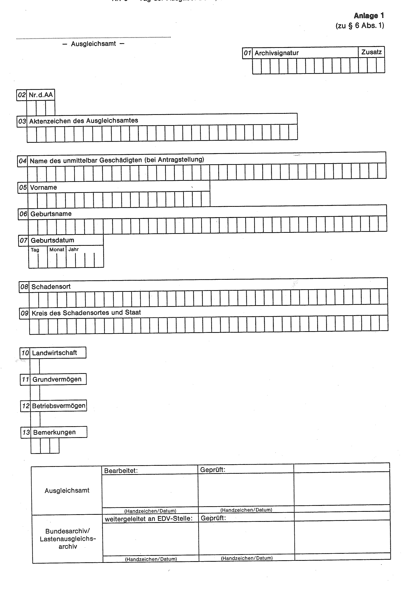

# Verordnung zur Durchführung der zentralen Archivierung von Unterlagen aus dem Bereich des Lastenausgleichs (LAArchV)

Ausfertigungsdatum
:   1988-02-19

Fundstelle
:   BGBl I: 1988, 161

## Eingangsformel

Auf Grund des § 1 Abs. 3 des Gesetzes über die zentrale Archivierung
von Unterlagen aus dem Bereich des Kriegsfolgenrechts vom 6. Januar
1988 (BGBl. I S. 65) wird mit Zustimmung des Bundesrates verordnet:

## § 1

Das Lastenausgleichsarchiv übernimmt die Unterlagen aus dem Bereich
des Lastenausgleichs nach Maßgabe der §§ 3 bis 5.

## § 2

(1) Die in dieser Verordnung genannten Gesetze werden nach Maßgabe des
§ 8 des Lastenausgleichsgesetzes bezeichnet.

(2) In § 3 werden Wirtschaftsgüter, die zum land- und
forstwirtschaftlichen Vermögen, zum Grundvermögen und zum
Betriebsvermögen im Sinne des Bewertungsgesetzes gehören, als
Einheitswertvermögen bezeichnet.

## § 3

(1) Das Lastenausgleichsarchiv übernimmt alle Akten, in denen

1.  Vertreibungsschäden (§ 12 des Lastenausgleichsgesetzes) oder
    Ostschäden (§ 14 des Lastenausgleichsgesetzes) an Einheitswertvermögen
    nach dem Feststellungsgesetz festgestellt oder in denen
    Reparationsschäden nach § 2 des Reparationsschädengesetzes an
    Einheitswertvermögen berechnet wurden, soweit die Schäden in den in §
    11 Abs. 2 Nr. 3 des Lastenausgleichsgesetzes bezeichneten Gebieten mit
    Ausnahme Chinas entstanden sind.

2.  Schäden an Einheitswertvermögen nach dem Beweissicherungs- und
    Feststellungsgesetz festgestellt wurden, sowie

3.  Schäden von Verfolgten im Sinne des § 1 Abs. 3 der Elften Verordnung
    über Ausgleichsleistungen nach dem Lastenausgleichsgesetz geltend
    gemacht wurden, soweit die entsprechenden Wirtschaftsgüter außerhalb
    des Geltungsbereichs des Lastenausgleichsgesetzes belegen waren.

(2) Das Lastenausgleichsarchiv übernimmt ferner alle Akten, in denen
Anträge auf Vertreibungsschäden (§ 12 des Lastenausgleichsgesetzes)
oder Ostschäden (§ 14 des Lastenausgleichsgesetzes) an
Einheitswertvermögen nach dem Feststellungsgesetz abgelehnt oder
sonstwie abgeschlossen wurden, soweit die Schäden in den in § 11 Abs.
2 Nr. 3 des Lastenausgleichsgesetzes bezeichneten Gebieten mit
Ausnahme Chinas entstanden sind.

## § 4

(1) Die Heimatauskunftsstellen (§ 25 des Feststellungsgesetzes) und
die Auskunftsstellen (§ 28 des Beweissicherungs- und
Feststellungsgesetzes) übergeben dem Lastenausgleichsarchiv

1.  Grund- und Betriebslisten,

2.  Kartenmaterial,

3.  Generalakten,

4.  sonstige Unterlagen, die nach Inhalt und Zweck zu den in das
    Lastenausgleichsarchiv zu überführenden Unterlagen gehören.

(2) Die Vororte (§ 7 Abs. 1 Satz 2 der Zweiten Rechtsverordnung des
Präsidenten des Bundesausgleichsamtes zur Durchführung des
Feststellungsgesetzes) übergeben dem Lastenausgleichsarchiv

1.  Generalakten,

2.  Handakten,

3.  Betriebs- und Namenskarteien.

(3) Die Ausgleichsämter, die gemäß § 31 Abs. 2 des
Feststellungsgesetzes, § 33 Abs. 2 des Beweissicherungs- und
Feststellungsgesetzes und § 54 Abs. 4 des Reparationsschädengesetzes
für die einheitliche Feststellung von Schäden an Anteilsrechten an
Kapitalgesellschaften zuständig sind, geben die für die Bewertung der
einzelnen Anteilsrechte maßgebenden Akten (Hauptakten, Stammakten,
Leitakten) ab.

## § 5

Aus den nachstehend aufgeführten Bereichen des Lastenausgleichs,
insbesondere der Gewährung von Ausgleichsleistungen, übernimmt das
Lastenausgleichsarchiv ausgewählte Unterlagen:

1.  Mieterdarlehen,

2.  Altsparergesetz,

3.  Soforthilfegesetz,

4.  Wohnraumhilfe,

5.  Währungsausgleichsgesetz,

6.  Ausbildungshilfe,

7.  Beschwerdeausschüsse,

8.  Arbeitsplatzdarlehen,

9.  Heimförderung,

10. Hausratentschädigung,

11. Aufbaudarlehen Gewerbe,

12. Aufbaudarlehen Wohnungsbau,

13. Aufbaudarlehen Landwirtschaft,

14. Kriegsschadenrente,

15. Schadensfeststellung nach dem Feststellungsgesetz (soweit nicht von §
    3 erfaßt),

16. Hauptentschädigung,

17. Mehrfachleistungen,

18. Härtefonds-Flüchtlingshilfegesetz,

19. Vertreter der Interessen des Ausgleichsfonds (VIA),

20. Reparationsschädengesetz (soweit nicht von § 3 Abs. 1 erfaßt).

Dabei ist neben der Arbeitsweise der Ausgleichsverwaltung insbesondere
die wirtschaftliche und gesellschaftliche Eingliederung des
begünstigten Personenkreises darzustellen.

## § 6

(1) Die Ausgleichsämter haben vor Abgabe der in § 3 Abs. 1
bezeichneten Akten einen Vordruck nach Anlage 1 zu dieser Verordnung
in zweifacher Ausfertigung auszufüllen. Die erste Ausfertigung ist dem
Lastenausgleichsarchiv gesondert zu übersenden, die zweite
Ausfertigung ist der jeweiligen Akte beizuheften.

(2) Die nach § 3 Abs. 2 abzugebenden Akten sind in einem Verzeichnis
nach Anlage 2 dieser Verordnung, die nach den §§ 4 und 5 abzugebenden
Unterlagen sind in ein Verzeichnis nach Anlage 3 zu dieser Verordnung
aufzunehmen.

## § 7

Die abzugebenden Akten und Unterlagen sind zusammen mit den
Verzeichnissen (§ 6) dem Lastenausgleichsarchiv nach vorheriger
Ankündigung erst dann zu übersenden, wenn es die Abnahmebereitschaft
mitgeteilt hat.

## § 8

Diese Verordnung gilt nach Maßgabe des § 14 des Dritten
Überleitungsgesetzes in Verbindung mit § 3 des Gesetzes über die
zentrale Archivierung von Unterlagen aus dem Bereich des
Kriegsfolgenrechts auch im Land Berlin.

## § 9

Diese Verordnung tritt am Tage nach der Verkündung in Kraft.

## Schlußformel

Der Bundesminister des Innern

## Anlage 1 (zu § 6 Abs. 1)

(Fundstelle: BGBl. I 1988, 163)

(zu § 6 Abs. 2)

## Anlage 2 Abgabeliste für negativ beschiedene oder sonstwie abgeschlossene FG-Akten

Fundstelle des Originaltextes: BGBl. I 1988, 164

*    *   Lfd. Nr.

    *   Aktenzeichen

    *   Lfd. Nr.

    *   Aktenzeichen

    *   Lfd. Nr.

    *   Aktenzeichen

*    *
    *
    *
    *
    *
    *

   (zu § 6 Abs. 2)

## Anlage 3 Abgabeliste für Sachakten

Fundstelle des Originaltextes: BGBl. I 1988, 165

*    *   Lfd. Nr.

    *   Archiv-Signatur

    *   Aktenzeichen

    *   Aktenbetreff

    *   Bd.-Nr.

    *   Zeitraum

*    *
    *
    *
    *
    *
    *

