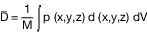
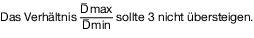

# Verordnung über die Behandlung von Lebensmitteln mit Elektronen-, Gamma- und Röntgenstrahlen, Neutronen oder ultravioletten Strahlen (LMBestrV 2000)

Ausfertigungsdatum
:   2000-12-14

Fundstelle
:   BGBl I: 2000, 1730

Neugefasst durch
:   Bek. v. 15.2.2019 I 116

## § 1 Zulassungen

(1) Die Behandlung von getrockneten aromatischen Kräutern und Gewürzen
mit den in der Nummer 1 der Anlage aufgeführten Elektronen-, Gamma-
und Röntgenstrahlen (Bestrahlung) ist zugelassen.

(2) Die Bestrahlung nach Absatz 1 darf nur unter folgenden Bedingungen
durchgeführt werden:

1.  die maximale durchschnittlich absorbierte Gesamtdosis beträgt nicht
    mehr als 10 Kilogray,

2.  die Bestrahlung darf nicht in Verbindung mit einer chemischen
    Behandlung angewandt werden, die dem gleichen Ziel wie die Bestrahlung
    dient,

3.  die Vorgaben der Nummern 2 und 3 der Anlage sind einzuhalten.

Die Strahlendosis im Sinne der Nummer 1 darf in mehreren Teildosen
verabreicht werden. Das bei der Bestrahlung verwendete
Verpackungsmaterial muss für die Zwecke der Bestrahlung nach dem Stand
der Technik geeignet sein.

(3) Zu Kontroll- und Messzwecken ist die Bestrahlung sowie die
Behandlung von Lebensmitteln mit Neutronen zugelassen. Dabei darf die
Energie der Strahlung im Falle von Röntgenstrahlung 10
Megaelektronvolt, im Falle von Neutronenstrahlung 14 Megaelektronvolt
und bei anderer Strahlung 5 Megaelektronvolt nicht überschreiten. Die
absorbierte Dosis darf bei Neutronenstrahlung 0,01 Gray und bei
anderer Strahlung 0,5 Gray nicht überschreiten.

(4) Die Behandlung durch direkte Einwirkung mit ultravioletten
Strahlen ist zugelassen zur Entkeimung

1.  von Trinkwasser,

2.  der Oberfläche von Obst- und Gemüseerzeugnissen,

3.  von Hartkäse bei der Lagerung.

(5) Die bei der Entkeimung von Luft durch ultraviolette Strahlen
auftretende indirekte Einwirkung auf Lebensmittel ist zugelassen.

## § 2 Lebensmittel aus Drittländern

(1) Bestrahlte getrocknete aromatische Kräuter und Gewürze sowie
Lebensmittel, die bestrahlte getrocknete aromatische Kräuter und
Gewürze enthalten, aus einem Drittland dürfen gewerbsmäßig nur in den
Verkehr gebracht werden, wenn die Bestrahlung in einer von der
Europäischen Union zugelassenen und im Amtsblatt der Europäischen
Gemeinschaften oder der Europäischen Union veröffentlichten
Bestrahlungsanlage durchgeführt worden ist.

(2) Die Lebensmittel nach Absatz 1 dürfen ferner gewerbsmäßig nur in
den Verkehr gebracht werden, wenn sie von Nachweisen begleitet werden,
die Aufschluss geben über

1.  Name und Anschrift der Anlage, in der diese Bestrahlung durchgeführt
    worden ist,

2.  Art und Menge der bestrahlten Lebensmittel,

3.  Nummer des Loses,

4.  Auftraggeber der Strahlenbehandlung,

5.  Empfänger der bestrahlten Lebensmittel,

6.  Bestrahlungsdatum,

7.  das während der Bestrahlung verwendete Verpackungsmaterial,

8.  Parameter für die Überwachung des Bestrahlungsvorganges nach Anhang
    III der Richtlinie 1999/2/EG des Europäischen Parlaments und des Rates
    vom 22. Februar 1999 zur Angleichung der Rechtsvorschriften der
    Mitgliedstaaten über mit ionisierenden Strahlen behandelte
    Lebensmittel und Lebensmittelbestandteile (ABl. EG Nr. L 66 S. 16),
    Angaben über die durchgeführten dosimetrischen Kontrollen und deren
    Ergebnisse, wobei insbesondere der untere und obere Grenzwert der
    absorbierten Dosis sowie die Art der ionisierenden Strahlen genau
    anzugeben sind,

9.  Hinweise auf die vor der Bestrahlung durchgeführten
    Validierungsmessungen.

## § 3 Kenntlichmachung

(1) Bestrahlte getrocknete aromatische Kräuter und Gewürze – auch aus
einem Drittland – müssen von dem, der diese in den Verkehr bringt,
spätestens bei der Abgabe an den Verbraucher, wobei dem Verbraucher
Anbieter von Gemeinschaftsverpflegung sowie Gewerbetreibende, soweit
sie Lebensmittel zum Verbrauch innerhalb ihrer Betriebsstätte
beziehen, gleichstehen, durch die Angabe „bestrahlt“ oder die Angabe
„mit ionisierenden Strahlen behandelt“ gemäß Absatz 2 und 3 Satz 1
sowie Absatz 4, 5 Satz 1 und Absatz 6 kenntlich gemacht werden. Dies
gilt auch, wenn die Lebensmittel nach Satz 1 als Zutaten in einem
anderen Lebensmittel enthalten sind.

(2) Die Angaben nach Absatz 1 sind gut sichtbar, in leicht lesbarer
Schrift und unverwischbar anzugeben.

(3) Die Angaben nach Absatz 1 sind wie folgt anzubringen:

1.  bei loser Abgabe der Lebensmittel auf einem Anschlag oder einem Schild
    über oder neben dem Behältnis, in dem sich das betreffende
    Lebensmittel befindet,

2.  bei der Abgabe von Lebensmitteln in Umhüllungen oder als nicht
    vorverpackte Lebensmittel im Sinne von Artikel 2 Absatz 2 Buchstabe e
    letzter Halbsatz der Verordnung (EU) Nr. 1169/2011 des Europäischen
    Parlaments und des Rates vom 25. Oktober 2011 betreffend die
    Information der Verbraucher über Lebensmittel und zur Änderung der
    Verordnungen (EG) Nr. 1924/2006 und (EG) Nr. 1925/2006 des
    Europäischen Parlaments und des Rates und zur Aufhebung der Richtlinie
    87/250/EWG der Kommission, der Richtlinie 90/496/EWG des Rates, der
    Richtlinie 1999/10/EG der Kommission, der Richtlinie 2000/13/EG des
    Europäischen Parlaments und des Rates, der Richtlinien 2002/67/EG und
    2008/5/EG der Kommission und der Verordnung (EG) Nr. 608/2004 der
    Kommission (ABl. L 304 vom 22.11.2011, S. 18; L 331 vom 18.11.2014, S.
    41; L 50 vom 21.2.2015, S. 48; L 266 vom 30.9.2016, S. 7) in der
    jeweils geltenden Fassung: auf einem Schild über oder neben dem
    Lebensmittel oder auf der Umhüllung,

3.  bei der Abgabe von Lebensmitteln im Versandhandel auch in den
    Angebotslisten,

4.  bei der Abgabe von Lebensmitteln durch Anbieter von
    Gemeinschaftsverpflegung auf Speise- und Getränkekarten oder in
    Preisverzeichnissen oder, soweit keine solchen ausgelegt oder
    ausgehändigt werden, in einem sonstigen Aushang oder in einer
    schriftlichen Mitteilung.

Im Fall der Nummer 4 dürfen die vorgeschriebenen Angaben in Fußnoten
angebracht werden, wenn bei der Bezeichnung des Lebensmittels auf die
entsprechende Fußnote hingewiesen wird.

(4) Bei bestrahlten getrockneten aromatischen Kräutern und Gewürzen
muss die Kenntlichmachung nach Absatz 1 im Falle des Absatzes 3 in
Verbindung mit der Bezeichnung des Lebensmittels erfolgen.

(5) Sofern das bestrahlte Lebensmittel Zutat eines zusammengesetzten
Lebensmittels ist, ist die Zutat in Verbindung mit der
Kenntlichmachung nach Absatz 1 anzugeben; im Falle von vorverpackten
Lebensmitteln, die nach der Verordnung (EU) Nr. 1169/2011 zu
kennzeichnen sind, hat die Angabe im Verzeichnis der Zutaten bei der
betreffenden Zutat zu erfolgen. Anhang VII Teil E Nummer 2 Buchstabe a
und b der Verordnung (EU) Nr. 1169/2011 ist nicht anzuwenden.

(6) Bei Lebensmitteln im Sinne von Absatz 1, die zur Abgabe an andere
als Verbraucher, wobei dem Verbraucher Anbieter von
Gemeinschaftsverpflegung sowie Gewerbetreibende, soweit sie
Lebensmittel zum Verbrauch innerhalb ihrer Betriebsstätte beziehen,
gleichstehen, bestimmt sind, müssen in den Begleitdokumenten folgende
Angaben gut sichtbar, in leicht lesbarer Schrift und unverwischbar
erfolgen:

1.  ein Hinweis auf die Behandlung der Lebensmittel oder der
    Lebensmittelzutaten,

2.  Name und Anschrift der Bestrahlungsanlage oder deren amtliche
    Referenznummer nach § 4 Absatz 3.

## § 4 Zulassung von Einrichtungen zur Bestrahlung

(1) Einrichtungen zur Bestrahlung im Sinne des § 1 Absatz 1
(Bestrahlungsanlagen) dürfen nur verwendet werden, wenn sie durch die
nach Landesrecht zuständigen Behörden für diesen Zweck zugelassen
sind. Die Zulassung erfolgt unbeschadet sonstiger öffentlich-
rechtlicher Vorschriften für solche Einrichtungen.

(2) Die Zulassung darf nur erteilt werden, wenn

1.[^F806004_02_BJNR173000000BJNE000501118]
  die Anlage den Anforderungen der empfohlenen internationalen
    Verfahrensleitsätze der Codex-Alimentarius-Kommission für das
    Betreiben von Bestrahlungseinrichtungen für die Behandlung von
    Lebensmitteln (Ref. FAO/WHO/CAC/Vol XV Ausgabe 1)
    entspricht,

2.  für die Anlage eine Person bestimmt ist, die für die Einhaltung aller
    der für die Anwendung des Verfahrens erforderlichen Bedingungen
    verantwortlich ist.

(3) Die zuständigen Behörden erteilen jeder zugelassenen Anlage eine
Referenznummer.

    UNO-Verlag, Am Hofgarten 10, D 53113 Bonn.
[^F806004_02_BJNR173000000BJNE000501118]: 

## § 5 Aufzeichnungspflichten

Der Betreiber jeder zugelassenen Bestrahlungsanlage hat für jede
Quelle ionisierender Bestrahlung eine Aufzeichnung zu führen, die für
jedes Los des behandelten Lebensmittels Folgendes angibt:

1.  Art und Menge des behandelten Lebensmittels,

2.  Nummer des Loses,

3.  Auftraggeber der Strahlenbehandlung,

4.  Empfänger des behandelten Lebensmittels,

5.  Bestrahlungsdatum,

6.  das während der Bestrahlung verwendete Verpackungsmaterial,

7.  Parameter für die Überwachung des Bestrahlungsvorganges nach Anhang
    III der Richtlinie 1999/2/EG des Europäischen Parlaments und des Rates
    vom 22. Februar 1999 zur Angleichung der Rechtsvorschriften der
    Mitgliedstaaten über mit ionisierenden Strahlen behandelte
    Lebensmittel und Lebensmittelbestandteile (ABl. EG Nr. L 66 S. 16),
    Angaben über die durchgeführten dosimetrischen Kontrollen und der
    Ergebnisse, wobei insbesondere der untere und obere Grenzwert der
    absorbierten Dosis sowie die Art der ionisierenden Strahlen genau
    anzugeben sind,

8.  Hinweise auf die vor der Bestrahlung durchgeführten
    Validierungsmessungen.

Die Aufzeichnungen nach Satz 1 sind von dem Betreiber der
Bestrahlungsanlage fünf Jahre aufzubewahren; die Aufbewahrungsfrist
beginnt mit dem Ablauf des Kalenderjahres, in dem die Bestrahlung
durchgeführt worden ist.

## § 6 Analysenmethoden

Die zum Nachweis einer Bestrahlung angewandten Methoden müssen
hinsichtlich der im Anhang unter den Nummern 1 und 2 der Richtlinie
85/591/EWG des Rates vom 20. Dezember 1985 zur Einführung
gemeinschaftlicher Probenahmeverfahren und Analysemethoden für die
Kontrolle von Lebensmitteln (ABl. EG Nr. L 372 S. 50) aufgeführten
erforderlichen Kriterien getestet sein.

## § 7 Mitteilungen, Berichte

(1) Die Länder teilen dem Bundesministerium für Ernährung und
Landwirtschaft die nach § 4 für die Zulassung zuständigen Behörden
mit.

(2) Die zuständigen Behörden übermitteln dem Bundesministerium für
Ernährung und Landwirtschaft eine Durchschrift jeder
Zulassungsverfügung und jeder Änderung dieser Verfügung.

(3) Die zuständigen Behörden berichten dem Bundesamt für
Verbraucherschutz und Lebensmittelsicherheit jeweils zum 31. März
eines Jahres für das vorhergehende Kalenderjahr über

1.  die Ergebnisse der Kontrollen, die in den zugelassenen Einrichtungen
    zur Bestrahlung durchgeführt werden, insbesondere in Bezug auf die
    Gruppen und Mengen der bestrahlten Lebensmittel und die verabreichten
    Dosen,

2.  die Ergebnisse der Kontrollen, die auf der Stufe des Inverkehrbringens
    von Lebensmitteln zum Nachweis der Bestrahlung durchgeführt werden,
    einschließlich der jeweils angewandten Analysemethode.

## § 8 Straftaten, Ordnungswidrigkeiten

(1) Nach § 59 Absatz 1 Nummer 21 Buchstabe a des Lebensmittel- und
Futtermittelgesetzbuches wird bestraft, wer entgegen § 1 Absatz 2 Satz
1 Nummer 1 oder 2 eine Bestrahlung durchführt.

(2) Nach § 59 Absatz 1 Nummer 21 Buchstabe a des Lebensmittel- und
Futtermittelgesetzbuches wird bestraft, wer entgegen § 3 Absatz 1 Satz
1, auch in Verbindung mit Satz 2, ein dort genanntes Lebensmittel
nicht, nicht richtig, nicht vollständig, nicht in der vorgeschriebenen
Weise oder nicht rechtzeitig kenntlich macht.

(3) Nach § 59 Absatz 1 Nummer 21 Buchstabe a des Lebensmittel- und
Futtermittelgesetzbuches wird bestraft, wer entgegen § 2 Absatz 1 ein
dort genanntes Lebensmittel in den Verkehr bringt.

(4) Nach § 59 Absatz 1 Nummer 21 Buchstabe a des Lebensmittel- und
Futtermittelgesetzbuches wird bestraft, wer entgegen § 4 Absatz 1 Satz
1 eine Bestrahlungsanlage verwendet.

(5) Nach § 60 Absatz 1 des Lebensmittel- und Futtermittelgesetzbuches
handelt ordnungswidrig, wer eine in den Absätzen 1, 2, 3 oder 4
bezeichnete Handlung fahrlässig begeht.

(6) Ordnungswidrig im Sinne des § 60 Absatz 2 Nummer 26 Buchstabe a
des Lebensmittel- und Futtermittelgesetzbuches handelt, wer
vorsätzlich oder fahrlässig

1.  entgegen § 2 Absatz 2 ein Lebensmittel in den Verkehr bringt oder

2.  entgegen § 5 eine Aufzeichnung nicht, nicht richtig oder nicht
    vollständig führt oder nicht oder nicht mindestens fünf Jahre
    aufbewahrt.

## § 9

(Übergangsfrist)

## § 10

(Inkrafttreten, Außerkrafttreten)

## Anlage (zu § 1)

(Fundstelle: BGBl. I 2019, 120)

## Vorgaben für die Bestrahlung

1.  Quellen ionisierender Strahlung

    Lebensmittel dürfen nur mit den nachstehenden Arten ionisierender
    Strahlung behandelt werden:

    a)  Gammastrahlen aus Radionukliden
        60                         Co oder
        137                         Cs.

    b)  Röntgenstrahlen, die von Geräten erzeugt werden, die mit einer
        Nennenergie (maximale Quantenenergie) von 5 Megaelektronvolt oder
        darunter betrieben werden.

    c)  Elektronen, die von Geräten erzeugt werden, die mit einer Nennenergie
        (maximale Quantenenergie) von 10 Megaelektronvolt oder darunter
        betrieben werden.

2.  Dosimetrie

    **Durchschnittlich absorbierte Gesamtdosis**

    Bei der Bestimmung der Bekömmlichkeit von Lebensmitteln, die mit einer
    durchschnittlichen Gesamtdosis von 10 Kilogray oder weniger behandelt
    worden sind, kann davon ausgegangen werden, dass alle chemischen
    Bestrahlungseffekte in diesem spezifischen Dosisbereich proportional
    zur Dosis sind.

    Die durchschnittliche Gesamtdosis D wird durch die nachstehende
    Integralgleichung für das behandelte Lebensmittel festgelegt:

    *        *
        *            

    *        *   Hierbei ist

        *   M =

        *   die Gesamtmasse der behandelten Probe

    *        *
        *   p =

        *   die lokale Dichte an dem betreffenden Punkt (x,y,z)

    *        *
        *   d =

        *   die an dem betreffenden Punkt (x,y,z) absorbierte lokale Dosis und

    *        *
        *   dV =

        *   infinitesimales Volumenelement dx dy dz

    Die durchschnittlich absorbierte Gesamtdosis kann für homogene
    Erzeugnisse oder Erzeugnisse in losem Zustand mit einer homogenen
    Fülldichte unmittelbar bestimmt werden, indem eine entsprechende
    Anzahl von Dosimetern gezielt und nach einer Zufallsverteilung über
    das gesamte Warenvolumen verteilt werden. Aus der so ermittelten
    Dosisaufteilung kann ein Durchschnittswert errechnet werden, der der
    durchschnittlich absorbierten Gesamtdosis entspricht.

    Ist der Verlauf der Dosisverteilungskurve durch das gesamte Erzeugnis
    klar erkennbar, kann auch ermittelt werden, wo Mindest- und
    Höchstdosis auftreten. Messungen der Dosisverteilung an diesen beiden
    Stellen bei einer Reihe von Probeexemplaren des Erzeugnisses
    ermöglichen eine Schätzung der durchschnittlichen Gesamtdosis.

    In einigen Fällen ist der Mittelwert des Durchschnittswertes der
    Mindest- (Dmin) und der Höchstdosis (Dmax) ein guter Schätzungswert
    der durchschnittlichen Gesamtdosis. In diesen Fällen entspricht

    *        *            

    *        *            

3.  Verfahren

    Vor der routinemäßigen Bestrahlung einer gegebenen Gruppe von
    Lebensmitteln in einer Bestrahlungsanlage wird mit Dosismessungen im
    gesamten Produktvolumen ermittelt, an welcher Stelle die Höchst- und
    die Mindestdosis auftritt. Eine ausreichende Zahl dieser
    Validierungsmessungen muss vorgenommen werden (z. B. 3 bis 5), um den
    Schwankungen der Dichte oder Geometrie der Erzeugnisse Rechnung zu
    tragen.

    Die Messungen müssen wiederholt werden, wenn das Erzeugnis, seine
    Geometrie oder die Bestrahlungsbedingungen geändert werden.

    Während der Behandlung werden routinemäßige Dosismessungen
    durchgeführt, um sicherzustellen, dass die Dosisgrenzen nicht
    überschritten werden. Zur Durchführung der Messung werden Dosimeter
    beim voraussichtlichen Ort der Höchst- und Mindestdosis oder in einer
    Bezugsposition angeordnet.

    Die Dosis an dieser Bezugsposition muss mengenmäßig mit der Höchst-
    und der Mindestdosis verbunden sein. Die Bezugspunkte müssen an einem
    günstigen Punkt im oder auf dem Erzeugnis gewählt werden, an dem die
    Dosisschwankungen gering sind.

    Die routinemäßigen Dosismessungen sollten während der Produktion bei
    jedem Los und in geeigneten Abständen durchgeführt werden.

    Werden fließende, unverpackte Erzeugnisse bestrahlt, so können
    Mindest- und Höchstdosis nicht bestimmt werden. Das Ermitteln der
    Extremwerte sollte in diesen Fällen durch Stichproben erfolgen.

    Die Dosismessungen sollten mit anerkannten Dosimetern vorgenommen und
    auf Primärnormen bezogen werden.

    Während der Bestrahlung müssen einschlägige Parameter der Anlage
    ständig überwacht und aufgezeichnet werden. Bei Radionuklidanlagen
    umfassen die Parameter die Produkttransportgeschwindigkeit oder die
    Aufenthaltszeit in der Strahlungszone und die genaue Angabe der
    korrekten Stellung der Quelle. Für die Beschleunigungsanlagen umfassen
    die Parameter die Produkttransportgeschwindigkeit und das
    Energieniveau, den Elektronenfluss und die Scan-Breite der Anlage.

