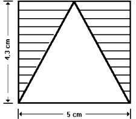
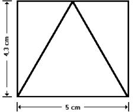

# Verordnung über die Durchführung der veterinärrechtlichen Kontrollen bei der Einfuhr und Durchfuhr von Lebensmitteln tierischen Ursprungs aus Drittländern sowie über die Einfuhr sonstiger Lebensmittel aus Drittländern (LMEV)

Ausfertigungsdatum
:   2007-08-08

Fundstelle
:   BGBl I: 2007, 1816, 1871

Neugefasst durch
:   Bek. v. 15.9.2011 I 1860;

Zuletzt geändert durch
:   Art. 1 V v. 27.9.2017 I 3459

## Abschnitt 1 - Anwendungsbereich, Begriffsbestimmung

### § 1 Anwendungsbereich

Diese Verordnung gilt für die Einfuhr und die Durchfuhr von
Lebensmitteln und, soweit dies ausdrücklich bestimmt ist, lebenden
Tieren im Sinne des § 4 Absatz 1 Nummer 1 des Lebensmittel- und
Futtermittelgesetzbuches.

### § 2 Begriffsbestimmungen

Im Sinne dieser Verordnung sind:

1.  Lebensmittel tierischen Ursprungs: Erzeugnisse tierischen Ursprungs im
    Sinne des Anhangs I Nummer 8.1 Spiegelstrich 1 der Verordnung (EG) Nr.
    853/2004 des Europäischen Parlaments und des Rates vom 29. April 2004
    mit spezifischen Hygienevorschriften für Lebensmittel tierischen
    Ursprungs (ABl. L 139 vom 30.4.2004, S. 55, L 226 vom 25.6.2004, S.
    22),

1a. Zusammengesetzte Lebensmittel: zusammengesetzte Erzeugnisse im Sinne
    des Artikels 2 Buchstabe a der Entscheidung 2007/275/EG der Kommission
    vom 17. April 2007 mit Verzeichnissen von Tieren und Erzeugnissen, die
    gemäß den Richtlinien 91/496/EWG und 97/78/EG des Rates an
    Grenzkontrollstellen zu kontrollieren sind (ABl. L 116 vom 4.5.2007,
    S. 9),

2.  Sendung: eine Menge gleichartiger lebender Tiere im Sinne des § 4
    Absatz 1 Nummer 1 des Lebensmittel- und Futtermittelgesetzbuches oder
    gleichartiger Lebensmittel, auf die sich jeweils die gleiche amtliche
    Genusstauglichkeitsbescheinigung, amtliche Gesundheitsbescheinigung
    oder sonstige vergleichbare Urkunde bezieht, die jeweils mit demselben
    Beförderungsmittel befördert wird und jeweils aus demselben Drittland
    oder Teil eines Drittlandes stammt,

3.  Grenzkontrollstelle: eine amtliche Einrichtung der zuständigen Behörde
    für die Durchführung der Dokumentenprüfung, Nämlichkeitskontrolle und
    Warenuntersuchung an der Grenze zu einem Drittland oder in einem Hafen
    oder Flughafen,

4.  Verbringen: Verbringen im Sinne des Artikels 2 Nummer 16 der
    Verordnung (EG) Nr. 882/2004 des Europäischen Parlaments und des Rates
    vom 29. April 2004 über amtliche Kontrollen zur Überprüfung der
    Einhaltung des Lebensmittel- und Futtermittelrechts sowie der
    Bestimmungen über Tiergesundheit und Tierschutz (ABl. L 165 vom
    30\.4.2004, S. 1, L 191 vom 28.5.2004, S. 1) sowie jede andere Form des
    körperlichen Verbringens von Sendungen in das Inland,

5.  Gemeinsames Veterinärdokument für die Einfuhr: die Bescheinigung nach
    Anhang III der Verordnung (EG) Nr. 136/2004 der Kommission vom 22.
    Januar 2004 mit Verfahren für die Veterinärkontrollen von aus
    Drittländern eingeführten Erzeugnissen an den Grenzkontrollstellen der
    Gemeinschaft (ABl. L 21 vom 28.1.2004, S. 11),

6.  Mitgliedstaat: ein Staat, der der Europäischen Union angehört,

7.  EFTA-Staat: ein Staat, der Mitglied der Europäischen
    Freihandelsassoziation ist,

8.  Drittland: ein Staat, der nicht Mitgliedstaat und nicht EFTA-Staat
    ist, mit Ausnahme der Färöer Inseln,

9.  Durchfuhr: das Verbringen von Lebensmitteln tierischen Ursprungs und
    von zusammengesetzten Lebensmitteln aus Drittländern in das Inland,
    ohne sie einzuführen, mit anschließender Wiederausfuhr.

Im Übrigen gelten die Begriffsbestimmungen der Lebensmittelhygiene-
Verordnung sowie der Tierische Lebensmittel-Hygieneverordnung.

## Abschnitt 2 - Vorschriften für Lebensmittel tierischen Ursprungs, zusammengesetzte Lebensmittel und lebende Tiere

### § 3 Verfahren bei der Anzeige

Wer zur Anzeige nach Artikel 2 Absatz 1 der Verordnung (EG) Nr.
136/2004 verpflichtet ist, hat diese Anzeige mindestens einen Werktag
vor Eintreffen der Sendung an der Grenzkontrollstelle zu übermitteln.
Abweichend von Satz 1 kann die für die Grenzkontrollstelle zuständige
Behörde eine spätere Anzeige noch als fristgerecht anerkennen, soweit
dadurch die ordnungsgemäße Durchführung der Einfuhruntersuchung nach §
7 nicht behindert wird.

### § 3a Vorlage von Schiffs- und Flugzeugmanifesten

Wer als Verantwortlicher für ein Schiff oder Flugzeug mit diesem
Lebensmittel tierischen Ursprungs oder zusammengesetzte Lebensmittel
in das Inland verbringt, hat der für die Grenzkontrollstelle
zuständigen Behörde auf deren Verlangen das Schiffs- oder
Flugzeugmanifest zum Zwecke der Überwachung der Einhaltung des
Artikels 2 Absatz 1 der Verordnung (EG) Nr. 136/2004 vorzulegen. Das
Schiffs- oder Flugzeugmanifest ist elektronisch vorzulegen, soweit die
für die Grenzkontrollstelle zuständige Behörde dies verlangt.

### § 4 Lebende Tiere

Lebende Tiere im Sinne des § 4 Absatz 1 Nummer 1 des Lebensmittel- und
Futtermittelgesetzbuches, die

1.  Rückstände oder Umwandlungsprodukte von Stoffen mit pharmakologischer
    Wirkung enthalten, die diesen Tieren nach § 1 oder § 2 der Verordnung
    über Stoffe mit pharmakologischer Wirkung in der Fassung der
    Bekanntmachung vom 7. März 2005 (BGBl. I S. 730), die durch Artikel 2
    der Verordnung vom 24. Oktober 2005 (BGBl. I S. 3098) geändert worden
    ist, nicht zugeführt werden dürfen oder

2.  Rückstände von Stoffen mit pharmakologischer Wirkung oder deren
    Umwandlungsprodukte enthalten, die im Anhang Tabelle 2 der Verordnung
    (EU) Nr. 37/2010 der Kommission vom 22. Dezember 2009 über
    pharmakologisch wirksame Stoffe und ihre Einstufung hinsichtlich der
    Rückstandshöchstmengen in Lebensmitteln tierischen Ursprungs (ABl. L
    15 vom 20.1.2010, S. 1, L 293 vom 11.11.2010, S. 72), die zuletzt
    durch die Durchführungsverordnung (EU) 2017/201 (ABl. L 32 vom
    7\.2.2017, S. 17) geändert worden ist, als verbotene Stoffe aufgeführt
    sind,

dürfen nicht eingeführt werden. Satz 1 Nummer 1 gilt entsprechend,
wenn das Vorhandensein der Stoffe zu einem früheren Zeitpunkt im
lebenden Tier festgestellt worden ist.

### § 5 Einfuhr

(1) Sendungen von Lebensmitteln tierischen Ursprungs,
zusammengesetzten Lebensmitteln oder lebenden Tieren im Sinne des § 4
Absatz 1 Nummer 1 des Lebensmittel- und Futtermittelgesetzbuches
dürfen aus Drittländern nur eingeführt werden, wenn sie

1.  einer Einfuhruntersuchung nach § 7 Absatz 1 oder 2 Satz 1, 3 oder 4
    unterzogen worden sind und

2.  über eine in einer nach Artikel 6 Absatz 4 der Richtlinie 97/78/EG des
    Rates vom 18. Dezember 1997 zur Festlegung von Grundregeln für die
    Veterinärkontrollen von aus Drittländern in die Gemeinschaft
    eingeführten Erzeugnissen (ABl. L 24 vom 30.1.1998, S. 9) von der
    Kommission der Europäischen Gemeinschaft oder der Europäischen
    Kommission im Amtsblatt der Europäischen Union veröffentlichten Liste
    aufgeführte Grenzkontrollstelle in das Inland verbracht werden.

(2) Absatz 1 gilt nicht im Falle

1.  von Lebensmitteln, die in einem anderen Mitgliedstaat, in einem EFTA-
    Staat, auf den Färöer Inseln oder, im Falle von Fischereierzeugnissen
    und lebenden Muscheln, Stachelhäutern, Manteltieren sowie
    Meeresschnecken, auf Grönland einer Einfuhruntersuchung entsprechend
    den jeweiligen nationalen Rechtsvorschriften unterzogen worden sind,

2.  von Fischereierzeugnissen und lebenden Muscheln, Stachelhäutern,
    Manteltieren sowie Meeresschnecken mit Ursprung aus Grönland und

3.  der in Anlage 1 genannten Lebensmittel.

(3) Die Grenzkontrollstellen nach Absatz 1 Nummer 2 sind von den
zuständigen Behörden im Benehmen mit der Generalzolldirektion zu
bestimmen. Sie sind von einem amtlichen Tierarzt zu leiten.

### § 6 Zugelassene Drittländer und Betriebe, Bescheinigungen

(1) Sendungen von Lebensmitteln tierischen Ursprungs dürfen nur
eingeführt werden, wenn sie

1.  aus einem Drittland oder einem Teil eines Drittlandes stammen, das
    oder der in einer Liste eines von der Kommission der Europäischen
    Gemeinschaft oder der Europäischen Kommission erlassenen Rechtsaktes
    aufgeführt ist, der auf

    a)  Artikel 11 Absatz 1 der Verordnung (EG) Nr. 854/2004 des Europäischen
        Parlaments und des Rates vom 29. April 2004 mit besonderen
        Verfahrensvorschriften für die amtliche Überwachung von zum
        menschlichen Verzehr bestimmten Erzeugnissen tierischen Ursprungs
        (ABl. L 139 vom 30.4.2004, S. 206, L 226 vom 25.6.2004, S. 83)
        gestützt und unmittelbar anwendbar ist,

    b)  Artikel 11 Absatz 1 der Verordnung (EG) Nr. 854/2004 gestützt ist und
        vom Bundesamt für Verbraucherschutz und Lebensmittelsicherheit
        (Bundesamt) im Bundesanzeiger bekannt gemacht worden ist oder

    c)  einen in Anlage 2 Spalte 2 jeweils genannten Rechtsakt der
        Europäischen Gemeinschaft gestützt ist und vom Bundesamt im
        Bundesanzeiger bekannt gemacht worden ist,

2.  aus einem Drittland stammen, das in einem nicht unmittelbar geltenden
    Rechtsakt aufgeführt ist, den die Europäische Kommission gestützt auf
    Artikel 29 Absatz 1 Unterabsatz 4 der Richtlinie 96/23/EG des Rates
    vom 29. April 1996 über Kontrollmaßnahmen hinsichtlich bestimmter
    Stoffe und ihrer Rückstände in lebenden Tieren und tierischen
    Erzeugnissen und zur Aufhebung der Richtlinien 85/358/EWG und
    86/469/EWG und der Entscheidung 89/187/EWG und 91/664/EG (ABl. L 125
    vom 23.5.1996, S. 10) erlassen hat und der vom Bundesamt im
    Bundesanzeiger bekannt gemacht worden ist,

3.  außer in den in Artikel 12 Absatz 1 Buchstabe a und b der Verordnung
    (EG) Nr. 854/2004 genannten Fällen aus Betrieben stammen, die in einer
    Liste aufgeführt sind, die

    a)  von der Kommission der Europäischen Gemeinschaft oder der Europäischen
        Kommission nach Artikel 12 Absatz 5 der Verordnung (EG) Nr. 854/2004
        der Öffentlichkeit zugänglich gemacht worden ist oder

    b)  in einem von der Kommission der Europäischen Gemeinschaft oder der
        Europäischen Kommission erlassenen Rechtsakt aufgeführt ist, der auf
        einen in Anlage 2 Spalte 3 jeweils genannten Rechtsakt der
        Europäischen Gemeinschaft gestützt ist und vom Bundesamt im
        Bundesanzeiger bekannt gemacht worden ist,

    und

4.  von einer Bescheinigung begleitet werden, die den Anforderungen des
    Artikels 14 Absatz 1 in Verbindung mit Anhang VI Nummer 1 und 2 Satz 1
    und Nummer 3 bis 6 der Verordnung (EG) Nr. 854/2004 genügt und

    a)  die den jeweiligen Anforderungen des Artikels 6 in Verbindung mit
        Anhang VI der Verordnung (EG) Nr. 2074/2005 der Kommission vom 5.
        Dezember 2005 zur Festlegung von Durchführungsvorschriften für
        bestimmte unter die Verordnung (EG) Nr. 853/2004 des Europäischen
        Parlaments und des Rates fallende Erzeugnisse und für die in den
        Verordnungen (EG) Nr. 854/2004 des Europäischen Parlaments und des
        Rates und (EG) Nr. 882/2004 des Europäischen Parlaments und des Rates
        vorgesehenen amtlichen Kontrollen, zur Abweichung von der Verordnung
        (EG) Nr. 852/2004 des Europäischen Parlaments und des Rates und zur
        Änderung der Verordnungen (EG) Nr. 853/2004 und (EG) Nr. 854/2004
        (ABl. L 338 vom 22.12.2005, S. 27), die zuletzt durch die
        Durchführungsverordnung (EU) 2016/759 (ABl. L 126 vom 14.5.2016, S.
        13) geändert worden ist, genügt,

    b)  die den jeweiligen Anforderungen eines von der Kommission der
        Europäischen Gemeinschaft oder der Europäischen Kommission erlassenen
        Rechtsaktes genügt, der auf Artikel 9 der Verordnung (EG) Nr. 853/2004
        oder Artikel 11 oder Artikel 16, auch in Verbindung mit Artikel 14
        Absatz 4, der Verordnung (EG) Nr. 854/2004 gestützt ist und, sofern es
        sich dabei um einen nicht unmittelbar geltenden Rechtsakt handelt, vom
        Bundesamt im Bundesanzeiger bekannt gemacht worden ist, oder

    c)  die den Anforderungen einer Entscheidung genügt, die die Kommission
        der Europäischen Gemeinschaft gestützt auf einen der in Anlage 2
        Spalte 4 jeweils genannten Rechtsakte der Europäischen Gemeinschaft
        erlassen hat und die vom Bundesamt im Bundesanzeiger oder im
        elektronischen Bundesanzeiger\*) bekannt gemacht worden ist.

(1a) Sendungen von zusammengesetzten Lebensmitteln, die in Anlage 1
aufgeführt sind und die Milcherzeugnisse enthalten, dürfen nur
eingeführt werden, wenn diese Milcherzeugnisse aus einem Drittland
oder einem Teil eines Drittlandes stammen, das oder der aufgeführt ist
im Anhang I der Verordnung (EU) Nr. 605/2010 der Kommission vom 2.
Juli 2010 zur Festlegung der Veterinärbedingungen und
Veterinärbescheinigungen für das Verbringen von Milcherzeugnissen und
Rohmilch zum menschlichen Verzehr in die Europäische Union (ABl. L 175
vom 10.7.2010, S. 1) in der jeweils geltenden Fassung.

(2) Sendungen von Lebensmitteln tierischen Ursprungs dürfen

1.  abweichend von Absatz 1 Nummer 1 eingeführt werden, solange für diese
    Lebensmittel

    a)  kein Rechtsakt nach Absatz 1 Nummer 1 Buchstabe a erlassen worden ist
        und

    b)  kein Rechtsakt nach Absatz 1 Nummer 1 Buchstabe b oder c erlassen und
        vom Bundesamt bekannt gemacht worden ist,

2.  abweichend von Absatz 1 Nummer 2 eingeführt werden, wenn die
    Lebensmittel oder die Tiere, von denen die Lebensmittel stammen,
    keiner der Kategorien unterfallen, die im Anhang eines Rechtsaktes
    nach Absatz 1 Nummer 2 aufgeführt sind,

3.  abweichend von Absatz 1 Nummer 3 eingeführt werden, solange für diese
    Lebensmittel

    a)  keine Liste nach Absatz 1 Nummer 3 Buchstabe a der Öffentlichkeit
        zugänglich gemacht worden ist und

    b)  kein Rechtsakt nach Absatz 1 Nummer 3 Buchstabe b erlassen und vom
        Bundesamt bekannt gemacht worden ist,

4.  abweichend von Absatz 1 Nummer 4 eingeführt werden, solange für diese
    Lebensmittel

    a)  in dem Rechtsakt nach Absatz 1 Nummer 4 Buchstabe a keine
        Anforderungen an Bescheinigungen niedergelegt sind,

    b)  ein Rechtsakt nach Absatz 1 Nummer 4 Buchstabe b nicht erlassen und,
        sofern es sich dabei um einen nicht unmittelbar geltenden Rechtsakt
        handelt, vom Bundesamt bekannt gemacht worden ist und

    c)  eine Entscheidung nach Absatz 1 Nummer 4 Buchstabe c nicht erlassen
        und vom Bundesamt bekannt gemacht worden ist.

    Im Fall des Satzes 1 Nummer 4 müssen die Lebensmittel von einer
    Bescheinigung begleitet werden, die den Anforderungen des Artikels 14
    Absatz 1 in Verbindung mit Anhang VI Nummer 1 und 2 Satz 1 und Nummer
    3 bis 6 der Verordnung (EG) Nr. 854/2004 genügt und nach Form und
    Inhalt dem Muster der Anlage 2a entspricht.

### § 7 Einfuhruntersuchung

(1) Die für die Grenzkontrollstelle zuständige Behörde führt bei
Lebensmitteln tierischen Ursprungs, zusammengesetzten Lebensmitteln
und lebenden Tieren im Sinne des § 4 Absatz 1 Nummer 1 des
Lebensmittel- und Futtermittelgesetzbuches eine Einfuhruntersuchung
durch, die eine Dokumentenprüfung nach Anhang I der Verordnung (EG)
Nr. 136/2004, eine Nämlichkeitskontrolle nach Anlage 3 sowie eine
Warenuntersuchung nach Anlage 4 umfasst.

(2) Abweichend von Absatz 1 werden Sendungen von Lebensmitteln
tierischen Ursprungs, zusammengesetzten Lebensmitteln oder lebenden
Tieren im Sinne des § 4 Absatz 1 Nummer 1 des Lebensmittel- und
Futtermittelgesetzbuches, die über eine Grenzkontrollstelle an einem
Flughafen oder Hafen eintreffen und dort unmittelbar in ein Flugzeug
oder Schiff umgeladen werden, vorbehaltlich Satz 2 an der
Grenzkontrollstelle des Bestimmungsortes der Einfuhruntersuchung
unterzogen. Der für den Transport Verantwortliche hat die für die
Grenzkontrollstelle zuständige Behörde unverzüglich über den
Entladezeitpunkt und -ort und die Grenzkontrollstelle des
Bestimmungsortes in der von der zuständigen Behörde bestimmten Weise
zu unterrichten, sofern die Umladung der Sendung innerhalb eines
Zeitraumes von weniger als zwölf Stunden im Flug- oder weniger als
sieben Tagen im Seeverkehr stattfindet. Die für die
Grenzkontrollstelle zuständige Behörde hat Sendungen nach Satz 1, bei
denen der Zeitraum nach Satz 2, aber nicht der Zeitraum von 48 Stunden
im Flug- oder 20 Tagen im Seeverkehr überschritten worden ist, einer
Dokumentenprüfung, auch anhand beglaubigter Kopien, zu unterziehen.
Die für die Grenzkontrollstelle zuständige Behörde hat eine
Einfuhruntersuchung nach Absatz 1 durchzuführen, wenn der Zeitraum
nach Satz 3 überschritten ist. Die zuständige Behörde kann, sofern
Gründe des Gesundheitsschutzes es erfordern, im Falle des Satzes 2
eine Dokumentenprüfung, auch anhand beglaubigter Kopien und im Falle
des Satzes 3 eine Einfuhruntersuchung nach Absatz 1 durchführen. Die
für die Grenzkontrollstelle zuständige Behörde hat sich über den
Verbleib von Sendungen nach den Sätzen 2 und 3 zu vergewissern.

(3) Die zuständige Behörde führt bei der Einfuhr oder dem sonstigen
Verbringen von Lebensmitteln tierischen Ursprungs und lebenden Tieren
amtliche Kontrollen durch, die in einem in § 13 Absatz 1 Satz 1
genannten, nicht unmittelbar geltenden Rechtsakt der Europäischen
Gemeinschaft oder der Europäischen Union bestimmt worden sind, soweit
das Bundesministerium für Ernährung und Landwirtschaft
(Bundesministerium) den Rechtsakt im Bundesanzeiger bekannt gemacht
hat. Das Bundesministerium macht auch Änderungen und die Aufhebung
dieses Rechtsaktes im Bundesanzeiger bekannt.

### § 8 Verfahren nach Abschluss der Einfuhruntersuchung

(1) Nach Abschluss des Verfahrens nach Artikel 1 Absatz 1 der
Verordnung (EG) Nr. 136/2004 hat die für die Grenzkontrollstelle
zuständige Behörde dem Beteiligten auf Verlangen eine beglaubigte
Kopie der amtlichen Genusstauglichkeitsbescheinigung, amtlichen
Gesundheitsbescheinigung oder sonstigen vergleichbaren Urkunde
auszustellen.

(2) Werden Sendungen nach der Einfuhruntersuchung an der
Grenzkontrollstelle geteilt, ist für jede Teilsendung das Verfahren
nach Artikel 3 Absatz 1 bis 3 und Absatz 4 Satz 1 der Verordnung (EG)
Nr. 136/2004 durchzuführen.

(3) Sofern die für die Grenzkontrollstelle zuständige Behörde gemäß
Artikel 21 Absatz 1 der Verordnung (EG) Nr. 882/2004 eine Erlaubnis
für die Rücksendung von Sendungen erteilt, hat sie die Originale der
die Sendung begleitenden Dokumente mit einem Stempelaufdruck in roter
Farbe mit dem Wort „zurückgewiesen“ zu kennzeichnen. Die Sendung
selbst ist gegebenenfalls nach Maßgabe der Anlage 4 Kapitel III Nummer
5 und 6 zu kennzeichnen.

(4) Hat die für die Grenzkontrollstelle zuständige Behörde bei der
Einfuhruntersuchung

1.  einen schweren Verstoß oder wiederholte Verstöße gegen
    lebensmittelrechtliche Vorschriften,

2.  die Verabreichung verbotener Stoffe oder Erzeugnisse an lebende Tiere
    oder

3.  bei Lebensmitteln tierischen Ursprungs

    a)  eine Überschreitung festgesetzter Höchstmengen an Rückständen von
        Stoffen mit pharmakologischer Wirkung oder deren Umwandlungsprodukten
        oder von anderen Stoffen, die die menschliche Gesundheit
        beeinträchtigen können, oder

    b)  Rückstände verbotener Stoffe mit pharmakologischer Wirkung oder deren
        Umwandlungsprodukte

festgestellt, hat sie bei den folgenden Sendungen lebender Tiere oder
Lebensmittel tierischen Ursprungs desselben Ursprungs oder derselben
Herkunft verstärkte Kontrollen nach Maßgabe des Artikels 30 Absatz 1
Spiegelstrich 2 der Richtlinie 96/23/EG und des Artikels 24 Absatz 1
Spiegelstrich 2 der Richtlinie 97/78/EG vorzunehmen. Bei Fleisch,
Hackfleisch, Fleischzubereitungen und Fleischerzeugnissen richtet sich
der Umfang der nach Satz 1 durchzuführenden verstärkten Kontrollen
nach Anlage 4 Kapitel III Nummer 2.2.3, 2.3.2, 3, 4.2.5 und 4.4.2.

(5) Absatz 4 Satz 1 Nummer 3 Buchstabe b gilt nicht, soweit
Referenzwerte für Maßnahmen in Bezug auf die jeweiligen Rückstände in
den nachfolgenden Rechtsakten festgelegt sind und diese nicht erreicht
werden:

1.  Artikel 2 der Entscheidung 2005/34/EG der Kommission vom 11. Januar
    2005 zur Festlegung einheitlicher Normen für die Untersuchung von aus
    Drittländern eingeführten Erzeugnissen tierischen Ursprungs auf
    bestimmte Rückstände (ABl. L 16 vom 20.1.2005, S. 61) in Verbindung
    mit Anhang II der Entscheidung 2002/657/EG der Kommission vom 12.
    August 2002 zur Umsetzung der Richtlinie 96/23/EG des Rates betreffend
    die Durchführung von Analysemethoden und die Auswertung von
    Ergebnissen (ABl. L 221 vom 17.8.2002, S. 8, L 239 vom 6.9.2002, S.
    66) in der jeweils geltenden Fassung oder

2.  Rechtsakte der Europäischen Union, die auf Artikel 18 der Verordnung
    (EG) Nr. 470/2009 des Europäischen Parlaments und des Rates vom 6. Mai
    2009 über die Schaffung eines Gemeinschaftsverfahrens für die
    Festsetzung von Höchstmengen für pharmakologisch wirksame Stoffe in
    Lebensmitteln tierischen Ursprungs, zur Aufhebung der Verordnung (EWG)
    Nr. 2377/90 des Rates und zur Änderung der Richtlinie 2001/82/EG des
    Europäischen Parlaments und des Rates (ABl. L 152 vom 16.6.2009, S.
    11) in der jeweils geltenden Fassung gestützt werden.

### § 8a Verfahren nach Abschluss der Einfuhruntersuchung für bestimmte Sendungen

(1) Wer Sendungen von nicht enthäuteten Tierkörpern freilebenden
Großwilds befördert, hat diese Sendungen unverzüglich nach Abschluss
der Einfuhruntersuchung nach § 7 Absatz 1 und 2 Satz 1 auf direktem
Weg in amtlich verplombten, lecksicheren Fahrzeugen zum
Wildbearbeitungsbetrieb zu transportieren.

(2) Wer Sendungen von Rohstoffen zur Herstellung von Gelatine und
Kollagen befördert, hat diese Sendungen unverzüglich nach Abschluss
der Einfuhruntersuchung nach § 7 Absatz 1 und 2 Satz 1 auf direktem
Weg in amtlich verplombten, lecksicheren Fahrzeugen zu einer
Sammelstelle, einer Gerberei, einem Gelatineverarbeitungsbetrieb oder
einem Kollagenverarbeitungsbetrieb zu transportieren.

(3) Die für die Grenzkontrollstelle zuständige Behörde hat die für den
Betrieb am Bestimmungsort zuständige Behörde über den Transport von
Sendungen nach Absatz 1 oder Absatz 2 zu unterrichten. Die
Unterrichtung erfolgt über das Informationsverfahren nach Artikel 3
Absatz 3 der Entscheidung 2004/292/EG der Kommission vom 30. März 2004
zur Einführung des TRACES-Systems und zur Änderung der Entscheidung
92/486/EWG (ABl. L 94 vom 31.3.2004, S. 63) in der jeweils geltenden
Fassung.

(4) Der für den Betrieb Verantwortliche hat das Eintreffen der Sendung
am Bestimmungsort der für den Betrieb am Bestimmungsort zuständigen
Behörde unverzüglich mitzuteilen. Nach der Mitteilung gemäß Satz 1
unterrichtet die für den Betrieb am Bestimmungsort zuständige Behörde
die für die Grenzkontrollstelle zuständige Behörde innerhalb von 15
Tagen nach der Unterrichtung gemäß Absatz 3 über das Eintreffen der
Sendung im Betrieb am Bestimmungsort. Die Unterrichtung erfolgt über
das Informationsverfahren nach Artikel 3 Absatz 3 der Entscheidung
2004/292/EG. Die für den Betrieb am Bestimmungsort zuständige Behörde
überprüft regelmäßig, insbesondere durch Kontrolle der
Eingangsregister, ob die Sendung nach Absatz 1 oder Absatz 2 im
Betrieb am Bestimmungsort angekommen ist.

### § 9 Durchfuhr

(1) Sendungen von Lebensmitteln tierischen Ursprungs,
zusammengesetzten Lebensmitteln oder lebenden Tieren im Sinne des § 4
Absatz 1 Nummer 1 des Lebensmittel- und Futtermittelgesetzbuches, die
nicht den lebensmittelrechtlichen Anforderungen entsprechen oder bei
der Anzeige nach Artikel 2 der Verordnung (EG) Nr. 136/2004 zur
Durchfuhr angezeigt worden sind, dürfen, unbeschadet der
tierseuchenrechtlichen Vorschriften, zum Zwecke der Durchfuhr in das
Inland nur verbracht werden, sofern sie einer Dokumentenprüfung nach
Anhang I der Verordnung (EG) Nr. 136/2004 und einer
Nämlichkeitskontrolle nach Anlage 3 unterzogen worden sind. Abweichend
von Satz 1 dürfen Sendungen der dort genannten Lebensmittel zum Zwecke
der Durchfuhr in das Inland verbracht werden, wenn die Sendungen in
einem anderen Mitgliedstaat, in einem EFTA-Staat, auf den Färöer
Inseln oder, im Fall von Fischereierzeugnissen und lebenden Muscheln,
Stachelhäutern, Manteltieren sowie Meeresschnecken, auf Grönland einer
Durchfuhrkontrolle entsprechend den jeweiligen nationalen
Rechtsvorschriften unterzogen worden sind. Die für die
Eingangsgrenzkontrollstelle zuständige Behörde hat bei den zur
Durchfuhr angezeigten Sendungen zusätzlich eine Warenuntersuchung nach
§ 7 Absatz 1 durchzuführen, sofern Gründe des Gesundheitsschutzes oder
ein begründeter Verdacht auf einen Verstoß gegen
lebensmittelrechtliche Bestimmungen es erfordern.

(2) Nach Abschluss der Prüfungen nach Absatz 1 sind die Sendungen
unter Einhaltung der Anforderungen des Absatzes 3

1.  innerhalb eines Zeitraumes von höchstens 30 Tagen über eine
    Grenzkontrollstelle (Ausgangsgrenzkontrollstelle) in ein Drittland zu
    verbringen oder

2.  in ein nach § 12 Absatz 1 anerkanntes oder nach § 12 Absatz 2
    registriertes Lager im Inland oder in ein von der zuständigen Behörde
    eines Mitgliedstaates, eines EFTA-Staates, der Färöer Inseln oder
    Grönlands nach nationalen Rechtsvorschriften zur Umsetzung des
    Artikels 12 Absatz 4 Buchstabe b oder des Artikels 13 Absatz 1
    Buchstabe a der Richtlinie 97/78/EG anerkanntes oder zugelassenes
    Lager zu transportieren und einzulagern.

Soweit die Durchfuhr von Sendungen nach § 13 Absatz 1 Satz 1 verboten
oder beschränkt ist oder die Dokumentenprüfung oder die
Nämlichkeitskontrolle zur Durchfuhr bestimmter Sendungen sonst Anlass
zu Beanstandungen gibt, kann die für die Grenzkontrollstelle
zuständige Behörde dem Absender, dem Empfänger oder ihren jeweiligen
Bevollmächtigten gestatten, die Sendung binnen 60 Tagen an einen von
diesen Personen benannten Bestimmungsort außerhalb der Europäischen
Union zurückzuverbringen, sofern gesundheitliche Bedenken nicht
entgegenstehen. Ansonsten sind die Lebensmittel der Beseitigung
zuzuführen. Wenn die Sendung zurückverbracht werden soll, hat die für
die Grenzkontrollstelle zuständige Behörde das Informationsverfahren
nach Artikel 3 Absatz 3 der Entscheidung 2004/292/EG in der jeweils
geltenden Fassung einzuleiten. Die Originale der die Sendung
begleitenden Dokumente sind mit einem Stempelaufdruck in roter Farbe
mit dem Wort „zurückgewiesen“ zu kennzeichnen.

(3) Wer Sendungen nach Absatz 1 befördert, hat diese

1.  im externen Unionsversandverfahren nach der Verordnung (EU) Nr.
    952/2013 des Europäischen Parlaments und des Rates vom 9. Oktober 2013
    zur Festlegung des Zollkodex der Union (ABl. L 269 vom 10.10.2013, S.
    1),

2.  ohne Umladung oder Teilung und

3.  in amtlich verplombten, lecksicheren Fahrzeugen oder Behältnissen,
    die, sofern erforderlich, nach näherer Anweisung der zuständigen
    Behörde nach ihrer Verwendung zu reinigen und desinfizieren sind,

zu transportieren und ihnen das Gemeinsame Veterinärdokument für die
Einfuhr im Original beizufügen.

(4) Im Falle des Absatzes 2 Satz 1 Nummer 1 hat die für die
Grenzkontrollstelle zuständige Behörde, über die die Sendung ins
Inland verbracht worden ist (Eingangsgrenzkontrollstelle), die für die
Ausgangsgrenzkontrollstelle zuständige Behörde über den Transport zu
unterrichten. Die für die Ausgangsgrenzkontrollstelle zuständige
Behörde hat zu überprüfen, ob die Sendung nach Absatz 1 den Angaben
des Gemeinsamen Veterinärdokumentes für die Einfuhr entspricht und zu
bescheinigen, dass die Sendung das Inland verlassen hat. Sie hat
darüber die für die Eingangsgrenzkontrollstelle zuständige Behörde zu
unterrichten. Liegt binnen 30 Tagen nach Versand der Sendung keine
Mitteilung über den Ausgang der Sendung vor, so hat die für die
Eingangsgrenzkontrollstelle zuständige Behörde die zuständige
Zollbehörde um Nachforschungen über den weiteren Verbleib der Sendung
zu ersuchen.

(5) Abweichend von den Absätzen 1 bis 4 kann die für die
Eingangsgrenzkontrollstelle zuständige Behörde im Luft- und Seeverkehr
bei der Durchfuhr von Sendungen, die innerhalb des in § 7 Absatz 2
Satz 2 genannten Zeitraums unmittelbar in ein anderes Flugzeug oder
Schiff umgeladen werden und dazu bestimmt sind, ohne weiteren
Zwischenhalt in den in Anhang I der Richtlinie 97/78/EG genannten
Gebieten in ein Drittland verbracht zu werden, vorschreiben, dass der
für den Transport Verantwortliche die für die
Eingangsgrenzkontrollstelle zuständige Behörde unverzüglich in der von
ihr bestimmten Weise über den Entladezeitpunkt und -ort zu
unterrichten hat. Abweichend von Satz 1 gilt für die
Grenzkontrollstellen Hamburg (Hafen), Bremen-Standort Bremerhaven und
JadeWeserPort Wilhelmshaven (Hafen) zuständigen Behörden anstelle des
in § 7 Absatz 2 Satz 2 genannten Zeitraumes ein Zeitraum von weniger
als 14 Tagen. Die für die Eingangsgrenzkontrollstelle zuständige
Behörde hat eine Dokumentenprüfung, auch anhand beglaubigter Kopien,
und eine Nämlichkeitskontrolle nach Absatz 1 Satz 1 durchführen,
sofern Gründe des Gesundheitsschutzes es erfordern. Absatz 1 Satz 3
gilt entsprechend.

(6) In den Fällen des Absatzes 2 Satz 1 Nummer 2 hat die für die
Grenzkontrollstelle zuständige Behörde den Transport und die
Einlagerung von Sendungen nur zu gestatten, wenn die für das Lager
nach Absatz 2 Satz 1 Nummer 2 zuständige Behörde die Einlagerung von
Sendungen im Sinne des Absatzes 1 genehmigt hat. Die für die
Grenzkontrollstelle zuständige Behörde hat die für das Lager
zuständige Behörde über den Transport der Sendung über das
Informationsverfahren nach Artikel 3 der Entscheidung 2004/292/EG zu
unterrichten. Der Beteiligte hat das Eintreffen der Sendung der für
das Lager zuständigen Behörde anhand des Gemeinsamen
Veterinärdokumentes für die Einfuhr anzuzeigen. Absatz 4 Satz 4 gilt
entsprechend.

### § 10 Lagerung zur Durchfuhr bestimmter Sendungen

(1) Der Betreiber eines Zolllagers oder Lagers in einer Freizone im
Sinne des § 12 Absatz 1 hat die in § 9 Absatz 1 genannten Sendungen
von Lebensmitteln mit der Bezugsnummer ihres Gemeinsamen
Veterinärdokumentes für die Einfuhr zu kennzeichnen und räumlich
getrennt von Lebensmitteln zu lagern, die den lebensmittelrechtlichen
Anforderungen entsprechen. Die Sendungen dürfen nur insoweit behandelt
werden, als dies für die Lagerung oder Aufteilung einer Sendung in
Teilsendungen erforderlich ist. Ihre Verpackung oder Aufmachung darf
hierbei nicht verändert werden und eine nachteilige Beeinflussung der
Lebensmittel muss ausgeschlossen sein. Der Betreiber hat über alle
Ein- und Auslagerungen tageweise Bestandsaufzeichnungen in einer Weise
zu führen, die jederzeit Aufschluss über den jeweiligen Lagerbestand
gibt. Für jede eingelagerte Sendung sind Art und Menge der
Lebensmittel sowie die Angabe des Ursprungslandes und die
entsprechende Eingangsgrenzkontrollstelle anzugeben. Für jede
Auslagerung sind Name und Adresse des Empfängers, die Bezugsnummer des
Bestimmungslagers im Sinne des § 9 Absatz 2 Satz 1 Nummer 2, das
Bestimmungsschiff oder das Bestimmungsdrittland mit Angabe der
Ausgangsgrenzkontrollstelle anzuführen. Die Bestandsaufzeichnungen
sind mindestens drei Jahre lang aufzubewahren. Der Betreiber oder
seine Beauftragten haben die Zugänge zum Lager ständig zu
kontrollieren und dem Personal, das die amtlichen Kontrollen
durchführt, auf Verlangen Telefon und Telefax zur Verfügung zu
stellen.

(2) Die zuständige Behörde hat die Einhaltungen der Vorschriften des
Absatzes 1 und des § 12 Absatz 1 sowie die Herkunft und Bestimmung
jeder eingelagerten Sendung anhand einer Dokumentenprüfung nach Anhang
I der Verordnung (EG) Nr. 136/2004 und einer Nämlichkeitskontrolle
nach Anlage 3 zu überprüfen.

(3) Der Lagerbetreiber darf die in Absatz 1 genannten Sendungen aus
Zolllagern oder Lagern in Freizonen im Sinne des § 12 Absatz 1 nur
auslagern, sofern sie

1.  nach § 9 Absatz 2 Satz 1 Nummer 1 in ein Drittland verbracht werden
    oder

2.  in ein nach § 12 Absatz 2 registriertes Lager im Inland oder in einen
    von der zuständigen Behörde eines Mitgliedstaates, eines EFTA-Staates
    oder der Färöer Inseln nach nationalen Rechtsvorschriften zur
    Umsetzung des Artikels 13 Absatz 1 Buchstabe a der Richtlinie 97/78/EG
    zugelassenen Betrieb nach § 9 Absatz 3 befördert und eingelagert
    werden oder

3.  der Beseitigung unter Aufsicht der zuständigen Behörde zugeführt
    werden.

Der Transport zwischen nach § 12 Absatz 1 anerkannten Lagern ist
verboten.

(4) Wer Sendungen aus Lagern im Sinne des § 12 Absatz 1 auslagert,
bedarf der Genehmigung der zuständigen Behörde. Die zuständige Behörde
hat das Original des Gemeinsamen Veterinärdokumentes für die Einfuhr
einzuziehen und für jede Sendung oder Teilsendung ein neues Dokument
auszustellen. Die zuständige Behörde hat in den Fällen des Absatzes 3
Satz 1 Nummer 1 gemäß § 9 Absatz 4 und in den Fällen des Absatzes 3
Satz 1 Nummer 2 gemäß § 9 Absatz 6 zu verfahren.

(5) Die für das Lager zuständige Behörde kann, sofern Gründe des
Gesundheitsschutzes es erfordern, die Einlagerung von Lebensmitteln,
die nicht den lebensmittelrechtlichen Anforderungen entsprechen, in
ein Lager im Sinne des § 12 Absatz 1 untersagen und die dort
gelagerten Lebensmittel einer Warenuntersuchung nach Anlage 4
unterziehen.

### § 11 Schiffsausrüster

(1) Wer Seeschiffe mit Lebensmitteln nach § 9 Absatz 1 ausrüstet
(Schiffsausrüster), hat seinen Betrieb zu diesem Zweck von der
zuständigen Behörde nach § 12 Absatz 2 registrieren zu lassen. Wer
einen Betrieb nach Satz 1 betreibt, hat die Bestimmungen des § 10
Absatz 1 und 4 Satz 1 einzuhalten und

1.  der zuständigen Behörde unverzüglich jeden Eingang von Lebensmitteln
    nach § 9 Absatz 1 in ein von ihm geführtes Lager im Sinne des § 12
    Absatz 2 oder in ein Lager im Sinne des § 12 Absatz 1 zu melden;

2.  darf die Sendungen nach § 9 Absatz 1 nur ohne Zwischenlagerung an Bord
    eines Seeschiffes oder in ein von der zuständigen Behörde genehmigtes
    Lager in dem Hafen liefern, in dem ein Seeschiff ausgerüstet werden
    soll; dabei hat er sicherzustellen, dass die Lebensmittel nicht aus
    dem Hafenbereich an einen anderen Bestimmungsort verbracht werden;

3.  der für das Versandlager zuständigen Behörde unverzüglich jeden
    Ausgang einer Sendung mit Angabe ihres Versanddatums und
    Bestimmungsortes anzuzeigen; die Anzeige ist mittels der in Absatz 2
    genannten Bescheinigung zu erstatten;

4.  die für den Hafen, in dem ein Seeschiff ausgerüstet werden soll, oder
    für ein Lager im Sinne der Nummer 2 zuständige Behörde mittels einer
    Kopie der Bescheinigung nach Absatz 2 im Voraus über die Ankunft der
    Sendung zu unterrichten.

Schiffsausrüster dürfen Sendungen nach § 9 Absatz 1 nur an Seeschiffe
zur Verpflegung außerhalb der Küstenzonen der Mitgliedstaaten, der
EFTA-Staaten und der Färöer Inseln liefern.

(2) Schiffsausrüster dürfen eine in Absatz 1 Satz 2 Nummer 2 genannte
Sendung nur befördern, wenn ihr eine Bescheinigung mit dem Inhalt nach
dem Muster des Artikels 5 Absatz 2 in Verbindung mit dem Anhang der
Entscheidung 2000/571/EG der Kommission vom 8. September 2000 zur
Festlegung der Verfahren für die Veterinärkontrollen von
Drittlandserzeugnissen, die für Freizonen oder Zolllager oder für
Lagerbetreiber zur Versorgung von Beförderungsmitteln im
internationalen Seeverkehr bestimmt sind (ABl. L 240 vom 23.9.2000, S.
14) in der jeweils geltenden Fassung beigefügt ist. Sie haben die
Sendung im externen Unionsversandverfahren nach der Verordnung (EU)
Nr. 952/2013 zu befördern. Der Kapitän oder eine von ihm dazu befugte
Person hat die Lieferung der Sendung auf der Bescheinigung im Sinne
des Satzes 1 bei Erhalt unverzüglich zu bestätigen. Schiffsausrüster
haben die Bescheinigung unverzüglich an die für das Versandlager
zuständige Behörde zu übermitteln.

(3) Nach Durchführung einer Dokumentenprüfung nach Anhang I der
Verordnung (EG) Nr. 136/2004 und einer Nämlichkeitskontrolle nach
Anlage 3 hat die zuständige Behörde des Versandlagers für die
Beförderung einer Sendung nach Absatz 1 Satz 2 Nummer 2 die
Bescheinigung nach Absatz 2 auszustellen. Dabei kann für Sendungen von
Lebensmitteln unterschiedlicher Herkunft eine gemeinsame Bescheinigung
benutzt werden. Die zuständige Behörde des Versandlagers hat der
zuständigen Behörde des Bestimmungshafens die Lieferung der Sendung
spätestens zum Zeitpunkt des Versandes über das Informationsverfahren
nach Artikel 3 der Entscheidung 2004/292/EG anzukündigen.

### § 12 Anerkennung von Lagern und Registrierung von Schiffsausrüstern

(1) Zolllager und Lager in Freizonen, in denen Lebensmittel, die nicht
den Anforderungen an die Einfuhr entsprechen, gelagert werden sollen,
werden auf Antrag von der zuständigen Behörde anerkannt, wenn die
folgenden Voraussetzungen erfüllt sind:

1.  Die Lager verfügen über kontrollierbare Zugänge und müssen gegen den
    Zutritt Unbefugter gesichert sein.

2.  Die Lager verfügen über getrennte Lager- oder Kühlräume, die es
    ermöglichen, die Lebensmittel im Sinne des § 9 Absatz 1 getrennt von
    anderen Lebensmitteln zu lagern. Abweichend von Satz 1 kann die
    zuständige Behörde die getrennte Lagerung innerhalb eines Raumes
    gestatten, wenn für Lebensmittel im Sinne des § 9 Absatz 1 eine
    abschließbare Abtrennung vorhanden ist.

3.  Die Lager verfügen über Räume, die dem Personal vorbehalten sind, das
    die amtlichen Kontrollen durchführt.

(2) Schiffsausrüster werden auf Antrag von der zuständigen Behörde
registriert, wenn sie die Voraussetzungen des Absatzes 1 Nummer 2
erfüllen und über ein geschlossenes Gebäude verfügen, dessen Zugänge
jederzeit kontrollierbar und gegen den Zutritt Unbefugter gesichert
sind.

(3) Die zuständige Behörde hat die Einhaltung der Voraussetzungen nach
den Absätzen 1 und 2 zu überwachen.

(4) Die zuständige Behörde übermittelt dem Bundesamt Name, Anschrift,
Veterinärkontroll-Nummer und TRACES-Nummer sowie diesbezügliche
Änderungen zu den nach Absatz 1 anerkannten Lagern und zu den nach
Absatz 2 registrierten Schiffsausrüstern. Das Bundesamt führt ein
Verzeichnis der nach Absatz 1 anerkannten Lager und der nach Absatz 2
registrierten Schiffsausrüster.

### § 13 Verbote auf Grund von Schutzmaßnahmen der Europäischen Gemeinschaft oder der Europäischen Union

(1) Lebensmittel tierischen Ursprungs, die in Drittländern hergestellt
oder behandelt worden sind, dürfen nicht eingeführt oder sonst
verbracht werden, soweit ihre Einfuhr in die oder Durchfuhr durch die
Europäische Union oder ihr erstmaliges Inverkehrbringen in der
Europäischen Union durch einen nicht unmittelbar geltenden Rechtsakt,
den die Europäische Gemeinschaft oder die Europäische Union auf Grund

1.  des Artikels 53 der Verordnung (EG) Nr. 178/2002 des Europäischen
    Parlaments und des Rates vom 28. Januar 2002 zur Festlegung der
    allgemeinen Grundsätze und Anforderungen des Lebensmittelrechts, zur
    Errichtung der Europäischen Behörde für Lebensmittelsicherheit und zur
    Festlegung von Verfahren zur Lebensmittelsicherheit (ABl. L 31 vom
    1\.2.2002, S. 1) in der jeweils geltenden Fassung oder

2.  des Artikels 22 der Richtlinie 97/78/EG in der jeweils geltenden
    Fassung

erlassen hat, verboten ist und das Bundesministerium den jeweiligen
Rechtsakt im Bundesanzeiger bekannt gemacht hat. Das Bundesministerium
macht auch Änderungen sowie die Aufhebung des jeweiligen Rechtsaktes
im Bundesanzeiger bekannt. Die Sätze 1 und 2 gelten auch, wenn in
einem in Satz 1 genannten Rechtsakt besondere Voraussetzungen für die
Einfuhr, die Durchfuhr oder das erstmalige Inverkehrbringen der
Lebensmittel bestimmt und diese Voraussetzungen nicht erfüllt sind.

(2) Das Verbot des Absatzes 1 gilt nicht für Lebensmittel, die vor dem
Wirksamwerden der Bekanntmachung eingeführt oder sonst verbracht
worden sind. Bekanntmachungen nach Absatz 1 werden mit Beginn des
Tages, der auf ihre Veröffentlichung folgt, wirksam, soweit nicht in
der Bekanntmachung ein späterer Zeitpunkt bestimmt ist.

### § 13a Verbot der Einfuhr bestimmter Lebensmittel

Es ist verboten, Fleisch von Hunden, Katzen, anderen hundeartigen oder
katzenartigen Tieren (Caniden und Feliden) oder Affen einzuführen.

### § 14 Verfahren bei der Wiedereinfuhr

(1) Abweichend von § 5 Absatz 1 und § 7 Absatz 1, auch in Verbindung
mit Absatz 3, darf eine Sendung von Lebensmitteln tierischen Ursprungs
oder zusammengesetzten Lebensmitteln mit Ursprung in der Europäischen
Union, einem EFTA-Staat, auf den Färöer Inseln oder, im Falle von
Fischereierzeugnissen sowie lebenden Muscheln, Stachelhäutern,
Manteltieren und Meeresschnecken mit Ursprung aus Grönland, die von
einem Drittland zurückgewiesen worden ist, wieder in den
Geltungsbereich dieser Verordnung verbracht werden, wenn

1.  die zuständige Behörde, die die Genusstauglichkeits-,
    Gesundheitsbescheinigung oder sonstige vergleichbare Urkunde im
    Original ausgestellt hat, der Rücknahme der Sendung in den
    Ursprungsbetrieb zugestimmt hat,

2.  die Sendung von dem in Nummer 1 genannten Original oder einer amtlich
    beglaubigten Kopie der Genusstauglichkeits-, Gesundheitsbescheinigung
    oder sonstigen vergleichbaren Urkunde begleitet ist und

    a)  die Sendung von einer Bescheinigung der zuständigen Behörde des
        Drittlandes begleitet ist, in der die Gründe für die Zurückweisung
        angegeben werden und bestätigt wird, dass die vorgeschriebenen
        Lagerungs- und Transportbedingungen eingehalten und die Lebensmittel
        keiner Behandlung unterzogen worden sind, oder

    b)  im Falle von verplombten Behältnissen die Sendung von einer
        Bescheinigung des Transportunternehmens begleitet ist, in der
        bestätigt wird, dass die Lebensmittel nicht behandelt oder entladen
        worden sind, und

3.  die Sendung über eine Grenzkontrollstelle nach § 5 Absatz 1 Nummer 2
    in das Inland verbracht wird.

(2) Die für die Grenzkontrollstelle zuständige Behörde hat die in
Absatz 1 genannte Sendung einer Dokumentenprüfung und
Nämlichkeitskontrolle sowie bei begründetem Verdacht auf
Nichteinhaltung der lebensmittelrechtlichen Bestimmungen auch einer
Warenuntersuchung nach § 7 Absatz 1 zu unterziehen. Wer Sendungen nach
Absatz 1 befördert, hat diese in amtlich verplombten, lecksicheren
Fahrzeugen oder Behältnissen zu transportieren und unmittelbar in den
Ursprungsbetrieb, für den die Originalbescheinigung ausgestellt worden
ist, zurückzuverbringen.

(3) § 8a Absatz 3 und 4 gilt entsprechend.

## Abschnitt 3 - Vorschriften für Lebensmittel nicht tierischen Ursprungs

### § 15 Benennung von Eingangsorten und Einfuhrorten

(1) Die folgenden Sendungen von Lebensmitteln dürfen unmittelbar aus
Drittländern nur über einen der benannten Eingangsorte im Sinne des
Artikels 3 Buchstabe b der Verordnung (EG) Nr. 669/2009 der Kommission
vom 24. Juli 2009 zur Durchführung der Verordnung (EG) Nr. 882/2004
des Europäischen Parlaments und des Rates im Hinblick auf verstärkte
amtliche Kontrollen bei der Einfuhr bestimmter Futtermittel und
Lebensmittel nicht tierischen Ursprungs und zur Änderung der
Entscheidung 2006/504/EG (ABl. L 194 vom 25.7.2009, S. 11) in der
jeweils geltenden Fassung erstmalig in das Inland verbracht werden:

1.  Sendungen nach Artikel 3 Buchstabe c der Verordnung (EG) Nr. 669/2009
    und

2.  Sendungen nach Artikel 1 Absatz 1 und 2 der Durchführungsverordnung
    (EU) Nr. 885/2014 der Kommission vom 13. August 2014 zur Festlegung
    besonderer Bedingungen für die Einfuhr von Okra und Curryblättern aus
    Indien und zur Aufhebung der Durchführungsverordnung (EU) Nr. 91/2013
    (ABl. L 242 vom 14.8.2014, S. 20) in der jeweils geltenden Fassung.

Die Veröffentlichung der Liste der benannten Eingangsorte nach Artikel
5 Satz 1 der Verordnung (EG) Nr. 669/2009 erfolgt durch das Bundesamt.

(2) Sendungen von Lebensmitteln nach Artikel 1 Absatz 1 und 2 der
Durchführungsverordnung (EU) Nr. 884/2014 der Kommission vom 13.
August 2014 zur Festlegung besonderer Bedingungen für die Einfuhr
bestimmter Futtermittel und Lebensmittel aus bestimmten Drittländern
wegen des Risikos einer Aflatoxin-Kontamination und zur Aufhebung der
Verordnung (EG) Nr. 1152/2009 (ABl. L 242 vom 14.8.2014, S. 4) in der
jeweils geltenden Fassung dürfen aus Drittländern nur über einen der
benannten Einfuhrorte im Sinne des Artikels 2 Satz 2 Buchstabe a der
Verordnung (EU) Nr. 884/2014 eingeführt werden. Die Veröffentlichung
der Liste der benannten Einfuhrorte nach Artikel 8 Unterabsatz 2 der
Verordnung (EU) Nr. 884/2014 erfolgt durch das Bundesamt.

### § 16 Verbote auf Grund von Schutzmaßnahmen der Europäischen Gemeinschaft oder der Europäischen Union

(1) Lebensmittel nicht tierischen Ursprungs, die in Drittländern
hergestellt oder behandelt worden sind, dürfen nicht eingeführt oder
sonst verbracht werden, soweit ihre Einfuhr in die oder Durchfuhr
durch die Europäische Union oder ihr erstmaliges Inverkehrbringen in
der Europäischen Union durch einen nicht unmittelbar geltenden
Rechtsakt, den die Europäische Gemeinschaft oder die Europäische Union
auf Grund des Artikels 53 der Verordnung (EG) Nr. 178/2002 erlassen
hat, verboten ist und das Bundesministerium den jeweiligen Rechtsakt
im Bundesanzeiger bekannt gemacht hat. Das Bundesministerium macht
auch Änderungen sowie die Aufhebung des jeweiligen Rechtsaktes im
Bundesanzeiger bekannt. Die Sätze 1 und 2 gelten auch, wenn in einem
in Satz 1 genannten Rechtsakt besondere Voraussetzungen für die
Einfuhr, die Durchfuhr oder das erstmalige Inverkehrbringen der
Lebensmittel bestimmt und diese Voraussetzungen nicht erfüllt sind.

(2) Das Verbot des Absatzes 1 gilt nicht für Lebensmittel, die vor dem
Wirksamwerden der Bekanntmachung eingeführt oder sonst verbracht
worden sind. Bekanntmachungen nach Absatz 1 werden mit Beginn des
Tages, der auf ihre Veröffentlichung folgt, wirksam, soweit nicht in
der Bekanntmachung ein späterer Zeitpunkt bestimmt ist.

### § 17 Amtliche Kontrollen

Unbeschadet der auf Grund unmittelbar geltender Rechtsakte der
Europäischen Gemeinschaft oder der Europäischen Union von der
zuständigen Behörde durchzuführenden amtlichen Kontrollen von
Lebensmitteln nicht tierischen Ursprungs führt die zuständige Behörde
bei der Einfuhr oder dem sonstigen Verbringen von Lebensmitteln nicht
tierischen Ursprungs aus Drittländern amtliche Kontrollen durch, die
in einem nicht unmittelbar geltenden Rechtsakt nach § 16 Absatz 1 Satz
1 bestimmt worden sind, soweit das Bundesministerium diesen Rechtsakt
im Bundesanzeiger bekannt gemacht hat. Das Bundesministerium macht
auch Änderungen sowie die Aufhebung dieses Rechtsaktes im
Bundesanzeiger bekannt.

## Abschnitt 4 - Ausnahmeregelungen

### § 18 Ausnahmeregelungen

(1) § 53 Absatz 1 Satz 1 des Lebensmittel- und
Futtermittelgesetzbuches gilt unbeschadet des § 5 Absatz 1 Satz 1 des
Lebensmittel- und Futtermittelgesetzbuches und des Artikels 14 Absatz
1 in Verbindung mit Absatz 2 Buchstabe a der Verordnung (EG) Nr.
178/2002 nicht für

1.  die Beförderung von Lebensmitteln unter zollamtlicher Überwachung und
    die Lagerung von Lebensmitteln in Zolllagern oder Lagern in Freizonen,

2.  die Veredelung und Umwandlung von Lebensmitteln, solange sich die
    Lebensmittel unter zollamtlicher Überwachung befinden,

3.  Lebensmittel, die für das Oberhaupt eines auswärtigen Staates oder
    seines Gefolges verbracht werden und zum Gebrauch oder Verbrauch
    während seines Aufenthaltes im Geltungsbereich dieser Verordnung
    bestimmt sind,

4.  Lebensmittel, die für diplomatische oder konsularische Vertretungen
    bestimmt sind,

5.  Lebensmittel, die ausschließlich für wissenschaftliche Zwecke, für
    Messen, Ausstellungen oder ähnliche Veranstaltungen bestimmt sind,

6.  Lebensmittel, die als Reisebedarf verbracht werden, soweit es sich um
    Mengen handelt, für die Eingangsabgaben nicht zu erheben sind,

7.  Lebensmittel, die in Verkehrsmitteln mitgeführt werden und
    ausschließlich zum Verbrauch der durch diese Verkehrsmittel
    beförderten Personen bestimmt sind,

8.  Lebensmittel in privaten Geschenksendungen, soweit sie zum eigenen
    Gebrauch oder Verbrauch des Empfängers bestimmt sind, sowie
    Lebensmittel als Geschenke im öffentlichen Interesse,

9.  Lebensmittelmuster und -proben in geringen Mengen,

10. Lebensmittel als Übersiedlungsgut oder Heiratsgut in Mengen, die
    üblicherweise als Vorrat gehalten werden,

11. Lebensmittel, die auf Seeschiffen zum Verbrauch auf hoher See bestimmt
    sind und an Bord des Schiffes verbraucht werden,

12. Lebensmittel tierischen Ursprungs, die ausschließlich zur Versorgung
    internationaler Organisationen oder ausländischer Streitkräfte, die in
    der Bundesrepublik Deutschland stationiert sind, bestimmt sind.

Lebensmittel im Sinne des Satzes 1 Nummer 2 unterliegen den
Vorschriften des § 57 Absatz 4 des Lebensmittel- und
Futtermittelgesetzbuches. Die Vorschriften der Verordnung (EG) Nr.
136/2004 und der Verordnung (EG) Nr. 206/2009 der Kommission vom 5.
März 2009 über die Einfuhr für den persönlichen Verbrauch bestimmter
Mengen von Erzeugnissen tierischen Ursprungs in die Gemeinschaft und
zur Änderung der Verordnung (EG) Nr. 136/2004 (ABl. L 77 vom
24\.3.2009, S. 1) bleiben unberührt.

(2) Die §§ 3 bis 8 gelten nicht für Lebensmittel nach Absatz 1 Satz 1
Nummer 6, 7, 8 und 12. Die §§ 4 bis 8 gelten nicht für Lebensmittel
nach Absatz 1 Satz 1 Nummer 11.

(3) Die §§ 3 bis 8 gelten nicht für Lebensmittel nach Absatz 1 Satz 1
Nummer 5 und 9, soweit die zuständige Behörde des Bestimmungsortes das
Verbringen zuvor genehmigt hat. Im Falle des Satzes 1 hat die
zuständige Behörde des Bestimmungsortes zu überwachen, dass die
Lebensmittel dem vorgesehenen Verwendungszweck zugeführt und nicht
anderweitig in den Verkehr gebracht werden. Wer Lebensmittel nach
Absatz 1 Satz 1 Nummer 5 oder 9 eingeführt hat, hat diese unverzüglich
nach zweckentsprechender Verwendung der Beseitigung zuzuführen oder
nach näherer Anweisung durch die zuständige Behörde in ein Drittland
zu verbringen.

(4) Die §§ 3, 5, 6 und 9 gelten unbeschadet der tierseuchenrechtlichen
Vorschriften nicht für Lebensmittel, die an Bord von Flugzeugen oder
Seeschiffen zur Verpflegung mitgeführt und nicht entladen werden. Im
Falle des Satzes 1 kann die zuständige Behörde stichprobenweise eine
Prüfung der Dokumente durchführen, die Rückschlüsse auf Art, Umfang
und Beschaffenheit der Lebensmittel zulassen. Wer Lebensmittel nach
Satz 1 entlädt, hat diese unverzüglich der Beseitigung zuzuführen.
Satz 3 gilt nicht, wenn unter zollamtlicher Überwachung unmittelbar
zwischen im grenzüberschreitenden Verkehr eingesetzten
Beförderungsmitteln umgeladen wird. Umladungen im Sinne des Satzes 4
sind der zuständigen Behörde im Voraus anzuzeigen. Die zuständige
Behörde kann stichprobenweise eine Prüfung der Dokumente durchführen,
die Rückschlüsse auf Art, Umfang und Beschaffenheit der Lebensmittel
zulassen.

## Abschnitt 5 - Straftaten und Ordnungswidrigkeiten

### § 19 Straftaten

Nach § 59 Absatz 1 Nummer 21 Buchstabe a des Lebensmittel- und
Futtermittelgesetzbuches wird bestraft, wer

1.  entgegen § 4 Satz 1, auch in Verbindung mit Satz 2, lebende Tiere
    einführt,

2.  entgegen § 13 Absatz 1 Satz 1, auch in Verbindung mit Satz 3,
    Lebensmittel einführt oder sonst verbringt,

3.  entgegen § 13a Fleisch einführt oder

4.  entgegen § 16 Absatz 1 Satz 1, auch in Verbindung mit Satz 3,
    Lebensmittel einführt oder sonst verbringt.

### § 20 Ordnungswidrigkeiten

(1) Wer eine in § 19 bezeichnete Handlung fahrlässig begeht, handelt
nach § 60 Absatz 1 Nummer 2 des Lebensmittel- und
Futtermittelgesetzbuches ordnungswidrig.

(2) Ordnungswidrig im Sinne des § 60 Absatz 2 Nummer 26 Buchstabe b
des Lebensmittel- und Futtermittelgesetzbuches handelt, wer
vorsätzlich oder fahrlässig

1.  entgegen § 3 Satz 1 eine Anzeige nicht oder nicht rechtzeitig
    übermittelt,

1a. entgegen § 3a ein Schiffs- oder Flugzeugmanifest nicht, nicht richtig,
    nicht vollständig, nicht in der vorgeschriebenen Weise oder nicht
    rechtzeitig vorlegt,

2.  entgegen § 5 Absatz 1 Nummer 1 ein Lebensmittel oder ein lebendes Tier
    einführt,

3.  entgegen § 6 Absatz 1 Nummer 1, 2 oder 3 Buchstabe b oder Nummer 4 ein
    Lebensmittel einführt,

4.  entgegen § 7 Absatz 2 Satz 2 oder § 11 Absatz 1 Satz 2 Nummer 4 eine
    dort genannte Behörde oder Grenzkontrollstelle nicht, nicht richtig,
    nicht vollständig, nicht in der vorgeschriebenen Weise oder nicht
    rechtzeitig unterrichtet,

4a. entgegen § 8a Absatz 1 oder 2 eine Sendung nicht, nicht richtig, nicht
    in der vorgeschriebenen Weise oder nicht rechtzeitig transportiert,

4b. entgegen § 8a Absatz 4 Satz 1 eine Mitteilung nicht, nicht richtig
    oder nicht rechtzeitig macht,

5.  entgegen § 9 Absatz 1 Satz 1 eine Sendung von Lebensmitteln tierischen
    Ursprungs oder lebenden Tieren in das Inland verbringt,

5a. entgegen § 9 Absatz 3 Nummer 2 eine Sendung nicht richtig
    transportiert,

6.  ohne Registrierung nach § 11 Absatz 1 Satz 1 ein Seeschiff ausrüstet,

7.  entgegen § 11 Absatz 1 Satz 2 Nummer 1 eine Meldung nicht, nicht
    richtig, nicht vollständig oder nicht rechtzeitig macht,

8.  entgegen § 11 Absatz 1 Satz 2 Nummer 2 Halbsatz 1 eine Sendung
    liefert,

9.  entgegen § 11 Absatz 1 Satz 2 Nummer 3 Halbsatz 1 eine Anzeige nicht,
    nicht richtig, nicht vollständig oder nicht rechtzeitig erstattet,

10. entgegen § 11 Absatz 2 Satz 1 eine Sendung von Lebensmitteln
    tierischen Ursprungs befördert,

11. entgegen § 11 Absatz 2 Satz 3 die Lieferung einer Sendung nicht, nicht
    richtig oder nicht rechtzeitig bestätigt,

12. entgegen § 11 Absatz 2 Satz 4 eine Bescheinigung nicht oder nicht
    rechtzeitig übermittelt,

12a. entgegen § 14 Absatz 2 Satz 2 eine Sendung nicht richtig befördert,

13. entgegen § 18 Absatz 3 Satz 3 ein Lebensmittel nicht oder nicht
    rechtzeitig der Beseitigung zuführt und nicht oder nicht rechtzeitig
    in ein Drittland verbringt oder

14. entgegen § 18 Absatz 4 Satz 3 ein Lebensmittel tierischen Ursprungs
    nicht oder nicht rechtzeitig der Beseitigung zuführt.

(zu § 5 Absatz 2 Nummer 3)

### Anlage 1 Lebensmittel, die nicht einer Einfuhruntersuchung nach § 7 zu unterziehen sind

(Fundstelle: BGBl. I 2017, S. 3462 – 3463)

1.  Süßwaren und Schokolade, die

    a)[^F800073_01_BJNR187110007BJNE001803116]
  unter die Position (HS)
        1704, Unterpositionen (HS) 1806 20, 1806 31, 1806 32, Unterpositionen
        (KN) 1806 90 11, 1806 90 19, 1806 90 31, 1806 90 39 oder 1806 90 50
        fallen,

    b)  zu weniger als 50 Prozent aus Milcherzeugnissen und Eiprodukten
        bestehen und

    c)  gemäß Nummer 7 Buchstabe c behandelt wurden;

2.  Teigwaren und Nudeln, die

    a)  unter die Unterpositionen (HS) 1902 19, 1902 30 oder 1902 40 fallen,

    b)  nicht mit Fleischerzeugnissen vermischt oder gefüllt sind,

    c)  zu weniger als 50 Prozent aus Milcherzeugnissen und Eiprodukten
        bestehen und

    d)  gemäß Nummer 7 Buchstabe c behandelt wurden;

3.  Brot, Kuchen, Kekse, Waffeln und Oblaten, Zwieback, geröstetes Brot
    und ähnliche geröstete Waren, die

    a)  unter die Unterpositionen (HS) 1905 10, 1905 20, 1905 31, 1905 32,
        1905 40, Unterpositionen (KN) 1905 40 10, 1905 90 10, 1905 90 20, 1905
        90 30, 1905 90 45, 1905 90 55, 1905 90 60 oder ex 1905 90 90 fallen,

    b)  zu weniger als 20 Prozent aus Milcherzeugnissen und Eiprodukten
        bestehen und

    c)  gemäß Nummer 7 Buchstabe c behandelt wurden;

    unter die Unterposition (HS) 1905 90 fallen nur trockene und spröde
    Erzeugnisse;

4.
    a)  gefüllte Oliven, die

        aa) unter die Unterpositionen (KN) ex 2001 90 65 oder ex 2005 70 00 fallen
            und

        bb) zu weniger als 20 Prozent aus Fischereierzeugnissen bestehen,

    b)  gefüllte Oliven, die

        aa) unter die Position (HS) ex 1604 fallen und

        bb) zu weniger als 20 Prozent aus Fischereierzeugnissen bestehen;

5.  Brühen und Suppenaromen als vorverpackte Lebensmittel, die

    a)  unter die Unterpositionen (HS) ex 2104 10 oder ex 2104 20 fallen,

    b)  zu weniger als 50 Prozent aus Fischöl, Fischpulver oder Fischextrakten
        bestehen und

    c)  gemäß Nummer 7 Buchstabe c behandelt wurden;

6.  Nahrungsergänzungsmittel als vorverpackte Lebensmittel, die

    a)  unter die Unterpositionen (HS) ex 2106 10 oder ex 2106 90 fallen,

    b)  keine Fleischerzeugnisse enthalten und

    c)  zu weniger als 20 Prozent aus Verarbeitungserzeugnissen tierischen
        Ursprungs (einschließlich Glucosamin, Chondroitin oder Chitosan)
        bestehen;

7.  zusammengesetzte Lebensmittel, die

    a)  keine Fleischerzeugnisse enthalten,

    b)  zu weniger als 50 Prozent aus einem oder mehreren anderen
        Verarbeitungserzeugnissen tierischen Ursprungs bestehen,

    c)  bei Raumtemperatur haltbar sind oder während ihres
        Herstellungsprozesses einem vollständigen Wärmebehandlungsverfahren,
        das zur Denaturierung jeder Zutat tierischen Ursprungs geführt hat,
        unterzogen worden sind und die Anwendung dieses
        Wärmebehandlungsverfahrens zweifelsfrei erkennbar ist,

    d)  eindeutig als für den menschlichen Verzehr bestimmt gekennzeichnet
        sind,

    e)  sich in unbeschädigten Verpackungen, Umschließungen oder Umhüllungen
        oder versiegelten Behältnissen befinden und

    f)  von einem Handelsdokument begleitet werden, aus dem in Verbindung mit
        einer entsprechenden Kennzeichnung der Lebensmittel Angaben über die
        Beschaffenheit und Menge der Lebensmittel, die Anzahl der Packstücke,
        das Herkunftsland, die Anschrift des Herstellers und die Zutaten der
        Lebensmittel hervorgehen.

    Die durch die Verordnung (EWG) Nr. 2658/87 eingeführte Kombinierte
    Nomenklatur („KN“) basiert auf dem weltweiten Harmonisierten System
    zur Bezeichnung und Codierung der Waren (im Folgenden „HS“), das vom
    Rat für die Zusammenarbeit auf dem Gebiet des Zollwesens, jetzt
    Weltzollorganisation, ausgearbeitet und durch das am 14. Juni 1983 in
    Brüssel geschlossene internationale Übereinkommen angenommen wurde,
    das im Namen der Europäischen Wirtschaftsgemeinschaft mit dem
    Beschluss 87/369/EWG genehmigt wurde (im Folgenden „HS-
    Übereinkommen“). Die KN übernimmt bei den ersten sechs Stellen die
    Codenummern der Positionen und Unterpositionen des HS; nur die siebte
    und die achte Stelle bilden eigene Unterteilungen. Wird ein
    vierstelliger Code verwendet, so müssen alle Lebensmittel, die mit
    diesem vierstelligen Code gekennzeichnet sind, keinen
    Veterinärkontrollen an einer Grenzkontrollstelle unterzogen werden,
    sofern nichts anderes bestimmt ist. Enthalten nur bestimmte
    Lebensmittel, die mit einem vier-, sechs- oder achtstelligen Code
    gekennzeichnet sind, Lebensmittel tierischen Ursprungs und gibt es
    keine spezielle Unterteilung dieses Codes in der KN, wird dem Code ein
    ex vorangestellt (zum Beispiel Unterposition (KN) ex 2001 90 65: Für
    die genannten Lebensmittel sind Veterinärkontrollen nicht
    erforderlich).
[^F800073_01_BJNR187110007BJNE001803116]: 
(zu § 6 Absatz 1)

### Anlage 2 Durch die Europäische Kommission erlassene Rechtsgrundlagen zur Auflistung von Drittländern und Betrieben in Drittländern sowie zur Festlegung von Bescheinigungen oder Mustern von Bescheinigungen

(Fundstelle: BGBl. I 2017, S. 3463)

*    *   Lebensmittel

    *   Rechtsgrundlagen
        zur Auflistung von
        Drittländern

    *   Rechtsgrundlagen
        zur Auflistung von Betrieben
        in Drittländern

    *   Rechtsgrundlagen
        zur Festlegung von
        Bescheinigungen oder
        Mustern für Bescheinigungen

*    *   1

    *   2

    *   3

    *   4

*    *
        1.  Hackfleisch und Fleischzubereitungen

    *   Artikel 13 Abschnitt I Teil B Nummer 1 Buchstabe b der Richtlinie
        94/65/EG

    *   Artikel 13 Abschnitt I Teil B Nummer 2 Buchstabe a der Richtlinie
        94/65/EG

    *   Artikel 13 Abschnitt I Teil B Nummer 1 Buchstabe c der Richtlinie
        94/65/EG

*    *
        2.  Fleischerzeugnisse aus Fleisch von Rindern, einschließlich Bubalus
            bubalis und Bison bison, Schweinen, Schafen, Ziegen und Einhufern, die
            als Haustiere gehalten werden

    *   Artikel 10 Absatz 2 Buchstabe a der Richtlinie 92/118/EWG

    *
    *   Artikel 10 Absatz 2 Buchstabe c der Richtlinie 92/118/EWG

*    *
        3.  Fleischerzeugnisse aus Fleisch von Geflügel, Zuchtwild (Farmwild),
            erlegtem Wild (Groß- und Kleinwild) und Hauskaninchen

    *   Artikel 10 Absatz 2 Buchstabe a der Richtlinie 92/118/EWG

    *   Artikel 10 Absatz 2 Buchstabe b der Richtlinie 92/118/EWG

    *   Artikel 10 Absatz 2 Buchstabe c der Richtlinie 92/118/EWG

*    *
        4.  Gesalzene oder getrocknete und/oder erhitzte Mägen, Blasen und Därme

    *   Artikel 10 Absatz 2 Buchstabe a der Richtlinie 92/118/EWG

    *   Artikel 10 Absatz 2 Buchstabe b der Richtlinie 92/118/EWG

    *   Artikel 10 Absatz 2 Buchstabe c der Richtlinie 92/118/EWG

### Anlage 2a (zu § 6 Absatz 2 Satz 2)

(Fundstelle: BGBl. I 2011, S. 1874 - 1877;
bzgl. der einzelnen Änderungen vgl. Fußnote)

## **Muster**

Veterinärbescheinigung für die Einfuhr von
## Lebensmitteln tierischen Ursprungs nach § 6 Absatz 2 Satz 1 Nummer
4

**Teil I**
## **Veterinärbescheinigung für die Einfuhr in die Bundesrepublik
Deutschland**

**Teil II**
## **Lebensmittel tierischen Ursprungs nach § 6 Absatz 2 Satz 1 Nummer
4 LMEV**

**Erläuterungen zur Veterinärbescheinigung für die Einfuhr von**
**Lebensmitteln tierischen Ursprungs nach § 6 Absatz 2 Satz 1 Nummer
4**
## **der Lebensmitteleinfuhr-Verordnung (LMEV) in die Bundesrepublik
Deutschland**

**Allgemeines:**              Die Bescheinigung ist in Großbuchstaben
auszufüllen. Bei zutreffenden Angaben ist das entsprechende Kästchen
anzukreuzen.
ISO-Codes sind die aus zwei Buchstaben bestehenden internationalen
Standardcodes für Länder gemäß der internationalen Norm ISO 3166
alpha-2.

## **Teil I – Angaben zur Sendung**

**Land:**              Name des Drittlandes, in dem die Bescheinigung
ausgestellt wird.

**Feld I.1**
Absender: Name und Anschrift (Straße, Ort und ggf.
Region/Provinz/Staat) der natürlichen oder juristischen Person, die
die Sendung aufgibt. Die Angabe der Telefon- und Telefaxnummer sowie
der E-Mail-Adresse wird empfohlen.

**Feld I.2**
Die Bezugsnummer der Bescheinigung ist eine Nummer, die von der
zuständigen Behörde des Drittlandes nach ihrem eigenen System zu
vergeben ist.

**Feld I.2.a**
(entfällt).

**Feld I.3**
Zuständige oberste Behörde: Bezeichnung der für die Ausstellung von
Bescheinigungen zuständigen Zentralbehörde des Versendungsdrittlandes.

**Feld I.4**
Zuständige örtliche Behörde: Ggf. Bezeichnung der für die Ausstellung
von Bescheinigungen zuständigen örtlichen Behörde des Herkunfts- oder
Versandortes im Drittland.

**Feld I.5**
Empfänger: Name und Anschrift (Straße, Ort und Postleitzahl) der
natürlichen oder juristischen Person im Bestimmungsland, für die die
Sendung bestimmt ist.

**Feld I.6**
(entfällt).

**Feld I.7**

Herkunftsland: Name des Drittlandes, in dem die fertigen Lebensmittel
hergestellt oder verpackt wurden.

**Feld I.8**
Herkunftsregion (ggf.): Das Ausfüllen dieses Feldes ist nur
erforderlich bei Lebensmitteln, die unter Regionalisierungsmaßnahmen
fallen oder für die gemäß eines nicht unmittelbar geltenden
Rechtsaktes der Europäischen Gemeinschaft oder der Europäischen Union
die Abgrenzung eines zugelassenen Gebietes vorgenommen wurde. Die
Regionen und zugelassenen Gebiete sind so anzugeben, wie sie im
Amtsblatt der EU bezeichnet werden.
Es ist der in den einschlägigen Vorschriften angegebene Code zu
verwenden.

**Feld I.9**
Bestimmungsland: Deutschland.

**Feld I.10**
(entfällt).

**Feld I.11**
Herkunftsort: Ort, aus dem die Lebensmittel kommen.
Für Lebensmittel: Jede Einheit eines Unternehmens des
Lebensmittelsektors. Anzugeben ist nur der Versandbetrieb der
Lebensmittel und der Name des Versendungsdrittlandes, sofern das
Versendungsdrittland nicht das Herkunftsdrittland ist.
Anzugeben sind Name, Anschrift (Straße, Ort und ggf.
Region/Provinz/Staat) und – sofern die einschlägigen
Rechtsvorschriften dies vorschreiben – die Zulassungs- bzw.
Registrierungsnummer des Betriebes.

**Feld I.12**
(entfällt).

**Feld I.13**
Angabe des Verladeortes oder des Verschiffungshafens.

**Feld I.14**
Angabe des Tages und der Uhrzeit der Versendung.

**Feld I.15**
Transportmittel: Ausführliche Angaben zum Transportmittel.
Transportart (Flugzeug, Schiff, Eisenbahn, Straße).
Kennzeichnung des Transportmittels: Bei Flugzeugen Flugnummer, bei
Schiffen Schiffsname, bei Bahntransport Zug- und Waggonnummer und bei
Straßentransport amtliches Kennzeichen ggf. mit Zulassungsnummer des
Anhängers. Wird nach Ausstellung der Bescheinigung ein anderes
Verkehrsmittel gewählt, so hat der Versender die EU-
Eingangsgrenzkontrollstelle zu informieren.
Unterlagen-Bezugsnummer (fakultativ): Angabe der Nummer des
Luftfrachtbriefes, des Seekonnossements oder des Handelsbriefes im
Schienen- oder Straßenverkehr.

**Feld I.16**
EU-Eingangsgrenzkontrollstelle: Angabe des Namens und der Nummer der
Eingangsgrenzkontrollstelle in der Form, wie sie im Amtsblatt der EU
veröffentlicht wurden. Diese Angabe kann bis zur Erstellung eines
Gemeinsamen Veterinärdokuments für die Einfuhr geändert werden.

**Feld I.17**
Nummer der CITES-Genehmigung: Betrifft nur die im Artenschutz-
Übereinkommen von Washington aufgeführten Tiere und Erzeugnisse.

**Feld I.18**
Beschreibung der Waren: Veterinärbeschreibung der Waren oder Angabe
der jeweiligen Überschrift des Harmonisierten Systems der
Weltzollorganisation gemäß der geänderten Verordnung (EWG) Nr.
2658/87. Diese Zollbeschreibung ist gegebenenfalls durch weitere, für
die veterinärrechtliche Kategorisierung erforderliche Angaben zu
ergänzen (Art, Behandlung …).

**Feld I.19**
Warennummer (HS-Code): Angabe des Codes, der sich aus dem
Harmonisierten System der Weltzollorganisation gemäß der geänderten
Verordnung (EWG) Nr. 2658/87 ergibt.

**Feld I.20**
Gesamtbrutto- und -nettogewicht in kg angeben.

**Feld I.21**
Lebensmitteltemperatur: Geeignetes Verfahren für die Gewährleistung
der Transport-/Lagertemperatur der Lebensmittel ankreuzen.

**Feld I.22**
Anzahl der Packstücke: Anzahl der Pakete.

**Feld I.23**
Plomben- und Behälternummer: Die Angabe der Plombennummern kann
vorgeschrieben sein. Gegebenenfalls sind sämtliche Nummern anzugeben,
die der Identifizierung der Plomben und Behälter dienen. Schreibt
keine Rechtsvorschrift diese Angabe vor, so ist sie fakultativ.

**Feld I.24**
Art der Packstücke.

**Feld I.25**
Waren zertifiziert für: Angabe des Zwecks der geplanten Nutzung der
Lebensmittel (auf den einzelnen Bescheinigungen erscheinen nur die
möglichen Optionen).
Menschlicher Verzehr: Betrifft nur Lebensmittel, die für den
menschlichen Verzehr bestimmt sind.
Weiterverarbeitung: Betrifft nur Lebensmittel, die vor dem
Inverkehrbringen verarbeitet werden müssen.

Andere: Für andere als die oben aufgeführten Zwecke bestimmt.

**Feld I.26**
(entfällt).

**Feld I.27**
(entfällt).

**Feld I.28**
Identifizierung der Waren: Besondere Anforderungen in Zusammenhang mit
den Lebensmitteln angeben. Die im Folgenden abschließend aufgeführten
Angaben, die verlangt werden können, werden in den einzelnen
Bescheinigungen festgelegt.
Art (wissenschaftliche Bezeichnung), Warenart, Verarbeitungsverfahren,
ggf. Zulassungsnummer der Betriebe, ggf. Zulassungsnummer der
Kühllager, Bezugsnummer der Partie, Anzahl der Packstücke,
Nettogewicht.

## **Teil II – Bescheinigung**

Das Muster der Bescheinigung der Genusstauglichkeit bestimmt nur die
Mindestanforderungen; weitere Angaben sind – auch in Abhängigkeit von
dem betroffenen Lebensmittel tierischen Ursprungs – möglich.

**Land:**              Name des Drittlandes, in dem die Bescheinigung
ausgestellt wird.

**Feld II.a**
Bezugsnummer: Vgl. Feld I.2.

**Feld II.b**
(entfällt).

**Amtlicher Tierarzt oder amtlicher Inspektor:**              Angabe
des Namens, seiner Qualifikation und seines Titels sowie des Datums
der Unterzeichnung. Der Untersuchungstierarzt darf durch einen
amtlichen Inspektor ersetzt werden, falls die einschlägigen
Rechtsvorschriften dies vorsehen.

(zu § 7 Absatz 1, § 9 Absatz 1 Satz 1, § 10 Absatz 2 und § 11 Absatz 3
Satz 1)

### Anlage 3 Durchführung der Nämlichkeitskontrolle

(Fundstelle: BGBl. I 2011, S. 1878)

1.  Es ist durch Inaugenscheinnahme festzustellen, ob die Lebensmittel den
    Angaben auf den die Sendungen begleitenden
    Genusstauglichkeitsbescheinigungen, Gesundheitsbescheinigungen oder
    sonstigen vergleichbaren Urkunden entsprechen. Dabei sind insbesondere
    zu überprüfen

    a)  die Verplombung der Transportmittel, sofern diese vorgeschrieben ist,

    b)  das Vorhandensein und die Übereinstimmung der amtlichen Stempel,
        Genusstauglichkeitskennzeichnung oder sonstigen Kennzeichnung zur
        Identifizierung des Ursprungslandes und -betriebes mit dem Stempel
        oder sonstigen Kennzeichen auf den in Satz 1 genannten Urkunden,

    c)  bei abgepackten Lebensmitteln zusätzlich die lebensmittelrechtlich
        vorgeschriebene Etikettierung.

2.  Bei Lebensmitteln, die sich in Containern oder Vakuumverpackungen
    befinden, kann die Nämlichkeitskontrolle darauf beschränkt werden, ob
    die an dem Container oder der Verpackung angebrachten Plomben
    unbeschädigt sind und die darauf angebrachten Angaben mit den Angaben
    der Genusstauglichkeitsbescheinigung, Gesundheitsbescheinigung oder
    sonstiger vergleichbarer Urkunden übereinstimmen.

(zu § 7 Absatz 1, § 8 Absatz 3 und 4, § 9 Absatz 5 Satz 3 und § 10
Absatz 5)

### Anlage 4 Durchführung der Warenuntersuchung

(Fundstelle: BGBl. I 2011, S. 1879 - 1887)

Kapitel I
## Allgemeine Anforderungen an die Warenuntersuchung

1.  Jede Sendung ist auf Einhaltung der Anforderungen an den Transport und
    an das Transportmittel zu überprüfen. Dabei ist insbesondere
    festzustellen, ob

    a)  vorgeschriebene Temperaturanforderungen für die betreffenden
        Lebensmittel während des gesamten Transportes eingehalten worden sind;
        zu diesem Zweck hat der Beteiligte der für die Grenzkontrollstelle
        zuständigen Behörde auf Verlangen Aufzeichnungen vorzulegen, die
        Aufschluss über die Kühlung während des Transportes der Sendung geben;

    b)  die Lebensmittel auf dem Transport nachteilig beeinflusst worden sind.

2.  Es ist zu prüfen, ob die Lebensmittel dem Verwendungszweck und den
    Angaben auf der Genusstauglichkeitsbescheinigung, der
    Gesundheitsbescheinigung oder sonstigen vergleichbaren Urkunden
    entsprechen. Dabei ist insbesondere festzustellen, ob

    a)  das tatsächliche Gewicht der Sendung dem des in Satz 1 genannten
        Urkunden angegebenen Gewichts entspricht, sofern erforderlich auch
        durch Verwiegen der gesamten Sendung;

    b)  bei der Verpackung, Umschließung oder Umhüllung die Vorschriften
        hinsichtlich des Packmaterials, des Zustandes der Verpackung,
        Umschließung oder Umhüllung, der Kennzeichnung oder Etikettierung
        eingehalten worden sind.

3.  Jede Sendung ist nach dem Öffnen der Verpackung, Umschließung oder
    Umhüllung einer sensorischen Prüfung, bei gefrorenen oder
    tiefgefrorenen Lebensmitteln erforderlichenfalls nach dem Auftauen, zu
    unterziehen. Diese Untersuchung hat mindestens die Feststellung von
    Konsistenz-, Farb-, Geruchs- und gegebenenfalls Geschmacksabweichungen
    zu umfassen. Erforderlichenfalls ist die Messung der Innentemperatur
    des Lebensmittels vorzunehmen. Diese Untersuchungen sind, soweit nicht
    in den nachfolgenden Kapiteln etwas anderes bestimmt ist,
    grundsätzlich an 1 Prozent der Packstücke oder Packungen, jedoch
    mindestens an zwei und höchstens an zehn Packstücken oder Packungen
    durchzuführen. Falls es Art, Umfang oder Beschaffenheit der Sendung
    erfordern, kann eine höhere Anzahl von Packstücken oder Packungen
    untersucht werden. Ist der Zugriff auf die gesamte Sendung zum Zweck
    der Untersuchung erforderlich, hat das Transportunternehmen die
    Sendung nach näherer Bestimmung der für die Grenzkontrollstelle
    zuständigen Behörde teilweise zu entladen. Bei losen Lebensmitteln ist
    die Prüfung an mindestens fünf über die Sendung verteilten, separaten
    Stichproben vorzunehmen. Darüber hinaus sind die Lebensmittel
    risikoorientiert stichprobenweise auf die Einhaltung der sonstigen
    lebensmittelrechtlichen Vorschriften zu überprüfen.

4.  Die für die Grenzkontrollstelle zuständige Behörde kann ein
    vollständiges Entladen des Transportmittels anordnen, sofern

    a)  das Transportmittel in einer Weise beladen ist, dass auch ein
        teilweises Entladen der Sendung nicht deren vollständige Überprüfung
        ermöglicht;

    b)  im Rahmen der Warenuntersuchung Unregelmäßigkeiten festgestellt
        werden;

    c)  der für die Grenzkontrollstelle zuständigen Behörde Hinweise
        vorliegen, die den begründeten Verdacht auf eine Unregelmäßigkeit
        nahelegen.

5.  Neben den in § 8 genannten Maßnahmen trifft die für die
    Grenzkontrollstelle zuständige Behörde alle zweckdienlichen
    Vorkehrungen, um die von ihr an einzelnen Sendungen vorgenommenen
    Eingriffe kenntlich zu machen. Hierzu werden insbesondere alle
    untersuchten Packstücke wieder verschlossen und amtlich abgestempelt
    sowie geöffnete Behältnisse wieder verplombt, wobei die Plombennummer
    in die Bescheinigung nach Artikel 2 der Verordnung (EG) Nr. 136/2004
    einzutragen oder in sonstigen vergleichbaren Dokumenten anzugeben ist.

6.  Abweichend von den Nummern 1 bis 3 werden Warenuntersuchungen in der
    Häufigkeit durchgeführt, die im Anhang der Entscheidung 94/360/EG der
    Kommission vom 20. Mai 1994 betreffend der Verringerung der
    Kontrollhäufigkeit bei bestimmten Erzeugnissendungen aus Drittländern
    gemäß der Richtlinie 90/675/EWG des Rates (ABl. L 158 vom 25.6.1994,
    S. 41) in der jeweils geltenden Fassung für die dort aufgeführten
    Lebensmittel festgelegt ist. Das Bundesamt gibt die Entscheidung
    94/360/EG in ihrer jeweils geltenden Fassung sowie die betroffenen
    Drittländer und Lebensmittel tierischen Ursprungs im Bundesanzeiger
    bekannt. Satz 1 gilt nicht bei Verdacht auf Verstoß gegen die
    Vorschriften dieser Verordnung oder bei Zweifeln an der Nämlichkeit
    der Sendung.

7.  Lebensmittel tierischen Ursprungs sind, soweit nicht in den Kapiteln
    III bis VII etwas anderes bestimmt ist, risikoorientiert
    stichprobenweise auf

    a)  Rückstände,

    b)  die Einhaltung der Lebensmittelsicherheitskriterien nach Anhang I
        Kapitel 1 der Verordnung (EG) Nr. 2073/2005 der Kommission vom 15.
        November 2005 über mikrobiologische Kriterien für Lebensmittel (ABl. L
        338 vom 22.12.2005, S. 1) in der jeweils geltenden Fassung

    zu untersuchen. Bei den Untersuchungen nach Satz 1 Buchstabe a sind
    die Vorgaben des nach § 2 Nummer 10 des BVL-Gesetzes im Rahmen des
    Rückstandsüberwachungsplanes erstellten
    Einfuhrrückstandskontrollplanes einzuhalten. Ferner sind in jedem
    Verdachtsfall alle im Hinblick auf die Einfuhrfähigkeit der
    Lebensmittel erforderlichen Untersuchungen durchzuführen.

Kapitel II
## Spezielle Anforderungen an die Warenuntersuchung bei lebenden
Tieren

Lebende Tiere sind risikoorientiert stichprobenweise auf Rückstände zu
untersuchen.

Kapitel III
Spezielle Anforderungen an die Warenuntersuchung bei
## Fleisch, Hackfleisch, Fleischzubereitungen und Fleischerzeugnissen

1.  Für die Warenuntersuchung von Fleisch, Hackfleisch,
    Fleischzubereitungen und Fleischerzeugnissen sind so weit wie möglich
    über die gesamte Sendung verteilt Proben zu entnehmen und zu
    untersuchen.

2.  Bei frischem Fleisch ist die Warenuntersuchung wie folgt durchzuführen
    und abzuschließen:

2.1 von jeder Sendung sind vorbehaltlich Kapitel I Nummer 6 Stichproben
    wie folgt zu entnehmen:

2.1.1 bei Tierkörpern, Tierkörperhälften, -vierteln und in drei Teile
    zerteilten Tierkörperhälften von Huftieren, Farmwild, soweit es nicht
    in Nummer 2.1.2 genannt ist, und Großwild jeder zwanzigste Tierkörper,
    jede zwanzigste Tierkörperhälfte, jedes zwanzigste Tierkörperviertel
    und jede zwanzigste in drei Teile zerteilte Tierkörperhälfte;

2.1.2 bei Teilstücken, die über Nummer 2.1.1 hinaus zerlegt wurden,
    Nebenprodukten der Schlachtung oder Tierkörpern von Hasentieren bei
    einem Gewicht der Sendung

    *        *   bis

        *   1 000 Kilogramm

        *   2 Packstücke

    *        *   von über

        *   1 000 Kilogramm bis zu 15 000 Kilogramm

        *   4 Packstücke

    *        *   von über

        *   15 000 Kilogramm bis zu 50 000 Kilogramm

        *   8 Packstücke

    *        *   von über

        *   50 000 Kilogramm

        *   10 Packstücke

    für jede weiteren angefangenen 20 000 Kilogramm einer Sendung sind
    zusätzlich vier Packstücke zu entnehmen; wird unverpacktes Fleisch
    eingeführt, so tritt an die Stelle eines Packstückes eine Fleischmenge
    von höchstens 25 Kilogramm; das Gewicht der entnommenen Probe muss
    ungefähr 500 Gramm betragen;

2.1.3 bei Fleisch von Geflügel, Zuchtlaufvögeln und Federwild bei einem
    Gewicht der Sendung

    *        *   bis

        *   4 000 Kilogramm

        *   2 Packstücke

    *        *   über

        *   4 000 Kilogramm bis zu 15 000 Kilogramm

        *   4 Packstücke

    *        *   bei über

        *   15 000 Kilogramm bis zu 50 000 Kilogramm

        *   8 Packstücke

    *        *   bei über

        *   50 000 Kilogramm bis zu 100 000 Kilogramm

        *   10 Packstücke

    bei Sendungen mit einem Gewicht von über 100 000 Kilogramm sind für
    jede weiteren angefangenen 50 000 Kilogramm zusätzlich jeweils vier
    Packstücke zu entnehmen; wird unverpacktes Federwild eingeführt, tritt
    an die Stelle eines Packstückes eine Geflügelfleischmenge von
    höchstens 25 Kilogramm.

2.2 Die Untersuchung der Stichproben bei frischem Fleisch ist wie folgt
    durchzuführen:

2.2.1 im Falle der Nummer 2.1.1

2.2.1.1 soweit möglich durch Besichtigung des Brust- und Bauchfells, der
    Knochen und Gelenke, des Muskelfleisches und des Fettgewebes;

2.2.1.2 durch Messen des pH-Wertes; im Verdachtsfall auch durch Untersuchung
    des Grades der Ausblutung, der Wässrigkeit, des Eiweißabbaus und durch
    bakterioskopische Untersuchung; erforderlichenfalls sind weitere
    Untersuchungen durchzuführen und auch Geruch und Geschmack des
    Fleisches nach dem Erwärmen zu prüfen;

2.2.2 im Falle der Nummern 2.1.2 und 2.1.3 sind die Packstücke zu öffnen und
    der Inhalt ist ohne Zerstörung der Schutzhülle zu besichtigen; von je
    zwei der Packstücke ist jeweils ein Tierkörper oder ein Teilstück von
    etwa 500 Gramm zu besichtigen, zu durchtasten und anzuschneiden; für
    eine Untersuchung von Fleisch von Geflügel nach Nummer 2.5.1 Satz 3
    dürfen nur Auftauverfahren angewandt werden, die in den dort genannten
    Untersuchungsvorschriften festgelegt sind; Federwild im Federkleid ist
    vor der Untersuchung zu enthäuten oder zu rupfen; im Verdachtsfall
    sind alle zur Abklärung des Verdachts erforderlichen sonstigen
    Untersuchungen durchzuführen;

2.2.3 im Falle der Durchführung verstärkter Kontrollen nach § 8 Absatz 4
    Satz 2 in Verbindung mit Satz 1 Nummer 1 ist zusätzlich mindestens die
    doppelte Fleischmenge oder die doppelte Anzahl der Packstücke
    bakteriologisch, histologisch, serologisch oder chemisch-physikalisch
    zu untersuchen.

2.3 Frisches Fleisch ist ferner risikoorientiert stichprobenweise auf
    seine Tierartzugehörigkeit und auf Rückstände zu untersuchen:

2.3.1 Hierfür ist vorbehaltlich Kapitel I Nummer 6 aus den insgesamt zur
    Untersuchung gestellten Sendungen mindestens eine Probe für jeweils
    angefangene 50 000 Kilogramm Fleisch zu entnehmen. Werden insgesamt
    weniger als 50 000 Kilogramm Fleisch zur Untersuchung gestellt, sind
    mindestens zwei Proben, auf die zur Untersuchung gestellten Sendungen
    verteilt, zu entnehmen.

2.3.2 Abweichend von Nummer 2.3.1 sind im Falle verstärkter Kontrollen nach
    § 8 Absatz 4 Satz 2 in Verbindung mit Satz 1 Nummer 2 oder 3 von jeder
    Sendung Proben wie folgt zu entnehmen:

    bei einem Gewicht der Sendung

    *        *   bis zu

        *   1 000 Kilogramm

        *   2 Proben

    *        *   von über

        *   1 000 Kilogramm bis zu 15 000 Kilogramm

        *   4 Proben

    *        *   von über

        *   5 000 Kilogramm

        *   8 Proben.

2.4 Abweichend von den Nummern 2.1.1, 2.2.1, 2.2.3 und 2.3 sind nicht
    enthäutete Tierkörper von

    a)  Großwild und

    b)  frei lebenden Hasentieren

    lediglich einer Warenuntersuchung nach Kapitel I zu unterziehen. Die
    für den Bestimmungsort zuständige Behörde ist unbeschadet
    tierseuchenrechtlicher Vorschriften über die Durchführung verstärkter
    Kontrollen nach § 8 Absatz 4 zu unterrichten.

2.5 Beanstandung und vorläufige Beschlagnahme

    Im Falle von Fleisch von Geflügel ist die Beurteilung nach Anhang II
    Nummer 3 Satz 1 der Verordnung (EG) Nr. 136/2004 auch bei Sendungen
    zurückzustellen, die nach Maßgabe der Artikel 15 bis 17 und 20 der
    Verordnung (EG) Nr. 543/2008 der Kommission vom 16. Juni 2008 mit
    Durchführungsvorschriften zur Verordnung (EG) Nr. 1234/2007 des Rates
    hinsichtlich der Vermarktungsnormen für Geflügelfleisch (ABl. L 157
    vom 17.6.2008, S. 46) in der jeweils geltenden Fassung auf ihren
    Auftauverlust oder ihren Gesamtwassergehalt untersucht werden.

3.  Bei Hackfleisch und Fleischzubereitungen ist die Einfuhruntersuchung
    entsprechend den Vorschriften der Nummer 2, ausgenommen der Nummern
    2\.1.1, 2.2.1, 2.4 und 2.5, durchzuführen und abzuschließen.

4.  Bei Fleischerzeugnissen ist die Warenuntersuchung wie folgt
    durchzuführen und abzuschließen:

4.1 Es sind, so weit wie möglich, über die gesamte Sendung verteilt Proben
    zu entnehmen und zu untersuchen.

4.2 Die Stichproben sind vorbehaltlich Kapitel I Nummer 6 Satz 1 und 3 wie
    folgt zu entnehmen:

4.2.1 bei Sendungen von Fleischerzeugnissen in luftdicht verschlossenen
    Behältnissen, die in diesen Behältnissen durch Erhitzen haltbar
    gemacht worden sind, von jeder Sendung

    *        *   bei bis zu

        *   1 000 Behältnissen

        *   2 Proben

    *        *   bei über

        *   1 000 bis zu 10 000 Behältnissen

        *   4 Proben

    *        *   bei über

        *   10 000 bis zu 100 000 Behältnissen

        *   8 Proben

    *        *   bei über

        *   100 000 Behältnissen bis zu 200 000 Behältnissen

        *   10 Proben

    bei Sendungen mit über 200 000 Behältnissen sind für alle weiteren
    angefangenen 100 000 Behältnisse zusätzlich jeweils vier Behältnisse
    zu entnehmen; als Probe gilt jeweils ein luftdicht verschlossenes
    Behältnis; das Gewicht der entnommenen Probe muss mindestens 150 Gramm
    betragen, bei Behältnissen von weniger als 150 Gramm ist eine
    entsprechende Anzahl von Behältnissen zu entnehmen;

4.2.2 bei Sendungen von Fleischerzeugnissen aus Geflügelfleisch, die nur
    durch Pökeln zubereitet worden sind, je angefangene 100 Kilogramm
    einer Sendung eine Probe im Gewicht von etwa 150 Gramm;

4.2.3 bei Sendungen von anderen Fleischerzeugnissen (Wurst, Schinken,
    tafelfertige Fleischerzeugnisse, ausgeschmolzenes tierisches Fett,
    zubereitetes Blut, Fleischpulver u. a.) von jeder Sendung bei einem
    Gewicht

    *        *   bis zu

        *   1 000 Kilogramm

        *   2 Proben

    *        *   bei über

        *   1 000 Kilogramm bis zu 10 000 Kilogramm

        *   4 Proben

    *        *   bei über

        *   10 000 Kilogramm

        *   8 Proben

    als Probe gilt eine Fertigpackung; bei Fertigpackungen über 1 000
    Gramm ist eine Probe von mindestens 150 Gramm zu nehmen, soweit der
    Untersuchungszweck dies zulässt;

4.2.4 von bearbeiteten Mägen, Blasen oder Därmen von jeder Sendung

    *        *   bei bis zu

        *   10 Fässern

        *   2 Proben

    *        *   bei

        *   11 bis zu 100 Fässern

        *   4 Proben

    *        *   bei

        *   101 bis zu 250 Fässern

        *   8 Proben

    *        *   bei über

        *   250 Fässern

        *   10 Proben.

4.2.5 Im Falle der Durchführung verstärkter Kontrollen nach § 8 Absatz 4 ist
    von jeder Sendung die doppelte Anzahl der in den Nummern 4.2.1 bis
    4\.2.4 bestimmten Proben zu entnehmen.

4.3 Die entnommenen Stichproben sind wie folgt zu untersuchen:

4.3.1 im Falle der Nummer 4.2.1, ob es sich um durch Erhitzen hergestellte
    Fleischerzeugnisse handelt und erforderlichenfalls bakterioskopisch;

4.3.2 im Falle der Nummern 4.2.2 und 4.2.3, ob es sich um durch Erhitzen,
    Salzen oder Trocknen allein oder in Kombination dieser Verfahren
    hergestellte Fleischerzeugnisse handelt, ferner bei zubereitetem Fett
    zusätzlich chemisch-physikalisch, bei zubereitetem Blut,
    Fleischpulver, Schwartenpulver zusätzlich bakteriologisch;

4.3.3 im Falle der Nummer 4.2.4 sind einzelne Packstücke wenigstens zur
    Hälfte auszupacken; bei gebündelter Ware sind drei Bündel so zu lösen,
    dass eine Untersuchung der einzelnen bearbeiteten Mägen, Blasen oder
    Därme möglich ist;

4.3.4 im Verdachtsfall mit allen zur Abklärung des Verdachts erforderlichen
    sonstigen Methoden;

4.3.5 im Falle der Nummer 4.2.5 weitergehend, gegebenenfalls auch
    bakteriologisch, histologisch, serologisch oder chemisch-physikalisch.

4.4 Fleischerzeugnisse sind ferner risikobasiert stichprobenweise auf
    Rückstände nach näherer Anweisung der zuständigen Behörde zu
    untersuchen.

4.4.1 Hierfür ist vorbehaltlich Kapitel I Nummer 6 Satz 1 und 3 aus den
    insgesamt zur Untersuchung gestellten Sendungen mindestens eine Probe
    für jeweils angefangene 50 000 Kilogramm Fleischerzeugnisse zu
    entnehmen. Werden insgesamt weniger als 50 000 Kilogramm
    Fleischerzeugnisse zur Untersuchung gestellt, sind mindestens zwei
    Proben, auf die zur Untersuchung gestellten Sendungen verteilt, zu
    entnehmen.

4.4.2 Abweichend von Nummer 4.4.1 sind im Falle der Durchführung verstärkter
    Kontrollen nach § 8 Absatz 4 Satz 2 in Verbindung mit Satz 1 Nummer 2
    oder 3 von jeder Sendung Proben wie folgt zu entnehmen:

    bei einem Gewicht der Sendung

    *        *   bis zu

        *   1 000 Kilogramm

        *   3 Proben

    *        *   von über

        *   1 000 Kilogramm bis zu 5 000 Kilogramm

        *   5 Proben

    *        *   von über

        *   5 000 Kilogramm bis zu 10 000 Kilogramm

        *   8 Proben

    *        *   von über

        *   10 000 Kilogramm

        *   11 Proben.

    Bei Sendungen von bearbeiteten Mägen, Blasen und Därmen sind bis zu
    fünf Einzelproben zu einer Mischprobe, bis zu elf Einzelproben zu zwei
    Mischproben zusammenzufassen, wenn sie auf Grund der
    Untersuchungsergebnisse nach Nummer 4.3.3 als repräsentativ für die
    Einzelprobe gelten können.

5.  Beurteilung und Kennzeichnung von frischem Fleisch, Hackfleisch,
    Fleischzubereitungen und Fleischerzeugnissen.

5.1 Das zur Untersuchung herangezogene frische Fleisch oder die zur
    Untersuchung herangezogenen Fleischerzeugnisse oder Packstücke mit
    frischem Fleisch, Hackfleisch, Fleischzubereitungen oder
    Fleischerzeugnissen sind mit dem Stempelabdruck „Untersucht“ nach dem
    Muster der Nummer 6.2.1 unter Angabe der für die Grenzkontrollstelle
    zuständigen Behörde nach Nummer 6.3 zu kennzeichnen, wenn die
    Einfuhruntersuchung keinen Grund zu Beanstandungen ergeben hat oder
    die zuständige Behörde eine spezielle Behandlung nach Artikel 19
    Absatz 1 Buchstabe a in Verbindung mit Artikel 20 Absatz 1 Buchstabe a
    der Verordnung (EG) Nr. 882/2004 angeordnet hat.

5.2 Bei frischem Fleisch, Hackfleisch, Fleischzubereitungen oder
    Fleischerzeugnissen sind alle Tierkörper, Teilstücke oder Packstücke
    der Sendung mit dem Stempelabdruck „Beseitigung“ nach dem Muster der
    Nummer 6.2.2 unter Angabe der für die Grenzkontrollstelle zuständigen
    Behörde nach Nummer 6.3 zu kennzeichnen, wenn die zuständige Behörde
    auf Grund der Ergebnisse der Warenuntersuchung die

5.2.1 Vernichtung der Sendung auf Grund von Artikel 19 Absatz 1 Buchstabe a
    Satz 1 oder Absatz 2 Buchstabe a der Verordnung (EG) Nr. 882/2004 oder

5.2.2 spezielle Behandlung auf Grund von Artikel 19 Absatz 1 Buchstabe a
    Satz 1 in Verbindung mit Artikel 20 Absatz 1 Buchstabe b der
    Verordnung (EG) Nr. 882/2004 oder

5.2.3 Ergreifung anderer Maßnahmen auf Grund von Artikel 19 Absatz 1
    Buchstabe a Satz 2 oder Absatz 2 Buchstabe a der Verordnung (EG) Nr.
    882/2004

    angeordnet hat.

5.3 Bei frischem Fleisch, Hackfleisch, Fleischzubereitungen oder
    Fleischerzeugnissen sind alle Fleischteile oder Packstücke der Sendung
    mit dem Stempelabdruck „Zurückgewiesen“ nach dem Muster der Nummer
    6\.2.3 unter Angabe der für die Grenzkontrollstelle zuständigen Behörde
    nach Nummer 6.3 zu kennzeichnen, wenn die zuständige Behörde auf Grund
    der Ergebnisse der Warenuntersuchung auf Grund von Artikel 19 Absatz 1
    Buchstabe a Satz 1 in Verbindung mit Artikel 21 Absatz 1 der
    Verordnung (EG) Nr. 882/2004 die Rücksendung der Sendung in ein
    Drittland angeordnet hat. Die zuständige Behörde kann im Einzelfall
    Ausnahmen zulassen.

5.4 Abweichend von Nummer 5.3 sind die Fleischteile oder Packstücke einer
    Sendung mit dem Stempelabdruck „Untersucht” zu kennzeichnen,

5.4.1 die bei einer auf Antrag des Verfügungsberechtigten vorgenommenen
    Messung der Innentemperatur bei jedem Fleischteil oder Packstück nicht
    von der vorgeschriebenen Temperatur abgewichen sind und sonst
    keinerlei Abweichungen aufgewiesen haben,

5.4.2 bei denen nach der gemeinsamen Herkunft, der Art der Beförderung oder
    den sonstigen Umständen angenommen werden kann, dass eine negative
    Beeinflussung durch die zurückzuweisenden Teile der Sendung nicht
    eingetreten ist,

5.4.3 bei denen im Falle ausgeschmolzenen tierischen Fetts eine Beanstandung
    wegen äußerlichen Befalls mit Mikroorganismen oder wegen äußerer
    Verunreinigung eine auf Antrag des Verfügungsberechtigten
    durchgeführte Untersuchung jedes Packstücks der Sendung nicht
    bestätigt wird,

5.4.4 bei denen im Falle von bearbeiteten Mägen, Blasen oder Därmen eine
    Beanstandung wegen sinnfälliger Veränderungen wie z. B. Fäulnis oder
    parasitären Veränderungen eine auf Antrag des Verfügungsberechtigten
    durchgeführte Untersuchung jedes Packstücks der Sendung ergibt, dass
    sich der Mangel lediglich auf einzelne bearbeitete Mägen, Blasen oder
    Därme erstreckt und die zu beanstandenden Teile entfernt werden
    können.

6.  Muster für Stempel, die bei der Warenuntersuchung zu verwenden sind:

6.1 Das untersuchte frische Fleisch, die untersuchten Fleischerzeugnisse
    oder die untersuchten Packstücke sind nach Abschluss der Untersuchung
    zu kennzeichnen. Die Untersuchung gilt auch dann als abgeschlossen,
    wenn das Ergebnis der Untersuchung nach Nummer 2.3 oder 4.4 noch nicht
    vorliegt.

6.2 Die verwendeten Stempel müssen den nachfolgenden Mustern nach Form,
    Inhalt und Größe entsprechen:

6.2.1 „Untersucht“

    *        *            

6.2.2 „Beseitigung“

    *        *            

6.2.3 „Zurückgewiesen“

    *        *            

6.3 Die Stempelabdrucke nach Nummer 6.2 sind wie folgt anzubringen:

6.3.1 Tierkörper nach Nummer 2.1.1, ausgenommen nicht enthäutete Tierkörper
    von Großwild, sind auf jeder Hälfte zu kennzeichnen.

6.3.2 Nicht enthäutete Tierkörper von Großwild und Hasentieren sind im
    Innern der Bauchhöhle zu kennzeichnen.

6.3.3 Teilstücke nach Nummer 2.1.2 sind mindestens mit einem Stempelabdruck
    zu kennzeichnen.

6.3.4 Bei Tierkörpern von Geflügel oder bei Nebenprodukten der Schlachtung
    ist nur das untersuchte Packstück zu kennzeichnen.

6.3.5 Bei Speckstücken oder Bauchstücken, von denen die Schwarte abgetrennt
    worden ist, sind nur die Etiketten zu kennzeichnen. Sofern einzelne
    Teile in Packstücken eingeführt werden, ist auf den Packstücken
    ebenfalls ein Stempelabdruck anzubringen.

Kapitel IV
## Spezielle Anforderungen an die Warenuntersuchung bei Milch und
Milcherzeugnissen

Zusätzlich zu den allgemeinen Anforderungen an die Warenuntersuchung
nach Kapitel I sind folgende Laboruntersuchungen durchzuführen:

1.  Laboruntersuchung

    *        *   Erzeugnis

        *   Art der Untersuchung

        *   zu erfüllende Anforderungen gemäß

    *        *   1.1

        *   Rohmilch, wärmebehandelte Milch und Milcherzeugnisse

        *   polychlorierte Biphenyle

        *   Verordnung (EG) Nr. 1881/2006 der Kommission vom 19. Dezember 2006 zur
            Festsetzung der Höchstgehalte für bestimmte Kontaminanten in
            Lebensmitteln (ABl. L 364 vom 20.12.2006, S. 5) in der jeweils
            geltenden Fassung

    *        *
        *
        *   Pflanzenschutzmittelrückstände

        *   Verordnung (EG) Nr. 396/2005 des Europäischen Parlaments und des Rates
            vom 23. Februar 2005 über Höchstgehalte an Pestizidrückständen in oder
            auf Lebens- und Futtermitteln pflanzlichen und tierischen Ursprungs
            und zur Änderung der Richtlinie 91/414/EWG des Rates (ABl. L 70 vom
            16\.3.2005, S. 1) in der jeweils geltenden Fassung

    *        *
        *
        *   Aflatoxine

        *   Verordnung (EG) Nr. 1881/2006 in der jeweils geltenden Fassung

    *        *
        *
        *   Rückstände von Stoffen, die im Anhang Tabelle 2 der Verordnung (EU)
            Nr. 37/2010 aufgeführt sind

        *   Verordnung (EG) Nr. 470/2009 in Verbindung mit der Verordnung (EU) Nr.
            37/2010 in der jeweils geltenden Fassung

    *        *   1.2

        *   Rohmilch

        *
        *   Anhang III Abschnitt IX Kapitel I Teil III Nummer 3 Buchstabe a der
            Verordnung (EG) Nr. 853/2004

    *        *
        *   Rohe Kuhmilch

        *   Gesamtkeimzahl

        *   (*                              100 000 Keime/ml

    *        *
        *
        *   somatische Zellen

        *   *                              400 000 Zellen/ml

    *        *
        *   Rohmilch von anderen
            Tierarten

        *   Gesamtkeimzahl

        *   *                              1 500 000 Keime/ml)

    *        *   1.3

        *   Wärmebehandelte Milch

        *   Listeria monocytogenes

        *   Anhang I Kapitel I Nummer 1.2 der Verordnung (EG) Nr. 2073/2005

    *        *   1.4

        *   Milcherzeugnisse allgemein

        *   Listeria monocytogenes

        *   Anhang I Kapitel I Nummer 1.1, 1.2
            und 1.3 der Verordnung (EG)
            Nr. 2073/2005

    *        *   1.5

        *   Käse, Butter und Sahne aus Rohmilch oder aus Milch, die einer
            Wärmebehandlung unterhalb der Pasteurisationstemperatur unterzogen
            wurde

        *   Salmonellen

        *   Anhang I Kapitel I Nummer 1.11 der Verordnung (EG) Nr. 2073/2005

    *        *   1.6

        *   Milch- und Molkepulver

        *   Salmonellen

        *   Anhang I Kapitel I Nummer 1.12 der Verordnung (EG) Nr. 2073/2005

    *        *   1.7

        *[^F775671_01_BJNR187110007BJNE002106116]
   Eiskreme mit Milchanteilen

        *   Salmonellen

        *   Anhang I Kapitel I Nummer 1.13 der Verordnung (EG) Nr. 2073/2005

    *        *   1.8

        *[^F775671_02_BJNR187110007BJNE002106116]
   Käse, Milch- und Molkepulver

        *   Staphylokokken-Enterotoxine

        *   Anhang I Kapitel I Nummer 1.21 der Verordnung (EG) Nr. 2073/2005

    *        *   1.9

        *   Milcherzeugnisse, die als getrocknete Säuglingsanfangsnahrung und
            getrocknete
            diätetische Lebensmittel für Säuglinge unter sechs Monaten bestimmt
            sind

        *   Salmonellen
            Enterobacter sakazakii

        *   Anhang I Kapitel I Nummer 1.22 und 1.23 der Verordnung (EG) Nr.
            2073/2005

2.  Stichprobenpläne

    Den Laboruntersuchungen nach Nummer 1 ist von den über eine
    Grenzkontrollstelle eingeführten Sendungen vorbehaltlich Kapitel I
    Nummer 6

2.1 nach Nummer 1.1 eine Partie jeder 30. Sendung,

2.2 nach Nummer 1.2 eine Partie jeder 10. Sendung,

2.3 nach den Nummern 1.3 bis 1.9 eine Partie jeder 20. Sendung zu
    unterziehen. Die Sendungen sind in einer für den Einführer nicht
    vorhersehbaren Weise auszuwählen.

3.  Darüber hinaus sind in jedem Verdachtsfall alle im Hinblick auf die
    Einfuhrfähigkeit erforderlichen Untersuchungen durchzuführen.

4.  Beurteilungsgrundsätze

    Im Falle des Nichteinhaltens der lebensmittelrechtlichen Vorschriften
    hat die zuständige Behörde Maßnahmen nach Artikel 19 Absatz 1
    Buchstabe a der Verordnung (EG) Nr. 882/2004 anzuordnen.

Kapitel V
## Spezielle Anforderungen an die Warenuntersuchung bei
Fischereierzeugnissen und lebenden Muscheln

Zusätzlich zu den allgemeinen Anforderungen an die Warenuntersuchung
nach Kapitel I sind folgende Anforderungen zu berücksichtigen:

1.  Sensorische Untersuchung

1.1 Fischereierzeugnisse sind bei der sensorischen Untersuchung nach
    Kapitel I Nummer 3 zusätzlich einer Sichtkontrolle auf Parasiten zu
    unterziehen. Bei der sensorischen Untersuchung können die Ergebnisse
    der Frischeklassifizierung nach der Verordnung (EG) Nr. 2406/96 des
    Rates über gemeinsame Vermarktungsnormen für bestimmte
    Fischereierzeugnisse (ABl. L 334 vom 23.12.1996, S. 1) in der jeweils
    geltenden Fassung berücksichtigt werden.

1.2 Lebende Muscheln sind darauf zu untersuchen, ob sie erkennbare
    Merkmale aufweisen, aus denen auf Frischegrad und Lebensfähigkeit
    geschlossen werden kann.

2.  Laboruntersuchungen

2.1 Zusätzlich zu den allgemeinen Anforderungen an die Warenuntersuchung
    nach Kapitel I sind folgende Laboruntersuchungen durchzuführen:

    *        *   Erzeugnis

        *   Art der Untersuchung

        *   zu erfüllende Anforderungen gemäß

    *        *   2.1.1

        *   Verzehrsfertige Fischereierzeugnisse

        *   Listeria monocytogenes

        *   Anhang I Kapitel I Nummer 1.2 der
            Verordnung (EG) Nr. 2073/2005

    *        *   2.1.2

        *   Gekochte Krebs- und Weichtiere

        *   Salmonellen

        *   Anhang I Kapitel I Nummer 1.16 der
            Verordnung (EG) Nr. 2073/2005

    *        *   2.1.3

        *   Lebende Muscheln, Stachelhäuter, Manteltiere und Schnecken

        *   Salmonellen E. coli

        *   Anhang I Kapitel I Nummer 1.17 und 1.24 der Verordnung (EG) Nr.
            2073/2005

    *        *   2.1.4

        *   Lebende Muscheln, Stachelhäuter, Manteltiere und Schnecken

        *   Algentoxine

        *   Anhang III Abschnitt VII Kapitel V Nummer 2 der Verordnung (EG) Nr.
            853/2004

    *        *   2.1.5

        *   Fischereierzeugnisse von Fischarten, bei denen ein hoher Gehalt an
            Histidin
[^F775671_03_BJNR187110007BJNE002106116]
            auftritt

        *   Histamin

        *   Anhang I Kapitel I Nummer 1.25 der
            Verordnung (EG) Nr. 2073/2005

    *        *   2.1.6

        *   Fischereierzeugnisse, die
            einem enzymatischen
            Reifungsprozess in Salzlösung unterzogen und aus Fischarten
            hergestellt
            werden, bei denen ein hoher Gehalt an Histidin auftritt

        *   Histamin

        *   Anhang I Kapitel I Nummer 1.26 der
            Verordnung (EG) Nr. 2073/2005

2.2 Eine Untersuchung auf flüchtige Basenstickstoffe (TVB-N) kann bei
    frischen oder tiefgefrorenen Fischereierzeugnissen zur
    Befundabsicherung durchgeführt werden, wenn die zuvor erfolgte
    sensorische Untersuchung nach Kapitel I Nummer 3 einen abweichenden
    Befund erbracht hat. Die Untersuchung ist gemäß den Anforderungen des
    Anhangs II Abschnitt II Kapitel II und III der Verordnung (EG) Nr.
    2074/2005 durchzuführen.

2.3 Untersuchung auf Algentoxine

    Die Untersuchung nach Nummer 2.1.4 auf Algentoxine ist nach den
    Maßgaben des Anhangs III der Verordnung (EG) Nr. 2074/2005
    durchzuführen. Für die Probenahme gelten die allgemeinen Anforderungen
    an die Warenuntersuchung nach Kapitel I Nummer 3.

3.  Stichprobenpläne

    Den Laboruntersuchungen nach Nummer 2.1 sind von den über eine
    Grenzkontrollstelle eingeführten Sendungen vorbehaltlich Kapitel I
    Nummer 6

3.1 nach Nummer 2.1.1 eine Partie jeder 10. Sendung,

3.2 nach den Nummern 2.1.2 und 2.1.3 eine Partie jeder 20. Sendung,

3.3 nach Nummer 2.1.4 eine Partie jeder 30. Sendung,

3.4 nach Nummer 2.1.5 eine Partie jeder 20. Sendung und

3.5 nach Nummer 2.1.6 eine Partie jeder 5. Sendung zu unterziehen. Die
    Sendungen sind in einer für den Einführenden nicht vorhersehbaren
    Weise auszuwählen.

4.  Darüber hinaus sind im Verdachtsfall alle im Hinblick auf die
    Einfuhrfähigkeit erforderlichen Untersuchungen durchzuführen.

5.  Beurteilungsgrundsätze

    Im Falle des Nichteinhaltens der lebensmittelrechtlichen Vorschriften
    hat die zuständige Behörde Maßnahmen nach Artikel 19 Absatz 1
    Buchstabe a der Verordnung (EG) Nr. 882/2004 anzuordnen.

Kapitel VI
## Spezielle Anforderungen an die Warenuntersuchung bei Eiprodukten

Zusätzlich zu den allgemeinen Anforderungen an die Warenuntersuchung
nach Kapitel I sind folgende Laboruntersuchungen durchzuführen:

1.  Laboruntersuchung

    *        *   Erzeugnis

        *   Art der Untersuchung

        *   zu erfüllende Anforderungen gemäß

    *        *[^F775671_04_BJNR187110007BJNE002106116]
   Eiprodukte

        *   Salmonellen

        *   Anhang I Kapitel I Nummer 1.14 der Verordnung (EG) Nr. 2073/2005

2.  Stichprobenpläne

    Der Laboruntersuchung nach Nummer 1 ist eine Partie jeder 10. Sendung
    von Eiprodukten zu unterziehen.

3.  Darüber hinaus sind in jedem Verdachtsfall alle im Hinblick auf die
    Einfuhrfähigkeit erforderlichen Untersuchungen durchzuführen.

4.  Beurteilungsgrundsätze

    Im Falle des Nichteinhaltens der lebensmittelrechtlichen Vorschriften
    hat die zuständige Behörde Maßnahmen nach Artikel 19 Absatz 1
    Buchstabe a der Verordnung (EG) Nr. 882/2004 anzuordnen.

Kapitel VII
## Spezielle Anforderungen an die Warenuntersuchung bei Gelatine und
Kollagen

Zusätzlich zu den allgemeinen Anforderungen an die Warenuntersuchung
nach Kapitel I sind folgende Laboruntersuchungen durchzuführen:

1.  Laboruntersuchung

    *        *   Erzeugnis

        *   Art der Untersuchung

        *   zu erfüllende Anforderungen gemäß

    *        *   Gelatine, Kollagen

        *   Salmonellen

        *   Anhang I Kapitel I Nummer 1.10 der Verordnung (EG) Nr. 2073/2005

2.  Stichprobenpläne

    Vorbehaltlich Kapitel I Nummer 6 ist eine Partie jeder 10. Sendung
    einer Laboruntersuchung nach Nummer 1 zu unterziehen.

3.  Darüber hinaus sind im Verdachtsfall alle im Hinblick auf die
    Einfuhrfähigkeit erforderlichen Untersuchungen durchzuführen.

4.  Beurteilungsgrundsätze

    Im Falle des Nichteinhaltens der lebensmittelrechtlichen Vorschriften
    hat die zuständige Behörde Maßnahmen nach Artikel 19 Absatz 1
    Buchstabe a der Verordnung (EG) Nr. 882/2004 anzuordnen.

Kapitel VIII
## Spezielle Anforderungen an die Warenuntersuchung bei Honig

Zusätzlich zu den allgemeinen Anforderungen an die Warenuntersuchung
nach Kapitel I sind folgende Laboruntersuchungen durchzuführen:

1.  Laboruntersuchung

    Untersuchung auf Pestizide, Stoffe mit pharmakologischer Wirkung und
    Schwermetalle.

2.  Stichprobenpläne

    Vorbehaltlich Kapitel I Nummer 6 ist eine Partie jeder 10. Sendung
    einer Laboruntersuchung nach Nummer 1 zu unterziehen.

3.  Darüber hinaus sind im Verdachtsfall alle im Hinblick auf die
    Einfuhrfähigkeit erforderlichen Untersuchungen durchzuführen.

4.  Beurteilungsgrundsätze

    Im Falle des Nichteinhaltens der lebensmittelrechtlichen Vorschriften
    hat die zuständige Behörde Maßnahmen nach Artikel 19 Absatz 1
    Buchstabe a der Verordnung (EG) Nr. 882/2004 anzuordnen.

    Außer Erzeugnisse, bei denen auf Grund des Herstellungsverfahrens kein
    Salmonellenrisiko besteht.
[^F775671_01_BJNR187110007BJNE002106116]: [^F775671_02_BJNR187110007BJNE002106116]:     Die Position umfasst folgende Erzeugnisse:
    –                                Käse aus Rohmilch,

    –                                Käse aus Milch, die einer
    Wärmebehandlung unterhalb der Pasteurisationstemperatur unterzogen
    wurde,

    –                                Käse aus Milch oder Molke, die
    pasteurisiert oder einer Wärmebehandlung über der
    Pasteurisationstemperatur unterzogen wurde,

    –                                Milch- und Molkepulver, die nicht zur
    weiteren Verarbeitung bestimmt sind.

Vor allem Fischarten der Familien Scombridae, Clupeidae, Engraulidae,
Coryfenidae, Pomatomidae und Scombraesosidae.
[^F775671_03_BJNR187110007BJNE002106116]: Außer für Erzeugnisse, bei denen auf Grund des Herstellungsverfahrens
oder der Zusammensetzung ein Salmonellenrisiko ausgeschlossen ist.
[^F775671_04_BJNR187110007BJNE002106116]: 
