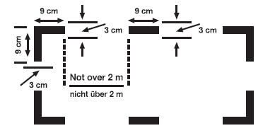

# Dritte Durchführungsverordnung zur Betriebsordnung für Luftfahrtgerät (Ausrüstung und Betrieb des Luftfahrtgerätes außerhalb von Luftfahrtunternehmen) (LuftBODV 3 2009)

Ausfertigungsdatum
:   2009-03-19

Fundstelle
:   BAnz: 2009, Nr 48, 1139

Geändert durch
:   Art. 1 V v. 8.4.2010 BAnz. Nr. 58, 1351

## Eingangsformel

Auf Grund des § 32 Absatz 1 Satz 1 Nummer 1, Absatz 3 Satz 2 und 3 und
Absatz 4 Nummer 1 des Luftverkehrsgesetzes in der Fassung der
Bekanntmachung vom 10. Mai 2007 (BGBl. I S. 698) in Verbindung mit §
56 der Betriebsordnung für Luftfahrtgerät vom 4. März 1970 (BGBl. I S.
262), der zuletzt durch Artikel 1 Nummer 12 der Verordnung vom 29.
Juli 1998 (BGBl. I S. 1989) geändert worden ist, verordnet das
Luftfahrt-Bundesamt:

## Abschnitt 1 - Allgemeine Vorschriften

### § 1 Geltungsbereich

Diese Verordnung gilt für die Ausrüstung und den Betrieb des nach den
Vorschriften der Luftverkehrs-Zulassungs-Ordnung zum Verkehr
zugelassenen Luftfahrtgerätes. Diese Verordnung gilt nicht für
Luftfahrtgeräte zur gewerbsmäßigen Beförderung von Personen und
Sachen.

## Abschnitt 2 - Ausrüstung von Luftfahrzeugen

### Unterabschnitt 1 - Alle Luftfahrzeuge

Ausrüstung für Flüge nach Instrumentenflugregeln

#### § 2 (zu § 20 Absatz 1 LuftBO)

(1) Motorgetriebene Luftfahrzeuge, die nach Instrumentenflugregeln
geflogen werden, sind wie folgt auszurüsten:

1.  einem Doppelsteuer, wenn das Luftfahrzeug nach den Vorschriften der
    Betriebsordnung für Luftfahrtgerät von zwei Luftfahrzeugführern zu
    führen und zu bedienen ist, und

2.  Flugüberwachungsgeräten, die für die sichere Führung und Bedienung des
    Luftfahrzeuges erforderlich sind, mindestens jedoch mit:

    a)  einer Fahrtmesseranlage, die gegen Vereisung und Kondensation
        geschützt ist,

    b)  zwei barometrischen Höhenmesseranlagen, darunter einem
        Feinhöhenmesser,

    c)  einem Variometer,

    d)  einem Kurskreisel,

    e)  einem Magnetkompass,

    f)  einem Kreiselhorizont,

    g)  einer Scheinlotanzeige,

    h)  einem Außenluftthermometer,

    i)  einem Wendezeiger oder einem zusätzlichen Kreiselhorizont, die
        unabhängig von der Energiequelle des unter Buchstabe f geforderten
        Kreiselhorizontes versorgt werden,

    j)  einer Uhr mit großem Sekundenzeiger und Stoppeinrichtung,

    k)  einer Beleuchtungsanlage für alle Instrumente und Bedienungsgeräte,
        die für die sichere Führung des Luftfahrzeugs erforderlich sind,

    l)  einem Anzeigegerät für die ordnungsgemäße Funktion der
        Energieversorgung der Kreiselgeräte und

    m)  einer elektrischen Handlampe für jedes Besatzungsmitglied, die
        unabhängig vom Bordnetz ist.

(2) Hubschrauber sind abweichend von den Buchstaben f und g mit einem
künstlichen Horizont je vorgeschriebenem Piloten und einem
zusätzlichen künstlichen Horizont auszurüsten.

Ausrüstung für Flüge nach Instrumentenflugregeln über den Nordatlantik

#### § 3 (zu § 20 Absatz 1 LuftBO)

(1) Flugzeuge müssen für Flüge nach Instrumentenflugregeln über den
Nordatlantik zusätzlich zu der Ausrüstung nach § 2 mit zwei
Langstrecken-Navigationsanlagen in folgendem begrenzten Luftraum
ausgerüstet sein:
zwischen Flugfläche 275 und Flugfläche 400 in dem

1.  im Osten durch die östlichen Grenzen der Kontrollbezirke Santa Maria
    Oceanic, Shanwick Oceanic und Reykjavik,

2.  im Norden durch den geografischen Nordpol,

3.  im Westen – nördlich der geografischen Breite 38°30’N – durch die
    westlichen Grenzen der Kontrollbezirke Reykjavik, Gander Oceanic und
    New York Oceanic und – südlich der geografischen Breite 38°30’N –
    durch den Längengrad 60°W im Kontrollbezirk New York Oceanic und

4.  im Süden – östlich des Längengrades 60°W – durch den Breitengrad 27 °N
    und – westlich des Längengrades 60 °W – durch die geografische Breite
    38°30’N.

(2) Jede einzelne der zwei Langstrecken-Navigationsanlagen muss der
Besatzung fortlaufend die Position des Flugzeuges anzeigen können und
bestehen aus:

1.  einer Trägheitsnavigationsanlage oder

2.  einer Global Navigation Satellite System (GNSS)-Empfangsanlage.

(3) Dem Luftfahrt-Bundesamt ist ein Nachweis darüber zu erbringen,
dass diese Ausrüstung folgende Genauigkeit der Navigation ermöglicht:

1.  die Standardabweichung des seitlichen Kursfehlers darf 6,3 Seemeilen
    nicht überschreiten,

2.  der Anteil an der Gesamtflugzeit, den das Luftfahrzeug sich 30
    Seemeilen oder mehr außerhalb des zugewiesenen Kurses über Grund
    befindet, muss weniger als 5,3 x 10
    -4                    betragen (weniger als eine Stunde in etwa 2 000
    Flugstunden),

3.  der Anteil an der Gesamtflugzeit, den das Luftfahrzeug sich zwischen
    50 und 70 Seemeilen außerhalb des zugewiesenen Kurses über Grund
    befindet, muss weniger als 13 x 10
    -5                    betragen (weniger als eine Stunde in etwa 8 000
    Flugstunden).

(4) Abweichend von Absatz 1 ist die Ausrüstung des Flugzeuges mit nur
einer Langstrecken-Navigationsanlage nach Absatz 2 oder Absatz 6
zusätzlich zur Ausrüstung nach § 2 zulässig, wenn Flüge nach
Instrumentenflugregeln ausschließlich zwischen dem Nordteil
Großbritanniens oder Irland einerseits und Nordostkanada andererseits
über Island und Grönland in dem nach Absatz 1 festgelegten Luftraum
durchgeführt werden.

(5) Einer zusätzlichen Ausrüstung nach Absatz 2 bedarf es nicht bei
Flügen nach Instrumentenflugregeln von und nach Island auf den durch
die Navigationsfunkfeuer

1.  Flesland, Myggenaes und Ingolfshofdi oder

2.  Sumburgh, Akraberg und Myggenaes

festgelegten Flugstrecken.

(6) Das Luftfahrt-Bundesamt kann andere als die in Absatz 2
geforderten Navigationsanlagen als Ausrüstung genehmigen, wenn diese
Ausrüstung die Navigationsgenauigkeit nach Absatz 3 aufweist.

Ausrüstung für Flüge in Lufträumen mit verringerter Höhenstaffelung
(Reduced Vertical Separation Minimum, RVSM)

#### § 4 (zu § 20 Absatz 1 LuftBO)

(1) Flugzeuge müssen für Flüge nach Instrumentenflugregeln in
Lufträumen mit verringerter Höhenstaffelung (RVSM-Lufträume) mit

1.  zwei voneinander unabhängigen Höhenmesseranlagen,

2.  einem Sekundärradar-Antwortgerät (Transponder) mit automatischer
    Höhenübermittlung,

3.  einer Höhen-Warnanlage und

4.  einem Flugregler mit Höhenhaltung

ausgestattet und als Flugzeug-Gruppe (group aircraft) oder als
einzelnes Flugzeug (non-group aircraft) den geltenden
Lufttüchtigkeitsforderungen genügen und entsprechend zugelassen sein.

(2) Die Ausrüstung nach Absatz 1 muss dabei für die Zulassung als
Flugzeug-Gruppe folgende Anforderungen erfüllen:

1.  Der mittlere Fehler der Höhenmesseranlage (mean altrimetry system
    error; ASE) darf unter den in der technischen Dokumentation der
    Musterzulassungsbehörde vorgesehenen normalen Betriebsbedingungen 80
    Fuß und unter allen übrigen Betriebsbedingungen 120 Fuß nicht
    überschreiten.

2.  Der mittlere Fehler der Höhenmesseranlage zuzüglich der dreifachen
    Standardabweichung darf unter den in der technischen Dokumentation der
    Musterzulassungsbehörde vorgesehenen normalen Betriebsbedingungen 200
    Fuß und unter allen übrigen Betriebsbedingungen 245 Fuß nicht
    überschreiten.

(3) Für die Zulassung eines einzelnen Flugzeuges darf der mittlere
Fehler der Höhenmesseranlage der Ausrüstung nach Absatz 1 unter den in
der technischen Dokumentation der Musterzulassungsbehörde vorgesehenen
normalen Betriebsbedingungen 160 Fuß und unter allen übrigen
Betriebsbedingungen 200 Fuß nicht überschreiten.

(4) Für die Zulassung der Flugzeuge nach den Absätzen 2 und 3 muss der
Flugregler mit Höhenhaltung sicherstellen, dass die Abweichung von der
gewählten Flughöhe nach oben und nach unten nicht mehr als 65 Fuß
beträgt.

Ausrüstung für Flüge nach Sichtflugregeln

#### § 5 (zu § 20 Absatz 1 LuftBO)

(1) Für Flüge nach Sichtflugregeln am Tage sind motorgetriebene
Luftfahrzeuge wie folgt auszurüsten:

1.  einem Magnetkompass,

2.  einem barometrischen Feinhöhenmesser,

3.  einer Fahrtmesseranlage und

4.  einer Uhr mit Sekundenanzeige.

(2) Für Flüge nach Sichtflugregeln bei Nacht sind motorgetriebene
Luftfahrzeuge zusätzlich zu der Ausrüstung nach Absatz 1 wie folgt
auszurüsten:

1.  einer Fluglageanzeige (künstlicher Horizont) für jeden
    vorgeschriebenen Piloten,

2.  einer Scheinlotanzeige,

3.  einem Kurskreisel,

4.  einem Variometer,

5.  einem Landescheinwerfer,

6.  Beleuchtungsanlagen für die Fluggasträume,

7.  einer elektrischen Handlampe für jedes Besatzungsmitglied, die
    unabhängig vom Bordnetz ist und

8.  einer Beleuchtung aller für den sicheren Betrieb notwendigen
    Fluginstrumente,

9.  für Flugzeuge mit einem Außenluftthermometer und

10. für Flugzeuge mit einem Anzeigegerät für die ordnungsgemäße Funktion
    der Energieversorgung der Kreiselgeräte.

Ausrüstung für kontrollierte Flüge nach Sichtflugregeln

#### § 6 (zu § 20 Absatz 1 LuftBO)

Für kontrollierte Flüge nach Sichtflugregeln in dafür von der
zuständigen Flugsicherungsorganisation festgelegten Lufträumen sind
motorgetriebene Luftfahrzeuge zusätzlich zu der Ausrüstung nach § 5
Absatz 1 wie folgt auszurüsten:

1.  einem Kurskreisel,

2.  einem Variometer,

3.  einem Wendezeiger oder einem Kreiselhorizont und

4.  einer Scheinlotanzeige.

Ausrüstung von Segelflugzeugen für Wolkenflüge

#### § 7 (zu § 20 Absatz 1 LuftBO)

Für Wolkenflüge sind Segelflugzeuge wie folgt auszurüsten:

1.  einem Fahrtmesser,

2.  einem Höhenmesser,

3.  einem Wendezeiger mit Scheinlot,

4.  einem Magnetkompass und

5.  einem Variometer.

Sonstige Ausrüstung

#### § 8 (zu §§ 19 bis 22 LuftBO)

Flugzeuge und Hubschrauber sind im Übrigen immer wie folgt
auszurüsten:

1.  einem leicht zugänglichen Verbandskasten, der mindestens DIN 13164,
    Ausgabe Januar 1998, erfüllt,

2.  einem Handfeuerlöscher im Cockpit und in jedem Fluggastraum, wenn
    dieser durch die Besatzung nicht leicht zu erreichen ist,

3.  aktuellen und entsprechend der Betriebsart geeigneten Karten für die
    geplante Flugstrecke und mögliche Ausweichstrecken,

4.  Unterlagen über Maßnahmen und Signale, die gemäß §21 Absatz 4 LuftVO
    bei der Ansteuerung durch militärische oder polizeiliche Luftfahrzeuge
    anzuwenden sind,

5.  einer ausreichenden Anzahl von Ersatzsicherungen, sofern
    Schmelzsicherungen im Cockpit Verwendung finden.

Durchbruchstellen

#### § 9 (zu § 19 Absatz 1 Nummer 2 LuftBO)

(1) Wenn an einem Luftfahrzeug von außen aufbrechbare
Rettungsöffnungen (Durchbruchstellen) gemäß den Angaben des
Luftfahrzeugherstellers zur Rettung der Insassen in einem Notfall für
die Rettungskräfte von außen angebracht werden, sind diese Bereiche
wie unten dargestellt zu markieren. Die Markierungen müssen rot oder
gelb sein und gegebenenfalls eine weiße Konturlinie haben, um sich vom
Hintergrund abzuheben.

(2) Wenn die Markierungen der Ecken eines Durchbruchbereiches weiter
als zwei Meter voneinander entfernt sind, müssen Zwischenmarkierungen
mit den Abmessungen neun Zentimeter x drei Zentimeter eingefugt
werden, so dass nicht mehr als zwei Meter zwischen zwei benachbarten
Markierungen liegen.

Navigations- und Sprechfunkausrüstung

#### § 10 (zu § 20 LuftBO)

Luftfahrzeuge müssen mit einer Navigations- und Sprechfunkausrüstung
ausgestattet sein, die es ermöglicht, den Flug in Übereinstimmung mit
den von der zuständigen Flugsicherungsorganisation festgelegten Regeln
und Bedingungen und nach den Anweisungen des
Flugverkehrskontrolldienstes durchzuführen.

Sauerstoffversorgung

#### § 11 (zu § 21 Absatz 2 LuftBO)

(1) Der erforderliche mitzuführende Sauerstoffvorrat richtet sich nach
der Flughöhe, der Flugdauer in bestimmten Flughöhen und nach der
Anzahl der Personen an Bord.

(2) Flüge in Kabinendruckhöhen von mehr als 3 600 Meter (12 000 Fuß)
dürfen nur durchgeführt werden, wenn die an Bord mitgeführte Menge an
Sauerstoff zur Versorgung wie folgt ausreicht:

1.  Versorgung aller Besatzungsmitglieder sowie zehn Prozent der
    Fluggäste, wenn die Flugzeit 30 Minuten in einer Kabinendruckhöhe von
    3 600 Meter (12 000 Fuß) überschreitet und

2.  Versorgung aller Besatzungsmitglieder sowie der Fluggäste für die
    gesamte Zeit in einer Kabinendruckhöhe von mehr als 4 000 Meter (13
    000 Fuß).

(3) Der verantwortliche Luftfahrzeugführer hat sicherzustellen, dass
der erforderliche Sauerstoffvorrat an Bord zur Verfügung steht.

(4) Alle Flugbesatzungsmitglieder, die mit der Ausführung von
Tätigkeiten für eine sichere Flugdurchführung betraut sind, müssen
jederzeit fortlaufend mit Sauerstoff versorgt werden können.

(5) Die Kabinendruckhöhe ist bei Luftfahrzeugen ohne Druckkabine die
Flughöhe über Normal Null.

Ausrüstung für Flüge über Land - Notausrüstung

#### § 12 (zu § 21 Absatz 1 LuftBO)

Weist ein Staat, in dessen Luftraum der Flug durchgeführt werden soll,
in seinem Luftfahrthandbuch (AIP – Aeronautical Information
Publication) Landgebiete aus, in denen die Durchführung des Such- und
Rettungsdienstes besonders schwierig oder nicht möglich ist, sind
Luftfahrzeuge mit Signal- und Hilfsmitteln sowie mit Notvorräten
auszurüsten. Die Hilfsmittel und Notvorräte müssen geeignet sein, die
Personen unter den zu erwartenden Verhältnissen am Leben zu erhalten.
Art und Umfang müssen den von den Behörden des überflogenen Staates
erlassenen Vorschriften entsprechen.

### Unterabschnitt 2 - Flugzeuge

Ausrüstung für Flüge über Wasser - Wasserflugzeuge

#### § 13 (zu § 21 Absatz 1 LuftBO)

(1) Für Flüge über Wasser sind Wasserflugzeuge mit einer Ausrüstung,
die zum Festmachen, Ankern und Manövrieren des Luftfahrzeuges auf dem
Wasser erforderlich ist, auszustatten.

(2) Wenn der Staat, in dessen Luftraum der Flug durchgeführt werden
soll, es fordert, sind die Luftfahrzeuge mit der nach den
internationalen Regeln zur Verhütung von Zusammenstößen auf See
vorgeschriebenen Ausrüstung zur Erzeugung von akustischen Signalen
auszustatten.

(3) Für jede Person ist eine Schwimmweste mit einem Licht zur Ortung
mitzuführen. Jede Schwimmweste ist so unterzubringen, dass sie vom
Sitz oder von der Liege der Person, für die sie vorgesehen ist, leicht
zugänglich ist.

(4) Wasserflugzeuge im Sinne dieser Vorschrift sind auch
Amphibienflugzeuge, sofern sie als Wasserflugzeug betrieben werden.

Ausrüstung für Flüge über Wasser - Landflugzeuge

#### § 14 (zu § 21 Absatz 1 LuftBO)

(1) Wenn bei Flügen mit einmotorigen Landflugzeugen über Wasser die
Entfernung von der nächsten Küste größer ist, als die jeweilige
Gleitdistanz, ist für jede Person eine Schwimmweste mit einem Licht
zur Ortung mitzuführen. Jede Schwimmweste ist so unterzubringen, dass
sie vom Sitz oder von der Liege der Person, für die sie vorgesehen
ist, leicht zugänglich ist.

(2) Landflugzeuge im Sinne dieser Vorschrift sind auch
Amphibienflugzeuge, sofern sie als Landflugzeuge betrieben werden.

Ausrüstung für Flüge über Wasser - Alle Flugzeuge

#### § 15 (zu § 21 Absatz 1 LuftBO)

(1) Für Flüge über Wasser, bei denen geeignete Flächen an Land zur
Notlandung mehr als 93 Kilometer (50 Nautische Meilen) vom
Luftfahrzeug entfernt sind, ist für jede Person eine Schwimmweste mit
einem Licht zur Ortung mitzuführen. Jede Schwimmweste ist so
unterzubringen, dass sie vom Sitz oder von der Liege der Person, für
die sie vorgesehen ist, leicht zugänglich ist.

(2) Einmotorige Luftfahrzeuge dürfen nur dann auf Flügen über Wasser
betrieben werden, wenn geeignete Flächen an Land zur Notlandung nicht
mehr als 185 Kilometer (100 Nautische Meilen) vom Luftfahrzeug
entfernt sind.

(3) Mehrmotorige Luftfahrzeuge, die mit einem ausgefallenen Triebwerk
ihren Flug fortsetzen können, dürfen nur dann auf Flügen über Wasser
betrieben werden, wenn geeignete Flächen an Land zur Notlandung nicht
mehr als 370 Kilometer (200 Nautische Meilen) vom Luftfahrzeug
entfernt sind.

(4) Werden die Entfernungen nach den Absätzen 2 oder 3 überschritten,
ist eine ausreichende Anzahl von Rettungsflößen zur Aufnahme aller
Luftfahrzeuginsassen mitzuführen. Die Rettungsflöße sind mit
Überlebensausrüstung unter Berücksichtigung der zu befliegenden
Strecke zu versehen und so unterzubringen, dass sie im Notfall leicht
zugänglich sind.

Notsender

#### § 16 (zu § 22 LuftBO)

(1) Für Flüge ins Ausland müssen ab dem 1. Oktober 2009 alle Flugzeuge
mit mindestens einem Notsender ausgerüstet sein, der auf 121,5
Megahertz und 406 Megahertz senden kann.

(2) Ab dem 1. Januar 2010 müssen alle Flugzeuge mit mindestens einem
Notsender (ELT) nach Absatz 1 ausgerüstet sein.

(3) Flugzeuge, die nach dem 1. Oktober 2009 erstmals zum Verkehr
zugelassen werden, müssen mit einem automatischen Notsender
ausgerüstet sein, der auf 121,5 Megahertz und 406 Megahertz senden
kann.

Tonaufzeichnungsanlage für das Cockpit

#### § 17 (zu § 22 LuftBO)

(1) Flugzeuge mit einer höchstzulässigen Startmasse von mehr als 27
000 Kilogramm, die seit dem 1. Januar 1987 erstmals zum Verkehr
zugelassen worden sind, sind mit einer Tonaufzeichnungsanlage für das
Cockpit auszurüsten.

(2) Die Tonaufzeichnungsanlage dient der Speicherung des Funkverkehrs,
der Gespräche und der Geräusche innerhalb des Cockpits.

(3) Die Tonaufzeichnungsanlage für das Cockpit muss mindestens die
Daten speichern können, die während der letzten 30 Betriebsminuten der
Anlage aufgezeichnet wurden.

(4) Die Aufzeichnungszeit für Tonaufzeichnungsanlagen in Flugzeugen
mit einer höchstzulässigen Startmasse von mehr als 5 700 Kilogramm,
die nach dem 1. Oktober 2009 erstmals zum Verkehr zugelassen werden,
muss mindestens zwei Stunden betragen.

Flugdatenschreiberanlage

#### § 18 (zu § 22 LuftBO)

(1) Flugzeuge mit einer höchstzulässigen Startmasse von mehr als 27
000 Kilogramm, die am oder nach dem 1. Januar 1989 erstmals zum
Verkehr zugelassen worden sind, sind mit einem Flugdatenschreiber des
Typs I auszurüsten.

(2) Flugzeuge mit einer höchstzulässigen Startmasse von mehr als 5 700
Kilogramm, die nach dem 1. Januar 2005 erstmals zum Verkehr zugelassen
worden sind, sind mit einem Flugdatenschreiber des Typs IA
auszurüsten.

(3) Der Flugdatenschreiber muss mindestens die Daten speichern können,
die während der letzten 25 Betriebsstunden der Anlage aufgezeichnet
wurden.

(4) Der Flugdatenschreiber darf während des Fluges nicht abgeschaltet
werden.

(5) Im Falle der Nutzung digitaler Datenverbindungen mit einer
bodengestützten Gegenstelle müssen Flugzeuge, für die eine
Tonaufzeichnungsanlage für das Cockpit nach § 17 vorgeschrieben ist
und die nach dem 1. Oktober 2009 erstmals zum Verkehr zugelassen
werden, mit einem Flugdatenschreiber ausgerüstet sein, der die per
Datenverbindung ausgetauschten Daten aufzeichnet.

(6) Im Falle der Nutzung digitaler Datenverbindungen mit einer
bodengestützten Gegenstelle müssen ab dem 1. Januar 2013 alle
Flugzeuge, für die eine Tonaufzeichnungsanlage für das Cockpit nach §
17 vorgeschrieben ist, mit einem Flugdatenschreiber ausgerüstet sein,
der die per Datenverbindung ausgetauschten Daten aufzeichnet.

Bodenannäherungswarnanlage

#### § 19 (zu § 22 LuftBO)

Ab dem 1. Oktober 2009 sind turbinengetriebene Flugzeuge mit einer
höchstzulässigen Startmasse von mehr als 5 700 Kilogramm oder einer
höchsten genehmigten Fluggastsitzzahl von mehr als neun mit einer
Bodenannäherungswarnanlage der Klasse B (TAWS Class B) auszurüsten,
sofern sie nicht bereits mit einer Bodenannäherungswarnanlage (GPWS)
ausgerüstet sind.

Machzahlanzeige

#### § 20 (zu § 22 LuftBO)

Flugzeuge, deren Kompressibilitätsgrenzwerte auf den vorgeschriebenen
Fahrtmessern nicht angezeigt werden, müssen mit einer Machzahlanzeige
ausgerüstet sein.

Bordseitige Kollisionsschutzanlage

#### § 21 (zu § 22 LuftBO)

Turbinengetriebene Flugzeuge mit einer höchstzulässigen Startmasse von
mehr als 5 700 Kilogramm oder mit einer Fluggastsitzzahl von mehr als
neunzehn sind mit einer bordseitigen Kollisionsschutzanlage, die
hinsichtlich der Leistungsanforderungen mindestens denen der Klasse II
(ACAS II) entspricht, auszurüsten.

### Unterabschnitt 3 - Hubschrauber

Ausrüstung für Flüge über Wasser - Notschwimmeranlage

#### § 22 (zu § 21 Absatz 1 LuftBO)

Folgende Hubschrauber, die für Flüge über Wasser eingesetzt werden,
müssen mit einer dauerhaft entfalteten oder schnell entfaltbaren
Notschwimmeranlage ausgerüstet sein:

1.  mehrmotorige Hubschrauber bei Flügen über Wasser in einer Entfernung
    zum Land, die einer Flugstrecke von mehr als zehn Minuten bei normaler
    Reisefluggeschwindigkeit entspricht, oder

2.  einmotorige Hubschrauber bei Flügen über Wasser außerhalb einer
    Entfernung zum Land, die im Autorotationsflug zurückgelegt werden kann
    oder eine sichere Notlandung erlaubt.

Ausrüstung für Flüge über Wasser - Notausrüstung

#### § 23 (zu § 21 Absatz 1 LuftBO)

(1) Hubschrauber dürfen für Flüge über Wasser nur betrieben werden,
wenn für jede Person an Bord eine Schwimmweste mit einem Licht zur
Ortung vorhanden ist. Diese muss so untergebracht sein, dass sie von
dem Sitz oder der Liege der Person, für die sie vorgesehen ist, leicht
zugänglich ist.

(2) Hubschrauber, die Flüge über Wasser nach § 22 durchführen, sind
zusätzlich mit folgender Notausrüstung auszustatten:

1.  Rettungsinseln oder Schlauchboote in ausreichender Anzahl für die
    Aufnahme aller Personen, die mit einer Überlebensausrüstung,
    einschließlich lebenserhaltender Mittel, in Abhängigkeit von der
    Flugstrecke ausgestattet und so verstaut sind, dass ein schneller
    Einsatz im Notfall möglich ist.

2.  pyrotechnische Notsignalmittel.

Ausrüstung für Flüge über Wasser - Notsender

#### § 24 (zu § 21 Absatz 1 LuftBO)

Ab dem 1. Oktober 2009 müssen alle Hubschrauber für Flüge über Wasser
nach § 22 mit mindestens einem automatischen Notsender und einem
Notsender in der Rettungsinsel oder der Schwimmweste ausgerüstet sein.
Der Notsender muss auf den Frequenzen 121,5 Megahertz und 406
Megahertz senden können.

Ausrüstung für Flüge über Land - Notsender

#### § 25 (zu § 21 Absatz 1 LuftBO)

(1) Für Flüge ins Ausland müssen ab dem 1. Oktober 2009 alle
Hubschrauber mit mindestens einem automatischen Notsender ausgerüstet
sein, der auf 121,5 Megahertz und 406 Megahertz senden kann.

(2) Ab dem 1. Januar 2010 müssen alle Hubschrauber mit mindestens
einem automatischen Notsender ausgerüstet sein, der auf 121,5
Megahertz und 406 Megahertz senden kann.

Tonaufzeichnungsanlage für das Cockpit

#### § 26 (zu § 22 LuftBO)

(1) Hubschrauber mit einer höchstzulässigen Startmasse von mehr als 7
000 Kilogramm, die am oder nach dem 1. Januar 1987 erstmals zum
Verkehr zugelassen wurden, sind mit einer Tonaufzeichnungsanlage für
das Cockpit auszurüsten.

(2) Für Hubschrauber ohne Flugdatenschreiber muss zudem mindestens die
Hauptrotordrehzahl aufgezeichnet werden.

(3) Die Tonaufzeichnungsanlage für das Cockpit muss mindestens die
Daten speichern können, die während der letzten 30 Betriebsminuten der
Anlage aufgezeichnet wurden.

(4) Die Aufzeichnungszeit für Tonaufzeichnungsanlagen in
Hubschraubern, die nach dem 1. Oktober 2009 erstmals zum Verkehr
zugelassen worden sind, muss mindestens zwei Stunden betragen.

Flugdatenschreiberanlage

#### § 27 (zu § 22 LuftBO)

(1) Hubschrauber mit einer höchstzulässigen Startmasse von mehr als 7
000 Kilogramm, die nach dem 1. Januar 1989 erstmals zum Verkehr
zugelassen worden sind, müssen mit einem Flugdatenschreiber vom Typ IV
ausgerüstet sein.

(2) Hubschrauber mit einer höchstzulässigen Startmasse von mehr als 3
180 Kilogramm, die nach dem 1. Januar 2005 erstmals zum Verkehr
zugelassen worden sind, müssen mit einem Flugdatenschreiber vom Typ IV
A ausgerüstet sein.

(3) Der Flugdatenschreiber muss mindestens die Daten speichern können,
die während der letzten zehn Betriebsstunden der Anlage aufgezeichnet
wurden.

(4) Der Flugdatenschreiber darf während des Fluges nicht abgeschaltet
werden.

(5) Im Falle der Nutzung digitaler Datenverbindungen mit einer
bodengestützten Gegenstelle müssen Hubschrauber, für die eine
Tonaufzeichnungsanlage für das Cockpit nach § 26 vorgeschrieben ist
und die nach dem 1. Oktober 2009 erstmals zum Verkehr zugelassen
werden, mit einem Flugdatenschreiber ausgerüstet sein, der die per
Datenverbindung ausgetauschten Daten aufzeichnet.

(6) Im Falle der Nutzung digitaler Datenverbindungen mit einer
bodengestützten Gegenstelle müssen ab dem 1. Januar 2013 alle
Hubschrauber, für die eine Tonaufzeichnungsanlage für das Cockpit nach
§ 26 vorgeschrieben ist, mit einem Flugdatenschreiber ausgerüstet
sein, der die per Datenverbindung ausgetauschten Daten aufzeichnet.

### Unterabschnitt 4 - Verfahrensvorschriften

#### § 28 Ausnahmegenehmigungen

(1) Das Luftfahrt-Bundesamt kann auf Antrag in begründeten Fällen
befristet Ausnahmegenehmigungen von den Bestimmungen des § 8 Nummer 1
und Nummer 2, der §§ 16 bis 20 sowie der §§ 24 bis 27 für einen
Zeitraum von längstens 12 Monaten erteilen.

(2) Die Ausnahmegenehmigung kann mit Auflagen verbunden werden.

(3) Das Luftfahrt-Bundesamt kann im Einzelfall von den Bestimmungen
des § 8 Nummer 1 und Nummer 2, der §§ 16 bis 20 sowie der §§ 24 bis 27
eine Ausnahmegenehmigung über den in Absatz 1 genannten Zeitraum
hinaus gewähren für

a)  Luftfahrzeuge, deren Konstruktion sich für eine nachträgliche
    Ausrüstung mit den vorgeschriebenen Ausrüstungsgegenständen nicht
    eignet oder

b)  Luftfahrzeuge, die in besonderen Betriebsarten (Kunstflug,
    Platzrundenbetrieb) betrieben werden,

wenn sichergestellt ist, dass der Flug auch ohne die vorgeschriebenen
Ausrüstungsgegenstände sicher durchgeführt werden kann.

## Abschnitt 3 - Flugbetrieb

Herbeiführen simulierter Gefahrenzustände

### § 29 (zu § 3 Absatz 1 LuftBO)

Simulierte Gefahrenzustände und somit jedes absichtliche Abweichen vom
Normalbetrieb eines Luftfahrzeuges dürfen nur dann herbeigeführt
werden, wenn sich außer den Besatzungsmitgliedern weder Fluggaste noch
gefährliche Guter an Bord befinden.

Schleppstarts

### § 30 (zu § 2 LuftBO)

Luftfahrzeugführer dürfen Segelflugzeuge oder Motorsegler, die nicht
mit einer Bugkupplung ausgerüstet sind, nur dann durch andere
Luftfahrzeuge beim Start schleppen lassen, wenn sie mindestens fünf
Schleppstarts innerhalb der letzten sechs Monate durchgeführt haben.

Betriebsmindestbedingungen

### § 31 (zu § 34 LuftBO)

(1) Ein Flug zu einem Landeplatz darf nicht fortgesetzt werden, wenn
die zuletzt erhaltenen Wetterinformationen über den Landeplatz oder
zumindest über einen Ausweichlandeplatz zur voraussichtlichen
Ankunftszeit nicht den Mindestbetriebsbedingungen entsprechen.

(2) Die geltenden Mindestbetriebsbedingungen für die Landung dürfen
nicht unterschritten werden.

Ausweichflugplatz

### § 32 (zu § 29 LuftBO)

(1) Auf die Festlegung eines Ausweichflugplatzes für einen Flug nach
Instrumentenflugregeln kann verzichtet werden, wenn nach den neuesten
verfügbaren Wetterinformationen für den Zeitraum von zwei Stunden vor
bis zwei Stunden nach der voraussichtlichen Ankunftszeit an dem
Landeplatz oder von der aktuellen Startzeit bis zwei Stunden nach der
voraussichtlichen Ankunftszeit am Landeplatz mindestens folgende
Wetterbedingungen herrschen:

1.  Wolkenuntergrenze:

    a)  für Flugzeuge: 300 Meter (1 000 Fuß),

    b)  für Hubschrauber: 120 Meter (400 Fuß)
        über dem jeweiligen Minimum des anzuwendenden
        Instrumentenanflugverfahrens,

2.  Sicht:

    a)  für Flugzeuge: 4 Kilometer,

    b)  für Hubschrauber: 1,5 Kilometer
        über dem jeweiligen Minimum des anzuwendenden
        Instrumentenanflugverfahrens.

(2) Für Flugzeuge kann abweichend von den Bedingungen des Absatzes 1
Nummer 2 Buchstabe a ein pauschaler Wert von 5,5 Kilometern verwendet
werden.

Betriebsstoffvorräte - Flugzeuge

### § 33 (zu § 29 LuftBO)

(1) Für einen Flug nach Instrumentenflugregeln ohne Planung eines
Ausweichflugplatzes müssen die an Bord mitgeführten
Betriebsstoffmengen den Flug zum geplanten Landeplatz und eine weitere
Flugzeit von 45 Minuten ermöglichen.

(2) Für einen Flug nach Instrumentenflugregeln mit Planung eines
Ausweichflugplatzes müssen die an Bord mitgeführten
Betriebsstoffmengen den Flug zum geplanten Landeplatz und anschließend
den Flug zum Ausweichflugplatz sowie eine weitere Flugzeit von 45
Minuten ermöglichen.

(3) Bei der Berechnung der mitzuführenden Betriebsstoffmengen sind
folgende Umstände zu berücksichtigen:

1.  Vorhersage der meteorologischen Bedingungen,

2.  zu erwartende Streckenvorgaben und Verzögerungen durch die
    Flugverkehrskontrollstelle,

3.  für Flüge nach Instrumentenflugregeln mindestens ein
    Instrumentenanflug einschließlich eines Fehlanflugverfahrens am
    Landeplatz,

4.  Druckverlust in der Kabine, wenn eine Druckkabine vorhanden ist, oder
    Ausfall eines Triebwerkes auf der Flugstrecke,

5.  weitere Umstände, die eine Verzögerung der Landung oder einen erhöhten
    Kraftstoffverbrauch zur Folge haben.

Betriebsstoffvorräte - Hubschrauber

### § 34 (zu § 29 LuftBO)

(1) Für einen Flug nach Sichtflugregeln müssen die an Bord
mitgeführten Betriebsstoffmengen den Flug zum geplanten
Hubschrauberflugplatz und eine weitere Flugzeit von 20 Minuten bei
einer Fluggeschwindigkeit für die beste Reichweite zuzüglich 10% der
geplanten Flugzeit ermöglichen.

(2) Für einen Flug nach Instrumentenflugregeln ohne Planung eines
Ausweichflugplatzes müssen die an Bord mitzuführenden
Betriebsstoffmengen Folgendes ermöglichen:

1.  den Flug zum geplanten Hubschrauberflugplatz,

2.  weitere 30 Minuten Flugzeit mit der Geschwindigkeit für ein
    Warteverfahren in einer Höhe von 450 Metern (1 500 Fuß) über dem
    Landeplatz und

3.  die Durchführung des Anflugverfahrens und der Landung.

(3) Für einen Flug nach Instrumentenflugregeln mit Planung eines
Ausweichflugplatzes müssen die an Bord mitzuführenden
Betriebsstoffmengen Folgendes ermöglichen:

1.  den Flug zum geplanten Hubschrauberflugplatz mit Anflugverfahren und
    Fehlanflugverfahren,

2.  den Flug zum Ausweichflugplatz gemäß Flugplan,

3.  weitere 30 Minuten Flugzeit mit der Geschwindigkeit für ein
    Warteverfahren in einer Höhe von 450 Metern (1 500 Fuß) über dem
    Ausweichflugplatz und

4.  die Durchführung des Anflugverfahrens und der Landung.

(4) Ist für einen Flug kein geeigneter Ausweichlandeplatz vorhanden,
müssen die Betriebsstoffmengen den Flug zum Landeplatz und zusätzlich
zwei Stunden bei der vom Flughandbuch und der zuständigen
Flugsicherungsorganisation für ein Warteverfahren vorgesehenen
Geschwindigkeit ermöglichen.

(5) Bei der Berechnung der mitzuführenden Betriebsstoffmengen sind
folgende Umstände zu berücksichtigen:

1.  Vorhersage der meteorologischen Bedingungen,

2.  zu erwartende Streckenvorgaben und Verzögerungen durch die
    Flugverkehrskontrollstelle,

3.  für Flüge nach Instrumentenflugregeln mindestens ein
    Instrumentenanflug einschließlich eines Fehlanflugverfahrens am
    Landeplatz und

4.  weitere Umstände, die eine Verzögerung der Landung oder einen erhöhten
    Kraftstoffverbrauch zur Folge haben.

## Abschnitt 4 - Schlussvorschriften

### § 35 Inkrafttreten, Außerkrafttreten

(1) Diese Verordnung tritt am Tag nach der Verkündung in Kraft.

(2)

