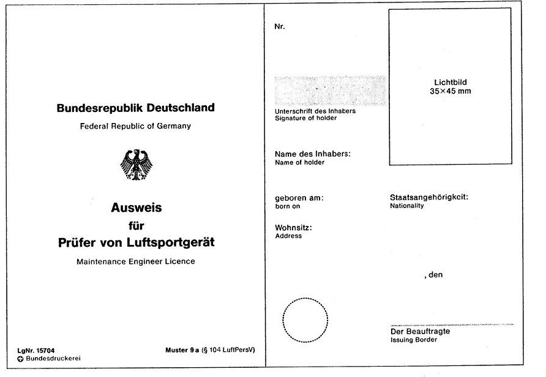
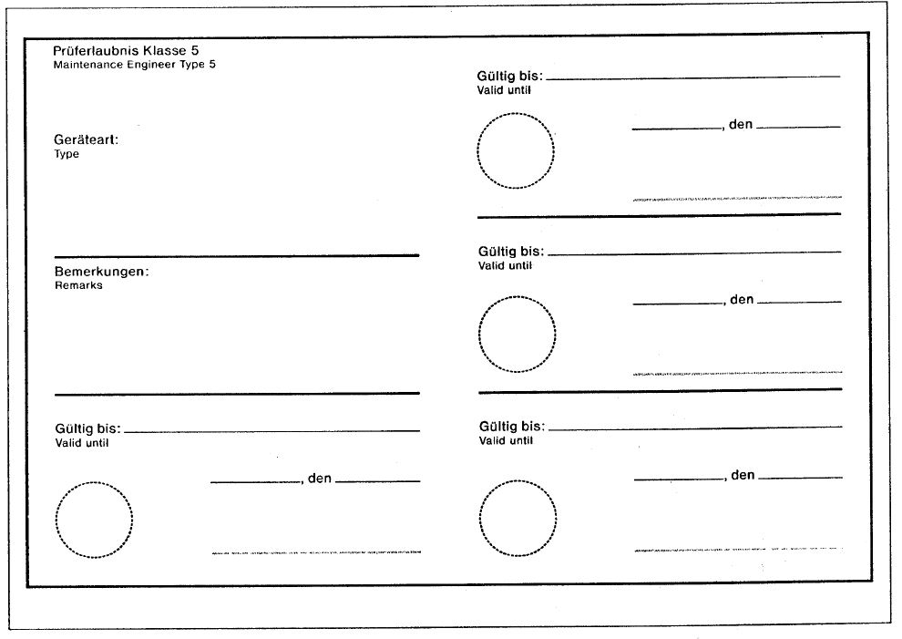

# Verordnung über Luftfahrtpersonal (LuftPersV)

Ausfertigungsdatum
:   1976-01-09

Fundstelle
:   BGBl I: 1976, 53 (1097)

Neugefasst durch
:   Bek. v. 13.2.1984 I 265;

Zuletzt geändert durch
:   Art. 2 V v. 12.12.2016 I 2864

Änderung durch
:   Art. 6 G v. 22.4.2020 I 840 (Nr. 20) textlich nachgewiesen, dokumentarisch noch nicht abschließend bearbeitet

Änderung durch
:   Art. 1 V v. 9.3.2021 I 338 (Nr. 10) textlich nachgewiesen, dokumentarisch noch nicht abschließend bearbeitet

Änderung durch
:   Art. 15 Abs. 31 G v. 4.5.2021 I 882 (Nr. 21) textlich nachgewiesen, dokumentarisch noch nicht abschließend bearbeitet

Änderung durch
:   Art. 133 G v. 10.8.2021 I 3436 (Nr. 53) textlich nachgewiesen, dokumentarisch noch nicht abschließend bearbeitet

Änderung durch
:   Art. 2 V v. 7.12.2021 I 5190 (Nr. 84) textlich nachgewiesen, dokumentarisch noch nicht abschließend bearbeitet

## Abschnitt 1 - Erlaubnispflicht, Ausbildung und Tauglichkeit

### Unterabschnitt 1 - Allgemeines

#### § 1 Erlaubnispflichtiges Personal

Das erlaubnispflichtige Personal im Sinne des § 4 Absatz 1 und 2 des
Luftverkehrsgesetzes umfasst:

1.  Luftfahrzeugführer auf Flugzeugen, Hubschraubern, Segelflugzeugen,
    Ballonen und Luftschiffen,

2.  Flugingenieure,

3.  Flugtechniker auf Hubschraubern der Polizeien des Bundes und der
    Länder,

4.  Luftsportgeräteführer,

5.  Flugdienstberater,

6.  Steuerer von Flugmodellen nach § 1 Absatz 1 Nummer 8 und § 6 Absatz 1
    Nummer 8 der Luftverkehrs-Zulassungs-Ordnung und Steuerer von
    sonstigem zulassungspflichtigem Luftfahrtgerät nach § 6 Absatz 1
    Nummer 9 der Luftverkehrs-Zulassungs-Ordnung,

7.  Prüfer von Luftfahrtgerät,

8.  freigabeberechtigtes Personal,

9.  Flugbegleiter.

#### § 2 Arten der Erlaubnis und Sonderregelungen der Erlaubnispflicht

(1) Erlaubnisse sind:

1.  die Lizenz für Luftfahrzeugführer nach § 1 Nummer 1,

2.  der Luftfahrerschein oder der Ausweis für Personal nach § 1 Nummer 2
    bis 6,

3.  die Flugbegleiterbescheinigung für Personal nach § 1 Nummer 9,

4.  der Ausweis für Prüfer von Luftfahrtgerät für Personal nach § 1 Nummer
    7 und

5.  die Lizenz für freigabeberechtigtes Personal nach § 1 Nummer 8.

(2) Technisches Personal der Instandhaltungsbetriebe und der
kombinierten Lufttüchtigkeitsorganisationen sowie unabhängiges
freigabeberechtigtes Personal bedarf für das Rollen eines
Luftfahrzeugs, das sich mit eigener Kraft fortbewegt, keiner
Erlaubnis, wenn es das Luftfahrzeug insoweit beherrscht und von dem
Luftfahrzeughalter oder von der Organisation, die die
Aufrechterhaltung der Lufttüchtigkeit führt und unter deren
Verantwortung das Luftfahrzeug gerollt wird, schriftlich oder
elektronisch mit dem Rollen beauftragt wird. Das Gleiche gilt für
Luftfahrzeugführer, deren Lizenz die Musterberechtigung für das
betreffende Muster nicht umfasst.

(3) Absatz 2 gilt nicht für Luftfahrzeuge mit vertikaler Start- und
Landefähigkeit (Kipprotorflugzeug) und Hubschrauber, sofern zum Rollen
Schwebeflugmanöver durchgeführt werden müssen. Das Luftfahrt-Bundesamt
kann für Instandhaltungsbetriebe, die diese Tätigkeiten ausführen,
Ausnahmen zulassen.

(4) An Betriebsstätten oder Standorten im Ausland beschäftigtes
Personal, das für die Freigabe nach Instandhaltung von Flugmotoren,
Bordhilfsmotoren, Luftschrauben und Flugsicherungsausrüstung zuständig
ist, bedarf keiner Erlaubnis nach § 1 Nummer 7, wenn das Luftfahrt-
Bundesamt festgestellt hat, dass dieses Personal über eine
Qualifikation verfügt, die den für den Erwerb der Erlaubnis für Prüfer
von Luftfahrtgerät Klasse 4 erforderlichen fachlichen Voraussetzungen
gemäß § 106 vergleichbar ist.

#### § 3 Anwendbare Vorschriften

(1) Die fachlichen Voraussetzungen und die Prüfungen zum Erwerb von
Erlaubnissen und Berechtigungen sowie die Bestimmungen über die
Gültigkeit, die Verlängerung und die Erneuerung von Erlaubnissen
richten sich

1.  für Personal nach § 1 Nummer 1 und 9 nach der Verordnung (EU) Nr.
    1178/2011 der Kommission vom 3. November 2011 zur Festlegung
    technischer Vorschriften und von Verwaltungsverfahren in Bezug auf das
    fliegende Personal in der Zivilluftfahrt gemäß der Verordnung (EG) Nr.
    216/2008 des Europäischen Parlaments und des Rates (ABl. L 311 vom
    25\.11.2011, S. 1) in der jeweils geltenden Fassung,

2.  für Personal nach § 1 Nummer 2 nach der vom Bundesministerium für
    Verkehr und digitale Infrastruktur im Bundesanzeiger bekannt gemachten
    Fassung der Bestimmungen über die Lizenzierung von Flugingenieuren
    (JAR-FCL 4 deutsch) vom 15. April 2003 (BAnz. Nr. 81b vom 30. April
    2003),

3.  für Personal nach § 1 Nummer 3 bis 7 nach dieser Verordnung,

4.  für Personal nach § 1 Nummer 8 nach der Verordnung (EU) Nr. 1321/2014
    der Kommission vom 26. November 2014 über die Aufrechterhaltung der
    Lufttüchtigkeit von Luftfahrzeugen und luftfahrttechnischen
    Erzeugnissen, Teilen und Ausrüstungen und die Erteilung von
    Genehmigungen für Organisationen und Personen, die diese Tätigkeiten
    ausführen (ABl. L 362 vom 17.12.2014, S. 1), die zuletzt durch die
    Durchführungsverordnung (EU) 2020/270 (ABl. L 56 vom 27.2.2020, S. 20)
    geändert worden ist, in der jeweils geltenden Fassung.

(2) Die Bestimmungen der Verordnung (EU) Nr. 1178/2011 werden auch
angewendet auf Luftfahrzeuge nach Anhang I Buchstabe a bis d, g und h
der Verordnung (EU) 2018/1139 des Europäischen Parlaments und des
Rates vom 4. Juli 2018 zur Festlegung gemeinsamer Vorschriften für die
Zivilluftfahrt und zur Errichtung einer Agentur der Europäischen Union
für Flugsicherheit sowie zur Änderung der Verordnungen (EG) Nr.
2111/2005, (EG) Nr. 1008/2008, (EU) Nr. 996/2010, (EU) Nr. 376/2014
und der Richtlinien 2014/30/EU und 2014/53/EU des Europäischen
Parlaments und des Rates, und zur Aufhebung der Verordnungen (EG) Nr.
552/2004 und (EG) Nr. 216/2008 des Europäischen Parlaments und des
Rates und der Verordnung (EWG) Nr. 3922/91 des Rates (ABl. L 212 vom
22\.8.2018, S. 1). Sind die Anforderungen der Verordnung (EU) Nr.
1178/2011 im Einzelfall nicht oder nur mit unverhältnismäßig hohem
Aufwand erfüllbar, so kann die zuständige Behörde von ihrer Anwendung
absehen, wenn ein mindestens vergleichbarer Sicherheitsstandard
erreicht wird. Die Lizenz wird bei Eintrag einer Musterberechtigung
für Luftfahrzeuge nach Satz 1 durch ein nationales Beiblatt ergänzt.
Auf den Luftfahrzeugen nach Satz 1 absolvierte Flugstunden werden auf
die fortlaufende Flugerfahrung angerechnet. Die Luftfahrzeuge nach
Satz 1 können zur Ausbildung und zur Durchführung von praktischen
Prüfungen, Befähigungsüberprüfungen und Kompetenzbeurteilungen genutzt
werden, vorausgesetzt der Ausbildungsbetrieb sowie die
Lehrberechtigten und Flugprüfer verfügen über die entsprechende
Zulassung oder Berechtigung.

#### § 4 Mindestalter bei Erteilung der Erlaubnis

Das Mindestalter zum Erlangen eines Luftfahrerscheins oder eines
Ausweises beträgt

1.  16 Jahre für Führer nichtmotorgetriebener Luftsportgeräte und Steuerer
    von Flugmodellen nach § 1 Absatz 1 Nummer 8 der Luftverkehrs-
    Zulassungs-Ordnung,

2.  17 Jahre für Führer motorgetriebener Luftsportgeräte,

3.  18 Jahre für Flugtechniker auf Hubschraubern der Polizeien des Bundes
    und der Länder sowie

4.  21 Jahre für

    a)  Steuerer von Flugmodellen nach § 6 Absatz 1 Nummer 8 der Luftverkehrs-
        Zulassungs-Ordnung und Steuerer von sonstigem zulassungspflichtigem
        Luftfahrtgerät nach § 6 Absatz 1 Nummer 9 der Luftverkehrs-Zulassungs-
        Ordnung,

    b)  Flugingenieure,

    c)  Prüfer von Luftfahrtgerät und

    d)  Flugdienstberater.

#### § 5 Zuständige Stellen für die Erteilung von Erlaubnissen

(1) Zuständige Stellen für die Erteilung der Erlaubnisse nach § 2
einschließlich der Berechtigungen, mit Ausnahme der
Instrumentenflugberechtigung, sind:

1.  die Luftfahrtbehörde des Landes, in dem der Bewerber seinen
    Hauptwohnsitz hat oder ausgebildet wurde, für die Erteilung von
    Lizenzen nach Anhang I Abschnitt B (Leichtluftfahrzeugpilotenlizenz –
    LAPL) und Abschnitt C (Privatpilotenlizenz – PPL,
    Segelflugzeugpilotenlizenz – SPL, Ballonpilotenlizenz – BPL) der
    Verordnung (EU) Nr. 1178/2011,

2.  die beauftragten Unternehmen und die dafür zugelassenen
    Ausbildungsorganisationen für die Erteilung der Erlaubnis für
    Flugbegleiter nach § 1 Nummer 9,

3.  die Beauftragten nach § 31c des Luftverkehrsgesetzes für die Erteilung
    des Luftfahrerscheins für Luftsportgeräteführer, des Ausweises für
    Steuerer von Flugmodellen mit einer höchstzulässigen Startmasse bis zu
    150 Kilogramm nach § 1 Nummer 6 und des Ausweises für Prüfer von
    Luftsportgerät (Prüfer von Luftfahrtgerät der Klasse 5),

4.  das Luftfahrt-Bundesamt für die Erteilung aller weiteren Erlaubnisse.

Satz 1 gilt auch für die Anerkennung von Prüfern nach § 128a.

(2) Für die Erteilung der Instrumentenflugberechtigung ist das
Luftfahrt-Bundesamt zuständig. Wird eine Lizenz, deren Erteilung nach
Absatz 1 Satz 1 Nummer 1 in die Zuständigkeit des Landes fällt, um die
Instrumentenflugberechtigung erweitert, geht die Zuständigkeit auf das
Luftfahrt-Bundesamt über. Erlischt eine Instrumentenflugberechtigung,
wird für die verbleibende Lizenz die betreffende Stelle nach Absatz 1
Satz 1 Nummer 1 zuständig.

(3) Abweichend von den Absätzen 1 und 2 ist das Luftfahrtamt der
Bundeswehr bei dienstlicher Notwendigkeit zuständig für die Erteilung
der folgenden Erlaubnisse an aktive Angehörige der Bundeswehr:

1.  Lizenzen nach Anhang I Abschnitt D (Lizenzen für Berufspiloten – CPL),
    Abschnitt E (Lizenzen für Piloten in mehrköpfigen Flugbesatzungen –
    MPL), Abschnitt F (Lizenzen für Verkehrspiloten – ATPL), Abschnitt G
    (Instrumentenflugberechtigung – IR), Abschnitt H (Klassen- und
    Musterberechtigungen), Abschnitt I (Weitere Berechtigungen), Abschnitt
    J (Lehrberechtigte) und Abschnitt K (Prüfer) der Verordnung (EU) Nr.
    1178/2011,

2.  Luftfahrerscheine nach § 2 Absatz 1 Nummer 2,

3.  Ausweise nach § 2 Absatz 1 Nummer 2 für Flugingenieure nach § 1 Nummer
    2,

4.  Instrumentenflugberechtigungen für Luftfahrzeugführer nach § 1 Nummer
    1 und Flugingenieure nach § 1 Nummer 2.

#### § 6 Durchführungsbestimmungen

Das Luftfahrt-Bundesamt wird ermächtigt, soweit dies zur
Gewährleistung der Sicherheit des Luftverkehrs notwendig ist, durch
Rechtsverordnungen Einzelheiten festzulegen

1.  zur Präzisierung einzelner Regelungen dieser Verordnung,

2.  zur nationalen Ausgestaltung von Verfahren nach der Verordnung (EU)
    Nr. 1178/2011, für die das Luftfahrt-Bundesamt nach § 65c Absatz 1
    Satz 1 des Luftverkehrsgesetzes als zuständige Behörde benannt wurde,
    und

3.  zur Durchführung der vom Bundesministerium für Verkehr und digitale
    Infrastruktur im Bundesanzeiger bekannt gemachten Fassung der
    Bestimmungen über die Lizenzierung von Flugingenieuren (JAR-FCL 4
    deutsch).

#### § 7 Antrag auf Erteilung einer Erlaubnis

(1) Der Antrag auf Erteilung einer Lizenz oder
Flugbegleiterbescheinigung, eines Ausweises oder Luftfahrerscheins
kann erst gestellt werden, wenn alle Voraussetzungen nach § 16 Absatz
1 und 2 nachgewiesen wurden.

(2) Dem Antrag auf Erteilung einer Erlaubnis nach § 2 Absatz 1 Nummer
1 bis 3 sind folgende Unterlagen beizufügen:

1.  die in § 16 Absatz 2 Satz 1 bezeichneten Unterlagen, soweit diese der
    nach § 5 zuständigen Stelle nicht bereits vorliegen,

2.  eine Erklärung über die Staatsangehörigkeit, die auf Verlangen
    nachzuweisen ist,

3.  ein vom Ausbildungsbetrieb oder von dem beauftragten Unternehmen
    ausgestellter Nachweis über die theoretische und praktische Ausbildung
    des Bewerbers sowie die Nachweise über die bestandene theoretische und
    praktische Prüfung und

4.  wenn am Flugfunk teilgenommen wird,

    a)  ein Nachweis über die Berechtigung zur Ausübung des Flugfunkdienstes
        nach der Verordnung über Flugfunkzeugnisse und

    b)  ein Nachweis über das Niveau der Sprachkenntnisse; davon ausgenommen
        sind Bewerber um Erlaubnisse zum Führen von Segelflugzeugen (LAPL(S)
        und SPL), Ballonen (LAPL(B) und BPL), Motorseglern und
        Luftsportgeräten.

(3) Dem Antrag auf Erteilung einer Erlaubnis nach § 2 Absatz 1 Nummer
4 oder 5 sind folgende Unterlagen beizufügen:

1.  die Nachweise über das Vorliegen der fachlichen Voraussetzungen nach §
    106 oder § 111a,

2.  eine Kopie des Personalausweises oder Reisepasses zur Feststellung der
    Identität und

3.  der Nachweis über die Zuverlässigkeit nach § 7 des
    Luftsicherheitsgesetzes oder ein Auszug aus dem Fahreignungsregister
    und ein Führungszeugnis nach § 30 Absatz 5 des
    Bundeszentralregistergesetzes, wenn aufgrund der Tätigkeit kein
    Nachweis über die Zuverlässigkeit ausgestellt wird.

#### § 8 Erteilung der Erlaubnis und mitzuführende Dokumente

(1) Die nach § 5 zuständige Stelle erteilt die Erlaubnis durch
Aushändigung einer Lizenz, eines Luftfahrerscheins, eines Ausweises
oder einer Flugbegleiterbescheinigung, wenn die Voraussetzungen des §
7 in Verbindung mit den nach § 3 Absatz 1 anzuwendenden Vorschriften
erfüllt sind.

(2) Zusammen mit der Erlaubnis sind folgende Dokumente bei Ausübung
der erlaubnispflichtigen Tätigkeit mitzuführen:

1.  Personalausweis oder Reisepass,

2.  Tauglichkeitszeugnis, falls ein solches zur Ausübung der
    erlaubnispflichtigen Tätigkeit erforderlich ist.

#### § 9 Gültigkeitsdauer von Erlaubnissen und Berechtigungen

(1) Eine nach dieser Verordnung oder nach der Verordnung (EU) Nr.
1178/2011 erteilte Erlaubnis ist, soweit nichts anderes bestimmt ist,
unbefristet gültig. Die Gültigkeitsdauer von Berechtigungen und
Erweiterungen der Erlaubnis richtet sich nach den Vorschriften, die
für die Erteilung der Berechtigung maßgeblich sind.

(2) Nach dieser Verordnung erteilte Ausweise für Prüfer von
Luftfahrtgerät und nach der Verordnung (EU) Nr. 1321/2014 erteilte
Lizenzen sind fünf Jahre gültig. Die Verlängerung der Gültigkeitsdauer
richtet sich nach den dafür maßgeblichen Vorschriften.

#### § 10 Voraussetzungen für die Erneuerung von Erlaubnissen und Berechtigungen

(1) Für die Erneuerung einer Erlaubnis, einschließlich der
Berechtigungen, müssen die Voraussetzungen des § 16 fortbestehen. In
den Fällen des § 7 Absatz 1 Nummer 4 des Luftsicherheitsgesetzes ist
eine gültige Bescheinigung über das Ergebnis der
Zuverlässigkeitsüberprüfung vorzulegen.

(2) Die Erneuerung von Ausweisen für Prüfer von Luftfahrtgerät richtet
sich nach § 110. Die Erneuerung von Lizenzen für freigabeberechtigtes
Personal richtet sich nach Anhang III der Verordnung (EU) Nr.
1321/2014. Absatz 1 Satz 2 gilt entsprechend.

(3) Personen, die am Flugfunk teilnehmen, haben die Neubewertung ihrer
Sprachkenntnisse nach Anhang I FCL.055 und Anlage 2 der Verordnung
(EU) Nr. 1178/2011 nachzuweisen. Die Neubewertung wird von einer nach
§ 125a anerkannten Stelle vorgenommen.

#### § 11 Ausübung der Rechte aus einer Erlaubnis

(1) Die Rechte aus einer Erlaubnis dürfen nur ausgeübt werden, wenn
die zur Erteilung der Erlaubnis geforderten Zeugnisse und Nachweise
jeweils gültig sind und die fortlaufende Flugerfahrung auf Verlangen
der zuständigen Stelle nach § 5 oder der Luftaufsicht durch
entsprechende Einträge im Flugbuch nachgewiesen werden kann. In den
Fällen des § 7 Absatz 1 Nummer 4 des Luftsicherheitsgesetzes muss eine
gültige Bescheinigung über das Ergebnis der
Zuverlässigkeitsüberprüfung vorliegen.

(2) Der Inhaber einer Erlaubnis nach § 1 Nummer 7 darf die Rechte aus
der Erlaubnis unter Beachtung der Anforderungen nach § 12 Absatz 1 der
Verordnung zur Prüfung von Luftfahrtgerät in Verbindung mit der
Verordnung (EU) Nr. 1321/2014, Anhang I (Teil-M), M.A.401 bis M.A.403
oder Anhang Vb (Teil-ML), ML.A.401 bis ML.A.403 nur dann ausüben, wenn

1.  ihm die für die Ausübung der Prüfertätigkeit an dem betreffenden
    Luftfahrtgerät erforderliche Musterberechtigung nach § 105 erteilt
    wurde,

2.  er im vorhergehenden Zweijahreszeitraum entweder sechs Monate
    Erfahrung in der Instandhaltung gemäß den erteilten Rechten nach § 104
    erworben hat oder er die Voraussetzungen für die Erteilung der
    entsprechenden Rechte nach § 106 erfüllt,

3.  er die Sprache, in der die für die Ausstellung von
    Freigabebescheinigungen erforderlichen technischen Dokumentationen und
    Dokumentationen der Instandhaltungsverfahren abgefasst sind, in
    ausreichendem Maß, also in Wort und Schrift aktiv und passiv,
    beherrscht.

(3) Der Inhaber einer Erlaubnis nach § 1 Nummer 8 darf die Rechte aus
der Erlaubnis nur dann ausüben, wenn die Anforderungen der Verordnung
(EU) Nr. 1321/2014, Anhang III (Teil-66), 66.A.20 b) erfüllt sind.

#### § 12 Anrechnung von im Militärdienst erworbenen Kenntnissen, Erfahrungen und Fähigkeiten

Die im Militärdienst erworbenen Kenntnisse, Erfahrungen und
Fähigkeiten werden in Bezug auf die einschlägigen Anforderungen des
Anhangs I der Verordnung (EU) Nr. 1178/2011 im Einklang mit den
Festlegungen des Anrechnungsberichts nach Artikel 10 der Verordnung
(EU) Nr. 1178/2011 in der jeweils geltenden Fassung angerechnet.

#### § 13 Anerkennung von Erlaubnissen für Flugingenieure

Erlaubnisse und Berechtigungen für eine Tätigkeit als Flugingenieur,
die in Übereinstimmung mit den Bestimmungen über die Lizenzierung von
Flugingenieuren (JAR-FCL 4 deutsch) in einem Mitgliedstaat der
Europäischen Union erteilt wurden, werden mit den damit verbundenen
Rechten und Auflagen in der Bundesrepublik Deutschland durch das
Luftfahrt-Bundesamt allgemein anerkannt.

#### § 14 Anerkennung von Flugsimulationsübungsgeräten

Nutzen Ausbildungsbetriebe zum Zweck der Ausbildung von
erlaubnispflichtigem Personal nach § 1 Nummer 2 bis 5
Flugsimulationsübungsgeräte, sind hinsichtlich der Anerkennung dieser
Geräte die Bestimmungen des Anhangs VI der Verordnung (EU) Nr.
1178/2011 entsprechend anzuwenden.

#### § 15 Widerruf, Beschränkung und Ruhen der Erlaubnis

(1) Erlaubnisse nach § 2 Absatz 1 Nummer 1 und 3 werden gemäß Anhang
VI ARA.FCL.250 der Verordnung (EU) Nr. 1178/2011 und Erlaubnisse nach
§ 2 Absatz 1 Nummer 5 werden gemäß Anhang III 66.B.500 der Verordnung
(EG) Nr. 1321/2014 von der nach § 5 zuständigen Stelle beschränkt,
ausgesetzt oder widerrufen. Für erlaubnispflichtiges Personal nach
§ 104 Absatz 2 Nummer 1 gelten die Bestimmungen des Anhangs III der
Verordnung (EU) Nr. 1321/2014 entsprechend. Für den Widerruf und das
Ruhen der Erlaubnis nach § 2 Absatz 1 Nummer 3 ist das Luftfahrt-
Bundesamt zuständig. Der Widerruf und das Ruhen der Erlaubnis nach § 2
Absatz 1 Nummer 4 obliegen der nach § 5 zuständigen Stelle.

(2) Der Luftfahrerschein oder der Ausweis nach § 2 Absatz 1 Nummer 2
ist von der nach § 5 zuständigen Stelle zu widerrufen und einzuziehen,
wenn die Voraussetzungen für seine Erteilung nachträglich nicht nur
vorübergehend entfallen sind oder wenn

1.  der zuständigen Stelle Tatsachen bekannt werden, die Zweifel an dem
    ausreichenden praktischen Können oder fachlichen Wissen des Inhabers
    der Erlaubnis rechtfertigen, und

2.  eine von der zuständigen Stelle angeordnete Überprüfung verweigert
    wird oder ergibt, dass der Inhaber des Luftfahrerscheins oder des
    Ausweises das ausreichende praktische Können oder fachliche Wissen
    nicht mehr besitzt.

(3) Anstelle des Widerrufs kann ein Luftfahrerschein oder ein Ausweis
beschränkt oder mit Nebenbestimmungen versehen werden, wenn dies
ausreicht, um die Sicherheit des Luftverkehrs aufrechtzuerhalten. Der
Luftfahrerschein oder der Ausweis kann auf eine bestimmte Tätigkeit in
der Luftfahrt beschränkt werden.

(4) Das vorübergehende Ruhen eines Luftfahrerscheins oder eines
Ausweises oder eine Nachschulung mit anschließender Überprüfung kann
angeordnet werden, wenn

1.  Zweifel an der Tauglichkeit oder Zuverlässigkeit des Inhabers
    bestehen,

2.  die Gültigkeit der Zuverlässigkeitsüberprüfung nach der
    Luftsicherheits-Zuverlässigkeitsüberprüfungsverordnung abgelaufen ist
    oder

3.  der zuständigen Stelle Tatsachen bekannt werden, die erkennen lassen,
    dass der Inhaber das ausreichende praktische Können oder fachliche
    Wissen nicht mehr besitzt.

Die zuständige Stelle nimmt den Luftfahrerschein oder den Ausweis für
die Zeit des Ruhens in Verwahrung, bis der Inhaber dieser Erlaubnis
seine Tauglichkeit, seine Zuverlässigkeit oder sein ausreichendes
praktisches Können oder fachliches Wissen im Rahmen einer von der
zuständigen Stelle angeordneten Überprüfung nachgewiesen hat.

#### § 16 Voraussetzungen für die Ausbildung

(1) Die Ausbildung von erlaubnispflichtigem Personal nach § 1 Nummer 1
bis 6 und 9 ist nur zulässig, wenn

1.  der Bewerber das Mindestalter nach § 17 besitzt,

2.  der Bewerber tauglich ist, sofern die Tauglichkeit der Tätigkeit nach
    gefordert ist,

3.  keine Tatsachen vorliegen, die den Bewerber als unzuverlässig
    erscheinen lassen, die beabsichtigte Tätigkeit auszuüben, und

4.  bei einem minderjährigen Bewerber der gesetzliche Vertreter zustimmt.

(2) Der Bewerber hat dem Ausbildungsbetrieb zu Beginn der Ausbildung
folgende Unterlagen vorzulegen:

1.  gültiges Identitätsdokument zur Feststellung der Identität und zur
    Erhebung der Daten nach § 65 Absatz 3 Nummer 1 und 2 und § 65a Absatz
    3 Nummer 1 des Luftverkehrsgesetzes,

2.  Tauglichkeitszeugnis nach der Verordnung (EU) Nr. 1178/2011; Bewerber
    um eine Lizenz für Luftfahrzeugführer nach § 1 Nummer 1 müssen dieses
    Tauglichkeitszeugnis spätestens zum ersten Alleinflug vorlegen,

3.  Erklärung über laufende Ermittlungs- oder Strafverfahren und darüber,
    dass eine Auskunft nach § 30 Absatz 8 des Straßenverkehrsgesetzes
    beantragt worden ist,

4.  bei Personen,

    a)  die sich erstmals um eine Erlaubnis für das Führen eines Luftfahrzeugs
        nach § 1 Absatz 2 Satz 1 Nummer 1 bis 3 und 5 des Luftverkehrsgesetzes
        bewerben,

        aa) eine Bescheinigung der zuständigen Luftsicherheitsbehörde über die
            Feststellung der Zuverlässigkeit nach § 7 Absatz 1 des
            Luftsicherheitsgesetzes oder

        bb) eine Bescheinigung über eine gleichwertige Überprüfung nach § 7 Absatz
            2 des Luftsicherheitsgesetzes, oder

    b)  die sich erstmals um eine andere Erlaubnis bewerben, eine
        Bescheinigung, dass ein Führungszeugnis nach § 30 Absatz 5 des
        Bundeszentralregistergesetzes beantragt worden ist, und

5.  bei einem minderjährigen Bewerber die Zustimmungserklärung des
    gesetzlichen Vertreters.

Satz 1 Nummer 2 bis 4 gilt nicht für Bewerber um einen
Luftfahrerschein für Luftsportgeräte, um einen Luftfahrerschein als
Flugdienstberater oder um einen Ausweis für Steuerer von Flugmodellen.
Abweichend von Satz 2 müssen Bewerber um einen Luftfahrerschein für
Luftsportgeräte, die eine höchstzulässige Leermasse von 120 Kilogramm
einschließlich Gurtzeug und Rettungsgerät überschreiten, spätestens
zum ersten Alleinflug ein Tauglichkeitszeugnis entsprechend Anhang IV
MED.A.030 Buchstabe b der Verordnung (EU) Nr. 1178/2011 vorlegen.

(3) Inhaber einer Pilotenlizenz für Segelflugzeuge mit dem Ziel der
Erweiterung der Lizenz auf Reisemotorsegler nach der Verordnung (EU)
Nr. 1178/2011 haben vor Beginn der entsprechenden Ausbildung durch
Vorlage einer Mitteilung der zuständigen Luftsicherheitsbehörde
nachzuweisen, dass keine Zweifel an ihrer Zuverlässigkeit nach § 7 des
Luftsicherheitsgesetzes bestehen.

(4) Die nach § 5 zuständige Stelle legt die Voraussetzungen für die
Ausbildung von erlaubnispflichtigem Personal nach § 1 Nummer 7 fest
und veröffentlicht sie. § 106 ist entsprechend anzuwenden.

#### § 17 Mindestalter für den Beginn der Ausbildung

Das Mindestalter für den Beginn der Ausbildung beträgt

1.  14 Jahre für Führer nichtmotorgetriebener Luftsportgeräte,

2.  15 Jahre für Steuerer von Flugmodellen nach § 1 Absatz 1 Nummer 8 der
    Luftverkehrs-Zulassungs-Ordnung sowie für Steuerer von sonstigem
    zulassungspflichtigem Luftfahrtgerät nach § 6 Absatz 1 Nummer 9 der
    Luftverkehrs-Zulassungs-Ordnung,

3.  16 Jahre für Führer motorgetriebener Luftsportgeräte,

4.  17 Jahre für

    a)  Steuerer von Flugmodellen nach § 6 Absatz 1 Nummer 8 der Luftverkehrs-
        Zulassungs-Ordnung,

    b)  Flugingenieure,

    c)  Flugtechniker auf Hubschraubern der Polizeien des Bundes und der
        Länder,

    d)  Prüfer von Luftfahrtgerät und

    e)  Flugdienstberater.

Die nach § 5 zuständige Stelle kann im Einzelfall einen früheren
Ausbildungsbeginn zulassen.

#### § 18 Zuverlässigkeit

(1) Die Zuverlässigkeit eines Bewerbers um eine Erlaubnis nach § 2
wird von der nach § 5 zuständigen Stelle geprüft. Satz 1 gilt auch
dann, wenn der Bewerber seinen Hauptwohnsitz im Ausland hat und die
Ausbildung oder die Erteilung der Erlaubnis nach der Verordnung (EU)
Nr. 1178/2011 im Zuständigkeitsbereich der zuständigen Stelle erfolgt.

(2) Die Zuverlässigkeit besitzt der Bewerber um eine Erlaubnis nach §
2 Absatz 1 in der Regel nicht,

1.  der rechtskräftig verurteilt worden ist

    a)  wegen eines Verbrechens, wenn seit dem Eintritt der Rechtskraft der
        letzten Verurteilung zehn Jahre noch nicht verstrichen sind,

    b)  wegen sonstiger vorsätzlicher Straftaten zu einer Freiheitsstrafe oder
        Jugendstrafe von mindestens einem Jahr, wenn seit dem Eintritt der
        Rechtskraft der letzten Verurteilung fünf Jahre noch nicht verstrichen
        sind,

2.  der erheblich oder wiederholt gegen verkehrsrechtliche Vorschriften
    verstoßen hat, wenn diese Verstöße für die Beurteilung der
    Zuverlässigkeit von Personen im Umgang mit Luftfahrzeugen von
    Bedeutung sind,

3.  der regelmäßig Alkohol, Rauschmittel oder Medikamente missbraucht,

4.  für den eine rechtliche Betreuung nach den §§ 1896 ff. des
    Bürgerlichen Gesetzbuchs besteht.

Die Zuverlässigkeit kann auch im Fall von Verurteilungen, die nicht
von Satz 2 Nummer 1 erfasst sind, oder im Fall von Entscheidungen der
Gerichte oder Staatsanwaltschaften nach § 153a der Strafprozessordnung
verneint werden, wenn der zugrunde liegende Sachverhalt für die
Beurteilung der Zuverlässigkeit von Personen im Umgang mit
Luftfahrzeugen von Bedeutung ist und seit dem Eintritt der Rechtskraft
der letzten Verurteilung oder der Entscheidung fünf Jahre noch nicht
verstrichen sind. Die Sätze 1 bis 3 gelten auch für Bewerber um eine
Erlaubnis für erlaubnispflichtiges Personal nach § 1 Nummer 7 und 8.

#### § 19 Bewerbermeldung

(1) Der Ausbildungsbetrieb meldet jeden neu aufgenommenen Bewerber um
eine Erlaubnis spätestens acht Tage nach Ausbildungsbeginn der nach §
5 zuständigen Stelle. Der Ausbildungsbetrieb teilt der zuständigen
Stelle bis zum Zeitpunkt des ersten Alleinflugs mit, dass die
Unterlagen nach § 16 Absatz 2 vorgelegt wurden.

(2) Die Meldung nach Absatz 1 Satz 1 ist bei Bewerbern um einen
Luftfahrerschein für nicht motorgetriebene Luftsportgeräte oder um
eine Lizenz für Segelflugzeugführer nur erforderlich, wenn der für die
Ausbildung Verantwortliche Zweifel hat, dass der Bewerber nach § 18
zuverlässig ist.

#### § 20 Zweifel an der Tauglichkeit oder Zuverlässigkeit

Ergeben sich Zweifel an der Tauglichkeit oder Zuverlässigkeit des
Bewerbers um eine Erlaubnis, darf die Ausbildung nicht aufgenommen
oder fortgesetzt werden. Der Ausbildungsbetrieb übermittelt der nach §
5 zuständigen Stelle in nicht personenbezogener Form die Gründe
hierfür zur Bewertung. Die zuständige Stelle kann die Aufnahme oder
Weiterführung der Ausbildung davon abhängig machen, dass der Bewerber
seine Eignung nachweist. Sie untersagt die Aufnahme oder Weiterführung
der Ausbildung, wenn der Bewerber die Voraussetzungen des § 16 oder §
18 nicht erfüllt.

#### § 21 Flugmedizinische Tauglichkeit

(1) Flugmedizinische Sachverständige und flugmedizinische Zentren
übermitteln den medizinischen Sachverständigen des Luftfahrt-
Bundesamtes gemäß Anhang IV MED.A.025 Buchstabe b Absatz 4 der
Verordnung (EU) Nr. 1178/2011 einen personenbezogenen Bericht in
elektronischer Form auf der Grundlage von § 65b Absatz 6 des
Luftverkehrsgesetzes. Der Bericht muss den Familiennamen, Geburtsnamen
und Vornamen, das Geburtsdatum, den Geburtsort, das Geschlecht und die
Anschrift des Bewerbers um ein Tauglichkeitszeugnis, die Ergebnisse
der Tauglichkeitsuntersuchung, die medizinischen Befunde zur
Beurteilung der Tauglichkeit und die Gesamtbeurteilung sowie im Fall
der Tauglichkeit die Referenznummer des Tauglichkeitszeugnisses
enthalten.

(2) Im Fall der Ausstellung eines Tauglichkeitszeugnisses übermitteln
die medizinischen Sachverständigen des Luftfahrt-Bundesamtes eine
Kopie dieses Zeugnisses an die für die Zentrale Luftfahrerdatei nach §
65 des Luftverkehrsgesetzes zuständige Stelle des Luftfahrt-
Bundesamtes und an die für die Erteilung der Erlaubnis für Luftfahrer
zuständige Stelle. Ist der Bewerber um ein Tauglichkeitszeugnis
untauglich oder liegt ein Fall der Verweisung nach Anhang IV MED.A.050
der Verordnung (EU) Nr. 1178/2011, der Konsultation nach Anhang IV
MED.B.001 Buchstabe a Absatz 1 Ziffer iii der Verordnung (EU) Nr.
1178/2011 oder der Zweitüberprüfung nach Anhang VI ARA.MED.325 der
Verordnung (EU) Nr. 1178/2011 vor, so unterrichten die medizinischen
Sachverständigen des Luftfahrt-Bundesamtes die für die Erteilung der
Erlaubnis für Luftfahrer zuständige Stelle hierüber.

(3) Bewerber um ein Tauglichkeitszeugnis können gemäß Anhang VI
ARA.MED.325 der Verordnung (EU) Nr. 1178/2011 eine Zweitüberprüfung
ihrer Tauglichkeit durch die medizinischen Sachverständigen des
Luftfahrt-Bundesamtes beantragen. Vor einer Entscheidung über die
flugmedizinische Tauglichkeit ist der fliegerärztliche Ausschuss nach
Maßgabe von § 34 Absatz 4 anzuhören. Das Luftfahrt-Bundesamt legt das
Verfahren nach Anhang VI ARA.MED 325 der Verordnung (EU) Nr. 1178/2011
auf der Grundlage von § 6 Nummer 2 fest und veröffentlicht es
zusätzlich auf seiner Internetseite.

#### § 21a Medizinische Sachverständige des Luftfahrt-Bundesamtes

(1) Die medizinischen Sachverständigen des Luftfahrt-Bundesamtes und
deren medizinisches und nichtmedizinisches Hilfspersonal müssen
Amtsträger oder für den öffentlichen Dienst besonders Verpflichtete
sein. Sie müssen ihre Tätigkeit räumlich getrennt von Bereichen
ausüben, in denen die anderen Aufgaben des Luftfahrt-Bundesamtes
wahrgenommen werden.

(2) Das Luftfahrt-Bundesamt ist verpflichtet, durch angemessene
Maßnahmen und festgelegte Verfahren zu verhindern, dass andere
Personen als die medizinischen Sachverständigen und deren
medizinisches und nichtmedizinisches Hilfspersonal auf Informationen
zur flugmedizinischen Tauglichkeit eines Bewerbers um ein
Tauglichkeitszeugnis zugreifen.

(3) Die medizinischen Sachverständigen des Luftfahrt-Bundesamtes und
deren medizinisches und nichtmedizinisches Hilfspersonal unterliegen
der ärztlichen Schweigepflicht gemäß Anhang MED.A.015 der Verordnung
(EU) Nr. 1178/2011. Das Luftfahrt-Bundesamt stellt sicher, dass die
medizinischen Sachverständigen des Luftfahrt-Bundesamtes und deren
medizinisches und nichtmedizinisches Hilfspersonal über die ihnen
obliegende Verschwiegenheitspflicht aufgeklärt werden.

#### § 22 Alleinflüge

(1) Alleinflüge während der Ausbildung zum erstmaligen Erwerb der
Erlaubnis sind nur zulässig, wenn sie dem Ausbildungszweck dienen und
der Bewerber über ein Tauglichkeitszeugnis verfügt.

(2) Im Zeitraum zwischen dem Bestehen der praktischen Prüfung zum
Erwerb einer Erlaubnis und der erstmaligen Erteilung der Erlaubnis
sind Alleinflüge nicht zulässig, mit Ausnahme des Rückfluges zum
Startort nach bestandener Flugprüfung. Dabei sind die Bestimmungen
über Alleinflüge nach § 117 sowie der Verordnung (EU) Nr. 1178/2011
einzuhalten.

#### § 23 Ausbildungsbetriebe

(1) Die Ausbildung von fliegendem Personal nach § 1 Nummer 1 bis 6 und
9 darf nur durch die folgenden Ausbildungsbetriebe durchgeführt
werden:

1.  die Ausbildung von erlaubnispflichtigem Personal nach § 1 Nummer 1
    durch

    a)  Ausbildungsbetriebe, die dafür ein Zeugnis nach Anhang VI ARA.GEN.310
        der Verordnung (EU) Nr. 1178/2011 besitzen (zugelassene
        Ausbildungsorganisationen), oder

    b)  Ausbildungseinrichtungen nach Anhang VIII der Verordnung (EU) Nr.
        1178/2011 (erklärte Ausbildungsorganisationen) nach Abgabe einer
        Erklärung der Ausbildungsorganisation gemäß Anhang VIII DTO.GEN.115
        gegenüber der nach § 26a zuständigen Behörde; soll in der erklärten
        Ausbildungsorganisation eine Ausbildung von Prüfern von Personal nach
        § 1 Nummer 1 erfolgen, so bedarf das Ausbildungsprogramm gemäß Anhang
        VIII DTO.GEN.230 Buchstabe c der Genehmigung durch die nach § 26a
        zuständige Behörde,

2.  die Ausbildung von erlaubnispflichtigem Personal nach § 1 Nummer 2 bis
    6 durch Ausbildungsbetriebe, die dafür eine Zulassung besitzen
    (genehmigte Ausbildungseinrichtungen),

3.  die Ausbildung von erlaubnispflichtigem Personal nach § 1 Nummer 9
    durch zugelassene Ausbildungsorganisationen.

(2) Die Ausbildung von technischem Personal nach § 1 Nummer 7 und 8
darf nur durch die folgenden Ausbildungsbetriebe durchgeführt werden:

1.  die Ausbildung von erlaubnispflichtigem Personal nach § 1 Nummer 7
    durch Ausbildungsbetriebe, die dafür eine Genehmigung besitzen
    (Ausbildungsbetrieb für die Ausbildung nach § 106),

2.  die Ausbildung von erlaubnispflichtigem Personal nach § 1 Nummer 8
    durch Ausbildungsbetriebe, die eine Genehmigung als Ausbildungsbetrieb
    nach Anhang IV der Verordnung (EU) Nr. 1321/2014 besitzen.

(3) Die praktische Ausbildung darf, unbeschadet der Erlaubnis nach
Absatz 1, nur von Personen vorgenommen werden, die eine Berechtigung
zur praktischen Ausbildung von erlaubnispflichtigem Personal besitzen.
Dies gilt nicht für die Ausbildung von erlaubnispflichtigem Personal
nach § 1 Nummer 7 und 8.

#### § 24 Voraussetzungen für den Erwerb der Ausbildungserlaubnis

Die Voraussetzungen für den Erwerb der Erlaubnis zur Ausbildung von
erlaubnispflichtigem Personal richten sich für

1.  zugelassene Ausbildungsorganisationen nach der Verordnung (EU) Nr.
    1178/2011,

2.  genehmigte Ausbildungseinrichtungen nach dieser Verordnung,

3.  Ausbildungsbetriebe für die Ausbildung nach § 106 nach dieser
    Verordnung,

4.  Ausbildungsbetriebe für freigabeberechtigtes Personal nach der
    Verordnung (EU) Nr. 1321/2014.

#### § 25 Form der Ausbildungserlaubnis

Die Ausbildungserlaubnis wird

1.  für zugelassene Ausbildungsorganisationen in Form eines Zeugnisses
    nach der Verordnung (EU) Nr. 1178/2011 erteilt,

2.  für genehmigte Ausbildungseinrichtungen in Form einer Zulassung
    erteilt,

3.  für Betriebe für die Ausbildung von technischem Personal nach § 23
    Absatz 2 in Form einer Genehmigung erteilt.

#### § 26 Zuständige Stellen für die Erteilung der Ausbildungserlaubnis

Zuständige Stellen für die Erteilung der Ausbildungserlaubnis sind:

1.  die Luftfahrtbehörde des jeweiligen Landes für die Erteilung des
    Zeugnisses an zugelassene Ausbildungsorganisationen mit
    Hauptgeschäftssitz in ihrem Zuständigkeitsbereich, in denen Bewerber
    um folgende Lizenzen und Berechtigungen ausgebildet werden, sofern
    nicht das Luftfahrt-Bundesamt zuständig ist:

    a)  Leichtluftfahrzeug-Pilotenlizenzen (LAPL),

    b)  Segelflugzeugpilotenlizenzen (SPL),

    c)  Ballonpilotenlizenzen (BPL),

    d)  Privatpilotenlizenzen für Flugzeuge (PPL (A)), einschließlich der
        Klassenberechtigungen für technisch nicht komplizierte Land- und
        Wasserflugzeuge mit einem Piloten, die keine
        Hochleistungsluftfahrzeuge sind, und für Reisemotorsegler,

    e)  Privatpilotenlizenzen für Hubschrauber (PPL (H)), einschließlich der
        Musterberechtigungen für technisch nicht komplizierte, einmotorige
        Hubschrauber mit einem Piloten, die keine Hochleistungsluftfahrzeuge
        sind,

    f)  Lehrberechtigungen für die Ausbildung zum Erwerb der Privat- und
        Leichtluftfahrzeug-Pilotenlizenzen für Luftfahrzeuge, einschließlich
        Reisemotorsegler, sowie für Segelflugzeuge und Ballone zum Erwerb der
        Segelflugzeugpilotenlizenzen (SPL) und der Ballonpilotenlizenzen
        (BPL),

    g)  Lehrberechtigungen für die Ausbildung für den Erwerb von Klassen- und
        Musterberechtigungen gemäß Anhang I FCL.905.CRI der Verordnung (EU)
        Nr. 1178/2011,

    h)  Berechtigungen nach Anhang I FCL.800 (Kunstflugberechtigung), FCL.805
        (Schleppberechtigung), FCL.810 (Nachtflugberechtigung) und FCL.815
        (Bergflugberechtigung) der Verordnung (EU) Nr. 1178/2011,

    i)  Berechtigungen nach Anhang III SFCL.200 (Kunstflugrechte), SFCL.205
        (Berechtigung zum Schleppen von Segelflugzeugen und Bannern), SFCL.210
        (TMG-Nachtflugberechtigung) und SFCL.215 (Rechte für den Wolkenflug
        mit Segelflugzeugen) der Durchführungsverordnung (EU) 2018/1976 der
        Kommission vom 14. Dezember 2018 zur Festlegung detaillierter
        Vorschriften für den Flugbetrieb mit Segelflugzeugen sowie für die
        Lizenzerteilung für die Flugbesatzung von Segelflugzeugen gemäß der
        Verordnung (EU) 2018/1139 des Europäischen Parlaments und des Rates
        (ABl. L 326 vom 20.12.2018, S. 64), die zuletzt durch die
        Durchführungsverordnung (EU) 2020/358 (ABl. L 67 vom 5.3.2020, S. 57)
        geändert worden ist,

    j)  Berechtigungen nach Anhang III BFCL.150 c) 1 der Verordnung (EU)
        2018/395 der Kommission vom 13. März 2018 zur Festlegung detaillierter
        Vorschriften für den Flugbetrieb mit Ballonen sowie für die
        Lizenzerteilung für die Flugbesatzungen von Ballonen gemäß der
        Verordnung (EU) 2018/1139 des Europäischen Parlaments und des Rates
        (ABl. L 71 vom 14.3.2018, S. 10), die durch die
        Durchführungsverordnung (EU) 2020/357 (ABl. L 67 vom 5.3.2020, S. 34)
        geändert worden ist;

2.  die Beauftragten nach § 31c Satz 1 Nummer 3 des Luftverkehrsgesetzes
    für die Erteilung der Zulassung an genehmigte Ausbildungseinrichtungen
    und für die Erteilung der Genehmigung an Betriebe für die Ausbildung
    von Personal nach § 106 Absatz 2;

3.  das Luftfahrt-Bundesamt für die Erteilung der Ausbildungserlaubnis an
    alle anderen Ausbildungsbetriebe;

4.  das Luftfahrtamt der Bundeswehr für die Erteilung der
    Ausbildungserlaubnis an Dienststellen der Bundeswehr.

#### § 26a Zuständige Stellen für die Verwaltung von Erklärungen und für die Genehmigung von Ausbildungsprogrammen von erklärten Ausbildungsorganisationen

Zuständig für die Verwaltung von Erklärungen nach Anhang VIII
DTO.GEN.115 und Anhang VI ARA.DTO.100 der Verordnung (EU) Nr.
1178/2011 und für die Genehmigung von Ausbildungsprogrammen von
erklärten Ausbildungsorganisationen nach Anhang VIII DTO.GEN.230
Buchstabe c der Verordnung (EU) Nr. 1178/2011 ist die Luftfahrtbehörde
des Landes, in dem die Ausbildungsorganisation ihren
Hauptgeschäftssitz hat.

#### § 27 Antrag auf Erteilung der Ausbildungserlaubnis

Der Antrag auf Erteilung der Zulassung für genehmigte
Ausbildungseinrichtungen muss folgende Angaben enthalten:

1.  die in Anlage 3 genannten Angaben,

2.  eine Erklärung über laufende Ermittlungs- oder Strafverfahren und
    darüber, dass ein Führungszeugnis nach § 30 Absatz 5 des
    Bundeszentralregistergesetzes zur Vorlage bei der nach § 26
    zuständigen Stelle beantragt worden ist, und

3.  bei juristischen Personen und Personengesellschaften außerdem den
    Namen und die Anschrift der vertretungsberechtigten Personen.

Für den Antrag auf Erteilung einer Genehmigung als Ausbildungsbetrieb
nach § 106 Absatz 3 gelten die Vorgaben des Anhangs IV 147.A.15 der
Verordnung (EU) Nr. 1321/2014 entsprechend.

#### § 28 Erteilung und Umfang der Ausbildungserlaubnis

(1) Die nach § 26 zuständige Stelle erteilt dem Ausbildungsbetrieb die
Ausbildungserlaubnis, wenn

1.  durch die vorgesehene Ausbildungstätigkeit eine Gefährdung der
    Sicherheit des Luftverkehrs nicht zu befürchten ist,

2.  Ausbildungsleiter und Fluglehrer über die notwendigen Berechtigungen
    verfügen und sonstiges Lehrpersonal die erforderlichen Kenntnisse
    nachweist und

3.  den für die Ausbildung jeweils festgelegten Ausbildungsvorschriften
    dieser Verordnung, des Anhangs IV der Verordnung (EU) Nr. 1321/2014
    oder der Verordnung (EU) Nr. 1178/2011 entsprochen wird.

(2) Die Ausbildungserlaubnis wird für die Ausbildung zum Erwerb
bestimmter Arten von Lizenzen, Luftfahrerscheinen und Ausweisen sowie
Berechtigungen erteilt. Sie kann mit Nebenbestimmungen versehen
werden.

(3) Die folgenden Änderungen nach Erteilung der Ausbildungserlaubnis
sind genehmigungspflichtig:

1.  bei genehmigten Ausbildungseinrichtungen ein Wechsel des
    Ausbildungsleiters oder des Lehrpersonals sowie der Luftfahrzeuge und
    ein Wechsel der Zulassungsbedingungen einschließlich der betrieblichen
    Rahmengrößen,

2.  bei zugelassenen Ausbildungsorganisationen die Festlegungen gemäß
    Anhang VII ORA.GEN.130 Buchstabe a der Verordnung (EU) Nr. 1178/2011,

3.  bei Ausbildungsbetrieben für Prüfer von Luftfahrtgerät und
    freigabeberechtigtem Personal Änderungen nach den Festlegungen durch
    das Luftfahrt-Bundesamt, die bekannt zu machen sind.

Die folgenden Änderungen sind meldepflichtig:

1.  bei genehmigten Ausbildungseinrichtungen Änderungen des Namens des
    Inhabers oder der Firma des Inhabers der Ausbildungserlaubnis und

2.  bei zugelassenen Ausbildungsorganisationen die Änderungen nach Anhang
    VII ORA.GEN.130 Buchstabe c der Verordnung (EU) Nr. 1178/2011.

(4) Die Ausbildungserlaubnis ist gültig, bis der Inhaber der Erlaubnis
der zuständigen Stelle mitteilt, dass die Ausbildungstätigkeit
eingestellt wird, oder die zuständige Stelle feststellt, dass die
Ausbildung nicht sicher durchgeführt wird oder nicht in
Übereinstimmung mit Absatz 1 erfolgt. In diesen Fällen wird die
Ausbildungserlaubnis widerrufen und ist unverzüglich an die nach § 26
zuständige Stelle zurückzugeben.

(5) Die Erteilung und der Widerruf des Zeugnisses für eine zugelassene
Ausbildungsorganisation sowie die Zulassung der genehmigten
Ausbildungseinrichtung und ihr Widerruf werden öffentlich bekannt
gemacht. Die Veröffentlichung erfolgt durch die nach § 26 zuständige
Stelle.

#### § 29 Zulassung eines Dachverbandes als Ausbildungsbetrieb

Die Ausbildungserlaubnis nach dieser Verordnung oder nach Anhang I
Abschnitt B und C der Verordnung (EU) Nr. 1178/2011 kann auch einem
Verband zusammengeschlossener Ausbildungsbetriebe erteilt werden, wenn
die jeweils anwendbaren Vorschriften für Ausbildungsbetriebe durch
alle Einzelbetriebe eingehalten werden. Die §§ 26 bis 28 gelten
entsprechend.

#### § 30 Beginn der Ausbildungstätigkeit

Die Ausbildungstätigkeit darf erst ausgeübt werden, wenn die nach § 26
zuständige Stelle die Voraussetzungen geprüft und der genehmigten
Ausbildungseinrichtung die Zulassung mitgeteilt hat.

#### § 31 Aufsicht über Ausbildungsbetriebe

(1) Die nach § 26 zuständige Stelle führt die Aufsicht über die
Ausbildungsbetriebe.

(2) Der Inhaber der Ausbildungserlaubnis nach § 25 Nummer 1 oder 2 hat
der nach § 26 zuständigen Stelle jährlich einen Ausbildungsbericht
vorzulegen, der mindestens folgende Angaben enthalten muss:

1.  Anzahl der im Kalenderjahr ausgebildeten Bewerber um Erlaubnisse und
    Berechtigungen als Luftfahrer,

2.  Anzahl der unterrichteten Theoriestunden,

3.  Anzahl der durchgeführten Flugausbildungsstunden mit Luftfahrzeugen,
    an Verfahrensübungsgeräten oder Simulatoren,

4.  Anzahl der beschäftigten Fluglehrer, Theorielehrer oder Lehrer an
    synthetischen Übungsgeräten,

5.  Anzahl und Muster der zur Ausbildung verwendeten Luftfahrzeuge und
    synthetischen Übungsgeräte sowie

6.  besondere Vorkommnisse.

#### § 32 Rücknahme und Widerruf der Ausbildungserlaubnis

Die Zulassung für genehmigte Ausbildungseinrichtungen oder die
Genehmigung für Ausbildungsbetriebe ist zurückzunehmen, wenn die
Voraussetzungen für ihre Erteilung nicht vorgelegen haben. Sie ist zu
widerrufen, wenn die Voraussetzungen für die Erteilung nachträglich,
nicht nur vorübergehend, entfallen sind. Sie kann widerrufen werden,
wenn von ihr länger als ein Jahr kein Gebrauch gemacht worden ist.

#### § 33 (weggefallen)

#### § 34 Fliegerärztlicher Ausschuss

(1) Zur Beratung der medizinischen Sachverständigen des Luftfahrt-
Bundesamtes bei Verfahren nach § 21 Absatz 4 Satz 1 wird ein
fliegerärztlicher Ausschuss gebildet. Der fliegerärztliche Ausschuss
besteht aus einer ungeraden Zahl von mindestens fünf flugmedizinischen
Sachverständigen, die vom Luftfahrt-Bundesamt auf der Grundlage ihrer
Eignung und Erfahrung berufen werden. Die Mitgliedschaft ist
ehrenamtlich.

(2) Der fliegerärztliche Ausschuss kann zur Klärung der medizinischen
Fachfragen andere flugmedizinische Sachverständige, Fachärzte und
Psychologen hinzuziehen.

(3) Der Ausschuss wählt einen Vorsitzenden und gibt sich eine
Geschäftsordnung, die der Zustimmung des Luftfahrt-Bundesamtes bedarf.
Die Geschäftsführung wird in der Geschäftsordnung bestimmt.

(4) Dem fliegerärztlichen Ausschuss werden die für die Überprüfung
erforderlichen medizinischen Daten durch die medizinischen
Sachverständigen des Luftfahrt-Bundesamtes in pseudonymisierter Form
übermittelt. Der fliegerärztliche Ausschuss nimmt gegenüber den
medizinischen Sachverständigen des Luftfahrt-Bundesamtes schriftlich
Stellung. Er kann dabei Empfehlungen aussprechen. Die medizinischen
Sachverständigen des Luftfahrt-Bundesamtes sind jedoch an die
Empfehlungen des fliegerärztlichen Ausschusses nicht gebunden.

### Unterabschnitt 2 - (weggefallen)

#### (XXXX) §§ 36 bis 41 (weggefallen)

### Unterabschnitt 2 - Luftsportgeräteführer

#### § 42 Fachliche Voraussetzungen

(1) Fachliche Voraussetzungen für den Erwerb des Luftfahrerscheins für
Luftsportgeräteführer sind

1.  die theoretische Ausbildung,

2.  die Flug- oder Sprungausbildung.

(2) Inhalt und Durchführung der theoretischen Ausbildung und der Flug-
oder Sprungausbildung legt der Beauftragte nach § 31c des
Luftverkehrsgesetzes vorbehaltlich der folgenden Absätze für die
betreffende Luftsportgeräteart fest.

(3) Die theoretische Ausbildung umfasst die Sachgebiete

1.  Luftrecht, Luftverkehrs- und Flugsicherungsvorschriften,
    einschließlich Rechtsvorschriften des beweglichen Flugfunkdienstes und
    die Durchführung des Sprechfunkverkehrs bei Flügen nach
    Sichtflugregeln,

2.  Navigation oder, bei der Sprungausbildung: Freifall,

3.  Meteorologie,

4.  Aerodynamik,

5.  allgemeine Luftfahrzeugkenntnisse, Technik und pyrotechnische
    Einweisung,

6.  Verhalten in besonderen Fällen,

7.  menschliches Leistungsvermögen.

(4) Die Ausbildung von Führern für aerodynamisch gesteuerte
Ultraleichtflugzeuge nach § 1 Abs. 1 Nr. 7 der Luftverkehrs-
Zulassungs-Ordnung umfasst

1.  eine Gesamtflugzeit von 30 Flugstunden mit aerodynamisch gesteuerten
    Ultraleichtflugzeugen; davon können bis zu 20 Flugstunden durch
    Flugzeit als verantwortlicher Führer von Segelflugzeugen oder
    Hubschraubern oder fünf Flugstunden durch Flugzeit als Führer von
    schwerkraftgesteuerten Ultraleichtflugzeugen ersetzt werden, wobei in
    der Gesamtflugzeit mindestens fünf Flugstunden im Alleinflug enthalten
    sein müssen, sowie

2.  Starts und Landungen auf verschiedenen Flugplätzen, Außenlandeübungen
    mit Fluglehrer, mindestens zwei Überlandflüge mit Fluglehrer über
    jeweils eine Gesamtstrecke von mindestens 200 Kilometer mit
    Zwischenlandung, eine theoretische und praktische Einweisung zur
    Beherrschung des aerodynamisch gesteuerten Ultraleichtflugzeuges in
    besonderen Flugzuständen sowie eine theoretische und praktische
    Einweisung in das Verhalten in Notfällen,

3.  bei Bewerbern, die eine Lizenz als Flugzeugführer oder
    Segelflugzeugführer mit Klassenberechtigung für Reisemotorsegler
    besitzen, eine Ausbildung auf aerodynamisch gesteuerten
    Ultraleichtflugzeugen in einer genehmigten Ausbildungseinrichtung.

(5) Die Ausbildung von Führern für schwerkraftgesteuerte
Ultraleichtflugzeuge nach § 1 Abs. 1 Nr. 7 der Luftverkehrs-
Zulassungs-Ordnung umfasst

1.  eine Gesamtflugzeit von 25 Flugstunden mit schwerkraftgesteuerten
    Ultraleichtflugzeugen; davon können bis zu zehn Flugstunden durch
    Flugzeit als verantwortlicher Führer von Flugzeugen, Hubschraubern,
    Motorseglern, Segelflugzeugen, aerodynamisch gesteuerten
    Ultraleichtflugzeugen, Hängegleitern oder Gleitsegeln ersetzt werden,
    wobei in der Gesamtflugzeit mindestens zehn Flugstunden mit Fluglehrer
    und fünf Flugstunden im Alleinflug enthalten sein müssen, sowie

2.  Starts und Landungen auf verschiedenen Flugplätzen, Außenlandeübungen
    mit Fluglehrer, mindestens zwei Überlandflüge mit Fluglehrer über
    jeweils eine Gesamtstrecke von mindestens 100 Kilometer mit einer
    Zwischenlandung, eine theoretische und praktische Einweisung zur
    Beherrschung des schwerkraftgesteuerten Ultraleichtflugzeuges in
    besonderen Flugzuständen sowie in das Verhalten in Notfällen.

(5a) Die Ausbildung von Führern für Ultraleichthubschrauber nach § 1
Absatz 1 Nummer 7 der Luftverkehrs-Zulassungs-Ordnung umfasst

1.  eine Gesamtflugzeit von 40 Flugstunden mit Ultraleichthubschraubern;
    davon können bis zu 20 Flugstunden durch Flugzeit als verantwortlicher
    Führer von aerodynamisch gesteuerten Luftsportgeräten und Flugzeugen
    ersetzt werden, wobei in der Gesamtflugzeit mindestens zehn
    Flugstunden im Alleinflug enthalten sein müssen, sowie

2.  Starts und Landungen auf verschiedenen Flugplätzen, Außenlandeübungen
    mit Fluglehrer, mindestens einen Überlandflug mit Fluglehrer über eine
    Gesamtstrecke von mindestens 150 Kilometern mit Zwischenlandung, eine
    theoretische und praktische Einweisung zur Beherrschung des
    Ultraleichthubschraubers in besonderen Flugzuständen sowie eine
    theoretische und praktische Einweisung in das Verhalten in Notfällen,

3.  bei Bewerbern, die eine Lizenz als Hubschrauberführer besitzen, eine
    Ausbildung auf Ultraleichthubschraubern in einer genehmigten
    Ausbildungseinrichtung.

(6) Die Ausbildung von Führern für Luftsportgeräte nach § 1 Abs. 4 der
Luftverkehrs-Zulassungs-Ordnung umfasst

1.  für Führer von nicht motorisierten und motorisierten Luftsportgeräten:
    Vorbereitungs-, Start-, Steuer-, Lande- und Flugübungen mit
    unterschiedlichen Höhen sowie Überlandflugübungen unter Anleitung und
    Aufsicht eines Fluglehrers oder mit dessen Flugauftrag bis zur
    sicheren Beherrschung des Luftsportgerätes,

2.  für Sprungfallschirmführer:

    Packen von Sprungfallschirmen, Bodenübungen, Ausbildungssprünge unter
    Anleitung und Aufsicht eines Sprunglehrers bis zur sicheren
    Beherrschung unter besonderer Berücksichtigung der Auslöseart von
    Sprungfallschirmen.

#### § 42a

(weggefallen)

#### § 43 Prüfung

(1) Der Bewerber hat in einer theoretischen und praktischen Prüfung
nachzuweisen, dass er nach seinem fachlichen Wissen und praktischen
Können die an einen Luftsportgeräteführer zu stellenden Anforderungen
erfüllt.

(2) Die Prüfung erstreckt sich insbesondere auf

1.  die in § 42 Abs. 3 aufgeführten Sachgebiete,

2.  die notwendigen Kenntnisse und Fähigkeiten zum Führen und Bedienen der
    Luftsportgeräteart, für die der Bewerber die Prüfung ablegt,

3.  das Verhalten bei besonderen Flugzuständen und in Notfällen, wenn dies
    Bestandteil der Flugausbildung nach § 42 Absatz 4 bis 5a ist.

#### § 44 Erteilung und Umfang des Luftfahrerscheins für Luftsportgeräteführer

(1) Der Luftfahrerschein für Luftsportgeräteführer wird durch
Aushändigung des Luftfahrerscheins nach Muster 5 der Anlage 1 zu
dieser Verordnung erteilt. Bei der Erteilung und der Erneuerung einer
Berechtigung und bei einer sonstigen Änderung der eingetragenen Daten
wird der Luftfahrerschein vom Beauftragten nach § 31c des
Luftverkehrsgesetzes neu ausgestellt.

(2) Der Luftfahrerschein berechtigt zum Führen von Luftsportgerät der
im Luftfahrerschein eingetragenen Art und zu den eingetragenen Start-
oder Sprungarten am Tage und von Sprungfallschirmen auch bei Nacht. Er
umfasst die Ausübung des Flugfunkdienstes außerhalb von Lufträumen der
Klassen B, C und D, wenn die entsprechende Ausbildung erfolgreich
durchgeführt worden ist.

(3) Im Luftfahrerschein nach § 42 Abs. 6 Nr. 1 werden diejenigen
Startarten eingetragen, in denen der Bewerber ausgebildet worden ist.

(4) Der Luftfahrerschein nach § 42 Abs. 6 Nr. 1 wird auf Flüge in der
Umgebung der Startstelle beschränkt, wenn die Ausbildung keine
Überlandflugübungen und die dazugehörige theoretische Ausbildung
enthalten hat.

(5) Der Luftfahrerschein nach § 42 Abs. 6 Nr. 2 wird auf automatische
Auslösung beschränkt, wenn die Ausbildung die manuelle Auslösung nicht
umfasst hat.

#### § 45 Gültigkeit des Luftfahrerscheins für Luftsportgeräteführer

(1) Der Luftfahrerschein für Luftsportgeräteführer nach § 42 wird
unbefristet erteilt. Der Luftfahrerschein für Luftsportgeräteführer,
die Luftsportgeräte mit einer höchstzulässigen Leermasse von mehr als
120 Kilogramm einschließlich Gurtzeug und Rettungsgerät betreiben, ist
nur gültig in Verbindung mit einem gültigen Tauglichkeitszeugnis nach
Anhang IV MED.A.030 Buchstabe b der Verordnung (EU) Nr. 1178/2011. Der
Inhaber eines Luftfahrerscheins für sonstige Luftsportgeräte darf die
Rechte aus dem Luftfahrerschein nicht ausüben, wenn er eine
Einschränkung seiner Tauglichkeit feststellt, aus der sich Zweifel an
der sicheren Ausübung seiner Rechte ergeben könnten.

(2) Die Rechte aus einem Luftfahrerschein mit der eingetragenen
Luftsportgeräteart aerodynamisch gesteuerte Ultraleichtflugzeuge
dürfen nur ausgeübt werden, wenn der Inhaber eines Luftfahrerscheins
für aerodynamisch gesteuerte Ultraleichtflugzeuge mindestens 12
Flugstunden auf aerodynamisch gesteuerten Ultraleichtflugzeugen,
Reisemotorseglern oder einmotorigen Landflugzeugen mit Kolbentriebwerk
innerhalb der letzten 24 Monate durchgeführt hat. In den 12 Stunden
müssen mindestens sechs Stunden als verantwortlicher
Luftfahrzeugführer und 12 Starts und 12 Landungen sowie ein Übungsflug
von mindestens einer Stunde Flugzeit in Begleitung eines Fluglehrers
auf aerodynamisch gesteuerten Ultraleichtflugzeugen enthalten sein.

(2a) Die Rechte aus einem Luftfahrerschein mit der eingetragenen
Luftsportgeräteart Ultraleichthubschrauber dürfen nur ausgeübt werden,
wenn der Inhaber mindestens sechs Flugstunden auf
Ultraleichthubschraubern innerhalb der letzten zwölf Monate
durchgeführt hat. In den sechs Stunden müssen mindestens sechs Starts
und sechs Landungen sowie ein Übungsflug von mindestens einer Stunde
Flugzeit in Begleitung eines Fluglehrers auf einem
Ultraleichthubschrauber enthalten sein.

(3) Die Voraussetzungen nach Absatz 2 können durch eine
Befähigungsüberprüfung mit einem dazu anerkannten Prüfer auf einem
aerodynamisch gesteuerten Ultraleichtflugzeug, einem Reisemotorsegler
oder einem einmotorigen Landflugzeug mit Kolbentriebwerk ersetzt
werden. Die Voraussetzungen nach Absatz 2a können durch eine
Befähigungsüberprüfung mit einem dazu anerkannten Prüfer auf einem
Ultraleichthubschrauber ersetzt werden. Die Nachweise sind im Flugbuch
zu führen und durch Unterschrift des Fluglehrers oder Prüfers zu
bestätigen.

(4) Die Rechte aus einem Luftfahrerschein für Luftsportgeräteführer
nach § 1 Absatz 4 Satz 1 Nummer 1 der Luftverkehrs-Zulassungs-Ordnung
sowie für Sprungfallschirmführer dürfen nur ausgeübt werden, wenn der
Inhaber des Luftfahrerscheins eine ausreichende fliegerische Übung
nachweist. Die Einzelheiten legt der Beauftragte nach § 31c des
Luftverkehrsgesetzes entsprechend § 42 Absatz 2 fest.

(5) (weggefallen)

#### § 45a Flugerfahrung bei Mitnahme von Fluggästen

Ein Luftsportgeräteführer darf ein Luftsportgerät, in dem sich
Fluggäste befinden, als verantwortlicher Luftsportgeräteführer nur
führen, wenn er innerhalb der vorhergehenden 90 Tage mindestens drei
Starts und drei Landungen mit einem Luftsportgerät derselben Art
ausgeführt hat. Für Sprungfallschirmführer gilt Satz 1 mit der
Maßgabe, dass Sprungfallschirmführer mindestens zehn Fallschirmsprünge
durchgeführt haben müssen.

#### § 45b Anrechnung von Flugzeiten

Als Flugzeiten für den Erwerb und die Erweiterung eines
Luftfahrerscheins für Luftsportgeräteführer sowie den Nachweis für die
Ausübung der Rechte aus diesem gelten, sofern in dieser Verordnung
nichts anderes bestimmt ist:

1.  die Flugzeit als Fluglehrer während der Ausbildung und bei
    vorgeschriebenen Übungsflügen,

2.  die Flugzeit als Schüler mit Fluglehrer,

3.  die Flugzeit als Luftfahrzeugführer bei vorgeschriebenen Übungsflügen
    mit Fluglehrer,

4.  die Flugzeit als Prüfer sowie

5.  die Flugzeit als Bewerber bei praktischen Prüfungen oder
    Befähigungsüberprüfungen.

### Unterabschnitt 4 - (weggefallen)

#### (XXXX) §§ 46 bis 49 Fachliche Voraussetzungen

### Unterabschnitt 5 - (weggefallen)

### Unterabschnitt 5 - Berechtigung für Schleppflug und Passagierberechtigung für Luftsportgeräteführer

#### (XXXX) §§ 50 bis 53 (weggefallen)

#### (XXXX) §§ 54 bis 57 (weggefallen)

#### (XXXX) §§ 58 bis 61 (weggefallen)

### Unterabschnitt 3 - Flugtechniker auf Hubschraubern der Polizeien des Bundes und der Länder

#### § 62 Fachliche Voraussetzungen

(1) Fachliche Voraussetzungen für den Erwerb des Luftfahrerscheins für
Flugtechniker auf Hubschraubern bei den Polizeien des Bundes und der
Länder sind

1.  die theoretische Ausbildung,

2.  die praktische Einweisung und

3.  eine Berufsausbildung als Facharbeiter oder Geselle mit
    Lehrabschlussprüfung auf einem für die Tätigkeit eines Flugtechnikers
    förderlichen Fachgebiet.

(2) Die theoretische Ausbildung umfasst mindestens 500 Stunden
innerhalb der letzten 24 Monate vor Ablegung der Prüfung nach § 63.
Sie erstreckt sich auf die Sachgebiete

1.  Luftrecht, Luftverkehrs- und Flugsicherungsvorschriften,
    Rechtsvorschriften des beweglichen Flugfunkdienstes und die
    Durchführung des Sprechfunkverkehrs in deutscher Sprache bei Flügen
    nach Sichtflugregeln,

2.  Navigation,

3.  Meteorologie,

4.  Technik,

5.  Verhalten in besonderen Fällen.

(3) Die praktische Einweisung umfasst die Bedienung des
Hubschraubermusters im Normalflug und in besonderen Flugzuständen. Sie
umfasst ferner eine Einweisung in das Verhalten in Notfällen sowie in
die Instandhaltung. Die Einweisung ist mit dem Hubschraubermuster
durchzuführen, für das der Luftfahrerschein für Flugtechniker erteilt
werden soll.

(4) Von der Voraussetzung des Absatzes 1 Nr. 3 kann abgesehen werden,
wenn der Bewerber in einer Befähigungsüberprüfung durch einen von der
zuständigen Stelle bestimmten Prüfer mindestens gleichwertige
Kenntnisse und Fertigkeiten nachweist.

#### § 63 Prüfung

Der Bewerber hat in einer theoretischen und praktischen Prüfung
nachzuweisen, dass er nach seinem praktischen Können und seinem
fachlichen Wissen die an einen Flugtechniker auf Hubschraubern bei den
Polizeien des Bundes und der Länder zu stellenden Anforderungen
erfüllt.

#### § 64 Erteilung und Umfang des Luftfahrerscheins für Flugtechniker

(1) Der Luftfahrerschein für Flugtechniker auf Hubschraubern der
Polizeien des Bundes und der Länder wird durch Aushändigung des
Luftfahrerscheins nach Muster 8 der Anlage 1 erteilt. Im
Luftfahrerschein wird das Hubschraubermuster eingetragen, auf dem der
Bewerber ausgebildet worden ist und die Prüfung nach § 63 abgelegt
hat. Bei der Erteilung und der Erneuerung einer Berechtigung und bei
einer sonstigen Änderung der eingetragenen Daten wird der
Luftfahrerschein vom Luftfahrt-Bundesamt neu ausgestellt.

(2) Der Luftfahrerschein für Flugtechniker berechtigt zur Ausübung der
Tätigkeit eines Flugtechnikers an Bord von Hubschraubern der im
Luftfahrerschein eingetragenen Muster bei den Polizeien des Bundes und
der Länder.

(3) Für den Erwerb und den Umfang der Musterberechtigung sind die
Vorschriften für Hubschrauberführer gemäß der Verordnung (EU) Nr.
1178/2011 sinngemäß anzuwenden.

#### § 65 Gültigkeit des Luftfahrerscheins für Flugtechniker

(1) Der Luftfahrerschein für Flugtechniker auf Hubschraubern wird
unbefristet erteilt. Der Luftfahrerschein ist nur gültig in Verbindung
mit einem gültigen Tauglichkeitszeugnis nach Anhang IV MED.A.030
Buchstabe f der Verordnung (EU) Nr. 1178/2011.

(2) Die Rechte aus einem Luftfahrerschein für Flugtechniker dürfen nur
ausgeübt werden, wenn der Inhaber mindestens 10 Stunden als
Flugtechniker auf Hubschraubern innerhalb der letzten 24 Monate tätig
gewesen ist. Die Voraussetzung nach Satz 1 kann durch eine
Befähigungsüberprüfung durch einen dazu berechtigten Prüfer ersetzt
werden.

#### (XXXX) §§ 66 bis 70 (weggefallen)

#### (XXXX) §§ 71 bis 76 (weggefallen)

### Unterabschnitt 4 - Berechtigung für Langstreckenflug

#### § 77 Langstreckenflugberechtigung für Flugzeugführer

(1) Inhaber von Erlaubnissen, die nicht nach den Bestimmungen über die
Lizenzierung von Piloten von Flugzeugen oder Hubschraubern (Verordnung
(EU) Nr. 1178/2011) ausgestellt worden sind, bedürfen im
gewerbsmäßigen Luftverkehr oder bei berufsmäßiger Betätigung zur
Beförderung von Personen für Langstreckenflüge der
Langstreckenflugberechtigung nach Maßgabe der Absätze 2 und 3. Als
Langstreckenflug gilt ein Flug, der außerhalb des durch die
Koordinaten 72 N 30 E - 25 N 55 E - 25 N 20 W - 30 N 20 W - 40 N 10 W
- 60 N 10W - 72 N 30 E begrenzten Gebietes (Europa und Mittelmeerraum)
durchgeführt wird und bei dem die Entfernung zwischen Start- und
Landeort mehr als 500 Kilometer beträgt.

(2) Fachliche Voraussetzungen für den Erwerb der
Langstreckenflugberechtigung sind

1.  die Instrumentenflugberechtigung,

2.  die theoretische Ausbildung.

(3) Die theoretische Ausbildung umfasst im Rahmen eines vom Luftfahrt-
Bundesamt genehmigten Lehrgangs in einem Ausbildungsbetrieb (ATO)
mindestens 70 Unterrichtsstunden innerhalb der letzten 18 Monate vor
Ablegung der Prüfung nach Absatz 4. Sie erstreckt sich auf die
Vermittlung der für den Langstreckenflug erforderlichen Kenntnisse aus
den Sachgebieten

1.  Luftrecht, Luftverkehrs- und Flugsicherungsvorschriften,

2.  Navigation,

3.  Meteorologie.

(4) Der Bewerber hat in einer theoretischen Prüfung nachzuweisen, dass
er die für Langstreckenflüge erforderlichen Kenntnisse in den in
Absatz 3 aufgeführten Sachgebieten besitzt.

#### (XXXX) §§ 78 bis 80 (weggefallen)

#### § 81 (weggefallen)

#### § 82 (weggefallen)

#### § 83 (weggefallen)

#### § 84 Schleppberechtigung

(1) Führer von motorgetriebenen Luftsportgeräten bedürfen zum
Schleppen anderer Luftfahrzeuge oder anderer Gegenstände einer
Berechtigung.

(2) Fachliche Voraussetzungen für den Erwerb der Schleppberechtigung
für andere Luftfahrzeuge oder für andere Gegenstände ohne Fangschlepp
sind:

1.  eine praktische Tätigkeit von mindestens 30 Flugstunden als
    verantwortlicher Führer von motorgetriebenen Luftsportgeräten nach
    Erwerb des betreffenden Luftfahrerscheins; in dieser Flugzeit müssen
    fünf Flugstunden auf dem Muster, auf dem die Berechtigung erworben
    werden soll, enthalten sein,

2.  die Durchführung von fünf Flügen mit anderen Luftfahrzeugen oder
    anderen Gegenständen im Schlepp ohne Beanstandung unter Anleitung und
    Aufsicht eines Fluglehrers mit der erforderlichen Klassenberechtigung
    und der entsprechenden Schleppberechtigung innerhalb der letzten sechs
    Monate vor Stellung des Antrages auf Erteilung der
    Schleppberechtigung,

3.  für Bewerber um eine Berechtigung zum Schleppen von anderen
    Luftfahrzeugen, die Teilnahme an fünf Schleppstarts im geschleppten
    Luftfahrzeug der zu schleppenden Art, sofern er die betreffende Lizenz
    nicht selbst besitzt.

(3) Fachliche Voraussetzungen für den Erwerb der Berechtigung zum
Schleppen von anderen Gegenständen hinter motorgetriebenen
Luftsportgeräten im Fangschlepp sind:

1.  eine praktische Tätigkeit von mindestens 90 Flugstunden als
    verantwortlicher Führer von motorgetriebenen Luftsportgeräten nach
    Erwerb des betreffenden Luftfahrerscheins; in dieser Flugzeit müssen
    fünf Flugstunden auf dem Muster, auf dem die Berechtigung erworben
    werden soll, enthalten sein,

2.  die Durchführung von fünf Flügen in Begleitung eines Fluglehrers mit
    der entsprechenden Schleppberechtigung, bei denen die Schlinge ohne
    Schleppgegenstand aufzunehmen ist, und fünf Flüge unter Anleitung und
    Aufsicht eines solchen Fluglehrers, bei denen der Schleppgegenstand im
    Fangschlepp ohne Beanstandung aufzunehmen ist, innerhalb der letzten
    sechs Monate vor Stellung des Antrages auf Erteilung der Berechtigung.

(4) Die Schleppberechtigung wird unter Angabe der Art der Aufnahme und
der Art des Schleppgegenstandes in den betreffenden Luftfahrerschein
eingetragen.

(5) Die Rechte aus einer im Luftfahrerschein eingetragenen
Schleppberechtigung dürfen nur ausgeübt werden, wenn der Inhaber des
Luftfahrerscheins mindestens zehn Schleppflüge in der jeweils
eingetragen Art innerhalb der letzten 24 Monate durchgeführt hat. Ist
diese Voraussetzung nicht erfüllt, ist Absatz 2 Nr. 2 oder Absatz 3
Nr. 2 anzuwenden.

#### § 84a Passagierberechtigung für Luftsportgeräteführer

(1) Luftsportgeräteführer bedürfen für Flüge oder Sprünge mit
Passagieren der Passagierberechtigung.

(2) Fachliche Voraussetzungen für den Erwerb der Berechtigung, Flüge
nach Absatz 1 mit zweisitzigen Ultraleichtflugzeugen durchzuführen,
ist der Nachweis von fünf Überlandflügen, davon mindestens zwei
Überlandflüge mit Zwischenlandung über eine Gesamtstrecke von
mindestens 200 Kilometer nach Erwerb des Luftfahrerscheins für
Luftsportgeräteführer in Begleitung eines Fluglehrers. Die
Passagierberechtigung für Führer von aerodynamisch gesteuerten
Ultraleichtflugzeugen, die eine gültige Lizenz für
Privatflugzeugführer oder Segelflugzeugführer besitzen, gilt mit der
Erteilung des Luftfahrerscheins für Luftsportgeräteführer nach § 44
Absatz 1 als erteilt. § 122 Abs. 1 bleibt unberührt.

(3) Für die fachlichen Voraussetzungen für den Erwerb der
Berechtigung, Flüge nach Absatz 1 mit doppelsitzigen Hängegleitern,
Gleitsegeln oder anderen vergleichbaren Luftsportgeräten oder Sprünge
mit Tandem-Sprungfallschirmen durchzuführen, gilt § 42 Abs. 2
entsprechend.

(4) Der Bewerber für eine Berechtigung nach Absatz 1 hat in einer
praktischen Prüfung nachzuweisen, dass er nach seinem Wissen und
praktischen Können die Anforderungen für Flüge oder Sprünge mit
Passagieren erfüllt.

(5) Die Passagierberechtigung wird für die betreffende
Luftsportgeräteart, auf der der Bewerber ausgebildet wurde, im
Luftfahrerschein eingetragen. Die Gültigkeit richtet sich nach der
Gültigkeit des Luftfahrerscheins für Luftsportgeräteführer, soweit
nicht der Beauftragte nach § 31c des Luftverkehrsgesetzes entsprechend
§ 42 Abs. 2 die Gültigkeitsdauer beschränkt und Voraussetzungen für
die Verlängerung festlegt.

#### § 85 (weggefallen)

#### § 86 (weggefallen)

#### § 87

(weggefallen)

### Unterabschnitt 6 - Berechtigung zur praktischen Ausbildung von Luftfahrtpersonal sowie zur Ausbildung an synthetischen Flugübungsgeräten

#### § 88 Berechtigung zur praktischen Ausbildung von Flugingenieuren

Die fachlichen Voraussetzungen für den Erwerb, die Erteilung, den
Umfang, die Gültigkeitsdauer, die Verlängerung und die Erneuerung der
Berechtigung zur praktischen Ausbildung von Flugingenieuren umfassen:

1.  theoretische und praktische Kenntnisse der Luftfahrttechnik und der
    Flugsicherheit,

2.  Kenntnisse der einzelnen Flugzeugsysteme,

3.  eine umfassende Flugerfahrung und einen fortlaufenden Einsatz auf
    Luftfahrzeugen und

4.  eine entsprechende Musterberechtigung.

Die Einzelheiten zu den fachlichen Voraussetzungen nach Satz 1 richten
sich nach JAR-FCL 4 deutsch.

#### § 88a (weggefallen)

#### § 89 (weggefallen)

#### (XXXX) §§ 90 bis 93 (weggefallen)

#### § 94 (weggefallen)

#### § 95 (weggefallen)

#### § 95a Berechtigung zur praktischen Ausbildung von Luftsportgeräteführern

(1) Fachliche Voraussetzungen für den Erwerb der Berechtigung,
Luftsportgeräteführer praktisch auszubilden, sind

1.  der unbeschränkte Luftfahrerschein für die Art von Luftsportgerät, für
    die die Berechtigung erworben werden soll,

2.  die praktische Tätigkeit als Luftsportgeräteführer,

3.  eine Auswahlprüfung vor einem vom Beauftragten nach § 31c des
    Luftverkehrsgesetzes dazu anerkannten Prüfer,

4.  die erfolgreiche Teilnahme an einem vom Beauftragten nach § 31c des
    Luftverkehrsgesetzes durchgeführten oder anerkannten
    Ausbildungslehrgang,

5.  eine an den Ausbildungslehrgang anschließende Ausbildungstätigkeit.

Der Beauftragte nach § 31c des Luftverkehrsgesetzes legt Inhalt und
Umfang des Ausbildungslehrgangs nach Satz 1 Nr. 4 für die betreffende
Luftsportgeräteart und der Ausbildungstätigkeit nach Satz 1 Nr. 5
fest. Er kann Bewerber, die eine Lehrberechtigung für Flugzeugführer,
Segelflugzeugführer oder einer anderen Art von Luftsportgerät
besitzen, teilweise oder ganz von den Anforderungen nach Satz 1 Nr. 4
und 5 befreien.

(2) Die praktische Tätigkeit nach Absatz 1 Satz 1 Nr. 2 muss für den
Erwerb der Berechtigung

1.  für die praktische Ausbildung von Führern schwerkraftgesteuerter
    Ultraleichtflugzeuge eine Flugzeit von 70 Stunden innerhalb der
    letzten 24 Monate mit mindestens 15 Stunden Überlandflugerfahrung,

2.  für die praktische Ausbildung von Führern aerodynamisch gesteuerter
    Ultraleichtflugzeuge eine Gesamtflugzeit von 150 Flugstunden als
    verantwortlicher Führer von aerodynamisch gesteuerten
    Ultraleichtflugzeugen, Segelflugzeugen, Motorseglern oder Flugzeugen,

3.  für die praktische Ausbildung von Führern von Ultraleichthubschraubern
    eine Gesamtflugzeit von 150 Flugstunden als verantwortlicher Führer
    von Ultraleichthubschraubern oder Hubschraubern,

4.  für die praktische Ausbildung von Führern von nicht motorisierten und
    motorisierten Luftsportgeräten nach § 1 Absatz 4 der Luftverkehrs-
    Zulassungs-Ordnung oder Sprungfallschirmen eine ausreichende
    Flug-/Sprungerfahrung, um eine Lehrtätigkeit ausüben zu können,

umfassen. § 42 Abs. 2 gilt entsprechend.

(3) Der Bewerber hat in einer Prüfung nachzuweisen, dass er nach
seinem fachlichen Wissen und praktischen Können die an einen
Fluglehrer für die Ausbildung von Luftsportgeräteführern zu stellenden
Anforderungen erfüllt.

#### § 96 Erteilung, Umfang, Gültigkeit, Verlängerung und Erneuerung der Berechtigungen

(1) Die Berechtigungen nach den §§ 88 und 95a werden mit einer
Gültigkeitsdauer von drei Jahren erteilt. Die Berechtigung nach § 95a
wird in den Luftfahrerschein für Luftsportgeräteführer eingetragen.

(2) Der Inhaber einer Berechtigung nach Absatz 1 ist berechtigt,
Flugschüler und Luftfahrer auf solchen Luftsportgeräten auszubilden,
in solche Luftsportgeräte einzuweisen oder mit solchen
Luftsportgeräten vertraut zu machen, welche er selber verantwortlich
führen darf. Die Berechtigung kann auf bestimmte Luftsportgeräte und
Tätigkeiten beschränkt werden. Für Flugingenieure gelten diese
Bestimmungen sinngemäß in Bezug auf eingetragene Musterberechtigungen.

(3) Der Inhaber einer Berechtigung nach § 95a ist zur Anleitung im
Schleppflug berechtigt, sofern er selbst Inhaber der
Schleppberechtigung ist und eine ausreichende praktische Erfahrung im
Schleppflug nach Erwerb der Schleppberechtigung nachgewiesen hat.

(4) Eine Berechtigung nach § 95a kann um drei Jahre verlängert oder
erneuert werden, wenn der Bewerber innerhalb der letzten drei Jahre
mindestens zwei der nachstehenden Voraussetzungen erfüllt hat:

1.  60 Starts und Landungen oder zehn Flugstunden als Lehrer oder Prüfer
    für die Berechtigung nach § 95a,

2.  Teilnahme an einem von der zuständigen Stelle durchgeführten oder
    anerkannten Fortbildungslehrgang für Fluglehrer innerhalb der
    Gültigkeitsdauer der Lehrberechtigung oder innerhalb der letzten zwölf
    Monate vor der Erneuerung der Lehrberechtigung,

3.  erfolgreiches Ablegen einer Befähigungsprüfung innerhalb der letzten
    zwölf Monate vor Verlängerung oder Erneuerung der Lehrberechtigung.

Die Voraussetzungen für die Verlängerung der Berechtigung nach § 88
richten sich nach JAR-FCL 4 deutsch.

#### (XXXX) §§ 97 und 97a (weggefallen)

### Unterabschnitt 10 - (weggefallen)

#### § 98 (weggefallen)

#### (XXXX) §§ 99 bis 103 (weggefallen)

## Abschnitt 2 - Weitere Erlaubnisse und Berechtigungen

### Unterabschnitt 1 - Prüfer von Luftfahrtgerät

#### § 104 Erteilung und Umfang der Erlaubnis für Prüfer von Luftfahrtgerät

(1) Prüfer von Luftfahrtgerät bedürfen einer Prüferlaubnis.

(2) Die Erlaubnis wird durch Aushändigung des Ausweises für Prüfer von
Luftfahrtgerät der Klasse 4 oder 5 erteilt. Die Erlaubnis für Prüfer
von Luftfahrtgerät berechtigt:

1.  in der Klasse 4 zur Freigabe nach Instandhaltung von Flugmotoren,
    Bordhilfsmotoren (APU), Luftschrauben und Flugsicherungsausrüstung,

2.  in der Klasse 5 zur Stück- und Nachprüfung von Ultraleichtflugzeugen,
    Ultraleichten Tragschraubern oder von Ultraleichthubschraubern.

(3) Die Erlaubnis für Prüfer von Luftfahrtgerät der Klasse 4 wird für
bestimmte Gerätearten und Muster erteilt. Die Erlaubnis für Prüfer von
Luftfahrtgerät der Klasse 5 für Ultraleichtflugzeuge, Ultraleichte
Tragschrauber oder Ultraleichthubschrauber wird erteilt für die
Fachrichtungen

1.  Flugwerk mit Triebwerk,

2.  elektronische Ausrüstung und

3.  Rettungsgeräte.

(4) Die Erlaubnis berechtigt zur Ausübung der Tätigkeit als Prüfer
nach Maßgabe der Verordnung zur Prüfung von Luftfahrtgerät.

(5) Das Luftfahrt-Bundesamt legt die Form der Erlaubnis der Klasse 4
fest und veröffentlicht sie in den Nachrichten für Luftfahrer. Die
Form der Erlaubnis der Klasse 5 richtet sich nach Muster 9a der Anlage
1 zu dieser Verordnung.

(6) Gültige Erlaubnisse für Prüfer von Luftfahrtgerät der bisherigen
Klasse 1 für die Freigabe nach Instandhaltung von Luftschiffen und der
bisherigen Klasse 3 für die Freigabe nach Instandhaltung von
Flugzeugen mit einer höchstzulässigen Abflugmasse bis 750 Kilogramm,
Motorseglern, Segelflugzeugen und Ballonen werden von der zuständigen
Stelle auf Antrag in Lizenzen für freigabeberechtigtes Personal
umgewandelt. Mustereintragungen für nationale Muster erfolgen nach §
111a Absatz 1 als Erweiterung des Berechtigungsumfanges in einem
nationalen Lizenzanhang.

#### § 105 Musterberechtigung für Prüfer von Luftfahrtgerät

(1) Prüfer von Luftfahrtgerät der Klasse 4 bedürfen für die Ausübung
der Prüftätigkeit an Luftfahrtgerät einer Musterberechtigung. Für
Prüfer von Luftfahrtgerät der Klasse 5 ist eine Musterberechtigung
nicht vorgesehen.

(2) Die Musterberechtigung wird durch Eintragung in den Ausweis für
Prüfer von Luftfahrtgerät erteilt. Die Musterberechtigung kann mit
Auflagen versehen werden.

(3) Für die Erteilung der Musterberechtigung gilt die fachliche
Voraussetzung nach § 106 Absatz 1 Nummer 1 Buchstabe d.

(4) Die Erlaubnisbehörde kann die Erteilung der Musterberechtigung von
einer theoretischen und praktischen Prüfung oder von einer Überprüfung
durch einen von ihr bestimmten Sachverständigen abhängig machen.

(5) Liegen technische Unterlagen für den Betrieb und die
Instandhaltung des Musters nicht in deutscher Sprache vor, so hat der
Bewerber bei der Prüfung oder Überprüfung nach Absatz 4 nachzuweisen,
dass er diese technischen Unterlagen lesen und verstehen kann.

(6) In besonderen Fällen, insbesondere bei Neuentwicklungen oder
historischen Mustern, können Musterberechtigungen ohne die
Voraussetzungen der Absätze 3 und 4 erteilt werden, wenn hierdurch die
Sicherheit des Luftverkehrs und die öffentliche Sicherheit und Ordnung
nicht gefährdet werden.

(7) Die Erlaubnisbehörde kann für die Erlaubnis der Klasse 4 eine
Sammeleintragung für eine größere Anzahl von Einzelmustern, die
ähnlich in Aufbau, Leistung und Funktion sind, erteilen.

#### § 106 Fachliche Voraussetzungen für die Erteilung der Erlaubnis

(1) Die fachlichen Voraussetzungen für den Erwerb der Erlaubnis für
Prüfer von Luftfahrtgerät der Klasse 4 sind:

1.  eine abgeschlossene Berufsausbildung in einem anerkannten
    Ausbildungsberuf in einem für die Prüftätigkeit förderlichen
    Fachgebiet,

2.  Erfahrungen in der Instandhaltung von Luftfahrtgerät durch eine
    berufliche Tätigkeit von drei Jahren bei der Instandhaltung oder
    Prüfung der Art von Luftfahrtgerät, für das die Erlaubnis erteilt
    werden soll; dabei müssen mindestens sechs Monate Erfahrung innerhalb
    der letzten zwölf Monate vor Stellung des Antrags auf Erteilung der
    Erlaubnis gewonnen worden sein,

3.  ein Nachweis über das geforderte Grundwissen; Umfang und Inhalt des
    geforderten Grundwissens werden vom Luftfahrt-Bundesamt festgelegt und
    in den Nachrichten für Luftfahrer veröffentlicht, und

4.  eine praktische Ausbildung in einem repräsentativen Querschnitt der
    Prüf- und Arbeitsverfahren, die der Prüfer bei der Instandhaltung von
    Luftfahrtgerät anzuwenden oder zu beurteilen hat.

(2) Die fachlichen Voraussetzungen für den Erwerb der Erlaubnis für
Prüfer von Luftfahrtgerät der Klasse 5 sind:

1.  eine abgeschlossene Berufsausbildung, in einem anerkannten
    Ausbildungsberuf in einem für die Prüftätigkeit förderlichen
    Fachgebiet,

2.  eine beruflich ausgeübte praktische Tätigkeit von zwei Jahren im
    Bereich der Instandhaltung von Ultraleichtflugzeugen oder
    Ultraleichthubschraubern, davon sechs Monate innerhalb der letzten 24
    Monate vor Stellung des Antrags auf Erteilung der Erlaubnis in einem
    Instandhaltungsbetrieb,

3.  eine theoretische Ausbildung, die sich erstreckt auf

    a)  Rechts- und Verwaltungsvorschriften, die das Prüfwesen betreffen,

    b)  Luftfahrttechnik betreffend die Funktion und den Aufbau der Art von
        Luftfahrtgerät, für das die Erlaubnis erteilt werden soll, und

4.  eine praktische Ausbildung, die sich auf Prüf- und Arbeitsverfahren
    erstreckt, die der Prüfer bei der Instandhaltung von Luftfahrtgerät
    anzuwenden oder zu beurteilen hat.

(3) Betriebe, die eine Ausbildung zur Erfüllung der Voraussetzungen
nach Absatz 1 Nummer 3 oder 4 oder nach Absatz 2 Nummer 3 oder 4
durchführen, bedürfen der Genehmigung durch die nach § 5 zuständige
Stelle.

#### § 107 Ersetzbarkeit der Berufsausbildung

Die Berufsausbildung nach § 106 Absatz 1 Nummer 1 oder Absatz 2 Nummer
1 kann ersetzt werden

1.  bei der Erlaubnis für Prüfer von Luftfahrtgerät der Klasse 4 durch

    a)  den Abschluss einer staatlichen oder staatlich anerkannten
        Technikerschule,

    b)  den Abschluss einer Fachhochschule oder wissenschaftlichen Hochschule
        einschlägiger Fachrichtung oder

    c)  mindestens zwei zusätzliche Jahre relevante Erfahrung in der
        Instandhaltung oder Prüfung von Luftfahrtgerät zusätzlich zu der nach
        § 106 Absatz 1 Nummer 2 geforderten Erfahrung,

2.  bei der Erlaubnis für Prüfer von Luftfahrtgerät der Klasse 5 durch

    a)  den Abschluss einer staatlichen oder staatlich anerkannten
        Technikerschule oder

    b)  den Abschluss einer Fachhochschule oder wissenschaftlichen Hochschule
        einschlägiger Fachrichtung.

#### § 108 Anrechenbarkeit praktischer Erfahrung, Ersetzbarkeit der beruflichen Tätigkeit

(1) Die zuständige Stelle kann auf die Erfahrung in der Instandhaltung
von Luftfahrtgerät nach § 106 Absatz 1 Nummer 2 oder auf die beruflich
ausgeübte Tätigkeit nach § 106 Absatz 2 Nummer 2 eine gleichwertige,
den Anforderungen förderliche Beschäftigungszeit bis zu einem Jahr
anrechnen.

(2) Bei Bewerbern um die Erlaubnis der Klasse 5 kann von dem Nachweis
der beruflichen Tätigkeit nach § 106 Absatz 2 Nummer 2 abgesehen
werden, wenn eine gleichwertige Tätigkeit nichtberufsmäßig bei einem
anerkannten Instandhaltungsbetrieb oder bei einem Herstellerbetrieb
für Luftsportgerät ausgeübt wurde.

#### § 109 Prüfung

Der Bewerber hat in einer Prüfung nachzuweisen, dass er nach seinem
fachlichen Wissen und seinem praktischen Können die Anforderungen
erfüllt, die an einen Prüfer von Luftfahrtgerät zu stellen sind.

#### § 110 Gültigkeitsdauer, Verlängerung und Erneuerung der Erlaubnis

(1) Die Erlaubnis wird mit einer Gültigkeitsdauer von fünf Jahren
erteilt.

(2) Eine noch gültige Erlaubnis kann um fünf Jahre verlängert werden,
wenn der Bewerber eine mindestens halbjährige hauptberufliche
Tätigkeit oder eine gleichwertige nebenberufliche Tätigkeit im Umfang
der Erlaubnis als Prüfer nach § 104 Absatz 4 innerhalb der letzten 24
Monate vor Ablauf der Gültigkeit nachweist. Der Nachweis ist durch ein
Prüfbuch oder andere regelmäßig geführte Aufzeichnungen zu führen.

(3) Der Umfang einer Erlaubnis, deren Rechte innerhalb der letzten 24
Monate vor Ablauf der Gültigkeit nicht ausreichend ausgeübt wurden,
kann beschränkt werden. Die Verlängerung einer Erlaubnis, deren Rechte
innerhalb der letzten 24 Monate vor Ablauf der Gültigkeit nicht
ausreichend ausgeübt wurden, kann von einer Überprüfung des Bewerbers
durch einen von der zuständigen Stelle anerkannten Sachverständigen
abhängig gemacht werden.

(4) Eine Erlaubnis, deren Gültigkeit abgelaufen ist, kann erneuert
werden, wenn der Bewerber innerhalb der letzten zwölf Monate vor
Stellung des Antrags auf Erneuerung der Erlaubnis in der
Instandhaltung an der Art von Luftfahrzeugen, an denen die
Prüftätigkeit erfolgen soll, sechs Monate tätig war. Die Erneuerung
kann von einer Überprüfung des Bewerbers durch einen von der
Erlaubnisbehörde bestimmten Sachverständigen abhängig gemacht werden.

(5) Bei einer Verlängerung oder Erneuerung der Gültigkeitsdauer einer
Erlaubnis, die vor Inkrafttreten dieser Verordnung erteilt wurde, kann
die Erlaubnisbehörde den Nachweis von Sprachkenntnissen gemäß § 105
Absatz 5 verlangen.

(6) Gültigkeitsdauer und Verlängerung des nationalen Anhangs von
Lizenzen für freigabeberechtigtes Personal richten sich nach der
Verordnung (EU) Nr. 1321/2014.

#### § 111 (weggefallen)

### Unterabschnitt 2 - Freigabeberechtigtes Personal

#### § 111a Fachliche Voraussetzungen, Prüfungen, Erteilung und Umfang der Erlaubnis für freigabeberechtigtes Personal

(1) Das freigabeberechtigte Personal bedarf einer Lizenz zur Ausübung
der Prüf- und Zulassungstätigkeit. Die fachlichen Voraussetzungen, die
Art und der Umfang für den Erwerb der Lizenzen als
freigabeberechtigtes Personal richten sich nach Anhang III der
Verordnung (EU) Nr. 1321/2014. Das Luftfahrt-Bundesamt stellt auf
Antrag eine Erweiterung des Berechtigungsumfangs um Luftfahrzeuge nach
§ 1 Absatz 1 der Luftverkehrs-Zulassungs-Ordnung aus, sofern die
Voraussetzungen für die Erteilung der Berechtigung nach § 105 erbracht
wurden.

(2) Betriebe, die eine Ausbildung von freigabeberechtigtem Personal
nach Absatz 1 durchführen, bedürfen der Genehmigung durch das
Luftfahrt-Bundesamt. Die fachlichen Voraussetzungen, die Erteilung und
der Umfang der Genehmigung richten sich nach Anhang IV der Verordnung
(EU) Nr. 1321/2014. Das Luftfahrt-Bundesamt stellt auf Antrag eine
Erweiterung der Genehmigung um die Ausbildung von freigabeberechtigtem
Personal mit Berechtigungen für Luftfahrzeuge nach § 1 Absatz 1 der
Luftverkehrs-Zulassungs-Ordnung aus, sofern die Voraussetzungen nach
§ 24 Nummer 3 dieser Verordnung erfüllt sind.

(3) Genehmigungen zur Ausbildung von freigabeberechtigtem Personal,
die durch die Europäische Agentur für Flugsicherheit, durch einen
Mitgliedstaat der Europäischen Union oder einen Vertragsstaat des
Abkommens über den Europäischen Wirtschaftsraum nach Anhang IV der
Verordnung (EU) Nr. 1321/2014 erteilt wurden, sind in der
Bundesrepublik Deutschland allgemein anerkannt.

(4) Die Zulassung nach Absatz 1, 2 oder 3 kann mit Auflagen verbunden,
beschränkt oder befristet werden. Sie ist ganz oder teilweise zu
widerrufen, wenn die Voraussetzungen für ihre Erteilung nachträglich
entfallen sind oder die erteilten Auflagen nicht eingehalten werden.

(5) Lizenzen für freigabeberechtigtes Personal, die nach den
Bestimmungen der Verordnung (EU) Nr. 1321/2014 erteilt wurden,
berechtigen auch zur Freigabe von Luftfahrtgerät, das nicht in den
Anwendungsbereich des Rechts der Europäischen Union fällt. Die
Gruppenberechtigungen nach Anhang III der Verordnung (EU) Nr.
1321/2014 sind dabei nur für Luftfahrzeuge mit einer höchstzulässigen
Startmasse bis 5 700 Kilogramm, ausgenommen mehrmotorige Hubschrauber,
anzuwenden.

### Unterabschnitt 3 - Flugdienstberater

#### § 112 Fachliche Voraussetzungen

(1) Flugdienstberater bedürfen zur Ausübung ihrer Tätigkeit eines
Luftfahrerscheins für Flugdienstberater.

(2) Fachliche Voraussetzungen für Flugdienstberater sind

1.  der Nachweis ausreichender Kenntnisse in der englischen Sprache sowie
    in den Fachgebieten Mathematik und Physik,

2.  die Teilnahme an einem amtlich anerkannten Lehrgang für
    Flugdienstberater.

(3) Die theoretische Ausbildung im Rahmen des jeweils amtlich
anerkannten Lehrgangs erstreckt sich auf die Sachgebiete

1.  Luftrecht, Luftverkehrs- und Flugsicherungsvorschriften,

2.  Navigation,

3.  Meteorologie,

4.  Technik, Flugzeugkunde,

5.  Fernmeldeeinrichtungen, Datentransfer- und Kommunikationsverfahren,
    Verkehrsflussregelstellen (CFMU),

6.  Flugvorbereitung,

7.  Menschliches Leistungsvermögen.

(4) Die praktische Ausbildung im Rahmen des jeweils amtlich
anerkannten Lehrgangs umfasst folgende Bereiche:

1.  vor der theoretischen Ausbildung den Nachweis einer Einweisung in die
    Organisation und Aufgaben des Verkehrsbetriebes eines
    Luftfahrtunternehmens,

2.  nach bestandener theoretischer Prüfung die Tätigkeiten und Aufgaben in
    der Flugdienstberatung oder Verkehrsleitung eines
    Luftfahrtunternehmens, in der unter der Aufsicht des
    Fachbereichsleiters Bodenbetrieb die praktischen Fähigkeiten der
    Flugvorbereitung einschließlich Nutzung und Überprüfung von
    Datenverarbeitungsprogrammen und der bodenseitigen Unterstützung des
    verantwortlichen Luftfahrzeugführers während des Fluges zu erwerben
    sind.

(5) Die praktische Ausbildung umfasst drei Monate. Nachweisbare
Vorkenntnisse durch Assistententätigkeit in der Flugdienstberatung
eines Luftfahrtunternehmens können von der zuständigen Stelle auf die
praktische Ausbildung angerechnet werden.

(6) (weggefallen)

#### § 113 Prüfung

(1) Der Bewerber hat in einer theoretischen und praktischen Prüfung
nachzuweisen, dass er nach seinem fachlichen Wissen und seinem
praktischen Können in der Lage ist, die Flugdienstberatung in einem
Luftfahrtunternehmen durchzuführen.

(2) Die Prüfung erstreckt sich auf

1.  die in § 112 Absatz 3 aufgeführten Sachgebiete,

2.  die praktischen Fertigkeiten der Flugvorbereitung einschließlich der
    Nutzung von Datenverarbeitungsprogrammen und der bodenseitigen
    Unterstützung des verantwortlichen Luftfahrzeugführers während des
    Fluges im Rahmen eines Luftfahrtunternehmens.

#### § 114 Erteilung, Umfang und Gültigkeit des Luftfahrerscheins für Flugdienstberater

Der Luftfahrerschein für Flugdienstberater wird unbefristet erteilt.
Der Luftfahrerschein für Flugdienstberater wird durch Aushändigung des
Luftfahrerscheines nach Muster 10 der Anlage dieser Verordnung
erteilt. Er berechtigt den Flugdienstberater dazu, die
Flugvorbereitung und die bodenseitige Unterstützung des
verantwortlichen Luftfahrzeugführers in den Aufgabenbereichen
durchzuführen, in die der Flugdienstberater vom Luftfahrtunternehmer
in Übereinstimmung mit Anhang III der Verordnung (EWG) Nr. 3922/91 des
Rates vom 16. Dezember 1991 zur Harmonisierung der technischen
Vorschriften und der Verwaltungsverfahren in der Zivilluftfahrt (ABl.
L 373 vom 31.12.1991, S. 4) in der jeweils geltenden Fassung
eingewiesen wurde. Der Luftfahrerschein für Flugdienstberater wird von
der zuständigen Stelle bei Erteilung, Erneuerung einer Berechtigung,
sonstiger Änderung der Daten neu ausgestellt.

### Unterabschnitt 4 - Steuerer von Flugmodellen nach § 1 Absatz 1 Nummer 8 der Luftverkehrs-Zulassungs-Ordnung und sonstigem Luftfahrtgerät, das nach § 6 Nummer 9 der Luftverkehrs-Zulassungs-Ordnung verkehrszulassungspflichtig ist

#### § 115 Fachliche Voraussetzungen, Prüfung

(1) Fachliche Voraussetzung für den Erwerb des Ausweises für Steuerer
von Flugmodellen ist der Nachweis der zum Steuern von Flugmodellen
oder sonstigem Luftfahrtgerät notwendigen Kenntnisse und Fertigkeiten,
insbesondere der Kenntnisse der

1.  einschlägigen Vorschriften des Luft- und Polizeirechts und der
    Flugsicherung,

2.  Haftungs- und Versicherungsvorschriften,

3.  erforderlichen Sicherheitsvorkehrungen bei der Startvorbereitung und
    während des Betriebs der Geräte.

(2) Den Inhalt und die Durchführung der Ausbildung sowie den
Prüfungsumfang legt der Beauftragte nach § 31c des
Luftverkehrsgesetzes fest.

(3) Der Kenntnisnachweis ist in einer Befähigungsüberprüfung durch
einen von der zuständigen Stelle beauftragten Prüfer zu führen.

#### § 116 Erteilung, Umfang und Gültigkeit des Ausweises für Steuerer von Flugmodellen

(1) Der Ausweis für Steuerer von Flugmodellen oder sonstigen
Luftfahrtgeräten wird durch Aushändigung des Ausweises nach Muster 11
der Anlage zu dieser Verordnung erteilt. Er berechtigt zum Steuern der
in dem Ausweis bezeichneten Flugmodelle und sonstigen Luftfahrtgeräte.

(2) Der Ausweis für Steuerer von Flugmodellen wird unbefristet
erteilt.

## Abschnitt 3 - Gemeinsame Vorschriften

### Unterabschnitt 1 - Alleinflüge zum Erwerb, zur Erweiterung oder zur Erneuerung einer Lizenz, eines Luftfahrerscheins oder einer Berechtigung

#### § 117 Alleinflüge zum Erwerb, zur Erweiterung oder Erneuerung eines Luftfahrerscheins oder einer Berechtigung

(1) Wer einen Luftfahrerschein oder eine Berechtigung zum Führen von
motorgetriebenen Luftsportgeräten erwerben, erweitern oder erneuern
lassen will, darf die notwendigen Alleinflüge nur ausführen, wenn der
Fluglehrer hierfür einen Flugauftrag erteilt hat. Der Fluglehrer darf
den Flugauftrag nur erteilen, wenn er sich von der Befähigung des
Bewerbers überzeugt hat. Den Flugauftrag zum ersten Alleinflug eines
Bewerbers darf er nur mit Zustimmung eines zweiten Fluglehrers
erteilen.

(2) Außerhalb der Sichtweite des ausbildenden Fluglehrers dürfen Flüge
nach Absatz 1 Satz 1 nur durchgeführt werden, wenn der Fluglehrer
hierfür einen schriftlichen Flugauftrag erteilt hat. Der Fluglehrer
darf den Flugauftrag nur erteilen, wenn der Bewerber

1.  um einen Luftfahrerschein für Luftsportgeräteführer die theoretische
    Prüfung zum Erwerb des Luftfahrerscheins bestanden hat,

2.  eine theoretische und praktische Einweisung in besondere Flugzustände
    sowie in das Verhalten in Notfällen erhalten hat und

3.  mindestens zwei Überlandflugeinweisungen erhalten hat.

(3) Wird bei Flügen nach Absatz 2 ein Bewerber für einen
Luftfahrerschein als Flugtechniker auf Hubschraubern bei den Polizeien
des Bundes und der Länder als weiteres Flugbesatzungsmitglied
eingeteilt, muss dieses Flugbesatzungsmitglied mindestens die
Anforderungen nach Absatz 2 nachweisen.

(4) Bei Flügen nach Absatz 2 muss der Flugauftrag die Erklärung
enthalten, dass die Voraussetzungen des Absatzes 2 Satz 2 Nr. 1 bis 3
erfüllt sind. Der Bewerber hat den schriftlichen Flugauftrag bei der
Durchführung des Fluges als Nachweis mitzuführen.

(5) Für Flüge nichtmotorgetriebener Luftsportgeräte legt der
Beauftragte nach § 31c des Luftverkehrsgesetzes die Voraussetzungen
für die Alleinflüge und den Flugauftrag fest.

#### (XXXX) §§ 118 und 119 (weggefallen)

### Unterabschnitt 2 - Nachweis der fliegerischen und fachlichen Voraussetzungen

#### § 120 Nachweis der fliegerischen Voraussetzungen

(1) Erlaubnispflichtiges Personal nach § 1 Nummer 2 bis 4 hat ein
Flug-, Fahrten- oder Sprungbuch zu führen, in das alle Flüge, Fahrten
oder Sprünge einzutragen sind. Dabei ist jeweils Folgendes anzugeben:

1.  der Name des verantwortlichen Luftfahrzeugführers,

2.  das Datum,

3.  das Luftfahrzeugmuster und, soweit vorgeschrieben, das Kennzeichen des
    Luftfahrzeugs,

4.  die Art des Fluges,

5.  der Start- und der Landeflugplatz,

6.  die Abflug- und die Ankunftszeit in koordinierter Weltzeit
    (Coordinated Universal Time – UTC) und

7.  die Gesamtdauer des Fluges (Flugzeit nach Anhang I FCL.010 der
    Verordnung (EU) Nr. 1178/2011) und die Gesamtflugzeit.

Das Flug-, Fahrten- oder Sprungbuch ist vom Tag der letzten Eintragung
an gerechnet zwei Jahre aufzubewahren und während der
erlaubnispflichtigen Tätigkeit mitzuführen. Auf Anforderung ist es der
nach § 5 zuständigen Stelle oder der Luftaufsicht unverzüglich
vorzulegen. Angaben zum Nachweis von Voraussetzungen zum Erwerb, zur
Erneuerung oder Erweiterung der Erlaubnis oder der Berechtigung oder
zur Ausübung der Rechte aus der Erlaubnis oder der Berechtigung, die
mit Prüfer, mit Fluglehrer oder unter dessen Aufsicht zu erfüllen
sind, müssen von dem Prüfer oder Fluglehrer unter Angabe der Art und
Nummer seines Luftfahrerscheins als richtig bescheinigt werden. Der
Nachweis der fliegerischen Voraussetzungen kann durch Auszüge aus dem
Flug-, Fahrten- oder Sprungbuch erbracht werden, wenn die Angaben des
Flug-, Fahrten- oder Sprungbuches durch einen Beauftragten für
Luftaufsicht, einen Ausbildungs- oder Flugbetriebsleiter, einen Prüfer
oder einen Fluglehrer bestätigt worden sind.

(2) Bei Ausbildungsbetrieben, Luftfahrtunternehmen oder im
Werkluftverkehr kann die zuständige Stelle Ausnahmen von Absatz 1
zulassen, wenn die Erfüllung der Anforderungen nach Absatz 1 auf
andere Weise gewährleistet ist.

(3) Für Luftsportgeräteführer kann der Beauftragte nach § 31c des
Luftverkehrsgesetzes Ausnahmen von Absatz 1 zulassen oder weitere
Angaben im Flug- oder Sprungbuch verlangen, wenn die Erfüllung der
Anforderungen nach Absatz 1 auf andere Weise gewährleistet ist.

#### § 121 Nachweis der theoretischen Ausbildung

(1) Der Bewerber um einen Luftfahrerschein, einen Ausweis oder eine
Berechtigung nach dieser Verordnung ist verpflichtet ein
Unterrichtsbuch zu führen, in dem alle Unterrichtsstunden unter Angabe
des Sachgebietes und des behandelten Unterrichtsstoffes mit Datum und
Dauer sowie der Name des Lehrers einzutragen sind. Bei geschlossenen
Lehrgängen hat an Stelle des Bewerbers die genehmigte
Ausbildungseinrichtung oder die Lehrgangsleitung ein Unterrichtsbuch
zu führen.

(2) Die Eintragungen nach Absatz 1 sind vom betreffenden Lehrer
abzuzeichnen.

(3) Nimmt der Bewerber an einem theoretischen Ausbildungslehrgang
einer Fernschule teil, tritt für den Teil des Fernunterrichtes an die
Stelle des Unterrichtsbuches nach Absatz 1 eine Bescheinigung der
Fernschule.

#### § 122 (weggefallen)

#### § 123

(weggefallen)

#### § 124 (weggefallen)

#### § 125 Nachweis von Sprachkenntnissen

(1) Sprachkenntnisse nach Anhang I FCL.055 der Verordnung (EU) Nr.
1178/2011 sind durch eine Sprachprüfung nachzuweisen, die bei einer
nach § 125a anerkannten Stelle abgelegt wurde. Sprachkenntnisse auf
Expertenniveau können auch durch Vorlage geeigneter Dokumente bei der
nach § 5 zuständigen Stelle nachgewiesen werden. Die Sprachprüfung in
englischer Sprache kann auch bei der nach § 4 Absatz 1 der Verordnung
über Flugfunkzeugnisse zuständigen Stelle abgelegt werden. In diesem
Fall werden Form und Umfang der Prüfung im Einvernehmen mit dem
Luftfahrt-Bundesamt festgelegt.

(2) Die regelmäßige Neubewertung der Sprachkenntnisse erfolgt bei
einer nach § 125a anerkannten oder der nach § 4 Absatz 1 der
Verordnung über Flugfunkzeugnisse zuständigen Stelle. Sie ist nur
möglich, wenn der Nachweis von Sprachkenntnissen noch gültig ist. Das
Ergebnis der Neubewertung und die neue Geltungsdauer werden dem
Bewerber mitgeteilt. Der Eintrag in die Erlaubnis erfolgt durch die
nach § 5 zuständige Stelle oder durch die zur Durchführung von
Neubewertungen ermächtigte Stelle nach Satz 1.

(3) Auf Antrag kann die nach § 5 zuständige Stelle einen Nachweis von
Sprachkenntnissen, der in einem Mitgliedstaat der Europäischen Union
oder in einem Staat, in dem das Luftverkehrsrecht der Europäischen
Union Anwendung findet, erworben worden ist, anerkennen. Der
Antragsteller hat nachzuweisen, dass die Stelle, die den Nachweis von
Sprachkenntnissen ausgestellt hat, hierzu in diesem Mitgliedstaat der
Europäischen Union oder in diesem Staat berechtigt ist.

(4) Die nach § 5 zuständige Stelle erkennt Sprachvermerke an, die vom
Bundesaufsichtsamt für Flugsicherung in Lizenzen oder Erlaubnisscheine
für Personal nach § 1 Nummer 1 und 2 der
Flugsicherungspersonalausbildungsverordnung eingetragen oder diesem
Personal mit separatem Nachweis bescheinigt wurden. Die anerkannten
Sprachvermerke werden von der zuständigen Luftfahrtbehörde in die
jeweilige Erlaubnis für Luftfahrtpersonal übernommen.

#### § 125a Anerkennung einer Stelle für die Abnahme von Sprachprüfungen

(1) Das Luftfahrt-Bundesamt und das Luftfahrtamt der Bundeswehr
erkennen für ihren jeweiligen Zuständigkeitsbereich auf Antrag Stellen
für die Abnahme von Prüfungen bestimmter Sprachen an, wenn die in
Anlage 2 genannten Voraussetzungen vorliegen. Die Anerkennung gilt
unbefristet und kann auf die Abnahme von Prüfungen der Kenntnisse
einzelner Sprachen und bestimmter Stufen nach Anlage 2 zu Anhang I der
Verordnung (EU) Nr. 1178/2011 beschränkt werden. Die Anerkennung ist
zu widerrufen, wenn ihre Voraussetzungen zu einem späteren Zeitpunkt
nicht nur vorübergehend entfallen sind.

(2) Das Luftfahrt-Bundesamt und das Luftfahrtamt der Bundeswehr führen
die Aufsicht über die jeweiligen von ihnen anerkannten Stellen. Sie
prüfen im Rahmen der Aufsicht, ob die für die Anerkennung maßgeblichen
Voraussetzungen fortbestehen und die erteilten Nebenbestimmungen
eingehalten werden. Das Luftfahrt-Bundesamt und das Luftfahrtamt der
Bundeswehr können Einzelheiten zu ihrer jeweiligen Aufsicht durch
Rechtsverordnung festlegen.

#### § 126 (weggefallen)

### Unterabschnitt 2a - (weggefallen)

#### § 127 (weggefallen)

### Unterabschnitt 3 - Durchführung der Prüfungen, Befähigungsüberprüfungen und Kompetenzbeurteilungen; Berücksichtigung einer theoretischen Vorbildung

#### § 128 Prüfungen, Befähigungsüberprüfungen und Kompetenzbeurteilungen für Luftfahrer; Anerkennung von Prüfern

(1) Die Prüfungen, Befähigungsüberprüfungen und Kompetenzbeurteilungen
für den Erwerb, die Verlängerung oder Erneuerung von Erlaubnissen und
Berechtigungen sowie die zugehörigen Verfahren richten sich:

1.  für erlaubnispflichtiges Personal nach § 1 Nummer 1 und 9 nach der
    Verordnung (EU) Nr. 1178/2011 sowie nach den Absätzen 2, 4, 7 und 9,

2.  für Flugingenieure nach JAR-FCL 4 deutsch sowie nach den Absätzen 2, 5
    bis 7 und 9,

3.  für erlaubnispflichtiges Personal nach § 1 Nummer 3 bis 6 nach dieser
    Verordnung sowie nach den Absätzen 2, 3, 5 bis 9.

(2) Die praktische Prüfung für den Erwerb von Erlaubnissen und den
Ersterwerb der Instrumentenflugberechtigung ist vor der nach § 5
zuständigen Stelle oder den von ihr beauftragten Prüfern abzulegen.
Die zuständige Stelle bestimmt Einzelheiten sowie Zeit und Ort der
theoretischen Prüfung.

(3) Für Prüfer, die ausschließlich Prüfungen nach dieser Verordnung
durchführen, legt die zuständige Stelle die Vorgaben für die
Anerkennung fest.

(4) Gemäß Anhang VI ARA.FCL.205 Buchstabe b der Verordnung (EU) Nr.
1178/2011 führt die nach § 5 zuständige Stelle ein Verzeichnis der von
ihr anerkannten Prüfer. Das Luftfahrt-Bundesamt veröffentlicht ein
Gesamtverzeichnis aller anerkannten Prüfer, soweit nicht der
Zuständigkeitsbereich des Luftfahrtamtes der Bundeswehr betroffen ist.
Das Luftfahrtamt der Bundeswehr veröffentlicht ein Gesamtverzeichnis
aller in seinem Zuständigkeitsbereich anerkannten Prüfer. Hierzu
dürfen folgende Daten erhoben, gespeichert, genutzt und veröffentlicht
werden:

1.  Name, Anschrift und Telefonnummer,

2.  Prüferberechtigung mit Ablaufdatum der Gültigkeit und

3.  Muster- oder Prüferkategorie.

Der Prüfer kann der Veröffentlichung dieser Daten widersprechen.

(5) Praktische Prüfungen nach dieser Verordnung dürfen erst dann
abgenommen werden, wenn der Bewerber die theoretische Prüfung
abgeschlossen hat und von der genehmigten Ausbildungseinrichtung oder
dem für die Ausbildung Verantwortlichen für die Durchführung der
Prüfung die Bestätigung seiner Prüfungsreife erhalten hat.

(6) Eine theoretische Prüfung nach dieser Verordnung ist bestanden,
wenn innerhalb von 18 Monaten in jedem Prüfungsteil mindestens 75
Prozent der erreichbaren Punktzahl erreicht wurden. Nicht bestandene
Prüfungsteile dürfen höchstens dreimal wiederholt werden. Eine
bestandene theoretische Prüfung ist für einen Zeitraum von 36 Monaten
für den Erwerb einer Erlaubnis oder Berechtigung gültig.

(7) Eine praktische Prüfung nach dieser Verordnung wird mit
„bestanden“ oder „nicht bestanden“ beurteilt. Die nach § 5 zuständige
Stelle bestimmt im Einvernehmen mit dem jeweils beauftragten Prüfer,
ob und gegebenenfalls mit welchen Auflagen die praktische Prüfung ganz
oder teilweise wiederholt werden muss. Die Anzahl der Prüfungsversuche
ist nicht beschränkt. Die Vorschriften dieser Verordnung über die
Untersagung der Ausbildung bei Nichteignung des Bewerbers bleiben
unberührt.

(8) Für Prüfungen für den Erwerb von Luftfahrerscheinen und
Berechtigungen für Luftsportgeräteführer werden die Einzelheiten,
insbesondere die Fragen für die schriftliche Theorieprüfung, die
Durchführungsgrundsätze für die Theorieprüfung, die Flug- oder
Sprungaufgaben, die Bewertungsmaßstäbe und die Anrechnung von
vorangegangenen Prüfungen von dem Beauftragten festgelegt.

(9) Über den Inhalt, den Verlauf und das Ergebnis der Prüfung ist eine
Prüfungsdokumentation von der zuständigen Stelle oder von dem
beauftragten Prüfer zu fertigen. Prüfer, die erlaubnispflichtiges
Personal nach § 1 Nummer 2 bis 6 prüfen, übermitteln das Original der
Prüfungsdokumentation unverzüglich an die nach § 5 zuständige Stelle,
damit diese die Erlaubnis erstellen oder die entsprechenden Einträge
in der Erlaubnis vornehmen kann. Der Prüfer bewahrt eine Kopie der
Prüfungsdokumentation auf. Die Bestimmungen des Anhangs I FCL.1030
Buchstabe b und c der Verordnung (EU) Nr. 1178/2011 gelten
entsprechend mit der Maßgabe, dass die in Buchstabe c genannten
Unterlagen und die Prüfungsdokumentation nach Ablauf der dort
genannten Frist von fünf Jahren vom Prüfer unverzüglich zu löschen
sind.

#### § 128a Prüfungen für freigabeberechtigtes Personal und für Prüfer von Luftfahrtgerät; Anerkennung von Prüfern

(1) Die Prüfungen und Prüfungsverfahren für den Erwerb von
Erlaubnissen und Berechtigungen sowie die Anerkennung von Prüfern
richten sich:

1.  für erlaubnispflichtiges Personal nach § 1 Nummer 7 nach dieser
    Verordnung,

2.  für erlaubnispflichtiges Personal nach § 1 Nummer 8 nach der
    Verordnung (EU) Nr. 1321/2014 und nach Absatz 5.

(2) Die Prüfung ist vor der nach § 5 zuständigen Stelle oder den von
ihr beauftragten Prüfern abzulegen. Die zuständige Stelle bestimmt
Einzelheiten sowie Zeit und Ort der theoretischen Prüfung. Über den
Inhalt, den Verlauf und das Ergebnis der Prüfung ist eine
Prüfungsdokumentation von der zuständigen Stelle oder von dem von ihr
beauftragten Prüfer zu fertigen. Die zuständige Stelle oder der von
ihr beauftragte Prüfer bewahrt die Prüfungsdokumentation fünf Jahre
auf. Nach Ablauf dieser Frist hat die zuständige Stelle oder der von
ihr beauftragte Prüfer die Prüfungsdokumentation unverzüglich zu
löschen.

(3) Die theoretische Prüfung ist bestanden, wenn innerhalb von zwölf
Monaten in jedem Prüfungsteil mindestens 75 Prozent der möglichen
Punktzahl erreicht wurden. Nicht bestandene Prüfungsteile dürfen
höchstens dreimal wiederholt werden. Nach einer Wartezeit von einem
Jahr sind drei weitere Prüfungsversuche zulässig.

(4) Die praktische Prüfung darf erst abgenommen werden, wenn der
Bewerber nachweist, dass er die theoretische Prüfung bestanden hat.
Die praktische Prüfung wird mit „bestanden“ oder „nicht bestanden“
beurteilt. Die zuständige Stelle bestimmt im Einvernehmen mit dem
jeweils beauftragten Prüfer, ob und gegebenenfalls mit welchen
Auflagen die praktische Prüfung ganz oder teilweise wiederholt werden
muss. Die Anzahl der Prüfungsversuche ist nicht beschränkt. Der
Zeitraum zwischen bestandener theoretischer oder praktischer Prüfung
und Beantragung der Erlaubnis darf zwölf Monate nicht überschreiten.

(5) Die Beauftragung von Prüfern von Personal nach Absatz 1 Nummer 2
erfolgt durch die nach § 5 zuständige Stelle. Die mit der Abnahme der
praktischen Prüfung beauftragten Prüfer müssen im Besitz einer
Erlaubnis sein, wie sie für die beabsichtigte Prüfung erforderlich
ist. Darüber hinaus müssen sie über besondere fachliche Erfahrungen
und pädagogische Kenntnisse verfügen. Die Prüfer werden für höchstens
drei Jahre beauftragt. Eine Verlängerung liegt im Ermessen der
zuständigen Stelle. Der Beauftragung bedarf es nicht, wenn der Prüfer
der zuständigen Stelle angehört.

#### § 129 Berücksichtigung einer theoretischen Vorbildung

Weist ein Bewerber um eine Erlaubnis nach dieser Verordnung besondere
Kenntnisse in einem Sachgebiet der theoretischen Ausbildung nach, kann
die nach § 5 zuständige Stelle ihn von der Ausbildung in diesem
Sachgebiet ganz oder teilweise befreien. Dies gilt auch für Inhaber
eines Flugfunkzeugnisses für die Ausbildung in Sprechfunkverfahren bei
Erwerb einer Erlaubnis. Die Sätze 1 und 2 sind auf die theoretische
Prüfung entsprechend anzuwenden.

#### § 130 (weggefallen)

### Unterabschnitt 4 - Zuständige Stellen, Antragstellung, Berechtigung zur Ausübung des Sprechfunkdienstes

#### § 131 Zuständige Stellen

Zuständige Stellen für Verwaltungstätigkeiten nach dieser Verordnung
sind die nach § 5 für die Erteilung der betreffenden Erlaubnisse und
Berechtigungen zuständigen Luftfahrtbehörden der Länder, das
Luftfahrt-Bundesamt, das Luftfahrtamt der Bundeswehr und die
Beauftragten nach § 31c des Luftverkehrsgesetzes, sofern § 125 keine
andere Regelung trifft.

#### § 132 Antragstellung

(1) Dem Antrag auf Durchführung der vorgeschriebenen Prüfungen oder
Befähigungsüberprüfungen sind die Nachweise und Erklärungen über die
fachlichen Voraussetzungen nach dieser Verordnung beizufügen, es sei
denn, diese Unterlagen liegen der zuständigen Stelle bereits vor.

(2) Weitere für die Prüfung der fachlichen und persönlichen Eignung
und Befähigung erforderlichen Nachweise und Erklärungen werden von der
zuständigen Stelle im Einzelfall bestimmt.

#### § 133 Berechtigung zur Ausübung des Sprechfunkdienstes

(1) Die Berechtigung zur Ausübung des Sprechfunkdienstes kann im
Luftfahrerschein eingetragen werden. Der Umfang richtet sich nach der
Verordnung über Flugfunkzeugnisse oder nach § 44 Abs. 2 Satz 2.

(2) Das Flugfunkzeugnis muss bei der Ausübung der lizenzpflichtigen
Tätigkeit nicht mitgeführt werden, wenn die Berechtigung zur Ausübung
des Flugfunkdienstes im Luftfahrerschein eingetragen ist.

## Abschnitt 4 - Ordnungswidrigkeiten und Übergangsvorschriften

### § 133a (weggefallen)

### § 134 Ordnungswidrigkeiten

(1) Ordnungswidrig im Sinne des § 58 Absatz 1 Nummer 10 des
Luftverkehrsgesetzes handelt, wer vorsätzlich oder fahrlässig

1.  entgegen § 11 Absatz 1 Satz 1, § 45 Absatz 2 Satz 1 oder Absatz 4 Satz
    1 oder § 65 Absatz 2 Satz 1 ein dort genanntes Recht ausübt,

2.  entgegen § 45a Satz 1, auch in Verbindung mit Satz 2, ein
    Luftsportgerät führt,

3.  ohne Berechtigung nach § 77 Absatz 1 Satz 1, § 84 Absatz 1, § 84a
    Absatz 1 oder § 105 Absatz 1 Satz 1 eine dort genannte Tätigkeit
    ausübt,

4.  ohne Erlaubnis nach § 104 Absatz 1 ein Luftfahrtgerät prüft,

5.  ohne Lizenz nach § 111a Absatz 1 Satz 1 eine Prüftätigkeit ausübt,

6.  ohne Luftfahrerschein für Flugdienstberater nach § 112 Absatz 1 eine
    dort genannte Tätigkeit ausübt,

7.  entgegen § 117 Absatz 1 Satz 1 oder Absatz 2 Satz 1 einen Alleinflug
    ausführt oder durchführt,

8.  entgegen § 117 Absatz 1 Satz 2 oder Satz 3 oder Absatz 2 Satz 2 einen
    Flugauftrag erteilt,

9.  entgegen § 117 Absatz 4 Satz 2 oder § 120 Absatz 1 Satz 3 einen
    Flugauftrag oder ein Flug-, Fahrten- oder Sprungbuch nicht mitführt,

10. entgegen § 120 Absatz 1 Satz 1 oder § 121 Absatz 1 ein Flug-, Fahrten-
    oder Sprungbuch oder ein Unterrichtsbuch nicht, nicht richtig oder
    nicht vollständig führt oder

11. entgegen § 120 Absatz 1 Satz 3 ein Flug-, Fahrten- oder Sprungbuch
    nicht oder nicht mindestens zwei Jahre aufbewahrt.

(2) Ordnungswidrig im Sinne des § 58 Absatz 1 Nummer 13 des
Luftverkehrsgesetzes handelt, wer gegen die Verordnung (EU) Nr.
1178/2011 der Kommission vom 3. November 2011 zur Festlegung
technischer Vorschriften und von Verwaltungsverfahren in Bezug auf das
fliegende Personal in der Zivilluftfahrt gemäß der Verordnung (EG) Nr.
216/2008 des Europäischen Parlaments und des Rates (ABl. L 311 vom
25\.11.2011, S. 1), die zuletzt durch die Verordnung (EU) Nr. 245/2014
(ABl. L 74 vom 14.3.2014, S. 33) geändert worden ist, verstößt, indem
er vorsätzlich oder fahrlässig

1.  entgegen Anhang I

    a)  FCL.020 Buchstabe a als Flugschüler alleine fliegt, ohne ermächtigt
        worden zu sein,

    b)  FCL.045 Buchstabe a, b oder Buchstabe d ein dort genanntes Dokument
        nicht oder nicht vollständig mitführt,

    c)  FCL.050 eine Aufzeichnung nicht, nicht richtig, nicht vollständig oder
        nicht in der vorgeschriebenen Weise führt,

    d)  FCL.055 Buchstabe a Satz 1 oder FCL.810 Buchstabe a Absatz 1 Satz 1
        ein dort genanntes Recht oder eine dort genannte Berechtigung ausübt,

    e)  FCL.060 Buchstabe a oder Buchstabe b oder FCL.105.A Buchstabe b oder
        FCL.105.S Buchstabe b ein dort genanntes Luftfahrzeug im gewerblichen
        Luftverkehr oder zum Transport von Fluggästen als Pilot betreibt, ohne
        die dort genannte fortlaufende Flugerfahrung zu haben,

    f)  FCL.065 im gewerblichen Luftverkehr tätig ist,

    g)  FCL.140.A Buchstabe a, FCL.140.H Buchstabe a, FCL.140.S Buchstabe a
        oder Buchstabe b, FCL.140.B Buchstabe a, FCL.230.S oder FCL.230.B
        Buchstabe a ein mit der Lizenz verbundenes Recht ausübt, ohne die dort
        genannte fortlaufende Flugerfahrung zu haben,

    h)  FCL.600 ein Flugzeug, einen Hubschrauber, ein Luftschiff oder ein dort
        genanntes Luftfahrzeug nach Instrumentenflugregeln betreibt,

    i)  FCL.700 Buchstabe a als Pilot eines Luftfahrzeugs tätig ist, ohne über
        eine gültige oder entsprechende Klassen- oder Musterberechtigung zu
        verfügen,

    j)  FCL.800 Buchstabe a einen Flug unternimmt, ohne Inhaber der
        entsprechenden Berechtigung zu sein,

    k)  FCL.805 Buchstabe a ein Segelflugzeug oder ein Banner schleppt, ohne
        Inhaber einer entsprechenden Berechtigung zu sein,

    l)  FCL.820 Buchstabe a bei den dort genannten Testflügen als
        verantwortlicher Luftfahrzeugführer tätig ist, ohne Inhaber einer
        Testflugberechtigung zu sein oder

    m)  FCL.830 Buchstabe a ein Segelflugzeug oder einen Motorsegler in Wolken
        betreibt,

2.  entgegen Anhang IV

    a)  MED.A.020 Buchstabe a die mit der Lizenz oder mit einer zugehörigen
        Berechtigung oder einem zugehörigen Zeugnis verbundenen Rechte ausübt,

    b)  MED.A.020 Buchstabe d als Flugbegleiter seine Aufgaben an Bord eines
        Luftfahrzeugs wahrnimmt oder

    c)  MED.A.030 Buchstabe b, c, d oder Buchstabe f als Bewerber um eine dort
        genannte Lizenz oder als Inhaber einer dort genannten Lizenz nicht
        über ein dort genanntes Tauglichkeitszeugnis verfügt,

3.  entgegen Anhang VI ARA.FCL.210 Buchstabe c als Prüfer die von der
    zuständigen Behörde vorgegebenen Sicherheitskriterien nicht befolgt
    oder

4.  entgegen Anhang VII

    a)  ORA.GEN.125 als zertifizierte Organisation den dort genannten
        Aufgabenbereich oder ein dort genanntes Recht nicht, nicht richtig
        oder nicht vollständig einhält,

    b)  ORA.GEN.130 Buchstabe a als Organisation bei einer dort genannten
        Änderung eine vorherige Genehmigung der zuständigen Stelle nicht oder
        nicht rechtzeitig einholt,

    c)  ORA.GEN.140 für die dort bestimmten Zwecke einer dort genannten Person
        den Zugang nicht oder nicht vollständig gewährt,

    d)  ORA.GEN.155 Buchstabe a eine auferlegte Sicherheitsmaßnahme nicht oder
        nicht unverzüglich umsetzt oder

    e)  ORA.GEN.160 Buchstabe a oder Buchstabe b, jeweils in Verbindung mit
        Buchstabe c oder Buchstabe d, eine Meldung nicht, nicht richtig, nicht
        vollständig, nicht in der vorgeschriebenen Weise oder nicht
        rechtzeitig macht.

### § 135 Übergangsvorschriften

(1) Nach JAR-FCL ausgestellte Lizenzen und Berechtigungen für Privat-,
Berufs- und Verkehrspiloten werden auf Antrag im Rahmen der
Verlängerung der Gültigkeit durch Lizenzen nach der Verordnung (EU)
Nr. 1178/2011 ersetzt. Die Rechte aus den JAR-FCL-Lizenzen dürfen nach
dem 8. April 2018 nicht mehr ausgeübt werden.

(2) Die Umwandlung nicht JAR-gemäßer Lizenzen für Flugzeuge und
Hubschrauber erfolgt auf Antrag nach Maßgabe der vom Bundesministerium
für Verkehr und digitale Infrastruktur bekannt gemachten
Umwandlungsberichte.

(3) Die Umwandlung von Lizenzen für Segelflugzeuge, Freiballone und
Luftschiffe erfolgt auf Antrag bis einschließlich 8. April 2015 nach
Maßgabe der vom Bundesministerium für Verkehr und digitale
Infrastruktur bekannt gemachten Umwandlungsberichte.

(4) Wird die Umwandlung nicht JAR-gemäßer Lizenzen nach dem Ablauf der
jeweils geltenden Frist nach Artikel 12 der Verordnung (EU) Nr.
1178/2011 beantragt, erfolgt die Umwandlung in Übereinstimmung mit den
Anforderungen aus dem Umwandlungsbericht und den Anforderungen aus
Anhang I der Verordnung (EU) Nr. 1178/2011.

### § 136

(Inkrafttreten, Aufhebung und Änderung von Rechtsvorschriften)

### § 137

-

### Anlage 1 Luftfahrerscheine (Muster 1 bis 11)

(Fundstelle: BGBl. I 2003, 218 - 227)
Text siehe: Muster 1 bis 11; bzgl. der einzelnen Änderungen vgl.
jeweilige Fußnote

### Muster 1 (weggefallen)

### Muster 2 (weggefallen)

### Muster 3 (weggefallen)

### Muster 4 (weggefallen)

### Muster 5 Luftfahrerschein für Luftsportgeräteführer

(Inhalt: nicht darstellbares Muster eines Luftfahrerscheins für
Luftsportgeräteführer,
Fundstelle: BGBl. I 2003, 223)

### Muster 6 (weggefallen)

### Muster 7

(weggefallen)

### Muster 8 Luftfahrerschein für Flugtechniker auf Hubschraubern

(Inhalt: nicht darstellbares Muster eines Luftfahrerscheins,
Fundstelle: BGBl. I 2003, 225)

### Muster 9a Ausweis für Prüfer von Luftsportgerät

(Fundstelle: BGBl. I 1993, 768;
bzgl. der einzelnen Änderungen vgl. Fußnote)

### Muster 10 Luftfahrerschein für Flugdienstberater

(Inhalt: nicht darstellbares Muster eines Luftfahrerscheins,
Fundstelle: BGBl. I 2003, 226)

### Muster 11 Ausweis für Steuerer von Flugmodellen und von sonstigem für die Benutzung des Luftraums bestimmten Luftfahrtgerät

(Inhalt: nicht darstellbares Muster eines Ausweises,
Fundstelle: BGBl. I 2003, 227)

### Anlage 2 (zu § 125a)

(Fundstelle: BGBl. I 2008, 1837 - 1838)
Voraussetzungen für die
## **Anerkennung von Stellen für die Abnahme von Sprachprüfungen**

1.  Stellen, die vom Luftfahrt-Bundesamt oder vom Luftfahrtamt der
    Bundeswehr für die Abnahme von Sprachprüfungen anerkannt werden,
    müssen über Folgendes verfügen:

    a)  eine angemessene Anzahl qualifizierten Personals,

    b)  eine Beschreibung der Verfahren, mit denen sichergestellt wird, dass
        bei der Prüfung die Vorgaben nach § 125 und § 125a eingehalten werden,
        die mindestens Angaben zu folgenden Punkten umfasst:

        (1) anzuwendende Vorschriften,

        (2) Prüfungsverfahren,

        (3) Organisationsstruktur der beantragenden Stelle,

        (4) zuständige Personen für die Entwicklung und Überwachung der
            beschriebenen Verfahren,

        (5) Aufzeichnung der Prüfungsergebnisse,

        (6) Qualitätssicherung bezüglich des Personals, dessen Qualifikation und
            Schulung und bezüglich der Einhaltung der Bewertungsanforderungen,

        (7) Angaben zu der Qualifizierungsmaßnahme, mit der das für die Prüfung
            eingesetzte Personal auf die Prüfung nach § 125 Abs. 2 vorbereitet
            wird,

    c)  festgelegte und dokumentierte Verfahren, anhand derer die Bewertung
        der Kandidaten vorgenommen wird und die mindestens Folgendes umfassen:

        (1) Ziele der Bewertung,

        (2) Bestandteile des Bewertungsverfahrens, zeitlicher Umfang, technische
            Hilfsmittel, Beispiele, Sprachproben, verwendete Vordrucke,

        (3) Bewertungskriterien und -standards nach Anlage 2 zu Anhang I der
            Verordnung (EU) Nr. 1178/2011,

        (4) Unterlagen, aus denen die Gültigkeit, Bedeutung und Zuverlässigkeit
            des Bewertungsverfahrens hervorgeht,

        (5) Bewertungsverfahren und Zuständigkeiten,

        (6) Angaben zur Verwaltung einschließlich Prüfungsort(e),
            Identitätsüberprüfung und Kontrolle, Prüfungsdisziplin,
            Vertraulichkeit/Datenschutz,

        (7) an die zuständige Stelle und/oder den Bewerber übermittelte Meldungen
            und Unterlagen, einschließlich eines Musters des Zeugnisses und

        (8) Angaben zur Aufbewahrung von Bescheinigungen und Aufzeichnungen,

    d)  Räumlichkeiten zur Abnahme der Prüfungen mit einer angemessenen
        Ausstattung innerhalb der Bundesrepublik Deutschland.

2.  Die Unterlagen und Aufzeichnungen über die Bewertung werden für einen
    vom Luftfahrt-Bundesamt oder vom Luftfahrtamt der Bundeswehr für ihren
    jeweiligen Zuständigkeitsbereich festgelegten Zeitraum aufbewahrt. Die
    vom Luftfahrt-Bundesamt anerkannten Stellen erklären sich bereit, es
    dem Luftfahrt-Bundesamt jederzeit zu ermöglichen, bei einer Prüfung
    anwesend zu sein.

3.  Für Stellen, die ausschließlich Neubewertungen nach § 125 Absatz 2 für
    die Stufe Einsatzfähigkeit abnehmen, kann das Luftfahrt-Bundesamt
    Ausnahmen von den oben genannten Voraussetzungen zulassen. Für die
    Abnahme von Prüfungen zur Neubewertung der Stufe Einsatzfähigkeit
    können auch Einzelpersonen anerkannt werden. Bei der Zulassung von
    Ausnahmen ist sicherzustellen, dass eine gleichbleibende Qualität
    gewährleistet bleibt.

4.  Das Luftfahrt-Bundesamt kann Ausnahmen von dem Erfordernis nach Nummer
    1 d) zulassen, wenn die beantragende Stelle bereits über eine
    Anerkennung zur Ausbildung von Luftfahrern nach § 24 verfügt.

### Anlage 3 (zu § 27)

(BGBl. I 2014, 2256 — 2257)

**Angaben zum Antrag auf Genehmigung einer Ausbildungseinrichtung**

*    *   A

    *   Name und Anschrift der Ausbildungseinrichtung

*    *   B

    *   Beabsichtigter Beginn der Ausbildungstätigkeit

*    *   C

    *   Name, Anschrift und Telefonnummer des Ausbildungsleiters sowie der
        Lehrberechtigten, bei Lehrberechtigten zusätzlich die Angabe der
        Qualifikationen inklusive der Bereiche, in denen die Lehrberechtigten
        tätig sind (Theorie, Simulator etc.)

*    *   D

    *   Name und Anschrift des Flugplatzes oder der Betriebsstätte, auf dem
        oder in der die Ausbildung durchgeführt werden soll

*    *   E

    *   Auflistung der Luftfahrzeuge, die in der Ausbildungseinrichtung
        verwendet werden sollen, einschließlich aller synthetischen
        Flugübungsgeräte (falls zutreffend), unter Angabe:

        –   der Luftfahrzeugklasse/-art und ggf. des Luftfahrzeugmusters,

        –   von Eintragung(en) im Luftfahrzeugregister,

        –   des/der eingetragenen Halter(s),

        –   der Kategorie des Lufttüchtigkeitszeugnisses

*    *   F

    *   Art der Ausbildung, die in der Ausbildungseinrichtung durchgeführt
        werden soll:
        Theoretische Ausbildung
        Praktische Flugausbildung
        Klassenberechtigungen
        Weitere Berechtigungen (z. B. Schleppberechtigung)

*    *   G

    *   Angaben zur Versicherung der Luftfahrzeuge und der Auszubildenden

*    *   H

    *   Angaben über Voll- oder Teilzeitbetrieb der Ausbildungseinrichtung

*    *   I

    *   Erklärung, dass

        1.  die Angaben zu A bis H richtig sind,

        2.  die Ausbildung in Übereinstimmung mit den in § 2 Absatz 1 genannten
            Vorschriften durchgeführt wird.

*    *   Datum
        Unterschrift

### Muster 9 (weggefallen)

