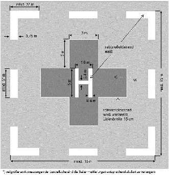
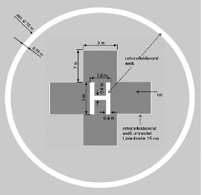

# Luftverkehrs-Ordnung (LuftVO 2015)

Ausfertigungsdatum
:   2015-10-29

Fundstelle
:   BGBl I: 2015, 1894

Zuletzt geändert durch
:   Art. 2 V v. 11.6.2017 I 1617

Änderung durch
:   Art. 2 V v. 9.3.2021 I 338 (Nr. 10) textlich nachgewiesen, dokumentarisch noch nicht abschließend bearbeitet

Änderung durch
:   Art. 2 G v. 14.6.2021 I 1766 (Nr. 32) textlich nachgewiesen, dokumentarisch noch nicht abschließend bearbeitet

Stand: Ersetzt V 96-1-2 v. 10.8.1963 I 652 (LuftVO)

## Abschnitt 1 - Allgemeine Vorschriften

### § 1 Anwendungsbereich

Diese Verordnung regelt die Voraussetzungen und Bedingungen für die
Teilnahme am Luftverkehr in der Bundesrepublik Deutschland, soweit die
Durchführungsverordnung (EU) Nr. 923/2012 der Kommission vom 26.
September 2012 zur Festlegung gemeinsamer Luftverkehrsregeln und
Betriebsvorschriften für Dienste und Verfahren der Flugsicherung und
zur Änderung der Durchführungsverordnung (EG) Nr. 1035/2011 sowie der
Verordnungen (EG) Nr. 1265/2007, (EG) Nr. 1794/2006, (EG) Nr.
730/2006, (EG) Nr. 1033/2006 und (EU) Nr. 255/2010 (ABl. L 281 vom
13\.10.2012, S. 1, L 145 vom 31.5.2013, S. 38) und die
Durchführungsverordnung (EU) 2019/947 der Kommission vom 24. Mai 2019
über die Vorschriften und Verfahren für den Betrieb unbemannter
Luftfahrzeuge (ABl. L 152 vom 11.6.2019, S. 45), die zuletzt durch die
Durchführungsverordnung (EU) 2020/746 (ABl. L 176 vom 5.6.2020, S. 13)
geändert worden ist, in ihrer jeweils geltenden Fassung nicht
anwendbar sind oder keine Regelung enthalten.

### § 2 Maßeinheiten

(1) Im Flugbetrieb sind die Maßeinheiten anzuwenden, die das
Bundesaufsichtsamt für Flugsicherung festlegt.

(2) Für Ortsbestimmungen im Luftverkehr ist als Bezugssystem das
Geodätische Welt-System 84 (World Geodetic System 1984 – WGS 84)
anzuwenden.

### § 3 Zuständige Behörde nach Artikel 4 der Durchführungsverordnung (EU) Nr. 923/2012

Zuständig für die Gewährung von Ausnahmen für besonderen Flugbetrieb
ist nach

1.  Artikel 4 Absatz 1 Buchstabe a und b der Durchführungsverordnung (EU)
    Nr. 923/2012 die Polizei des Bundes und die für die Polizei
    zuständigen obersten Landesbehörden oder eine von ihnen bestimmte
    Stelle,

2.  Artikel 4 Absatz 1 Buchstabe c bis g der Durchführungsverordnung (EU)
    Nr. 923/2012

    a)  bei Flügen nach Sichtflugregeln die Luftfahrtbehörde des Landes,

    b)  bei Flügen nach Instrumentenflugregeln das Bundesaufsichtsamt für
        Flugsicherung,

3.  Artikel 4 Absatz 1 Buchstabe h der Durchführungsverordnung (EU) Nr.
    923/2012 das Bundesaufsichtsamt für Flugsicherung.

## Abschnitt 2 - Luftfahrtpersonal

### § 4 Körperliche und geistige Beeinträchtigungen

Wer infolge geistiger oder körperlicher Beeinträchtigungen in der
Wahrnehmung der Aufgaben als Führer eines Luftfahrzeugs oder sonst als
Mitglied der Besatzung eingeschränkt ist, darf kein Luftfahrzeug
führen und nicht als anderes Besatzungsmitglied tätig sein. Das Verbot
in Anhang SERA.2020 der Durchführungsverordnung (EU) Nr. 923/2012
bleibt hiervon unberührt.

### § 5 Lärm

Der Lärm, der bei dem Betrieb eines Luftfahrzeugs verursacht wird,
darf nicht stärker sein, als es die ordnungsgemäße Führung oder
Bedienung des Luftfahrzeugs unvermeidbar erfordert.

### § 6 Mitführung von Urkunden und Ausweisen

Die Verpflichtung, die für den Betrieb eines Luftfahrzeugs
erforderlichen Urkunden und Ausweise an Bord eines Luftfahrzeugs
mitzuführen, bestimmt sich nach verbindlichen internationalen
Vorschriften, nach deutschem Recht und nach dem Recht des
Eintragungsstaates des Luftfahrzeugs sowie bei Besatzungsmitgliedern
nach dem Recht des Staates, der diese Papiere ausstellt. In jedem Fall
sind diese Unterlagen auch in englischer Sprache mitzuführen.

## Abschnitt 3 - Besondere Meldepflichten

### § 7 Meldung von Unfällen und Störungen

(1) Der verantwortliche Luftfahrzeugführer hat Unfälle ziviler
Luftfahrzeuge im Sinne von Artikel 2 Nummer 1 der Verordnung (EU) Nr.
996/2010 des Europäischen Parlaments und des Rates vom 20. Oktober
2010 über die Untersuchung und Verhütung von Unfällen und Störungen in
der Zivilluftfahrt und zur Aufhebung der Richtlinie 94/56/EG (ABl. L
295 vom 12.11.2010, S. 35) in der jeweils geltenden Fassung, die sich
im Hoheitsgebiet der Bundesrepublik Deutschland ereignet haben,
unverzüglich der Bundesstelle für Flugunfalluntersuchung zu melden.
Falls der Luftfahrzeugführer nicht in der Lage ist, muss ein anderes
Besatzungsmitglied die Meldung nach Satz 1 machen oder, sofern keines
der anderen Besatzungsmitglieder dazu in der Lage ist, der Halter des
Luftfahrzeugs. Die Meldepflicht nach Satz 1 gilt auch für Unfälle
deutscher Luftfahrzeuge außerhalb der Bundesrepublik Deutschland und
für Unfälle ausländischer Luftfahrzeuge, die zur Zeit des Ereignisses
von deutschen Luftfahrtunternehmen betrieben werden. Die Meldepflicht
gilt nicht für Luftsportgeräte.

(2) Der verantwortliche Luftfahrzeugführer hat schwere Störungen im
Sinne von Artikel 2 Nummer 16 der Verordnung (EU) Nr. 996/2010, die
sich bei dem Betrieb ziviler Flugzeuge, Drehflügler, von Ballonen und
Luftschiffen im Hoheitsgebiet der Bundesrepublik Deutschland ereignet
haben, unverzüglich der Bundesstelle für Flugunfalluntersuchung zu
melden. Die Meldepflicht nach Satz 1 gilt auch für schwere Störungen
außerhalb der Bundesrepublik Deutschland beim Betrieb deutscher
Luftfahrzeuge und ausländischer Luftfahrzeuge, die zur Zeit des
Ereignisses von deutschen Luftfahrtunternehmen betrieben werden.

(3) Erhalten die Luftaufsichtsstellen, die Flugleitungen auf
Flugplätzen, die Flugsicherungsdienststellen oder beteiligte Personen
nach Artikel 2 Nummer 11 der Verordnung (EU) Nr. 996/2010 Kenntnis von
einem Unfall oder einer schweren Störung, so sind sie ungeachtet der
Absätze 1 und 2 verpflichtet, den Unfall oder die schwere Störung
unverzüglich der Bundesstelle für Flugunfalluntersuchung zu melden.

(4) Meldungen nach den Absätzen 1 bis 3 sollen enthalten:

1.  den Namen und den derzeitigen Aufenthalt des Meldenden,

2.  den Ort und die Zeit des Unfalls oder der schweren Störung,

3.  die Art, das Muster sowie das Kenn- und das Rufzeichen des
    Luftfahrzeugs,

4.  den Namen des Halters des Luftfahrzeugs,

5.  den Zweck des Flugs, den Start- und den Zielflugplatz,

6.  den Namen des verantwortlichen Luftfahrzeugführers,

7.  die Anzahl der Besatzungsmitglieder und Fluggäste,

8.  den Umfang des Personen- und Sachschadens,

9.  Angaben über beförderte gefährliche Güter,

10. eine Darstellung des Ablaufs des Unfalls oder der schweren Störung.

Der Halter des Luftfahrzeugs ist verpflichtet, auf Verlangen der
Bundesstelle für Flugunfalluntersuchung zur Vervollständigung der
Meldung innerhalb von 14 Tagen einen ausführlichen Bericht auf
zugesandtem Formblatt vorzulegen.

(5) Die Bundesstelle für Flugunfalluntersuchung ist befugt, die Daten
nach Absatz 4 zu erheben, zu speichern und zu nutzen, soweit dies für
ihre Aufgabenerfüllung im Zusammenhang mit der Untersuchung und
Verhütung von Unfällen und Störungen in der Zivilluftfahrt im
Einzelfall erforderlich ist. Sie hat die Daten nach Absatz 4
unverzüglich zu löschen, wenn sie zur Erfüllung der Aufgaben nach Satz
1 nicht mehr erforderlich sind.

(6) Pflichten zur Abgabe von Meldungen an das Luftfahrt-Bundesamt und
an andere Luftfahrtbehörden auf Grund anderer Vorschriften oder
Auflagen bleiben unberührt.

(7) Unfälle und Störungen bei dem Betrieb von Luftsportgeräten hat der
Luftsportgeräteführer unverzüglich dem nach § 31c des
Luftverkehrsgesetzes Beauftragten schriftlich oder elektronisch zu
melden. Absatz 1 Satz 2 und die Absätze 4 und 5 gelten entsprechend.

### § 8 Startverbote

(1) Wird auf Grund des Ergebnisses einer luftaufsichtsrechtlichen
Untersuchung ein Startverbot für ein Luftfahrzeug, das nicht in einem
deutschen Luftfahrzeugregister eingetragen ist, verhängt, so hat die
für die Gewährung der Verkehrsrechte zuständige Behörde unverzüglich
den betreffenden Eintragungsstaat über die Untersuchungsergebnisse,
die zur Verhängung des Startverbots führten, zu unterrichten. Falls
der Eintragungsstaat nicht die Aufsicht über den Flugbetrieb dieses
Luftfahrzeugs führt, ist der Staat zu unterrichten, der für die
Aufsicht über den Flugbetrieb dieses Luftfahrzeugs zuständig ist. Die
Bewertung des unterrichteten Staates ist bei der Entscheidung über die
Aufrechterhaltung des Startverbots zu berücksichtigen.

(2) Hat das Ergebnis einer luftaufsichtsrechtlichen Untersuchung eines
Luftfahrzeugs, das nicht in einem deutschen Luftfahrzeugregister
eingetragen ist, Anlass zu Bedenken im Hinblick auf dessen
Verkehrssicherheit gegeben und wurde noch keine Maßnahme nach § 29
Absatz 3 Satz 5 und 6 oder Absatz 7 des Luftverkehrsgesetzes
getroffen, so muss die für die Gewährung der Verkehrsrechte zuständige
Behörde den nach Absatz 1 zuständigen Staat unterrichten.

(3) Für ein Luftfahrzeug, das in einem deutschen Luftfahrzeugregister
eingetragen ist, ist ein Startverbot, das auf Grund des Ergebnisses
einer luftaufsichtsrechtlichen Untersuchung verhängt wurde, erst
aufzuheben, wenn seine Lufttüchtigkeit wiederhergestellt ist, es sei
denn, die für die Bewertung der Lufttüchtigkeit zuständige Stelle hält
einen Start unter Auflagen und Einschränkungen für vertretbar.

(4) Die Absätze 1 bis 3 gelten entsprechend für Luftsportgeräte, die
nicht im Luftsportgeräteverzeichnis eingetragen sind.

(5) Wird auf Grund von Sicherheitsmängeln, die sich bei einer
luftaufsichtsrechtlichen Untersuchung ergeben haben, ein Startverbot
für ein gewerblich genutztes Luftfahrzeug oder für ein Luftfahrzeug
mit einer Höchstabflugmasse von mehr als 5 700 Kilogramm verhängt, so
haben die für die Luftaufsicht nach § 29 Absatz 1 und 2 des
Luftverkehrsgesetzes zuständigen Stellen dies unverzüglich dem
Luftfahrt-Bundesamt zu melden, soweit das Luftfahrt-Bundesamt nicht
selbst gehandelt hat. Dies gilt auch, wenn die für die Luftaufsicht
zuständige Stelle dem Halter oder der Besatzung eines Luftfahrzeugs
aufgibt, vor dem Start Maßnahmen zur Gewährleistung der Sicherheit zu
treffen. Wenn diese Maßnahmen begründete Sicherheitsmängel eines
Luftfahrzeugs nach Satz 1 betreffen, das nicht in einem Mitgliedstaat
der Europäischen Union registriert ist, unterrichtet das Luftfahrt-
Bundesamt unverzüglich alle für die Luftverkehrssicherheit zuständigen
Behörden in den Mitgliedstaaten der Europäischen Union sowie die
Europäische Kommission über die getroffenen Maßnahmen und die
Ergebnisse der durchgeführten Untersuchung.

(6) Die Übermittlung der Daten, auf die sich das Untersuchungsergebnis
nach den Absätzen 1 bis 5 stützt, richtet sich nach § 29 Absatz 5 und
6 des Luftverkehrsgesetzes.

### § 9 Meldung von sicherheitsrelevanten Ereignissen

(1) Ein Ereignis, das ein Luftfahrzeug, seine Insassen oder Dritte
gefährdet hat oder, wenn keine Gegenmaßnahmen ergriffen werden,
gefährden würde (sicherheitsrelevantes Ereignis), ist dem Luftfahrt-
Bundesamt zu melden von

1.  dem Betreiber oder Führer

    a)  eines in Deutschland eingetragenen turbinengetriebenen Luftfahrzeugs
        oder

    b)  eines gewerbsmäßig betriebenen Luftfahrzeugs mit einer
        höchstzulässigen Startmasse von 5 700 Kilogramm oder mehr,

2.  Personen, die in einem Entwicklungsbetrieb, Herstellungsbetrieb oder
    Instandhaltungsbetrieb turbinengetriebene Luftfahrzeuge oder
    Luftfahrzeuge mit einer höchstzulässigen Startmasse von 5 700
    Kilogramm oder mehr oder Ausrüstungen oder Teile dieser Luftfahrzeuge
    oder dieser Ausrüstungen berufsmäßig entwickeln, herstellen, instand
    halten oder verändern,

3.  Personen, die für ein turbinengetriebenes Luftfahrzeug oder für ein
    gewerbsmäßig betriebenes Luftfahrzeug mit einer höchstzulässigen
    Startmasse von 5 700 Kilogramm oder mehr oder für Ausrüstungen oder
    Teile dieser Luftfahrzeuge oder dieser Ausrüstungen einen
    Nachprüfschein oder die Bescheinigung der Freigabe zum Betrieb
    unterzeichnen,

4.  Fluglotsen sowie Flugsicherungspersonal im Verwendungsbereich
    Fluginformationsdienst,

5.  dem Unternehmer eines von der Verordnung (EG) Nr. 1008/2008 des
    Europäischen Parlaments und des Rates vom 24. September 2008 über
    gemeinsame Vorschriften für die Durchführung von Luftverkehrsdiensten
    in der Gemeinschaft (ABl. L 293 vom 31.10.2008, S. 3) in der jeweils
    geltenden Fassung erfassten Flughafens,

6.  Personen, die eine Funktion im Zusammenhang mit dem Einbau, der
    Veränderung, Instandhaltung, Reparatur, Überholung, Flugprüfung oder
    Kontrolle von Luftverkehrseinrichtungen ausüben,

7.  Personen der Luftaufsichtsstellen an Flugplätzen sowie Personen, die
    auf einem von der Verordnung (EG) Nr. 1008/2008 erfassten Flughafen
    eine Funktion im Zusammenhang mit der Abfertigung von Luftfahrzeugen
    am Boden ausüben, einschließlich Betankung, Servicearbeiten,
    Erstellung des Massen- und Schwerpunktnachweises sowie Beladen,
    Enteisen und Schleppen des Flugzeugs.

(2) Ein sicherheitsrelevantes Ereignis ist insbesondere eine
Betriebsunterbrechung, ein Mangel, eine Fehlfunktion oder eine andere
regelwidrige Gegebenheit mit tatsächlichem oder potenziellem Einfluss
auf die Flugsicherheit. Meldepflichtig sind insbesondere Ereignisse
bei Betrieb, Instandsetzung und Herstellung von Luftfahrzeugen nach
Anlage 1 und Ereignisse im Zusammenhang mit Flugnavigationsdiensten
nach Anlage 2, die jeweils weder einen Unfall noch eine schwere
Störung im Sinne der Verordnung (EU) Nr. 996/2010 zur Folge hatten.

(3) Die Meldung kann mit Zustimmung des Luftfahrt-Bundesamtes auch
zentral über das Sicherheitsmanagement der jeweils meldenden Stelle
erfolgen. Einzelheiten hierzu werden in einer gesonderten Absprache
zwischen dem Luftfahrt-Bundesamt und der meldenden Stelle geregelt.
Die zur Meldung verpflichteten Personen sind in diesen Fällen darauf
hinzuweisen, dass das Ereignis auch direkt an das Luftfahrt-Bundesamt
gemeldet werden kann. Meldungen von sicherheitsrelevanten Ereignissen
werden vom Luftfahrt-Bundesamt sofort nach ihrem Erhalt an das
Bundesaufsichtsamt für Flugsicherung weitergeleitet.

(4) Die Pflicht, Unfälle und schwere Störungen nach § 7 zu melden, und
andere Pflichten zur Abgabe von Meldungen an das Luftfahrt-Bundesamt
und an andere Luftfahrtbehörden auf Grund anderer Vorschriften oder
Auflagen bleiben unberührt.

### § 10 Register für sicherheitsrelevante Ereignisse

(1) Das Luftfahrt-Bundesamt führt ein Register zur Erfassung,
Verarbeitung, Auswertung und Speicherung der ihm gemeldeten
sicherheitsrelevanten Ereignisse.

(2) Die gemeldeten sicherheitsrelevanten Ereignisse werden in einer
Ereignisdatei gespeichert. In der Datei werden erfasst:

1.  Luftfahrzeugart, Luftfahrzeugmuster oder Luftfahrzeugbaureihe,

2.  Ort, Datum, Hergang und Umstände des Ereignisses (Betriebsphase, Art
    des Ereignisses) sowie Ursachen des Ereignisses, soweit diese bekannt
    sind,

3.  Staatszugehörigkeit des Luftfahrzeugs.

Nicht gespeichert werden

1.  persönliche Angaben des Meldenden,

2.  Namen oder Anschriften von Einzelpersonen oder Unternehmen sowie

3.  das Eintragungszeichen des Luftfahrzeugs.

(3) Das Luftfahrt-Bundesamt ist berechtigt, die zuständige Stelle des
Mitgliedstaates, in dem

1.  sich das sicherheitsrelevante Ereignis zugetragen hat,

2.  das Luftfahrzeug eingetragen ist,

3.  das Luftfahrzeug hergestellt wurde oder

4.  der Betreiber zugelassen ist,

über das sicherheitsrelevante Ereignis zu unterrichten.

(4) Das Luftfahrt-Bundesamt ermöglicht allen zuständigen Stellen, die
für die Aufsicht in der Zivilluftfahrt oder für die Untersuchung von
Unfällen und Störungen in der Zivilluftfahrt innerhalb der
Europäischen Union eingerichtet und von den Mitgliedstaaten benannt
sind, sowie der Europäischen Kommission den Zugriff auf die in der
Ereignisdatei gespeicherten Informationen.

## Abschnitt 4 - Allgemeine Verkehrsregeln

### § 11 Abweichung von Höchstgeschwindigkeiten

(1) Der Luftfahrzeugführer ist verpflichtet, die in Anhang SERA.6001
Buchstabe c bis g der Durchführungsverordnung (EU) Nr. 923/2012
beschriebenen Geschwindigkeitsbegrenzungen einzuhalten.

(2) Das Bundesaufsichtsamt für Flugsicherung kann für
Luftfahrzeugmuster, die aus technischen oder Sicherheitsgründen die in
Anhang SERA.6001 Buchstabe c bis g der Durchführungsverordnung (EU)
Nr. 923/2012 beschriebenen Geschwindigkeitsbeschränkungen nicht
einhalten können, Ausnahmen zulassen.

### § 12 Zuständige Behörde nach Anhang SERA.3210 der Durchführungsverordnung (EU) Nr. 923/2012

Zuständig für die Genehmigung der von der Flugsicherungsorganisation
vorgegebenen Mindestabstände zwischen Fahrzeugen und rollenden
Luftfahrzeugen nach Anhang SERA.3210 Buchstabe d Nummer 4 Ziffer ii
Buchstabe B der Durchführungsverordnung (EU) Nr.
923/2012              ist das Bundesaufsichtsamt für Flugsicherung.

### § 13 Abwerfen von Gegenständen oder sonstigen Stoffen

(1) Das Abwerfen oder Ablassen von Gegenständen oder sonstigen Stoffen
aus oder von Luftfahrzeugen ist verboten. Dies gilt nicht für Ballast
in Form von Wasser oder feinem Sand, Treibstoffe, Schleppseile,
Schleppbanner und ähnliche Gegenstände, wenn sie an Stellen abgeworfen
oder abgelassen werden, an denen eine Gefahr für Personen oder Sachen
nicht besteht.

(2) Die örtlich zuständige Luftfahrtbehörde des Landes kann Ausnahmen
von dem Verbot nach Absatz 1 Satz 1 zulassen, wenn eine Gefahr für
Personen oder Sachen nicht besteht.

(3) Das Abwerfen von Post regelt das Bundesministerium für Wirtschaft
und Energie oder die von ihm bestimmte Stelle im Einvernehmen mit der
zuständigen Luftfahrtbehörde des Landes.

### § 14 Kunstflüge

(1) Kunstflüge dürfen nur bei Flugverhältnissen, bei denen nach
Sichtflugregeln geflogen werden darf, und nur mit ausdrücklicher
Zustimmung aller Insassen des Luftfahrzeugs ausgeführt werden.
Kunstflüge mit Luftsportgeräten sind verboten.

(2) Kunstflüge in Höhen von weniger als 450 Metern (1 500 Fuß) über
Grund oder Wasser sowie über Städten, anderen dichtbesiedelten
Gebieten, Menschenansammlungen und Flughäfen sind verboten. Die
örtlich zuständige Luftfahrtbehörde des Landes kann im Einzelfall
Ausnahmen zulassen.

(3) Kunstflüge bedürfen, soweit sie in der Umgebung von Flugplätzen
ohne Flugverkehrskontrollstelle durchgeführt werden, der Zustimmung
der Luftaufsichtsstelle. Absatz 2 bleibt unberührt.

(4) Für Kunstflüge im kontrollierten Luftraum und über Flugplätzen mit
Flugverkehrskontrollstelle ist der zuständigen
Flugverkehrskontrollstelle ein Flugplan zu übermitteln.

### § 15 Schlepp- und Reklameflüge

(1) Reklameflüge mit geschleppten Gegenständen bedürfen der Erlaubnis
der Luftfahrtbehörde des Landes, in dem der Luftfahrzeugführer seinen
Wohnsitz oder Sitz hat. Die Erlaubnis darf nur erteilt werden, wenn

1.  der Luftfahrzeugführer die Schleppberechtigung nach der Verordnung
    (EU) Nr. 1178/2011 der Kommission vom 3. November 2011 zur Festlegung
    technischer Vorschriften und von Verwaltungsverfahren in Bezug auf das
    fliegende Personal in der Zivilluftfahrt gemäß der Verordnung (EG) Nr.
    216/2008 des Europäischen Parlaments und des Rates (ABl. L 311 vom
    25\.11.2011, S. 1) in der jeweils geltenden Fassung oder nach der
    Verordnung über Luftfahrtpersonal besitzt,

2.  das Luftfahrzeug mit einem geeichten Barographen zur Feststellung der
    Flughöhen oder einem kalibrierten Datenaufzeichnungsgerät zur
    Darstellung von Flughöhe und Flugstrecke während des Flugs ausgerüstet
    ist,

3.  bei dem beantragten Flug nicht mehr als drei Luftfahrzeuge in
    Formation fliegen, wobei der Abstand zwischen dem geschleppten
    Gegenstand des voranfliegenden Luftfahrzeugs und dem nachfolgenden
    Luftfahrzeug sowie zwischen den Luftfahrzeugen mindestens 60 Meter
    betragen muss,

4.  die Haftpflichtversicherung das Schleppen von Gegenständen
    ausdrücklich mit einschließt.

(2) Auf das Schleppen von Gegenständen zu anderen als zu
Reklamezwecken ist Absatz 1 sinngemäß anzuwenden; Absatz 1 Satz 2
Nummer 2 gilt nicht für Arbeitsflüge von Drehflüglern. Das Schleppen
von Segelflugzeugen und Hängegleitern bedarf nicht der Erlaubnis nach
Absatz 1; es genügt die Schleppberechtigung nach der Verordnung (EU)
Nr. 1178/2011 oder der Verordnung über Luftfahrtpersonal.

(3) Die Erlaubnisbehörde kann die Erlaubnis nach Absatz 1 aus Gründen
der öffentlichen Sicherheit oder Ordnung, vor allem zur Verhinderung
von Lärmbelästigungen, mit Auflagen verbinden. Sie kann insbesondere
in Abweichung von § 37 höhere Sicherheitsmindesthöhen bestimmen und
die Erlaubnis zeitlich beschränken.

(4) Reklameflüge, bei denen die Reklame nur in der Beschriftung des
Luftfahrzeugs besteht, bedürfen keiner Erlaubnis.

(5) Flüge zur Reklame mit akustischen Mitteln sind verboten.

## Abschnitt 5 - Nutzung des Luftraums

### § 16 Luftraumordnung

(1) Das Bundesministerium für Verkehr und digitale Infrastruktur legt
Folgendes fest:

1.  die Fluginformationsgebiete zur Durchführung des
    Fluginformationsdienstes und des Flugalarmdienstes,

2.  die kontrollierten und unkontrollierten Lufträume nach Anhang
    SERA.6001 der Durchführungsverordnung (EU) Nr. 923/2012 innerhalb der
    Fluginformationsgebiete,

3.  die Zonen mit Funkkommunikationspflicht nach Anhang SERA.6005
    Buchstabe a der Durchführungsverordnung (EU) Nr. 923/2012,

4.  die Zonen mit Transponderpflicht nach Anhang SERA.6005 Buchstabe b der
    Durchführungsverordnung (EU) Nr. 923/2012.

(2) Im kontrollierten Luftraum können Flüge nach Sichtflugregeln ganz
oder teilweise in einem räumlich und zeitlich begrenzten Umfang von
der Flugsicherungsorganisation untersagt werden, wenn es der Grad der
Inanspruchnahme durch den der Flugverkehrskontrolle unterliegenden
Luftverkehr zwingend erfordert.

(3) Die Flugsicherungsorganisation kann zur Durchführung von
militärischem Flugverkehr in Lufträumen, in denen auch für Flüge nach
Sichtflugregeln eine Flugverkehrskontrollfreigabe erforderlich ist,
zeitlich begrenzt Gebiete festlegen, in denen Flüge nach Sicht- und
Instrumentenflugregeln ganz oder teilweise untersagt sind oder
Beschränkungen unterliegen, wenn dies zur Abwehr von Gefahren für die
Sicherheit des Luftverkehrs erforderlich ist.

### § 17 Luftsperrgebiete und Gebiete mit Flugbeschränkungen

(1) Zuständig für die Festlegung von Luftsperrgebieten und Gebieten
mit Flugbeschränkungen sowie für die Genehmigung von Abweichungen in
Gebieten mit Flugbeschränkungen nach Anhang SERA.3145 der
Durchführungsverordnung (EU) Nr. 923/2012 ist das Bundesministerium
für Verkehr und digitale Infrastruktur. Es legt die Luftsperrgebiete
und Gebiete mit Flugbeschränkungen fest, wenn dies zur Abwehr von
Gefahren für die öffentliche Sicherheit oder Ordnung, insbesondere für
die Sicherheit des Luftverkehrs, erforderlich ist.

(2) Gebiete mit Flugbeschränkungen dürfen durchflogen werden, soweit
die Beschränkungen dies zulassen oder das Bundesaufsichtsamt für
Flugsicherung allgemein oder die zuständige Flugverkehrskontrollstelle
im Einzelfall den Durchflug genehmigt hat. Die Genehmigung kann mit
Nebenbestimmungen versehen werden. Sie kann insbesondere mit Auflagen
verbunden werden.

### § 18 Erlaubnisbedürftige Außenstarts und Außenlandungen

(1) Starts und Landungen von Luftfahrzeugen außerhalb der für sie
genehmigten Flugplätze (Außenstart und Außenlandung) nach § 25 des
Luftverkehrsgesetzes bedürfen der Erlaubnis der örtlich zuständigen
Luftfahrtbehörde des Landes, soweit nicht der Beauftragte nach § 31c
des Luftverkehrsgesetzes zuständig ist. Die Erlaubnis für Außenstarts
und Außenlandungen von Hängegleitern und Gleitseglern schließt
Schleppstarts durch Winden ein.

(2) Absatz 1 gilt für Außenlandungen mit Sprungfallschirmen
entsprechend.

(3) Keiner Erlaubnis nach § 25 Absatz 1 des Luftverkehrsgesetzes
bedürfen Außenlandungen von Segelflugzeugen, Motorseglern (außer
Reisemotorseglern), Hängegleitern und Gleitseglern sowie bemannten
Freiballonen, wenn der Ort der Landung nicht vorausbestimmbar ist.

(4) Das Luftfahrt-Bundesamt erteilt eine Genehmigung nach § 25 Absatz
4 des Luftverkehrsgesetzes, wenn die Voraussetzungen von Anhang IV
CAT.POL.H.225 der Verordnung (EU) Nr. 965/2012 mit Ausnahme von
CAT.POL.H.225 Buchstabe a Nummer 1 vorliegen, und

1.  das Luftfahrtunternehmen über eine Genehmigung des Luftfahrt-
    Bundesamtes für medizinische Hubschraubernoteinsätze gemäß Anhang V
    SPA.HEMS.100 der Verordnung (EU) Nr. 965/2012 der Kommission vom 5.
    Oktober 2012 zur Festlegung technischer Vorschriften und von
    Verwaltungsverfahren in Bezug auf den Flugbetrieb gemäß der Verordnung
    (EG) Nr.
    216/2008                    des Europäischen Parlaments und des Rates
    (ABl. L 296 vom 25.10.2012, S. 1) in der jeweils geltenden Fassung
    verfügt,

2.  der Flugbetrieb am Tag stattfindet, es sei denn, das
    Luftfahrtunternehmen verfügt über eine Genehmigung gemäß Anhang V
    SPA.NVIS.100 der Verordnung (EU) Nr. 965/2012 oder über ein Verfahren,
    durch das eine ausreichende Ausleuchtung der Start- und Landefläche
    und ihrer Umgebung sichergestellt wird,

3.  sich die Landestelle am Boden befindet und

4.  das Luftfahrtunternehmen die Anzahl der Flugbewegungen für jede
    genutzte Landestelle an Einrichtungen von öffentlichem Interesse für
    jedes Kalenderjahr erhebt und bis zum 1. Februar des Folgejahres an
    das Luftfahrt-Bundesamt meldet.

Für Landestellen auf Gebäuden darf eine Genehmigung nur erteilt
werden, wenn neben den Voraussetzungen nach Satz 1 mit Ausnahme von
Nummer 3 eine einzelfallbezogene Prüfung durch das Luftfahrt-Bundesamt
ergeben hat, dass ein für den Betrieb der Dachlandestelle
hinreichender Sicherheitsstandard unter Berücksichtigung des
vorhandenen Brandschutzes, der Fluchtwege sowie der Tragfähigkeit des
Gebäudes gewährleistet ist. Im Übrigen teilt das Luftfahrtunternehmen
dem Luftfahrt-Bundesamt innerhalb von 24 Monaten nach Erteilung der
Genehmigung nach Satz 1 mit, dass die Landestelle die Anforderungen
der Anlage 8 erfüllt. Unterbleibt diese Mitteilung, kann die
Genehmigung nach Satz 1 widerrufen werden.

### § 19 Verbotene Nutzung des Luftraums

(1) In einer Entfernung von weniger als 1,5 Kilometern von der
Begrenzung von Flugplätzen sind folgende Arten der Nutzung des
Luftraums verboten:

1.  das Steigenlassen von Drachen und Kinderballonen oder das Betreiben
    von Schirmdrachen,

2.  der Aufstieg

    a)  von Feuerwerkskörpern

        aa) der Kategorie F2 im Sinne des Sprengstoffgesetzes in der jeweils
            geltenden Fassung in der Zeit vom 2. Januar bis 30. Dezember,

        bb) der Kategorien F3, F4, P2 und T2 im Sinne des Sprengstoffgesetzes in
            der jeweils geltenden Fassung,

    b)  von ballonartigen Leuchtkörpern, insbesondere von Flug- oder
        Himmelslaternen, während der Betriebszeit des Flugplatzes,

3.  der Betrieb von Scheinwerfern oder optischen Lichtsignalgeräten,
    insbesondere Lasergeräten, die geeignet sind, den Flugbetrieb an einem
    Flugplatz zu stören.

(2) Die örtlich zuständige Luftfahrtbehörde des Landes kann Ausnahmen
von dem Verbot nach Absatz 1 zulassen, wenn von der beantragten
Nutzung des Luftraums keine Gefahren für die öffentliche Sicherheit
und Ordnung ausgehen.

(3) Landesrechtliche Regelungen, die Aufstiege von ballonartigen
Leuchtkörpern verbieten, bleiben unberührt.

### § 20 Erlaubnisbedürftige Nutzung des Luftraums

(1) Die folgenden Arten der Nutzung des Luftraums bedürfen der
Erlaubnis:

1.  das Steigenlassen von Drachen und Schirmdrachen, wenn sie mit einem
    Seil von mehr als 100 Metern Länge gehalten werden,

2.  der Aufstieg von Feuerwerkskörpern, wenn sie mehr als 300 Meter
    aufsteigen,

3.  der Aufstieg von Fesselballonen, wenn sie mit einem Halteseil von mehr
    als 30 Metern Länge gehalten werden,

4.  der Betrieb von ungesteuerten Flugkörpern mit Eigenantrieb,

5.  der Betrieb von Scheinwerfern oder optischen Lichtsignalgeräten,
    insbesondere von Lasergeräten, die geeignet sind, Luftfahrzeugführer
    während des An- oder Abflugs zu blenden,

6.  der Betrieb von unbemannten Freiballonen nach Anlage 2 der
    Durchführungsverordnung (EU) Nr. 923/2012 im Hoheitsgebiet der
    Bundesrepublik Deutschland.

Der Starter eines Drachens, Schirmdrachens oder unbemannten
Fesselballons muss das Halteseil in Abständen von 100 Metern bei Tag
durch rotweiße Fähnchen, bei Nacht durch rote und weiße Blitz- oder
Blinklichter so kenntlich machen, dass es von anderen Luftfahrzeugen
aus erkennbar ist.

(2) Zuständige Behörde für die Erteilung der Erlaubnis nach Absatz 1
ist die örtlich zuständige Luftfahrtbehörde des Landes.

(3) Die zuständige Behörde bestimmt, welche Unterlagen der Antrag auf
Erteilung der Erlaubnis enthalten muss. Sie kann insbesondere das
Gutachten eines Sachverständigen über die Eignung des Geländes und des
Luftraums verlangen. Die zuständige Behörde kann vom Antragsteller den
Nachweis verlangen, dass der Eigentümer oder sonstige
Nutzungsberechtigte des Grundstücks, auf dem der Aufstieg stattfinden
soll, der Nutzung zustimmt.

(4) Die Erlaubnis wird erteilt, wenn die beabsichtigte Nutzung des
Luftraums nicht zu einer Gefahr für die Sicherheit des Luftverkehrs
oder für die öffentliche Sicherheit oder Ordnung führt.

(5) Die Erlaubnis kann natürlichen und juristischen Personen oder
Personenvereinigungen allgemein oder für den Einzelfall erteilt
werden. Sie kann mit Nebenbestimmungen versehen, insbesondere mit
Auflagen verbunden werden.

### § 21 Nutzung des kontrollierten Luftraums und des Luftraums über Flugplätzen mit Flugverkehrskontrollstelle

(1) Vor der Nutzung des kontrollierten Luftraums und des Luftraums
über Flugplätzen mit Flugverkehrskontrollstelle ist bei der
zuständigen Flugverkehrskontrollstelle eine
Flugverkehrskontrollfreigabe einzuholen für

1.  Fallschirmsprünge sowie den Abwurf von Gegenständen an Fallschirmen
    mit einer Gesamtmasse von Fallschirm und Ballast von mehr als 0,5
    Kilogramm,

2.  Aufstiege von ungesteuerten Flugkörpern mit Eigenantrieb,

3.  Aufstiege von ballonartigen Leuchtkörpern sowie Massenaufstiege von
    Kinderballonen und Aufstiege von gebündelten Kinderballonen,

4.  Aufstiege von unbemannten Freiballonen, insbesondere Wetterballonen,
    folgender Klassen im Sinne von Anlage 2 Ziffer 1.1 der
    Durchführungsverordnung (EU) Nr. 923/2012:

    a)  schwer und mittelschwer,

    b)  leicht, sofern der Aufstiegsort innerhalb von Flugplatzkontrollzonen
        liegt und die Gesamtmasse (Ballonhülle und Ballast) mehr als 500 Gramm
        beträgt,

5.  Aufstiege von unbemannten Luftfahrtsystemen und Flugmodellen,

6.  Massenaufstiege und Massendurchflüge von Brieftauben von und durch
    Flugplatzkontrollzonen,

7.  Kunstflüge.

(2) Verantwortlich für die Einholung der Flugverkehrskontrollfreigabe
ist im Fall von Absatz 1

1.  Nummer 1 der Luftfahrzeugführer,

2.  Nummer 2 der Starter des ungesteuerten Flugkörpers mit Eigenantrieb,

3.  Nummer 3, soweit der Aufstieg von ballonartigen Leuchtkörpern
    betroffen ist, der Starter des Leuchtkörpers, im Übrigen der
    Veranstalter,

4.  Nummer 4 der Starter des unbemannten Freiballons,

5.  Nummer 5 der Fernpilot des unbemannten Luftfahrtsystems oder
    Flugmodells,

6.  Nummer 6 der Starter der Brieftauben,

7.  Nummer 7 der Luftfahrzeugführer.

(3) Landesrechtliche Regelungen, die Aufstiege von ballonartigen
Leuchtkörpern verbieten, bleiben unberührt.

## Abschnitt 5a - Betrieb von unbemannten Fluggeräten

### § 21a Zuständige Behörden in der Betriebskategorie „offen“ nach der Durchführungsverordnung (EU) 2019/947

(1) Zuständige Behörde in der Betriebskategorie „offen“ für die
Durchführung von Prüfungen und die Ausstellung von Bescheinigungen und
Zeugnissen zum Nachweis ausreichender Kompetenzen von Fernpiloten nach
Artikel 4 Absatz 2 und Artikel 8 Absatz 1 in Verbindung mit Teil A des
Anhangs der Durchführungsverordnung (EU) 2019/947 ist das Luftfahrt-
Bundesamt.

(2) Das Luftfahrt-Bundesamt legt die Voraussetzungen und Verfahren
nach Absatz 1 fest. Dabei stellt es insbesondere sicher, dass nur
solche Personen zu einer Prüfung für den Erwerb der in Artikel 4
Absatz 2 in Verbindung mit Punkt UAS.OPEN.030 Nummer 2 Buchstabe c in
Teil A des Anhangs der Durchführungsverordnung (EU) 2019/947 genannten
Bescheinigung zugelassen werden, die der zuständigen Stelle vor der
Prüfung ein gültiges Identitätsdokument und bei Minderjährigkeit
zusätzlich die Zustimmung des gesetzlichen Vertreters zur Teilnahme an
der Prüfung vorgelegt haben.

(3) Für die Aufsicht über den Betrieb unbemannter Fluggeräte in der
Betriebskategorie „offen“ nach Artikel 4 in Verbindung mit Teil A des
Anhangs der Durchführungsverordnung (EU) 2019/947 ist die örtlich
zuständige Luftfahrtbehörde des Landes zuständig.

### § 21b Zuständige Behörden für den Betrieb von unbemannten Fluggeräten in der Betriebskategorie „speziell“ nach der Durchführungsverordnung (EU) 2019/947

(1) Zuständige Behörde für den Betrieb von unbemannten Fluggeräten und
für die Durchführung von Prüfungen und die Ausstellung von
Bescheinigungen und Zeugnissen zum Nachweis ausreichender Kompetenzen
von Fernpiloten in der Betriebskategorie „speziell“ nach Artikel 5 in
Verbindung mit den Artikeln 12 und 13 der Durchführungsverordnung (EU)
2019/947 ist das Luftfahrt-Bundesamt, soweit sich nicht aus den
Absätzen 2 und 3 etwas anderes ergibt. § 21a Absatz 2 Satz 1 gilt
entsprechend. Die in § 21a Absatz 2 Satz 2 genannten Voraussetzungen
gelten für die Prüfung und die Ausstellung der in Artikel 5 Absatz 5
in Verbindung mit Anlage 1 des Anhangs der Durchführungsverordnung
(EU) 2019/947 genannten Bescheinigungen entsprechend.

(2) Für die Erteilung einer Betriebsgenehmigung in der
Betriebskategorie „speziell“ nach Artikel 5 Absatz 1 in Verbindung mit
Artikel 12 Absatz 1 bis 4 und Teil B des Anhangs der
Durchführungsverordnung (EU) 2019/947 ist die Luftfahrtbehörde des
Landes zuständig, es sei denn, es geht um die Erteilung einer
Betriebsgenehmigung nach Artikel 5 Absatz 4 Buchstabe b der
Durchführungsverordnung (EU) 2019/947. Die örtliche Zuständigkeit
richtet sich bei natürlichen Personen nach dem Hauptwohnsitz des
Antragstellers, bei juristischen Personen nach dem Sitz des
Antragstellers.

(3) Absatz 2 gilt entsprechend für die Aktualisierung der nach Absatz
2 Satz 1 erteilten Betriebsgenehmigung im Falle eines Betriebs in
einem anderen Mitgliedstaat der Europäischen Union nach Artikel 13
Absatz 2 Satz 2 der Durchführungsverordnung (EU) 2019/947.

### § 21c Zuständige Behörde für den Betrieb von unbemannten Fluggeräten in der Betriebskategorie „zulassungspflichtig“ nach der Durchführungsverordnung (EU) 2019/947; Verkehrsvorschriften

(1) Zuständige Behörde in der Betriebskategorie „zulassungspflichtig“
für die Erteilung einer Zulassung nach den Artikeln 6, 7 Absatz 3 und
11 der Durchführungsverordnung (EU) 2019/947 in Verbindung mit der
Delegierten Verordnung (EU) 2019/945 der Kommission vom 12. März 2019
über unbemannte Luftfahrzeugsysteme und Drittlandbetreiber unbemannter
Luftfahrzeugsysteme (ABl. L 152 vom 11.6.2019, S. 1), die durch die
Delegierte Verordnung (EU) 2020/1058 (ABl. L 232 vom 20.7.2020, S. 1)
geändert worden ist, ist das Luftfahrt-Bundesamt.

(2) Für den Betrieb in der Betriebskategorie „zulassungspflichtig“
gelten die Verkehrsvorschriften für bemannte, motorgetriebene
Luftfahrzeuge entsprechend, soweit sie Einfluss auf die Belange des
Umwelt-, Lärm- oder Naturschutzes haben können.

### § 21d Zuständige Behörde für den Betrieb von unbemannten Fluggeräten nach der Durchführungsverordnung (EU) 2019/947 durch Betreiber aus Drittländern

Zuständige Behörde für den Betrieb unbemannter Fluggeräte nach den §§
21a bis 21c durch Betreiber im Sinne des Artikels 41 der Delegierten
Verordnung (EU) 2019/945 ist das Luftfahrt-Bundesamt.

### § 21e Benannte und anerkannte Stellen

(1) Das Luftfahrt-Bundesamt kann auf Antrag Stellen für die
Durchführung von Prüfungen und für die Ausstellung von Bescheinigungen
und Zeugnissen nach § 21a und § 21b benennen.

(2) Es kann auf Antrag Stellen für die Durchführung der praktischen
Ausbildung und Beurteilung der praktischen Fähigkeiten von Fernpiloten
und für die Ausstellung der Akkreditierung für den unter die
Standardszenarien im Sinne des Artikels 2 Nummer 6 der
Durchführungsverordnung (EU) 2019/947 fallenden Betrieb nach Anlage 1
in Verbindung mit Anlage 3 des Anhangs der Durchführungsverordnung
(EU) 2019/947 anerkennen.

(3) Die Benennung nach Absatz 1 und die Anerkennung nach Absatz 2
gelten jeweils zwei Jahre. Sie können auf Antrag verlängert werden.
Zudem können sie mit Nebenbestimmungen versehen, insbesondere mit
Auflagen verbunden werden. Die Benennung und die Anerkennung sind
jeweils zu widerrufen, wenn die Voraussetzungen für ihre Erteilung
nachträglich nicht nur vorübergehend entfallen sind. Sie können
widerrufen werden, wenn die erteilten Auflagen nicht eingehalten
werden. Das Luftfahrt-Bundesamt legt die weiteren Einzelheiten zur
Benennung und zur Anerkennung fest und veröffentlicht diese in den
Nachrichten für Luftfahrer.

(4) Das Luftfahrt-Bundesamt führt die Aufsicht über die nach Absatz 1
benannten und die nach Absatz 2 anerkannten Stellen. Beschäftigte des
Luftfahrt-Bundesamtes sind insbesondere befugt, die Räumlichkeiten der
Stellen zu den üblichen Betriebs- und Geschäftszeiten zu betreten und
entsprechende Ermittlungen vorzunehmen. Sie sind zu Aufsichtszwecken
auch befugt, Prüfungen nach § 21a und § 21b beizuwohnen.

### § 21f Regelungen für den Betrieb von Flugmodellen im Rahmen von Luftsportverbänden nach der Durchführungsverordnung (EU) 2019/947

(1) Der Betrieb von Flugmodellen durch Mitglieder von
Luftsportverbänden oder durch Mitglieder von in Luftsportverbänden
organisierten Modellflugvereinen ist abweichend von den in der
Durchführungsverordnung (EU) 2019/947 festgelegten Anforderungen an
den Betrieb von unbemannten Fluggeräten zulässig, sofern er unter
Einhaltung einschlägiger verbandsinterner Verfahren erfolgt, auf deren
Grundlage eine Genehmigung nach Artikel 16 der Durchführungsverordnung
(EU) 2019/947 in Verbindung mit § 21g erteilt worden ist. Dabei ist
sicherzustellen, dass Fernpiloten die Bestimmungen von Punkt
UAS.OPEN.060 Nummer 2 Buchstabe a bis d in Verbindung mit Nummer 4 in
Teil A des Anhangs der Durchführungsverordnung (EU) 2019/947
einhalten.

(2) Fernpiloten von Flugmodellen mit einer Startmasse von mehr als 2
Kilogramm müssen zusätzlich zu der Erlaubnis nach Absatz 3 über
ausreichende Kenntnisse in

1.  der Anwendung und der sicheren Steuerung der betriebenen Flugmodelle,

2.  den einschlägigen luftrechtlichen Grundlagen und

3.  der örtlichen Luftraumordnung

verfügen. Sie dürfen ein Flugmodell nach Satz 1 nur dann betreiben,
wenn sie vor der erstmaligen Aufnahme des Betriebs an einer
Schulungsmaßnahme des Luftsportverbandes, dem eine Genehmigung nach
Artikel 16 der Durchführungsverordnung (EU) 2019/947 erteilt worden
ist, teilgenommen haben. Eine Bescheinigung über diese Teilnahme, die
fünf Jahre Gültigkeit besitzt, ist während des Betriebs mitzuführen.

(3) Der Betrieb von Flugmodellen im Rahmen von Luftsportverbänden
bedarf der Erlaubnis, sofern es sich um Flugmodelle handelt

1.  mit mehr als 12 Kilogramm Startmasse,

2.  mit Raketenantrieb, sofern die Masse des Treibsatzes mehr als 20 Gramm
    beträgt,

3.  mit Verbrennungsmotor, die in einer Entfernung von weniger als 1,5
    Kilometern von Wohngebieten betrieben werden.

Über Satz 1 hinaus bedarf der Betrieb aller Flugmodelle bei Nacht im
Sinne des Artikels 2 Satz 2 Nummer 34 der Durchführungsverordnung (EU)
2019/947 der Erlaubnis.

(4) Zuständige Behörde für die Erteilung einer Erlaubnis nach Absatz 3
ist die Luftfahrtbehörde des Landes. Die örtliche Zuständigkeit
richtet sich nach der Lage des Geländes, über dem der Betrieb von
Flugmodellen stattfinden soll.

(5) Der Antrag auf Erlaubnis nach Absatz 3 ist von dem Mitglied des
Luftsportverbandes oder im Fall des Modellflugvereins durch eine
entsprechend vertretungsberechtigte Person bei der zuständigen Behörde
nach Absatz 4 zu stellen. Der Antrag muss folgende Angaben enthalten:

1.  Name und Anschrift des Antragstellers,

2.  Unterlagen zum Nachweis der Erfüllung der in Absatz 2 Satz 1 Nummer 1
    bis 3 genannten Voraussetzungen.

(6) Die zuständige Behörde bestimmt nach pflichtgemäßem Ermessen, ob
dem Antrag auf Erteilung einer Erlaubnis weitere Unterlagen beigefügt
werden müssen. Sie kann insbesondere noch verlangen:

1.  den Nachweis, dass der Grundstückseigentümer oder sonstige
    Nutzungsberechtigte dem Aufstieg zugestimmt hat,

2.  das Gutachten eines Sachverständigen über die Eignung des Geländes und
    des betroffenen Luftraums für den Betrieb von Flugmodellen,

3.  weitere fachspezifische Bewertungen oder Gutachten, insbesondere zum
    Natur- und Lärmschutz,

sofern diese Unterlagen für die Prüfung des Antrags im Einzelfall
jeweils erforderlich sind.

(7) Schutzvorschriften insbesondere des Bundesnaturschutzgesetzes, des
Bundes-Immissionsschutzgesetzes und Rechtsvorschriften, die auf Grund
dieser Gesetze erlassen worden sind oder fortgelten, sowie das
Naturschutzrecht der Länder bleiben unberührt.

### § 21g Regelungen für die Erteilung einer Genehmigung nach der Durchführungsverordnung (EU) 2019/947 an Luftsportverbände

(1) Das Bundesministerium für Verkehr und digitale Infrastruktur oder
eine von ihm bestimmte Bundesbehörde kann bundesweit tätigen
Luftsportverbänden auf Antrag eine Genehmigung nach Artikel 16 Absatz
1 der Durchführungsverordnung (EU) 2019/947 erteilen. Diese
Genehmigung befugt den Luftsportverband dazu,

1.  geeignete Verfahren zu etablieren und risikobasiert fortzuentwickeln,
    die im Rahmen des zulässigen Betriebs von Flugmodellen nach § 21f
    Absatz 1 Satz 1 zur Anwendung kommen, und

2.  Schulungsmaßnahmen für Mitglieder des Luftsportverbandes oder
    Mitglieder von im Luftsportverband organisierten Modellflugvereinen
    durchzuführen und entsprechende Bescheinigungen auszustellen.

Die Genehmigung kann mit Nebenbestimmungen versehen, insbesondere mit
Auflagen zur Sicherstellung des Schutzes der Umwelt verbunden werden.

(2) Dem Antrag auf Erteilung einer Genehmigung nach Absatz 1 sind
beizufügen:

1.  Verfahren, die den Betrieb von Flugmodellen durch Mitglieder des
    Luftsportverbandes oder Mitglieder von im Luftsportverband
    organisierten Modellflugvereinen regeln und die den Anforderungen des
    Artikels 16 Absatz 2 Buchstabe b der Durchführungsverordnung (EU)
    2019/947 entsprechen,

2.  eine Beschreibung, wie sichergestellt wird, dass der Betrieb von
    Flugmodellen im Sinne des Absatzes 1 Satz 2 durchgeführt wird,

3.  die Zusicherung, dass die in Nummer 1 genannten Verfahren den
    Mitgliedern des jeweiligen Luftsportverbandes zum Zwecke des Betriebs
    von Flugmodellen auf Antrag zur Verfügung gestellt werden und

4.  Angaben zu Umfang und Inhalt der in Absatz 1 Satz 2 Nummer 2 genannten
    Schulungsmaßnahmen und zu der Erteilung von Schulungsbescheinigungen.

(3) Vertreter der Luftsportverbände, die eine Genehmigung nach Absatz
1 erhalten haben, sind berechtigt, dem Betrieb von Flugmodellen, der
auf Grundlage ihrer in Absatz 2 Nummer 1 genannten Verfahren
durchgeführt wird, beizuwohnen.

### § 21h Regelungen für den Betrieb von unbemannten Fluggeräten in geografischen Gebieten nach der Durchführungsverordnung (EU) 2019/947

(1) Die Benutzung des Luftraums durch unbemannte Fluggeräte ist frei,
soweit sie nicht durch das Luftverkehrsgesetz, durch die zu seiner
Durchführung erlassenen Rechtsvorschriften, durch im Inland
anwendbares internationales Recht, durch Rechtsakte der Europäischen
Union und die zu deren Durchführung erlassenen Rechtsvorschriften
beschränkt wird.

(2) Der Betrieb von unbemannten Fluggeräten in den Betriebskategorien
„offen“ und „speziell“ nach den Artikeln 4 und 5 in Verbindung mit den
Artikeln 12 und 13 der Durchführungsverordnung (EU) 2019/947 in
geografischen Gebieten im Sinne des Artikels 15 Absatz 1 der
Durchführungsverordnung (EU) 2019/947 bestimmt sich nach den in den
Absätzen 3 bis 7 getroffenen Regelungen.

(3) Der Betrieb in den nachfolgenden geografischen Gebieten ist unter
folgenden Voraussetzungen zulässig:

1.  über und innerhalb eines seitlichen Abstands von 1,5 Kilometern von
    der Begrenzung von Flugplätzen, die keine Flughäfen sind, wenn der
    Betrieb in der „speziellen“ Kategorie stattfindet oder die Zustimmung
    der Luftaufsichtsstelle, der Flugleitung oder des Betreibers am
    Flugplatz eingeholt worden ist,

2.  über und innerhalb eines seitlichen Abstands von 1 000 Metern von der
    Begrenzung von Flughäfen sowie innerhalb einer seitlichen Entfernung
    von weniger als 1 000 Metern aller in beide An- und Abflugrichtungen
    um jeweils 5 Kilometer verlängerten Bahnmittellinien von Flughäfen,
    wenn der Betrieb in der „speziellen“ Kategorie stattfindet,

3.  über und innerhalb eines seitlichen Abstands von 100 Metern von der
    Begrenzung von Industrieanlagen, Justizvollzugsanstalten,
    Einrichtungen des Maßregelvollzugs, militärischen Anlagen und
    Organisationen, Anlagen der zentralen Energieerzeugung und
    Energieverteilung sowie Einrichtungen, in denen erlaubnisbedürftige
    Tätigkeiten der Schutzstufe 4 nach der Biostoffverordnung ausgeübt
    werden, wenn die zuständige Stelle oder der Betreiber der
    Einrichtungen dem Betrieb des unbemannten Fluggerätes ausdrücklich
    zugestimmt hat. Anlagen der zentralen Energieerzeugung sind all
    diejenigen an das Verteilernetz angeschlossenen
    Energieerzeugungsanlagen, die keine dezentrale Erzeugungsanlage im
    Sinne des § 3 Nummer 11 des Energiewirtschaftsgesetzes sind,

4.  über und innerhalb eines seitlichen Abstands von 100 Metern von
    Grundstücken, auf denen die Verfassungsorgane des Bundes oder der
    Länder oder oberste und obere Bundes- oder Landesbehörden oder
    diplomatische und konsularische Vertretungen sowie internationale
    Organisationen im Sinne des Völkerrechts ihren Sitz haben, sowie von
    Liegenschaften von Polizei und anderen Sicherheitsbehörden, wenn die
    zuständige Stelle oder der Betreiber der Einrichtungen dem Betrieb des
    unbemannten Fluggerätes ausdrücklich zugestimmt hat,

5.  über und innerhalb eines seitlichen Abstands von 100 Metern von
    Bundesfernstraßen, Bundeswasserstraßen und Bahnanlagen,

    a)  wenn im Fall eines Überflugs von Bundesfernstraßen oder Bahnanlagen
        der Betrieb in der „speziellen“ Kategorie stattfindet und die
        besonderen Gefahren des Überflugs von Bundesfernstraßen oder
        Bahnanlagen innerhalb der Risikobewertung nach Artikel 11 der
        Durchführungsverordnung (EU) 2019/947 ausreichend berücksichtigt
        wurden,

    b)  wenn die zuständige Stelle oder der Betreiber der Einrichtungen dem
        Betrieb des unbemannten Fluggerätes ausdrücklich zugestimmt hat,

    c)  wenn die Höhe des Fluggerätes über Grund stets kleiner ist als der
        seitliche Abstand zur Infrastruktur und der seitliche Abstand zur
        Infrastruktur stets größer als 10 Meter ist oder

    d)  wenn im Fall eines Überflugs von Bundeswasserstraßen das Fluggerät
        mindestens 100 Meter über Grund oder Wasser betrieben wird, lediglich
        eine Querung auf dem kürzesten Weg erfolgt und keine Schiffe und keine
        Schifffahrtsanlagen, insbesondere Schleusen, Wehre, Schiffshebewerke
        und Liegestellen, überflogen werden,

6.  über Naturschutzgebieten im Sinne des § 23 Absatz 1 des
    Bundesnaturschutzgesetzes, über Nationalparks im Sinne des § 24 des
    Bundesnaturschutzgesetzes und über Gebieten im Sinne des § 7 Absatz 1
    Nummer 6 und 7 des Bundesnaturschutzgesetzes, wenn die zuständige
    Naturschutzbehörde dem Betrieb ausdrücklich zugestimmt hat, der
    Betrieb von unbemannten Fluggeräten in diesen Gebieten nach
    landesrechtlichen Vorschriften abweichend geregelt ist oder, mit
    Ausnahme von Nationalparks,

    a)  wenn der Betrieb nicht zu Zwecken des Sports oder der
        Freizeitgestaltung erfolgt,

    b)  wenn der Betrieb in einer Höhe von mehr als 100 Metern stattfindet,

    c)  wenn der Fernpilot den Schutzzweck des betroffenen Schutzgebietes
        kennt und diesen in angemessener Weise berücksichtigt und

    d)  wenn die Luftraumnutzung durch den Überflug über dem betroffenen
        Schutzgebiet zur Erfüllung des Zwecks für den Betrieb unumgänglich
        erforderlich ist,

7.  über Wohngrundstücken, wenn

    a)  der durch den Betrieb über dem jeweiligen Wohngrundstück in seinen
        Rechten betroffene Eigentümer oder sonstige Nutzungsberechtigte dem
        Überflug ausdrücklich zugestimmt hat oder

    b)  die Startmasse des unbemannten Fluggerätes bis zu 0,25 Kilogramm
        beträgt und das unbemannte Fluggerät und seine Ausrüstung zu optischen
        und akustischen Aufzeichnungen und Übertragungen sowie zur
        Aufzeichnung und zur Übertragung von Funksignalen Dritter nicht in der
        Lage sind oder

    c)  der Betrieb in einer Flughöhe von mindestens 100 Metern stattfindet
        und

        aa) die Luftraumnutzung über dem betroffenen Wohngrundstück zur Erfüllung
            eines berechtigten Betriebszwecks erforderlich ist, öffentliche
            Flächen oder Grundstücke, die keine Wohngrundstücke sind, für den
            Überflug nicht genutzt werden können und die Zustimmung des
            Grundstückseigentümers oder sonstigen Nutzungsberechtigten nicht in
            zumutbarer Weise eingeholt werden kann,

        bb) alle Vorkehrungen getroffen werden, um einen Eingriff in den
            geschützten Privatbereich und in das Recht auf informationelle
            Selbstbestimmung der betroffenen Bürger zu vermeiden; dazu zählt
            insbesondere, dass in ihren Rechten Betroffene regelmäßig vorab zu
            informieren sind,

        cc) der Betrieb nicht zwischen 22:00 Uhr und 6:00 Uhr Ortszeit stattfindet
            und

        dd) nicht zu erwarten ist, dass durch den Betrieb Immissionsrichtwerte
            nach Nummer 6.1 der Technischen Anleitung zum Schutz gegen Lärm
            überschritten werden,

8.  über Freibädern, Badestränden und ähnlichen Einrichtungen außerhalb
    der Betriebs- oder Badezeiten,

9.  in Kontrollzonen, wenn eine Flugverkehrskontrollfreigabe nach § 21
    eingeholt wurde,

10. über und innerhalb eines seitlichen Abstands von 100 Metern von der
    Begrenzung von Krankenhäusern, wenn der Betreiber der Einrichtungen
    dem Betrieb des unbemannten Fluggerätes ausdrücklich zugestimmt hat,

11. über und innerhalb eines seitlichen Abstands von 100 Metern von
    Unfallorten und Einsatzorten von Behörden und Organisationen mit
    Sicherheitsaufgaben sowie über mobilen Einrichtungen und Truppen der
    Streitkräfte im Rahmen angemeldeter Manöver und Übungen, wenn der
    zuständige Einsatzleiter dem Betrieb zustimmt.

(4) Über die in Absatz 3 genannten Regelungen hinaus kann das
Bundesministerium für Verkehr und digitale Infrastruktur oder eine von
ihm bestimmte Bundesbehörde weitere geografische Gebiete nach Artikel
15 Absatz 1 und 2 der Durchführungsverordnung (EU) 2019/947 festlegen
und Einzelheiten zum Betrieb der unbemannten Fluggeräte bestimmen.
Satz 1 gilt auch für die Einrichtung von U-Space-Lufträumen nach der
Durchführungsverordnung (EU) 2021/664 der Kommission vom 22. April
2021 über einen Rechtsrahmen für den U-Space (ABl. L 139 vom
23\.4.2021, S. 161).

(5) Das Bundesministerium für Verkehr und digitale Infrastruktur
evaluiert gemeinsam mit dem Bundesministerium für Umwelt, Naturschutz
und nukleare Sicherheit die in Absatz 3 Nummer 6 und 7 enthaltenen
Bestimmungen für den Betrieb von unbemannten Fluggeräten in
entsprechend geschützten Gebieten, insbesondere mit Blick auf den
Lärmschutz sowie die Stör- und Scheuchwirkung auf Tiere über einen
Zeitraum von zwei Jahren ab dem 18. Juni 2021 und danach alle vier
Jahre. Das Bundesministerium für Verkehr und digitale Infrastruktur
prüft gemeinsam mit dem Bundesministerium für Umwelt, Naturschutz und
nukleare Sicherheit einen Anpassungsbedarf dieser Verordnung.

(6) Das Bundesministerium für Verkehr und digitale Infrastruktur
evaluiert gemeinsam mit dem Bundesministerium der Justiz und für
Verbraucherschutz die in Absatz 3 Nummer 7, 8 und 11 enthaltenen
Bestimmungen für den Betrieb von unbemannten Fluggeräten in
entsprechend geschützten Gebieten, insbesondere mit Blick auf den
Schutz der durch den Betrieb in ihren Rechten betroffenen privaten
Rechtsträger über einen Zeitraum von zwei Jahren ab dem 18. Juni 2021.

(7) Das Bundesministerium für Verkehr und digitale Infrastruktur
evaluiert die in Absatz 3 enthaltenen Bestimmungen für den Betrieb von
unbemannten Fluggeräten, insbesondere mit Blick auf wirtschaftliche
und gesellschaftliche Aspekte über einen Zeitraum von zwei Jahren ab
dem 18. Juni 2021.

### § 21i Erteilung einer Genehmigung

(1) Für die in § 21h Absatz 3 und 4 genannten geografischen Gebiete
kann die örtlich zuständige Luftfahrtbehörde des Landes über die dort
festgelegten Regelungen hinaus in begründeten Fällen den Betrieb von
unbemannten Fluggeräten zulassen, wenn

1.  der beabsichtigte Betrieb und die Nutzung des Luftraums nicht zu einer
    Gefahr für die Sicherheit des Luftverkehrs oder zu einer Gefahr für
    die öffentliche Sicherheit oder Ordnung, insbesondere zu einer
    Verletzung der Vorschriften über den Datenschutz und über den Natur-
    und Umweltschutz, führen und

2.  der Schutz vor Fluglärm angemessen berücksichtigt ist.

§ 20 Absatz 5 gilt entsprechend.

(2) Die zuständige Luftfahrtbehörde des Landes bestimmt nach
pflichtgemäßem Ermessen, welche Unterlagen dem Antrag nach Absatz 1
beigefügt werden müssen. Sie kann insbesondere Folgendes verlangen:

1.  den Nachweis, dass der Grundstückseigentümer oder sonstige
    Nutzungsberechtigte dem Betrieb zugestimmt hat,

2.  das Gutachten eines Sachverständigen über die Eignung des Geländes und
    des betroffenen Luftraums für den Betrieb von unbemannten Fluggeräten,

3.  weitere fachspezifische Bewertungen oder Gutachten, insbesondere zum
    Natur- und Lärmschutz,

sofern diese Unterlagen für die Prüfung des Antrags im Einzelfall
jeweils erforderlich sind.

(3) Schutzvorschriften insbesondere des Bundes-
Immissionsschutzgesetzes und des Bundesnaturschutzgesetzes,
Rechtsvorschriften, die auf Grund dieser Gesetze erlassen worden sind
oder fortgelten, das Naturschutzrecht der Länder sowie die Pflicht zur
ordnungsgemäßen Flugvorbereitung im Sinne des Anhangs SERA.2010
Buchstabe b der Durchführungsverordnung (EU) Nr. 923/2012 bleiben
unberührt.

### § 21j Ausweisung und Veröffentlichung geografischer Gebiete nach Artikel 15 Absatz 3 der Durchführungsverordnung (EU) 2019/947

(1) Das Bundesministerium für Verkehr und digitale Infrastruktur oder
eine von ihm bestimmte Bundesbehörde ist zuständig für die Ausweisung
und Veröffentlichung der in § 21h Absatz 3 und 4 genannten Gebiete als
geografische Gebiete nach Artikel 15 Absatz 3 der
Durchführungsverordnung (EU) 2019/947 zum Zwecke der Geo-
Sensibilisierung. § 21h gilt auch dann, wenn das betroffene
geografische Gebiet nicht nach Satz 1 ausgewiesen ist.

(2) Erteilt die örtlich zuständige Landesluftfahrtbehörde für den
Betrieb von unbemannten Fluggeräten in einem geografischen Gebiet eine
Genehmigung nach § 21i als Allgemeinverfügung, können deren
Nebenbestimmungen und Auflagen dem Bundesministerium für Verkehr und
digitale Infrastruktur übermittelt werden, das diese als Informationen
über das geografische Gebiet zum Zwecke der Geo-Sensibilisierung nach
Artikel 15 Absatz 3 der Durchführungsverordnung (EU) 2019/947
veröffentlicht.

### § 21k Betrieb von unbemannten Fluggeräten durch Behörden und Organisationen mit Sicherheitsaufgaben

(1) Keiner Genehmigung nach Artikel 12 der Durchführungsverordnung
(EU) 2019/947 bedarf der Betrieb von unbemannten Fluggeräten mit
weniger als 25 Kilogramm Startmasse durch oder unter Aufsicht von

1.  Behörden, wenn der Betrieb zur Erfüllung ihrer Aufgaben stattfindet,

2.  Organisationen mit Sicherheitsaufgaben im Zusammenhang mit Not- und
    Unglücksfällen sowie Katastrophen.

(2) Die Regelungen der §§ 21h und 21i gelten nicht für den Betrieb von
unbemannten Fluggeräten durch oder unter Aufsicht von in Absatz 1
genannten Stellen.

(3) Behörden und Organisationen mit Sicherheitsaufgaben sind von der
Pflicht zum Betrieb von Zusatzgeräten für die direkte
Fernidentifizierung ausgenommen, soweit der Einsatz von unbemannten
Fluggeräten zur Erfüllung ihrer gesetzlichen Aufgaben erfolgt.

## Abschnitt 6 - Flugplatzverkehr

### § 22 Regelung des Flugplatzverkehrs

(1) Für die Durchführung des Flugplatzverkehrs auf Flugplätzen mit
Flugverkehrskontrollstelle kann die Flugsicherungsorganisation
besondere Regelungen treffen. Für alle anderen Flugplätze werden die
Regelungen von der für die Genehmigung des Flugplatzes zuständigen
Luftfahrtbehörde des Landes getroffen; Grundlage ist eine gutachtliche
Stellungnahme der Flugsicherungsorganisation.

(2) Das Bundesministerium für Verkehr und digitale Infrastruktur legt
die Flugplatzverkehrszonen und die Voraussetzungen für den Einflug in
sie und den Ausflug aus ihnen fest. Der Einflug in eine und der
Ausflug aus einer Flugplatzverkehrszone bedürfen der Genehmigung. Die
Genehmigung gilt als erteilt, wenn die nach Satz 1 festgelegten
Voraussetzungen eingehalten werden.

### § 23 Flugbetrieb auf einem Flugplatz und in dessen Umgebung

(1) Wer ein Luftfahrzeug auf einem Flugplatz oder in dessen Umgebung
führt, ist verpflichtet, über die in Anhang SERA.3225 der
Durchführungsverordnung (EU) Nr. 923/2012 enthaltenen Verpflichtungen
hinaus

1.  die in den Nachrichten für Luftfahrer bekannt gemachten Anordnungen
    der Luftfahrtbehörden für den Verkehr von Luftfahrzeugen auf dem
    Flugplatz oder in dessen Umgebung zu beachten, insbesondere die nach §
    22 getroffenen besonderen Regelungen für die Durchführung des
    Flugplatzverkehrs,

2.  die Verfügungen der Luftaufsicht und die Anweisungen des
    Flugplatzunternehmers zu beachten,

3.  sich bei der Luftaufsichtsstelle, auf Flugplätzen ohne
    Luftaufsichtsstelle bei der Flugleitung, zu melden und folgende
    Angaben zu machen:

    a)  vor dem Start:

        aa) das Luftfahrzeugmuster,

        bb) das Kennzeichen (§ 19 der Luftverkehrs-Zulassungs-Ordnung),

        cc) die Anzahl der Besatzungsmitglieder,

        dd) die Anzahl der Fluggäste,

        ee) die Art des Flugs,

        ff) bei einem Flug, der über die Umgebung des Startflugplatzes hinaus
            führt (Überlandflug), den Zielflugplatz;

    b)  nach der Landung:

        aa) das Kennzeichen,

        bb) das Luftfahrzeugmuster,

        cc) bei einem Überlandflug den Startflugplatz;

    für Luftfahrzeuge, die auf Flugplätzen mit Flugverkehrskontrollstelle
    betrieben werden, gilt die Meldung als abgegeben, wenn die in Nummer 3
    genannten Angaben der Flugverkehrskontrollstelle bereits übermittelt
    worden sind; für Schulungsflüge, Flugzeugschleppstarts und den
    Segelflugbetrieb mit ständig wechselnden Segelflugzeugführern können
    mit der örtlichen Luftaufsicht oder der Flugleitung auf dem Flugplatz
    besondere Vereinbarungen getroffen werden,

4.  beim Rollen Start- und Landebahnen möglichst rechtwinklig und nur dann
    zu kreuzen, wenn sich dort kein anderes Luftfahrzeug im Landeanflug
    oder im Start befindet,

5.  nach dem Start unter Beachtung der flugtechnischen Sicherheit so
    schnell wie möglich Höhe zu gewinnen,

6.  nach dem Durchstarten entsprechend Nummer 5 zu verfahren,

7.  eine Flugplatzverkehrszone zu meiden, wenn nicht beabsichtigt ist,
    innerhalb der Flugplatzverkehrszone zu landen,

8.  rechts neben dem Landezeichen aufzusetzen, sofern nicht eine andere
    Regelung getroffen ist,

9.  nach der Landung die Landebahn unverzüglich freizumachen.

(2) Abweichungen von Absatz 1 kann die Luftaufsichtsstelle, an
Flugplätzen ohne Luftaufsichtsstelle die Flugleitung, im Einzelfall
zulassen, wenn zwingende Gründe dies notwendig machen und durch die
Abweichungen eine Gefährdung der öffentlichen Sicherheit oder Ordnung,
insbesondere der Sicherheit des Luftverkehrs, nicht zu erwarten ist.

(3) Auf Flugplätzen sind aus eigener Kraft rollende Luftfahrzeuge
gegenüber anderen Fahrzeugen und Fußgängern bevorrechtigt.

(4) Motoren von Luftfahrzeugen dürfen nur in Betrieb gesetzt werden,
wenn

1.  sich im Sitz des verantwortlichen Luftfahrzeugführers eine Person
    befindet, die in der Bedienung sachkundig ist, und

2.  Personen nicht gefährdet werden können.

Der Motor darf auf Stand nur laufen, wenn außerdem das Fahrwerk
genügend gesichert ist. Das Abbremsen der Motoren und das Abrollen von
den Hallen sind so vorzunehmen, dass Gebäude, andere Luftfahrzeuge und
andere Fahrzeuge kein stärkerer Luftstrom trifft und Personen nicht
verletzt werden können. Bei laufendem Motor darf sich niemand vor dem
Luftfahrzeug oder in einem für die Sicherheit nicht ausreichenden
Abstand vom Luftfahrzeug aufhalten.

### § 24 Flugbetrieb mit Flugzeugen zur gewerbsmäßigen Beförderung von Personen oder Sachen

(1) Der Luftfahrzeugführer eines Flugzeugs mit einer Höchstabflugmasse
von mehr als 14 000 Kilogramm darf bei Flügen zur gewerbsmäßigen
Beförderung von Personen oder Sachen auf einem Flugplatz im
Hoheitsgebiet der Bundesrepublik Deutschland nur starten oder landen,
wenn

1.  für den Start Instrumentenabflugverfahren und für die Landung
    Instrumentenanflugverfahren festgelegt sind und

2.  eine Flugverkehrskontrolle vorhanden ist.

(2) Die örtlich zuständige Luftfahrtbehörde des Landes kann für
einzelne Flüge Ausnahmen von Absatz 1 zulassen, wenn eine Gefahr für
die Sicherheit des Luftverkehrs nicht zu erwarten ist. Die Ausnahmen
können eingeschränkt, befristet oder mit Auflagen verbunden werden.

### § 25 Besondere Regelungen für den Flugbetrieb auf einem Flugplatz mit Flugverkehrskontrollstelle

(1) Ist beim Betrieb eines Luftfahrzeugs an einem Flugplatz mit
Flugverkehrskontrolle eine Funkverbindung nicht möglich, so hat der
Luftfahrzeugführer auf Anweisungen durch Licht- und Bodensignale sowie
auf Zeichen zu achten.

(2) Auf einem Flugplatz mit Flugverkehrskontrollstelle tritt für die
Zulassung von Abweichungen nach § 23 Absatz 2 die
Flugverkehrskontrollstelle an die Stelle der Luftaufsichtsstelle, mit
Ausnahme der Zulassung von Abweichungen von § 23 Absatz 1 Nummer 3.

(3) Auf dem Rollfeld eines Flugplatzes mit Flugverkehrskontrollstelle
bedarf auch der Verkehr von Fußgängern und Fahrzeugen der Erlaubnis
der Flugverkehrskontrollstelle. Den von der Flugverkehrskontrollstelle
zur Sicherung des Flugplatzverkehrs schriftlich, mündlich,
elektronisch, durch Funk, Lichtsignale oder Zeichen erlassenen
Verfügungen ist Folge zu leisten.

### § 26 Beschränkungen der Starts und Landungen von Flugzeugen mit Strahltriebwerken

(1) Flugzeuge mit Strahltriebwerken,

1.  deren maximale Startmasse größer oder gleich 34 000 Kilogramm ist oder

2.  deren Baureihe mit einer maximalen Sitzkonfiguration von mehr als 19
    Passagiersitzen zugelassen ist, wobei Sitze für die Besatzung nicht
    eingerechnet werden,

dürfen auf Flugplätzen nur dann starten und landen, wenn sie die in
Artikel 6 Absatz 1 der Verordnung (EG) Nr. 216/2008 des Europäischen
Parlaments und des Rates vom 20. Februar 2008 zur Festlegung
gemeinsamer Vorschriften für die Zivilluftfahrt und zur Errichtung
einer Europäischen Agentur für Flugsicherheit, zur Aufhebung der
Richtlinie 91/670/EWG des Rates, der Verordnung (EG) Nr. 1592/2002 und
der Richtlinie 2004/36/EG (ABl. L 79 vom 19.3.2008, S. 1) in der
jeweils geltenden Fassung festgelegten Anforderungen erfüllen.

(2) Für Flugzeuge, an denen ein historisches Interesse besteht, kann
das Luftfahrt-Bundesamt Ausnahmen von den Beschränkungen nach Absatz 1
zulassen. Ausnahmen, die von anderen Mitgliedstaaten der Europäischen
Union für in diesen Staaten registrierte Flugzeuge erteilt werden,
werden anerkannt.

(3) In Einzelfällen kann das Luftfahrt-Bundesamt eine Ausnahme von den
Beschränkungen nach Absatz 1 für den vorübergehenden Einsatz von
Flugzeugen zulassen, wenn

1.  die Flugzeuge für außergewöhnliche Zwecke eingesetzt werden, sodass
    die Versagung einer befristeten Freistellung nicht vertretbar wäre,
    oder

2.  mit den Flugzeugen Flüge zu Umrüstungs-, Reparatur- oder
    Wartungszwecken durchgeführt werden und dabei keine Einnahmen erzielt
    werden.

(4) Über die Ausnahmeerlaubnis nach den Absätzen 2 und 3 wird vom
Luftfahrt-Bundesamt eine Bescheinigung erteilt, die beim Betrieb des
Flugzeugs mitzuführen ist.

## Abschnitt 7 - Flugvorbereitung

### § 27 Prüfung der Flugvorbereitung und der vorgeschriebenen Ausweise

(1) Auf Verlangen der für die Wahrnehmung der Luftaufsicht zuständigen
Personen oder Stellen hat

1.  der Luftfahrzeugführer nachzuweisen, dass er den Flug ordnungsgemäß
    vorbereitet hat,

2.  das Luftfahrtpersonal die vorgeschriebenen Ausweise, insbesondere die
    Scheine und Zeugnisse für die Besatzung und das Luftfahrzeug, zur
    Prüfung auszuhändigen.

(2) Vor einem Flug, für den ein Flugplan zu übermitteln ist, ist eine
Flugberatung bei einer Flugberatungsstelle einzuholen. Ausgenommen
sind Flüge, bei denen der Flugplan während des Flugs übermittelt wird.

### § 28 Festlegung des Flugplans

(1) Das Bundesaufsichtsamt für Flugsicherung ist zuständig für

1.  die Festlegung

    a)  der Art und Form des Flugplans,

    b)  der in Anhang SERA.4005 der Durchführungsverordnung (EU) Nr. 923/2012
        genannten Informationen, die der Flugplan enthalten muss,

    c)  der Flugverkehrsdienst-Meldestelle und des Verfahrens zur Meldung der
        Flugpläne nach Anhang SERA.4001 Buchstabe c der
        Durchführungsverordnung (EU) Nr. 923/2012,

    d)  abweichender Regelungen im Sinne von Anhang SERA.8020 Buchstabe a
        Nummer 1 der Durchführungsverordnung (EU) Nr. 923/2012,

    e)  abweichender Zeiträume im Sinne von Anhang SERA.8020 Buchstabe b
        Nummer 3 der Durchführungsverordnung (EU) Nr. 923/2012 sowie

2.  die Genehmigung von Abweichungen im Sinne von Anhang SERA.8020
    Buchstabe a Nummer 2 der Durchführungsverordnung (EU) Nr. 923/2012.

(2) Das Bundesministerium für Verkehr und digitale Infrastruktur ist
zuständig für die Festlegung der Gebiete,

1.  für die eine Koordinierung mit militärischen Stellen im Sinne von
    Anhang SERA.4001 Buchstabe b Nummer 4 der Durchführungsverordnung (EU)
    Nr. 923/2012 erforderlich ist,

2.  in denen nach Anhang SERA.4001 Buchstabe b Nummer 3 der
    Durchführungsverordnung (EU) Nr. 923/2012 der Fluginformationsdienst,
    der Flugalarmdienst und der Such- und Rettungsdienst bereitgestellt
    werden.

## Abschnitt 8 - Flug

### § 29 Festlegungen im Funkverkehr

(1) Das Bundesaufsichtsamt für Flugsicherung ist zuständig für die
Festlegung

1.  der Funkfrequenzen der Flugverkehrskontrollstellen und der
    Bodenfunkstellen für den Sprechfunkverkehr im Flugfunkdienst im Sinne
    der Anhänge SERA.8035, SERA.5005 Buchstabe i und SERA.5025 Buchstabe b
    der Durchführungsverordnung (EU) Nr. 923/2012,

2.  der Sprechfunkverfahren und der Verfahren bei Ausfall der
    Funkverbindung.

(2) Der Funkverkehr wird als Sprechfunkverkehr im Flugfunkdienst
durchgeführt. Hierbei sind die nach Absatz 1 Nummer 2 festgelegten
Verfahren anzuwenden. Zur Teilnahme am Sprechfunkverkehr im
Geltungsbereich dieser Verordnung bedarf es ausreichender Kenntnisse
der im Sprechfunkverkehr im Flugfunkdienst verwendeten Sprache.

### § 30 Standortmeldungen

Zuständige Behörde nach Anhang SERA.8025 der Durchführungsverordnung
(EU) Nr. 923/2012 ist das Bundesaufsichtsamt für Flugsicherung. Es
legt insbesondere Folgendes fest:

1.  die Bedingungen, unter denen die Flugverkehrskontrollstelle auf die
    Übermittlung von Standortmeldungen verzichten kann,

2.  zusätzliche Meldepunkte,

3.  die Zeiträume, in denen eine Meldung abgegeben werden muss, sowie

4.  Form und Verfahren der Standortmeldungen.

### § 31 Flugverkehrskontrollfreigabe

(1) Über die in den Anhängen SERA.5010, SERA.6001 und SERA.8001 der
Durchführungsverordnung (EU) Nr.
923/2012              und in § 21 Absatz 1 vorgeschriebenen Fälle
hinaus hat der Luftfahrzeugführer eine Flugverkehrskontrollfreigabe
für Flüge in einem Gebiet mit Flugbeschränkungen einzuholen, wenn dies
auf Grund von § 17 Absatz 1 als Bedingung festgelegt wurde.

(2) Das Bundesaufsichtsamt für Flugsicherung kann die Erteilung der
Flugverkehrskontrollfreigaben in bestimmten Fällen an besondere
Voraussetzungen knüpfen.

(3) Mit der Flugverkehrskontrollfreigabe nach Anhang SERA.8015 der
Durchführungsverordnung (EU) Nr. 923/2012 erhält der
Luftfahrzeugführer die Erlaubnis, seinen Flug unter bestimmten
Bedingungen oder Auflagen durchzuführen. Die zuständige
Flugverkehrskontrollstelle kann bei der Bewegungslenkung der ihrer
Kontrolle unterliegenden Flüge den Flugverlauf, insbesondere den
Flugweg und die Flughöhe, durch entsprechende Freigaben im Einzelnen
festlegen.

(4) Von der zuletzt erteilten und bestätigten
Flugverkehrskontrollfreigabe darf der Luftfahrzeugführer nicht
abweichen, bevor ihm eine neue Flugverkehrskontrollfreigabe erteilt
worden ist. Dies gilt nicht in Notlagen, die eine sofortige eigene
Entscheidung erfordern. In diesen Fällen hat der Luftfahrzeugführer
unverzüglich die zuständige Flugverkehrskontrollstelle zu
benachrichtigen und eine neue Flugverkehrskontrollfreigabe einzuholen.

(5) Das Bundesaufsichtsamt für Flugsicherung genehmigt mit Zustimmung
des Bundesministeriums für Verkehr und digitale Infrastruktur die
Staffelungsmindestwerte nach Anhang SERA.8010 Buchstabe a der
Durchführungsverordnung (EU) Nr. 923/2012.

(6) Eine Staffelung nach Anhang SERA.8005 Buchstabe b Nummer 5 der
Durchführungsverordnung (EU) Nr. 923 /2012 muss zwischen Sonderflügen
nach Sichtflugregeln im Sinne des Artikels 2 Nummer 122 der
Durchführungsverordnung (EU) Nr. 923/2012 nicht gewährleistet werden.
Für diese Flüge erteilt die zuständige Flugverkehrskontrollstelle dem
Luftfahrzeugführer die Verkehrsinformation nach Artikel 2 Nummer 132
sowie auf dessen Anforderung eine Ausweichempfehlung nach Artikel 2
Nummer 131 der Durchführungsverordnung (EU) Nr. 923/2012.

### § 32 Start- und Landemeldung

(1) Der Luftfahrzeugführer hat für Flüge, für die ein Flugplan
abgegeben wurde, der zuständigen Flugverkehrsdienststelle die
tatsächliche Startzeit unverzüglich nach dem Start zu übermitteln.
Dies gilt nicht für Starts von Flugplätzen mit
Flugverkehrskontrollstelle. Das Bundesaufsichtsamt für Flugsicherung
kann Ausnahmen von Satz 1 zulassen.

(2) Einzelheiten über Inhalt, Form und Übermittlungsart sowie
zulässige Abweichungen von dem in Absatz 1 festgelegten Zeitpunkt der
Übermittlung der Startzeit werden von dem Bundesaufsichtsamt für
Flugsicherung festgelegt.

(3) Absatz 2 gilt entsprechend für die Landemeldungen nach Anhang
SERA.4020 der Durchführungsverordnung (EU) Nr. 923/2012.

### § 33 Flugverfahren

(1) Soweit die zuständige Flugverkehrskontrollstelle keine anders
lautende Flugverkehrskontrollfreigabe nach § 31 Absatz 3 erteilt, hat
der Luftfahrzeugführer bei Flügen innerhalb von Kontrollzonen, bei
Anflügen zu und Abflügen von Flugplätzen mit
Flugverkehrskontrollstelle sowie bei Flügen nach
Instrumentenflugregeln die vorgeschriebenen Flugverfahren zu befolgen.

(2) Das Bundesaufsichtsamt für Flugsicherung wird ermächtigt, die
Flugverfahren nach Absatz 1 einschließlich der Flugwege, Flughöhen und
Meldepunkte durch Rechtsverordnung festzulegen.

(3) Zur Abwehr von Gefahren für die Sicherheit des Luftverkehrs sowie
für die öffentliche Sicherheit oder Ordnung kann die
Flugsicherungsorganisation im Einvernehmen mit dem Bundesaufsichtsamt
für Flugsicherung im Einzelfall Flugverfahren durch Allgemeinverfügung
festlegen. Bei Gefahr im Verzug kann die Flugsicherungsorganisation
die in Satz 1 beschriebene Allgemeinverfügung ohne das Einvernehmen
mit dem Bundesaufsichtsamt für Flugsicherung festlegen. Das
Einvernehmen ist in einem solchen Fall unverzüglich herzustellen; wird
das Einvernehmen nicht bis zum Ablauf des nächsten Arbeitstages im
Bundesaufsichtsamt für Flugsicherung hergestellt, hat die
Flugsicherungsorganisation die Festlegung des Flugverfahrens
aufzuheben. Die Geltungsdauer der Festlegung eines Flugverfahrens
durch Allgemeinverfügung darf drei Monate nicht überschreiten.

## Abschnitt 9 - Sichtflugregeln

### § 34 Genehmigung von Flügen oberhalb der Flugfläche 195

Das Bundesaufsichtsamt für Flugsicherung ist zuständig für die
Genehmigung von Flügen oberhalb der Flugfläche 195 nach Artikel 4 der
Verordnung (EG) Nr. 730/2006 der Kommission vom 11. Mai 2006 über die
Luftraumklassifizierung und den Zugang von Flügen nach Sichtflugregeln
zum Luftraum oberhalb der Flugfläche 195 (ABl. L 128 vom 16.5.2006, S.
3), die zuletzt durch die Durchführungsverordnung (EU) Nr. 923/2012
(ABl. L 281 vom 13.10.2012, S. 1) geändert worden ist, in Verbindung
mit Anhang SERA.5005 Buchstabe d Nummer 1 der Durchführungsverordnung
(EU) Nr.
923/2012.

### § 35 Höhenmessereinstellung und Reiseflughöhen bei Flügen nach Sichtflugregeln

(1) Die Höhen zur Einstellung des Höhenmessers für Flüge nach
Sichtflugregeln werden von dem Bundesaufsichtsamt für Flugsicherung
festgelegt.

(2) Bei Überlandflügen nach Sichtflugregeln in und unterhalb der nach
Absatz 1 festgelegten Höhe hat der Luftfahrzeugführer den Höhenmesser
unverzüglich nach Erreichen oder Unterschreiten dieser Höhe auf den
QNH-Wert des zur Flugstrecke nächstgelegenen Flugplatzes mit
Flugverkehrskontrollstelle einzustellen. QNH-Wert ist der auf mittlere
Meereshöhe reduzierte Luftdruckwert eines Ortes, unter der Annahme,
dass an dem Ort und unterhalb des Ortes die Temperaturverhältnisse der
Normalatmosphäre herrschen.

(3) Bei Überlandflügen nach Sichtflugregeln oberhalb der nach Absatz 1
festgelegten Höhe hat der Luftfahrzeugführer den Höhenmesser
unverzüglich nach Erreichen oder Überschreiten dieser Höhe auf
1 013,2 Hectopascal              einzustellen (Standard-
Höhenmessereinstellung).

(4) Das Bundesaufsichtsamt für Flugsicherung kann Abweichungen von den
in Anhang SERA.5005 Buchstabe g der Durchführungsverordnung (EU) Nr.
923/2012 vorgeschriebenen Höhen festlegen.

### § 36 Flüge nach Sichtflugregeln bei Nacht

(1) Flüge nach Sichtflugregeln bei Nacht sind nur unter den in Anhang
SERA.5005 Buchstabe c der Durchführungsverordnung (EU) Nr. 923/2012
genannten Bedingungen zulässig.

(2) Bei Nacht sind Flüge nach Sichtflugregeln mit Luftsportgeräten
verboten. Davon ausgenommen sind einsitzige Sprungfallschirme.

(3) Die Durchführung von Sonderflügen nach Sichtflugregeln innerhalb
von Kontrollzonen bei Nacht ist zulässig.

### § 37 Sicherheitsmindesthöhe bei Flügen nach Sichtflugregeln

(1) Für Flüge zu besonderen Zwecken kann die örtlich zuständige
Luftfahrtbehörde des Landes für einzelne Flüge oder eine Reihe von
Flügen Ausnahmen von den in Anhang SERA.5005 Buchstabe f der
Durchführungsverordnung (EU) Nr. 923/2012 vorgeschriebenen
Mindestflughöhen zulassen, soweit dies für den jeweiligen Zweck
erforderlich ist und dadurch keine Gefährdung der öffentlichen
Sicherheit und Ordnung eintritt. Wird ausnahmsweise eine
Unterschreitung der Sicherheitsmindesthöhe über Industrieanlagen,
Menschenansammlungen, Unglücksorten oder Katastrophengebieten
zugelassen, ist der Luftfahrzeugführer verpflichtet,

1.  sich vor Antritt des Flugs bei einer von der Luftfahrtbehörde des
    Landes bestimmten Stelle zu melden und folgende Angaben zu machen:

    a)  Ort und Zeit des Einsatzes des Luftfahrzeugs,

    b)  voraussichtliche Dauer der Unterschreitung der Sicherheitsmindesthöhe
        und

    c)  Kennzeichen und Muster des Luftfahrzeugs,

2.  vor Antritt des Flugs die Flugdurchführung mit der jeweils zuständigen
    Stelle abzustimmen,

3.  während der Dauer der Unterschreitung der Sicherheitsmindesthöhe eine
    ständige Funkempfangsbereitschaft zu halten und auf Warnsignale gemäß
    Anlage 1 der Durchführungsverordnung (EU) Nr. 923/2012 zu achten,

4.  sich nach Aufforderung der zuständigen Behörde unverzüglich aus dem
    Gebiet zu entfernen.

(2) Brücken und ähnliche Bauten sowie Freileitungen und Antennen
dürfen nicht unterflogen werden.

(3) Segelflugzeuge, bemannte Freiballone, Hängegleiter und Gleitsegler
können die in Anhang SERA.5005 Buchstabe f Nummer 2 der
Durchführungsverordnung (EU) Nr. 923/2012 vorgeschriebenen
Mindestflughöhen und Mindestabstände unterschreiten, wenn die Art
ihres Betriebs dies notwendig macht und dadurch keine Gefährdung der
öffentlichen Sicherheit und Ordnung zu befürchten ist.

### § 38 Überschallflüge nach Sichtflugregeln

(1) Das Bundesministerium für Verkehr und digitale Infrastruktur kann
Ausnahmen von dem Verbot nach Anhang SERA.5005 Buchstabe d Nummer 2
der Durchführungsverordnung (EU) Nr. 923/2012 und Absatz 2 zulassen,
sofern sichergestellt ist, dass bei Flügen mit
Überschallgeschwindigkeit ein Überschallknall auf der Erdoberfläche
nicht feststellbar ist.

(2) Die Ausnahmen können mit einer Nebenbestimmung, insbesondere einer
Auflage versehen werden. Insbesondere können bestimmte Flughöhen und
Flugstrecken und, sofern Start oder Landung im Geltungsbereich dieser
Verordnung beabsichtigt sind, bestimmte Flugplätze vorgeschrieben
werden. Die Erlaubnis ist zurückzunehmen, wenn die Voraussetzungen des
Absatzes 1 nicht vorgelegen haben; sie ist zu widerrufen, wenn die
Voraussetzungen des Absatzes 1 nachträglich nicht nur vorübergehend
weggefallen sind.

(3) In Einzelfällen können Flüge zu Versuchszwecken mit
Überschallgeschwindigkeit über Absatz 1 hinausgehend auch dann
zugelassen werden, wenn sie dazu dienen sollen, den Nachweis dafür zu
erbringen, dass ein Überschallknall auf der Erdoberfläche nicht
feststellbar ist.

### § 39 Allgemeingenehmigung für Such- und Rettungsflüge

Flüge im Such- und Rettungseinsatz oder zur Hilfeleistung bei einer
Gefahr für Leib und Leben einer Person dürfen nach Artikel 4 Absatz 1
der Durchführungsverordnung (EU) Nr. 923/2012 von den Vorschriften des
Anhangs SERA.5001 und SERA.5005 der Durchführungsverordnung (EU) Nr.
923/2012 abweichen.

### § 40 Mindestsichtwetterbedingungen in den Lufträumen der Klassen F und G

In den Lufträumen der Klassen F und G gelten ergänzend zu Anhang
SERA.5001 der Durchführungsverordnung (EU) Nr. 923/2012 folgende
Mindestwerte für Flugsicht:

1.  1 500 Meter in und unter 900 Metern (3 000 Fuß) über Normalnull oder
    300 Meter (1 000 Fuß) über Grund für Flüge

    a)  mit einer Geschwindigkeit von 140 Knoten oder weniger, sodass anderer
        Verkehr und Hindernisse rechtzeitig genug erkannt werden können, um
        Zusammenstöße zu vermeiden,

    b)  unter Bedingungen, in denen die Wahrscheinlichkeit eines
        Zusammentreffens mit anderem Verkehr in der Regel gering ist, zum
        Beispiel in Gebieten mit geringem Verkehrsaufkommen und bei
        Arbeitsflügen in geringer Höhe,

2.  800 Meter in und unter 900 Metern (3 000 Fuß) über Normalnull oder 300
    Meter (1 000 Fuß) über Grund für Hubschrauber, wenn mit einer
    Geschwindigkeit geflogen wird, die zulässt, dass anderer Verkehr und
    Hindernisse rechtzeitig genug erkannt werden, um Zusammenstöße zu
    vermeiden.

Es ist jeweils die größere Höhe maßgeblich.

## Abschnitt 10 - Instrumentenflugregeln

### § 41 Höhenmessereinstellung und Reiseflughöhen bei Flügen nach Instrumentenflugregeln

(1) Die Höhen zur Einstellung des Höhenmessers für Flüge nach
Instrumentenflugregeln werden von dem Bundesaufsichtsamt für
Flugsicherung festgelegt.

(2) Bei Flügen nach Instrumentenflugregeln in und unterhalb der nach
Absatz 1 festgelegten Höhe hat der Luftfahrzeugführer den Höhenmesser
unverzüglich nach Erreichen oder Unterschreiten dieser Höhe auf den
von der zuständigen Flugverkehrskontrollstelle übermittelten QNH-Wert
einzustellen.

(3) Bei Flügen nach Instrumentenflugregeln oberhalb der nach Absatz 1
festgelegten Höhe hat der Luftfahrzeugführer die Standard-
Höhenmessereinstellung zu verwenden.

(4) Das Bundesaufsichtsamt für Flugsicherung kann für
Instrumentenflüge im Luftfahrthandbuch

1.  abweichende Flughöhen oder Flugflächen im kontrollierten Luftraum nach
    Anhang SERA.5020 Buchstabe b der Durchführungsverordnung (EU) Nr.
    923/2012 festlegen,

2.  abweichende Reiseflughöhen in und unter 900 Metern (3 000 Fuß) über
    Normalnull im unkontrollierten Luftraum nach Anhang SERA.5025
    Buchstabe a festlegen,

soweit die öffentliche Sicherheit oder Ordnung, insbesondere die
Sicherheit des Luftverkehrs, dadurch nicht beeinträchtigt wird.

### § 42 Abbruch von Landeanflügen

Der Luftfahrzeugführer hat den Landeanflug abzubrechen und das nach §
33 festgelegte Fehlanflugverfahren einzuleiten, wenn er die für das
verwendete Instrumentenanflugverfahren festgelegten Werte für den
Abbruch von Landeanflügen erreicht hat, er den Landeanflug aber nicht
nach Sicht beenden kann.

## Abschnitt 11 - Bußgeld- und Schlussvorschriften

### § 43 Bekanntmachung in den Nachrichten für Luftfahrer

Regelungen, Genehmigungen und Festlegungen nach § 2 Absatz 1, § 16
Absatz 1 und 3, § 17 Absatz 1, § 22 Absatz 2 Satz 1, den §§ 28, 29,
30, 31 Absatz 2, § 32 Absatz 2, § 35 Absatz 1 und § 41 Absatz 1 werden
durch die dort benannte Behörde in den Nachrichten für Luftfahrer
bekannt gemacht.

### § 44 Ordnungswidrigkeiten

(1) Ordnungswidrig im Sinne des § 58 Absatz 1 Nummer 10 des
Luftverkehrsgesetzes handelt, wer vorsätzlich oder fahrlässig

1.  entgegen § 2 Absatz 1 eine festgelegte Maßeinheit nicht verwendet,

2.  entgegen § 4 Satz 1 ein Luftfahrzeug führt oder als anderes
    Besatzungsmitglied tätig wird,

3.  entgegen § 5 einen Lärm bei dem Betrieb eines Luftfahrzeugs
    verursacht, der stärker ist, als es die ordnungsgemäße Führung oder
    Bedienung unvermeidbar erfordert,

4.  einer Vorschrift des § 7 Absatz 1 Satz 1 oder 2, Absatz 2 Satz 1 oder
    Absatz 3 über die Meldung von Unfällen oder Störungen zuwiderhandelt,

5.  entgegen § 11 Absatz 1 eine Geschwindigkeitsbegrenzung nicht einhält,

6.  entgegen § 13 Absatz 1 Satz 1 einen Gegenstand oder sonstigen Stoff
    abwirft oder ablässt,

7.  einer Vorschrift des § 14 Absatz 1, 2 Satz 1, Absatz 3 Satz 1 oder
    Absatz 4 über Kunstflüge zuwiderhandelt,

8.  ohne Erlaubnis nach § 15 Absatz 1 Satz 1, auch in Verbindung mit
    Absatz 2, oder entgegen Absatz 5 einen Schlepp- oder Reklameflug
    ausführt,

9.  einer vollziehbaren Auflage nach § 15 Absatz 3 Satz 1 zuwiderhandelt,

10. entgegen § 16 Absatz 3 einen Flug nach Sicht- oder
    Instrumentenflugregeln ausführt,

11. einer vollziehbaren Auflage nach § 17 Absatz 2 Satz 3 zuwiderhandelt,

12. ohne Erlaubnis nach § 18 Absatz 1 Satz 1 startet oder landet,

13. entgegen § 19 Absatz 1 einen Luftraum nutzt,

14. ohne Erlaubnis nach § 20 Absatz 1 Satz 1 einen Luftraum nutzt,

15. entgegen § 20 Absatz 1 Satz 2 ein Halteseil nicht, nicht richtig oder
    nicht vollständig kenntlich macht,

16. einer vollziehbaren Auflage nach § 20 Absatz 4 Satz 2 zuwiderhandelt,

17. entgegen § 21 Absatz 1 eine Flugverkehrskontrollfreigabe nicht
    einholt,

17a. entgegen § 21f Absatz 2 Satz 2 ein Flugmodell betreibt,

17b. entgegen § 21f Absatz 2 Satz 3 eine Bescheinigung nicht mitführt,

17c. ohne Erlaubnis nach § 21f Absatz 3 ein Flugmodell betreibt,

17d. entgegen § 21h Absatz 3 und 4 ein unbemanntes Fluggerät betreibt,

17e. einer mit einer Genehmigung nach § 21i Absatz 1 Satz 1 verbundenen
    vollziehbaren Auflage zuwiderhandelt,

18. ohne Genehmigung nach § 22 Absatz 2 Satz 2 in eine
    Flugplatzverkehrszone einfliegt oder aus ihr ausfliegt,

19. einer Vorschrift des § 23 Absatz 1 Nummer 1, 2, 3, 8 oder 9 über den
    Flugbetrieb auf einem Flugplatz oder in dessen Umgebung
    zuwiderhandelt,

20. entgegen § 24 Absatz 1 auf einem Flugplatz startet oder landet,

21. ohne Erlaubnis nach § 25 Absatz 3 Satz 1 auf einem Rollfeld verkehrt,

22. einer Vorschrift des § 26 Absatz 1 über Beschränkungen der Starts oder
    Landungen zuwiderhandelt,

23. entgegen § 26 Absatz 4 eine Bescheinigung nicht mitführt,

24. entgegen § 29 Absatz 2 Satz 2 ein festgelegtes Verfahren nicht
    anwendet,

25. entgegen § 31 Absatz 1 eine Flugverkehrskontrollfreigabe nicht
    einholt,

26. ohne Erlaubnis nach § 31 Absatz 3 Satz 1 einen Flug durchführt oder
    einer vollziehbaren Auflage nach § 31 Absatz 3 Satz 1 zuwiderhandelt,

27. einer Vorschrift des § 31 Absatz 4 Satz 1 oder 3 über die
    Flugverkehrskontrollfreigabe zuwiderhandelt,

28. entgegen § 32 Absatz 1 Satz 1 eine Startmeldung nicht, nicht richtig
    oder nicht rechtzeitig erstattet,

29. entgegen § 33 Absatz 1 ein vorgeschriebenes Flugverfahren nicht
    befolgt,

30. einer Vorschrift des § 35 Absatz 2 Satz 1 oder Absatz 3 oder § 41
    Absatz 2 oder 3 über die Höhenmessereinstellung zuwiderhandelt,

31. einer Vorschrift des § 36 Absatz 1 oder 2 Satz 1 über Flüge nach
    Sichtflugregeln bei Nacht zuwiderhandelt,

32. einer Vorschrift des § 37 Absatz 1 Satz 2 über Verpflichtungen bei
    Unterschreitung der Sicherheitsmindesthöhe zuwiderhandelt,

33. entgegen § 37 Absatz 2 eine Brücke oder ähnlichen Bau, eine
    Freileitung oder Antenne unterfliegt oder

34. einer vollziehbaren Auflage nach § 38 Absatz 2 Satz 1 zuwiderhandelt.

(2) Ordnungswidrig im Sinne des § 58 Absatz 1 Nummer 13 des
Luftverkehrsgesetzes handelt, wer gegen eine Vorschrift der
Durchführungsverordnung (EU) Nr. 923/2012 der Kommission vom 26.
September 2012 zur Festlegung gemeinsamer Luftverkehrsregeln und
Betriebsvorschriften für Dienste und Verfahren der Flugsicherung und
zur Änderung der Durchführungsverordnung (EG) Nr. 1035/2011 sowie der
Verordnungen (EG) Nr. 1265/2007, (EG) Nr. 1794/2006, (EG) Nr.
730/2006, (EG) Nr. 1033/2006 und (EU) Nr. 255/2010 (ABl. L 281 vom
13\.10.2012, S. 1, L 145 vom 31.5.2013, S. 38) verstößt, indem er
vorsätzlich oder fahrlässig

1.  entgegen Anhang SERA.2010 Buchstabe a ein Steuerorgan eines
    Luftfahrzeugs bedient,

2.  einer Vorschrift des Anhangs SERA.2010 Buchstabe b über die
    Flugvorbereitung zuwiderhandelt,

3.  entgegen Anhang SERA.2020 Satz 1 eine Funktion des
    sicherheitsrelevanten Personals ausübt,

4.  entgegen Anhang SERA.3101 ein Luftfahrzeug betreibt,

5.  entgegen Anhang SERA.3105 Satz 2 in Verbindung mit Anhang SERA.5005
    Buchstabe f eine Mindesthöhe für Flüge nach Sichtflugregeln
    unterschreitet,

6.  entgegen Anhang SERA.3105 in Verbindung mit Anhang SERA.5015 Buchstabe
    b eine Mindesthöhe für Flüge nach Instrumentenflugregeln
    unterschreitet,

7.  einer Vorschrift des Anhangs SERA.3210 Buchstabe a, b oder d Nummer 1,
    2, 3 oder 4 Ziffer iii oder iv über Ausweichregeln zuwiderhandelt,

8.  entgegen Anhang SERA.3210 Buchstabe c Nummer 1 nicht nach rechts
    ausweicht,

9.  einer Vorschrift des Anhangs SERA.3215 Buchstabe a, b, c oder d über
    die von Luftfahrzeugen zu führenden Lichter zuwiderhandelt,

10. einer Vorschrift des Anhangs SERA.3220 über Flüge unter angenommenen
    Instrumentenflugbedingungen zuwiderhandelt,

11. einer Vorschrift des Anhangs SERA.3225 über den Flugbetrieb auf einem
    Flugplatz oder in dessen Umgebung zuwiderhandelt,

12. einer Vorschrift des Anhangs SERA.3230 Buchstabe a Nummer 1, 2, 3 oder
    4 über den Betrieb auf dem Wasser zuwiderhandelt,

13. einer Vorschrift des Anhangs SERA.3301 Buchstabe a über Signale und
    Zeichen in Verbindung mit Anlage 1 der Durchführungsverordnung (EU)
    Nr. 923/2012 zuwiderhandelt,

14. entgegen Anhang SERA.3401 Buchstabe a die koordinierte Weltzeit nicht
    oder nicht in der vorgeschriebenen Weise verwendet,

15. entgegen Anhang SERA.4001 Buchstabe b, c oder d einen Flugplan nicht,
    nicht richtig, nicht vollständig oder nicht rechtzeitig übermittelt,

16. entgegen Anhang SERA.4020 Buchstabe a, auch in Verbindung mit
    Buchstabe c, eine Landemeldung nicht, nicht richtig, nicht
    vollständig, nicht in der vorgeschriebenen Weise oder nicht
    rechtzeitig übermittelt,

17. entgegen Anhang SERA.5001 einen Abstand von Wolken nicht einhält,

18. einer Vorschrift des Anhangs SERA.5005 Buchstabe a, b, f oder i über
    Sichtflugregeln zuwiderhandelt,

19. ohne Genehmigung nach Anhang SERA.5005 Buchstabe d einen Flug nach
    Sichtflugregeln durchführt,

20. ohne Genehmigung nach Anhang SERA.5010 Satz 1 einen Sonderflug nach
    Sichtflugregeln in Kontrollzonen durchführt,

21. entgegen Anhang SERA.5015 Buchstabe c Nummer 1 eine Unterrichtung oder
    Übermittlung von Änderungen nicht, nicht in der vorgeschriebenen Weise
    oder nicht rechtzeitig vornimmt,

22. einer Vorschrift des Anhangs SERA.5020 Buchstabe b über Regeln für
    Flüge nach Instrumentenflugregeln im kontrollierten Luftraum
    zuwiderhandelt,

23. entgegen Anhang SERA.6001 Buchstabe a, b, c oder d, jeweils in
    Verbindung mit Anhang SERA.8015 Buchstabe b Nummer 1, 2, 3 oder 5 oder
    Buchstabe d eine Flugverkehrskontrollfreigabe nicht, nicht richtig,
    nicht vollständig, nicht in der vorgeschriebenen Weise oder nicht
    rechtzeitig einholt,

24. entgegen Anhang SERA.8025 eine Meldung nicht, nicht richtig, nicht
    vollständig, nicht in der vorgeschriebenen Weise oder nicht
    rechtzeitig macht,

25. entgegen Anhang SERA.8035 Buchstabe a eine Hörbereitschaft nicht
    aufrechterhält oder eine Zweiweg-Funkverbindung nicht herstellt oder

26. entgegen Anhang SERA.12001 in Verbindung mit Anhang SERA.12005,
    SERA.12010 oder SERA.12015 eine Luftfahrzeugbeobachtung nicht, nicht
    in der vorgeschriebenen Weise oder nicht rechtzeitig meldet.

(zu § 9 Absatz 2)

### Anlage 1 Verzeichnis von meldepflichtigen Ereignissen bei Betrieb, Instandhaltung und Herstellung von Luftfahrzeugen

(Fundstelle: BGBl. I 2015, 1908 - 1914)

Hinweis 1: Auch wenn in diesem Anhang die meisten meldepflichtigen Ereignisse
    aufgeführt sind, so wird mit ihm jedoch kein Anspruch auf
    Vollständigkeit erhoben. Andere Ereignisse, die nach Auffassung der
    Betroffenen die Kriterien erfüllen, sollten ebenfalls gemeldet werden.

Hinweis 2: Dieser Anhang enthält Beispiele von Meldeanforderungen für Betrieb,
    Instandhaltung, Instandsetzung und Herstellung von Luftfahrzeugen.

Hinweis 3: Meldepflichtig sind solche Ereignisse, bei denen die
    Betriebssicherheit gefährdet war oder hätte gefährdet sein können,
    oder solche Ereignisse, die zu einer unsicheren Betriebslage hätten
    führen können. Wenn nach Auffassung des Melders ein Ereignis nicht die
    Betriebssicherheit gefährdet hat, aber bei erneutem Auftreten unter
    anderen, aber wahrscheinlichen Umständen eine Gefährdung bewirken
    würde, soll eine Meldung stattfinden. Was bei einer Kategorie von
    Erzeugnissen, Teilen oder Geräten als meldefähig gilt, ist es
    möglicherweise bei anderen Kategorien nicht, und das Fehlen oder
    Vorhandensein eines einzigen – menschlichen oder technischen – Faktors
    kann ein Ereignis zu einem Unfall oder einer schweren Störung werden
    lassen.

Hinweis 4: Für spezielle Zulassungen wie beispielsweise RVSM, ETOPS oder RNAV
    oder für Konzeptions- oder Wartungsprogramme gelten möglicherweise mit
    der betreffenden Zulassung bzw. dem betreffenden Programm verbundene
    Meldeanforderungen für Betriebsstörungen oder Fehlfunktionen.

Abkürzungen:

RVSM: Reduced Vertical Separation Minima

ETOPS: Extended Operation

RNAV: Area Navigation

## Inhalt

*    *   A.

    *   Flugbetrieb

*    *   B.

    *   Technische Vorkommnisse am Luftfahrzeug

*    *   C.

    *   Instandhaltung und Instandsetzung von Luftfahrzeugen

*    *   D.

    *   Flugnavigationsdienste, Flugplatzeinrichtungen und Bodendienste

*    *   E.

    *   Beispiele für Ereignisse, die auf Grund der Kriterien für spezifische
        Systeme nach Abschnitt B Nummer 2 meldepflichtig sind

## A. Flugbetrieb

**1.** **Betrieb des Luftfahrzeugs**

    a)  Ausweichmanöver:

        aa) Gefahr des Zusammenstoßes mit einem anderen Luftfahrzeug, dem Boden
            oder einem anderem Gegenstand oder eine unsichere Situation, in der
            ein Ausweichmanöver angemessen gewesen wäre,

        bb) ein Ausweichmanöver, mit dem ein Zusammenstoß mit einem anderen
            Luftfahrzeug, dem Boden oder einem anderen Gegenstand vermieden werden
            sollte,

        cc) ein Ausweichmanöver, mit dem andere unsichere Situationen vermieden
            werden sollten;

    b)  Störungen bei Start oder Landung, einschließlich vorsorglicher
        Landungen und Notlandungen, Ereignisse wie Zu-kurz-Aufsetzen,
        Überschreiten der Start- und Landebahnen, Starts, Startabbrüche,
        Landungen oder Landeversuche auf einer geschlossenen, belegten oder
        falschen Start- oder Landebahn, Störungen auf der Start- oder
        Landebahn;

    c)  Unterschreiten der zu erwartenden Leistung beim Start oder
        Anfangssteigflug;

    d)  kritische Treibstofffehlmenge oder Unmöglichkeit, Treibstoff
        umzupumpen oder die gesamte nutzbare Treibstoffmenge zu verbrauchen;

    e)  Verlust der Kontrolle über das Luftfahrzeug (auch teilweise oder
        vorübergehend) ungeachtet der Gründe;

    f)  Ereignisse bei Geschwindigkeiten nahe oder oberhalb von V
        1                          als Folge oder Ursache gefährlicher
        Situationen oder potenziell gefährlicher Situationen (z. B.
        Startabbruch, Heckaufsetzer, Verlust der Triebwerksleistung);

    g)  Durchstarten, das zu einer gefährlichen oder potenziell gefährlichen
        Situation führt;

    h)  Abweichung

        –   von der Fluggeschwindigkeit größer als V
            NE                                (Never Exceed Speed) – entspricht
            der nicht zu überschreitenden Geschwindigkeit in der jeweiligen
            Konfiguration,

        –   von der Fluggeschwindigkeit geringer als V
            MC                                (Minimum Control Speed) – entspricht
            der nicht zu unterschreitenden Geschwindigkeit in der jeweiligen
            Konfiguration,

        –   vom vorgesehenen Kurs oder von der vorgesehenen Flughöhe um mehr als
            300 Fuß ungeachtet der Gründe;

    i)  Unterschreiten der Entscheidungshöhe oder Sinkflugmindesthöhe ohne
        Vorliegen der erforderlichen Sichtmerkmale;

    j)  Verlust der Wahrnehmung der tatsächlichen eigenen Position oder der
        Position anderer Luftfahrzeuge;

    k)  Unterbrechung der Kommunikation zwischen der Flugbesatzung (Crew
        Resource Management – CRM) oder zwischen der Flugbesatzung und anderen
        Personen (Kabinenbesatzung, Flugverkehrskontrolle, Flugingenieure);

    l)  harte Landung, nach der ein „Heavy Landing Check“ für erforderlich
        angesehen wird;

    m)  Überschreiten der Grenzwerte für ungleichmäßige Treibstoffverteilung;

    n)  falsche Einstellung eines SSR-Codes oder einer Höhenmesser-Teilskala;

    o)  falsche Programmierung von Geräten für die Navigation oder für
        Leistungsberechnungen oder fehlerhafte Eingaben in diese Geräte oder
        Verwendung fehlerhafter Daten;

    p)  falsche Entgegennahme oder falsche Auslegung von Funksprüchen, wenn
        keine Korrekturen erfolgen bzw. bei Wiederholungen keine Bestätigungen
        erfolgen;

    q)  Fehlfunktionen oder Schäden an der Treibstoffanlage, die sich auf die
        Treibstoffversorgung und/oder -verteilung ausgewirkt haben;

    r)  unbeabsichtigtes Verlassen einer befestigten Rollfläche durch ein
        Luftfahrzeug;

    s)  Zusammenstoß eines Luftfahrzeugs mit einem anderen Luftfahrzeug, einem
        Fahrzeug oder einem Gegenstand auf dem Boden;

    t)  unbeabsichtigte und/oder fehlerhafte Bedienung von Steuerelementen;

    u)  Unmöglichkeit, die vorgesehene Luftfahrzeugkonfiguration während einer
        Flugphase zu erreichen (z. B. fehlerhaftes Fahrwerk oder fehlerhafte
        Fahrwerksklappen, Landeklappen, Stabilisatoren, Vorflügel);

    v)  gefährliche oder potenziell gefährliche Situation als Folge einer
        gezielten Simulation von Notfallbedingungen bei Schulungen,
        Systemüberprüfungen oder zu Schulungszwecken;

    w)  anormale Vibrationen;

    x)  Auslösen eines primären Warnsystems, das mit dem Manövrieren des
        Luftfahrzeugs im Zusammenhang steht, z. B. Konfigurationswarnung,
        Überzieh-Warnung („Stick Shake“) oder Geschwindigkeitswarnung, es sei
        denn,

        aa) die Flugbesatzung hat eindeutig festgestellt, dass es sich um eine
            Fehlwarnung handelt und die Fehlwarnung hat nicht zu Schwierigkeiten
            oder Gefahren infolge der Reaktionen der Flugbesatzung auf die Warnung
            geführt oder

        bb) das Auslösen ist zu Schulungs- oder Prüfungszwecken erfolgt;

    y)  Warnung des Bodenannäherungswarnsystems (Ground Proximity Warning
        System – GPWS/
        Terrain                          Awareness and Warning System – TAWS),
        falls

        aa) das Luftfahrzeug dem Boden näher kommt als geplant oder erwartet oder

        bb) die Warnung bei Instrumenten-Wetterbedingungen (IMC) oder nachts
            auftritt und feststeht, dass sie durch eine hohe
            Sinkfluggeschwindigkeit ausgelöst wurde (Modus 1), oder

        cc) die Warnung darauf beruht, dass das Fahrwerk oder die Landeklappen an
            dem entsprechenden Punkt beim Landeanflug nicht ausgefahren wurden
            (Modus 4), oder

        dd) sich eine Schwierigkeit oder Gefahr auf Grund der Reaktion der
            Besatzung auf die Warnung ergibt oder hätte ergeben können, z. B.
            verringerter Abstand von anderen Luftfahrzeugen; dazu können Warnungen
            aller Modi oder Typen gehören, d. h. echte, störende oder
            Fehlwarnungen;

    z)  Alarm des Bodenannäherungswarnsystems (GPWS/TAWS), falls sich eine
        Schwierigkeit oder Gefahr auf Grund der Reaktion der Besatzung auf den
        Alarm ergibt oder hätte ergeben können:

        aa) ACAS-Anweisungen (RA), (ACAS: Aircraft Collision Avoidance System, RA:
            Resolution Advice),

        bb) durch Triebwerk- oder Propellerstrahl verursachte erhebliche Schäden
            oder schwere Verletzungen.

**2.** **Notfälle**

    a)  Brand, Explosion, Rauch oder giftige oder schädliche Gase, auch nach
        Löschung des Brandes;

    b)  Anwendung eines nicht vorgesehenen Verfahrens durch die Flugbesatzung,
        um einen Notfall zu beherrschen, wenn

        aa) zwar ein Verfahren vorgesehen ist, dieses aber nicht angewendet wird,

        bb) kein Verfahren vorgesehen ist,

        cc) zwar ein Verfahren vorgesehen ist, dieses aber unzulänglich oder
            ungeeignet ist,

        dd) das vorgesehene Verfahren nicht korrekt angewendet werden kann;

    c)  Nichteignung von Verfahren für den Einsatz in Notfällen, auch beim
        Einsatz zu Instandhaltungs-, Schulungs- oder Prüfzwecken;

    d)  Ereignis, das zu einer Noträumung des Luftfahrzeugs führt;

    e)  Druckabfall;

    f)  Benutzung von Notfallausrüstung oder Anwendung vorgeschriebener
        Notfallverfahren, um eine Situation zu beherrschen;

    g)  Ereignis, das zur Erklärung eines Notfalls („Mayday“ oder „Pan“)
        führt;

    h)  Ausfall eines Notfallsystems oder -ausrüstungsteils, einschließlich
        Ausstiegstüren und Beleuchtung, auch beim Einsatz zu Instandhaltungs-,
        Schulungs- oder Prüfzwecken;

    i)  Ereignisse, die die Notfallverwendung von Sauerstoff durch ein
        Mitglied der Flugbesatzung erforderlich machen.

**3.** **Einsatzunfähigkeit der Flugbesatzung**

    a)  Einsatzunfähigkeit eines Mitglieds der Flugbesatzung – auch vor dem
        Abflug, falls anzunehmen ist, dass es zu einer Einsatzunfähigkeit nach
        dem Start hätte kommen können;

    b)  Einsatzunfähigkeit eines Mitglieds der Kabinenbesatzung, die es ihm
        unmöglich macht, wesentliche Notfallaufgaben wahrzunehmen.

**4.** **Verletzungen**

    Ereignisse, die zu erheblichen Verletzungen von Fluggästen oder
    Besatzungsmitgliedern geführt haben oder hätten führen können.

**5.** **Wetter**

    a)  Blitzschlag, der zu Schäden am Luftfahrzeug oder zum Ausfall oder zu
        Störungen wesentlicher Funktionen geführt hat;

    b)  Hagelschlag, der zu Schäden am Luftfahrzeug oder zum Ausfall oder zu
        Störungen wesentlicher Funktionen geführt hat;

    c)  Durchfliegen schwerer Turbulenzen, das zur Verletzung von Insassen
        geführt hat oder nach dem die Durchführung eines Turbulenz-Checks des
        Luftfahrzeugs für erforderlich angesehen wird;

    d)  Durchfliegen von Scherwinden;

    e)  Vereisungsprobleme, die zu Bedienungsproblemen, zu Schäden am
        Luftfahrzeug oder zum Ausfall oder zu Störungen wesentlicher
        Funktionen geführt haben.

**6.** **Äußere Sicherheit**

    a)  Rechtswidriger Eingriff in den Luftverkehr, einschließlich
        Bombendrohung oder Entführung eines Luftfahrzeugs;

    b)  Schwierigkeiten bei der Kontrolle betrunkener, gewalttätiger oder sich
        Anordnungen widersetzender Fluggäste;

    c)  Entdeckung eines „blinden Passagiers“.

**7.** **Sonstige Ereignisse**

    a)  Wiederholt auftretende Ereignisse einer bestimmten Art, die für sich
        allein genommen nicht als meldefähig angesehen würden, die auf Grund
        ihrer Häufigkeit aber eine potenzielle Gefahr darstellen;

    b)  Vogelschlag, der zu Schäden am Luftfahrzeug oder zum Ausfall oder zu
        Störungen wesentlicher Funktionen geführt hat;

    c)  Durchfliegen einer Wirbelschleppe;

    d)  jedes sonstige Ereignis gleich welcher Art, das als Gefährdung oder
        mögliche Gefährdung des Luftfahrzeugs oder seiner Insassen an Bord
        angesehen wurde.

## B. Technische Vorkommnisse am Luftfahrzeug

**1.** **Struktur**

    Nicht alle Schäden an der Struktur sind zu melden. Es ist nach der
    technischen Beurteilung zu entscheiden, ob ein Schaden schwerwiegend
    genug ist, um meldefähig zu sein. Die folgenden Beispiele können
    hierbei als Anhaltspunkte dienen:

    a)  Schäden an einem tragenden Strukturteil, das nicht als
        beschädigungstolerant eingestuft wird (lebenszeitbegrenztes Teil); als
        tragende Strukturteile gelten alle Teile, die wesentlich zur Aufnahme
        von Flug-, Boden- und Drucklasten beitragen und deren Ausfall zu einem
        Totalausfall des Luftfahrzeugs führen könnte;

    b)  Schäden oder Mängel, die die zulässigen Toleranzen an den tragenden
        Strukturteilen überschreiten;

    c)  Schäden oder Mängel, die die zulässigen Toleranzen eines Strukturteils
        überschreiten, dessen Ausfall die Steifigkeit der Struktur so weit
        beeinträchtigen könnte, dass die vorgeschriebenen Sicherheitsmargen
        für Flattererscheinungen, aperiodische Bewegungen oder
        Steuerungsumkehr nicht mehr eingehalten werden können;

    d)  Schäden oder Mängel an einem Strukturteil, die zum Lösen schwerer
        Bauteile führen könnten, wodurch Insassen des Luftfahrzeugs verletzt
        werden könnten;

    e)  Schäden oder Mängel an einem Strukturteil, die die ordnungsgemäße
        Funktion von Systemen gefährden könnte (siehe unten unter Nummer 2
        Buchstabe i);

    f)  Ablösen von Strukturteilen des Luftfahrzeugs während des Flugs.

**2.** **Systeme**

    Es werden die nachstehenden, für alle Systeme geltenden allgemeinen
    Kriterien vorgeschlagen:

    a)  Ausfall, erhebliche Funktionsstörung oder Schädigung eines Systems,
        Teilsystems oder Ausrüstungssatzes, wodurch die Standard-
        Betriebsverfahren, Drills usw. nicht mehr zufriedenstellend
        durchgeführt werden können;

    b)  Unmöglichkeit der Systembeherrschung durch die Flugbesatzung, wie z.
        B.

        aa) ungewollte selbständige Aktionen,

        bb) fehlerhafte und/oder unvollständige Reaktion, einschließlich eines
            ungenügenden Bewegungswegs oder von Schwergängigkeit,

        cc) selbständiges Bewegen der Steuerorgane,

        dd) mechanische Trennung von Verbindungen oder mechanisches Versagen;

    c)  Ausfall oder Störung exklusiver Systemfunktion(en) (in einem einzigen
        System können mehrere Funktionen integriert sein);

    d)  wechselseitige Beeinträchtigungen innerhalb eines Systems oder
        zwischen mehreren Systemen;

    e)  Ausfall oder Funktionsstörung der Schutzeinrichtung oder der
        zugehörigen Notfalleinrichtungen des Systems;

    f)  Ausfall der Redundanzfunktion des Systems;

    g)  Ereignisse als Folge unvorhergesehenen Systemverhaltens;

    h)  bei Luftfahrzeugen mit mehreren voneinander unabhängigen
        Hauptsystemen, Teilsystemen oder Ausrüstungssätzen: Ausfall,
        erhebliche Funktionsstörung oder Schäden an einem Hauptsystem,
        Teilsystem oder Ausrüstungssatz;

    i)  bei Luftfahrzeugen mit einfach vorhandenen Hauptsystemen, Teilsystemen
        oder Ausrüstungssätzen: Ausfall, erhebliche Funktionsstörung oder
        Schäden an mehr als einem Hauptsystem, Teilsystem oder
        Ausrüstungssatz;

    j)  Auslösen eines primären Warnsystems der Systeme oder Ausrüstungsteile
        des Luftfahrzeugs, sofern die Besatzung nicht eindeutig festgestellt
        hat, dass es sich um eine Fehlwarnung handelt, und die Fehlwarnung
        nicht zu Schwierigkeiten oder Gefahren infolge der Reaktionen der
        Besatzung auf die Warnung geführt hat;

    k)  Leckagen von Hydraulikflüssigkeiten, Treibstoff, Öl oder anderen
        Flüssigkeiten, die feuergefährlich sind oder möglicherweise zu einer
        gefährlichen Verunreinigung von Struktur, Systemen oder
        Ausrüstungsteilen des Luftfahrzeugs geführt oder eine Gefahr für die
        Insassen dargestellt haben;

    l)  Funktionsstörungen oder Mängel an einem Anzeigesystem, wenn dies
        möglicherweise irreführende Anzeigen für die Besatzung verursacht;

    m)  Ausfälle, Funktionsstörungen oder Mängel, wenn diese in einer
        kritischen Flugphase auftreten und sich auf den Betrieb des
        betreffenden Systems auswirken;

    n)  erhebliche Abweichungen der tatsächlichen Leistung von der
        freigegebenen Leistung, die zu einer Gefahrensituation geführt haben
        (unter Berücksichtigung der Genauigkeit der
        Leistungsberechnungsverfahren), einschließlich Bremswirkung,
        Treibstoffverbrauch usw.;

    o)  Asymmetrie bei Flugsteuerungseinrichtungen, z. B. Landeklappen,
        Vorflügeln, Störklappen.

    Abschnitt E enthält eine Liste mit Beispielen der Ereignisse, die sich
    aus der Anwendung dieser allgemeinen Kriterien auf bestimmte Systeme
    ergeben.

**3.** **Antriebssysteme (einschließlich Triebwerke, Propeller und
    Rotorsysteme) und Hilfskraftturbinensysteme**

    a)  Flammendurchschlag, Abschaltung oder Fehlfunktion eines Triebwerks;

    b)  Überschreiten der Drehzahl oder Unmöglichkeit der Drehzahlregelung
        schnell drehender Komponenten (z. B. Hilfskraftturbine,
        Druckluftstarter, Klimatisierung, luftgetriebene Hilfsturbine,
        Propeller oder Rotor);

    c)  Ausfall oder Fehlfunktion eines Teils eines Triebwerks mit einer oder
        mehreren der nachstehenden Folgen:

        aa) Austritt von Teilen/Bruchstücken,

        bb) unkontrollierter interner oder externer Brand oder Austreten heißer
            Gase,

        cc) Schub in eine andere als die vom Piloten gewählte Richtung,

        dd) Funktionsausfall oder unbeabsichtigte Funktion des Schubumkehrsystems,

        ee) Unmöglichkeit, die Leistung, den Schub oder die Drehzahl zu regeln,

        ff) Ausfall der Triebwerksaufhängung,

        gg) teilweiser oder vollständiger Verlust wesentlicher Teile des
            Triebwerks,

        hh) sichtbare Entwicklung von dichtem Rauch oder von Konzentrationen
            toxischer Stoffe, die ausreichen, um Flugbesatzung oder Fluggäste
            handlungsunfähig zu machen,

        ii) Unmöglichkeit, ein Triebwerk mit den üblichen Verfahren abzuschalten,

        jj) Unmöglichkeit, ein funktionsfähiges Triebwerk erneut zu starten;

    d)  ungewollte(r) Schub-/Leistungsverlust, Schub-/Leistungswechsel oder
        Schub-/Leistungsschwankungen, wobei diese Ereignisse als Verlust der
        Schub- bzw. Leistungskontrolle (LOTC) eingestuft werden, und zwar

        aa) bei einem einmotorigen Luftfahrzeug oder

        bb) wenn das Ereignis als für den jeweiligen Vorgang als übermäßig
            angesehen wird oder

        cc) wenn bei einem mehrmotorigen Luftfahrzeug mehr als ein Triebwerk
            hiervon betroffen sein könnte, insbesondere bei zweimotorigen
            Luftfahrzeugen, oder

        dd) wenn bei einem mehrmotorigen Luftfahrzeug der gleiche oder ein
            ähnlicher Triebwerkstyp bei einem Vorgang verwendet wird, bei dem das
            Ereignis als gefährlich oder kritisch angesehen würde;

    e)  Schäden an einem lebenszeitbegrenzten Teil, die eine Außerbetriebnahme
        des Teils vor Erreichen seiner vollen Lebensdauer zur Folge haben;

    f)  Mängel gleichen Ursprungs, die im Flug eine derart hohe Abschaltrate
        verursachen könnten, dass die Möglichkeit besteht, dass während eines
        Flugs mehr als ein Triebwerk abgeschaltet wird;

    g)  Funktionsausfall eines Triebwerksbegrenzers oder eines Steuergeräts im
        Bedarfsfall oder unbeabsichtigte Funktion dieser Einrichtungen;

    h)  Überschreitung der Triebwerksparameter;

    i)  Fremdkörperberührung mit Schadenfolge;

    j)  Propeller und Getriebe:

        Ausfall oder Funktionsstörung eines Teils eines Propellers oder
        Triebwerks mit einer oder mehreren der nachstehenden Folgen:

        aa) Drehzahlüberschreitung eines Propellers,

        bb) Entwicklung übermäßigen Luftwiderstands,

        cc) Schub in die Gegenrichtung der vom Piloten gewählten Richtung,

        dd) vollständiges Ablösen des Propellers oder größerer Propellerteile,

        ee) Fehlfunktion, die zu einem übermäßigen Ungleichgewicht führt,

        ff) ungewollte Bewegung der Propellerblätter unter die für den Flug
            festgelegte Minimalposition bei niedrigem Anstellwinkel,

        gg) Ausfall der Einstellmöglichkeit für die Segelstellung,

        hh) Ausfall der Einstellmöglichkeit für den Anstellwinkel des Propellers,

        ii) selbsttätige Verstellung des Anstellwinkels,

        jj) unkontrollierbare Schub- oder Drehzahlschwankungen,

        kk) Austritt von Teilen mit niedriger Energie;

    k)  Rotoren und Getriebe:

        aa) Schäden oder Mängel am Hauptrotorgetriebe/an der
            Hauptrotorbefestigung, die zum Ablösen des Rotors während des Flugs
            und/oder zu Fehlfunktionen der Rotorsteuerung führen könnten,

        bb) Schäden am Heckrotor oder an seinem Getriebe und an gleichwertigen
            Systemen;

    l)  Hilfskraftturbinen-Systeme:

        aa) Abschaltung oder Ausfall der Hilfskraftturbine, wenn diese
            entsprechend den Betriebsanforderungen – z. B. ETOPS und MEL –
            verfügbar sein muss,

        bb) Unmöglichkeit der Abschaltung der Hilfskraftturbine,

        cc) Drehzahlüberschreitung, Temperaturüberschreitung,

        dd) Unmöglichkeit, die Hilfskraftturbine anzulassen, wenn sie für den
            Luftfahrzeugbetrieb benötigt wird.

**4.** **Humanfaktoren**

    Zwischenfälle, bei denen ein Ausstattungsmerkmal oder eine
    Fehlkonzeption des Luftfahrzeugs möglicherweise zu einem
    Bedienungsfehler geführt hat, der eine gefährliche Wirkung oder einen
    Unfall zur Folge gehabt haben könnte.

**5.** **Sonstige Ereignisse**

    a)  Ereignisse, die normalerweise nicht als meldepflichtig gelten (z. B.
        Ereignisse im Bereich der Innenausstattung und Kabinenausrüstung oder
        der Wassersysteme), falls die Umstände des Ereignisses zu einer
        Gefährdung des Luftfahrzeugs oder seiner Insassen geführt haben;

    b)  Brand, Explosion, Rauch oder toxische oder schädliche Dämpfe;

    c)  sonstige Ereignisse, die zu einer Gefährdung des Luftfahrzeugs führen
        können oder die Sicherheit der Insassen des Luftfahrzeugs oder von
        Menschen oder Gegenständen in der Nähe des Luftfahrzeugs oder am Boden
        gefährden können;

    d)  Ausfall oder Mängel der Kabinen-Lautsprecheranlage, sodass
        Fluggastdurchsagen nicht möglich oder nicht hörbar sind;

    e)  Ausfall der Pilotensitzverstellung während des Flugs.

## C. Instandhaltung und Instandsetzung von Luftfahrzeugen

1.  Falsche Montage von Teilen oder Komponenten des Luftfahrzeugs, die bei
    einem nicht speziell für diesen Zweck vorgesehenen Inspektions- oder
    Prüfverfahren festgestellt wird;

2.  Heißluftleck, das zu Strukturschäden führt;

3.  Schäden an einem lebenszeitbegrenzten Teil, die eine Außerbetriebnahme
    des Teils vor Erreichen seiner vollen Lebensdauer zur Folge haben;

4.  Schäden oder Beeinträchtigungen (z. B. Brüche, Risse, Korrosion,
    Delamination, Ablösung), gleich welcher Ursache (z. B. Flattern,
    Steifigkeitsverluste oder strukturelle Schäden), an

    a)  der primären Struktur oder einem grundlegenden Strukturelement (gemäß
        Festlegung im Instandsetzungshandbuch des Herstellers), wenn diese
        Schäden oder Beeinträchtigungen die gemäß Instandsetzungshandbuch
        zulässigen Grenzen überschreiten und eine Instandsetzung oder einen
        teilweisen oder vollständigen Austausch erforderlich machen,

    b)  der sekundären Struktur, die in der Folge das Luftfahrzeug gefährdet
        haben oder hätten gefährden können,

    c)  Triebwerk, Propeller oder Drehflügler-Rotorsystem;

5.  diejenigen Ausfälle, Fehlfunktionen oder Mängel oder diejenigen
    Schäden oder Beeinträchtigungen, die auf Grund der Ausführung einer
    Lufttüchtigkeitsanweisung oder einer anderen verbindlichen Anweisung
    einer Aufsichtsbehörde festgestellt werden, sofern

    a)  sie zum ersten Mal von der meldenden ausführenden Stelle festgestellt
        werden,

    b)  bei einer nachfolgenden Ausführung der Anweisungen die darin
        angegebenen zulässigen Grenzen überschritten werden und/oder
        veröffentlichte Instandsetzungs-/Abhilfeverfahren nicht verfügbar
        sind;

6.  Ausfall eines Notfallsystems oder -ausrüstungsteils, einschließlich
    Ausstiegstüren und Beleuchtung, auch beim Einsatz zu Instandhaltungs-
    oder Prüfzwecken;

7.  Nichteinhaltung oder erhebliche Fehler bei der Einhaltung der
    vorgeschriebenen Instandhaltungsverfahren;

8.  Erzeugnisse, Teile, Ausrüstungen und Werkstoffe unbekannter oder
    verdächtiger Herkunft;

9.  irreführende, falsche oder unzureichende Instandhaltungsangaben oder
    -verfahren, die zu Instandhaltungsfehlern führen könnten;

10. alle Ausfälle, Fehlfunktionen oder Mängel von Ausrüstungen am Boden,
    die zur Prüfung von Luftfahrzeugsystemen und -ausrüstungen verwendet
    werden, falls bei den erforderlichen Routineinspektions- und
    -prüfverfahren das Problem nicht eindeutig zu erkennen war und dies zu
    einer Gefahrensituation führt.

## D. Flugnavigationsdienste, Flugplatzeinrichtungen und Bodendienste

**1.** **Flugnavigationsdienste (ANS)**

    (ANS: Air Navigation Service)

**2.** **Flugplätze und Flugplatzeinrichtungen**

    a)  Austritt erheblicher Mengen Treibstoff während des Betankens;

    b)  Betankung mit falschen Treibstoffmengen, die erhebliche Auswirkungen
        auf die Flugdauer, Leistung, Schwerpunktlage oder strukturelle
        Festigkeit des Luftfahrzeugs haben kann.

**3.** **Fluggäste, Gepäck, Fracht**

    a)  Erhebliche Verunreinigung der Struktur, der Systeme oder der
        Ausrüstung von Luftfahrzeugen durch die Beförderung von Gepäck oder
        Fracht;

    b)  falsche Beladung mit Fluggästen, Gepäck oder Fracht, die zu einer
        erheblichen Beeinträchtigung bezüglich der Massenverteilung und/oder
        Schwerpunktlage des Luftfahrzeugs führen kann;

    c)  falsches Verstauen von Gepäck (einschließlich Handgepäck) oder Fracht,
        wodurch das Luftfahrzeug, seine Ausrüstung oder Insassen gefährdet
        werden können oder die Notevakuierung behindert werden kann;

    d)  unsachgemäßes Verstauen von Frachtcontainern oder sonstigen größeren
        Frachtstücken;

    e)  Beförderung oder versuchte Beförderung von gefährlichen Gütern unter
        Verstoß gegen die geltenden Vorschriften, einschließlich falscher
        Kennzeichnung und Verpackung von gefährlichen Gütern.

**4.** **Bodenabfertigung des Luftfahrzeugs**

    a)  Ausfall, Fehlfunktion oder Mängel von Ausrüstungen am Boden, die zur
        Prüfung von Luftfahrzeugsystemen und -ausrüstungen verwendet werden,
        falls bei den erforderlichen Routineinspektions- und -prüfverfahren
        das Problem nicht eindeutig zu erkennen war und dies zu einer
        Gefahrensituation führt;

    b)  Nichteinhaltung vorgeschriebener Abfertigungsverfahren oder erhebliche
        Fehler bei diesen Verfahren;

    c)  Betankung mit verunreinigtem oder falschem Treibstoff oder mit
        verunreinigten oder falschen sonstigen Betriebsflüssigkeiten/Gasen
        (einschließlich Sauerstoff und Trinkwasser).

## E. Beispiele für Ereignisse, die auf Grund der Kriterien für
spezifische Systeme nach Abschnitt B Nummer 2 meldepflichtig sind

**1.** **Klima-/Lüftungsanlage**

    a)  Vollständiger Ausfall der Avionik-Kühlanlage;

    b)  Druckabfall.

**2.** **Automatisches Flugsteuerungssystem**

    a)  Automatisches Flugsteuerungssystem geht nach dem Einschalten nicht in
        den vorgesehenen Betriebsmodus über;

    b)  von der Flugbesatzung gemeldete erhebliche Schwierigkeiten bei der
        Beherrschung des Luftfahrzeugs in Verbindung mit der Funktion des
        automatischen Flugsteuerungssystems;

    c)  Ausfall einer Abschaltvorrichtung für das automatische
        Flugsteuerungssystem;

    d)  selbständiger Betriebsmoduswechsel des automatischen
        Flugsteuerungssystems.

**3.** **Kommunikation**

    a)  Ausfall oder Mängel der Kabinen-Lautsprecheranlage, sodass
        Fluggastdurchsagen nicht möglich oder nicht hörbar sind;

    b)  Gesamtausfall des Kommunikationssystems während des Flugs.

**4.** **Elektrische Anlage**

    a)  Ausfall eines Verteilersystems der elektrischen Anlage (AC oder DC);

    b)  Totalausfall oder Ausfall von mehr als einem Elektrogeneratorsystem;

    c)  Ausfall des Reserve-(Notfall-)Elektrogeneratorsystems.

**5.** **Cockpit/Kabine/Frachträume**

    a)  Ausfälle der Pilotensitzverstellung während des Flugs;

    b)  Ausfall eines Notfallsystems oder -ausrüstungsteils, einschließlich
        der Notausstiegs-Signalanlage, aller Ausstiegstüren, der
        Notbeleuchtung usw.;

    c)  Ausfall der Haltevorrichtungen des Frachtladesystems.

**6.** **Brandschutzanlage**

    a)  Brandalarme, mit Ausnahme der sofort als falsch bestätigten Alarme;

    b)  nicht erkannter Ausfall oder Mangel der Brand-/Rauchmeldeanlage- bzw.
        der Brand-/Rauchschutzanlage, der zum Ausfall bzw. zur
        Funktionseinschränkung der Brandmelde- bzw. Brandschutzanlage führen
        könnte;

    c)  Ausbleiben einer Brandmeldung bei einem tatsächlich ausgebrochenen
        Brand oder bei Rauchentwicklung.

**7.** **Flugsteuerung**

    a)  Asymmetrie der Landeklappen, Vorflügel, Störklappen usw.;

    b)  eingeschränkte Beweglichkeit, Schwergängigkeit oder schlechtes oder
        verspätetes Ansprechen bei der Betätigung primärer
        Flugsteuerungssysteme oder der zugehörigen Feststellsysteme;

    c)  selbständiges Bewegen der Steuerorgane;

    d)  von der Flugbesatzung wahrgenommene Vibrationen an den Steuerorganen;

    e)  Lösen oder Ausfall der mechanischen Flugsteuerung;

    f)  erhebliche Beeinträchtigung der normalen Steuerung des Luftfahrzeugs
        oder Verschlechterung der Flugeigenschaften.

**8.** **Treibstoffanlage**

    a)  Fehlfunktion am Treibstoffmengen-Anzeigesystem, die zum Totalausfall
        der Anzeige oder zur Fehlanzeige der mitgeführten Treibstoffmenge
        führt;

    b)  Treibstoffaustritt, der zu größerem Treibstoffverlust, Brandgefahr
        oder erheblicher Verunreinigung geführt hat;

    c)  Fehlfunktion oder Mängel des Treibstoffablasssystems, die zum
        unbeabsichtigten Verlust einer erheblichen Treibstoffmenge, zu
        Brandgefahr oder gefährlicher Verunreinigung der
        Luftfahrzeugausrüstung geführt oder das Ablassen von Treibstoff
        unmöglich gemacht haben;

    d)  Fehlfunktionen oder Mängel des Treibstoffsystems, die erhebliche
        Auswirkungen auf die Treibstoffversorgung und/oder -verteilung hatten;

    e)  Unmöglichkeit, die gesamte nutzbare Treibstoffmenge umzupumpen oder zu
        verbrauchen.

**9.** **Hydraulik**

    a)  Ausfall eines Hydrauliksystems (nur ETOPS-Betrieb);

    b)  Funktionsausfall des Isolationssystems;

    c)  Ausfall von mehr als einem Hydraulikkreis;

    d)  Ausfall des Hydraulik-Reservesystems;

    e)  unbeabsichtigtes Ausfahren der durch den Fahrtwind angetriebenen
        Turbine.

**10.** **Vereisungsmeldesystem/Vereisungsschutzsystem**

    a)  Nicht erkannter Ausfall oder Leistungsminderung des
        Vereisungsschutz-/Enteisungssystems;

    b)  Ausfall von mehr als einem Sondenbeheizungssystem;

    c)  Unmöglichkeit einer symmetrischen Tragflügelenteisung;

    d)  anormale Eisablagerungen und dadurch erhebliche Beeinträchtigung von
        Leistung oder Flugeigenschaften;

    e)  erhebliche Beeinträchtigung der Sicht der Besatzung.

**11.** **Anzeige-, Warn-, Aufzeichnungssysteme**

    a)  Fehlfunktion oder Mangel an einem Anzeigesystem, wenn die Möglichkeit
        besteht, dass die Besatzung auf Grund erheblicher Anzeigefehler an
        wesentlichen Systemen falsche Maßnahmen ergreift;

    b)  Ausfall der roten Warnfunktion eines Systems;

    c)  bei Glascockpits: Ausfall oder Fehlfunktion von mehr als einem
        Anzeigeschirm oder Computer für eine Anzeige-/Warnfunktion.

**12.** **Fahrwerk, Bremsen, Reifen**

    a)  Brand an der Bremsanlage;

    b)  erheblicher Bremswirkungsverlust;

    c)  asymmetrische Bremswirkung, die zu erheblichen Abweichungen von der
        vorgesehenen Bahn führt;

    d)  Ausfall des schwerkraftgetriebenen Fahrwerksystems (auch bei
        planmäßigen Tests);

    e)  unbeabsichtigtes Ausfahren/Einfahren von Fahrwerk oder
        Fahrwerksklappen;

    f)  Platzen eines Reifens.

**13.** **Navigationssysteme (einschließlich Präzisionsanflugsysteme) und
    Luftdatensysteme**

    a)  Totalausfall oder Versagen mehrerer Navigationsgeräte;

    b)  Totalausfall oder Versagen mehrerer Luftdatensystemgeräte;

    c)  stark irreführende Anzeigen;

    d)  erhebliche Navigationsfehler auf Grund fehlerhafter Daten oder eines
        Datenbank-Kodierungsfehlers;

    e)  unerwartete Abweichungen vom lateralen oder vertikalen Pfad, die nicht
        durch ein Eingreifen des Luftfahrzeugführers verursacht wurden;

    f)  Probleme mit Bodennavigationseinrichtungen, die zu erheblichen
        Navigationsfehlern führen, die nicht auf den Übergang vom Inertial-
        Navigationsmodus in den Funk-Navigationsmodus zurückzuführen sind.

**14.** **Sauerstoff bei Luftfahrzeugen mit Druckkabine**

    a)  Ausfall der Sauerstoffversorgung im Cockpit;

    b)  Ausfall der Sauerstoffversorgung einer erheblichen Anzahl Fluggäste
        (mehr als 10 %), einschließlich der Fälle, in denen dies bei
        Instandhaltungs-, Schulungs- oder Prüfmaßnahmen festgestellt wird.

**15.** **Nebenluftsystem**

    a)  Heißluftleck, das zu einer Brandmeldung oder zu Strukturschäden führt;

    b)  Ausfall sämtlicher Nebenluftsysteme;

    c)  Ausfall des Nebenluftleck-Meldesystems.

(zu § 9 Absatz 2)

### Anlage 2 Verzeichnis von meldepflichtigen Ereignissen im Zusammenhang mit Flugnavigationsdiensten

(Fundstelle: BGBl. I 2015, 1915 - 1916)

Hinweis 1: Auch wenn in diesem Anhang die meisten meldepflichtigen Ereignisse
    aufgeführt sind, so wird mit ihm jedoch kein Anspruch auf
    Vollständigkeit erhoben. Andere Ereignisse, die nach Auffassung der
    Betroffenen die Kriterien erfüllen, sollten ebenfalls gemeldet werden.

Hinweis 2: Dieser Anhang enthält Ereignisse im Zusammenhang mit
    Flugnavigationsdiensten (Air Navigation Service – ANS), die eine
    tatsächliche oder mögliche Gefahr für die Flugsicherheit darstellen
    könnten, wenn sie sich unter anderen, aber wahrscheinlichen Umständen
    wiederholen oder wenn zugelassen wird, dass sie ohne Abhilfe weiter
    bestehen.

Hinweis 3: Der Inhalt dieses Anhangs steht nicht der Meldung von Ereignissen,
    Situationen oder Gegebenheiten entgegen, die eine Gefahr für die
    Flugsicherheit darstellen könnten, wenn sie sich unter anderen, aber
    wahrscheinlichen Umständen wiederholen oder wenn zugelassen wird, dass
    sie ohne Abhilfe weiter bestehen.

**1.** **Beinahezusammenstöße (einschließlich besonderer Situationen, bei
    denen der Abstand zwischen einem Luftfahrzeug und einem anderen
    Luftfahrzeug, dem Boden, einem Fahrzeug, einer Person oder einem
    Gegenstand als zu gering empfunden wird):**

    a)  Nichteinhaltung des Mindestabstands;

    b)  unangemessener Abstand;

    c)  Beinahe-CFIT-Unfälle (CFIT: Controlled Flight into Terrain);

    d)  Störungen auf der Start- oder Landebahn, die Ausweichmanöver
        erforderten.

**2.** **Möglichkeit eines Zusammenstoßes oder eines Beinahezusammenstoßes
    (einschließlich besonderer Situationen, aus denen sich ein Unfall oder
    ein Beinahezusammenstoß entwickeln kann, wenn ein anderes Luftfahrzeug
    in der Nähe ist):**

    a)  Störungen auf der Start- oder Landebahn, die kein Ausweichmanöver
        erfordern;

    b)  Abkommen von der Start- oder Landebahn;

    c)  Abweichen eines Luftfahrzeugs von der ATC-Freigabe (ATC: Air Traffic
        Control);

    d)  Abweichen eines Luftfahrzeugs von geltenden ATM-Regeln (ATM: Air
        Traffic Management):

        aa) Abweichen eines Luftfahrzeugs von geltenden veröffentlichtem ATM-
            Verfahren,

        bb) unerlaubtes Eindringen in den Luftraum,

        cc) Abweichungen von den geltenden Regeln für das Mitführen und den
            Betrieb von ATM-Ausrüstungen in Luftfahrzeugen.

**3.** **ATM-spezifische Ereignisse (einschließlich Situationen, in denen die
    Fähigkeit, sichere ATM-Dienste bereitzustellen, beeinträchtigt ist,
    wozu auch Situationen gehören, in denen der sichere Betrieb eines
    Luftfahrzeugs nur zufällig nicht gefährdet wurde). Dies schließt die
    folgenden Ereignisse ein:**

    a)  Unmöglichkeit, folgende ATM-Dienste bereitzustellen:

        aa) Luftverkehrsdienste,

        bb) Luftraum-Managementdienste,

        cc) Verkehrsfluss-Steuerungssysteme;

    b)  Ausfall der Kommunikationsfunktion;

    c)  Ausfall der Überwachungsfunktion;

    d)  Ausfall der Datenverarbeitungs- und -verteilungsfunktion;

    e)  Ausfall der Navigationsfunktion;

    f)  ATM-Systemsicherheit.

**4.** **Beispiele für ATM-Ereignisse, die auf Grund der Kriterien für den
    Betrieb von Luftfahrzeugen nach Abschnitt 3 meldepflichtig sind:**

    a)  In erheblichem Maße unzutreffende, unzureichende oder irreführende
        Informationen aus einer Informationsquelle am Boden, z. B. ATC,
        automatischer Terminalinformationsdienst (ATIS), Wetterdienst,
        Navigationsdatenbanken, Karten, Diagramme, Handbücher;

    b)  Flugführung unter Nichteinhaltung der vorgeschriebenen Bodenfreiheit;

    c)  Angabe fehlerhafter Druck-Referenzen (d. h. Höhenmessereinstellung);

    d)  unzutreffende Übermittlung, Entgegennahme oder Auslegung wichtiger
        Mitteilungen, wenn hieraus eine Gefahrensituation entsteht;

    e)  Nichteinhaltung des Mindestabstands;

    f)  unerlaubtes Eindringen in den Luftraum;

    g)  rechtswidriger Funkverkehr;

    h)  Ausfall boden- oder satellitengestützter ANS-Einrichtungen;

    i)  größerer Ausfall des ATC oder des ATM oder erhebliche Beeinträchtigung
        der Flughafeninfrastruktur;

    j)  Blockierung der Bewegungsflächen des Flugplatzes durch Luftfahrzeuge,
        Fahrzeuge, Tiere oder Fremdkörper mit dem Ergebnis einer gefährlichen
        oder potenziell gefährlichen Situation;

    k)  gefährliche Situation durch fehlerhafte oder unzureichende Markierung
        von Hindernissen oder Gefahrenstellen auf Bewegungsflächen des
        Flugplatzes;

    l)  Ausfall, erhebliche Fehlfunktion oder Nichtverfügbarkeit der
        Flugplatzbefeuerung.

(zu § 18 Absatz 4)

### Anlage 3 Bauliche Anforderungen an Landestellen an Einrichtungen von öffentlichem Interesse nach § 18 Absatz 4

(Fundstelle: BGBl. I 2016, 1556 - 1557)

Der Betreiber der Einrichtung von öffentlichem Interesse stellt
sicher, dass die folgenden baulichen Anforderungen erfüllt sind. Er
setzt das Luftrettungsunternehmen hierüber in Kenntnis.

## **I.**

## **Start- und Landefläche**

Die Mindestgröße der Start- und Landefläche beträgt 15 Meter mal 15
Meter; der Durchmesser einer kreisrunden Start- und Landefläche
beträgt 15 Meter. Die Start- und Landefläche ist eben und frei von
Objekten; ihre Neigung darf 5 Prozent nicht überschreiten. Die
Tragfähigkeit der Start- und Landefläche muss der maximalen Startmasse
des vom Luftfahrtunternehmen an der Landestelle konkret eingesetzten
Hubschraubers entsprechen.

## **II.**

## **Sicherheitsfläche**

Die Start- und Landefläche muss unmittelbar von einer 3,5 Meter
breiten Sicherheitsfläche umgeben sein. Nummer 3.2.2.4 der Allgemeinen
Verwaltungsvorschrift zur Genehmigung der Anlage und des Betriebs von
Hubschrauberflugplätzen vom 19. Dezember 2005 (BAnz. Nr. 246a vom 29.
Dezember 2005) in der jeweils gültigen Fassung gilt entsprechend.
Objekte auf der Sicherheitsfläche müssen brechbar sein.

## **III.**

## **Markierungen**

Die erforderliche Erkennungsmarkierung für eine Landestelle besteht
aus einem weißen „H“ auf einem roten Kreuz, das sich aus Quadraten
zusammensetzt, die an jeder Seite des Quadrates um das H anschließen
(vergleiche Abbildungen 1 und 2). Die Markierungen sind so
auszurichten, dass der Querbalken des „H“ senkrecht zur Hauptan- und
-abflugrichtung liegt.

Die äußere Begrenzung der Start- und Landefläche ist mit einer 0,75
Meter breiten Randmarkierung zu versehen.

Abbildung 1:

Abbildung 2:

## **IV.**

## **Windrichtungsanzeiger**

Der Betreiber der Einrichtung von öffentlichem Interesse stellt
sicher, dass an exponierter Stelle ein geeigneter
Windrichtungsanzeiger angebracht ist, der während des Starts und der
Landung vom Luftfahrzeugführer eingesehen werden kann.

## **V.**

## **Löschmittel und Alarmplan**

(1) Der Betreiber der Einrichtung von öffentlichem Interesse hält
Löschmittel in der Mindestleistungsstufe B nach der Klassifikation der
Internationalen Zivilluftfahrt-Organisation im Umfang von mindestens
50 Litern in der Nähe der Start- und Landefläche vor. Er stellt
sicher, dass bei Starts und Landungen eine sachkundige Person anwesend
ist, die im Umgang mit den Löschmitteln unterwiesen worden ist.

(2) Der Betreiber der Einrichtung von öffentlichem Interesse erstellt
einen Alarmplan, der die Zuständigkeiten und die Alarmierungskette für
den Notfall definiert. Der Alarmplan ist an geeigneter Stelle
auszuhängen und auf dem neuesten Stand zu halten.

## **VI.**

## **Zutritt**

Der Betreiber der Einrichtung von öffentlichem Interesse stellt durch
geeignete Maßnahmen sicher, dass Unbefugte während der Nutzung keinen
Zutritt zu der Landestelle haben.

## **VII.**

## **Erhaltungspflicht**

Der Betreiber der Einrichtung von öffentlichem Interesse überwacht das
Fortbestehen der in den Nummern I bis VI genannten Voraussetzungen.

