# Signale und Zeichen (Anlage 2 zur Luftverkehrs-Ordnung (zu § 21 LuftVO)) (LuftVOAnl 2)

Ausfertigungsdatum
:   1963-08-10

Fundstelle
:   BGBl I: 1963, 664

Neugefasst durch
:   Bek. v. 27.3.1999 I 580;

Geändert durch
:   Art. 1 V v. 18.1.2010 I 11

## 1. - Not- und Dringlichkeitssignale

### § 1 Wahl der anzuwendenden Signale

Der Führer eines Luftfahrzeugs darf in einer Notlage jedes verfügbare
Mittel benutzen, um sich bemerkbar zu machen, seinen Standort
bekanntzugeben und Hilfe herbeizurufen.

### § 2 Notsignale

Die folgenden, entweder zusammen oder einzeln gegebenen Signale
bedeuten, daß schwere und unmittelbare Gefahr droht und daß sofortige
Hilfe angefordert wird:

1.  Ein durch Tastfunk oder auf andere Art gegebenes Signal, das aus der
    Gruppe SOS (...---... des Morsealphabets) besteht;

2.  ein durch Sprechfunk gegebenes Signal, das aus dem gesprochenen Wort
    "MAYDAY" besteht;

3.  einzeln und in kurzen Zeitabständen abgefeuerte rotleuchtende Raketen
    oder Leuchtkugeln;

4.  ein Leuchtfallschirm mit rotem Licht.

### § 3 Dringlichkeitssignale

(1) Die folgenden, entweder gemeinsam oder einzeln gegebenen Signale
bedeuten, daß ein Luftfahrzeug sich in einer schwierigen Lage
befindet, die es zur Landung zwingt, jedoch keine sofortige
Hilfeleistung erfordert:

1.  Wiederholtes Ein- und Ausschalten der Landescheinwerfer;

2.  wiederholtes Ein- und Ausschalten der Positionslichter derart, daß sie
    nicht mit Positionslichtern, die als Blinklichter eingerichtet sind,
    verwechselt werden können.

(2) Die folgenden, entweder gemeinsam oder einzeln gegebenen Signale
bedeuten, daß ein Luftfahrzeug eine sehr dringende Meldung über die
Sicherheit eines Wasserfahrzeugs, eines Luftfahrzeugs, eines anderen
Fahrzeugs oder über Personen an Bord oder in Sicht abzugeben hat:

1.  Ein durch Tastfunk oder auf andere Art gegebenes Signal, das aus der
    Gruppe XXX (-..--..--..-) besteht;

2.  ein durch Sprechfunk gegebenes Signal, das aus dem gesprochenen Wort
    "PANPAN" besteht.

## 2. - Warnsignale

### § 4

(1) Eine Folge von Leuchtgeschossen, die in Abständen von zehn
Sekunden vom Boden abgefeuert oder von einem anderen Luftfahrzeug
abgegeben werden und von denen sich jedes in rote und grüne Lichter
oder Sterne zerlegt, zeigt dem Luftfahrzeugführer an, dass er in einem
Gefahrengebiet, insbesondere an einem Unglücksort oder in einem
Katastrophengebiet, oder unbefugt in einem Gebiet mit
Flugbeschränkungen oder einem Luftsperrgebiet fliegt oder im Begriff
ist, in eines dieser Gebiete einzufliegen.

(2) Der Luftfahrzeugführer hat die erforderlichen Vorsichtsmaßnahmen
zu ergreifen und das Gebiet unverzüglich zu verlassen.

## 3. - Signale für den Flugplatzverkehr

### § 5 Lichtsignale

(1) Auf ein Luftfahrzeug im Flug gerichtete Lichtsignale bedeuten:

*    *   1.

    *   Grünes Dauersignal:

    *   Landung freigegeben;

*    *   2.

    *   Rotes Dauersignal:

    *   Platzrunde fortsetzen, anderes Luftfahrzeug hat Vorflug;

*    *   3.

    *   Grünes Blinksignal:

    *   Zwecks Landung zurückkehren oder Anflug fortsetzen (Freigabe zum
        Landen und Rollen abwarten);

*    *   4.

    *   Rotes Blinksignal:

    *   Nicht landen, Flugplatz unbenutzbar;

*    *   5.

    *   Weißes Blinksignal:

    *   Auf diesem Flugplatz landen und zum Vorfeld rollen (Freigabe zum
        Landen und Rollen abwarten);

*    *   6.

    *   Rote Feuerwerkskörper:

    *   Ungeachtet aller früheren Anweisungen und Freigaben zur Zeit nicht
        landen.

(2) Auf ein Luftfahrzeug am Boden gerichtete Lichtsignale bedeuten:

*    *   1.

    *   Grünes Dauersignal:

    *   Start freigegeben;

*    *   2.

    *   Rotes Dauersignal:

    *   Halt;

*    *   3.

    *   Grünes Blinksignal:

    *   Rollerlaubnis erteilt;

*    *   4.

    *   Rotes Blinksignal:

    *   Benutzte Landefläche freimachen;

*    *   5.

    *   Weißes Blinksignal:

    *   Zum Ausgangspunkt auf dem Flugplatz zurückkehren.

(3) Empfängt ein Luftfahrzeugführer Signale nach Absatz 1, hat er
diese wie folgt zu bestätigen:

1.  Zwischen Sonnenaufgang und Sonnenuntergang durch wechselweise
    Betätigung der Querruder, es sei denn, das Luftfahrzeug befindet sich
    im Quer- oder Endanflug zur Landung;

2.  zwischen Sonnenuntergang und Sonnenaufgang durch zweimaliges Ein- und
    Ausschalten der Landescheinwerfer oder der Positionslichter.

(4) Empfängt ein Luftfahrzeugführer Signale nach Absatz 2, so hat er
diese wie folgt zu bestätigen:

1.  Zwischen Sonnenaufgang und Sonnenuntergang durch Bewegen der Querruder
    oder Seitenruder;

2.  zwischen Sonnenuntergang und Sonnenaufgang durch zweimaliges Ein- und
    Ausschalten der Landescheinwerfer oder der Positionslichter.

### § 6 Bodensignale

1.  Landeverbot

    Signal:

    Ein in der Signalfläche ausgelegtes waagerechtes quadratisches rotes
    Feld mit zwei gelben Diagonalstreifen.

    ... Signal (BGBl. I 1969, 2134)

    Bedeutung:

    Landeverbot für längere Zeit.

2.  Besondere Vorsicht beim Landeanflug und bei der Landung

    Signal:

    Ein in der Signalfläche ausgelegtes waagerechtes quadratisches rotes
    Feld mit einem gelben Diagonalstreifen.

    ... Signal (BGBl. I 1969, 2134)

    Bedeutung:

    Beim Landeanflug und bei der Landung ist wegen des schlechten
    Zustandes des Rollfeldes oder aus anderen Gründen besondere Vorsicht
    geboten.

3.  Benutzung der Start- und Landebahnen und der Rollbahnen

    a)  Signal:

        Eine in der Signalfläche ausgelegte waagerechte weiße Fläche in Form
        einer Hantel.

        ... Signal (BGBl. I 1969, 2134)

        Bedeutung:

        Zum Starten, Landen und Rollen dürfen nur Start- und Landebahnen und
        Rollbahnen benutzt werden.

    b)  Signal:

        Eine in der Signalfläche ausgelegte waagerechte weiße Fläche in Form
        einer Hantel mit je einem schwarzen Streifen in den kreisförmigen
        Flächenteilen, wobei die Streifen im rechten Winkel zur Längsachse der
        Fläche liegen.

        ... Signal (BGBl. I 1969, 2134)

        Bedeutung:

        Zum Starten und Landen dürfen nur die Start- und Landebahnen benutzt
        werden; Rollbewegungen sind nicht auf Start- und Landebahnen oder
        Rollbahnen beschränkt.

4.  Unbenutzbarkeit des Rollfeldes

    Signal:

    Auf dem Rollfeld ausgelegte Kreuze in weißer oder anderer auffallender
    Farbe.

    ... Signal (BGBl. I 1969, 2134)

    Bedeutung:

    Der durch die Kreuze bezeichnete oder begrenzte Teil des Rollfeldes
    ist nicht benutzbar.

5.  Anweisungen für Start und Landung

    a)  Signal:

        Ein weißes oder orangefarbenes "T" (Lande-T), das bei Nacht entweder
        beleuchtet oder durch weiße Lichter dargestellt ist.

        ... Signal (BGBl. I 1969, 2134)

        Bedeutung:

        Starts und Landungen sind parallel zum Längsbalken des Lande-T in
        Richtung auf den Querbalken durchzuführen.

    b)  Signal:

        Ein liegendes Tetraeder, das, von der Grundfläche in Richtung auf die
        Spitze gesehen, auf der linken Seite orangefarbig oder schwarz, auf
        der rechten Seite weiß oder aluminiumfarbig ist und das bei Nacht, von
        der Grundfläche in Richtung auf die Spitze gesehen, durch auf der
        Mittellinie und der rechten Begrenzung angebrachte grüne Lichter und
        durch auf der linken Begrenzung angebrachte rote Lichter dargestellt
        ist.

        ... Signal (BGBl. I 1969, 2135)

        Bedeutung:

        Starts und Landungen sind in der Richtung auszuführen, in die die
        Spitze des Tetraeders zeigt.

    c)  Signal:

        Eine zweistellige Zahl auf einer Tafel, die am Kontrollturm oder in
        dessen Nähe senkrecht angebracht ist.

        ... Signal (BGBl. I 1969, 2135)

        Bedeutung:

        Angabe der Startrichtung, gerundet auf die nächstliegenden zehn Grad
        der mißweisenden Kompaßrose.

6.  Richtungsänderung nach rechts nach dem Start und vor der Landung

    Signal:

    Ein in der Signalfläche oder am Ende der Start- und Landebahn oder des
    Schutzstreifens waagerecht ausgelegter und nach rechts abgewinkelter
    Pfeil in auffallender Farbe.

    ... Signal (BGBl. I 1969, 2135)

    Bedeutung:

    Nach dem Start und vor der Landung sind Richtungsänderungen nur nach
    rechts erlaubt.

6a. Richtungsänderungen nach dem Start und vor der Landung bei getrennter
    Platzrunde für motorgetriebene Luftfahrzeuge und Segelflugzeuge

    Signal:

    Ein in der Signalfläche oder am Ende der Start- und Landebahn oder des
    Schutzstreifens in Start- und Landerichtung ausgelegtes, mit einem
    nach rechts oder links abgewinkelten Pfeil versehenes Doppelkreuz von
    auffallender Farbe.

    ... Signal (BGBl. I 1969, 2135)

    Bedeutung:

    Getrennte Platzrunde für motorgetriebene Luftfahrzeuge und
    Segelflugzeuge. Nach dem Start und vor der Landung sind
    Richtungsänderungen für motorgetriebene Luftfahrzeuge nur in
    Pfeilrichtung, für Segelflugzeuge nur entgegengesetzt erlaubt.

7.  Abgabe von Flugsicherungsmeldungen

    Signal:

    Der Buchstabe "C" in schwarz auf einer senkrecht angebrachten gelben
    Tafel.

    ... Signal (BGBl. I 1969, 2135)

    Bedeutung:

    Flugsicherungsmeldungen sind an der so bezeichneten Stelle abzugeben.

8.  Segelflugbetrieb

    Signal:

    Ein in der Signalfläche waagerecht ausgelegtes weißes Doppelkreuz.

    ... Signal (BGBl. I 1969, 2135)

    Bedeutung:

    Am Flugplatz wird Segelflugbetrieb durchgeführt.

### § 7 Zeichen des Einwinkers

(1) Auf einem Flugplatz werden Luftfahrzeugführern Zeichen durch den
Einwinker mittels Signalkellen, Leuchtstablampen, Taschenlampen oder
nur mit den Armen und Händen gegeben.

(2) Gibt der Einwinker Zeichen, so steht er mit Blickrichtung zum
Luftfahrzeug

a)  bei Starrflüglern vor der linken Tragflächenspitze im Blickfeld des
    Luftfahrzeugführers,

b)  bei Drehflüglern so, daß er für den Luftfahrzeugführer am besten zu
    sehen ist.

(3) Triebwerke von Luftfahrzeugen werden mit fortlaufenden Nummern
angegeben. Das äußere Backbordtriebwerk hat die Nummer 1.

(4) Um Zusammenstöße zu vermeiden, stellt der Einwinker vor Anwendung
der in Absatz 5 dargestellten Zeichen sicher, dass der Roll- und
Schwebebereich, in dem das Luftfahrzeug geführt werden soll, frei von
Hindernissen ist.

(5) Es werden folgende Zeichen gegeben, wobei die Zeichen Nummer 16
bis 20 für Drehflügler bestimmt sind:

*    *        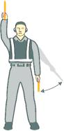
    *   **1.**

    *   **Einwinker!**
        Rechte Hand wird über Kopfhöhe angehoben, der Einwinkstab zeigt dabei
        nach oben; linker Einwinkstab zeigt nach unten und wird in Richtung
        Körper bewegt.

*    *        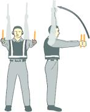
    *   **2.**

    *   **Bestimmen der Abstellposition!**
        Ausgestreckte Arme werden über den Kopf angehoben, beide Einwinkstäbe
        zeigen dabei nach oben.

*    *        
    *   **3.**

    *   **Zeichen des nächsten Einwinkers oder Anweisungen der
        Flugplatz-/Rollkontrolle beachten!**
        Beide Arme zeigen nach oben; Arme werden seitlich nach außen bewegt
        und ausgestreckt. Einwinkstäbe zeigen dabei in Richtung des nächsten
        Einwinkers oder in Richtung Rollfläche.

*    *        
    *   **4.**

    *   **Geradeaus!**
        Ausgestreckte Arme werden am Ellenbogen angewinkelt. Einwinkstäbe
        werden dabei von Brust- zu Kopfhöhe auf und ab bewegt.

*    *        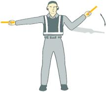
    *   **5a.**

    *   Nach links drehen!
        **(vom Piloten aus gesehen)**
        Rechter Arm und Einwinkstab werden seitlich waagerecht ausgestreckt,
        die linke Hand macht dabei ein „Vorwärts“ Zeichen; die Schnelligkeit
        der Bewegung des Zeichens weist den Piloten auf die erforderliche
        Drehgeschwindigkeit des Luftfahrzeugs hin.

*    *        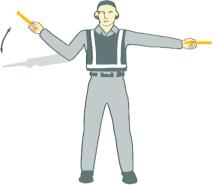
    *   **5b.**

    *   Nach rechts drehen!
        **(vom Piloten aus gesehen)**
        Linker Arm und Einwinkstab werden seitlich waagerecht ausgestreckt,
        die rechte Hand macht dabei ein „Vorwärts“ Zeichen; die Schnelligkeit
        der Bewegung des Zeichens weist den Piloten auf die erforderliche
        Drehgeschwindigkeit des Luftfahrzeugs hin.

*    *        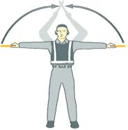
    *   **6a.**

    *   **Normaler Halt!**
        Beide Arme und Einwinkstäbe werden seitlich waagerecht ausgestreckt
        und langsam über den Kopf bewegt bis die Einwinkstäbe sich kreuzen.

*    *        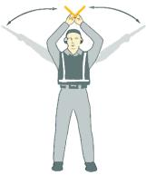
    *   **6b.**

    *   **Nothalt!**
        Beide Arme und Einwinkstäbe werden abrupt über den Kopf bewegt, die
        Einwinkstäbe werden dabei gekreuzt.

*    *        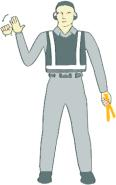
    *   **7a.**

    *   **Bremsen anziehen!**
        Die Hand wird mit geöffneter Handfläche knapp über Schulterhöhe
        angehoben. Sobald Augenkontakt mit der Flugbesatzung sichergestellt
        ist, wird die Hand zu einer Faust geschlossen. Die Bestätigung der
        Flugbesatzung (Daumen nach oben) ist abzuwarten.

*    *        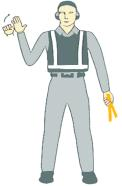
    *   **7b.**

    *   **Bremsen lösen!**
        Die Hand ist zur Faust geschlossen und wird knapp über Schulterhöhe
        angehoben. Sobald Augenkontakt mit der Flugbesatzung sichergestellt
        ist, wird die Handfläche geöffnet. Die Bestätigung der Flugbesatzung
        (Daumen nach oben) ist abzuwarten.

*    *        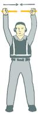
    *   **8a.**

    *   **Bremsklötze sind vorgelegt!**
        Beide Arme sind senkrecht über dem Kopf ausgestreckt. Einwinkstäbe in
        einer „stoßenden“ Bewegung nach innen führen, bis diese sich berühren.
        Erhalt                        der Bestätigung der Flugbesatzung muss
        sichergestellt                        sein.

*    *        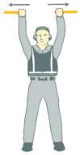
    *   **8b.**

    *   **Bremsklötze sind entfernt!**
        Beide Arme sind senkrecht über dem Kopf ausgestreckt. Einwinkstäbe mit
        einer „stoßenden“ Bewegung nach außen führen. Bremsklötze sind erst
        nach Genehmigung der Flugbesatzung zu entfernen.

*    *        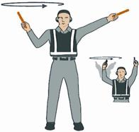
    *   **9.**

    *   **Triebwerk(e) anlassen!**
        Rechter Arm wird auf Kopfhöhe angehoben, der Einwinkstab zeigt dabei
        nach oben; mit kreisenden Bewegungen der Hand beginnen. Gleichzeitig
        wird mit dem über Kopfhöhe angehobenen linken Arm auf das anzulassende
        Triebwerk gezeigt.

*    *        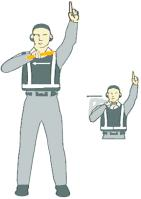
    *   **10.**

    *   **Triebwerke abstellen!**
        Arm und Einwinkstab werden vor dem Körper in Schulterhöhe
        ausgestreckt; Hand und Einwinkstab werden zum oberen Teil der linken
        Schulter bewegt und mit einer schneidenden Bewegung des Einwinkstabes
        vor der Kehle zum oberen Teil der rechten Schulter geführt.

*    *        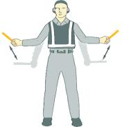
    *   **11.**

    *   **Langsamer!**
        Beide Arme werden seitlich ausgestreckt; die Einwinkstäbe werden
        langsam zwischen Hüft- und Kniehöhe auf und ab bewegt.

*    *        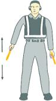
    *   **12.**

    *   **Triebwerkdrehzahl auf der angezeigten Seite verringern!**
        Beide Arme hängen mit nach unten gerichteten Einwinkstäben herab; dann
        entweder den rechten oder linken Einwinkstab auf und ab bewegen, je
        nachdem, ob die Drehzahl der Triebwerke auf der linken oder rechten
        Seite verringert werden soll.

*    *        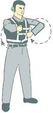
    *   **13.**

    *   **Rückwärts!**
        Beide Arme befinden sich in einer vorwärts rotierenden Bewegung vor
        dem Oberkörper. Zum Beenden der Rückwärts-Bewegung sind die Zeichen
        6a. oder 6b. zu verwenden.

*    *        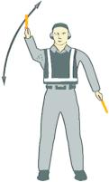
    *   **14a.**

    *   **Rückwärts rollen mit Drehung des Luftfahrzeughecks nach
        Steuerbord!**
        Linker Arm zeigt mit dem Einwinkstab nach unten, rechter Arm wird
        dabei aus der senkrechten Haltung über dem Kopf wiederholt in eine
        waagerechte Armhaltung nach vorn bewegt.

*    *        
    *   **14b.**

    *   **Rückwärts rollen mit Drehung des Luftfahrzeughecks nach Backbord!**
        Rechter Arm zeigt mit dem Einwinkstab nach unten, linker Arm wird
        dabei aus der senkrechten Haltung über dem Kopf wiederholt in eine
        waagerechte Armhaltung nach vorn bewegt.

*    *        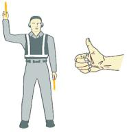
    *   **15.**

    *   **Bestätigung/Alles klar!**
        Rechter Arm wird auf Kopfhöhe angehoben, Einwinkstab zeigt dabei nach
        oben oder Daumen zeigt nach oben. Linker Arm verbleibt seitlich des
        Knies.

*    *        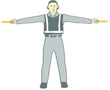
    *   **16.**

    *   **Schweben!**
        Beide Arme und Einwinkstäbe sind seitlich waagerecht ausgestreckt.

*    *        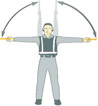
    *   **17.**

    *   **Steigen!**
        Beide Arme und Einwinkstäbe sind seitlich waagerecht mit nach oben
        zeigenden Handflächen ausgestreckt. Hände bewegen sich aufwärts; die
        Schnelligkeit der Bewegung zeigt die erforderliche
        Steiggeschwindigkeit an.

*    *        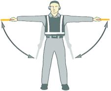
    *   **18.**

    *   **Sinken!**
        Beide Arme und Einwinkstäbe sind seitlich waagerecht mit nach unten
        zeigenden Handflächen ausgestreckt. Hände bewegen sich abwärts; die
        Schnelligkeit der Bewegung zeigt die erforderliche Sinkgeschwindigkeit
        an.

*    *        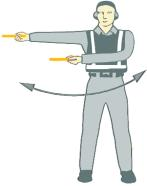
    *   **19a.**

    *   Horizontalbewegung nach links!
        **(vom Piloten aus gesehen)**
        Der rechte Arm wird seitlich waagerecht ausgestreckt, der andere Arm
        schwingt wiederholt in die gleiche Richtung.

*    *        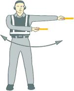
    *   **19b.**

    *   Horizontalbewegung nach rechts!
        **(vom Piloten aus gesehen)**
        Der linke Arm wird seitlich waagerecht ausgestreckt, der andere Arm
        schwingt wiederholt in die gleiche Richtung.

*    *        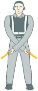
    *   **20.**

    *   **Landen!**
        Beide Arme werden mit nach unten gerichteten Einwinkstäben vor dem
        Körper gekreuzt.

*    *        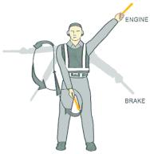
    *   **21.**

    *   **Feuer!**
        Rechter Einwinkstab wird in einer Achterbewegung von der Schulter zum
        Knie geführt, gleichzeitig zeigt der linke Einwinkstab auf den
        Brandherd.

*    *        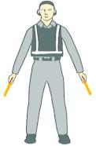
    *   **22.**

    *   **Position halten/Warten!**
        Beide Arme werden mit nach unten gerichteten Einwinkstäben in einem 45
        Grad Winkel seitlich ausgestreckt. Warten bis das Luftfahrzeug für die
        nächste Bewegung bereit ist.

*    *        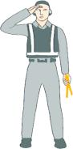
    *   **23.**

    *   **Luftfahrzeug freigegeben!**
        Mit rechter Hand und/oder Einwinkstab salutieren, um das Luftfahrzeug
        freizugeben. Augenkontakt mit der Flugbesatzung so lange beibehalten,
        bis das Luftfahrzeug zu rollen beginnt.

*    *        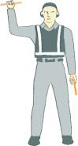
    *   **24.**

    *   Steuerung nicht bewegen!
        **(Zeichen der Technik/Instandhaltung)**
        Rechter Arm wird über dem Kopf ausgestreckt, dabei wird die Hand zur
        Faust geschlossen oder der Einwinkstab waagerecht gehalten. Linker Arm
        verbleibt seitlich des Knies.

*    *        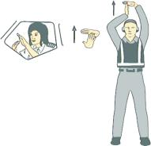
    *   **25.**

    *   Bodenstromversorgung anschließen!
        **(Zeichen der Technik/Instandhaltung)**
        Beide Arme werden ausgestreckt über dem Kopf gehalten. Linke Hand wird
        waagerecht geöffnet, die Fingerspitzen der rechten Hand werden in
        Richtung der linken Handfläche bewegt und berühren diese in Form eines
        „T“. Bei Dunkelheit können auch beleuchtete Einwinkstäbe zur Formung
        des „T“ verwendet werden.

*    *        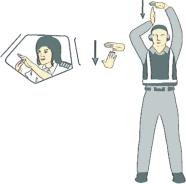
    *   **26.**

    *   Bodenstromversorgung trennen!
        **(Zeichen der Technik/Instandhaltung)**
        Beide Arme werden ausgestreckt über dem Kopf gehalten. Die
        Fingerspitzen der rechten Hand berühren die linke Handfläche in Form
        eines „T“. Die rechte Hand wird anschließend von der linken Hand
        wegbewegt.
        Die Bodenstromversorgung ist erst nach Genehmigung des Piloten zu
        trennen. Bei Dunkelheit können auch beleuchtete Einwinkstäbe zur
        Formung des „T“ verwendet werden.

*    *        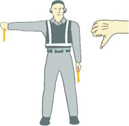
    *   **27.**

    *   Negativ!
        **(Zeichen der Technik/Instandhaltung)**
        Rechter Arm wird von der Schulter an waagerecht nach außen gestreckt.
        Einwinkstab wird nach unten gerichtet oder der Daumen zeigt nach
        unten. Linke Hand verbleibt seitlich des Knies.

*    *        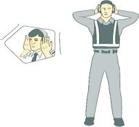
    *   **28.**

    *   Mittels Gegensprechanlage Kontakt aufnehmen!
        **(Zeichen der Technik/Instandhaltung)**
        Beide Arme werden waagerecht ausgestreckt, die Hände werden auf die
        Ohren gelegt.

*    *        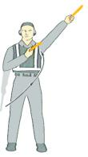
    *   **29.**

    *   **Öffnen/Schließen des Einstiegs!**
        **(Zeichen der Technik/Instandhaltung)**
        Rechter Arm befindet sich an der Körperseite, der linke Arm in einem
        45 Grad Winkel über Kopfhöhe. Rechter Arm wird in einer schwingenden
        Bewegung zum oberen Teil der linken Schulter geführt.

### § 8 Zeichen des Luftfahrzeugführers

(1) Dem Einwinker werden von dem Luftfahrzeugführer vom Führerraum des
Luftfahrzeugs aus Zeichen mit den Armen und Händen gegeben. Die
Zeichen müssen für den Einwinker klar erkennbar sein; wenn
erforderlich, ist bei der Zeichengebung eine Lichtquelle zu Hilfe zu
nehmen.

(2) Für die Bezeichnung von Triebwerken durch den Luftfahrzeugführer
gilt § 7 Abs. 3 entsprechend.

(3) Es werden folgende Zeichen gegeben:

1.
    a)  **Bremsen sind angezogen!**

        Der rechte oder linke Arm wird waagerecht vor dem Gesicht gehalten;
        die Finger der Hand sind ausgestreckt und werden zur Faust
        geschlossen.

    b)  **Bremsen sind gelöst!**

        Der rechte oder linke Arm wird waagerecht vor dem Gesicht gehalten;
        die Hand ist zur Faust geschlossen und wird geöffnet.

2.
    a)  **Bremsklötze vorlegen!**

        Die Arme werden seitlich ausgestreckt und mit den Handflächen nach
        außen vor dem Gesicht gekreuzt.

    b)  **Bremsklötze entfernen!**

        Die Arme werden vor dem Gesicht gekreuzt und mit den Handflächen nach
        außen seitlich ausgestreckt.

3.  **Fertig zum Anlassen der Triebwerke!**

    Die Anzahl der ausgestreckten Finger einer Hand gibt die entsprechende
    Nummer des anzulassenden Triebwerks an.

