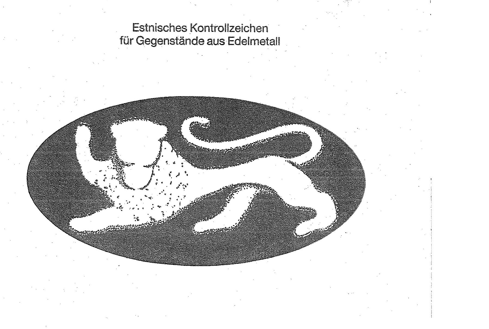
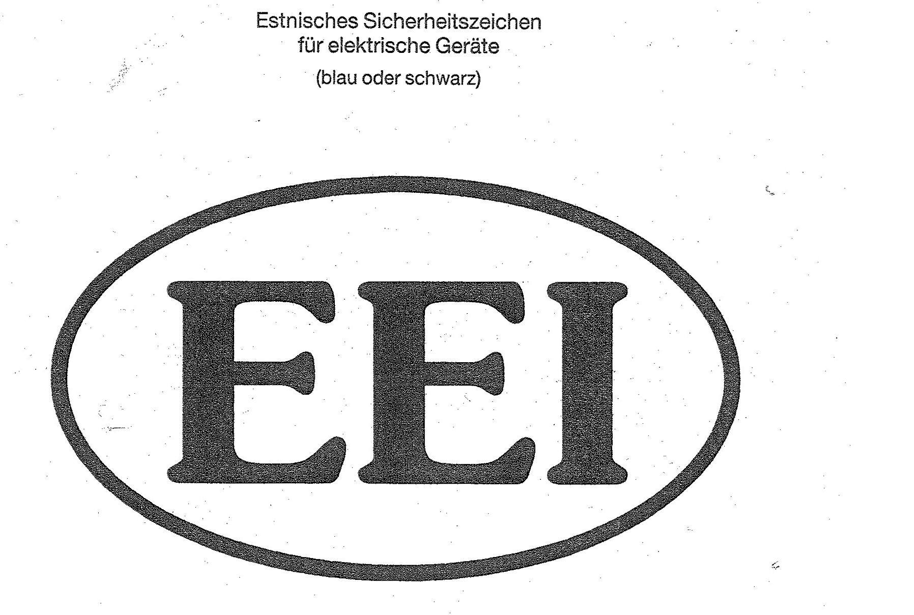

# Bekanntmachung zu § 8 des Markengesetzes (MarkenG§8Bek 95)

Ausfertigungsdatum
:   1995-11-21

Fundstelle
:   BGBl I: 1995, 1587

## (XXXX)

Auf Grund des § 8 Abs. 2 Nr. 7 des Markengesetzes vom 5. Oktober 1994
(BGBl. I S. 3082; 1995 I S. 156) werden die folgenden amtlichen Prüf-
und Gewährzeichen bekanntgemacht, die in der Republik Estland
eingeführt sind:

1.  Kontrollzeichen für Gegenstände aus Edelmetall (Anlage 1),

2.  Sicherheitszeichen für elektrische Geräte (Anlage 2).

Diese Bekanntmachung ergeht im Anschluß an die Bekanntmachung vom 13.
Dezember 1994 (BGBl. I S. 3920).

Bundesministerium der Justiz

## Anlage 1 Estnisches Kontrollzeichen für Gegenstände aus Edelmetall

Fundstelle: BGBl. I 1995, 1587)

## Anlage 2 Estnisches Sicherheitszeichen für elektrische Geräte (blau oder schwarz)

Fundstelle: BGBl. I 1995, 1588)

