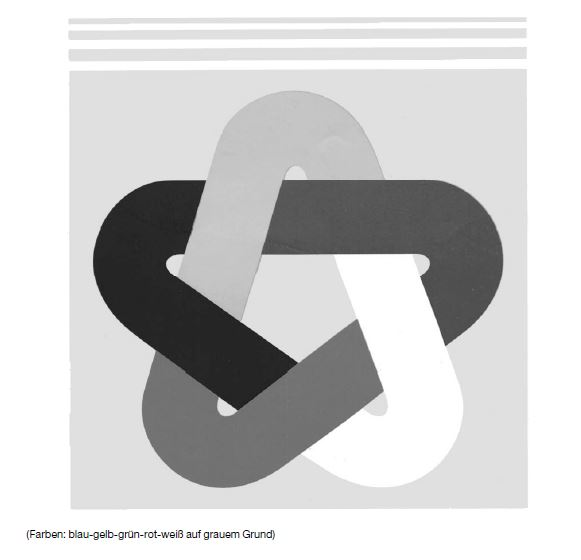

# Bekanntmachung zu § 8 des Markengesetzes (MarkenG§8Bek 98-09)

Ausfertigungsdatum
:   1998-09-23

Fundstelle
:   BGBl I: 1998, 3156

## (XXXX)

Auf Grund des § 8 Abs. 2 Nr. 8 des Markengesetzes vom 25. Oktober 1994
(BGBl. I S. 3082; 1995 I S. 156) wird bekanntgemacht, daß das neue
Kennzeichen der

*
    *
        *
            *   Andean Community Anlage)

von der Eintragung als Marke ausgeschlossen ist.
Diese Bekanntmachung ergeht im Anschluß an die Bekanntmachung vom 10.
Juli 1998 (BGBl. I S. 1870).

Bundesministerium der Justiz

## Anlage

Fundstelle: BGBl. I 1998, 3157)

## Andean Community

