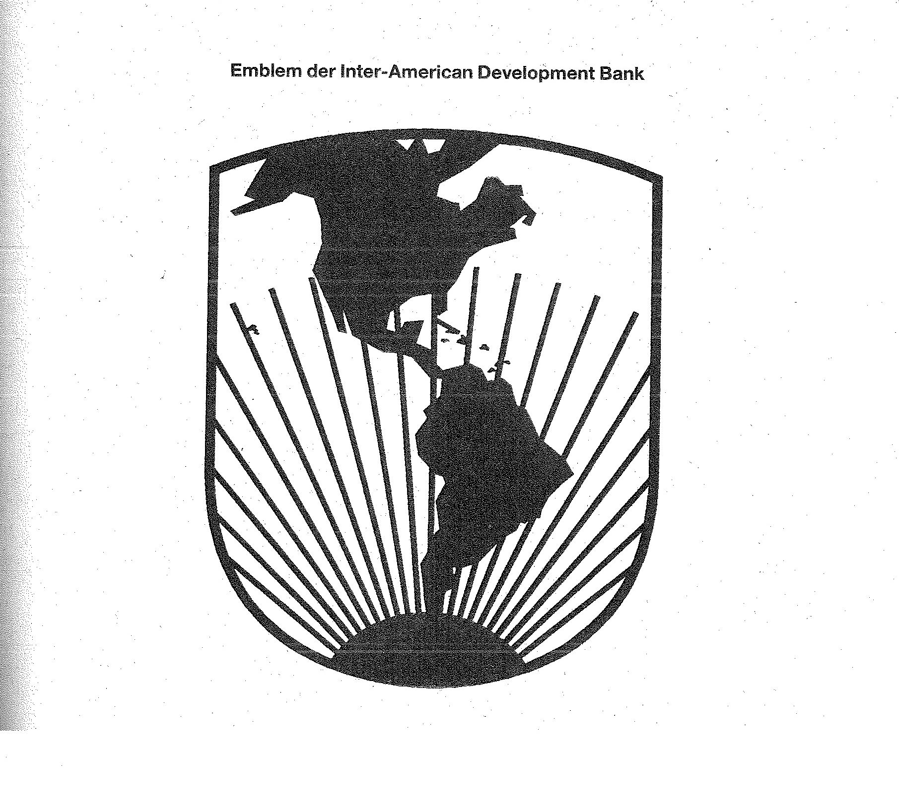

# Bekanntmachung zu § 8 des Markengesetzes (MarkenG§8Bek 99-05)

Ausfertigungsdatum
:   1999-05-21

Fundstelle
:   BGBl I: 1999, 1095

## (XXXX)

Auf Grund des § 8 Abs. 2 Nr. 8 des Markengesetzes vom 25. Oktober 1994
(BGBl. I S. 3082; 1995 I S. 156) wird bekanntgemacht, daß das
Kennzeichen der

*
    *
        *
            *   Inter-American Development Bank (Anlage)

von der Eintragung als Marke ausgeschlossen ist.
Diese Bekanntmachung ergeht im Anschluß an die Bekanntmachung vom 14.
April 1999 (BGBl. I S. 767).

Bundesministerium der Justiz

## Anlage Emblem der Inter-American Development Bank

Fundstelle: BGBl. I 1999, 1095)

