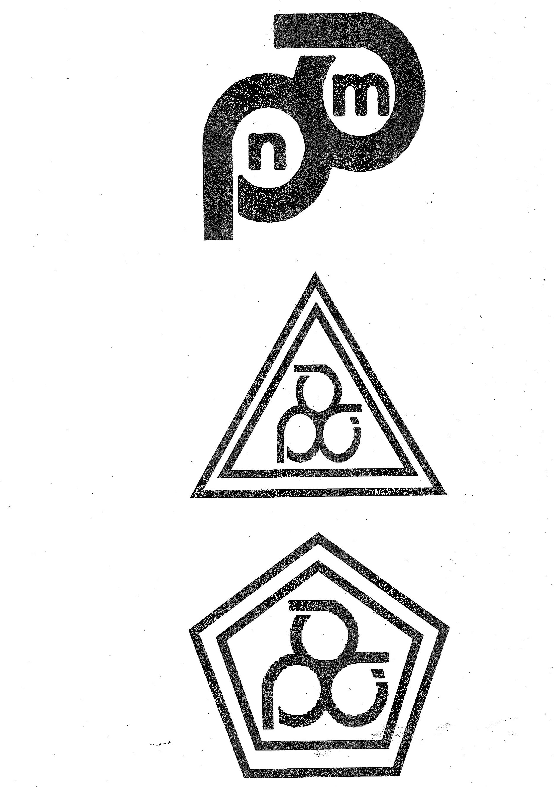
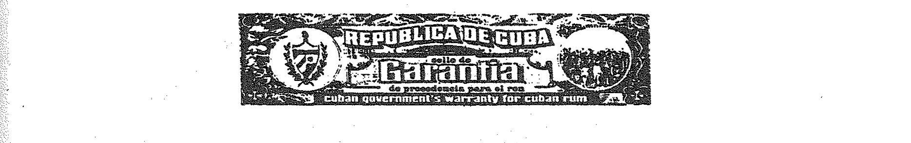

# Bekanntmachung zu § 8 des Markengesetzes (MarkenG§8Bek 99-07-20)

Ausfertigungsdatum
:   1999-07-20

Fundstelle
:   BGBl I: 1999, 1723

## (XXXX)

Auf Grund des § 8 Abs. 2 Nr. 7 des Markengesetzes vom 25. Oktober 1994
(BGBl. I S. 3082, 1995 I S. 156) wird bekanntgemacht, daß die
folgenden Prüf- und Gewährzeichen von der Eintragung als Marke
ausgeschlossen sind:

1.  Prüf- und Gewährzeichen des Königreichs Marokko (Anlage 1)

2.  Gewährzeichen der Republik Kuba für Rum (Anlage 2)

Diese Bekanntmachung ergeht im Anschluß an die Bekanntmachung vom 14.
April 1999 (BGBl. I S. 767).

Bundesministerium der Justiz

## Anlage 1

Fundstelle: BGBl. I 1999, 1724)

## Prüf- und Gewährzeichen des Königreichs Marokko

## Anlage 2

Fundstelle: BGBl. I 1999, 1725)

## Gewährzeichen der Republik Kuba für Rum

