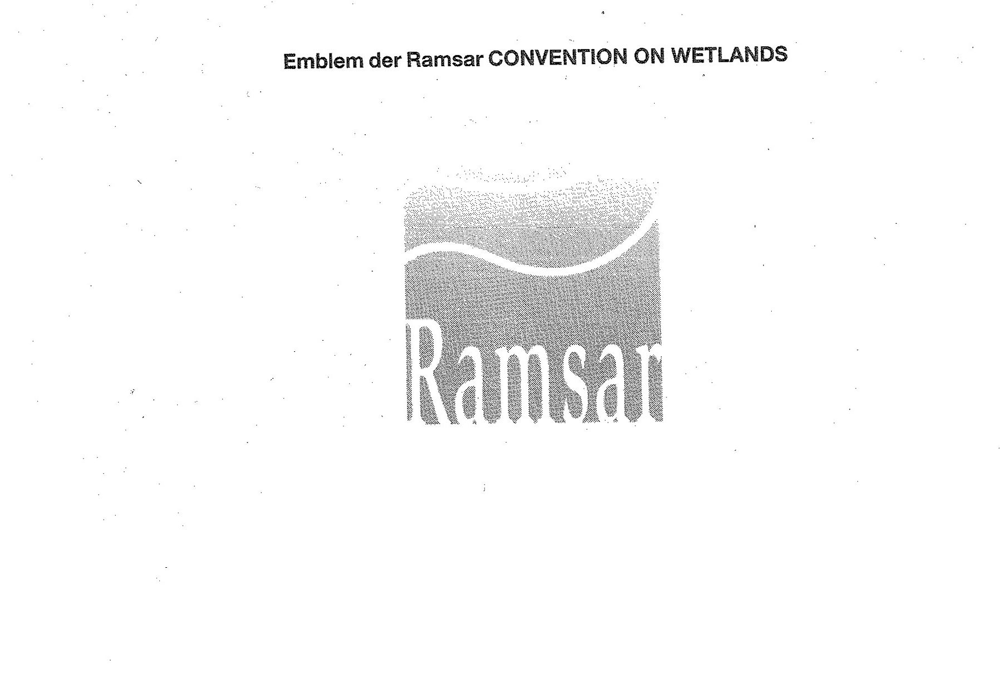

# Bekanntmachung zu § 8 des Markengesetzes (MarkenG§8Bek 99-07)

Ausfertigungsdatum
:   1999-07-15

Fundstelle
:   BGBl I: 1999, 1633

## (XXXX)

Auf Grund des § 8 Abs. 2 Nr. 8 des Markengesetzes vom 25. Oktober 1994
(BGBl. I S. 3082, 1995 I S. 156) wird bekanntgemacht, daß das
Kennzeichen der

*   "Ramsar CONVENTION ON WETLANDS" (Anlage)

von der Eintragung als Marke ausgeschlossen ist.
Diese Bekanntmachung ergeht im Anschluß an die Bekanntmachung vom 21.
Mai 1999 (BGBl. I S. 1095).

Bundesministerium der Justiz

## Anlage Emblem der Ramsar CONVENTION ON WETLANDS

(Fundstelle: BGBl. I 1999, 1633)

