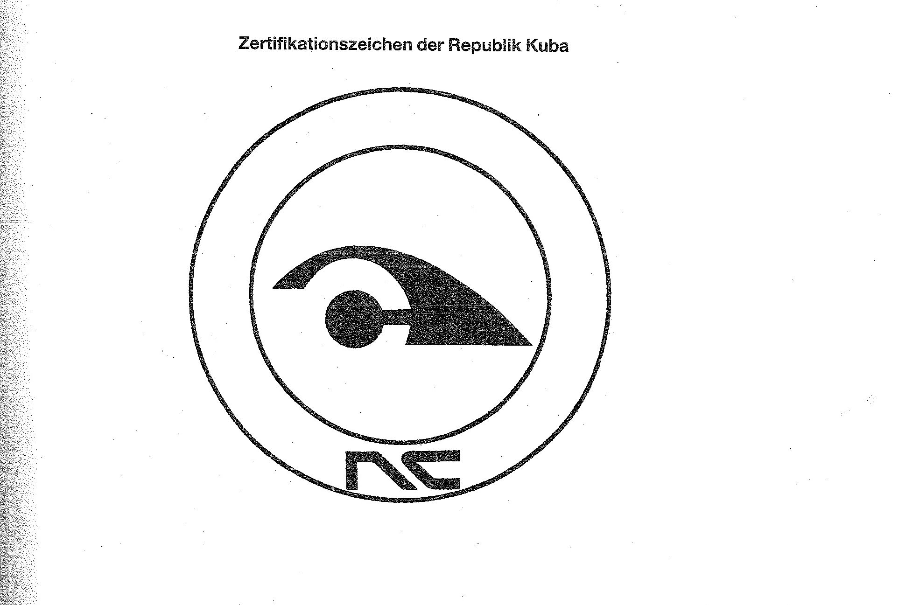

# Bekanntmachung zu § 8 des Markengesetzes (MarkenG§8Bek 99)

Ausfertigungsdatum
:   1999-04-14

Fundstelle
:   BGBl I: 1999, 767

## (XXXX)

Auf Grund des § 8 Abs. 2 Nr. 7 des Markengesetzes vom 25. Oktober 1994
(BGBl. I S. 3082, 1995 I S. 156), zuletzt geändert durch Artikel 5 des
Gesetzes vom 16. Juli 1998 (BGBl. I S. 1827), wird bekanntgemacht, daß
das folgende amtliche Prüf- und Gewährzeichen von der Eintragung als
Marke ausgeschlossen ist:

*
    *
        *   Zertifikationszeichen der Republik Kuba (Anlage).

Diese Bekanntmachung ergeht im Anschluß an die Bekanntmachung vom 27.
November 1998 (BGBl. I S. 3538).

Bundesministerium der Justiz

## Anlage Zertifikationszeichen der Republik Kuba

Fundstelle: BGBl. I 1999, 767)

