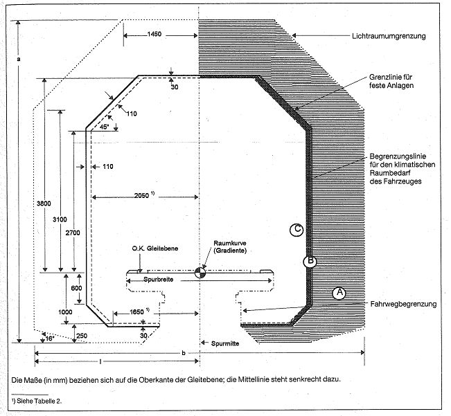
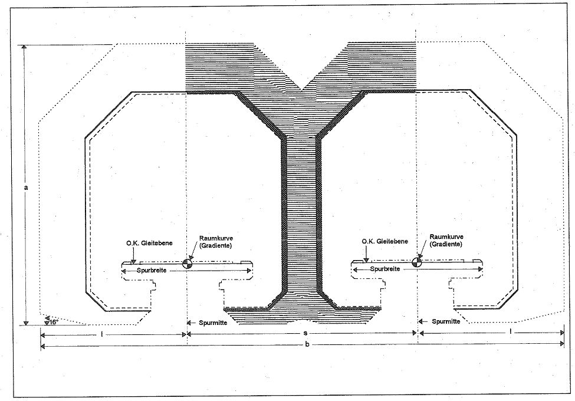
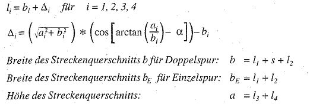
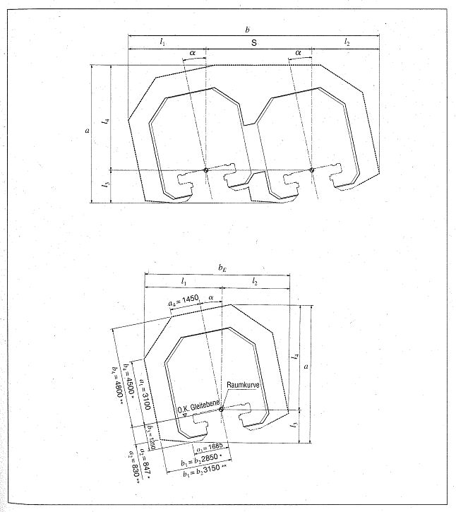

# Verordnung über den Bau und Betrieb der Magnetschwebebahnen (MbBO)

Ausfertigungsdatum
:   1997-09-23

Fundstelle
:   BGBl I: 1997, 2329

Diese Verordnung ist gemäß der Richtlinie 83/189/EWG über ein
Informationsverfahren auf dem Gebiet der Normen und technischen
Vorschriften notifiziert worden.

## Inhaltsverzeichnis

*    *
    *
    *   **Erster Abschnitt**

*    *
    *
    *
    *   **Allgemeines**

*    *   § 1

    *   Geltungsbereich

*    *   § 2

    *   Begriffsbestimmungen

*    *   § 3

    *   Allgemeine Anforderungen

*    *   § 4

    *   Betriebserlaubnis

*    *   § 5

    *   Ausnahmen

*    *   § 6

    *   Abnahmen

*    *   § 7

    *   Aufsicht

*    *   § 8

    *   Instandhaltung

*    *
    *
    *   **Zweiter Abschnitt**

*    *
    *
    *
    *   **Bauordnung**

*    *   § 9

    *   Bauaufsichtliche Genehmigung

*    *   § 10

    *   Baubeginn

*    *   § 11

    *   Bauaufsicht

*    *
    *
    *   **Dritter Abschnitt**

*    *
    *
    *
    *   **Betriebsanlagen**

*    *   § 12

    *   Fahrweg

*    *   § 13

    *   Linienführung

*    *   § 14

    *   Lichtraum

*    *   § 15

    *   Bahnsteige

*    *   § 16

    *   Überwachen der Betriebsanlagen

*    *
    *
    *   **Vierter Abschnitt**

*    *
    *
    *
    *   **Fahrzeuge**

*    *   § 17

    *   Grundsätze

*    *   § 18

    *   Ausrüstung

*    *   § 19

    *   Trag- und Führsystem

*    *   § 20

    *   Bremsen, Kupplung

*    *   § 21

    *   Überwachungsbedürftige Anlagen der Fahrzeuge

*    *
    *
    *   **Fünfter Abschnitt**

*    *
    *
    *
    *   **Fahrbetrieb**

*    *   § 22

    *   Fahrtvoraussetzungen

*    *   § 23

    *   Sicherheitskonzept

*    *   § 24

    *   Betriebshandbuch

*    *   § 25

    *   Störungen im Magnetschwebebahnbetrieb

*    *
    *
    *   **Sechster Abschnitt**

*    *
    *
    *
    *   **Personal**

*    *   § 26

    *   Betriebsbedienstete

*    *   § 27

    *   Bestellung des Betriebsleiters

*    *   § 28

    *   Stellung des Betriebsleiters

*    *
    *
    *   **Siebter Abschnitt**

*    *
    *
    *
    *   **Öffentliche Sicherheit**

*    *   § 29

    *   Benutzen und Betreten der Betriebsanlagen und Fahrzeuge

*    *   § 30

    *   Betriebsgefährdende Handlungen

*    *   § 31

    *   Tauglichkeit

*    *   § 32

    *   Ordnungswidrigkeiten

*    *
    *
    *   **Anlage**

*    *
    *
    *
    *   **Lichtraum**

## Erster Abschnitt - Allgemeines

### § 1 Geltungsbereich

Diese Verordnung gilt für den Bau und den Betrieb von
Magnetschwebebahnen.

### § 2 Begriffsbestimmungen

(1) Betrieb ist die Gesamtheit aller Maßnahmen, die der Beförderung
von Personen und Gütern dienen.

(2) Betriebsanlagen sind die dem Betrieb der Magnetschwebebahn sowie
seiner Abwicklung oder Sicherung dienenden Grundstücke, baulichen
Anlagen und Einrichtungen. Bauliche Anlagen sind Anlagen, die in einer
auf Dauer gerichteten Weise künstlich mit dem Erdboden verbunden sind.
Als bauliche Anlagen gelten auch Anlagen, die nach ihrem
Verwendungszweck dazu bestimmt sind, überwiegend ortsfest benutzt zu
werden, sowie

1.  Aufschüttungen und Abgrabungen,

2.  Lager, Abstell- und Aufstellplätze,

3.  Stellplätze,

4.  Sicherungsanlagen,

5.  Schalt- und Steuerungsanlagen und

6.  Anlagen zur Energiezuführung.

(3) Der Fahrweg ist der Teil der Betriebsanlagen, der dazu dient, die
vom Fahrzeug ausgehenden Einwirkungen, insbesondere aus Tragen,
Führen, Antreiben und Bremsen, aufzunehmen.

### § 3 Allgemeine Anforderungen

(1) Betriebsanlagen und Fahrzeuge müssen so beschaffen sein, daß sie
den Anforderungen der Sicherheit und Ordnung genügen. Diese
Anforderungen sind erfüllt, wenn die Betriebsanlagen und Fahrzeuge den
Vorschriften dieser Verordnung oder, soweit diese keine entsprechenden
Vorschriften enthält, den allgemein anerkannten Regeln der Technik
entsprechen. Weitergehende Anforderungen aus anderen
Rechtsvorschriften bleiben unberührt.

(2) Von den allgemein anerkannten Regeln der Technik darf abgewichen
werden, wenn mindestens die gleiche Sicherheit wie bei Beachtung
dieser Regeln nachgewiesen ist. Der Unternehmer hat den Nachweis
mindestens gleicher Sicherheit gegenüber dem Eisenbahn-Bundesamt zu
führen.

(3) Die öffentlichen Betriebsanlagen und die dem öffentlichen
Personenverkehr dienenden Fahrzeuge müssen so beschaffen sein, daß die
sichere und leichte Zugänglichkeit auch für Personen mit
Nutzungsschwierigkeiten, insbesondere Behinderte, alte Menschen und
Kinder, gewährleistet ist.

### § 4 Betriebserlaubnis

(1) Der Unternehmer darf den Fahrbetrieb auf einer Strecke erst
aufnehmen, wenn er für diese Strecke eine Betriebserlaubnis besitzt.

(2) Die Betriebserlaubnis erteilt das Eisenbahn-Bundesamt, wenn es die
Betriebsanlagen und die Fahrzeuge abgenommen, das Sicherheitskonzept
sowie die Grundsätze und Verfahren für die Aufstellung des
Instandhaltungsprogramms genehmigt hat, der Unternehmer das
Betriebshandbuch erstellt hat sowie die Systemsicherheit nachgewiesen
ist.

### § 5 Ausnahmen

(1) Das Eisenbahn-Bundesamt darf

1.  zu Versuchs- und Probezwecken von den Vorschriften dieser Verordnung,

2.  im Einzelfall aus besonderen Gründen von den Vorschriften des § 13
    Abs. 2 Satz 2, des § 15 Abs. 1 Satz 3 und des § 22 Abs. 3

Ausnahmen zulassen, wenn die Sicherheit auf andere Weise nachgewiesen
ist.

(2) Bei Fahrzeugen für Instandhaltungs- und Rettungszwecke auf dem
Fahrweg kann von Vorschriften dieser Verordnung abgewichen werden,
soweit diese Abweichungen für die Zweckbestimmung der Fahrzeuge
erforderlich sind.

### § 6 Abnahmen

(1) Neue und geänderte Betriebsanlagen und Fahrzeuge dürfen erst in
Betrieb genommen werden, wenn das Eisenbahn-Bundesamt sie abgenommen
hat. Dies gilt nicht für Änderungen, die sich nicht auf die
Betriebssicherheit auswirken können. Soweit erforderlich, führt das
Eisenbahn-Bundesamt vor der Abnahme von Fahrzeugen Fahrten durch.

(2) Die Abnahme weiterer Betriebsanlagen und Fahrzeuge, die mit einer
abgenommenen Betriebsanlage oder einem abgenommenen Fahrzeug
übereinstimmen, wird durch eine Konformitätsbescheinigung einer
Zertifizierungsstelle oder durch eine Konformitätserklärung eines vom
Eisenbahn-Bundesamt anerkannten Herstellers ersetzt.

(3) Die Abnahme weiterer Betriebsanlagen und Fahrzeuge, die in
unterschiedlicher Ausführung, aber nach einem bestimmten System und
aus bestimmten Bauteilen hergestellt werden sollen, wird durch eine
Typzulassung ersetzt; in der Typzulassung ist die zulässige
Veränderbarkeit festzulegen.

(4) Produkte aus anderen Mitgliedstaaten der Europäischen Union und
Ursprungswaren aus den anderen Vertragsstaaten des Abkommens über den
Europäischen Wirtschaftsraum, die nicht den in dieser Verordnung
genannten Bestimmungen entsprechen, werden einschließlich der im
Herstellerstaat durchgeführten Prüfungen und Überwachungen als
gleichwertig behandelt, wenn mit ihnen das geforderte Schutzniveau
gleichermaßen dauerhaft erreicht wird. Darüber entscheidet das
Eisenbahn-Bundesamt.

### § 7 Aufsicht

(1) Das Eisenbahn-Bundesamt kann zur Abwehr von Gefahren für die
Sicherheit des Magnetschwebebahnbetriebs sowie zur Abwehr von der
Magnetschwebebahn ausgehender Gefahren für die öffentliche Sicherheit
und zum Schutz vor schädlichen Umwelteinwirkungen im Sinne des Bundes-
Immissionsschutzgesetzes Verfügungen erlassen.

(2) Für die Überwachung der Einhaltung von Vorschriften des
technischen Arbeitsschutzes bei Magnetschwebebahnen ist das Eisenbahn-
Bundesamt zuständig, soweit diese Vorschriften den Betrieb von
Fahrzeugen und Anlage, die unmittelbar der Sicherstellung des
Betriebsablaufs dienen, betreffen. Zu diesen Anlagen gehören der
Fahrweg, die Sicherungs-, Schalt- und Steuerungsanlagen sowie die
Anlagen zur Energiezuführung. Die Aufgaben, Zuständigkeiten und
Befugnisse der Träger der gesetzlichen Unfallversicherung bleiben
unberührt.

(3) Das Eisenbahn-Bundesamt kann sich zur Vorbereitung seiner
Entscheidungen Sachverständiger und sachverständiger Stellen bedienen.

### § 8 Instandhaltung

(1) Der Unternehmer hat zur Aufrechterhaltung der Sicherheit
Betriebsanlagen und Fahrzeuge planmäßig instand zu halten. Art, Umfang
und Häufigkeit der Instandhaltungsmaßnahmen richten sich nach Zustand,
Beanspruchung und Bauart der Betriebsanlagen und Fahrzeuge.

(2) Die Instandhaltungsmaßnahmen sind vom Unternehmer in einem
Instandhaltungsprogramm festzulegen. Die Grundsätze und Verfahren für
die Aufstellung des Instandhaltungsprogramms hat der Unternehmer dem
Eisenbahn-Bundesamt zur Genehmigung vorzulegen.

(3) Der Unternehmer hat Nachweise über die Instandhaltung zu führen,
die Angaben über die durchgeführten Inspektionen, über den Ein- und
Ausbau sicherheitsrelevanter Austauschteile sowie über
sicherheitsrelevante Instandsetzungen enthalten müssen. Die
sicherheitsrelevanten Maßnahmen und Bauteile sind im
Instandhaltungsprogramm zu benennen. Die Nachweise sind mindestens
zwei Jahre, in jedem Fall mindestens über die Dauer zweier
Instandhaltungsintervalle, aufzubewahren.

(4) Das Instandhaltungsprogramm und die Nachweise über die
Instandhaltung sind dem Eisenbahn-Bundesamt auf Verlangen vorzulegen.

## Zweiter Abschnitt - Bauordnung

### § 9 Bauaufsichtliche Genehmigung

(1) Die Errichtung, die Änderung, der Abbruch oder die Veränderung der
Nutzung baulicher Anlagen bedürfen einer bauaufsichtlichen Genehmigung
durch das Eisenbahn-Bundesamt, soweit in Absatz 2 nichts anderes
bestimmt ist.

(2) Von der Genehmigungspflicht ausgenommen sind Vorhaben von
untergeordneter Bedeutung. Darunter fallen insbesondere bauliche
Anlagen, für die Festigkeitsberechnungen oder andere
Sicherheitsnachweise nicht erforderlich sind. Im Zweifelsfall
entscheidet das Eisenbahn-Bundesamt.

(3) Der Unternehmer hat dem Eisenbahn-Bundesamt alle für die Prüfung
der Baumaßnahme erforderlichen Unterlagen vorzulegen. Hierzu gehören
insbesondere Ausführungszeichnungen, Baustoffangaben, Lastannahmen
sowie sonstige, für die Beurteilung der Sicherheit wesentliche
Beschreibungen und Berechnungen.

(4) Die bauaufsichtliche Genehmigung ist zu erteilen, wenn der
Baumaßnahme keine bauordnungsrechtlichen Vorschriften dieses
Abschnitts entgegenstehen.

(5) Eine bauaufsichtliche Genehmigung erlischt, wenn innerhalb von
fünf Jahren nach Erteilung mit der Ausführung der Baumaßnahme nicht
begonnen oder wenn die Bauausführung ein Jahr unterbrochen worden ist.

### § 10 Baubeginn

Mit der Ausführung genehmigter Baumaßnahmen darf erst begonnen werden,
wenn

1.  die bauaufsichtliche Genehmigung zugestellt worden ist und

2.  der Unternehmer den Beginn der Bauarbeiten dem Eisenbahn-Bundesamt
    mindestens eine Woche vorher schriftlich angezeigt hat.

### § 11 Bauaufsicht

(1) Das Eisenbahn-Bundesamt hat bei der Errichtung, der Änderung, dem
Abbruch, der Nutzung, der Nutzungsänderung sowie der Instandhaltung
von baulichen Anlagen darüber zu wachen, daß die öffentlich-
rechtlichen Vorschriften und die auf Grund dieser Vorschriften
erlassenen Anordnungen eingehalten werden.

(2) Ist eine bauliche Anlage ohne die erforderliche bauaufsichtliche
Genehmigung errichtet worden, kann das Eisenbahn-Bundesamt

1.  die Beseitigung anordnen,

2.  die Nutzung untersagen oder

3.  die Räumung anordnen,

wenn ein rechtmäßiger Zustand nicht durch nachträgliche Genehmigung
hergestellt werden kann.

(3) Wird eine bauliche Anlage ohne die erforderliche bauaufsichtliche
Genehmigung errichtet, kann das Eisenbahn-Bundesamt die Stillegung der
Baustelle anordnen.

## Dritter Abschnitt - Betriebsanlagen

### § 12 Fahrweg

(1) Der Fahrweg muß so beschaffen sein, daß er den von außerhalb
anzunehmenden und den aus dem System auftretenden Einwirkungen
standhält.

(2) Bewegliche Fahrwegelemente, wie Weichen und Schiebebühnen, müssen
mit Einrichtungen versehen sein, die sicher melden,

1.  in welcher Lage sich die beweglichen Fahrwegelemente befinden und

2.  daß diese gegen Veränderung ihrer Lage gesichert sind.

(3) Der Fahrweg kann ein-, doppel- oder mehrspurig sein.

### § 13 Linienführung

(1) Die Linienführung des Fahrwegs soll fahrdynamisch günstig sein und
hohe Geschwindigkeiten zulassen.

(2) Die Längsneigung des Fahrwegs darf 100 v.T. nicht überschreiten.
In Bereichen, in denen stehende Fahrzeuge gegen unbeabsichtigte
Bewegungen zu sichern sind, sowie im Bahnsteigbereich dürfen
Längsneigungen von 5 v.T. nicht überschritten werden.

(3) Die Querneigung des Fahrwegs darf
12 Grad nicht überschreiten. Im Einzelfall kann das Eisenbahn-
Bundesamt eine Querneigung bis zu
16 Grad zulassen, wenn in diesem Fahrwegbereich ein Halt auf freier
Strecke in der Regel ausgeschlossen ist. Im Bahnsteigbereich sind im
stehenden Fahrzeug nicht mehr als
3,4 Grad Querneigung zulässig.

(4) Beim Befahren von Bogen darf die unausgeglichene
Seitenbeschleunigung des Fahrzeugs nach bogenaußen nicht mehr als
1,5 m/s(hoch)2, im Weichenbereich nicht mehr als
2,0 m/s(hoch)2, betragen.

(5) Die Beschleunigung und die Verzögerung des Fahrzeugs in
Längsrichtung dürfen
1,5 m/s(hoch)2 nicht überschreiten.

(6) Die Vertikalbeschleunigung des Fahrzeugs soll auf Kuppen
0,6 m/s(hoch)2 und in Wannen
1,2 m/s(hoch)2 nicht überschreiten.

(7) Höhengleiche Kreuzungen mit systemfremden Verkehrswegen sind nicht
zulässig; dies gilt nicht innerhalb von Instandhaltungs- und
Abstellanlagen.

### § 14 Lichtraum

Der in der Anlage dargestellte Lichtraum ist freizuhalten. Dies gilt
nicht für betriebsnotwendige Einrichtungen außerhalb des Teils des
Lichtraums, den ein Fahrzeug unter Berücksichtigung der horizontalen
und vertikalen Bewegungen sowie der Toleranzen des Fahrwegs und dessen
Linienführung beanspruchen kann. In diesen Teil des Lichtraums dürfen
Gegenstände nur während des Fahrgastwechsels sowie während des
Reinigens und der Instandhaltung von Fahrzeugen oder des Fahrwegs
hineinragen.

### § 15 Bahnsteige

(1) Die Ein- und Ausstiegsbereiche am Bahnsteig und Fahrzeug sind so
zu gestalten, daß ein sicherer Fahrgastwechsel gewährleistet ist. Der
Übergang zwischen Fahrzeug und Bahnsteig muß höhengleich sein. An der
Übergangsstelle ist eine Spaltbreite von höchstens 5 cm zulässig.

(2) Bahnsteige sind vom Fahrweg mit Wänden und Türen abzutrennen, die
den Einwirkungen aus dem Fahrbetrieb standhalten. Das Öffnen und
Schließen muß optisch und akustisch wahrnehmbar sein.

(3) Bahnsteigtüren dürfen erst dann zu öffnen sein, wenn ein Fahrzeug
positioniert, abgesetzt und geerdet am Bahnsteig steht. Dies gilt
nicht während der Durchführung von Instandhaltungsmaßnahmen und in
Notfällen. Bei geschlossenen Fahrzeug- und Bahnsteigtüren dürfen sich
keine Personen im Übergangsbereich zwischen Fahrzeug- und Bahnsteigtür
aufhalten können.

(4) Die Bahnsteigtüren müssen mit Einrichtungen versehen sein, die den
geschlossenen und verriegelten Zustand der Türen überwachen.

(5) Bahnsteige sind mit Notrufeinrichtungen auszurüsten, die
Gegensprechen ermöglichen. Über diese Notrufeinrichtungen muß während
der Betriebszeit ein Betriebsbediensteter ständig erreichbar sein.

(6) Bei der Gestaltung der Informationssysteme und Zugangswege ist auf
die Belange Behinderter angemessen Rücksicht zu nehmen.

### § 16 Überwachen der Betriebsanlagen

Der Unternehmer hat die Betriebsanlagen und deren Umfeld so zu
überwachen, daß Veränderungen, die zu Betriebsgefährdungen führen
können, rechtzeitig erkannt und Gegenmaßnahmen getroffen werden
können.

## Vierter Abschnitt - Fahrzeuge

### § 17 Grundsätze

(1) Fahrzeuge zur Personenbeförderung müssen so gebaut sein, daß auch
für Personen mit Nutzungsschwierigkeiten die sichere und leichte
Zugänglichkeit zu den Sitzplätzen und Serviceeinrichtungen möglich
ist; gesicherte Rollstuhlstellplätze sind vorzusehen.

(2) Die Einwirkungen des Fahrzeugs auf den Fahrweg dürfen die bei der
Fahrwegbemessung berücksichtigten Einwirkungen nicht überschreiten.

(3) Die Fahrzeuge müssen so gebaut sein, daß sie im Betrieb die
Begrenzungslinie für den kinematischen Raumbedarf des Fahrzeugs
(Anlage) nicht überschreiten.

(4) Die Fahrzeuge sind mit Einrichtungen zu versehen, die im Stand
eine Gefährdung von Personen durch elektrostatische Aufladung der
Fahrzeugaußenhaut verhindern. Die nach Ableitung verbleibende
elektrische Energie darf nicht höher sein als 350 mJ.

(5) Die Fahrzeuge müssen so gebaut und ausgerüstet sein, daß
Entstehung und Ausbreitung von Bränden erschwert werden. Insbesondere
müssen

1.  bei der konstruktiven Gestaltung und Ausrüstung die für
    Schienenfahrzeuge geltenden Anforderungen gemäß der höchsten
    Brandschutzstufe nach DIN 5510 Teil 1, Ausgabe Oktober 1988, beachtet
    werden,

2.  Fahrgasträume so beschaffen sein, daß ein systemeigener Brand nicht
    entstehen kann,

3.  beim Brand in einer Fahrzeugsektion die Personen in den anderen
    Fahrzeugsektionen bis zu ihrer Rettung, mindestens jedoch 30 Minuten,
    geschützt sein,

4.  die Fahrzeuge mit automatischen Brandmeldern und tragbaren
    Feuerlöschern ausgerüstet sein.

(6) Die Vorschrift des § 15 Abs. 6 gilt entsprechend.

### § 18 Ausrüstung

(1) Scheiben für Fenster, Türen, Wände und Spiegel müssen den
Anforderungen ann Sicherheitsglas genügen. & (2) Die Fahrzeuge zur
Personenbeförderung müssen

1.  mit Einrichtungen versehen sein, die ein Anfahren verhindern, bevor
    die Außentüren in geschlossener Stellung verriegelt sind, und den
    verriegelten Zustand der Außentüren während der Fahrt überwachen,

2.  im Stillstand eine Entriegelung der Außentüren zulassen,

3.  mit Notrufeinrichtungen ausgerüstet sein, mit denen eine
    Betriebszentrale im Gegensprechverkehr erreicht werden kann,

4.  mit Mitteln zur Leistung von Erster Hilfe ausgerüstet sein.

(3) Die Fahrzeuge müssen entsprechend dem Sicherheitskonzept
ausreichend Flucht- und Zugangsmöglichkeiten bieten.

### § 19 Trag- und Führsystem

Die Einrichtungen zum Tragen und Führen der Fahrzeuge müssen so
ausgelegt sein, daß eine sichere Spurführung gewährleistet wird.

### § 20 Bremsen, Kupplung

(1) Die Fahrzeuge müssen mit Bremsen ausgerüstet sein, die das
Fahrzeug sicher zum Halten bringen und im Stand festhalten können.

(2) Bei Fahrzeugen oder Fahrzeugsektionen, die miteinander verbunden
sind, müssen die Kupplungen so beschaffen sein, daß eine
unbeabsichtigte Trennung nicht möglich ist.

### § 21 Überwachungsbedürftige Anlagen der Fahrzeuge

(1) Druckbehälter und sonstige überwachungsbedürftige Anlagen im Sinne
des Gerätesicherheitsgesetzes, die mit dem Fahrzeug fest verbunden
sind, müssen nach einer zugelassenen Bauart ausgeführt sein.

(2) Die überwachungsbedürftigen Anlagen hat der Unternehmer vor
Inbetriebnahme sowie planmäßig wiederkehrend durch vom Eisenbahn-
Bundesamt anerkannte Sachverständige prüfen zu lassen. Es gelten die
gleichen Fristen, wie sie in den nach § 11 Abs. 1 des
Gerätesicherheitsgesetzes für überwachungsbedürftige Anlagen
aufgestellten Verordnungen festgelegt sind.

(3) Über die Prüfungen hat der Unternehmer Nachweise zu führen. Die
Nachweise sind mindestens für die Dauer der Nutzung aufzubewahren und
dem Eisenbahn-Bundesamt auf Verlangen vorzulegen.

## Fünfter Abschnitt - Fahrbetrieb

### § 22 Fahrtvoraussetzungen

(1) Fahrten sind nur zulässig, wenn

1.  die Fahrzeuge betriebsbereit sind,

2.  die Fahrzeuge den baulichen, betrieblichen und sicherungstechnischen
    Verhältnissen des Fahrwegs entsprechen,

3.  die erforderlichen Sicherungssysteme wirksam sind,

4.  der Fahrweg frei von erkennbaren Hindernissen ist und die beweglichen
    Fahrwegelemente richtig eingestellt sowie gegen Veränderung ihrer Lage
    gesichert sind,

5.  von ihnen sowie von anderen Fahrten oder nicht technisch gesicherten
    Fahrzeugbewegungen keine Gefährdung ausgeht,

6.  die Fahrzeuge und Betriebsanlagen mit den für die Durchführung des
    Betriebs erforderlichen Betriebsbediensteten besetzt sind,

7.  die Einrichtungen, die der Steuerung oder Überwachung des
    Betriebsablaufs dienen, jeweils mit mindestens zwei
    Betriebsbediensteten besetzt sind.

(2) Fahrten, bei denen die in Absatz 1 genannten Voraussetzungen nicht
vorliegen, sind zu Instandhaltungs- und Rettungszwecken zulässig, wenn
die Sicherheit auf andere Weise gewährleistet wird.

(3) Während des Fahrbetriebs muß in Betriebszentralen und Bahnhöfen
mindestens jeweils ein Betriebsbediensteter anwesend und erreichbar
sein, der Betriebs- und Rettungsmaßnahmen einleiten kann. Zwischen
einer Betriebszentrale und den Fahrzeugen muß eine ständige
Kommunikationsverbindung bestehen.

### § 23 Sicherheitskonzept

(1) Der Unternehmer hat ein Sicherheitskonzept aufzustellen und dem
Eisenbahn-Bundesamt zur Genehmigung vorzulegen.

(2) Das Sicherheitskonzept muß die Ermittlung und Bewertung aller
erkennbaren Sicherheitsrisiken nach Art, Häufigkeit und Auswirkungen
beschreiben und die daraus abgeleiteten baulichen, technischen,
betrieblichen und organisatorischen Sicherheitsmaßnahmen festlegen.

### § 24 Betriebshandbuch

(1) Der Unternehmer hat für die sichere Durchführung und Überwachung
des Fahrbetriebs ein Betriebshandbuch zu führen, das sowohl den
Normalbetrieb als auch davon abweichende Betriebszustände
berücksichtigt.

(2) Das Betriebshandbuch ist vor Betriebsaufnahme zu erstellen. Es ist
dem Eisenbahn-Bundesamt auf Verlangen vorzulegen. Das Eisenbahn-
Bundesamt kann Änderungen und Ergänzungen verlangen.

### § 25 Störungen im Magnetschwebebahnbetrieb

(1) Der Unternehmer hat Unfälle und sonstige gefährliche Ereignisse
unverzüglich dem Eisenbahn-Bundesamt gemäß Satz 2 zu melden. Dabei hat
er Zeit, Ort, Art und Umfang des Ereignisses mitzuteilen.

(2) Der Unternehmer hat Daten, die zur Aufklärung von Unfällen und
sonstigen gefährlichen Ereignissen erforderlich sind, aufzuzeichnen.
Dazu gehören Angaben über Ort, Zeit, Geschwindigkeit,
sicherheitsrelevante Bedienhandlungen und Systemzustände sowie
Meldungen zur Fahrtsicherung.

(3) Der Unternehmer hat die Aufzeichnungen nach Absatz 2 mindestens 5
Arbeitstage nach Meldung an das Eisenbahn-Bundesamt aufzubewahren und
diesem auf Verlangen vorzulegen.

## Sechster Abschnitt - Personal

### § 26 Betriebsbedienstete

(1) Der Unternehmer darf nur geeignete Betriebsbedienstete einsetzen.
Ihre fachliche Eignung und körperliche Tauglichkeit hat er mindestens
alle fünf Jahre zu überprüfen. Über die Untersuchungen, Prüfungen und
die Überwachung der Betriebsbediensteten hat der Unternehmer Nachweise
zu führen. Diese sind bis zum rechtswirksamen Ende der
Beschäftigungsdauer des Betriebsbediensteten aufzubewahren.

(2) Betriebsbediensteter ist, wer

1.  im Fahrbetrieb,

2.  bei der Steuerung oder Überwachung des Betriebsablaufs,

3.  als Verantwortlicher bei der Instandhaltung der Betriebsanlagen oder
    Fahrzeuge,

4.  als Leitender oder Aufsichtsführender über Betriebspersonal nach den
    Nummern 1 bis 3

tätig ist.

### § 27 Bestellung des Betriebsleiters

(1) Der Unternehmer hat zur Wahrnehmung der ihm nach dieser Verordnung
obliegenden Aufgaben unbeschadet seiner eigenen Verantwortlichkeit
einen Betriebsleiter zu bestellen. Er hat für diesen mindestens einen
Stellvertreter zu bestellen.

(2) Die Bestellung des Betriebsleiters und seiner Stellvertreter
bedarf der Bestätigung durch das Eisenbahn-Bundesamt.

(3) Der Unternehmer hat sicherzustellen, daß der Betriebsleiter die
ihm obliegenden Aufgaben ordnungsgemäß erfüllen kann. Entscheidungen,
die die Betriebssicherheit betreffen, bedürfen der Zustimmung des
Betriebsleiters.

(4) Zum Betriebsleiter oder Stellvertreter des Betriebsleiters kann
nur eine natürliche Person bestellt werden, die die erforderliche
Fachkunde besitzt, zuverlässig ist und berufliche Erfahrung vorweisen
kann.

(5) Die erforderliche Fachkunde besitzt, wer ein Studium an einer
deutschen Hochschule in einem für den Bau und Betrieb der
Magnetschwebebahn wesentlichen Fachbereich durch Prüfung erfolgreich
abgeschlossen hat oder wer einen gleichwertigen Prüfungsabschluß an
einer anderen Hochschule nachweisen kann.

### § 28 Stellung des Betriebsleiters

Der Betriebsleiter ist neben dem Unternehmer für die sichere
Durchführung des Betriebs verantwortlich.

## Siebter Abschnitt - Öffentliche Sicherheit

### § 29 Benutzen und Betreten der Betriebsanlagen und Fahrzeuge

Betriebsanlagen und Fahrzeuge dürfen nur zum allgemeinen
Verkehrsgebrauch betreten und benutzt werden. Dies gilt nicht für
Personen, denen der Unternehmer ein Betretungsrecht eingeräumt hat.

### § 30 Betriebsgefährdende Handlungen

Es ist verboten, Sicherheitseinrichtungen mißbräuchlich zu betätigen,
ein Fahrthindernis zu bereiten oder andere betriebsstörende oder
betriebsgefährdende Handlungen vorzunehmen.

### § 31 Tauglichkeit

Betriebsbediensteten, die infolge des Einflusses alkoholischer
Getränke oder anderer berauschender Mittel oder infolge geistiger oder
körperlicher Mängel in der Wahrnehmung ihrer Aufgaben behindert sind,
ist es verboten, im sicherheitsrelevanten Betriebsbereich tätig zu
werden.

### § 32 Ordnungswidrigkeiten

Ordnungswidrig im Sinne des § 12 Abs. 1 Nr. 4 des Allgemeinen
Magnetschwebebahngesetzes handelt, wer vorsätzlich oder fahrlässig

1.  entgegen § 4 Abs. 1 den Fahrbetrieb aufnimmt,

2.  entgegen § 6 Abs. 1 Satz 1 eine Betriebsanlage oder ein Fahrzeug in
    Betrieb nimmt,

3.  ohne Genehmigung nach § 9 Abs. 1 eine bauliche Anlage errichtet,
    ändert, abbricht oder die Nutzung verändert,

4.  entgegen § 16 eine Betriebsanlage oder deren Umfeld nicht oder nicht
    in der vorgeschriebenen Weise überwacht,

5.  entgegen § 21 Abs. 2 eine überwachungsbedürftige Anlage nicht oder
    nicht rechtzeitig prüfen läßt,

6.  entgegen § 25 Abs. 1 Satz 1 eine Meldung nicht, nicht richtig, nicht
    vollständig oder nicht rechtzeitig macht,

7.  entgegen § 25 Abs. 2 Satz 1 Daten nicht aufzeichnet,

8.  entgegen § 25 Abs. 3 eine Aufzeichnung nicht oder nicht mindestens 5
    Arbeitstage aufbewahrt oder nicht oder nicht rechtzeitig vorlegt,

9.  entgegen § 29 Satz 1 eine Betriebsanlage oder ein Fahrzeug betritt
    oder benutzt,

10. entgegen § 30 eine Einrichtung betätigt, ein Fahrthindernis bereitet
    oder eine andere betriebsstörende oder betriebsgefährdende Handlung
    vornimmt oder

11. entgegen § 31 im sicherheitsrelevanten Betriebsbereich tätig wird.

### Anlage (zu § 14)

(Fundstelle: BGBl. I 1997, 2329 - 2337)

**Bild 1: Lichtraum beim einspurigen Fahrweg in der Geraden und in
Bogen von 350 m und mehr**

Bereich A: Zulässig sind Einragungen von baulichen Anlagen, wenn es
der Magnetschwebebahnbetrieb erfordert (z.B. Bahnsteige, Weichen,
Rettungsstege), sowie Einragungen bei Bauarbeiten, wenn die
erforderlichen Sicherheitsmaßnahmen getroffen sind.
Bereiche B (Raumbedarf für Toleranzen des Fahrwegs und dessen
Linienführung) und C (Kinematischer Raumbedarf des Fahrzeugs):
Zulässig sind Einragungen nur während des Fahrgastwechsels sowie
während des Reinigens und der Instandhaltung von Fahrzeugen.
Zu Bild 1
Tabelle 1: Geschwindigkeitsabhängige Maß des Lichtraums

*    *   Fahrzeuggeschwindigkeit

    *   bis 300
        [km/h]

    *   bis 400
        [km/h]

    *   bis 500
        [km/h]

*    *   halbe Lichtraumbreite I

    *   2,85 m

    *   2,85 m

    *   3,15 m

*    *   Breite des Streckenquerschnitts b

    *   5,70 m

    *   5,70 m

    *   6,30 m

*    *   Mindesthöhe a

    *   5,75 m

    *   5,75 m

    *   6,05 m

Tabelle 2: Vergrößerung des Abstands der Begrenzungslinie für
kinematischen Raumbedarf des Fahrzeugs im Gleisbogen mit Radien von
350 m bis 3500 m

*    *   Bogenradius

    *   Erforderliche Vergrößerung der halben Breitenmaße des von der
        Begrenzungslinie umschlossenen Raumes

*    *   an der Bogeninnenseite

    *   an der Bogenaußenseite

*    *   m

    *   mm

*    *   von 350 m bis 3500 m

    *   0

    *   60

Spurbreite ist der Abstand zwischen den beiden Außenflächen der
Seitenführschienen einer Spur; das Grundmaß beträgt für Bahnen des
öffentlichen Verkehrs 2800 mm mit einer zulässigen Abweichung von ± 2
mm.

**Bild 2: Lichtraum beim doppelspurigen Fahrweg in der Geraden und in
Bogen von 350 m und mehr**

Zu Bild 2
Tabelle 1: Geschwindigkeitsabhängige Maße des Lichtraums

*    *   Fahrzeuggeschwindigkeit

    *   bis 300
        [km/h]

    *   bis 400
        [km/h]

    *   bis 500
        [km/h]

*    *   Spurmittenabstand s

    *   4,40 m

    *   4,80 m

    *   5,10 m

*    *   halbe Lichtraumbreite I einer Spur

    *   2,85 m

    *   2,85 m

    *   3,15 m

*    *   Breite des Streckenquerschnitts b

    *   10,10 m

    *   10,50 m

    *   11,40 m

*    *   Mindesthöhe a

    *   5,75 m

    *   5,75 m

    *   6,05

**Bild 3: Lichtraum beim geneigten ein- und doppelspurigen Fahrweg**

Berechnung der Breite des Streckenquerschnitts für Doppelspur b und
Einzelspur b
E              sowie der Höhe des Streckenquerschnitts a in
Abhängigkeit von der Querneigung α:
Das geschwindigkeitsabhängige Maß des Spurmittenabstands und die
Vergrößerung des Abstands der Begrenzungslinie an der Bogenaußenseite
in Gleisbogen mit einem Radius von 350 m bis 3500 m sind der Tabelle 1
zu Bild 2 sowie der Tabelle 2 zu Bild 1 zu entnehmen.

