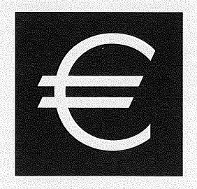

# Verordnung über die Herstellung und den Vertrieb von Medaillen und Münzstücken zum Schutz deutscher Euro-Gedenkmünzen (MedaillenV)

Ausfertigungsdatum
:   2005-10-31

Fundstelle
:   BGBl I: 2005, 3117

## Eingangsformel

Auf Grund des § 10 des Münzgesetzes, der durch Artikel 6 Nr. 2 des
Gesetzes vom 14. September 2005 (BGBl. I S. 2746) neu gefasst worden
ist, verordnet das Bundesministerium der Finanzen:

## § 1 Begriffsbestimmungen

Im Sinne dieser Verordnung ist oder sind:

1.  "Euro-Zeichen" das in der Anlage abgebildete und beschriebene Zeichen
    für den Euro,

2.  "Medaillen" und "Münzstücke" Metallgegenstände, die das Aussehen oder
    die technischen Eigenschaften einer deutschen Euro-Gedenkmünze im
    Sinne des § 2 Abs. 1 Nr. 1 des Münzgesetzes haben, keine Münzrohlinge
    sind und nicht aufgrund des Münzgesetzes, der währungsrechtlichen
    Vorschriften anderer Staaten oder der von den Europäischen
    Gemeinschaften erlassenen Rechtsvorschriften ausgeprägt und in den
    Verkehr gebracht werden,

3.  "Silber" eine silberhaltige Legierung mit mehr als 90 Prozent Silber,

4.  "Platin" eine platinhaltige Legierung mit mehr als 20 Prozent Platin,

5.  "Referenzspanne" ein Durchmesser von 26 Millimeter bis 35 Millimeter,

6.  "Münzzeichen" der Kennbuchstabe für die Prägestätte.

## § 2 Verbote

Vorbehaltlich der §§ 3 und 4 dürfen Medaillen und Münzstücke nicht
hergestellt, verkauft, eingeführt oder zum Verkauf oder zu anderen
kommerziellen Zwecken verbreitet werden, wenn sie

1.  die Aufschrift "Euro" oder "Euro Cent" oder eine ähnliche Aufschrift
    oder das Euro-Zeichen oder ein diesem ähnliches Zeichen tragen,

2.  das Bundeswappen oder ein diesem zum Verwechseln ähnliches Wappen, den
    Bundesadler oder einen diesem zum Verwechseln ähnlichen Adler tragen,

3.  ein Münzbild tragen, das einem Münzbild einer gültigen deutschen Euro-
    Gedenkmünze entspricht oder ähnelt,

4.  eine Rändelung haben, die der einer deutschen Euro-Gedenkmünze
    entspricht oder ähnelt,

5.  eine Randschrift tragen, die nicht nur Stempelzeichen ist und nicht
    nur den Namen oder die Firma des Herstellers oder den Namen des
    Preisträgers angibt,

6.  mit einem Münzzeichen versehen sind oder

7.  einen Durchmesser haben, der innerhalb der Referenzspanne liegt.

## § 3 Ausnahmen

(1) Medaillen und Münzstücke, die die Aufschrift "Euro" oder "Euro
Cent" oder eine ähnliche Aufschrift oder das Euro-Zeichen oder ein
diesem ähnliches Zeichen, aber keinen Nennwert tragen, sind von dem
Verbot des § 2 Nr. 1 ausgenommen, wenn ihr Durchmesser 19 Millimeter
unterschreitet oder 35 Millimeter überschreitet.

(2) Medaillen und Münzstücke, die ein auf einer deutschen Euro-
Gedenkmünze befindliches Münzbild oder eine Randschrift tragen, sind
von dem Verbot des § 2 Nr. 3 und 5 ausgenommen, wenn ihr Durchmesser
35 Millimeter überschreitet.

(3) Medaillen und Münzstücke, deren Durchmesser innerhalb der
Referenzspanne liegt, sind von dem Verbot des § 2 Nr. 7 ausgenommen,
wenn

1.  sich in ihrer Mitte ein über 6 Millimeter großes Loch befindet,

2.  sie von ovaler, elliptischer oder drei- bis sechseckiger geometrischer
    Form sind,

3.  sie aus Silber oder Platin hergestellt sind oder

4.  sie eine Stärke von weniger als 5 Prozent oder mehr als 12 Prozent
    ihres Durchmessers haben.

(4) Medaillen und Münzstücke, die eine Randschrift tragen und deren
Durchmesser innerhalb der Referenzspanne liegt, sind von dem Verbot
des § 2 Nr. 5 und 7 ausgenommen, wenn sie für ein fremdes
Währungsgebiet hergestellt und unmittelbar ausgeführt werden.

## § 4 Bereits hergestellte Medaillen und Münzstücke

Medaillen und Münzstücke, die vor dem 5. November 2005 hergestellt
worden sind, dürfen auch dann verkauft, eingeführt oder zum Verkauf
oder anderen kommerziellen Zwecken verbreitet werden, wenn sie den
Vorgaben der Verordnung über die Herstellung und den Vertrieb von
Medaillen und Marken vom 13. Dezember 1974 (BGBl. I S. 3520), zuletzt
geändert durch die Verordnung vom 27. August 2001 (BGBl. I S. 2286),
entsprechen.

## § 5 Ordnungswidrigkeiten

Ordnungswidrig im Sinne des § 12 Abs. 2 des Münzgesetzes handelt, wer
entgegen § 2 eine Medaille oder ein Münzstück herstellt, verkauft,
einführt oder zum Verkauf oder zu anderen kommerziellen Zwecken
verbreitet.

## § 6 Inkrafttreten

Diese Verordnung tritt am Tag nach der Verkündung in Kraft.

(zu § 1 Nr. 1)

## Anlage Erscheinungsbild des Euro-Zeichens

