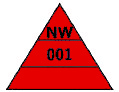

# Verordnung über das Inverkehrbringen und die Bereitstellung von Messgeräten auf dem Markt sowie über ihre Verwendung und Eichung (MessEV)

Ausfertigungsdatum
:   2014-12-11

Fundstelle
:   BGBl I: 2014, 2010, 2011

Zuletzt geändert durch
:   Art. 15 G v. 12.5.2021 I 1087

Änderung durch
:   Art. 1 V v. 26.10.2021 I 4742 (Nr. 76) textlich nachgewiesen, dokumentarisch noch nicht abschließend bearbeitet

Diese Verordnung dient der Umsetzung

1.  der Richtlinie 71/317/EWG des Rates vom 26. Juli 1971 zur Angleichung
    der Rechtsvorschriften der Mitgliedstaaten über Blockgewichte der
    mittleren Fehlergrenzenklasse von 5 bis 50 Kilogramm und über
    zylindrische Gewichtsstücke der mittleren Fehlergrenzenklasse von 1
    Gramm bis 10 Kilogramm (ABl. L 202 vom 6.9.1971, S. 14), die durch
    Artikel 3 der Richtlinie 2011/17/EU vom 9. März 2011 (ABl. L 71 vom
    18\.3.2011, S. 1) mit Wirkung vom 1. Dezember 2015 aufgehoben wird,

2.  der Richtlinie 71/347/EWG des Rates vom 12. Oktober 1971 zur
    Angleichung der Rechtsvorschriften der Mitgliedstaaten über die
    Messung der Schüttdichte von Getreide (ABl. L 239 vom 25.10.1971, S.
    1), die durch die Richtlinie 2006/96/EG des Rates vom 20. November
    2006 zur Anpassung bestimmter Richtlinien im Bereich freier
    Warenverkehr anlässlich des Beitritts Bulgariens und Rumäniens (ABl. L
    363 vom 20.12.2006, S. 81) geändert worden ist und die durch Artikel 2
    der Richtlinie 2011/17/EU vom 9. März 2011 (ABl. L 71 vom 18.3.2011,
    S. 1) mit Wirkung vom 1. Dezember 2015 aufgehoben wird,

3.  der Richtlinie 74/148/EWG des Rates vom 4. März 1974 zur Angleichung
    der Rechtsvorschriften der Mitgliedstaaten über Wägestücke von 1 mg
    bis 50 kg von höheren Genauigkeitsklassen als der mittleren
    Genauigkeit (ABl. L 84 vom 28.3.1974, S. 3), die durch Artikel 3 der
    Richtlinie 2011/17/EU vom 9. März 2011 (ABl. L 71 vom 18.3.2011, S. 1)
    mit Wirkung vom 1. Dezember 2015 aufgehoben wird,

4.  der Richtlinie 75/33/EWG des Rates vom 17. Dezember 1974 zur
    Angleichung der Rechtsvorschriften der Mitgliedstaaten über
    Kaltwasserzähler (ABl. L 14 vom 20.1.1975, S. 1), die durch Artikel 22
    der Richtlinie 2004/22/EG des Europäischen Parlaments und des Rates
    vom 31. März 2004 über Messgeräte (ABl. L 135 vom 30.4.2004, S. 1)
    geändert worden ist und die durch Artikel 2 der Richtlinie 2011/17/EU
    vom 9. März 2011 (ABl. L 71 vom 18.3.2011, S. 1) mit Wirkung vom 1.
    Dezember 2015 aufgehoben wird,

5.  der Richtlinie 76/765/EWG des Rates vom 27. Juli 1976 zur Angleichung
    der Rechtsvorschriften der Mitgliedstaaten über Alkoholometer und
    Aräometer für Alkohol (ABl. L 262 vom 27.9.1976, S. 143), die durch
    die Richtlinie 82/624/EWG der Kommission vom 1. Juli 1982 (ABl. L 252
    vom 27.8.1982, S. 8) geändert worden ist und die durch Artikel 2 der
    Richtlinie 2011/17/EU vom 9. März 2011 (ABl. L 71 vom 18.3.2011, S. 1)
    mit Wirkung vom 1. Dezember 2015 aufgehoben wird,

6.  der Richtlinie 76/766/EWG des Rates vom 27. Juli 1976 zur Angleichung
    der Rechtsvorschriften der Mitgliedstaaten über Alkoholtafeln (ABl. L
    262 vom 27.9.1976, S. 149), die durch Artikel 2 der Richtlinie
    2011/17/EU vom 9. März 2011 (ABl. L 71 vom 18.3.2011, S. 1) mit
    Wirkung vom 1. Dezember 2015 aufgehoben wird,

7.  der Richtlinie 86/217/EWG des Rates vom 26. Mai 1986 zur Angleichung
    der Rechtsvorschriften der Mitgliedstaaten über Luftdruckmessgeräte
    für Kraftfahrzeugreifen (ABl. L 152 vom 6.6.1986, S. 48), die durch
    Artikel 2 der Richtlinie 2011/17/EU vom 9. März 2011 (ABl. L 71 vom
    18\.3.2011, S. 1) mit Wirkung vom 1. Dezember 2015 aufgehoben wird,

8.  der Richtlinie 2004/22/EG des Europäischen Parlaments und des Rates
    vom 31. März 2004 über Messgeräte (ABl. L 135 vom 30.4.2004, S. 1),
    die zuletzt durch Artikel 26 Absatz 1 Buchstabe g der Verordnung (EU)
    Nr. 1025/2012 des Europäischen Parlaments und des Rates vom 25.
    Oktober 2012 zur europäischen Normung, zur Änderung der Richtlinien
    89/686/EWG und 93/15/EWG des Rates sowie der Richtlinien 94/9/EG,
    94/25/EG, 95/16/EG, 97/23/EG, 98/34/EG, 2004/22/EG, 2007/23/EG,
    2009/23/EG und 2009/105/EG des Europäischen Parlaments und des Rates
    und zur Aufhebung des Beschlusses 87/95/EWG des Rates und des
    Beschlusses Nr. 1673/2006/EG des Europäischen Parlaments und des Rates
    (ABl. L 316 vom 14.11.2012, S. 12) geändert worden ist und die durch
    Artikel 52 der Richtlinie 2014/32/EU des Europäischen Parlaments und
    des Rates vom 26. Februar 2014 zur Harmonisierung der
    Rechtsvorschriften der Mitgliedstaaten über die Bereitstellung von
    Messgeräten auf dem Markt (ABl. L 96 vom 29.3.2014, S. 149) mit
    Wirkung vom 20. April 2016 aufgehoben wird,

9.  der Richtlinie 2009/23/EG des Europäischen Parlaments und des Rates
    vom 23. April 2009 über nichtselbsttätige Waagen (ABl. L 122 vom
    16\.5.2009, S. 6), die durch Artikel 26 Absatz 1 Buchstabe i der
    Verordnung (EU) Nr. 1025/2012 (ABl. L 316 vom 14.11.2012, S. 12)
    geändert worden ist und die durch Artikel 45 der Richtlinie 2014/31/EU
    des Europäischen Parlaments und des Rates vom 26. Februar 2014 zur
    Angleichung der Rechtsvorschriften der Mitgliedstaaten über die
    Bereitstellung nichtselbsttätiger Waagen auf dem Markt (ABl. L 96 vom
    29\.3.2014, S. 107) mit Wirkung vom 20. April 2016 aufgehoben wird,

10. der Richtlinie 2009/34/EG des Europäischen Parlaments und des Rates
    vom 23. April 2009 betreffend gemeinsame Vorschriften über Messgeräte
    sowie über Mess- und Prüfverfahren (ABl. L 106 vom 28.4.2009, S. 7),

11. der Richtlinie 2011/17/EG des Europäischen Parlaments und des Rates
    vom 9. März 2011 zur Aufhebung der Richtlinien 71/317/EWG, 71/347/EWG,
    71/349/EWG, 74/148/EWG, 75/33/EWG, 76/765/EWG, 76/766/EWG und
    86/217/EWG des Rates über das Messwesen (ABl. L 71 vom 18.3.2011, S.
    1),

12. der Richtlinie 2014/31/EU des Europäischen Parlaments und des Rates
    vom 26. Februar 2014 zur Angleichung der Rechtsvorschriften der
    Mitgliedstaaten betreffend die Bereitstellung nichtselbsttätiger
    Waagen auf dem Markt (ABl. L 96 vom 29.3.2014, S. 107),

13. der Richtlinie 2014/32/EU des Europäischen Parlaments und des Rates
    vom 26. Februar 2014 zur Harmonisierung der Rechtsvorschriften der
    Mitgliedstaaten über die Bereitstellung von Messgeräten auf dem Markt
    (ABl. L 96 vom 29.3.2014, S. 149).

## Abschnitt 1 - Anwendungsbereich, Ausnahmen, Begriffsbestimmungen

### § 1 Anwendungsbereich für Messgeräte und Teilgeräte

(1) Das Mess- und Eichgesetz vom 25. Juli 2013 (BGBl. I S. 2722) in
der jeweils geltenden Fassung und diese Verordnung sind auf Messgeräte
anzuwenden, die zu den in Absatz 2 und Absatz 3 genannten Zwecken
verwendet werden sollen, und die zumindest eine der folgenden
Messgrößen bestimmen sollen:

1.  Länge oder Kombinationen von Längen zur Längen- oder
    Flächenbestimmung,

2.  Masse,

3.  Temperatur,

4.  Druck,

5.  Volumen,

6.  Messgrößen bei der Lieferung von Elektrizität,

7.  Wärmemenge (Wärme und Kälte in Kreislaufsystemen),

8.  Dichte oder Massenanteil oder Massenkonzentration oder
    Volumenkonzentration von Flüssigkeiten,

9.  Dichte oder Massenanteil oder Massenkonzentration oder
    Volumenkonzentration von anderen Medien als Flüssigkeiten, sofern
    dadurch Folgendes bestimmt werden soll:

    a)  der Feuchtegehalt von Getreide und Ölfrüchten,

    b)  die Schüttdichte von Getreide,

    c)  der Atemalkoholgehalt,

    d)  der Fettgehalt von Milcherzeugnissen,

    e)  der Muskelfleischanteil von Schweineschlachtkörpern,

10. sonstige Messgrößen bei der Lieferung von strömenden Flüssigkeiten
    oder strömenden Gasen,

11. Schalldruckpegel und daraus abgeleitete Messgrößen,

12. Messgrößen im öffentlichen Verkehr, sofern dies folgenden Zwecken
    dient:

    a)  der amtlichen Überwachung des öffentlichen Verkehrs,

    b)  der Ermittlung des Beförderungsentgelts in Taxen,

    c)  der Ermittlung des Entgelts bei Mietkraftfahrzeugen, wenn das Entgelt
        nach gefahrener Wegstrecke berechnet wird,

13. Dosis ionisierender Strahlung, sofern es sich um die nachfolgend
    genannten Messgeräte zur Ermittlung der Dosis durch Photonenstrahlung
    handelt, der Energienenngebrauchsbereich der Messgeräte ganz oder
    teilweise in den Photonenenergiebereich von 0,005 bis 7
    Megaelektronvolt fällt und der Messbereich zur Ermittlung der Dosis
    ionisierender Strahlung ganz oder teilweise innerhalb der
    nachfolgenden Grenzen liegt:

    a)  Personendosimeter zwischen 10 Mikrosievert und 10 Sievert zur
        Bestimmung der Personendosis,

    b)  ortsveränderliche Ortsdosimeter zwischen 0,1 Mikrosievert durch Stunde
        und 10 Sievert durch Stunde zur Bestimmung der Ortsdosisleistung und
        zwischen 0,1 Mikrosievert und 10 Sievert zur Bestimmung der Ortsdosis,

    c)  ortsfeste Ortsdosimeter zwischen 0,1 Mikrosievert durch Stunde und 100
        Sievert durch Stunde zur Bestimmung der Ortsdosisleistung und zwischen
        0,1 Mikrosievert und 10 Sievert zur Bestimmung der Ortsdosis,

    d)  Diagnostikdosimeter zwischen 1 Mikrogray und 0,3 Gray zur Bestimmung
        der Luftkerma und zwischen 0,1 Mikrogray durch Sekunde und 10
        Milligray durch Sekunde zur Bestimmung der Luftkermaleistung oder
        oberhalb von 5 Mikrogray mal Meter zur Bestimmung des Luftkerma-
        Längenprodukts.

(2) Die in Absatz 1 Nummer 1 bis 12 genannten Messgeräte unterfallen
vorbehaltlich des Satzes 2 dem Mess- und Eichgesetz und dieser
Verordnung, wenn sie bestimmt sind

1.  zur Verwendung im geschäftlichen oder amtlichen Verkehr,

2.  zur Bestimmung der Masse bei Analysen in medizinischen Laboratorien,

3.  zur Bestimmung der Masse, des Volumens, des Drucks, der Temperatur und
    der Dichte bei

    a)  der Herstellung von Arzneimitteln in Apotheken auf Grund ärztlicher
        Verschreibung oder

    b)  Analysen in pharmazeutischen Laboratorien,

4.  zur Bestimmung der Masse bei der Ausübung der Heilkunde beim Wiegen
    von Patienten aus Gründen der ärztlichen Überwachung, Untersuchung und
    Behandlung oder

5.  zur Bestimmung des Reifendrucks von Kraftfahrzeugreifen in Betrieben
    des Kraftfahrzeuggewerbes oder an Tankstellen und
    Kraftfahrzeugpflegestellen, soweit diese der Allgemeinheit zugänglich
    sind.

Messgeräte zur Bestimmung der Temperatur oder des Drucks im
geschäftlichen Verkehr unterfallen dem Mess- und Eichgesetz und dieser
Verordnung nur, wenn die Bestimmung der Temperatur oder des Drucks der
Ermittlung anderer Messgrößen dient.

(3) Die in Absatz 1 Nummer 13 genannten Messgeräte unterfallen dem
Mess- und Eichgesetz und dieser Verordnung nur, wenn das Verwenden
derartiger Messgeräte

1.  nach dem Strahlenschutzgesetz oder nach den auf dessen Grundlage
    erlassenen Rechtsverordnungen vorgeschrieben ist,

2.  zur Messung der Ortsdosisleistung nach den Vorschriften über die
    Beförderung gefährlicher Güter erfolgt oder

3.  zur amtlichen Überwachung der in Nummer 1 und 2 genannten Verwendungen
    erfolgt.

Die in Absatz 1 Nummer 13 genannten Messgeräte unterfallen dem Mess-
und Eichgesetz und dieser Verordnung nicht, wenn sie

1.  im Geschäftsbereich des Bundesministeriums der Verteidigung verwendet
    werden,

2.  für Zwecke der Verteidigung bestimmt sind und

3.  die Messrichtigkeit auf andere Weise gewährleistet ist.

(4) Das Mess- und Eichgesetz und diese Verordnung sind anzuwenden auf
Medizinprodukte im Sinne des Artikels 2 Nummer 1 der Verordnung (EU)
2017/745 des Europäischen Parlaments und des Rates vom 5. April 2017
über Medizinprodukte, zur Änderung der Richtlinie 2001/83/EG, der
Verordnung (EG) Nr. 178/2002 und der Verordnung (EG) Nr. 1223/2009 und
zur Aufhebung der Richtlinien 90/385/EWG und 93/42/EWG des Rates (ABl.
L 117 vom 5.5.2017, S. 1; L 117 vom 3.5.2019, S. 9; L 334 vom
27\.12.2019, S. 165), die durch die Verordnung (EU) 2020/561 (ABl. L
130 vom 24.4.2020, S. 18) geändert worden ist, in der jeweils
geltenden Fassung, wenn es sich bei diesen Medizinprodukten handelt um

1.  nichtselbsttätige Waagen oder

2.  Messgeräte zur Bestimmung der Dosis ionisierender Strahlung, soweit
    diese in Absatz 1 Nummer 13 in Verbindung mit Absatz 3 geregelt sind.

(5) Sofern die Voraussetzungen der Absätze 2 und 3 gegeben sind,
unterliegen nachfolgend genannte Teilgeräte dem Mess- und Eichgesetz
und dieser Verordnung:

1.  Mengenumwerter im Sinne des § 8 Absatz 1 Nummer 2 Buchstabe b für
    Messgeräte zur Bestimmung von Messgrößen von strömenden Gasen,

2.  Temperaturfühlerpaare, Rechenwerke oder Durchflusssensoren für
    Wärmezähler im Sinne des § 8 Absatz 1 Nummer 4 oder für Kältezähler,

3.  Wegstreckensignalgeber für Taxameter einschließlich
    Wegstreckensignalgeber in Kraftfahrzeugen und für Wegstreckenzähler in
    Miet-Kraftfahrzeugen,

4.  Temperaturfühler und Anzeige- und Auswertegeräte für tragbare
    Elektrothermometer mit austauschbaren Temperaturfühlern,

5.  Drucksensoren für Messgeräte zur Bestimmung sonstiger Messgrößen bei
    der Lieferung von Gasen,

6.  externe Sonden zur Messung der Ortsdosis und der Ortsdosisleistung für
    Ortsdosimeter gemäß Absatz 1 Nummer 13 Buchstabe b und c.

### § 2 Ausnahmen vom Anwendungsbereich für einzelne Messgeräte

Das Mess- und Eichgesetz und diese Verordnung sind nicht auf
Messgeräte anzuwenden, bei denen es im Hinblick auf das
Schutzbedürfnis der Betroffenen nicht erforderlich ist, die
gesetzlichen Vorschriften zur Gewährleistung der Messrichtigkeit und
Messsicherheit anzuwenden. Diese Geräte sind in Anlage 1 im Einzelnen
benannt.

### § 3 Anwendungsbereich für sonstige Messgeräte

Die Vorschriften des Mess- und Eichgesetzes und dieser Verordnung über
sonstige Messgeräte sind anzuwenden auf nichtselbsttätige Waagen,
soweit diese Waagen nicht zur Verwendung im geschäftlichen oder
amtlichen Verkehr oder zur Durchführung von Messungen im öffentlichen
Interesse bestimmt sind.

### § 4 Vom Anwendungsbereich ausgenommene Zusatzeinrichtungen

Das Mess- und Eichgesetz und diese Verordnung sind nicht anzuwenden
auf folgende Zusatzeinrichtungen, die über rückwirkungsfreie
Schnittstellen an Messgeräte angeschlossen werden:

1.  Zusatzeinrichtungen, die für Zwecke verwendet werden, für die nach dem
    Mess- und Eichgesetz und nach dieser Verordnung das Verwenden dem
    Mess- und Eichgesetz entsprechender Messgeräte nicht vorgeschrieben
    ist,

2.  Tarifschaltuhren an Messgeräten für die Abgabe von Elektrizität, Gas,
    Wasser oder Wärme, deren Stand und deren eingestellte Schaltzeiten bei
    geschlossenem Gehäuse erkennbar sind,

3.  Zeitgeber für Maximumzähler, für Rundsteueranlagen und für
    Belastungsmessgeräte für Versorgungsleistungen,

4.  Tonfrequenzrundsteuerempfänger,

5.  Münzwerke zur Steuerung der Abgabe von Elektrizität, Gas, Wasser oder
    Wärme,

6.  Zusatzeinrichtungen, die im Direktverkauf zur zusätzlichen Angabe von
    Messwerten und Preisen verwendet werden, wenn das zugehörige Messgerät
    oder eine zum Messgerät gehörende andere dem Mess- und Eichgesetz und
    dieser Verordnung unterliegende Zusatzeinrichtung die ermittelten
    Messwerte und zugehörigen Grund- und Verkaufspreise unverändert
    abdruckt oder abspeichert und dies dem Käufer zugänglich ist,

7.  Zusatzeinrichtungen an Messgeräten, die bei der Herstellung und
    Analyse von Arzneimitteln verwendet werden,

8.  Quittungsdrucker für Taxameter und Wegstreckenzähler.

Satz 1 Nummer 7 ist nicht für Zusatzeinrichtungen an nicht
selbsttätigen Waagen anzuwenden.

### § 5 Vom Anwendungsbereich ausgenommene Verwendungen

(1) Auf Messgeräte oder Messwerte, die im geschäftlichen Verkehr
verwendet werden, sind das Mess- und Eichgesetz und diese Verordnung
nicht anzuwenden

1.  zur Ermittlung von leitungsgebundenen Leistungen

    a)  in Erdöl- und Erdgasgewinnungsanlagen, die nur zur verhältnismäßigen
        Aufteilung einer Liefermenge auf verschiedene Geschäftspartner dienen,

    b)  für Wasser, wenn Messgeräte zur Messung erforderlich sind, die
        zumindest für einen maximalen Durchfluss von 2 000 Kubikmeter pro
        Stunde ausgelegt sind,

    c)  für Flüssigkeiten außer Wasser, wenn Messgeräte zur Messung
        erforderlich sind, die zumindest für einen maximalen Durchfluss von
        600 Kubikmeter pro Stunde ausgelegt sind,

    d)  für die Mengenmessung von Brenngasen, wenn Messgeräte zur Messung
        erforderlich sind, die zumindest für einen maximalen Durchfluss von
        150 000 Kubikmeter pro Stunde im Normzustand ausgelegt sind,

    e)  für Brenngase mit Brennwerten unter 6,5 Kilowattstunden pro
        Kubikmeter, die unter einem Überdruck von weniger als 3 bar stehen,
        oder für Druckluft oder andere Gase außer für Brenngase, wenn Lieferer
        und Empfänger die Liefermenge unabhängig voneinander messen oder die
        Messgeräte durch fachkundiges Personal von Lieferer und Empfänger
        gemeinsam überwacht werden,

    f)  für Elektrizität mit einer höchsten dauernd zulässigen
        Betriebsspannung von mindestens 123 Kilovolt oder bei einer
        Nennstromstärke von mehr als 5 Kiloampere,

    g)  für die Wärmemenge, zu deren Bestimmung Messgeräte in Form von Kälte-
        oder Wärmezählern erforderlich sind, die zumindest für eine
        Nennleistung von 10 Megawatt ausgelegt sind;

    wird die Abgabe von leitungsgebundenen Leistungen an einen Partner mit
    mehreren Messgeräten in einer Messstation ermittelt, so sind die
    genannten maximalen Durchflusswerte auf die Summe der Maximalwerte der
    einzelnen Messgeräte anzuwenden,

2.  bei der Abgabe von Beton

    a)  zur Bestimmung der Dichte von Beton,

    b)  zur Bestimmung des Volumens von Beton,

3.  beim Ausschank von

    a)  Mischgetränken, die unmittelbar vor dem Ausschank aus mehr als zwei
        Getränken gemischt werden oder deren wesentlicher Bestandteil eine
        gefrorene oder halbgefrorene Flüssigkeit ist,

    b)  Kaffee-, Tee-, Kakao- oder Schokoladengetränken,

    c)  schäumenden Getränken, sofern nichtdurchsichtige Ausschankmaße
        verwendet werden und gewährleistet ist, dass auf Verlangen des Kunden
        in seiner Anwesenheit die Füllmenge mittels eines Umfüllmaßes
        überprüft wird und er auf diese Möglichkeit deutlich sichtbar
        hingewiesen wird,

4.  bei Schiffen, um die Masse der Ladung und das Volumen des Wassers zu
    bestimmen, das durch die Schiffe verdrängt wird,

5.  in landwirtschaftlichen Betrieben zur Ermittlung der Mengen flüssiger
    oder verflüssigter Düngemittel, wenn es sich um nichtstationäre
    Volumenmessanlagen handelt,

6.  in Betrieben des Kraftfahrzeuggewerbes oder an öffentlichen
    Tankstellen zur Bestimmung des Volumens oder der Masse von Schmier-
    oder Getriebeöl, Bremsflüssigkeit, Kältemittel für Klimaanlagen,
    Frostschutzmittel oder Scheibenwaschwasser,

7.  in Sammelfahrzeugen für Altöl zur Ermittlung der Menge aufgenommenen
    Altöls,

8.  im Vermessungswesen, wenn Messgeräte verwendet werden, die den
    Vorschriften des öffentlichen Vermessungswesens entsprechen,

9.  in der Bundeswehr und in anderen in Deutschland befindlichen
    Streitkräften anderer Nationen bei der Ermittlung von Leistungen, die
    zwischen Streitkräften verschiedener Nationen ausgetauscht werden,

10. in gemeinnützigen Sportvereinen zur Bestimmung von Leistungen, die der
    Ausübung des Vereinszwecks dienen, sofern die Leistungen zum
    Selbstkostenpreis abgegeben werden und ein gut sichtbarer Hinweis auf
    die Ausnahme vom Mess- und Eichgesetz und von dieser Verordnung vor
    der Vornahme der Leistung gegeben ist,

11. zur Ermittlung von Leistungen, die einen Betrag von 5 Euro je
    Geschäftsvorgang nicht überschreiten, soweit der Verwender glaubhaft
    machen kann, dass ein Jahresumsatz von nicht mehr als 2 000 Euro mit
    Leistungen erwirtschaftet wird, die durch entsprechende Messgeräte
    ermittelt werden; die Regelung gilt nicht für Ausschankmaße; die
    vorgenannten Werte für Geschäftsvorgang und Jahresumsatz verändern
    sich alle drei Jahre entsprechend der Preisentwicklung; die
    Physikalisch-Technische Bundesanstalt veröffentlicht hierzu im
    Bundesanzeiger jeweils im März des darauf folgenden Jahres die anhand
    der durchschnittlichen Veränderung des Verbraucherpreisindexes für
    Deutschland für die abgelaufenen drei Kalenderjahre ermittelten
    Beträge.

Satz 1 Nummer 1 Buchstabe d ist nicht für Messgeräte anzuwenden, die
an ein Brennwert- oder Gasbeschaffenheitsrekonstruktionssystem
angeschlossen sind, dessen Verwendung dem Mess- und Eichgesetz und
dieser Verordnung unterfällt oder die zur Bestimmung von Messgrößen
nach § 25 Satz 1 Nummer 4 verwendet werden.

(2) Im amtlichen Verkehr sind das Mess- und Eichgesetz und diese
Verordnung nicht anzuwenden,

1.  im öffentlichen Vermessungswesen oder im Markscheidewesen,

2.  auf als Normale verwandte Geräte oder Prüfungshilfsmittel der für den
    Vollzug des Mess- und Eichgesetzes zuständigen Behörden oder staatlich
    anerkannten Prüfstellen,

3.  auf Messgeräte zur Bestimmung des Atemalkoholgehalts, sofern sie
    ausschließlich zu Vortestzwecken verwendet werden,

4.  bei der Bestimmung von Messgrößen im Zusammenhang mit Alkohol, wenn
    die verwendeten Messgeräte geprüft und beglaubigt werden nach dem
    Alkoholsteuergesetz vom 21. Juni 2013 (BGBl. I S. 1650, 1651), das
    zuletzt durch Artikel 6 des Gesetzes vom 10. März 2017 (BGBl. I S.
    420) geändert worden ist, in der jeweils geltenden Fassung und seinen
    Ausführungsbestimmungen,

5.  für steuerliche Zwecke, um die Menge von Alkohol oder Alkohol-Wasser-
    Mischungen zu erfassen,

6.  für sonstige Messungen nach dem Zoll- und Steuerrecht,

7.  zur Erstattung von Gutachten für staatsanwaltschaftliche oder
    gerichtliche Verfahren, für Schiedsverfahren oder für andere amtliche
    Zwecke,

8.  bei der Verwendung von Messgeräten für die Abgasuntersuchung von
    Kraftfahrzeugen für die amtliche Überwachung des öffentlichen
    Verkehrs,

9.  zur Durchführung sonstiger öffentlicher Überwachungsaufgaben.

Die Ausnahmen gemäß Satz 1 Nummer 6, 7 und 9 sind nur anwendbar, wenn

1.  in anderer Weise als nach dem Mess- und Eichgesetz und dieser
    Verordnung sichergestellt ist, dass das Verwenden der Messgeräte zu
    einer genaueren Bestimmung von Messwerten führt als dies mit einem für
    den Verwendungszweck geeigneten Messgerät, das dem Mess- und
    Eichgesetz entspricht, erreicht wird und die metrologische Rückführung
    des auszunehmenden Messgeräts gewährleistet ist; die Regelung ist
    nicht anzuwenden für Messgeräte zur amtlichen Überwachung des
    öffentlichen Verkehrs; oder

2.  die Messrichtigkeit der Geräte für den Bereich, in dem sie bei der
    Durchführung der amtlichen Aufgabe verwendet werden, ohne Bedeutung
    ist.

(3) Bei Messungen im öffentlichen Interesse sind das Mess- und
Eichgesetz und diese Verordnung nicht anzuwenden auf in
Reifenmontiereinrichtungen installierte Reifendruckmessgeräte oder mit
ihnen ermittelte Messwerte, wenn der Reifendruck durch ein dem Mess-
und Eichgesetz und dieser Verordnung entsprechendes Messgerät
kontrolliert wird.

(4) Das Mess- und Eichgesetz und diese Verordnung sind ferner nicht
anzuwenden, sofern spezialgesetzliche Regelungen Ausnahmen
ausdrücklich vorsehen.

(5) Die Beweislast dafür, dass die Verwendung eines Messgeräts oder
eines Messwerts eine Ausnahme vom Anwendungsbereich nach den Absätzen
1 bis 4 darstellt, trägt der Verwender.

### § 6 Begriffsbestimmungen

Im Sinne dieser Verordnung sind die folgenden Begriffsbestimmungen
anzuwenden:

1.  amtlicher Verkehr ist jede von einer Behörde oder in ihrem Auftrag zu
    öffentlichen Zwecken vorgenommene Handlung, die auf eine Rechtswirkung
    nach außen gerichtet ist; der amtliche Verkehr umfasst auch die
    Erstattung von Gutachten für staatsanwaltschaftliche oder gerichtliche
    Verfahren oder in Schiedsverfahren,

2.  Baumuster eines Messgeräts ist ein für die geplante Produktion
    repräsentatives Muster des betreffenden Messgeräts,

3.  Direktverkauf ist ein Rechtsgeschäft, bei dem der Messwert Grundlage
    für den zu zahlenden Preis ist, es sich mindestens bei einer der
    betroffenen Parteien um einen Verbraucher oder eine andere Partei
    handelt, die eines vergleichbaren Schutzes bedarf, und alle von dem
    Geschäftsvorgang betroffenen Parteien das Messergebnis an Ort und
    Stelle anerkennen,

4.  Einflussgröße ist eine Größe, die nicht die Messgröße ist, jedoch das
    Messergebnis beeinflusst,

5.  Fertigungsphase ist der Prozess der Herstellung eines für das
    Inverkehrbringen bestimmten Messgeräts bis zum Inverkehrbringen,

6.  geschäftlicher Verkehr ist jede Tätigkeit, die nicht rein privater,
    innerbetrieblicher oder amtlicher Natur ist, sofern dabei Messwerte
    ermittelt oder verwendet werden, die geeignet sind, den
    wirtschaftlichen Wert einer Sache oder einer Dienstleistung näher zu
    bestimmen,

7.  Grenzwert ist der Wert, bis zu dem sich das Messergebnis durch
    Einwirken einer Störgröße verändern darf,

8.  Messkapazität ist die Eignung eines Messgeräts, eine bestimmte Anzahl
    von Messungen innerhalb eines Zeitintervalls durchzuführen,

9.  Messung im öffentlichen Interesse ist jeder Messvorgang außerhalb des
    geschäftlichen und amtlichen Verkehrs, bei dem die Verwendung eines
    dem Mess- und Eichgesetz und dieser Verordnung entsprechenden
    Messgeräts durch Rechtsvorschrift angeordnet ist,

10. Nennbetriebsbedingungen sind die Werte für die Messgröße und die
    Einflussgrößen bei normalem Betriebszustand eines Messgeräts,

11. nichtselbsttätige Waage ist eine Waage, die beim Wägen das Eingreifen
    einer Bedienungsperson erfordert,

12. öffentlicher Verkehr ist die Fortbewegung und Beförderung in dem der
    Allgemeinheit zu Wasser, zu Land und in der Luft bereitgestellten
    Raum,

13. rückwirkungsfreie Schnittstelle ist eine Anschlussmöglichkeit an einem
    Messgerät, über die Messwerte eines Messgeräts nicht verfälscht werden
    können und über die keine Funktionen ausgelöst werden können, die
    einen Messwert verfälschen,

14. Störgröße ist eine Einflussgröße, deren Wert innerhalb der von der
    jeweiligen Anforderung vorgegebenen Grenzen, aber außerhalb der
    vorgegebenen Nennbetriebsbedingungen des Messgeräts liegt; die
    Störgröße entspricht der Einflussgröße, wenn für diese Einflussgröße
    die Nennbetriebsbedingungen nicht angegeben sind,

15. Taragewichtswert ist das Gewicht der Verpackung oder des
    Transportgeräts eines Wägegutes,

16. Versorgungsleistungen sind leitungsgebundene Leistungen eines
    Versorgungsunternehmens, die von einem Vertragspartner über dauerhaft
    angebundene Netzzugangspunkte genutzt werden,

17. Versorgungsunternehmen sind Unternehmen, die die Versorgung mit
    Elektrizität, Gas, Wärme oder Wasser sicherstellen,

18. Waage ist ein Messgerät oder ein sonstiges Messgerät zur Bestimmung
    der Masse eines Körpers auf der Grundlage der auf diesen Körper
    wirkenden Schwerkraft.

## Abschnitt 2 - Regelungen im Zusammenhang mit dem Inverkehrbringen von Messgeräten

### Unterabschnitt 1 - Wesentliche Anforderungen an Messgeräte

#### § 7 Allgemeine wesentliche Anforderungen und Feststellung der Einhaltung von Fehlergrenzen

(1) Messgeräte müssen

1.  unter Berücksichtigung der für ihre Verwendung vorgesehenen
    Umgebungsbedingungen die Fehlergrenzen einhalten, die in den
    gerätespezifischen Anforderungen nach § 8 festgelegt sind; sind
    Fehlergrenzen nicht ausdrücklich bestimmt, müssen Messgeräte eine
    Fehlergrenze einhalten, die dem Stand der Technik unter
    Berücksichtigung der vorgesehenen Nutzungsdauer und der zu erfüllenden
    Messaufgabe entspricht,

2.  im Hinblick auf den vorgesehenen Verwendungszweck geeignet,
    zuverlässig und messbeständig sein,

3.  gegen Verfälschungen von Messergebnissen geschützt sein,

4.  die Messergebnisse in geeigneter Form darstellen und gegen
    Verfälschung gesichert verarbeiten,

5.  prüfbar sein.

Die Fehlergrenzen sind, sofern nicht anders bestimmt, für jede
relevante Einflussgröße zu überprüfen. Einzelheiten zu
Umgebungsbedingungen, die Anforderungen von Satz 1 und das Verfahren
nach Satz 2 sind in der Anlage 2 festgelegt.

(2) Absatz 1 ist nicht anzuwenden für nichtselbsttätige Waagen.

(3) Teilgeräte und Zusatzeinrichtungen haben den Anforderungen nach
Absatz 1 zu genügen, die für ihre Funktionalität maßgeblich sind.

(4) (weggefallen)

#### § 8 Gerätespezifische wesentliche Anforderungen

(1) Vorbehaltlich des Absatzes 3 müssen die nachfolgend genannten
Messgeräte oder Teilgeräte im Sinne der Richtlinie 2014/32/EU des
Europäischen Parlaments und des Rates vom 26. Februar 2014 zur
Harmonisierung der Rechtsvorschriften der Mitgliedstaaten über die
Bereitstellung von Messgeräten auf dem Markt (ABl. L 96 vom 29.3.2014,
S. 149) in der jeweils geltenden Fassung und im Sinne der Richtlinie
2014/31/EU des Europäischen Parlaments und des Rates vom 26. Februar
2014 zur Angleichung der Rechtsvorschriften der Mitgliedstaaten über
die Bereitstellung nichtselbsttätiger Waagen auf dem Markt (ABl. L 96
vom 29.3.2014, S. 107) in der jeweils geltenden Fassung den
gerätespezifischen Anforderungen genügen, auf die in Anlage 3 Tabelle
1 Spalte 3 für die jeweiligen Messgeräte verwiesen wird:

1.  Wasserzähler, die für die Volumenmessung von sauberem Kalt- oder
    Warmwasser bestimmt sind und im Haushalt, im Gewerbe oder in der
    Leichtindustrie verwendet werden (Kurzbezeichnung: EU-Wasserzähler),

2.  nachfolgend aufgeführte Messgeräte oder Teilgeräte für Gas, die zur
    Verwendung im Haushalt, im Gewerbe und in der Leichtindustrie bestimmt
    sind:

    a)  Gaszähler (Kurzbezeichnung: EU-Gaszähler),

    b)  Mengenumwerter für Gas (Kurzbezeichnung: EU-Gasmengenumwerter),

3.  Elektrizitätszähler für den Wirkverbrauch, die zur Verwendung im
    Haushalt, im Gewerbe oder in der Leichtindustrie bestimmt sind
    (Kurzbezeichnung: EU-Elektrizitätszähler),

4.  Wärmezähler, die zur Verwendung im Haushalt, im Gewerbe oder in der
    Leichtindustrie bestimmt sind, einschließlich der Teilgeräte
    Rechenwerk, Durchflusssensor, Temperaturfühlerpaar (Kurzbezeichnung:
    EU-Wärmezähler),

5.  Messanlagen für die kontinuierliche und dynamische Messung von Mengen
    von Flüssigkeiten außer Wasser; die Messanlage umfasst den Zähler und
    alle Einrichtungen, die erforderlich sind, um eine korrekte Messung zu
    gewährleisten, oder die dazu dienen, die Messvorgänge zu erleichtern
    (Kurzbezeichnung: EU-Flüssigkeitsmessanlagen),

6.  nachfolgend aufgeführte selbsttätige Waagen:

    a)  selbsttätige Waagen für Einzelwägungen (Kurzbezeichnung: EU-Waagen –
        selbsttätig für Einzelwägungen),

    b)  selbsttätige Kontrollwaagen (Kurzbezeichnung: EU-Waagen – selbsttätige
        Kontrollwaagen),

    c)  selbsttätige Gewichtsauszeichnungswaagen (Kurzbezeichnung: EU-Waagen –
        selbsttätig zur Gewichtsauszeichnung),

    d)  selbsttätige Preisauszeichnungswaagen (Kurzbezeichnung: EU-Waagen –
        selbsttätig zur Preisauszeichnung),

    e)  selbsttätige Waagen zum Abwägen (Kurzbezeichnung: EU-Waagen –
        selbsttätig zum Abwägen),

    f)  selbsttätige Waagen zum Totalisieren, sogenannte totalisierende
        Behälterwaage (Kurzbezeichnung: EU-Waagen – selbsttätig zum
        Totalisieren),

    g)  selbsttätige Waagen zum kontinuierlichen Totalisieren
        (Kurzbezeichnung: EU-Waagen – selbsttätig zum kontinuierlichen
        Totalisieren),

    h)  selbsttätige Gleiswaagen (Kurzbezeichnung: EU-Waagen – selbsttätige
        Gleiswaagen),

7.  Taxameter (Kurzbezeichnung: EU-Taxameter),

8.  nachfolgend aufgeführte Maßverkörperungen:

    a)  verkörperte Längenmaße (Kurzbezeichnung: EU-Längenmaße),

    b)  Ausschankmaße (Kurzbezeichnung: EU-Ausschankmaße),

9.  nachfolgend aufgeführte Messgeräte zur Messung von Längen und ihren
    Kombinationen:

    a)  Längenmessgeräte (Kurzbezeichnung: EU-Messgerät Länge),

    b)  Flächenmessgeräte (Kurzbezeichnung: EU-Messgerät Fläche),

    c)  mehrdimensionale Messgeräte (Kurzbezeichnung: EU-Messgerät
        mehrdimensional),

10. Abgasanalysatoren, die im Rahmen der amtlichen Überwachung des
    öffentlichen Verkehrs zur Prüfung und fachgerechten Wartung von im
    Gebrauch befindlichen Kraftfahrzeugen bestimmt sind (EU-
    Abgasanalysatoren),

11. nichtselbsttätige Waagen (Kurzbezeichnung: EU-Waagen –
    nichtselbsttätig).

(2) Auf die in Absatz 1 genannten Messgeräte sind vorbehaltlich des
Absatzes 3 die Begriffsbestimmungen anzuwenden, auf die in Anlage 3
Tabelle 1 Spalte 2 in der jeweiligen Zeile verwiesen wird.

(3) Bis zum Ablauf des 19. April 2016 ist Absatz 1 mit der Maßgabe
anzuwenden, dass die dort genannten Geräte die gerätespezifischen
Anforderungen erfüllen müssen, auf die in Anlage 3 Tabelle 2 Spalte 3
verwiesen wird, und dass es sich bei den in Absatz 1 genannten
Messgeräten und Teilgeräten um solche handelt im Sinne

1.  der Richtlinie 2004/22/EG des Europäischen Parlaments und des Rates
    vom 31. März 2004 über Messgeräte (ABl. L 135 vom 30.4.2004, S. 1),
    die zuletzt durch Artikel 26 Absatz 1 Buchstabe g der Verordnung (EU)
    Nr. 1025/2012 des Europäischen Parlaments und des Rates vom 25.
    Oktober 2012 zur europäischen Normung, zur Änderung der Richtlinien
    89/686/EWG und 93/15/EWG des Rates sowie der Richtlinien 94/9/EG,
    94/25/EG, 95/16/EG, 97/23/EG, 98/34/EG, 2004/22/EG, 2007/23/EG,
    2009/23/EG und 2009/105/EG des Europäischen Parlaments und des Rates
    und zur Aufhebung des Beschlusses 87/95/EWG des Rates und des
    Beschlusses Nr. 1673/2006/EG des Europäischen Parlaments und des Rates
    (ABl. L 316 vom 14.11.2012, S. 12) geändert worden ist und die durch
    Artikel 52 der Richtlinie 2014/32/EU mit Wirkung vom 20. April 2016
    aufgehoben wird sowie

2.  der Richtlinie 2009/23/EG des Europäischen Parlaments und des Rates
    vom 23. April 2009 über nichtselbsttätige Waagen (ABl. L 122 vom
    16\.5.2009, S. 6), die durch Artikel 26 Absatz 1 Buchstabe i der
    Verordnung (EU) Nr. 1025/2012 (ABl. L 316 vom 14.11.2012, S. 12)
    geändert worden ist und die durch Artikel 45 der Richtlinie 2014/31/EU
    mit Wirkung vom 20. April 2016 aufgehoben wird.

Absatz 2 ist bis zum Ablauf des 19. April 2016 mit der Maßgabe
anzuwenden, dass die Begriffsbestimmungen zu verwenden sind, auf die
in Anlage 3 Tabelle 2 Spalte 2 verwiesen wird.

### Unterabschnitt 2 - Regelungen im Zusammenhang mit der Konformitätsbewertung

#### § 9 Konformitätsbewertungsverfahren

(1) Die Konformität eines Messgeräts mit den wesentlichen
Anforderungen an das Messgerät wird vorbehaltlich des Absatzes 4 durch
ein Konformitätsbewertungsverfahren gemäß Anlage 4 bestätigt; eine
Bestätigung darf nur ausgesprochen werden, wenn auch den Anforderungen
von Anlage 4 Teil A entsprochen ist. Für die in § 8 genannten
Messgeräte sind vorbehaltlich des Absatzes 4 diejenigen
Konformitätsbewertungsverfahren anzuwenden, die in Anlage 3 Tabelle 1
Spalte 4 benannt sind. Für alle anderen Messgeräte kann der Hersteller
wählen, welches Konformitätsbewertungsverfahren aus Anlage 4 er für
den Nachweis nutzen will. Das gewählte Konformitätsbewertungsverfahren
muss zur Bewertung der Konformität unter Berücksichtigung der
messtechnischen Komplexität des Messgeräts geeignet sein.

(2) Es wird vermutet, dass ein Konformitätsbewertungsverfahren zur
Bewertung der Konformität des Messgeräts geeignet ist, sofern der
Hersteller

1.  das Konformitätsbewertungsverfahren aus der Kombination der Module B
    und D oder aus der Kombination der Module B und F aus der Anlage 4
    auswählt oder

2.  ein Konformitätsbewertungsverfahren wählt, das in einer technischen
    Spezifikation oder Regel vorgesehen ist, die der
    Regelermittlungsausschuss nach § 46 des Mess- und Eichgesetzes
    ermittelt hat und deren Fundstelle die Physikalisch-Technische
    Bundesanstalt im Bundesanzeiger bekannt gemacht hat.

(3) Sofern andere gesetzliche Vorschriften es erfordern, dass die
Einhaltung einzelner Anforderungen mit gesonderten Verfahren
nachzuweisen ist, sind deren Ergebnisse bei der Konformitätsbewertung
zugrunde zu legen.

(4) Bis zum Ablauf des 19. April 2016 sind für Messgeräte im Sinne des
§ 8 Absatz 1 diejenigen Konformitätsbewertungsverfahren zu wählen, die
in Anlage 3 Tabelle 2 Spalte 4 benannt sind.

#### § 10 Technische Unterlagen

(1) Der Hersteller hat technische Unterlagen zu erstellen, die

1.  die Konstruktion, die Herstellungs- und die Funktionsweise des
    Messgeräts ersichtlich machen, soweit diese Angaben für die
    Konformitätsbewertung erforderlich sind,

2.  die Bewertung der Konformität des Messgeräts mit den wesentlichen
    Anforderungen im Sinne der §§ 7 und 8 ermöglichen; dazu sind die zu
    beachtenden Anforderungen aufzuführen und

3.  eine geeignete Risikoanalyse und -bewertung des Messgeräts im Hinblick
    auf die Einhaltung der wesentlichen Anforderungen im Sinne der §§ 7
    und 8 enthalten.

Der Hersteller hat insbesondere die technischen Unterlagen zu
erstellen, die in den Konformitätsbewertungsverfahren nach Anlage 4
aufgeführt sind.

(2) Die technischen Unterlagen müssen Folgendes enthalten:

1.  eine Beschreibung der messtechnischen Merkmale des Messgeräts,

2.  Angaben zur Gewährleistung der Reproduzierbarkeit der messtechnischen
    Leistungen des Messgeräts, sofern das Messgerät mit angemessenen,
    hierfür vorgesehenen Mitteln ordnungsgemäß eingestellt ist, sowie

3.  Angaben zur Eignung des Messgeräts, Messergebnisse unverfälscht zu
    ermitteln, zu speichern, anzuzeigen oder weiterzuverarbeiten
    (Integrität des Messgeräts).

(3) Der Hersteller hat in den technischen Unterlagen ferner anzugeben,

1.  an welcher Stelle Versiegelungen und Kennzeichnungen vorgenommen
    wurden und

2.  welche Bedingungen für die Kompatibilität mit Schnittstellen und
    Teilgeräten maßgeblich sind.

#### § 11 Konformitätserklärungen

(1) Die Konformitätserklärung für eines der in § 8 genannten
Messgeräte muss

1.  für Messgeräte im Sinne des § 8 Nummer 1 bis 10 der in ihrem Aufbau
    dem Muster des Anhangs XIII der Richtlinie 2014/32/EU und für
    Messgeräte im Sinne des § 8 Nummer 11 dem Anhang IV der Richtlinie
    2014/31/EU entsprechen und

2.  alle Angaben enthalten, die nach dem jeweiligen
    Konformitätsbewertungsverfahren vorgesehen sind, das zum Nachweis der
    Konformität des Messgeräts auf Grund des § 9 Absatz 1 Satz 2 gewählt
    wurde.

(2) Alle anderen Messgeräte sind mit einer Konformitätserklärung zu
versehen, die

1.  in ihrem Aufbau dem Muster der Anlage 5 entspricht und

2.  alle Angaben enthält, die nach dem jeweiligen
    Konformitätsbewertungsverfahren vorgesehen sind, das zum Nachweis der
    Konformität des Messgeräts auf Grund des § 9 Absatz 1 Satz 3 und 4
    gewählt wurde.

(3) Die Konformitätserklärung muss in deutscher Sprache verfasst sein.

#### § 12 Haftpflichtversicherung der Konformitätsbewertungsstelle

(1) Die Haftpflichtversicherung, die die Konformitätsbewertungsstelle
nach § 15 Absatz 8 des Mess- und Eichgesetzes abzuschließen hat, ist
zur Deckung folgender Schäden bestimmt:

1.  Personen-, Sach- oder Vermögensschäden, die sich aus der Tätigkeit der
    Konformitätsbewertungsstelle ergeben,

2.  Schäden, für die die Konformitätsbewertungsstelle nach § 278 oder §
    831 des Bürgerlichen Gesetzbuchs einzustehen hat.

(2) Die Haftpflichtversicherung muss bei einem im Inland zum
Geschäftsbetrieb befugten Versicherungsunternehmen abgeschlossen sein.

(3) Das Versicherungsunternehmen darf die Haftung für die folgenden
Ersatzansprüche ausschließen:

1.  Ersatzansprüche wegen vorsätzlicher Pflichtverletzung des
    Versicherungsnehmers,

2.  Ersatzansprüche wegen Vermögensschäden durch die Nichteinhaltung
    vertraglich vereinbarter Fristen.

(4) Die Mindestversicherungssumme beträgt für jeden Versicherungsfall

1.  für Konformitätsbewertungen nach Anlage 4 Module A2, B, C2, D, D1, E,
    E1, H oder H1 jeweils 1 Million Euro,

2.  für Konformitätsbewertungen in allen übrigen Fällen jeweils 250 000
    Euro.

(5) Die Vereinbarung eines Selbstbehalts bis zu 1 Prozent der
Mindestversicherungssumme ist zulässig.

### Unterabschnitt 3 - Kennzeichnung, Aufschriften und beizufügende Informationen

#### § 13 Gemeinsame Vorschriften für Kennzeichnungen und Aufschriften von Messgeräten und sonstigen Messgeräten

(1) Kennzeichnungen und Aufschriften müssen gut sichtbar, lesbar und
dauerhaft auf dem Messgerät oder dem sonstigen Messgerät angebracht
sein; sie müssen klar, unauslöschlich, eindeutig und nicht übertragbar
sein. Für Kennzeichnungen und Aufschriften müssen lateinische
Buchstaben und arabische Ziffern verwendet werden. Andere Buchstaben
oder Ziffern dürfen zusätzlich verwendet werden.

(2) Ist ein Messgerät zu klein oder zu empfindlich, um die
erforderlichen Kennzeichnungen oder Aufschriften zu tragen, sind die
Kennzeichnung oder Aufschriften auf den nach § 17 beizufügenden
Informationen und auf der Verpackung anzubringen. Satz 1 ist
anzuwenden auf Gewichtstücke, sofern andernfalls die Messrichtigkeit
beeinträchtigt wäre.

#### § 14 Kennzeichnung von Messgeräten beim Inverkehrbringen

(1) Die in § 8 Absatz 1 genannten Messgeräte sind vorbehaltlich des
Absatzes 2 zu kennzeichnen

1.  mit der CE-Kennzeichnung gemäß Artikel 30 der Verordnung (EG) Nr.
    765/2008 des Europäischen Parlaments und des Rates vom 9. Juli 2008
    über die Vorschriften für die Akkreditierung und Marktüberwachung im
    Zusammenhang mit der Vermarktung von Produkten und zur Aufhebung der
    Verordnung (EWG) Nr. 339/93 des Rates (ABl. L 218 vom 13.8.2008, S.
    30), nachfolgend

2.  mit der Metrologie-Kennzeichnung, bestehend aus dem Großbuchstaben „M“
    und den beiden letzten Ziffern der Jahreszahl des Jahres, in dem die
    Kennzeichnung angebracht wurde, beides zusammen eingerahmt durch ein
    Rechteck, dessen Höhe der Höhe der CE-Kennzeichnung entspricht, und
    nachfolgend

3.  mit der Kennnummer der Konformitätsbewertungsstelle, die an der
    Durchführung des Konformitätsbewertungsverfahrens in der
    Fertigungsphase beteiligt war; sind mehrere
    Konformitätsbewertungsstellen in der Fertigungsphase beteiligt, sind
    deren Kennnummern anzugeben; war in der Fertigungsphase keine
    Konformitätsbewertungsstelle zu beteiligen, so ist auch keine
    Kennnummer anzugeben.

(2) Bis zum Ablauf des 19. April 2016 sind Messgeräte in Form
nichtselbsttätiger Waagen zu kennzeichnen

1.  mit der CE-Kennzeichnung gemäß Artikel 30 der Verordnung (EG) Nr.
    765/2008, nachfolgend

2.  mit der Kennnummer der Konformitätsbewertungsstelle, die an der
    Durchführung des Konformitätsbewertungsverfahrens in der
    Fertigungsphase beteiligt war; sind mehrere
    Konformitätsbewertungsstellen in der Fertigungsphase beteiligt, sind
    deren Kennnummern anzugeben; war in der Fertigungsphase keine
    Konformitätsbewertungsstelle zu beteiligen, so ist auch keine
    Kennnummer anzugeben,

3.  mit einer grünen quadratischen Markierung mit einer Seitenlänge von
    mindestens 12,5 Millimetern, auf die in Schwarz der Großbuchstabe „M“
    aufgedruckt ist, und

4.  mit den beiden letzten Ziffern der Jahreszahl des Jahres, in dem die
    CE-Kennzeichnung angebracht wurde.

(3) Eine Einrichtung, die dazu bestimmt ist, mit einem Messgerät in
Form einer nichtselbsttätigen Waage verbunden zu werden und die keinem
Konformitätsbewertungsverfahren unterzogen wurde, ist durch eine rote
quadratische Markierung mit einer Seitenlänge von mindestens 25
Millimetern zu kennzeichnen, auf der in Schwarz der diagonal
durchkreuzte Großbuchstabe „M“ auf rotem Hintergrund aufgedruckt ist.

(4) Messgeräte, die nicht in Absatz 1 oder in Absatz 2 geregelt sind,
sind zu kennzeichnen

1.  mit der Zeichenfolge „DE-M“, die von einem Rechteck mit einer Höhe von
    mindestens 5 Millimetern eingerahmt ist, nachfolgend

2.  mit den beiden letzten Ziffern der Jahreszahl des Jahres, in dem die
    Kennzeichnung angebracht wurde und

3.  mit der Kennnummer der Konformitätsbewertungsstelle, die in der
    Fertigungsphase beteiligt war; war in der Fertigungsphase keine
    Konformitätsbewertungsstelle zu beteiligen, so ist auch keine
    Kennnummer anzugeben.

(5) Besteht ein Messgerät aus mehreren zusammenarbeitenden Geräten,
die keine Teilgeräte sind, so werden die Kennzeichnungen auf dem
Hauptgerät angebracht.

(6) Die Kennzeichnungen nach den Absätzen 1 bis 4 dürfen nur auf
Messgeräten angebracht werden, welche die Anforderungen des Mess- und
Eichgesetzes und dieser Verordnung erfüllen.

#### § 15 Aufschriften auf Messgeräten

(1) Messgeräte sind mit folgenden Aufschriften zu versehen:

1.  dem Zeichen oder dem Namen oder der Fabrikmarke des Herstellers und
    bei eingeführten Produkten des Einführers sowie einer
    zustellungsfähigen Anschrift des Herstellers und bei eingeführten
    Produkten des Einführers,

2.  Angaben zur Messgenauigkeit.

Im Falle des Satzes 1 Nummer 1

1.  kann eine Internetadresse, unter der der Hersteller und bei
    eingeführten Erzeugnissen der Einführer erreichbar ist, zusätzlich
    angegeben werden,

2.  darf bis zum Ablauf des 19. April 2016 auf die Angabe der
    zustellungsfähigen Anschrift des Herstellers verzichtet werden.

Weitere Aufschriften dürfen nur dann aufgebracht werden, wenn eine
Verwechselung mit den Aufschriften nach Satz 1 in Verbindung mit Satz
2 ausgeschlossen ist.

(2) Messgeräte sind zusätzlich mit den folgenden Angaben zu versehen,
wenn diese für die in § 8 Absatz 1 Nummer 1 bis 10 genannten
Messgeräte als gerätespezifische Anforderungen bestimmt sind oder wenn
die Angaben für den ordnungsgemäßen Betrieb oder die Überwachung des
Messgeräts erforderlich sind:

1.  Einsatzbedingungen,

2.  Messkapazität,

3.  Messbereich,

4.  Identitätskennzeichnung,

5.  Nummer der Baumusterprüfbescheinigung gemäß Anlage 4 Modul B Nummer 6
    oder Nummer der Entwurfsprüfbescheinigung gemäß Anlage 4 Modul H1
    Nummer 4.3,

6.  Angaben darüber, inwieweit mitgelieferte Zusatzeinrichtungen, die
    Messergebnisse anzeigen, speichern oder ausdrucken, dem Mess- und
    Eichgesetz und dieser Verordnung genügen.

(3) Messgeräte in Form nichtselbsttätiger Waagen sind zusätzlich zu
den Angaben nach den Absätzen 1 und 2 mit folgenden Aufschriften zu
versehen:

1.  der Genauigkeitsklasse, die in einem Oval oder zwischen zwei durch
    Halbkreise miteinander verbundenen horizontalen Linien anzugeben ist,

2.  der Höchstlast, wobei dem Massewert die Buchstabenfolge „Max“
    vorangestellt ist,

3.  der Mindestlast, wobei dem Massewert die Buchstabenfolge „Min“
    vorangestellt ist,

4.  dem Wert in Masseeinheiten zur Einstufung und zur Eichung einer Waage
    (Eichwert), wobei dem Wert die Zeichenfolge „e =“ vorangestellt ist,

5.  dem Teilungswert, sofern er von „e“ abweicht, wobei dem Wert die
    Zeichenfolge „d =“ vorangestellt ist,

6.  der additiven Tarahöchstlast, sofern die Waage diese Größe angibt,
    wobei dem Wert die Zeichenfolge „T = +“ vorangestellt ist,

7.  der substraktiven Tarahöchstlast, sofern sie von der Höchstlast
    abweicht und die Waage diese Größe angibt, wobei dem Wert die
    Zeichenfolge „T = –“ vorangestellt ist,

8.  dem Teilungswert der Taraeinrichtung, sofern er von „d“ abweicht,
    wobei dem Wert die Zeichenfolge „d
    T                    =“ vorangestellt ist,

9.  der Tragfähigkeit, sofern sie von der Höchstlast abweicht, wobei dem
    Wert die Zeichenfolge „Lim =“ vorangestellt ist,

10. den besonderen Temperaturgrenzen, angegeben in „…°C/…°C“, sofern die
    Waage für den Einsatz innerhalb besonderer Temperaturgrenzen bestimmt
    ist,

11. dem Verhältnis zwischen Gewichtsschale und Lastträger, sofern es sich
    um mechanische Dezimalwaagen handelt.

Die Höchstlast, die Mindestlast, der Eichwert und der Teilungswert
müssen in der Nähe der Gewichtsanzeige angebracht sein. Jede
Auswerteeinrichtung, die an einen oder mehrere Lastträger
angeschlossen oder anschließbar ist, muss auch die entsprechenden
Aufschriften für diese Lastträger aufweisen.

(4) Eine Maßverkörperung ist mit einem Nennwert oder einer Skala und
der verwendeten Maßeinheit zu markieren und mit einer Angabe oder
einem Zeichen zu versehen, anhand derer oder dessen der Hersteller
eindeutig zu identifizieren ist. Dies gilt nicht für Gewichtsstücke,
sofern dadurch die Messrichtigkeit beeinträchtigt wäre. Weitere
Pflichtangaben müssen auf der Verpackung angebracht werden und in den
nach § 17 beizufügenden Informationen enthalten sein.

(5) Werden Maßeinheiten oder Symbole angegeben, müssen diese dem
Einheiten- und Zeitgesetz in der Fassung der Bekanntmachung vom 22.
Februar 1985 (BGBl. I S. 408), das zuletzt durch Artikel 4 Absatz 68
des Gesetzes vom 7. August 2013 (BGBl. I S. 3154) geändert worden ist,
in der jeweils geltenden Fassung entsprechen.

(6) Die Darstellung des Messwerts an einem Messgerät hat so zu
erfolgen, dass der Teilungswert für einen Messwert 1 mal 10
n             , 2 mal 10
n              oder 5 mal 10
n              beträgt, wobei „n“ eine ganze Zahl ist, sofern in den
gerätespezifischen Anforderungen nach § 8 zur Darstellung des
Messwerts nichts anderes bestimmt ist. Die Maßeinheit oder ihr Symbol
ist in unmittelbarer Nähe des Zahlenwerts anzugeben.

#### § 16 Aufschriften auf sonstigen Messgeräten

Sonstige Messgeräte tragen folgende Aufschriften:

1.  die Fabrikmarke oder den Namen des Herstellers und bei eingeführten
    Erzeugnissen des Einführers und

2.  die Höchstlast, wobei dem Massewert die Buchstabenfolge „Max“
    vorangestellt ist.

#### § 17 Beizufügende Informationen

(1) Die nach § 23 Absatz 4, § 25 Absatz 2 Nummer 3 und § 26 Absatz 1
Nummer 2 des Mess- und Eichgesetzes beizufügenden Informationen müssen
die Funktionsweise des Messgeräts in einer Bedienungsanleitung
erläutern, wenn ein Hersteller nicht davon ausgehen darf, dass es auch
ohne Bedienungsanleitung von jedermann ordnungsgemäß in seinem vollen
Funktionsumfang verwendet sowie gewartet und geprüft werden kann.
Textliche Darstellungen müssen in deutscher Sprache abgefasst sein. §
15 Absatz 5 ist anzuwenden.

(2) Die beizufügenden Informationen müssen leicht verständlich sein.
Sie müssen folgende Angaben enthalten, sofern diese für die
vorgesehene Verwendung des Messgeräts von Bedeutung sind:

1.  die Nennbetriebsbedingungen,

2.  Angaben zu den mechanischen und elektromagnetischen
    Umgebungsbedingungen,

3.  Angaben zu den oberen und unteren Temperaturgrenzen und den
    Feuchtebedingungen sowie zum offenen oder geschlossenen Einsatzort,
    für die das Messgerät jeweils geeignet ist,

4.  Anweisungen für Aufstellung, Wartung, Reparaturen und Prüfungen,

5.  sonstige Anweisungen zur Gewährleistung eines fehlerfreien Betriebs
    sowie Angaben zu besonderen Einsatzbedingungen,

6.  Bedingungen für die Kompatibilität mit Schnittstellen, Teilgeräten
    oder Messgeräten.

(3) Beizufügende Informationen sind nicht erforderlich für

1.  Gruppen von identischen Messgeräten, die an demselben Einsatzort
    verwendet werden, sofern ein Exemplar der Informationen beigefügt ist,
    und

2.  Messgeräte zur Messung von Versorgungsleistungen.

Satz 1 ist nicht für nichtselbsttätige Waagen anzuwenden.

(4) Intelligenten Messsystemen und modernen Messeinrichtungen im Sinne
des Messstellenbetriebsgesetzes sind – sofern es sich um Messgeräte im
Sinne des Mess- und Eichgesetzes und dieser Verordnung handelt –
abweichend von Absatz 3 Beschreibungen zur Handhabung der
Ableseeinrichtungen beizufügen. Die Beschreibungen müssen leicht
verständlich abgefasst sein. Textliche Darstellungen müssen in
deutscher Sprache abgefasst sein.

## Abschnitt 3 - EG-Bauartzulassung und EG-Ersteichung

### § 18 Verfahrensgrundsätze, wesentliche Anforderungen

(1) Die nachfolgend genannten Messgeräte dürfen in Verkehr gebracht
und in Betrieb genommen werden, sofern für sie jeweils eine EG-
Bauartzulassung und eine EG-Ersteichung vorliegen:

1.  Messgeräte zur Ermittlung der Schüttdichte von Getreide im Sinne der
    Richtlinie 71/347/EWG des Rates vom 12. Oktober 1971 zur Angleichung
    der Rechtsvorschriften der Mitgliedstaaten über die Messung der
    Schüttdichte von Getreide (ABl. L 239 vom 25.10.1971, S. 1), die durch
    Artikel 2 der Richtlinie 2011/17/EU vom 9. März 2011 (ABl. L 71 vom
    18\.3.2011, S. 1) mit Wirkung vom 1. Dezember 2015 aufgehoben wird
    (Kurzbezeichnung: EG-Schüttdichtemessgeräte),

2.  Kaltwasserzähler im Sinne der Richtlinie 75/33/EWG des Rates vom 17.
    Dezember 1974 zur Angleichung der Rechtsvorschriften der
    Mitgliedstaaten über Kaltwasserzähler (ABl. L 14 vom 20.1.1975, S. 1),
    die durch Artikel 2 der Richtlinie 2011/17/EU vom 9. März 2011 (ABl. L
    71 vom 18.3.2011, S. 1) mit Wirkung vom 1. Dezember 2015 aufgehoben
    wird, soweit diese nicht von § 8 Absatz 1 Nummer 1 erfasst sind
    (Kurzbezeichnung: EG-Kaltwasserzähler),

3.  Alkoholometer im Sinne der Richtlinie 76/765/EWG des Rates vom 27.
    Juli 1976 zur Angleichung der Rechtsvorschriften der Mitgliedstaaten
    über Alkoholometer und Aräometer für Alkohol (ABl. L 262 vom
    27\.9.1976, S. 143), die durch Artikel 2 der Richtlinie 2011/17/EU vom
    9\. März 2011 (ABl. L 71 vom 18.3.2011, S. 1) mit Wirkung vom 1.
    Dezember 2015 aufgehoben wird (Kurzbezeichnung: EG-Alkoholometer),

4.  Aräometer für Alkohol im Sinne der Richtlinie 76/765/EWG
    (Kurzbezeichnung: EG-Aräometer für Alkohol),

5.  Reifendruckmessgeräte für Kraftfahrzeugreifen im Sinne der Richtlinie
    86/217/EWG des Rates vom 26. Mai 1986 zur Angleichung der
    Rechtsvorschriften der Mitgliedstaaten über Luftdruckmessgeräte für
    Kraftfahrzeugreifen (ABl. L 152 vom 6.6.1986, S. 48), die durch
    Artikel 2 der Richtlinie 2011/17/EU vom 9. März 2011 (ABl. L 71 vom
    18\.3.2011, S. 1) mit Wirkung vom 1. Dezember 2015 aufgehoben wird
    (Kurzbezeichnung: EG-Reifendruckmessgeräte für Kraftfahrzeugreifen),

6.  Gaszähler im Sinne der Richtlinie 71/318/EWG des Rates vom 26. Juli
    1971 zur Angleichung der Rechtsvorschriften der Mitgliedstaaten über
    Volumengaszähler (ABl. L 202 vom 6.9.1971, S. 21), die durch Artikel
    22 der Richtlinie 2004/22/EG vom 31. März 2004 (ABl. L 135 vom
    30\.4.2004, S. 1) mit Wirkung vom 30. Oktober 2006 aufgehoben ist
    (Kurzbezeichnung: EG-Gaszähler),

7.  Volumenzähler für strömende Flüssigkeiten außer Wasser im Sinne der
    Richtlinie 71/319/EWG des Rates vom 26. Juli 1971 zur Angleichung der
    Rechtsvorschriften der Mitgliedstaaten über Zähler für Flüssigkeiten
    (außer Wasser) (ABl. L 202 vom 6.9.1971, S. 32), die durch Artikel 22
    der Richtlinie 2004/22/EG vom 31. März 2004 (ABl. L 135 vom 30.4.2004,
    S. 1) mit Wirkung vom 30. Oktober 2006 aufgehoben ist
    (Kurzbezeichnung: EG-Volumenzähler für Flüssigkeiten),

8.  Zusatzeinrichtungen zu Zählern für strömende Flüssigkeiten außer
    Wasser im Sinne der Richtlinie 71/348/EWG des Rates vom 12. Oktober
    1971 zur Angleichung der Rechtsvorschriften der Mitgliedstaaten über
    Zusatzeinrichtungen zu Zählern für Flüssigkeiten (außer Wasser) (ABl.
    L 239 vom 25.10.1971, S. 9), die durch Artikel 22 der Richtlinie
    2004/22/EG vom 31. März 2004 (ABl. L 135 vom 30.4.2004, S. 1) mit
    Wirkung vom 30. Oktober 2006 aufgehoben ist (Kurzbezeichnung: EG-
    Zusatzeinrichtung – Volumenzähler),

9.  verkörperte Längenmaße im Sinne der Richtlinie 73/362/EWG des Rates
    vom 19. November 1973 zur Angleichung der Rechtsvorschriften der
    Mitgliedstaaten über verkörperte Längenmaße (ABl. L 335 vom 5.12.1973,
    S. 56), die durch Artikel 22 der Richtlinie 2004/22/EG vom 31. März
    2004 (ABl. L 135 vom 30.4.2004, S. 1) mit Wirkung vom 30. Oktober 2006
    aufgehoben ist (Kurzbezeichnung: EG-Längenmaße),

10. Kaltwasserzähler im Sinne der Richtlinie 75/33/EWG des Rates vom 17.
    Dezember 1974 zur Angleichung der Rechtsvorschriften der
    Mitgliedstaaten über Kaltwasserzähler (ABl. L 14 vom 20.1.1975, S. 1),
    die durch Artikel 22 der Richtlinie 2004/22/EG vom 31. März 2004 (ABl.
    L 135 vom 30.4.2004, S. 1) mit Wirkung vom 30. Oktober 2006 aufgehoben
    ist, soweit diese von § 8 Absatz 1 Nummer 1 erfasst sind
    (Kurzbezeichnung: EG-Wasserzähler – Kaltwasser),

11. selbsttätige Waagen zum kontinuierlichen Totalisieren im Sinne der
    Richtlinie 75/410/EWG des Rates vom 24. Juni 1975 zur Angleichung der
    Rechtsvorschriften der Mitgliedstaaten für selbsttätige Waagen zum
    kontinuierlichen Wägen (Förderbandwaagen) (ABl. L 183 vom 14.7.1975,
    S. 25), die durch Artikel 22 der Richtlinie 2004/22/EG vom 31. März
    2004 (ABl. L 135 vom 30.4.2004, S. 1) mit Wirkung vom 30. Oktober 2006
    aufgehoben ist (Kurzbezeichnung: EG-Förderbandwaagen),

12. Elektrizitätszähler für den Wirkverbrauch im Sinne der Richtlinie
    76/891/EWG des Rates vom 4. November 1976 zur Angleichung der
    Rechtsvorschriften der Mitgliedstaaten über Elektrizitätszähler (ABl.
    L 336 vom 4.12.1976, S. 30), die durch Artikel 22 der Richtlinie
    2004/22/EG vom 31. März 2004 (ABl. L 135 vom 30.4.2004, S. 1) mit
    Wirkung vom 30. Oktober 2006 aufgehoben ist (Kurzbezeichnung: EG-
    Elektrizitätszähler),

13. Fahrpreisanzeiger im Sinne der Richtlinie 77/95/EWG des Rates vom 21.
    Dezember 1976 zur Angleichung der Rechtsvorschriften der
    Mitgliedstaaten über Taxameter (ABl. L 26 vom 31.1.1977, S. 59), die
    durch Artikel 22 der Richtlinie 2004/22/EG vom 31. März 2004 (ABl. L
    135 vom 30.4.2004, S. 1) mit Wirkung vom 30. Oktober 2006 aufgehoben
    ist (Kurzbezeichnung: EG-Fahrpreisanzeiger),

14. Messanlagen für strömende Flüssigkeiten außer Wasser im Sinne der
    Richtlinie 77/313/EWG des Rates vom 5. April 1977 zur Angleichung der
    Rechtsvorschriften der Mitgliedstaaten über Messanlagen für
    Flüssigkeiten (außer Wasser) (ABl. L 105 vom 28.4.1977, S. 18), die
    durch Artikel 22 der Richtlinie 2004/22/EG vom 31. März 2004 (ABl. L
    135 vom 30.4.2004, S. 1) mit Wirkung vom 30. Oktober 2006 aufgehoben
    ist, soweit dies nach Nummer 3.1 des Anhangs dieser Richtlinie
    gefordert ist (Kurzbezeichnung: EG-Volumenmessanlagen für
    Flüssigkeiten),

15. selbsttätige Kontroll- und Sortierwaagen im Sinne der Richtlinie
    78/1031/EWG des Rates vom 5. Dezember 1978 zur Angleichung der
    Rechtsvorschriften der Mitgliedstaaten über selbsttätige
    Kontrollwaagen und Sortierwaagen (ABl. L 364 vom 27.12.1978, S. 1),
    die durch Artikel 22 der Richtlinie 2004/22/EG vom 31. März 2004 (ABl.
    L 135 vom 30.4.2004, S. 1) mit Wirkung vom 30. Oktober 2006 aufgehoben
    ist (Kurzbezeichnung: EG-Kontroll- und Sortierwaagen),

16. Warmwasserzähler im Sinne der Richtlinie 79/830/EWG des Rates vom 11.
    September 1979 zur Angleichung der Rechtsvorschriften der
    Mitgliedstaaten über Warmwasserzähler (ABl. L 259 vom 15.10.1979, S.
    1), die durch Artikel 22 der Richtlinie 2004/22/EG vom 31. März 2004
    (ABl. L 135 vom 30.4.2004, S. 1) mit Wirkung vom 30. Oktober 2006
    aufgehoben ist (Kurzbezeichnung: EG-Wasserzähler – Warmwasser).

(2) Die nachfolgenden Messgeräte können in Verkehr gebracht, dürfen
aber erst in Betrieb genommen werden, wenn eine EG-Ersteichung
vorliegt:

1.  Blockgewichte der mittleren Fehlergrenzenklasse von 5 bis 50 Kilogramm
    im Sinne der Richtlinie 71/317/EWG des Rates vom 26. Juli 1971 zur
    Angleichung der Rechtsvorschriften der Mitgliedstaaten über
    Blockgewichte der mittleren Fehlergrenzenklasse von 5 bis 50 Kilogramm
    und über zylindrische Gewichtsstücke der mittleren Fehlergrenzenklasse
    von 1 Gramm bis 10 Kilogramm (ABl. L 202 vom 6.9.1971, S. 14), die
    durch Artikel 3 der Richtlinie 2011/17/EU vom 9. März 2011 (ABl. L 71
    vom 18.3.2011, S. 1) mit Wirkung vom 1. Dezember 2015 aufgehoben wird
    (Kurzbezeichnung: EG-Blockgewichte),

2.  zylindrische Gewichtstücke der mittleren Fehlergrenzenklasse von 1
    Gramm bis 10 Kilogramm im Sinne der Richtlinie 71/317/EWG
    (Kurzbezeichnung: zylindrische EG-Gewichtstücke),

3.  Wägestücke von 1 Milligramm bis 50 Kilogramm von höheren
    Genauigkeitsklassen als der mittleren Genauigkeit im Sinne der
    Richtlinie 74/148/EWG des Rates vom 4. März 1974 zur Angleichung der
    Rechtsvorschriften der Mitgliedstaaten über Wägestücke von 1 mg bis 50
    kg von höheren Genauigkeitsklassen als der mittleren Genauigkeit (ABl.
    L 84 vom 28.3.1974, S. 3), die durch Artikel 3 der Richtlinie
    2011/17/EU vom 9. März 2011 (ABl. L 71 vom 18.3.2011, S. 1) mit
    Wirkung vom 1. Dezember 2015 aufgehoben wird (Kurzbezeichnung: EG-
    Wägestücke),

4.  Messanlagen für strömende Flüssigkeiten außer Wasser im Sinne der
    Richtlinie 77/313/EWG des Rates vom 5. April 1977 zur Angleichung der
    Rechtsvorschriften der Mitgliedstaaten über Messanlagen für
    Flüssigkeiten (außer Wasser) (ABl. L 105 vom 28.4.1977, S. 18), die
    durch Artikel 22 der Richtlinie 2004/22/EG vom 31. März 2004 (ABl. L
    135 vom 30.4.2004, S. 1) mit Wirkung vom 30. Oktober 2006 aufgehoben
    ist, soweit sie nicht durch Nummer 3.1 des Anhangs dieser Richtlinie
    erfasst sind (Kurzbezeichnung: EG-Volumenmessanlagen für
    Flüssigkeiten).

Die in Satz 1 genannten Messgeräte können vom Hersteller unter dessen
Verantwortung mit dem Sonderzeichen nach Anhang I Nummer 3.3 der
Richtlinie 2009/34/EG des Europäischen Parlaments und des Rates vom
23\. April 2009 betreffend gemeinsame Vorschriften über Messgeräte
sowie über Mess- und Prüfverfahren (ABl. L 106 vom 28.4.2009, S. 7)
versehen werden.

(3) Bei den in den Absätzen 1 und 2 genannten Messgeräten sind die
Begriffsbestimmungen anzuwenden, auf die in Anlage 6 Tabelle 1 Spalte
2 jeweils verwiesen wird.

(4) Für Messgeräte nach Absatz 1 Nummer 1 bis 5 können EG-
Bauartzulassungen oder deren Verlängerungen bis einschließlich 30.
November 2015 erteilt werden. Für die in Absatz 1 Nummer 6 bis 16
genannten Messgeräte können EG-Ersteichungen bis zum Ablauf der
jeweiligen EG-Bauartzulassung, längstens bis einschließlich 30.
Oktober 2016 erteilt werden. Für die in Absatz 2 Nummer 1 bis 3
genannten Messgeräte können EG-Ersteichungen bis einschließlich 30.
November 2025 erteilt werden. Für die in Absatz 2 Nummer 4 genannten
Messgeräte können EG-Ersteichungen bis einschließlich 30. Oktober 2016
erteilt werden. Im Übrigen können EG-Ersteichungen bis zum Ablauf der
jeweiligen EG-Bauartzulassung, längstens bis einschließlich 30.
November 2025 erteilt werden.

(5) EG-Bauartzulassungen und EG-Ersteichungen dürfen nur erteilt
werden, wenn die Messgeräte den wesentlichen Anforderungen genügen,
auf die in der Anlage 6 Tabelle 1 Spalte 3 verwiesen wird. Auf EG-
Ersteichungen ab dem 1. Dezember 2015 sind weiterhin die Vorschriften
jener europäischen Richtlinien anzuwenden, auf die in Anlage 6 Tabelle
1 verwiesen wird, und zwar für Messgeräte nach Absatz 1 Nummer 1 bis 5
und Absatz 2 Nummer 1 bis 3 in deren am 30. November 2015 geltenden
Fassung und für Messgeräte nach Absatz 1 Nummer 6 bis 16 und Absatz 2
Nummer 4 in deren am 30. Oktober 2006 geltenden Fassung.

### § 19 EG-Bauartzulassung

(1) Die EG-Bauartzulassung ist bei der Physikalisch-Technischen
Bundesanstalt zu beantragen. Der Antrag muss den Anforderungen des
Anhangs I Nummer 1 der Richtlinie 2009/34/EG genügen. Die beigefügten
Unterlagen müssen in deutscher Sprache abgefasst sein.

(2) Der Antrag ist zurückzuweisen, wenn er für die bezeichnete
Gerätebauart bereits in einem anderen Mitgliedstaat der Europäischen
Union gestellt worden ist.

(3) Für die von der Physikalisch-Technischen Bundesanstalt
vorzunehmende EG-Bauartzulassungsprüfung, die auszustellenden
Bescheinigungen, die vom Hersteller am Messgerät anzubringenden
Kennzeichen und die Bekanntmachung der Zulassung sind die Regelungen
des Anhangs I Nummer 2, 3, 5 und 6 der Richtlinie 2009/34/EG
anzuwenden. Im Verfahren der EG-Bauartzulassung sind ferner
einzuhalten die Bestimmungen

1.  der Nummer V des Anhangs der Richtlinie
    75/33/EWG                    für die unter diese Richtlinie fallenden
    EG-Kaltwasserzähler,

2.  bei der Nummer 5 des Anhangs der Richtlinie
    86/217/EWG                    für die unter diese Richtlinie fallenden
    EG-Reifendruckmessgeräte für Kraftfahrzeugreifen.

(4) Die EG-Bauartzulassung darf mit Nebenbestimmungen verbunden
werden. Sie ist auf zehn Jahre zu befristen; ihre Gültigkeit darf um
bis zu zehn Jahre verlängert werden. Die Zahl der Messgeräte, die in
Übereinstimmung mit der zugelassenen Bauart hergestellt werden dürfen,
ist nicht beschränkt.

(5) Bei Anwendung neuer Techniken darf die Physikalisch-Technische
Bundesanstalt nach Anhörung der übrigen Mitgliedstaaten abweichend von
Absatz 3 und 4 eine beschränkte EG-Bauartzulassung erteilen. Artikel 5
Absatz 2 und 3 der Richtlinie 2009/34/EG ist anzuwenden. Eine
beschränkte EG-Bauartzulassung ist auf höchstens zwei Jahre zu
befristen und darf um bis zu drei weitere Jahre verlängert werden. Für
die Kennzeichnung der beschränkten EG-Bauartzulassung ist Anhang I
Nummer 3.2 der Richtlinie 2009/34/EG anzuwenden.

(6) Die Physikalisch-Technische Bundesanstalt übermittelt die
Bescheinigung über die EG-Bauartzulassung dem Antragsteller.

### § 20 Rücknahme und Widerruf der EG-Bauartzulassung

(1) Die EG-Bauartzulassung ist zurückzunehmen, wenn bekannt wird, dass
bei ihrer Erteilung die Messrichtigkeit oder die Messbeständigkeit des
Messgeräts nicht gewährleistet war.

(2) Die EG-Bauartzulassung ist zu widerrufen, wenn nachträglich
Tatsachen eintreten, welche die Messrichtigkeit oder Messbeständigkeit
beeinträchtigen.

(3) Die EG-Bauartzulassung kann widerrufen werden, wenn

1.  der Inhaber der EG-Bauartzulassung nach ihrer Erteilung im
    Zulassungsschein bezeichnete Merkmale des Messgeräts ändert oder
    inhaltliche Beschränkungen oder Bedingungen nicht beachtet oder
    Auflagen innerhalb einer ihm gesetzten Frist nicht erfüllt oder

2.  das Messgerät, für dessen Bauart eine EG-Bauartzulassung erteilt
    worden ist, dieser Zulassung nicht entspricht.

### § 21 EG-Ersteichung

(1) Die EG-Ersteichung ist bei der nach Landesrecht zuständigen
Behörde zu beantragen. EG-Ersteichungen können auch von staatlich
anerkannten Prüfstellen im Rahmen ihrer Prüfbefugnisse durchgeführt
werden.

(2) Wird die EG-Ersteichung eines Messgeräts beantragt, für das eine
erforderliche EG-Bauartzulassung von einer anderen Stelle als der
Physikalisch-Technischen Bundesanstalt erteilt worden ist, ist der
zuständigen Behörde vom Antragsteller die Vorlage einer Ausfertigung
des Zulassungsscheins in deutscher Sprache vorzulegen.

(3) Für die Durchführung der EG-Ersteichung, einschließlich der
Kennzeichnung, sind die Regelungen des Artikels 9 und des Anhangs II
Nummer 1, 2 und 3 der Richtlinie 2009/34/EG anzuwenden.

(4) Im Verfahren der EG-Ersteichung sind ferner zu beachten die
Bestimmungen

1.  der Nummer VI des Anhangs der Richtlinie
    75/33/EWG                    für die unter diese Richtlinie fallenden
    EG-Kaltwasserzähler,

2.  der Nummer 6 des Anhangs der Richtlinie
    86/217/EWG                    für die unter diese Richtlinie fallenden
    EG-Reifendruckmessgeräte für Kraftfahrzeugreifen,

3.  des Kapitels I, Buchstabe B Nummer 9.2, des Kapitels II Nummer 8 und
    des Kapitels III Nummer 7 des Anhangs der Richtlinie 71/318/EWG für
    die unter diese Richtlinie fallenden EG-Gaszähler,

4.  der Nummern 10.2 und 11 des Anhangs der Richtlinie 73/362/EWG für die
    unter diese Richtlinie fallenden EG-Längenmaße,

5.  der Nummer VI des Anhangs der Richtlinie
    75/33/EWG                    für die unter diese Richtlinie fallenden
    EG-Wasserzähler – Kaltwasser,

6.  der Nummer 11 des Kapitels IV des Anhangs der Richtlinie 75/410/EWG
    für die unter diese Richtlinie fallenden EG-Förderbandwaagen,

7.  Kapitel V des Anhangs der Richtlinie 76/891/EWG für die unter diese
    Richtlinie fallenden EG-Elektrizitätszähler,

8.  Nummer 7 des Anhangs der Richtlinie 77/95/EWG für die unter diese
    Richtlinie fallenden EG-Fahrpreisanzeiger,

9.  Nummer 3.2 des Anhangs der Richtlinie
    77/313/EWG                    für die unter diese Richtlinie fallenden
    EG-Volumenmessanlagen für Flüssigkeiten,

10. Nummer 8 des Kapitels IV des Anhangs der Richtlinie 78/1031/EWG für
    die unter diese Richtlinie fallenden EG-Kontroll- und Sortierwaagen,

11. Nummer VI des Anhangs der Richtlinie
    79/830/EWG                    für die unter diese Richtlinie fallenden
    EG-Wasserzähler – Warmwasser.

Bei EG-Ersteichungen ab dem 1. Dezember 2015 ist der Wortlaut der in
Satz 1 Nummer 1 und 2 genannten Vorschriften in der am 30. November
2015 geltenden Fassung anzuwenden, der in Satz 1 Nummer 3 bis 11
genannten Vorschriften in der am 30. Oktober 2006 geltenden Fassung.

## Abschnitt 4 - Pflichten der Verwender

### Unterabschnitt 1 - Allgemeine Pflichten der Verwender

#### § 22 Verkehrsfehlergrenzen

(1) Messgeräte in Form nichtselbsttätiger Waagen müssen bei der
Verwendung eine Verkehrsfehlergrenze einhalten, die dem Doppelten der
für sie bestimmten Fehlergrenze entspricht.

(2) Messgeräte müssen in den übrigen Fällen bei der Verwendung eine
Genauigkeit aufweisen, die dem Stand der Technik unter
Berücksichtigung der zu erfüllenden Messaufgabe entspricht. Es wird
vermutet, dass die Verkehrsfehlergrenze eines Messgeräts eingehalten
ist, wenn sie nicht mehr als das Doppelte der Fehlergrenze beträgt und
eine anderweitige Feststellung des Regelermittlungsausschusses nach
den Vorschriften des § 46 des Mess- und Eichgesetzes nicht
veröffentlicht ist.

#### § 23 Aufstellung, Gebrauch und Wartung von Messgeräten

(1) Wer ein Messgerät verwendet im Sinne des § 1 Absatz 2 und 3, muss

1.  sicherstellen, dass es

    a)  über die für den Verwendungszweck erforderliche Genauigkeit verfügt,

    b)  für die vorgesehenen Umgebungsbedingungen geeignet ist und

    c)  innerhalb des zulässigen Messbereichs eingesetzt wird,

2.  es so aufstellen, anschließen, handhaben und warten, dass die
    Richtigkeit der Messung und die zuverlässige Ablesung der Anzeige
    gewährleistet sind; bedarf ein Messgerät keiner eigenen Anzeige gemäß
    Anlage 2 Nummer 9.1, hat der Verwender die zutreffende Darstellung der
    Messergebnisse in anderer Form entsprechend dem Stand der Technik
    sicherzustellen,

3.  sicherstellen, dass die nach § 17 dem Gerät beizufügenden
    Informationen jederzeit verfügbar sind.

(2) Wer ein Messgerät verwendet, darf Verkehrsfehlergrenzen nicht zu
seinem Vorteil ausnutzen.

(3) Wer ein Messgerät im Direktverkauf verwendet, muss es so
aufstellen und benutzen, dass der Käufer den Messvorgang beobachten
kann.

#### § 24 Vermutungswirkung

(1) Es wird vermutet, dass Verwender ihre Pflichten nach § 23
erfüllen, wenn sie die Bedingungen einhalten, die hierzu nach § 46 des
Mess- und Eichgesetzes in Regeln, technischen Spezifikationen oder
Erkenntnissen ermittelt und veröffentlicht wurden.

(2) (weggefallen)

#### § 25 Ausnahmen bei Werten für Messgrößen

Werte für die folgenden Messgrößen dürfen Verwender angeben oder
verwenden, auch ohne dass die angegebene Größe mit einem Messgerät im
Sinne des Mess- und Eichgesetzes und dieser Verordnung ermittelt
worden ist:

1.  Messgrößen, soweit für den betreffenden Verwendungszweck Messgeräte
    dem Mess- und Eichgesetz und dieser Verordnung nicht unterliegen,

2.  das Gewicht von genormten Flach- und Langerzeugnissen aus Stahl sowie
    Halbzeugen und Formstücken aus Stahl oder Gusseisen, wenn die Länge
    mit einem Messgerät im Sinne des Mess- und Eichgesetzes und dieser
    Verordnung bestimmt und das Gewicht nach den anerkannten Regeln der
    Technik aus den Werten für die Länge ermittelt worden ist,

3.  das Gewicht von Milch, die einem Unternehmen der Be- oder Verarbeitung
    von Milch (Molkerei) angeliefert wird, wenn das Volumen der Milch mit
    einem Messgerät im Sinne des Mess- und Eichgesetzes oder dieser
    Verordnung bestimmt und

    a)  mit dem Faktor aus § 30 Absatz 2 Satz 2 der Rohmilchgüteverordnung
        multipliziert worden ist oder

    b)  nach einem von der Molkerei errechneten, mindestens durch
        wöchentliches Nachwägen der Milch überprüften Faktor in Gewicht
        umgerechnet worden ist,

4.  die Verbrennungsenthalpie von Gas oder Gasbeschaffenheitskenngrößen,
    insbesondere der Brennwert, wenn sie nach den anerkannten Regeln der
    Technik ermittelt worden sind und die dafür verwendeten Messwerte mit
    einem dem Mess- und Eichgesetz und dieser Verordnung entsprechendem
    Messgerät ermittelt worden sind,

5.  das Gewicht von Mineralölen oder Flüssiggas sowie das Volumen von
    Mineralölen oder Flüssiggas bei der Abrechnungstemperatur, wenn die
    Größen nach den anerkannten Regeln der Technik bestimmt worden sind
    und die im Betriebszustand mit Messgeräten im Sinne des Mess- und
    Eichgesetzes gemessenen Werte für Volumen oder Gewicht und Temperatur
    oder Dichte zusätzlich angegeben werden,

6.  das Gewicht oder Volumen von losem Sand und Kies bei Abgabe in Mengen
    bis zu 2 Kubikmetern,

7.  Messgrößen im Bereich der leitungsgebundenen Energieversorgung mit
    Elektrizität und Gas und anderen Energieträgern, deren Werte als
    Summe, Differenz, Produkt oder Quotient oder Kombinationen davon aus
    Messwerten gebildet werden, die mit einem dem Mess- und Eichgesetz und
    dieser Verordnung entsprechendem Messgerät ermittelt worden sind und
    sofern die Art der Berechnung und die verwendeten Werte für den
    vorgesehenen Verwendungszweck geeignet sind,

8.  in anderen Fällen als der Nummer 7 Messgrößen, deren Werte als Summe,
    Differenz, Produkt oder Quotient oder Kombinationen davon aus
    Messwerten gebildet werden, welche mit einem dem Mess- und Eichgesetz
    und dieser Verordnung entsprechendem Messgerät ermittelt worden sind,
    sofern der Regelermittlungsausschuss nach § 46 des Mess- und
    Eichgesetzes Regeln hierfür ermittelt hat, die eine Feststellung zu
    den zulässigen Abweichungen der Werte von den wahren Werten beinhalten
    und deren Fundstelle von der Physikalisch-Technischen Bundesanstalt im
    Bundesanzeiger bekannt gemacht wurde; die für diese Rechenoperationen
    verwendeten Messwerte müssen mit angegeben werden.

Satz 1 Nummer 7 ist nicht anzuwenden, soweit für eine Messgröße die
Voraussetzungen des Satzes 1 Nummer 8 erfüllt sind. Wurden Werte nach
Satz 1 entsprechend einer vom Regelermittlungsausschuss nach § 46 des
Mess- und Eichgesetzes ermittelten Regel, deren Fundstelle von der
Physikalisch-Technischen Bundesanstalt im Bundesanzeiger bekannt
gemacht wurde, ermittelt, so wird widerleglich vermutet, dass sie den
anerkannten Regeln der Technik entsprechend ermittelt wurden.

#### § 26 Angabe von Gewichtswerten

(1) Im geschäftlichen Verkehr mit losen Erzeugnissen sind
Gewichtswerte, die der Preisermittlung zugrunde liegen, nur als
Nettowerte anzugeben. Erfolgt die Abgabe von losen Erzeugnissen an
Personen, die das Erzeugnis in ihrer selbständigen beruflichen oder
gewerblichen oder in ihrer behördlichen oder dienstlichen Tätigkeit
verwenden, dürfen zusätzlich auch Bruttowerte angegeben werden.

(2) Das Verwenden gespeicherter Taragewichtswerte zur Berücksichtigung
des Gewichts von Verpackungen oder Transportgeräten ist gestattet,
wenn die gespeicherten Gewichtswerte den tatsächlichen
Taragewichtswerten zum Zeitpunkt ihrer Verwendung entsprechen oder so
bemessen sind, dass eine Benachteiligung des Vertragspartners
ausgeschlossen ist.

### Unterabschnitt 2 - Pflichten der Verwender bei besonderen Verwendungen

#### § 27 Verwenden von Ausschankmaßen

Beim Verwenden für den geschäftsmäßigen Ausschank sind Ausschankmaße
nur mit einem der folgenden Nennvolumina zulässig:

1.  1 Zentiliter,

2.  2 Zentiliter,

3.  4 Zentiliter,

4.  5 Zentiliter,

5.  10 Zentiliter,

6.  0,1 Liter,

7.  0,15 Liter,

8.  0,2 Liter,

9.  0,25 Liter,

10. 0,3 Liter,

11. 0,33 Liter,

12. 0,4 Liter,

13. 0,5 Liter,

14. 0,75 Liter,

15. 1 Liter,

16. 1,5 Liter,

17. 2 Liter,

18. 3 Liter,

19. 4 Liter,

20. 5 Liter.

#### § 28 Abgabe von flüssigen Brennstoffen

Wer Gasöl, das auf Grund des § 2 Absatz 1 der Energiesteuer-
Durchführungsverordnung vom 31. Juli 2006 (BGBl. I S. 1753), die
zuletzt durch Artikel 1 der Verordnung vom 24. Juli 2013 (BGBl. I S.
2763) geändert worden ist, in der jeweils geltenden Fassung,
gekennzeichnet ist und zum Verheizen verwendet wird (leichtes Heizöl),
oder Flüssiggas zum Zweck des Verheizens im geschäftlichen Verkehr
nach Volumen abgibt, hat das Volumen der abgegebenen Brennstoffe im
Betriebszustand nach den allgemein anerkannten Regeln der Technik auf
eine Temperatur von 15 Grad Celsius umzurechnen und das umgerechnete
Volumen der Abrechnung zugrunde zu legen.

#### § 29 Besondere Vorschriften für das Verwenden von Messgeräten zur Bestimmung der Dosis ionisierender Strahlung

(1) Dosimetersonden für ein passives, integrierendes Dosimeter dürfen
von einer Stelle, die für die Auswertung von Dosimetersonden eines
Dosimeters ausgestattet und qualifiziert ist (Dosimetriestelle), nur
ausgegeben werden, wenn

1.  das Dosimeter konformitätsbewertet ist und

2.  die Dosimetriestelle regelmäßig mit Mustern von Dosimetersonden an
    Vergleichsmessungen teilnimmt und die dabei gestellten Anforderungen
    einhält.

Die Vergleichsmessungen nach Satz 1 Nummer 2 werden von der
Physikalisch-Technischen Bundesanstalt veranstaltet. Die
Dosimetriestelle hat der zuständigen Behörde die Teilnahme an
Vergleichsmessungen nach Satz 1 Nummer 2 und deren Ergebnis
mitzuteilen. Die Leitung der Dosimetriestelle hat dafür zu sorgen,
dass die Vorschriften der Sätze 1 und 3 eingehalten werden.

(2) Eine Dosimetriestelle darf eine Dosimetersonde für ein passives,
integrierendes Dosimeter nur auswerten, wenn diese Dosimetersonde
zuvor von ihr nach Absatz 1 Satz 1 ausgegeben wurde.

(3) Elektronische Personendosimeter dürfen für Messungen, in denen die
Personendosis mit einem Dosimeter nach § 66 Absatz 1 Nummer 2 der
Strahlenschutzverordnung zu messen ist, nur von einer Dosimetriestelle
verwendet werden. Die Feststellung der Personendosis der jeweiligen
Person muss im Fall des Satzes 1 durch die Dosimetriestelle im Wege
elektronischer Datenkommunikation erfolgen.

### Unterabschnitt 3 - Öffentliche Waage

#### § 30 Pflichten beim Verwenden einer öffentlichen Waage

Wer eine öffentliche Waage verwendet, hat

1.  die öffentliche Waage mit einem außen angebrachten Schild mit der
    deutlich lesbaren Aufschrift zu kennzeichnen:
    „Öffentliche Waage
    Wägebereich von … kg bis … kg“;

    dem Wort „Waage“ können Hinweise auf die Art der Waage, ihren
    Verwendungszweck oder ihren Inhaber beigefügt werden,

2.  den Beginn und die Einstellung des Betriebs einer öffentlichen Waage
    der zuständigen Behörde unverzüglich anzuzeigen.

#### § 31 Pflichten bei der Durchführung öffentlicher Wägungen

Wer eine öffentliche Waage verwendet, hat bei Wägungen
sicherzustellen, dass

1.  diese gewissenhaft und unparteiisch vorgenommen werden und

2.  sie abgelehnt werden, wenn der Verwender der öffentlichen Waage, das
    die Wägung durchführende Betriebspersonal oder einer ihrer Angehörigen
    im Sinne des § 383 Absatz 1 Nummer 1 bis 3 der Zivilprozessordnung ein
    unmittelbares Interesse an dem Wägeergebnis haben.

#### § 32 Nachweis des Wägeergebnisses

(1) Wer eine öffentliche Waage verwendet, hat sicherzustellen, dass
das Wägeergebnis durch Unterschrift desjenigen bescheinigt wird, der
dieses selbst ermittelt hat. Folgende Angaben müssen in der
Bescheinigung enthalten sein:

1.  die Angabe, dass es sich um eine öffentliche Wägung handelt,

2.  Ort und Datum der Wägung,

3.  der Auftraggeber der Wägung,

4.  die Art des Wägegutes,

5.  beim Wägen von Kraftfahrzeugen oder Anhängern das Kennzeichen,

6.  bei einer selbsttätigen Waage, die mit Zählwerk ausgerüstet ist,

    a)  der Stand des Zählwerks vor und nach der öffentlichen Wägung sowie

    b)  das ermittelte Wägeergebnis.

(2) Wer eine öffentliche Waage verwendet, muss die Unterlagen über die
bescheinigten öffentlichen Wägungen für die Dauer von zwei Jahren,
gerechnet ab dem Zeitpunkt der Beendigung der Wägung, aufbewahren.

## Abschnitt 5 - Eichung und Befundprüfung

### § 33 Pflichten der antragstellenden Person bei der Eichung

(1) Die antragstellende Person hat die Messgeräte für die Eichung zu
reinigen und ordnungsgemäß herzurichten.

(2) Bewegliche Messgeräte, die nicht am Gebrauchsort geeicht werden,
hat die antragstellende Person bei der nach § 40 Absatz 1 des Mess-
und Eichgesetzes zuständigen Behörde oder an einem von der zuständigen
Behörde angegebenen Prüfungsort zur Eichung vorzuführen.

(3) Messgeräte, die am Gebrauchsort geeicht werden, müssen ungehindert
und gefahrlos zugänglich sein. Für ihre Eichung hat die
antragstellende Person Arbeitshilfe und Arbeitsräume zur Verfügung zu
stellen.

(4) Die antragstellende Person hat auf Verlangen der nach § 40 Absatz
1 des Mess- und Eichgesetzes zuständigen Behörde den Transport der
Prüfmittel zu veranlassen oder besondere Prüfmittel bereitzustellen.

(5) Zur Eichung hat die antragstellende Person der nach § 40 Absatz 1
des Mess- und Eichgesetzes zuständigen Behörde die nach § 17
beizufügenden Unterlagen des Messgeräts vorzulegen.

### § 34 Eichfrist

(1) Die Eichfrist eines Messgeräts beträgt zwei Jahre, soweit nicht
etwas anderes bestimmt ist

1.  in Anlage 7 oder

2.  in einer bis zum Ablauf des 31. Dezember 2014 erteilten
    Bauartzulassung der Physikalisch-Technischen Bundesanstalt.

Soweit nicht die Eichfrist nach § 37 Absatz 1 Satz 2 des Mess- und
Eichgesetzes beginnt, ist für den Fristbeginn auf den Tag der Eichung
abzustellen. Wird ein Messgerät nach Ablauf der Eichfrist geeicht,
beginnt die neue Eichfrist mit Ablauf der vorausgegangenen Eichfrist.
Wenn ein Messgerät nach Ablauf der Eichfrist nachweislich länger als
ein Jahr nicht verwendet wurde, ist für den erneuten Fristbeginn auf
den Tag der Eichung abzustellen.

(2) Unabhängig von dem nach Absatz 1 sich ergebenden rechnerischen
Ende der Eichfrist endet diese bei Eichfristen, die mindestens ein
Jahr betragen, erst mit dem Ende des Jahres, in dem die Frist
rechnerisch endet. Es wird vermutet, dass das Messgerät in dem Jahr in
Verkehr gebracht wurde, in dem es nach § 14 gekennzeichnet wurde.

(3) Unabhängig von dem nach Absatz 1 sich ergebenden rechnerischen
Ende der Eichfrist endet diese bei Eichfristen, die weniger als zwölf
Monate betragen, mit dem Ablauf des Kalendermonats, in dem die Frist
rechnerisch endet. Es wird vermutet, dass das Messgerät zum Ende des
Jahres in Verkehr gebracht wurde, in dem es nach § 14 gekennzeichnet
wurde.

### § 35 Verlängerung der Eichfrist auf Grund von Stichprobenverfahren

Die nach § 40 Absatz 1 des Mess- und Eichgesetzes zuständige Behörde
verlängert auf Antrag die Eichfrist derjenigen Messgeräte für
Elektrizität, Gas, Wasser oder Wärme, die in einem Los zusammengefasst
sind. Dazu ist nach anerkannten statistischen Grundsätzen eine
bestimmte Größe und zufällige Auswahl einer zu prüfenden Stichprobe
dieser Messgeräte zu ermitteln. Die Eichfrist wird verlängert, sofern

1.  nach anerkannten statistischen Grundsätzen davon auszugehen ist, dass
    mindestens 95 Prozent der Messgeräte des Loses die wesentlichen
    Anforderungen nach § 6 Absatz 2 des Mess- und Eichgesetzes einhalten,
    wobei statt der Fehlergrenzen nach § 6 Absatz 2 des Mess- und
    Eichgesetzes die Messgeräte eine Genauigkeit aufweisen müssen, die im
    Hinblick auf den zu verlängernden Zeitraum erwarten lassen, dass die
    Verkehrsfehlergrenzen während dieses Zeitraums jederzeit eingehalten
    werden,

2.  nachgewiesen ist, dass alle im Los erfassten Messgeräte baugleich
    sind,

3.  der nach § 40 Absatz 1 des Mess- und Eichgesetzes zuständigen Behörde
    das Stichprobenverfahren vor Beginn der Prüfungen angezeigt wurde,

4.  die Prüfungen durch Stellen durchgeführt wurden, die über die
    erforderliche Kompetenz und Ausstattung zur Durchführung von
    eichtechnischen Prüfungen im Sinne des § 37 und zur Beurteilung der
    betroffenen Messgeräte verfügen,

5.  die Behandlung der Stichprobenmessgeräte, einschließlich der
    Aufbewahrung der Stichprobenmessgeräte, sowie die Vorbereitung und
    Durchführung der Prüfungen, einschließlich der Dokumentation der
    Prüfungen, fachgerecht erfolgten,

6.  die zuständige Behörde die Möglichkeit zur Überwachung der Prüfungen
    hatte und ihren Festlegungen entsprochen wurde; dies schließt
    insbesondere das Recht der Behörde ein, nähere Festlegungen zur
    Bestimmung der Stichprobe zu treffen, und

7.  das Stichprobenverfahren so rechtzeitig begonnen wurde, dass alle
    Messgeräte des Loses vor Beendigung der Eichfrist ersetzt werden
    könnten, sofern der Nachweis der Messrichtigkeit im Rahmen des
    Stichprobenverfahrens nicht gelingt.

Bei der Verlängerung der Eichfrist ist der Einfluss des zu erwartenden
Alterungsverhaltens der Messgeräte auf die Messbeständigkeit unter den
gegebenen Verwendungsbedingungen angemessen zu berücksichtigen. Ein
Antrag auf Verlängerung kann frühestens zwei Jahre vor Ablauf der
Eichfrist gestellt werden.

### § 36 Durchführung der Eichung

Die Eichung besteht aus der eichtechnischen Prüfung (§ 37) und dem
Aufbringen der Eichkennzeichen auf dem Messgerät (§ 38).

### § 37 Eichtechnische Prüfung

(1) Die eichtechnische Prüfung besteht aus der Prüfung der formalen
Anforderungen und der messtechnischen Prüfung des Messgerätes und der
Bewertung der Prüfergebnisse. Sie kann in einem Vorgang erfolgen oder
aus einer oder mehreren Vorprüfungen und einer Schlussprüfung
bestehen.

(2) Die eichtechnische Prüfung eines Messgeräts muss den angegebenen
Messbereich unter Berücksichtigung der Fehlergrenzen abdecken. Die
zuständige Behörde kann auf eine eichtechnische Prüfung in den
Messbereichen verzichten, die geringer als die Fehlergrenzen sind.

(3) Über das Ergebnis der Eichung ist auf Verlangen des Antragstellers
ein Eichschein auszustellen. Das Verlangen muss spätestens bei der
Durchführung der Eichung erklärt werden. In den Eichschein sind auf
Verlangen des Antragstellers auch jene Angaben aufzunehmen, die für
eine benötigte Anerkennung als metrologischer Rückführungsnachweis
nach den anerkannten Regeln der Technik erforderlich sind, sofern
diese Angaben im Rahmen der Eichung des betreffenden Messgeräts
anfallen.

### § 38 Kennzeichnung der Messgeräte

(1) Messgeräte werden bei der Eichung von der nach § 40 Absatz 1 des
Mess- und Eichgesetzes zuständigen Behörde mit dem Eichkennzeichen
nach Anlage 8 Nummer 1.1 oder 1.2 als geeicht gekennzeichnet. Das
Messgerät darf mit dem Zusatzzeichen nach Anlage 8 Nummer 1.3 versehen
werden, das jedoch nur an einer gut sichtbaren Stelle angebracht
werden darf.

(2) Bei der Vorprüfung sind die in der jeweiligen Stufe geprüften
Teile mit dem Sicherungszeichen nach Anlage 8 Nummer 1.4 in Verbindung
mit einem Datumszeichen zu kennzeichnen.

(3) Messgeräte sind durch das Aufbringen von Sicherungszeichen nach
Anlage 8 Nummer 1.4 gegen ein unbefugtes Öffnen zu schützen. Als
Sicherungszeichen kann auch das Eichkennzeichen verwendet werden.

(4) Wird ein geeichtes Messgerät für vorschriftswidrig befunden und
kann es nicht unmittelbar in einen ordnungsgemäßen Zustand versetzt
werden, so ist das Eichkennzeichen zu entwerten oder ein
Entwertungszeichen nach Anlage 8 Nummer 1.5 anzubringen.

### § 39 Durchführung der Befundprüfung

(1) Auf eine Befundprüfung nach § 39 Absatz 1 des Mess- und
Eichgesetzes sind die Regelungen des § 37 Absatz 1 und 2 entsprechend
anzuwenden, wobei an Stelle der Fehlergrenzen die
Verkehrsfehlergrenzen zu berücksichtigen sind.

(2) Bei der Befundprüfung ist die Verwendungssituation des Messgeräts
zu berücksichtigen.

(3) Auf Verlangen der antragstellenden Person kann auch eine
Teilbefundprüfung im Hinblick auf einzelne Aspekte der Befundprüfung
durchgeführt werden.

## Abschnitt 6 - Softwareaktualisierung

### § 40 Genehmigungsverfahren zur Aktualisierung von Software in Messgeräten

(1) Antragsbefugt sind

1.  Wirtschaftsakteure oder

2.  Verwender von Messgeräten.

(2) Die Genehmigung kann für die Aktualisierung eines oder mehrerer
Messgeräte bei der in § 40 Absatz 1 des Mess- und Eichgesetzes
genannten Behörde beantragt werden.

(3) Die Genehmigung darf nur erteilt werden, wenn die nachfolgenden
Voraussetzungen gegeben sind:

1.  das Messgerät, für das die aktualisierte Software bestimmt ist,

    a)  ist konkret bezeichnet,

    b)  ist zur Aktualisierung von Software geeignet und die Eignung ist durch
        eine Konformitätsbescheinigung bestätigt, wobei dies insbesondere
        umfasst, dass

        aa) die Aktualisierung der Software nach dem Beginn selbsttätig abläuft,

        bb) durch informationstechnische Verfahren gewährleistet ist, dass die
            Software zur Aktualisierung aus einer autorisierten Quelle stammt und
            nicht verändert wurde gegenüber der in der Konformitätsbescheinigung
            genannten Software,

        cc) Aktualisierungen und Aktualisierungsversuche der Software im Messgerät
            automatisch protokolliert werden und für einen Zeitraum von sechs
            Monaten nach Ablauf der Eichfrist gespeichert werden,

2.  eine Konformitätsbescheinigung vorliegt, die die Übereinstimmung des
    mit der aktualisierten Software versehenen Baumusters des Messgeräts
    mit den wesentlichen Anforderungen im Sinne des § 6 Absatz 2 des Mess-
    und Eichgesetzes bestätigt und

3.  die zuständige Behörde hat durch Stichproben die Richtigkeit der
    aktualisierten Messgeräte überprüft.

(4) Die Genehmigung zum Verwenden von Messgeräten mit aktualisierter
Software nach § 37 Absatz 6 des Mess- und Eichgesetzes ist auf Antrag
vorläufig zu erteilen, wenn die nachfolgend genannten Voraussetzungen
erfüllt sind:

1.  die Anforderungen des Absatzes 3 Nummer 1 sind erfüllt,

2.  die beauftragte Stelle nach § 3 Absatz 1 Nummer 5 des BSI-Gesetzes vom
    14\. August 2009 (BGBl. I S. 2821), das zuletzt durch Artikel 3 Absatz
    7 des Gesetzes vom 7. August 2013 (BGBl. I S. 3154) geändert worden
    ist, in der jeweils geltenden Fassung oder eine von dieser Stelle nach
    § 9 des Gesetzes zur Stärkung der Sicherheit in der
    Informationstechnik des Bundes zertifizierte oder eine vergleichbare
    Stelle bestätigt hat, dass

    a)  eine informationstechnische Sicherheitslücke in der Software des
        Messgeräts besteht, die den unerlaubten Zugriff auf das Messgerät über
        Netzwerke ermöglicht,

    b)  eine hohe Dringlichkeit zur Beseitigung der Sicherheitslücke gegeben
        ist und

    c)  die aktualisierte Software zur Behebung der sicherheitstechnischen
        Lücke geeignet ist, anschließend

3.  die Konformitätsbewertungsstelle bei der Physikalisch-Technischen
    Bundesanstalt eine vorläufige Konformitätsbescheinigung zur
    messtechnischen Eignung der aktualisierten Software erstellt hat,

4.  die zuständige Behörde durch Stichproben die Richtigkeit der
    aktualisierten Messgeräte überprüft hat und

5.  das Verfahren zur Softwareaktualisierung nach Absatz 3 eingeleitet
    wurde.

Die vorläufige Genehmigung nach Satz 1 ist innerhalb von vier
Werktagen zu erteilen; sie gilt nach Ablauf der genannten Frist als
erteilt. § 42a Absatz 2 Satz 2 bis 4 des Verwaltungsverfahrensgesetzes
in der Fassung der Bekanntmachung vom 23. Januar 2003 (BGBl. I S.
102), das zuletzt durch Artikel 3 des Gesetzes vom 25. Juli 2013
(BGBl. I S. 2749) geändert worden ist, ist anzuwenden.

(5) Die Aktualisierung der Software eines Messgeräts darf nur
erfolgen, wenn der Verwender dem zugestimmt hat.

### § 41 Konformitätsbewertung der aktualisierten Software

Die Konformitätsbewertung der aktualisierten Software hat durch eine
Konformitätsbewertungsstelle im Sinne des § 13 Absatz 1 Satz 1 oder
des § 14 Absatz 1 Satz 1 des Mess- und Eichgesetzes zu erfolgen, die
zur Bewertung der jeweiligen Baumuster berechtigt ist.

## Abschnitt 7 - Prüfstellen für die Eichung von Messgeräten für Elektrizität, Gas, Wasser oder Wärme und Instandsetzer

### Unterabschnitt 1 - Staatlich anerkannte Prüfstellen

#### § 42 Antrag und Anerkennung

(1) Prüfstellen können staatlich anerkannt werden für

1.  die Eichung von Messgeräten für Elektrizität, Gas, Wasser oder Wärme
    im Sinne des § 40 Absatz 3 des Mess- und Eichgesetzes,

2.  die Befundprüfung der in Nummer 1 bezeichneten Messgeräte im Sinne des
    § 39 Absatz 2 des Mess- und Eichgesetzes und

3.  die EG-Ersteichung von Messgeräten.

(2) Dem Antrag sind die für die Beurteilung der
Anerkennungsvoraussetzungen erforderlichen Angaben und Unterlagen
beizufügen.

(3) Die Prüfstelle kann von der nach Landesrecht zuständigen Behörde
anerkannt werden, wenn

1.  die Prüfstelle die Voraussetzungen nach den §§ 43 und 44 erfüllt und

2.  die Leitung und die stellvertretende Leitung der Prüfstelle nach § 48
    öffentlich bestellt sind.

Sind Leitung und stellvertretende Leitung der Prüfstelle noch nicht
öffentlich bestellt, darf eine Anerkennung der Prüfstelle nur unter
der aufschiebenden Bedingung der öffentlichen Bestellung dieser
Personen erteilt werden.

(4) Die Anerkennung bedarf der Schriftform. In der Anerkennung sind zu
benennen:

1.  die Messgerätearten, für die die Prüfstelle tätig werden darf, und

2.  die Messbereiche, innerhalb derer Eichungen und Befundprüfungen
    vorgenommen werden dürfen.

#### § 43 Anforderungen an die Prüfstelle

(1) Der Träger der Prüfstelle muss rechtsfähig, die Prüfstelle soll
rechtsfähig sein. Ist die Prüfstelle nicht selbst rechtsfähig, muss
sie als organisatorisch selbständige Einheit so eingerichtet und
unterhalten werden, dass eine sach- und fachgerechte Eichung und
Befundprüfung gewährleistet ist.

(2) Die Mitarbeiter der Prüfstelle haben die Eichung und Befundprüfung
sach- und fachgerecht durchzuführen; sie dürfen keinerlei
Einflussnahme, insbesondere finanzieller Art, durch Dritte ausgesetzt
sein, die sich auf ihre Beurteilung oder die Ergebnisse ihrer
Eichungen und Befundprüfungen auswirken könnte und insbesondere von
Personen oder Personengruppen ausgeht, die ein Interesse am Ergebnis
der Eichungen und Befundprüfungen haben. Die Unparteilichkeit der
Prüfstellenleitung und des Eich- und Prüfpersonals ist
sicherzustellen. Die Prüfstelle muss eine dementsprechende
Verpflichtungserklärung der obersten Leitung des Trägers der
Prüfstelle vorweisen. Die Vergütung der Prüfstellenleitung und des
Eich- und Prüfpersonals darf sich nicht nach der Anzahl der
durchgeführten Eichungen oder Befundprüfungen oder nach deren
Ergebnissen richten.

(3) Der zu erwartende Umfang der Prüftätigkeit muss die Einrichtung
der Prüfstelle rechtfertigen. Die Prüfstelle muss in der Lage sein,
alle Aufgaben der Eichung und Befundprüfung zu bewältigen, für die sie
die Kompetenz beansprucht. Die Prüfstelle muss für die Eichung und die
Prüftätigkeiten sowie für jede Art und Kategorie von Messgeräten, für
die sie tätig werden will, über Folgendes verfügen:

1.  über die erforderliche Anzahl von Mitarbeitern mit Fachkenntnis und
    ausreichender einschlägiger Erfahrung, um die bei der Eichung und der
    Befundprüfung anfallenden Aufgaben zu erfüllen,

2.  über Beschreibungen von Verfahren, nach denen die Eichung und die
    Prüftätigkeiten durchgeführt werden, um die Transparenz und die
    Wiederholbarkeit dieser Verfahren sicherzustellen,

3.  über die erforderlichen Mittel zur angemessenen Erledigung der
    technischen und administrativen Aufgaben, die mit der Eichung und den
    Prüftätigkeiten verbunden sind, einschließlich Zugang zu allen
    benötigten Ausrüstungen oder Einrichtungen.

(4) Die Prüfstelle stellt sicher, dass die Mitarbeiter, die für die
Durchführung der Eichung und Befundprüfung zuständig sind,

1.  eine Fach- und Berufsausbildung besitzen, die sie für alle Eich- und
    Prüftätigkeiten qualifiziert, für die die Prüfstelle tätig werden
    will,

2.  über eine ausreichende Kenntnis der Messgeräte und der Eich- und
    Prüfverfahren verfügen und die entsprechende Befugnis besitzen, solche
    Eichungen und Befundprüfungen durchzuführen,

3.  angemessene Kenntnisse der einschlägigen rechtlichen Bestimmungen
    besitzen, insbesondere der wesentlichen Anforderungen, die die
    Messgeräte nach §§ 7 oder 8 zu erfüllen haben, sowie der geltenden
    harmonisierten Normen, der geltenden normativen Dokumente und der vom
    Ausschuss nach § 46 Absatz 1 Satz 1 des Mess- und Eichgesetzes
    ermittelten Normen und Spezifikationen,

4.  Kennzeichnungen, Bescheinigungen, Protokolle und Berichte erstellen
    können, die als Nachweis für durchgeführte Eichungen und
    Prüftätigkeiten dienen.

(5) Die Prüfstelle unterhält ein den anerkannten Regeln der Technik
entsprechendes Qualitätsmanagementsystem, das der Art, der Bedeutung
und dem Umfang der durchzuführenden Tätigkeiten entspricht und das
eine eindeutige Trennung zwischen den Aufgaben, die die Prüfstelle im
Rahmen der Anerkennung wahrnimmt und den übrigen Aufgaben
sicherstellt.

#### § 44 Haftpflichtversicherung der Prüfstelle

(1) Die Haftpflichtversicherung, die die Prüfstelle nach § 40 Absatz 3
Satz 2 des Mess- und Eichgesetzes abzuschließen hat, ist zur Deckung
folgender Schäden bestimmt:

1.  Personen-, Sach- oder Vermögensschäden, die sich aus der öffentlich-
    rechtlichen Tätigkeit der Prüfstelle ergeben und

2.  Schäden, für die die Prüfstelle nach § 278 oder § 831 des Bürgerlichen
    Gesetzbuchs einzustehen hat.

(2) Die Haftpflichtversicherung muss bei einem im Inland zum
Geschäftsbetrieb befugten Versicherungsunternehmen genommen werden und
für die gesamte Dauer der Anerkennung der Prüfstelle bestehen.

(3) Das Versicherungsunternehmen kann die Haftung nur für die
folgenden Ersatzansprüche ausschließen:

1.  Ersatzansprüche wegen vorsätzlicher Pflichtverletzung des
    Versicherungsnehmers oder

2.  Ersatzansprüche wegen Vermögensschäden durch die Nichteinhaltung
    vertraglich vereinbarter Fristen.

(4) Die Mindestversicherungssumme beträgt für jeden Versicherungsfall
250 000 Euro.

(5) Es kann ein Selbstbehalt bis zu 1 Prozent der
Mindestversicherungssumme vereinbart werden.

### Unterabschnitt 2 - Prüfstellenleitung

#### § 45 Leitung und stellvertretende Leitung

Die Leitung oder stellvertretende Leitung einer Prüfstelle darf nur
ausüben, wer von der zuständigen Behörde öffentlich bestellt ist und
verpflichtet ist nach den Vorschriften des Verpflichtungsgesetzes vom
2\. März 1974 (BGBl. I S. 469, 547), das durch § 1 Nummer 4 des
Gesetzes vom 15. August 1974 (BGBl. I S. 1942) geändert worden ist, in
der jeweils geltenden Fassung. Die öffentliche Bestellung der Leitung
und der stellvertretenden Leitung erfolgt für die Tätigkeit an einer
bestimmten Prüfstelle.

#### § 46 Antrag

(1) Wer als Leiterin oder Leiter oder stellvertretende Leiterin oder
stellvertretender Leiter einer Prüfstelle tätig sein will, hat seine
Bestellung bei der zuständigen Behörde schriftlich oder auf
elektronischem Weg zu beantragen.

(2) Die antragstellende Person hat dem Antrag beizufügen:

1.  die genaue Bezeichnung der Prüfstelle und deren Träger,

2.  ihren Lebenslauf,

3.  Nachweise über das Vorliegen der erforderlichen Sachkunde nach § 47
    und

4.  (weggefallen)

5.  die Erklärung des Trägers der Prüfstelle, dass dieser mit der
    Bewerbung einverstanden ist.

Der Antragsteller hat ferner ein Führungszeugnis im Sinne des § 30
Absatz 5 des Bundeszentralregistergesetzes vorzulegen. Die Unterlagen
nach den Sätzen 1 und 2, ausgenommen Ausbildungs- und
Befähigungsnachweise, dürfen bei Antragstellung nicht älter als drei
Monate sein.

#### § 47 Sachkunde

Die erforderliche Sachkunde ist gegeben, wenn die antragstellende
Person

1.  die Anforderungen des § 43 Absatz 4 erfüllt,

2.  mindestens ein Jahr bei einer entsprechenden Prüfstelle tätig war oder
    über vergleichbare Berufserfahrungen verfügt und

3.  durch eine Prüfung an der Deutschen Akademie für Metrologie die
    erforderlichen Kenntnisse des gesetzlichen Messwesens nachgewiesen
    hat.

#### § 48 Öffentliche Bestellung

(1) Die öffentliche Bestellung der Leitung und der stellvertretenden
Leitung der Prüfstelle erfolgt durch Aushändigung einer
Bestellungsurkunde, nachdem die Verpflichtung der Person vorgenommen
wurde.

(2) Die öffentliche Bestellung ist zu versagen, wenn

1.  die Voraussetzungen der Bestellung nicht gegeben sind,

2.  die antragstellende Person oder ein Angehöriger im Sinne des § 383
    Absatz 1 Nummer 1 bis 3 der Zivilprozessordnung an dem
    Trägerunternehmen nicht nur geringfügig beteiligt ist oder

3.  Tatsachen die Annahme rechtfertigen, dass die antragstellende Person
    die erforderliche Zuverlässigkeit für die Leitung der Prüfstelle oder
    die Stellvertretung nicht besitzt, insbesondere wenn sie keine
    Unparteilichkeit gewährleisten kann oder in ungeordneten
    Vermögensverhältnissen lebt.

### Unterabschnitt 3 - Betrieb der staatlich anerkannten Prüfstelle

#### § 49 Bezeichnung und Anzeige der staatlich anerkannten Prüfstelle

(1) Staatlich anerkannte Prüfstellen führen die Bezeichnung „Staatlich
anerkannte Prüfstelle“ mit einem Zusatz, der auf die Art der
Messgeräte hinweist, für die Eichungen und Befundprüfungen
durchgeführt werden dürfen, und den Träger der Prüfstelle nennt.

(2) Der Träger der staatlich anerkannten Prüfstelle hat der
zuständigen Behörde unverzüglich anzuzeigen:

1.  die Aufnahme und die Einstellung des Betriebs der staatlich
    anerkannten Prüfstelle sowie

2.  die Aufnahme und das Ende der Beschäftigung der Leitung und der
    stellvertretenden Leitung der staatlich anerkannten Prüfstelle.

#### § 50 Durchführung von Eichungen durch staatlich anerkannte Prüfstellen

(1) Für die Durchführung der Eichung durch staatlich anerkannte
Prüfstellen sind die §§ 33 und 37 entsprechend anzuwenden.

(2) Die staatlich anerkannten Prüfstellen kennzeichnen Messgeräte bei
der Eichung mit dem Eichkennzeichen nach Anlage 8 Nummer 2.1 als
geeicht. Das Messgerät darf mit dem Zusatzzeichen nach Anlage 8 Nummer
1\.3 versehen werden, das an einer gut sichtbaren Stelle angebracht
werden darf, wobei an Stelle des Namens der Eichbehörde der der
staatlich anerkannten Prüfstelle einzusetzen ist.

(3) Die staatlich anerkannten Prüfstellen schützen Messgeräte gegen
ein unbefugtes Öffnen, indem sie ein Sicherungszeichen nach Anlage 8
Nummer 2.2 aufbringen. Als Sicherungszeichen kann auch das
Eichkennzeichen verwendet werden. Wird ein Messgerät für
vorschriftswidrig befunden, so ist § 38 Absatz 4 anzuwenden.

#### § 51 Durchführung von Befundprüfungen durch staatlich anerkannte Prüfstellen

(1) Staatlich anerkannte Prüfstellen sind im Rahmen ihrer
Prüfbefugnisse verpflichtet, auf Antrag Befundprüfungen vorzunehmen.

(2) Befundprüfungen einer staatlich anerkannten Prüfstelle dürfen nur
von der Leitung oder der stellvertretenden Leitung einer staatlich
anerkannten Prüfstelle oder unter der unmittelbaren Aufsicht von einem
der beiden vorgenommen werden. Mit der staatlichen Anerkennung
verbundene Auflagen, Bedingungen und inhaltliche Beschränkungen sind
auch für diese Prüfungen maßgebend.

(3) Für die Durchführung der Befundprüfungen durch staatlich
anerkannte Prüfstellen ist § 39 anzuwenden.

#### § 52 Prüfungsunterlagen

Die staatlich anerkannten Prüfstellen haben über die von ihnen
durchgeführten Eichungen und Befundprüfungen Unterlagen zu fertigen,
die jederzeit für eine Nachprüfung verfügbar sein müssen. Die
Unterlagen sind zwei Jahre aufzubewahren.

#### § 53 Verantwortung der Prüfstellenleitung

(1) Die Leitung der staatlich anerkannten Prüfstelle oder bei ihrer
Abwesenheit die stellvertretende Leitung ist insbesondere dafür
verantwortlich, dass

1.  nur Messgeräte geeicht werden, die dem Mess- und Eichgesetz und dieser
    Verordnung entsprechen,

2.  die Prüfungen ordnungsgemäß vorgenommen und dabei Auflagen,
    Bedingungen und inhaltliche Beschränkungen der staatlichen Anerkennung
    beachtet werden,

3.  Prüfungen, die keine Eichungen oder Befundprüfungen sind, nicht als
    von einer staatlich anerkannten Prüfstelle ausgeführt bezeichnet
    werden und hierbei keine auf die Prüfstelle hinweisenden Prüfzeichen
    verwendet werden und

4.  Eichkennzeichen und Sicherungszeichen gegen missbräuchliche Verwendung
    ausreichend gesichert sind.

(2) Sind sowohl die Leitung als auch die stellvertretende Leitung der
staatlich anerkannten Prüfstelle verhindert, dürfen keine Eichungen
vorgenommen werden.

### Unterabschnitt 4 - Instandsetzer

#### § 54 Befugniserteilung an Instandsetzer

(1) Die zuständige Behörde darf Betrieben (Instandsetzer) auf Antrag
die Befugnis erteilen, instand gesetzte Messgeräte durch ein Zeichen
kenntlich zu machen (Instandsetzerkennzeichen). Voraussetzung für die
Erteilung der Befugnis ist, dass die Betriebe über die zur
Instandsetzung erforderlichen Einrichtungen und über sachkundiges
Personal verfügen.

(2) Die zuständige Behörde darf Angaben und Unterlagen zum Nachweis
der in Absatz 1 Satz 2 genannten Voraussetzungen verlangen und das
Vorliegen dieser Voraussetzungen in den Geschäftsräumen der
Instandsetzer überprüfen.

(3) Die Befugnis wird schriftlich oder durch elektronische Übersendung
einer Bescheidung für bestimmte Messgerätearten erteilt. Dem
Instandsetzer wird ein Instandsetzerkennzeichen nach Anlage 8 Nummer
3\.1 zugeteilt. Die zuständige Behörde informiert die für die
metrologische Überwachung zuständigen Behörden über die Erteilung der
Befugnis.

(4) Die zuständige Behörde prüft das Vorliegen der Voraussetzungen
nach Absatz 1 Satz 2 regelmäßig nach, spätestens alle fünf Jahre.

(5) Die Befugnis kann widerrufen werden, wenn

1.  dies nach den Vorschriften der Verwaltungsverfahrensgesetze angezeigt
    ist,

2.  der Instandsetzer das Mess- und Eichgesetz und diese Verordnung nicht
    beachtet oder

3.  die Voraussetzungen des Absatzes 1 Satz 2 nicht mehr gegeben sind.

#### § 55 Pflichten der Instandsetzer

(1) Der Instandsetzer hat die instand gesetzten Messgeräte mit dem
Instandsetzerkennzeichen kenntlich zu machen, wenn

1.  alle Voraussetzungen des § 37 Absatz 5 Nummer 1, 2 und 4 des Mess- und
    Eichgesetzes erfüllt sind und

2.  die Instandsetzung von einer Person seines Betriebs durchgeführt
    wurde, die über die hierfür erforderliche nachgewiesene Sachkunde
    verfügt; der Instandsetzer hat eine Übersicht der Personen seines
    Betriebs zu führen, die über die erforderliche nachgewiesene Sachkunde
    verfügen.

Im unteren Feld des Instandsetzerkennzeichens sind beim Anbringen des
Instandsetzerkennzeichens das Datum seiner Anbringung und das
Namenskürzel der Person einzutragen, die das Gerät instand gesetzt
hat.

(2) Der Instandsetzer hat Zusatzzeichen am Messgerät im Sinne der
Anlage 8 Nummer 1.3 nach der Instandsetzung zu entwerten. Entfernte
Sicherungszeichen hat der Instandsetzer durch das Sicherungszeichen im
Sinne der Anlage 8 Nummer 3.2 zu ersetzen, bevor er das
Instandsetzerkennzeichen anbringt.

(3) Der Instandsetzer hat die zuständige Behörde unverzüglich über
eine durchgeführte Instandsetzung schriftlich oder elektronisch zu
informieren; dabei hat er das Messgerät näher zu bezeichnen und den
Standort des Messgeräts anzugeben.

(4) Der Instandsetzer hat der zuständigen Behörde Folgendes
unverzüglich mitzuteilen:

1.  die Verlagerung seines Firmensitzes,

2.  den Wegfall der Genehmigungsvoraussetzungen nach § 54 Absatz 1 Satz 2
    und

3.  die Einstellung seiner Tätigkeit.

(5) Im Fall der Einstellung seiner Tätigkeit hat der Instandsetzer der
Behörde unverzüglich sämtliche Instandsetzerkennzeichen zu übergeben.

## Abschnitt 8 - Meldeverfahren der Behörden

### § 56 Meldeverfahren

(1) Für Meldungen im Sinne des § 53 Absatz 2 des Mess- und
Eichgesetzes an die Europäische Kommission und an die übrigen
Mitgliedstaaten der Europäischen Union haben die
Marktüberwachungsbehörden das Informationssystem nach Artikel 23
Absatz 1 der Verordnung (EG) Nr. 765/2008 zu verwenden, soweit
europäische Vorschriften keinen anderen Informationsweg vorsehen.

(2) Die Marktüberwachungsbehörden informieren die Physikalisch-
Technische Bundesanstalt über Meldungen im Sinne des § 53 Absatz 2 des
Mess- und Eichgesetzes.

## Abschnitt 9 - Bußgeldvorschriften, Übergangs- und Schlussbestimmungen

### § 57 Ordnungswidrigkeiten

Ordnungswidrig im Sinne des § 60 Absatz 1 Nummer 26 des Mess- und
Eichgesetzes handelt, wer vorsätzlich oder fahrlässig

1.  entgegen § 23 Absatz 2 eine Verkehrsfehlergrenze ausnutzt,

2.  entgegen § 27 ein Ausschankmaß verwendet,

3.  entgegen § 40 Absatz 5 die Software eines Messgeräts aktualisiert,

4.  entgegen § 55 Absatz 1 Satz 1 Nummer 1 oder Nummer 2 Satzteil vor dem
    zweiten Halbsatz ein Messgerät nicht, nicht richtig oder nicht
    rechtzeitig kenntlich macht,

5.  entgegen § 55 Absatz 1 Satz 2 eine Angabe nicht, nicht richtig oder
    nicht rechtzeitig einträgt,

6.  entgegen § 55 Absatz 2 Satz 1 ein Zusatzzeichen nicht oder nicht
    rechtzeitig entwertet,

7.  entgegen § 55 Absatz 2 Satz 2 ein Sicherungszeichen nicht, nicht
    richtig oder nicht rechtzeitig ersetzt,

8.  entgegen § 55 Absatz 3 erster Halbsatz eine Information nicht, nicht
    richtig oder nicht rechtzeitig gibt,

9.  entgegen § 55 Absatz 4 eine Mitteilung nicht, nicht richtig oder nicht
    rechtzeitig macht oder

10. entgegen § 55 Absatz 5 ein Instandsetzerkennzeichen nicht oder nicht
    rechtzeitig übergibt.

### § 58 Übergangsvorschriften

(1) Bis zum Ablauf des 30. Oktober 2016:

1.  wird unwiderleglich vermutet, dass Messgeräte den wesentlichen
    Anforderungen des § 7 Absatz 1 genügen, wenn sie die baulichen
    Anforderungen erfüllen, die nach § 15 oder § 77 Absatz 3 der
    Eichordnung in der am 31. Dezember 2014 geltenden Fassung bestimmt
    sind,

2.  sind § 8, § 9 Absatz 1 Satz 2 und § 14 Absatz 1 auf die in Nummer 1
    genannten Messgeräte nicht anzuwenden und

3.  ist § 9 Absatz 1 Satz 2 auf Messgeräte im Sinne der Richtlinie
    2004/22/EG nicht anzuwenden, deren Bauart bis zum 31. Dezember 2014
    nach § 16 der Eichordnung in der bis dahin geltenden Fassung
    zugelassen worden ist.

(2) § 28 ist bei der Abgabe von Flüssiggas zum Verheizen auf
Messgeräte, die bis zum Ablauf des 31. Dezember 2014 in Betrieb
genommen wurden und die Einrichtungen zur Umrechnung des Volumens der
abgegebenen Brennstoffe im Betriebszustand nach den allgemein
anerkannten Regeln der Technik auf eine Temperatur von 15 Grad Celsius
nicht enthalten, erst ab dem 1. Januar 2020 anzuwenden. Für Messgeräte
nach Satz 1, die ab dem 1. Januar 2015 in Betrieb genommen werden, ist
§ 28 ab dem 1. Januar 2017 anzuwenden.

(3) Kennzeichen der Eichbehörden im Sinne des § 38, der staatlich
anerkannten Prüfstellen im Sinne des § 50 Absatz 2 und 3 sowie der
Instandsetzer im Sinne des § 54 Absatz 3 Satz 2, des § 55 Absatz 2
dürfen bis zum Ablauf des 31. Dezember 2016 auch in einer Form
verwendet werden, die den Anforderungen der Eichordnung in der am 31.
Dezember 2014 geltenden Fassung entspricht.

(4) § 43 Absatz 5 ist nicht auf staatlich anerkannte Prüfstellen
anzuwenden, die bis zum Ablauf des 31. Dezember 2014 nach § 49 der
Eichordnung in der bis dahin geltenden Fassung anerkannt worden sind.

(5) Den Anforderungen von Anlage 2 Nummer 10 braucht für Messgeräte,
die nicht Messgeräte im Sinne des § 8 Absatz 1 Nummer 1 bis 10 sind,
bis zum Ablauf des 31. Dezember 2016 noch nicht entsprochen zu werden.

(6) Bis zum Ablauf des 31. Dezember 2018 darf der Feuchtegehalt von
Holz auch mit Geräten bestimmt werden, die nicht dem Mess- und
Eichgesetz und dieser Verordnung entsprechen.

(7) § 25 Satz 1 Nummer 7 ist auch auf Werte von Messgrößen anzuwenden,
die vor dem 3. November 2021 aufgrund einer entsprechend geübten
Praxis ermittelt wurden.

(zu § 2 Satz 2)

### Anlage 1 Ausnahmen vom Anwendungsbereich für einzelne Messgeräte

(Fundstelle: BGBl. I 2014, 2033 - 2034;
bzgl. der einzelnen Änderungen vgl. Fußnote)

Die nachfolgend genannten Messgeräte sind vom Anwendungsbereich des
Mess- und Eichgesetzes und dieser Verordnung ausgenommen:

**1.** Aus der Gruppe der Messgeräte zur Bestimmung der Länge oder
    Kombinationen von Längen zur Längen- oder Flächenbestimmung:

    a)  verkörperte Längenmaße mit einer Länge von 2 Metern oder weniger,

    b)  Längenmessgeräte

        aa) zur Messung von

            aaa) Folien mit einer Dicke von 0,5 Millimetern oder weniger,

            bbb) Kunststoffschnüren mit einem Durchmesser von 1 Millimeter oder
                weniger,

            ccc) Bändern jeder Art, Litzen, Drahtgeflechten, Drahtgeweben, Dachpappen
                und Dämmstoffen,

        bb) ausgeführt als

            aaa) Fadenzähler, Messschieber, soweit sie nicht zur Vermessung von Holz
                verwendet werden, Messschrauben, Messuhren,

            bbb) Meterzähler oder Wickelautomaten mit eingebautem Lagenzähler für die
                Messung von Garnen bei Verkaufseinheiten von 10 000 Metern oder
                weniger,

            ccc) Wickellängen- oder Dickenmessgeräte für Naturdärme,

            ddd) Verbandsstoffmessmaschinen,

    c)  Flächenmesswerkzeuge zum Bestimmen und Ausschneiden von regelmäßig
        begrenzten Flächen von vorgegebener Form und vorgegebenen Abmessungen.

**2.** **Aus der Gruppe der Messgeräte zur Bestimmung der Masse:**

    Eiersortiermaschinen.

**3.** **Aus der Gruppe der Messgeräte zur Bestimmung der Temperatur:**

    Thermometer zur Messung der Rauchgastemperatur nach der Ersten
    Verordnung zur Durchführung des Bundes-Immissionsschutzgesetzes vom
    26\. Januar 2010 (BGBl. I S. 38).

**4.** **Aus der Gruppe der Messgeräte zur Bestimmung des Drucks:**

    keine.

**5.** Aus der Gruppe der Messgeräte zur Bestimmung des Volumens:

    a)  Maßverkörperungen in Form von Hohlmaßen

        aa) die über Messanlagen befüllt werden, die dem Mess- und Eichgesetz
            unterliegen, wenn gewährleistet ist, dass Teilentnahmen vor Erreichen
            des Bestimmungsorts nicht erfolgen können,

        bb) als Lager-, Haupt- und Zwischensammelgefäße nach dem
            Branntweinmonopolrecht, die vor dem 1. Juli 1973 in Gebrauch genommen
            und zollamtlich vermessen wurden,

        cc) zur Bestimmung des Volumens von Abfall oder Bodenaushub,

    b)  Messgeräte für ruhende Flüssigkeiten

        aa) für Bitumen,

        bb) zur ordnungsgemäßen Kennzeichnung von Gasölen nach § 2 Absatz 1 der
            Energiesteuerdurchführungsverordnung in der jeweils geltenden Fassung,

    c)  Messgeräte für strömende Flüssigkeiten

        aa) für Abwasser, Brauchwasser, Flusswasser oder Löschwasser,

        bb) zur Füllung von Ausschankmaßen,

        cc) zur ordnungsgemäßen Kennzeichnung von Gasölen nach § 2 Absatz 1 der
            Energiesteuerdurchführungsverordnung in der jeweils geltenden Fassung,

        dd) für Bitumen,

        ee) bis zum Ablauf des 31. Dezember 2022 für Milch bei der direkten Abgabe
            durch den Erzeuger über Milchabgabeautomaten, die vor dem 31. Dezember
            2017 rechtmäßig in Betrieb genommen worden
            sind,

    d)  Gaszähler für Wasserdampf.

**6.** Aus der Gruppe der Messgeräte zur Bestimmung von Messgrößen bei der
    Lieferung von Elektrizität:

    a)  Elektrizitätszähler

        aa) in konventionellen Eisenbahnfahrzeugen sowie in Gleichstrombahnen und
            in Hochgeschwindigkeitsfahrzeugen, wenn diese auf dem
            transeuropäischen Schienennetz und auf dem damit verknüpften
            Gesamtnetz verkehren,

        bb) an Einspeisepunkten in das transeuropäische Schienennetz für die Bahn-
            Technik,

        cc) zur Bestimmung von Transformatorenverlusten,

        dd) zur Bestimmung des Überschussblindverbrauchs, die aus Wirk- und
            Blindverbrauchszählern zusammengesetzt sind,

    b)  Messwandler für Elektrizitätszähler

        aa) in konventionellen Eisenbahnfahrzeugen sowie in Gleichstrombahnen und
            in Hochgeschwindigkeitsfahrzeugen, wenn diese auf dem
            transeuropäischen Schienennetz und auf dem damit verknüpften
            Gesamtnetz verkehren,

        bb) an Einspeisepunkten in das transeuropäische Schienennetz für die Bahn-
            Technik.

**7.** **Aus der Gruppe der Messgeräte zur Bestimmung der Wärmemenge (Wärme
    und Kälte in Kreislaufsystemen):**

    keine.

**8.** Aus der Gruppe der Messgeräte zur Bestimmung von Dichte oder
    Massenanteil oder Massenkonzentration oder Volumenkonzentration von
    Flüssigkeiten:

    a)  Messgeräte zur Schnellbestimmung des Fettgehalts von Milch und
        Milcherzeugnissen nach einem optischen Verfahren, wenn die
        Messergebnisse mindestens zweimal täglich mit einem Messgerät für
        milchwirtschaftliche Untersuchungen überprüft werden, das dem Mess-
        und Eichgesetz entspricht,

    b)  Messgeräte zur Bestimmung des Zuckergehalts in wässrigen Lösungen
        durch Lichtbrechung in flüssigen Medien (Refraktometer).

**9.** **Aus der Gruppe der Messgeräte zur Bestimmung von Dichte oder
    Massenanteil oder Massenkonzentration oder Volumenkonzentration bei
    anderen Medien als Flüssigkeiten:**

    Messgeräte zur Schnellbestimmung des Fettgehalts von Milcherzeugnissen
    nach einem optischen Verfahren, wenn die Messergebnisse mindestens
    zweimal täglich mit einem Messgerät für milchwirtschaftliche
    Untersuchungen überprüft werden, das dem Mess- und Eichgesetz
    entspricht.

**10.** **Aus der Gruppe der Messgeräte zur Bestimmung von sonstigen
    Messgrößen bei der Lieferung von strömenden Flüssigkeiten oder
    strömenden Gasen:**

    keine.

**11.** **Aus der Gruppe der Messgeräte zur Bestimmung des Schalldruckpegels
    und daraus abgeleiteter Größen:**

    keine.

**12.** Aus der Gruppe der Messgeräte im öffentlichen Verkehr:

    a)  mechanische Reifenprofilmessgeräte,

    b)  Bremsverzögerungsmessgeräte,

    c)  Bremsprüfstände,

    d)  Messgeräte zur Prüfung der Einstellung von Scheinwerfern an
        Fahrzeugen,

    e)  Messgeräte zur Überwachung von Wasserfahrzeugen, wenn diese nicht die
        Geschwindigkeit betreffen, sowie von Luft- und Schienenfahrzeugen,

    f)  Messgeräte zur Durchführung von Prüfungen von Fahrtschreibern und
        Kontrollgeräten im Sinne der Anlage XVIIIb der
        Straßenverkehrszulassungsordnung vom 26. April 2012 (BGBl. I S. 679),
        die zuletzt durch Artikel 8 der Verordnung vom 5. November 2013 (BGBl.
        I S. 3920) geändert worden ist, in der jeweils geltenden Fassung,
        sofern dort nicht etwas anderes bestimmt ist,

    g)  Parkuhren und Parkscheinautomaten,

    h)  Wegstreckenzähler in Mietkraftfahrzeugen, die bestimmt sind

        aa) für Selbstfahrer,

        bb) als Mietomnibusse im Sinne des § 49 Absatz 1 des
            Personenbeförderungsgesetzes in der Fassung der Bekanntmachung vom 8.
            August 1990 (BGBl. I S. 1690), das durch Artikel 2 Absatz 147 des
            Gesetzes vom 7. August 2013 (BGBl. I S. 3154) geändert worden ist, in
            der jeweils geltenden Fassung,

        cc) für Beförderungen, die vom Personenbeförderungsgesetz freigestellt
            sind nach der Freistellungs-Verordnung in der im Bundesgesetzblatt
            Teil III, Gliederungsnummer 9240-1-1, veröffentlichten bereinigten
            Fassung, die zuletzt durch Artikel 1 der Verordnung vom 4. Mai 2012
            (BGBl. I S. 1037) geändert worden ist, in der jeweils geltenden
            Fassung,

        dd) als Fahrzeuge des Güterkraftverkehrs.

**13.** **Aus der Gruppe der Messgeräte zur Bestimmung der Dosis ionisierender
    Strahlung**

    keine.

(zu § 7 Absatz 1 Satz 3)

### Anlage 2 Anforderungen an Messgeräte

(Fundstelle: BGBl. I 2014, 2035 - 2038;
bzgl. der einzelnen Änderungen vgl. Fußnote)

Messgeräte müssen die nachfolgend genannten Anforderungen zur
Gewährleistung der Messrichtigkeit, Messbeständigkeit und Prüfbarkeit
einhalten; nachfolgend genannte Vorgaben zur Beurteilung der
Einhaltung der Anforderungen sind zu beachten.

**1.** **Fehlergrenzen und Umgebungsbedingungen**

1.1 Fehlergrenzen

1.1.1 Unter Nennbetriebsbedingungen und ohne das Auftreten einer Störgröße
    darf die Messabweichung die nach § 7 Absatz 1 Nummer 1 bestimmten
    Fehlergrenzen nicht überschreiten.

1.1.2 Unter Nennbetriebsbedingungen und beim Auftreten einer Störgröße darf
    die Messabweichung die nach § 7 Absatz 1 Nummer 1 bestimmten
    Fehlergrenzen zuzüglich eines bestimmten Betrags nicht überschreiten;
    diese ist in den entsprechenden gerätespezifischen Anforderungen der
    in § 8 Absatz 1 Nummer 1 bis 10 bestimmten Messgeräte festgelegt. Sind
    gerätespezifische Festlegungen nicht getroffen, muss das Messgerät
    unter Nennbetriebsbedingungen eine dem Stand der Technik entsprechende
    Festigkeit gegen Störgrößen aufweisen.

    Soll das Gerät in einem vorgegebenen kontinuierlichen
    elektromagnetischen Feld eingesetzt werden, müssen die erlaubten
    Messeigenschaften während der Prüfung in einem amplitudenmodulierten
    elektromagnetischen Hochfrequenz-Feld innerhalb der Fehlergrenzen
    liegen.

1.2 Umgebungsbedingungen

    Der Hersteller hat die klimatischen, mechanischen und
    elektromagnetischen Umgebungsbedingungen, unter denen das Gerät
    eingesetzt werden soll, sowie die Stromversorgung und andere
    Einflussgrößen, die seine Genauigkeit beeinträchtigen können,
    anzugeben. Er hat dabei die entsprechenden gerätespezifischen
    Anforderungen für Messgeräte nach § 8 Absatz 1 Nummer 1 bis 10
    einzuhalten.

1.2.1 Klimatische Umgebungsbedingungen

    Der Hersteller gibt die für den Verwendungszweck und zur
    Gewährleistung der Messrichtigkeit geeignete obere und untere Grenze
    für die Umgebungstemperatur des Messgeräts sowie die zulässige
    Umgebungsfeuchte auf der Grundlage des Stands der Technik an. Für
    Messgeräte nach § 8 Absatz 1 Nummer 1 bis 10 legt der Hersteller die
    Temperaturgrenzen unter Verwendung der in Tabelle 1 ausgewiesenen
    Werte fest, sofern sich aus den gerätespezifischen Anforderungen nach
    § 8 nichts anderes ergibt. Der Hersteller gibt an, ob das Messgerät
    für betaute oder nicht betaute Feuchtigkeitsbedingungen und ob es für
    offene oder geschlossene Einsatzorte ausgelegt ist.

    Tabelle 1

    *        *
        *   Temperaturgrenzen

    *        *   Obere Temperaturgrenze

        *   30 °C

        *   40 °C

        *   55 °C

        *   70 °C

    *        *   Untere Temperaturgrenze

        *   5 °C

        *   – 10 °C

        *   – 25 °C

        *   – 40 °C

1.2.2 Mechanische Umgebungsbedingungen

    Der Hersteller gibt die für den Verwendungszweck und zur
    Gewährleistung der Messrichtigkeit geeigneten mechanischen
    Umgebungsbedingungen auf der Grundlage des Stands der Technik an,
    sofern sich aus den gerätespezifischen Anforderungen nach § 8 nichts
    anderes ergibt.

1.2.2.1 Für Messgeräte im Sinne des § 8 Absatz 1 Nummer 1 bis 10 gibt der
    Hersteller eine der nachfolgend beschriebenen Klassen M1 bis M3 für
    die mechanischen Umgebungsbedingungen an:

    a)  M1: für Messgeräte, die an Einsatzorten verwendet werden, an denen
        unbedeutende Schwingungen und Erschütterungen auftreten können, zum
        Beispiel bei Messgeräten, die an leichten Stützkonstruktionen
        angebracht und geringfügigen Schwingungen und Erschütterungen
        ausgesetzt sind, die von örtlichen Spreng- oder Ramm-Arbeiten,
        zuschlagenden Türen oder ähnlichem ausgehen.

    b)  M2: für Messgeräte, die an Einsatzorten verwendet werden, an denen
        erhebliche bis starke Schwingungen und Erschütterungen auftreten
        können, verursacht zum Beispiel von in der Nähe befindlichen Maschinen
        und vorbeifahrenden Fahrzeugen oder ausgehend von angrenzenden
        Schwermaschinen, Förderbändern oder ähnlichen Einrichtungen.

    c)  M3: für Messgeräte, die an Einsatzorten verwendet werden, an denen
        starke bis sehr starke Schwingungen und Erschütterungen auftreten
        können, zum Beispiel bei Messgeräten, die direkt an Maschinen,
        Förderbändern oder ähnlichen Einrichtungen angebracht sind.

1.2.2.2 In Bezug auf die mechanischen Umgebungsbedingungen hat der Hersteller
    folgende Einflussgrößen zu berücksichtigen:

    a)  Schwingungen,

    b)  Erschütterungen.

1.2.3 Elektromagnetische Umgebungsbedingungen

    Der Hersteller gibt die für den Verwendungszweck und zur
    Gewährleistung der Messrichtigkeit geeigneten elektromagnetischen
    Umgebungsbedingungen auf der Grundlage des Stands der Technik an,
    sofern sich aus den gerätespezifischen Anforderungen nach § 8 nichts
    anderes ergibt.

1.2.3.1 Für die in § 8 Absatz 1 Nummer 1 bis 10 genannten Messgeräte gibt der
    Hersteller eine der nachfolgend beschriebenen Klassen für die
    elektromagnetischen Umgebungsbedingungen an:

    a)  E1: für Messgeräte, die an Einsatzorten verwendet werden, an denen
        elektromagnetische Störungen wie in Wohn- und Gewerbegebäuden sowie
        Gebäuden der Leichtindustrie auftreten können.

    b)  E2: für Messgeräte, die an Einsatzorten verwendet werden, an denen
        elektromagnetische Störungen wie in anderen Industriegebäuden
        auftreten können.

    c)  E3: für Messgeräte mit Stromversorgung durch die Fahrzeugbatterie. Die
        Messgeräte müssen den Anforderungen der Klasse E2 auch unter den
        folgenden zusätzlichen Anforderungen entsprechen:

        aa) Spannungsabfälle, die durch das Einschalten der Startermotor-
            Stromkreise von Verbrennungsmotoren verursacht werden,

        bb) Transienten bei Lastabfall, der dann auftritt, wenn eine entladene
            Batterie bei laufendem Motor abgeklemmt wird.

1.2.3.2 In Bezug auf die elektromagnetischen Umgebungsbedingungen hat der
    Hersteller die folgenden Einflussgrößen zu berücksichtigen:

    a)  Spannungsunterbrechungen,

    b)  kurzzeitige Spannungsabfälle,

    c)  Spannungstransienten in Versorgungs- oder Signalleitungen,

    d)  Entladung statischer Elektrizität,

    e)  elektromagnetische Hochfrequenz-Felder,

    f)  leitungsgeführte elektromagnetische Hochfrequenz-Felder in
        Versorgungs- und Signalleitungen,

    g)  Stoßspannungen in Versorgungs- und Signalleitungen.

1.2.4 Sofern die vom Hersteller zu bezeichnenden Verwendungsbedingungen des
    Messgeräts, einschließlich der örtlichen Bedingungen des Einsatzes,
    hierfür Anlass geben, sind auch die folgenden Einflussgrößen zu
    berücksichtigen:

    a)  Spannungsschwankungen,

    b)  Schwankungen der Netzfrequenz,

    c)  netzfrequente magnetische Felder,

    d)  sonstige Größen, die die Genauigkeit des Messgeräts erheblich
        beeinflussen können.

1.3 Für die Durchführung der Prüfungen gemäß dieser Verordnung ist
    Folgendes zu beachten:

1.3.1 Grundregeln für die Prüfung und die Bestimmung der Messabweichungen

    Die Anforderungen der Nummer 1.1 sind für jede relevante Einflussgröße
    zu überprüfen. Sofern sich aus den gerätespezifischen Anforderungen
    nach § 8 nichts anderes ergibt, ist

    a)  bei den in § 8 Absatz 1 Nummer 1 bis 10 genannten Messgeräten jede
        Einflussgröße gesondert zu überprüfen, wobei alle anderen
        Einflussgrößen relativ konstant auf ihrem Referenzwert gehalten
        werden,

    b)  bei allen übrigen Messgeräten der Einfluss verschiedener
        Einflussgrößen nach dem Stand der Technik zu ermitteln.

    Die messtechnische Prüfung ist während oder nach dem Anlegen der
    Einflussgröße durchzuführen, wobei der Zustand zu berücksichtigen ist,
    der dem üblichen Betriebszustand desjenigen Messgeräts entspricht, bei
    dem ein Auftreten dieser Einflussgröße wahrscheinlich ist.

1.3.2 Umgebungsfeuchte

    In Abhängigkeit von der klimatischen Umgebung, in der das Messgerät
    eingesetzt werden soll, kann für die in § 8 Absatz 1 Nummer 1 bis 10
    genannten Messgeräte eine Prüfung durchgeführt werden entweder

    a)  bei feuchter Wärme und konstanter Temperatur (keine Betauung) oder

    b)  bei feuchter Wärme und zyklischer Temperaturänderung (Betauung).

    Sofern die vom Hersteller zu bezeichnenden Verwendungsbedingungen des
    Messgeräts, einschließlich der örtlichen Bedingungen des Einsatzes,
    hierfür Anlass geben, sind bei den übrigen Messgeräten auch Prüfungen
    bei anderen Bedingungen der Umgebungsfeuchte vorzunehmen. Die Prüfung
    bei feuchter Wärme und zyklischer Temperaturänderung ist vorzunehmen,
    wenn die Betauung von Bedeutung ist oder das Eindringen von Dampf
    durch den Atmungseffekt beschleunigt wird. Unter Bedingungen, bei
    denen es auf eine betauungsfreie Feuchte ankommt, kann die Prüfung bei
    feuchter Wärme und konstanter Temperatur gewählt werden.

**2.** **Reproduzierbarkeit der Messergebnisse**

    Bei der Bestimmung von ein und derselben Messgröße an
    unterschiedlichen Orten oder durch unterschiedliche Benutzer – unter
    ansonsten unveränderten Bedingungen – müssen aufeinander folgende
    Messergebnisse sehr nah beieinanderliegen. Sie dürfen sich unter
    Berücksichtigung der jeweiligen Fehlergrenze des Messgeräts nur
    geringfügig voneinander unterscheiden.

**3.** **Wiederholbarkeit der Messergebnisse**

    Bei der Messung von ein und derselben Messgröße unter identischen
    Messbedingungen müssen aufeinander folgende Messergebnisse sehr nah
    beieinanderliegen. Sie dürfen sich unter Berücksichtigung der
    jeweiligen Fehlergrenzen des Messgeräts nur geringfügig voneinander
    unterscheiden.

**4.** **Ansprechschwelle und Empfindlichkeit des Messgeräts**

    Ein Messgerät muss für die jeweils beabsichtigten Messungen
    ausreichend empfindlich sein und eine ausreichend niedrige
    Ansprechschwelle besitzen.

**5.** **Messbeständigkeit**

    Ein Messgerät ist so auszulegen, dass es messbeständig gemäß der
    Definition in § 3 Nummer 12 des Mess- und Eichgesetzes ist, sofern es
    ordnungsgemäß aufgestellt und gewartet sowie entsprechend der
    Bedienungsanleitung unter den vorgesehenen Umgebungsbedingungen
    eingesetzt wird. Sofern der Hersteller nicht ausdrücklich einen
    anderen Zeitraum angibt, ist davon auszugehen, dass die Nutzungsdauer
    des Messgeräts mindestens einer Eichfrist entspricht.

**6.** **Einfluss eines Defekts auf die Genauigkeit der Messergebnisse**

    Ein Messgerät ist so auszulegen, dass der Einfluss eines Defekts, der
    zu einem ungenauen Messergebnis führen würde, so weit wie möglich
    vermindert wird, sofern ein derartiger Defekt nicht offensichtlich
    ist.

**7.** **Eignung des Messgeräts**

7.1 Ein Messgerät darf keine Merkmale aufweisen, die eine Benutzung in
    betrügerischer Absicht erleichtern. Die Möglichkeit der ungewollten
    Falschbedienung ist so gering wie möglich zu halten.

7.2 Ein Messgerät muss unter Berücksichtigung der praktischen
    Einsatzbedingungen für die beabsichtigte Benutzung geeignet sein und
    darf an den Benutzer keine unangemessen hohen Ansprüche stellen, um
    ein korrektes Messergebnis zu erhalten.

7.3 Bei Durchflüssen oder Strömen außerhalb des zulässigen Bereichs darf
    die Messabweichung eines Messgeräts für Versorgungsleistungen keine
    übermäßige einseitige Abweichung aufweisen.

7.4 Ist ein Messgerät für die Messung von Messgrößen ausgelegt, die im
    Zeitverlauf konstant sind, so muss das Messgerät gegenüber kleinen
    Schwankungen des Messwertes unempfindlich sein oder angemessen
    reagieren.

7.5 Ein Messgerät muss robust sein. Die Werkstoffe, aus denen es besteht,
    müssen für den beabsichtigten Einsatz unter den zu erwartenden
    Einsatzbedingungen geeignet sein.

7.6 Ein Messgerät ist so auszulegen, dass die Messvorgänge kontrolliert
    werden können, nachdem das Messgerät in Verkehr gebracht und in
    Betrieb genommen wurde. Falls erforderlich muss das Messgerät eine
    spezielle Ausrüstung oder Software für diese Kontrolle besitzen. Das
    Prüfverfahren ist in den dem Messgerät beizufügenden Unterlagen zu
    beschreiben.

7.7 Wenn ein Messgerät über zugehörige Software verfügt, die neben der
    Messfunktion weitere Funktionen erfüllt, muss die für die
    messtechnischen Merkmale entscheidende Software identifizierbar sein.
    Sie darf durch die zugehörige Software nicht in unzulässiger Weise
    beeinflusst werden.

**8.** **Schutz gegen Verfälschungen**

8.1 Der Anschluss von Zusatzeinrichtungen an ein Messgerät darf an offen
    zugänglichen Schnittstellen nur möglich sein, wenn es sich um
    rückwirkungsfreie Schnittstellen handelt. Die messtechnischen Merkmale
    eines Messgeräts dürfen durch das Anschließen eines anderen Geräts,
    durch die Merkmale des angeschlossenen Geräts oder die Merkmale eines
    getrennten Geräts, das mit dem Messgerät in Kommunikationsverbindung
    steht, nicht in unzulässiger Weise beeinflusst werden.

8.2 Eine Baueinheit, die für die messtechnischen Merkmale wesentlich ist,
    ist so auszulegen, dass sie vor Eingriffen gesichert werden kann.
    Falls es zu einem Eingriff kommt, müssen die vorgesehenen
    Sicherungsmaßnahmen den Nachweis des Eingriffs ermöglichen.

8.3 Software, die für die messtechnischen Merkmale entscheidend ist, ist
    entsprechend zu kennzeichnen und zu sichern. Die Identifikation der
    Software muss am Messgerät auf einfache Weise möglich sein. Eventuelle
    Eingriffe an der Software müssen jeweils für den nach § 31 Absatz 2
    Nummer 4 des Mess- und Eichgesetzes bestimmten Zeitraum nachweisbar
    sein.

8.4 Messdaten oder Software, die für die messtechnischen Merkmale
    entscheidend sind, sowie messtechnisch wichtige Parameter, die
    gespeichert oder übertragen werden, sind angemessen gegen
    versehentliche oder vorsätzliche Verfälschung zu schützen.

8.5 Bei Messgeräten zur Messung von Versorgungsleistungen, soweit diese in
    § 8 Absatz 1 Nummer 1 bis 10 genannt sind, muss sichergestellt sein,
    dass die in Sichtanzeigen dargestellten Messwerte, aus denen die
    Gesamtliefermenge abgeleitet werden kann und die ganz oder teilweise
    als Grundlage für die Abrechnung dienen, während des Betriebs nicht
    zurückgesetzt werden können.

**9.** **Anzeige des Messergebnisses**

9.1 Das Messergebnis wird in Form einer Sichtanzeige oder eines Ausdrucks
    angezeigt. Sofern es sich um keines der in § 8 Absatz 1 Nummer 1 bis
    10 genannten Messgeräte handelt, ist eine Sichtanzeige oder eine
    Vorrichtung zum Ausdruck des Messergebnisses dann kein notwendiger
    Bestandteil des Messgeräts, wenn

    a)  das Messgerät für ein System bestimmt ist, in dem die zutreffende
        Anzeige des Messergebnisses an anderer Stelle entsprechend dem Stand
        der Technik gewährleistet ist,

    b)  hinsichtlich des vom Hersteller bestimmten Verwendungszwecks nicht
        davon auszugehen ist, dass der Verzicht auf eine am Messgerät
        angebrachte Sichtanzeige oder auf eine Vorrichtung zum Ausdruck des
        Messergebnisses dem Informationsinteresse der von der Messung
        Betroffenen entgegen steht,

    c)  das Messergebnis und die zur Bestimmung eines bestimmten Vorgangs
        erforderlichen Angaben im Messgerät oder in einem externen Speicher
        dauerhaft so aufgezeichnet werden, dass nachträgliche Veränderungen
        der Messdaten ausgeschlossen sind und jeder Messvorgang als solcher im
        Messgerät selbst nachweisbar ist und

    d)  das Messgerät zum Zweck der Prüfbarkeit über eine Schnittstelle und
        eine Bedienmöglichkeit verfügt, mittels derer die im Messgerät
        verfügbaren Daten ohne besonderen Aufwand über eine handelsübliche
        Sichtanzeige oder Druckeinrichtung dargestellt oder berechtigten
        Dritten jederzeit die Messwerte und die erforderlichen Angaben nach
        Buchstabe c zur Verfügung gestellt werden können und deren
        Vollständigkeit und Integrität überprüft werden kann.

9.2 Die Anzeige des Messergebnisses muss klar und eindeutig sein. Sie muss
    mit den nötigen Markierungen und Aufschriften versehen sein, um dem
    Benutzer die Bedeutung des Ergebnisses zu verdeutlichen. Unter
    normalen Einsatzbedingungen muss ein problemloses Ablesen des
    dargestellten Messergebnisses gewährleistet sein. Zusätzliche Anzeigen
    sind gestattet, sofern Verwechslungen mit den dieser Verordnung
    unterliegenden Anzeigen ausgeschlossen sind.

9.3 Werden die Messergebnisse ausgedruckt oder aufgezeichnet, muss auch
    der Ausdruck oder die Aufzeichnung gut lesbar und unauslöschlich sein.

9.4 Ein Messgerät, das zur Abwicklung eines Direktverkaufs dient, ist so
    auszulegen, dass das Messergebnis bei bestimmungsgemäßer Aufstellung
    des Messgeräts beiden Parteien angezeigt wird. Sofern bei
    Direktverkäufen die Bereitstellung eines Ausdrucks des Messergebnisses
    zum Geschäftsvorgang üblicherweise gehört und die Zusatzeinrichtung,
    mit der der Ausdruck erstellt wurde, den Anforderungen des Mess- und
    Eichgesetzes und dieser Verordnung nicht entspricht, müssen Ausdrucke
    für den Kunden einen Hinweis auf die fehlende Übereinstimmung der
    Zusatzeinrichtung mit den Anforderungen des Mess- und Eichgesetzes und
    dieser Verordnung enthalten.

9.5 Die in § 8 Absatz 1 Nummer 1 bis 10 genannten Messgeräte sind, sofern
    sie zur Messung von Versorgungsleistungen bestimmt sind, mit einer den
    Anforderungen dieser Rechtsverordnung unterliegenden Sichtanzeige
    auszustatten, die für den Verbraucher ohne Hilfsmittel zugänglich ist.
    Satz 1 ist auch dann anzuwenden, wenn die Messgeräte fernabgelesen
    werden können. Der Anzeigewert der Sichtanzeige ist als Messergebnis
    zu verwenden, das die Grundlage für den zu entrichtenden Preis
    darstellt.

**10.** **Weiterverarbeitung von Daten zum Abschluss des Geschäftsvorgangs**

10.1 Ein Messgerät muss das Messergebnis und die Angaben, die zur
    Bestimmung eines bestimmten Geschäftsvorgangs erforderlich sind,
    dauerhaft aufzeichnen, wenn

    a)  die Messung nicht wiederholbar ist und

    b)  das Messgerät normalerweise dazu bestimmt ist, in Abwesenheit einer
        der Parteien benutzt zu werden.

    Satz 1 ist nicht anzuwenden für Messgeräte im Sinne des § 8 Absatz 1
    Nummer 1 bis 10, sofern diese zur Messung von Versorgungsleistungen
    bestimmt sind sowie für Maßverkörperungen.

10.2 Darüber hinaus muss bei Abschluss der Messung, die nicht der
    Ermittlung von Versorgungsleistungen dient, auf Anfrage ein
    dauerhafter Nachweis des Messergebnisses und der Angaben, die zur
    Bestimmung eines bestimmten Geschäftsvorgangs erforderlich sind, zur
    Verfügung stehen. Satz 1 ist nicht anzuwenden für Maßverkörperungen.

**11.** **Konformitätsbewertung**

    Ein Messgerät ist so auszulegen, dass eine Bewertung seiner
    Konformität mit den entsprechenden Anforderungen des Mess- und
    Eichgesetzes und dieser Verordnung möglich ist.

(zu § 8, § 9 Absatz 1 Satz 2, § 9 Absatz 4)

### Anlage 3 Gerätespezifische Anforderungen und anzuwendende Konformitätsbewertungsverfahren für einzelne Messgeräte

(Fundstelle: BGBl. I 2014, 2039 - 2044;
bzgl. der einzelnen Änderungen vgl. Fußnote)

Tabelle 1
## Verweisungen auf die Richtlinie 2014/31/EU und die Richtlinie
2014/32/EU

*    *
    *   Spalte 1

    *   Spalte 2

    *   Spalte 3

    *   Spalte 4

*    *   Num-
        merierung
        nach § 8
        Absatz 1

    *   Kurzbezeichnung

    *   Begriffsbestimmung nach

    *   spezifische Anforderungen im Sinne des § 8 Absatz 1 geregelt in

    *   Konformitätsbewertungsverfahren im Sinne des
        § 9 Absatz 1 Satz 2
        (Module nach Anlage 4)

*    *   Nummer 1

    *   EU-Wasserzähler

    *   Anhang III der
        Richtlinie 2014/32/EU

    *   Anhang III der
        Richtlinie 2014/32/EU

    *   B und F oder B und D oder H1

*    *   Nummer 2 Buchstabe a

    *   EU-Gaszähler

    *   Anhang IV der
        Richtlinie 2014/32/EU

    *   Teil I Anhang IV der Richtlinie 2014/32/EU

    *   B und F oder B und D oder H1

*    *   Nummer 2 Buchstabe b

    *   EU-Gasmengenumwerter

    *   Anhang IV der
        Richtlinie 2014/32/EU

    *   Teil II Anhang IV der Richtlinie 2014/32/EU

    *   B und F oder B und D oder H1

*    *   Nummer 3

    *   EU-Elektrizitätszähler

    *   Anhang V der
        Richtlinie 2014/32/EU

    *   Anhang V der
        Richtlinie 2014/32/EU

    *   B und F oder B und D oder H1

*    *   Nummer 4

    *   EU-Wärmezähler

    *   Anhang VI der
        Richtlinie 2014/32/EU

    *   Anhang VI der
        Richtlinie 2014/32/EU

    *   B und F oder B und D oder H1

*    *   Nummer 5

    *   EU-Flüssigkeitsmessanlagen

    *   Anhang VII der
        Richtlinie 2014/32/EU

    *   Anhang VII der
        Richtlinie 2014/32/EU

    *   B und F oder B und D oder H1 oder G

*    *   Nummer 6 Buchstabe a

    *   EU-Waagen – selbsttätig
        für Einzelwägungen

    *   Anhang VIII der
        Richtlinie 2014/32/EU

    *   Kapitel I, Kapitel II
        Anhang VIII der
        Richtlinie 2014/32/EU

    *   B und D oder B und F oder H1 oder G
        für mechanische und elektromechanische Geräte zusätzlich:
        B und E
        für mechanische Geräte zusätzlich:
        D1 oder F1

*    *   Nummer 6 Buchstabe b

    *   EU-Waagen – selbsttätige
        Kontrollwaagen

    *   Anhang VIII der
        Richtlinie 2014/32/EU

    *   Kapitel I, Kapitel II
        Anhang VIII der
        Richtlinie 2014/32/EU

    *   B und D oder B und F oder H1 oder G
        für mechanische und elektromechanische Geräte zusätzlich:
        B und E
        für mechanische Geräte zusätzlich:
        D1 oder F1

*    *   Nummer 6 Buchstabe c

    *   EU-Waagen – selbsttätig zur
        Gewichtsauszeichnung

    *   Anhang VIII der
        Richtlinie 2014/32/EU

    *   Kapitel I, Kapitel II
        Anhang VIII der
        Richtlinie 2014/32/EU

    *   B und D oder B und F oder H1 oder G
        für mechanische und elektromechanische Geräte zusätzlich:
        B und E
        für mechanische Geräte zusätzlich:
        D1 oder F1

*    *   Nummer 6 Buchstabe d

    *   EU-Waagen – selbsttätig zur
        Preisauszeichnung

    *   Anhang VIII der
        Richtlinie 2014/32/EU

    *   Kapitel I, Kapitel II
        Anhang VIII der
        Richtlinie 2014/32/EU

    *   B und D oder B und F oder H1 oder G
        für mechanische und elektromechanische Geräte zusätzlich:
        B und E
        für mechanische Geräte zusätzlich:
        D1 oder F1

*    *   Nummer 6 Buchstabe e

    *   EU-Waagen – selbsttätig
        zum Abwägen

    *   Anhang VIII der
        Richtlinie 2014/32/EU

    *   Kapitel I, Kapitel III Anhang VIII der
        Richtlinie 2014/32/EU

    *   B und D oder B und F oder H1 oder G
        für mechanische und elektromechanische
        Geräte zusätzlich:
        B und E
        für mechanische Geräte zusätzlich:
        D1 oder F1

*    *   Nummer 6 Buchstabe f

    *   EU-Waagen – selbsttätig
        zum Totalisieren

    *   Anhang VIII der
        Richtlinie 2014/32/EU

    *   Kapitel I, Kapitel IV Anhang VIII der
        Richtlinie 2014/32/EU

    *   B und D oder B und F oder H1 oder G
        für mechanische und elektromechanische
        Geräte zusätzlich:
        B und E
        für mechanische Geräte zusätzlich:
        D1 oder F1

*    *   Nummer 6 Buchstabe g

    *   EU-Waagen – selbsttätig
        zum kontinuierlichen Totalisieren

    *   Anhang VIII der
        Richtlinie 2014/32/EU

    *   Kapitel I, Kapitel V
        Anhang VIII der
        Richtlinie 2014/32/EU

    *   B und D oder B und F oder H1 oder G
        für mechanische und elektromechanische Geräte zusätzlich:
        B und E
        für mechanische Geräte zusätzlich:
        D1 oder F1

*    *   Nummer 6 Buchstabe h

    *   EU-Waagen – selbsttätige
        Gleiswaagen

    *   Anhang VIII der
        Richtlinie 2014/32/EU

    *   Kapitel I, Kapitel VI
        Anhang VIII der
        Richtlinie 2014/32/EU

    *   B und D oder B und F oder H1 oder G
        für mechanische und elektromechanische Geräte zusätzlich:
        B und E
        für mechanische Geräte zusätzlich:
        D1 oder F1

*    *   Nummer 7

    *   EU-Taxameter

    *   Anhang IX der
        Richtlinie 2014/32/EU

    *   Anhang IX der
        Richtlinie 2014/32/EU

    *   B und F oder B und D oder H1

*    *   Nummer 8 Buchstabe a

    *   EU-Längenmaße

    *   Kapitel I Anhang X der Richtlinie 2014/32/EU

    *   Kapitel I Anhang X der Richtlinie 2014/32/EU

    *   F1 oder D1 oder B und D oder H oder G

*    *   Nummer 8 Buchstabe b

    *   EU-Ausschankmaße

    *   Kapitel II Anhang X der Richtlinie 2014/32/EU

    *   Kapitel II Anhang X der Richtlinie 2014/32/EU

    *   A2 oder F1 oder D1 oder E1 oder B und D oder B und E oder H

*    *   Nummer 9 Buchstabe a

    *   EU-Messgerät Länge

    *   Anhang XI der
        Richtlinie 2014/32/EU

    *   Kapitel I, Kapitel II
        Anhang XI der
        Richtlinie 2014/32/EU

    *   B und F oder B und D oder H1 oder G
        für mechanische und elektromechanische
        Geräte zusätzlich:
        F1 oder E1 oder D1 oder B und E oder H

*    *   Nummer 9 Buchstabe b

    *   EU-Messgerät
        Fläche

    *   Anhang XI der
        Richtlinie 2014/32/EU

    *   Kapitel I, Kapitel III
        Anhang XI der
        Richtlinie 2014/32/EU

    *   B und F oder B und D oder H1 oder G
        für mechanische und elektromechanische
        Geräte zusätzlich:
        F1 oder E1 oder D1 oder B und E oder H

*    *   Nummer 9 Buchstabe c

    *   EU-Messgerät
        mehrdimensional

    *   Anhang XI der
        Richtlinie 2014/32/EU

    *   Kapitel I, Kapitel IV
        Anhang XI der
        Richtlinie 2014/32/EU

    *   B und F oder B und D oder H1 oder G
        für mechanische und elektromechanische
        Geräte zusätzlich:
        F1 oder E1 oder D1 oder B und E oder H

*    *   Nummer 10

    *   EU-Abgasanaly-
        satoren

    *   Anhang XII der
        Richtlinie 2014/32/EU

    *   Anhang XII der
        Richtlinie 2014/32/EU

    *   B und F oder B und D oder H1

*    *   Nummer 11

    *   EU-Waagen –
        nichtselbsttätig

    *   Artikel 2 Nummer 1 und 2 der Richtlinie 2014/31/EU

    *   Anhang I der
        Richtlinie 2014/31/EU

    *   B und F oder B und D oder G
        für nichtselbsttätige Waagen, in denen keine elektronische Einrichtung
        benutzt wird und deren Auswägeeinrichtung keine Feder zum Ausgleich
        der aufgebrachten Last benutzt zusätzlich:
        F1 oder D1
        Zusätzlich sind die besonderen Vorgaben für nichtselbsttätige Waagen
        gemäß Anlage 4 Teil A Nummer 4 zu beachten

Tabelle 2
nach § 8 Absatz 3 und § 9 Absatz 4 bis zum Ablauf des 19. April 2016
## anzuwendende Verweisungen auf die Richtlinien 2004/22/EG und
2009/23/EG

*    *
    *   Spalte 1

    *   Spalte 2

    *   Spalte 3

    *   Spalte 4

*    *   Num-
        merierung
        nach § 8
        Absatz 1

    *   Kurzbezeichnung

    *   Begriffsbestimmung im Sinne des § 8 Absatz 3 nach

    *   spezifische Anforderungen im Sinne des § 8 Absatz 3 geregelt in

    *   Konformitätsbewertungs-
        verfahren im Sinne des
        § 9 Absatz 4
        (Anhänge nach
        Richtlinie 2004/22/EG oder Richtlinie 2009/23/EG)

*    *   Nummer 1

    *   EU-Wasserzähler

    *   Anhang MI-001 der Richtlinie 2004/22/EG

    *   Anhang MI-001 der Richtlinie 2004/22/EG

    *   Anhänge B und F oder B und D oder H1 der Richtlinie 2004/22/EG

*    *   Nummer 2 Buchstabe a

    *   EU-Gaszähler

    *   Anhang MI-002 der Richtlinie 2004/22/EG

    *   Teil I Anhang MI-002 der Richtlinie 2004/22/EG

    *   Anhänge B und F oder B und D oder H1 der Richtlinie 2004/22/EG

*    *   Nummer 2 Buchstabe b

    *   EU-Gasmengenumwerter

    *   Anhang MI-002 der Richtlinie 2004/22/EG

    *   Teil II Anhang MI-002 der Richtlinie 2004/22/EG

    *   Anhänge B und F oder B und D oder H1 der Richtlinie 2004/22/EG

*    *   Nummer 3

    *   EU-Elektrizitätszähler

    *   Anhang MI-003 der Richtlinie 2004/22/EG

    *   Anhang MI-003 der Richtlinie 2004/22/EG

    *   Anhänge B und F oder B und D oder H1 der Richtlinie 2004/22/EG

*    *   Nummer 4

    *   EU-Wärmezähler

    *   Anhang MI-004 der Richtlinie 2004/22/EG

    *   Anhang MI-004 der Richtlinie 2004/22/EG

    *   Anhänge B und F oder B und D oder H1 der Richtlinie 2004/22/EG

*    *   Nummer 5

    *   EU-Flüssigkeitsmessanlagen

    *   Anhang MI-005 der Richtlinie 2004/22/EG

    *   Anhang MI-005 der Richtlinie 2004/22/EG

    *   Anhänge B und F oder B und D oder H1 oder G der Richtlinie 2004/22/EG

*    *   Nummer 6 Buchstabe a

    *   EU-Waagen – selbsttätig
        für Einzelwägungen

    *   Anhang MI-006 der Richtlinie 2004/22/EG

    *   Kapitel I, Kapitel II Anhang MI-006 der Richtlinie 2004/22/EG

    *   Anhänge B und D oder B und F oder H1 oder G der Richtlinie 2004/22/EG
        für mechanische und elektromechanische Geräte zusätzlich:
        Anhänge B und E der Richtlinie 2004/22/EG
        für mechanische Geräte zusätzlich:
        Anhänge D1 oder F1 der Richtlinie 2004/22/EG

*    *   Nummer 6 Buchstabe b

    *   EU-Waagen – selbsttätige
        Kontrollwaagen

    *   Anhang MI-006 der Richtlinie 2004/22/EG

    *   Kapitel I, Kapitel II Anhang MI-006 der Richtlinie 2004/22/EG

    *   Anhänge B und D oder B und F oder H1 oder G der Richtlinie 2004/22/EG
        für mechanische und elektromechanische Geräte zusätzlich:
        Anhänge B und E der Richtlinie 2004/22/EG
        für mechanische Geräte zusätzlich:
        Anhänge D1 oder F1 der Richtlinie 2004/22/EG

*    *   Nummer 6 Buchstabe c

    *   EU-Waagen – selbsttätige
        Gewichtsauszeichnung

    *   Anhang MI-006 der Richtlinie 2004/22/EG

    *   Kapitel I, Kapitel II Anhang MI-006 der Richtlinie 2004/22/EG

    *   Anhänge B und D oder B und F oder H1 oder G der Richtlinie 2004/22/EG
        für mechanische und elektromechanische Geräte zusätzlich:
        Anhänge B und E der Richtlinie 2004/22/EG
        für mechanische Geräte zusätzlich:
        Anhänge D1 oder F1 der Richtlinie 2004/22/EG

*    *   Nummer 6 Buchstabe d

    *   EU-Waagen – selbsttätige
        Preisauszeichnung

    *   Anhang MI-006 der Richtlinie 2004/22/EG

    *   Kapitel I, Kapitel II Anhang MI-006 der Richtlinie 2004/22/EG

    *   Anhänge B und D oder B und F oder H1 oder G der Richtlinie 2004/22/EG
        für mechanische und elektromechanische Geräte zusätzlich:
        Anhänge B und E der Richtlinie 2004/22/EG
        für mechanische Geräte zusätzlich:
        Anhänge D1 oder F1 der Richtlinie 2004/22/EG

*    *   Nummer 6 Buchstabe e

    *   EU-Waagen – selbsttätig
        zum Abwägen

    *   Anhang MI-006 der Richtlinie 2004/22/EG

    *   Kapitel I, Kapitel III Anhang MI-006 der Richtlinie 2004/22/EG

    *   Anhänge B und D oder B und F oder H1 oder G der Richtlinie 2004/22/EG
        für mechanische und elektromechanische Geräte zusätzlich:
        Anhänge B und E der Richtlinie 2004/22/EG
        für mechanische Geräte zusätzlich:
        Anhänge D1 oder F1 der Richtlinie 2004/22/EG

*    *   Nummer 6 Buchstabe f

    *   EU-Waagen – selbsttätig
        zum Totalisieren

    *   Anhang MI-006 der Richtlinie 2004/22/EG

    *   Kapitel I, Kapitel IV Anhang MI-006 der Richtlinie 2004/22/EG

    *   Anhänge B und D oder B und F oder H1 oder G der Richtlinie 2004/22/EG
        für mechanische und elektromechanische Geräte zusätzlich:
        Anhänge B und E der Richtlinie 2004/22/EG
        für mechanische Geräte zusätzlich:
        Anhänge D1 oder F1 der Richtlinie 2004/22/EG

*    *   Nummer 6 Buchstabe g

    *   EU-Waagen – selbsttätig
        zum kontinuierlichen Totalisieren

    *   Anhang MI-006 der Richtlinie 2004/22/EG

    *   Kapitel I, Kapitel V Anhang MI-006 der Richtlinie 2004/22/EG

    *   Anhänge B und D oder B und F oder H1 oder G der Richtlinie 2004/22/EG
        für mechanische und elektromechanische Geräte zusätzlich:
        Anhänge B und E der Richtlinie 2004/22/EG
        für mechanische Geräte zusätzlich:
        Anhänge D1 oder F1 der Richtlinie 2004/22/EG

*    *   Nummer 6 Buchstabe h

    *   EU-Waagen – selbsttätige
        Gleiswaagen

    *   Anhang MI-006 der Richtlinie 2004/22/EG

    *   Kapitel I, Kapitel VI Anhang MI-006 der Richtlinie 2004/22/EG

    *   Anhänge B und D oder B und F oder H1 oder G der Richtlinie 2004/22/EG
        für mechanische und elektromechanische Geräte zusätzlich:
        Anhänge B und E der Richtlinie 2004/22/EG
        für mechanische Geräte zusätzlich:
        Anhänge D1 oder F1 der Richtlinie 2004/22/EG

*    *   Nummer 7

    *   EU-Taxameter

    *   Anhang MI-007 der Richtlinie 2004/22/EG

    *   Anhang MI-007 der Richtlinie 2004/22/EG

    *   Anhänge B und F oder B und D oder H1 der Richtlinie 2004/22/EG

*    *   Nummer 8 Buchstabe a

    *   EU-Längenmaße

    *   Kapitel I Anhang MI-008 der Richtlinie 2004/22/EG

    *   Kapitel I Anhang MI-008 der Richtlinie 2004/22/EG

    *   Anhänge F1 oder D1 oder B und D oder H oder G der Richtlinie
        2004/22/EG

*    *   Nummer 8 Buchstabe b

    *   EU-Ausschankmaße

    *   Kapitel II Anhang MI-008 der Richtlinie 2004/22/EG

    *   Kapitel II Anhang MI-008 der Richtlinie 2004/22/EG

    *   Anhänge A1 oder F1 oder D1 oder E1 oder B und D oder B und E oder H
        der Richtlinie 2004/22/EG

*    *   Nummer 9 Buchstabe a

    *   EU-Messgerät Länge

    *   Anhang MI-009 der Richtlinie 2004/22/EG

    *   Kapitel I, Kapitel II Anhang MI-009 der Richtlinie 2004/22/EG

    *   Anhänge B und F oder B und D oder H1 oder G der Richtlinie 2004/22/EG
        für mechanische und elektromechanische Geräte zusätzlich:
        Anhänge F1 oder E1
        oder D1 oder B und E oder H der Richtlinie 2004/22/EG

*    *   Nummer 9 Buchstabe b

    *   EU-Messgerät
        Fläche

    *   Anhang MI-009 der Richtlinie 2004/22/EG

    *   Kapitel I, Kapitel III Anhang MI-009 der Richtlinie 2004/22/EG

    *   Anhänge B und F
        oder B und D oder H1 oder G der Richtlinie 2004/22/EG
        für mechanische und elektromechanische Geräte zusätzlich:
        Anhänge F1 oder E1
        oder D1 oder B und E oder H der Richtlinie 2004/22/EG

*    *   Nummer 9 Buchstabe c

    *   EU-Messgerät
        mehrdimensional

    *   Anhang MI-009 der Richtlinie 2004/22/EG

    *   Kapitel I, Kapitel IV Anhang MI-009 der Richtlinie 2004/22/EG

    *   Anhänge B und F
        oder B und D oder H1 oder G der Richtlinie 2004/22/EG
        für mechanische und elektromechanische Geräte zusätzlich:
        Anhänge F1 oder E1
        oder D1 oder B und E oder H der Richtlinie 2004/22/EG

*    *   Nummer 10

    *   EU-Abgasanalysatoren

    *   Anhang MI-010 der Richtlinie 2004/22/EG

    *   Anhang MI-010 der Richtlinie 2004/22/EG

    *   Anhänge B und F oder B und D oder H1 der Richtlinie 2004/22/EG

*    *   Nummer 11

    *   EU-Waagen –
        nichtselbsttätig

    *   Artikel 2 Nummer 1
        und 2 der
        Richtlinie 2009/23/EG

    *   Anhang I der
        Richtlinie 2009/23/EG

    *   Anhänge II 1. und II 3. und II 5. oder Anhänge II 1. und II 2. und II
        5\.
        oder Anhänge II 4.
        und II 5.
        der Richtlinie 2009/23/EG
        Nichtselbsttätige Waagen, in denen keine elektronische Einrichtung
        benutzt wird und deren Auswägeeinrichtung keine Feder zum Ausgleich
        der aufgebrachten Last benutzt, brauchen nicht der EG-Baumusterprüfung
        nach Anhang II 1. der Richtlinie 2009/23/EG unterzogen zu werden

(zu § 9 Absatz 1 Satz 1)

### Anlage 4 Konformitätsbewertungsverfahren

(Fundstelle: BGBl. I 2014, 2045 - 2060)

## Teil A

## Allgemeine Vorschriften

**1.** **Technische Unterlagen**

    Der Hersteller hat für ein Messgerät jeweils die nachfolgenden
    technischen Unterlagen zu erstellen, sofern diese in dem vom
    Hersteller nach Teil B jeweils gewählten Modul gefordert werden:

1.1 eine allgemeine Beschreibung des Messgeräts,

1.2 Entwürfe, Fertigungszeichnungen und -pläne von Bauteilen, Baugruppen,
    Schaltkreisen und sonstigen Elementen,

1.3 Beschreibungen der Fertigungsverfahren,

1.4 Beschreibungen der elektronischen Bauteile mit Zeichnungen,
    Diagrammen, Logik-Flussdiagrammen und allgemeinen Angaben zur Software
    mit einer Erläuterung ihrer Merkmale und Funktionsweise,

1.5 Beschreibungen und Erläuterungen, die zum Verständnis der genannten
    Zeichnungen und Pläne sowie der Funktionsweise des Messgeräts
    erforderlich sind,

1.6 eine Aufstellung der harmonisierten Normen, normativen Dokumente oder
    vom Ausschuss nach § 46 des Mess- und Eichgesetzes ermittelten Regeln,
    technischen Spezifikationen oder Feststellungen, die vollständig oder
    in Teilen angewandt wurden,

1.7 eine Beschreibung, mit welchen Lösungen den wesentlichen Anforderungen
    des Mess- und Eichgesetzes und dieser Verordnung genügt wurde, soweit
    harmonisierte Normen, normative Dokumente oder vom Ausschuss nach § 46
    des Mess- und Eichgesetzes ermittelte Regeln, technische
    Spezifikationen oder Feststellungen nicht angewandt wurden; im Fall
    von teilweise angewendeten technischen Regelwerken sind die Teile, die
    angewendet wurden, in den technischen Unterlagen anzugeben,

1.8 die Ergebnisse der Konstruktionsberechnungen, Prüfungen und sonstigen
    Untersuchungen,

1.9 eine Risikoanalyse und -bewertung,

1.10 Prüfberichte, mit denen der Nachweis erbracht werden kann, dass das
    Messgerät oder das Baumuster den wesentlichen Anforderungen im Sinne
    der §§ 7 und 8 entspricht und

1.11 Baumuster- oder Entwurfsprüfbescheinigungen der Messgeräte, deren
    Bauteile in dem zu bewertenden Messgerät verwendet werden.

**2.** **Konformitätsbewertungsstelle**

2.1 Jede Konformitätsbewertungsstelle unterrichtet die anerkennende Stelle
    im Sinne des § 11 Absatz 1 des Mess- und Eichgesetzes über die
    Baumusterprüfbescheinigungen, Konformitätsbescheinigungen für
    Qualitätssicherungssysteme oder Entwurfsprüfbescheinigungen oder
    etwaige Ergänzungen dazu, die sie im Rahmen der Module B, D, D1, E,
    E1, H und H1 ausgestellt oder zurückgenommen hat, und übermittelt der
    anerkennenden Stelle auf Verlangen eine Aufstellung aller
    Bescheinigungen oder Ergänzungen dazu, die sie verweigert, ausgesetzt
    oder auf andere Art eingeschränkt hat.

2.2 Jede Konformitätsbewertungsstelle unterrichtet die übrigen
    Konformitätsbewertungsstellen über die Baumusterprüfbescheinigungen,
    Konformitätsbescheinigungen für Qualitätssicherungssysteme oder
    Entwurfsprüfbescheinigungen oder etwaige Ergänzungen dazu, die sie im
    Rahmen der Module B, D, D1, E, E1, H und H1 verweigert,
    zurückgenommen, ausgesetzt oder auf andere Weise eingeschränkt hat,
    und teilt ihnen, wenn sie dazu aufgefordert wird, alle von ihr
    ausgestellten Bescheinigungen oder Ergänzungen dazu mit.

**3.** **Konformitätserklärung**

    Der Hersteller fügt ein Exemplar der Konformitätserklärung jedem
    Messgerät bei, das in Verkehr gebracht wird. Werden mehrere Messgeräte
    an ein und denselben Verwender geliefert, reicht die Bereitstellung
    einer Konformitätserklärung für die Sendung aus, sofern es sich um
    Messgeräte des gleichen Modells handelt.

    Aus der Konformitätserklärung muss hervorgehen, für welches Gerät sie
    ausgestellt wurde. Der Hersteller hat die Konformitätserklärung
    zusammen mit den technischen Unterlagen nach dem Inverkehrbringen des
    Messgeräts zehn Jahre lang für die nationalen Behörden bereitzuhalten.
    Ein Exemplar der Konformitätserklärung ist den zuständigen Behörden
    auf Verlangen zur Verfügung zu stellen.

**4.** **Besondere Vorschriften für nichtselbsttätige Waagen**

4.1 Die Konformitätsbewertung für nichtselbsttätige Waagen gemäß der
    Module D, D1, F, F1 oder G darf nur dann im Betrieb des Herstellers
    oder an einem beliebigen anderen Ort durchgeführt werden, wenn die
    nachfolgend genannten Voraussetzungen vorliegen:

4.1.1 die Beförderung der nichtselbsttätigen Waage zum Verwendungsort, ihre
    Zerlegung und die Inbetriebnahme am Verwendungsort erfordern keinen
    erneuten Zusammenbau oder sonstige technische Arbeiten, durch die die
    Anzeigegenauigkeit der nichtselbsttätigen Waage beeinträchtigt werden
    könnte, und

4.1.2 die nichtselbsttätige Waage ist im Rahmen der Fertigung so ausgelegt
    und justiert, dass die am Ort der Inbetriebnahme vorliegende
    Fallbeschleunigung bereits berücksichtigt ist oder die
    Anzeigegenauigkeit der nichtselbsttätigen Waage nicht durch Änderungen
    der Fallbeschleunigung beeinflusst wird.

    In allen anderen Fällen hat die Konformitätsbewertung am
    Verwendungsort der nichtselbsttätigen Waage zu erfolgen.

4.2 Wird die Messgenauigkeit der nichtselbsttätigen Waage durch Änderungen
    der Fallbeschleunigung beeinflusst, darf die Konformitätsbewertung
    gemäß der in Teil B genannten Module D, D1, F, F1 oder G in zwei
    Stufen durchgeführt werden. Die zweite Stufe muss alle Untersuchungen
    und Prüfungen umfassen, bei denen das Ergebnis von der
    Fallbeschleunigung abhängt. Die erste Stufe muss alle übrigen
    Untersuchungen und Prüfungen umfassen. Die zweite Stufe ist am
    Verwendungsort der nichtselbsttätigen Waage durchzuführen.

4.2.1 Wählt der Hersteller die Durchführung der Konformitätsbewertung gemäß
    der in Teil B genannten Module D, D1, F, F1 oder G in zwei Stufen und
    werden diese zwei Stufen durch verschiedene
    Konformitätsbewertungsstellen durchgeführt, muss eine
    nichtselbsttätige Waage, die die erste Stufe des betreffenden
    Verfahrens durchlaufen hat, die Kennnummer der
    Konformitätsbewertungsstelle tragen, die an der ersten Stufe beteiligt
    war.

4.2.2 Die Partei, die die erste Stufe des Verfahrens durchgeführt hat,
    erteilt für jede einzelne nichtselbsttätige Waage eine Bescheinigung
    mit den für die Identifizierung der Waage notwendigen Angaben und
    einer Spezifizierung der durchgeführten Untersuchungen und Prüfungen.

4.2.3 Die Partei, die die zweite Stufe des Verfahrens durchführt, nimmt die
    Untersuchungen und Prüfungen vor, die noch nicht durchgeführt worden
    sind.

4.2.4 Der Hersteller oder sein Bevollmächtigter muss auf Verlangen der
    Konformitätsbewertungsstelle die von Konformitätsbewertungsstellen in
    anderen Stufen des Verfahrens erteilten Konformitätsbescheinigungen
    vorlegen.

4.2.5 Der Hersteller, der in der ersten Stufe das
    Konformitätsbewertungsverfahren nach Teil B Modul D oder D1 gewählt
    hat, darf für die zweite Stufe entweder dasselbe Verfahren benutzen
    oder das Verfahren nach Teil B Modul F oder F1 wählen.

4.2.6 Die CE-Kennzeichnung und die zusätzliche Metrologie-Kennzeichnung sind
    nach Beendigung der zweiten Stufe zusammen mit der Kennnummer der
    Konformitätsbewertungsstelle, die bei der zweiten Stufe beteiligt war,
    an der nichtselbsttätigen Waage anzubringen.

4.3 Konformitätserklärungen für nichtselbsttätige Waagen sind vom
    Hersteller für jedes Gerätemodell zu erstellen und zehn Jahre
    aufzubewahren. Sie müssen nicht jedem Messgerät beigefügt sein, das in
    Verkehr gebracht wird.

## Teil B

## Einzelheiten der Konformitätsbewertungsverfahren

## Modul A

## Interne Fertigungskontrolle

**1.** **Begriffsbestimmung**

    Die interne Fertigungskontrolle ist das
    Konformitätsbewertungsverfahren, bei dem der Hersteller die in den
    Nummern 2, 3 und 4 genannten Verpflichtungen zu erfüllen hat und auf
    seine alleinige Verantwortung zu erklären hat, dass die betreffenden
    Messgeräte den für sie geltenden Anforderungen des Mess- und
    Eichgesetzes und dieser Verordnung genügen.

**2.** **Technische Unterlagen**

    Der Hersteller hat die technischen Unterlagen nach Teil A Nummer 1 zu
    erstellen.

**3.** **Herstellung von Messgeräten**

    Der Hersteller hat die für den Fertigungsprozess und seine Überwachung
    sowie für die Übereinstimmung der Messgeräte mit den technischen
    Unterlagen und mit den für die Messgeräte geltenden Anforderungen des
    Mess- und Eichgesetzes und dieser Verordnung erforderlichen Maßnahmen
    zu treffen.

**4.** **Konformitätskennzeichnung und Konformitätserklärung**

4.1 Der Hersteller hat an jedem einzelnen Messgerät, das den geltenden
    Anforderungen des Mess- und Eichgesetzes und dieser Verordnung genügt,
    die Kennzeichnung nach § 14 dieser Verordnung anzubringen.

4.2 Der Hersteller hat für ein Messgerätemodell eine Konformitätserklärung
    im Sinne des § 11 dieser Verordnung auszustellen.

**5.** **Bevollmächtigter**

    Die in Nummer 4 genannten Verpflichtungen des Herstellers dürfen unter
    seiner Verantwortung von seinem Bevollmächtigten erfüllt werden, wenn
    dieser dazu ausdrücklich ermächtigt ist.

## Modul A1

## Interne Fertigungskontrolle mit überwachten Produktprüfungen

Bei der internen Fertigungskontrolle samt überwachten Produktprüfungen
sind über das Modul A hinaus an jedem einzelnen hergestellten
Messgerät vom Hersteller oder in seinem Auftrag eine oder mehrere
Prüfungen eines oder mehrerer bestimmter Aspekte des Messgeräts
vorzunehmen, um die Übereinstimmung mit den entsprechenden
Anforderungen des Mess- und Eichgesetzes und dieser Verordnung zu
überprüfen. Es ist dem Hersteller freigestellt, ob er die Prüfungen
durch eine akkreditierte interne Stelle durchführen lässt oder ob er
sie einer von ihm gewählten Konformitätsbewertungsstelle nach § 13
oder § 14 des Mess- und Eichgesetzes überträgt.

Führt eine Konformitätsbewertungsstelle im Sinne der §§ 13 und 14 des
Mess- und Eichgesetzes die Prüfungen durch, bringt der Hersteller
unter ihrer Verantwortung während des Fertigungsprozesses ihre
Kennnummer an.

## Modul A2

Interne Fertigungskontrolle mit überwachten
## Produktprüfungen in unregelmäßigen Abständen

Bei der internen Fertigungskontrolle mit in unregelmäßigen Abständen
erfolgenden überwachten Produktprüfungen sind über die Vorgaben des
Moduls A hinaus folgende Bestimmungen anzuwenden:

1.  Je nach Entscheidung des Herstellers hat eine akkreditierte interne
    Stelle oder eine vom Hersteller gewählte Konformitätsbewertungsstelle
    nach § 13 oder § 14 des Mess- und Eichgesetzes in von ihr festgelegten
    unregelmäßigen Abständen die Produktprüfungen durchzuführen oder
    durchführen zu lassen, um die Qualität der internen Produktprüfungen
    zu überprüfen, wobei die Prüfung unter anderem der technischen
    Komplexität der Messgeräte und der Produktionsmenge Rechnung trägt.
    Vor dem Inverkehrbringen hat die akkreditierte interne Stelle oder die
    Konformitätsbewertungsstelle vor Ort eine geeignete Stichprobe der
    Endprodukte zu entnehmen und zu untersuchen sowie geeignete Prüfungen
    entsprechend den einschlägigen Abschnitten der harmonisierten Normen,
    normativen Dokumente oder vom Ausschuss nach § 46 des Mess- und
    Eichgesetzes ermittelten Regeln, technischen Spezifikationen oder
    Feststellungen oder gleichwertige Prüfungen durchzuführen, um die
    Konformität des Messgeräts mit den geltenden Anforderungen des Mess-
    und Eichgesetzes und dieser Verordnung zu prüfen. Liegen einschlägige
    harmonisierte Normen, normative Dokumente oder vom Ausschuss nach § 46
    des Mess- und Eichgesetzes ermittelte Regeln, technische
    Spezifikationen oder Feststellungen nicht vor, hat die interne
    akkreditierte Stelle oder die Konformitätsbewertungsstelle darüber zu
    befinden, welche Prüfungen durchzuführen sind.

2.  Mit dem Stichprobenverfahren ist zu ermitteln, ob sich der
    Fertigungsprozess des Messgeräts innerhalb annehmbarer Grenzen bewegt,
    um die Konformität des Messgeräts zu gewährleisten. Entspricht eine
    erhebliche Zahl der als Probe entnommenen Geräte nicht einem
    annehmbaren Qualitätsniveau, trifft die akkreditierte interne Stelle
    oder die Konformitätsbewertungsstelle die erforderlichen Maßnahmen.

3.  Führt eine Konformitätsbewertungsstelle im Sinne der §§ 13 und 14 des
    Mess- und Eichgesetzes die Prüfungen durch, bringt der Hersteller nach
    erfolgreichem Stichprobenverfahren unter ihrer Verantwortung während
    des Fertigungsprozesses ihre Kennnummer an.

## Modul B

## Baumusterprüfung

**1.** **Begriffsbestimmung**

    Die Baumusterprüfung ist der Teil eines
    Konformitätsbewertungsverfahrens, bei dem eine
    Konformitätsbewertungsstelle im Sinne des § 13 oder des § 14 des Mess-
    und Eichgesetzes den technischen Entwurf eines Messgeräts zu
    untersuchen und zu prüfen hat und bescheinigt, dass er die für das
    Messgerät geltenden Anforderungen des Mess- und Eichgesetzes und
    dieser Verordnung erfüllt.

**2.** **Arten der Baumusterprüfung**

    Eine Baumusterprüfung darf auf jede der folgenden drei Arten
    durchgeführt werden:

2.1 Prüfung eines für die geplante Produktion repräsentativen Musters des
    vollständigen Messgeräts (Baumuster),

2.2 Bewertung der Eignung des technischen Entwurfs des Messgeräts anhand
    einer Prüfung der technischen Unterlagen und zusätzlichen Nachweise
    sowie Prüfung von für die geplante Produktion repräsentativen Mustern
    eines oder mehrerer wichtiger Teile des Messgeräts (Kombination aus
    Bau- und Entwurfsmuster),

2.3 Bewertung der Angemessenheit des technischen Entwurfs des Messgeräts
    anhand einer Prüfung der in Nummer 3 genannten technischen Unterlagen
    und zusätzlichen Nachweise ohne Prüfung eines Musters
    (Entwurfsmuster).

2.4 Die Konformitätsbewertungsstelle darf eine vom Hersteller gewünschte
    Form der Baumusterprüfung oder ein vorgelegtes Muster ablehnen, wenn
    dadurch die Konformität des Messgeräts mit den gesetzlichen
    Anforderungen nicht hinreichend nachgewiesen werden kann.

**3.** **Antrag auf Baumusterprüfung**

3.1 Der Antrag auf eine Baumusterprüfung ist vom Hersteller nur bei einer
    einzigen Konformitätsbewertungsstelle seiner Wahl einzureichen.

3.2 Der Antrag hat Folgendes zu enthalten:

3.2.1 Name und Anschrift des Herstellers und, wenn der Antrag vom
    Bevollmächtigten eingereicht wird, auch dessen Name und Anschrift,

3.2.2 eine schriftliche oder elektronisch zugesandte Erklärung, dass
    derselbe Antrag bei keiner anderen Konformitätsbewertungsstelle
    eingereicht worden ist,

3.2.3 die technischen Unterlagen nach Teil A Nummer 1,

3.2.4 für die betreffende Produktion repräsentative Muster; die
    Konformitätsbewertungsstelle kann zusätzliche Muster anfordern, wenn
    dies zur Durchführung des Prüfprogramms erforderlich ist,

3.2.5 einen zusätzlichen Nachweis für eine angemessene Lösung durch den
    technischen Entwurf; in diesem zusätzlichen Nachweis müssen alle
    Unterlagen vermerkt sein, nach denen insbesondere dann vorgegangen
    wurde, wenn die einschlägigen harmonisierten Normen, normativen
    Dokumente oder vom Ausschuss nach § 46 des Mess- und Eichgesetzes
    ermittelten Regeln, technische Spezifikationen oder Feststellungen
    nicht in vollem Umfang angewandt worden sind; der zusätzliche Nachweis
    umfasst erforderlichenfalls die Ergebnisse von Prüfungen, die von
    einem geeigneten Labor des Herstellers oder von einem anderen
    Prüflabor in seinem Auftrag und unter seiner Verantwortung
    durchgeführt wurden.

**4.** **Aufgaben der Konformitätsbewertungsstelle**

    Die Konformitätsbewertungsstelle hat folgende Aufgaben:

4.1 Bezogen auf das Messgerät:

    Prüfung der technischen Unterlagen und zusätzlichen Nachweise, um zu
    bewerten, ob der technische Entwurf des Messgeräts angemessen ist.

4.2 Bezogen auf das Muster:

4.2.1 Prüfung, ob das Muster in Übereinstimmung mit den technischen
    Unterlagen hergestellt wurde, und Feststellung, welche Teile nach den
    geltenden Vorschriften der einschlägigen harmonisierten Normen,
    normativen Dokumente oder vom Ausschuss nach § 46 des Mess- und
    Eichgesetzes ermittelten Regeln, technischen Spezifikationen oder
    Feststellungen entworfen wurden und welche Teile ohne Anwendung der
    einschlägigen Vorschriften dieser technischen Regelwerke entworfen
    wurden,

4.2.2 Durchführung oder Veranlassung der geeigneten Untersuchungen und
    Prüfungen, um festzustellen, ob die Lösungen aus den einschlägigen
    harmonisierten Normen, normativen Dokumenten oder vom Ausschuss nach §
    46 des Mess- und Eichgesetzes ermittelten Regeln, technischen
    Spezifikationen oder Feststellungen korrekt angewandt worden sind,
    sofern der Hersteller sich für ihre Anwendung entschieden hat,

4.2.3 Durchführung oder Veranlassung der geeigneten Untersuchungen und
    Prüfungen, um festzustellen, ob die vom Hersteller gewählten Lösungen
    die entsprechenden Anforderungen des Mess- und Eichgesetzes und dieser
    Verordnung erfüllen, falls er die Lösungen aus den einschlägigen
    technischen Regelwerken im Sinne der Nummer 4.2.1 nicht angewandt hat,

4.2.4 Vereinbarung mit dem Hersteller, wo die Untersuchungen und Prüfungen
    durchgeführt werden.

4.3 Bezogen auf die Teile des Messgeräts, die nicht Bestandteil des
    Musters sind:

    Prüfung der technischen Unterlagen und zusätzlichen Nachweise, um zu
    bewerten, ob der technische Entwurf dieser Teile des Messgeräts
    angemessen ist.

**5.** **Prüfungsbericht der Konformitätsbewertungsstelle**

    Die Konformitätsbewertungsstelle hat einen Prüfungsbericht über die
    gemäß Nummer 4 durchgeführten Maßnahmen und die dabei erzielten
    Ergebnisse zu erstellen. Unbeschadet ihrer Verpflichtungen gegenüber
    der anerkennenden Behörde aus § 20 des Mess-und Eichgesetzes
    veröffentlicht die Konformitätsbewertungsstelle den Inhalt dieses
    Berichts oder Teile davon nur mit Zustimmung des Herstellers.

**6.** **Baumusterprüfbescheinigung**

6.1 Entspricht das Baumuster den für das betreffende Messgerät geltenden
    Anforderungen des Mess- und Eichgesetzes und dieser Verordnung, stellt
    die Konformitätsbewertungsstelle dem Hersteller eine
    Baumusterprüfbescheinigung aus. Diese Bescheinigung enthält den Namen
    und die Anschrift des Herstellers, die Ergebnisse der Prüfungen,
    etwaige Bedingungen für ihre Gültigkeit und die erforderlichen Daten
    für die Identifizierung der anerkannten Bauart.

6.2 Der Bescheinigung dürfen ein oder mehrere Anhänge beigefügt werden.
    Die Bescheinigung und ihre Anhänge enthalten alle zweckdienlichen
    Angaben, anhand derer sich die Übereinstimmung der hergestellten
    Messgeräte mit dem geprüften Baumuster beurteilen und gegebenenfalls
    eine Kontrolle nach ihrer Inbetriebnahme durchführen lässt. Dazu ist
    insbesondere Folgendes anzugeben:

6.2.1 die messtechnischen Merkmale des Baumusters des Gerätes,

6.2.2 die zur Sicherstellung der Unversehrtheit des Gerätes notwendigen
    Maßnahmen, nämlich beispielsweise Verplombung oder Identifizierung der
    Software,

6.2.3 sonstige Angaben, die zur Identifizierung des Gerätes und zur
    Sichtkontrolle in Bezug auf seine äußere Übereinstimmung mit dem
    Baumuster erforderlich sind,

6.2.4 gegebenenfalls sonstige spezifische Angaben, die zur Überprüfung der
    Merkmale der hergestellten Geräte erforderlich sind,

6.2.5 im Falle eines Teilgeräts alle erforderlichen Informationen zur
    Sicherstellung der Kompatibilität mit anderen Teilgeräten oder
    Messgeräten.

6.3 Die Baumusterprüfbescheinigung ist für einen Zeitraum von zehn Jahren
    ab ihrem Ausstellungsdatum auszustellen und darf danach jeweils für
    weitere zehn Jahre verlängert werden. Bei grundlegenden Änderungen der
    Konstruktion, insbesondere auf Grund des Einsatzes neuer Techniken,
    darf die Gültigkeit der Baumusterprüfbescheinigung auf zwei Jahre
    begrenzt und um drei Jahre verlängert werden. Satz 2 ist nicht für
    Messgeräte im Sinne des § 8 Absatz 1 Nummer 1 bis 10 anzuwenden. Eine
    Baumusterprüfbescheinigung darf ferner in der Gültigkeit begrenzt
    werden, wenn im Zeitpunkt der Erteilung der Baumusterprüfbescheinigung
    Art und Umfang einer Änderung von Anforderungen an das Messgerät nach
    dem Mess- und Eichgesetz oder dieser Verordnung zu einem späteren
    Zeitpunkt bereits feststeht.

6.4 Entspricht das Baumuster nicht den geltenden Anforderungen des Mess-
    und Eichgesetzes und dieser Verordnung, hat die
    Konformitätsbewertungsstelle die Ausstellung einer
    Baumusterprüfbescheinigung zu verweigern. Die Verweigerung ist mit
    Gründen versehen dem Antragsteller zu eröffnen.

**7.** **Änderungen des Stands der Technik oder des Baumusters**

7.1 Die Konformitätsbewertungsstelle hat Änderungen des allgemein
    anerkannten Stands der Technik zu verfolgen. Bei Änderungen, die
    darauf hindeuten, dass das anerkannte Baumuster nicht mehr den
    geltenden Anforderungen des Mess- und Eichgesetzes und dieser
    Verordnung entspricht, hat die Konformitätsbewertungsstelle zu prüfen,
    ob derartige Änderungen weitere Untersuchungen erfordern. Ist dies der
    Fall, setzt die Konformitätsbewertungsstelle den Hersteller davon in
    Kenntnis.

7.2 Der Hersteller hat die Konformitätsbewertungsstelle, der die
    technischen Unterlagen zur Baumusterprüfbescheinigung vorliegen, über
    alle Änderungen an dem anerkannten Baumuster zu unterrichten, die
    dessen Übereinstimmung mit den wesentlichen Anforderungen oder den
    Bedingungen für die Gültigkeit der Bescheinigung beeinträchtigen
    können. Derartige Änderungen erfordern eine Zusatzbewertung in Form
    einer Ergänzung der ursprünglichen Baumusterprüfbescheinigung.

8.  Übersendung der Baumusterprüfbescheinigung an Dritte

    Die Konformitätsbewertungsstelle kann auf Verlangen der Europäischen
    Kommission, der Mitgliedstaaten und der anderen
    Konformitätsbewertungsstellen eine Abschrift der
    Baumusterprüfbescheinigungen und ihrer Ergänzungen übersenden, sofern
    es sich um Messgeräte im Sinne des § 8 Absatz 1 handelt. Wenn die
    Europäische Kommission und die Mitgliedstaaten dies verlangen, können
    sie eine Abschrift der technischen Unterlagen und der Ergebnisse der
    durch die Konformitätsbewertungsstelle vorgenommenen Prüfungen von
    Messgeräten im Sinne des § 8 Absatz 1 erhalten. Die
    Konformitätsbewertungsstelle bewahrt ein Exemplar der
    Baumusterprüfbescheinigung, ihrer Anhänge und Ergänzungen sowie des
    technischen Dossiers einschließlich der vom Hersteller eingereichten
    Unterlagen so lange auf, bis die Gültigkeitsdauer der Bescheinigung
    endet.

**9.** **Aufbewahrungspflichten für Baumusterprüfbescheinigungen**

    Der Hersteller hat ein Exemplar der Baumusterprüfbescheinigung, ihrer
    Anhänge und Ergänzungen zusammen mit den technischen Unterlagen nach
    dem Inverkehrbringen des Messgeräts zehn Jahre lang für die nationalen
    Behörden bereitzuhalten.

**10.** **Bevollmächtigter**

    Der Bevollmächtigte des Herstellers darf bei entsprechender
    Beauftragung den in Nummer 3 genannten Antrag einreichen und die in
    den Nummern 7.2 und 9 genannten Verpflichtungen erfüllen.

## Modul C

## Konformität mit der Bauart auf der Grundlage einer internen
Fertigungskontrolle

**1.** **Begriffsbestimmung**

    Die Konformität mit der Bauart auf der Grundlage einer internen
    Fertigungskontrolle ist der Teil eines
    Konformitätsbewertungsverfahrens, bei dem der Hersteller die in den
    Nummern 2 und 3 genannten Verpflichtungen zu erfüllen und zu erklären
    hat, dass die betreffenden Messgeräte der in der
    Baumusterprüfbescheinigung beschriebenen Bauart entsprechen und den
    für sie geltenden Anforderungen des Mess- und Eichgesetzes und dieser
    Verordnung genügen.

**2.** **Herstellung**

    Der Hersteller hat alle erforderlichen Maßnahmen zu treffen, damit der
    Fertigungsprozess und seine Überwachung die Übereinstimmung der
    hergestellten Messgeräte mit der in der Baumusterprüfbescheinigung
    beschriebenen anerkannten Bauart und mit den für sie geltenden
    Anforderungen des Mess- und Eichgesetzes und dieser Verordnung
    gewährleisten.

**3.** **Konformitätskennzeichnung und Konformitätserklärung**

3.1 Der Hersteller hat an jedem einzelnen Messgerät, das mit der in der
    Baumusterprüfbescheinigung beschriebenen Bauart übereinstimmt und die
    geltenden Anforderungen des Mess- und Eichgesetzes und dieser
    Verordnung erfüllt, die Kennzeichnung nach § 14 dieser Verordnung
    anzubringen.

3.2 Der Hersteller hat für ein Messgerätemodell eine Konformitätserklärung
    im Sinne des § 11 dieser Verordnung auszustellen.

**4.** **Bevollmächtigter**

    Die in Nummer 3 genannten Verpflichtungen des Herstellers dürfen von
    seinem Bevollmächtigten in seinem Auftrag und unter seiner
    Verantwortung erfüllt werden, falls sie im Auftrag festgelegt sind.

## Modul C1

Konformität mit der Bauart auf der Grundlage einer
## internen Fertigungskontrolle mit überwachten Produktprüfungen

**1.** **Begriffsbestimmung**

    Die Konformität mit der Bauart auf der Grundlage einer internen
    Fertigungskontrolle mit überwachten Produktprüfungen ist der Teil
    eines Konformitätsbewertungsverfahrens, bei dem der Hersteller über
    die Vorschriften des Moduls C hinaus die in Nummer 2 festgelegten
    Verpflichtungen zu erfüllen und auf eigene Verantwortung zu erklären
    hat, dass die betreffenden Messgeräte der in der
    Baumusterprüfbescheinigung beschriebenen Bauart entsprechen und den
    für sie geltenden Anforderungen des Mess- und Eichgesetzes und dieser
    Verordnung genügen.

**2.** **Produktprüfungen**

2.1 An jedem einzelnen hergestellten Messgerät sind vom Hersteller oder in
    seinem Auftrag eine oder mehrere Prüfungen eines oder mehrerer
    bestimmter Aspekte des Messgeräts vorzunehmen, um die Übereinstimmung
    mit den entsprechenden Anforderungen des Mess- und Eichgesetzes und
    dieser Verordnung zu überprüfen. Es ist dem Hersteller freigestellt,
    ob er die Prüfungen durch eine akkreditierte interne Stelle
    durchführen lässt oder ob er sie einer von ihm gewählten
    Konformitätsbewertungsstelle im Sinne des § 13 oder des § 14 des Mess-
    und Eichgesetzes überträgt.

2.2 Führt eine Konformitätsbewertungsstelle die Prüfungen durch, hat der
    Hersteller unter ihrer Verantwortung während des Fertigungsprozesses
    ihre Kennnummer anzubringen.

## Modul C2

Konformität mit der Bauart auf der Grundlage einer internen
## Fertigungskontrolle mit überwachten Produktprüfungen in
unregelmäßigen Abständen

**1.** **Begriffsbestimmung**

    Die Konformität mit der Bauart auf der Grundlage einer internen
    Fertigungskontrolle mit überwachten Produktprüfungen in unregelmäßigen
    Abständen ist der Teil eines Konformitätsbewertungsverfahrens, bei dem
    der Hersteller über die Vorschriften des Moduls C hinaus die in Nummer
    2 festgelegten Pflichten zu erfüllen und auf eigene Verantwortung zu
    erklären hat, dass die betreffenden Messgeräte der in der
    Baumusterprüfbescheinigung beschriebenen Bauart entsprechen und den
    für sie geltenden Anforderungen des Mess- und Eichgesetzes und dieser
    Verordnung genügen.

**2.** **Produktprüfungen**

2.1 Je nach Entscheidung des Herstellers hat eine akkreditierte interne
    Stelle oder eine von ihm gewählte Konformitätsbewertungsstelle im
    Sinne des § 13 oder des § 14 des Mess- und Eichgesetzes in von ihr
    festgelegten unregelmäßigen Abständen die Produktprüfungen
    durchzuführen oder durchführen zu lassen, um die Qualität der internen
    Produktprüfungen zu überprüfen, wobei sie unter anderem der
    technischen Komplexität der Messgeräte und der Produktionsmenge
    Rechnung trägt. Vor dem Inverkehrbringen hat die akkreditierte interne
    Stelle oder die Konformitätsbewertungsstelle vor Ort eine geeignete
    Stichprobe der für den Endnutzer bestimmten Messgeräte zu entnehmen
    und zu untersuchen sowie geeignete Prüfungen entsprechend den
    einschlägigen Abschnitten der harmonisierten Normen, normativen
    Dokumenten oder der vom Regelermittlungsausschuss nach § 46 des Mess-
    und Eichgesetzes ermittelten Regeln, technischen Spezifikationen oder
    Feststellungen oder gleichwertige Prüfungen durchzuführen, um die
    Konformität des Messgeräts auf der Grundlage der in der
    Baumusterprüfbescheinigung beschriebenen Bauart mit den geltenden
    Anforderungen des Mess- und Eichgesetzes und dieser Verordnung zu
    prüfen.

2.2 Das Stichprobenverfahren dient der Feststellung, ob sich der
    Fertigungsprozess des Messgeräts innerhalb annehmbarer Grenzen bewegt,
    um die Konformität des Messgeräts zu gewährleisten. Weist die
    Stichprobe kein annehmbares Qualitätsniveau auf, trifft die
    Konformitätsbewertungsstelle geeignete Maßnahmen, um die Konformität
    des Messgeräts zu gewährleisten.

2.3 Führt eine Konformitätsbewertungsstelle die Prüfungen durch, bringt
    der Hersteller unter ihrer Verantwortung während des
    Fertigungsprozesses ihre Kennnummer an.

## Modul D

Konformität mit der Bauart auf der Grundlage
## einer Qualitätssicherung bezogen auf den Produktionsprozess

**1.** **Begriffsbestimmung**

    Die Konformität mit der Bauart auf der Grundlage einer
    Qualitätssicherung bezogen auf den Produktionsprozess ist der Teil
    eines Konformitätsbewertungsverfahrens, bei dem der Hersteller die in
    den Nummern 2 und 5 festgelegten Verpflichtungen zu erfüllen und auf
    eigene Verantwortung zu erklären hat, dass die betreffenden Messgeräte
    der in der Baumusterprüfbescheinigung beschriebenen Bauart entsprechen
    und den für sie geltenden Anforderungen des Mess- und Eichgesetzes und
    dieser Verordnung genügen.

**2.** **Herstellung**

    Der Hersteller hat ein von einer Konformitätsbewertungsstelle
    anerkanntes Qualitätssicherungssystem für die Herstellung, Endabnahme
    und Prüfung der betreffenden Messgeräte gemäß Nummer 3 zu unterhalten.

**3.** **Qualitätssicherungssystem**

3.1 Der Hersteller hat bei der Konformitätsbewertungsstelle im Sinne des §
    13 oder des § 14 des Mess- und Eichgesetzes seiner Wahl die Bewertung
    seines Qualitätssicherungssystems für die betreffenden Messgeräte zu
    beantragen. Der Antrag hat Folgendes zu enthalten:

3.1.1 Name und Anschrift des Herstellers und, wenn der Antrag vom
    Bevollmächtigten eingereicht wird, auch dessen Name und Anschrift,

3.1.2 eine schriftliche oder elektronisch zugesandte Erklärung, dass
    derselbe Antrag bei keiner anderen Konformitätsbewertungsstelle
    eingereicht worden ist,

3.1.3 alle einschlägigen Angaben über die vorgesehene Messgeräteart,

3.1.4 die Unterlagen über das Qualitätssicherungssystem,

3.1.5 die technischen Unterlagen über die anerkannte Bauart und eine
    Abschrift der Baumusterprüfbescheinigung.

3.2 Das Qualitätssicherungssystem muss so aufgebaut sein, dass die
    Übereinstimmung der Messgeräte mit der in der
    Baumusterprüfbescheinigung beschriebenen Bauart und mit den für sie
    geltenden Anforderungen des Mess- und Eichgesetzes und dieser
    Verordnung gewährleistet ist.

3.3 Alle vom Hersteller berücksichtigten Grundlagen, Anforderungen und
    Vorschriften sind systematisch und ordnungsgemäß in Form schriftlicher
    Grundsätze, Verfahren und Anweisungen zusammenzustellen. Diese
    Unterlagen über das Qualitätssicherungssystem müssen so beschaffen
    sein, dass sichergestellt ist, dass die Qualitätssicherungsprogramme,
    -pläne, -handbücher und -berichte einheitlich ausgelegt werden. Sie
    müssen insbesondere eine angemessene Beschreibung folgender Punkte
    enthalten:

3.3.1 Qualitätsziele sowie organisatorischer Aufbau, Zuständigkeiten und
    Befugnisse der Geschäftsleitung in Bezug auf die Produktqualität,

3.3.2 entsprechende Fertigungs-, Qualitätssteuerungs- und
    Qualitätssicherungstechniken, angewandte Verfahren und vorgesehene
    systematische Maßnahmen,

3.3.3 vor, während und nach der Herstellung durchgeführte Untersuchungen und
    Prüfungen unter Angabe ihrer Häufigkeit,

3.3.4 qualitätsbezogene Aufzeichnungen, wie Prüfberichte, Prüf- und
    Kalibrierdaten, Berichte über die Qualifikation der in diesem Bereich
    beschäftigten Mitarbeiter sowie sonstige zur Bewertung des
    Qualitätssicherungssystems erforderliche Berichte und

3.3.5 Mittel, mit denen die Verwirklichung der angestrebten Produktqualität
    und die wirksame Arbeitsweise des Qualitätssicherungssystems überwacht
    werden können.

3.4 Die Konformitätsbewertungsstelle hat das Qualitätssicherungssystem
    darauf zu bewerten, ob es die in den Nummern 3.2 und 3.3 genannten
    Anforderungen erfüllt. Bei denjenen Bestandteilen des
    Qualitätssicherungssystems ist eine Konformität mit den Anforderungen
    zu vermuten, die die entsprechenden Spezifikationen einer
    einschlägigen harmonisierten Norm, eines normativen Dokuments oder
    einer vom Ausschuss nach § 46 des Mess- und Eichgesetzes ermittelten
    Regel, technischen Spezifikation oder Feststellung erfüllen.

3.5 Zusätzlich zur Erfahrung mit Qualitätsmanagementsystemen hat
    mindestens ein Mitglied des Auditteams, das ein Audit im Sinne der
    Nummer 4.3 durchführt, über Erfahrung mit der Bewertung in dem
    einschlägigen Produktbereich und der betreffenden Produkttechnologie
    sowie über Kenntnis der geltenden Anforderungen des Mess- und
    Eichgesetzes und dieser Verordnung zu verfügen. Das Audit hat auch
    einen Kontrollbesuch in den Räumlichkeiten des Herstellers zu
    umfassen. Das Auditteam hat die in Nummer 3.1.5 genannten technischen
    Unterlagen darauf zu überprüfen, ob der Hersteller in der Lage ist,
    die einschlägigen Anforderungen des Mess- und Eichgesetzes und dieser
    Verordnung zu erkennen und die erforderlichen Prüfungen so
    durchzuführen, dass die Übereinstimmung des Messgeräts mit diesen
    Anforderungen gewährleistet ist.

3.6 Das Ergebnis der Bewertung ist dem Hersteller auf schriftlichem oder
    elektronischem Weg mitzuteilen. Die Mitteilung muss das Ergebnis des
    Audits und die Begründung der Bewertungsentscheidung enthalten.

3.7 Der Hersteller hat sich zu verpflichten, die mit dem von der
    Konformitätsbewertungsstelle anerkannten Qualitätssicherungssystem
    verbundenen Vorgaben zu erfüllen, und dafür zu sorgen, dass das System
    stets ordnungsgemäß und effizient betrieben wird.

3.8 Der Hersteller hat die Konformitätsbewertungsstelle, die das
    Qualitätssicherungssystem anerkannt hat, über alle geplanten
    Änderungen des Qualitätssicherungssystems zu unterrichten. Die
    Konformitätsbewertungsstelle hat zu entscheiden, ob das geänderte
    Qualitätssicherungssystem noch die in den Nummern 3.2 und 3.3
    genannten Anforderungen erfüllt oder ob eine erneute Bewertung
    erforderlich ist. Die Bestimmung der Nummer 3.6 ist entsprechend
    anzuwenden.

**4.** **Überwachung unter der Verantwortung der
    Konformitätsbewertungsstelle**

4.1 Die Überwachung ist so auszurichten, dass sie geeignet ist zu
    gewährleisten, dass der Hersteller die Verpflichtungen aus dem von der
    Konformitätsbewertungsstelle anerkannten Qualitätssicherungssystem
    vorschriftsmäßig erfüllt.

4.2 Der Hersteller hat der Konformitätsbewertungsstelle für die Bewertung
    Zugang zu den Herstellungs-, Abnahme-, Prüf- und Lagereinrichtungen zu
    gewähren und ihr alle erforderlichen Unterlagen zur Verfügung zu
    stellen, insbesondere:

4.2.1 Unterlagen über das Qualitätssicherungssystem,

4.2.2 die Qualitätsberichte wie Prüfberichte, Prüf- und Kalibrierdaten,
    Berichte über die Qualifikation der in diesem Bereich beschäftigten
    Mitarbeiter sowie sonstige zur Bewertung des
    Qualitätssicherungssystems erforderliche Berichte.

4.3 Die Konformitätsbewertungsstelle hat regelmäßig Audits durchzuführen,
    um sicherzustellen, dass der Hersteller das Qualitätssicherungssystem
    aufrechterhält und anwendet. Sie hat ihm anschließend einen
    entsprechenden Prüfbericht zu übergeben.

4.4 Darüber hinaus darf die Konformitätsbewertungsstelle beim Hersteller
    unangemeldete Besichtigungen durchführen. Während dieser Besuche darf
    die Konformitätsbewertungsstelle erforderlichenfalls Produktprüfungen
    durchführen oder durchführen lassen, um sich vom ordnungsgemäßen
    Funktionieren des Qualitätssicherungssystems zu vergewissern. Die
    Konformitätsbewertungsstelle hat dem Hersteller einen Bericht über den
    Besuch und im Falle einer Prüfung einen Prüfbericht zu übergeben.

**5.** **Konformitätskennzeichnung und Konformitätserklärung**

5.1 Der Hersteller hat an jedem einzelnen Messgerät, das mit der in der
    Baumusterprüfbescheinigung beschriebenen Bauart übereinstimmt und die
    geltenden Anforderungen des Mess- und Eichgesetzes und dieser
    Verordnung erfüllt, die Kennzeichnung nach § 14 dieser Verordnung und
    unter der Verantwortung der in Nummer 3.1 genannten
    Konformitätsbewertungsstelle deren Kennnummer anzubringen.

5.2 Der Hersteller hat für jedes Messgerätemodell eine
    Konformitätserklärung im Sinne des § 11 auszustellen.

**6.** **Aufbewahrung von Unterlagen**

    Der Hersteller hat für einen Zeitraum von mindestens zehn Jahren ab
    dem Inverkehrbringen des Messgeräts die folgenden Unterlagen
    aufzubewahren:

6.1 die Unterlagen gemäß Nummer 3.1,

6.2 die Änderung gemäß Nummer 3.8 in ihrer von der
    Konformitätsbewertungsstelle anerkannten Form,

6.3 die Entscheidungen und Berichte der Konformitätsbewertungsstelle gemäß
    den Nummern 3.8, 4.3 und 4.4.

**7.** **Bevollmächtigter**

    Die in den Nummern 3.1, 3.8, 5 und 6 genannten Verpflichtungen des
    Herstellers dürfen von seinem Bevollmächtigten in seinem Auftrag und
    unter seiner Verantwortung erfüllt werden, falls sie im Auftrag
    festgelegt sind.

## Modul D1

## Qualitätssicherung bezogen auf den Produktionsprozess

**1.** **Begriffsbestimmung**

    Die Qualitätssicherung bezogen auf den Produktionsprozess ist das
    Konformitätsbewertungsverfahren, bei dem der Hersteller die in den
    Nummern 2 und 5 festgelegten Verpflichtungen zu erfüllen und auf
    eigene Verantwortung zu erklären hat, dass die betreffenden Messgeräte
    den für sie geltenden Anforderungen des Mess- und Eichgesetzes und
    dieser Verordnung genügen.

**2.** **Herstellung**

    Der Hersteller hat ein von einer Konformitätsbewertungsstelle
    anerkanntes Qualitätssicherungssystem für die Herstellung, Endabnahme
    und Prüfung der betreffenden Messgeräte gemäß Nummer 3 zu unterhalten.

**3.** **Qualitätssicherungssystem**

3.1 Die Bestimmungen von Modul D Nummer 3.1 sind entsprechend mit der
    Maßgabe anzuwenden, dass statt der Unterlagen nach Modul D Nummer
    3\.1.5 die technischen Unterlagen nach Teil A Nummer 1 bei der
    Konformitätsbewertungsstelle einzureichen sind.

3.2 Das Qualitätssicherungssystem muss so aufgebaut sein, dass die
    Übereinstimmung der Messgeräte mit den für sie geltenden Anforderungen
    des Mess- und Eichgesetzes und dieser Verordnung gewährleistet ist.

3.3 Die Bestimmungen von Modul D Nummer 3.3 und 3.4 sind entsprechend
    anzuwenden.

3.4 Die Bestimmungen von Modul D Nummer 3.5 und 3.6 sind entsprechend
    anzuwenden mit der Maßgabe, dass vom Auditteam die technischen
    Unterlagen im Sinne des Teils A Nummer 1 zu prüfen sind.

3.5 Die Bestimmungen von Modul D Nummer 3.7 und 3.8 sind entsprechend
    anwendbar mit der Maßgabe, dass die Konformitätsbewertungsstelle das
    Einhalten der in der hiesigen Nummer 3.2 genannten Anforderungen zu
    prüfen hat.

**4.** **Überwachung unter der Verantwortung der
    Konformitätsbewertungsstelle**

    Die Bestimmungen von Modul D Nummer 4 sind entsprechend anzuwenden.
    Darüber hinaus hat der Hersteller der Konformitätsbewertungsstelle
    auch die Unterlagen nach der hiesigen Nummer 3.1 zur Verfügung zu
    stellen.

**5.** **Konformitätskennzeichnung und Konformitätserklärung**

5.1 Der Hersteller hat an jedem einzelnen Messgerät, das die geltenden
    Anforderungen des Mess- und Eichgesetzes und dieser Verordnung
    erfüllt, die Kennzeichnung nach § 14 dieser Verordnung und unter der
    Verantwortung der in Nummer 3.1 genannten Konformitätsbewertungsstelle
    deren Kennnummer anzubringen.

5.2 Der Hersteller hat für jedes Messgerätemodell eine
    Konformitätserklärung im Sinne des § 11 dieser Verordnung
    auszustellen.

**6.** **Aufbewahrung von Unterlagen**

    Der Hersteller hat für einen Zeitraum von mindestens zehn Jahren ab
    dem Inverkehrbringen des Messgeräts die folgenden Unterlagen
    aufzubewahren:

6.1 die Unterlagen gemäß Nummer 3.1,

6.2 die Unterlagen zu Änderungen nach Nummer 3.5 in ihrer von der
    Konformitätsbewertungsstelle anerkannten Form,

6.3 die Entscheidungen und Berichte der Konformitätsbewertungsstelle gemäß
    den Nummern 3.5 und 4.

**7.** **Bevollmächtigter**

    Die in den Nummern 3.1, 3.5, 5 und 6 genannten Verpflichtungen des
    Herstellers dürfen von seinem Bevollmächtigten in seinem Auftrag und
    unter seiner Verantwortung erfüllt werden, soweit dieser dazu
    ausdrücklich ermächtigt ist.

## Modul E

Konformität mit der Bauart auf der Grundlage
## einer Qualitätssicherung bezogen auf das Produkt

**1.** **Begriffsbestimmung**

    Die Konformität mit der Bauart auf der Grundlage einer
    Qualitätssicherung bezogen auf das Produkt ist der Teil eines
    Konformitätsbewertungsverfahrens, bei dem der Hersteller die in den
    Nummern 2 und 5 festgelegten Verpflichtungen zu erfüllen und auf
    eigene Verantwortung zu erklären hat, dass die betreffenden Messgeräte
    der in der Baumusterprüfbescheinigung beschriebenen Bauart entsprechen
    und den für sie geltenden Anforderungen des Mess- und Eichgesetzes und
    dieser Verordnung genügen.

**2.** **Herstellung**

    Der Hersteller hat ein von einer Konformitätsbewertungsstelle
    anerkanntes Qualitätssicherungssystem für die Endabnahme und Prüfung
    der betreffenden Messgeräte gemäß Nummer 3 zu unterhalten.

**3.** **Qualitätssicherungssystem**

    Die Bestimmungen von Modul D Nummer 3 sind mit der Maßgabe anzuwenden,
    dass die Pflicht gemäß Modul D Nummer 3.3.2 entfällt und die Pflicht
    aus Modul D Nummer 3.3.3 sich nur auf Untersuchungen und Prüfungen
    nach der Herstellung bezieht.

**4.** **Überwachung unter der Verantwortung der
    Konformitätsbewertungsstelle**

    Es sind die Bestimmungen von Modul D Nummer 4 entsprechend anzuwenden.

**5.** **Konformitätskennzeichnung und Konformitätserklärung**

    Es sind die Bestimmungen von Modul D Nummer 5 entsprechend anzuwenden.

**6.** **Aufbewahrung von Unterlagen**

    Es sind die Bestimmungen von Modul D Nummer 6 entsprechend anzuwenden.

**7.** **Bevollmächtigter**

    Die in den Nummern 5 und 6 sowie in dem Modul D Nummer 3.1 und 3.8
    genannten Verpflichtungen des Herstellers dürfen von seinem
    Bevollmächtigten in seinem Auftrag und unter seiner Verantwortung
    erfüllt werden, falls sie im Auftrag festgelegt sind.

## Modul E1

## Qualitätssicherung von Endabnahme und Prüfung der Produkte

**1.** **Begriffsbestimmung**

    Die Qualitätssicherung von Endabnahme und Prüfung der Produkte ist das
    Konformitätsbewertungsverfahren, bei dem der Hersteller die in den
    Nummern 2 und 5 festgelegten Verpflichtungen zu erfüllen und auf
    eigene Verantwortung zu erklären hat, dass die betreffenden Messgeräte
    den für sie geltenden Anforderungen des Mess- und Eichgesetzes und
    dieser Verordnung genügen.

**2.** **Herstellung**

    Der Hersteller hat ein von einer Konformitätsbewertungsstelle
    anerkanntes Qualitätssicherungssystem für die Endabnahme und Prüfung
    der betreffenden Messgeräte gemäß Nummer 3 zu unterhalten.

**3.** **Qualitätssicherungssystem**

3.1 Die Bestimmungen von Modul D Nummer 3.1 sind entsprechend mit der
    Maßgabe anzuwenden, dass statt der Unterlagen nach Modul D Nummer
    3\.1.5 die technischen Unterlagen nach Teil A Nummer 1 bei der
    Konformitätsbewertungsstelle einzureichen sind.

3.2 Das Qualitätssicherungssystem muss so aufgebaut sein, dass die
    Übereinstimmung der Messgeräte mit den für sie geltenden Anforderungen
    des Mess- und Eichgesetzes und dieser Verordnung gewährleistet ist.

3.3 Die Bestimmungen von Modul D Nummer 3.3 sind entsprechend anzuwenden
    mit der Maßgabe, dass die Unterlagen über das
    Qualitätssicherungssystem insbesondere eine angemessene Beschreibung
    folgender Punkte zu enthalten haben:

3.3.1 Qualitätsziele sowie organisatorischer Aufbau, Zuständigkeiten und
    Befugnisse der Geschäftsleitung in Bezug auf die Produktqualität,

3.3.2 nach der Herstellung durchgeführte Untersuchungen und Prüfungen,

3.3.3 Qualitätsberichte wie Prüfberichte, Prüf- und Kalibrierdaten, Berichte
    über die Qualifikation der in diesem Bereich beschäftigten Mitarbeiter
    sowie sonstige zur Bewertung des Qualitätssicherungssystems
    erforderliche Berichte und

3.3.4 Mittel, mit denen die wirksame Arbeitsweise des
    Qualitätssicherungssystems überwacht wird.

3.4 Die Bestimmungen von Modul D Nummer 3.4 sind entsprechend anzuwenden.

3.5 Die Bestimmungen von Modul D Nummer 3.5 und 3.6 sind entsprechend
    anzuwenden mit der Maßgabe, dass vom Auditteam die technischen
    Unterlagen im Sinne des Teils A Nummer 1 zu prüfen sind.

3.6 Die Bestimmungen von Modul D Nummer 3.7 und 3.8 sind entsprechend
    anwendbar mit der Maßgabe, dass die Konformitätsbewertungsstelle das
    Einhalten der in der hiesigen Nummer 3.2 genannten Anforderungen zu
    prüfen hat.

**4.** **Überwachung unter der Verantwortung der
    Konformitätsbewertungsstelle**

    Die Bestimmungen von Modul D Nummer 4 sind entsprechend anzuwenden.
    Darüber hinaus hat der Hersteller der Konformitätsbewertungsstelle
    auch die Unterlagen nach der hiesigen Nummer 3.1 zur Verfügung zu
    stellen.

**5.** **Konformitätskennzeichnung und Konformitätserklärung**

    Es sind die Bestimmungen von Modul D Nummer 5 entsprechend anzuwenden.

**6.** **Aufbewahrung von Unterlagen**

    Es sind die Bestimmungen von Modul D Nummer 6 entsprechend anzuwenden.

**7.** **Bevollmächtigter**

    Die in den Nummern 5 und 6 sowie in dem Modul D Nummer 3.1 und 3.8
    genannten Verpflichtungen des Herstellers dürfen von seinem
    Bevollmächtigten in seinem Auftrag und unter seiner Verantwortung
    erfüllt werden, falls sie im Auftrag festgelegt sind.

## Modul F

## Konformität mit der Bauart auf der Grundlage einer Produktprüfung

**1.** **Begriffsbestimmung**

    Die Konformität mit der Bauart auf der Grundlage einer Prüfung der
    Produkte ist der Teil eines Konformitätsbewertungsverfahrens, bei dem
    der Hersteller die in den Nummern 2, 5.1 und 6 festgelegten
    Verpflichtungen zu erfüllen und auf eigene Verantwortung zu erklären
    hat, dass die den Bestimmungen von Nummer 3 unterworfenen betroffenen
    Messgeräte der in der Baumusterprüfbescheinigung beschriebenen Bauart
    entsprechen und den für sie geltenden Anforderungen des Mess- und
    Eichgesetzes und dieser Verordnung genügen.

**2.** **Herstellung**

    Der Hersteller hat alle erforderlichen Maßnahmen zu treffen, damit der
    Fertigungsprozess und seine Überwachung die Übereinstimmung der
    hergestellten Messgeräte mit der in der Baumusterprüfbescheinigung
    beschriebenen anerkannten Bauart und mit den für sie geltenden
    Anforderungen des Mess- und Eichgesetzes und dieser Verordnung
    gewährleisten.

**3.** **Überprüfung**

3.1 Der Hersteller hat eine Konformitätsbewertungsstelle im Sinne des § 13
    oder des § 14 des Mess- und Eichgesetzes auszuwählen. Diese hat die
    Untersuchungen und Prüfungen durchzuführen, die erforderlich sind, um
    die Übereinstimmung der Messgeräte mit der in der
    Baumusterprüfbescheinigung beschriebenen anerkannten Bauart und den
    entsprechenden Anforderungen des Mess- und Eichgesetzes und dieser
    Verordnung zu prüfen.

3.2 Die Untersuchungen und Prüfungen zur Kontrolle der Konformität der
    Messgeräte mit den entsprechenden Anforderungen sind je nach
    Entscheidung des Herstellers entweder mittels Prüfung und Erprobung
    jedes einzelnen Messgeräts gemäß Nummer 4 oder mittels einer
    statistischen Prüfung und Erprobung der Messgeräte gemäß Nummer 5
    durchzuführen.

**4.** **Überprüfung der Konformität durch Prüfung und Erprobung jedes
    einzelnen Messgeräts**

4.1 Alle Messgeräte sind einzeln zu untersuchen. Es sind geeignete
    Prüfungen gemäß den einschlägigen harmonisierten Normen, normativen
    Dokumenten oder vom Ausschuss nach § 46 des Mess- und Eichgesetzes
    ermittelten Regeln, technischen Spezifikationen oder Feststellungen
    durchzuführen, um die Konformität der Geräte mit der in der
    Baumusterprüfbescheinigung beschriebenen anerkannten Bauart und den
    geltenden Anforderungen des Mess- und Eichgesetzes und dieser
    Verordnung zu überprüfen. Liegen einschlägige harmonisierte Normen,
    normative Dokumente oder vom Ausschuss nach § 46 des Mess- und
    Eichgesetzes ermittelte Regeln, technische Spezifikationen oder
    Feststellungen nicht vor, hat die Konformitätsbewertungsstelle darüber
    zu befinden, welche Prüfungen durchzuführen sind.

4.2 Die Konformitätsbewertungsstelle hat auf der Grundlage dieser
    Untersuchungen und Prüfungen eine Konformitätsbescheinigung
    auszustellen und an jedem von ihr anerkannten Messgerät ihre
    Kennnummer anzubringen oder unter ihrer Verantwortung anbringen zu
    lassen.

4.3 Der Hersteller hat die Konformitätsbescheinigungen über die Prüfung
    und Erprobung jedes einzelnen Messgeräts zehn Jahre lang nach dem
    Inverkehrbringen des Messgeräts für die Behörden zur Einsichtnahme
    bereitzuhalten.

**5.** **Überprüfung der Konformität mit statistischen Mitteln**

5.1 Der Hersteller hat alle erforderlichen Maßnahmen zu treffen, damit der
    Fertigungsprozess und seine Überwachung die Einheitlichkeit aller
    produzierten Lose gewährleisten, und seine Messgeräte in einheitlichen
    Losen zur Überprüfung vorzulegen.

5.2 Jedem Los ist gemäß den Anforderungen des Mess- und Eichgesetzes und
    dieser Verordnung eine beliebige Probe zu entnehmen. Jedes Messgerät
    aus einer Stichprobe ist einzeln zu untersuchen. Es sind entsprechende
    Prüfungen gemäß den einschlägigen harmonisierten Normen, normativen
    Dokumenten oder vom Ausschuss nach § 46 des Mess- und Eichgesetzes
    ermittelten Regeln, technischen Spezifikationen oder Feststellungen
    durchzuführen, um seine Konformität mit der in der
    Baumusterprüfbescheinigung beschriebenen anerkannten Bauart und mit
    den geltenden Anforderungen des Mess- und Eichgesetzes und dieser
    Verordnung sicherzustellen und so zu ermitteln, ob das Los angenommen
    oder abgelehnt wird. Liegen einschlägige harmonisierte Normen,
    normative Dokumente oder vom Ausschuss nach § 46 des Mess- und
    Eichgesetzes ermittelte Regeln, technische Spezifikationen oder
    Feststellungen nicht vor, hat die Konformitätsbewertungsstelle darüber
    zu befinden, welche Prüfungen durchzuführen sind.

5.3 Bei dem statistischen Verfahren hat die statistische Kontrolle auf der
    Grundlage von Funktionsmerkmalen zu erfolgen. Der Stichprobenplan muss
    Folgendes gewährleisten:

5.3.1 ein normales Qualitätsniveau entsprechend einer
    Annahmewahrscheinlichkeit von 95 Prozent und einer
    Nichtübereinstimmungsquote von weniger als 1 Prozent und

5.3.2 ein Qualitätsgrenzniveau entsprechend einer Annahmewahrscheinlichkeit
    von 5 Prozent und einer Nichtübereinstimmungsquote von weniger als 7
    Prozent.

5.4 Wird ein Los angenommen, so sind alle Messgeräte des Loses positiv
    bewertet und anerkannt – außer der Stichprobe entstammende Messgeräte
    mit negativem Prüfergebnis.

5.5 Die Konformitätsbewertungsstelle hat auf der Grundlage dieser
    Untersuchungen und Prüfungen eine Konformitätsbescheinigung
    auszustellen und an jedem von ihr anerkannten Messgerät ihre
    Kennnummer anzubringen oder unter ihrer Verantwortung anbringen zu
    lassen.

5.6 Der Hersteller hat die Konformitätsbescheinigungen über das mit
    statistischen Mitteln geführte Konformitätsbewertungsverfahren zehn
    Jahre lang nach dem Inverkehrbringen des Messgeräts für die
    zuständigen Behörden bereitzuhalten.

5.7 Wird ein Los abgelehnt, so hat die Konformitätsbewertungsstelle
    geeignete Maßnahmen zu ergreifen, um zu verhindern, dass das Los in
    Verkehr gebracht wird. Bei gehäufter Ablehnung von Losen darf die
    Konformitätsbewertungsstelle die statistische Kontrolle darüber hinaus
    aussetzen.

5.8 Die Bestimmungen der Nummer 5 sind nicht auf nichtselbsttätige Waagen
    anzuwenden.

**6.** **Konformitätskennzeichnung und Konformitätserklärung**

6.1 Es sind die Bestimmungen von Modul D Nummer 5 entsprechend anzuwenden.

6.2 Stimmt die Konformitätsbewertungsstelle zu, darf der Hersteller unter
    der Verantwortung dieser Stelle deren Kennnummer bereits während des
    Fertigungsprozesses auf den Messgeräten anbringen.

**7.** **Bevollmächtigter**

    Die Verpflichtungen des Herstellers dürfen von seinem Bevollmächtigten
    in seinem Auftrag und unter seiner Verantwortung erfüllt werden,
    soweit dieser ausdrücklich dazu beauftragt ist. Ein Bevollmächtigter
    darf nicht die in den Nummern 2 und 5.1 festgelegten Verpflichtungen
    des Herstellers erfüllen.

## Modul F1

## Konformität auf der Grundlage einer Prüfung der Produkte

**1.** **Begriffsbestimmung**

    Die Konformität auf der Grundlage einer Prüfung der Produkte ist der
    Teil eines Konformitätsbewertungsverfahrens, bei dem der Hersteller
    die in den Nummern 2, 3, 6.1 und 7 festgelegten Verpflichtungen zu
    erfüllen und auf eigene Verantwortung zu erklären hat, dass die den
    Bestimmungen von Nummer 4 unterworfenen betroffenen Messgeräte den für
    sie geltenden Anforderungen des Mess- und Eichgesetzes und dieser
    Verordnung genügen.

**2.** **Technische Unterlagen**

    Der Hersteller hat die technischen Unterlagen nach Teil A Nummer 1 zu
    erstellen.

**3.** **Herstellung**

    Der Hersteller hat alle erforderlichen Maßnahmen zu ergreifen, damit
    der Fertigungsprozess und seine Überwachung die Konformität der
    hergestellten Messgeräte mit den geltenden Anforderungen des Mess- und
    Eichgesetzes und dieser Verordnung gewährleisten.

**4.** **Überprüfung**

4.1 Der Hersteller hat eine Konformitätsbewertungsstelle im Sinne des § 13
    oder des § 14 des Mess- und Eichgesetzes auszuwählen. Diese hat die
    entsprechenden Untersuchungen und Prüfungen durchzuführen, die
    erforderlich sind, um die Konformität der Messgeräte mit den geltenden
    Anforderungen des Mess- und Eichgesetzes und dieser Verordnung
    feststellen zu können.

4.2 Die Untersuchungen und Prüfungen zur Kontrolle der Konformität mit
    diesen Anforderungen sind nach Wahl des Herstellers entweder mittels
    Prüfung und Erprobung jedes einzelnen Messgeräts gemäß Nummer 5 oder
    mittels einer statistischen Prüfung und Erprobung der Messgeräte gemäß
    Nummer 6 durchzuführen.

**5.** **Überprüfung der Konformität durch Prüfung und Erprobung jedes
    einzelnen Messgeräts**

    Die Bestimmungen von Modul F Nummer 4 sind entsprechend anzuwenden mit
    der Maßgabe, dass die Konformität der Geräte mit den geltenden
    Anforderungen des Mess- und Eichgesetzes und dieser Verordnung zu
    überprüfen ist.

**6.** **Überprüfung der Konformität mit statistischen Mitteln**

    Die nachfolgenden Vorschriften zur Überprüfung der Konformität mit
    statistischen Mitteln sind nicht auf nichtselbsttätige Waagen
    anzuwenden.

6.1 Der Hersteller hat alle erforderlichen Maßnahmen zu treffen, damit der
    Fertigungsprozess die Einheitlichkeit aller produzierten Lose
    gewährleistet. Der Hersteller hat seine Messgeräte in einheitlichen
    Losen zur Überprüfung vorzulegen.

6.2 Die Bestimmungen von Modul F Nummer 5.2 bis 5.7 sind entsprechend
    anzuwenden mit der Maßgabe, dass die Konformität der Geräte mit den
    geltenden Anforderungen des Mess- und Eichgesetzes und dieser
    Verordnung zu überprüfen ist.

**7.** **Konformitätskennzeichnung und Konformitätserklärung**

7.1 Der Hersteller hat an jedem einzelnen Messgerät, das den geltenden
    Anforderungen des Mess- und Eichgesetzes und dieser Verordnung
    entspricht, die Kennzeichnung nach § 14 dieser Verordnung und unter
    der Verantwortung der in Nummer 4 genannten
    Konformitätsbewertungsstelle deren Kennnummer anzubringen.

7.2 Die Bestimmungen von Modul F Nummer 6.2. sind entsprechend anzuwenden.

**8.** **Bevollmächtigter**

    Die Verpflichtungen des Herstellers dürfen von seinem Bevollmächtigten
    in seinem Auftrag und unter seiner Verantwortung erfüllt werden, falls
    sie im Auftrag festgelegt sind. Die in den Nummern 2, 3 und 6.1
    festgelegten Verpflichtungen darf ein Bevollmächtigter nicht erfüllen.

## Modul G

## Konformität auf der Grundlage einer Einzelprüfung

**1.** **Begriffsbestimmung**

    Die Konformität auf der Grundlage einer Einzelprüfung ist das
    Konformitätsbewertungsverfahren, mit dem der Hersteller die in den
    Nummern 2, 3 und 5 genannten Verpflichtungen zu erfüllen und auf
    eigene Verantwortung zu erklären hat, dass das den Bestimmungen gemäß
    Nummer 4 unterzogene Messgerät den hierfür geltenden Anforderungen des
    Mess- und Eichgesetzes und dieser Verordnung genügt.

**2.** **Technische Unterlagen**

    Der Hersteller hat die technischen Unterlagen gemäß Teil A Nummer 1 zu
    erstellen und sie der nach Nummer 4 ausgewählten
    Konformitätsbewertungsstelle zur Verfügung zu stellen.

**3.** **Herstellung**

    Der Hersteller hat alle erforderlichen Maßnahmen zu ergreifen, damit
    der Fertigungsprozess und seine Überwachung die Konformität der
    hergestellten Messgeräte mit den geltenden Anforderungen des Mess- und
    Eichgesetzes und dieser Verordnung gewährleisten.

**4.** **Überprüfung**

4.1 Der Hersteller hat eine Konformitätsbewertungsstelle im Sinne des § 13
    oder des § 14 des Mess- und Eichgesetzes auszuwählen. Diese hat nach
    den einschlägigen harmonisierten Normen, normativen Dokumenten oder
    vom Ausschuss nach § 46 des Mess- und Eichgesetzes ermittelten Regeln,
    technischen Spezifikationen oder Feststellungen oder mittels
    gleichwertiger Prüfungen zu untersuchen oder untersuchen zu lassen, ob
    die Konformität des Messgeräts mit den geltenden Anforderungen des
    Mess- und Eichgesetzes und dieser Verordnung gegeben ist. Liegen
    einschlägige harmonisierte Normen, normative Dokumente oder vom
    Ausschuss nach § 46 des Mess- und Eichgesetzes ermittelte Regeln,
    technische Spezifikationen oder Feststellungen nicht vor, hat die
    Konformitätsbewertungsstelle darüber zu befinden, welche Prüfungen
    durchzuführen sind.

4.2 Die Konformitätsbewertungsstelle hat auf der Grundlage dieser
    Untersuchungen und Prüfungen eine Konformitätsbescheinigung
    auszustellen und an jedem von ihr anerkannten Messgerät ihre
    Kennnummer anzubringen oder unter ihrer Verantwortung anbringen zu
    lassen.

4.3 Der Hersteller bewahrt die technischen Unterlagen einschließlich der
    Konformitätsbescheinigung für einen Zeitraum von zehn Jahren ab dem
    Inverkehrbringen des Messgeräts auf.

**5.** **Konformitätskennzeichnung und Konformitätserklärung**

5.1 Der Hersteller hat an jedem Messgerät, das die geltenden Anforderungen
    des Mess- und Eichgesetzes und dieser Verordnung erfüllt, die
    Kennzeichnung nach § 14 dieser Verordnung und unter der Verantwortung
    der in Nummer 4 genannten Konformitätsbewertungsstelle deren
    Kennnummer anzubringen.

5.2 Der Hersteller stellt für jedes Messgerätemodell eine
    Konformitätserklärung im Sinne des § 11 dieser Verordnung aus.

**6.** **Bevollmächtigter**

    Die in den Nummern 2 und 5 genannten Verpflichtungen des Herstellers
    dürfen von seinem Bevollmächtigten in seinem Auftrag und unter seiner
    Verantwortung erfüllt werden, falls dieses in der Beauftragung
    ausdrücklich festgelegt ist.

## Modul H

## Konformität auf der Grundlage einer umfassenden Qualitätssicherung

**1.** **Begriffsbestimmung**

    Die Konformität auf der Grundlage einer umfassenden Qualitätssicherung
    ist das Konformitätsbewertungsverfahren, mit dem der Hersteller die in
    den Nummern 2 und 5 genannten Verpflichtungen zu erfüllen und auf
    eigene Verantwortung zu erklären hat, dass die betreffenden Messgeräte
    den für sie geltenden Anforderungen des Mess- und Eichgesetzes und
    dieser Verordnung genügen.

**2.** **Herstellung**

    Der Hersteller hat ein von einer Konformitätsbewertungsstelle
    anerkanntes Qualitätssicherungssystem für Entwicklung, Herstellung,
    Endabnahme und Prüfung der betreffenden Messgeräte nach Nummer 3 zu
    unterhalten.

**3.** **Qualitätssicherungssystem**

3.1 Der Hersteller hat bei der Konformitätsbewertungsstelle im Sinne des §
    13 oder des § 14 des Mess- und Eichgesetzes seiner Wahl die Bewertung
    seines Qualitätssicherungssystems für die betreffenden Messgeräte zu
    beantragen. Der Antrag muss enthalten:

3.1.1 Name und Anschrift des Herstellers und, wenn der Antrag vom
    Bevollmächtigten eingereicht wird, auch dessen Name und Anschrift,

3.1.2 die technischen Unterlagen nach Teil A Nummer 1 jeweils für ein Modell
    jedes herzustellenden Messgerätetyps,

3.1.3 die Unterlagen über das Qualitätssicherungssystem und

3.1.4 eine schriftliche oder elektronisch zugesandte Erklärung, dass
    derselbe Antrag bei keiner anderen Konformitätsbewertungsstelle
    eingereicht worden ist.

3.2 Das Qualitätssicherungssystem muss so aufgebaut sein, dass die
    Übereinstimmung der Messgeräte mit den für sie geltenden Anforderungen
    des Mess- und Eichgesetzes und dieser Verordnung gewährleistet ist.

3.3 Alle vom Hersteller berücksichtigten Grundlagen, Anforderungen und
    Vorschriften sind systematisch und ordnungsgemäß in Form schriftlicher
    Grundsätze, Verfahren und Anweisungen zusammenzustellen. Diese
    Unterlagen über das Qualitätssicherungssystem müssen eine einheitliche
    Auslegung der Qualitätssicherungsprogramme, -pläne, -handbücher und
    -berichte ermöglichen. Sie müssen insbesondere eine angemessene
    Beschreibung folgender Punkte enthalten:

3.3.1 Qualitätsziele sowie organisatorischer Aufbau, Zuständigkeiten und
    Befugnisse der Geschäftsleitung in Bezug auf die Entwurfs- und
    Produktqualität,

3.3.2 technische Konstruktionsspezifikationen, einschließlich der
    angewandten Normen, sowie – wenn die einschlägigen harmonisierten
    Normen, normativen Dokumente oder vom Ausschuss nach § 46 des Mess-
    und Eichgesetzes ermittelten Regeln, technischen Spezifikationen oder
    Feststellungen nicht vollständig angewendet werden – die Mittel, mit
    denen gewährleistet werden soll, dass die für die Messgeräte geltenden
    wesentlichen Anforderungen des Mess- und Eichgesetzes und dieser
    Verordnung erfüllt werden,

3.3.3 Techniken zur Steuerung der Entwicklung und Prüfung des
    Entwicklungsergebnisses, Verfahren und systematische Maßnahmen, die
    bei der Entwicklung der zur betreffenden Produktkategorie gehörenden
    Messgeräte angewandt werden,

3.3.4 entsprechende Fertigungs-, Qualitätssteuerungs- und
    Qualitätssicherungstechniken, angewandte Verfahren und vorgesehene
    systematische Maßnahmen,

3.3.5 vor, während und nach der Herstellung durchgeführte Untersuchungen und
    Prüfungen unter Angabe ihrer Häufigkeit,

3.3.6 qualitätsbezogene Aufzeichnungen, wie Prüfberichte, Prüf- und
    Kalibrierdaten, Berichte über die Qualifikation der in diesem Bereich
    beschäftigten Mitarbeiter sowie sonstige zur Bewertung des
    Qualitätssicherungssystems erforderliche Berichte,

3.3.7 Mittel, mit denen die Erreichung der geforderten Entwicklungs- und
    Produktqualität sowie die wirksame Arbeitsweise des
    Qualitätssicherungssystems überwacht werden.

3.4 Die Bestimmungen von Modul D Nummer 3.4. bis 3.8. sind entsprechend
    mit der Maßgabe anzuwenden, dass nur die Anforderungen der hiesigen
    Nummern 3.2 und 3.3 erfüllt sein müssen.

**4.** **Überwachung unter der Verantwortung der
    Konformitätsbewertungsstelle**

    Die Bestimmungen von Modul D Nummer 4 sind entsprechend anzuwenden.
    Zusätzlich sind der Konformitätsbewertungsstelle die im
    Qualitätssicherungssystem für den Entwicklungsbereich vorgesehenen
    qualitätsbezogenen Aufzeichnungen, wie beispielsweise Ergebnisse von
    Analysen, Berechnungen oder Tests, zur Verfügung zu stellen.

**5.** **Konformitätskennzeichnung und Konformitätserklärung**

    Die Bestimmungen von Modul D Nummer 5 sind entsprechend anzuwenden.

**6.** **Aufbewahrung von Unterlagen**

    Die Bestimmungen von Modul D Nummer 6 sind entsprechend mit der
    Maßgabe anzuwenden, dass anstelle der Unterlagen nach der dortigen
    Nummer 3.1 die technischen Unterlagen und die Unterlagen über das
    Qualitätssicherungssystem nach der hiesigen Nummer 3.1 aufzubewahren
    sind.

**7.** **Bevollmächtigter**

    Die in den Nummern 3.1, 5 und 6 sowie in dem Modul D Nummer 3.8
    genannten Verpflichtungen des Herstellers dürfen von seinem
    Bevollmächtigten unter seiner Verantwortung erfüllt werden, falls
    dieses in der Beauftragung ausdrücklich festgelegt ist.

## Modul H1

Konformität auf der Grundlage einer
## umfassenden Qualitätssicherung mit Entwurfsprüfung

**1.** **Begriffsbestimmung**

    Die Konformität auf der Grundlage einer umfassenden Qualitätssicherung
    mit Entwurfsprüfung ist das Konformitätsbewertungsverfahren, bei dem
    der Hersteller die in den Nummern 2 und 6 genannten Verpflichtungen zu
    erfüllen und auf eigene Verantwortung zu erklären hat, dass die
    betreffenden Messgeräte den für sie geltenden Anforderungen des Mess-
    und Eichgesetzes und dieser Verordnung genügen.

**2.** **Herstellung**

    Der Hersteller betreibt ein von einer Konformitätsbewertungsstelle
    anerkanntes Qualitätssicherungssystem für Entwicklung, Herstellung,
    Endabnahme und Prüfung der betreffenden Messgeräte nach Nummer 3. Die
    Eignung des technischen Entwurfs der Messgeräte muss gemäß Nummer 4
    geprüft worden sein.

**3.** **Qualitätssicherungssystem**

3.1 Die Bestimmungen von Modul D Nummer 3.1 sind mit der Maßgabe
    entsprechend anzuwenden, dass die dortige Nummer 3.1.5 nicht zur
    Anwendung kommt.

3.2 Die Bestimmungen von Modul H Nummer 3.2 und 3.3 sind entsprechend
    anzuwenden.

3.3 Die Bestimmungen von Modul D Nummer 3.4 bis 3.8 sind entsprechend mit
    der Maßgabe anzuwenden, dass die Anforderungen der hiesigen Nummer 3.2
    erfüllt sein müssen.

**4.** **Entwurfsprüfung**

4.1 Der Hersteller hat bei der in Nummer 3.1 genannten
    Konformitätsbewertungsstelle die Prüfung des Entwurfs zu beantragen.

4.2 Der Antrag hat Aufschluss über Konzeption, Herstellung und
    Funktionsweise des Messgeräts zu geben und eine Bewertung der
    Übereinstimmung mit den geltenden Anforderungen des Mess- und
    Eichgesetzes und dieser Verordnung zu ermöglichen. Er muss Folgendes
    enthalten:

4.2.1 Name und Anschrift des Herstellers,

4.2.2 eine schriftliche oder elektronisch übersandte Erklärung, dass
    derselbe Antrag bei keiner anderen Konformitätsbewertungsstelle
    eingereicht worden ist,

4.2.3 die technischen Unterlagen nach Teil A Nummer 1 und

4.2.4 den zusätzlichen Nachweis für eine angemessene Lösung durch den
    technischen Entwurf; der zusätzliche Nachweis hat einen Verweis auf
    sämtliche Dokumente zu enthalten, die zugrunde gelegt wurden,
    insbesondere wenn die einschlägigen harmonisierten Normen oder
    technischen Spezifikationen nicht vollständig angewandt wurden; der
    zusätzliche Nachweis muss erforderliche Ergebnisse von Prüfungen
    einschließen, die in einem geeigneten Labor des Herstellers oder in
    seinem Auftrag und unter seiner Verantwortung in einem anderen
    Prüflabor durchgeführt worden sind.

4.3 Die Konformitätsbewertungsstelle hat den Antrag zu prüfen und dem
    Hersteller eine Entwurfsprüfbescheinigung auszustellen, wenn der
    Entwurf die für das Messgerät geltenden Anforderungen dieser
    Verordnung erfüllt. Diese Bescheinigung muss Folgendes enthalten:

4.3.1 den Namen und die Anschrift des Herstellers,

4.3.2 die Ergebnisse der Prüfungen sowie etwaige Bedingungen für ihre
    Gültigkeit,

4.3.3 die erforderlichen Daten für die Identifizierung des von der
    Konformitätsbewertungsstelle anerkannten Entwurfs und

4.3.4 alle zweckdienlichen Angaben, anhand deren sich die Übereinstimmung
    der hergestellten Messgeräte mit dem geprüften Entwurf beurteilen und
    gegebenenfalls eine Kontrolle nach ihrer Inbetriebnahme durchführen
    lässt. Der Bescheinigung dürfen ein oder mehrere Anhänge beigefügt
    werden.

4.4 Die Bestimmungen von Modul B Nummer 6.2 bis 6.4 und 7 bis 9 sind
    entsprechend anzuwenden, wobei Baumuster durch Entwurf und
    Baumusterprüfbescheinigung durch Entwurfsprüfbescheinigung zu ersetzen
    sind.

**5.** **Überwachung unter der Verantwortung der
    Konformitätsbewertungsstelle**

5.1 Die Überwachung ist so auszugestalten, dass sie gewährleistet, dass
    der Hersteller die Verpflichtungen aus dem von der
    Konformitätsbewertungsstelle anerkannten Qualitätssicherungssystem
    vorschriftsmäßig erfüllt.

5.2 Der Hersteller hat der Konformitätsbewertungsstelle für die Bewertung
    Zugang zu den Entwicklungs-, Herstellungs-, Abnahme-, Prüf- und
    Lagereinrichtungen zu gewähren und ihr alle erforderlichen Unterlagen
    zur Verfügung zu stellen, insbesondere:

5.2.1 die Dokumentation über das Qualitätssicherungssystem,

5.2.2 die im Qualitätssicherungssystem für den Entwicklungsbereich
    vorgesehenen qualitätsbezogenen Aufzeichnungen wie Ergebnisse von
    Analysen, Berechnungen und Tests und

5.2.3 die im Qualitätssicherungssystem für den Fertigungsbereich
    vorgesehenen qualitätsbezogenen Aufzeichnungen wie Prüfberichte,
    Inspektionsberichte, Testdaten, Kalibrierdaten und Berichte über die
    Qualifikation der in diesem Bereich beschäftigten Mitarbeiter.

5.3 Die Bestimmungen von Modul D Nummer 4.3 und 4.4 sind entsprechend
    anzuwenden.

**6.** **Konformitätskennzeichnung und Konformitätserklärung**

6.1 Der Hersteller hat an jedem einzelnen Messgerät, das die geltenden
    Anforderungen des Mess- und Eichgesetzes und dieser Verordnung
    erfüllt, die Kennzeichnung nach § 14 dieser Verordnung und unter der
    Verantwortung der Konformitätsbewertungsstelle deren Kennnummer
    anzubringen.

6.2 Der Hersteller hat für jedes Messgerätemodell eine
    Konformitätserklärung im Sinne des § 11 dieser Verordnung
    auszustellen.

**7.** **Aufbewahrung von Unterlagen**

    Der Hersteller hat die Unterlagen für einen Zeitraum von mindestens
    zehn Jahren ab dem Inverkehrbringen des Messgeräts aufzubewahren.
    Darunter fallen:

7.1 die Unterlagen über das Qualitätssicherungssystem gemäß Nummer 3.1,

7.2 die Unterlagen über Änderungen des Qualitätssicherungssystems in ihrer
    von der Konformitätsbewertungsstelle anerkannten Form und

7.3 die Entscheidungen und Berichte der Konformitätsbewertungsstelle nach
    diesem Modul.

**8.** **Bevollmächtigter**

    Der in den Nummern 4.1 und 4.2 genannte Antrag darf vom
    Bevollmächtigten eingereicht und die in den Nummern 3.1, 6 und 7
    genannten Verpflichtungen sowie die Verpflichtung zur Unterrichtung
    der Konformitätsbewertungsstelle über Änderungen dürfen vom
    Bevollmächtigten unter der Verantwortung des Herstellers erfüllt
    werden, falls dies in der Beauftragung ausdrücklich festgelegt ist.

(zu § 11 Absatz 2)

### Anlage 5 Konformitätserklärung für Messgeräte, die nicht europäischen Vorschriften unterliegen

(Fundstelle: BGBl. I 2014, 2061;
bzgl. der einzelnen Änderungen vgl. Fußnote)

1.  Nr.: ……. (eindeutige Kennnummer des Messgeräts)

2.  Name und Anschrift des Herstellers oder seines Bevollmächtigten

3.  Die alleinige Verantwortung für die Ausstellung dieser
    Konformitätserklärung trägt der nachfolgend genannte Hersteller oder
    Einführer:

4.  Gegenstand der Erklärung (Bezeichnung des Messgeräts zwecks
    Rückverfolgbarkeit, Angabe von Fotografie möglich):

5.  Der Hersteller bestätigt, dass der oben beschriebene Gegenstand der
    Erklärung das Mess- und Eichgesetz und die darauf gestützten
    Rechtsverordnungen einhält.

6.  Angabe der einschlägigen Regeln, technischen Spezifikationen oder
    Feststellungen im Sinne des § 46 des Mess- und Eichgesetzes, die
    zugrunde gelegt wurden:

7.  Angabe sonstiger technischer Regeln oder Spezifikationen, die zugrunde
    gelegt wurden:

8.  Soweit beteiligt: Angabe der Konformitätsbewertungsstelle (Name,
    Kennnummer) und Angabe ihrer Mitwirkung und der von ihr ausgestellten
    Bescheinigungen.

9.  Zusatzangaben:

Unterzeichnet für und im Namen von ……………….

(Ort, Datum der Ausstellung)

(Name, Funktion, Unterschrift)

(zu § 18 Absatz 3 und 5)

### Anlage 6 Messgeräte für EG-Bauartzulassung und EG-Ersteichung

(Fundstelle: BGBl. I 2014, 2062 - 2063;
bzgl. der einzelnen Änderungen vgl. Fußnote)

## Tabelle 1

*    *
    *
    *   Spalte 1

    *   Spalte 2

    *   Spalte 3

*    *   Nummerie-
        rung nach
        § 18 Ab-
        satz 1
        Nummer

    *   Nummerie-
        rung nach
        § 18 Ab-
        satz 2
        Nummer

    *   Kurzbezeichnung

    *   Begriffsbestimmung nach

    *   spezifische Anforderungen
        geregelt in

*    *   1

    *
    *   EG-Schüttdichtemessgeräte

    *   Artikel 2 der Richtlinie
        71/347/EWG, geändert
        durch Richtlinie 2006/96/EG

    *   den Anhängen I und II der Richtlinie
        71/347/EWG, geändert
        durch Richtlinie 2006/96/EG

*    *   2

    *
    *   EG-Kaltwasserzähler

    *   Artikel 1 in Verbindung
        mit Abschnitt I Nummer 1.0 des Anhangs der Richtlinie
        75/33/EWG

    *   Abschnitte II bis IV des
        Anhangs der Richtlinie
        75/33/EWG

*    *   3

    *
    *   EG-Alkoholometer

    *   Nummer 1.1 des Anhangs
        der Richtlinie 76/765/EWG, geändert durch Richtlinie
        82/624/EWG

    *   Nummern 2 bis 10 des
        Anhangs der Richtlinie
        76/765/EWG, geändert
        durch Richtlinie 82/624/EWG

*    *   4

    *
    *   EG-Aräometer für
        Alkohol

    *   Nummer 1.1 des Anhangs
        der Richtlinie 76/765/EWG, geändert durch Richtlinie
        82/624/EWG

    *   Nummern 2 bis 10 des
        Anhangs der Richtlinie
        76/765/EWG, geändert
        durch Richtlinie 82/624/EWG

*    *   5

    *
    *   EG-Reifendruckmessgeräte für Kraftfahrzeugreifen

    *   Nummer 1 des Anhangs
        der Richtlinie 86/217/EWG

    *   Nummern 2 bis 4 des
        Anhangs der Richtlinie
        86/217/EWG

*    *   6

    *
    *   EG-Gaszähler

    *   Artikel 1 der Richtlinie
        71/318/EWG

    *   Abschnitt B der Kapitel I, II und III des Anhangs der Richtlinie
        71/318/EWG

*    *   7

    *
    *   EG-Volumenzähler für
        Flüssigkeiten

    *   Artikel 1 der Richtlinie
        71/319/EWG

    *   Kapitel I und II des Anhangs der Richtlinie 71/319/EWG

*    *   8

    *
    *   EG-Zusatzeinrichtung –
        Volumenzähler

    *   Nummern 1.1, 2.1, 3.1, 4.1, 5.1, 6.1 des Anhangs der Richtlinie
        71/348/EWG

    *   Anhang der Richtlinie
        71/348/EWG

*    *   9

    *
    *   EG-Längenmaße

    *   Artikel 1 in Verbindung mit Nummer 1.1 des Anhangs
        der Richtlinie 73/362/EWG

    *   Nummern 2 bis 9 des
        Anhangs der Richtlinie
        73/362/EWG

*    *   10

    *
    *   EG-Wasserzähler –
        Kaltwasser

    *   Artikel 1 in Verbindung mit Abschnitt I Nummer 1.0 des Anhangs der
        Richtlinie
        75/33/EWG

    *   Abschnitte II bis IV des Anhangs der Richtlinie
        75/33/EWG

*    *   11

    *
    *   EG-Förderbandwaagen

    *   Artikel 1 in Verbindung mit Kapitel I Nummer 2 des Anhangs der
        Richtlinie
        75/410/EWG

    *   Kapitel II, III und V des Anhangs der Richtlinie
        75/410/EWG

*    *   12

    *
    *   EG-Elektrizitätszähler

    *   Artikel 1 der Richtlinie
        76/891/EWG

    *   Kapitel II und III des Anhangs der Richtlinie 76/891/EWG

*    *   13

    *
    *   EG-Fahrpreisanzeiger

    *   Artikel 1 in Verbindung mit Nummer 1.1 des Anhangs der Richtlinie
        77/95/EWG

    *   Nummer 2 bis 6 des Anhangs der Richtlinie 77/95/EWG

*    *   14

    *
    *   EG-Volumenmessanlagen für Flüssigkeiten

    *   Artikel 1 in Verbindung mit Nummer 1.1.1 des Anhangs der Richtlinie
        77/313/EWG

    *   Nummer 1.2 bis 1.17, 2 und 4 des Anhangs der Richtlinie
        77/313/EWG

*    *   15

    *
    *   EG-Kontroll- und
        Sortierwaagen

    *   Kapitel I Nummer 1 des Anhangs der Richtlinie
        78/1031/EWG

    *   Kapitel II und III des Anhangs der Richtlinie 78/1031/EWG

*    *   16

    *
    *   EG-Wasserzähler –
        Warmwasser

    *   Artikel 1 in Verbindung mit Abschnitt I Nummer 1.0 des Anhangs der
        Richtlinie
        79/830/EWG

    *   Abschnitte II bis IV des
        Anhangs der Richtlinie
        79/830/EWG

*    *
    *   1

    *   EG-Blockgewichte

    *   Artikel 1 der Richtlinie
        71/317/EWG

    *   Anhang I und II der
        Richtlinie 71/317/EWG

*    *
    *   2

    *   zylindrische
        EG-Gewichtstücke

    *   Artikel 1 der Richtlinie
        71/317/EWG

    *   Anhang III und IV der
        Richtlinie 71/317/EWG

*    *
    *   3

    *   EG-Wägestücke

    *   Artikel 1 in Verbindung mit Nummer 1 des Anhangs der Richtlinie
        74/148/EWG

    *   Nummern 2 bis 11 des
        Anhangs der Richtlinie
        74/148/EWG

*    *
    *   4

    *   EG-Volumenmessanlagen für Flüssigkeiten

    *   Artikel 1 in Verbindung mit Nummer 1.1.1 des Anhangs der Richtlinie
        77/313/EWG

    *   Nummer 1.2 bis 1.17
        und 2.3 des Anhangs der Richtlinie 77/313/EWG

(zu § 34 Absatz 1 Nummer 1)

### Anlage 7 Besondere Eichfristen für einzelne Messgeräte

(Fundstelle: BGBl. I 2014, 2064 - 2068;
bzgl. der einzelnen Änderungen vgl. Fußnote))

## Tabelle 1

*    *   Ordnungs-
        nummer

    *   Messgeräteart

    *   Eichfrist in Jahren,
        sofern nicht
        anders angegeben

*    *   **1.**

    *   **Messgeräte zur Bestimmung der Länge oder Kombinationen von Längen
        zur Längen- oder Flächenbestimmung**

    *

*    *   1.1

    *   verkörperte Längenmaße, mechanische Messkluppen und mechanische
        Messschieber

    *   nicht befristet

*    *   1.2

    *   Längenmessgeräte im Einzelhandel, die die Länge von länglichen
        Gebilden während einer Vorschubbewegung bestimmen

    *   nicht befristet

*    *   1.3

    *   Messgeräte zur Bestimmung des Muskelfleischanteils an
        Schweineschlachtkörpern anhand der Dicke der Speck- oder
        Muskelschichten (Choirometer)

    *   1

*    *   **2.**

    *   **Messgeräte zur Bestimmung der Masse**

    *

*    *   **2.1**

    *   **Gewichtstücke**

    *

*    *   2.1.1

    *   Gewichtstücke

    *   4

*    *   **2.2**

    *   **Nichtselbsttätige Waagen**

    *

*    *   2.2.1

    *   nichtselbsttätige Waagen mit einer Höchstlast von 3 000 Kilogramm oder
        mehr mit Ausnahme der Baustoffwaagen

    *   3

*    *   2.2.2

    *   nichtselbsteinspielende Fein- und Präzisionswaagen

    *   4

*    *   2.2.3

    *   nichtselbsteinspielende Handelswaagen mit einer Höchstlast von weniger
        als 350 Kilogramm

    *   4

*    *   2.2.4

    *   Waagen zum Wiegen von Personen einschließlich der Säuglingswaagen und
        der Waagen zur Feststellung des Geburtsgewichts mit Ausnahme der
        Bettenwaagen und Waagen nach Nummer 2.2.5

    *   4

*    *   2.2.5

    *   Waagen zum Verwiegen von Personen, soweit sie nicht in Krankenhäusern
        aufgestellt sind

    *   nicht befristet

*    *   2.2.6

    *   Säuglingswaagen, Waagen zur Bestimmung des Geburtsgewichts

    *   4

*    *   2.2.7

    *   Behälterwaagen für verflüssigte Gase mit fest mit der Waage
        verbundenem Druckgasbehälter, dem das Messgut stoßfrei zugeführt und
        entnommen wird

    *   4

*    *   2.2.8

    *   Viehwaagen in landwirtschaftlichen Betrieben

    *   4

*    *   **2.3**

    *   **Selbsttätige Waagen**

    *

*    *   2.3.1

    *   selbsttätige Kontrollwaagen einschließlich der selbsttätigen
        Sortierwaagen

    *   1

*    *   2.3.2

    *   selbsttätige Waagen mit Etikettendruckwerk, die zur Herstellung von
        Fertigpackungen ungleicher Füllmenge verwendet werden

    *   1

*    *   2.3.3

    *   selbsttätige Gleiswaagen mit einer Höchstlast von 3 000 Kilogramm oder
        mehr

    *   3

*    *   **3.**

    *   **Messgeräte zur Bestimmung der Temperatur**

    *

*    *   3.1

    *   Flüssigkeits-Glasthermometer mit Ausnahme der Thermometer nach Nummer
        3\.2

    *   15

*    *   3.2

    *   Thermometer für Messgeräte zur Bestimmung des Feuchtegehalts von
        Getreide oder Ölfrüchten

    *   nicht befristet

*    *   3.3

    *   Messgeräte zur Bestimmung der Temperatur in Lagerbehältern oder
        Rohrleitungen mit Messwiderständen aus Platin oder Nickel, wenn der
        Isolationswiderstand und die Richtigkeit der Temperaturanzeige ohne
        Ausbau des Temperaturaufnehmers in zweijährigem Abstand von der
        zuständigen Behörde überprüft werden

    *   6

*    *   **4.**

    *   **Messgeräte zur Bestimmung des Drucks**

    *

*    *   4.1

    *   Druckmessgeräte, die nicht Reifendruckmessgeräte für
        Kraftfahrzeugreifen sind, der Klassen 0,1 bis 0,6

    *   1

*    *   **5.**

    *   **Messgeräte zur Bestimmung des Volumens**

    *

*    *   **5.1**

    *   **Hohlmaße für flüssige Messgüter**

    *

*    *   5.1.1

    *   Flüssigkeitsmaße

    *   nicht befristet

*    *   5.1.2

    *   Ausschankmaße

    *   nicht befristet

*    *   5.1.3

    *   Transport-Messbehälter

    *   9

*    *   5.1.4

    *   Holzfässer und Kunststofffässer

    *   5

*    *   5.1.5

    *   Metallfässer

    *   8

*    *   5.1.6

    *   Fässer aus nicht rostendem Stahl Nummer 1.4301 nach DIN EN 10028-7,
        Ausgabe Februar 2008, oder aus einem gleichwertigen Werkstoff, mit
        oder ohne Kunststoffummantelung, die einen Innenüberdruck von 5 bar
        ohne bleibende Verformung aushalten

    *   nicht befristet

*    *   **5.2**

    *   **Hohlmaße für nichtflüssige Messgüter**

    *

*    *   5.2.1

    *   Messbehälter

    *   nicht befristet

*    *   **5.3**

    *   **Messgeräte für Flüssigkeiten in ruhendem Zustand**

    *

*    *   5.3.1

    *   Messwerkzeuge für Flüssigkeiten mit Ausnahme der Messwerkzeuge nach
        den Nummern 5.3.2 und 5.3.3

    *   3

*    *   5.3.2

    *   Messwerkzeuge für Flüssigkeiten mit festen Maßwänden, bei denen der
        Maßraum und die Maßraumeinstellung einsehbar sind

    *   nicht befristet

*    *   5.3.3

    *   Volumenmessgeräte, bei denen die messwertbestimmenden Teile aus Glas
        sind

    *   nicht befristet

*    *   5.3.4

    *   Lagerbehälter und Lagergefäße, soweit sie nicht zu den Lagerbehältern
        nach Nummer 5.3.5 oder 5.3.6 gehören

    *   12

*    *   5.3.5

    *   Lagergefäße, Haupt- und Zwischensammelgefäße nach dem
        Branntweinmonopolrecht

    *   nicht befristet

*    *   5.3.6

    *   Lagerbehälter, bei denen die Messbeständigkeit des Maßraums durch eine
        vollständige Vermessung frühestens fünf Jahre nach der
        Konformitätsbewertung oder nach einer vorausgegangenen Eichung
        festgestellt ist und der Sumpf bei Behältern mit voll aufliegendem
        Boden nicht in den Maßraum einbezogen ist

    *   nicht befristet

*    *   5.3.7

    *   Volumenmessgeräte für Laborzwecke

    *   nicht befristet

*    *   **5.4**

    *   **Messgeräte für strömende Flüssigkeiten außer Wasser**

    *

*    *   5.4.1

    *   Messgeräte für verflüssigte Gase

    *   1

*    *   5.4.2

    *   Messgeräte für Milch, soweit sie nicht für die direkte Abgabe von
        Milch durch den Erzeuger an den Endverbraucher verwendet werden

    *   1

*    *   5.4.3

    *   Messgeräte für Schmieröle mit Viskositäten größer als 20 mPa·s im
        Messzustand

    *   4

*    *   5.4.4

    *   Ortsfeste Heizölzähler zur Versorgung einzelner Wohnungen

    *   nicht befristet

*    *   **5.5**

    *   **Messgeräte für strömendes Wasser**

    *

*    *   5.5.1

    *   Wasserzähler für Kaltwasser und ihre mechanischen Zusatzeinrichtungen
        mit Ausnahme der Einrichtungen nach Nummer 5.5.5

    *   6

*    *   5.5.2

    *   Wasserzähler für Warmwasser mit Ausnahme der Zähler nach Nummer 5.5.4

    *   6

*    *   5.5.3

    *   elektronische Zusatzeinrichtungen für Wasserzähler (Kalt- und
        Warmwasser), sofern diese netzbetrieben sind und bei
        batteriebetriebenen Geräten die Lebensdauer der Batterie mindestens
        für diesen Zeitraum ausreicht oder ein Batteriewechsel ohne Verletzung
        von Kennzeichen möglich ist

    *   8

*    *   5.5.4

    *   Kondensatwasserzähler

    *   8

*    *   5.5.5

    *   Einrichtungen zur Messwertübertragung einschließlich der zugehörigen
        Messwertgeber an Wasserzählern

    *   nicht befristet

*    *   **5.6**

    *   **Messgeräte für strömende Gase**

    *

*    *   5.6.1

    *   Gaszähler, ausgenommen Wirkdruckgaszähler, soweit nicht unter den
        Nummern 5.6.2 bis 5.6.13 dieser Anlage etwas anderes festgelegt ist

    *   5

*    *   5.6.2

    *   Balgengaszähler mit einem maximalen Durchfluss von 10 m
        3                     /h oder kleiner sowie Turbinenradgaszähler mit
        dauergeschmierten Lagern der Turbinenradwelle (ohne
        Schmierungseinrichtung) sowie Ultraschallgaszähler mit einem maximalen
        Durchfluss von mindestens 1 600 m
        3                     /h

    *   8

*    *   5.6.3

    *   Balgengaszähler mit einem maximalen Durchfluss von über 10 m
        3                     /h und kleiner 25 m
        3                     /h, Turbinenradgaszähler mit
        Schmierungseinrichtung mit einem maximalen Durchfluss von 4 000 m
        3                     /h und kleiner sowie Wirbelgaszähler

    *   12

*    *   5.6.4

    *   Balgen- und Drehkolbengaszähler mit einem maximalen Durchfluss von 25
        m³/h bis 1 600 m³/h

    *   16

*    *   5.6.5

    *   Turbinenradgaszähler mit Schmierungseinrichtung mit einem maximalen
        Durchfluss von über 4 000 m
        3                     /h bis kleiner 16 000 m
        3                     /h

    *   16

*    *   5.6.6

    *   Drehkolbengaszähler mit einem maximalen Durchfluss von über 1 600 m
        3                     /h sowie Turbinenradgaszähler mit
        Schmierungseinrichtung mit einem maximalen Durchfluss von 16 000 m
        3                     /h und größer

    *   nicht befristet

*    *   5.6.7

    *   Drehkolbengaszähler, Turbinenradgaszähler, Wirbelgaszähler und
        Ultraschallgaszähler im geschäftlichen Verkehr zwischen
        gleichbleibenden Partnern mit einem maximalen Durchfluss von
        mindestens 1 600 m
        3                     /h Gas im Betriebszustand, wenn ein
        Vergleichszähler eingebaut ist, der zu Vergleichsmessungen in Reihe
        geschaltet werden kann, oder wenn in Dauerreihenschaltung ein
        Vergleichszähler mit unterschiedlichen physikalischen Messverfahren
        eingebaut ist oder zwei Ultraschallgaszähler mit unterschiedlicher
        Reaktion auf Strömungseinflüsse eingebaut sind, unter der
        Voraussetzung, dass Vergleichsmessungen bei der ersten Inbetriebnahme
        und nachfolgend mindestens einmal jährlich ausgeführt werden, deren
        Ergebnisse keine Veränderungen der Abweichungen von mehr als der
        Hälfte der Eichfehlergrenzen gegenüber den bei der Inbetriebnahme
        festgestellten Abweichungen zeigen

    *   nicht befristet

*    *   5.6.8

    *   Wirkdruckgaszähler, wenn ein Filter vorgeschaltet ist, das durch
        Differenzdruckmessung mit Maximumanzeige überwacht wird, oder
        Wirkdruckgaszähler ohne Filter, wenn die Blenden mindestens nach 2
        Jahren von einer Eichbehörde oder einer staatlich anerkannten
        Prüfstelle überprüft werden und keine Beschädigungen oder
        Verschmutzungen aufweisen

    *   4

*    *   5.6.9

    *   Temperatur-, Zustands- und Dichte-Mengenumwerter für Gase

    *   5

*    *   5.6.10

    *   mechanische Zusatzeinrichtungen für Gasmessgeräte mit Ausnahme der
        Gebergeräte und der Schalteinrichtungen

    *   5

*    *   5.6.11

    *   elektronische Zusatzeinrichtungen für Gasmessgeräte, sofern diese
        netzbetrieben sind und bei batteriebetriebenen Geräten die Lebensdauer
        der Batterie mindestens für diesen Zeitraum ausreicht oder ein
        Batteriewechsel ohne Verletzung von Kennzeichen möglich ist

    *   8

*    *   5.6.12

    *   Gebergeräte für Gasmessgeräte und für deren Zusatzeinrichtungen

    *   nicht befristet

*    *   5.6.13

    *   Umschalt- und Zuschalteinrichtungen für Gaszähler

    *   nicht befristet

*    *   **6.**

    *   **Messgeräte zur Bestimmung von Messgrößen bei der Lieferung von
        Elektrizität**

    *

*    *   6.1

    *   Elektrizitätszähler in der Ausführung als Einphasen- und Mehrphasen-
        Wechselstromzähler mit Induktionsmesswerk einschließlich
        Doppeltarifzähler, mit Ausnahme der Zähler nach Nummer 6.2

    *   16

*    *   6.2

    *   Elektrizitätszähler in der Ausführung als Einphasen- und Mehrphasen-
        Wechselstromzähler mit Induktionsmesswerk als Messwandlerzähler, als
        mechanische Mehrtarif-, Maximum- und Überverbrauchszähler sowie
        mechanische Zusatzeinrichtungen für Elektrizitätszähler

    *   12

*    *   6.3

    *   Elektrizitätszähler in der Ausführung als Einphasen- und Mehrphasen-
        Wechselstromzähler mit elektronischem Messwerk für direkten Anschluss
        und Anschluss an Messwandler sowie eingebaute und getrennt angeordnete
        elektronische Zusatzeinrichtungen für Elektrizitätszähler, sofern
        diese netzbetrieben sind und bei batteriebetriebenen Geräten die
        Lebensdauer der Batterie mindestens für diesen Zeitraum ausreicht oder
        ein Batteriewechsel ohne Verletzung von Kennzeichen möglich ist

    *   8

*    *   6.4

    *   Elektrizitätszähler für Gleichstrom mit Ausnahme der
        Elektrizitätszähler nach der Nummer 6.5

    *   4

*    *   6.5

    *   Elektrizitätszähler für Gleichstrom mit elektronischem Messwerk

    *   8

*    *   6.6

    *   Messwandler für Elektrizitätszähler

    *   nicht befristet

*    *   6.7

    *   Messgeräte und Zusatzeinrichtungen bei der Lieferung von Elektrizität
        für Elektrofahrzeuge und an Ladepunkten

    *   8

*    *   **7.**

    *   **Messgeräte zur Bestimmung der Wärmemenge (Wärme und Kälte in
        Kreislaufsystemen)**

    *

*    *   7.1

    *   Wärmezähler und Kältezähler

    *   6

*    *   7.2

    *   Warm- und Heißwasserzähler für Wärmetauscher-Kreislaufsysteme

    *   6

*    *   7.3

    *   elektronische Zusatzeinrichtungen für Wärme- und Kältezähler, sofern
        diese netzbetrieben sind und bei batteriebetriebenen Geräten die
        Lebensdauer der Batterie mindestens für diesen Zeitraum ausreicht oder
        ein Batteriewechsel ohne Verletzung von Kennzeichen möglich ist

    *   8

*    *   **8.**

    *   **Messgeräte zur Bestimmung von Dichte oder Massenanteil oder
        Massenkonzentration oder Volumenkonzentration von Flüssigkeiten**

    *

*    *   8.1

    *   Dichte- oder Gehaltsmessgeräte, bei denen die messwertbestimmenden
        Teile aus Glas hergestellt sind

    *   nicht befristet

*    *   8.2

    *   hydrostatische Waagen, Tauchkörper und Pyknometer aus Metall

    *   4

*    *   8.3

    *   Messgeräte zur Bestimmung des Fettgehalts von Milch und
        Milcherzeugnissen, bei denen die messwertbestimmenden Teile aus Glas
        hergestellt sind

    *   nicht befristet

*    *   **9.**

    *   **Einzelne Messgeräte zur Bestimmung von Dichte oder Massenanteil oder
        Massenkonzentration oder Volumenkonzentration von anderen Medien als
        Flüssigkeiten**

    *

*    *   9.1

    *   Getreideprober

    *   4

*    *   9.2

    *   Messgeräte zur Bestimmung des Feuchtegehalts von Getreide und
        Ölfrüchten, bei denen die Bestimmung des Feuchtegehalts über Infrarot-
        Spektralmesstechnik erfolgt

    *   1

*    *   9.3

    *   Messgeräte zur Bestimmung des Atemalkoholgehalts

    *   6 Monate

*    *   9.4

    *   Messgeräte zur Bestimmung des Fettgehalts von Milcherzeugnissen, bei
        denen die messwertbestimmenden Teile aus Glas hergestellt sind

    *   nicht befristet

*    *   9.5

    *   Messgeräte zur Bestimmung des Muskelfleischanteils von
        Schweineschlachtkörpern (Choirometer)

    *   1

*    *   **10.**

    *   **Messgeräte zur Bestimmung von sonstigen Messgrößen bei der Lieferung
        von strömenden Flüssigkeiten oder strömenden Gasen**

    *

*    *   10.1

    *   Brennwertmessgeräte für Gase

    *   1

*    *   10.2

    *   Brennwert-Mengenumwerter für Gase

    *   5

*    *   10.3

    *   Gasdruckregelgeräte zur thermischen Gasabrechnung, wenn Geräte der
        Genauigkeitsklassen AC 2,5 und AC 5 mindestens einmal jährlich und
        Geräte der Genauigkeitsklassen AC 10 mindestens in Zeitabständen, die
        der Eichfrist der zugehörigen Gaszähler entsprechen, vom
        Versorgungsunternehmen nachgeprüft, gekennzeichnet und die Ergebnisse
        aufgezeichnet werden

    *   nicht befristet

*    *   **11.**

    *   **Messgeräte zur Bestimmung des Schalldruckpegels und daraus
        abgeleitete Messgrößen**

    *

*    *   **12.**

    *   **Messgeräte zur Bestimmung von Messgrößen im öffentlichen Verkehr**

    *

*    *   12.1

    *   Radlastwaagen und Geschwindigkeitsmessgeräte für die amtliche
        Überwachung
        des öffentlichen Verkehrs

    *   1

*    *   12.2

    *   mechanische Stoppuhren für die amtliche Überwachung des öffentlichen
        Verkehrs

    *   1

*    *   12.3

    *   Taxameter einschließlich Wegstreckensignalgeber in Kraftfahrzeugen

    *   1

*    *   **13.**

    *   **Messgeräte zur Bestimmung der Dosis ionisierender Strahlung**

    *

*    *   13.1

    *   Messgeräte zur Bestimmung der Dosis ionisierender Photonenstrahlung
        mit einer radioaktiven Kontrollvorrichtung, die die Kontrolle des
        gesamten Dosimeters (Detektor und Messwerterfassungs- und
        Anzeigesystem) gestattet und die über eine von der Physikalisch-
        Technischen Bundesanstalt ausgestellte Baumusterprüfbescheinigung
        verfügt und wenn der Verwender Kontrollmessungen entsprechend der für
        die Kontrollvorrichtung ausgestellten Baumusterprüfbescheinigung
        mindestens halbjährlich durchführt, die Ergebnisse aufzeichnet und
        mindestens sechs Jahre aufbewahrt

    *   6

*    *   13.2

    *   Passive, integrierende Dosimeter, wenn sie nach § 29 Absatz 1 und 2
        von einer Dosimetriestelle verwendet werden

    *   nicht befristet

    Sofern für Zusatzeinrichtungen keine besondere Regelung getroffen
    wird, gilt die Eichfrist des angeschlossenen Messgeräts auch für die
    Zusatzeinrichtung.
[^f787779_02_BJNR201100014BJNE006603119]: 
(zu § 38, § 50 Absatz 2 und 3, § 54 Absatz 3 Satz 2, § 55 Absatz 2
Satz 2)

### Anlage 8 Kennzeichen

(Fundstelle: BGBl. I 2014, 2069 - 2071;
bzgl. der einzelnen Änderungen vgl. Fußnote))

**0.** **Vorgaben für alle Kennzeichen**

0.1 Die Farbe der in den nachfolgend aufgeführten Kennzeichen verwendeten
    Schriften und Zeichen ist schwarz. Die Kennzeichen können auch als
    Relief ohne zusätzliche Farbe in eine Plombe eingedrückt werden.

0.2 Sind Kennzeichen als Klebemarke ausgeführt, dürfen diese nicht
    zerstörungsfrei abgelöst werden können.

**1.** **Kennzeichen der Eichbehörden (§ 38)**

1.1 Das Eichkennzeichen besteht im linken Teil aus einem gewundenen Band
    mit dem Buchstaben „D“. Oberhalb des Bandes ist die Kennung der
    jeweiligen Eichaufsichtsbehörde und unterhalb des Bandes ist ein
    sechsstrahliger Stern angebracht. Anstelle des Sterns kann auch die
    Kennung des prüfenden Eichamtes verwendet werden. Rechts neben dem
    Band steht in einem auf der Spitze stehenden Quadrat mit nach innen
    gewölbten Kanten die Jahresangabe, bestehend aus den beiden letzten
    Ziffern des Jahres, in dem die Eichfrist beginnt. Die Mindesthöhe des
    Eichkennzeichens beträgt 5 mm; in der Ausführung als Schlagstempel
    beträgt sie 2 mm.

    Beispiel:

    

    Wird das Eichkennzeichen als Marke verwendet, kann dieses in einer
    rechteckigen oder runden Form erfolgen. Die Marke kann den Namen der
    Eichbehörde enthalten. Die Hintergrundfarbe der Marke ist gelb,
    entsprechend der nachfolgenden Darstellung.

    Beispiel:

    *        *            
        *            

1.2 Beträgt die Eichfrist weniger als zwölf Monate, besteht die
    Kennzeichnung aus einer runden Klebemarke mit den Monatszahlen 1 bis
    12 am Rand sowie dem Eichkennzeichen in der Mitte. Der Kalendermonat
    der Eichung ist auf der Klebemarke kenntlich zu machen. Die
    Kennzeichnung kann auch durch Kombination der runden Marke nach Nummer
    1\.1 mit einem Ringaufkleber erfolgen, der die Monatszahlen 1 bis 12
    trägt.

    Beispiel:

    

1.3 Das Zusatzzeichen zur Bezeichnung des Endes der Eichfrist hat eine der
    folgenden Formen.

    Beispiel:

    *        *            
        *            

1.4 Das Sicherungszeichen besteht aus dem ersten Teil des Eichkennzeichens
    nach Nummer 1.1; die Hintergrundfarbe ist orange, entsprechend der
    nachfolgenden Darstellung.

    Beispiel:

    *        *            
        *            

1.5 Das Entwertungszeichen besteht aus zwei sich tangierenden Halbkreisen
    in nachstehender Ausführung.

    Beispiel:

    

**2.** **Kennzeichen der staatlich anerkannten Prüfstellen (§ 50 Absatz 2 und
    3)**

2.1 Das Eichkennzeichen der Prüfstellen trägt in der oberen Hälfte eines
    Kreises den Buchstaben E bei Messgeräten für Elektrizität, G bei
    Messgeräten für Gas, K bei Messgeräten für Wärme und W bei Messgeräten
    für Wasser, gefolgt von der Kennung der zuständigen Behörde. Darunter
    befindet sich die der Prüfstelle von der zuständigen Behörde
    zugeteilte Ordnungsnummer. Unterhalb des Kreises oder daneben steht
    die Jahresangabe, bestehend aus den letzten beiden Ziffern des Jahres,
    in dem die Eichfrist beginnt. Das Kennzeichen kann als Plombe
    ausgeführt werden. Auf Plomben darf die Jahresangabe auf der Rückseite
    angebracht werden. Bei der Ausführung als Klebemarke ist die
    Hintergrundfarbe des Eichkennzeichens gelb, entsprechend der
    nachfolgenden Darstellung.

    Beispiel:

    

    Erläuterung: Kennzeichen einer Prüfstelle für Elektrizitätsmessgeräte
    (E), zuständige Behörde Nordrhein-Westfalen (NW), zugeteilte
    Ordnungsnummer „3“, Jahr der Eichung 2015.

2.2 Das Sicherungszeichen der staatlich anerkannten Prüfstelle entspricht
    dem oberen Teil des Eichkennzeichens nach Nummer 2.1. Es kann als
    Plombe ausgeführt werden. Bei Ausführung als Klebemarke ist die
    Hintergrundfarbe orange, entsprechend der nachfolgenden Darstellung.

    Beispiel:

    

**3.** **Kennzeichen des Instandsetzers (§ 54 Absatz 3 Satz 2, § 55 Absatz 2
    Satz 2)**

3.1 Das Instandsetzerkennzeichen besteht aus einer dreieckigen Klebemarke
    mit einer Seitenlänge von 30 mm.

    Das Kennzeichen enthält im oberen Feld die Kennung der zuständigen
    Behörde, im mittleren Feld eine dem Instandsetzer von der zuständigen
    Behörde zugeteilte Nummer. Das untere Feld ist für die Angabe des
    Datums der Instandsetzung sowie des Namenskürzels des Mitarbeiters
    bestimmt, der die Instandsetzung vorgenommen hat. Die Hintergrundfarbe
    des Kennzeichens ist rot, entsprechend der nachfolgenden Darstellung.

    Beispiel:

    

3.2 Das Sicherungszeichen des Instandsetzers besteht aus einer dreieckigen
    Klebemarke mit einer Seitenlänge von mindestens 7 mm. Die Rückseite
    des Sicherungszeichens in der Ausführung als Plombe darf mit einem
    Firmenzeichen versehen sein.

    Das Kennzeichen trägt im oberen Feld die Kennung der zuständigen
    Behörde, darunter die dem Instandsetzer von der zuständigen Behörde
    zugeteilte Nummer. Die Hintergrundfarbe des Kennzeichens ist rot,
    entsprechend der nachfolgenden Darstellung.

    Beispiel:

    

**4.** **Kennungen der in den Ländern zuständigen Behörden:**

    Tabelle 1

    *        *   Land

        *   Kennung

    *        *   Baden-Württemberg

        *   BW

    *        *   Bayern

        *   BY

    *        *   Berlin/Brandenburg

        *   BB

    *        *   Bremen

        *   HB

    *        *   Hamburg/Schleswig-Holstein/Mecklenburg-Vorpommern

        *   NO

    *        *   Hessen

        *   HE

    *        *   Niedersachsen

        *   NI

    *        *   Nordrhein-Westfalen

        *   NW

    *        *   Rheinland-Pfalz

        *   RP

    *        *   Saarland

        *   SL

    *        *   Sachsen

        *   SN

    *        *   Sachsen-Anhalt

        *   ST

    *        *   Thüringen

        *   TH

