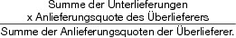

# Verordnung zur Durchführung der EU-Milchquotenregelung (MilchQuotV)

Ausfertigungsdatum
:   2008-03-04

Fundstelle
:   BGBl I: 2008, 359

Neugefasst durch
:   Bek. v. 3.5.2011 I 775;

Zuletzt geändert durch
:   Art. 9 Abs. 12 G v. 3.12.2015 I 2178

## Abschnitt 1 - Allgemeine Vorschriften

### § 1 Anwendungsbereich

Diese Verordnung dient der Durchführung der Rechtsakte der
Europäischen Gemeinschaft oder der Europäischen Union über das
Quotensystem für Milch und andere Milcherzeugnisse (EU-
Milchquotenregelung).

### § 2 Zuständigkeiten

(1) Soweit diese Verordnung nichts anderes bestimmt, sind für die
Durchführung dieser Verordnung und der EU-Milchquotenregelung die
Bundesfinanzverwaltung und in deren Auftrag die Käufer von Milch,
soweit sie im Rahmen der Durchführung dieser Verordnung und der EU-
Milchquotenregelung Aufgaben zu erfüllen haben, zuständig.

(2) Soweit diese Verordnung nichts anderes bestimmt, richtet sich die
örtliche Zuständigkeit der für Erzeuger im Sinne der EU-
Milchquotenregelung (Milcherzeuger) zuständigen Stellen nach dem
Betriebssitz des Milcherzeugers. Ist der Inhaber einer Quote kein
Milcherzeuger, ist der Betriebssitz oder vormalige Betriebssitz, von
dem aus die Quote zuletzt genutzt werden konnte, maßgeblich.

### § 3 Betriebssitz

(1) Als Betriebssitz im Sinne dieser Verordnung gilt für die in § 2
Absatz 2 genannten Personen der Ort, an dem die Milchkühe gehalten
werden und die sächlichen Produktionsmittel vorhanden sind
(Produktionsstätte). Hat ein Milcherzeuger mehr als eine
Produktionsstätte, ist der Betriebssitz der Ort, an dem sich der
betriebliche Schwerpunkt der Milcherzeugung befindet.

(2) Wird der Betriebssitz in einen anderen Übertragungsbereich im
Sinne des § 15 Absatz 2 verlagert, ist die Verlagerung unter Angabe
des neuen Betriebssitzes innerhalb von einem Monat nach der
Verlagerung derjenigen Landesstelle, die in Bezug auf den vormaligen
Betriebssitz für besondere Übertragungen (§§ 21 bis 30) zuständig war,
anzuzeigen.

### § 4 Unschädliche Beseitigung

Soweit Milchmengen einen Betrieb zum Zwecke der unschädlichen
Beseitigung verlassen haben und die Beseitigung auf Grund
gesundheitlicher Maßnahmen, die von der für derartige Maßnahmen
zuständigen Stelle angeordnet worden sind, vorzunehmen war, hat der
Milcherzeuger, der diese Milchmengen erzeugt hat, die Beseitigung
unter Angabe der beseitigten Milchmengen dem für ihn zuständigen
Hauptzollamt unverzüglich anzuzeigen. Der Anzeige sind eine
Durchschrift der amtlichen Anordnung und ein Nachweis, dass die
Beseitigung vorgenommen wurde, beizufügen.

### § 5 Bundes- und Landesreserven

(1) Die in der EU-Milchquotenregelung vorgesehene nationale Reserve
teilt sich in eine Bundesreserve für Anlieferungs- und
Direktverkaufsquoten sowie in Landesreserven für Anlieferungsquoten
auf.

(2) Die Bundesreserve wird vom Bundesministerium der Finanzen im
Einvernehmen mit dem Bundesministerium Ernährung und Landwirtschaft
(Bundesministerium) und die Landesreserven werden von den jeweils
zuständigen Stellen der Länder (Landesstellen) verwaltet.

### § 6 Einziehung und Zuteilung

(1) Ist in der EU-Milchquotenregelung oder in dieser Verordnung die
Einziehung einer Quote vorgesehen, wird die betreffende Quote im Falle
einer einzelbetrieblichen Quote für Lieferungen (Anlieferungsquote) in
die jeweilige Landesreserve und im Falle einer einzelbetrieblichen
Quote für Direktverkäufe (Direktverkaufsquote) in die Bundesreserve
eingezogen, soweit in dieser Verordnung nichts anderes bestimmt ist.

(2) Soweit Anlieferungsquoten aus einer Landesreserve nicht auf Grund
besonderer Zuteilungsbestimmungen der EU-Milchquotenregelung oder
dieser Verordnung zuzuteilen sind, stehen sie dem jeweiligen Land für
eine Zuteilung im Rahmen der EU-Milchquotenregelung und dieser
Verordnung zur Verfügung. Die nach Satz 1 Halbsatz 2 zur Verfügung
stehenden Anlieferungsquoten sind zum linearen Ausgleich von in dem
jeweiligen Land nach Anwendung des Kürzungssatzes bestehenden
Nachfrageüberhängen im Sinne des § 18 Absatz 2 Satz 1 zu verwenden,
soweit das Land keine anderweitige Zuteilung nach Maßgabe des Satzes 1
Halbsatz 2 vornimmt.

(3) Soweit in dieser Verordnung nichts anderes bestimmt ist, obliegt
die Zuteilung und Einziehung von Anlieferungsquoten sowie die
Einziehung von Direktverkaufsquoten den zuständigen Landesstellen und
die Zuteilung von Direktverkaufsquoten den Hauptzollämtern. Eine
eingezogene Direktverkaufsquote überweist das Land der Bundesreserve.

### § 7 Überschussabgabe

Soweit nach der EU-Milchquotenregelung und unter Berücksichtigung der
Vorschriften dieser Verordnung eine Überschussabgabe zu erheben ist,
wird die Überschussabgabe

1.  im Falle von Lieferungen im Sinne der EU-Milchquotenregelung
    (Anlieferungen) von jedem Milcherzeuger für die Milchmengen erhoben,
    die er an Käufer geliefert hat und seine Anlieferungsquote unter
    Berücksichtigung des zugehörigen Referenzfettgehaltes überschreiten,
    und

2.  im Falle von Direktverkäufen von jedem Milcherzeuger für die Milch-
    und Milcherzeugnismengen erhoben, die er direkt verkauft hat und seine
    Direktverkaufsquote überschreiten.

## Abschnitt 2 - Übertragungen

### Unterabschnitt 1 - Allgemeine Regelungen

#### § 8 Grundsätze

(1) Quoten können nur im Rahmen und nach Maßgabe der in dieser
Verordnung vorgesehenen Möglichkeiten übertragen werden. Soweit in
dieser Verordnung nichts anderes bestimmt ist, hat eine Übertragung
flächen- und betriebsungebunden, dauerhaft sowie schriftlich zu
erfolgen.

(2) Übernehmer einer Quote kann nur ein Milcherzeuger sein. Satz 1
gilt nicht im Falle

1.  einer Erbfolge im Sinne des § 21 Absatz 1,

2.  einer Übertragung nach § 21 Absatz 2 zwischen

    a)  Ehegatten oder eingetragenen Lebenspartnern oder

    b)  Verwandten in gerader Linie, wenn der Ehegatte oder eingetragene
        Lebenspartner des übernehmenden Verwandten Milcherzeuger ist,

3.  der Beendigung eines vor dem 1. April 2000 abgeschlossenen
    Pachtvertrages im Sinne des § 48 Absatz 1 Satz 1 und

4.  der Beendigung einer nach dem 31. März 2000 vorgenommenen zeitweiligen
    Übertragung.

(3) Soweit eine zeitweilige Übertragung zulässig ist und diese
Verordnung nichts anderes bestimmt, ist für die Dauer der zeitweiligen
Übertragung die Übertragung auf einen Dritten unzulässig.

(4) Wurde in einem Zwölfmonatszeitraum durch den Übertragenden bereits
Milch vermarktet, ist für diesen Zwölfmonatszeitraum die Übertragung
einer Quote nur in dem Umfang zulässig, in dem zum Zeitpunkt der
Übertragung noch keine Vermarktung erfolgt ist. Im Falle der
Rückübertragung einer Quote ist Satz 1 entsprechend anwendbar. Ist
vereinbart worden oder gesetzlich vorgesehen, dass eine Quote entgegen
Satz 1 oder 2 bereits in dem Zwölfmonatszeitraum der Vermarktung
übertragen wird, gilt die nach Satz 1 oder 2 auf Grund der Vermarktung
beim Übertragenden verbleibende Quote ab dem 1. April des auf die
Übertragung folgenden Zwölfmonatszeitraums als übertragen.

(5) Im Falle einer vereinbarten oder gesetzlich vorgesehenen
Rückübertragung einer Quote kann schriftlich vereinbart werden, dass
eine zum Zeitpunkt der Rückübertragung noch nicht für die Vermarktung
von Milch genutzte Quote ganz oder teilweise bis zum Ende des
Zwölfmonatszeitraums der Rückübertragung beim Rückübertragenden
verbleibt. Liegt weder eine Vereinbarung nach Satz 1 noch eine
Vereinbarung über die sofortige Rückübertragung der noch nicht
genutzten Quote vor und führt der Übertragende die Milcherzeugung
fort, ist zum Zwecke der Zuordnung der in dem Zwölfmonatszeitraum der
Rückübertragung noch nicht genutzten Quote eine Aufteilung nach Satz 3
zugrunde zu legen. Die insgesamt rückzuübertragende Quote wird
entsprechend den beiden nach Tagen bemessenen Zeiträumen vom Beginn
des Zwölfmonatszeitraums bis zum Zeitpunkt der vereinbarten oder
gesetzlich vorgesehenen Rückübertragung und von diesem Zeitpunkt bis
zum Ende des Zwölfmonatszeitraums aufgeteilt und die bereits zur
Vermarktung genutzte Quote vorrangig beim Rückübertragenden
berücksichtigt.

(6) Soweit in dieser Verordnung nichts anderes bestimmt ist, bedarf
jede Übertragung einer amtlichen Bescheinigung
(Übertragungsbescheinigung), ohne die der Übernehmer das Innehaben der
Quote nicht geltend machen kann.

#### § 9 Pflicht zur Weiterübertragung

(1) Soweit der Übernehmer in den in § 8 Absatz 2 Satz 2 genannten
Fällen kein Milcherzeuger ist, hat er die Quote bis zum Ablauf des
zweiten Übertragungsstellentermins im Sinne des § 11 Absatz 1 Satz 1,
der auf die Bekanntgabe der Übertragungsbescheinigung folgt,
(Übertragungsfrist) auf einen Milcherzeuger nach Maßgabe der in dieser
Verordnung vorgesehenen Möglichkeiten zu übertragen. Ist zum Zeitpunkt
der Bekanntgabe der Übertragungsbescheinigung die Einreichfrist nach §
14 Absatz 1 für den nächsten Übertragungsstellentermin bereits
abgelaufen, bleibt dieser Übertragungsstellentermin bei der Bestimmung
der Übertragungsfrist unberücksichtigt. Kommt es in dem
Übertragungsbereich, der für den Übernehmer maßgeblich ist, an einem
oder beiden Übertragungsstellenterminen zu keinem Gleichgewichtspreis,
verlängert sich die Übertragungsfrist einmalig um einen
Übertragungsstellentermin.

(2) Die Übertragung einer Anlieferungsquote im Rahmen des
Übertragungsstellenverfahrens ist nur zulässig, wenn die Quote zum
ersten Übertragungsstellentermin im Sinne des Absatzes 1 angeboten
wird.

(3) Erfolgt keine Übertragung innerhalb der Übertragungsfrist, ist die
Quote einzuziehen. Im Falle einer besonderen Härte kann die
Übertragungsfrist von der für die Einziehung zuständigen Landesstelle
um höchstens zwei Übertragungsstellentermine verlängert werden.

(4) Wird die Übernahme der Quote von dem Übertragenden oder einem
Dritten angefochten, tritt an die Stelle der Bekanntgabe im Sinne des
Absatzes 1 Satz 1 der Zeitpunkt der Unanfechtbarkeit der Übernahme.

#### § 10 Umgehungen

(1) Die Bestimmungen der EU-Milchquotenregelung, nach denen ein im
Rahmen der EU-Milchquotenregelung normierter Vorteil zu versagen ist,
falls die Bedingungen für den Erhalt eines solchen Vorteils künstlich
geschaffen worden sind, gelten insbesondere auch für die Übertragung
von Quoten.

(2) Scheingeschäfte und Scheinhandlungen sind für die Übertragung von
Quoten unerheblich. Wird durch ein Scheingeschäft oder eine
Scheinhandlung ein anderer Sachverhalt verdeckt, so ist der verdeckte
Sachverhalt für die Übertragung der jeweiligen Quoten maßgebend.

(3) Durch Missbrauch rechtlicher Gestaltungsmöglichkeiten können die
in dieser Verordnung vorgesehenen Übertragungsmöglichkeiten nicht
umgangen werden. Ein Missbrauch liegt insbesondere vor, wenn jemand
eine den gegebenen Tatsachen und Verhältnissen unangemessene
Gestaltungsmöglichkeit benutzt, um die Voraussetzungen für die
Übertragung von Quoten zu schaffen.

### Unterabschnitt 2 - Übertragungsstellenverfahren für Anlieferungsquoten

#### § 11 Grundsätze

(1) Von Übertragungsstellen wird zum 1. April, 1. Juli und 2. November
jedes Kalenderjahres (Übertragungsstellentermin) ein amtliches
Übertragungsverfahren (Übertragungsstellenverfahren) durchgeführt,
mittels dessen Anbieter Anlieferungsquoten übertragen und Nachfrager
Anlieferungsquoten übernehmen. Die Summe der übertragenen und die
Summe der übernommenen Anlieferungsquoten müssen sich zu jedem
Übertragungsstellentermin ausgleichen.

(2) Die Übertragung und die Übernahme der Quoten erfolgen gegen ein
einheitliches Entgelt je Kilogramm Quote. Das Entgelt wird in Form
eines Gleichgewichtspreises ermittelt. Grundlage des
Gleichgewichtspreises bilden sämtliche zulässigen Angebote und
Nachfragegebote (Gebote), die für den jeweiligen
Übertragungsstellentermin bei den zuständigen Übertragungsstellen des
jeweiligen Übertragungsbereichs eingegangen sind.

(3) Die von der jeweiligen Übertragungsstelle an Anbieter ausgegebenen
und von Nachfragern eingenommenen Entgelte müssen sich für jeden
Übertragungsstellentermin ausgleichen. Soweit für die Durchführung des
Übertragungsstellenverfahrens Gebühren erhoben werden, bilden diese
keinen Bestandteil des jeweiligen Entgelts.

(4) Jeder Anbieter und Nachfrager (Bieter) darf pro
Übertragungsstellentermin nur ein Gebot abgeben, an das er ab dem
Eingang bei der Übertragungsstelle gebunden ist.

(5) Übertragen und übernommen werden Quoten zu einem
Standardfettgehalt von 4 vom Hundert (Standardfettgehalt). Angebotene
Quoten werden auf den Standardfettgehalt umgerechnet.

#### § 12 Angebote

(1) Angebote müssen folgende Angaben enthalten:

1.  Höhe und Referenzfettgehalt der angebotenen Quote,

2.  das auf den Standardfettgehalt bezogene Entgelt je Kilogramm Quote,
    das der Anbieter mindestens erzielen will, und

3.  die dem Anbieter zugewiesene Betriebsnummer im Sinne des § 7 Absatz 2
    Nummer 1 der InVeKoS-Verordnung (Betriebsnummer) sowie seine
    Bankverbindung.

(2) Dem Angebot sind zur Kontrolle, dass die Quote übertragbar ist,
beizufügen:

1.  ein Nachweis, in welcher Höhe der Anbieter über eine noch nicht
    belieferte Quote verfügt, wobei

    a)  für die Nichtbelieferung das Ende des Monats, der dem Zeitpunkt der
        Ausstellung des Nachweises vorangeht, maßgeblich ist und

    b)  eine bis zum Zeitpunkt der Ausstellung des Nachweises nach § 32 Absatz
        1 Satz 1 erfolgte Meldung zur Einziehung anzugeben ist;

2.  ein Nachweis

    a)  über den Betriebssitz des Anbieters einschließlich der Angabe, ob der
        Betriebssitz innerhalb des laufenden und des vorangegangenen
        Zwölfmonatszeitraums im Sinne des § 16 Absatz 5 Satz 2 verlagert
        worden ist,

    b)  über den Referenzfettgehalt der dem Anbieter dauerhaft zur Verfügung
        stehenden Quote und

    c)  darüber, dass die angebotene Quote keiner von einer Landesstelle
        vorzunehmenden Einziehung unterliegt und von keinem Übertragungsverbot
        betroffen ist, wobei insbesondere der Anspruch eines Dritten auf
        Rückgewähr oder Übernahme der Quote und die Voraussetzung des Absatzes
        6 zu prüfen sind.

(3) Der Nachweis nach Absatz 2 Nummer 1 ist frühestens zwei Monate vor
dem Ende der Angebotsfrist auf Antrag des Anbieters von dem für ihn
zuständigen Käufer auszustellen. Für den Übertragungsstellentermin 1.
April ist in dem Nachweis keine Angabe zur Höhe der noch nicht
erfolgten Belieferung erforderlich. Anlieferungen des Anbieters, die
ab der Ausstellung des Nachweises bis zum auf die Ausstellung
folgenden Übertragungsstellentermin vorgenommen werden, sind auf die
von dem Nachweis erfasste Quote nur anrechenbar, soweit die Quote
nicht übertragen wird.

(4) Der Nachweis nach Absatz 2 Nummer 2 ist frühestens zwei Monate vor
dem Ende der Angebotsfrist auf Antrag des Anbieters von der für ihn
bezüglich besonderer Übertragungen zuständigen Landesstelle
auszustellen.

(5) Soweit für den Anbieter kein Käufer zuständig ist, tritt an die
Stelle des in Absatz 3 genannten Käufers derjenige Käufer, bei dem die
Quote zuletzt beliefert worden ist. Dieser Käufer hat in dem Nachweis
nach Absatz 2 Nummer 1 zu bestätigen, dass ein Übergang der Quote auf
den Anbieter bei dem vorherigen Inhaber der Quote im Wege einer
Neuberechnung nach § 35 berücksichtigt worden ist.

(6) Anbieter kann abgesehen von Fällen besonderer Härte nicht sein,
wer an einem der beiden vorangegangenen Übertragungsstellentermine
Quoten im Rahmen eines Übertragungsstellenverfahrens erworben hat. Die
Anerkennung als Härtefall ist im Rahmen des Absatzes 4 unter Beifügung
entsprechender Nachweise zu beantragen.

#### § 13 Nachfragegebote

(1) Nachfragegebote müssen folgende Angaben enthalten:

1.  Höhe der nachgefragten Quote und das auf den Standardfettgehalt
    bezogene Entgelt je Kilogramm, das der Nachfrager höchstens leisten
    will,

2.  Name und Anschrift des Käufers, an den der Nachfrager liefert,

3.  die Betriebsnummer des Nachfragers und

4.  die für besondere Übertragungen des Nachfragers zuständige
    Landesstelle.

(2) Erzeugt und liefert der Nachfrager keine Milch, hat er dem
Nachfragegebot einen Nachweis der für ihn für besondere Übertragungen
zuständigen Landesstelle beizufügen, dass er Vorbereitungen getroffen
hat, in nächster Zukunft Milch zu erzeugen und zu liefern. Im Falle
des Satzes 1 sind anstelle der Angaben des Absatzes 1 Nummer 2 Name
und Anschrift des Käufers, an den er liefern wird, anzugeben.

(3) Das Nachfragegebot ist nur zu berücksichtigen, wenn eine
selbstschuldnerische und unbedingte Bürgschaft eines Kreditinstituts
oder eine vergleichbare Sicherheit in Höhe des sich aus Absatz 1
Nummer 1 ergebenden Gesamtentgelts beigefügt ist. Scheidet der
Nachfrager aus dem Übertragungsstellenverfahren aus oder ist nach § 19
Absatz 5 Satz 2 sein Entgelt bei der Übertragungsstelle eingegangen,
wird die Sicherheit freigegeben. Zahlt der Nachfrager nicht innerhalb
der in § 19 Absatz 5 Satz 2 bestimmten Zahlungsfrist, tritt die
Sicherheit in Höhe des Entgelts an die Stelle des Entgelts und wird im
Übrigen freigegeben.

#### § 14 Einreichung und Bestätigung der Gebote

(1) Die Gebote sind für den Übertragungsstellentermin

1.  1. April bis zum vorhergehenden 1. März,

2.  1. Juli bis zum vorhergehenden 1. Juni und

3.  2. November bis zum vorhergehenden 1. Oktober

bei der zuständigen Übertragungsstelle schriftlich einzureichen. Die
erforderlichen Nachweise und Sicherheiten sind beizufügen. Fällt der
in Satz 1 genannte Einreichtermin auf einen Samstag, Sonntag oder
Feiertag, ist der nachfolgende Werktag maßgeblich.

(2) Das Bundesministerium kann im Bundesanzeiger Formulare bekannt
geben, die für die Gebote und die zu erbringenden Nachweise zu
verwenden sind.

(3) Die Übertragungsstelle bestätigt vor dem Übertragungsstellentermin
den Bietern, die ein zulässiges Gebot abgegeben haben, den Eingang des
Gebotes und den Anbietern zudem die Höhe der auf den
Standardfettgehalt umgerechneten Quote. Unzulässige Gebote werden vor
dem Übertragungsstellentermin durch Bescheid zurückgewiesen.

#### § 15 Übertragungsbereiche

(1) Das Übertragungsstellenverfahren wird für jeden der in Absatz 2
genannten Übertragungsbereiche getrennt durchgeführt.

(2) Die Länder Berlin, Brandenburg, Mecklenburg-Vorpommern, Sachsen,
Sachsen-Anhalt und Thüringen bilden den Übertragungsbereich Ost; die
übrigen Länder bilden den Übertragungsbereich West.

#### § 16 Übertragungsstellen

(1) Die Durchführung des Übertragungsstellenverfahrens im
Übertragungsbereich Ost erfolgt durch die Übertragungsstelle Ost als
zentrale Übertragungsstelle der Länder des Übertragungsbereichs Ost.

(2) Die Errichtung und die Anschrift der Übertragungsstelle Ost sind
im Bundesanzeiger bekannt zu geben. Soweit Gebote im
Übertragungsbereich Ost an weiteren Stellen fristwahrend eingereicht
werden können, sind die Errichtung und die Anschrift dieser Stellen
ebenfalls im Bundesanzeiger bekannt zu geben.

(3) Die Durchführung des Übertragungsstellenverfahrens im
Übertragungsbereich West erfolgt durch Übertragungsstellen der Länder
des Übertragungsbereichs West, wobei die für die Vornahme der
Übertragungen erforderlichen einheitlichen Daten und der nach § 11
Absatz 3 Satz 1 erforderliche Entgeltausgleich zwischen
Übertragungsstellen mit Einnahmeüberschüssen und Einnahmefehlbeträgen
von der Berechnungsstelle West berechnet werden. Die einheitlichen
Daten im Sinne des Satzes 1 sind der Gleichgewichtspreis, der
Zwischenpreis und der Kürzungssatz.

(4) Zur Durchführung der Berechnung nach Absatz 3 stellen die
Übertragungsstellen der Länder des Übertragungsbereichs West der
Berechnungsstelle West die in § 12 Absatz 1 Nummer 1 und 2 sowie § 13
Absatz 1 Nummer 1 genannten Angaben der zulässigen Gebote in
anonymisierter Form spätestens bis zum Ablauf des vierten Werktages
vor dem jeweiligen Übertragungsstellentermin zur Verfügung. Die
Berechnungsstelle West berechnet die einheitlichen Daten sowie den
Entgeltausgleich und übermittelt die einheitlichen Daten, den
Entgeltausgleich sowie die zugrunde liegenden Berechnungen bis zum
Ablauf des Übertragungsstellentermins gleichzeitig den
Übertragungsstellen der Länder des Übertragungsbereichs West. § 14
Absatz 1 Satz 3 findet auf Satz 2 entsprechende Anwendung, wobei der
Ort der Berechnungsstelle West maßgeblich ist.

(5) Jeder Bieter hat sein Gebot bei derjenigen Übertragungsstelle
einzureichen, in deren Zuständigkeitsbereich er seinen Betriebssitz
hat. Hat ein Anbieter seinen Betriebssitz in einen anderen
Übertragungsbereich im Sinne des § 15 Absatz 2 verlagert, ist im
Zwölfmonatszeitraum der Verlagerung und dem folgenden
Zwölfmonatszeitraum der Betriebssitz im vorherigen Übertragungsbereich
maßgeblich.

#### § 17 Gleichgewichtspreis

(1) Der Gleichgewichtspreis wird ermittelt, indem

1.  nach Absatz 2 ein Zwischenpreis festgestellt wird,

2.  nach Absatz 3 die in Bezug auf den festgestellten Zwischenpreis
    auszuscheidenden Gebote ermittelt werden und

3.  nach Absatz 4 mit den verbleibenden Geboten eine Endberechnung
    vorgenommen wird.

(2) Der Zwischenpreis wird festgestellt, indem auf einer Preisskala
die angebotenen und nachgefragten Quoten den von den Bietern
abgegebenen Angeboten und Nachfragegeboten zugeordnet werden. Die
Preisskala ist in Eurocent-Stufen (Preisstufen) eingeteilt. Sie
beginnt bei einem Eurocent und endet mit demjenigen Preis, der im
Rahmen der Angebote und Nachfragegebote den höchsten Preis bildet.
Anschließend werden für jede Preisstufe die angebotenen Quoten von dem
geringsten Angebotspreis ausgehend und die nachgefragten Quoten von
dem höchsten Nachfragepreis ausgehend summiert und diese Summen der
jeweiligen Preisstufe zugeordnet. Als Zwischenpreis wird diejenige
Preisstufe festgelegt, bei der die nach Satz 4 gebildeten Summen von
angebotenen und nachgefragten Quoten deckungsgleich sind oder sich im
Falle fehlender Deckungsgleichheit zwischen ihnen die geringste
Differenz ergibt. Soweit sich die geringste Differenz mehr als einmal
ergibt, wird von den zugehörigen Preisstufen die niedrigste Preisstufe
als Zwischenpreis festgelegt.

(3) Alle Gebote, die den Zwischenpreis um mindestens 40 vom Hundert
überschreiten, scheiden aus dem Übertragungsstellenverfahren aus und
sind bei der nach Absatz 4 vorzunehmenden Endberechnung nicht zu
berücksichtigen. Satz 1 gilt nicht, wenn der Zwischenpreis 30 Eurocent
unterschreitet.

(4) Mit den verbleibenden Geboten wird mittels einer Endberechnung,
die unter entsprechender Anwendung des Verfahrens nach Absatz 2
vorzunehmen ist, der Gleichgewichtspreis ermittelt. Soweit die in
Absatz 2 Satz 5 in Bezug genommene Summe von angebotenen Quoten die in
Absatz 2 Satz 5 in Bezug genommene Summe von nachgefragten Quoten
übersteigt, gilt die nächstniedrigere Preisstufe als
Gleichgewichtspreis. Im Falle des Satzes 2 gilt Absatz 2 Satz 6
entsprechend, soweit sich auf den nächstniedrigeren Preisstufen die
gleiche Differenz ergibt. Satz 2 findet keine Anwendung, wenn zu dem
nach Satz 2 ermittelten Gleichgewichtspreis kein Angebot vorhanden
ist.

(5) Der Gleichgewichtspreis wird von den Übertragungsstellen
spätestens bis zum Ablauf des Tages, der auf den nach § 16 Absatz 4
Satz 2 und 3 maßgeblichen Tag folgt, öffentlich bekannt gegeben. § 14
Absatz 1 Satz 3 findet entsprechende Anwendung. Vor der Bekanntgabe
ist Stillschweigen über den Gleichgewichtspreis und alle sonstigen mit
dem Übertragungsstellenverfahren verbundenen Daten zu wahren.

#### § 18 Festlegung der Übertragungen

(1) Quoten von Anbietern, deren geforderter Angebotspreis niedriger
oder gleich dem Gleichgewichtspreis ist, sind zum Gleichgewichtspreis
an Nachfrager, deren gebotener Nachfragepreis höher oder gleich dem
Gleichgewichtspreis ist, zu übertragen. Die nicht nach Satz 1 zu
berücksichtigenden Gebote scheiden aus dem
Übertragungsstellenverfahren aus.

(2) Übersteigen die zum Gleichgewichtspreis nachgefragten Mengen die
angebotenen Mengen (Nachfrageüberhang), wird der Nachfrageüberhang
durch eine gleichmäßige Kürzung aller nachgefragten Mengen
ausgeglichen. Der Kürzungssatz wird berechnet, indem die Differenz
zwischen den zum Gleichgewichtspreis angebotenen und nachgefragten
Mengen in das Verhältnis zu der zum Gleichgewichtspreis nachgefragten
Menge gesetzt wird. Der Kürzungssatz wird auf drei Nachkommastellen
berechnet.

(3) Im Falle des § 17 Absatz 4 Satz 4 werden die nach Absatz 1 Satz 1
zu übertragenden Mengen gleichmäßig gekürzt. Der Kürzungssatz wird
berechnet, indem die Differenz zwischen den zum Gleichgewichtspreis
angebotenen und nachgefragten Mengen in das Verhältnis zu der zum
Gleichgewichtspreis angebotenen Menge gesetzt wird. Der Kürzungssatz
wird auf drei Nachkommastellen berechnet.

#### § 19 Durchführung der Übertragungen

(1) Die nach § 18 Absatz 1 Satz 1 zu übertragenden Quoten werden nach
den Absätzen 3 bis 6 übertragen. Die nach den §§ 17 und 18 nicht zu
übertragenden Quoten verbleiben bei den jeweiligen Anbietern.

(2) Die nach den §§ 17 und 18 ausgeschiedenen Bieter sind von der
Übertragungsstelle entsprechend zu bescheiden.

(3) Nachdem der Gleichgewichtspreis bekannt gegeben ist, teilt die
Übertragungsstelle unverzüglich jedem zum Zuge gekommenen Anbieter
sowie dem Käufer und der Landesstelle, die jeweils nach § 12 Absatz 3
bis 5 für den Anbieter zuständig sind, den Gleichgewichtspreis sowie
die Höhe der übertragenen und der nicht übertragenen Quote, jeweils
bezogen auf den Standardfettgehalt und den Referenzfettgehalt des
Anbieters, in Form einer Übertragungsbescheinigung mit.

(4) Auf der Grundlage der Übertragungsbescheinigung nach Absatz 3
nimmt der Käufer innerhalb von 21 Tagen nach Erhalt der Bescheinigung
eine Neuberechnung nach § 35 vor und teilt diese unverzüglich dem
Anbieter, der Übertragungsstelle, der in Absatz 3 genannten
Landesstelle und dem für den Käufer zuständigen Hauptzollamt mit.

(5) Nachdem der Gleichgewichtspreis bekannt gegeben ist, teilt die
Übertragungsstelle unverzüglich jedem zum Zuge gekommenen Nachfrager
den Gleichgewichtspreis, die Höhe der auf ihn zu übertragenden Quote,
bezogen auf den Standardfettgehalt, und das zu zahlende Entgelt mit.
Der Nachfrager hat das Entgelt innerhalb von 14 Tagen nach Eingang der
Mitteilung an die Übertragungsstelle zu zahlen.

(6) Sobald sämtliche Neuberechnungen nach Absatz 4 und die Entgelte
sämtlicher Nachfrager nach Absatz 5 eingegangen sind, teilt die
Übertragungsstelle dem jeweiligen Nachfrager sowie dem Käufer und der
Landesstelle, die jeweils nach § 13 Absatz 1 Nummer 2 und 4 für den
Nachfrager zuständig sind, in Form einer Übertragungsbescheinigung
mit, in welcher Höhe Quoten auf den Nachfrager übertragen werden. Auf
der Grundlage der Übertragungsbescheinigung erfolgt eine Neuberechnung
nach § 35. Die Übertragungsstelle zahlt innerhalb von 14 Tagen nach
Eingang sämtlicher Entgelte aller Nachfrager das Entgelt für die
jeweils übertragene Quote an die Anbieter.

#### § 20 Aufzeichnungen

(1) Die Übertragungsstellen führen unverzüglich für jeden
Übertragungsstellentermin Aufzeichnungen, mit denen sich die
Durchführung des jeweiligen Übertragungsstellenverfahrens im Einzelnen
nachvollziehen lässt. Die Aufzeichnungen und die zugehörigen
Unterlagen sind bis zum Ende des sechsten auf ihre Entstehung
folgenden Kalenderjahres aufzubewahren.

(2) Die in Absatz 1 Satz 1 genannten Aufzeichnungen umfassen
insbesondere

1.  den Inhalt sämtlicher Angebote und Nachfragegebote,

2.  die zugelassenen und nicht zugelassenen Bieter,

3.  die Gleichgewichtspreisermittlung einschließlich der
    Zwischenpreisermittlung,

4.  die Ermittlung von Kürzungssätzen,

5.  die übertragenen und nicht übertragenen Quoten, jeweils bezogen auf
    den einzelnen zugelassenen Bieter und als Summen,

6.  die eingenommenen und ausgegebenen Entgelte, jeweils bezogen auf den
    einzelnen zugelassenen Bieter und als Summen, sowie

7.  die Höhe der eingegangenen, einbehaltenen und freigegebenen
    Sicherheiten, jeweils bezogen auf den einzelnen Bieter und als Summen.

(3) Soweit die Berechnungsstelle West nach § 16 Absatz 3 und 4 tätig
wird, führt sie im Hinblick auf die in Absatz 2 Nummer 3 und 4
genannten Angaben die Aufzeichnungen anstelle der Übertragungsstellen
des Übertragungsbereichs West.

(4) Nachrichtlich erhalten die Generalzolldirektion die in Absatz 2
Nummer 5 genannten Aufzeichnungen und das Bundesministerium die in
Absatz 2 Nummer 3 bis 5 genannten Aufzeichnungen. Die Aufzeichnungen
der Übertragungsstelle Ost werden nachrichtlich den Ländern des
Übertragungsbereichs Ost übermittelt.

### Unterabschnitt 3 - Besondere Übertragungen

#### § 21 Erbfolge, Verwandte und Ehegatten

(1) Quoten können im Wege gesetzlicher oder gewillkürter Erbfolge oder
bei der Übergabe eines Betriebes im Wege der vorweggenommenen Erbfolge
übertragen werden. Im Falle einer gesetzlichen oder gewillkürten
Erbfolge findet § 8 Absatz 3 keine Anwendung. Im Falle einer
vorweggenommenen Erbfolge hindern rechtlich zulässige Vorbehalte die
Dauerhaftigkeit der Übertragung nicht.

(2) Eine Quote kann zwischen Verwandten in gerader Linie, Ehegatten
oder eingetragenen Lebenspartnern übertragen werden.

#### § 22 Betriebsübertragung

(1) Wird ein Betrieb, der als selbstständige Produktionseinheit zur
Milcherzeugung in Höhe von mindestens 50 vom Hundert seiner Quote
bewirtschaftet wird, auf eine natürliche oder juristische Person
dauerhaft übertragen oder einer solchen Person durch Verpachtung oder
in anderer Weise zeitweilig überlassen, kann eine Quote, die dem
Betriebsinhaber zur Verfügung steht, ganz oder teilweise mit
übertragen werden. Die Übertragung der Quote muss als Bestandteil
einer schriftlichen Betriebsübertragung oder -überlassung vereinbart
werden. Fällt eine vor der Betriebsübertragung oder -überlassung
zeitweilig übertragene Quote nach der Betriebsübertragung oder
-überlassung auf den Übertragenden zurück, kann die Übertragung dieser
Quote auf die in Satz 1 genannte Person im Rahmen der in Satz 2
genannten Vereinbarung mit Wirkung ab dem Zeitpunkt des Rückfalls mit
vereinbart werden.

(2) Wird der Betrieb zeitweilig überlassen, ist abweichend von § 8
Absatz 1 Satz 2 die Quote nur für den Zeitraum der Überlassung
übertragbar. Nach Beendigung der Betriebsüberlassung fällt die Quote
auf den Übertragenden zurück. Erfolgt die Rückübertragung nach dem
Ablauf des in Absatz 3 Satz 1 genannten Zeitraums, kann schriftlich
vereinbart werden, dass zugleich mit der rückzuübertragenden Quote
eine zusätzliche Quote übertragen wird. Überträgt der Übertragende
während des in Satz 1 genannten Überlassungszeitraums den Betrieb auf
einen Dritten, tritt hinsichtlich der Quote der Dritte in die
Rechtsposition des Übertragenden ein. Im Falle des Satzes 4 gelten die
Absätze 3 bis 7 in Bezug auf den Dritten ab dem Zeitpunkt der
Beendigung der Betriebsüberlassung entsprechend.

(3) Im Falle einer dauerhaften Übertragung darf der Übernehmer bis zum
Ende des auf die Übertragung folgenden Zwölfmonatszeitraums keine
Quote auf einen Dritten übertragen. Stellt der Übernehmer einen Antrag
auf Ausstellung eines Nachweises nach § 12 Absatz 2 Nummer 2 oder § 27
Absatz 2 Satz 1 Nummer 2, um entgegen dem Übertragungsverbot eine
Bescheinigung über die Übertragung einer ihm zur Verfügung stehenden
Quote auf einen Dritten zu ermöglichen, wird die von dem Antrag
umfasste Quote eingezogen. Im Falle des § 27 Absatz 4 Satz 3 tritt an
die Stelle des in Satz 2 genannten Antrages der Antrag des Dritten
nach § 27 Absatz 1. Die Summe der nach Satz 2 vorzunehmenden
Einziehungen ist auf die Höhe der dauerhaft übernommenen Quote
begrenzt. Ist eine Einziehung in der in Satz 4 genannten Höhe erfolgt,
findet Satz 1 keine Anwendung mehr. Die Sätze 1 bis 5 sind nicht
anwendbar, wenn es sich bei der Übertragung auf den Dritten um die
Rückübertragung der Quote des Dritten oder eine Übertragung nach § 21
oder § 30 handelt.

(4) Der Übernehmer ist verpflichtet, den zusammen mit der Quote
übertragenen Betrieb bis zum Ablauf des in Absatz 3 Satz 1 genannten
Zeitraums weiter für eine landwirtschaftliche Tätigkeit nach Maßgabe
des Absatzes 7 zu nutzen. Wird die in Satz 1 genannte Pflicht
verletzt, erfolgt eine Einziehung der übertragenen Quote. Die Höhe der
Einziehung richtet sich nach dem Verhältnis zwischen dem Zeitraum der
Pflichtverletzung und dem in Satz 1 genannten Zeitraum, wobei mit dem
Beginn der Pflichtverletzung von einer entsprechenden Verletzung im
verbleibenden Zeitraum auszugehen ist. Ist zwischen dem Zeitpunkt der
Übertragung und der Ausstellung der zugehörigen
Übertragungsbescheinigung eine Weiternutzung im Sinne des Satzes 1
ausgeblieben, beginnt der in Satz 1 genannte Zeitraum mit der
Ausstellung der Übertragungsbescheinigung. Satz 1 gilt nicht im Falle
der Rückübertragung nach Absatz 2 Satz 2 und 3.

(5) Ist nach einer zeitweiligen Übertragung der in Absatz 3 Satz 1
genannte Zeitraum abgelaufen und hat bis dahin noch keine
Rückübertragung im Sinne des Absatzes 2 Satz 2 stattgefunden, kann
abweichend von Absatz 2 Satz 2 schriftlich vereinbart werden, dass mit
Beendigung der Betriebsüberlassung die zeitweilig übertragene Quote
ganz oder teilweise auf den zeitweiligen Übernehmer dauerhaft
übertragen wird.

(6) Die zuständige Landesstelle kann in Fällen besonderer Härte von
der Einziehung nach Absatz 3 oder 4 absehen.

(7) Eine Nutzung im Sinne des Absatzes 4 Satz 1 liegt vor, wenn eine
landwirtschaftliche Tätigkeit nach Artikel 2 Buchstabe c der
Verordnung (EG) Nr. 73/2009 des Rates vom 19. Januar 2009 mit
gemeinsamen Regeln für Direktzahlungen im Rahmen der gemeinsamen
Agrarpolitik und mit bestimmten Stützungsregelungen für Inhaber
landwirtschaftlicher Betriebe und zur Änderung der Verordnungen (EG)
Nr. 1290/2005, (EG) Nr. 247/2006, (EG) Nr. 387/2007 sowie zur
Aufhebung der Verordnung (EG) Nr. 1782/2003 (ABl. L 30 vom 31.1.2009,
S. 16) in ihrer jeweils geltenden Fassung ausgeübt wird.

#### § 23 Gesellschafterstellung

(1) Handelt es sich im Falle einer Übertragung nach § 22 Absatz 1 Satz
1 bei dem Übernehmer der Quote um eine Gesellschaft und ist oder wird
der Übertragende zugleich Gesellschafter dieser Gesellschaft, tritt an
die Stelle der Weiternutzungspflicht nach § 22 Absatz 4 Satz 1 für den
in § 22 Absatz 4 Satz 1 und 4 genannten Zeitraum die in Absatz 2 oder
3 enthaltene Pflicht, wenn der Übernehmer nicht im Rahmen des § 27
Absatz 1 die Geltung der Weiternutzungspflicht beantragt.

(2) Ist im Falle des Absatzes 1 der Übertragende eine natürliche
Person, ist diese Person verpflichtet, nachhaltig durch persönliche
Arbeitsleistung zur Erfüllung des Gesellschaftszwecks beizutragen.

(3) Ist im Falle des Absatzes 1 der Übertragende eine Gesellschaft,
ist diese Gesellschaft oder sind sämtliche ihrer Gesellschafter
verpflichtet, Gesellschafter der übernehmenden Gesellschaft zu
bleiben. Der nach Satz 1 erforderliche Gesellschaftsanteil hat
mindestens dem Wert des übertragenen Betriebes einschließlich der
Quote zu entsprechen.

(4) Soweit es zur Überwachung der Einhaltung der Absätze 1 bis 3
erforderlich ist, haben Gesellschaften, die über eine Quote verfügen,
auf Verlangen der zuständigen Landesstelle oder zuständigen Stelle der
Bundesfinanzverwaltung die Aufteilung und Inhaberschaft der
Gesellschaftsanteile mitzuteilen und nachzuweisen.

#### § 24 Beschränkungen zur Abgrenzung der Übertragungsbereiche

(1) Ist der Sitz eines Betriebes, der als selbstständige
Produktionseinheit zur Milcherzeugung bewirtschaftet wird, in einen
anderen Übertragungsbereich im Sinne des § 15 Absatz 2 verlagert
worden, kann der Betriebsinhaber die Übertragung einer Quote nach § 22
Absatz 1 Satz 1 erst nach dem Ablauf des Zwölfmonatszeitraums, der auf
den Zwölfmonatszeitraum der Verlagerung folgt, vornehmen.

(2) Liegt im Falle des § 23 Absatz 1 Halbsatz 1 der Betriebssitz der
Gesellschaft vor der Übertragung in einem anderen Übertragungsbereich
als der Betriebssitz des nach § 22 Absatz 1 Satz 1 übertragenen
Betriebes, bleibt es abweichend von § 23 Absatz 1 Halbsatz 2 und
vorbehaltlich des § 57 Absatz 5 bei der Weiternutzungspflicht nach §
22 Absatz 4 Satz 1. Verfügt die Gesellschaft vor der Übertragung über
keinen Betriebssitz oder liegt ihr Betriebssitz zum Zeitpunkt der
Übertragung in demselben Übertragungsbereich wie der Betriebssitz des
nach § 22 Absatz 1 Satz 1 übertragenen Betriebes, ist Satz 1 im Falle
der Verlagerung des Betriebssitzes der Gesellschaft in einen anderen
Übertragungsbereich ab dem Zeitpunkt der Verlagerung entsprechend
anwendbar.

(3) Wird ein Gesellschaftsanteil einer Gesellschaft, die über eine
Quote verfügt, übertragen und bis zum Ende des auf die Übertragung
folgenden Zwölfmonatszeitraums der Betriebssitz der Gesellschaft in
einen anderen Übertragungsbereich im Sinne des § 15 Absatz 2
verlagert, darf die Quote der Gesellschaft bis zum Ende des in
Halbsatz 1 genannten Zeitraums nur auf Produktionsstätten der
Gesellschaft, die in dem Übertragungsbereich des vormaligen
Betriebssitzes belegen sind, genutzt werden. Satz 1 gilt entsprechend,
wenn der Betriebssitz im Sinne des Satzes 1 verlagert und bis zum Ende
des auf die Verlagerung folgenden Zwölfmonatszeitraums ein
Gesellschaftsanteil übertragen wird. Auf die Übertragung eines
Gesellschaftsanteils entsprechend § 21 oder eine Rückverlagerung des
Betriebssitzes in den vormaligen Übertragungsbereich finden die Sätze
1 und 2 keine Anwendung. In Fällen besonderer Härte kann von der
Nutzungsbeschränkung ganz oder teilweise abgesehen werden.

(4) Gesellschaften haben die nach Absatz 3 maßgeblichen Umstände der
für sie in dem neuen Übertragungsbereich in Bezug auf besondere
Übertragungen zuständigen Landesstelle anzuzeigen. Die Landesstelle
unterrichtet das für die jeweilige Gesellschaft zuständige
Hauptzollamt.

(5) § 23 Absatz 4 findet auf die Überwachung der Einhaltung der
Absätze 2 bis 4 entsprechende Anwendung.

#### § 25 Ausscheiden eines Gesellschafters; Auflösung einer Gesellschaft

(1) Scheidet ein Gesellschafter aus einer Gesellschaft, die Inhaber
einer Quote ist, aus, kann im Wege eines schriftlichen Beschlusses der
Gesellschaft eine Quote auf ihn übertragen werden. Der Beschluss kann
in einem schriftlichen Gesellschaftsvertrag enthalten sein. § 8 Absatz
3 bleibt unberührt. Hat ein Gesellschafter keine Quote auf die
Gesellschaft übertragen, ist eine Übertragung nach Satz 1 nur möglich,
wenn er seit zwei Jahren Gesellschafter ist oder einen
Gesellschaftsanteil entsprechend § 21 übernommen hat.

(2) Wird eine Gesellschaft, die Inhaber einer Quote ist, aufgelöst,
können neben den in dieser Verordnung vorgesehenen
Übertragungsmöglichkeiten Quoten im Rahmen der Auflösung auf
Gesellschafter im Wege eines schriftlichen Beschlusses der
Gesellschaft übertragen werden. Absatz 1 Satz 2 bis 4 gilt
entsprechend. Mit der Übertragung enden nach § 23 Absatz 2 und 3
bestehende Pflichten.

(3) Eine Quote, bei der seit ihrer Übertragung durch einen
Gesellschafter auf die Gesellschaft noch nicht der auf die Übertragung
folgende Zwölfmonatszeitraum abgelaufen ist, kann nur auf denjenigen
Gesellschafter rückübertragen werden, der die jeweilige Quote auf die
Gesellschaft übertragen hat.

#### § 26 Zwangsweise Übertragung

Die zwangsweise Übertragung einer Quote zur wirtschaftlichen
Verwertung insbesondere im Rahmen einer Zwangsvollstreckung oder eines
Insolvenzverfahrens ist nach Maßgabe der in dieser Verordnung
vorgesehenen Übertragungsarten möglich, soweit der Inhaber der Quote
seine Quote nicht mehr zur Milcherzeugung benötigt. Die Quote wird
insbesondere nicht mehr zur Milcherzeugung benötigt, wenn der Inhaber
der Quote über keinen Milcherzeugungsbetrieb verfügt oder sein
Milcherzeugungsbetrieb im Rahmen der wirtschaftlichen Verwertung
aufgelöst oder zusammen mit der Quote nach § 22 Absatz 1 Satz 1
übertragen wird.

#### § 27 Verfahren der Übertragungsbescheinigung

(1) Im Falle einer Übertragung nach den §§ 21 bis 26 ist von dem
Übernehmer der Quote bei der für ihn zuständigen Landesstelle eine
Übertragungsbescheinigung unter Angabe seiner Betriebsnummer zu
beantragen.

(2) Dem Antrag nach Absatz 1 sind neben den für die Nachprüfung der
Übertragung erforderlichen Unterlagen zur Kontrolle, dass die Quote
übertragbar ist, folgende Nachweise, die sich je nach übertragener
Quote auf Anlieferungs- oder Direktverkaufsquoten zu beziehen haben,
beizufügen:

1.  ein Nachweis, in welcher Höhe der Übertragende über eine noch nicht
    genutzte Quote verfügt, wobei

    a)  für die Nichtnutzung der Zeitpunkt der Übertragung maßgeblich ist und

    b)  eine bis zum Zeitpunkt der Ausstellung des Nachweises erfolgte Meldung
        zur Einziehung nach § 32 Absatz 1 Satz 1 anzugeben ist;

2.  ein Nachweis

    a)  über den Referenzfettgehalt der Quote, wenn es sich um eine
        Anlieferungsquote handelt, und

    b)  darüber, dass die Quote keiner von einer Landesstelle vorzunehmenden
        Einziehung unterliegt und von keinem Übertragungsverbot betroffen ist,
        wobei insbesondere der Anspruch eines Dritten auf Rückgewähr oder
        Übernahme der Quote zu prüfen ist.

In dem Antrag sind zudem Name und Anschrift des Käufers, an den der
Übernehmer liefert, anzugeben. Erzeugt und liefert der Übernehmer
keine Milch, hat jedoch Vorbereitungen getroffen, in nächster Zeit
Milch zu erzeugen und zu liefern, sind in dem Antrag Name und
Anschrift des Käufers, an den der Übernehmer liefern wird, anzugeben
und dem Antrag Nachweise über die Vorbereitungen beizufügen. Ist der
Übernehmer kein Milcherzeuger, hat er diesen Umstand anstelle der
Angaben nach Satz 2 und 3 anzugeben.

(3) Der Nachweis nach Absatz 2 Satz 1 Nummer 1 ist auf Verlangen des
Übertragenden im Falle einer Anlieferungsquote von dem für ihn
zuständigen Käufer und im Falle einer Direktverkaufsquote von dem für
ihn zuständigen Hauptzollamt nach dem in Absatz 2 Satz 1 Nummer 1
Buchstabe a genannten Zeitpunkt auszustellen. Der maßgebliche
Zeitpunkt ist vom Übertragenden zu benennen und in den Nachweis
aufzunehmen. Trifft der aufgenommene Zeitpunkt nach Ansicht der in
Absatz 1 genannten Landesstelle nicht zu, setzt sie den Übertragenden
davon in Kenntnis. Der Übertragende hat entsprechend Satz 1 und 2
einen neuen Nachweis zu verlangen. Bezüglich einer Übertragung zum 1.
April braucht der Nachweis keine Angabe zur Höhe der noch nicht
erfolgten Nutzung zu enthalten und kann abweichend von Satz 1 vor dem
1\. April ausgestellt werden. Ist der Übernehmer bereits vor der
Übertragung der Inhaber der Quote, bedarf es keines Nachweises nach
Absatz 2 Satz 1 Nummer 1.

(4) Der Nachweis nach Absatz 2 Satz 1 Nummer 2 ist auf Verlangen des
Übertragenden von der für ihn bezüglich besonderer Übertragungen
zuständigen Landesstelle auszustellen und darf zum Zeitpunkt der
Antragstellung nach Absatz 1 nicht älter als zwei Monate sein. Verfügt
der Übertragende über Quoten mit unterschiedlichen
Referenzfettgehalten, ist in dem Nachweis der Referenzfettgehalt
derjenigen Quote, deren Übertragung bescheinigt werden soll,
anzugeben. Handelt es sich bei der Landesstelle nach Satz 1 um die in
Absatz 1 genannte Landesstelle, bedarf es keines Nachweises nach
Absatz 2 Satz 1 Nummer 2.

(5) Soweit für den Übertragenden kein Käufer zuständig ist, tritt an
die Stelle des in Absatz 3 genannten Käufers derjenige Käufer, bei dem
die Quote zuletzt beliefert worden ist. Dieser Käufer hat in dem
Nachweis nach Absatz 2 Satz 1 Nummer 1 zu bestätigen, dass ein
Übergang der Quote auf den Übertragenden bei dem vorherigen Inhaber
der Quote im Wege einer Neuberechnung nach § 35 berücksichtigt worden
ist.

(6) Handelt es sich im Falle des § 8 Absatz 2 Satz 2 bei dem
Übernehmer um keinen Milcherzeuger und stellt dieser innerhalb von
vier Wochen nach der Übertragung keinen Antrag nach Absatz 1, kann die
zuständige Landesstelle die Übertragungsbescheinigung von Amts wegen
ausstellen.

(7) Soweit es zur Überprüfung der Voraussetzungen der Übertragung
erforderlich ist, haben der Übertragende und der Übernehmer auf
Verlangen der jeweils zuständigen Stelle die Eigentums- und
Pachtverhältnisse ihres gesamten Betriebes und sonstige betriebliche
Verhältnisse offenzulegen.

(8) Die Übertragungsbescheinigung ist dem Übertragenden und dem
Übernehmer bekannt zu geben. Sie kann nachrichtlich auch den für den
Übertragenden und den Übernehmer zuständigen Käufern übermittelt
werden.

#### § 28 Inhalt der Übertragungsbescheinigung

(1) Die Übertragungsbescheinigung nach § 27 enthält

1.  Name und Anschrift des Übertragenden und des Übernehmers sowie deren
    Betriebsnummern,

2.  die Höhe der übertragenen Quote und bei Anlieferungsquoten deren
    Referenzfettgehalt,

3.  die Art und den Zeitpunkt der Übertragung einschließlich einer
    Bezugnahme auf die zugrunde liegenden Schriftstücke,

4.  den Zeitpunkt des Wirksamwerdens der Übertragung und

5.  den Hinweis auf Verfügungsbeschränkungen, Nutzungsbeschränkungen und
    Handlungspflichten, die nach dieser Verordnung mit der Übertragung
    verbunden sind.

(2) Die zuständige Landesstelle kann soweit erforderlich weitere
Angaben in die Übertragungsbescheinigung aufnehmen.

#### § 29 Spätere Antragstellung

(1) Erfolgt die Antragstellung nach § 27 Absatz 1 in einem dem
Zeitpunkt der Übertragung nachfolgenden Zwölfmonatszeitraum, wird die
Übertragung erst ab dem Beginn des Zwölfmonatszeitraums, in dem der
Antrag bei der zuständigen Landesstelle eingegangen ist, wirksam. In
Fällen besonderer Härte kann ein früherer Zeitpunkt festgelegt und
bescheinigt werden.

(2) Absatz 1 findet im Falle der Beendigung einer zeitweiligen
Übertragung nach § 22 Absatz 2 keine Anwendung.

#### § 30 Zeitweilige Übertragung im Falle verendeter oder getöteter Milchkühe

(1) Der Inhaber einer Quote kann

1.  im Falle des Verendens oder der Tötung von mindestens 20 vom Hundert
    der Milchkühe seines Bestandes auf Grund einer Tierseuche, einer
    Tierkrankheit oder eines vergleichbaren Ereignisses oder

2.  im Falle des Verendens oder der Nottötung von mindestens 20 vom
    Hundert der Milchkühe seines Bestandes infolge höherer Gewalt

während des laufenden und des nächsten Zwölfmonatszeitraums seine
Quote, soweit er sie in einem Zwölfmonatszeitraum nicht selbst nutzt,
für den laufenden und den nächsten Zwölfmonatszeitraum einem anderen
Milcherzeuger zur Nutzung überlassen. Im Falle einer Anlieferungsquote
müssen der Überlassende und der Übernehmer vor und der Übernehmer
während der Überlassung an denselben Käufer liefern. Jede
Überlassungsvereinbarung hat eine Quote von mindestens 1 000 Kilogramm
zu erfassen, soweit nicht die Quote des Überlassenden geringer ist. §
8 Absatz 3 findet keine Anwendung.

(2) Die Überlassungsvereinbarung muss zwischen dem Überlassenden und
dem Übernehmer schriftlich abgeschlossen werden. Eine Ausfertigung der
Vereinbarung muss bis zum 31. März des jeweiligen Zwölfmonatszeitraums
im Falle einer Anlieferungsquote dem in Absatz 1 Satz 2 genannten
Käufer und im Falle einer Direktverkaufsquote dem für den
Überlassenden zuständigen Hauptzollamt zur Registrierung vorliegen.
Das Bundesministerium kann im Bundesanzeiger ein Muster für die
Überlassungsvereinbarung bekannt machen. Der Ausfertigung der
Vereinbarung sind ein Nachweis über den Gesamtbestand der Milchkühe
vor dem Eintritt des in Absatz 1 vorausgesetzten Ereignisses sowie im
Falle

1.  des Absatzes 1 Satz 1 Nummer 1 die Ablichtung einer entsprechenden
    amtstierärztlichen Bescheinigung und ein Nachweis über das Verenden
    oder die Tötung sowie

2.  des Absatzes 1 Satz 1 Nummer 2 ein Nachweis über das Vorliegen höherer
    Gewalt sowie das Verenden oder die Nottötung

beizufügen.

(3) Erfüllt die Überlassungsvereinbarung unter Berücksichtigung der
beizufügenden Nachweise die Voraussetzungen des Absatzes 1,
registriert im Falle einer Anlieferungsquote der Käufer und im Falle
einer Direktverkaufsquote das Hauptzollamt die
Überlassungsvereinbarung bis zum 31. März des jeweiligen
Zwölfmonatszeitraums und teilt die Registrierung in Form einer
Neuberechnung nach § 35 innerhalb einer Woche den in Absatz 2 Satz 1
genannten Milcherzeugern und im Falle einer Anlieferungsquote
zusätzlich dem für den Käufer zuständigen Hauptzollamt mit. Der
Mitteilung an das Hauptzollamt ist die Überlassungsvereinbarung
einschließlich der zugehörigen Nachweise beizufügen.

(4) Sieht der Käufer die Voraussetzungen des Absatzes 1 als nicht
erfüllt an, legt er die Überlassungsvereinbarung einschließlich der
zugehörigen Nachweise dem in Absatz 3 Satz 1 genannten Hauptzollamt
unverzüglich vor. Das Hauptzollamt entscheidet innerhalb von drei
Wochen über die Registrierung durch den Käufer und teilt seine
Entscheidung den in Absatz 2 Satz 1 genannten Milcherzeugern und dem
Käufer mit. Soweit das Hauptzollamt die Überlassung genehmigt, nimmt
der Käufer die Neuberechnung im Sinne des Absatzes 3 Satz 1 vor.

(5) Ist der Käufer eine örtliche Milchsammelgenossenschaft oder ein
vergleichbarer Zusammenschluss, der die Milch nicht selbst
verarbeitet, tritt für die Zwecke der Absätze 1 bis 4 an die Stelle
eines solchen Zusammenschlusses derjenige, der von ihm die Milch
entgeltlich bezieht, soweit es sich bei dieser Person ebenfalls um
einen Käufer handelt. In der Registrierung nach Absatz 3 Satz 1 ist
auf ein Vorliegen des Satzes 1 hinzuweisen.

## Abschnitt 3 - Kürzung, Einziehung, Umwandlung und Saldierung

### § 31 Kürzung von Quoten und Referenzfettgehalten

(1) Soweit die Bundesrepublik Deutschland die ihr nach der EU-
Milchquotenregelung zugewiesene einzelstaatliche Anlieferungsquote
überschreitet, sind alle einzelbetrieblichen Anlieferungsquoten nach
Maßgabe des Absatzes 3 linear gekürzt. Satz 1 gilt für
Direktverkaufsquoten entsprechend.

(2) Soweit der gewogene Durchschnitt der einzelbetrieblichen
Referenzfettgehalte den nach der EU-Milchquotenregelung der
Bundesrepublik Deutschland zugewiesenen einzelstaatlichen
Referenzfettgehalt überschreitet, sind alle einzelbetrieblichen
Referenzfettgehalte nach Maßgabe des Absatzes 3 linear gekürzt.

(3) Den sich aus der EU-Milchquotenregelung für die Zwecke des
Absatzes 1 oder 2 ergebenden Kürzungssatz macht das Bundesministerium
im Bundesanzeiger bekannt. Die jeweilige Kürzung wird ab dem
Zwölfmonatszeitraum, der auf den Zwölfmonatszeitraum folgt, in dem die
Überschreitung eingetreten ist, wirksam und ist vor dem 1. August des
Zwölfmonatszeitraums, in dem sie wirksam wird, in Form einer
Neuberechnung nach § 35 sämtlichen von der Kürzung betroffenen
Inhabern von Quoten mitzuteilen.

### § 32 Einziehung nicht genutzter Quoten

(1) Der Käufer teilt dem für ihn zuständigen Hauptzollamt bis zum 45.
Tag nach Ablauf jedes Zwölfmonatszeitraums die Inhaber von
Anlieferungsquoten mit, die auf ihre Anlieferungsquote während des
gesamten abgelaufenen Zwölfmonatszeitraums keine Milch geliefert
haben. Die in Satz 1 genannten Quoten zieht das in Satz 1 genannte
Hauptzollamt zum 1. April des auf den in Satz 1 genannten
Zwölfmonatszeitraum folgenden Kalenderjahres ein. Eine Übertragung der
Quote zu dem in Satz 2 genannten Zeitpunkt ist ausgeschlossen.

(2) Eine Einziehung erfolgt nicht, soweit der Inhaber der Quote

1.  in dem in Absatz 1 Satz 1 genannten Zwölfmonatszeitraum Milch erzeugt
    und direkt verkauft hat,

2.  bis zu dem in Absatz 1 Satz 2 genannten Zeitpunkt wieder Milcherzeuger
    geworden ist oder

3.  ein in der EU-Milchquotenregelung vorgesehener Ausnahmefall vorliegt.

Satz 1 ist nur anzuwenden, soweit der Inhaber der Quote die jeweiligen
Voraussetzungen unter Beifügung entsprechender Nachweise dem
zuständigen Hauptzollamt vor dem in Absatz 1 Satz 2 genannten
Zeitpunkt mitgeteilt hat.

(3) Soweit der vormalige Inhaber der Quote bis spätestens zum Ende des
zweiten Zwölfmonatszeitraums, der auf die Einziehung der Mengen folgt,
wieder Milcherzeuger wird, kann er ab dem Zeitpunkt der Wiederaufnahme
der Milcherzeugung einen Antrag auf Wiederzuteilung der eingezogenen
Quote bei dem in Absatz 1 Satz 1 genannten Hauptzollamt stellen. Dem
Antrag nach Satz 1 sind Nachweise zur Wiederaufnahme der
Milcherzeugung beizufügen. Das Hauptzollamt teilt dem vormaligen
Inhaber der Quote die Quote für den Zwölfmonatszeitraum, in dem der
Antrag nach Satz 1 gestellt wird, ganz oder teilweise wieder zu. Der
Umfang der Wiederzuteilung nach Satz 3 richtet sich nach dem Umfang
der tatsächlichen oder für die nächste Zukunft vorbereiteten
Wiederaufnahme der Milcherzeugung.

(4) Sobald feststeht, dass eine Wiederzuteilung nach Absatz 3 nicht
mehr möglich ist, überweist die Bundesfinanzverwaltung eine nach den
Absätzen 1 bis 3 eingezogene Quote der Reserve des Landes, in dem sich
der Betriebssitz des vormaligen Inhabers der Quote befindet. Ist kein
Betriebssitz vorhanden, findet § 2 Absatz 2 Satz 2 entsprechende
Anwendung.

(5) Absatz 1 Satz 2 und 3 sowie die Absätze 2 und 3 finden auf
Direktverkaufsquoten mit der Maßgabe Anwendung, dass das für den
Inhaber der Quote zuständige Hauptzollamt die Quote in die
Bundesreserve einzieht.

### § 33 Umwandlung von Quoten

(1) Soll nach der EU-Milchquotenregelung eine noch nicht für die
Vermarktung von Milch genutzte Quote umgewandelt werden, ist der
Antrag auf Umwandlung bei dem für den Milcherzeuger zuständigen
Hauptzollamt schriftlich bis zum Ablauf des Zwölfmonatszeitraums, ab
dem die Umwandlung wirksam werden soll, zu stellen. In dem Antrag sind
anzugeben:

1.  Name und Anschrift des Milcherzeugers,

2.  die Höhe der dem Milcherzeuger zustehenden Quoten, getrennt nach
    Anlieferungs- und Direktverkaufsquoten,

3.  die Art und Höhe der begehrten Umwandlung sowie

4.  die Gründe für die begehrte Umwandlung.

(2) Soweit Anlieferungsquoten in Direktverkaufsquoten umgewandelt
werden sollen, ist dem Antrag eine Bescheinigung entsprechend § 27
Absatz 2 Satz 1 Nummer 1 beizufügen.

(3) Das Hauptzollamt entscheidet über die Umwandlung durch Bescheid.
Soweit eine Umwandlung vorgenommen wird, erhalten der Käufer und das
für ihn zuständige Hauptzollamt eine Durchschrift. Soweit mit einer
von der Umwandlung betroffenen Quote Pflichten, Einzugsregelungen oder
sonstige Rechtswirkungen verbunden sind, bestehen diese in Bezug auf
die umgewandelte Quote fort.

(4) Gründe für eine Umwandlung sind insbesondere eine eingetretene
oder erwartete Änderung der Anlieferungen oder Direktverkäufe des
Antragstellers sowie eine beabsichtigte Übertragung oder erfolgte
Übernahme einer Anlieferungsquote durch den Antragsteller im Rahmen
des Übertragungsstellenverfahrens. Eine Umwandlung ist abzulehnen,
wenn zu erwarten ist, dass im Zwölfmonatszeitraum der Umwandlung oder
dem folgenden Zwölfmonatszeitraum die Anlieferungen oder
Direktverkäufe des Antragstellers dessen jeweilige Anlieferungs- oder
Direktverkaufsquote übersteigen werden und dieses Übersteigen durch
die Umwandlung verursacht oder vergrößert wird. Tritt eine vom
Antragsteller vorgetragene Änderung seiner vermarkteten Milchmengen
nicht ein und kommt es dadurch zu einem Missverhältnis zwischen seinen
Anlieferungen oder Direktverkäufen und seiner jeweiligen Anlieferungs-
oder Direktverkaufsquote während eines der in Satz 2 genannten
Zwölfmonatszeiträume, kann das Hauptzollamt die Umwandlung widerrufen.

### § 34 Saldierung nicht genutzter Quoten

(1) Soweit die einzelstaatliche Anlieferungsquote der Bundesrepublik
Deutschland in einem Zwölfmonatszeitraum überschritten wird, werden
auf der Ebene des Käufers alle Anlieferungsquoten, die in demselben
Zwölfmonatszeitraum nicht genutzt worden sind (Unterlieferungen),
allen Milcherzeugern, deren Anlieferungen die ihnen zur Verfügung
stehende Anlieferungsquote überschritten haben (Überlieferungen),
einheitlich nach folgender Berechnungsformel zugeteilt:

*    *        

   Die Zuteilung ist auf 10 vom Hundert der dem jeweiligen Überlieferer
zur Verfügung stehenden Anlieferungsquote beschränkt. Die Zuteilung
wird nach der Berechnungsformel des Satzes 1 wiederholt, bis sämtliche
nicht genutzten Anlieferungsquoten mit Anlieferungen, die über zur
Verfügung stehende Anlieferungsquoten hinaus erfolgt sind, verrechnet
worden sind; Satz 2 gilt entsprechend. Rundungen zu Gunsten der
Überlieferer sind nicht zulässig.

(2) Unterlieferungen, die nach Anwendung des Absatzes 1 verblieben
sind, werden bundesweit einheitlich Milcherzeugern, die nach Anwendung
des Absatzes 1 noch über Überlieferungen verfügen, im Verhältnis der
Summe der Unterlieferungen zur Summe der Überlieferungen zugeteilt.

(3) Die Zuteilung nach den Absätzen 1 und 2 wird durch den Käufer
vorgenommen. Ihre Wirkung beschränkt sich auf die Erhebung der
Überschussabgabe in dem nach Absatz 1 maßgeblichen
Zwölfmonatszeitraum. Das für den jeweiligen Käufer zuständige
Hauptzollamt teilt dem Käufer zwischen den in § 40 Absatz 1 Satz 1 und
Absatz 3 genannten Zeitpunkten mit, welche Anlieferungsquoten,
ausgedrückt in einem Vomhundertsatz, nach Absatz 2 zugeteilt werden.

(4) Werden dem Käufer Änderungen hinsichtlich Unterlieferungen und
Überlieferungen nach dem in § 40 Absatz 1 Satz 1 genannten Zeitpunkt
bekannt, sind die Berechnungen nach den Absätzen 1 und 2 nicht zu
wiederholen. Die sich aus den Absätzen 1 und 2 ergebenden
Zuteilungskoeffizienten sind auf die geänderten Unterlieferungen und
Überlieferungen der jeweiligen Milcherzeuger anzuwenden.

(5) Milcherzeuger, die vorsätzlich oder grob fahrlässig unrichtige
oder unvollständige Angaben über ihre tatsächlichen Anlieferungen
gemacht haben, sind von der Zuteilung nach den Absätzen 1 und 2
ausgeschlossen.

(6) Die Bundesfinanzverwaltung nimmt eine bundesweite Zuteilung der
Direktverkaufsquoten, die in einem Zwölfmonatszeitraum nicht genutzt
worden sind, entsprechend den Absätzen 2 bis 5 vor.

## Abschnitt 4 - Durchführung und Kontrolle

### § 35 Neuberechnung von Quoten und Referenzfettgehalten

(1) Ordnet eine gesetzliche Bestimmung oder ein Bescheid die Änderung
des Umfangs einer Quote an, ist sie neu zu berechnen (Neuberechnung).
Satz 1 gilt entsprechend bei der erstmaligen Zuteilung einer Quote.

(2) Die Neuberechnung einer Anlieferungsquote schließt die
Neuberechnung ihres Referenzfettgehaltes ein.

(3) Die durch Gesetz oder Bescheid vorgenommene Änderung ist für die
Neuberechnung verbindlich. Wird ein in Absatz 1 genannter Bescheid
nicht von Gesetzes wegen der für die Neuberechnung zuständigen Stelle
übermittelt, ist er vom Inhaber der Quote dieser Stelle vorzulegen.

(4) Im Falle einer Anlieferungsquote wird die Neuberechnung von dem
für den Inhaber der Quote zuständigen Käufer und im Falle einer
Direktverkaufsquote von dem für ihn zuständigen Hauptzollamt
vorgenommen. Soweit der Käufer keine Neuberechnung von sich aus
vornimmt, kann ihre Vornahme von dem Inhaber der Quote beantragt
werden. Die Neuberechnung ist innerhalb eines Monats nach Vornahme dem
Inhaber der Quote, der für ihn bezüglich besonderer Übertragungen
zuständigen Landesstelle und im Falle einer Anlieferungsquote auch dem
für den Käufer zuständigen Hauptzollamt mitzuteilen.

(5) Das Bundesministerium der Finanzen kann für die Neuberechnung
Muster bekannt geben, die ab der Bekanntgabe zu verwenden sind. Mit
Zustimmung des zuständigen Hauptzollamtes kann von den Mustern
abgewichen werden.

(6) Lehnt der Käufer eine Neuberechnung ab, kann der Inhaber der Quote
bei dem für den Käufer zuständigen Hauptzollamt die Festsetzung durch
Bescheid beantragen. Bestehen Zweifel des Käufers, ob oder mit welchem
Inhalt eine
Neuberechung              auszustellen ist, hat er den Vorgang dem für
ihn zuständigen Hauptzollamt zur Bescheidung vorzulegen.

(7) Der für den Übernehmer einer Quote zuständige Käufer darf die
Neuberechnung erst vornehmen, wenn ihm die Neuberechnung des für den
Übertragenden zuständigen Käufers vorliegt. Satz 1 gilt nicht für
Übertragungen im Rahmen des Übertragungsstellenverfahrens.

(8) Die Absätze 1 bis 6 gelten vorbehaltlich der besonderen
Bestimmungen des § 19 Absatz 4 und 6.

### § 36 Beförderungsdokumente

Soweit nach der EU-Milchquotenregelung während der Beförderung von
Milch Dokumente zur Bestimmung der jeweiligen Anlieferungen
mitzuführen sind und diese Dokumente zum Zeitpunkt der Beförderung nur
in elektronischer Form vorliegen, ist der jeweilige Käufer
verpflichtet, auf seine Kosten unmittelbar nach der Ankunft im Betrieb
des Käufers den zuständigen Stellen auf deren Verlangen Ausdrucke der
Dokumente zur Verfügung zu stellen.

### § 37 Zulassung der Käufer

(1) Jeder Käufer hat die in der EU-Milchquotenregelung vorgesehene
Zulassung zu beantragen. Er darf seine Tätigkeit als Käufer erst nach
der Zulassung aufnehmen. Der Antrag ist schriftlich in zwei Stücken
bei dem für den Käufer zuständigen Hauptzollamt einzureichen. In dem
Antrag sind die nach der EU-Milchquotenregelung für die Erteilung der
Zulassung vorgesehenen Voraussetzungen darzulegen und
Verpflichtungserklärungen abzugeben. Das Hauptzollamt kann weitere
Angaben fordern, wenn sie für Kontrollzwecke notwendig sind. Das
Hauptzollamt erteilt die Zulassung durch Bescheid.

(2) Milcherzeuger dürfen Milch nur an Käufer liefern, die zugelassen
sind.

### § 38 Käuferwechsel

(1) Wechselt der Milcherzeuger denjenigen Käufer, an den er liefert
und der damit für die Erhebung der Überschussabgabe zuständig ist, hat
er spätestens zu dem Zeitpunkt, zu dem er die Anlieferungen an den
neuen Käufer aufnimmt, beim vormaligen Käufer unter Benennung des
neuen Käufers eine Bescheinigung zu beantragen, aus der sich die Höhe
und der Referenzfettgehalt der Anlieferungsquote, die Höhe der bereits
auf diese Quote vorgenommenen Anlieferungen einschließlich deren
Fettgehalt und den Zeitpunkt, an dem die noch nicht belieferte Quote
bei dem vormaligen Käufer keine Berücksichtigung mehr findet, ergeben.
Der vormalige Käufer hat die Bescheinigung innerhalb von drei Wochen
nach Antragstellung dem Milcherzeuger zu übermitteln. Die
Bescheinigung ist vom Milcherzeuger unverzüglich nach Erhalt dem neuen
Käufer zu übermitteln.

(2) Der neue Käufer hat den Wechsel dem für ihn zuständigen
Hauptzollamt unverzüglich anzuzeigen. Der vormalige Käufer hat
innerhalb von drei Monaten nach der Ausstellung der in Absatz 1 Satz 1
genannten Bescheinigung sämtliche Unterlagen, die die Höhe und
Berechnung der Anlieferungsquote des Milcherzeugers einschließlich
ihres Referenzfettgehaltes betreffen, dem neuen Käufer zu übermitteln.
Die Aufbewahrungspflicht nach § 45 Absatz 2 geht dadurch auf den neuen
Käufer über.

(3) Hat der vormalige Käufer bereits nach § 39 Absatz 2
Lieferungsentgelt einbehalten, hat er dieses Entgelt dem neuen Käufer
zu übermitteln. Der neue Käufer hat das übermittelte Entgelt bei der
Erhebung der Überschussabgabe zu berücksichtigen. Ist keine
Überschussabgabe zu erheben, ist das Entgelt von ihm auszuzahlen.

### § 39 Erhebung der Überschussabgabe bei Anlieferungen

(1) Der Käufer zieht dem Milcherzeuger den Betrag der
Überschussabgabe, der nach der EU-Milchquotenregelung von dem Käufer
verpflichtend zu erheben ist, von dem Entgelt für die Anlieferungen
des fünften Kalendermonats, der dem jeweiligen Zwölfmonatszeitraum
folgt, ab.

(2) Sobald die Anlieferungen eines Milcherzeugers seine
Anlieferungsquote vor dem März eines Zwölfmonatszeitraums
überschreiten, hat der Käufer Lieferungsentgelt in einer Höhe von
mindestens 30 vom Hundert der nach den überschreitenden Anlieferungen
bemessenen Überschussabgabe als Vorauszahlung auf die Überschussabgabe
einzubehalten. Die Saldierungsbestimmungen des § 34 bleiben bei der
Berechnung der Vorauszahlung unberücksichtigt. Der Milcherzeuger kann
den Einbehalt durch die Stellung einer vergleichbaren Sicherheit
abwenden. Steht fest, dass die Milchabgabe in einem
Zwölfmonatszeitraum nicht zu erheben ist, hat dies das
Bundesministerium der Finanzen im Bundesanzeiger bekannt zu geben. Auf
Grund dieser Bekanntmachung sind die erhobenen Vorauszahlungen
unverzüglich auszuzahlen und, soweit der Milcherzeuger nicht darauf
verzichtet hat, gestellte Sicherheiten freizugeben.

(3) Wird eine Quote zusammen mit einem Betrieb, der der Milcherzeugung
dient, nach dem 1. April eines Zwölfmonatszeitraums auf Grund des § 21
übertragen und ist für den Übertragenden und den Übernehmer derselbe
Käufer zuständig, kann der Käufer die Überschussabgabe für den
genannten Zwölfmonatszeitraum auf der Grundlage der
Gesamtanlieferungen des Betriebes und der zusammengefassten
Anlieferungsquoten des Übertragenden und des Übernehmers berechnen
sowie von dem Übertragenden und dem Übernehmer gesamtschuldnerisch
fordern und nach Absatz 1 erheben. Entscheidet sich der Käufer für die
in Satz 1 genannte Vorgehensweise, hat er spätestens bis zum 31. März
des in Satz 1 genannten Zwölfmonatszeitraums oder im Falle des
Absatzes 2 beim erstmaligen Einbehalt des Entgelts darauf hinzuweisen.
Widerspricht der Übertragende oder der Übernehmer, findet Satz 1 keine
Anwendung. Die Sätze 1 bis 3 finden entsprechende Anwendung, soweit
eine nach § 21 mögliche Quotenübertragung im Rahmen des § 22 Absatz 1,
auch in Verbindung mit § 23 Absatz 1, vorgenommen wird.

(4) Erhobene Überschussabgaben und Vorauszahlungen sind vom Käufer im
Rahmen seiner Buchführung auf einem gesonderten Konto
(Milchabgabenkonto) zu verbuchen.

### § 40 Mitteilungen der Käufer

(1) Der Käufer übersendet dem für ihn zuständigen Hauptzollamt vor dem
15\. Mai jedes Jahres für den vorangegangenen Zwölfmonatszeitraum eine
Mitteilung über

1.  die Summe aller Anlieferungsquoten, die Personen zustehen, für die der
    Käufer zuständig ist,

2.  die Summe aller beim Käufer erfolgten Anlieferungen sowie ihre durch
    den Fettgehalt bedingte Erhöhung oder Verminderung, getrennt nach
    Anlieferungen, die

    a)  von Milcherzeugern mit Anlieferungsquoten und

    b)  von Milcherzeugern ohne Anlieferungsquoten

    erfolgt sind,

3.  den durchschnittlichen gewogenen

    a)  Referenzfettgehalt der nach Nummer 1 vom Käufer mitzuteilenden Summe
        der Anlieferungsquoten,

    b)  Fettgehalt der nach Nummer 2 vom Käufer mitzuteilenden Summe der
        Anlieferungen von Erzeugern nach Nummer 2 Buchstabe a,

4.  die Summen aller nach Anwendung des § 34 Absatz 1 verbleibenden
    Unterlieferungen und Überlieferungen.

Der Referenzfettgehalt nach Satz 1 Nummer 3 Buchstabe a und der
Fettgehalt nach Satz 1 Nummer 3 Buchstabe b sind als Prozentzahl mit
drei Nachkommastellen auszuweisen.

(2) Der Mitteilung nach Absatz 1 sind bezogen auf den jeweiligen
Zwölfmonatszeitraum für jeden Milcherzeuger folgende Angaben
beizufügen:

1.  Name und Anschrift,

2.  Anlieferungsquote und Referenzfettgehalt,

3.  Anlieferungsmenge und deren Fettgehalt,

4.  eine durch den Fettgehalt bedingte Erhöhung oder Verminderung der
    Anlieferungsmenge,

5.  Höhe einer Unterlieferung oder Überlieferung der Anlieferungsquote,

6.  eine nach § 34 Absatz 1 zugeteilte Anlieferungsquote und

7.  eine nach Anwendung des § 34 Absatz 1 verbleibende Unterlieferung oder
    Überlieferung.

(3) Der Käufer übersendet dem für ihn zuständigen Hauptzollamt
innerhalb von vier Monaten nach Ablauf jedes Zwölfmonatszeitraums eine
Anmeldung der Überschussabgaben (Abgabeanmeldung), die folgende
Angaben enthält:

1.  die Zahl der Milcherzeuger, für die der Käufer zuständig ist,

2.  die Summen der vor Anwendung des § 34 bestehenden Unterlieferungen und
    Überlieferungen,

3.  die Summen der im Rahmen des § 34 Absatz 1 und 2 jeweils zugeteilten
    Anlieferungsquoten,

4.  die Summe der überschussabgabepflichtigen Anlieferungen und

5.  die Summe der abzuführenden Überschussabgaben.

(4) Der Abgabeanmeldung nach Absatz 3 sind bezogen auf den jeweiligen
Zwölfmonatszeitraum folgende Angaben beizufügen:

1.  für jeden Milcherzeuger

    a)  die in Absatz 2 genannten Angaben, wobei im Rahmen von Absatz 2 Nummer
        6 auch die Zuteilung einer Anlieferungsquote nach § 34 Absatz 2
        anzugeben ist, und

    b)  den Betrag der Überschussabgabe;

2.  eine Übersicht mit

    a)  der Anzahl derjenigen Milcherzeuger, die

        aa) ihre Anlieferungsquoten vor der Anwendung des § 34 überschritten
            haben,

        bb) nach der Anwendung des § 34 Überschussabgabe zahlen müssen, sowie

    b)  den Summen der Anlieferungsmengen derjenigen Milcherzeuger, bei denen

        aa) eine positive Fettgehaltskorrektur vorzunehmen war, einschließlich der
            Summe der positiven Fettgehaltskorrekturmenge, und

        bb) eine negative Fettgehaltskorrektur vorzunehmen war, einschließlich der
            Summe der negativen Fettgehaltskorrekturmenge.

(5) Das Bundesministerium der Finanzen kann für die Mitteilung nach
Absatz 1 und die Abgabeanmeldung nach Absatz 3 einschließlich der nach
den Absätzen 2 und 4 beizufügenden Angaben Muster bekannt geben, die
ab der Bekanntgabe zu verwenden sind. Soweit es für die Anmeldung oder
Abrechnung der Überschussabgabe erforderlich ist, kann in den Mustern
die Mitteilung von Angaben, die über die in den Absätzen 1 bis 4
enthaltenen Angaben hinausgehen, vorgesehen werden.

(6) Der Betrag der Überschussabgabe ist vom Käufer innerhalb von sechs
Monaten nach Ablauf jedes Zwölfmonatszeitraums an die Bundeskasse Kiel
abzuführen.

(7) Der Milcherzeuger erhält vom Käufer innerhalb von sechs Monaten
nach Ablauf jedes Zwölfmonatszeitraums eine Mitteilung über die Daten,
die nach Absatz 4 Nummer 1 übermittelt werden und seine
Anlieferungsquote betreffen. Durch die Mitteilung wird die Erhebung
der Überschussabgabe für den jeweiligen Zwölfmonatszeitraum dem
Milcherzeuger bekannt gegeben.

### § 41 Mehrere Käufer

(1) Liefert ein Milcherzeuger Milch gleichzeitig an mehrere Käufer,
bestimmt er denjenigen Käufer, der die einem Käufer nach dieser
Verordnung und der EU-Milchquotenregelung obliegenden Aufgaben
wahrzunehmen hat, und unterrichtet sämtliche Käufer unverzüglich über
diese Bestimmung. Der nach Satz 1 bestimmte Käufer unterrichtet
unverzüglich das für ihn zuständige Hauptzollamt über die von dem
Milcherzeuger vorgenommene Bestimmung. Ändert sich durch die
Bestimmung derjenige Käufer, der bis zu der Bestimmung die in Satz 1
genannten Aufgaben wahrgenommen hat, ist § 38 entsprechend anzuwenden.

(2) Der Milcherzeuger ist verpflichtet, dem von ihm bestimmten Käufer
unverzüglich nach Ablauf jedes Monats die in diesem Zeitraum an andere
Käufer gelieferten Milchmengen und deren durchschnittlichen
monatlichen Fettgehalt mitzuteilen. Der Milcherzeuger hat diese
Angaben durch urschriftliche Belege nachzuweisen. Soweit er nicht über
solche Belege verfügt, hat ihm diese der andere Käufer auf Antrag
unverzüglich zu übermitteln.

### § 42 Erhebung der Überschussabgabe bei Direktverkäufen

(1) Die Abgabeanmeldung, die ein Milcherzeuger im Falle von
Direktverkäufen vor dem 15. Mai jedes Jahres nach der EU-
Milchquotenregelung vorzunehmen hat, muss dem vom Bundesministerium
der Finanzen bekannt gegebenen Muster entsprechen und ist bei dem für
den Milcherzeuger zuständigen Hauptzollamt abzugeben. Der Inhaber
einer Direktverkaufsquote, der keine Direktverkäufe getätigt hat, muss
eine Meldung entsprechend Satz 1 abgeben.

(2) Der Betrag der Überschussabgabe ist von dem in Absatz 1 Satz 1
genannten Milcherzeuger innerhalb von sechs Monaten nach Ablauf des
jeweiligen Zwölfmonatszeitraums an die Bundeskasse Kiel abzuführen.

### § 43 Äquivalenzmengen für Käse

(1) Im Falle von Direktverkäufen werden die Äquivalenzmengen je
Kilogramm Käse wie folgt festgesetzt:

*    *   Hartkäse

    *
    *   12,20 kg

*    *   Schnittkäse

    *   bis 40 % Fett i. Tr.

    *   12,30 kg

*    *   Schnittkäse

    *   ab 45 % Fett i. Tr.

    *   10,60 kg

*    *   Halbfester Schnittkäse

    *   bis 45 % Fett i. Tr.

    *   8,90 kg

*    *   Halbfester Schnittkäse

    *   ab 50 % Fett i. Tr.

    *   8,40 kg

*    *   Weichkäse

    *   bis 45 % Fett i. Tr.

    *   8,80 kg

*    *   Weichkäse

    *   ab 50 % Fett i. Tr.

    *   7,70 kg

*    *   Frischkäse

    *   bis 10 % Fett i. Tr.

    *   5,60 kg

*    *   Frischkäse

    *   ab 20 % Fett i. Tr.

    *   4,40 kg.

(2) Für die Rahmmengen, die bei der Käseherstellung zusätzlich
anfallen, erfolgt keine erneute Äquivalenzmengenberechnung.

### § 44 Mitwirkungspflichten

Soweit es für die Durchführung der Milchquotenregelung einschließlich
ihrer Überwachung erforderlich ist, haben die Milcherzeuger und die
Käufer, jeweils einschließlich ihrer Beauftragten, den zuständigen
Stellen das Betreten des Betriebes während der üblichen Betriebszeit
zu gestatten, auf Verlangen die in Betracht kommenden kaufmännischen
Bücher, Aufzeichnungen, Belege und sonstigen Unterlagen zur Einsicht
vorzulegen, Auskunft zu erteilen und die erforderliche Unterstützung
zu gewähren. Elektronisch gespeicherte Daten sind auf Verlangen
auszudrucken.

### § 45 Aufbewahrungsfristen

(1) Soweit in dieser Verordnung und der EU-Milchquotenregelung nichts
anderes bestimmt ist, sind sämtliche Unterlagen, die die
Milcherzeugung und Milchvermarktung durch die Milcherzeuger sowie die
Berechnung und Höhe der Überschussabgaben betreffen, jeweils bis zum
Ende des zehnten auf ihre Entstehung folgenden Kalenderjahres
aufzubewahren. Im Falle von Direktverkäufen sind die nach der EU-
Milchquotenregelung erforderliche Bestandsbuchhaltung und sämtliche
sonstigen Unterlagen, die sich auf Direktverkäufe beziehen, jeweils
bis zum Ende des sechsten auf ihre Entstehung folgenden Kalenderjahres
aufzubewahren.

(2) Sämtliche Unterlagen, die die Berechnung und Höhe der Quoten
einschließlich der Referenzfettgehalte von Anlieferungsquoten
betreffen, sind aufzubewahren, solange ein Rückgriff auf sie zur
Feststellung von Quoten oder Referenzfettgehalten erforderlich sein
kann. Die Mindestaufbewahrungsfrist beträgt zehn Jahre ab Entstehung
der jeweiligen Unterlage.

(3) Wird ein Käufer von einem anderen Käufer übernommen, verschmelzen
Käufer oder spaltet sich ein Käufer auf, sind die in Absatz 1 Satz 1
und Absatz 2 Satz 1 genannten Unterlagen von den bisherigen Käufern
den jeweils neuen Käufern in einem geordneten Zustand zu übergeben.
Mit der Übergabe gehen die Pflichten nach Absatz 1 Satz 1 und Absatz 2
auf die neuen Käufer über.

### § 46 Mitteilungen der Länder

Die Länder teilen der vom Bundesministerium der Finanzen bekannt zu
gebenden Stelle innerhalb von zwei Monaten nach Ablauf jedes
Zwölfmonatszeitraums Folgendes mit:

1.  die Höhe der in dem betreffenden Zwölfmonatszeitraum

    a)  übertragenen Quoten, getrennt aufgeführt nach Anlieferungs- und
        Direktverkaufsquoten und den Vorschriften über die Übertragung,

    b)  eingezogenen Quoten, getrennt aufgeführt nach Anlieferungs- und
        Direktverkaufsquoten und den Vorschriften über die Einziehung,

    c)  zugeteilten Anlieferungsquoten, getrennt aufgeführt nach den
        Vorschriften über die Zuteilung,

2.  die Höhe der zum Ablauf des Zwölfmonatszeitraums vorhandenen
    Landesreserven.

## Abschnitt 5 - Übergangs- und Schlussvorschriften

### § 47 Ordnungswidrigkeiten

Ordnungswidrig im Sinne des § 36 Absatz 3 Nummer 3 des Gesetzes zur
Durchführung der Gemeinsamen Marktorganisationen und der
Direktzahlungen handelt, wer vorsätzlich oder fahrlässig

1.  entgegen § 37 Absatz 1 Satz 2 eine Tätigkeit aufnimmt,

2.  entgegen § 37 Absatz 2 Milch anliefert,

3.  entgegen § 38 Absatz 2 Satz 2 Unterlagen nicht oder nicht rechtzeitig
    übermittelt,

4.  entgegen § 39 Absatz 2 Satz 1 eine Vorauszahlung nicht oder nicht in
    der vorgeschriebenen Mindesthöhe erhebt,

5.  entgegen § 45 Absatz 3 Satz 1 eine Unterlage nicht oder nicht
    ordnungsgemäß übergibt.

### § 48 Behandlung laufender Pachtverträge

(1) Pachtverträge, die Quoten nach § 7, auch in Verbindung mit § 14
Absatz 2, der Milch-Garantiemengen-Verordnung in der Fassung der
Bekanntmachung vom 21. März 1994 (BGBl. I S. 586), die zuletzt durch
die Verordnung vom 25. März 1996 (BGBl. I S. 535) geändert worden ist,
betreffen und vor dem 1. April 2000 geschlossen worden sind, gelten
weiter und können abweichend von § 8 Absatz 1 Satz 2 zwischen den
bisherigen Pachtvertragsparteien schriftlich verlängert oder verkürzt
werden. Bei der Prüfung des während der Pachtdauer geltenden
Übertragungsverbots nach § 8 Absatz 3 ist der zum Zeitpunkt der
Prüfung größtmögliche Verpächteranspruch auf Übertragung nach Absatz 3
zugrunde zu legen.

(2) An die Stelle einer Pachtvertragspartei kann eine Person, die mit
ihr im Sinne des § 21 verbunden ist, treten. Soweit eine Quote
zusammen mit einem Betrieb nach § 22 Absatz 1 Satz 1, auch in
Verbindung mit § 23 Absatz 1, oder zusammen mit einem Betrieb im Sinne
des § 22 Absatz 1 Satz 1 nach § 25 übertragen wird und zu dem Betrieb
auch eine nach Absatz 1 gepachtete Quote gehört, kann an die Stelle
des Pächters der Übernehmer des Betriebes treten. Außer im Falle einer
gesetzlichen oder gewillkürten Erbfolge hat der Verpächter einem
Pächterwechsel nach Satz 1 oder 2 schriftlich zuzustimmen. Erfolgt
nach einem Pächterwechsel im Sinne des Satzes 2 eine Rückübertragung
nach § 22 Absatz 2 Satz 2, tritt der ursprüngliche Pächter wieder an
die Stelle des neuen Pächters.

(3) Soweit die in Absatz 1 genannten Pachtverträge mit Ablauf des 31.
März 2000 oder später beendet werden, gehen die entsprechenden Quoten
auf den Verpächter mit der Maßgabe über, dass 33 vom Hundert der
übergehenden Quote zu Gunsten der Reserve des Landes, in dem der
Betriebssitz des Pächters liegt, eingezogen werden. Die Festlegung der
übergehenden Quote erfolgt unter Berücksichtigung des § 7 Absatz 1, 4
Satz 1 bis 3 sowie Absatz 5 und 6 der Milch-Garantiemengen-Verordnung
in der in Absatz 1 Satz 1 genannten Fassung sowie des Absatzes 4. Ist
nach Satz 2 die Aufteilung einer Quote zwischen dem Verpächter und dem
Pächter vorzunehmen, ist für die Berechnung dieser Aufteilung auf die
Höhe der Quote vor einer erstmaligen flächenlosen Quotenübertragung
durch den Pächter abzustellen.

(4) Bei der Feststellung, in welcher Höhe eine Quotenübertragung nach
Absatz 3 auf den Verpächter erfolgt, sind Quoten, die

1.  der Pächter nach dem 31. März 2000 von einem Dritten entgeltlich oder
    unentgeltlich erhalten hat oder

2.  dem Pächter vor dem 1. April 2000 in dem in Artikel 3 des
    Einigungsvertrages genannten Gebiet zugeteilt worden sind,

nicht zu berücksichtigen.

(5) Soweit für die Geltungsdauer des Pachtvertrages eine Betriebs-
oder Flächenbindung der Quote besteht, ist diese mit dem Ende des
Pachtvertrages sowie der zugehörigen Betriebs- oder Flächenrückgabe
aufgehoben.

### § 49 Übernahmerecht des Pächters

(1) Soweit Quoten nach § 48 Absatz 3 Satz 1 bei Beendigung des
Pachtvertrages zurückzugewähren sind und der Pächter Milcherzeuger
ist, hat der Pächter das Recht, die zurückzugewährende Quote vom
Verpächter innerhalb eines Monats nach Ablauf des Pachtvertrages gegen
Entgelt ganz oder teilweise zu übernehmen (Übernahmerecht). Satz 1
gilt nicht, wenn der Pächter den Pachtvertrag kündigt. Die Übernahme
erfolgt ab dem Zeitpunkt der Beendigung des Pachtvertrages. Die
übernommene Quote unterliegt nicht der in § 48 Absatz 3 Satz 1
angeordneten Einziehung.

(2) Das Übernahmerecht ist innerhalb eines Monats nach Beendigung des
Pachtvertrages gegenüber dem Verpächter schriftlich geltend zu machen.

(3) Das Entgelt beträgt je Kilogramm Quote 67 vom Hundert des
Gleichgewichtspreises, der an demjenigen Übertragungsstellentermin im
Sinne des § 11 Absatz 1 Satz 1 ermittelt worden ist, der der
Beendigung des Pachtvertrages vorangeht. Zur Ermittlung des Entgelts
wird das Entgelt je Kilogramm Quote nicht auf Centbeträge gerundet und
die zu übernehmende Quote nicht auf den Standardfettgehalt
umgerechnet. Maßgeblich ist der Gleichgewichtspreis desjenigen
Übertragungsbereichs, in dem der Pächter seinen Betriebssitz hat. Bei
Pachtverträgen, die mit Ablauf des 31. März enden, ist der
Gleichgewichtspreis des darauf folgenden Übertragungsstellentermins
maßgeblich. Kommt zu dem nach Satz 1 bis 3 heranzuziehenden
Übertragungsstellentermin kein Gleichgewichtspreis zustande, ist der
Gleichgewichtspreis des vorherigen Übertragungsstellentermins
maßgeblich.

(4) Das Entgelt ist bis zum Ablauf von 14 Tagen nach Ende der in
Absatz 2 genannten Frist an den Verpächter zu zahlen. Bestreitet der
Verpächter das Übernahmerecht, kann an die Stelle des Entgelts eine
Sicherheitsleistung (§§ 232 bis 240 des Bürgerlichen Gesetzbuchs)
treten. Weist der Pächter der zuständigen Landesstelle nach, dass der
Verpächter das Übernahmerecht vor dem Ablauf des in Satz 1 genannten
Zahlungszeitraums bestritten hat oder die fristgerechte Zahlung des
Entgelts vom Verpächter verhindert wurde, kann die zuständige
Landesstelle den in Satz 1 genannten Zahlungszeitraum verlängern.

(5) Verpächter und Pächter können schriftlich ein niedrigeres Entgelt
und einen längeren Zahlungszeitraum vereinbaren. Wird ein längerer
Zahlungszeitraum vereinbart, muss zugleich schriftlich vereinbart
werden, welcher Betrag zum Wirksamwerden des Übernahmerechts innerhalb
des in Absatz 4 genannten Zahlungszeitraums zu zahlen ist.
Vereinbarungen nach den Sätzen 1 und 2 sind der zuständigen
Landesstelle im Rahmen des Nachweises nach Absatz 6 vorzulegen.

(6) Das Übernahmerecht wird wirksam, wenn der Pächter der zuständigen
Landesstelle die rechtzeitige Geltendmachung des Übernahmerechts und
die rechtzeitige Zahlung des Entgelts nachweist.

### § 50 Übertragung übernommener Quoten

(1) Übt der Pächter sein Übernahmerecht aus, darf er innerhalb eines
Kalenderjahres nach der Übernahme keine Quote auf einen Dritten
übertragen. § 22 Absatz 3 Satz 2 bis 6 gilt entsprechend, wobei die
Summe der Einziehungen auf 33 vom Hundert der übernommenen Quote
begrenzt ist. In Ergänzung zu § 22 Absatz 3 Satz 6 ist eine Einziehung
ebenfalls nicht vorzunehmen, wenn eine Übertragung im Sinne des § 23
Absatz 1 vorliegt und auf Grund der Übertragung eine Pflicht nach § 23
Absatz 2 besteht.

(2) In Fällen besonderer Härte kann von einer Einziehung ganz oder
teilweise abgesehen werden.

### § 51 Ausnahmen

(1) Die Einziehung nach § 48 Absatz 3 Satz 1 und das Übernahmerecht
nach § 49 Absatz 1 Satz 1 gelten nicht, wenn

1.  ein ganzer Betrieb zurückgewährt wird oder

2.  der Verpächter für sich oder eine Person, die mit ihm im Sinne des §
    21 Absatz 2 verbunden ist, nachweisen kann, dass die Quote für eine
    eigene Milcherzeugung benötigt wird.

(2) Die Ausnahme des Absatzes 1 Nummer 2 vom Übernahmerecht findet nur
Anwendung, wenn sich der Verpächter innerhalb eines Monats nach der
Geltendmachung des Übernahmerechts gegenüber dem Pächter schriftlich
und unter Beifügung der erforderlichen Nachweise auf sie beruft. Wird
die Quote nur teilweise für eine eigene Milcherzeugung benötigt, gilt
Absatz 1 Nummer 2 nur in dieser Höhe. Der Verpächter kann sich nicht
auf ein Benötigen für eine eigene Milcherzeugung berufen, soweit sein
Rückgewähranspruch darauf beruht, dass er eine Fläche, die mit der in
Frage stehenden Quote verbunden ist, während der Dauer des
Pachtvertrages erworben hat.

(3) Soweit eine nach § 48 Absatz 1 Satz 1 verpachtete Quote nach
Maßgabe der jeweils geltenden Bestimmungen während der Dauer der
Verpachtung unterverpachtet worden ist, erfolgt bei Beendigung des
Unterpachtvertrages kein Abzug nach § 48 Absatz 3 Satz 1. Dem
Unterpächter steht gegenüber dem Unterverpächter kein Übernahmerecht
nach § 49 Absatz 1 Satz 1 zu. Soweit kein ganzer Betrieb zurückgewährt
wird oder sich der Unterverpächter nicht entsprechend Absatz 2 darauf
beruft, dass er die Quote für seine eigene Milcherzeugung benötigt,
wird das Übernahmerecht des Unterverpächters gegenüber dem
Hauptverpächter durch ein entsprechendes Übernahmerecht des
Unterpächters gegenüber dem Hauptverpächter ersetzt. Absatz 1 bleibt
für den Hauptverpächter unberührt. Satz 3 gilt nur, soweit die
Hauptverpachtung und die Unterverpachtung gleichzeitig enden oder der
Hauptverpächter der Ersetzung schriftlich zustimmt. Die Frist des § 49
Absatz 2 beginnt mit dem Ende des Hauptpachtvertrages.

(4) Soweit mehrfache Unterverpachtungen vorgenommen worden sind, gilt
Absatz 3 entsprechend.

(5) Die Einziehung nach § 48 Absatz 3 Satz 1 erfolgt nicht, soweit die
betreffende Quote nach ihrer Rückgewähr nach Maßgabe des § 22 Absatz 1
Satz 3 auf eine Gesellschaft im Sinne des § 23 Absatz 1 übertragen
wird und der Übertragende die in § 23 Absatz 2 bestimmte Pflicht
erfüllt.

### § 52 Übertragungsbescheinigungen bei Beendigung von Pachtverträgen

Übertragungen nach den §§ 48 bis 51 werden durch eine
Übertragungsbescheinigung bescheinigt. Soweit die §§ 48 bis 51 nichts
anderes bestimmen, gelten die §§ 27 bis 29 Absatz 1 entsprechend.

### § 53 Zuteilung von Quoten in den Zwölfmonatszeiträumen 2009/10 bis 2013/14

(1) Die Quote, die einem Milcherzeuger am 1. Februar 2010, 1. April
2010, 1. April 2011, 1. April 2012 und 1. April 2013 jeweils zur
Verfügung steht, erhöht sich zu dem jeweiligen Zeitpunkt vorbehaltlich
des Satzes 2 und der Absätze 2 und 3 um 1 vom Hundert. Die Erhöhungen
zum jeweils 1. April der Jahre 2010 bis einschließlich 2013 erfolgen
nicht, soweit die im Rahmen der EU-Milchquotenregelung für den
jeweiligen Zeitpunkt angeordnete Erhöhung der einzelstaatlichen Quote
der Bundesrepublik Deutschland, auf der die genannten Erhöhungen
beruhen, aufgehoben wird.

(2) Absatz 1 Satz 1 gilt nur für Milcherzeuger, die in dem in Satz 2
genannten Zeitraum

1.  Milch erzeugen und vermarkten oder

2.  auf Grund höherer Gewalt oder eines vorübergehenden Ausfalls der
    Produktionskapazität keine Milch erzeugen und vermarkten können.

Der nach Satz 1 maßgebliche Zeitraum ist

1.  für die Erhöhung zum 1. Februar 2010 der Zeitraum vom 1. Februar 2010
    bis zum Ablauf des 28. Februar 2010 und

2.  für die Erhöhungen zum jeweils 1. April der Jahre 2010 bis
    einschließlich 2013 der Zeitraum vom 1. April bis zum Ablauf des 30.
    April des jeweils maßgeblichen Jahres.

(3) Im Falle des Absatzes 2 Satz 1 Nummer 2 erfolgt die Erhöhung nach
Absatz 1 nur auf Antrag, der

1.  für die Erhöhung zum 1. Februar 2010 bis zum Ablauf des 30. April 2010
    und

2.  für die Erhöhungen zum jeweils 1. April der Jahre 2010 bis
    einschließlich 2013 bis zum Ablauf des 30. Juni des jeweils
    maßgeblichen Jahres

bei dem für den Milcherzeuger zuständigen Hauptzollamt zu stellen ist.
Dem Antrag sind die für das Vorliegen der Voraussetzungen des Absatzes
2 Satz 1 Nummer 2 erforderlichen Nachweise beizufügen.

(4) Hat ein Quoteninhaber zwischen dem 1. April 2009 und dem 31.
Januar 2010 eine Quotenübertragung vorgenommen, die auf Grund des § 8
Absatz 4 erst zum 1. April 2010 wirksam wird, und erfüllt er nicht die
in Absatz 2 enthaltenen Voraussetzungen für eine Erhöhung zum 1.
Februar 2010, tritt die nach Absatz 1 zum 1. Februar 2010 vorgesehene
Erhöhung der betreffenden Quote zum 1. April 2010 bei dem Übernehmer
der Quote ein.

(5) Wird zum 1. April eine Quote übertragen, tritt hinsichtlich der in
Absatz 1 zum jeweils 1. April der Jahre 2010 bis einschließlich 2013
vorgesehenen Erhöhungen die jeweilige Erhöhung bei dem Übernehmer der
Quote ein.

(6) Soweit die Quoten, um die sich die einzelstaatliche Quote der
Bundesrepublik Deutschland in den Zwölfmonatszeiträumen 2009/10 bis
einschließlich 2013/14 jeweils erhöht, nicht für den jeweiligen
Zwölfmonatszeitraum nach Absatz 1 zugeteilt werden, fallen diese
Quoten als Anlieferungsquoten in die Bundesreserve.

### § 54 Neuberechnung auf Grund einer Erhöhung nach § 53

(1) Die von einer Erhöhung nach § 53 Absatz 1 Satz 1 betroffenen
Milcherzeuger erhalten nach Maßgabe des § 35 anlässlich jeder Erhöhung
eine Neuberechnung ihrer Quote, die diese Erhöhung gesondert ausweist.

(2) Die Neuberechnung nach Absatz 1 nimmt

1.  im Falle des § 53 Absatz 2 Satz 1 Nummer 1 in Bezug auf
    Anlieferungsquoten der zuständige Käufer und

2.  in allen übrigen Fällen das zuständige Hauptzollamt

vor.

### § 55 Erhöhung von zeitweilig übertragenen Quoten

(1) Soweit es sich bei der nach § 53 Absatz 1 Satz 1 der Erhöhung
jeweils zugrunde liegenden Quote um eine verpachtete oder anderweitig
nur zeitweilig übertragene Quote handelt, verbleibt die nach § 53
Absatz 1 Satz 1 hinsichtlich einer solchen Quote zugewiesene Quote
auch nach dem Ende der zeitweiligen Übertragung bei dem zeitweiligen
Übernehmer. Satz 1 gilt nicht im Falle einer zeitweiligen Übertragung
nach § 30.

(2) Die Vertragsparteien der zeitweiligen Übertragung können eine
dauerhafte Übertragung der nach Absatz 1 Satz 1 verbleibenden Quote
auf den zeitweilig Übertragenden mit Wirkung ab dem Ende der
zeitweiligen Übertragung schriftlich vereinbaren.

### § 56 Abweichung durch Landesrecht

Von den Bestimmungen über das Verwaltungsverfahren in § 2 Absatz 2, §§
3 und 12 Absatz 4, § 13 Absatz 3 Satz 1, § 14 Absatz 3, §§ 16 und 17
Absatz 5, §§ 19, 20 und 24 Absatz 4 sowie §§ 27, 28, 44 und 52 kann
durch Landesrecht nicht abgewichen werden.

### § 57 Übergangsregelungen

(1) Die Durchführung der Milchquotenregelung bis einschließlich des
Zwölfmonatszeitraums, der am 31. März 2011 endet, erfolgt auf der
Grundlage der bis zum Ablauf des 31. März 2011 geltenden Bestimmungen.

(2) Soweit die Übertragung oder sonstige Änderung einer Quote vor dem
1\. April 2011 erfolgt ist und die Änderung erst nach diesem Zeitpunkt
bescheinigt wird, richtet sich die Änderung nach den bis zu diesem
Zeitpunkt geltenden Bestimmungen. Abweichend von Satz 1 sind § 48
Absatz 2 Satz 2 bis 4 sowie § 51 Absatz 3 Satz 3 bis 6 und Absatz 4
rückwirkend ab dem 1. April 2000 anwendbar, soweit über die Änderung
der Quote, die auf Grund der Beendigung des jeweiligen Pachtvertrages
vorzunehmen ist, noch keine Übertragungsbescheinigung ausgestellt
wurde und die jeweils Beteiligten der rückwirkenden Geltung
schriftlich zustimmen. Abweichend von Satz 1 ist § 51 Absatz 5
rückwirkend ab dem 1. April 2007 anwendbar, soweit die Einziehung noch
nicht beschieden worden ist.

(3) Käuferzulassungen im Sinne des § 37 Absatz 1 der
Milchabgabenverordnung vom 7. März 2007 (BGBl. I S. 295), die vor dem
1\. April 2008 erteilt worden sind, gelten als Zulassungen nach dieser
Verordnung.

(4) Für Übertragungen, für die der am 1. April 2011 stattfindende
Übertragungsstellentermin maßgeblich ist, sind die Bestimmungen der
Milchquotenverordnung in der bis zum 31. März 2011 geltenden Fassung
weiter anzuwenden.

(5) Abweichend von § 24 Absatz 2 Satz 1 tritt bis zum Ablauf des 31.
März 2012 an die Stelle der Weiternutzungspflicht eine
Weiterbewirtschaftungspflicht im Sinne des Satzes 2. Der übernommene
Betrieb ist in Höhe von mindestens 50 vom Hundert seiner Quote auf den
zum Zeitpunkt der Übertragung bestehenden Produktionsstätten des
Betriebes weiter zur Milcherzeugung zu bewirtschaften. Im Falle einer
Verletzung der Weiterbewirtschaftungspflicht richtet sich abweichend
von § 22 Absatz 4 Satz 3 die Höhe der Einziehung nach dem Verhältnis
zwischen der Mindestproduktionsmenge und der vermarkteten Menge, wobei
die Einziehung und ihre Berechnung für jeden betroffenen
Zwölfmonatszeitraum gesondert vorzunehmen sind. § 22 Absatz 4 Satz 4
und 5 ist entsprechend auf die Weiterbewirtschaftungspflicht
anzuwenden.

(6) Soweit

1.  Bestimmungen dieser Verordnung in ihrer ab dem 1. April 2011 geltenden
    Fassung Beschränkungen, die vor dem 1. April 2011 im Zusammenhang mit
    der Übertragung oder Nutzung von Quoten bestanden, (vormalige
    Beschränkungen) verringern oder aufheben und

2.  eine vormalige Beschränkung bezüglich einer einzelnen Übertragung oder
    Nutzung nicht vor dem 1. April 2011 beendet war,

ist die jeweilige vormalige Beschränkung mit Wirkung ab dem 1. April
2011 verringert oder aufgehoben. Für die Zeit vor dem 1. April 2011
kann eine Verringerung oder Aufhebung nicht geltend gemacht werden.
Ist eine vormalige Beschränkung Inhalt einer amtlichen Bescheinigung
über eine Quote, steht diese Bescheinigung einer Anwendung des Satzes
1 nicht entgegen.

(7) Vormalige Beschränkungen im Sinne des Absatzes 6 sind

1.  zeitliche und räumliche Angebotsbeschränkungen im Rahmen des
    Übertragungsstellenverfahrens,

2.  sachliche Voraussetzungen der Quotenübertragung mit einem Betrieb,

3.  zeitliche Übertragungsbeschränkungen nach der Quotenübertragung mit
    einem Betrieb,

4.  zeitliche Übertragungs- und Bewirtschaftungsbeschränkungen nach einer
    Betriebssitzverlagerung,

5.  zeitliche Übertragungsbeschränkungen beim Ausscheiden eines
    Gesellschafters oder bei der Auflösung einer Gesellschaft und

6.  zeitliche Übertragungsbeschränkungen nach der Ausübung des
    Übernahmerechts.

### § 58 Aufhebung von Vorschriften

(1) Die Milchabgabenverordnung vom 7. März 2007 (BGBl. I S. 295) wird
aufgehoben, soweit nicht diese Verordnung die Fortgeltung einzelner
Bestimmungen anordnet.

(2) Soweit § 57 Absatz 2 der Milchabgabenverordnung in der in Absatz 1
genannten Fassung die Fortgeltung von Bestimmungen der Milch-
Garantiemengen-Verordnung in der Fassung der Bekanntmachung vom 21.
März 1994 (BGBl. I S. 586), zuletzt geändert durch die Verordnung vom
25\. März 1996 (BGBl. I S. 535), anordnet, gelten diese Bestimmungen
auch nach dieser Verordnung fort.

### § 59 (Inkrafttreten)

