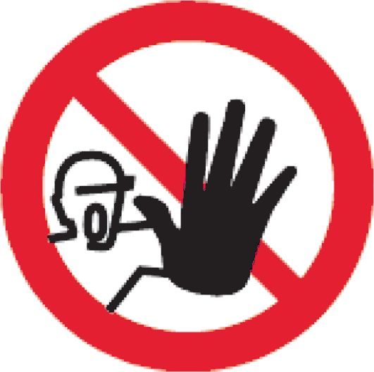
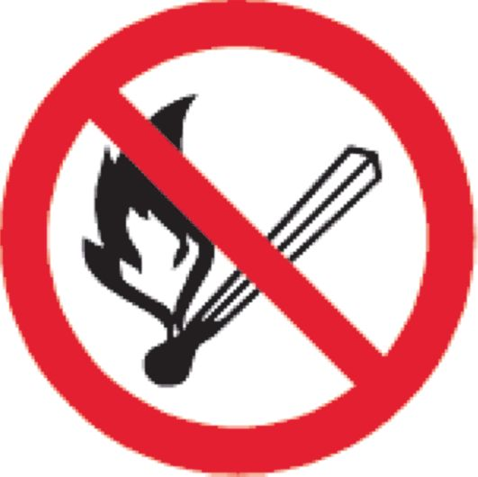
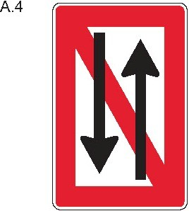
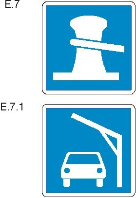
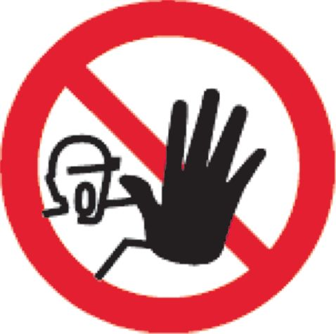
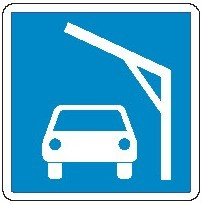
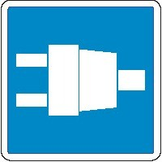
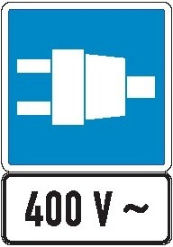

# Moselschiffahrtspolizeiverordnung (MoselSchPV 1997)

Ausfertigungsdatum
:   1997-09-03

Fundstelle
:   BGBl II: 1997, 1670 [Anlageband]

Zuletzt geändert durch
:   Art. 6 V v. 21.6.2012 II 618

## Inhaltsverzeichnis

*    *   Erster Teil

*    *
    *   Auf der gesamten internationalen Moselstrecke anwendbare Bestimmungen

*    *
    *
    *   Kapitel 1

*    *
    *
    *
    *   Allgemeine Bestimmungen

*    *   § 1.01

    *   Begriffsbestimmungen

*    *   § 1.02

    *   Schiffsführer

*    *   § 1.03

    *   Pflichten der Besatzung und sonstiger Personen an Bord

*    *   § 1.04

    *   Allgemeine Sorgfaltspflicht

*    *   § 1.05

    *   Verhalten unter besonderen Umständen

*    *   § 1.06

    *   Benutzung der Wasserstraße

*    *   § 1.07

    *   Anforderungen an die Beladung und Sicht; Höchstzahl der Fahrgäste

*    *   § 1.08

    *   Bau, Ausrüstung und Besatzung der Fahrzeuge

*    *   § 1.09

    *   Besetzung des Ruders

*    *   § 1.10

    *   Mitführen von Urkunden und sonstigen Unterlagen

*    *   § 1.11

    *   Mitführen der Moselschifffahrtspolizeiverordnung

*    *   § 1.12

    *   Gefährdung durch Gegenstände an Bord; Verlust von Gegenständen;
        Schiffahrtshindernisse

*    *   § 1.13

    *   Schutz der Schiffahrtszeichen

*    *   § 1.14

    *   Beschädigung von Anlagen

*    *   § 1.15

    *   Verbot des Einbringens von Gegenständen und anderen Stoffen in die
        Wasserstraße

*    *   § 1.16

    *   Rettung und Hilfeleistung

*    *   § 1.17

    *   Anzeige von Unfällen; festgefahrene oder gesunkene Fahrzeuge

*    *   § 1.18

    *   Freimachen des Fahrwassers

*    *   § 1.19

    *   Besondere Anweisungen

*    *   § 1.20

    *   Überwachung

*    *   § 1.21

    *   Sondertransporte; Amphibienfahrzeuge; Militärfahrzeuge

*    *   § 1.22

    *   Anordnungen vorübergehender Art

*    *   § 1.23

    *   Erlaubnis besonderer Veranstaltungen

*    *   § 1.24

    *   Anwendbarkeit der Verordnung auf Häfen, Lade- und Löschplätze

*    *   § 1.25

    *   Laden, Löschen und Leichtern

*    *   § 1.26

    *   Sonderrechte der Fahrzeuge der Überwachungsbehörden

*    *   § 1.27

    *   Anordnungen, Erlaubnisse und Genehmigungen

*    *
    *
    *   Kapitel 2

*    *
    *
    *
    *   Kennzeichnung und Tiefgangsanzeiger der Fahrzeuge; Schiffseichung

*    *   § 2.01

    *   Kennzeichen der Fahrzeuge, ausgenommen Kleinfahrzeuge und Seeschiffe

*    *   § 2.02

    *   Kennzeichen der Kleinfahrzeuge

*    *   § 2.03

    *   Schiffseichung

*    *   § 2.04

    *   Einsenkungsmarken und Tiefgangsanzeiger

*    *   § 2.05

    *   Kennzeichen der Anker

*    *
    *
    *   Kapitel 3

*    *
    *
    *
    *   Bezeichnung der Fahrzeuge

*    *
    *
    *
    *
    *   Abschnitt I.: Allgemeines

*    *   § 3.01

    *   Begriffsbestimmungen und Anwendungen

*    *   § 3.02

    *   Lichter und Signalleuchten

*    *   § 3.03

    *   Flaggen, Tafeln und Wimpel

*    *   § 3.04

    *   Zylinder, Bälle und Kegel

*    *   § 3.05

    *   Verbotene oder ausnahmsweise zugelassene Lichter und Sichtzeichen

*    *   § 3.06

    *   (ohne Inhalt)

*    *   § 3.07

    *   Verbotener Gebrauch von Lichtern, Scheinwerfern, Flaggen, Tafeln und
        Wimpeln usw.

*    *
    *
    *
    *
    *   Abschnitt II: Nacht- und Tagbezeichnung

*    *
    *
    *
    *
    *   Titel A: Bezeichnung während der Fahrt

*    *   § 3.08

    *   Bezeichnung einzeln fahrender Fahrzeuge mit Maschinenantrieb

*    *   § 3.09

    *   Bezeichnung der Schleppverbände in Fahrt

*    *   § 3.10

    *   Bezeichnung der Schubverbände in Fahrt

*    *   § 3.11

    *   Bezeichnung gekuppelter Fahrzeuge in Fahrt

*    *   § 3.12

    *   Bezeichnung der Fahrzeuge unter Segel in Fahrt

*    *   § 3.13

    *   Bezeichnung der Kleinfahrzeuge in Fahrt

*    *   § 3.14

    *   Zusätzliche Bezeichnung der Fahrzeuge in Fahrt bei Beförderung
        bestimmter gefährlicher Güter

*    *   § 3.15

    *   Bezeichnung der Fahrzeuge in Fahrt, die zur Beförderung von mehr als
        12 Fahrgästen zugelassen sind und deren Schiffskörper eine Höchstlänge
        von weniger als 20,00 m aufweist

*    *   § 3.16

    *   Bezeichnung der Fähren in Fahrt

*    *   § 3.17

    *   Zusätzliche Bezeichnung der Fahrzeuge in Fahrt, die einen Vorrang
        besitzen

*    *   § 3.18

    *   Zusätzliche Bezeichnung manövrierunfähiger Fahrzeuge in Fahrt

*    *   § 3.19

    *   Bezeichnung der Schwimmkörper und schwimmenden Anlagen in Fahrt

*    *
    *
    *
    *
    *   Titel B: Bezeichnung beim Stilliegen

*    *   § 3.20

    *   Bezeichnung der Fahrzeuge beim Stilliegen

*    *   § 3.21

    *   Zusätzliche Bezeichnung stilliegender Fahrzeuge bei Beförderung
        bestimmter gefährlicher Güter

*    *   § 3.22

    *   Bezeichnung der Fähren, die an ihrer Anlegestelle stilliegen

*    *   § 3.23

    *   Bezeichnung der Schwimmkörper und schwimmenden Anlagen beim Stilliegen

*    *   § 3.24

    *   Bezeichnung bestimmter stilliegender Fischereifahrzeuge und der Netze
        oder Ausleger

*    *   § 3.25

    *   Bezeichnung schwimmender Geräte bei der Arbeit sowie festgefahrener
        oder gesunkener Fahrzeuge

*    *   § 3.26

    *   Zusätzliche Bezeichnung der Fahrzeuge, Schwimmkörper und schwimmenden
        Anlagen, deren Anker die Schiffahrt gefährden können, und ihrer Anker

*    *
    *
    *
    *
    *   Abschnitt III: Sonstige Bezeichnung

*    *   § 3.27

    *   Bezeichnung der Fahrzeuge der Überwachungsbehörden

*    *   § 3.28

    *   Zusätzliche Bezeichnung der Fahrzeuge in Fahrt, die Arbeiten in der
        Wasserstraße ausführen

*    *   § 3.29

    *   Schutz gegen Wellenschlag

*    *   § 3.30

    *   Notzeichen

*    *   § 3.31

    *   Hinweis auf das Verbot, das Fahrzeug zu betreten

*    *   § 3.32

    *   Hinweis auf das Verbot, zu rauchen, ungeschütztes Licht oder Feuer zu
        verwenden

*    *   § 3.33

    *   Hinweis auf das Verbot des Stilliegens nebeneinander

*    *
    *
    *   Kapitel 4

*    *
    *
    *
    *   Schallzeichen der Fahrzeuge, Sprechfunk; Radar

*    *
    *
    *
    *
    *   Abschnitt I: Schallzeichen

*    *   § 4.01

    *   Allgemeines

*    *   § 4.02

    *   Gebrauch der Schallzeichen

*    *   § 4.03

    *   Verbotene Schallzeichen

*    *   § 4.04

    *   Notzeichen

*    *
    *
    *
    *
    *   Abschnitt II: Sprechfunk

*    *   § 4.05

    *   Sprechfunk

*    *
    *
    *
    *
    *   Abschnitt III: Radar

*    *   § 4.06

    *   Radar

*    *
    *
    *   Kapitel 5

*    *
    *
    *
    *   Schiffahrtszeichen und Bezeichnung der Wasserstraße

*    *   § 5.01

    *   Schiffahrtszeichen

*    *   § 5.02

    *   Bezeichnung der Wasserstraße

*    *
    *
    *   Kapitel 6

*    *
    *
    *
    *   Fahrregeln

*    *
    *
    *
    *
    *   Abschnitt I: Allgemeines

*    *   § 6.01

    *   Fahrt unter Segel

*    *   § 6.02

    *   Gegenseitiges Verhalten von Kleinfahrzeugen und anderen Fahrzeugen

*    *   § 6.02a

    *   Besondere Fahrregeln für Kleinfahrzeuge

*    *
    *
    *
    *
    *   Abschnitt II: Begegnen und Überholen

*    *   § 6.03

    *   Allgemeine Grundsätze

*    *   § 6.04

    *   Begegnen: Grundregeln

*    *   § 6.05

    *   Begegnen: Ausnahmen von den Grundregeln

*    *   § 6.06

    *   (ohne Inhalt)

*    *   § 6.07

    *   Begegnen im engen Fahrwasser

*    *   § 6.08

    *   Durch Schiffahrtszeichen verbotenes Begegnen

*    *   § 6.09

    *   Überholen: Allgemeine Bestimmungen

*    *   § 6.10

    *   Überholen: Verhalten und Zeichengebung der Fahrzeuge

*    *   § 6.11

    *   Überholverbot durch Schiffahrtszeichen

*    *
    *
    *
    *
    *   Abschnitt III: Weitere Regeln für die Fahrt

*    *   § 6.12

    *   Fahrt auf Strecken mit vorgeschriebenem Kurs

*    *   § 6.13

    *   Wenden

*    *   § 6.14

    *   Verhalten bei der Abfahrt

*    *   § 6.15

    *   Verbot des Hineinfahrens in die Abstände zwischen Teilen eines
        Schleppverbandes

*    *   § 6.16

    *   Einfahrt in und Ausfahrt aus Häfen und Nebenwasserstraßen

*    *   § 6.17

    *   Fahrt auf gleicher Höhe; Verbot der Annäherung an Fahrzeuge

*    *   § 6.18

    *   Verbot des Schleifenlassens von Ankern, Trossen oder Ketten

*    *   § 6.19

    *   Schiffahrt durch Treibenlassen

*    *   § 6.20

    *   Vermeidung von Wellenschlag

*    *   § 6.21

    *   Zusammenstellung der Verbände

*    *   § 6.22

    *   Sperrung der Schiffahrt und gesperrte Wasserflächen

*    *   § 6.22a

    *   Vorbeifahrt an schwimmenden Geräten bei der Arbeit sowie an
        festgefahrenen oder gesunkenen Fahrzeugen

*    *
    *
    *
    *
    *   Abschnitt IV: Fähren

*    *   § 6.23

    *   Verhalten der Fähren

*    *
    *
    *
    *
    *   Abschnitt V: Durchfahren von Brücken, Wehren und Schleusen

*    *   § 6.24

    *   Durchfahren von Brücken und Wehren: Allgemeines

*    *   § 6.25

    *   Durchfahrt unter festen Brücken

*    *   § 6.26

    *   Durchfahren der Bootsschleusen und Bootsgassen

*    *   § 6.27

    *   Wehre

*    *   § 6.28

    *   Durchfahren der Schleusen

*    *   § 6.28a

    *   Schleuseneinfahrt und -ausfahrt

*    *   § 6.29

    *   Vorrecht auf Schleusung

*    *
    *
    *
    *
    *   Abschnitt VI: Unsichtiges Wetter; Benutzung von Radar

*    *   § 6.30

    *   Allgemeine Regeln für die Fahrt bei unsichtigem Wetter

*    *   § 6.31

    *   Schallzeichen beim Stilliegen

*    *   § 6.32

    *   Radarfahrt

*    *   § 6.33

    *   Schallzeichen für Fahrzeuge, die nicht mit Radar fahren

*    *   § 6.34

    *   Bestimmungen für Fahrzeuge, die nicht mit Radar fahren und das
        Dreitonzeichen hören

*    *
    *
    *   Kapitel 7

*    *
    *
    *
    *   Regeln für das Stilliegen

*    *   § 7.01

    *   Allgemeine Grundsätze für das Stilliegen

*    *   § 7.02

    *   Liegeverbot

*    *   § 7.03

    *   Ankern

*    *   § 7.04

    *   Festmachen

*    *   § 7.05

    *   Liegestellen

*    *   § 7.06

    *   Besondere Liegestellen

*    *   § 7.07

    *   Mindestabstände bei Beförderung bestimmter gefährlicher Güter beim
        Stillliegen

*    *   § 7.08

    *   Wache und Aufsicht

*    *
    *
    *   Kapitel 8

*    *
    *
    *
    *   Zusatzbestimmungen

*    *   § 8.01

    *   Höchstabmessungen der Fahrzeuge und Verbände

*    *   § 8.01a

    *   Fahrgeschwindigkeit

*    *   § 8.02

    *   Geschleppte und schleppende Schubverbände

*    *   § 8.03

    *   Schubverbände, die andere Fahrzeuge als Schubleichter mitführen

*    *   § 8.04

    *   Schubverbände, die Trägerschiffsleichter mitführen

*    *   § 8.05

    *   Fortbewegung von Schubleichtern außerhalb eines Schubverbandes

*    *   § 8.06

    *   Kupplungen der Schubverbände

*    *   § 8.07

    *   Sprechverbindung auf Verbänden sowie Fahrzeugen, deren Länge 110,00 m
        überschreitet

*    *   § 8.08

    *   Begehbarkeit der Schubverbände

*    *   § 8.09

    *   (ohne Inhalt)

*    *   § 8.10

    *   Bleib-weg-Signal

*    *   § 8.11

    *   Sicherheit an Bord von Fahrzeugen, die für die Beförderung und
        Übernachtung von mehr als 12 Fahrgästen zugelassen sind

*    *   § 8.12

    *   Anlegestellen für Fahrgastschiffe

*    *
    *
    *   Kapitel 9

*    *
    *
    *
    *   Besondere Regeln für die Fahrt und das Stilliegen

*    *   § 9.01

    *   Fahrbeschränkungen

*    *   § 9.02

    *   Durchfahrt durch die Schleuse Metz außerhalb der Betriebszeiten

*    *   § 9.03

    *   Verkehrsregelung im Unterkanal der Koblenzer Schleusen

*    *   § 9.04

    *   Fahrt von Schubverbänden in der Moselmündung

*    *   § 9.05

    *   Meldepflicht

*    *
    *
    *   Kapitel 10

*    *
    *
    *
    *   Beschränkung der Schiffahrt bei Hochwasser

*    *   § 10.01

    *   Hochwassermarken

*    *   § 10.02

    *   Regeln für die Fahrt, wenn die Hochwassermarken erreicht oder
        überschritten sind

*    *   Zweiter Teil

*    *
    *   Umweltbestimmungen

*    *
    *
    *   Kapitel 11

*    *
    *
    *
    *   Gewässerschutz und Abfallbeseitigung auf Fahrzeugen

*    *   § 11.01

    *   Begriffsbestimmungen

*    *   § 11.02

    *   Allgemeine Sorgfaltspflicht

*    *   § 11.03

    *   Verbot der Einbringung und Einleitung

*    *   § 11.04

    *   Sammlung und Behandlung an Bord

*    *   § 11.05

    *   Ölkontrollbuch, Abgabe an Annahmestellen

*    *   § 11.06

    *   Sorgfaltspflicht beim Bunkern

*    *   § 11.07

    *   (ohne Inhalt)

*    *   § 11.08

    *   Bilgenentölungsboote

*    *   § 11.09

    *   Anstrich und Außenreinigung der Fahrzeuge

*    *   Anlagen

    *

*    *   Anlage 1:

    *   Unterscheidungsbuchstabe oder -buchstabengruppe des Landes, in welchem
        der Heimat- oder Registerort der Fahrzeuge liegt

*    *   Anlage 2:

    *   (ohne Inhalt)

*    *   Anlage 3:

    *   Bezeichnung der Fahrzeuge

*    *   Anlage 4:

    *   (ohne Inhalt)

*    *   Anlage 5:

    *   (ohne Inhalt)

*    *   Anlage 6:

    *   Schallzeichen

*    *   Anlage 7:

    *   Schiffahrtszeichen

*    *   Anlage 8:

    *   Bezeichnung der Wasserstraße

*    *   Anlage 9:

    *   (ohne Inhalt)

*    *   Anlage 10:

    *   Muster für das Ölkontrollbuch

## Erster Teil - Auf der gesamten internationalen Moselstrecke anwendbare Bestimmungen

### Kapitel 1 - Allgemeine Bestimmungen

#### § 1.01 Begriffsbestimmungen

In dieser Verordnung gelten als:

a)  "Fahrzeug":

    ein Binnenschiff, einschließlich Kleinfahrzeug und Fähre sowie
    schwimmendes Gerät und Seeschiff;

b)  "Fahrzeug mit Maschinenantrieb":

    ein Fahrzeug mit eigener in Tätigkeit gesetzter Antriebsmaschine,
    ausgenommen solche Fahrzeuge, deren Motor nur zu kleinen
    Ortsveränderungen (z.B. in Häfen oder an Lade- und Löschstellen) oder
    zur Erhöhung der Steuerfähigkeit des Fahrzeugs im Schlepp- oder
    Schubverband verwendet wird;

c)  "Verband":

    ein Schleppverband, ein Schubverband oder gekuppelte Fahrzeuge;

d)  "Schleppverband":

    eine Zusammenstellung von einem Fahrzeug oder mehreren Fahrzeugen,
    schwimmenden Anlagen oder Schwimmkörpern, die von einem oder mehreren
    zum Verband gehörigen Fahrzeugen mit Maschinenantrieb geschleppt wird;

e)  "Schubverband":

    eine starre Verbindung von Fahrzeugen, von denen sich mindestens eines
    vor dem oder den beiden Fahrzeugen mit Maschinenantrieb befindet, das
    oder die den Verband fortbewegt oder fortbewegen und als "schiebendes
    Fahrzeug" oder "schiebende Fahrzeuge" bezeichnet wird oder werden;
    hierzu zählen auch Verbände aus einem schiebenden und einem
    geschobenen Fahrzeug, deren Kupplungen ein gesteuertes Knicken
    ermöglichen;

f)  "Schubleichter":

    ein zur Fortbewegung durch Schieben gebautes oder hierfür besonders
    eingerichtetes Fahrzeug;

g)  "Trägerschiffsleichter":

    ein Schubleichter, der für die Beförderung an Bord eines Seeschiffes
    und für die Fahrt auf Binnenwasserstraßen gebaut ist;

h)  "Gekuppelte Fahrzeuge":

    eine Zusammenstellung von längsseits gekuppelten Fahrzeugen, von denen
    sich keines vor dem Fahrzeug mit Maschinenantrieb befindet, das die
    Zusammenstellung fortbewegt;

i)  "Schwimmendes Gerät":

    eine schwimmende Konstruktion mit mechanischen Einrichtungen, die dazu
    bestimmt ist, auf Wasserstraßen oder in Häfen zur Arbeit eingesetzt zu
    werden, wie Bagger, Elevatoren, Hebeböcke, Krane;

j)  "Schwimmende Anlage":

    eine schwimmende Einrichtung, die in der Regel nicht zur Fortbewegung
    bestimmt ist, wie eine Badeanstalt, ein Dock, eine Landebrücke, ein
    Bootshaus;

k)  "Schwimmkörper":

    ein Floß und andere einzeln oder in Verbindung fahrtauglich gemachte
    Gegenstände, soweit sie nicht ein Fahrzeug oder eine schwimmende
    Anlage sind;

l)  "Fähre":

    ein Fahrzeug, das dem Übersetzverkehr dient und von der zuständigen
    Behörde als Fähre behandelt wird;

m)  "Kleinfahrzeug":

    ein Fahrzeug, dessen Schiffskörper, ohne Ruder und Bugspriet, eine
    Höchstlänge von weniger als 20,00 m aufweist, ausgenommen

    -   ein Fahrzeug, das zugelassen ist, Fahrzeuge, die nicht Kleinfahrzeuge
        sind, zu schleppen, zu schieben oder längsseits gekuppelt mitzuführen,

    -   ein Fahrzeug, das zur Beförderung von mehr als 12 Fahrgästen
        zugelassen ist,

    -   eine Fähre oder

    -   ein Schubleichter;

n)  "Fahrzeug unter Segel":

    ein Fahrzeug, das nur unter Segel fährt; ein Fahrzeug, das unter Segel
    fährt und gleichzeitig eine Antriebsmaschine benutzt, gilt als
    Fahrzeug mit Maschinenantrieb;

o)  "stilliegend":

    ein Fahrzeug, Schwimmkörper und eine schwimmende Anlage, die
    unmittelbar oder mittelbar vor Anker liegen oder am Ufer festgemacht
    sind;

p)  "fahrend" oder "in Fahrt befindlich":

    ein Fahrzeug, Schwimmkörper und eine schwimmende Anlage, die weder
    unmittelbar noch mittelbar vor Anker liegen, am Ufer festgemacht oder
    festgefahren sind;

q)  "Radarfahrt":

    eine Fahrt bei unsichtigem Wetter mit Radar;

r)  "Nacht":

    der Zeitraum zwischen Sonnenuntergang und Sonnenaufgang;

s)  "Tag":

    der Zeitraum zwischen Sonnenaufgang und Sonnenuntergang;

t)  „weißes Licht“, „rotes Licht“, „grünes Licht“, „gelbes Licht“ und
    „blaues Licht“:

    ein Licht, dessen Farbe den Anforderungen der Tabelle 2 der
    Europäischen Norm EN 14744 : 2005 entspricht;

u)  „starkes Licht“, „helles Licht“ und „gewöhnliches Licht“:

    ein Licht, dessen Stärke den Anforderungen der Tabelle 1 der
    Europäischen Norm EN 14744 : 2005 entspricht;

v)  „Funkellicht“, „schnelles Funkellicht“:

    ein Licht, dessen Anzahl regelmäßiger Lichterscheinungen als
    Funkellicht der Anforderung der Zeile 1 und als schnelles Funkellicht
    den Anforderungen der Zeile 2 oder der Zeile 3 der Tabelle 3 der
    Europäischen Norm EN 14744 : 2005 entspricht;

w)  "kurzer Ton":

    ein Ton von etwa einer Sekunde Dauer,

    "langer Ton":

    ein Ton von etwa vier Sekunden Dauer, wobei die Pause zwischen zwei
    aufeinanderfolgenden Tönen etwa eine Sekunde beträgt;

x)  "Folge sehr kurzer Töne":

    eine Folge von mindestens sechs Tönen je von etwa einer viertel
    Sekunde Dauer, wobei die Pause zwischen den aufeinanderfolgenden Tönen
    ebenfalls etwa eine viertel Sekunde beträgt;

y)  "rechtes" und "linkes Ufer":

    die Seiten der Wasserstraße in der Richtung von der Quelle zur Mündung
    gesehen;

z)  "zu Berg":

    die Richtung zu den Quellen der Mosel;

aa) "ADN":

    die dem Europäischen Übereinkommen über die internationale Beförderung
    von gefährlichen Gütern auf Binnenwasserstraßen beigefügte Verordnung
    (ADN) in der jeweils aktuellen Fassung.

#### § 1.02 Schiffsführer

1.  Jedes Fahrzeug sowie jeder Schwimmkörper muß unter der Führung einer
    hierfür geeigneten Person stehen. Diese wird als "Schiffsführer"
    bezeichnet. Seine Eignung gilt als vorhanden, wenn er eine der in der
    Verordnung über das Führen von Fahrzeugen auf der Mosel vorgesehenen
    Urkunden für die von ihm geführte Fahrzeugart besitzt.

2.  Jeder Verband muß gleichfalls unter der Führung eines hierfür
    geeigneten Schiffsführers stehen.

    Stellt ein Fahrzeug mit Maschinenantrieb die Hauptantriebskraft, ist
    dessen Schiffsführer zugleich der Führer des Verbandes.

    Stellen mehrere Fahrzeuge die Hauptantriebskraft, ist der Führer des
    Verbandes rechtzeitig zu bestimmen.

3.  In einem Schubverband benötigen die geschobenen Fahrzeuge keinen
    eigenen Schiffsführer, sondern unterstehen der Führung des schiebenden
    Fahrzeugs.

    Befindet sich unter gekuppelten Fahrzeugen ein Schubleichter, kann der
    Führer der gekuppelten Fahrzeuge zugleich die Aufgaben des
    Schiffsführers des Schubleichters wahrnehmen.

4.  Der Schiffsführer muß während der Fahrt an Bord sein, auf schwimmenden
    Geräten ferner auch während des Betriebs.

5.  Der Schiffsführer ist, unbeschadet der Verantwortung anderer Personen,
    für die Befolgung dieser Verordnung verantwortlich. Die Führer von
    Verbänden sind für die Befolgung der für diese geltenden Bestimmungen
    verantwortlich.

    In einem Schleppverband haben die Schiffsführer der geschleppten
    Fahrzeuge die Anweisungen des Führers des Schleppverbandes zu
    befolgen; sie haben jedoch auch ohne solche Anweisungen alle Maßnahmen
    zu treffen, die für die sichere Führung ihrer Fahrzeuge durch die
    Umstände geboten sind. Das gleiche gilt für die Schiffsführer
    gekuppelter Fahrzeuge, die nicht zugleich Führer des Verbandes sind.

6.  Ist für stilliegende Fahrzeuge oder Schwimmkörper eine Person als
    Wache oder als Aufsicht nach § 7.08 bestellt, tritt diese Person an
    die Stelle des Schiffsführers.

7.  Der Schiffsführer darf nicht durch Übermüdung, Einwirkung von Alkohol,
    Medikamenten, Drogen oder aus einem anderen Grund beeinträchtigt sein.

    Bei einer Menge von 0,25 mg/l oder mehr Alkohol in der Atemluft oder
    bei einer Blutalkoholkonzentration von 0,5 oder mehr Promille oder
    einer Alkoholmenge im Körper, die zu einer solchen Atem- oder
    Blutalkoholkonzentration führt, ist es dem Schiffsführer verboten, das
    Fahrzeug zu führen.

#### § 1.03 Pflichten der Besatzung und sonstiger Personen an Bord

1.  Die Besatzung hat den Anweisungen des Schiffsführers Folge zu leisten,
    die dieser im Rahmen seiner Verantwortlichkeit erteilt. Sie hat zur
    Einhaltung dieser Verordnung ihrerseits beizutragen.

2.  Alle übrigen an Bord befindlichen Personen haben die Anweisungen zu
    befolgen, die ihnen vom Schiffsführer im Interesse der Sicherheit der
    Schiffahrt und der Ordnung an Bord erteilt werden.

3.  Mitglieder der Besatzung und sonstige Personen an Bord, die
    vorübergehend selbständig den Kurs und die Geschwindigkeit des
    Fahrzeugs bestimmen, sind insoweit auch für die Befolgung der
    Bestimmungen dieser Verordnung und der im Rahmen des § 1.22 erlassenen
    Verordnungen und Anordnungen verantwortlich.

4.  Die Mitglieder der diensttuenden Besatzung nach § 1.08 Nr. 3 in
    Verbindung mit Nr. 2 und sonstige Personen an Bord, die vorübergehend
    selbständig den Kurs und die Geschwindigkeit des Fahrzeugs bestimmen,
    dürfen nicht durch Übermüdung, Einwirkung von Alkohol, Medikamenten,
    Drogen oder aus einem anderen Grund beeinträchtigt sein.

    Bei einer Menge von 0,25 mg/l oder mehr Alkohol in der Atemluft oder
    bei einer Blutalkoholkonzentration von 0,5 oder mehr Promille oder
    einer Alkoholmenge im Körper, die zu einer solchen Atem- oder
    Blutalkoholkonzentration führt, ist es den in Satz 1 genannten
    Personen verboten, den Kurs und die Geschwindigkeit des Fahrzeugs zu
    bestimmen.

#### § 1.04 Allgemeine Sorgfaltspflicht

Über diese Verordnung hinaus hat der Schiffsführer alle
Vorsichtsmaßnahmen zu treffen, welche die allgemeine Sorgfaltspflicht
und die Übung der Schiffahrt gebieten, um insbesondere

a)  die Gefährdung von Menschenleben,

b)  die Beschädigung anderer Fahrzeuge oder Schwimmkörper, der Ufer, der
    Regelungsbauwerke sowie von Anlagen jeder Art in der Wasserstraße oder
    an ihren Ufern,

c)  die Behinderung der Schiffahrt

zu vermeiden und

d)  jede vermeidbare Beeinträchtigung der Umwelt zu verhindern.

#### § 1.05 Verhalten unter besonderen Umständen

Bei unmittelbar drohender Gefahr müssen die Schiffsführer alle
Maßnahmen treffen, die die Umstände gebieten, auch wenn sie dadurch
gezwungen sind, von dieser Verordnung abzuweichen.

#### § 1.06 Benutzung der Wasserstraße

Unbeschadet der §§ 8.01 und 8.01a dieser Verordnung müssen Länge,
Breite, Höhe, Tiefgang, Beladung und Geschwindigkeit der Fahrzeuge und
Verbände den Gegebenheiten der Wasserstraße und der Anlagen angepaßt
sein.

#### § 1.07 Anforderungen an die Beladung und Sicht; Höchstzahl der Fahrgäste

1.  Fahrzeuge dürfen nicht tiefer als bis zur Unterkante der
    Einsenkungsmarken abgeladen sein.

    Kanalpenichen (péniches Freycinet) dürfen nicht tiefer abgeladen sein
    als

    -   bis zur Unterkante der Einsenkungsmarken oder bis zur Unterkante der
        Eichplatten oder -marken nach § 2.04 Nr. 1;

    -   bis zur waagerechten Ebene, die 30 cm unter dem tiefsten Punkt liegt,
        über dem das Fahrzeug nicht mehr wasserdicht ist;

    -   bis zum tiefsten Punkt des Gangbords.

2.  Die freie Sicht darf durch die Ladung oder die Trimmlage des Fahrzeugs
    nicht weiter als 350,00 m vor dem Bug eingeschränkt werden. Wird
    während der Fahrt die unmittelbare Sicht nach hinten eingeschränkt,
    kann dies durch ein optisches Hilfsmittel ausgeglichen werden, das in
    einem ausreichenden Blickfeld ein klares und unverzerrtes Bild
    liefert. Ist beim Durchfahren von Brücken oder Schleusen infolge der
    Ladung keine ausreichende unmittelbare Sicht nach vorne möglich, kann
    dies während der Durchfahrt durch den Einsatz von
    Flachspiegelperiskopen, Radargeräten oder eines Ausguckes, der in
    ständiger Verbindung mit dem Steuerhaus steht, ausgeglichen werden.

3.  Die Ladung darf die Stabilität des Fahrzeugs und die Festigkeit des
    Schiffskörpers nicht gefährden.

4.  Bei Fahrzeugen, die Container befördern, muss außerdem vor Antritt der
    Fahrt eine besondere Überprüfung der Stabilität in folgenden Fällen
    vorgenommen werden:

    a)  bei Fahrzeugen mit einer Breite von weniger als 9,50 m, wenn die
        Container in mehr als einer Lage geladen sind,

    b)  bei Fahrzeugen mit einer Breite von 9,50 m bis unter 11,00 m, wenn die
        Container in mehr als zwei Lagen geladen sind und

    c)  bei Fahrzeugen mit einer Breite von 11,00 m oder mehr,

        -   wenn die Container in mehr als drei Breiten und mehr als zwei Lagen
            geladen sind,

        oder

        -   wenn die Container in mehr als drei Lagen geladen sind.

5.  Fahrzeuge, die zur Beförderung von Fahrgästen bestimmt sind, dürfen
    nicht mehr Fahrgäste an Bord haben, als von der zuständigen Behörde
    zugelassen sind.

#### § 1.08 Bau, Ausrüstung und Besatzung der Fahrzeuge

1.  Fahrzeuge müssen so gebaut und ausgerüstet sein, daß die Sicherheit
    der an Bord befindlichen Personen und der Schiffahrt gewährleistet ist
    und die Verpflichtungen aus dieser Verordnung erfüllt werden können.

2.  Die Besatzung aller Fahrzeuge muß nach Zahl und Eignung ausreichen, um
    die Sicherheit der an Bord befindlichen Personen und der Schiffahrt zu
    gewährleisten.

3.  Diese Voraussetzungen gelten als erfüllt, wenn Bau, Ausrüstung,
    Besatzung und Betrieb der Fahrzeuge entweder den Bestimmungen der
    Rheinschiffsuntersuchungsordnung im Sinne des § 1 Absatz 8 der
    Binnenschiffsuntersuchungsordnung in der jeweils geltenden und
    anzuwendenden Fassung (Rheinschiffsuntersuchungsordnung) oder anderen
    gleichwertigen Vorschriften der Moseluferstaaten entsprechen und wenn

    a)  die Fahrzeuge mit einem Schiffsattest nach der
        Rheinschiffsuntersuchungsordnung oder einem Gemeinschaftszeugnis nach
        der Binnenschiffsuntersuchungsordnung sowie einem Bordbuch nach der
        Rheinschiffsuntersuchungsordnung oder den dafür als Ersatz
        zugelassenen Urkunden versehen sind; die jeweilige Mindestbesatzung
        muss sich aus einer der vorgenannten Urkunden ergeben;

    b)  die Befähigung der Besatzungsmitglieder mittels eines Dienstbuches
        nach dem Muster des Rheins oder mittels einer in der Verordnung über
        das Führen von Fahrzeugen auf der Mosel vorgesehenen Urkunde
        nachgewiesen werden kann; dies gilt nicht für Kleinfahrzeuge.

4.  Unbeschadet der Nummer 3 müssen die unter Nummer 44 im Schiffsattest
    oder in der als Ersatz zugelassenen Urkunde eingetragenen
    Einzelrettungsmittel für Fahrgäste in einer der Verteilung der
    Fahrgäste entsprechenden Anzahl für Erwachsene und für Kinder an Bord
    vorhanden sein, wobei für Kinder bis zu 30 kg Körpergewicht oder 6
    Jahren Alter nur Feststoffwesten nach in § 10.05 Nummer 2
    Rheinschiffsuntersuchungsordnung genannten Normen zulässig sind.

5.  Sind die nach § 11.02 Nummer 4 der Rheinschiffsuntersuchungsordnung
    geforderten Geländer umlegbar oder wegnehmbar, dürfen sie nur bei
    stillliegenden Fahrzeugen geöffnet oder teilweise entfernt werden und
    nur bei folgenden Betriebszuständen:

    a)  zum An- und Vonbordgehen an den hierfür vorgesehenen Stellen,

    b)  beim Einsatz des Schwenkbaumes in seinem Schwenkbereich,

    c)  beim Festmachen und Lösen von Seilen im Pollerbereich,

    d)  bei Fahrzeugen, die an senkrechten Ufern liegen, an der dem Ufer
        zugekehrten Seite, wenn keine Absturzgefahr besteht,

    e)  bei Fahrzeugen, die Bord an Bord liegen, an den sich berührenden
        Stellen, wenn keine Absturzgefahr besteht, oder

    f)  wenn die Be- und Entladearbeiten oder der Baubetrieb unverhältnismäßig
        behindert würden.

    Sind Betriebszustände nach Satz 1 nicht mehr vorhanden, sind die
    Geländer sofort wieder zu schließen oder zu setzen.

6.  Die Mitglieder der Besatzung und die sonstigen Personen an Bord müssen
    Rettungswesten nach § 10.05 Nummer 2 der
    Rheinschiffsuntersuchungsordnung tragen

    a)  beim An- und Vonbordgehen, sofern Absturzgefahr ins Wasser besteht,

    b)  bei Aufenthalt im Beiboot,

    c)  bei Arbeiten außenbords oder

    d)  bei Aufenthalt und Arbeit an Deck und im Gangbord, sofern
        Schanzkleider von mindestens 90 cm Höhe nicht vorhanden oder Geländer
        nach Nummer 5 nicht durchgehend gesetzt sind.

Außenbordarbeiten dürfen nur bei stillliegenden Schiffen durchgeführt
werden und nur, wenn durch den übrigen Schiffsverkehr keine Gefährdung
zu erwarten ist.

#### § 1.09 Besetzung des Ruders

1.  Auf jedem in Fahrt befindlichen Fahrzeug muß das Ruder mit einer
    hierfür geeigneten Person im Alter von mindestens 16 Jahren besetzt
    sein.

2.  Die Altersvorschrift gilt nicht für Kleinfahrzeuge ohne
    Maschinenantrieb.

3.  Zur sicheren Steuerung des Fahrzeugs muss der Rudergänger in der Lage
    sein, alle im Steuerhaus ankommenden oder von dort ausgehenden
    Informationen und Weisungen zu empfangen und zu geben. Insbesondere
    muss er die Schallzeichen wahrnehmen können und nach allen Seiten
    genügend freie Sicht haben.

4.  Soweit es besondere Umstände erfordern, muß zur Unterrichtung des
    Rudergängers ein Ausguck oder Horchposten aufgestellt werden.

#### § 1.10 Mitführen von Urkunden und sonstigen Unterlagen

1.  Folgende Urkunden und sonstige Unterlagen müssen sich, soweit sie auf
    Grund besonderer Bestimmungen vorgeschrieben sind, an Bord befinden:

    a)  das Schiffsattest oder die als Ersatz zugelassene Urkunde,

    b)  das Schifferpatent des Schiffsführers oder eine als Ersatz zugelassene
        Urkunde und, für die anderen Mitglieder der Besatzung das
        ordnungsgemäß ausgefüllte Schifferdienstbuch oder das
        Rheinschifferpatent oder eine als Ersatz zugelassene Urkunde,

    c)  das ordnungsgemäß ausgefüllte Bordbuch einschließlich der
        Bescheinigung nach Anlage K der Rheinschiffsuntersuchungsordnung oder
        einer Kopie der Seite mit den Eintragungen der Fahrbeziehungsweise
        Ruhezeiten aus dem Bordbuch des Schiffes, auf dem die letzte Reise des
        Besatzungsmitgliedes stattgefunden hat, oder die als Ersatz
        zugelassene Urkunde,

    d)  die Bescheinigung über die Ausgabe der Bordbücher,

    e)  die Bescheinigung über das Vorschleusungsrecht,

    f)  der Eichschein des Fahrzeugs,

    g)  die Bescheinigung über Einbau und Funktion des Fahrtenschreibers sowie
        die vorgeschriebenen Aufzeichnungen des Fahrtenschreibers,

    h)  das Radarpatent oder ein gleichwertiges Zeugnis; diese Dokumente sind
        an Bord nicht erforderlich, wenn die Rheinpatentkarte die Eintragung
        "Radar" oder das gleichwertige Zeugnis des Schiffsführers die
        entsprechende Eintragung enthält,

    i)  die nach § 7.06 Nummer 1 der jeweils geltenden Fassung der
        Rheinschiffsuntersuchungsordnung erforderliche Bescheinigung über
        Einbau und Funktion von Radaranlagen und Wendeanzeiger,

    k)  ein Sprechfunkzeugnis für die Bedienung von Schiffsfunkstellen gemäß
        Anhang 5 der Regionalen Vereinbarung über den Binnenschifffahrtsfunk,

    l)  die Urkunde "Frequenzzuteilung",

    m)  das Handbuch Binnenschifffahrtsfunk, Allgemeiner Teil und Regionaler
        Teil Rhein/Mosel,

    n)  das ordnungsgemäß ausgefüllte Ölkontrollbuch,

    o)  die Urkunden für Schiffsdampfkessel und sonstige Druckbehälter,

    p)  die Bescheinigung für Flüssiggasanlagen,

    q)  die Unterlagen über elektrische Anlagen,

    r)  die Prüfbescheinigungen über tragbare Feuerlöscher und fest
        installierte Feuerlöschanlagen,

    s)  eine Prüfbescheinigung über Krane,

    t)  die nach ADN Unterabschnitt 8.1.2.1, 8.1.2.2 und 8.1.2.3
        erforderlichen Urkunden,

    u)  bei Containerbeförderung die von einer Schiffsuntersuchungskommission
        geprüften Stabilitätsunterlagen des Fahrzeugs, einschließlich Stauplan
        oder Ladungsliste für den jeweiligen Beladungsfall und das Ergebnis
        der Stabilitätsberechnung für den jeweiligen, einen früheren
        vergleichbaren oder einen standardisierten Beladungsfall jeweils unter
        Angabe des verwendeten Berechnungsverfahrens,

    v)  die Bescheinigung über Dauer und örtliche Begrenzung der Baustelle,
        auf der das Baustellenfahrzeug eingesetzt werden darf,

    w)  der Ausweis über das Kennzeichen für Kleinfahrzeuge,

    x)  die nach § 8a.02 Nummer 3 Rheinschiffsuntersuchungsordnung oder
        anderen gleichwertigen Vorschriften der Moseluferstaaten
        erforderlichen Kopien des Typgenehmigungsbogens und des
        Motorparameterprotokolls eines jeden Motors,

    y)  die Bescheinigung für die nach § 10.02 Nummer 2 Buchstabe a der
        Rheinschiffsuntersuchungsordnung vorgeschriebenen Drahtseile,

    z)  der für Fahrzeuge mit einer Länge über 110,00 m, ausgenommen
        Fahrgastschiffe, in § 22a.05 Nummer 2 Buchstabe b des Anhangs II zur
        Rheinschiffsuntersuchungsordnung geforderte Nachweis einer anerkannten
        Klassifikationsgesellschaft über die Schwimmfähigkeit, die Trimmlage
        und die Stabilität der getrennten Schiffsteile, der auch eine Aussage
        darüber enthalten muss, ab welchem Beladungszustand die
        Schwimmfähigkeit der beiden Teile nicht mehr gegeben ist,

    aa) die von den für den jeweiligen Stromabschnitt zuständigen Behörden
        erteilten und am 31. Dezember 2009 gültigen Sondererlaubnisse für
        Fahrzeuge über 110,00 m bis 135,00 m Länge, die nicht die Bedingungen
        des § 8.01 Nummer 2 oder Nummer 3 erfüllen, sowie die Sondererlaubnis
        nach § 8.01 Nummer 5.

2.  Die Schiffspapiere nach Nummer 1 Buchstabe a, e und f müssen jedoch
    nicht mitgeführt werden auf Schubleichtern, auf denen eine Metalltafel
    nach folgendem Muster angebracht ist:

    *        *   EINHEITLICHE EUROPÄISCHE SCHIFFSNUMMER: ..........
            SCHIFFSATTEST, GEMEINSCHAFTSZEUGNIS (oder die als Ersatz zugelassene
            Urkunde):
            – Nummer: ..........
            – SUK (oder Behörde, die die als Ersatz zugelassene Urkunde
            ausgestellt hat): ..........
            – Gültig bis: ..........

    Sofern der Schubleichter über eine amtliche Schiffsnummer verfügt, ist
    dieser Begriff auf der Metalltafel anzubringen und die amtliche
    Schiffsnummer des Schubleichters anzugeben. Die geforderten Angaben
    müssen auf der Metalltafel in gut lesbaren Buchstaben von mindestens 6
    mm Höhe eingeschlagen oder eingekörnt sein. Die Metalltafel muss
    mindestens 60 mm hoch und 120 mm lang sein. Sie muss gut sichtbar und
    dauerhaft auf der hinteren Steuerbordseite des Schubleichters
    befestigt sein. Die Übereinstimmung der Angaben auf der Metalltafel
    mit denen im Schiffsattest oder Gemeinschaftszeugnis des
    Schubleichters oder der als Ersatz zugelassenen Urkunde muss von einer
    Schiffsuntersuchungskommission oder durch die Behörde, die die als
    Ersatz zugelassene Urkunde ausgestellt hat, dadurch bestätigt sein,
    dass ihr Zeichen auf der Metalltafel eingeschlagen ist. Die
    Schiffspapiere nach Nummer 1 Buchstabe a, e und f muss der Eigentümer
    des Schubleichters aufbewahren. Auf die Mitführung der Schiffspapiere
    nach Nummer 1 Buchstabe x kann verzichtet werden, wenn zusätzlich die
    Typgenehmigungsnummer nach Anlage J Teil I Nummer 1.1.3 der
    Rheinschiffsuntersuchungsordnung oder anderen gleichwertigen
    Vorschriften der Moseluferstaaten auf der Metalltafel angebracht ist.

3.  Auf Baustellenfahrzeugen nach der Rheinschiffsuntersuchungsordnung,
    auf denen weder ein Steuerhaus noch eine Wohnung vorhanden ist,
    brauchen die Schiffspapiere nach Nummer 1 Buchstabe a und f nicht an
    Bord mitgeführt zu werden; diese müssen jedoch jederzeit im Bereich
    der Baustelle verfügbar sein. Baustellenfahrzeuge müssen eine
    Bescheinigung der zuständigen Behörde über Dauer und örtliche
    Begrenzung der Baustelle, auf der das Fahrzeug eingesetzt werden darf,
    an Bord mitführen.

4.  Die Urkunden und sonstigen Unterlagen nach Nummer 1 sind auf Verlangen
    den Bediensteten der zuständigen Behörden auszuhändigen.

#### § 1.11 Mitführen der Moselschifffahrtspolizeiverordnung

An Bord eines jeden Fahrzeugs, ausgenommen Kleinfahrzeuge und
Schubleichter, muss sich ein Abdruck dieser Verordnung, der auch eine
auf elektronischem Wege jederzeit lesbare Textfassung sein darf, in
ihrer jeweils geltenden Fassung, einschließlich der Rechtsverordnungen
nach § 1.22 Nr. 3, befinden.

#### § 1.12 Gefährdung durch Gegenstände an Bord, Verlust von Gegenständen, Schiffahrtshindernisse

1.  Gegenstände, die eine Beeinträchtigung nach § 1.04 verursachen können,
    dürfen über die Bordwand der Fahrzeuge, die Schwimmkörper oder die
    schwimmenden Anlagen nicht hinausragen.

2.  Aufgeholte Anker dürfen nicht unter den Boden oder den Kiel des
    Fahrzeugs reichen.

3.  Hat ein Fahrzeug oder ein Schwimmkörper einen Gegenstand verloren und
    kann die Schiffahrt dadurch behindert oder gefährdet werden, muß der
    Schiffsführer dies unverzüglich der nächsten zuständigen Behörde
    mitteilen und dabei die Stelle des Verlustes so genau wie möglich
    angeben. Ferner hat er die Stelle nach Möglichkeit zu kennzeichnen.

4.  Trifft ein Fahrzeug in der Wasserstraße ein störendes Hindernis an,
    muß der Schiffsführer dies unverzüglich der nächsten zuständigen
    Behörde mitteilen; er hat dabei die Stelle, wo das Hindernis
    angetroffen wurde, so genau wie möglich anzugeben.

#### § 1.13 Schutz der Schiffahrtszeichen

1.  Es ist verboten, Schiffahrtszeichen (z.B. Tonnen, Schwimmstangen,
    Baken, Wahrschauflöße mit Schifffahrtszeichen) zum Festmachen oder
    Verholen von Fahrzeugen zu benutzen, sie zu beschädigen oder
    unbrauchbar zu machen.

2.  Hat ein Fahrzeug oder Schwimmkörper ein Schiffahrtszeichen von seinem
    Platz verschoben oder eine zur Bezeichnung der Wasserstraße dienende
    Einrichtung beschädigt, muß der Schiffsführer dies unverzüglich der
    nächsten zuständigen Behörde mitteilen.

3.  Allgemein hat jeder Schiffsführer die Pflicht, die nächste zuständige
    Behörde unverzüglich zu benachrichtigen, wenn er durch Unfälle
    verursachte oder sonstige Veränderungen an den Schiffahrtszeichen
    (z.B. Erlöschen eines Lichtes, falsche Lage einer Tonne, Zerstörung
    eines Zeichens) feststellt.

#### § 1.14 Beschädigung von Anlagen

Hat ein Fahrzeug oder ein Schwimmkörper eine Anlage (z.B. Schleuse,
Brücke, Buhne) beschädigt, muß der Schiffsführer dies unverzüglich der
nächsten zuständigen Behörde mitteilen.

#### § 1.15 Verbot des Einbringens von Gegenständen und anderen Stoffen in die Wasserstraße

1.  Es ist verboten, feste Gegenstände oder andere Stoffe, die geeignet
    sind, die Schiffahrt oder sonstige Benutzer der Wasserstraße zu
    behindern oder zu gefährden, in die Wasserstraße einzubringen oder
    einzuleiten.

2.  Sind derartige Gegenstände oder Stoffe frei geworden oder drohen sie
    frei zu werden, muß der Schiffsführer unverzüglich die nächste
    zuständige Behörde unterrichten; er hat dabei die Stelle des Vorfalls
    und die Art der Gegenstände oder Flüssigkeiten so genau wie möglich
    anzugeben.

#### § 1.16 Rettung und Hilfeleistung

1.  Der Schiffsführer muß bei Unfällen, die Menschen an Bord gefährden, zu
    ihrer Rettung alle verfügbaren Mittel aufbieten.

2.  Sind bei dem Unfall eines Fahrzeugs oder Schwimmkörpers Menschen in
    Gefahr oder droht dadurch eine Sperrung des Fahrwassers, ist der
    Schiffsführer jedes in der Nähe befindlichen Fahrzeugs verpflichtet,
    unverzüglich Hilfe zu leisten, soweit dies mit der Sicherheit seines
    eigenen Fahrzeugs vereinbar ist.

3.  Nach einem Schiffsunfall hat jeder Beteiligte sich über die
    Unfallfolgen zu vergewissern und die Feststellung seiner Person,
    seines Fahrzeugs und der Art seiner Beteiligung an dem Unfall zu
    ermöglichen. Beteiligt an einem Schiffsunfall ist jeder, dessen
    Verhalten nach den Umständen zum Unfall beigetragen haben kann.

#### § 1.17 Anzeige von Unfällen, festgefahrene oder gesunkene Fahrzeuge

1.  Unfälle und sonstige Beeinträchtigungen der Verkehrssicherheit sind
    der zuständigen Behörde umgehend anzuzeigen. Ereignet sich ein Unfall
    im Schleusenbereich, ist die Schleusenaufsicht sofort zu
    benachrichtigen.

2.  Der Schiffsführer eines festgefahrenen oder gesunkenen Fahrzeugs oder
    Schwimmkörpers muß so bald wie möglich für die Benachrichtigung der
    nächsten zuständigen Behörde sorgen. Er oder ein anderes Mitglied der
    Besatzung muß an Bord oder in der Nähe der Unfallstelle bleiben, bis
    die zuständige Behörde ihm gestattet, sich zu entfernen.

3.  Sofern es nicht offensichtlich unnötig ist, muß der Schiffsführer
    eines festgefahrenen oder gesunkenen Fahrzeugs oder Schwimmkörpers
    unbeschadet des § 3.25 unverzüglich für eine Wahrschau der
    herankommenden Fahrzeuge oder Schwimmkörper an geeigneten Stellen und
    in einer solchen Entfernung von der Unfallstelle sorgen, daß diese
    rechtzeitig die erforderlichen Maßnahmen treffen können.

#### § 1.18 Freimachen des Fahrwassers

1.  Wenn ein festgefahrenes oder gesunkenes Fahrzeug, ein festgefahrener
    oder gesunkener Schwimmkörper oder ein von einem Fahrzeug oder
    Schwimmkörper verlorener Gegenstand das Fahrwasser ganz oder teilweise
    sperrt oder zu sperren droht, hat der Schiffsführer die erforderlichen
    Maßnahmen zu treffen, um das Fahrwasser in kürzester Frist frei zu
    machen.

2.  Dasselbe gilt, wenn ein Fahrzeug oder Schwimmkörper zu sinken droht
    oder manövrierunfähig wird.

3.  Für die Pflicht zur Beseitigung festgefahrener oder gesunkener
    Fahrzeuge, Schwimmkörper oder verlorener Gegenstände aus dem Flußbett
    gelten die nationalen Vorschriften.

4.  Die zuständige Behörde kann die Beseitigung unverzüglich vornehmen,
    wenn sie nach ihrem Ermessen keinen Aufschub duldet.

#### § 1.19 Besondere Anweisungen

Der Schiffsführer hat die Anweisungen zu befolgen, die ihm von den
Bediensteten der zuständigen Behörden für die Sicherheit und
Leichtigkeit der Schiffahrt erteilt werden. Dies gilt auch im Falle
der grenzüberschreitenden Nacheile

#### § 1.20 Überwachung

Der Schiffsführer hat den Bediensteten der zuständigen Behörden die
erforderliche Unterstützung zu geben, insbesondere ihr sofortiges
Anbordkommen zu erleichtern, damit sie die Einhaltung dieser
Verordnung überwachen können.

#### § 1.21 Sondertransporte, Amphibienfahrzeuge, Militärfahrzeuge

1.  Als Sondertransport gilt die Fortbewegung von

    a)  Fahrzeugen und Verbänden, die nicht den §§ 1.06 und 1.08 Nr. 1
        entsprechen,

    b)  schwimmenden Anlagen und

    c)  Schwimmkörpern, soweit dabei nicht offensichtlich eine Behinderung
        oder Gefährdung der Schiffahrt oder eine Beschädigung von Anlagen
        ausgeschlossen ist.

    Sondertransporte dürfen nur mit besonderer Erlaubnis der Behörden, die
    für die zu durchfahrenden Strecken zuständig sind, durchgeführt
    werden. Sie unterliegen den Auflagen, die diese Behörden im Einzelfall
    festlegen.

    Für jeden Sondertransport ist unter Berücksichtigung des § 1.02 ein
    Schiffsführer zu bestimmen.

2.  Amphibienfahrzeuge gelten im Rahmen dieser Verordnung als
    Kleinfahrzeuge.

3.  Mehrzweckfahrzeuge der Deutschen Bundeswehr und Militärfahrzeuge der
    Moseluferstaaten verhalten sich während der Fahrt grundsätzlich wie
    Kleinfahrzeuge. Die §§ 6.02 und 6.02a Nr. 1 und 3 sind anzuwenden. Sie
    führen das gelbe Funkellicht nach § 3.28 bei Tag und Nacht.

4.  Nummer 1 Satz 1 Buchstabe b gilt unterhalb der Grenzschleuse Apach
    (Mosel-km 242,20) auch für Wasserflugzeuge und Flugboote außerhalb von
    genehmigten Flugplätzen und von Außenstart- und -landegeländen, soweit
    es sich nicht um Fahrzeuge handelt, die nach der
    Rheinschiffsuntersuchungsordnung untersuchungspflichtig sind.

#### § 1.22 Anordnungen vorübergehender Art

1.  Der Schiffsführer muß die von der zuständigen Behörde erlassenen
    Anordnungen vorübergehender Art beachten, die aus besonderen Anlässen
    für die Sicherheit und Leichtigkeit der Schiffahrt bekanntgemacht
    worden sind.

2.  Die Anordnungen können insbesondere veranlaßt sein durch Arbeiten in
    der Wasserstraße, militärische Übungen, öffentliche Veranstaltungen
    nach § 1.23 oder durch die Fahrwasserverhältnisse. Sie können auf
    bestimmten Strecken, auf denen besondere Vorsicht geboten ist und die
    durch Tonnen, Baken oder andere Zeichen oder durch Aufstellen von
    Wahrschauen bezeichnet sind, das Fahren bei Nacht oder mit zu tief
    gehenden Fahrzeugen untersagen.

3.  Nummer 1 ist auch auf Rechtsverordnungen anzuwenden, die notwendig
    sind, um bis zu einer Änderung dieser Verordnung oder zu
    Versuchszwecken schiffahrtspolizeiliche Maßnahmen zu treffen. Die
    Rechtsverordnungen gelten höchstens drei Jahre. Sie werden in allen
    Uferstaaten gleichzeitig in Kraft gesetzt und unter der gleichen
    Voraussetzung aufgehoben.

#### § 1.23 Erlaubnis besonderer Veranstaltungen

Sportliche Veranstaltungen, Wasserfestlichkeiten und sonstige
Veranstaltungen, die die Sicherheit und Leichtigkeit des Verkehrs
beeinträchtigen können, bedürfen der Erlaubnis der zuständigen
Behörde. Dies gilt auch für Arbeiten und Übungen, die die Sicherheit
und Leichtigkeit des Verkehrs auf der Wasserstraße beeinträchtigen
können.

#### § 1.24 Anwendbarkeit der Verordnung auf Häfen, Lade- und Löschplätze

Diese Verordnung gilt auch auf den Wasserflächen, die Teile von Häfen,
Lade- und Löschplätzen sind, unbeschadet der für diese erlassenen,
durch die örtlichen Verhältnisse und den Umschlagsbetrieb bedingten
besonderen schiffahrtspolizeilichen Vorschriften.

#### § 1.25 Laden, Löschen und Leichtern

Das Laden, Löschen und Leichtern außerhalb der Häfen und der
behördlich zugelassenen Stellen ist verboten.

#### § 1.26 Sonderrechte der Fahrzeuge der Überwachungsbehörden

Bei der Erfüllung ihrer Aufgaben sind die Fahrzeuge der
Überwachungsbehörden, die die Bezeichnung nach § 3.27 führen, von der
Beachtung dieser Verordnung befreit, sofern die Sicherheit der
Schiffahrt nicht beeinträchtigt wird.

#### § 1.27 Anordnungen, Erlaubnisse und Genehmigungen

Anordnungen, Erlaubnisse und Genehmigungen können von der zuständigen
Behörde mit Auflagen und Bedingungen versehen werden.

### Kapitel 2 - Kennzeichen und Tiefgangsanzeiger der Fahrzeuge, Schiffseichung

#### § 2.01 Kennzeichen der Fahrzeuge, ausgenommen Kleinfahrzeuge und Seeschiffe

1.  An jedem Fahrzeug - mit Ausnahme der Kleinfahrzeuge und der Seeschiffe
    - müssen entweder auf dem Schiffskörper oder auf dauerhaft befestigten
    Platten oder Schildern folgende Kennzeichen angebracht sein:

    a)  sein Name, der auch eine Devise sein kann.

        Der Name ist auf beiden Seiten des Fahrzeugs und, mit Ausnahme von
        Schubleichtern, auch von hinten sichtbar anzubringen. Wird eine solche
        Aufschrift bei einem Fahrzeug, das gekuppelte Fahrzeuge oder einen
        Schubverband fortbewegt, verdeckt, ist der Name auf Tafeln in der
        Richtung, in der die Aufschrift verdeckt ist, gut sichtbar zu zeigen.
        In Ermangelung eines Namens für das Fahrzeug ist entweder der Name der
        Organisation, der das Fahrzeug gehört, oder deren gebräuchliche
        Abkürzung, erforderlichenfalls mit einer Nummer dahinter, oder die
        Registernummer anzubringen, welcher der Buchstabe oder die
        Buchstabengruppe des Landes folgt, in dem der Heimathafen oder
        Registerort liegt (Anlage 1);

    b)  sein Heimat- oder Registerort.

        Der Name des Heimat- oder Registerortes ist entweder auf beiden Seiten
        oder am Heck des Fahrzeugs anzubringen; ihm folgt der Buchstabe oder
        die Buchstabengruppe des Landes, in dem der Heimat- oder Registerort
        liegt;

    c)  seine einheitliche europäische Schiffsnummer, die aus acht arabischen
        Ziffern besteht. Die drei ersten Ziffern dienen der Bezeichnung des
        Landes und der Ausgabestelle dieser einheitlichen europäischen
        Schiffsnummer. Diese Kennzeichnung ist nur für die Fahrzeuge
        verbindlich, denen eine einheitliche europäische Schiffsnummer erteilt
        wurde;

    d)  seine amtliche Schiffsnummer, die aus sieben arabischen Ziffern
        besteht, denen gegebenenfalls ein Kleinbuchstabe folgt. Die beiden
        ersten Ziffern dienen der Bezeichnung des Landes und der Ausgabestelle
        dieser amtlichen Schiffsnummer. Diese Kennzeichnung ist nur für die
        Fahrzeuge verbindlich, denen eine amtliche Schiffsnummer erteilt
        wurde, die noch nicht in eine einheitliche europäische Schiffsnummer
        umgewandelt wurde.

    Die einheitliche europäische Schiffsnummer und die amtliche
    Schiffsnummer sind nach den unter Satz 1 Buchstabe a aufgeführten
    Bedingungen anzubringen.

2.  Darüber hinaus muß - mit Ausnahme der Kleinfahrzeuge und der
    Seeschiffe -

    a)  an jedem Fahrzeug, das zur Güterbeförderung bestimmt ist, die
        Tragfähigkeit in Tonnen angegeben sein; diese Angabe ist auf beiden
        Seiten des Fahrzeugs entweder auf dem Schiffskörper oder auf dauerhaft
        befestigten Platten oder Schildern anzubringen;

    b)  an jedem Fahrzeug, das zur Beförderung von Fahrgästen bestimmt ist,
        die höchstzulässige Anzahl der Fahrgäste an Bord an gut sichtbarer
        Stelle angebracht sein.

3.  Die Kennzeichen nach den Nummern 1 und 2 sind in gut lesbaren und
    dauerhaften lateinischen Schriftzeichen anzubringen. Die Höhe der
    Schriftzeichen muß beim Namen, der einheitlichen europäischen
    Schiffsnummer und der amtlichen Schiffsnummer mindestens 20 cm, bei
    den anderen Zeichen mindestens 15 cm betragen. Die Breite der
    Schriftzeichen und die Stärke der Striche müssen der Höhe entsprechen.
    Die Schriftzeichen müssen in heller Farbe auf dunklem Grund oder in
    dunkler Farbe auf hellem Grund angebracht sein.

4.  Die Kennzeichnung nach Nummer 1 bis 3 kann für Kanalpenichen (péniches
    Freycinet) durch die auf den französischen Kanälen und der Saar
    vorgeschriebenen oder zugelassenen Kennzeichen ersetzt werden.

#### § 2.02 Kennzeichen der Kleinfahrzeuge

1.  Kleinfahrzeuge müssen mit einem amtlichen Kennzeichen versehen sein.
    Dieses Zeichen muß mindestens 10 cm hoch und an beiden Vorderseiten in
    heller Farbe auf dunklem Grund oder in dunkler Farbe auf hellem Grund
    angebracht sein.

2.  Kleinfahrzeuge können durch besondere Vorschriften von der
    Kennzeichnung nach Nummer 1 ausgenommen werden. In diesem Fall sind an
    diesen Kleinfahrzeugen folgende Kennzeichen anzubringen:

    a)  ihr Name oder ihre Devise.

        Der Name ist auf der Außenseite des Kleinfahrzeugs in gut lesbaren und
        dauerhaften lateinischen Schriftzeichen anzubringen. In Ermangelung
        eines Namens für das Kleinfahrzeug ist der Name der Organisation, der
        es angehört, oder deren gebräuchliche Abkürzung, erforderlichenfalls
        mit einer Nummer dahinter, anzugeben. Die Schriftzeichen müssen in
        heller Farbe auf dunklem Grund oder in dunkler Farbe auf hellem Grund
        angebracht sein.

    b)  Name und Anschrift ihres Eigentümers.

        Der Name und die Anschrift des Eigentümers sind an gut sichtbarer
        Stelle an der Innen- oder Außenseite des Kleinfahrzeugs anzubringen.

3.  Beiboote eines Fahrzeugs tragen jedoch an der Innen- oder Außenseite
    nur ein Kennzeichen, das die Feststellung des Eigentümers gestattet.

#### § 2.03 Schiffseichung

Jedes Binnenschiff, das zur Güterbeförderung bestimmt ist, ausgenommen
Kleinfahrzeuge, muß geeicht sein.

#### § 2.04 Einsenkungsmarken und Tiefgangsanzeiger

1.  An allen Fahrzeugen - mit Ausnahme der Kleinfahrzeuge - müssen Marken
    angebracht sein, welche die Ebene der größten Einsenkung anzeigen. Bei
    Seeschiffen ersetzt die "Frischwassermarke im Sommer" die
    Einsenkungsmarken. Die Einzelheiten über die Festsetzung der größten
    Einsenkung und die Grundsätze für die Anbringung der Einsenkungsmarken
    sind in der Rheinschiffsuntersuchungsordnung oder in anderen
    gleichwertigen Vorschriften der Moseluferstaaten enthalten.

    Bei Kanalpenichen (péniches Freycinet) können die Einsenkungsmarken
    auf jeder Seite durch mindestens eine Eichplatte oder eine Eichmarke,
    die nach dem Übereinkommen über die Eichung der Binnenschiffe
    angebracht sind, ersetzt werden.

2.  An allen Fahrzeugen, deren Tiefgang 1 m erreichen kann - mit Ausnahme
    der Kleinfahrzeuge und Kanalpenichen (péniches Freycinet) - müssen
    Tiefgangsanzeiger angebracht sein. Ihr Nullpunkt muß in der
    waagerechten Ebene durch den tiefsten Punkt des Schiffskörpers - oder,
    wenn ein Kiel vorhanden ist, durch dessen tiefsten Punkt - an ihrer
    Anbringungsstelle liegen.

#### § 2.05 Kennzeichen der Anker

1.  Schiffsanker müssen dauerhafte Kennzeichen tragen. Diese müssen
    mindestens entweder die Nummer des Schiffsattestes und die
    Unterscheidungsbuchstaben der Schiffsuntersuchungskommission oder den
    Namen und Wohnort des Eigentümers des Fahrzeugs enthalten. Wird der
    Anker auf einem anderen Fahrzeug desselben Eigentümers verwendet, kann
    es bei der erstmaligen Kennzeichnung verbleiben.

2.  Nummer 1 gilt nicht für Anker von Seeschiffen, Kleinfahrzeugen und
    Fahrzeugen, die nur ausnahmsweise auf der Mosel fahren.

### Kapitel 3 - Bezeichnung der Fahrzeuge

#### Abschnitt I. - Allgemeines

Begriffsbestimmungen und Anwendungen

##### § 3.01 (Anlage 3  Bild 1)

1.  In diesem Kapitel gelten als

    a)  "Topplicht" ein weißes starkes Licht, das über einen Horizontbogen von
        225 Grad, und zwar von vorn bis beiderseits
        22 Grad 30 Minuten hinter die Querlinie, und das nur in diesem Bogen
        sichtbar ist;

    b)  "Seitenlichter" an Steuerbord ein grünes helles Licht und an Backbord
        ein rotes helles Licht, von denen jedes über einen Horizontbogen von
        112 Grad 30 Minuten, das heißt von vorn bis
        22 Grad 30 Minuten hinter die Querlinie, und nur in diesem Bogen
        sichtbar ist;

    c)  "Hecklicht" ein weißes gewöhnliches Licht oder ein weißes helles
        Licht, das über einen Horizontbogen von
        135 Grad, und zwar
        67 Grad 30 Minuten von hinten nach jeder Seite und nur in diesem Bogen
        sichtbar ist;

    d)  "von allen Seiten sichtbares Licht" ein Licht, das über einen
        Horizontbogen von
        360 Grad sichtbar ist.

        ... nicht darstellbares Bild 1

        Fundstelle: Anlageband zum BGBl. II Nr. 38 v. 16.9.1997, S. 17

2.  Wenn es die Sichtverhältnisse erfordern, müssen die für die Nacht
    vorgeschriebenen Lichter zusätzlich bei Tag gesetzt werden.

3.  Bei Anwendung dieses Kapitels gelten

    a)  ein Schubverband, dessen Länge 110 m und dessen Breite 11,45 m nicht
        überschreiten, als einzeln fahrendes Fahrzeug mit Maschinenantrieb von
        gleicher Länge und

    b)  ein Verband gekuppelter Fahrzeuge, dessen Länge 140 m überschreitet,
        als ein Schubverband von gleicher Länge.

4.  Die in diesem Kapitel vorgeschriebenen Bezeichnungen sind in Anlage 3
    abgebildet.

5.  Auf die Schleusung wartende Fahrzeuge können die für die Fahrt
    vorgeschriebenen Zeichen beibehalten.

##### § 3.02 Lichter und Signalleuchten

1.  Soweit nichts anderes bestimmt ist, müssen die in dieser Verordnung
    vorgeschriebenen Lichter von allen Seiten sichtbar sein und ein
    gleichmäßiges, ununterbrochenes Licht werfen.

2.  Es dürfen nur Signalleuchten verwendet werden,

    a)  deren Gehäuse und Zubehör das Zulassungskennzeichen tragen, das nach
        der Richtlinie 96/98/EG des Rates vom 20. Dezember 1996 über
        Schiffsausrüstung (ABl. L 46 vom 17.2.1997, S. 25), die zuletzt durch
        die Verordnung (EG) Nr. 596/2009 (ABl. L 188 vom 18.7.2009, S. 14)
        geändert worden ist, vorgeschrieben ist, und

    b)  deren Lichter in horizontaler Ausstrahlung, Farbe und Stärke den
        Bestimmungen dieser Verordnung entsprechen.

    Signalleuchten, deren Gehäuse, Zubehör und Lichtquellen den
    Anforderungen der am 30. November 2009 geltenden
    Rheinschifffahrtspolizeiverordnung oder der Richtlinie 2006/87/EG des
    Europäischen Parlaments und des Rates vom 12. Dezember 2006 über die
    technischen Vorschriften für Binnenschiffe und zur Aufhebung der
    Richtlinie 82/714/EWG des Rates (ABl. L 389 vom 30.12.2006, S. 1), die
    zuletzt durch die Richtlinie 2009/46/EG (ABl. L 109 vom 30.4.2009, S.
    14) geändert worden ist, entsprechen, dürfen weiterhin verwendet
    werden.

3.  Die Nachtbezeichnung stilliegender nicht motorisierter Fahrzeuge
    braucht nicht Nummer 2 zu entsprechen; sie muß jedoch bei klarer Sicht
    und dunklem Hintergrund eine Tragweite von etwa 1 000,00 m haben.

##### § 3.03 Flaggen, Tafeln und Wimpel

1.  Soweit nichts anderes bestimmt ist, müssen die in dieser Verordnung
    vorgeschriebenen Flaggen und Tafeln rechteckig sein.

2.  Die Farben der Flaggen, Tafeln und Wimpel dürfen weder verblaßt noch
    verschmutzt sein.

3.  Ihre Abmessungen müssen so groß sein, daß sie gut gesehen werden
    können; diese Voraussetzung gilt in jedem Falle als erfüllt

    -   bei Flaggen und Tafeln, wenn sie mindestens 1,00 m hoch und 1,00 m
        breit sind,

    -   bei Wimpeln, wenn ihre Länge mindestens 1,00 m und ihre Breite an
        einer Seite mindestens 0,50 m beträgt.

##### § 3.04 Zylinder, Bälle und Kegel

1.  Die in dieser Verordnung vorgeschriebenen Zylinder, Bälle und Kegel
    dürfen durch Einrichtungen ersetzt werden, die aus der Entfernung das
    gleiche Aussehen haben.

2.  Ihre Farben dürfen weder verblaßt noch verschmutzt sein.

3.  Ihre Abmessungen müssen mindestens betragen:

    a)  für Zylinder 0,80 m in der Höhe und 0,50 m im Durchmesser;

    b)  für Bälle 0,60 m im Durchmesser;

    c)  für Kegel 0,60 m in der Höhe und 0,60 m im Durchmesser der
        Grundfläche,

    d)  für Doppelkegel 0,80 m in der Höhe und 0,50 m im Durchmesser der
        Grundfläche.

4.  Für Kleinfahrzeuge dürfen entgegen Nummer 3 Signalkörper mit
    geringeren Abmessungen, die im Verhältnis zur Größe des Kleinfahrzeugs
    angemessen sind, verwendet werden. Sie müssen jedoch so groß sein, daß
    sie gut gesehen werden können.

##### § 3.05 Verbotene oder ausnahmsweise zugelassene Lichter und Sichtzeichen

1.  Es ist verboten, andere als die in dieser Verordnung vorgesehenen
    Lichter und Sichtzeichen zu gebrauchen oder sie unter Umständen zu
    gebrauchen, für die sie nicht vorgeschrieben oder zugelassen sind.

2.  Zur Verständigung von Fahrzeug zu Fahrzeug und zwischen Fahrzeug und
    Land dürfen jedoch auch andere Lichter und Sichtzeichen verwendet
    werden, sofern dies zu keiner Verwechslung mit den in dieser
    Verordnung vorgesehenen Lichtern und Sichtzeichen führen kann.

##### § 3.06

(ohne Inhalt)

##### § 3.07 Verbotener Gebrauch von Lichtern, Scheinwerfern, Flaggen, Tafeln und Wimpeln usw.

1.  Es ist verboten, Lichter oder Scheinwerfer sowie Flaggen, Tafeln,
    Wimpel oder andere Gegenstände in einer Weise zu gebrauchen, dass sie
    mit den in dieser Verordnung vorgesehenen Bezeichnungen verwechselt
    werden oder deren Sichtbarkeit beeinträchtigen oder deren
    Erkennbarkeit erschweren können.

2.  Es ist verboten, Lichter oder Scheinwerfer in einer Weise zu
    gebrauchen, daß sie blenden und dadurch die Schiffahrt oder den
    Verkehr an Land gefährden oder behindern.

#### Abschnitt II. - Nacht- und Tagbezeichnung

##### Titel A. - Bezeichnung während der Fahrt

Bezeichnung einzeln fahrender Fahrzeuge mit Maschinenantrieb

###### § 3.08 (Anlage 3  Bild 2, 3)

1.  Einzeln fahrende Fahrzeuge mit Maschinenantrieb müssen bei Nacht
    führen:

    a)  ein Topplicht, das auf dem vorderen Teil des Fahrzeugs mindestens 5,00
        m über der Ebene der Einsenkungsmarken gesetzt werden muß; diese Höhe
        darf bis auf 4,00 m verringert werden, wenn die Länge des Fahrzeugs
        40,00 m nicht überschreitet;

    b)  die Seitenlichter, die in gleicher Höhe und in einer Ebene senkrecht
        zur Längsebene des Fahrzeugs gesetzt werden müssen; sie müssen
        mindestens 1,00 m tiefer als das Topplicht und mindestens 1,00 m
        hinter diesem gesetzt und binnenbords derart abgeblendet werden, daß
        das grüne Licht nicht von Backbord, das rote Licht nicht von
        Steuerbord gesehen werden kann;

    c)  ein Hecklicht auf dem Hinterschiff.

        ... nicht darstellbares Bild 2

        Fundstelle: Anlageband zum BGBl. II Nr. 38 v. 16.9.1997, S. 19

2.  Einzeln fahrende Fahrzeuge mit Maschinenantrieb mit mehr als 110,00 m
    Länge müssen bei Nacht außerdem ein zweites Topplicht führen, und zwar
    auf dem Hinterschiff und in größerer Höhe als das vordere Licht.

    ... nicht darstellbares Bild 3

3.  Dieser Paragraph gilt weder für Kleinfahrzeuge noch für Fähren; für
    Kleinfahrzeuge gilt § 3.13, für Fähren § 3.16.

Bezeichnung der Schleppverbände in Fahrt

###### § 3.09 (Anlage 3  Bild 4, 5, 6, 7, 8, 9, 10)

1.  An der Spitze eines Schleppverbandes in Fahrt muß das Fahrzeug mit
    Maschinenantrieb bei Nacht führen:

    -   bei Nacht:

        a)  außer dem Topplicht und den Seitenlichtern nach § 3.08 Nr. 1 Buchstabe
            a und b ein zweites Topplicht; dieses muß etwa 1,00 m unter dem ersten
            Topplicht, jedoch nach Möglichkeit mindestens 1,00 m höher als die
            Seitenlichter gesetzt werden;

        b)  statt des Hecklichts nach § 3.08 Nr. 1 Buchstabe c ein gelbes
            Hecklicht an geeigneter Stelle und in ausreichender Höhe, damit es von
            dem nachfolgenden Anhang gesehen werden kann;

            ... nicht darstellbares Bild 4

            Fundstelle: Anlageband zum BGBl. II Nr. 38 v. 16.9.1997, S. 19

    -   bei Tag:

        einen gelben Zylinder, der oben und unten mit je einem schwarzen und
        je einem weißen Streifen - letztere an den äußeren Enden - eingefaßt
        ist. Der Zylinder muß auf dem Vorschiff senkrecht und so hoch gesetzt
        werden, daß er von allen Seiten sichtbar ist.

        ... nicht darstellbares Bild 4

2.  Hat ein Schleppverband an der Spitze mehrere Fahrzeuge mit
    Maschinenantrieb, die nebeneinander fahren, sei es längsseits
    gekuppelt oder nicht, muß jedes dieser Fahrzeuge führen:

    -   bei Nacht:

        ein drittes Topplicht; dieses muß etwa 2,00 m unter dem ersten
        Topplicht, jedoch nach Möglichkeit mindestens 1,00 m höher als die
        Seitenlichter gesetzt werden.

        ... nicht darstellbares Bild 5

        (Fundstelle: Anlageband zum BGBl. II Nr. 38 v. 16.9.1997, S. 20)

    -   bei Tag:

        den Zylinder nach Nummer 1.

        ... nicht darstellbares Bild 4

    Das gleiche gilt für alle Fahrzeuge mit Maschinenantrieb, die
    gemeinsam ein Fahrzeug, einen Schwimmkörper oder eine schwimmende
    Anlage bugsieren.

3.  Die geschleppten Fahrzeuge eines Schleppverbandes in Fahrt müssen
    führen:

    -   bei Nacht:

        ein weißes helles, von allen Seiten sichtbares Licht, das mindestens
        5,00 m über der Ebene der Einsenkungsmarken gesetzt werden muß. Diese
        Höhe darf bis auf 4,00 m verringert werden, wenn die Länge des
        Fahrzeugs 40,00 m nicht überschreitet;

        ... nicht darstellbares Bild 6

    -   bei Tag:

        einen gelben Ball an einer geeigneten Stelle und so hoch, daß er von
        allen Seiten sichtbar ist.

        ... nicht darstellbares Bild 6

    Wenn jedoch

    a)  eine Anhanglänge des Verbandes 110,00 m überschreitet, muß sie bei
        Nacht zwei Lichter nach Satz 1 führen, und zwar eines auf der vorderen
        und eines auf der hinteren Hälfte,

        ... nicht darstellbares Bild 7

        (Fundstelle: Anlageband zum BGBl. II Nr. 38 v. 16.9.1997, S. 21)

    b)  eine Anhanglänge des Verbandes aus mehr als zwei längsseits
        verbundenen Fahrzeugen besteht, sind die Lichter oder die Bälle nach
        Satz 1 nur von den beiden äußeren Fahrzeugen zu führen.

        ... nicht darstellbare Bilder 8

    Die Lichter und Bälle aller geschleppten Fahrzeuge eines Verbandes
    sind so zu setzen, daß sie sich möglichst in gleicher Höhe über dem
    Wasserspiegel befinden.

4.  Das Fahrzeug oder die Fahrzeuge, die die letzte Anhanglänge eines
    Schleppverbandes in Fahrt bilden, müssen bei Nacht führen:

    a)  das Licht nach Nummer 3 oder das Topplicht nach § 3.08 Nr. 1 Buchstabe
        a;

        ... nicht darstellbares Bild 9

    b)  das Hecklicht nach § 3.08 Nr. 1 Buchstabe c. Bilden mehr als zwei
        längsseits verbundene Fahrzeuge den Schluß des Verbandes, brauchen nur
        die beiden äußeren Fahrzeuge dieses Hecklicht zu führen.

        ... nicht darstellbares Bild 10

5.  Auf den Reeden brauchen Schleppverbände, die aus einem Fahrzeug mit
    Maschinenantrieb und einer einzigen Anhanglänge bestehen, die
    Tagbezeichnung nach diesem Paragraphen nicht zu führen.

6.  Dieser Paragraph gilt weder für Kleinfahrzeuge, die ausschließlich
    Kleinfahrzeuge schleppen, noch für das Schleppen von Kleinfahrzeugen;
    für diese Kleinfahrzeuge gilt § 3.13 Nr. 2 und 3.

Bezeichnung der Schleppverbände in Fahrt

###### § 3.09 (Anlage 3  Bild 4, 5, 6, 7, 8, 9, 10)

1.  An der Spitze eines Schleppverbandes in Fahrt muß das Fahrzeug mit
    Maschinenantrieb bei Nacht führen:

    -   bei Nacht:

        a)  außer dem Topplicht und den Seitenlichtern nach § 3.08 Nr. 1 Buchstabe
            a und b ein zweites Topplicht; dieses muß etwa 1,00 m unter dem ersten
            Topplicht, jedoch nach Möglichkeit mindestens 1,00 m höher als die
            Seitenlichter gesetzt werden;

        b)  statt des Hecklichts nach § 3.08 Nr. 1 Buchstabe c ein gelbes
            Hecklicht an geeigneter Stelle und in ausreichender Höhe, damit es von
            dem nachfolgenden Anhang gesehen werden kann;

            ... nicht darstellbares Bild 4

            Fundstelle: Anlageband zum BGBl. II Nr. 38 v. 16.9.1997, S. 19

    -   bei Tag:

        einen gelben Zylinder, der oben und unten mit je einem schwarzen und
        je einem weißen Streifen - letztere an den äußeren Enden - eingefaßt
        ist. Der Zylinder muß auf dem Vorschiff senkrecht und so hoch gesetzt
        werden, daß er von allen Seiten sichtbar ist.

        ... nicht darstellbares Bild 4

2.  Hat ein Schleppverband an der Spitze mehrere Fahrzeuge mit
    Maschinenantrieb, die nebeneinander fahren, sei es längsseits
    gekuppelt oder nicht, muß jedes dieser Fahrzeuge führen:

    -   bei Nacht:

        ein drittes Topplicht; dieses muß etwa 2,00 m unter dem ersten
        Topplicht, jedoch nach Möglichkeit mindestens 1,00 m höher als die
        Seitenlichter gesetzt werden.

        ... nicht darstellbares Bild 5

        (Fundstelle: Anlageband zum BGBl. II Nr. 38 v. 16.9.1997, S. 20)

    -   bei Tag:

        den Zylinder nach Nummer 1.

        ... nicht darstellbares Bild 4

    Das gleiche gilt für alle Fahrzeuge mit Maschinenantrieb, die
    gemeinsam ein Fahrzeug, einen Schwimmkörper oder eine schwimmende
    Anlage bugsieren.

3.  Die geschleppten Fahrzeuge eines Schleppverbandes in Fahrt müssen
    führen:

    -   bei Nacht:

        ein weißes helles, von allen Seiten sichtbares Licht, das mindestens
        5,00 m über der Ebene der Einsenkungsmarken gesetzt werden muß. Diese
        Höhe darf bis auf 4,00 m verringert werden, wenn die Länge des
        Fahrzeugs 40,00 m nicht überschreitet;

        ... nicht darstellbares Bild 6

    -   bei Tag:

        einen gelben Ball an einer geeigneten Stelle und so hoch, daß er von
        allen Seiten sichtbar ist.

        ... nicht darstellbares Bild 6

    Wenn jedoch

    a)  eine Anhanglänge des Verbandes 110,00 m überschreitet, muß sie bei
        Nacht zwei Lichter nach Satz 1 führen, und zwar eines auf der vorderen
        und eines auf der hinteren Hälfte,

        ... nicht darstellbares Bild 7

        (Fundstelle: Anlageband zum BGBl. II Nr. 38 v. 16.9.1997, S. 21)

    b)  eine Anhanglänge des Verbandes aus mehr als zwei längsseits
        verbundenen Fahrzeugen besteht, sind die Lichter oder die Bälle nach
        Satz 1 nur von den beiden äußeren Fahrzeugen zu führen.

        ... nicht darstellbare Bilder 8

    Die Lichter und Bälle aller geschleppten Fahrzeuge eines Verbandes
    sind so zu setzen, daß sie sich möglichst in gleicher Höhe über dem
    Wasserspiegel befinden.

4.  Das Fahrzeug oder die Fahrzeuge, die die letzte Anhanglänge eines
    Schleppverbandes in Fahrt bilden, müssen bei Nacht führen:

    a)  das Licht nach Nummer 3 oder das Topplicht nach § 3.08 Nr. 1 Buchstabe
        a;

        ... nicht darstellbares Bild 9

    b)  das Hecklicht nach § 3.08 Nr. 1 Buchstabe c. Bilden mehr als zwei
        längsseits verbundene Fahrzeuge den Schluß des Verbandes, brauchen nur
        die beiden äußeren Fahrzeuge dieses Hecklicht zu führen.

        ... nicht darstellbares Bild 10

5.  Auf den Reeden brauchen Schleppverbände, die aus einem Fahrzeug mit
    Maschinenantrieb und einer einzigen Anhanglänge bestehen, die
    Tagbezeichnung nach diesem Paragraphen nicht zu führen.

6.  Dieser Paragraf gilt nicht für Kleinfahrzeuge, die ausschließlich
    Kleinfahrzeuge schleppen, und nicht für geschleppte Kleinfahrzeuge;
    für diese Kleinfahrzeuge gilt § 3.13 Nr. 2 und 3.

Bezeichnung der Schubverbände in Fahrt

###### § 3.10 (Anlage 3  Bild 11, 12, 13, 14)

1.  Schubverbände in Fahrt müssen bei Nacht führen:

    a)  als Topplichter

        I.  drei Topplichter auf dem Vorschiff des Fahrzeugs oder, bei mehreren
            Fahrzeugen, auf dem Vorschiff des linken der Fahrzeuge an der Spitze
            des Verbandes.

            Diese Topplichter müssen in der Form eines gleichseitigen Dreiecks mit
            waagerechter Grundlinie in einer Ebene senkrecht zur Längsebene des
            Verbandes angeordnet sein.

            Das oberste Topplicht muß mindestens 5,00 m über der Ebene der
            Einsenkungsmarken gesetzt werden. Die beiden unteren Topplichter
            müssen in einem Abstand von etwa 1,25 m voneinander und ungefähr 1,10
            m unter dem obersten Topplicht gesetzt werden;

        II. ein Topplicht auf dem Vorschiff jedes anderen Fahrzeugs, dessen ganze
            Breite von vorn sichtbar ist. Dieses Topplicht ist nach Möglichkeit
            3,00 m tiefer als das oberste Topplicht nach Ziffer I hiervor zu
            setzen.

            ... nicht darstellbares Bild 11

            Fundstelle: Anlageband zum BGBl. II Nr. 38 v. 16.9.1997, S. 22

        Die Masten dieser Topplichter müssen in der Längsebene des Fahrzeugs
        stehen, auf dem sie geführt werden;

    b)  als Seitenlichter

        auf dem breitesten Teil des Verbandes, höchstens 1,00 m von dessen
        Außenseiten entfernt, möglichst nahe beim schiebenden Fahrzeug und
        mindestens 2,00 m über dem Wasserspiegel;

    c)  als Hecklichter

        I.  drei Hecklichter auf dem Hinterschiff des schiebenden Fahrzeugs in
            einer waagerechten Linie senkrecht zur Längsebene mit einem seitlichen
            Abstand von etwa 1,25 m und in ausreichender Höhe, so daß sie nicht
            durch eines der anderen Fahrzeuge des Verbandes verdeckt werden
            können;

        II. ein Hecklicht auf dem Hinterschiff eines jeden anderen Fahrzeugs,
            dessen ganze Breite von hinten sichtbar ist. Befinden sich in dem
            Verband außer dem schiebenden Fahrzeug mehr als zwei von hinten
            sichtbare Fahrzeuge, ist dieses Hecklicht nur von den beiden äußeren
            Fahrzeugen zu führen.

            ... nicht darstellbares Bild 12

2.  Schubverbände, die durch zwei schiebende Fahrzeuge nebeneinander
    fortbewegt werden, müssen bei Nacht Hecklichter nach Nummer 1
    Buchstabe c Ziffer I auf dem steuerbordseitigen schiebenden Fahrzeug
    führen; das andere schiebende Fahrzeug muß das Hecklicht nach Nummer 1
    Buchstabe c Ziffer II führen.

    ... nicht darstellbares Bild 13

3.  Nummer 1 gilt auch für Schubverbände, wenn sie bei Nacht geschleppt
    werden; jedoch müssen die drei Hecklichter nach Nummer 1 Buchstabe c
    Ziffer I gelb sein.

    ... nicht darstellbares Bild 14

    (Fundstelle: Anlageband zum BGBl. II Nr. 38 v. 16.9.1997, S. 23)

4.  Wird ein Schubverband bei Tag geschleppt, muß das schiebende Fahrzeug
    führen:

    einen gelben Ball an einer geeigneten Stelle und so hoch, daß er von
    allen Seiten sichtbar ist.

    ... nicht darstellbares Bild 14

Bezeichnung gekuppelter Fahrzeuge in Fahrt

###### § 3.11 (Anlage 3  Bild 15, 16)

1.  Gekuppelte Fahrzeuge in Fahrt müssen bei Nacht führen:

    a)  auf jedem Fahrzeug das Topplicht nach § 3.08 Nr. 1 Buchstabe a; auf
        Fahrzeugen ohne Maschinenantrieb kann dieses Topplicht jedoch an einer
        geeigneten Stelle und nicht höher als das Topplicht des Fahrzeugs oder
        der Fahrzeuge mit Maschinenantrieb durch das Licht nach § 3.09 Nr. 3
        ersetzt werden;

        ... nicht darstellbares Bild 15

        Fundstelle: Anlageband zum BGBl. II Nr. 38 v. 16.9.1997, S. 23

    b)  die Seitenlichter nach § 3.08 Nr. 1 Buchstabe b; diese Lichter müssen
        an der Außenseite der äußeren Fahrzeuge gesetzt werden, und zwar
        möglichst in gleicher Höhe und mindestens 1,00 m tiefer als das
        niedrigste Topplicht;

        ... nicht darstellbares Bild 16

    c)  auf jedem Fahrzeug ein Hecklicht auf dem Hinterschiff.

2.  Dieser Paragraph ist weder auf Kleinfahrzeuge, die nur Kleinfahrzeuge
    längsseits gekuppelt führen, noch auf längsseits gekuppelte
    Kleinfahrzeuge anzuwenden; für diese Kleinfahrzeuge gilt § 3.13 Nr. 2
    und 3.

Bezeichnung der Fahrzeuge unter Segel in Fahrt

###### § 3.12 (Anlage 3  Bild 17)

1.  Fahrzeuge unter Segel in Fahrt müssen bei Nacht führen:

    a)  die Seitenlichter nach § 3.08 Nr. 1 Buchstabe b, jedoch können diese
        gewöhnliche Lichter sein;

        ... nicht darstellbares Bild 17

        Fundstelle: Anlageband zum BGBl. II Nr. 38 v. 16.9.1997, S. 24

    b)  ein Hecklicht auf dem Hinterschiff.

2.  Dieser Paragraph gilt nicht für Kleinfahrzeuge; für diese gilt § 3.13
    Nr. 1, 4 und 6.

Bezeichnung der Kleinfahrzeuge in Fahrt

###### § 3.13 (Anlage 3 Bild 18, 19, 20, 21, 22, 23, 24, 25, 26)

1.  Einzeln fahrende Kleinfahrzeuge mit Maschinenantrieb müssen bei Nacht
    führen:

    entweder

    a)  ein Topplicht, jedoch hell statt stark, in gleicher Höhe wie die
        Seitenlichter und mindestens 1,00 m vor diesen;

    b)  Seitenlichter, die gewöhnliche Lichter sein dürfen. Sie müssen in
        gleicher Höhe und in einer Ebene senkrecht zur Längsachse des
        Fahrzeugs gesetzt sein und innenbords derart abgeblendet sein, daß das
        grüne Licht nicht von Backbord, das rote Licht nicht von Steuerbord
        gesehen werden kann;

    c)  ein Hecklicht

        ... nicht darstellbares Bild 18

        Fundstelle: Anlageband zum BGBl. II Nr. 38 v. 16.9.1997, S. 24

    oder

    d)  das Topplicht nach Buchstabe a; dieses Licht muß jedoch mindestens
        1,00 m höher als die Seitenlichter gesetzt sein;

    e)  die Seitenlichter nach Buchstabe b; diese Lichter können jedoch
        unmittelbar nebeneinander oder in einer einzigen Laterne in der
        Schiffsachse gesetzt sein;

        ... nicht darstellbares Bild 19

    f)  ein Hecklicht; dieses Licht darf unter der Voraussetzung entfallen,
        daß anstelle des Topplichtes nach Buchstabe d ein von allen Seiten
        sichtbares weißes helles Licht geführt wird.

        ... nicht darstellbares Bild 20

2.  Schleppt ein Kleinfahrzeug ausschließlich Kleinfahrzeuge oder führt es
    nur solche längsseits gekuppelt, muß es bei Nacht die Lichter nach
    Nummer 1 führen.

3.  Geschleppte oder längsseits gekuppelte Kleinfahrzeuge müssen bei Nacht
    ein von allen Seiten sichtbares weißes gewöhnliches Licht führen. Dies
    gilt nicht für die Beiboote der Fahrzeuge.

    ... nicht darstellbares Bild 21

    (Fundstelle: Anlageband zum BGBl. II Nr. 38 v. 16.9.1997, S. 25)

4.  Einzeln fahrende Kleinfahrzeuge unter Segel müssen bei Nacht führen:

    entweder die Seitenlichter nach Nummer 1 Buchstabe b oder e und ein
    Hecklicht

    ... nicht darstellbares Bild 22

    oder diese Seitenlichter und das Hecklicht in einer einzigen Laterne
    am Topp

    ... nicht darstellbares Bild 23

    oder ein von allen Seiten sichtbares weißes gewöhnliches Licht und bei
    der Annäherung anderer Fahrzeuge außerdem ein zweites weißes
    gewöhnliches Licht zeigen.

    ... nicht darstellbares Bild 24

5.  Einzeln weder mit Maschinenantrieb noch unter Segel fahrende
    Kleinfahrzeuge müssen bei Nacht ein von allen Seiten sichtbares weißes
    gewöhnliches Licht führen. Beiboote, auf die die gleichen
    Voraussetzungen zutreffen, brauchen dieses Licht jedoch nur bei der
    Annäherung anderer Fahrzeuge zu zeigen.

    ... nicht darstellbares Bild 25

6.  Ein Kleinfahrzeug unter Segel, das gleichzeitig mit einer
    Antriebsmaschine fährt, muß bei Tag führen:

    einen schwarzen Kegel mit der Spitze nach unten, so hoch wie möglich
    an einer Stelle, an der er am besten sichtbar ist.

    ... nicht darstellbares Bild 26

Zusätzliche Bezeichnung der Fahrzeuge in Fahrt bei Beförderung
bestimmter gefährlicher Güter

###### § 3.14 (Anlage 3 Bild 27a, 27b, 28a, 28b, 29, 30, 31, 32)

1.  Fahrzeuge in Fahrt, die bestimmte entzündbare Stoffe nach ADN
    befördern, müssen außer der anderen nach dieser Verordnung
    vorgeschriebenen Bezeichnung folgende Bezeichnung nach ADN Nr. 7.1.5.0
    oder 7.2.5.0 führen:

    -   bei Nacht:

        ein blaues Licht;

    -   bei Tag:

        einen blauen Kegel mit der Spitze nach unten.

    Dieses Zeichen muss an einer geeigneten Stelle und so hoch geführt
    werden, dass es von allen Seiten sichtbar ist; anstelle des blauen
    Kegels kann auch je ein blauer Kegel auf dem Vor- und Hinterschiff in
    einer Höhe von mindestens 3,00 m über der Ebene der Einsenkungsmarken
    geführt werden.

2.  Fahrzeuge in Fahrt, die bestimmte gesundheitsschädliche Stoffe nach
    ADN befördern, müssen außer der anderen nach dieser Verordnung
    vorgeschriebenen Bezeichnung folgende Bezeichnung nach ADN
    Unterabschnitt 7.1.5.0 oder 7.2.5.0 führen:

    -   bei Nacht:

        zwei blaue Lichter;

    -   bei Tag:

        zwei blaue Kegel mit der Spitze nach unten.

    Diese Zeichen müssen übereinander in einem Abstand von etwa 1,00 m an
    einer geeigneten Stelle und so hoch geführt werden, dass sie von allen
    Seiten sichtbar sind; anstelle der zwei blauen Kegel können auch je
    zwei blaue Kegel auf dem Vor- und Hinterschiff, von denen der untere
    in einer Höhe von mindestens 3,00 m über der Ebene der
    Einsenkungsmarken angebracht ist, geführt werden.

3.  Fahrzeuge in Fahrt, die bestimmte explosive Stoffe nach ADN befördern,
    müssen außer der anderen nach dieser Verordnung vorgeschriebenen
    Bezeichnung folgende Bezeichnung nach ADN Unterabschnitt 7.1.5.0 oder
    7\.2.5.0 führen:

    -   bei Nacht:

        drei blaue Lichter;

    -   bei Tag:

        drei blaue Kegel mit der Spitze nach unten.

    Diese Zeichen müssen übereinander in einem Abstand von jeweils etwa
    1,00 m an einer geeigneten Stelle und so hoch geführt werden, dass sie
    von allen Seiten sichtbar sind.

4.  Fährt oder fahren in einem Schubverband oder in einer Zusammenstellung
    gekuppelter Fahrzeuge ein Fahrzeug oder mehrere Fahrzeuge nach Nummer
    1, 2 oder 3, muß die Bezeichnung nach Nummer 1, 2 oder 3 auf dem
    Fahrzeug geführt werden, das den Verband oder die Zusammenstellung
    fortbewegt.

    ... nicht darstellbare je 2 Bilder 30 und 31

5.  Schubverbände, die durch zwei schiebende Fahrzeuge nebeneinander
    fortbewegt werden, müssen die Bezeichnung nach Nummer 4 auf dem
    steuerbordseitigen, schiebenden Fahrzeug führen.

    ... nicht darstellbare 2 Bilder 32

    Fundstelle: Anlageband zum BGBl. II Nr. 38 v. 16.9.1997, S. 28

6.  Fahrzeuge, Schubverbände und gekuppelte Fahrzeuge, die verschiedene
    gefährliche Güter nach Nummer 1, 2 oder 3 zusammen befördern, führen
    die Bezeichnung für das gefährliche Gut, das die größte Anzahl der
    blauen Lichter oder blauen Kegel erfordert.

7.  Fahrzeuge, die keine Bezeichnung nach Nummer 1, 2 oder 3 führen
    müssen, jedoch nach ADN Abschnitt 8.1.8 ein Zulassungszeugnis besitzen
    und die Sicherheitsbestimmungen einhalten, die für ein Fahrzeug nach
    Nummer 1 gelten, können bei der Annäherung an Schleusen die
    Bezeichnung nach Nummer 1 führen, wenn sie zusammen mit einem Fahrzeug
    geschleust werden wollen, das die Bezeichnung nach Nummer 1 führen
    muss.

8.  Die Lichtstärke der in diesem Paragraphen vorgeschriebenen blauen
    Lichter muß mindestens derjenigen der gewöhnlichen blauen Lichter
    entsprechen.

Bezeichnungen der Fahrzeuge in Fahrt, die zur Beförderung von mehr als
12 Fahrgästen zugelassen sind und deren Schiffskörper eine Höchstlänge
von weniger als 20,00 m aufweist

###### § 3.15 (Anlage 3  Bild 33)

Fahrzeuge, die zur Beförderung von mehr als 12 Fahrgästen zugelassen
sind und deren Schiffskörper eine Höchstlänge von weniger als 20,00 m
aufweist, müssen in Fahrt bei Tag führen:
einen gelben Doppelkegel an einer geeigneten Stelle und so hoch, daß
er von allen Seiten sichtbar ist.
... nicht darstellbares Bild 33
Fundstelle: Anlageband zum BGBl. II Nr. 38 v. 16.9.1997, S. 28

Bezeichnung der Fähren in Fahrt

###### § 3.16 (Anlage 3  Bild 34, 35, 36)

1.  Nicht frei fahrende Fähren in Fahrt müssen bei Nacht führen:

    a)  ein von allen Seiten sichtbares weißes helles Licht mindestens 5,00 m
        über der Ebene der Einsenkungsmarken; die Höhe darf jedoch verringert
        werden, wenn die Länge der Fähre 15,00 m nicht überschreitet;

    b)  ein von allen Seiten sichtbares grünes helles Licht etwa 1,00 m über
        dem Licht nach Buchstabe a.

        ... nicht darstellbares Bild 34

        Fundstelle: Anlageband zum BGBl. II Nr. 38 v. 16.9.1997, S. 28

2.  Bei Gierfähren am Längsseil in Fahrt muß bei Nacht der oberste
    Buchtnachen oder Döpper mit einem weißen hellen Licht mindestens 3,00
    m über dem Wasser versehen sein.

    ... nicht darstellbares Bild 35

    (Fundstelle: Anlageband zum BGBl. II Nr. 38 v. 16.9.1997, S. 29)

3.  Frei fahrende Fähren in Fahrt müssen bei Nacht führen:

    a)  die Lichter nach Nummer 1;

    b)  die Lichter nach § 3.08 Nr. 1 Buchstabe b und c.

        ... nicht darstellbares Bild 36

Zusätzliche Bezeichnung der Fahrzeuge in Fahrt, die einen Vorrang
besitzen

###### § 3.17 (Anlage 3: Bild 37)

Fahrzeuge, denen die zuständige Behörde zur Durchfahrt durch Stellen,
an denen eine bestimmte Reihenfolge gilt, einen Vorrang eingeräumt
hat, müssen in Fahrt außer der anderen nach dieser Verordnung
vorgeschriebenen Bezeichnung bei Tag führen:
einen roten Wimpel auf dem Vorschiff und so hoch, dass er gut sichtbar
ist.
... nicht darstellbares Bild 37
Fundstelle: Anlageband zum BGB. II Nr. 38 v. 16.9.1997, S. 29

Zusätzliche Bezeichnung manövrierunfähiger Fahrzeuge in Fahrt

###### § 3.18 (Anlage 3: Bild 38)

Ein manövrierunfähiges Fahrzeug in Fahrt muss erforderlichenfalls
außer der anderen nach dieser Verordnung vorgeschriebenen Bezeichnung

-   bei Nacht:

    ein rotes Licht zeigen, das geschwenkt wird;

    ... nicht darstellbares Bild 38

    Fundstelle: Anlageband zum BGBl. II Nr. 38 v. 16.9.1997, S. 29

-   bei Tag:

    eine rote Flagge zeigen, die geschwenkt wird,

    ... nicht darstellbares Bild 38

    (Fundstelle: Anlageband zum BGBl. II Nr. 38 v. 16.9.1997, S. 30)

    oder

    das vorgeschriebene Schallzeichen geben,

    oder

    beides zugleich tun.

Die Flagge kann durch eine Tafel gleicher Farbe ersetzt werden.

Bezeichnung der Schwimmkörper und schwimmenden Anlagen in Fahrt

###### § 3.19 (Anlage 3  Bild 39)

Unbeschadet der besonderen Bedingungen, die nach § 1.21 festgelegt
werden können, müssen Schwimmkörper und schwimmende Anlagen in Fahrt
bei Nacht führen:
von allen Seiten sichtbare weiße helle Lichter in genügender Zahl, um
ihre Umrisse kenntlich zu machen.
... nicht darstellbares Bild 39
Fundstelle: Anlageband zum BGBl. II Nr. 38 v. 16.9.1997, S. 30

##### Titel B. - Bezeichnung beim Stilliegen

Bezeichnung der Fahrzeuge beim Stilliegen

###### § 3.20 (Anlage 3  Bild 40, 41)

1.  Mit Ausnahme der Kleinfahrzeuge und der in den §§ 3.22 und 3.25
    genannten Fahrzeuge müssen alle Fahrzeuge beim Stilliegen bei Nacht
    führen:

    ein von allen Seiten sichtbares weißes gewöhnliches Licht auf der
    Fahrwasserseite mindestens 3,00 m über der Ebene der
    Einsenkungsmarken.

    Anstelle dieses Lichtes können auch zwei von allen Seiten sichtbare
    weiße gewöhnliche Lichter auf der Fahrwasserseite in gleicher Höhe auf
    dem Vor- und Hinterschiff gesetzt werden.

    ... nicht darstellbares Bild 40

    Fundstelle: Anlageband zum BGBl. II Nr. 38 v. 16.9.1997, S. 30

2.  Kleinfahrzeuge - mit Ausnahme der Beiboote - müssen beim Stilliegen
    bei Nacht führen:

    ein von allen Seiten sichtbares weißes gewöhnliches Licht auf der
    Fahrwasserseite.

    ... nicht darstellbares Bild 41

3.  Das in den Nummern 1 und 2 vorgeschriebene Licht braucht nicht geführt
    zu werden,

    a)  wenn das Fahrzeug zu einer Zusammenstellung von Fahrzeugen gehört, die
        voraussichtlich nicht vor dem Ende der Nacht aufgelöst wird und die
        Fahrzeuge dieser Zusammenstellung auf der Fahrwasserseite das Licht
        nach Nummer 1 führen;

    b)  wenn sich das Fahrzeug in vollem Umfang zwischen nicht überfluteten
        Buhnen befindet oder hinter einem aus dem Wasser ragenden Längswerk
        stilliegt;

    c)  wenn das Fahrzeug am Ufer stilliegt und von diesem aus hinreichend
        beleuchtet ist.

4.  Sind Fahrzeuge an einer besonders dafür ausgewiesenen Stelle
    zusammengezogen, kann die zuständige Behörde in Sonderfällen einen
    Teil von ihnen von der Lichterführung nach Nummer 1 oder 2 befreien.

Zusätzliche Bezeichnung stilliegender Fahrzeuge bei Beförderung
bestimmter gefährlicher Güter

###### § 3.21 (Anlage 3  Bild 42, 43, 44)

§ 3.14 gilt für die dort genannten Fahrzeuge, Schubverbände und
gekuppelten Fahrzeuge auch beim Stilliegen.
... nicht darstellbare je 2 Bilder 42, 43, 44
Fundstelle: Anlageband zum BGBl. II Nr. 38 v. 16.9.1997, S. 31

Bezeichnung der Fähren, die an ihrer Anlegestelle stilliegen

###### § 3.22 (Anlage 3 Bild 45, 46)

1.  Nicht frei fahrende Fähren müssen bei Nacht beim Stilliegen an ihrer
    Anlegestelle die Lichter nach § 3.16 Nr. 1 führen. Außerdem muss bei
    Gierfähren am Längsseil bei Nacht der oberste Buchtnachen oder Döpper
    das Licht nach § 3.16 Nummer 2 führen.

    ... nicht darstellbares Bild 45

    Fundstelle: Anlageband zum BGBl. II Nr. 38 v. 16.9.1997, S. 32

2.  Frei fahrende Fähren während des Betriebs bei Nacht müssen beim
    Stilliegen an ihrer Anlegestelle die Lichter nach § 3.16 Nr. 1 führen;
    sie dürfen außerdem die Lichter nach § 3.08 Nr. 1 Buchstabe b und c
    beibehalten.

    Sie müssen das grüne Licht nach § 3.16 Nr. 1 Buchstabe b sowie die
    Lichter nach § 3.08 Nr. 1 Buchstabe b und c löschen, sobald sie nicht
    mehr in Betrieb sind.

    ... nicht darstellbares Bild 46

Bezeichnung der Schwimmkörper und schwimmenden Anlagen beim Stilliegen

###### § 3.23 (Anlage 3 Bild 47)

Unbeschadet der besonderen Bedingungen, die nach § 1.21 festgelegt
werden können, müssen Schwimmkörper und schwimmende Anlagen beim
Stilliegen bei Nacht führen:
von allen Seiten sichtbare weiße gewöhnliche Lichter in genügender
Zahl, um ihre Umrisse zur Fahrwasserseite hin kenntlich zu machen. Die
in Satz 1 vorgeschriebenen Lichter brauchen nicht geführt zu werden,
wenn die Voraussetzungen des § 3.20 Nummer 3 Buchstabe b oder
Buchstabe c erfüllt sind oder wenn die Schwimmkörper und schwimmenden
Anlagen außerhalb der Fahrrinne an offensichtlich sicherer Stelle
stillliegen.
... nicht darstellbares Bild 47
Fundstelle: Anlageband zum BGBl. II Nr. 38 v. 16.9.1997, S. 32

Bezeichnung bestimmter stilliegender Fischereifahrzeuge und der Netze
oder Ausleger

###### § 3.24 (Anlage 3  Bild 48)

Fischereifahrzeuge, Kleinfahrzeuge eingeschlossen, die ihre Netze oder
Ausleger im Fahrwasser oder in dessen Nähe ausgelegt haben, müssen
beim Stilliegen bei Nacht führen:
das Licht nach § 3.20 Nr. 1.
Außerdem müssen ihre Netze oder Ausleger bezeichnet sein:

-   bei Nacht:

    durch von allen Seiten sichtbare weiße gewöhnliche Lichter in
    ausreichender Zahl, um ihre Lage kenntlich zu machen;

    ... nicht darstellbares Bild 48

    Fundstelle: Anlageband zum BGBl. II Nr. 38 v. 16.9.1997, S. 33

-   bei Tag:

    durch gelbe Döpper in ausreichender Zahl, um ihre Lage kenntlich zu
    machen.

    ... nicht darstellbares Bild 48

Bezeichnung schwimmender Geräte bei der Arbeit sowie festgefahrener
oder gesunkener Fahrzeuge

###### § 3.25 (Anlage 3: Bild 49a, 49b, 50a, 50b, 51, 52)

1.  Schwimmende Geräte bei der Arbeit und Fahrzeuge, die in der
    Wasserstraße Arbeiten, Peilungen oder Messungen ausführen und dabei
    stilliegen, müssen führen:

    a)  nach der Seite oder den Seiten, wo die Durchfahrt frei ist:

        -   bei Nacht:

            zwei grüne gewöhnliche Lichter oder zwei grüne helle Lichter,

            ... nicht darstellbares Bild 49a

            Fundstelle: Anlageband zum BGBl. II Nr. 38 v. 16.9.1997, S. 33

        -   bei Tag:

            entweder das Tafelzeichen E.1 (Anlage 7) oder zwei grüne Doppelkegel
            etwa 1,00 m übereinander und gegebenenfalls

            ... nicht darstellbare 2 Bilder 49b

    b)  nach der Seite, wo die Durchfahrt nicht frei ist:

        -   bei Nacht:

            ein rotes gewöhnliches Licht oder ein rotes helles Licht in gleicher
            Höhe und von gleicher Stärke wie das nach Buchstabe a gezeigte oberste
            grüne Licht,

            ... nicht darstellbares Bild 50a

            (Fundstelle: Anlageband zum BGBl. II Nr. 38 v. 16.9.1997, S. 34)

        -   bei Tag:

            entweder das Tafelzeichen A.1 (Anlage 7) in gleicher Höhe wie das
            Tafelzeichen nach Buchstabe a

            ... nicht darstellbares Bild 50a

            oder einen roten Ball in gleicher Höhe wie der oberste Doppelkegel
            nach Buchstabe a,

            ... nicht darstellbares Bild 50b

            oder, wenn diese Fahrzeuge gegen Wellenschlag geschützt werden müssen,

    c)  nach der Seite oder den Seiten, wo die Durchfahrt frei ist:

        -   bei Nacht:

            ein rotes gewöhnliches und ein weißes gewöhnliches Licht oder ein
            rotes helles und ein weißes helles Licht, das rote Licht etwa 1,00 m
            über dem weißen,

            ... nicht darstellbares Bild 51

        -   bei Tag:

            eine Flagge, deren obere Hälfte rot und deren untere Hälfte weiß ist,
            oder zwei Flaggen übereinander, die obere rot, die untere weiß, und
            gegebenenfalls

            ... nicht darstellbares Bild 51

    d)  nach der Seite, wo die Durchfahrt nicht frei ist:

        -   bei Nacht:

            ein rotes Licht in gleicher Höhe und von gleicher Stärke wie das nach
            Buchstabe c gezeigte rote Licht,

        -   bei Tag:

            eine rote Flagge in gleicher Höhe wie die rot-weiße Flagge oder die
            rote Flagge auf der anderen Seite.

    Diese Zeichen sind so hoch zu setzen, daß sie von allen Seiten
    sichtbar sind. Die Flaggen können durch Tafeln gleicher Farbe ersetzt
    werden.

2.  Festgefahrene oder gesunkene Fahrzeuge müssen die Bezeichnung nach
    Nummer 1 Buchstabe c und d führen. Liegt ein gesunkenes Fahrzeug so,
    dass die Zeichen nicht auf ihm angebracht werden können, müssen sie
    auf Nachen, Tonnen oder in anderer geeigneter Weise gesetzt werden.

    ... nicht darstellbare 2 Bilder 52

    (Fundstelle: Anlageband zum BGBl. II Nr. 38 v. 16.9.1997, S. 35)

3.  Die zuständige Behörde kann von der Führung der Bezeichnung nach
    Nummer 1 Buchstabe a und b befreien.

Zusätzliche Bezeichnung der Fahrzeuge, Schwimmkörper und schwimmenden
Anlagen, deren Anker die Schiffahrt gefährden können, und ihrer Anker

###### § 3.26 (Anlage 3  Bild 53, 54, 55)

1.  Stilliegende Fahrzeuge, deren Anker so ausgeworfen sind, daß die
    Anker, Ankerkabel oder Ankerketten die Schiffahrt gefährden können,
    müssen außer den anderen nach dieser Verordnung vorgeschriebenen
    Lichtern bei Nacht führen:

    ein von allen Seiten sichtbares zusätzliches weißes gewöhnliches Licht
    etwa 1,00 m unter dem Licht nach § 3.20 Nr. 1 oder, wenn zwei
    Stilliegelichter gesetzt sind, unter dem Licht, das dem Anker am
    nächsten liegt.

    ... nicht darstellbares Bild 53

    Fundstelle: Anlageband zum BGBl. II Nr. 38 v. 16.9.1997, S. 35

2.  Wenn in den Fällen des § 3.23 die Anker so ausgeworfen sind, daß sie
    die Schiffahrt gefährden können, muß das diesen Ankern nächstgelegene
    Licht ersetzt werden durch

    zwei von allen Seiten sichtbare weiße gewöhnliche Lichter, die in
    einem Abstand von etwa 1,00 m übereinander angebracht sind.

    ... nicht darstellbares Bild 54

3.  In den Fällen der Nummern 1 und 2 ist jeder dieser Anker bei Nacht und
    bei Tag mit einem gelben Döpper mit Radarreflektor zu bezeichnen.

    ... nicht darstellbare Bilder 53 und 54

    (Fundstelle: Anlageband zum BGBl. II Nr. 38 v. 16.9.1997, S. 36)

4.  Wenn die Anker, Ankerkabel oder Ankerketten schwimmender Geräte die
    Schiffahrt gefährden können, sind sie zu bezeichnen:

    -   bei Nacht:

        durch einen Döpper mit Radarreflektor und einem von allen Seiten
        sichtbaren weißen gewöhnlichen Licht,

        ... nicht darstellbares Bild 55

    -   bei Tag:

        durch einen gelben Döpper mit Radarreflektor.

        ... nicht darstellbares Bild 55

#### Abschnitt III. - Sonstige Bezeichnung

Bezeichnung der Fahrzeuge der Überwachungsbehörden

##### § 3.27 (Anlage 3 Bild 56)

Fahrzeuge der Überwachungsbehörden können bei Nacht und bei Tag ein
blaues Funkellicht zeigen, um sich kenntlich zu machen. Dies gilt auch
für Feuerlöschboote, wenn sie zur Hilfeleistung eingesetzt werden, und
für Wasserrettungsfahrzeuge im Rettungseinsatz mit allgemeiner
Erlaubnis der zuständigen Behörde.
... nicht darstellbare 2 Bilder 56
Fundstelle: Anlageband zum BGBl. II Nr. 38 v. 16.9.1997, S. 36

Zusätzliche Bezeichnung der Fahrzeuge in Fahrt, die Arbeiten in der
Wasserstraße ausführen

##### § 3.28 (Anlage 3: Bild 57)

In Fahrt befindliche Fahrzeuge, die in der Wasserstraße Arbeiten,
Peilungen oder Messungen ausführen, können mit Erlaubnis der
zuständigen Behörde bei Nacht und bei Tag außer der anderen nach
dieser Verordnung vorgeschriebenen Bezeichnung zeigen:
ein von allen Seiten sichtbares gelbes gewöhnliches Funkellicht oder
ein von allen Seiten sichtbares gelbes helles Funkellicht.
... nicht darstellbare 2 Bilder 57
Fundstelle: Anlageband zum BGBl. II Nr. 38 v. 16.9.1997, S. 37

Schutz gegen Wellenschlag

##### § 3.29 (Anlage 3  Bild 58)

1.  In Fahrt befindliche oder stilliegende Fahrzeuge, Schwimmkörper und
    schwimmende Anlagen, die gegen Wellenschlag vorbeifahrender Fahrzeuge
    oder Schwimmkörper geschützt werden wollen, können außer ihrer
    Bezeichnung nach diesem Kapitel führen:

    -   bei Nacht:

        ein rotes gewöhnliches und ein weißes gewöhnliches Licht oder ein
        rotes helles und ein weißes helles Licht, das rote Licht etwa 1,00 m
        über dem weißen, an einer Stelle, an der sie gut gesehen und nicht mit
        anderen Lichtern verwechselt werden können;

        ... nicht darstellbares Bild 58

        Fundstelle: Anlageband zum BGBl. II Nr. 38 v. 16.9.1997, S. 37

    -   bei Tag:

        eine Flagge, deren obere Hälfte rot und deren untere Hälfte weiß ist,
        an einer geeigneten Stelle und so hoch, daß sie von allen Seiten
        sichtbar ist. Die Flagge kann durch zwei Flaggen übereinander, die
        obere rot, die untere weiß, ersetzt werden. Die Flaggen können durch
        Tafeln gleicher Farbe ersetzt werden.

        ... nicht darstellbares Bild 58

2.  Von der Bezeichnung nach Nummer 1 dürfen nur Gebrauch machen:

    a)  Fahrzeuge, Schwimmkörper und schwimmende Anlagen, die schwer
        beschädigt sind oder die sich an Rettungsarbeiten beteiligen sowie
        manövrierunfähige Fahrzeuge;

    b)  Fahrzeuge, Schwimmkörper und schwimmende Anlagen mit schriftlicher
        Erlaubnis der zuständigen Behörde.

    Die §§ 3.25 und 3.28 bleiben unberührt.

Notzeichen

##### § 3.30 (Anlage 3  Bild 59)

1.  Ein in Not befindliches Fahrzeug, das Hilfe durch Sichtzeichen
    herbeirufen will, kann zeigen:

    -   bei Nacht:

        ein Licht, das im Kreis geschwenkt wird;

        ... nicht darstellbares Bild 59

        Fundstelle: Anlageband zum BGBl. II Nr. 38 v. 16.9.1997, S. 38

    -   bei Tag:

        eine rote Flagge, die im Kreis geschwenkt wird, oder einen sonstigen
        geeigneten Gegenstand, der im Kreis geschwenkt wird.

        ... nicht darstellbares Bild 59

2.  Diese Zeichen ersetzen oder ergänzen die Schallzeichen nach § 4.04.

Hinweis auf das Verbot, das Fahrzeug zu betreten

##### § 3.31 (Anlage 3: Bild 60)

1.  Sofern es nicht an Bord beschäftigten Personen durch andere
    Vorschriften verboten ist, das Fahrzeug zu betreten, muss dieses
    Verbot angezeigt werden durch

    *        *   runde weiße Symbole mit rotem Rand, rotem Schrägstrich und einem
            schwarzen Sinnbild der abwehrenden Hand.

        *            

    *        *

    *        *   Die Symbole sind je nach Bedarf an Bord oder am Laufsteg aufzustellen.
            Ihr Durchmesser muss etwa 0,60 m betragen.

2.  Die Symbole müssen erforderlichenfalls beleuchtet werden, damit sie
    bei Nacht deutlich sichtbar sind.

3.  Die Symbole, die nach der am 31. August 2012 gültigen Fassung der
    Moselschifffahrtspolizeiverordnung vorgeschrieben waren, dürfen bis
    zum 31. August 2016 verwendet werden.

Hinweis auf das Verbot zu rauchen, ungeschütztes Licht oder Feuer zu
verwenden

##### § 3.32 (Anlage 3: Bild 61)

1.  Sofern es durch andere Vorschriften verboten ist, an Bord

    a)  zu rauchen,

    b)  ungeschütztes Licht oder Feuer zu verwenden,

    das Fahrzeug zu betreten, muss dieses Verbot angezeigt werden durch

    *        *   runde weiße Symbole mit rotem Rand und rotem Schrägstrich, auf denen
            ein brennendes Streichholz abgebildet ist.

        *            

    *        *

    *        *   Die Symbole sind je nach Bedarf an Bord oder am Laufsteg aufzustellen.
            Ihr Durchmesser muss etwa 0,60 m betragen.

2.  Die Symbole müssen erforderlichenfalls beleuchtet werden, damit sie
    bei Nacht deutlich sichtbar sind.

3.  Die Symbole, die nach der am 31. August 2012 gültigen Fassung der
    Moselschifffahrtspolizeiverordnung vorgeschrieben waren, dürfen bis
    zum 31. August 2016 verwendet werden.

Hinweis auf das Verbot des Stilliegens nebeneinander

##### § 3.33 (Anlage 3  Bild 62)

1.  Sofern das seitliche Stilliegen in der Nähe eines Fahrzeugs zum
    Beispiel wegen der Art seiner Ladung durch andere Vorschriften oder
    durch besondere Anordnungen der zuständigen Behörde verboten ist, muß
    dieses Fahrzeug an Deck in der Längsebene führen:

    eine quadratische Tafel, darunter eine dreieckige Zusatztafel.

    ... nicht darstellbares Bild 62

    Fundstelle: Anlageband zum BGBl. II Nr. 38 v. 16.9.1997, S. 39

    Die quadratische Tafel ist auf beiden Seiten weiß mit rotem Rand und
    trägt einen roten Schrägstrich von links oben nach rechts unten und
    ein schwarzes "P" im Mittelfeld. Die dreieckige Zusatztafel ist auf
    beiden Seiten weiß und zeigt in schwarzen Zahlen die Entfernung in
    Metern an, innerhalb derer das Stilliegen verboten ist.

2.  Bei Nacht müssen die Tafeln so beleuchtet sein, daß sie an beiden
    Seiten des Fahrzeugs deutlich sichtbar sind.

3.  Dieser Paragraph gilt nicht für die in § 3.21 genannten Fahrzeuge,
    Schubverbände und gekuppelten Fahrzeuge.

### Kapitel 4 - Schallzeichen der Fahrzeuge, Sprechfunk, Radar

Schallzeichen

#### Abschnitt I. - (Anlage 6)

##### § 4.01 Allgemeines

1.  Soweit in dieser Verordnung Schallzeichen vorgesehen sind und nicht
    die Verwendung der Glocke vorgeschrieben ist, müssen sie wie folgt
    gegeben werden:

    a)  auf Fahrzeugen mit Maschinenantrieb, ausgenommen Kleinfahrzeuge,
        mittels mechanisch betriebener Schallgeräte, die genügend hoch
        angebracht sind, daß sich der Schall nach vorn und möglichst auch nach
        hinten frei ausbreiten kann;

    b)  auf Fahrzeugen ohne Maschinenantrieb und auf Kleinfahrzeugen mittels
        eines Schallgeräts, einer geeigneten Hupe oder eines geeigneten Horns.

2.  Auf Fahrzeugen mit Maschinenantrieb müssen gleichzeitig mit den
    Schallzeichen gleich lange Lichtzeichen gegeben werden, die gelb, hell
    und von allen Seiten sichtbar sein müssen. Dies gilt nicht für
    Kleinfahrzeuge sowie für Glockenzeichen.

3.  Fahren Fahrzeuge in einem Verband, sind die vorgeschriebenen
    Schallzeichen nur von dem Fahrzeug zu geben, auf dem sich der Führer
    des Verbandes befindet, bei Schleppverbänden von dem motorisierten
    Fahrzeug an der Spitze des Verbandes.

4.  Eine Gruppe von Glockenschlägen muß etwa vier Sekunden dauern. Sie
    kann durch Schläge von Metall auf Metall gleicher Dauer ersetzt
    werden.

##### § 4.02 Gebrauch der Schallzeichen

1.  Vorbehaltlich anderer Bestimmungen dieser Verordnung muß jedes
    Fahrzeug - mit Ausnahme der Kleinfahrzeuge - erforderlichenfalls die
    Zeichen nach Anlage 6 geben.

2.  Kleinfahrzeuge können erforderlichenfalls die allgemeinen Zeichen nach
    Abschnitt A der Anlage 6 geben.

##### § 4.03 Verbotene Schallzeichen

1.  Es ist verboten, andere als die in dieser Verordnung vorgesehenen
    Schallzeichen zu gebrauchen oder sie unter Umständen zu gebrauchen,
    für die sie durch diese Verordnung nicht vorgeschrieben oder
    zugelassen sind.

2.  Zur Verständigung von Fahrzeug zu Fahrzeug und zwischen Fahrzeug und
    Land dürfen jedoch auch andere Schallzeichen verwendet werden, sofern
    dies zu keiner Verwechslung mit den in dieser Verordnung vorgesehenen
    Schallzeichen führen kann.

##### § 4.04 Notzeichen

1.  Ein Fahrzeug, das Hilfe durch Schallzeichen herbeirufen will (Fahrzeug
    in Not, Mann über Bord usw.) kann entweder mit der Glocke läuten oder
    lange Töne wiederholt abgeben.

2.  Diese Schallzeichen ersetzen oder ergänzen die Sichtzeichen nach §
    3\.30.

#### Abschnitt II. - Sprechfunk

##### § 4.05 Sprechfunk

1.  Jede Sprechfunkanlage an Bord eines Fahrzeugs oder einer schwimmenden
    Anlage muss

    a)  der Regionalen Vereinbarung über den Binnenschifffahrtsfunk und

    b)  der Richtlinie 1999/5/EG des Europäischen Parlaments und des Rates vom
        9\. März 1999 über Funkanlagen und Telekommunikationsendeinrichtungen
        und die gegenseitige Anerkennung ihrer Konformität (ABl. EG Nr. L 91
        S. 10)

    entsprechen und gemäß

    c)  den Vorschriften der Vereinbarung nach Buchstabe a, die im Handbuch
        Binnenschifffahrtsfunk (§ 1.10 Nr. 1 Buchstabe m) erläutert sind,

    d)  den Vorschriften dieser Verordnung und

    e)  gegebenenfalls den ergänzenden nationalen Betriebsvorschriften

    betrieben werden.

    Bei Funkverbindungen (Meldungen und Absprachen) ist die Sprache des
    Landes zu verwenden, in dem sich die Funkstelle befindet, die das
    Funkgespräch beginnt.

2.  Fahrzeuge mit Maschinenantrieb, ausgenommen Kleinfahrzeuge, Fähren und
    schwimmende Geräte, dürfen nur fahren, wenn sie mit zwei
    betriebssicheren Sprechfunkanlagen ausgerüstet sind. Während der Fahrt
    müssen die Sprechfunkanlagen in den Verkehrskreisen Schiff-Schiff und
    Nautische Information ständig sende- und empfangsbereit sein. Der
    Verkehrskreis Nautische Information darf nur zur Übermittlung oder zum
    Empfang von Nachrichten auf anderen Kanälen kurzfristig verlassen
    werden.

3.  Fähren und schwimmende Geräte mit Maschinenantrieb dürfen nur fahren,
    wenn sie mit einer betriebssicheren Sprechfunkanlage ausgerüstet sind.
    Während der Fahrt muß die Sprechfunkanlage im Verkehrskreis Schiff-
    Schiff ständig sende- und empfangsbereit sein. Dieser Verkehrskreis
    darf nur zur Übermittlung oder zum Empfang von Nachrichten auf anderen
    Kanälen kurzfristig verlassen werden.

    Satz 1 und 2 gilt auch während des Betriebes.

4.  Jedes mit einer Sprechfunkanlage ausgerüstete Fahrzeug muß sich auf
    Kanal 10 vor der Einfahrt in unübersichtliche Strecken,
    Fahrwasserengen oder Brückenöffnungen melden. Es muß auf den für die
    Verkehrskreise Schiff-Schiff und Nautische Information zugewiesenen
    Kanälen die für die Sicherheit der Schiffahrt notwendigen Nachrichten
    geben.

5.  Das Tafelzeichen B.11 (Anlage 7) weist auf eine von der zuständigen
    Behörde festgelegte Verpflichtung hin, Sprechfunk zu benutzen.

#### Abschnitt III. - Radar

##### § 4.06 Radar

1.  Fahrzeuge dürfen nur dann Radar benutzen, wenn

    a)  sie mit einem Radargerät und einem Gerät zur Anzeige der
        Wendegeschwindigkeit des Fahrzeugs nach § 7.06 Nummer 1
        Rheinschiffsuntersuchungsordnung ausgerüstet sind. Das gilt auch für
        Inland ECDIS Geräte, die unter Verwendung von Inland ECDIS beim
        Steuern des Fahrzeugs mit überlagertem Radarbild betrieben werden
        können (Navigationsmodus). Die Geräte müssen in gutem Betriebszustand
        sein und einem von der zuständigen Behörde eines Rheinuferstaates oder
        Belgiens für den Rhein zugelassenen Baumuster entsprechen. Nicht frei
        fahrende Fähren brauchen jedoch nicht mit einem Gerät zur Anzeige der
        Wendegeschwindigkeit ausgerüstet zu sein;

    b)  sich an Bord eine Person befindet, die das Radarpatent oder ein
        anderes nach der Verordnung über die Erteilung von Radarpatenten
        anerkanntes Zeugnis besitzt; bei guter Sicht kann jedoch Radar zu
        Übungszwecken verwendet werden, auch wenn sich eine solche Person
        nicht an Bord befindet.

    Kleinfahrzeuge müssen außerdem mit einer in gutem Betriebszustand
    befindlichen Sprechfunkanlage für den Verkehrskreis Schiff--Schiff
    ausgerüstet sein.

2.  Bei Schubverbänden und gekuppelten Fahrzeugen gilt die Nummer 1 nur
    für das Fahrzeug, auf dem sich der Führer des Verbandes oder der
    gekuppelten Fahrzeuge befindet.

### Kapitel 5 - Schiffahrtszeichen und Bezeichnung der Wasserstraße

#### § 5.01 Schiffahrtszeichen

1.  Anlage 7 bestimmt die Schiffahrtszeichen für Verbote, Gebote,
    Beschränkungen, Empfehlungen und Hinweise, die von den zuständigen
    Behörden im Interesse der Sicherheit und Leichtigkeit der Schiffahrt
    aufgestellt werden. Gleichzeitig ist dort die Bedeutung dieser Zeichen
    angegeben.

2.  Unbeschadet der anderen Bestimmungen dieser Verordnung haben die
    Schiffsführer die Anordnungen zu befolgen sowie auf die Empfehlungen
    und Hinweise zu achten, die ihnen durch die auf der Wasserstraße oder
    an ihren Ufern angebrachten Zeichen nach Nummer 1 erteilt werden.

#### § 5.02 Bezeichnung der Wasserstraße

1.  Anlage 8 enthält die Schiffahrtszeichen, die ausgelegt oder
    aufgestellt werden können, um die Schiffahrt zu erleichtern. Sie führt
    auf, unter welchen Voraussetzungen die verschiedenen
    Schiffahrtszeichen verwendet werden.

2.  Anlage 8 bestimmt zudem die Schiffahrtszeichen für die Bezeichnung von
    vorübergehend bestehenden gefährlichen Stellen und Hindernissen.

### Kapitel 6 - Fahrregeln

#### Abschnitt I. - Allgemeines

##### § 6.01 Fahrt unter Segel

Fahrzeuge unter Segel - ausgenommen Kleinfahrzeuge - dürfen nur bei
Tag und mit Erlaubnis der zuständigen Behörde fahren.

##### § 6.02 Gegenseitiges Verhalten von Kleinfahrzeugen und anderen Fahrzeugen

1.  Einzeln fahrende Kleinfahrzeuge sowie Schleppverbände und gekuppelte
    Fahrzeuge, die ausschließlich aus Kleinfahrzeugen bestehen, müssen
    allen übrigen Fahrzeugen den für deren Kurs und zum Manövrieren
    notwendigen Raum lassen; sie können nicht verlangen, daß diese ihnen
    ausweichen.

2.  Die §§ 6.04, 6.05, 6.07, 6.08 Nr. 1, §§ 6.10, 6.11 und 6.12, mit
    Ausnahme von Tafelzeichen B.1, gelten weder für Kleinfahrzeuge,
    Schleppverbände und gekuppelte Fahrzeuge nach Nummer 1 noch sind sie
    ihnen gegenüber anzuwenden. Fahrzeuge, die nicht Kleinfahrzeuge sind,
    brauchen § 6.09 Nr. 2, §§ 6.13, 6.14 und 6.16 nicht gegenüber
    Kleinfahrzeugen, Schleppverbänden und gekuppelten Fahrzeugen nach
    Nummer 1 anzuwenden.

##### § 6.02a Besondere Fahrregeln für Kleinfahrzeuge

1.  Kleinfahrzeuge mit Maschinenantrieb müssen Kleinfahrzeugen ohne
    Maschinenantrieb ausweichen.

2.  Kleinfahrzeuge, die weder mit einer Antriebsmaschine noch unter Segel
    fahren, müssen unter Segel fahrenden Kleinfahrzeugen ausweichen.

3.  Zwei Kleinfahrzeuge mit Maschinenantrieb, deren Kurse sich derart
    kreuzen, daß die Gefahr eines Zusammenstoßes besteht, müssen einander
    wie folgt ausweichen:

    a)  wenn sie sich auf entgegengesetzten oder fast entgegengesetzten Kursen
        nähern, muß jedes seinen Kurs nach Steuerbord so ändern, daß es an der
        Backbordseite des anderen vorbeifährt;

    b)  wenn sich ihre Kurse kreuzen, muß dasjenige ausweichen, welches das
        andere an seiner Steuerbordseite hat; die §§ 6.13, 6.14 und 6.16
        werden dadurch nicht berührt.

4.  Zwei Kleinfahrzeuge unter Segel, deren Kurse sich derart kreuzen, daß
    die Gefahr eines Zusammenstoßes besteht, müssen einander wie folgt
    ausweichen:

    a)  wenn sie den Wind nicht von derselben Seite haben, muß das Fahrzeug,
        das den Wind von Backbord hat, dem anderen ausweichen;

    b)  wenn sie den Wind von derselben Seite haben, muß das luvseitige
        Fahrzeug dem leeseitigen Fahrzeug ausweichen;

    c)  wenn ein Fahrzeug mit Wind von Backbord ein Fahrzeug in Luv sichtet
        und nicht mit Sicherheit feststellen kann, ob das andere Fahrzeug den
        Wind von Backbord oder von Steuerbord hat, muß es dem anderen
        ausweichen.

    Ein unter Segel fahrendes Kleinfahrzeug überholt ein anderes unter
    Segel fahrendes Kleinfahrzeug auf der Luvseite. Luvseite ist diejenige
    Seite, die dem gesetzten Großsegel gegenüberliegt.

5.  Ein unter Segel fahrendes Kleinfahrzeug am Wind darf nicht derart
    kreuzen, daß es ein anderes Kleinfahrzeug, das das an seiner
    Steuerbordseite gelegene Ufer anhält, zum Ausweichen zwingt.

6.  Unbeschadet der §§ 1.04, 1.06, 6.20 und 8.01a müssen Kleinfahrzeuge
    mit Maschinenantrieb vor Badeufern und Zeltplätzen ihre
    Geschwindigkeit rechtzeitig vermindern, jedoch nicht unter das Maß
    ihrer Steuerfähigkeit, so dass Personen im oder auf dem Wasser nicht
    gefährdet werden. Durch die Fahrweise der Kleinfahrzeuge darf kein
    anderer gefährdet oder mehr als nach den Umständen unvermeidbar
    behindert oder belästigt werden. Unbeschadet ergänzender Vorschriften
    der Moseluferstaaten und außerhalb der durch das Tafelzeichen E.22
    freigegebenen Strecken müssen Wassermotorräder einen klar erkennbaren
    Geradeauskurs einhalten.

#### Abschnitt II. - Begegnen und Überholen

##### § 6.03 Allgemeine Grundsätze

1.  Das Begegnen oder Überholen ist nur gestattet, wenn das Fahrwasser
    unter Berücksichtigung aller örtlichen Umstände und des übrigen
    Verkehrs hinreichenden Raum für die Vorbeifahrt gewährt.

2.  Fahren Fahrzeuge in einem Verband, sind die nach den §§ 3.17, 6.04 und
    6\.10 vorgeschriebenen Zeichen nur von dem Fahrzeug zu zeigen oder zu
    geben, auf dem sich der Führer des Verbandes befindet, bei
    Schleppverbänden von dem motorisierten Fahrzeug an der Spitze des
    Verbandes.

3.  Beim Begegnen oder Überholen dürfen Fahrzeuge, deren Kurse jede Gefahr
    eines Zusammenstoßes ausschließen, ihren Kurs oder ihre
    Geschwindigkeit nicht in einer Weise ändern, die die Gefahr eines
    Zusammenstoßes herbeiführen könnte.

Begegnen  Grundregeln

##### § 6.04 (Anlage 3  Bild 63)

1.  Beim Begegnen müssen die Bergfahrer unter Berücksichtigung der
    örtlichen Umstände und des übrigen Verkehrs den Talfahrern einen
    geeigneten Weg frei lassen.

2.  Bergfahrer, die Talfahrer an Backbord vorbeifahren lassen, geben kein
    Zeichen.

3.  Bergfahrer, die Talfahrer an Steuerbord vorbeifahren lassen, müssen
    rechtzeitig nach Steuerbord zeigen:

    a)  bei Nacht:

        ein weißes helles Funkellicht, das auch mit einer hellblauen Tafel
        gekoppelt sein darf,

        ... nicht darstellbares Bild 63

        Fundstelle: Anlageband zum BGBl. II Nr. 38 v. 16.9.1997, S. 43

    b)  bei Tag:

        eine hellblaue Tafel, die mit einem weißen hellen Funkellicht
        gekoppelt ist.

        ... nicht darstellbares Bild 63

    Die hellblaue Tafel muß einen weißen Rand von mindestens 5 cm Breite
    haben, Rahmen und Gestänge sowie die Leuchte des Funkellichtes dürfen
    nur von dunkler Farbe sein. Diese Zeichen müssen von vorn und von
    hinten sichtbar sein und bis zur Beendigung der Vorbeifahrt gezeigt
    werden. Sie dürfen nicht länger beibehalten werden, es sei denn, daß
    die Bergfahrer ihre Absicht anzeigen wollen, auch weiterhin Talfahrer
    an Steuerbord vorbeifahren zu lassen.

4.  Ist zu befürchten, daß die Absicht der Bergfahrer von den Talfahrern
    nicht verstanden worden ist, müssen die Bergfahrer folgende Zeichen
    geben:

    "einen kurzen Ton", wenn die Vorbeifahrt an Backbord stattfinden soll,
    oder "zwei kurze Töne", wenn die Vorbeifahrt an Steuerbord stattfinden
    soll.

5.  Unbeschadet des § 6.05 müssen die Talfahrer den Weg nehmen, den ihnen
    die Bergfahrer nach den vorstehenden Bestimmungen weisen; sie müssen
    die Sichtzeichen nach Nummer 3 und die Schallzeichen nach Nummer 4
    erwidern, die die Bergfahrer an sie gerichtet haben.

##### § 6.05 Begegnen  Ausnahmen von den Grundregeln

1.  Abweichend von § 6.04 können

    a)  zu Tal fahrende Fahrgastschiffe, die einen regelmäßigen Dienst
        versehen und deren höchstzulässige Fahrgastzahl mindestens 300
        Personen beträgt, wenn sie an einer Landebrücke anlegen wollen, die an
        dem von den Bergfahrern gehaltenen Ufer liegt,

    b)  zu Tal fahrende Schleppverbände, die zum Zwecke des Aufdrehens ein
        bestimmtes Ufer halten wollen,

    von den Bergfahrern verlangen, ihnen einen anderen Weg frei zu lassen,
    wenn der nach § 6.04 gewiesene Weg für sie nicht geeignet ist. Sie
    dürfen dies jedoch nur, nachdem sie sich vergewissert haben, daß ihrem
    Verlangen ohne Gefahr entsprochen werden kann.

2.  In den Fällen der Nummer 1 müssen die Talfahrer rechtzeitig folgende
    Zeichen geben:

    "einen kurzen Ton", wenn die Vorbeifahrt an Backbord stattfinden soll,
    "zwei kurze Töne" und außerdem die Sichtzeichen nach § 6.04 Nr. 3,
    wenn die Vorbeifahrt an Steuerbord stattfinden soll.

3.  Die Bergfahrer müssen dem Verlangen der Talfahrer entsprechen und dies
    wie folgt bestätigen:

    soll die Vorbeifahrt an Backbord stattfinden, müssen sie "einen kurzen
    Ton" geben und außerdem die Sichtzeichen nach § 6.04 Nr. 3 entfernen;

    soll die Vorbeifahrt an Steuerbord stattfinden, müssen sie "zwei kurze
    Töne" und außerdem die Sichtzeichen nach § 6.04 Nr. 3 geben.

4.  Ist zu befürchten, daß die Absichten der Talfahrer von den Bergfahrern
    nicht verstanden worden sind, müssen die Talfahrer die Schallzeichen
    nach Nummer 2 wiederholen.

##### § 6.06

(ohne Inhalt)

##### § 6.07 Begegnen im engen Fahrwasser

1.  Um nach Möglichkeit ein Begegnen auf Strecken oder an Stellen zu
    vermeiden, wo das Fahrwasser keinen hinreichenden Raum für die
    Vorbeifahrt gewährt (Fahrwasserengen), gilt folgendes:

    a)  alle Fahrzeuge müssen die Fahrwasserengen in möglichst kurzer Zeit
        durchfahren, wobei jedoch das Überholen verboten ist;

    b)  bei beschränkter Sicht müssen alle Fahrzeuge, bevor sie in eine
        Fahrwasserenge hineinfahren, "einen langen Ton" geben; sie müssen
        erforderlichenfalls, besonders wenn die Enge lang ist, das
        Schallzeichen während der Durchfahrt wiederholen;

    c)  Bergfahrer müssen, wenn sie feststellen, daß ein Talfahrer im Begriff
        ist, in eine Fahrwasserenge hineinzufahren, unterhalb der Enge
        anhalten, bis der Talfahrer sie durchfahren hat;

    d)  Talfahrer müssen, wenn ein Verband bereits zu Berg in eine
        Fahrwasserenge hineingefahren ist, soweit möglich oberhalb der Enge
        verbleiben, bis die Bergfahrer sie durchfahren haben; die gleiche
        Verpflichtung haben einzeln zu Tal fahrende Fahrzeuge gegenüber
        einzeln zu Berg fahrenden Fahrzeugen.

2.  Ist das Begegnen in einer Fahrwasserenge unvermeidlich, müssen die
    Fahrzeuge alle möglichen Maßnahmen treffen, damit das Begegnen an
    einer Stelle und unter Bedingungen stattfindet, die eine möglichst
    geringe Gefahr in sich schließen.

##### § 6.08 Durch Schiffahrtszeichen verbotenes Begegnen

1.  Auf Strecken, deren Grenzen durch das Tafelzeichen A.4 (Anlage 7)
    gekennzeichnet sind, ist das Begegnen und Überholen verboten.
    (Fundstelle: BGBl. II 2011, 1326)
        Das Verbot nach Satz 1 kann auf Fahrzeuge und Verbände ab einer
    bestimmten Länge oder Breite beschränkt werden; in diesem Fall werden
    die Länge oder Breite auf einer rechteckigen weißen zusätzlichen Tafel
    angegeben, die unterhalb des Tafelzeichens A.4 angebracht ist. Im
    Übrigen gelten die Regelungen des § 6.07 Nummer 1 entsprechend.

    ... nicht darstellbares Tafelzeichen A.4

    Fundstelle: Anlageband zum BGBl. II Nr. 38 v. 16.9.1997, S. 44

2.  Wenn die zuständige Behörde auf einer bestimmten Strecke das Begegnen
    dadurch ausschließt, daß sie die Durchfahrt jeweils nur in einer
    Richtung gestattet, bedeutet

    ein allgemeines Zeichen A.1 (Anlage 7):

    keine Durchfahrt,

    ... nicht darstellbare Zeichen A.1

    (Fundstelle: Anlageband zum BGBl. II Nr. 38 v. 16.9.1997, S. 45)

    ein allgemeines Zeichen E.1 (Anlage 7):

    Durchfahrt frei.

    ... nicht darstellbare Zeichen E.1

    Je nach den örtlichen Umständen kann das Zeichen, das die Durchfahrt
    verbietet, durch das als Vorwarnzeichen verwendete Tafelzeichen B.8
    (Anlage 7) angekündigt werden.

    ... nicht darstellbares Tafelzeichen B.8

##### § 6.09 Überholen  Allgemeine Bestimmungen

1.  Das Überholen ist nur gestattet, nachdem sich der Überholende
    vergewissert hat, daß dieses Manöver ohne Gefahr ausgeführt werden
    kann.

2.  Der Vorausfahrende muß das Überholen, soweit dies notwendig und
    möglich ist, erleichtern. Er muß nötigenfalls seine Geschwindigkeit
    vermindern, damit das Überholmanöver gefahrlos und so schnell
    ausgeführt werden kann, daß der übrige Verkehr nicht behindert wird.

##### § 6.10 Überholen  Verhalten und Zeichengebung der Fahrzeuge

1.  Der Überholende darf an Backbord oder an Steuerbord des
    Vorausfahrenden überholen. Ist das Überholen möglich, ohne daß der
    Vorausfahrende seinen Kurs zu ändern braucht, gibt der Überholende
    kein Schallzeichen.

2.  Wenn das Überholen nicht ausgeführt werden kann, ohne daß der
    Vorausfahrende seinen Kurs ändert, oder wenn zu befürchten ist, daß
    der Vorausfahrende die Absicht des Überholenden nicht erkannt hat und
    dadurch die Gefahr eines Zusammenstoßes entstehen kann, muß der
    Überholende folgende Schallzeichen geben:

    a)  "zwei lange Töne, zwei kurze Töne", wenn er an Backbord des
        Vorausfahrenden überholen will,

    b)  "zwei lange Töne, einen kurzen Ton", wenn er an Steuerbord des
        Vorausfahrenden überholen will.

3.  Wenn der Vorausfahrende dem Verlangen des Überholenden nachkommen
    kann, muß er dem Überholenden an der gewünschten Seite genügend Raum
    lassen, indem er erforderlichenfalls nach der anderen Seite ausweicht.

4.  Ist das Überholen nicht an der vom Überholenden gewünschten, jedoch an
    der anderen Seite möglich, muß der Vorausfahrende folgende
    Schallzeichen geben:

    a)  "einen kurzen Ton", wenn das Überholen an Backbord möglich ist,

    b)  "zwei kurze Töne", wenn das Überholen an Steuerbord möglich ist.

    Der Überholende muß, wenn er unter den nun gegebenen Verhältnissen
    noch überholen will, folgende Schallzeichen geben:

    c)  "zwei kurze Töne" im Falle des Buchstaben a,

    d)  "einen kurzen Ton" im Falle des Buchstaben b.

    Der Vorausfahrende muß alsdann dem Überholenden genügend Raum an
    derjenigen Seite lassen, an der das Überholen stattfinden soll, indem
    er erforderlichenfalls nach der anderen Seite ausweicht.

5.  Ist ein gefahrloses Überholen unmöglich, muß der Vorausfahrende "fünf
    kurze Töne" geben.

##### § 6.11 Überholverbot durch Schiffahrtszeichen

Unbeschadet des § 6.08 Nr. 1 besteht

a)  auf Strecken, deren Grenzen durch das Tafelzeichen A.2 (Anlage 7)
    gekennzeichnet sind, ein allgemeines Überholverbot,

    ... nicht darstellbares Tafelzeichen A.2

    Fundstelle: Anlageband zum BGBl. II Nr. 38 v. 16.9.1997, S. 46

b)  auf Strecken, deren Grenzen durch das Tafelzeichen A.3 (Anlage 7)
    gekennzeichnet sind, ein Überholverbot für Verbände untereinander.
    Dies gilt nicht, wenn einer der Verbände ein Schubverband ist, dessen
    Länge 110,00 m nicht überschreitet.

    ... nicht darstellbares Tafelzeichen A.3

#### Abschnitt III. - Weitere Regeln für die Fahrt

##### § 6.12 Fahrt auf Strecken mit vorgeschriebenem Kurs

1.  Auf Strecken, die mit einem der Tafelzeichen B.1, B.2a, B.2b, B.3a,
    B.3b, B.4a oder B.4b (Anlage 7) bezeichnet sind, müssen die Fahrzeuge
    dem durch das Tafelzeichen vorgeschriebenen Kurs folgen.

    ... nicht darstellbare Tafelzeichen B.1, B.2a, B.2b, B.3a, B.3b, B.4a
    und B.4b

    Fundstelle: Anlageband zum BGBl. II Nr. 38 v. 16.9.1997, S. 46 und 47

2.  Bergfahrer dürfen in keinem Fall die Fahrt der Talfahrer behindern;
    insbesondere bei Annäherung an die Tafelzeichen B.4a oder B.4b (Anlage
    7) müssen sie erforderlichenfalls ihre Geschwindigkeit vermindern oder
    sogar anhalten, damit die Talfahrer ihr Manöver vollenden können.

##### § 6.13 Wenden

1.  Fahrzeuge dürfen nur wenden, nachdem sie sich vergewissert haben, daß
    der übrige Verkehr unter Berücksichtigung der nachstehenden Nummern 2
    und 3 dies ohne Gefahr zuläßt und andere Fahrzeuge nicht gezwungen
    werden, unvermittelt ihren Kurs oder ihre Geschwindigkeit zu ändern.

2.  Sofern das beabsichtigte Manöver andere Fahrzeuge dazu zwingt oder
    zwingen kann, von ihrem Kurs abzuweichen oder ihre Geschwindigkeit zu
    ändern, muß das Fahrzeug, das wenden will, seine Absicht rechtzeitig
    wie folgt ankündigen:

    a)  durch "einen langen Ton, einen kurzen Ton", wenn es über Steuerbord
        wenden will,

    b)  durch "einen langen Ton, zwei kurze Töne", wenn es über Backbord
        wenden will.

3.  Die anderen Fahrzeuge müssen daraufhin, sofern dies nötig und möglich
    ist, ihre Geschwindigkeit und ihren Kurs ändern, damit das Wenden ohne
    Gefahr geschehen kann.

4.  Auf den durch das Tafelzeichen A.8 (Anlage 7) gekennzeichneten
    Strecken ist das Wenden verboten.

    ... nicht darstellbares Tafelzeichen A.8

    Fundstelle: Anlageband zum BGBl. II Nr. 38 v. 16.9.1997, S. 47

    Sind hingegen Strecken durch das Tafelzeichen E.8 (Anlage 7)
    gekennzeichnet, so wird dem Schiffsführer empfohlen, dort zu wenden,
    wobei dieser Paragraph zu beachten ist.

    ... nicht darstellbares Tafelzeichen E.8

##### § 6.14 Verhalten bei der Abfahrt

§ 6.13 gilt entsprechend für Fahrzeuge, ausgenommen Fähren, die ihren
Liege- oder Ankerplatz verlassen, ohne zu wenden; statt der
Schallzeichen nach § 6.13 Nr. 2 haben sie jedoch folgende Zeichen zu
geben:
"einen kurzen Ton", wenn sie ihren Kurs nach Steuerbord richten,
"zwei kurze Töne", wenn sie ihren Kurs nach Backbord richten.

##### § 6.15 Verbot des Hineinfahrens in die Abstände zwischen Teilen eines Schleppverbandes

Es ist verboten, in die Abstände zwischen den Teilen eines
Schleppverbandes hineinzufahren.

##### § 6.16 Einfahrt in und Ausfahrt aus Häfen und Nebenwasserstraßen

1.  Fahrzeuge dürfen aus einem Hafen oder einer Nebenwasserstraße nur
    ausfahren und in die Hauptwasserstraße einbiegen oder die
    Hauptwasserstraße überqueren oder in einen Hafen oder eine
    Nebenwasserstraße nur einfahren, nachdem sie sich vergewissert haben,
    daß diese Manöver ausgeführt werden können, ohne daß eine Gefahr
    entsteht und ohne daß andere Fahrzeuge unvermittelt ihren Kurs oder
    ihre Geschwindigkeit ändern müssen. Ein Talfahrer, der zur Einfahrt in
    einen Hafen oder in eine Nebenwasserstraße aufdrehen muß, hat einem
    Bergfahrer, der ebenfalls einfahren will, die Vorfahrt zu lassen.

    Wasserstraßen, die als Nebenwasserstraßen zu betrachten sind, können
    durch ein Tafelzeichen E.9 oder E.10 (Anlage 7) gekennzeichnet sein.

    ... nicht darstellbare Tafelzeichen E.9a, E.9b, E.9c, E.10a und E.10b

    Fundstelle: Anlageband zum BGBl. II Nr. 38 v. 16.9.1997, S. 48

2.  Fahrzeuge - ausgenommen Fähren -, die ein Manöver im Sinne der Nummer
    1 beabsichtigen, das andere Fahrzeuge dazu zwingt oder zwingen kann,
    ihren Kurs oder ihre Geschwindigkeit zu ändern, müssen ihre Absicht
    rechtzeitig wie folgt ankündigen:

    a)  durch "drei lange Töne, einen kurzen Ton", wenn sie vor der Einfahrt
        oder nach der Ausfahrt ihren Kurs nach Steuerbord richten wollen;

    b)  durch "drei lange Töne, zwei kurze Töne", wenn sie vor der Einfahrt
        oder nach der Ausfahrt ihren Kurs nach Backbord richten wollen;

    c)  durch "drei lange Töne", wenn sie nach der Ausfahrt die Wasserstraße
        überqueren wollen; vor Beendigung der Querfahrt müssen sie
        erforderlichenfalls geben:

        "einen langen Ton, einen kurzen Ton", wenn sie ihren Kurs nach
        Steuerbord richten wollen,

        "einen langen Ton, zwei kurze Töne", wenn sie ihren Kurs nach Backbord
        richten wollen.

    Die anderen Fahrzeuge müssen daraufhin, soweit notwendig, ihren Kurs
    und ihre Geschwindigkeit ändern.

3.  Ist an der Ausfahrt eines Hafens oder an der Mündung einer
    Nebenwasserstraße ein Tafelzeichen B.9a oder B.9b (Anlage 7)
    angebracht, dürfen die aus dem Hafen oder aus der Nebenwasserstraße
    kommenden Fahrzeuge in die Hauptwasserstraße nur einbiegen oder sie
    überqueren, wenn dadurch die Fahrzeuge auf der Hauptwasserstraße nicht
    gezwungen werden, Kurs oder Geschwindigkeit zu ändern.

    ... nicht darstellbare Tafelzeichen B.9a und B.9b

    (Fundstelle: Anlageband zum BGBl. II Nr. 38 v. 16.9.1997, S. 49)

4.  Ein rotes Licht (Zeichen A.1, Anlage 7) mit einem weißen Pfeil
    (Abschnitt II Nr. 2 Buchstabe c, Anlage 7) zeigt an, daß die Einfahrt
    in den in Pfeilrichtung gelegenen Hafen oder in die in Pfeilrichtung
    gelegene Nebenwasserstraße verboten ist.

    ... nicht darstellbares Tafelzeichen A.1

##### § 6.17 Fahrt auf gleicher Höhe, Verbot der Annäherung an Fahrzeuge

1.  Fahrzeuge dürfen auf gleicher Höhe nur fahren, wo es der verfügbare
    Raum ohne Störung oder Gefährdung der Schiffahrt gestattet.

2.  Außer beim Überholen oder beim Begegnen ist es verboten, näher als 50
    m an Fahrzeuge oder Verbände heranzufahren, die eine Bezeichnung nach
    § 3.14 Nr. 2 oder 3 führen.

3.  Das Anlegen oder Anhängen an ein Fahrzeug oder einen Schwimmkörper in
    Fahrt sowie das Mitfahren im Sogwasser sind ohne ausdrückliche
    Erlaubnis des Schiffsführers verboten. § 1.20 bleibt unberührt.

4.  Wasserskiläufer sowie Personen, die Wassersport nicht mit einem
    Fahrzeug betreiben, müssen von Fahrzeugen oder Schwimmkörpern in Fahrt
    und von schwimmenden Geräten während der Arbeit ausreichend Abstand
    halten.

##### § 6.18 Verbot des Schleifenlassens von Ankern, Trossen oder Ketten

1.  Es ist verboten, Anker, Trossen oder Ketten schleifen zu lassen.

2.  Das Verbot nach Nummer 1 gilt weder beim Treibenlassen, sofern dies
    gestattet ist, noch für kleine Bewegungen auf Liegestellen, Lade- und
    Löschplätzen sowie auf Reeden; es gilt jedoch für derartige Bewegungen
    auf Strecken, die nach § 7.03 Nr. 1 Buchstabe b durch das Tafelzeichen
    A.6 (Anlage 7) gekennzeichnet sind.

    ... nicht darstellbares Tafelzeichen A.6

    Fundstelle: Anlageband zum BGBl. II Nr. 38 v. 16.9.1997, S. 49

##### § 6.19 Schiffahrt durch Treibenlassen

1.  Schiffahrt durch Treibenlassen ist ohne Erlaubnis der zuständigen
    Behörde verboten.

2.  Das Verbot nach Nummer 1 gilt nicht für kleine Bewegungen auf
    Liegestellen, Lade- und Löschplätzen sowie auf Reeden.

3.  Fahrzeuge, die sich Bug zu Berg mit im Vorwärtsgang laufender
    Antriebsmaschine zu Tal bewegen, gelten nicht als treibende Fahrzeuge,
    sondern als Bergfahrer.

##### § 6.20 Vermeidung von Wellenschlag

1.  Fahrzeuge müssen ihre Geschwindigkeit so einrichten, daß Wellenschlag
    oder Sogwirkungen, die Schäden an stilliegenden oder in Fahrt
    befindlichen Fahrzeugen oder Schwimmkörpern oder an Anlagen
    verursachen können, vermieden werden. Sie müssen ihre Geschwindigkeit
    rechtzeitig vermindern, jedoch nicht unter das Maß, das zu ihrer
    sicheren Steuerung notwendig ist, und dabei möglichst weiten Abstand
    halten:

    a)  vor Hafenmündungen;

    b)  in der Nähe von Fahrzeugen, die am Ufer oder an Landebrücken
        festgemacht sind oder die laden oder löschen;

    c)  in der Nähe von Fahrzeugen, die auf den üblichen Liegestellen
        stilliegen:

    d)  in der Nähe nicht frei fahrender Fähren;

    e)  auf Strecken, die durch das Zeichen A.9 (Anlage 7) gekennzeichnet
        sind.

2.  Gegenüber Kleinfahrzeugen besteht die Verpflichtung nach Nummer 1 Satz
    2 Buchstabe b und c nicht; § 1.04 bleibt unberührt.

3.  Beim Vorbeifahren an Fahrzeugen, die die Zeichen nach § 3.25 Nr. 1
    Buchstabe c führen und an Fahrzeugen, Schwimmkörpern oder schwimmenden
    Anlagen, die die Zeichen nach § 3.29 Nr. 1 führen, müssen andere
    Fahrzeuge ihre Geschwindigkeit, wie in Nummer 1 vorgeschrieben,
    vermindern. Sie haben außerdem möglichst weiten Abstand zu halten.

##### § 6.21 Zusammenstellung der Verbände

1.  Fahrzeuge mit Maschinenantrieb, die einen Verband fortbewegen, müssen
    über eine ausreichende Maschinenleistung verfügen, um die gute
    Manövrierfähigkeit des Verbandes zu gewährleisten. Verbände und
    gekuppelte Fahrzeuge müssen so zusammengestellt sein, daß sie nicht
    mehr als eine Schleusung benötigen. Ihre Gesamtbreite darf 11,45 m
    nicht überschreiten.

2.  Schubverbände und gekuppelte Fahrzeuge mit einer Länge über 86,00 m
    müssen rechtzeitig Bug zu Tal anhalten können sowie während des
    Anhaltens und nach dem Anhalten vollkommen manövrierfähig zu bleiben.
    Dies gilt auch für Fahrzeuge mit Maschinenantrieb mit einer Länge über
    86,00 m, sofern sie nicht vor dem 1. April 1960 auf Kiel gelegt worden
    sind.

3.  Fahrzeuge mit Maschinenantrieb dürfen, außer im Fall der Rettung oder
    Hilfeleistung in Notfällen, nur dann zum Schleppen, zum Schieben oder
    zur Fortbewegung gekuppelter Fahrzeuge verwendet werden, wenn dies in
    ihrem Schiffsattest zugelassen ist. Das Fahrzeug mit Maschinenantrieb,
    das bei gekuppelten Fahrzeugen die Hauptantriebskraft stellt, muß sich
    an der Steuerbordseite befinden.

4.  Fahrgastschiffe, die Fahrgäste an Bord haben, dürfen nicht längsseits
    gekuppelt fahren; sie dürfen weder schleppen noch geschleppt werden,
    es sei denn, daß dies zum Abschleppen eines beschädigten Fahrzeugs
    erforderlich ist.

##### § 6.22 Sperrung der Schifffahrt und gesperrte Wasserflächen

1.  Wenn die zuständige Behörde durch ein allgemeines Zeichen A.1 (Anlage
    7) bekannt gibt, dass die Schifffahrt gesperrt ist, müssen alle
    Fahrzeuge vor dem Zeichen anhalten.

2.  Das Befahren von Wasserflächen, die durch das Tafelzeichen

    a)  A.1a (Anlage 7) gekennzeichnet sind, ist allen Fahrzeugen mit Ausnahme
        der Kleinfahrzeuge ohne Antriebsmaschine verboten;

    b)  A.12 (Anlage 7) gekennzeichnet sind, ist allen Fahrzeugen mit
        Maschinenantrieb verboten.

3.  Das Verbot nach Nummer 1 oder 2 gilt auch für Schwimmkörper.

4.  Personen, die ohne Benutzung eines Fahrzeugs eine Wassersportart
    betreiben, dürfen dafür die hinter einem Tafelzeichen A.1 liegende
    Wasserfläche nicht benutzen.

5.  Die gesperrten oder eingeschränkten Wasserflächen können durch eine
    Reihe von zwei oder mehr Tafelzeichen A.1, A.1a oder A.12 oder gelben
    Tonnen mit diesen Tafelzeichen als Toppzeichen gekennzeichnet werden.
    In diesem Fall bezieht sich das jeweilige Verbot auf die Wasserfläche,
    die sich hinter der geraden Verbindungslinie dieser Zeichen befindet.

Vorbeifahrt an schwimmenden Geräten bei der Arbeit sowie an
festgefahrenen oder gesunkenen Fahrzeugen

##### § 6.22a (Anlage 3  Bilder 50a, 50b, 52)

Es ist verboten, an den in § 3.25 genannten Fahrzeugen an der Seite
vorbeizufahren, an der sie das rote Licht oder die roten Lichter nach
§ 3.25 Nr. 1 Buchstabe b und d oder das Tafelzeichen A.1 (Anlage 7),
den roten Ball
... nicht darstellbare Bilder 50a und 52
Fundstelle: Anlageband zum BGBl. II Nr. 38 v. 16.9.1997, S. 51
oder die rote Flagge nach § 3.25 Nr. 1 Buchstabe b und d
... nicht darstellbare Bilder 50a, 50b und 52
zeigen.

#### Abschnitt IV. - Fähren

##### § 6.23 Verhalten der Fähren

1.  Fähren dürfen die Wasserstraßen nur überqueren, wenn sie sich
    vergewissert haben, daß der übrige Verkehr eine gefahrlose Überfahrt
    zuläßt und andere Fahrzeuge nicht gezwungen werden, unvermittelt ihren
    Kurs oder ihre Geschwindigkeit zu ändern.

2.  Für nicht frei fahrende Fähren gilt außerdem folgendes:

    a)  solange eine Fähre nicht in Betrieb ist, muß sie den Liegeplatz
        einnehmen, den ihr die zuständige Behörde zugewiesen hat; ist ihr ein
        Liegeplatz nicht zugewiesen, muß sie so liegen, daß das Fahrwasser
        frei bleibt;

    b)  Fähren mit Längsseil, die so verankert sind, dass sie das Fahrwasser
        sperren können, dürfen auf der Fahrwasserseite, die der Verankerung
        des Seils gegenüberliegt, nur so lange liegen, wie dies zum Ein- und
        Ausladen unbedingt erforderlich ist; während dieser Zeit können näher
        kommende Fahrzeuge von der Fähre das Freimachen des Fahrwassers
        verlangen, indem sie rechtzeitig „einen langen Ton“ geben;

    c)  die Fähre darf sich nicht länger im Fahrwasser aufhalten, als der
        Betrieb es erfordert.

#### Abschnitt V. - Durchfahren von Brücken, Wehren und Schleusen

##### § 6.24 Durchfahren von Brücken und Wehren  Allgemeines

1.  In einer Brücken- oder Wehröffnung gilt § 6.07, es sei denn, das
    Fahrwasser gewährt hinreichenden Raum für die gleichzeitige
    Durchfahrt.

2.  Ist eine Brücken- oder Wehröffnung gekennzeichnet

    a)  durch das Tafelzeichen A.10 (Anlage 7), ist die Schiffahrt in dieser
        Öffnung außerhalb des durch die beiden Tafeln dieses Zeichens
        begrenzten Raumes verboten;

        ... nicht darstellbares Tafelzeichen A.10

        Fundstelle: Anlageband zum BGBl. II Nr. 38 v. 16.9.1997, S. 52

    b)  durch das Tafelzeichen D.2 (Anlage 7), wird der Schiffahrt empfohlen,
        sich in dieser Öffnung in dem durch die beiden Tafeln dieses Zeichens
        begrenzten Raum zu halten.

        ... nicht darstellbares Tafelzeichen D.2

##### § 6.25 Durchfahrt unter festen Brücken

1.  Sind bestimmte Öffnungen fester Brücken durch ein allgemeines Zeichen
    A.1 (Anlage 7) gekennzeichnet, ist das Durchfahren dieser Öffnungen
    verboten.

    ... nicht darstellbare Zeichen A.1

    Fundstelle: Anlageband zum BGBl. II Nr. 38 v. 16.9.1997, S. 52

2.  Sind bestimmte Öffnungen fester Brücken gekennzeichnet

    a)  durch das Tafelzeichen D.1a (Anlage 7)

        ... nicht darstellbares Tafelzeichen D.1a

        (Fundstelle: Anlageband zum BGBl. II Nr. 38 v. 16.9.1997, S. 53)

        oder

    b)  durch das Tafelzeichen D.1b (Anlage 7) - angebracht über der
        Brückenöffnung -,

        ... nicht darstellbares Tafelzeichen D.1b

    wird empfohlen, vorzugsweise diese Öffnungen zu benutzen.

    Ist die Öffnung nach Buchstabe a gekennzeichnet, ist die Durchfahrt in
    beiden Richtungen erlaubt; ist sie nach Buchstabe b gekennzeichnet,
    ist die Durchfahrt in Gegenrichtung verboten.

3.  Sind bestimmte Öffnungen fester Brücken nach Nummer 2 gekennzeichnet,
    kann die Schiffahrt die nicht gekennzeichneten Öffnungen nur auf
    eigene Gefahr benutzen.

##### § 6.26 Durchfahrt der Bootsschleusen und Bootsgassen

1.  Alle Fahrzeuge mit einer Länge von weniger als 18,00 m, einer Breite
    von weniger als 3,30 m und einem Tiefgang von weniger als 1,50 m
    müssen die Bootsschleusen benutzen, sofern die Schleusenaufsicht
    nichts anderes bestimmt. Diese Bestimmung gilt nicht für
    Fahrgastschiffe, wenn Fahrgäste an Bord sind.

2.  Die Bootsschleusen und Bootsgassen dürfen nur bei Tag benutzt werden.
    Bei Nacht ist die Benutzung nur den ortsansässigen Berufsfischern
    gestattet.

3.  Auf der Fahrt zur Bootsschleuse oder zur Bootsgasse ist das Ufer am
    Trennwerk zu halten.

4.  Die Schützen und Tore der Bootsschleusen müssen von den Benutzern
    unter Beachtung der aushängenden Bedienungsvorschriften selbst bedient
    werden. Die Einfahrt in die Bootsschleusen und die Ausfahrt sind erst
    gestattet, wenn die Schleusentore vollständig geöffnet sind. Die
    Benutzer der Bootsschleuse müssen auf die aus der Bootsgasse
    ausfahrenden Boote Rücksicht nehmen.

5.  Die Bootsgassen an den Staustufen Müden, Fankel, Enkirch, Zeltingen,
    Wintrich, Grevenmacher und Palzem müssen von den Benutzern und
    Beachtung der aushängenden Bedienungsvorschriften selbst bedient
    werden. Die Einfahrt in die Bootsgasse ist nur so lange gestattet, wie
    grünes Licht gezeigt wird. In der übrigen Zeit wird rotes Licht
    gezeigt. Ist die Bootsgasse außer Betrieb, wird kein Licht gezeigt.

6.  Das Aussteigen - außer zur Schleusung, zum Herbeiholen der
    Schleusenaufsicht oder zum Umtragen - ist verboten. Es ist ferner
    verboten, beim Umtragen den Betrieb der Bootsschleuse und der
    Bootsgasse zu behindern.

##### § 6.27 Durchfahren der Wehre

Das Durchfahren der Wehre ist verboten.

##### § 6.28 Durchfahren der Schleusen

1.
    a)  Zum Schleusenbereich gehören

        -   die Schleusen und

        -   die Wasserflächen oberhalb und unterhalb der Schleusen, die dem
            Festmachen, Einordnen und Warten von Fahrzeugen, sowie zum
            Zusammenstellen und Auflösen von Verbänden dienen (Schleusenvorhafen).

    b)  Die zuständige Behörde kann abweichend von Buchstabe a den
        Schleusenbereich festlegen. In diesem Fall ist er durch weiße Tafeln
        mit schwarzer Umrandung und der schwarzen Aufschrift
        "Schleusenbereich" gekennzeichnet.

2.  Bei der Annäherung an die Schleusenvorhäfen müssen die Fahrzeuge ihre
    Fahrt verlangsamen. Dürfen sie nicht sogleich in die Schleuse
    einfahren, haben sie, wenn am Ufer das Tafelzeichen B.5 (Anlage 7)
    aufgestellt ist, vor diesem anzuhalten. Fahrzeuge, die die Schleusen
    nicht durchfahren wollen, dürfen in die Schleusenvorhäfen nicht
    einfahren.

    ... nicht darstellbares Tafelzeichen B.5

    Fundstelle: Anlageband zum BGBl. II Nr. 38 v. 16.9.1997, S. 54

3.  Im Schleusenbereich müssen Fahrzeuge, die mit einer Sprechfunkanlage
    für den Verkehrskreis Nautische Information ausgerüstet sind, den
    Kanal der Schleuse auf Empfang geschaltet haben.

4.  Bei der Annäherung an den Schleusenbereich und innerhalb dieses
    Bereiches ist das Überholen verboten. Fahrzeuge oder Verbände, die
    außerhalb der Vorhäfen auf Schleusung warten, dürfen jedoch zum
    Erreichen der Dalben in den Vorhäfen überholt werden. Der
    Schleusenrang der überholten Fahrzeuge und Verbände wird dadurch nicht
    geändert.

5.  In den Schleusen müssen die Anker vollständig hochgenommen sein. Das
    gilt auch in den Schleusenvorhäfen, solange die Anker nicht benutzt
    werden.

6.  Bei der Fahrt in den Schleusenvorhäfen und der Einfahrt in die
    Schleusen müssen die Fahrzeuge ihre Geschwindigkeit so vermindern, daß
    ein sicheres Abstoppen mittels Drahtseilen, Tauen oder anderen
    geeigneten Maßnahmen unter allen Umständen möglich ist und ein Anprall
    an die Schleusentore oder an die Schutzvorrichtungen sowie an andere
    Fahrzeuge oder an Schwimmkörper ausgeschlossen ist.

7.  In den Schleusen

    a)  haben sich die Fahrzeuge, sofern an den Schleusenwänden Grenzen
        markiert sind, innerhalb dieser Grenzen zu halten;

    b)  müssen die Fahrzeuge während der Füllung und der Entleerung der
        Schleusenkammer und bis zur Freigabe der Ausfahrt festgemacht sein und
        die Befestigungsmittel derart bedient werden, daß Stöße gegen die
        Schleusenwände, die Schleusentore oder die Schutzvorrichtungen sowie
        gegen die anderen Fahrzeuge oder Schwimmkörper vermieden werden;

    c)  sind Fender zu verwenden, die schwimmfähig sein müssen, wenn sie nicht
        fest mit dem Fahrzeug verbunden sind;

    d)  ist es verboten, von den Fahrzeugen oder Schwimmkörpern Wasser auf die
        Schleusenplattformen, auf die anderen Fahrzeuge oder Schwimmkörper zu
        schütten oder ausfließen zu lassen;

    e)  ist es verboten, nach dem Festmachen des Fahrzeugs bis zur Freigabe
        der Ausfahrt den Maschinenantrieb zu benutzen;

    f)  müssen Kleinfahrzeuge Abstand zu den anderen Fahrzeugen halten.

8.  Die nutzbare Kammerlänge der Schleusen von Stadtbredimus-Palzem bis
    Koblenz beträgt 170,00 m (ausgenommen Südschleuse Koblenz mit 122,50
    m). Die nutzbare Kammerlänge ist durch weiße Markierungen
    gekennzeichnet.

    Schubverbände mit Längen über 170,00 m bis 172,10 m dürfen mit
    Erlaubnis der zuständigen Behörden unter folgenden besonderen
    Vorkehrungen die Schleusen durchfahren:

    Talfahrende Schubverbände müssen zunächst 10,00 m vor dem Stoßschutz
    der Untertore anhalten und dürfen erst nach dem Entfernen des Seiles
    langsam bis zur besonderen Markierung am Unterhaupt vorziehen. Die
    äußerste Begrenzung der Kammerlänge ist am Unter- und Oberhaupt durch
    rot-weiße Markierungen gekennzeichnet.

9.  Im Schleusenbereich muss zu Fahrzeugen und Verbänden, die die
    Bezeichnung nach § 3.14 Nr. 1 führen, ein Abstand von mindestens 10 m
    eingehalten werden. Das gilt jedoch nicht für Fahrzeuge und Verbände,
    die die gleiche Bezeichnung führen, und für die in § 3.14 Nr. 7
    genannten Fahrzeuge.

10. Fahrzeuge und Verbände, die eine Bezeichnung nach § 3.14 Nummer 2 oder
    Nummer 3 führen, werden allein geschleust. Davon ausgenommen sind
    Trockengüterschiffe nach ADN, die ausschließlich Container,
    Großpackmittel (IBC), Großverpackungen, Gascontainer mit mehreren
    Elementen (MEGC), Tankcontainer und ortsbewegliche Tanks nach ADN
    Unterabschnitt 7.1.1.18 befördern und die Bezeichnung nach § 3.14
    Nummer 2 führen. Diese können zusammen oder mit Trockengüterschiffen,
    die ausschließlich Container, Großpackmittel (IBC), Großverpackungen,
    Gascontainer mit mehreren Elementen (MEGC), Tankcontainer und
    ortsbewegliche Tanks nach ADN Unterabschnitt 7.1.1.18 befördern und
    die Bezeichnung nach § 3.14 Nummer 1 führen, oder mit den in § 3.14
    Nummer 7 genannten Fahrzeugen geschleust werden. Zwischen Bug und Heck
    der gemeinsam geschleusten Fahrzeuge muss ein Mindestabstand von 10,00
    m eingehalten werden.

11. Fahrzeuge und Verbände, die die Bezeichnung nach § 3.14 Nr. 1 führen,
    werden nicht zusammen mit Fahrgastschiffen geschleust.

12. Die Schleusenaufsicht kann aus Gründen der Sicherheit und Leichtigkeit
    des Verkehrs, zur Beschleunigung der Durchfahrt oder zur vollen
    Ausnutzung der Schleusen Anordnungen erteilen, die diesen Paragraphen
    ergänzen oder von ihm abweichen. Die Fahrzeuge haben diese Anordnungen
    in den Schleusen und in den Schleusenvorhäfen zu befolgen.

##### § 6.28a Schleuseneinfahrt und -ausfahrt

1.  Die Einfahrt in die Schleuse wird bei Tag und bei Nacht durch
    Signallichter geregelt, die auf einer Seite oder auf beiden Seiten der
    Schleuse gezeigt werden. Diese Signallichter haben folgende Bedeutung:

    a)  zwei rote Lichter übereinander:

        Einfahrt verboten, Schleuse außer Betrieb;

    b)  ein rotes Licht oder zwei rote Lichter nebeneinander:

        Einfahrt verboten, Schleuse geschlossen;

    c)  das Erlöschen eines der beiden nebeneinander gezeigten roten Lichter
        oder ein rotes und ein grünes Licht nebeneinander:

        Einfahrt verboten, Öffnung der Schleuse wird vorbereitet;

    d)  ein grünes Licht oder zwei grüne Lichter nebeneinander:

        Einfahrt erlaubt.

2.  Die Ausfahrt aus der Schleuse wird bei Nacht und bei Tag durch
    folgende Signallichter geregelt:

    a)  ein rotes Licht oder zwei rote Lichter:

        Ausfahrt verboten;

    b)  ein grünes Licht oder zwei grüne Lichter:

        Ausfahrt erlaubt.

3.  Anstelle des roten Lichtes oder der roten Lichter nach den Nummern 1
    und 2 kann das Tafelzeichen A.1 (Anlage 7), anstelle des grünen
    Lichtes oder der grünen Lichter nach den Nummern 1 und 2 kann das
    Tafelzeichen E.1 (Anlage 7) gesetzt werden.

    ... nicht darstellbare Tafelzeichen A.1 und E.1

    Fundstelle: Anlageband zum BGBl. II Nr. 38 v. 16.9.1997, S. 55

4.  Werden keine Signallichter oder keine Tafelzeichen gezeigt, ist die
    Einfahrt in die Schleuse oder die Ausfahrt aus der Schleuse ohne
    besondere Anordnung der Schleusenaufsicht verboten.

##### § 6.29 Vorrecht auf Schleusung

1.
    a)  Geschleust wird in der Reihenfolge des Eintreffens.

    b)  Kleinfahrzeuge sind nicht berechtigt, eine besondere Schleusung zu
        verlangen. Sie dürfen erst nach Aufforderung durch die
        Schleusenaufsicht in die Schleuse einfahren. Außerdem dürfen die
        Kleinfahrzeuge, wenn sie gemeinsam mit anderen Fahrzeugen geschleust
        werden, erst nach diesen in die Schleuse einfahren.

    c)  Die Schleusenaufsicht kann jedoch abweichende Anordnungen erteilen, um
        die Schleuse bestmöglich auszunutzen oder um aus Sicherheitsgründen
        Fahrzeuge mit gefährlichen Gütern erforderlichenfalls einzeln zu
        schleusen.

2.  Abweichend von Nummer 1 Buchstabe a und vorbehaltlich der Anwendung
    der Nummer 1 Buchstabe c haben ein Vorrecht auf Schleusung:

    a)  die Fahrzeuge der Wasser- und Schiffahrtsverwaltung, der Feuerwehr,
        der Polizei oder des Zolls der Uferstaaten, die in Ausübung dringender
        dienstlicher Aufgaben unterwegs sind;

    b)  die Fahrzeuge, denen die zuständige Behörde das Vorrecht ausdrücklich
        zuerkannt hat.

3.  Das Vorrecht nach Nummer 2 Buchstabe b wird nur erteilt:

    a)  Fahrzeugen, die wegen der Natur ihrer Ladung oder aus
        Sicherheitsgründen die Schleusung beschleunigt durchfahren müssen;

    b)  Fahrzeugen, die für Bergungs- oder andere dringende Arbeiten
        eingesetzt sind;

    c)  Fahrgastschiffen, die für mindestens 100 Fahrgäste zugelassen sind,
        wenn sie einen regelmäßigen Dienst versehen.

        Fahrgastschiffe versehen einen regelmäßigen Dienst, wenn sie innerhalb
        von vier Wochen mindestens vier Fahrten (Fahrgastkabinenschiffe
        innerhalb einer Saison vier Fahrten) auf bestimmten Strecken mit
        festen Haltestellen nach einem von der zuständigen Behörde
        abgestimmten und der Schiffahrt mindestens einen Monat vorher
        bekanntgegebenen Fahrplan durchführen. Bei etwaiger nachträglicher
        Änderung dieses Fahrplans ist dasselbe Verfahren anzuwenden.

        Das Vorrecht gilt nur für die Schleusen, die nach dem abgestimmten
        Fahrplan durchfahren werden.

4.  Für Fahrgastschiffe, die nicht allen Bedingungen der Nummer 3
    Buchstabe c entsprechen, kann das Vorrecht in Ausnahmefällen durch die
    zuständige Behörde erteilt werden:

    a)  wenn diese Fahrgastschiffe zusammen mit anderen Fahrgastschiffen
        geschleust werden, die einen regelmäßigen Dienst versehen und das
        Vorrecht nach Nummer 2 Buchstabe b besitzen, oder

    b)  wenn die Gesamtzahl der täglichen Vorschleusungen in jeder
        Fahrtrichtung an einer bestimmten Schleuse vier nicht überschreitet.

    Der Zeitplan jeder Sonderfahrt muß von der zuständigen Behörde
    genehmigt und der Schiffahrt bekanntgegeben werden. Das Vorrecht gilt
    nur für die Schleusen, die nach dem genehmigten Zeitplan durchfahren
    werden.

5.  Das Vorrecht auf Schleusung nach Nummer 2 Buchstabe b gibt dem
    betreffenden Fahrzeug das Recht, vor anderen auf Schleusung wartenden
    Fahrzeugen geschleust zu werden, sofern das Fahrzeug mit Vorrang
    weniger als 1 500,00 m von der Schleuse entfernt ist, sei es, daß es
    vom Schleusenpersonal gesichtet wird oder daß es seinen Standort durch
    Sprechfunk mitgeteilt hat. In keinem Fall berechtigt es das Fahrzeug,
    zu einer vorher festgesetzten Uhrzeit geschleust zu werden. Das
    Vorrecht auf Schleusung nach Nummer 2 Buchstabe b gilt nur in dem
    Zeitraum von 07:00 Uhr bis 20:00 Uhr. Von dieser zeitlichen
    Einschränkung sind die Fahrzeuge ausgenommen, die unter Nummer 3
    Buchstabe a und b fallen und eine Sondergenehmigung der zuständigen
    Behörde haben.

6.  Nach jeder Berg- bzw. Talschleusung von Fahrzeugen, die ihr Vorrecht
    geltend gemacht haben, sind jeweils einmal Fahrzeuge ohne Vorrecht in
    derselben Richtung zu schleusen.

    Gegenüber Fahrzeugen und Schubverbänden von mehr als jeweils 1 500 t
    Tragfähigkeit, die ihre Fahrt nach einem mit der zuständigen Behörde
    abgestimmten Fahrplan durchführen, kann das Vorrecht von den
    Fahrgastschiffen nur einmal bei jeder Schleuse geltend gemacht werden.

7.  Fahrzeuge nach § 6.26 Nr. 1 werden, soweit sie nicht Bootsschleusen
    oder -schleppen benutzen können, nur in Gruppen oder zusammen mit
    anderen Fahrzeugen geschleust.

    In keinem Fall können sie ein Vorschleusungsrecht beanspruchen.

#### Abschnitt VI. - Unsichtiges Wetter, Benutzung von Radar

##### § 6.30 Alle fahrenden Fahrzeuge bei unsichtigem Wetter

1.  Bei unsichtigem Wetter müssen alle Fahrzeuge Radar benutzen.

2.  Bei unsichtigem Wetter müssen alle Fahrzeuge ihre Geschwindigkeit der
    verminderten Sicht, dem übrigen Verkehr und den örtlichen Umständen
    entsprechend anpassen. Sie müssen den anderen Fahrzeugen die für die
    Sicherheit notwendigen Nachrichten geben.

3.  Beim Anhalten bei unsichtigem Wetter ist die Fahrrinne so weit sie
    möglich frei zu machen.

4.  Bei unsichtigem Wetter dürfen Kleinfahrzeuge nur fahren, wenn sie auf
    Kanal 10 oder dem von der zuständigen Behörde zugewiesenen anderen
    Kanal auf Empfang geschaltet sind.

5.  Fahrzeuge und Verbände, die kein Radar benutzen können, müssen bei
    unsichtigem Wetter unverzüglich einen Liegeplatz aufsuchen.

##### § 6.30 Alle fahrenden Fahrzeuge bei unsichtigem Wetter

1.  Bei unsichtigem Wetter müssen alle Fahrzeuge Radar benutzen.

2.  Bei unsichtigem Wetter müssen alle Fahrzeuge ihre Geschwindigkeit der
    verminderten Sicht, dem übrigen Verkehr und den örtlichen Umständen
    entsprechend anpassen. Sie müssen den anderen Fahrzeugen die für die
    Sicherheit notwendigen Nachrichten geben.

3.  Beim Anhalten bei unsichtigem Wetter ist die Fahrrinne so weit sie
    möglich frei zu machen.

4.  Bei unsichtigem Wetter dürfen Kleinfahrzeuge nur dann fahren, wenn sie
    darüber hinaus auf Kanal 10 oder dem von der zuständigen Behörde
    zugewiesenen anderen Kanal auf Empfang geschaltet sind.

5.  Fahrzeuge und Verbände, die kein Radar benutzen können, müssen bei
    unsichtigem Wetter unverzüglich einen Liegeplatz aufsuchen.

##### § 6.31 Stillliegende Fahrzeuge

1.  Fahrzeuge, die in der Fahrrinne oder deren Nähe stillliegen, müssen
    bei unsichtigem Wetter während des Stillliegens ihre Sprechfunkanlage
    auf Empfang geschaltet haben. Sobald sie über Sprechfunk vernehmen,
    dass sich andere Fahrzeuge nähern, oder sobald und solange sie das in
    § 6.32 Nr. 2 Buchstabe d oder in § 6.33 Buchstabe b vorgeschriebene
    Schallzeichen eines herankommenden Fahrzeugs vernehmen, müssen sie
    über Sprechfunk ihre Position mitteilen.

2.  Fahrzeuge nach Nummer 1, die Sprechfunk nicht benutzen können, müssen,
    sobald und solange sie das in § 6.32 Nr. 2 Buchstabe d oder in § 6.33
    Buchstabe b vorgeschriebene Schallzeichen eines herankommenden
    Fahrzeugs vernehmen, eine Gruppe von Glockenschlägen geben. Diese
    Schallzeichen sind in Abständen von längstens einer Minute zu
    wiederholen.

3.  Die Nummern 1 und 2 gelten nicht für geschobene Fahrzeuge in einem
    Schubverband. Bei gekuppelten Fahrzeugen gelten sie nur für eines der
    Fahrzeuge der Zusammenstellung.

##### § 6.32 Mit Radar fahrende Fahrzeuge

1.  Fahrzeuge dürfen nur mit Radar fahren, wenn sich eine Person, die
    sowohl eine der in der Verordnung über das Fahren von Fahrzeugen auf
    der Mosel vorgesehenen Urkunden für die von ihr geführte Fahrzeugart
    als auch das Radarpatent nach der Verordnung über die Erteilung von
    Radarpatenten oder ein gleichwertiges Zeugnis besitzt, und eine zweite
    Person, die mit der Verwendung von Radar in der Schifffahrt
    hinreichend vertraut ist, ständig im Steuerhaus aufhalten.

    Wenn im Schiffsattest vermerkt ist, dass das Fahrzeug über einen
    Radareinmannsteuerstand verfügt, muss sich die zweite Person nicht
    ständig im Steuerhaus aufhalten.

2.  Bei der Begegnung und der Vorbeifahrt ist Folgendes zu beachten:

    a)  bemerkt ein Fahrzeug in der Radarfahrt zu Berg auf dem Radarbildschirm
        entgegenkommende Fahrzeuge oder nähert es sich einer Strecke, in der
        sich Fahrzeuge befinden können, die das Radarbild noch nicht erfasst,
        muss es den entgegenkommenden Fahrzeugen über Sprechfunk seine
        Fahrzeugart, seinen Namen, seine Fahrtrichtung und seinen Standort
        mitteilen und die Vorbeifahrt absprechen;

    b)  bemerkt jedoch ein Fahrzeug in der Radarfahrt zu Tal auf dem
        Radarbildschirm ein Fahrzeug, dessen Standort oder Kurs eine
        Gefahrenlage verursachen kann und das sich über Funk nicht gemeldet
        hat, muss es über Sprechfunk dieses Fahrzeug auf die gefährliche
        Situation hinweisen und die Vorbeifahrt absprechen;

    c)  alle Fahrzeuge in der Radarfahrt, die über Sprechfunk angerufen
        werden, müssen über Sprechfunk antworten, indem sie ihre Fahrzeugart,
        ihren Namen, ihre Fahrtrichtung und ihren Standort mitteilen. Sie
        müssen dann mit den entgegenkommenden Fahrzeugen die Vorbeifahrt
        absprechen; Kleinfahrzeuge dürfen jedoch lediglich ansagen, nach
        welcher Seite sie ausweichen;

    d)  wenn mit den entgegenkommenden Fahrzeugen kein Sprechfunkkontakt
        zustande kommt, muss das Fahrzeug in der Radarfahrt

        -   einen "langen Ton" geben, der so oft wie notwendig zu wiederholen ist,
            sowie

        -   seine Geschwindigkeit vermindern und, falls nötig, anhalten.

    Dies gilt auch für alle Fahrzeuge, die mit Radar fahren, gegenüber
    Fahrzeugen, die in der Nähe der Fahrrinne stillliegen und mit denen
    kein Sprechfunkkontakt zustande kommt.

3.  Bei Schubverbänden und gekuppelten Fahrzeugen gelten die Nummern 1 und
    2 nur für das Fahrzeug, auf dem sich der Schiffsführer des Verbandes
    oder der gekuppelten Fahrzeuge befindet.

##### § 6.33 Nicht mit Radar fahrende Fahrzeuge

Fahrzeuge und Verbände, die kein Radar benutzen können und einen
Liegeplatz aufsuchen müssen, müssen während der Fahrt zu dieser Stelle
Folgendes beachten:

a)  Sie müssen so weit wie möglich am Rand der Fahrrinne fahren.

b)  Jedes einzeln fahrende Fahrzeug, sowie jedes Fahrzeug, auf dem sich
    der Führer eines Verbandes befindet, müssen als Nebelzeichen "einen
    langen Ton" geben; dieses Schallzeichen ist in Abständen von längstens
    einer Minute zu wiederholen. Auf diesem Fahrzeug ist ein Ausguck auf
    dem Vorschiff aufzustellen, bei Verbänden jedoch nur auf dem ersten
    Fahrzeug. Der Ausguck muss sich entweder in Sicht- oder in Hörweite
    des Schiffs- oder Verbandsführers befinden oder durch eine
    Sprechverbindung mit ihm verbunden sein.

c)  Sobald ein Fahrzeug über Sprechfunk von einem anderen Fahrzeug
    angerufen wird, muss es über Sprechfunk antworten, indem es seine
    Fahrzeugart, seinen Namen, seine Fahrtrichtung und seinen Standort
    mitteilt und angibt, dass es keine Radarfahrt durchführt und einen
    Liegeplatz sucht. Es muss dann mit dem entgegenkommenden Fahrzeug die
    Vorbeifahrt absprechen.

d)  Sobald ein Fahrzeug den langen Ton eines anderen Fahrzeugs hört, mit
    dem kein Sprechfunkkontakt zustande kommt, muss es,

    -   wenn es sich in der Nähe eines Ufers befindet, an diesem Ufer bleiben
        und dort, falls erforderlich, bis zur Beendigung der Vorbeifahrt
        anhalten;

    -   wenn es gerade von einem Ufer zum anderen wechselt, die Fahrrinne so
        weit und so schnell wie möglich freimachen.

##### § 6.34

(ohne Inhalt)

##### § 6.34

(weggefallen)

### Kapitel 7 - Regeln für das Stilliegen

#### § 7.01 Allgemeine Grundsätze für das Stilliegen

1.  Unbeschadet anderer Bestimmungen dieser Verordnung müssen Fahrzeuge
    und Schwimmkörper ihren Liegeplatz so nahe am Ufer wählen, wie es ihr
    Tiefgang und die örtlichen Verhältnisse gestatten. Sie dürfen
    keinesfalls die Schiffahrt behindern.

2.  Wo die Schiffahrt sich infolge der Fahrwasserverhältnisse dem Ufer auf
    weniger als 40,00 m nähern muß, dürfen Fahrzeuge längs des Ufers nur
    liegen, wenn ihre Gesamtbreite 11,45 m nicht überschreitet.

3.  Unbeschadet der im Einzelfall von der zuständigen Behörde erteilten
    Auflagen muß der Liegeplatz für eine schwimmende Anlage so gewählt
    werden, daß die Fahrrinne für die Schiffahrt frei bleibt.

4.  Stilliegende Fahrzeuge, Verbände, Schwimmkörper sowie schwimmende
    Anlagen müssen so verankert oder festgemacht werden, daß sie ihre Lage
    nicht in einer Weise verändern können, die andere Fahrzeuge gefährdet
    oder behindert. Dabei sind insbesondere Wind- und
    Wasserstandsschwankungen sowie Sog und Wellenschlag zu
    berücksichtigen.

5.  Fahrzeuge dürfen nur über sichere Zugänge betreten oder verlassen
    werden. Sind geeignete Landanlagen vorhanden, dürfen keine anderen
    Einrichtungen benutzt werden. Sind Abstände zwischen Fahrzeug und Land
    vorhanden, müssen Landstege nach § 10.02 Nummer 2 Buchstabe d der
    Rheinschiffsuntersuchungsordnung ausgelegt und sicher befestigt sein;
    deren Geländer müssen gesetzt sein. Wird das Beiboot als Zugang
    benutzt und ist ein Höhenunterschied zwischen Beiboot und Deck zu
    überwinden, ist ein geeigneter, sicherer Aufstieg zu benutzen.

#### § 7.02 Liegeverbot

1.  Fahrzeuge und Schwimmkörper sowie schwimmende Anlagen dürfen nicht
    stilliegen

    a)  auf den Abschnitten der Wasserstraße, für die ein allgemeines
        Stilliegeverbot besteht;

    b)  auf den von der zuständigen Behörde bekanntgegebenen Strecken;

    c)  auf den durch das Tafelzeichen A.5 (Anlage 7) gekennzeichneten
        Strecken, auf der Seite der Wasserstraße, auf der das Tafelzeichen
        steht;

        ... nicht darstellbares Tafelzeichen A.5

        Fundstelle: Anlageband zum BGBl. II Nr. 38 v. 16.9.1997, S. 58

    d)  unter Brücken und Hochspannungsleitungen;

    e)  in Fahrwasserengen im Sinne des § 6.07 und in ihrer Nähe sowie auf
        Strecken, die durch das Stilliegen zu Fahrwasserengen werden würden,
        und in der Nähe solcher Strecken;

    f)  an den Einfahrten in und den Ausfahrten aus Häfen und
        Nebenwasserstraßen;

    g)  in der Fahrrinne von Fähren;

    h)  im Kurs, den Fahrzeuge beim Anlegen an Landebrücken und beim Abfahren
        benutzen;

    i)  auf Wendestellen, die durch das Tafelzeichen E.8 (Anlage 7)
        gekennzeichnet sind;

        ... nicht darstellbares Tafelzeichen E.8

    k)  seitlich neben einem Fahrzeug, das das Tafelzeichen nach § 3.33 führt,
        innerhalb des Abstandes, der auf der dreieckigen weißen Zusatztafel in
        Metern angegeben ist;

        ... nicht darstellbares Tafelzeichen 62

        (Fundstelle: Anlageband zum BGBl. II Nr. 38 v. 16.9.1997, S. 59)

    l)  auf den durch das Tafelzeichen A.5.1 (Anlage 7) gekennzeichneten
        Wasserflächen, deren Breite auf dem Tafelzeichen in Metern angegeben
        ist. Die Breite bemißt sich vom Aufstellungsort des Tafelzeichens;

        ... nicht darstellbares Tafelzeichen A.5.1

    m)  in den oberen und unteren Vorhäfen der Schleusen. Das gilt nicht für
        Fahrzeuge, die auf die Schleusung warten. Die Schleusenaufsicht kann
        jedoch das Stilliegen bei Nacht oder unsichtigem Wetter in den unteren
        Vorhäfen zulassen, sofern die durchgehende Schiffahrt dadurch nicht
        behindert wird.

2.  Auf den Abschnitten, auf denen das Stilliegen nach Nummer 1 Buchstabe
    a bis d verboten ist, dürfen Fahrzeuge und Schwimmkörper sowie
    schwimmende Anlagen nur auf den Liegestellen stilliegen, die durch
    eines der Tafelzeichen E.5 bis E.7 (Anlage 7) gekennzeichnet sind.
    Dabei sind die §§ 7.03, 7.04, 7.05 und 7.06 zu beachten.

    ... nicht darstellbare Tafelzeichen E.5, E.5.1, E.5.2, E.5.3, E.5.4,
    E.5.5, E.5.6, E.5.7, E.5.8, E.5.9, E.5.10, E.5.11, E.5.12, E.5.13,
    E.5.14, E.5,15, E.6 und E.7

    (Fundstelle: Anlageband zum BGBl. II Nr. 38 v. 16.9.1997, S. 59 und
    60)

#### § 7.03 Ankern

1.  Fahrzeuge und Schwimmkörper sowie schwimmende Anlagen dürfen nicht
    ankern:

    a)  auf den Abschnitten der Wasserstraße, für die ein allgemeines
        Ankerverbot besteht;

    b)  auf den durch das Tafelzeichen A.6 (Anlage 7) gekennzeichneten
        Strecken, auf der Seite der Wasserstraße, auf der das Tafelzeichen
        steht.

        ... nicht darstellbares Tafelzeichen A.6

        Fundstelle: Anlageband zum BGBl. II Nr. 38 v. 16.9.1997, S. 61

2.  Auf den Abschnitten, auf denen das Ankern nach Nummer 1 Buchstabe a
    verboten ist, dürfen Fahrzeuge und Schwimmkörper sowie schwimmende
    Anlagen nur auf den Strecken ankern, die durch das Tafelzeichen E.6
    (Anlage 7) gekennzeichnet sind, und nur auf der Seite der
    Wasserstraße, auf der das Tafelzeichen steht.

    ... nicht darstellbares Tafelzeichen E.6

#### § 7.04 Festmachen

1.  Fahrzeuge und Schwimmkörper sowie schwimmende Anlagen dürfen am Ufer
    nicht festmachen:

    a)  auf den Abschnitten der Wasserstraße, für die ein allgemeines
        Festmacheverbot besteht;

    b)  auf den durch das Tafelzeichen A.7 (Anlage 7) gekennzeichneten
        Strecken, auf der Seite der Wasserstraße, auf der das Tafelzeichen
        steht.

        ... nicht darstellbares Tafelzeichen A.7

        Fundstelle: Anlageband zum BGBl. II Nr. 38 v. 16.9.1997, S. 61

2.  Auf den Abschnitten, auf denen das Festmachen am Ufer nach Nummer 1
    Buchstabe a verboten ist, dürfen Fahrzeuge und Schwimmkörper sowie
    schwimmende Anlagen nur auf den Strecken festmachen, die durch eines
    der Tafelzeichen E.7 oder E.7.1 (Anlage 7) gekennzeichnet sind, und
    nur auf der Seite der Wasserstraße, auf der das Tafelzeichen steht.
    (Fundstelle: BGBl. II 2011, 1327)
    

3.  Bäume, Geländer, Pfähle, Grenzsteine, Säulen, Eisenleitern, Handläufe
    und ähnliche Gegenstände dürfen weder zum Festmachen noch zum Verholen
    benutzt werden.

#### § 7.05 Liegestellen

1.  Auf Liegestellen, bei denen das Tafelzeichen E.5 (Anlage 7)
    aufgestellt ist, dürfen Fahrzeuge und Schwimmkörper nur auf der Seite
    der Wasserstraße stilliegen, auf der das Tafelzeichen steht.

    ... nicht darstellbares Tafelzeichen E.5

    Fundstelle: Anlageband zum BGBl. II Nr. 38 v. 16.9.1997, S. 62

2.  Auf Liegestellen, bei denen das Tafelzeichen E.5.1 (Anlage 7)
    aufgestellt ist, dürfen Fahrzeuge und Schwimmkörper nur auf einer
    Wasserfläche stilliegen, deren Breite auf dem Tafelzeichen in Metern
    angegeben ist. Die Breite bemißt sich vom Aufstellungsort des
    Tafelzeichens.

    ... nicht darstellbares Tafelzeichen E.5.1

3.  Auf Liegestellen, bei denen das Tafelzeichen E.5.2 (Anlage 7)
    aufgestellt ist, dürfen Fahrzeuge und Schwimmkörper nur auf der
    Wasserfläche zwischen den zwei Entfernungen stilliegen, die auf dem
    Tafelzeichen in Metern angegeben sind. Beide Entfernungen bemessen
    sich vom Aufstellungsort des Tafelzeichens.

    ... nicht darstellbares Tafelzeichen E.5.2

4.  Auf Liegestellen, bei denen das Tafelzeichen E.5.3 (Anlage 7)
    aufgestellt ist, dürfen auf der Seite der Wasserstraße, auf der das
    Tafelzeichen steht, nicht mehr Fahrzeuge und Schwimmkörper
    nebeneinander stilliegen, als auf dem Tafelzeichen in römischen Zahlen
    angegeben ist.

    ... nicht darstellbares Tafelzeichen E.5.3

#### § 7.06 Besondere Liegestellen

1.  Auf Liegestellen, bei denen eines der Tafelzeichen E.5.4 bis E.5.15
    (Anlage 7) aufgestellt ist, dürfen nur die Fahrzeugarten stilliegen,
    für die das Tafelzeichen gilt.

    ... nicht darstellbare Tafelzeichen E.5.4, E.5.5, E.5.6, E.5.7, E.5.8,
    E.5.9, E.5.10, E.5.11, E.5.12, E.5.13, E.5.14 und E.5.15

    Fundstelle: Anlageband zum BGBl. II Nr. 38 v. 16.9.1997, S. 62 und 63

2.  Die Liegestellen sind, soweit nichts anderes bestimmt ist, auf der
    Seite der Wasserstraße, auf der das Tafelzeichen steht, vom Ufer aus
    und ein Fahrzeug neben dem anderen zu belegen.

#### § 7.07 Mindestabstände bei Beförderung bestimmter gefährlicher Güter beim Stillliegen

1.  Zu einem Fahrzeug, Schubverband oder zu gekuppelten Fahrzeugen müssen
    beim Stillliegen ein Fahrzeug, ein Schubverband oder gekuppelte
    Fahrzeuge folgende Mindestabstände einhalten:

    a)  10 m, wenn eines oder einer von ihnen die Bezeichnung nach § 3.14 Nr.
        1 führt;

    b)  50 m, wenn eines oder einer von ihnen die Bezeichnung nach § 3.14 Nr.
        2 führt;

    c)  100 m, wenn eines oder einer von ihnen die Bezeichnung nach § 3.14 Nr.
        3 führt.

2.  Die Verpflichtung nach Nummer 1 Buchstabe a gilt nicht

    a)  für Fahrzeuge, Schubverbände und gekuppelte Fahrzeuge, die die gleiche
        Bezeichnung führen;

    b)  für Fahrzeuge, die diese Bezeichnung nicht führen, jedoch nach ADN
        Abschnitt 8.1.8 ein Zulassungszeugnis besitzen und die
        Sicherheitsbestimmungen einhalten, die für ein Fahrzeug nach § 3.14
        Nr. 1 gelten.

3.  In besonderen Fällen kann die zuständige Behörde Ausnahmen zulassen.

#### § 7.08 Wache und Aufsicht

1.  An Bord stillliegender Fahrzeuge, die eine Bezeichnung nach § 3.14
    führen müssen, muss sich ständig eine einsatzfähige Wache aufhalten.
    Die zuständige Behörde kann jedoch die Fahrzeuge, die in einem
    Hafenbecken stillliegen, von dieser Verpflichtung befreien.

2.  An Bord stillliegender Fahrgastschiffe, auf denen sich Fahrgäste
    befinden, muss sich ständig eine einsatzfähige Wache aufhalten.

3.  Alle übrigen Fahrzeuge, Schwimmkörper und schwimmenden Anlagen müssen
    beim Stillliegen von einer Person, die in der Lage ist, im Bedarfsfall
    rasch einzugreifen, beaufsichtigt werden, es sei denn, die Aufsicht
    ist wegen der örtlichen Verhältnisse nicht erforderlich oder die
    zuständige Behörde lässt eine Ausnahme zu.

4.  Gibt es keinen Schiffsführer, ist jeweils der Eigentümer, Ausrüster
    oder sonstige Betreiber für den Einsatz der Wache und der Aufsicht
    verantwortlich.

### Kapitel 8 - Zusatzbestimmungen

#### § 8.01 Höchstabmessungen der Fahrzeuge und Verbände

1.  Unbeschadet des § 9.04 dürfen Fahrzeuge und Verbände folgende
    Abmessungen nicht überschreiten:

    *        *
        *   Wasserstraßenbereich

        *   Fahrzeugart

        *   Länge m

        *   Breite m

    *        *   a

        *   Moselmündung bis Metz

        *   Fahrzeug, ausgenommen Fahrgastschiff

        *   135,00

        *   11,45

    *        *   b

        *   Moselmündung bis Metz

        *   Schubverband

        *   172,10

        *   11,45

    *        *   c

        *   Moselmündung bis Metz

        *   Schleppverband

        *   250,00

        *   11,45

    *        *   d

        *   Moselmündung bis Metz

        *   Fahrgastschiff

        *   110,00

        *   11,45

    *        *   e

        *   Moselmündung bis zu Mosel-km 200,100

        *   Fahrgastschiff

        *   135,00

        *   11,45

2.  Fahrzeuge, ausgenommen Fahrgastschiffe, mit einer Länge über 110,00 m
    bis 135,00 m dürfen die Mosel nur befahren, wenn sie in Bau,
    Ausrüstung und Antrieb den Anforderungen des Kapitels 22a,
    insbesondere § 22a.05 Nummer 1 und 2, der jeweils geltenden Fassung
    der Rheinschiffsuntersuchungsordnung entsprechen. Sie müssen einen
    Eintrag im Schiffsattest unter der Nummer 52 haben, dass sie den
    besonderen Anforderungen nach § 22a.05 Nummer 2 Buchstabe a bis d
    Rheinschiffsuntersuchungsordnung genügen.

3.  Fahrgastschiffe mit einer Länge über 110,00 m bis 135,00 m dürfen die
    Mosel nur befahren, wenn sie in Bau, Ausrüstung und Antrieb den
    Anforderungen des Kapitels 15 in Verbindung mit Kapitel 22a,
    insbesondere § 22a.05 Nummer 1 und 3, der jeweils geltenden Fassung
    der Rheinschiffsuntersuchungsordnung entsprechen. Sie müssen einen
    Eintrag im Schiffsattest unter der Nummer 52 haben, dass sie den
    besonderen Anforderungen nach § 22a.05 Nummer 3 Buchstabe a bis d
    Rheinschiffsuntersuchungsordnung genügen.

4.  Die von den für den jeweiligen Stromabschnitt zuständigen Behörden
    erteilten und am 31. Dezember 2009 gültigen Sondererlaubnisse für
    Fahrzeuge über 110,00 m bis 135,00 m Länge, die nicht die Nummer 2
    oder Nummer 3 dieser Regelung erfüllen, bleiben mit den aus
    Sicherheitsgründen erteilten notwendigen Auflagen auf dem jeweiligen
    Stromabschnitt weiterhin gültig.

5.  Die zuständige Behörde kann in den Fällen der Nummer 1 Buchstabe a, d
    und e Ausnahmen im Hinblick auf die Breite zulassen und für die Fahrt
    eine Sondererlaubnis erteilen.

6.  Die erteilten Sondererlaubnisse sind an Bord mitzuführen und auf
    Verlangen der Wasserschutzpolizei und den Bediensteten der zuständigen
    Behörde zur Kontrolle auszuhändigen.

7.  Bei der Fahrtplanung ist zu beachten, dass in bestimmten Bereichen,
    insbesondere im Bereich von Mosel-km 205,680 bis Mosel-km 242,200
    (deutsch-luxemburgische Strecke), keine Wendemöglichkeiten für Schiffe
    mit einer Länge von 110,00 m bis 135,00 m bestehen.

8.  Alle Fahrzeuge mit einer Länge über 110,00 m bis 135,00 m müssen bei
    der Benutzung von Schifffahrtsanlagen besondere Vorsicht walten lassen
    und eine gesteigerte nautische Sorgfalt beachten. Der Maschinenantrieb
    sowie die Bugstrahlanlage sind nicht über das nautisch erforderliche
    Maß zu benutzen.

#### § 8.01a Fahrgeschwindigkeit

Unbeschadet der §§ 1.04 und 1.06 beträgt die zulässige
Höchstgeschwindigkeit gegenüber dem Ufer allgemein 30 km/h
einschließlich der Altwässer im französischen Abschnitt und 15 km/h
auf den französischen Kanalstrecken.
Diese Geschwindigkeitsbeschränkung gilt nicht:

a)  für Kleinfahrzeuge auf freien Flußstrecken, solange die in
    Fahrtrichtung einsehbare Wasserfläche frei von anderen Benutzern der
    Wasserstraße ist. Hierbei darf die Geschwindigkeit gegenüber dem Ufer
    60 km/h nicht überschreiten;

b)  für Kleinfahrzeuge, die einen oder mehrere Wasserskiläufer auf den für
    das Wasserskilaufen durch das Zeichen E.17 freigegebenen Strecken
    schleppen;

c)  für Fahrzeuge mit Sondererlaubnis, die im Rahmen einer nach § 1.23
    genehmigten Veranstaltung von der zuständigen Behörde erteilt wurde;

d)  für Fahrzeuge der Überwachungsbehörden, die die Bezeichnung nach §
    3\.27 führen;

e)  für bestimmte Strecken, auf denen die zuständige Behörde befristet
    oder unbefristet eine abweichende Höchstgeschwindigkeit zugelassen
    hat.

#### § 8.02 Geschleppte und schleppende Schubverbände

1.  Ein Schubverband darf nicht geschleppt werden.

    In Ausnahmefällen, die durch außergewöhnliche örtliche Verhältnisse
    bedingt sind, dürfen Schubverbände jedoch geschleppt werden, wenn die
    Schiffahrt dadurch nicht behindert wird.

2.  Ein Schubverband darf keine Schlepptätigkeit ausüben, sofern nicht die
    für den jeweiligen Flußabschnitt zuständige Behörde eine
    Sondererlaubnis für die Fahrt erteilt.

#### § 8.03 Schubverbände, die andere Fahrzeuge als Schubleichter mitführen

Ein Schubverband darf andere Fahrzeuge als Schubleichter mitführen,
wenn dies im Schiffsattest des schiebenden und des geschobenen
Fahrzeugs ausdrücklich zugelassen ist.
Diese Fahrzeuge müssen längsseits an einem Schubverband, der aus dem
schiebenden Fahrzeug mit einem oder zwei Schubleichtern in einer Linie
hintereinander besteht, gekuppelt werden, es sei denn, daß ihr
Schiffsattest oder die als Ersatz zugelassene Urkunde bescheinigt, daß
sie geeignet sind, im Schubverband zu fahren.

#### § 8.04 Schubverbände, die Trägerschiffsleichter mitführen

Trägerschiffsleichter dürfen nicht an die Spitze eines Schubverbandes
gesetzt werden. Die für die jeweiligen Flußabschnitte zuständigen
Behörden können jedoch Ausnahmen hiervon zulassen.

#### § 8.05 Fortbewegung von Schubleichtern außerhalb eines Schubverbandes

Schubleichter dürfen außerhalb eines Schubverbandes nur unter
Beachtung der von der zuständigen Behörde erlassenen Vorschriften oder
mit ihrer Erlaubnis auf kurzen Strecken fortbewegt werden.

#### § 8.06 Kupplungen der Schubverbände

1.  Die Kupplungen eines Schubverbandes müssen die starre Verbindung aller
    Fahrzeuge gewährleisten.

2.  Die Verbindungen mittels der Kupplungen müssen sich schnell und leicht
    herstellen und lösen lassen.

3.  Die Kupplungen müssen durch geeignete Einrichtungen, vorzugsweise
    Spezialwinden, gleichmäßig gespannt gehalten werden.

4.  Bei Schubverbänden bis zu 11,45 m Breite, die aus einem schiebenden
    und einem geschobenen Fahrzeug bestehen, gilt als starre Verbindung
    beider Fahrzeuge auch ein Kupplungssystem, das ein gesteuertes Knicken
    des Verbandes ermöglicht, sofern im Schiffsattest dieser Fahrzeuge ein
    entsprechender Vermerk eingetragen ist.

#### § 8.07 Sprechverbindung auf Verbänden sowie Fahrzeugen, deren Länge 110,00 m überschreitet

1.  (ohne Inhalt)

2.  Schubverbände und Fahrzeuge, deren Länge 110 m überschreitet, müssen
    mit der Schleuse Funkverbindung auf den Kanälen des Nautischen
    Informationsfunkes, die von den zuständigen Behörden bekanntgemacht
    werden, Verbindung aufnehmen, sobald sie in folgende Moselstrecken
    einfahren:

    von Mosel-km 16,00

    bis Mosel-km 25,00 (Lehmen)

    von Mosel-km 31,30

    bis Mosel-km 40,20 (Müden)

    von Mosel-km 52,50

    bis Mosel-km 63,40 (Fankel)

    von Mosel-km 69,20

    bis Mosel-km 81,60 (St. Aldegund)

    von Mosel-km 98,50

    bis Mosel-km 106,60 (Enkirch)

    von Mosel-km 120,00

    bis Mosel-km 126,50 (Zeltingen)

    von Mosel-km 137,00

    bis Mosel-km 143,80 (Wintrich)

    von Mosel-km 158,00

    bis Mosel-km 171,00 (Detzem)

    von Mosel-km 191,00

    bis Mosel-km 200,00 (Trier)

    von Mosel-km 206,00

    bis Mosel-km 219,00 (Grevenmacher-Wellen)

    von Mosel-km 223,00

    bis Mosel-km 234,00 (Stadtbredimus-Palzem)

    von Mosel-km 237,00

    bis Mosel-km 245,50 (Apach)

    von Mosel-km 253,00

    bis Mosel-km 263,00 (Koenigsmacker)

    von Mosel-km 264,00

    bis Mosel-km 275,00 (Diedenhofen/Thionville)

    von Mosel-km 272,00

    bis Mosel-km 282,00 (Orne)

    von Mosel-km 280,50

    bis Mosel-km 288,50 (Talange)

    von Mosel-km 292,00

    bis Mosel-km 301,50 (Talange)

    und bis zur Einfahrt in die Schleuse auf Empfang geschaltet bleiben.
    Außerdem haben sich zu Berg fahrende Schubverbände bei km 226,00
    nochmals über Funk bei der Schleuse Stadtbredimus-Palzem zu melden.

3.  Ist ein Schubverband länger als 110,00 m, muß eine Sprechverbindung
    zwischen dem Steuerstand des schiebenden Fahrzeugs und der Spitze des
    Schubverbandes vorhanden sein.

4.  Ist ein Fahrzeug länger als 110,00 m, muss eine Sprechverbindung
    zwischen dem Steuerstand und dem Bug vorhanden sein.

5.  Bei gekuppelten Fahrzeugen mit Maschinenantrieb muß zwischen den
    Steuerständen beider Fahrzeuge eine Sprechverbindung in beiden
    Richtungen bestehen.

6.  Bei Schleppverbindungen muß zwischen den Steuerständen aller Fahrzeuge
    eine Sprechverbindung bestehen.

7.  Als Sprechverbindung darf nicht der Verkehrskreis Schiff--Schiff
    benutzt werden.

#### § 8.08 Begehbarkeit der Schubverbände

Der Schubverband muß leicht und gefahrlos begehbar sein. Etwaige
Zwischenräume zwischen den Fahrzeugen müssen durch geeignete
Schutzvorrichtungen gesichert sein.

#### § 8.09

(ohne Inhalt)

#### § 8.10 Bleib-weg-Signal

1.  Bei Zwischenfällen oder Unfällen, die ein Freiwerden der beförderten
    gefährlichen Güter verursachen können, muss das Bleib-weg-Signal
    ausgelöst werden auf

    a)  Tankschiffen, die eine Bezeichnung nach § 3.14 Nr. 1 oder 2 führen
        müssen,

        und

    b)  Fahrzeugen, die die Bezeichnung nach § 3.14 Nr. 3 führen müssen,

    wenn die Besatzung nicht in der Lage ist, die durch das Freiwerden für
    Personen oder die Schifffahrt entstehenden Gefahren abzuwenden.

    Dies gilt nicht für Schubleichter und sonstige Fahrzeuge ohne
    Maschinenantrieb. Wenn diese jedoch zu einem Verband gehören, muss das
    Bleib-weg-Signal von dem Fahrzeug gegeben werden, auf dem sich der
    Führer des Verbandes befindet.

2.  Das Bleib-weg-Signal besteht aus einem Schall- und Lichtzeichen.

    Das Schallzeichen besteht aus der mindestens 15 Minuten lang
    ununterbrochenen Wiederholung abwechselnd eines kurzen und eines
    langen Tones. Gleichzeitig mit dem Schallzeichen muß das Lichtzeichen
    nach § 4.01 Nr. 2 gegeben werden.

    Nach dem Auslösen muß das Bleib-weg-Signal selbsttätig ablaufen; der
    Auslöser muß so beschaffen sein, daß er nicht unbeabsichtigt betätigt
    werden kann.

3.  Fahrzeuge, die das Bleib-weg-Signal wahrnehmen, müssen alle Maßnahmen
    zur Abwendung der drohenden Gefahr ergreifen. Insbesondere müssen sie

    a)  wenn sie in Richtung auf die Gefahrenzone fahren, sich in möglichst
        weiter Entfernung von dieser halten und erforderlichenfalls wenden;

    b)  wenn sie an der Gefahrenzone bereits vorbeigefahren sind, so schnell
        wie möglich weiterfahren.

4.  Auf den in Nummer 3 genannten Fahrzeugen sind sofort folgende
    Maßnahmen zu treffen:

    a)  alle Fenster und nach außen führenden Öffnungen sind zu schließen;

    b)  alle nicht geschützten Feuer und Lichter sind zu löschen;

    c)  das Rauchen ist einzustellen;

    d)  die für den Betrieb nicht erforderlichen Hilfsmaschinen sind
        abzustellen;

    e)  allgemein ist jede Funkenbildung zu vermeiden.

    Ist das Fahrzeug zum Halten gebracht, sind alle noch in Betrieb
    befindlichen Motoren und Hilfsmaschinen stillzusetzen oder stromlos zu
    machen.

5.  Nummer 4 gilt auch für Fahrzeuge, die in der Nähe der Gefahrenzone
    stilliegen, sobald sie das Bleib-weg-Signal wahrnehmen; gegebenenfalls
    ist das Fahrzeug zu verlassen.

6.  Bei der Ausführung der Maßnahmen nach den Nummern 3 bis 5 sind
    Strömung und Windrichtung zu berücksichtigen.

7.  Die Maßnahmen nach den Nummern 3 bis 6 sind auf den Fahrzeugen auch
    dann zu ergreifen, wenn das Bleib-weg-Signal am Ufer ausgelöst wird.

8.  Der Schiffsführer, der das Bleib-weg-Signal wahrnimmt, muß die nächste
    zuständige Behörde nach den gegebenen Möglichkeiten hiervon sofort
    unterrichten.

#### § 8.11 Sicherheit an Bord von Fahrzeugen, die für die Beförderung und Übernachtung von mehr als 12 Fahrgästen zugelassen sind

Für Fahrzeuge, die für die Beförderung und Übernachtung von mehr als
12 Fahrgästen zugelassen sind, gelten:

a)  an Bord muß sich eine Sicherheitsrolle befinden, die die Aufgaben der
    Besatzung und des Personals bei einem Notfall enthält. Weiterhin
    müssen Verhaltensmaßregeln für die Fahrgäste im Falle eines Lecks,
    eines Feuers und bei der Räumung des Fahrzeugs vorliegen.
    Sicherheitsrolle und Verhaltensmaßregeln müssen an mehreren, jeweils
    geeigneten Stellen ausgehängt sein;

b)  Besatzung und Personal müssen die in Buchstabe a genannte
    Sicherheitsrolle kennen und regelmäßig in ihren Aufgaben unterwiesen
    werden;

c)  während des Aufenthalts von Fahrgästen an Bord müssen die Fluchtwege
    völlig frei von Hindernissen sein. Die Türen und Notausstiege der
    Fluchtwege müssen von beiden Seiten leicht zu öffnen sein;

d)  bei Antritt jeder Fahrt, die länger als 1 Tag dauert, sind den
    Fahrgästen Sicherheitsanweisungen zu erteilen;

e)  solange Fahrgäste an Bord sind, muß nachts jede Stunde ein
    Kontrollgang durchgeführt werden. Die Durchführung muß auf geeignete
    Weise nachweisbar sein.

#### § 8.12 Anlegestellen für Fahrgastschiffe

1.  Fahrgastschiffe dürfen nur an Anlegestellen anlegen, die von der
    zuständigen Behörde allgemein, im Einzelfall oder für den
    Schiffsbetrieb zugelassen sind.

2.  Diese Fahrzeuge dürfen an den Anlegestellen nur so lange
    liegenbleiben, wie dies zum Ein- und Aussteigen der Fahrgäste sowie
    zum Laden und Löschen von Gütern notwendig ist. Die zuständige Behörde
    kann Ausnahmen zulassen.

### Kapitel 9 - Besondere Regeln für die Fahrt und das Stilliegen

#### § 9.01 Fahrbeschränkungen

Beim Durchfahren der Flußkrümmung in Höhe der Eisenbahnbrücke südlich
von Diedenhofen/Thionville sind folgende Bestimmungen zu beachten:
Bei rotem Licht müssen Bergfahrer an der Kaimauer am linken Ufer
unterhalb von km 268,50 (Beginn der Krümmung) anhalten.
Bei grünem Licht dürfen Bergfahrer ihre Fahrt fortsetzen und die
Brückenöffnung durchfahren. Wenn kein Licht gezeigt wird, müssen
Bergfahrer "einen langen Ton" geben, an der Kaimauer anhalten und die
Anweisungen des zuständigen Aufsichtsdienstes abwarten.
Talfahrer dürfen in die Krümmung nur mit Erlaubnis der
Schleusenaufsicht von Diedenhofen/Thionville einfahren.

#### § 9.02 Durchfahrt durch die Schleuse Metz außerhalb der Betriebszeiten

1.  Außerhalb der der Schiffahrt bekanntgegebenen Betriebszeiten ist für
    die Durchfahrt durch die Schleuse Metz eine vorherige Anmeldung
    erforderlich, der stattgegeben wird, sofern nicht außergewöhnliche
    Betriebsschwierigkeiten dem entgegenstehen. Für eine Schleusung nach
    Ende der bekanntgegebenen Betriebszeit und vor der Wiederaufnahme des
    Betriebs am folgenden Tag muß die Anmeldung spätestens um 15.00 Uhr
    vorliegen.Sie muss dem regionalen Meldezentrum übermittelt werden.

2.  Bei der Anmeldung sind anzugeben:

    a)  der Name und die Anschrift des Anmeldenden und des Schiffsführers,

    b)  der Name oder die Bezeichnung des Fahrzeugs sowie die Zahl und die Art
        der Anhänge,

    c)  der Ausgangshafen und die Endbestimmung des Fahrzeugs,

    d)  der Zeitpunkt des voraussichtlichen Eintreffens an jeder Schleuse.

3.  Wird eine angemeldete Fahrt nicht angetreten, so ist die Schleuse, die
    die Voranmeldung entgegengenommen hat, unverzüglich zu
    benachrichtigen. Wird die Fahrt unterbrochen, so sind die dann nicht
    mehr betroffenen Schleusen unverzüglich zu benachrichtigen.

    Die Anmeldung wird hinfällig, wenn der Zeitpunkt des Eintreffens in
    der Schleuse Metz um mehr als eine Stunde überschritten wird.

#### § 9.03 Verkehrsregelung im Unterkanal der Koblenzer Schleusen

1.  Die Fahrrinnentiefe der Mosel beträgt:

    -   von der Moselmündung (km 0,00) bis zur Schleuse Koblenz (km 1,96) 2,10
        m bei Gleichwertigem Wasserstand (GLW) des Rheins

    -   von der Schleuse Koblenz (km 1,96) bis Rauenthal (km 3,55) 3,70 m bei
        Regelstau.

2.  Zu Berg kommende Fahrzeuge müssen die ihnen zugewiesene
    Schleusenkammer ansteuern. Die Weisung hierzu gibt bei Tag und bei
    Nacht ein über der Mittelöffnung der Eisenbahnbrücke (Mosel-km 1,250)
    angebrachter aus zwei weißen Lichtern nebeneinander bestehender
    Richtungsweiser.

    Die Zeichen des Richtungsweisers bedeuten:

    a)  linkes Licht ununterbrochen, rechtes Licht blinkend:

        In Fahrtrichtung gesehen rechts liegende (nördliche) Brückenöffnung
        und in Fahrtrichtung gesehen rechts liegende Schleusenkammer benutzen,

    b)  rechtes Licht ununterbrochen, linkes Licht blinkend:

        In Fahrtrichtung gesehen links liegende (südliche) Brückenöffnung und
        in Fahrtrichtung gesehen links liegende Schleusenkammer benutzen,

    c)  beide Lichter ununterbrochen: Vor dem Richtungsweiser bzw. dem
        Halteschild am Nordufer anhalten und bis zur Einweisung warten,

    d)  beide Lichter blinkend:

        Beide Brückenöffnungen und Schleusenkammern benutzbar.

3.  Zu Berg kommende Fahrzeuge mit einer Tauchtiefe über 2,50 m und
    Fahrzeugzusammenstellungen über 110,00 m Länge müssen die in
    Fahrtrichtung gesehen rechts liegende (nördliche) Brückenöffnung und
    die in Fahrtrichtung gesehen rechts liegende (nördliche)
    Schleusenkammer benutzen.

    Solange ihnen diese Brückenöffnung und diese Schleusenkammer nicht
    zugewiesen wird, haben sie vor dem Halteschild am Nordufer zu warten.

4.  Nach dem Durchfahren der Eisenbahnbrücke ist zu Berg kommenden
    Fahrzeugen eine Kreuzung des Fahrwassers ohne besondere Anweisung der
    Schleusenaufsicht verboten.

#### § 9.04 Fahrt von Schubverbänden in der Moselmündung

1.  Von der Mündung der Mosel in den Rhein bis Mosel-km 1,0 dürfen
    Schubverbände mit einer Länge bis zu 193,00 m und einer Breite bis zu
    22,90 m verkehren.

2.  Schubverbände, deren Breite 11,45 m überschreitet, müssen rechtzeitig
    vor der Einfahrt über Sprechfunk auf Kanal 20 mit der Schleuse Koblenz
    Verbindung aufnehmen, sich über die Verkehrslage unterrichten lassen
    und auf Empfang geschaltet bleiben. Über Kanal 10 ist ebenfalls
    rechtzeitig vor der Einfahrt im Abstand von jeweils einer Minute eine
    Standortmeldung mit der Angabe der Entfernung vom Deutschen Eck zu
    geben. In der Zwischenzeit ist auch Kanal 10 auf Empfang zu schalten.

#### § 9.05 Meldepflicht

1.  Die Schiffsführer von Fahrzeugen und Verbänden, die dem ADN
    unterliegen, Tankschiffen, Kabinenschiffe, Seeschiffen und
    Sondertransporten nach § 1.21 müssen sich vor der Einfahrt in die
    Moselstrecke zwischen der Schleuse Metz (km 296,88) und der Mündung in
    den Rhein oder bei Antritt der Fahrt innerhalb dieser Strecke auf dem
    von der zuständigen Behörde bekannt gegebenen Kanal melden und
    folgende Angaben machen:

    a)  Schiffsgattung;

    b)  Schiffsname;

    c)  Standort, Fahrtrichtung;

    d)  einheitliche europäische Schiffsnummer oder amtliche Schiffsnummer,
        bei Seeschiffen IMO-Nummer;

    e)  Tragfähigkeit;

    f)  Länge und Breite des Fahrzeugs;

    g)  Art, Länge und Breite des Verbandes;

    h)  Tiefgang (nur auf besondere Aufforderung);

    i)  Fahrtroute;

    j)  Beladehafen;

    k)  Entladehafen;

    l)  bei Gefahrgütern nach ADN:

        *   die UN-Nummer oder Stoffnummer,

            die offizielle Benennung für die Beförderung, sofern zutreffend
            ergänzt durch die technische Bezeichnung,

            die Klasse, der Klassifizierungscode und gegebenenfalls die
            Verpackungsgruppe,

            die Gesamtmenge der gefährlichen Güter, für die diese Angaben gelten;

        bei anderen Gütern:

        *   die Art der Ladung (Stoffname, Stoffmenge);

    m)  0, 1, 2, 3 blaue Lichter/Kegel;

    n)  Anzahl der an Bord befindlichen Personen.

2.  Unbeschadet der Verpflichtung nach Nummer 1 müssen sich die
    Schiffsführer aller Fahrzeuge und Verbände, ausgenommen Fähren und
    Kleinfahrzeuge, vor der Einfahrt in die Moselstrecke zwischen km
    233,00 (Stauhaltung Stadtbredimus/Palzem) und der Mündung in den Rhein
    oder bei Antritt der Fahrt innerhalb dieser Strecke auf dem von der
    zuständigen Behörde bekannt gegebenen Kanal melden und die Angaben
    nach Nummer 1 Buchstabe a bis h sowie zusätzlich folgende Angaben
    machen:

    a)  Beladungszustand (leer oder beladen);

    b)  voraussichtliche Ankunft an der Eingangsschleuse:

        aa) Talfahrer an der Schleuse Stadtbredimus/Palzem,

        bb) Bergfahrer an der Schleuse Koblenz.

3.  Die unter Nummer 1, ausgenommen Buchstabe c, h und n, und unter Nummer
    2 genannten Angaben können auch von anderen Stellen oder Personen
    schriftlich, mündlich oder elektronisch der zuständigen Behörde
    rechtzeitig mitgeteilt werden. Für Transporte von mehr als zwei
    verschiedenen Gefahrgütern muss die Meldung schriftlich oder
    elektronisch abgegeben werden. In jedem Fall muss der Schiffsführer
    melden, wenn er mit seinem Fahrzeug oder Verband in eine der
    meldepflichtigen Strecken einfährt, diese wieder verlässt und
    innerhalb der Strecke einen weiteren Meldepunkt in seiner
    Fahrtrichtung passiert.

4.  Unterbricht ein Fahrzeug die Fahrt für mehr als zwei Stunden, muss der
    Schiffsführer Beginn und Ende der Unterbrechung melden.

5.  Ändern sich die Angaben nach Nummer 1 während der Fahrt in der
    meldepflichtigen Strecke, ist dies der nächsten Schleuse unverzüglich
    mitzuteilen.

6.  Alle Fahrzeuge, die eine vollständige Meldung nach Nummer 1 oder 2
    abgegeben haben, sowie Fahrzeuge die auf dem Rhein bereits eine
    Meldung nach § 12.01 der Rheinschifffahrtspolizeiverordnung abgegeben
    haben und in die Mosel einfahren, müssen an den weiteren Meldepunkten
    in ihrer Fahrtrichtung nur noch die Angaben nach Nummer 1 Buchstabe a
    bis d wiederholen.

7.  Die meldepflichtige Moselstrecke nach Nummer 1 sowie die Meldepunkte
    in der jeweiligen Fahrtrichtung vor den Schleusen innerhalb der
    Moselstrecke nach Nummer 2 sind mit dem Tafelzeichen B.11 (Anlage 7)
    und einer Zusatztafel "Meldepflicht" gekennzeichnet.

8.  Die zuständige Behörde kann für Tagesausflugsschiffe eine Meldepflicht
    und deren Umfang festlegen.

### Kapitel 10 - Beschränkung der Schiffahrt bei Hochwasser

#### § 10.01 Hochwassermarken

1.  Die Hochwassermarken werden durch folgende Wasserstände bestimmt:

*    *   Pegelbezeichnung

    *   Marke I
        m

    *   Marke II
        m

    *   Marke III
        m

*    *   Pegel Metz
        (Pont des Morts)

    *   3,20

    *   4,20

    *   4,20

*    *   Unterpegel

    *
    *
    *

*    *   Wehr Uckange

    *   1,90

    *   3,30

    *   3,30

*    *   Königsmacker

    *
    *
    *   7,80

*    *   Apach

    *
    *
    *   3,60

*    *   Stadtbredimus-Palzem

    *   3,70

    *   4,50

    *   5,30

*    *   Grevenmacher-Wellen

    *
    *
    *   5,20

*    *   Trier

    *   5,20

    *   5,80

    *   6,95

*    *   Detzem

    *
    *
    *   7,05

*    *   Wintrich

    *
    *
    *   6,75

*    *   Zeltingen

    *
    *
    *   6,95

*    *   Enkirch

    *
    *
    *   7,80

*    *   St. Aldegund

    *
    *
    *   7,75

*    *   Fankel

    *
    *
    *   7,80

*    *   Pegel Cochem

    *   4,50

    *   5,00

    *   etwa 6,00

*    *   Unterpegel

    *
    *
    *

*    *   Müden

    *
    *
    *   7,30

*    *   Lehmen

    *
    *
    *   7,15

*    *   Rheinpegel Koblenz

    *
    *
    *   6,50

2.
    a)  Die Hochwassermarken I und II gelten für folgende Strecken:

        -   Metz (Pont des Morts) für die Haltung Argancy,

        -   Wehr Uckange für die Haltung Uckange,

        -   Stadtbredimus-Palzem vom Unterwasser Diedenhofen/Thionville bis
            Oberwasser Grevenmacher-Wellen,

        -   Trier vom Unterwasser Grevenmacher-Wellen bis Oberwasser Zeltingen,

        -   Cochem vom Unterwasser Zeltingen bis Oberwasser Koblenz.

    b)  Die Hochwassermarken III gelten für die Stauhaltungen, an deren oberen
        Enden sie angebracht sind. Der Rheinpegel Koblenz ist bestimmend für
        das Unterwasser der Schleusen Koblenz bis zur Moselmündung. Für die
        Strecke zwischen Mosel-km 3,55 (Hafen Rauenthal und Liegestelle am
        rechten Ufer) und dem Unterwasser der Schleusen Koblenz wird die
        Hochwassermarke III durch den Wasserstand von 9,15 m am Unterpegel
        Lehmen bestimmt.

#### § 10.02 Regeln für die Fahrt, wenn die Hochwassermarken erreicht oder überschritten sind

1.  Erreicht oder überschreitet der Wasserstand die Hochwassermarke I, so
    ist

    a)  Schleppverbänden die Talfahrt verboten. Unbeschadet dieses Verbots
        haben sie den nächsten Sicherheitshafen oder den nächsten geeigneten
        Liegeplatz außerhalb der Schleusenvorhäfen aufzusuchen. Die zuständige
        Behörde kann in Einzelfällen Ausnahmen zulassen.

    b)  Talfahrer, die dem Fahrverbot nach Buchstabe a nicht unterliegen,
        müssen auf den Strecken 4 km oberhalb der Schleusen von
        vorausfahrenden Fahrzeugen einen Abstand von etwa 1.000 m halten,
        solange diese nicht in die oberen Schleusenvorhäfen eingefahren sind.

    c)  Fahrzeuge dürfen in den oberen Schleusenvorhäfen nicht stilliegen.

    d)  Unbeschadet der Bestimmungen des § 6.20 darf die Höchstgeschwindigkeit
        der Talfahrer gegenüber dem Ufer 20 km/h nicht überschreiten.

    e)  Fahrzeuge, die nach Stilliegezeiten in der Stauhaltung Stadtbredimus-
        Palzem ihre Fahrt zu Tal antreten wollen, müssen dies vorher
        ankündigen und ihre Abfahrtszeiten mit der Schleuse Stadtbredimus-
        Palzem abstimmen.

2.  Erreicht oder überschreitet der Wasserstand die Hochwassermarke II,
    ist Fahrzeugen mit Maschinenantrieb die Fahrt zu Tal verboten, deren
    Ladungsgewicht in Tonnen mehr als das 2,7fache ihrer Maschinen-
    Nennleistung in Kilowatt (etwa das 2fache in PS) beträgt. Unbeschadet
    dieses Verbots haben sie den nächsten Sicherheitshafen oder den
    nächsten geeigneten Liegeplatz außerhalb der Schleusenvorhäfen
    aufzusuchen.

3.  Erreicht oder überschreitet der Wasserstand die Hochwassermarke III,
    ist die Schifffahrt mit Ausnahme des Übersetzverkehrs verboten.
    Unbeschadet dieses Verbots haben alle Fahrzeuge den nächsten
    Sicherheitshafen aufzusuchen oder - soweit dies nicht möglich ist - an
    der nächsten geeigneten Stelle außerhalb der Schleusenvorhäfen
    stillzuliegen.

4.  Der obere Teil des oberen Vorhafens der Schleuse Koenigsmacker ist
    Sicherheitshafen.

## Zweiter Teil - Umweltbestimmungen

### Kapitel 11 - Gewässerschutz und Abfallbeseitigung auf Fahrzeugen

#### § 11.01 Begriffsbestimmungen

Im Sinne dieses Kapitels bedeuten:

1.  Allgemeines

    a)  "Abfall/Abwasser": Sie werden unterschieden in Schiffsbetriebsabfälle
        und Abfälle aus dem Ladungsbereich.

    b)  "Schiffsbetriebsabfall": Abfall und Abwasser, die bei Betrieb und
        Unterhaltung des Schiffes entstehen.

    c)  "Abfall aus dem Ladungsbereich": Abfall und Abwasser, die in
        Zusammenhang mit der Ladung an Bord des Fahrzeugs entstehen.

    d)  "Zugelassene Annahmestelle": Fahrzeug im Sinne des § 1.01 Buchstabe a
        oder Einrichtung an Land, die zur Annahme von Schiffsbetriebsabfällen
        und Abfällen aus dem Ladungsbereich von den zuständigen Behörden
        zugelassen sind.

    e)  "Einheitstransport": Transport, bei dem im Laderaum oder Ladetank des
        Fahrzeugs ununterbrochen das gleiche Ladegut oder ein anderes Ladegut,
        dessen Beförderung keine Reinigung des Laderaumes oder des Ladetanks
        erfordert, befördert wird.

2.  Schiffsbetrieb

    a)  "Altfett": gebrauchtes Fett, das nach Austritt aus Buchsen, Lagern und
        Schmieranlagen anfällt und sonstiges nicht mehr verwendbares Fett.

    b)  "Altöl": gebrauchtes und sonstiges nicht mehr verwendbares Motoren-,
        Getriebe- und Hydrauliköl.

    c)  "Anderer öl- oder fetthaltiger Abfall": Altfilter (gebrauchte Öl- und
        Luftfilter), Altlappen (verunreinigte Putzlappen und Putzwolle),
        Gebinde (leere, verunreinigte Behälter), Verpackungen.

    d)  "Bilgenwasser": ölhaltiges Wasser aus Bilgen des
        Maschinenraumbereiches, Pieks, Kofferdämmen und Wallgängen.

    e)  "Häusliches Abwasser": Abwasser aus Küchen, Eßräumen, Waschräumen
        (Duschen, Waschbecken) und Waschküchen sowie Fäkalabwasser.

    f)  "Hausmüll": aus Haushalten stammende organische und anorganische
        Abfälle (z.B. Speisereste, Papier, Glas und ähnliche Küchenabfälle),
        jedoch ohne Anteile der anderen definierten Schiffsbetriebsabfälle.

    g)  "Klärschlamm": Rückstände, die bei Betrieb einer Bordkläranlage an
        Bord des Fahrzeugs entstehen.

    h)  "Separiertes Wasser": durch Maßnahmen auf amtlich zugelassenen
        Bilgenentölungsbooten aus dem Bilgenwasser abgetrenntes Wasser.

    i)  "Slops": pumpfähiges oder nicht pumpfähiges Gemisch bestehend aus
        Ladungsrückständen mit Waschwasserresten, Rost oder Schlamm.

    j)  "Übriger Sonderabfall": Schiffsbetriebsabfall außer den unter den
        Buchstaben a bis g und i genannten Abfällen.

3.  Ladungsbereich

    a)  "Restladung": flüssig Ladung, die nach dem Löschen ohne Einsatz eines
        Nachlenzsystems nach ADN als Rückstand im Ladetank und im
        Leitungssystem verbleibt sowie Trockenladung, die nach dem Löschen
        ohne den Einsatz von Besen, Kehrmaschinen oder Vakuumreiniger als
        Rückstand im Laderaum verbleibt. Verpackungs- und Stauhilfsmittel sind
        der Ladung zuzurechnen.

    b)  "Ladungsrückstände": flüssige Ladung, die nicht durch das
        Nachlenzsystem nach ADN aus dem Ladetank und dem Leitungssystem
        entfernt werden kann sowie trockene Ladung, die nicht durch den
        Einsatz von Kehrmaschinen oder Besen aus dem Laderaum entfernt werden
        kann.

    c)  "Umschlagsrückstande": trockene und gegebenenfalls flüssige Ladung,
        die beim Umschlag außerhalb des Laderaums auf das Schiff gelangt (z.B.
        auf das Gangbord).

    d)  "Ungereinigter Laderaum/Ladetank": ein Laderaum oder Ladetank, in dem
        sich noch Restladung befindet.

    e)  "Besenreiner Laderaum": ein Laderaum, aus dem die Restladung entfernt
        worden ist (z.B. durch Einsatz von Kehrmaschinen oder Besen), und der
        nur noch Ladungsrückstände enthält.

    f)  "Feingelenzter Ladetank": ein Ladetank, aus dem die Restladung
        entfernt worden ist (z.B. durch das Nachlenzsystem nach ADN), und der
        nur noch Ladungsrückstände enthält.

    g)  "Vakuumreiner Laderaum": ein Laderaum, aus dem die Restladungen
        mittels Vakuumtechnik entfernt worden sind, und der deutlich weniger
        Ladungsrückstände enthält als ein besenreiner Laderaum.

    h)  "Reinigung": Beseitigung der Restladung aus den Laderäumen und
        Ladetanks durch geeignete Maßnahmen (z.B. Besen, Kehrmaschine,
        Vakuumtechnik, Nachlenzsystem), durch die der Reinigungsstandard
        "Laderaum besenrein" oder "Laderaum vakuumrein" oder "Ladetank
        feingelenzt" erreicht wird, sowie Beseitigung der Umschlagsrückstände
        in Bereichen außerhalb des Laderaumes.

    i)  "Waschen": Beseitigung der Ladungsrückstände aus dem besenreinen oder
        vakuumreinen Laderaum und feingelenzten Ladetank unter Einsatz von
        Wasserdampf oder Wasser.

    j)  "Waschreiner Laderaum/Ladetank": ein Laderaum oder Ladetank, der nach
        dem Waschen für jede Ladungsart geeignet ist.

    k)  "Waschwasser": Wasser, das beim Waschen von besenreinen oder
        vakuumreinen Laderäumen oder von feingelenzten Ladetanks anfällt.
        Hierzu wird auch Ballastwasser und Regenwasser gerechnet, das aus
        diesen Laderäumen oder Ladetanks stammt.

#### § 11.02 Allgemeine Sorgfaltspflicht

Der Schiffsführer, die übrige Besatzung und sonstige Personen an Bord
müssen die nach den Umständen gebotene Sorgfalt anwenden, um eine
Verschmutzung der Wasserstraße zu vermeiden und um die Menge des
entstehenden Abfalls und Abwassers an Bord so gering wie möglich zu
halten.

#### § 11.03 Verbot der Einbringung und Einleitung

1.  Es ist verboten, von Fahrzeugen aus Altöl, Bilgenwasser, Altfett und
    anderen öl- oder fetthaltigen Abfall sowie Slops, Hausmüll und übrigen
    Sonderabfall in die Wasserstraße einzubringen oder einzuleiten.

2.  Sind die in Nummer 1 genannten Abfälle oder Abwässer frei geworden
    oder drohen sie freizuwerden, muß der Schiffsführer unverzüglich die
    nächste zuständige Behörde darüber unterrichten. Dabei hat er den Ort
    des Vorfalls sowie Menge und Art des Stoffes so genau wie möglich
    anzugeben.

#### § 11.04 Sammlung und Behandlung an Bord

1.  Der Schiffsführer hat sicherzustellen, daß die in § 11.03 Nr. 1
    genannten Abfälle an Bord separat in dafür vorgesehenen Behältern und
    Bilgenwasser in den Maschinenraumbilgen gesammelt werden. Die Behälter
    sind an Bord so zu lagern, daß auslaufende Stoffe leicht und
    rechtzeitig erkannt und zurückgehalten werden können.

2.  Es ist verboten,

    a)  an Deck gestaute lose Behälter als Altölsammelbehälter zu verwenden,

    b)  Abfälle an Bord zu verbrennen oder

    c)  öl-, fettlösende oder emulgierende Reinigungsmittel in die
        Maschinenraumbilgen einzubringen. Ausgenommen hiervon sind Mittel, die
        die Reinigung des Bilgenwassers durch die zugelassenen Annahmestellen
        nicht erschweren.

#### § 11.05 Ölkontrollbuch, Abgabe an Annahmestellen

1.  Jedes Fahrzeug mit einem Maschinenraum im Sinne der
    Rheinschiffsuntersuchungsordnung, ausgenommen Kleinfahrzeuge, muß ein
    gültiges Ölkontrollbuch an Bord haben, das von der zuständigen Behörde
    nach dem Muster der Anlage 10 ausgestellt wird. Dieses Kontrollbuch
    ist an Bord aufzubewahren. Nach seiner Erneuerung muß das
    vorhergehende mindestens 6 Monate nach der letzten Eintragung an Bord
    aufbewahrt werden.

2.  Die in § 11.03 Nr. 1 genannten Abfälle, mit Ausnahme des Hausmülls,
    sind in regelmäßigen, durch den Zustand und den Betrieb des Fahrzeugs
    bestimmten zeitlichen Abständen an die von den zuständigen Behörden
    zugelassenen Annahmestellen gegen Nachweis abzugeben. Der Nachweis
    besteht aus einem Vermerk der Annahmestelle im Ölkontrollbuch.

3.  Ein Fahrzeug, das aufgrund von Regelungen, die außerhalb der Mosel
    gültig sind, andere Dokumente über die Abgabe von
    Schiffsbetriebsabfällen führt, muß in diesen anderen Dokumenten den
    Nachweis der Abgabe von Abfällen außerhalb der Mosel erbringen können.
    Als Nachweis in diesem Sinne gilt auch das Öltagebuch nach dem
    Übereinkommen zur Verhütung der Meeresverschmutzung durch Schiffe
    (MARPOL).

4.  Hausmüll ist an den dafür vorgesehenen Annahmestellen abzugeben.

#### § 11.06 Sorgfaltspflicht beim Bunkern

1.  Der Schiffsführer hat beim Bunkern von Brenn- und Schmierstoffen dafür
    zu sorgen, dass

    a)  die zu bunkernde Menge innerhalb des ablesbaren Bereichs der
        Peileinrichtung liegt,

    b)  bei separater Befüllung der Tanks die Absperrventile innerhalb der
        Tankverbindungsrohrleitungen geschlossen sind,

    c)  der Bunkervorgang überwacht wird.

    d)  eine der Einrichtungen nach § 8.05 Nummer 10
        Rheinschiffsuntersuchungsordnung oder einer gleichwertigen Vorschrift
        der Moseluferstaaten genutzt wird.

2.  Der Schiffsführer hat weiter dafür zu sorgen, dass die für den
    Bunkervorgang verantwortlichen Personen der Bunkerstelle und des
    Fahrzeugs vor Beginn des Bunkervorgangs Folgendes festgelegt haben:

    a)  Die Sicherstellung der Funktionsfähigkeit des Systems nach § 8.05
        Nummer 11 Rheinschiffsuntersuchungsordnung oder einer gleichwertigen
        Vorschrift der Moseluferstaaten und einer Sprechverbindung zwischen
        Schiff und Bunkerstelle,

    b)  die zu bunkernde Menge je Tank und die Einfüllleistung, insbesondere
        im Hinblick auf mögliche Tankentlüftungsprobleme,

    c)  die Reihenfolge der Tankbefüllung und

    d)  die Fahrgeschwindigkeit, wenn während der Fahrt gebunkert wird.

3.  Der Schiffsführer eines Bunkerbootes darf mit dem Bunkervorgang erst
    beginnen, wenn die Festlegungen nach Nummer 2 erfolgt sind.

#### § 11.07

(ohne Inhalt)

#### § 11.08 Bilgenentölungsboote

Von dem Verbot nach § 11.03 Nr. 1 ist die Einleitung von separiertem
Wasser aus zugelassenen Bilgenentölungsbooten in die Wasserstraße
ausgenommen, wenn der maximale Restölgehalt des Auslaufs ständig und
ohne vorherige Verdünnung den nationalen Bestimmungen entspricht.

#### § 11.09 Anstrich und Außenreinigung der Fahrzeuge

Es ist verboten, die Außenhaut der Fahrzeuge mit Öl anzustreichen oder
mit Mitteln zu reinigen, die nicht in das Gewässer gelangen dürfen.

#### Anlage 1

(Fundstelle des Originaltextes: BGBl. II 2011, 1329)

*    *   Unterscheidungsbuchstabe oder -buchstabengruppe des Landes, in welchem
        der Heimat- oder Registerort der Fahrzeuge liegt

*    *
    *   (nur Hinweis)

*    *   A

    *   : Österreich

*    *   B

    *   : Belgien

*    *   BG

    *   : Bulgarien

*    *   BIH

    *   : Bosnien und Herzegowina

*    *   BY

    *   : Weißrußland

*    *   CH

    *   : Schweiz

*    *   CZ

    *   : Tschechische Republik

*    *   D

    *   : Deutschland

*    *   F

    *   : Frankreich

*    *   FI

    *   : Finnland

*    *   HR

    *   : Kroatien

*    *   HU

    *   : Ungarn

*    *   I

    *   : Italien

*    *   L

    *   : Luxemburg

*    *   LT

    *   : Litauen

*    *   MD

    *   : Republik Moldau

*    *   MLT

    *   Malta

*    *   N

    *   : Niederlande

*    *   NO

    *   : Norwegen

*    *   P

    *   : Portugal

*    *   PL

    *   : Polen

*    *   R

    *   : Rumänien

*    *   RUS

    *   : Russische Föderation

*    *   SE

    *   : Schweden

*    *   SI

    *   : Slowenien

*    *   SRB

    *   : Serbien

*    *   SK

    *   : Slowakei

*    *   UA

    *   : Ukraine

#### Anlage 2

Fundstelle des Originaltextes: Anlageband zum BGBl. II Nr. 38 v.
16\.9.1997, S. 74
(ohne Inhalt)

#### Anlage 3 Bezeichnung der Fahrzeuge

Fundstelle des Originaltextes: Anlageband zum BGBl. II Nr. 38 v.
16\.9.1997, S. 75 - 92;
bzgl. der einzelnen Änderungen vgl. Fußnote

1.  Die nachstehenden Bilder dienen nur zur Erläuterung. Es ist stets vom
    Wortlaut der Verordnung auszugehen, der allein Geltung hat.

2.  Schubverbände, deren Länge 110,00 m nicht überschreitet, gelten als
    einzeln fahrende Fahrzeuge von gleicher Länge.

3.  Zeichenerklärung:

    ... nicht darstellbare Zeichen

    (Fundstelle: Anlageband zum BGBl. II Nr. 38 v. 16.9.1997, S. 75)

    Ein Licht, das dem Blick des Beschauers tatsächlich entzogen ist, ist
    mit einem Punkt in der Mitte versehen.

    Bilder mit schwarzem Hintergrund enthalten die Lichter bei Nacht.

    ... nicht darstellbares Bild 1

    (Fundstelle: Anlageband zum BGBl. II Nr. 38 v. 16.9.1997, S. 76)

    § 3.01 Begriffsbestimmungen und Anwendungen

        Nr. 1: Der Horizontbogen, über den das Topplicht, die Seitenlichter
        und das Hecklicht sichtbar sind

... nicht darstellbares Bild 2

*
    § 3.08 Einzeln fahrende Fahrzeuge mit Maschinenantrieb

        Nr. 2: Länge bis 110,00 m

... nicht darstellbares Bild 3

*
    § 3.08 Einzeln fahrende Fahrzeuge mit Maschinenantrieb

        Nr. 1: Länge mehr als 110,00 m

... nicht darstellbare 2 Bilder 4

*
    § 3.09 Schleppverbände

        Nr. 1: Fahrzeug mit Maschinenantrieb, das allein an der Spitze des
        Verbandes fährt

... nicht darstellbare 2 Bilder 5
(Fundstelle: Anlageband zum BGBl. II Nr. 38 v. 16.9.1997, S. 77)

*
    § 3.09 Schleppverbände

        Nr. 2: Die Fahrzeuge mit Maschinenantrieb, die zu mehreren
        nebeneinander an der Spitze des Verbandes fahren

... nicht darstellbare 2 Bilder 6

*
    § 3.09 Schleppen

        Nr. 3: Geschleppte Fahrzeuge

... nicht darstellbare 2 Bilder 7

*
    § 3.09 Schleppen

        Nr. 3: Anhanglänge des Verbandes über 110,00 m

... nicht darstellbare 2 Bilder 8

*
    § 3.09 Schleppen

        Nr. 3 Buchstabe b: Anhanglänge des Verbandes mit mehr als zwei
        längsseits verbundenen Fahrzeugen

... nicht darstellbare 2 Bilder 9
(Fundstelle: Anlageband zum BGBl. II Nr. 38 v. 16.9.1997, S. 78)

*
    § 3.09 Schleppen

        Nr. 4: Das Fahrzeug als letzte Anhanglänge des Schleppverbandes

... nicht darstellbare 2 Bilder 10

*
    § 3.09 Schleppen

        Nr. 4: Mehrere Fahrzeuge als letzte Anhanglänge des Schleppverbandes

... nicht darstellbares Bild 11

*
    § 3.10 Schubverbände

        Nr. 1: Schubverband

... nicht darstellbares Bild 12

*
    § 3.10 Schubverbände

        Nr. 1 Buchstabe c: Außer dem schiebenden Fahrzeug mehr als zwei von
        hinten in ganzer Breite sichtbare Fahrzeuge

... nicht darstellbares Bild 13
(Fundstelle: Anlageband zum BGBl. II Nr. 38 v. 16.9.1997, S. 79)

*
    § 3.10 Schubverbände

        Nr. 2: Zwei schiebende Fahrzeuge

... nicht darstellbare 2 Bilder 14

*
    § 3.10 Schubverbände

        Nr. 3 und 4: Geschleppte Schubverbände

... nicht darstellbares Bild 15

*
    § 3.11 Gekuppelte Fahrzeuge

        Nr. 1: Zwei Fahrzeuge mit Maschinenantrieb

... nicht darstellbares Bild 16

*
    § 3.11 Gekuppelte Fahrzeuge

        Nr. 1: Ein Fahrzeug mit Maschinenantrieb und ein Fahrzeug ohne
        Maschinenantrieb

... nicht darstellbares Bild 17
(Fundstelle: Anlageband zum BGBl. II Nr. 38 v. 16.9.1997, S. 80)

*
    § 3.12 Fahrzeuge unter Segel

... nicht darstellbares Bild 18

*
    § 3.13 Kleinfahrzeuge

        Nr. 1 Buchstabe a, b und c: Kleinfahrzeuge mit Maschinenantrieb

... nicht darstellbares Bild 19

*
    § 3.13 Kleinfahrzeuge

        Nr. 1 Buchstabe d, e und f: Kleinfahrzeug mit Maschinenantrieb mit
        Seitenlichtern unmittelbar nebeneinander oder in einer einzigen
        Laterne

... nicht darstellbares Bild 20

*
    § 3.13 Kleinfahrzeuge

        Nr. 1 Buchstabe f: Kleinfahrzeug mit Maschinenantrieb mit einem von
        allen Seiten sichtbaren Licht

... nicht darstellbares Bild 21
(Fundstelle: Anlageband zum BGBl. II Nr. 38 v. 16.9.1997, S. 81)

*
    § 3.13 Kleinfahrzeuge

        Nr. 3: Geschleppt oder längsseits gekuppelt

... nicht darstellbares Bild 22

*
    § 3.13 Kleinfahrzeuge

        Nr. 4: Unter Segel fahrend

... nicht darstellbares Bild 23

*
    § 3.13 Kleinfahrzeuge

        Nr. 4: Unter Segel fahrend mit einer einzigen Laterne am Topp

... nicht darstellbares Bild 24

*
    § 3.13 Kleinfahrzeuge

        Nr. 4: Unter Segel fahrend mit einem von allen Seiten sichtbaren Licht
        und bei Annäherung anderer Fahrzeuge ein zweites Licht zeigend

... nicht darstellbares Bild 25
(Fundstelle: Anlageband zum BGBl. II Nr. 38 v. 16.9.1997, S. 82)

*
    § 3.13 Kleinfahrzeuge

        Nr. 5: Einzeln weder mit Antriebsmaschine noch unter Segel fahrend

... nicht darstellbare 2 Bilder 26

*
    § 3.13 Kleinfahrzeuge

        Nr. 1 und 6: Unter Segel und gleichzeitig mit einer Antriebsmaschine
        fahrend

... nicht darstellbare 2 Bilder 27a und Bild 27b

*
    § 3.14 Fahrzeuge bei Beförderung bestimmter gefährlicher Güter

        Nr. 1: Bestimmte entzündbare Stoffe nach ADN

... nicht darstellbare 2 Bilder 28a und Bild 28b
(Fundstelle: Anlageband zum BGBl. II Nr. 38 v. 16.9.1997, S. 83)

*
    § 3.14 Fahrzeuge bei Beförderung bestimmter gefährlicher Güter

        Nr. 2: Bestimmte gesundheitsschädliche Stoffe nach ADN

... nicht darstellbare 2 Bilder 29

*
    § 3.14 Fahrzeuge bei Beförderung bestimmter gefährlicher Güter

        Nr. 3: Bestimmte explosive Stoffe nach ADN

... nicht darstellbare 2 Bilder 30

*
    § 3.14 Fahrzeuge bei Beförderung bestimmter gefährlicher Güter

        Nr. 4: Schubverband

... nicht darstellbare 2 Bilder 31
(Fundstelle: Anlageband zum BGBl. II Nr. 38 v. 16.9.1997, S. 84)

*
    § 3.14 Fahrzeuge bei Beförderung bestimmter gefährlicher Güter

        Nr. 4: Gekuppelte Fahrzeuge

... nicht darstellbare 2 Bilder 32

*
    § 3.14 Fahrzeuge bei Beförderung bestimmter gefährlicher Güter

        Nr. 5: Schubverbände mit zwei schiebenden Fahrzeugen

... nicht darstellbares Bild 33

*
    § 3.15 Fahrzeuge, die zur Beförderung von mehr als 12 Fahrgästen zugelassen
        sind und deren Länge unter 20,00 m liegt

... nicht darstellbares Bild 34

*
    § 3.16 Fähren

        Nr. 1: Nicht frei fahrende Fähren

... nicht darstellbares Bild 35
(Fundstelle: Anlageband zum BGBl. II Nr. 38 v. 16.9.1997, S. 85)

*
    § 3.16 Fähren

        Nr. 2: Oberster Buchtnachen oder Döpper bei einer Gierfähre am
        Längsseil

... nicht darstellbares Bild 36

*
    § 3.16 Fähren

        Nr. 3: Frei fahrende Fähren

... nicht darstellbares Bild 37

*
    § 3.17 Fahrzeuge, die einen Vorrang besitzen

... nicht darstellbare 2 Bilder 38

*
    § 3.18 Manövrierunfähige Fahrzeuge

... nicht darstellbares Bild 39
(Fundstelle: Anlageband zum BGBl. II Nr. 38 v. 16.9.1997, S. 86)

*
    § 3.19 Schwimmkörper und schwimmende Anlagen

... nicht darstellbares Bild 40

*
    § 3.20 Fahrzeuge beim Stilliegen

        Nr. 1: Fahrzeuge mit Ausnahme der Kleinfahrzeuge, Fähren und
        schwimmenden Geräte bei der Arbeit

... nicht darstellbares Bild 41

*
    § 3.20 Fahrzeuge beim Stilliegen

        Nr. 2: Kleinfahrzeuge mit Ausnahme der Beiboote

... nicht darstellbare 2 Bilder 42

*
    § 3.21 Stilliegende Fahrzeuge bei Beförderung bestimmter gefährlicher Güter

... nicht darstellbare 2 Bilder 43
(Fundstelle: Anlageband zum BGBl. II Nr. 38 v. 16.9.1997, S. 87)

*
    § 3.21 Stilliegende Fahrzeuge bei Beförderung bestimmter gefährlicher Güter:
        Schubverbände

... nicht darstellbare 2 Bilder 44

*
    § 3.21 Stilliegende Fahrzeuge bei Beförderung bestimmter gefährlicher Güter:
        Gekuppelte Fahrzeuge

... nicht darstellbares Bild 45

*
    § 3.22 Fähren, die an ihrer Landestelle stilliegen

        Nr. 1: Nicht frei fahrende Fähren

... nicht darstellbares Bild 46

*
    § 3.22 Fähren, die an ihrer Landestelle stilliegen

        Nr. 2: Frei fahrende Fähren

... nicht darstellbares Bild 47
(Fundstelle: Anlageband zum BGBl. II Nr. 38 v. 16.9.1997, S. 88)

*
    § 3.23 Schwimmkörper und schwimmende Anlagen

... nicht darstellbare 2 Bilder 48

*
    § 3.24 Fischereifahrzeuge mit Netzen oder Auslegern

... nicht darstellbare 2 Bilder 49a und Bild 49b

*
    § 3.25 Schwimmende Geräte bei der Arbeit sowie festgefahrene oder gesunkene
        Fahrzeuge

        Nr. 1 Buchstabe a: Durchfahrt frei an beiden Seiten

... nicht darstellbare 2 Bilder 50a und Bild 50b
(Fundstelle: Anlageband zum BGBl. II Nr. 38 v. 16.9.1997, S. 89)

*
    § 3.25 Schwimmende Geräte bei der Arbeit sowie festgefahrene oder gesunkene
        Fahrzeuge

        Nr. 1 Buchstabe a und b: Durchfahrt frei an einer Seite

... nicht darstellbare 2 Bilder 51

*
    § 3.25 Schwimmende Geräte bei der Arbeit sowie festgefahrene oder gesunkene
        Fahrzeuge

        Nr. 1 Buchstabe c: Schutz gegen Wellenschlag; Durchfahrt frei an
        beiden Seiten

... nicht darstellbare 2 Bilder 52

*
    § 3.25 Schwimmende Geräte bei der Arbeit sowie festgefahrene oder gesunkene
        Fahrzeuge

        Nr. 2: Festgefahrene oder gesunkene Fahrzeuge; Durchfahrt frei an
        einer Seite

... nicht darstellbare 2 Bilder 53
(Fundstelle: Anlageband zum BGBl. II Nr. 38 v. 16.9.1997, S. 90)

*
    § 3.26 Fahrzeuge und Schwimmkörper, deren Anker die Schiffahrt gefährden
        können

        Nr. 1 und 3: Fahrzeuge und Anker

... nicht darstellbare 2 Bilder 54

*
    § 3.26 Fahrzeuge, Schwimmkörper und schwimmende Anlagen, deren Anker die
        Schiffahrt gefährden können

        Nr. 2 und 3: Schwimmkörper, schwimmende Anlagen und deren Anker

... nicht darstellbare 2 Bilder 55

*
    § 3.26 Fahrzeuge, Schwimmkörper und schwimmende Anlagen, deren Anker die
        Schiffahrt gefährden können

        Nr. 4: Anker schwimmender Geräte

... nicht darstellbare 2 Bilder 56

*
    § 3.27 Fahrzeuge der Überwachungsbehörde

... nicht darstellbare 2 Bilder 57
(Fundstelle: Anlageband zum BGBl. II Nr. 38 v. 16.9.1997, S. 91)

*
    § 3.28 Fahrzeuge, die Arbeiten in der Wasserstraße ausführen

... nicht darstellbare 2 Bilder 58

*
    § 3.29 Schutz gegen Wellenschlag

... nicht darstellbare 2 Bilder 59

*
    § 3.30 Notzeichen

*    *   Nachtbezeichnung

    *   Bild

    *   Tagbezeichnung

*    *        
    *   60

    *        

*    *   § 3.31 Verbot, das Fahrzeug zu betreten

*    *   Nachtbezeichnung

    *   Bild

    *   Tagbezeichnung

*    *        
    *   60

    *        

*    *   § 3.32 Verbot zu rauchen, ungeschütztes Licht oder Feuer zu verwenden

... nicht darstellbare 2 Bilder 62

*
    § 3.33 Verbot des Stilliegens nebeneinander

... nicht darstellbare 2 Bilder 63

*
    § 6.04 Begegnen

        Nr. 3: Begegnen an der Steuerbordseite

#### Anlage 4

Fundstelle des Originaltextes: Anlageband zum BGBl. II Nr. 38 v.
16\.9.1997, S. 92

(ohne Inhalt)

#### Anlage 5

Fundstelle des Originaltextes: Anlageband zum BGBl. II Nr. 38 v.
16\.9.1997, S. 92

(ohne Inhalt)

#### Anlage 6 Schallzeichen

Fundstelle des Originaltextes: Anlageband zum BGBl. II Nr. 38 v.
16\.9.1997, S. 93 - 95;
bzgl. der einzelnen Änderungen vgl. Fußnote

**Vorbemerkung:**
Die Schallzeichen, ausgenommen die Glockenschläge und das
Dreitonzeichen ("drei ohne Unterbrechung aufeinanderfolgende Töne von
verschiedener Höhe"), bestehen in der Abgabe eines Tones oder mehrerer
Töne hintereinander mit folgenden Merkmalen:

-   kurzer Ton: ein Ton von etwa einer Sekunde Dauer;

-   langer Ton: ein Ton von etwa vier Sekunden Dauer.

Die Pause zwischen zwei aufeinanderfolgenden Tönen beträgt etwa eine
Sekunde.
Jedoch besteht das Zeichen "Folge von sehr kurzen Tönen" aus einer
Folge von mindestens sechs Tönen je von etwa einer Viertelsekunde
Dauer, wobei die Pause zwischen den Tönen ebenso lang ist.
Eine Gruppe von Glockenschlägen muß etwa vier Sekunden dauern. Sie
kann durch Schläge von Metall auf Metall gleicher Dauer ersetzt
werden.

**A. Allgemeine Zeichen**

*    *   ...

    *   1 langer Ton

    *   "Achtung"

    *

*    *   ...

    *   1 kurzer Ton

    *   "Ich richte meinen Kurs nach Steuerbord"

    *

*    *   ...

    *   2 kurze Töne

    *   "Ich richte meinen Kurs nach Backbord"

    *

*    *   ...

    *   3 kurze Töne

    *   "Meine Maschine geht rückwärts"

    *

*    *   ...

    *   4 kurze Töne

    *   "Ich bin manövrierunfähig"

    *

*    *   ...

    *   Folge sehr kurzer Töne

    *   "Gefahr eines Zusammenstoßes"

    *

*    *   ...

    *   Wiederholte lange Töne oder

    *   "Notsignal"

    *   § 4.04 Nr. 1

*    *   ...

    *   Gruppen von Glockenschlägen

    *
    *

*    *
        **B.** **Begegnungszeichen**

*    *   Vorbeifahrt an Backbord verlangt

*    *   Normalfall:

    *   ... 1 kurzer Ton des Bergfahrers

    *   "Ich will an Backbord vorbeifahren"

    *   § 6.04 Nr. 4

*    *
    *   ... 1 kurzer Ton des Talfahrers

    *   "Einverstanden, fahren Sie an Backbord vorbei"

    *   § 6.04 Nr. 5

*    *   Abweichung:

    *   ... 2 kurze Töne des Talfahrers

    *   "Nicht einverstanden, fahren Sie an Steuerbord vorbei"

    *   § 6.05 Nr. 2

*    *
    *   ... 2 kurze Töne des Bergfahrers

    *   "Einverstanden, ich werde an Steuerbord vorbeifahren"

    *   § 6.05 Nr. 3

*    *   Vorbeifahrt an Steuerbord verlangt

*    *   Normalfall:

    *   ... 2 kurze Töne des Bergfahrers

    *   "Ich will an Steuerbord vorbeifahren"

    *   § 6.04 Nr. 4

*    *   ... 2 kurze Töne des Talfahrers

    *   "Einverstanden, fahren Sie an Steuerbord vorbei"

    *   § 6.04 Nr. 5

*    *   Abweichung:

    *   ... 1 kurzer Ton des Talfahrers

    *   "Nicht einverstanden, fahren Sie an Backbord vorbei"

    *   § 6.05 Nr. 2

*    *   ... 1 kurzer Ton des Bergfahrers

    *   "Einverstanden, ich werde an Backbord vorbeifahren"

    *   § 6.05 Nr. 3

*    *

*    *
        **C.** **Überholzeichen**

*    *   Überholen an Backbord des Vorausfahrenden verlangt

*    *
    *   ... 2 lange Töne 2 kurze Töne des Überholenden

    *   "Ich will auf ihrer Backbordseite überholen"

    *   § 6.10 Nr. 2

*    *   Normalfall:

    *   kein Zeichen des Vorausfahrenden

    *   "Einverstanden, Sie können auf meiner Backbordseite überholen"

    *   § 6.10 Nr. 3

*    *   Abweichung:

    *   ... 2 kurze Töne des Vorausfahrenden

    *   "Nicht einverstanden, überholen Sie auf meiner Steuerbordseite"

    *   § 6.10 Nr. 4

*    *   ... 1 kurzer Ton des Überholenden

    *   "Einverstanden, ich werde auf Ihrer Steuerbordseite überholen"

    *   § 6.10 Nr. 4

*    *

*    *   Überholen an Steuerbord des Vorausfahrenden verlangt

*    *
    *   ... 2 lange Töne, 1 kurzer Ton des Überholenden

    *   "Ich will auf ihrer Steuerbordseite überholen"

    *   § 6.10 Nr. 2

*    *   Normalfall:

    *   kein Schallzeichen des Vorausfahrenden

    *   "Einverstanden, Sie können auf meiner Steuerbordseite überholen"

    *   § 6.10 Nr. 3

*    *   Abweichung:

    *   ... 1 kurzer Ton des Vorausfahrenden

    *   "Nicht einverstanden, überholen Sie auf meiner Backbordseite"

    *   § 6.10 Nr. 4

*    *   ... 2 kurze Töne des Überholenden

    *   "Einverstanden, ich werde auf Ihrer Backbordseite überholen"

    *   § 6.10 Nr. 4

*    *   Unmöglichkeit des Überholens

*    *
    *   ... 5 kurze Töne des Vorausfahrenden

    *   "Man kann mich nicht überholen"

    *   § 6.10 Nr. 5

*    *

*    *
        **D.** **Wendezeichen**

*    *
    *   ... 1 langer Ton, 1 kurzer Ton

    *   "Ich wende über Steuerbord"

    *   § 6.13 Nr. 2, § 6.16 Nr. 2

*    *
    *   ... 1 langer Ton, 2 kurze Töne

    *   "Ich wende über Backbord"

    *   § 6.13 Nr. 2, § 6.16 Nr. 2

*    *

*    *
        **E.** Zeichen bei der Einfahrt in und der Ausfahrt aus Häfen und
            **Nebenwasserstraßen**

*    *
    *   ... 3 lange Töne, 1 kurzer Ton

    *   "Ich will meinen Kurs nach Steuerbord richten"

    *   § 6.16 Nr. 2

*    *
    *   ... 3 lange Töne, 2 kurze Töne

    *   "Ich will meinen Kurs nach Backbord richten"

    *   § 6.16 Nr. 2

*    *
    *   ... 3 lange Töne

    *   "Ich will überqueren"

    *   § 6.16 Nr. 2

*    *

*    *
        **F.** (ohne Inhalt)

*    *

*    *
        **G.** **Zeichen bei unsichtigem Wetter**

*    *
        a)  Einzeln fahrende Fahrzeuge und Verbände, die kein Radar benutzen

*    *
    *   ... 1 langer Ton, längstens jede Minute wiederholt

    *
    *   § 6.33 Buchstabe b

*    *
        b)  Fahrzeuge in der Radarfahrt, wenn kein Sprechfunkkontakt zustande
            kommt

*    *
    *   ... 1 langer Ton, wiederholt

    *
    *   § 6.32 Nr. 2 Buchstabe d

*    *
        c)  Stilliegende Fahrzeuge

*    *
    *   ... 1 Gruppe von Glockenschlägen, längstens jede Minute wiederholt

    *
    *   § 6.31 Nr. 2

#### Anlage 7 Schiffahrtszeichen

Fundstelle des Originaltextes: Anlageband zum BGBl. II Nr. 38 v.
16\.9.1997, S. 96 - 114;
bzgl. der einzelnen Änderungen vgl. Fußnote

**Vorbemerkung:**

**1.** **Die Zeichen in Abschnitt I können, wie in Abschnitt II angegeben,
    ergänzt oder erläutert werden.**

**2.** **Die Tafeln können, um besser erkennbar zu sein, mit einem schmalen
    weißen Streifen eingefaßt werden.**

    **Abschnitt I - Hauptzeichen**

    A. Verbotszeichen

    A.1 Verbot der Durchfahrt (allgemeines Zeichen); (§ 3.25 Nr. 1 Buchstabe
        b, § 6.08 Nr. 2, § 6.16 Nr. 4, § 6.22 Nr. 1, § 6.22a, § 6.25 Nr. 1, §
        6\.27 Nr. 1 und § 6.28a Nr. 3)

        entweder rote Tafeln

        oder rote Lichter

        oder rote Flaggen.

        ... nicht darstellbare Flaggen

        (Fundstelle: Anlageband zum BGBl. II Nr. 38 v. 16.9.1997, S. 96)

        Werden zwei Lichter oder zwei Flaggen übereinander gezeigt, bedeutet
        dies ein langdauerndes Verbot.

    A.1a Gesperrte Wasserflächen; jedoch für Kleinfahrzeuge ohne
        Antriebsmaschine befahrbar.

        (§ 6.22 Nr. 2 Buchstabe a)

        ... nicht darstellbares Zeichen

    A.2 Überholverbot, allgemein.

        (§ 6.11)

        ... nicht darstellbares Tafelzeichen

    A.3 Überholverbot für Verbände untereinander. Dies gilt nicht, wenn einer
        der Verbände ein Schubverband ist, dessen Länge 110,00 m und dessen
        Breite 12,00 m nicht überschreitet.

        (§ 6.11)

        ... nicht darstellbares Tafelzeichen

    A.4 Verbot des Begegnens und Überholverbot.

        (§ 6.08 Nr. 1)

        ... nicht darstellbares Tafelzeichen

    A.5 Stilliegeverbot auf der Seite der Wasserstraße, auf der das
        Tafelzeichen steht.

        (§ 7.02 Nr. 1 Buchstabe c)

        ... nicht darstellbares Tafelzeichen

    A.5.1 Stilliegeverbot auf der Wasserfläche, deren Breite, gemessen vom
        Aufstellungsort, auf dem Tafelzeichen in Metern angegeben ist.

        (§ 7.02 Nr. 1 Buchstabe l)

        ... nicht darstellbares Tafelzeichen

    A.6 Ankerverbot und Verbot des Schleifenlassens von Ankern, Trossen oder
        Ketten auf der Seite der Wasserstraße, auf der das Tafelzeichen steht.

        (§ 6.18 Nr. 2 und § 7.03 Nr. 1 Buchstabe b)

        ... nicht darstellbares Tafelzeichen

    A.7 Festmacheverbot am Ufer auf der Seite der Wasserstraße, auf der das
        Tafelzeichen steht.

        (§ 7.04 Nr. 1 Buchstabe b)

        ... nicht darstellbares Tafelzeichen

        (Fundstelle: Anlageband zum BGBl. II Nr. 38 v. 16.9.1997, S. 98)

    A.8 Wendeverbot.

        (§ 6.13 Nr. 4)

        ... nicht darstellbares Tafelzeichen

    A.9 Vermeidung von Wellenschlag.

        (§ 6.20 Nr. 1 Buchstabe e)

        ... nicht darstellbares Tafelzeichen

    A.10 Verbot, außerhalb der angezeigten Begrenzung zu fahren.

        (§ 6.24 Nr. 2 Buchstabe a)

        ... nicht darstellbares Tafelzeichen

    A.11 Verbot der Einfahrt; die Vorbereitungen zur Fortsetzung der Fahrt sind
        jedoch zu treffen.

        (§ 6.28a Nr. 1 Buchstabe c)

        ... nicht darstellbare Zeichen

    A.12 Fahrverbot für Fahrzeuge mit Maschinenantrieb.

        (§ 6.22 Nr. 2 Buchstabe b)

        ... (nicht darstellbares Tafelzeichen)

    A.13 (ohne Inhalt)

    A.14 Verbot des Wasserskilaufens.

        ... nicht darstellbares Tafelzeichen

        (Fundstelle: Anlageband zum BGBl. II Nr. 38 v. 16.9.1997, S. 99)

    A.15 Fahrverbot für Segelfahrzeuge.

        ... nicht darstellbares Tafelzeichen

    A.16 Fahrverbot für Fahrzeuge, die weder mit Maschinenantrieb noch unter
        Segel fahren.

        ... nicht darstellbares Tafelzeichen

    A.17 Verbot des Segelsurfens.

        ... nicht darstellbares Tafelzeichen

    A.18 Fahrverbot für Wassermotorräder (Waterscooter, Jetski usw.).

        ... nicht darstellbares Tafelzeichen

B. Gebotszeichen

*
    B.1 Gebot, die durch den Pfeil angezeigte Richtung einzuschlagen.

        (§ 6.12)

        ... nicht darstellbares Tafelzeichen

        (Fundstelle: Anlageband zum BGBl. II Nr. 38 v. 16.9.1997, S. 100)

B.2
    *
        a)  Gebot, auf die Fahrrinnenseite hinüberzufahren, die auf der
            Backbordseite des Fahrzeugs liegt.

            (§ 6.12)

            ... nicht darstellbares Tafelzeichen

        b)  Gebot, auf die Fahrrinnenseite hinüberzufahren, die auf der
            Steuerbordseite des Fahrzeugs liegt.

            (§ 6.12)

            ... nicht darstellbares Tafelzeichen

B.3
    *
        a)  Gebot, die Fahrrinnenseite zu halten, die auf der Backbordseite des
            Fahrzeugs liegt.

            (§ 6.12)

            ... nicht darstellbares Tafelzeichen

        b)  Gebot, die Fahrrinnenseite zu halten, die auf der Steuerbordseite des
            Fahrzeugs liegt.

            (§ 6.12)

            ... nicht darstellbares Tafelzeichen

B.4
    *
        a)  Gebot, die Fahrrinne nach Backbord zu kreuzen.

            (§ 6.12)

            ... nicht darstellbares Tafelzeichen

            (Fundstelle: Anlageband zum BGBl. II Nr. 38 v. 16.9.1997, S. 101)

        b)  Gebot, die Fahrrinne nach Steuerbord zu kreuzen.

            (§ 6.12)

            ... nicht darstellbares Tafelzeichen

    B.5 Gebot, unter bestimmten Voraussetzungen anzuhalten.

        (§ 6.28 Nr. 2)

    B.6 Gebot, die angegebene Geschwindigkeit (in km/Std.) nicht zu
        überschreiten.

        ... nicht darstellbares Tafelzeichen

    B.7 Gebot, Schallsignal zu geben.

        ... nicht darstellbares Tafelzeichen

    B.8 Gebot, besondere Vorsicht walten zu lassen.

        (§ 6.08 Nr. 2)

        ... nicht darstellbares Tafelzeichen

        (Fundstelle: Anlageband zum BGBl. II Nr. 38 v. 16.9.1997, S. 102)

B.9
    *
        a)  Gebot, nur dann in die Hauptwasserstraße einzufahren oder sie zu
            überqueren, wenn dadurch die Fahrzeuge auf der Hauptwasserstraße nicht
            gezwungen werden, ihren Kurs oder ihre Geschwindigkeit zu ändern.

            (§ 6.16 Nr. 3)

            ... nicht darstellbares Tafelzeichen

        b)  wie vor

            ... nicht darstellbares Tafelzeichen

    B.10 (ohne Inhalt)

B.11
    *
        a)  Gebot, Sprechfunk zu benutzen.

            (§ 4.05 Nr. 5)

            ... nicht darstellbare 2 Tafelzeichen

        b)  Gebot, Sprechfunk auf dem angegebenen Kanal zu benutzen.

            (§ 4.05 Nr. 5)

            Beispiel: Kanal 11

            ... nicht darstellbare 2 Tafelzeichen

C. Zeichen für Einschränkungen

*
    C.1 Die Fahrwassertiefe ist begrenzt.

        ... nicht darstellbares Tafelzeichen

        (Fundstelle: Anlageband zum BGBl. II Nr. 38 v. 16.9.1997, S. 103)

    C.2 Die lichte Höhe über dem Wasserspiegel ist begrenzt.

        ... nicht darstellbares Tafelzeichen

    C.3 Die Breite der Durchfahrtsöffnung oder der Fahrrinne ist begrenzt.

        ... nicht darstellbares Tafelzeichen

    C.4 Es bestehen Schifffahrtsbeschränkungen; sie sind auf einer
        zusätzlichen Tafel unter dem Schifffahrtszeichen angegeben.

        ... nicht darstellbares Tafelzeichen

    C.5 Die Wasserstraße ist am rechten (linken) Ufer eingeengt; die Zahl auf
        dem Zeichen gibt den Abstand in Metern an, in dem sich die Fahrzeuge
        vom Tafelzeichen entfernt halten sollen.

        ... nicht darstellbares Tafelzeichen

D. Empfehlende Zeichen

*
    D.1 Empfohlene Durchfahrtsöffnung:

        a)  für Verkehr in beiden Richtungen;

            (§ 6.25 Nr. 2 Buchstabe a)

            ... nicht darstellbares Zeichen

            (Fundstelle: Anlageband zum BGBl. II Nr. 38 v. 16.9.1997, S. 104)

        b)  für Verkehr nur in der Richtung, in der die Zeichen sichtbar sind (in
            der anderen Richtung untersagt).

            (§ 6.25 Nr. 2 Buchstabe b)

            ... nicht darstellbare Zeichen

    D.2 Empfehlung, sich in dem durch die Tafeln begrenzten Raum zu halten.

        (§ 6.24 Nr. 2 Buchstabe b)

        ... nicht darstellbare Tafeln

    D.3 Empfehlung, in der Richtung des Pfeils zu fahren;

        ... nicht darstellbares Tafelzeichen

        in der Richtung vom festen Licht zum Gleichtaktlicht zu fahren.

        ... nicht darstellbares Tafelzeichen

E. Hinweiszeichen

*
    E.1 Erlaubnis zur Durchfahrtsöffnung (allgemeines Zeichen).

        (§ 3.25 Nr. 1 Buchstabe a, § 6.08 Nr. 2, § 6.27 Nr. 2 und § 6.28a Nr.
        3)

        ... nicht darstellbare Tafeln

        (Fundstelle: Anlageband zum BGBl. II Nr. 38 v. 16.9.1997, S. 105)

    E.2 Kreuzung einer Hochspannungsleitung.

        ... nicht darstellbares Tafelzeichen

    E.3 (ohne Inhalt)

    E.4 Nicht frei fahrende Fähre.

        ... nicht darstellbares Tafelzeichen

    E.5 Erlaubnis zum Stilliegen auf der Seite der Wasserstraße, auf der das
        Zeichen steht.

        (§ 7.05 Nr. 1)

        ... nicht darstellbares Tafelzeichen

    E.5.1 Erlaubnis zum Stilliegen auf der Wasserfläche, deren Breite, gemessen
        vom Aufstellungsort, auf dem Tafelzeichen in Metern angegeben ist.

        (§ 7.05 Nr. 2)

        ... nicht darstellbares Tafelzeichen

    E.5.2 Erlaubnis zum Stilliegen auf der Wasserfläche zwischen den zwei
        Entfernungen, die, gemessen vom Aufstellungsort, auf dem Tafelzeichen
        in Metern angegeben sind.

        (§ 7.05 Nr. 3)

        ... nicht darstellbares Tafelzeichen

        (Fundstelle: Anlageband zum BGBl. II Nr. 38 v. 16.9.1997, S. 106)

    E.5.3 Höchstzahl der Fahrzeuge, die auf der Seite der Wasserstraße, auf der
        das Tafelzeichen steht, nebeneinander stilliegen dürfen.

        (§ 7.05 Nr. 4)

        ... nicht darstellbares Tafelzeichen

    E.5.4 Liegestelle für Fahrzeuge der Schubschiffahrt, die nicht die Zeichen
        nach § 3.14 führen müssen.

        (§ 7.06 Nr. 1)

        ... nicht darstellbares Tafelzeichen

    E.5.5 Liegestelle für Fahrzeuge der Schubschiffahrt, die nicht die Zeichen
        nach § 3.14 Nr. 1 führen müssen.

        (§ 7.06 Nr. 1)

        ... nicht darstellbares Tafelzeichen

    E.5.6 Liegestelle für Fahrzeuge der Schubschiffahrt, die die Zeichen nach §
        3\.14 Nr. 2 führen müssen.

        (§ 7.06 Nr. 1)

        ... nicht darstellbares Tafelzeichen

    E.5.7 Liegestelle für Fahrzeuge der Schubschiffahrt, die nicht die Zeichen
        nach § 3.14 Nr. 3 führen müssen.

        (§ 7.06 Nr. 1)

        ... nicht darstellbares Tafelzeichen

        (Fundstelle: Anlageband zum BGBl. II Nr. 38 v. 16.9.1997, S. 107)

    E.5.8 Liegestelle für andere Fahrzeuge als Fahrzeuge der Schubschiffahrt,
        die nicht die Zeichen nach § 3.14 führen müssen.

        (§ 7.06 Nr. 1)

        ... nicht darstellbares Tafelzeichen

    E.5.9 Liegestelle für andere Fahrzeuge als Fahrzeuge der Schubschiffahrt,
        die die Zeichen nach § 3.14 Nr. 1 führen müssen.

        (§ 7.06 Nr. 1)

        ... nicht darstellbares Tafelzeichen

    E.5.10 Liegestelle für andere Fahrzeuge als Fahrzeuge der Schubschiffahrt,
        die die Zeichen nach § 3.14 Nr. 2 führen müssen.

        (§ 7.06 Nr. 1)

        ... nicht darstellbares Tafelzeichen

    E.5.11 Liegestelle für andere Fahrzeuge als Fahrzeuge der Schubschiffahrt,
        die die Zeichen nach § 3.14 Nr. 3 führen müssen.

        (§ 7.06 Nr. 1)

        ... nicht darstellbares Tafelzeichen

    E.5.12 Liegestelle für alle Fahrzeuge, die kein Zeichen nach § 3.14 führen
        müssen.

        (§ 7.06 Nr. 1)

        ... nicht darstellbares Tafelzeichen

        (Fundstelle: Anlageband zum BGBl. II Nr. 38 v. 16.9.1997, S. 108)

    E.5.13 Liegestelle für alle Fahrzeuge, die die Zeichen nach § 3.14 Nr. 1
        führen müssen.

        (§ 7.06 Nr. 1)

        ... nicht darstellbares Tafelzeichen

    E.5.14 Liegestelle für alle Fahrzeuge, die die Zeichen nach § 3.14 Nr. 2
        führen müssen.

        (§ 7.06 Nr. 1)

        ... nicht darstellbares Tafelzeichen

    E.5.15 Liegestelle für alle Fahrzeuge, die die Zeichen nach § 3.14 Nr. 3
        führen müssen.

        (§ 7.06 Nr. 1)

        ... nicht darstellbares Tafelzeichen

    E.6 Erlaubnis zum Ankern auf der Seite der Wasserstraße, auf der das
        Tafelzeichen steht.

        (§ 7.03 Nr. 2)

        ... nicht darstellbares Tafelzeichen

    E.7 Erlaubnis zum Festmachen am Ufer auf der Seite der Wasserstraße, auf
        der das Tafelzeichen steht.

        (§ 7.04 Nr. 2)

        ... nicht darstellbares Tafelzeichen

        (Fundstelle: Anlageband zum BGBl. II Nr. 38 v. 16.9.1997, S. 109)

    E.7.1 Erlaubnis zum Festmachen am Ufer für das sofortige Ein- oder Ausladen
        eines Kraftwagens (§ 7.04 Nr. 2)
        (Fundstelle: BGBl. II 2011, 1330)
        

    E.8 Hinweis auf eine Wendestelle.

        (§§ 6.13 und 7.02 Nr. 1 Buchstabe i)

        ... nicht darstellbares Tafelzeichen

E.9
    *
        a)  Einmündende Wasserstraßen gelten als Nebenwasserstraßen.

            (§ 6.16 Nr. 1)

            ... nicht darstellbares Tafelzeichen

        b)  wie vor

            ... nicht darstellbares Tafelzeichen

        c)  wie vor

            ... nicht darstellbares Tafelzeichen

E.10
    *
        a)  Die benutzte Wasserstraße gilt als Nebenwasserstraße der einmündenden.

            (§ 6.16 Nr. 1)

            ... nicht darstellbares Tafelzeichen

            (Fundstelle: Anlageband zum BGBl. II Nr. 38 v. 16.9.1997, S. 110)

        b)  wie vor

            ... nicht darstellbares Tafelzeichen

    E.11 Ende des Verbots oder eines Gebots, das nur in einer Verkehrsrichtung
        gilt, oder Ende einer Einschränkung.

        ... nicht darstellbares Tafelzeichen

    E.12 (ohne Inhalt)

    E.13 Trinkwasserzapfstelle.

        ... nicht darstellbares Tafelzeichen

    E.14 Fernsprechstelle.

        ... nicht darstellbares Tafelzeichen

    E.15 (ohne Inhalt)

    E.16 (ohne Inhalt)

    E.17 Wasserskistrecke.

        ... nicht darstellbares Tafelzeichen

        (Fundstelle: Anlageband zum BGBl. II Nr. 38 v. 16.9.1997, S. 111)

    E.18 Fahrerlaubnis für Segelfahrzeuge.

        ... nicht darstellbares Tafelzeichen

    E.19 Fahrerlaubnis für Fahrzeuge, die weder mit Maschinenantrieb noch unter
        Segel fahren.

        ... nicht darstellbares Tafelzeichen

    E.20 Erlaubnis zum Segelsurfen.

        ... nicht darstellbares Tafelzeichen

    E.21 Nautischer Informationsfunkdienst.

        Beispiel: Kanal 18

        ... nicht darstellbare 2 Tafelzeichen

        (Fundstelle: Anlageband zum BGBl. II Nr. 38 v. 16.9.1997, S. 112)

    E.22 Fahrerlaubnis für Wassermotorräder (Waterscooter, Jetski usw.).

        ... nicht darstellbares Tafelzeichen

    E.23 Hochwassermarken.

        (§ 10.01)

        ... nicht darstellbare Hochwassermarken (Marke I bis III)

        Die Marken sind in heller Farbe auf dunklem Untergrund oder in dunkler
        Farbe auf hellem Untergrund angebracht.

    E.24 (ohne Inhalt)

    E.25 Landstromanschluss vorhanden
        (Fundstelle: BGBl. II 2011, 1330)
        

**Abschnitt II**
**Zusätzliche Tafeln, Schilder, Pfeile oder Aufschriften**
Die Hauptzeichen in Abschnitt I können durch zusätzliche Tafeln,
Schilder, Pfeile oder Aufschriften ergänzt werden.

1.  Schilder, die die Entfernung angeben, in der die durch das
    Hauptzeichen angezeigte Bestimmung oder Besonderheit zu beachten ist.

    Die Schilder werden über dem Hauptzeichen angebracht.

    Beispiele:

    ... nicht darstellbare 2 Schilder

    (Fundstelle: Anlageband zum BGBl. II Nr. 38 v. 16.9.1997, S. 113)

2.  Pfeile, die angeben, in welcher Richtung der Strecke das Hauptzeichen
    gilt.

    Beispiele:

    a)  ... nicht darstellbare 2 Schilder

    b)  ... nicht darstellbare 2 Schilder

    c)  Verbot der Einfahrt in einen Hafen oder eine Nebenwasserstraße, die in
        der angezeigten Richtung liegen: rotes Licht A.1 und leuchtender Pfeil

        (§ 6.16 Nr. 4)

        ... nicht darstellbares Schild

3.  Schilder, die ergänzende Erklärungen oder Hinweise geben. Die Schilder
    werden unter dem Hauptzeichen angebracht.

    (Fundstelle: BGBl. II 2011, 1330)
        Beispiele:

    ... nicht darstellbare 4 Schilder

    (Fundstelle: Anlageband zum BGBl. II Nr. 38 v. 16.9.1997, S. 114)

#### Anlage 8 Bezeichnung der Wasserstraße

Fundstelle des Originaltextes: Anlageband zum BGBl. II Nr. 38 v.
16\.9.1997, S. 115 - 123;
bzgl. der einzelnen Änderungen vgl. Fußnote

*
    **I.** **Allgemeines**

    1.  Schiffahrtszeichen

        Schiffahrtszeichen zur Bezeichnung der Wasserstraße, der Fahrrinne und
        von gefährlichen Stellen und Hindernissen werden auf dem Mosel nicht
        durchgehend gesetzt.

        Schwimmende Schiffahrtszeichen werden etwa 5,00 m außerhalb der durch
        sie bezeichneten Begrenzungen verankert.

        Buhnen und Parallelwerke können durch schwimmende oder feste
        Schiffahrtszeichen bezeichnet sein. Diese sind im allgemeinen vor oder
        auf den Buhnenköpfen und Parallelwerken angebracht.

        Von den Zeichen muß ein ausreichender Abstand gehalten werden, da
        sonst Gefahr besteht, zu raken oder aufzulaufen.

    2.  Begriffe

*    *   Fahrrinne:

    *   Teil der Wasserstraße, in dem für den durchgehenden Schiffsverkehr
        bestimmte Breiten und Tiefen vorhanden sind, deren Erhaltung
        angestrebt wird.

*    *   Rechte Seite/linke Seite:

    *   Die Bezeichnung "rechte Seite" und "linke Seite" der Wasserstraße/der
        Fahrrinne bezieht sich auf die Richtung "Talfahrt".

*    *   Feuer:

    *   Licht mit Kennung, das der Befeuerung dient.

*    *   Festfeuer:

    *   Ununterbrochene Lichterscheinung von gleichbleibender Stärke und
        Farbe.

*    *   Taktfeuer:

    *   Unterbrochene Lichterscheinung von gleichbleibender Stärke und Farbe.
        Es werden verwendet

*    *
    *   - ununterbrochenes Feuer mit Einzelunterbrechung

*    *
    *   ... nicht darstellbares Zeichen

*    *   (Fundstelle: Anlageband zum BGBl. II Nr. 38 v. 16.9.1997, S. 115)

*    *
    *   oder mit Gruppen von Unterbrechungen

*    *
    *   Beispiel: 2 Unterbrechungen

*    *
    *   ... nicht darstellbares Zeichen

*    *
    *   Gleichtaktfeuer

*    *
    *   ... nicht darstellbares Zeichen

*    *
    *   Funkelfeuer

*    *
    *   ... nicht darstellbares Zeichen

*
    **II.** **Bezeichnung der Fahrrinne**

    1.  Rechte Seite

        ... nicht darstellbares Bild 1

        (Fundstelle: Anlageband zum BGBl. II Nr. 38 v. 16.9.1997, S. 116)

        Farbe: rot

        Form: Stumpftonne (auch Leuchttonne), Schwimmstange

        Toppzeichen (wenn vorhanden): roter Zylinder

        Feuer (wenn vorhanden): rotes Taktfeuer

        (in der Regel mit Radarreflektor)

    2.  Linke Seite

        ... nicht darstellbares Bild 2

        Farbe: grün

        Form: Spitztonne (auch Leuchttonne), Schwimmstange

        Toppzeichen (wenn vorhanden): grüner Kegel - Spitze oben -

        Feuer (wenn vorhanden): grünes Taktfeuer

        (in der Regel mit Radarreflektor)

    3.  Spaltung

        ... nicht darstellbares Bild 3

        Farbe: rot-grün waagerecht gestreift

        Form: Kugeltonne (auch Leuchttonne), Schwimmstange

        Toppzeichen (wenn vorhanden): rot-grün waagerecht gestreifter Ball

        Feuer (wenn vorhanden): weißes Funkel- oder Gleichtaktfeuer

        (in der Regel mit Radarreflektor)

    4.  Zusammenspiel der Bilder 1 bis 3                          (Beispiel)

        ... nicht darstellbares Bild 4

        (Fundstelle: Anlageband zum BGBl. II Nr. 38 v. 16.9.1997, S. 117)

    **III.** **Bezeichnung der Wasserstraße sowie von Hindernissen in oder an der
        Wasserstraße**

    A.  Feste Zeichen

    1.  Rechte Seite

        ... nicht darstellbares Bild 5

        Farbe: rot

        Form: Stange mit Toppzeichen

        Toppzeichen: roter Kegel - Spitze unten -

        Feuer (wenn vorhanden): rotes Taktfeuer

    2.  Linke Seite

        ... nicht darstellbares Bild 6

        Farbe: grün

        Form: Stange mit Toppzeichen

        Toppzeichen: grüner Kegel - Spitze oben -

        Feuer (wenn vorhanden): grünes Taktfeuer

    3.  Spaltung

        ... nicht darstellbares Bild 7

        Farbe: rot-grün

        Form: Stange mit Toppzeichen

        Toppzeichen: roter Kegel - Spitze unten - über grünem Kegel - Spitze
        oben -

        Feuer (wenn vorhanden): weißes Funkel- oder Gleichtaktfeuer

    4.  Abzweigung, Einmündung, Hafeneinfahrt

        Im Bereich von Abzweigungen, Einmündungen und Hafeneinfahrten kann für
        jede Seite der Wasserstraße die Ufersicherung bis zur Trennspitze
        durch die unter den Nummern 1 und 2 (Bilder 5 und 6) gezeigten festen
        Schiffahrtszeichen gekennzeichnet werden. Die Fahrt von der
        Hafeneinfahrt in den Hafen gilt als Bergfahrt.

    B.  Schwimmende Zeichen

    1.  Rechte Seite

        ... nicht darstellbares Bild 8

        (Fundstelle: Anlageband zum BGBl. II Nr. 38 v. 16.9.1997, S. 118)

        Farbe: rot-weiß waagerecht gestreift

        Form: Spierentonne (auch Leuchttonne), Schwimmstange

        Toppzeichen: roter Zylinder

        Feuer (wenn vorhanden): rotes Taktfeuer

        (in der Regel mit Radarreflektor)

    2.  Linke Seite

        ... nicht darstellbares Bild 9

        Farbe: grün-weiß gestreift

        Form: Spierentonne (auch Leuchttonne), Schwimmstange

        Toppzeichen: grüner Kegel - Spitze oben -

        Feuer (wenn vorhanden): grünes Taktfeuer

        (in der Regel mit Radarreflektor)

    **C.** **Zusammenspiel der Bilder 5 bis 9 im Bereich von Abzweigungen,
        Einmündungen und Hafeneinfahrten**

        ... nicht darstellbares Bild 10

        (Fundstelle: Anlageband zum BGBl. II Nr. 38 v. 16.9.1997, S. 119)

    **IV.** **Weitere Möglichkeiten zur Bezeichnung von gefährlichen Stellen und
        Hindernissen in der Wasserstraße**

    1.  Vorbeifahrt ohne Herabsetzung der Geschwindigkeit auf der freien Seite
        zugelassen

        ... nicht darstellbare Bilder 11 und 12

        (Fundstelle: Anlageband zum BGBl. II Nr. 38 v. 16.9.1997, S. 120)

    2.  Vorbeifahrt nur mit Herabsetzung der Geschwindigkeit auf der freien
        Seite zugelassen

        (Wellenschlag vermeiden)

        ... nicht darstellbare Bilder 13 und 14

        (Fundstelle: Anlageband zum BGBl. II Nr. 38 v. 16.9.1997, S. 121)

    **V.** **Zusätzliche Zeichen für die Radarschiffahrt**

    A.  Bezeichnung von Brückenpfeilern                          (falls
        erforderlich)

    1.  Gelbe Tonne mit Radarreflektoren

        (oberhalb und unterhalb der Brückenpfeiler ausgelegt)

        ... nicht darstellbares Bild 15

        (Fundstelle: Anlageband zum BGBl. II Nr. 38 v. 16.9.1997, S. 122)

    2.  Stange mit Radarreflektor

        (oberhalb und unterhalb der Brückenpfeiler)

        ... nicht darstellbares Bild 16

    B.  Bezeichnung von Freileitungen                          (falls
        erforderlich)

    1.  Radarreflektoren an Freileitung befestigt

        (ergeben im Radarbild eine Punktreihe zur Identifizierung der
        Freileitung)

        ... nicht darstellbares Bild 17

    2.  Radarreflektoren auf gelben Tonnen an beiden Ufern paarweise ausgelegt

        (ergeben im Radarbild je zwei nebeneinanderliege Punkte zur
        Identifizierung der Freileitung)

        ... nicht darstellbares Bild 18

    **VI.** **Bezeichnung von besonderen Wasserflächen**

        Gelbe Tonnen mit oder ohne Radarreflektoren, mit oder ohne
        Toppzeichen.

        Als Toppzeichen können insbesondere die Zeichen nach Anlage 7 in Form
        von Tafeln oder Zylindern verwendet werden.

        ... nicht darstellbare Bilder 19a, 19b und 19c

        (Fundstelle: Anlageband zum BGBl. II Nr. 38 v. 16.9.1997, S. 123)

#### Anlage 9

Fundstelle des Originaltextes: Anlageband zum BGBl. II Nr. 38 v.
16\.9.1997, S. 124
(ohne Inhalt)

#### Anlage 10

(Fundstelle: Anlageband zum BGBl. II Nr. 33, 1331)
Modele de carnet de controle des huiles usees
(Article 11.05)
Muster für das Ölkontrollbuch
(§ 11.05)
Model von het olie-afgifteboekje
(Artikel 11.05)
---------------
Carnet de controle des huiles usees
Ölkontrollbuch
Olie-Afgifteboekje
Page/Seite/Blz. 1
No d'ordre:
Laufende Nr.: ..............
Volgnummer:
-----------------------
------------------------------------------
Typ/Art/Aard                     Nom du bateau/Name des Schiffes/
Naam van het schip
Numéro européen unique d’identification
des bateaux ou numéro officiel:
Einheitliche europäische Schiffsnummer
der amtliche Schiffsnummer: .......................................
Uniek Europees scheepsidentificatienummer
of officieel scheepnummer:
Lieu de delivrance:
Ort der Ausstellung:
------------------------------------------
Plaats van afgifte:
Date de delivrance:
Datum der Ausstellung:
------------------------------------------
Datum van afgifte:
------------------------------------------
Cachet et signature de l'autorite qui a
delivre le present carnet
Stempel und Unterschrift der ausstellenden
Behörde
Stempel en ondertekening van de autoriteit
die het boek afgeeft

*
    *
        *
            *   Etablissement des carnets de controle des huiles usees

Le premier carnet de controle des huiles usees etabli sur la page 1
sous le numero d'ordre 1 n'est delivre que par l'autorite ayant etabli
au bateau le certificat de visite. Cette autorite appose egalement les
indications prevues sur la page 1.
Tous les carnets suivants numerotes dans l'ordre seront etablis par
une autorite competente locale, mais ne doivent etre remis quie contre
presentation du carnet precedent. Le carnet precedent doit porter la
mention indelebile "non valable" et est rendu au conducteur. Il doit
etre conserve a bord durant six mois apres la derniere inscription.

*
    *
        *
            *   Ausstellung der Ölkontrollbücher

Das erste Ölkontrollbuch, versehen auf Seite 1 mit der laufenden
Nummer 1, wird nur von der Behörde ausgestellt, die dem Schiff das
Schiffsattest erteilt hat. Sie trägt auch die auf Seite 1 vorgesehenen
Angaben ein.
Alle nachfolgenden Ölkontrollbücher werden von einer örtlich
zuständigen Behörde mit der Folgenummer numeriert und ausgegeben,
dürfen jedoch nur gegen Vorlage des vorangegangenen Ölkontrollbuches
ausgehändigt werden. Das vorangegangene Ölkontrollbuch wird
unaustilgbar "ungültig" gekennzeichnet und dem Schiffsführer
zurückgegeben. Es ist während 6 Monaten nach der letzten Eintragung an
Bord aufzubewahren.

*
    *
        *
            *   Afgifte van het olie-afgifteboekje

Het eerste olie-afgifteboekje, daartoe op bladzijde 1 voorzien van het
volgnummer 1, wordt slechts afgegeven door de autoriteit die het
Certificaat van Onderzoek heeft afgegeven. Deze autoriteit vult tevens
de gegevens op bladzijde 1 in.
Alle volgende olie-afgifteboekjes worden door een plaatselijk bevoegde
autoriteit afgegeven nadat deze daarop het aansluitende volgnummer
heeft aangebracht. Leder volgend olie-afgifteboekje mag echter slechts
na overleggen van het vorige boekje worden afgegeven. Het vorige
boekje wordt, nadat het op onuitwisbare wijze als "ongeldig" is
gemerkt, aan de schipper teruggegeven. Het dient gedurende 6 maanden
na de laatste vermelding van een afgifte aan boord te worden bewaard.
1\.                 Dechets acceptes survenant lors de
**l'exploitation du bateau:**
Akzeptierte Schiffsbetriebsabfälle:
Ingenomen scheepsbedrijfsafval:
1\.1 Huiles ueees/Altöl/afgewerkte olie     ........... l
1\.2 Eau de fond de cale/Bilgenwasser/
Bilgewater
de/aus/van:                            ........... l
Salle de machine arriere/Maschinenraum
hinten/maschinekamer achter            ........... l
Salle de machine avant/Maschinenraum
vorne/maschinekamer voor               ........... l
Autres/Andere/overige                  ........... l
1\.3 Autres dechets huileux ou graisseux/
Andere öl- oder fetthaltige Abfälle/
Overig oiiehoudend afval
p.e./z.B./bv.:
Chiffons uses/Altlappen/gebruikte
poetslappen                            ........... kg
Graisses usees/Altfett/gebruikt vet    ........... kg
Filtres uses/Altfilter/gebruikte
filters                                ........... pieces/Stck/Stk
1\.4 Autres dechets/anderweitige Abfälle/
overig afval
p.e./z.B./bv.\*2):
recipients/Gebinde/     unite/Anzahl/
vepakkingen             aantaal        ...........
diluants usages/gebrauchte
Lösungsmittel/gebruikte oplosmiddelen  ........... \*1) \*2)
autres/Andere/overige                  ...........
....................................................................
....................................................................
2\. **Notes/Bemerkungen/Opmerkingen:**
2\.1 Produits refuses/Nicht akzeptierte
Abfälle/niet geaccepteerde producten   ...........
....................................................................
....................................................................
2\.2 Autres remarques/Andere Bemerkungen/
andere opmerkingen:
....................................................................
....................................................................
Lieu                                Date
Ort ............................    Datum
..............................
Plaats                              Datum
.....................................................
Cachet et signature de la station de reception
Stempel und Unterschrift der Annahmestelle
Handtekening en stempel van het ontvangstinrichting
----------------------------------------------------------------------
--
\*1) Quantites estimees/Mengen geschätzt/Hoeveelheden geschat.
\*2) Tutes les stations de reception ne sont pas obligees ou
autorisees de recevoir ces dechets/
Nicht alle Annahmestellen sind verpflichtet oder berechtigt, diese
Abfälle abzunehmen/
Niet alle ontvangstinrichtingen zijn verpflicht of gerechtigd dit
afval in te nemen.

#### Anlage 11

(weggefallen)

#### Anlage 12

(weggefallen)

