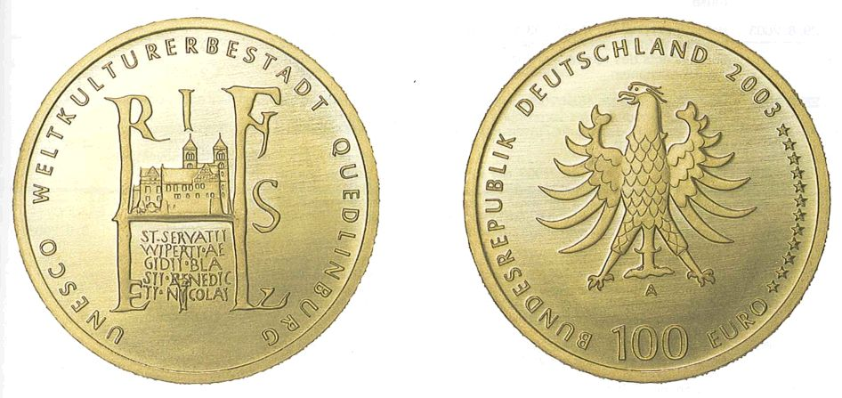

# Bekanntmachung über die Ausprägung von deutschen Euro-Gedenkmünzen im Nennwert von 100 Euro (Goldmünze "UNESCO Weltkulturerbestadt Quedlinburg") (Münz100EuroBek)

Ausfertigungsdatum
:   2003-09-09

Fundstelle
:   BGBl I: 2003, 1899

## (XXXX)

Gemäß den §§ 2, 4 und 5 des Münzgesetzes vom 16. Dezember 1999 (BGBl.
I S. 2402) hat die Bundesregierung beschlossen, zum Thema "UNESCO
Weltkulturerbestadt Quedlinburg" eine Gedenkmünze zu 100 Euro aus Gold
prägen zu lassen.
Die Auflage der Münze beträgt 400.000 Stück. Die Münze wird zu
gleichen Teilen in den Münzstätten in Berlin (Münzzeichen "A"),
München (Münzzeichen "D"), Stuttgart (Münzzeichen "F"), Karlsruhe
(Münzzeichen "G") und Hamburg (Münzzeichen "J") in
Stempelglanzausführung geprägt.
Die Münze wird ab dem 1. November 2003 in den Verkehr gebracht. Sie
besteht aus Gold mit einem Feingehalt von 999,9 Tausendteilen
(Feingold). Sie hat einen Durchmesser von 28 Millimetern und eine
Masse (Gewicht) von 15,55 Gramm. Der Münzrand ist geriffelt.
Die Bildseite der Münze weist auf die Geschichte der Zeit der
Stadtentstehung Quedlinburgs hin, indem in origineller Weise im oberen
Teil Elemente des Siegels Heinrich I. mit der Abbildung der
Stiftskirche aufgegriffen werden. Diese sind in gelungener Weise mit
dem unteren Teil des zentralen Schriftzeichens kombiniert, in dem die
Namen herausragender sakraler Bauten des Flächendenkmals Quedlinburg
Erwähnung finden. Die Bildseite trägt die Umschrift "UNESCO
WELTKULTURERBESTADT QUEDLINBURG".
Die Wertseite der Münze trägt einen Adler, zwölf Sterne, die
Jahreszahl 2003, das jeweilige Münzzeichen ("A", "D", "F", "G" oder
"J"), die Umschrift "BUNDESREPUBLIK DEUTSCHLAND" und die Wertangabe
"100 EURO".
Der Entwurf der Münze stammt von Agatha Kill, Köln.

## Schlussformel

Der Bundesminister der Finanzen

## (XXXX)

(Fundstelle: BGBl. I 2003, 1899)

