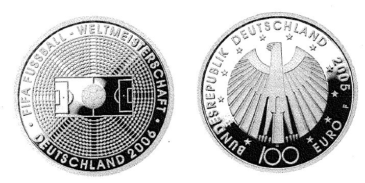

# Bekanntmachung über die Ausprägung von deutschen Euro-Gedenkmünzen im Nennwert von 100 Euro (Goldmünze "FIFA Fußball-Weltmeisterschaft in Deutschland 2006") (Münz100EuroBek 2005)

Ausfertigungsdatum
:   2005-08-11

Fundstelle
:   BGBl I: 2005, 2541

## (XXXX)

Gemäß den §§ 2, 4 und 5 des Münzgesetzes vom 16. Dezember 1999 (BGBl.
I S. 2402) hat die Bundesregierung beschlossen, zum Thema "FIFA
Fußball-Weltmeisterschaft in Deutschland 2006" eine Gedenkmünze zu 100
Euro aus Gold prägen zu lassen.
Die Auflage der Münze beträgt 350.000 Stück. Die Münze wird zu
gleichen Teilen in den Münzstätten Berlin (Münzzeichen "A"), München
(Münzzeichen "D"), Stuttgart (Münzzeichen "F"), Karlsruhe (Münzzeichen
"G") und Hamburg (Münzzeichen "J") in Stempelglanzausführung geprägt.
Die Münze wird ab dem 4. Oktober 2005 in den Verkehr gebracht. Sie
besteht aus Gold mit einem Feingehalt von 999,9 Tausendteilen
(Feingold). Sie hat einen Durchmesser von 28 Millimetern und eine
Masse (Gewicht) von 15,55 Gramm. Der Münzrand ist geriffelt.
Auf der Bildseite wird in bestechend einfacher Form das komplexe
Fußballgeschehen dargestellt. Im Mittelpunkt des Geschehens stehen
Ball und Spielfeld in einem vollbesetzten Stadion. Die Bildseite trägt
die Umschrift "FIFA FUSSBALL-WELTMEISTERSCHAFT
. DEUTSCHLAND 2006
.".
Der Entwurf der Bildseite stammt von Herrn Heinz Hoyer, Berlin. Der
Entwurf der Wertseite stammt von Herrn Erich Ott, München, und ist
identisch mit dem der WM-Silbermünzserie. Die Wertseite zeigt einen
Adler, den Schriftzug "BUNDESREPUBLIK DEUTSCHLAND", die zwölf Europa-
Sterne, die Wertziffer mit der Euro-Bezeichnung, die Jahreszahl 2005
sowie das jeweilige Münzzeichen ("A", "D", "F", "G" oder "J").

## Schlussformel

Der Bundesminister der Finanzen

## (XXXX)

(Fundstelle: BGBl. I 2005, 2541)

