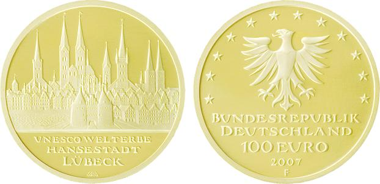

Bekanntmachung
---
Title: über die Ausprägung von deutschen Euro-Gedenkmünzen im Nennwert von 100 Euro
  (Goldmünze "UNESCO Welterbe — Hansestadt Lübeck")
jurabk: Münz100EuroBek 2007
layout: default
origslug: m_nz100eurobek_2007
slug: muenz100eurobek_2007

---

# über die Ausprägung von deutschen Euro-Gedenkmünzen im Nennwert von 100 Euro (Goldmünze "UNESCO Welterbe — Hansestadt Lübeck") (Münz100EuroBek 2007)

Ausfertigungsdatum
:   2007-09-07

Fundstelle
:   BGBl I: 2007, 2298

## (XXXX)

Gemäß den §§ 2, 4 und 5 des Münzgesetzes vom 16. Dezember 1999 (BGBl.
I S. 2402) hat die Bundesregierung beschlossen, zum Thema „UNESCO
Welterbe — Hansestadt Lübeck“ eine Gedenkmünze zu 100 Euro aus Gold
prägen zu lassen.

Die Auflage der Münze beträgt 330.000 Stück. Die Münze wird zu
gleichen Teilen in den Münzstätten Berlin (Münzzeichen „A“), München
(Münzzeichen „D“), Stuttgart (Münzzeichen „F“), Karlsruhe (Münzzeichen
„G“) und Hamburg (Münzzeichen „J“) in Stempelglanzausführung geprägt.

Die Münze wird ab dem 1. Oktober 2007 in den Verkehr gebracht. Sie
besteht aus Gold mit einem Feingehalt von 999,9 Tausendteilen
(Feingold). Sie hat einen Durchmesser von 28 Millimetern und eine
Masse (Gewicht) von 15,55 Gramm. Der Münzrand ist geriffelt.

Die Bildseite zeigt in künstlerisch überzeugender Weise sowohl die
Stadtsilhouette mit den charakteristischen sieben Türmen als auch die
feingliedrige städtebauliche Struktur der Bürgerhäuser. Das sonst als
Solitär bekannte Holstentor ist gut in das Gesamtensemble eingebunden.

Die Wertseite zeigt einen Adler, den Schriftzug „BUNDESREPUBLIK
DEUTSCHLAND“, die zwölf Europasterne, die Wertziffer mit der Euro-
Bezeichnung sowie die Jahreszahl „2007“ und — je nach Münzstätte — das
Münzzeichen „A“, „D“, „F“, „G“ oder „J“.

Der Entwurf der Münze stammt von Herrn Bodo Broschat, Berlin.

## Schlussformel

Der Bundesminister der Finanzen

## (XXXX)

(Fundstelle der Originalgrafik: BGBl. I 2007, 2298)

