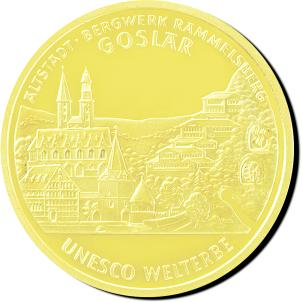

# Bekanntmachung über die Ausprägung von deutschen Euro-Gedenkmünzen im Nennwert von 100 Euro (Goldmünze „UNESCO Welterbe Altstadt Goslar – Bergwerk Rammelsberg“) (Münz100EuroBek 2008)

Ausfertigungsdatum
:   2008-08-25

Fundstelle
:   BGBl I: 2008, 1786

## (XXXX)

Gemäß den §§ 2, 4 und 5 des Münzgesetzes vom 16. Dezember 1999 (BGBl.
I S. 2402) hat die Bundesregierung beschlossen, zum Thema „UNESCO
Welterbe – Altstadt Goslar – Bergwerk Rammelsberg“ eine Gedenkmünze zu
100 Euro aus Gold prägen zu lassen.

Die Auflage der Münze beträgt 320 000 Stück. Die Münze wird zu
gleichen Teilen in den Münzstätten Berlin (Münzzeichen „A“), München
(Münzzeichen „D“), Stuttgart (Münzzeichen „F“), Karlsruhe (Münzzeichen
„G“) und Hamburg (Münzzeichen „J“) in Stempelglanzausführung geprägt.

Die Münze wird ab dem 1. Oktober 2008 in den Verkehr gebracht. Sie
besteht aus Gold mit einem Feingehalt von 999,9 Tausendteilen
(Feingold). Sie hat einen Durchmesser von 28 Millimetern und eine
Masse (Gewicht) von 15,55 Gramm. Der Münzrand ist geriffelt.

Die Bildseite zeigt in künstlerisch überzeugender Weise markante
Gebäude der Altstadt wie das Breite Tor, das Rathaus und die
Marktkirche, wobei auch die frühere Bedeutung des Erzbergwerks
Rammelsberg als wirtschaftliche Basis der Stadt integriert ist.

Die Wertseite zeigt einen Adler, den Schriftzug „BUNDESREPUBLIK
DEUTSCHLAND“, die zwölf Europa-Sterne, die Wertziffer mit der Euro-
Bezeichnung sowie die Jahreszahl „2008“ und – je nach Münzstätte – das
Münzzeichen „A“, „D“, „F“, „G“ oder „J“.

Der Entwurf der Münze stammt von Herrn Wolfgang Th. Doehm, Stuttgart.

## Schlussformel

Der Bundesminister der Finanzen

## (XXXX)

( Fundstelle: BGBl. I 2008, 1786 )

*    *        
    *        

