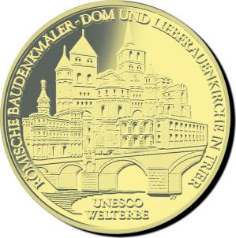
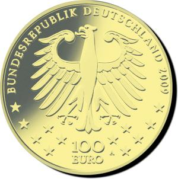

# Bekanntmachung über die Ausprägung von deutschen Euro-Gedenkmünzen im Nennwert von 100 Euro (Goldmünze „UNESCO Welterbe Römische Baudenkmäler - Dom und Liebfrauenkirche in Trier“) (Münz100EuroBek 2009-07-31)

Ausfertigungsdatum
:   2009-07-31

Fundstelle
:   BGBl I: 2009, 2995

## (XXXX)

Gemäß den §§ 2, 4 und 5 des Münzgesetzes vom 16. Dezember 1999 (BGBl.
I S. 2402) hat die Bundesregierung beschlossen, in Würdigung des
UNESCO Welterbes Römische Baudenkmäler – Dom und Liebfrauenkirche in
Trier eine Gedenkmünze zu 100 Euro aus Gold prägen zu lassen.

Die Auflage der Münze beträgt 320 000 Stück. Die Münze wird zu
gleichen Teilen in den Münzstätten Berlin (Münzzeichen „A“), München
(Münzzeichen „D“), Stuttgart (Münzzeichen „F“), Karlsruhe (Münzzeichen
„G“) und Hamburg (Münzzeichen „J“) in Stempelglanzausführung geprägt.

Die Münze wird ab dem 1. Oktober 2009 in den Verkehr gebracht. Sie
besteht aus Gold mit einem Feingehalt von 999,9 Tausendteilen
(Feingold). Sie hat einen Durchmesser von 28 Millimeter und eine Masse
(Gewicht) von 15,55 Gramm. Der Münzrand ist geriffelt.

Der Entwurf stammt von Herrn Michael Otto aus Rodenbach.

Dem Künstler ist es auf der Bildseite sehr gut gelungen, das Thema
„UNESCO Welterbe Römische Baudenkmäler – Dom und Liebfrauenkirche in
Trier“ in Komplexität und harmonischem Zusammenspiel darzustellen.

Die Dominanz von Dom und Liebfrauenkirche bei gleichzeitiger zeitlich-
historischer Anordnung der sieben Baudenkmäler überzeugt, wobei die
filigrane und realistische künstlerische Gestaltung hervorsticht. Der
Text umrundet harmonisch das Ensemble.

Die Darstellung des Adlers auf der gut gestalteten Wertseite ist einem
Hoheitssymbol angemessen und überzeugt.

Die Wertseite zeigt einen Adler, den Schriftzug „BUNDESREPUBLIK
DEUTSCHLAND“, die zwölf Europasterne, die Wertziffer mit der Euro-
Bezeichnung sowie die Jahreszahl „2009“ und – je nach Münzstätte – das
Münzzeichen „A“, „D“, „F“, „G“ oder „J“.\*

## Schlussformel

Der Bundesminister der Finanzen

## (XXXX)

(Fundstelle: BGBl. I 2009, 2995)

*    *        
    *        

