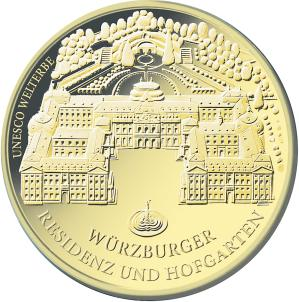

# Bekanntmachung über die Ausprägung von deutschen Euro-Gedenkmünzen im Nennwert von 100 Euro (Goldmünze „UNESCO Welterbe Würzburger Residenz und Hofgarten“) (Münz100EuroBek 2010)

Ausfertigungsdatum
:   2010-08-23

Fundstelle
:   BGBl I: 2010, 1243

## (XXXX)

Gemäß den §§ 2, 4 und 5 des Münzgesetzes vom 16. Dezember 1999 (BGBl.
I S. 2402) hat die Bundesregierung beschlossen, in Würdigung des
UNESCO Welterbes der Würzburger Residenz und Hofgarten eine
Gedenkmünze zu 100 Euro aus Gold prägen zu lassen.

Die Auflage der Münze beträgt 320 000 Stück. Die Münze wird zu
gleichen Teilen in den Münzstätten Berlin (Münzzeichen „A“), München
(Münzzeichen „D“), Stuttgart (Münzzeichen „F“), Karlsruhe (Münzzeichen
„G“) und Hamburg (Münzzeichen „J“) in Stempelglanzausführung geprägt.

Die Münze wird ab dem 1. Oktober 2010 in den Verkehr gebracht. Sie
besteht aus Gold mit einem Feingehalt von 999,9 Tausendteilen
(Feingold). Sie hat einen Durchmesser von 28 Millimeter und eine Masse
(Gewicht) von 15,55 Gramm.

Der Entwurf stammt von dem Künstler Dietrich Dorfstecher aus Berlin.

Die Münze besticht durch die realistische Darstellung des gesamten
UNESCO-Welterbes „Würzburger Residenz und Hofgarten“. Die barocken
Elemente Residenz und Hofgarten sind mustergültig künstlerisch
wiedergeben und auch der Residenzplatz mit dem 1894 errichteten
Brunnen der Frankonia, der Schutzheiligen Frankens, findet sich in
einer ausgewogenen Wertigkeit auf der Bildseite der Münze wieder. In
der Umsetzung als Goldmünze ergibt sich dabei ein klar strukturiertes,
in der Perspektive stimmiges Gesamtbild.

Auch die Wertseite spricht durch ihre klare Gestaltung an, die mit der
Bildseite in Einklang steht. Die würdige Darstellung des Bundesadlers
ist besonders hervorzuheben. Insgesamt stellt die Arbeit ein
künstlerisch anspruchsvolles Werk dar.

Die Wertseite zeigt einen Adler, den Schriftzug „BUNDESREPUBLIK
DEUTSCHLAND“, die zwölf Europasterne, die Wertziffer mit der Euro-
Bezeichnung sowie die Jahreszahl „2010“ und – je nach Münzstätte – das
Münzzeichen „A“, „D“, „F“, „G“ oder „J“.

Der Münzrand wird geriffelt ausgeführt.

## Schlussformel

Der Bundesminister der Finanzen

## (XXXX)

(Fundstelle: BGBl. I 2010, 1243)

*    *        
    *        

