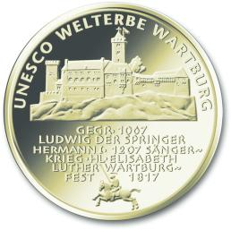
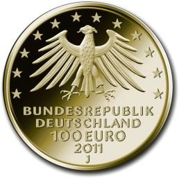

# Bekanntmachung über die Ausprägung von deutschen Euro-Gedenkmünzen im Nennwert von 100 Euro (Goldmünze „UNESCO Welterbe Wartburg“) (Münz100EuroBek 2011)

Ausfertigungsdatum
:   2011-10-07

Fundstelle
:   BGBl I: 2011, 2079

## (XXXX)

Gemäß den §§ 2, 4 und 5 des Münzgesetzes vom 16. Dezember 1999 (BGBl.
I S. 2402) hat die Bundesregierung am 30. November 2010 beschlossen,
in Würdigung des UNESCO Welterbes Wartburg eine Gedenkmünze zu 100
Euro aus Gold prägen zu lassen.

Die Auflage der Münze beträgt 300 000 Stück. Die Münze wird zu
gleichen Teilen in den Münzstätten Berlin (Münzzeichen „A“), München
(Münzzeichen „D“), Stuttgart (Münzzeichen „F“), Karlsruhe (Münzzeichen
„G“) und Hamburg (Münzzeichen „J“) in Stempelglanzausführung geprägt.

Die Münze wird ab dem 4. Oktober 2011 in den Verkehr gebracht. Sie
besteht aus Gold mit einem Feingehalt von 999,9 Tausendteilen
(Feingold). Sie hat einen Durchmesser von 28 Millimeter und eine Masse
(Gewicht) von 15,55 Gramm.

Der Entwurf stammt von dem Künstler Wolfgang Reuter aus Köln.

Das Motiv überzeugt durch die Gesamtansicht der Wartburg, dargestellt
als vom Wald umgebene Höhenburg mit einem deutlichen
Wiedererkennungswert. Ergänzt werden im unteren Teil der Bildseite
herausragende Eckdaten und Persönlichkeiten der Wartburggeschichte,
die zugleich Teil der Nationalgeschichte ist. Den unteren Abschluss
der spannungsvoll gestalteten Bildseite bildet als spielerischer
Kontrapunkt ein Ritter zu Pferd, der die ritterliche und höfische
Kultur als Element des Mittelalters symbolisiert.

Die Korrespondenz der Bild- und Wertseite entspricht sich im
zweitteiligen              Bildaufbau in hervorragender Weise. Die
Schrift im jeweils unteren Teil ist in der Größe und Klarheit gut
lesbar und unterstützt das Motiv. Der Adler ist kraftvoll gestaltet
und hat eine würdige Anmutung.

Die Wertseite zeigt einen Adler, den Schriftzug „BUNDESREPUBLIK
DEUTSCHLAND“, die zwölf Europasterne, die Wertziffer mit der Euro-
Bezeichnung sowie die Jahreszahl „2011“ und – je nach Münzstätte – das
Münzzeichen „A“, „D“, „F“, „G“ oder „J“.

Der Münzrand wird geriffelt ausgeführt.

## Schlussformel

Der Bundesminister der Finanzen

## (XXXX)

(Fundstelle: BGBl. I 2011, 2079)

*    *        
    *        

