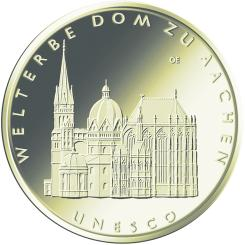
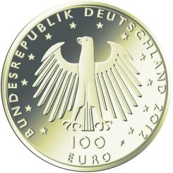

# Bekanntmachung über die Ausprägung von deutschen Euro-Gedenkmünzen im Nennwert von 100 Euro (Goldmünze „UNESCO Welterbe - Dom zu Aachen“) (Münz100EuroBek 2012)

Ausfertigungsdatum
:   2012-10-17

Fundstelle
:   BGBl I: 2012, 2174

## (XXXX)

Gemäß den §§ 2, 4 und 5 des Münzgesetzes vom 16. Dezember 1999 (BGBl.
I S. 2402) hat die Bundesregierung am 5. Oktober 2011 beschlossen, in
Würdigung des UNESCO Welterbes Dom zu Aachen eine Gedenkmünze zu 100
Euro aus Gold prägen zu lassen.

Die Auflage der Münze beträgt 270 000 Stück. Die Münze wird zu
gleichen Teilen in den Münzstätten Berlin (Münzzeichen „A“), München
(Münzzeichen „D“), Stuttgart (Münzzeichen „F“), Karlsruhe (Münzzeichen
„G“) und Hamburg (Münzzeichen „J“) in Stempelglanzausführung geprägt.

Die Münze wird ab dem 1. Oktober 2012 in den Verkehr gebracht. Sie
besteht aus Gold mit einem Feingehalt von 999,9 Tausendteilen
(Feingold), hat einen Durchmesser von 28 Millimetern und eine Masse
(Gewicht) von 15,55 Gramm.

Der Entwurf stammt von dem Künstler Erich Ott aus München.

Die Bildseite zeigt den Dom zu Aachen in seiner ganzen Breite und Höhe
bis an den Münzrand gesetzt. Die Darstellung überzeugt durch ihre
filigrane und plastisch differenzierte Ausführung. Die Schrift ist von
großer Klarheit, der Text ist sofort erkennbar.

Die Wertseite zeigt einen Adler, den Schriftzug „BUNDESREPUBLIK
DEUTSCHLAND“, die zwölf Europasterne, die Wertziffer mit der Euro-
Bezeichnung sowie die Jahreszahl „2012“ und – je nach Münzstätte – das
Münzzeichen „A“, „D“, „F“, „G“ oder „J“.

Der Münzrand wird geriffelt ausgeführt.

## Schlussformel

Der Bundesminister der Finanzen

## (XXXX)

(Fundstelle: BGBl. I S. 2174)

*    *        
    *        

