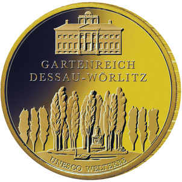
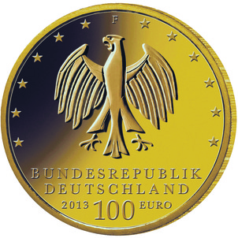

# Bekanntmachung über die Ausprägung von deutschen Euro-Gedenkmünzen im Nennwert von 100 Euro (Goldmünze „UNESCO Welterbe Gartenreich Dessau-Wörlitz“) (Münz100EuroBek 2014-02-28)

Ausfertigungsdatum
:   2014-02-28

Fundstelle
:   BGBl I: 2014, 252

## (XXXX)

Gemäß den §§ 2, 4 und 5 des Münzgesetzes vom 16. Dezember 1999 (BGBl.
I S. 2402) hat die Bundesregierung beschlossen, in Würdigung des
UNESCO Welterbes Gartenreich Dessau-Wörlitz eine Gedenkmünze zu 100
Euro aus Gold prägen zu lassen.

Die Auflage der Münze beträgt 200 000 Stück. Die Münze wird zu
gleichen Teilen in den Münzstätten Berlin (Münzzeichen „A“), München
(Münzzeichen „D“), Stuttgart (Münzzeichen „F“), Karlsruhe (Münzzeichen
„G“) und Hamburg (Münzzeichen „J“) in Stempelglanzausführung geprägt.

Die Münze wird ab dem 1. Oktober 2013 in den Verkehr gebracht. Sie
besteht aus Gold mit einem Feingehalt von 999,9 Tausendteilen
(Feingold), hat einen Durchmesser von 28 Millimetern und eine Masse
(Gewicht) von 15,55 Gramm.

Der Entwurf stammt von dem Künstler Lorenz Crössmann aus Berlin.

Die Bildseite zeigt die Rousseau-Insel und das Wörlitzer Landhaus.
Damit finden beide Elemente des Gartenreichs, Landschaft und
Architektur, ihre Berücksichtigung.

Die Wertseite zeigt einen Adler, den Schriftzug „BUNDESREPUBLIK
DEUTSCHLAND“, die zwölf Europasterne, die Wertziffer mit der Euro-
Bezeichnung sowie die Jahreszahl „2013“ und – je nach Münzstätte – das
Münzzeichen „A“, „D“, „F“, „G“ oder „J“.

Der Münzrand wird geriffelt ausgeführt.

## Schlussformel

Der Bundesminister der Finanzen

## (XXXX)

(Fundstelle: BGBl. I 2014, 252)

*    *        
    *        

