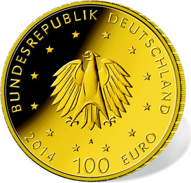

# Bekanntmachung über die Ausprägung von deutschen Euro-Gedenkmünzen im Nennwert von 100 Euro (Goldmünze „UNESCO Welterbe Kloster Lorsch“) (Münz100EuroBek 2015-06-23)

Ausfertigungsdatum
:   2015-06-23

Fundstelle
:   BGBl I: 2015, 1105

## (XXXX)

Gemäß den §§ 2, 4 und 5 des Münzgesetzes vom 16. Dezember 1999 (BGBl.
I S. 2402) hat die Bundesregierung beschlossen, in Würdigung des
UNESCO Welterbes Kloster Lorsch eine Gedenkmünze zu 100 Euro aus Gold
prägen zu lassen.

Die Auflage der Münze beträgt 200 000 Stück.
Die Münze              wird zu gleichen Teilen in den Münzstätten
Berlin (Münzzeichen „A“), München (Münzzeichen „D“), Stuttgart
(Münzzeichen „F“), Karlsruhe (Münzzeichen „G“) und Hamburg
(Münzzeichen „J“) in Stempelglanzausführung geprägt.

Die Münze wird ab dem 1. Oktober 2014 in den Verkehr gebracht. Sie
besteht aus Gold mit einem Feingehalt von 999,9 Tausendteilen
(Feingold), hat einen Durchmesser von 28 Millimetern und eine Masse
(Gewicht) von 15,55 Gramm.

Der Entwurf stammt von dem Künstler Frantisek Chochola aus Hamburg.

Die Bildseite zeigt die Westfassade der Torhalle vor einer
Urkundenabschrift aus dem „Lorscher Codex“, einem herausragenden
Beispiel Lorscher Schriftkultur.

Die Wertseite zeigt einen Adler, den Schriftzug „BUNDESREPUBLIK
DEUTSCHLAND“, die zwölf Europasterne, die Wertziffer mit der Euro-
Bezeichnung sowie die Jahreszahl „2014“ und – je nach Münzstätte – das
Münzzeichen „A“, „D“, „F“, „G“ oder „J“.

Der Münzrand wird geriffelt ausgeführt.

## Schlussformel

Der Bundesminister der Finanzen

## (XXXX)

(Fundstelle: BGBl. I 2015, 1105)

*    *        
    *        

