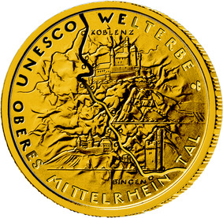
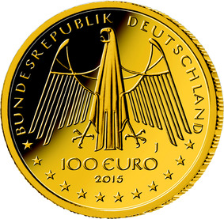

# Bekanntmachung über die Ausprägung von deutschen Euro-Gedenkmünzen im Nennwert von 100 Euro (Goldmünze „UNESCO Welterbe - Oberes Mittelrheintal“) (Münz100EuroBek 2016-04-04)

Ausfertigungsdatum
:   2016-04-04

Fundstelle
:   BGBl I: 2016, 748

## (XXXX)

Gemäß den §§ 2, 4 und 5 des Münzgesetzes vom 16. Dezember 1999 (BGBl.
I S. 2402) hat die Bundesregierung beschlossen, in Würdigung des
UNESCO Welterbes Oberes Mittelrheintal eine Gedenkmünze zu 100 Euro
aus Gold prägen zu lassen.

Die Auflage der Münze beträgt 163 000 Stück. Die Münze wird zu
gleichen Teilen in den Münzstätten Berlin (Münzzeichen „A“), München
(Münzzeichen „D“), Stuttgart (Münzzeichen „F“), Karlsruhe (Münzzeichen
„G“) und Hamburg (Münzzeichen „J“) in Stempelglanzausführung geprägt.

Die Münze wird ab dem 1. Oktober 2015 in den Verkehr gebracht. Sie
besteht aus Gold mit einem Feingehalt von 999,9 Tausendteilen
(Feingold), hat einen Durchmesser von 28 Millimetern und eine Masse
(Gewicht) von 15,55 Gramm.

Der Entwurf stammt von dem Künstler Friedrich Brenner aus Diedorf.

Die Bildseite zeigt – aus der Vogelperspektive betrachtet – das
Mittelrheintal zwischen Bingen/Rüdesheim und Koblenz. Kleinere Städte
und Gemeinden werden durch Punkte markiert. In eine plastisch sehr
interessant ausgeformte Landschaft ist der Verlauf des Flusses
eingegraben. An markanten Flussbiegungen sowohl auf Taunus- als auch
Hunsrückausläufern werden der Landschaft prägende Bauwerke
übergeordnet. Eine vertiefte Umschrift fasst diese ungewöhnlich
plastische Modellierung ein.

Die Wertseite zeigt einen Adler, den Schriftzug „BUNDESREPUBLIK
DEUTSCHLAND“, die zwölf Europasterne, die Wertziffer mit der Euro-
Bezeichnung sowie die Jahreszahl „2015“ und – je nach Münzstätte – das
Münzzeichen „A“, „D“, „F“, „G“ oder „J“.

Der Münzrand wird geriffelt ausgeführt.

## Schlussformel

Der Bundesminister der Finanzen

## (XXXX)

(Fundstelle: BGBl. I 2016, 748)

*    *        
    *        

