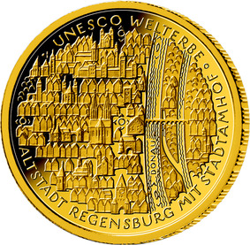

# Bekanntmachung über die Ausprägung von deutschen Euro-Gedenkmünzen im Nennwert von 100 Euro (Goldmünze „UNESCO Welterbe - Altstadt Regensburg mit Stadtamhof“) (Münz100EuroBek 2016-12-01)

Ausfertigungsdatum
:   2016-12-01

Fundstelle
:   BGBl I: 2016, 2983

## (XXXX)

Gemäß den §§ 2, 4 und 5 des Münzgesetzes vom 16. Dezember 1999 (BGBl.
I S. 2402) hat die Bundesregierung beschlossen, in Würdigung des
UNESCO Welterbes Altstadt Regensburg mit Stadtamhof eine Gedenkmünze
zu 100 Euro aus Gold prägen zu lassen.

Die Auflage der Münze beträgt ca. 150 000 Stück. Die Münze wird zu
gleichen Teilen in den Münzstätten Berlin (Münzzeichen „A“), München
(Münzzeichen „D“), Stuttgart (Münzzeichen „F“), Karlsruhe (Münzzeichen
„G“) und Hamburg (Münzzeichen „J“) in Stempelglanzausführung geprägt.

Die Münze wird ab dem 4. Oktober 2016 in den Verkehr gebracht. Sie
besteht aus Gold mit einem Feingehalt von 999,9 Tausendteilen
(Feingold), hat einen Durchmesser von 28 Millimetern und eine Masse
von 15,55 Gramm.

Der Entwurf stammt von dem Künstler Friedrich Brenner aus Diedorf.

Die Bildseite zeigt die Stadt am Fluss mit ihren Stadtteilen und
Inseln in einer Vogelperspektive, bei der die Häuser in einer
Fassadenansicht erscheinen und die wichtigsten Bauten akzentuiert
hervorgehoben sind. Die Darstellung verbindet die über 2 000-jährige
faszinierende Geschichte von Regensburg mit der Modernität der
Jetztzeit.

Die Wertseite zeigt einen Adler, den Schriftzug „BUNDESREPUBLIK
DEUTSCHLAND“, die zwölf Europasterne, die Wertziffer mit der Euro-
Bezeichnung sowie die Jahreszahl „2016“ und – je nach Münzstätte – das
Münzzeichen „A“, „D“, „F“, „G“ oder „J“.

Der Münzrand wird geriffelt ausgeführt.

## Schlussformel

Der Bundesminister der Finanzen

## (XXXX)

(Fundstelle: BGBl. I 2016, 2983)

*    *        
    *        

