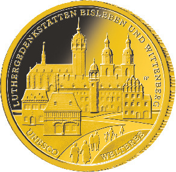
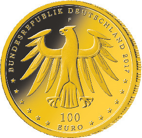

# Bekanntmachung über die Ausprägung von deutschen Euro-Gedenkmünzen im Nennwert von 100 Euro (Goldmünze „UNESCO Welterbe - Luthergedenkstätten Eisleben und Wittenberg“) (Münz100EuroBek 2017-10-23)

Ausfertigungsdatum
:   2017-10-23

Fundstelle
:   BGBl I: 2017, 3627

## (XXXX)

Gemäß den §§ 2, 4 und 5 des Münzgesetzes vom 16. Dezember 1999 (BGBl.
I S. 2402) hat die Bundesregierung beschlossen, in Würdigung des
UNESCO Welterbes Luthergedenkstätten Eisleben und Wittenberg eine
Gedenkmünze zu 100 Euro aus Gold prägen zu lassen.

Die Auflage der Münze beträgt ca. 160 000 Stück. Die Münze wird zu
gleichen Teilen in den Münzstätten Berlin (Münzzeichen „A“), München
(Münzzeichen „D“), Stuttgart (Münzzeichen „F“), Karlsruhe (Münzzeichen
„G“) und Hamburg (Münzzeichen „J“) in Stempelglanzausführung geprägt.

Die Münze wird ab dem 2. Oktober 2017 in den Verkehr gebracht. Sie
besteht aus Gold mit einem Feingehalt von 999,9 Tausendteilen
(Feingold), hat einen Durchmesser von 28 Millimetern und eine Masse
von 15,55 Gramm.

Der Entwurf stammt von dem Künstler Bastian Prillwitz aus Berlin.

Die Bildseite zeigt die sechs UNESCO-Welterbestätten mit den Eisleber
Stätten im Vordergrund und dem Lutherhaus als Lebensmittelpunkt des
Reformators im Zentrum. Über eine weitläufige Durchwegung werden die
Menschen zur Betrachtung und zur Beschäftigung mit dem Erbe
eingeladen.

Die Wertseite zeigt einen Adler, den Schriftzug „BUNDESREPUBLIK
DEUTSCHLAND“, die zwölf Europasterne, die Wertziffer mit der Euro-
Bezeichnung sowie die Jahreszahl „2017“ und – je nach Münzstätte – das
Münzzeichen „A“, „D“, „F“, „G“ oder „J“.

Der Münzrand wird geriffelt ausgeführt.

## Schlussformel

Der Bundesminister der Finanzen

## (XXXX)

*    *        
    *        

*    *
    *

