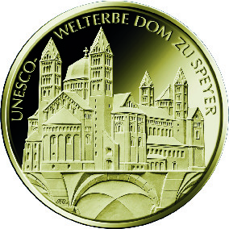

# Bekanntmachung über die Ausprägung von deutschen Euro-Gedenkmünzen im Nennwert von 100 Euro (Goldmünze „UNESCO Welterbe Dom zu Speyer“) (Münz100EuroBek 2019-10-08)

Ausfertigungsdatum
:   2019-10-08

Fundstelle
:   BGBl I: 2019, 1541

## (XXXX)

Gemäß den §§ 2, 4 und 5 des Münzgesetzes vom 16. Dezember 1999 (BGBl.
I S. 2402) hat die Bundesregierung beschlossen, in Würdigung des
UNESCO Welterbes Dom zu Speyer, eine Gedenkmünze zu 100 Euro aus Gold
prägen zu lassen.

Die Auflage der Münze beträgt maximal 175 000 Stück. Die Münze wird zu
gleichen Teilen in den Münzstätten Berlin (Münzzeichen „A“), München
(Münzzeichen „D“), Stuttgart (Münzzeichen „F“), Karlsruhe (Münzzeichen
„G“) und Hamburg (Münzzeichen „J“) in Stempelglanzausführung geprägt.

Die Münze wird ab dem 1. Oktober 2019 in den Verkehr gebracht. Sie
besteht aus Gold mit einem Feingehalt von 999,9 Tausendteilen
(Feingold), hat einen Durchmesser von 28 Millimetern und eine Masse
von 15,55 Gramm.

Die Bildseite zeigt das charakteristische „Gebirge“ aus Türmen,
Kuppeln und Apsis. Im unteren Viertel der Münze wird ein
Kreuzgratgewölbe aus der größten romanischen Hallenkrypta dargestellt.

Die Wertseite zeigt einen Adler, den Schriftzug „BUNDESREPUBLIK
DEUTSCHLAND“, die zwölf Europasterne, die Wertziffer mit der Euro-
Bezeichnung sowie die Jahreszahl „2019“ und – je nach Münzstätte – das
Münzzeichen „A“, „D“, „F“, „G“ oder „J“.

Der Münzrand wird geriffelt ausgeführt.

Der Entwurf stammt von dem Künstler Bodo Broschat aus Berlin.

## Schlussformel

Der Bundesminister der Finanzen

## (XXXX)

(Fundstelle: BGBl. I 2019, 1541)

*    *        
    *        

