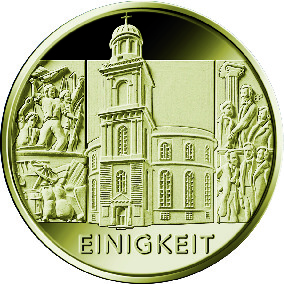
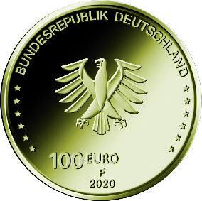

# Bekanntmachung über die Ausprägung von deutschen Euro-Gedenkmünzen im Nennwert von 100 Euro (Goldmünze „Einigkeit“) (Münz100EuroBek 2021-02-08)

Ausfertigungsdatum
:   2021-02-08

Fundstelle
:   BGBl I: 2021, 256

## (XXXX)

Gemäß den §§ 2, 4 und 5 des Münzgesetzes vom 16. Dezember 1999 (BGBl.
I S. 2402) hat die Bundesregierung beschlossen, eine 100-Euro-
Goldmünze „Einigkeit“ prägen zu lassen. Die Münze bildet den Auftakt
einer dreiteiligen Serie „Säulen der Demokratie“.

Die Auflage der Münze beträgt maximal 180 000 Stück. Die Münze wird zu
gleichen Teilen in den Münzstätten Berlin (Münzzeichen „A“), München
(Münzzeichen „D“), Stuttgart (Münzzeichen „F“), Karlsruhe (Münzzeichen
„G“) und Hamburg (Münzzeichen „J“) in Stempelglanzausführung geprägt.

Die Münze wird ab dem 1. Oktober 2020 in den Verkehr gebracht. Sie
besteht aus Gold mit einem Feingehalt von 999,9 Tausendteilen
(Feingold), hat einen Durchmesser von 28 Millimetern und eine Masse
von 15,55 Gramm.

Die Bildseite zeigt die Frankfurter Paulskirche. Wie kein anderer Ort
symbolisiert die Kirche bis heute das Streben der deutschen Nation
nach nationaler Einheit in demokratischer Freiheit. Das Gebäude wird
dabei von den Barrikadenkämpfen des März 1848 und den Beratungen der
Nationalversammlung flankiert.

Die Wertseite zeigt einen Adler, den Schriftzug „BUNDESREPUBLIK
DEUTSCHLAND“, die zwölf Europasterne, die Wertziffer mit der Euro-
Bezeichnung sowie die Jahreszahl „2020“ und – je nach Münzstätte – das
Münzzeichen „A“, „D“, „F“, „G“ oder „J“.

Der Münzrand wird geriffelt ausgeführt.

Der Entwurf der Bildseite stammt von dem Künstler Bastian Prillwitz
aus Berlin. Die Wertseite, die für alle Münzen der Serie verwendet
wird, wurde von dem Künstler Andre Witting aus Berlin gestaltet.

## Schlussformel

Der Bundesminister der Finanzen

## (XXXX)

(Fundstelle: BGBl. I 2021, 256)

*    *        
    *        

*    *
    *

