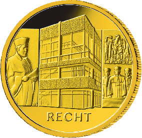
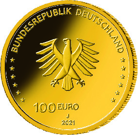

# Bekanntmachung über die Ausprägung von deutschen Euro-Gedenkmünzen im Nennwert von 100 Euro (Goldmünze „Recht“) (Münz100EuroBek 2021-09-15)

Ausfertigungsdatum
:   2021-09-15

Fundstelle
:   BGBl I: 2021, 4647

## XXXX

Gemäß den §§ 2, 4 und 5 des Münzgesetzes vom 16. Dezember 1999 (BGBl.
I S. 2402) hat die Bundesregierung beschlossen, eine 100-Euro-
Goldmünze „Recht“ prägen zu lassen. Diese Münze ist die zweite Ausgabe
der im Jahr 2020 begonnenen Serie „Säulen der Demokratie“ (2020 bis
2022, eine Ausgabe pro Jahr). Die Münze wird ab dem 1. Oktober 2021 in
den Verkehr gebracht.

Die Auflage der Münze beträgt maximal 180 000 Stück. Die Münze wird zu
gleichen Teilen in den Münzstätten Berlin (Münzzeichen „A“), München
(Münzzeichen „D“), Stuttgart (Münzzeichen „F“), Karlsruhe (Münzzeichen
„G“) und Hamburg (Münzzeichen „J“) in Stempelglanzausführung geprägt.

Sie besteht aus Gold mit einem Feingehalt von 999,9 Tausendteilen
(Feingold), hat einen Durchmesser von 28 Millimetern und eine Masse
von 15,55 Gramm.

Die Bildseite zeigt die Fassade des Bundesverfassungsgerichts und
gleichzeitig das Innere des Sitzungsraumes mit exemplarischer
Darstellung einer Urteilsverkündung unter dem markanten hölzernen
Adler. Das Bundesverfassungsgericht mit Sitz in Karlsruhe steht für
die Rechtsstaatlichkeit in Deutschland.

Die Wertseite zeigt einen Adler, den Schriftzug „BUNDESREPUBLIK
DEUTSCHLAND“, die zwölf Europasterne, die Wertziffer mit der Euro-
Bezeichnung sowie die Jahreszahl „2021“ und – je nach Münzstätte – das
Münzzeichen „A“, „D“, „F“, „G“ oder „J“.

Der Münzrand wird geriffelt ausgeführt.

Der Entwurf der Bildseite stammt von dem Künstler Bastian Prillwitz
aus Berlin. Die Wertseite, die für alle Münzen der Serie verwendet
wird, wurde von dem Künstler Andre Witting aus Berlin gestaltet.

## Schlussformel

Der Bundesminister der Finanzen

## XXXX

(Fundstelle: BGBl. I 2021, 4647)

*    *        
    *        

