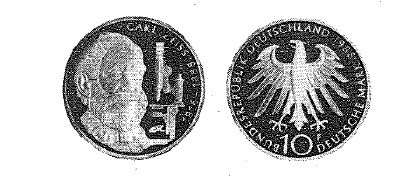

# Bekanntmachung über die Ausprägung von Bundesmünzen im Nennwert von 10 Deutschen Mark (Gedenkmünze Carl Zeiss) (Münz10DMBek 1988-10)

Ausfertigungsdatum
:   1988-10-10

Fundstelle
:   BGBl I: 1988, 2072

## (XXXX)

(1) Auf Grund des § 6 des Gesetzes über die Ausprägung von
Scheidemünzen in der im Bundesgesetzblatt Teil III, Gliederungsnummer
690-1, veröffentlichten bereinigten Fassung hat die Bundesregierung
beschlossen, zum 100. Todestag von Carl Zeiss im Jahre 1988 eine
Bundesmünze (Gedenkmünze) im Nennwert von 10 Deutschen Mark prägen zu
lassen. Die Auflage der Münze beträgt 8,35 Millionen Stück. Die
Prägung erfolgt in der Staatlichen Münze Stuttgart.

(2) Die Münze wird ab 23. November 1988 in den Verkehr gebracht.

(3) Die Münze besteht aus einer Legierung von 625 Tausendteilen Silber
und 375 Tausendteilen Kupfer. Sie hat einen Durchmesser von 32,5
Millimetern und ein Gewicht von 15,5 Gramm.

(4) Das Gepräge auf beiden Seiten ist erhaben und wird von einem
schützenden glatten Randstab umgeben.

(5) Die Bildseite zeigt das Porträt von Carl Zeiss und - als Hinweis
auf dessen Bedeutung für die Entwicklung der Optik - ein Mikroskop
sowie die Umschrift:

*
    *   "CARL ZEISS

        1816 - 1888".

(6) Die Wertseite trägt einen Adler, die Jahreszahl 1988, das
Münzzeichen "F" der Staatlichen Münze Stuttgart und die Umschrift:

*   "BUNDESREPUBLIK DEUTSCHLAND

    *   10 DEUTSCHE MARK".

(7) Die Jahreszahl 1988 befindet sich in der Umschrift rechts neben
dem Wort "DEUTSCHLAND". Das Münzzeichen "F" steht unter dem linken
Fang des Adlers.

(8) Der glatte Münzrand enthält in vertiefter Prägung die Inschrift:

*   "OPTIK FÜR WISSENSCHAFT UND TECHNIK".

(9) Zwischen Ende und Anfang der Randschrift ist ein fünfeckiger Stern
eingeprägt.

(10) Der Entwurf der Münze stammt von Carl Vezerfi-Clemm, München.
Der Bundesminister der Finanzen

## (XXXX) Abbildung der Münze

(Fundstelle: BGBl. I 1988, 2072)

