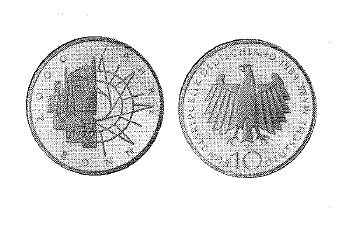

# Bekanntmachung über die Ausprägung von Bundesmünzen im Nennwert von 10 Deutschen Mark (Gedenkmünze 2000 Jahre Bonn) (Münz10DMBek 1989-08)

Ausfertigungsdatum
:   1989-08-10

Fundstelle
:   BGBl I: 1989, 1592

## (XXXX)

Auf Grund des § 6 des Gesetzes über die Ausprägung von Scheidemünzen
in der im Bundesgesetzblatt Teil III, Gliederungsnummer 690-1,
veröffentlichten bereinigten Fassung hat die Bundesregierung
beschlossen, zur 2000-Jahr-Feier der Stadt Bonn im Jahre 1989 eine
Bundesmünze (Gedenkmünze) im Nennwert von 10 Deutschen Mark prägen zu
lassen. Die Auflage der Münze beträgt 8,35 Millionen Stück. Die
Prägung erfolgt im Bayerischen Hauptmünzamt München.
Die Münze wird ab 20. September 1989 in den Verkehr gebracht.
Die Münze besteht aus einer Legierung von 625 Tausendteilen Silber und
375 Tausendteilen Kupfer. Sie hat einen Durchmesser von 32,5
Millimetern und ein Gewicht von 15,5 Gramm.
Das Gepräge auf beiden Seiten ist erhaben und wird von einem
schützenden glatten Randstab umgeben.
Auf der Bildseite befinden sich links bauliche Zeugnisse der Bonner
Stadtgeschichte (römischer Grabstein, Rathaus, Münster, kurfürstliches
Schloß, Villa Hammerschmidt und die Godesburg), rechts eine Chiffre
von Stadtplanung.
Die Umschrift lautet:

*
    *
        *   "2000 JAHRE BONN".

Die Wertseite trägt einen Adler, die Jahreszahl 1989, das Münzzeichen
"D" des Bayerischen Hauptmünzamts München und die Umschrift:

##

*    *   "BUNDESREPUBLIK DEUTSCHLAND 10 DEUTSCHE MARK".

Die Jahreszahl 1989 ist Teil der Umschrift. Das Münzzeichen "D"
befindet sich unter den Schwanzfedern des Adlers.
Der glatte Münzrand enthält in vertiefter Prägung die Inschrift:

*
    *
        *   "BONN BLÜHE UND BLEIBE".

Zwischen Ende und Anfang der Randschrift ist eine liegende Raute
eingeprägt.
Der Entwurf der Münze stammt von Paul Effert, Kaarst.
Der Bundesminister der Finanzen

## (XXXX)

(Fundstelle: BGBl. I 1989, 1592)

