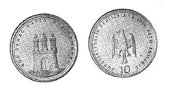

# Bekanntmachung über die Ausprägung von Bundesmünzen im Nennwert von 10 Deutschen Mark (Gedenkmünze 800 Jahre Hafen und Hamburg) (Münz10DMBek 1989-10)

Ausfertigungsdatum
:   1989-10-05

Fundstelle
:   BGBl I: 1989, 1841

## (XXXX)

(1) Auf Grund des § 6 des Gesetzes über die Ausprägung von
Scheidemünzen in der im Bundesgesetzblatt Teil III, Gliederungsnummer
690-1, veröffentlichten bereinigten Fassung hat die Bundesregierung
beschlossen, zum 800jährigen Bestehen des Hamburger Hafens im Jahre
1989 eine Bundesmünze (Gedenkmünze) im Nennwert von 10 Deutschen Mark
prägen zu lassen. Die Auflage der Münze beträgt 8,35 Millionen Stück.
Die Prägung erfolgt in der Hamburgischen Münze.

(2) Die Münze wird ab 8. November 1989 in den Verkehr gebracht.

(3) Die Münze besteht aus einer Legierung von 625 Tausendteilen Silber
und 375 Tausendteilen Kupfer. Sie hat einen Durchmesser von 32,5
Millimetern und ein Gewicht von 15,5 Gramm.

(4) Das Gepräge auf beiden Seiten ist erhaben und wird von einem
schützenden glatten Randstab umgeben.

(5) Die Bildseite zeigt in Anlehnung an das Hamburger Wappen die
hamburgische Burg am Wasser.
Die Umschrift lautet:

*
    *   "800 JAHRE HAFEN UND HAMBURG".

(6) Die Wertseite trägt einen Adler, die Jahreszahl 1989, das
Münzzeichen "J" der Hamburgischen Münze und die Umschrift:

*
    *   "BUNDESREPUBLIK DEUTSCHLAND

        *   10 DEUTSCHE MARK".

(7) Die Jahreszahl 1989 ist Teil der Umschrift. Das Münzzeichen "J"
befindet sich im Feld zwischen Adler und dem Wort "DEUTSCHE".

(8) Der glatte Münzrand enthält in vertiefter Prägung die Inschrift:

*
    *   "HAMBURG TOR ZUR WELT".

(9) Die einzelnen Worte der Randschrift sind durch das stilisierte
Bild der hamburgischen Burg voneinander getrennt. Zwischen Ende und
Anfang der Randschrift ist dieses Bild zweifach eingeprägt.

(10) Der Entwurf der Münze stammt von Klaus Luckey, Hamburg.
Der Bundesminister der Finanzen

## (XXXX) Abbildung der Münze

(Fundstelle: BGBl. I 1989, 1841)

