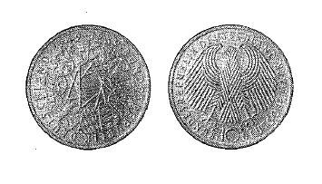

# Bekanntmachung über die Ausprägung von Bundesmünzen im Nennwert von 10 Deutschen Mark (Gedenkmünze 40 Jahre Bundesrepublik Deutschland) (Münz10DMBek 1989)

Ausfertigungsdatum
:   1989-03-30

Fundstelle
:   BGBl I: 1989, 658

## (XXXX)

(1) Auf Grund des § 6 des Gesetzes über die Ausprägung von
Scheidemünzen in der im Bundesgesetzblatt Teil III, Gliederungsnummer
690-1, veröffentlichten bereinigten Fassung hat die Bundesregierung
beschlossen, zum 40jährigen Bestehen der Bundesrepublik Deutschland im
Jahre 1989 eine Bundesmünze (Gedenkmünze) im Nennwert von 10 Deutschen
Mark prägen zu lassen. Die Auflage der Münze beträgt 8,35 Millionen
Stück. Die Prägung erfolgt in der Staatlichen Münze Karlsruhe.

(2) Die Münze wird ab 17. Mai 1989 in den Verkehr gebracht.

(3) Die Münze besteht aus einer Legierung von 625 Tausendteilen Silber
und 375 Tausendteilen Kupfer. Sie hat einen Durchmesser von 32,5
Millimetern und ein Gewicht von 15,5 Gramm.

(4) Das Gepräge auf beiden Seiten ist erhaben und wird von einem
schützenden glatten Randstab umgeben.

(5) Die Bildseite zeigt die Wappen der 11 Bundesländer, die
kreisförmig angeordnet und durch Seile miteinander verbunden sind. Die
Anordnung der Seile läßt in der Mitte die Zahl 40 erkennen.
Die Umschrift lautet:

*   "BUNDESREPUBLIK DEUTSCHLAND

    *   - 1949 - 1989 -".

(6) Die Wertseite trägt einen Adler, die Jahreszahl 1989, das
Münzzeichen "G" der Staatlichen Münze Karlsruhe und die Umschrift:

*   "BUNDESREPUBLIK DEUTSCHLAND

    *   10 DEUTSCHE MARK".

(7) Die Jahreszahl ist - unterteilt in "19" und "89" - beiderseits der
Wertziffer 10 angebracht. Das Münzzeichen "G" steht neben dem rechten
Fang des Adlers.

(8) Der glatte Münzrand enthält in vertiefter Prägung die Inschrift:

*   "40 JAHRE FRIEDEN UND FREIHEIT".

(9) Zwischen Ende und Anfang der Randschrift ist ein fünfeckiger Stern
eingeprägt.

(10) Der Entwurf der Münze stammt von Reinhart Heinsdorff, Ottmaring.
Der Bundesminister der Finanzen

## (XXXX) Abbildung der Münze

(Fundstelle: BGBl. I 1989, 658)

