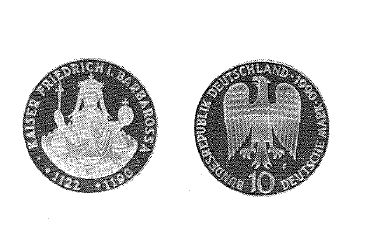

# Bekanntmachung über die Ausprägung von Bundesmünzen im Nennwert von 10 Deutschen Mark (Gedenkmünze Kaiser Friedrich I. Barbarossa) (Münz10DMBek 1990)

Ausfertigungsdatum
:   1990-04-24

Fundstelle
:   BGBl I: 1990, 860

## (XXXX)

(1) Auf Grund des § 6 des Gesetzes über die Ausprägung von
Scheidemünzen in der im Bundesgesetzblatt Teil III, Gliederungsnummer
690-1, veröffentlichten bereinigten Fassung hat die Bundesregierung
beschlossen, zum 800. Todestag von Kaiser Friedrich I. Barbarossa im
Jahre 1990 eine Bundesmünze (Gedenkmünze) im Nennwert von 10 Deutschen
Mark prägen zu lassen. Die Auflage der Münze beträgt 7,85 Millionen
Stück. Die Prägung erfolgt in der Staatlichen Münze Stuttgart.

(2) Die Münze wird ab 8. Juni 1990 in den Verkehr gebracht.

(3) Die Münze besteht aus einer Legierung von 625 Tausendteilen Silber
und 375 Tausendteilen Kupfer. Sie hat einen Durchmesser von 32,5
Millimetern und ein Gewicht von 15,5 Gramm.

(4) Das Gepräge auf beiden Seiten ist erhaben und wird von einem
schützenden glatten Randstab umgeben.

(5) Die Bildseite zeigt Kaiser Friedrich I. Barbarossa nach einer
zeitgenössischen Darstellung.
Die Umschrift lautet:

*
    *   ". KAISER FRIEDRICH I. BARBAROSSA .

        *
            *
                *
                    *
                        * 1122 + 1190".

(6) Die Wertseite trägt einen Adler, die Jahreszahl 1990, das
Münzzeichen "F" der Staatlichen Münze Stuttgart und die Umschrift:

*
    *   "BUNDESREPUBLIK DEUTSCHLAND

        *   10 DEUTSCHE MARK".

(7) Die Jahreszahl 1990 ist Teil der Umschrift. Das Münzzeichen "F"
befindet sich im Feld zwischen dem linken Fang des Adlers und dem Wort
"DEUTSCHE".

(8) Der glatte Münzrand enthält in vertiefter Prägung die Inschrift:

*
    *   "HONOR IMPERII".

(9) Zwischen Ende und Anfang der Randschrift sind drei stilisierte
Stauferadler eingeprägt.

(10) Der Entwurf der Münze stammt von Eugen Ruhl, Pforzheim.

## (XXXX) Abbildung der Münze

(Fundstelle: BGBl. I 1990, 860)

