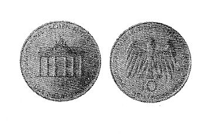

# Bekanntmachung über die Ausprägung von Bundesmünzen im Nennwert von 10 Deutschen Mark (Gedenkmünze 200 Jahre Brandenburger Tor) (Münz10DMBek 1991-11)

Ausfertigungsdatum
:   1991-11-07

Fundstelle
:   BGBl I: 1991, 2134

## (XXXX)

(1) Auf Grund des § 6 des Gesetzes über die Ausprägung von
Scheidemünzen in der im Bundesgesetzblatt Teil III, Gliederungsnummer
690-1, veröffentlichten bereinigten Fassung hat die Bundesregierung
beschlossen, zum 200jährigen Bestehen des Brandenburger Tores eine
Bundesmünze (Gedenkmünze) im Nennwert von 10 Deutschen Mark prägen zu
lassen. Die Auflage der Münze beträgt 8,85 Millionen Stück. Die
Prägung erfolgt in der Münze Berlin.

(2) Die Münze wird ab 18. Dezember 1991 in den Verkehr gebracht.

(3) Die Münze besteht aus einer Legierung von 625 Tausendteilen Silber
und 375 Tausendteilen Kupfer. Sie hat einen Durchmesser von 32,5
Millimetern und ein Gewicht von 15,5 Gramm.

(4) Das Gepräge auf beiden Seiten ist erhaben und wird von einem
schützenden glatten Randstab umgeben.

(5) Die Bildseite zeigt eine Darstellung des Brandenburger Tores und
darunter die Jahreszahlen
1791/1991. Die Umschrift lautet:

*
    *   ". DAS BRANDENBURGER TOR .

        SYMBOL DER DEUTSCHEN EINHEIT".

(6) Die Wertseite trägt einen Adler, die Wertzahl "10", die Jahreszahl
"1991", das Münzzeichen "A" der Münze Berlin und die Umschrift:

*
    *   ". BUNDESREPUBLIK DEUTSCHLAND .

        DEUTSCHE MARK".

Die Jahreszahl 1991 ist Teil der Umschrift.

(7) Der glatte Münzrand enthält in vertiefter Prägung die Inschrift:

*
    *   "DEUTSCHLAND EINIG VATERLAND".

(8) Zwischen Ende und Anfang der Randschrift befinden sich drei
fünfzackige Sterne.

(9) Der Entwurf der Münze stammt von Erich Ott, München.

## Schlußformel

Der Bundesminister der Finanzen

## (XXXX) Abbildung der Münze

(Fundstelle: BGBl. I 1991, 2134)

