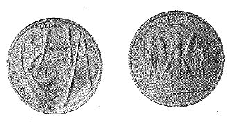

# Bekanntmachung über die Ausprägung von Bundesmünzen im Nennwert von 10 Deutschen Mark (Gedenkmünze 800 Jahre Deutscher Orden) (Münz10DMBek 1991)

Ausfertigungsdatum
:   1991-06-19

Fundstelle
:   BGBl I: 1991, 1511

## (XXXX)

Auf Grund des § 6 des Gesetzes über die Ausprägung von Scheidemünzen
in der im Bundesgesetzblatt Teil III, Gliederungsnummer 690-1,
veröffentlichten bereinigten Fassung hat die Bundesregierung
beschlossen, zum 800. Jahrestag der Gründung des Deutschen Ordens eine
Bundesmünze (Gedenkmünze) im Nennwert von 10 Deutschen Mark prägen zu
lassen. Die Auflage der Münze beträgt 8,85 Millionen Stück. Die
Prägung erfolgt in der Hamburgischen Münze.
Die Münze wird ab 4. September 1991 in den Verkehr gebracht.
Die Münze besteht aus einer Legierung von 625 Tausendteilen Silber und
375 Tausendteilen Kupfer. Sie hat einen Durchmesser von 32,5
Millimetern und ein Gewicht von 15,5 Gramm.
Das Gepräge auf beiden Seiten ist erhaben und wird von einem
schützenden glatten Randstab umgeben.
Die Bildseite zeigt eine mittelalterliche Deutschordensfahne mit der
Hauptpatronin des Ordens, der gekrönten Mutter Gottes mit Kind auf dem
Arm, sowie den Wappenschild des Ordens. Die Umschrift lautet:

*   "800 JAHRE DEUTSCHER ORDEN 1190 - 1990".

Die Wertseite trägt einen Adler, die Jahreszahl 1990, das Münzzeichen
"J" der Hamburgischen Münze und die Umschrift:

*   "BUNDESREPUBLIK DEUTSCHLAND

    *   10 DEUTSCHE MARK",

wobei die Zahl 10 zwischen dem Wort Deutsche und dem Wort Mark steht.
Die Jahreszahl "1990" und das Münzzeichen "J" sind Teil der Umschrift.
Das Münzzeichen befindet sich zwischen der Jahreszahl und dem Wort
"Deutschland".
Der glatte Münzrand enthält in vertiefter Prägung die Inschrift:

*   "ES BLEIB IN GEDÄCHTNIS SO LANG GOTT WILL".

Zwischen Ende und Anfang der Randschrift befindet sich ein zweifaches
Eichenblatt nebst zwei Eicheln.
Der Entwurf der Münze stammt von Hubert Klinkel, Zell am Main.
Der Bundesminister der Finanzen

## (XXXX) Abbildung der Münze

(Fundstelle: BGBl. I 1991, 1511)

