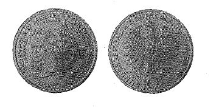

# Bekanntmachung über die Ausprägung von Bundesmünzen im Nennwert von 10 Deutschen Mark (Gedenkmünze 150. Jahrestag der Friedensklasse des Ordens Pour le merite für Wissenschaften und Künste) (Münz10DMBek 1992-11)

Ausfertigungsdatum
:   1992-09-25

Fundstelle
:   BGBl I: 1992, 1880

## (XXXX)

Auf Grund des § 6 des Gesetzes über die Ausprägung von Scheidemünzen
in der im Bundesgesetzblatt Teil III, Gliederungsnummer 690-1,
veröffentlichten bereinigten Fassung hat die Bundesregierung
beschlossen, zum 150. Jahrestag der Friedensklasse des Ordens Pour le
merite für Wissenschaften und Künste eine Bundesmünze (Gedenkmünze) im
Nennwert von 10 Deutschen Mark prägen zu lassen. Die Auflage der Münze
beträgt 8,45 Millionen Stück. Die Prägung erfolgt im Bayerischen
Hauptmünzamt in München.
Die Münze wird ab 9. Dezember 1992 in den Verkehr gebracht.
Die Münze besteht aus einer Legierung von 625 Tausendteilen Silber und
375 Tausendteilen Kupfer. Sie hat einen Durchmesser von 32,5
Millimetern und ein Gewicht von 15,5 Gramm.
Das Gepräge auf beiden Seiten ist erhaben und wird von einem
schützenden glatten Randstab umgeben.
Die Bildseite zeigt das Ordenszeichen und ein Portrait von Alexander
von Humboldt. Die Umschrift lautet:

*    *   "ORDEN POUR LE MERITE FÜR WISSENSCHAFTEN UND KÜNSTE A. v. HUMBOLDT 1.
        KANZLER DES ORDENS 1842 - 1992".

Die Wertseite trägt einen Adler, die Jahreszahl "1992", das
Münzzeichen "D" des Bayerischen Hauptmünzamtes und die Umschrift:

*    *   "BUNDESREPUBLIK DEUTSCHLAND 10 DEUTSCHE MARK".

Die Jahreszahl "1992" und das Münzzeichen "D" befinden sich im Feld
zwischen Adlerfängen und Umschrift.
Der glatte Münzrand enthält in vertiefter Prägung die Inschrift:
"GEMEINSCHAFT VON GELEHRTEN UND KÜNSTLERN".
Zwischen Ende und Anfang der Randschrift ist eine liegende Raute
eingeprägt.
Der Entwurf der Münze stammt von Werner Godec, Pforzheim.
Der Bundesminister der Finanzen

## (XXXX) Abbildung der Münze

(Fundstelle: BGBl. I 1992, 1880)

